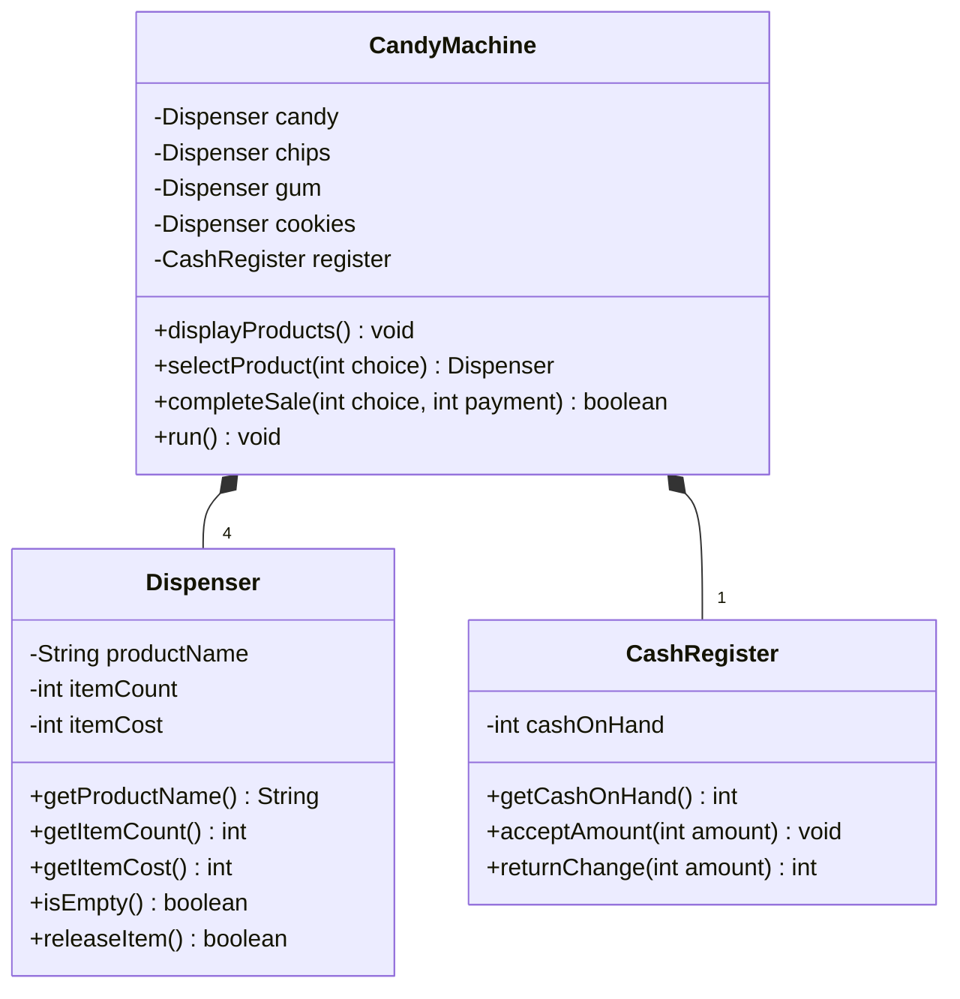

# Tutorial 3 - ADTs Answers

## Question 1 - Candy machine ADTs

### (a) Instance variables

- `Dispenser`: `productName`, `itemCount`, `itemCost`.
- `CashRegister`: `cashOnHand`.
- `CandyMachine`: four `Dispenser` objects (`candy`, `chips`, `gum`, `cookies`) and one
  `CashRegister`.

### (b) Operations

- `Dispenser`: getters for product/cost/count, `isEmpty()`, and `releaseItem()`.
- `CashRegister`: `acceptAmount(int amount)` and `returnChange(int amount)`.
- `CandyMachine`: `displayProducts()`, `selectProduct(int choice)`,
  `completeSale(int choice, int payment)`, and `run()`.

### (c) UML class diagram



`completeSale` validates the selection, checks stock, displays the price, accepts enough money,
adds the item cost to the register, returns `payment - cost`, and calls `releaseItem()`.

## Question 2 - Bid interfaces

```java
public interface BidInterface {
    /** Returns the bidding company name. Pre: none. Post: object is unchanged. */
    String getCompanyName();

    /** Returns the offered AC description. Pre: none. Post: object is unchanged. */
    String getDescription();

    /** Returns capacity in tons. Pre: none. Post: result is positive. */
    double getCapacityTons();

    /** Returns the seasonal energy-efficiency ratio. */
    double getSEER();

    /** Returns the unit cost in currency units. */
    double getUnitCost();

    /** Returns the installation cost in currency units. */
    double getInstallationCost();

    /** Returns the estimated yearly operating cost. */
    double getYearlyOperatingCost();
}
```

```java
public interface BidCollectionInterface {
    /**
     * Adds bid to the collection.
     * Pre: bid is non-null. Post: size increases by one and the bid is retained.
     */
    void add(BidInterface bid);

    /**
     * Returns the bid with the lowest yearly operating cost.
     * Pre: collection is not empty. Post: collection is unchanged.
     */
    BidInterface getBestYearlyCostBid();

    /**
     * Returns the bid minimizing unit cost + installation cost.
     * Pre: collection is not empty. Post: collection is unchanged.
     */
    BidInterface getBestInitialCostBid();

    /** Removes every bid. Post: size is zero and isEmpty() is true. */
    void clear();

    /** Returns the number of stored bids. */
    int getSize();

    /** Returns true exactly when no bids are stored. */
    boolean isEmpty();
}
```

The company name is not a unique key: different `BidInterface` objects from the same company
may coexist because each object represents a separate unit/offer.
