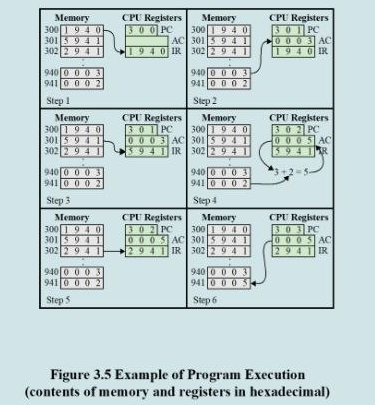
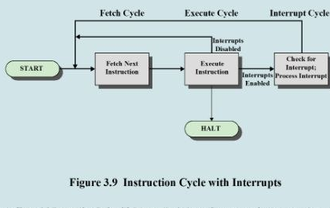
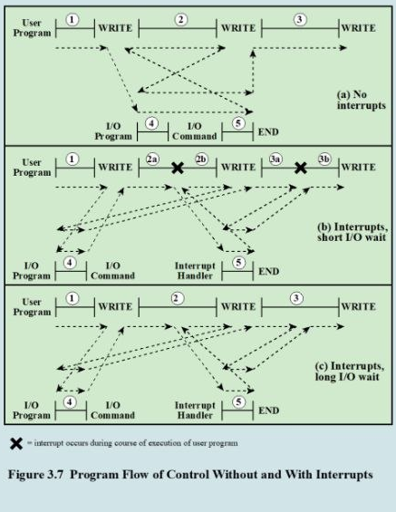

# WIA1003 Computer System Architecture — Midterm Test

**Date:** 22 April 2026  
**Questions:** 25 multiple-choice questions

## Question 1

Based on the **Direct Mapping Address Structure**, where a memory system uses a 24-bit physical address, a 2-bit word identifier, and a 14-bit line (or slot) identifier, what is the exact size of the Tag field, and what is the total number of blocks in main memory?

- **A.** The Tag field is exactly 14 bits wide, and the total number of blocks in main memory is $2^{22}$.
- **B.** The Tag field is exactly 8 bits wide, and the total number of blocks in main memory is $2^{22}$.
- **C.** The Tag field is exactly 8 bits wide, and the total number of blocks in main memory is $2^{14}$.
- **D.** The Tag field is exactly 10 bits wide, and the total number of blocks in main memory is $2^{24}$.

Answer: B

## Question 2

In Figure 3.5 (Step 4), immediately after the second instruction has been fetched, what specific value is contained within the Program Counter (PC)?

- **A.** The value 5941, which represents the operation code for the memory-data addition procedure.
- **B.** The value 302, which indicates the address of the next sequential instruction to be fetched.
- **C.** The value 301, which indicates the address of the first instruction that was already fetched.
- **D.** The value 0005, which represents the original data retrieved from memory location 940.
- **E.** None of the answers is correct.

Answer: B

## Question 3

During the Fetch Cycle, what is the primary function of the Program Counter (PC)?

- **A.** It holds the address of the specific instruction to be fetched by the processor.
- **B.** It holds the actual instruction that is currently being loaded into the IR.
- **C.** It stores the final results of a completed execution cycle for the processor.
- **D.** It interprets the fetched instruction and performs the required logic.

Answer: A

## Question 4

What is the primary reason that modern computers provide an interrupt mechanism?

- **A.** To prevent the processor from ever having to use a system stack for storage.
- **B.** To improve processing efficiency because external devices are usually slow.
- **C.** To ensure that the processor executes every instruction in a strict sequence.
- **D.** To allow external devices to run at the same clock speed as the processor.

Answer: B

## Question 5

In an "Interrupt" scenario, what happens when an external device becomes ready?

- **A.** The I/O operation is forced to stop until the user program reaches a WRITE.
- **B.** The device sends a request signal that causes the processor to suspend tasks.
- **C.** The user program must wait for the I/O device to set up a specific flag bit.
- **D.** The processor immediately deletes the current context to start the I/O task.

Answer: B

## Question 6

If a computer has a clock rate of 50 MHz, how long does it take to execute a program with 1,000 instructions, if the CPI for the program is 3.5?

- **A.** 142.8 ns
- **B.** 1.428 ms
- **C.** 700 ns
- **D.** 70 μs

Answer: D

## Question 7

The formula to calculate CPU time is:

- **A.** CPI × clock rate
- **B.** Instruction count / clock rate
- **C.** Instruction count × CPI × clock cycle time
- **D.** (instructions/program) × (seconds/clock cycle)

Answer: C

## Question 8

Which of the following best describes a GPU (Graphics Processing Unit)?

- **A.** A homogeneous collection of general-purpose processors on a single chip.
- **B.** The main processor responsible for executing the operating system.
- **C.** A core designed to perform parallel operations on graphics data, often used as vector processors for repetitive computations.
- **D.** A chip specifically designed to handle network routing protocols.
- **E.** None of the answers is correct.

Answer: C

## Question 9

You are evaluating two different processors, **Processor A** and **Processor B**, to run a highly intensive data analytics task.

- **Processor A** runs at **3.0 GHz**, has an average CPI of **1.5**, and the task compiles into $5 \times 10^9$ instructions.
- **Processor B** runs at **2.4 GHz**, but possesses a more complex instruction set. As a result, the same task compiles into only $3.5 \times 10^9$ instructions.

If you require Processor B to execute the task **20% faster** (i.e., take 20% less execution time) than Processor A, what must the average CPI of Processor B be?

- **A.** 1.2
- **B.** 1.500
- **C.** 1.371
- **D.** 1.714

Answer: C

## Question 10

A high-performance workstation has a CPU running at **4.0 GHz**. A scientific simulation program currently takes exactly **10 seconds** to execute. Profiling the program reveals that the total instruction count is $1.6 \times 10^{10}$ instructions.

The program consists of three types of instructions:

- **Floating-Point operations:** 30% of total instructions (CPI = 4)
- **Integer operations:** 40% of total instructions (CPI = 1)
- **Memory operations:** 30% of total instructions (CPI = unknown)

Hardware engineers want to upgrade the L1 and L2 cache to reduce the total execution time of the simulation to **8.5 seconds**. This hardware upgrade will only affect the CPI of the Memory operations; the Floating-Point and Integer CPIs, as well as the 4.0 GHz clock rate, will remain unchanged.

What is the target CPI for the Memory operations required to achieve this new execution time?

- **A.** 2.125
- **B.** 2.5
- **C.** 1.75
- **D.** 3.00

Answer: C

## Question 11

A processor operates at a clock rate of **2.5 GHz**. A program initially consists of $2 \times 10^6$ total instructions. The initial instruction mix and their respective CPIs are:

- **ALU instructions:** 40% (CPI = 1)
- **Load instructions:** 25% (CPI = 4)
- **Store instructions:** 15% (CPI = 3)
- **Branch instructions:** 20% (CPI = 2)

A new compiler optimization is applied. This optimization reduces the total number of **ALU instructions by 50%** and the number of **Branch instructions by 25%**. The number of Load and Store instructions remains exactly the same. The clock rate also remains unchanged.

What is the new overall CPI and the new execution time of the optimized program?

- **A.** CPI = 2.00, Execution Time = 1.20 ms
- **B.** CPI = 2.25, Execution Time = 1.80 ms
- **C.** CPI = 2.60, Execution Time = 1.56 ms
- **D.** CPI = 2.60, Execution Time = 1.80 ms

Answer: C

## Question 12

Which of the following is **NOT** listed as a technique built into contemporary processors to improve performance?

- **A.** Decreasing the power density
- **B.** Increasing the size and speed of caches
- **C.** Parallelism
- **D.** Increasing hardware speed by shrinking logic gate size
- **E.** None of the answers is correct.

Answer: A

## Question 13

As components on a chip decrease in size, what happens to the wire interconnects and the resulting electrical properties?

- **A.** The wires become thicker, decreasing resistance.
- **B.** The wires move further apart, decreasing capacitance.
- **C.** The wires become thinner, decreasing resistance.
- **D.** None of the answers is correct.
- **E.** The wires become thinner, increasing resistance, and closer together, increasing capacitance (RC delay).

Answer: E

## Question 14

Referring to the **Full Associative Mapping Address Structure** example, an incoming byte-addressable memory address is `FFFFFC` in hexadecimal. If the overall address is 24 bits, the block size is 4 bytes, what is the exact hexadecimal value of the Tag that the cache controller will check?

- **A.** `FFFFF`
- **B.** `1FFFFF`
- **C.** `3FFFFF`
- **D.** `1FFFF`

Answer: C

## Question 15

In a **4-Way Set Associative Mapping** system, the byte-addressable main memory size is **16 MB** and the cache size is **128 KB**, with a block size of **4 bytes**. If the processor requests data at the hexadecimal address `FFFFF8`, what are the corresponding hexadecimal values for the Tag and Set fields?

- **A.** The Tag evaluates to `1FF`, and the corresponding Set number evaluates to `1FFE`.
- **B.** The Tag evaluates to `0FF`, and the corresponding Set number evaluates to `1FFF`.
- **C.** The Tag evaluates to `1FE`, and the corresponding Set number evaluates to `1FF8`.
- **D.** The Tag evaluates to `3FF`, and the corresponding Set number evaluates to `0FFE`.
- **E.** None of the answers is correct.

Answer: A

## Question 16

If a system has a main memory access time of 500 ns, a cache access time of 50 ns, and a hit ratio of 90%, what is the effective access time?

- **A.** None of the answers is correct.
- **B.** 95 ns, calculated by adding the product of cache time and hit ratio to main memory time and miss ratio.
- **C.** 500 ns, because the main memory access time completely dominates the overall system performance rate.
- **D.** 100 ns, calculated by adding the cache access time directly to the expected main memory delay time.
- **E.** 450 ns, calculated by multiplying the main memory access time by the standard system hit ratio percentage.

Answer: D

## Question 17

How does the Least Recently Used (LRU) algorithm determine which block to replace when the cache is full?

- **A.** It replaces the block in the set that has experienced the fewest total memory references over its lifespan.
- **B.** It replaces the block in the set that has been in the cache longest without any processor reference to it.
- **C.** It replaces a block randomly using a hardware-implemented round-robin or circular buffer selection technique.
- **D.** None of the answers is correct.
- **E.** It replaces the block in the set that has been sitting inside the cache memory for the longest total duration.

Answer: B

## Question 18

According to the characteristics of devices in a memory architecture, which entity typically manages the cache?

- **A.** The operating system handles the rapid transfer of cache blocks.
- **B.** The operating system, which dictates exactly when virtual memory pages are swapped into the cache lines.
- **C.** The software compiler, which allocates specific memory blocks during the initial program compilation.
- **D.** The computer user, who configures the specific mapping function and replacement algorithms manually.
- **E.** None of the answers is correct.

Answer: E

## Question 19

Which of the following best describes the concept of "spatial locality" in computer memory systems?

- **A.** The tendency of a program to reference units of memory whose physical addresses are located far from one another.
- **B.** The tendency of a program to reference in the near future those memory units referenced in the recent past.
- **C.** The tendency of a program to access the exact same isolated variable repeatedly during a single execution loop.
- **D.** None of the answers is correct.
- **E.** The tendency of a program to load the entire instruction set into the cache before executing any ALU operations.

Answer: D

## Question 20

In the context of cache memory principles and structure, what is the specific definition of a "Tag"?

- **A.** The total number of consecutive data bytes that are contained within a single horizontal cache structure.
- **B.** A specific portion of cache memory that is capable of holding exactly one complete block of fetched data.
- **C.** None of the answers is correct.
- **D.** The minimum unit of physical data transfer that occurs between the cache module and the main memory.
- **E.** A designated portion of a cache line that is specifically utilized by the system for addressing purposes.

Answer: E

## Question 21

What is the primary disadvantage associated with utilizing a "Write Through" policy in cache architecture?

- **A.** It causes large portions of the main memory to contain invalid data whenever the cache information is updated.
- **B.** It requires highly complex circuitry that frequently acts as a severe performance bottleneck for the processor.
- **C.** It generates substantial memory traffic because all write operations are made to both main memory and cache.
- **D.** It forces I/O modules to access main memory exclusively through the cache, severely limiting transfer speeds.

Answer: C

## Question 22

When dealing with multiple interrupts, what is the drawback of the "disabled interrupt" approach?

- **A.** It forces the processor to branch to an interrupt handler at every single cycle.
- **B.** It does not account for the relative priority of various time-critical needs.
- **C.** None of the answers is correct.
- **D.** It requires the use of multiple program counters for every individual device.
- **E.** It prevents the processor from ever checking for pending interrupt signals.

Answer: B

## Question 23

What is the defining characteristic of Direct Memory Access (DMA)?

- **A.** The processor must read every byte of data from the I/O module into the ALU.
- **B.** I/O modules are forbidden from exchanging any data directly with the memory.
- **C.** The processor identifies a device and manages every single memory reference.
- **D.** I/O transfers occur with memory without constantly tying up the processor.
- **E.** None of the answers is correct.

Answer: D

## Question 24

Referring to **Figure 3.9 (Instruction Cycle with Interrupt)**, which specific sequence of actions must the processor perform if it detects that an interrupt has occurred?

- **A.** It disables any further memory referencing and delegates all processing control directly to the DMA module.
- **B.** It suspends the current program, saves its context, and sets the program counter to the interrupt handler routine.
- **C.** It halts all active processing, clears the instruction register, and waits for the I/O module to send new data.
- **D.** None of the answers is correct.
- **E.** It ignores the interrupt to finish the current sequence, then pushes the next instruction address to the stack.

Answer: B

## Question 25

Based on the execution scenarios illustrated in **Figure 3.7**, what specifically defines the "Long I/O wait" scenario (Figure 3.7(c)) compared to the standard interrupt execution?

- **A.** The processor completely suspends the execution of the user program indefinitely until all I/O devices finish.
- **B.** The I/O program invoked by the user code immediately bypasses the interrupt handler to save processor time.
- **C.** The user program reaches the second WRITE call before the preceding I/O operation is actually completed.
- **D.** None of the answers is correct.

Answer: C
