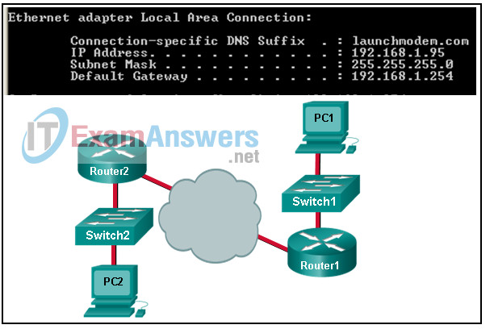
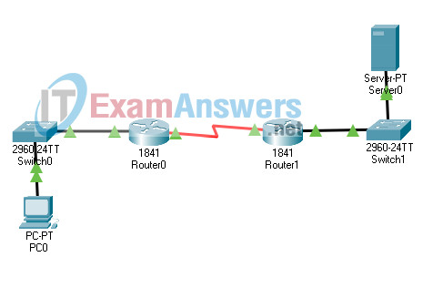
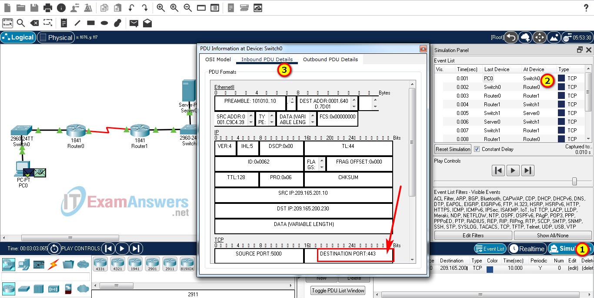
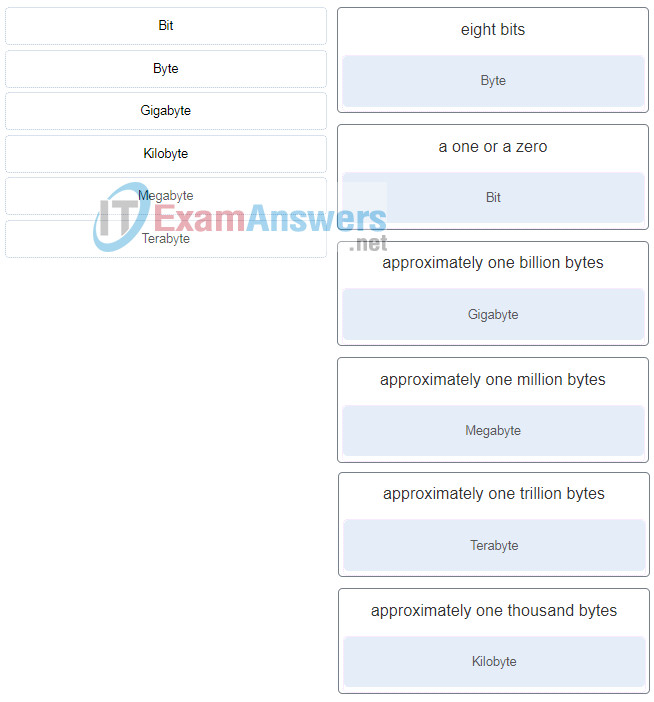

# CCNA 1 - System Test Exam

## Question 1

**Question:**
Refer to the exhibit. Consider the IP address configuration shown from PC1. What is a description of the default gateway address? CCNA 1 System Test Course (Version 1.1) – System Test Exam PC1

**Images:**

**Choices:**
- **A.** It is the IP address of the Router1 interface that connects the PC1 LAN to Router1.
- **B.** It is the IP address of the Router1 interface that connects the company to the Internet.
- **C.** It is the IP address of the ISP network device located in the cloud.
- **D.** It is the IP address of Switch1 that connects PC1 to other devices on the same LAN.

**Correct Answer:**
It is the IP address of the Router1 interface that connects the PC1 LAN to Router1.

**Explanation:**
The default gateway is used to route packets destined for remote networks. The default gateway IP address is the address of the first Layer 3 device (the router interface) that connects to the same network.

---

## Question 2

**Question:**
Open the PT activity. Perform the tasks in the activity instructions and then answer the question. What is the application layer service being requested from Server0 by PC0? CCNA 1 System Test Course (Version 1.1) – System Test Exam PT In the Simulation mode, capture the packets. What is the application layer service being requested from Server0 by PC0? Return to the assessment to answer the question.

**Images:**

**Choices:**
- **A.** FTP
- **B.** DNS
- **C.** HTTPS
- **D.** HTTP
- **E.** SMTP

**Correct Answer:**
HTTPS

**Explanation:**
From the PDU, the destination port is 443, which means the service requested is HTTPS. CCNA 1 System Test Course (Version 1.1) – System Test Exam PT Answer

---

## Question 3

**Question:**
Which statement describes the physical topology for a LAN?

**Choices:**
- **A.** It defines how hosts and network devices connect to the LAN.
- **B.** It shows the order in which hosts access the network.
- **C.** It depicts the addressing scheme that is employed in the LAN.
- **D.** It describes whether the LAN is a broadcast or token-passing network.

**Correct Answer:**
It defines how hosts and network devices connect to the LAN.

**Explanation:**
A physical topology defines the way in which computers and other network devices are connected to a network.

---

## Question 4

**Question:**
Match the term to the value represented. CCNA 1 System Test Course (Version 1.1) – System Test Exam

**Images:**

---
