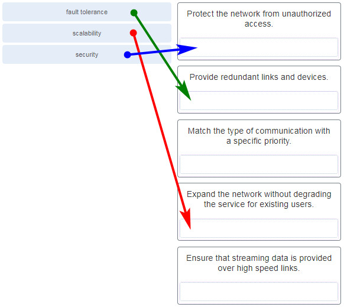
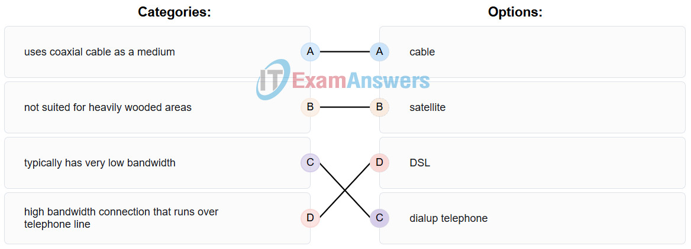
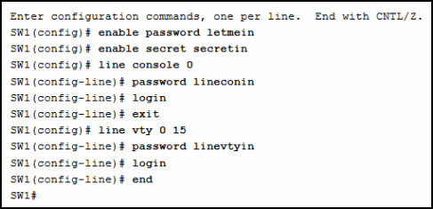
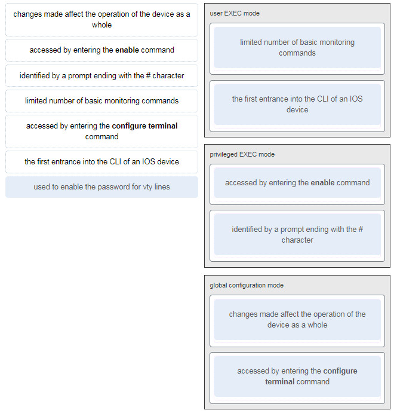
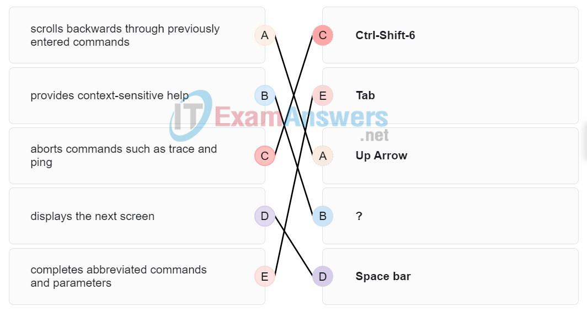
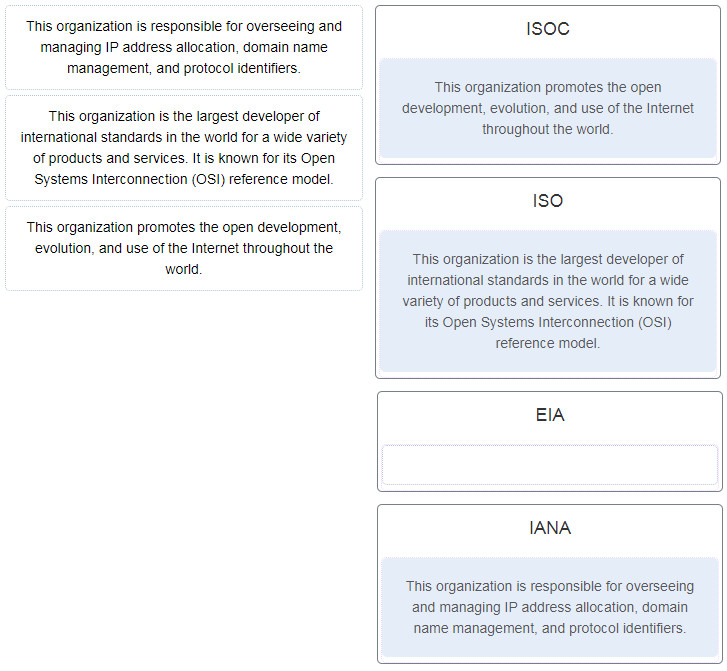
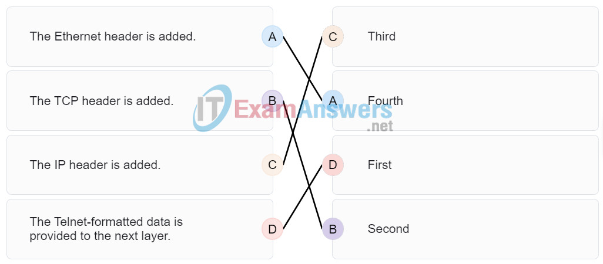
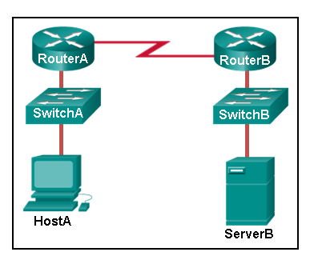
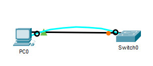
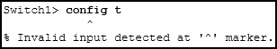

# CCNA 1 - Modules 1 - 3 Basic Network Connectivity and Communications Exam Answers

## Question 1

**Question:**
During a routine inspection, a technician discovered that software that was installed on a computer was secretly collecting data about websites that were visited by users of the computer. Which type of threat is affecting this computer?

**Choices:**
- **A.** DoS attack​
- **B.** identity theft
- **C.** spyware
- **D.** zero-day attack

**Correct Answer:**
spyware

**Explanation:**
Topic 1.8.1 Spyware is software that is installed on a network device and that collects information.

---

## Question 2

**Question:**
Which term refers to a network that provides secure access to the corporate offices by suppliers, customers and collaborators?

**Choices:**
- **A.** Internet
- **B.** intranet
- **C.** extranet
- **D.** extendednet

**Correct Answer:**
extranet

**Explanation:**
Topic 1.4.4 The term Internet refers to the worldwide collection of connected networks. Intranet refers to a private connection of LANs and WANS that belong to an organization and is designed to be accessible to the members of the organization, employees, or others with authorization.​ Extranets provide secure and safe access to ​suppliers, customers, and collaborators. Extendednet is not a type of network.

---

## Question 3

**Question:**
A large corporation has modified its network to allow users to access network resources from their personal laptops and smart phones. Which networking trend does this describe?

**Choices:**
- **A.** cloud computing
- **B.** online collaboration
- **C.** bring your own device
- **D.** video conferencing

**Correct Answer:**
bring your own device

**Explanation:**
Topic 1.7.2 BYOD allows end users to use personal tools to access the corporate network. Allowing this trend can have major impacts on a network, such as security and compatibility with corporate software and devices.

---

## Question 4

**Question:**
What is an ISP?

**Choices:**
- **A.** It is a standards body that develops cabling and wiring standards for networking.
- **B.** It is a protocol that establishes how computers within a local network communicate.
- **C.** It is an organization that enables individuals and businesses to connect to the Internet.
- **D.** It is a networking device that combines the functionality of several different networking devices in one.

**Correct Answer:**
It is an organization that enables individuals and businesses to connect to the Internet.

**Explanation:**
Topic 1.5.1 An ISP, or Internet Service Provider, is an organization that provides access to the Internet for businesses and individuals.

---

## Question 5

**Question:**
Match the requirements of a reliable network with the supporting network architecture. (Not all options are used.) fault tolerance Provide redundant links and devices. scalability Expand the network without degrading the service for existing users. security Protect the network from unauthorized access.

**Images:**

**Explanation:**
Topic 1.6.5

---

## Question 6

**Question:**
An employee at a branch office is creating a quote for a customer. In order to do this, the employee needs to access confidential pricing information from internal servers at the Head Office. What type of network would the employee access?

**Choices:**
- **A.** an intranet
- **B.** the Internet
- **C.** an extranet
- **D.** a local area network

**Correct Answer:**
an intranet

**Explanation:**
Topic 1.4.4 Intranet is a term used to refer to a private connection of LANs and WANs that belongs to an organization. An intranet is designed to be accessible only by the organization’s members, employees, or others with authorization.

---

## Question 7

**Question:**
Which statement describes the use of powerline networking technology?

**Choices:**
- **A.** New “smart” electrical cabling is used to extend an existing home LAN.
- **B.** A home LAN is installed without the use of physical cabling.
- **C.** A device connects to an existing home LAN using an adapter and an existing electrical outlet.
- **D.** Wireless access points use powerline adapters to distribute data through the home LAN.

**Correct Answer:**
A device connects to an existing home LAN using an adapter and an existing electrical outlet.

**Explanation:**
Topic 1.7.8 Powerline networking adds the ability to connect a device to the network using an adapter wherever there is an electrical outlet.​ The network uses existing electrical wiring to send data. It is not a replacement for physical cabling, but it can add functionality in places where wireless access points cannot be used or cannot reach devices.​

---

## Question 8

**Question:**
A networking technician is working on the wireless network at a medical clinic. The technician accidentally sets up the wireless network so that patients can see the medical records data of other patients. Which of the four network characteristics has been violated in this situation?

**Choices:**
- **A.** fault tolerance
- **B.** scalability
- **C.** security
- **D.** Quality of Service (QoS)
- **E.** reliability

**Correct Answer:**
security

**Explanation:**
Topic 1.1.8 Network security includes protecting the confidentiality of data that is on the network. In this case, because confidential data has been made available to unauthorized users, the security characteristic of the network has failed.

---

## Question 9

**Question:**
Match each characteristic to its corresponding Internet connectivity type. (Not all options are used.) Checkpoint Exam: Basic Network Connectivity and Communications Exam Q9 Place the options in the following order: uses coaxial cable as a medium cable not suited for heavily wooded areas satellite typically has very low bandwidth dialup telephone high bandwidth connection that runs over telephone line DSL

**Images:**

**Explanation:**
Topic 1.5.2 DSL is an always-on, high bandwidth connection that runs over telephone lines. Cable uses the same coaxial cable that carries television signals into the home to provide Internet access. Dialup telephone is much slower than either DSL or cable, but is the least expensive option for home users because it can use any telephone line and a simple modem. Satellite requires a clear line of sight and is affected by trees and other obstructions. None of these typical home options use dedicated leased lines such as T1/E1 and T3/E3.

---

## Question 10

**Question:**
What two criteria are used to help select a network medium from various network media? (Choose two.)

**Choices:**
- **A.** the types of data that need to be prioritized
- **B.** the cost of the end devices utilized in the network
- **C.** the distance the selected medium can successfully carry a signal
- **D.** the number of intermediate devices installed in the network
- **E.** the environment where the selected medium is to be installed

**Correct Answer:**
the distance the selected medium can successfully carry a signal; the environment where the selected medium is to be installed

**Explanation:**
Topic 2.6.2 Criteria for choosing a network medium are the distance the selected medium can successfully carry a signal, the environment in which the selected medium is to be installed, the amount of data and the speed at which the data must be transmitted, and the cost of the medium and its installation.

---

## Question 11

**Question:**
What type of network traffic requires QoS?

**Choices:**
- **A.** email
- **B.** on-line purchasing
- **C.** video conferencing
- **D.** wiki

**Correct Answer:**
video conferencing

**Explanation:**
Topic 1.6.4 Video conferencing utilizes real-time audio and video communications. Both of these are time-sensitive and bandwidth-intensive forms of communication that require quality of service to be active on the network. QoS will ensure an uninterrupted user experience.

---

## Question 12

**Question:**
A user is implementing security on a small office network. Which two actions would provide the minimum security requirements for this network? (Choose two.)

**Choices:**
- **A.** implementing a firewall
- **B.** installing a wireless network
- **C.** installing antivirus software
- **D.** implementing an intrusion detection system
- **E.** adding a dedicated intrusion prevention device

**Correct Answer:**
implementing a firewall; installing antivirus software

**Explanation:**
Topic 1.8.2 Technically complex security measures such as intrusion prevention and intrusion prevention systems are usually associated with business networks rather than home networks. Installing antivirus software, antimalware software, and implementing a firewall will usually be the minimum requirements for home networks. Installing a home wireless network will not improve network security, and will require further security actions to be taken.

---

## Question 13

**Question:**
Passwords can be used to restrict access to all or parts of the Cisco IOS. Select the modes and interfaces that can be protected with passwords. (Choose three.)

**Choices:**
- **A.** VTY interface
- **B.** console interface
- **C.** Ethernet interface
- **D.** boot IOS mode
- **E.** privileged EXEC mode
- **F.** router configuration mode

**Correct Answer:**
VTY interface; console interface; privileged EXEC mode

**Explanation:**
Topic 2.4.3 Access to the VTY and console interfaces can be restricted using passwords. Out-of-band management of the router can be restricted in both user EXEC and privileged EXEC modes.

---

## Question 14

**Question:**
Which interface allows remote management of a Layer 2 switch?

**Choices:**
- **A.** the AUX interface
- **B.** the console port interface
- **C.** the switch virtual interface
- **D.** the first Ethernet port interface

**Correct Answer:**
the switch virtual interface

**Explanation:**
Topic 2.6.2 In a Layer 2 switch, there is a switch virtual interface (SVI) that provides a means for remotely managing the device.

---

## Question 15

**Question:**
What function does pressing the Tab key have when entering a command in IOS?

**Choices:**
- **A.** It aborts the current command and returns to configuration mode.
- **B.** It exits configuration mode and returns to user EXEC mode.
- **C.** It moves the cursor to the beginning of the next line.
- **D.** It completes the remainder of a partially typed word in a command.

**Correct Answer:**
It completes the remainder of a partially typed word in a command.

**Explanation:**
Topic 2.3.5 Pressing the Tab key after a command has been partially typed will cause the IOS to complete the rest of the command.

---

## Question 16

**Question:**
While trying to solve a network issue, a technician made multiple changes to the current router configuration file. The changes did not solve the problem and were not saved. What action can the technician take to discard the changes and work with the file in NVRAM?

**Choices:**
- **A.** Issue the reload command without saving the running configuration.
- **B.** Delete the vlan.dat file and reboot the device.
- **C.** Close and reopen the terminal emulation software.
- **D.** Issue the copy startup-config running-config command.

**Correct Answer:**
Issue the reload command without saving the running configuration.

**Explanation:**
Topic 2.5.2 The technician does not want to make any mistakes trying to remove all the changes that were done to the running configuration file. The solution is to reboot the router without saving the running configuration. The copy startup-config running-config command does not overwrite the running configuration file with the configuration file stored in NVRAM, but rather it just has an additive effect.

---

## Question 17

**Question:**
An administrator uses the Ctrl-Shift-6 key combination on a switch after issuing the ping command. What is the purpose of using these keystrokes?

**Choices:**
- **A.** to restart the ping process
- **B.** to interrupt the ping process
- **C.** to exit to a different configuration mode
- **D.** to allow the user to complete the command

**Correct Answer:**
to interrupt the ping process

**Explanation:**
Topic 2.3.5 To interrupt an IOS process such as ping or traceroute, a user enters the Ctrl-Shift-6 key combination. Tab completes the remainder of parameters or arguments within a command. To exit from configuration mode to privileged mode use the Ctrl-Z keystroke. CTRL-R will redisplay the line just typed, thus making it easier for the user to press Enter and reissue the ping command.

---

## Question 18

**Question:**
Refer to the exhibit. A network administrator is configuring access control to switch SW1. If the administrator uses a console connection to connect to the switch, which password is needed to access user EXEC mode? CCNA-1-v7-Modules-1-3-Basic Network Connectivity and Communications Exam Answers 14

**Images:**

**Choices:**
- **A.** letmein
- **B.** secretin
- **C.** lineconin
- **D.** linevtyin

**Correct Answer:**
lineconin

**Explanation:**
Topic 2.4.3 Telnet accesses a network device through the virtual interface configured with the line VTY command. The password configured under this is required to access the user EXEC mode. The password configured under the line console 0 command is required to gain entry through the console port, and the enable and enable secret passwords are used to allow entry into the privileged EXEC mode.

---

## Question 19

**Question:**
A technician configures a switch with these commands: Copy SwitchA(config)# interface vlan 1 SwitchA(config-if)# ip address 192.168.1.1 255.255.255.0 SwitchA(config-if)# no shutdown What is the technician configuring?

**Choices:**
- **A.** Telnet access
- **B.** SVI
- **C.** password encryption
- **D.** physical switchport access

**Correct Answer:**
SVI

**Explanation:**
Topic 2.7.4 For a switch to have an IP address, a switch virtual interface must be configured. This allows the switch to be managed remotely over the network.

---

## Question 20

**Question:**
Which command or key combination allows a user to return to the previous level in the command hierarchy?

**Choices:**
- **A.** end
- **B.** exit
- **C.** Ctrl-Z
- **D.** Ctrl-C

**Correct Answer:**
exit

**Explanation:**
Topic 2.2.4 End and CTRL-Z return the user to the privileged EXEC mode. Ctrl-C ends a command in process. The exit command returns the user to the previous level.

---

## Question 21

**Question:**
What are two characteristics of RAM on a Cisco device? (Choose two.)

**Choices:**
- **A.** RAM provides nonvolatile storage.
- **B.** The configuration that is actively running on the device is stored in RAM.
- **C.** The contents of RAM are lost during a power cycle.
- **D.** RAM is a component in Cisco switches but not in Cisco routers.
- **E.** RAM is able to store multiple versions of IOS and configuration files.

**Correct Answer:**
The configuration that is actively running on the device is stored in RAM.; The contents of RAM are lost during a power cycle.

**Explanation:**
Topic 2.5.1 RAM stores data that is used by the device to support network operations. The running configuration is stored in RAM. This type of memory is considered volatile memory because data is lost during a power cycle. Flash memory stores the IOS and delivers a copy of the IOS into RAM when a device is powered on. Flash memory is nonvolatile since it retains stored contents during a loss of power.

---

## Question 22

**Question:**
Which two host names follow the guidelines for naming conventions on Cisco IOS devices? (Choose two.)

**Choices:**
- **A.** Branch2!
- **B.** RM-3-Switch-2A4
- **C.** Floor(15)
- **D.** HO Floor 17
- **E.** SwBranch799

**Correct Answer:**
RM-3-Switch-2A4; SwBranch799

**Explanation:**
Topic 2.4.1 Some guidelines for naming conventions are that names should: Start with a letter Contain no spaces End with a letter or digit Use only letters, digits, and dashes Be less than 64 characters in length

---

## Question 23

**Question:**
How is SSH different from Telnet?

**Choices:**
- **A.** SSH makes connections over the network, whereas Telnet is for out-of-band access.
- **B.** SSH provides security to remote sessions by encrypting messages and using user authentication. Telnet is considered insecure and sends messages in plaintext.
- **C.** SSH requires the use of the PuTTY terminal emulation program. Tera Term must be used to connect to devices through the use of Telnet.
- **D.** SSH must be configured over an active network connection, whereas Telnet is used to connect to a device from a console connection.

**Correct Answer:**
SSH provides security to remote sessions by encrypting messages and using user authentication. Telnet is considered insecure and sends messages in plaintext.

**Explanation:**
Topic 2.1.4 SSH is the preferred protocol for connecting to a device operating system over the network because it is much more secure than Telnet. Both SSH and Telnet are used to connect to devices over the network, and so are both used in-band. PuTTY and Terra Term can be used to make both SSH and Telnet connections.

---

## Question 24

**Question:**
An administrator is configuring a switch console port with a password. In what order will the administrator travel through the IOS modes of operation in order to reach the mode in which the configuration commands will be entered? (Not all options are used.) Place the options in the following order: first mode user EXEC mode second mode privileged EXEC mode third mode global configuration mode final mode line configuration mode

**Images:**

**Explanation:**
Topic 2.2.4 The configuration mode that the administrator first encounters is user EXEC mode. After the enable command is entered, the next mode is privileged EXEC mode. From there, the configure termina l command is entered to move to global configuration mode. Finally, the administrator enters the line console 0 command to enter the mode in which the configuration will be entered.

---

## Question 25

**Question:**
What are three characteristics of an SVI? (Choose three.)

**Choices:**
- **A.** It is designed as a security protocol to protect switch ports.
- **B.** It is not associated with any physical interface on a switch.
- **C.** It is a special interface that allows connectivity by different types of media.
- **D.** It is required to allow connectivity by any device at any location.
- **E.** It provides a means to remotely manage a switch.
- **F.** It is associated with VLAN1 by default.

**Correct Answer:**
It is not associated with any physical interface on a switch.; It provides a means to remotely manage a switch.; It is associated with VLAN1 by default.

**Explanation:**
Topic 2.6.2 Switches have one or more switch virtual interfaces (SVIs). SVIs are created in software since there is no physical hardware associated with them. Virtual interfaces provide a means to remotely manage a switch over a network that is using IP. Each switch comes with one SVI appearing in the default configuration “out-of-the-box.” The default SVI interface is VLAN1.

---

## Question 26

**Question:**
What command is used to verify the condition of the switch interfaces, including the status of the interfaces and a configured IP address?

**Choices:**
- **A.** ipconfig
- **B.** ping
- **C.** traceroute
- **D.** show ip interface brief

**Correct Answer:**
show ip interface brief

**Explanation:**
Topic 2.8.1 The show ip interface brief command is used to display a brief synopsis of the condition of the device interfaces. The ipconfig command is used to verify TCP/IP properties on a host. The ping command is used to verify Layer 3 connectivity. The traceroute command is used to trace the network path from source to destination.

---

## Question 27

**Question:**
Match the description with the associated IOS mode. (Not all options are used.)

**Images:**

**Explanation:**
Topic 2.2.4

---

## Question 28

**Question:**
Match the definitions to their respective CLI hot keys and shortcuts. (Not all options are used.) provides context-sensitive help ? displays the next screen Space bar completes abbreviated commands and parameters Tab scrolls backwards through previously entered commands Up Arrow aborts commands such as trace and ping Ctrl-Shift-6

**Images:**

**Explanation:**
Topic 2.3.5 The shortcuts with their functions are as follows: – Tab – Completes the remainder of a partially typed command or keyword – Space bar – displays the next screen – ? – provides context-sensitive help – Up Arrow – Allows user to scroll backward through former commands – Ctrl-C – cancels any command currently being entered and returns directly to privileged EXEC mode – Ctrl-Shift-6 – Allows the user to interrupt an IOS process such as ping or traceroute

---

## Question 29

**Question:**
In the show running-config command, which part of the syntax is represented by running-config ?

**Choices:**
- **A.** the command
- **B.** a keyword
- **C.** a variable
- **D.** a prompt

**Correct Answer:**
a keyword

**Explanation:**
Topic 2.3.1 The first part of the syntax, show, is the command, and the second part of the syntax, running-config, is the keyword. The keyword specifies what should be displayed as the output of the show command.

---

## Question 30

**Question:**
After making configuration changes on a Cisco switch, a network administrator issues a copy running-config startup-config command. What is the result of issuing this command?

**Choices:**
- **A.** The new configuration will be stored in flash memory.
- **B.** The new configuration will be loaded if the switch is restarted.
- **C.** The current IOS file will be replaced with the newly configured file.
- **D.** The configuration changes will be removed and the original configuration will be restored.

**Correct Answer:**
The new configuration will be loaded if the switch is restarted.

**Explanation:**
Topic 2.5.2 With the copy running-config startup-config command, the content of the current operating configuration replaces the startup configuration file stored in NVRAM. The configuration file saved in NVRAM will be loaded when the device is restarted.

---

## Question 31

**Question:**
What command will prevent all unencrypted passwords from displaying in plain text in a configuration file?

**Choices:**
- **A.** (config)# enable password secret
- **B.** (config)# enable secret Secret_Password
- **C.** (config-line)# password secret
- **D.** (config)# service password-encryption
- **E.** (config)# enable secret Encrypted_Password

**Correct Answer:**
(config)# service password-encryption

**Explanation:**
Topic 2.4.4 To prevent all configured passwords from appearing in plain text in configuration files, an administrator can execute the service password-encryption command. This command encrypts all configured passwords in the configuration file.

---

## Question 32

**Question:**
A network administrator enters the service password-encryption command into the configuration mode of a router. What does this command accomplish?

**Choices:**
- **A.** This command encrypts passwords as they are transmitted across serial WAN links.
- **B.** This command prevents someone from viewing the running configuration passwords.
- **C.** This command enables a strong encryption algorithm for the enable secret password command.
- **D.** This command automatically encrypts passwords in configuration files that are currently stored in NVRAM.
- **E.** This command provides an exclusive encrypted password for external service personnel who are required to do router maintenance.

**Correct Answer:**
This command prevents someone from viewing the running configuration passwords.

**Explanation:**
Topic 2.4.4 The startup-config and running-config files display most passwords in plaintext. Use the service password-encryption global config command to encrypt all plaintext passwords in these files.

---

## Question 33

**Question:**
What method can be used by two computers to ensure that packets are not dropped because too much data is being sent too quickly?

**Choices:**
- **A.** encapsulation
- **B.** flow control
- **C.** access method
- **D.** response timeout

**Correct Answer:**
flow control

**Explanation:**
Topic 3.1.9 In order for two computers to be able to communicate effectively, there must be a mechanism that allows both the source and destination to set the timing of the transmission and receipt of data. Flow control allows for this by ensuring that data is not sent too fast for it to be received properly.

---

## Question 34

**Question:**
Which statement accurately describes a TCP/IP encapsulation process when a PC is sending data to the network?

**Choices:**
- **A.** Data is sent from the internet layer to the network access layer.
- **B.** Packets are sent from the network access layer to the transport layer.
- **C.** Segments are sent from the transport layer to the internet layer.
- **D.** Frames are sent from the network access layer to the internet layer.

**Correct Answer:**
Segments are sent from the transport layer to the internet layer.

**Explanation:**
Topic 3.6.4 When the data is traveling from the PC to the network, the transport layer sends segments to the internet layer. The internet layer sends packets to the network access layer, which creates frames and then converts the frames to bits. The bits are released to the network media.

---

## Question 35

**Question:**
What three application layer protocols are part of the TCP/IP protocol suite? (Choose three.)

**Choices:**
- **A.** ARP
- **B.** DHCP
- **C.** DNS
- **D.** FTP
- **E.** NAT
- **F.** PPP

**Correct Answer:**
DHCP; DNS; FTP

**Explanation:**
Topic 3.3.4 DNS, DHCP, and FTP are all application layer protocols in the TCP/IP protocol suite. ARP and PPP are network access layer protocols, and NAT is an internet layer protocol in the TCP/IP protocol suite.

---

## Question 36

**Question:**
Match the description to the organization. (Not all options are used.) Explanation: Topic 3.3.2 and 3.4.2 The EIA is an international standards and trade organization for electronics organizations. It is best known for its standards related to electrical wiring, connectors, and the 19-inch racks used to mount networking equipment.

**Images:**

---

## Question 37

**Question:**
Which name is assigned to the transport layer PDU?

**Choices:**
- **A.** bits
- **B.** data
- **C.** frame
- **D.** packet
- **E.** segment

**Correct Answer:**
segment

**Explanation:**
Topic 3.6.3 Application data is passed down the protocol stack on its way to be transmitted across the network media. During the process, various protocols add information to it at each level. At each stage of the process, a PDU (protocol data unit) has a different name to reflect its new functions. The PDUs are named according to the protocols of the TCP/IP suite: Data – The general term for the PDU used at the application layer. Segment – transport layer PDU Packet – network layer PDU Frame – data link layer PDU Bits – A physical layer PDU used when physically transmitting data over the medium

---

## Question 38

**Question:**
When IPv4 addressing is manually configured on a web server, which property of the IPv4 configuration identifies the network and host portion for an IPv4 address?

**Choices:**
- **A.** DNS server address
- **B.** subnet mask
- **C.** default gateway
- **D.** DHCP server address

**Correct Answer:**
subnet mask

**Explanation:**
Topic 3.7.2 There are several components that need to be entered when configuring IPv4 for an end device: IPv4 address – uniquely identifies an end device on the network Subnet mask – determines the network address portion and host portion for an IPv4 address Default gateway – the IP address of the router interface used for communicating with hosts in another network DNS server address – the IP address of the Domain Name System (DNS) server DHCP server address (if DHCP is used) is not configured manually on end devices. It will be provided by a DHCP server when an end device requests an IP address.

---

## Question 39

**Question:**
What process involves placing one PDU inside of another PDU?

**Choices:**
- **A.** encapsulation
- **B.** encoding
- **C.** segmentation
- **D.** flow control

**Correct Answer:**
encapsulation

**Explanation:**
Topic 3.6.3 When a message is placed inside of another message, this is known as encapsulation. On networks, encapsulation takes place when one protocol data unit is carried inside of the data field of the next lower protocol data unit.

---

## Question 40

**Question:**
What layer is responsible for routing messages through an internetwork in the TCP/IP model?

**Choices:**
- **A.** internet
- **B.** transport
- **C.** network access
- **D.** session

**Correct Answer:**
internet

**Explanation:**
Topic 3.5.4 The TCP/IP model consists of four layers: application, transport, internet, and network access. Of these four layers, it is the internet layer that is responsible for routing messages. The session layer is not part of the TCP/IP model but is rather part of the OSI model.

---

## Question 41

**Question:**
For the TCP/IP protocol suite, what is the correct order of events when a Telnet message is being prepared to be sent over the network?

**Images:**

**Explanation:**
Topic 3.3.5 Place the options in the following order: The Telnet-formatted data is provided to the next layer. First The TCP header is added. Second The IP header is added. Third The Ethernet header is added. Fourth

---

## Question 42

**Question:**
Which PDU format is used when bits are received from the network medium by the NIC of a host?

**Choices:**
- **A.** file
- **B.** frame
- **C.** packet
- **D.** segment

**Correct Answer:**
frame

**Explanation:**
Topic 3.6.3 When received at the physical layer of a host, the bits are formatted into a frame at the data link layer. A packet is the PDU at the network layer. A segment is the PDU at the transport layer. A file is a data structure that may be used at the application layer.

---

## Question 43

**Question:**
Refer to the exhibit. ServerB is attempting to contact HostA. Which two statements correctly identify the addressing that ServerB will generate in the process? (Choose two.)

**Images:**

**Choices:**
- **A.** ServerB will generate a packet with the destination IP address of RouterB.
- **B.** ServerB will generate a frame with the destination MAC address of SwitchB.
- **C.** ServerB will generate a packet with the destination IP address of RouterA.
- **D.** ServerB will generate a frame with the destination MAC address of RouterB.
- **E.** ServerB will generate a packet with the destination IP address of HostA.
- **F.** ServerB will generate a frame with the destination MAC address of RouterA.

**Correct Answer:**
ServerB will generate a frame with the destination MAC address of RouterB.; ServerB will generate a packet with the destination IP address of HostA.

**Explanation:**
Topic 3.7.2 In order to send data to HostA, ServerB will generate a packet that contains the IP address of the destination device on the remote network and a frame that contains the MAC address of the default gateway device on the local network.

---

## Question 44

**Question:**
Which method allows a computer to react accordingly when it requests data from a server and the server takes too long to respond?

**Choices:**
- **A.** encapsulation
- **B.** flow control
- **C.** access method
- **D.** response timeout

**Correct Answer:**
response timeout

**Explanation:**
Topic 3.1.9 If a computer makes a request and does not hear a response within an acceptable amount of time, the computer assumes that no answer is coming and reacts accordingly.

---

## Question 45

**Question:**
A web client is receiving a response for a web page from a web server. From the perspective of the client, what is the correct order of the protocol stack that is used to decode the received transmission?

**Choices:**
- **A.** Ethernet, IP, TCP, HTTP
- **B.** HTTP, TCP, IP, Ethernet
- **C.** Ethernet, TCP, IP, HTTP
- **D.** HTTP, Ethernet, IP, TCP

**Correct Answer:**
Ethernet, IP, TCP, HTTP

**Explanation:**
Topic 3.6.3 1. HTTP governs the way that a web server and client interact. 2. TCP manages individual conversations between web servers and clients. 3. IP is responsible for delivery across the best path to the destination. 4. Ethernet takes the packet from IP and formats it for transmission.

---

## Question 46

**Question:**
Which two OSI model layers have the same functionality as a single layer of the TCP/IP model? (Choose two.)

**Choices:**
- **A.** data link
- **B.** network
- **C.** physical
- **D.** session
- **E.** transport

**Correct Answer:**
data link; physical

**Explanation:**
Topic 3.5.4 The OSI data link and physical layers together are equivalent to the TCP/IP network access layer. The OSI transport layer is functionally equivalent to the TCP/IP transport layer, and the OSI network layer is equivalent to the TCP/IP internet layer. The OSI application, presentation, and session layers are functionally equivalent to the application layer within the TCP/IP model.

---

## Question 47

**Question:**
At which layer of the OSI model would a logical address be added during encapsulation?

**Choices:**
- **A.** physical layer
- **B.** data link layer
- **C.** network layer
- **D.** transport layer

**Correct Answer:**
network layer

**Explanation:**
Topic 3.7.2 Logical addresses, also known as IP addresses, are added at the network layer. Physical addresses are edded at the data link layer. Port addresses are added at the transport layer. No addresses are added at the physical layer.

---

## Question 48

**Question:**
What is a characteristic of multicast messages?

**Choices:**
- **A.** They are sent to a select group of hosts.
- **B.** They are sent to all hosts on a network.
- **C.** They must be acknowledged.
- **D.** They are sent to a single destination.

**Correct Answer:**
They are sent to a select group of hosts.

**Explanation:**
Topic 3.1.9 Multicast is a one-to-many type of communication. Multicast messages are addressed to a specific multicast group.

---

## Question 49

**Question:**
Which statement is correct about network protocols?

**Choices:**
- **A.** Network protocols define the type of hardware that is used and how it is mounted in racks.
- **B.** They define how messages are exchanged between the source and the destination.
- **C.** They all function in the network access layer of TCP/IP.
- **D.** They are only required for exchange of messages between devices on remote networks.

**Correct Answer:**
They define how messages are exchanged between the source and the destination.

**Explanation:**
Topic 3.1.7 Network protocols are implemented in hardware, or software, or both. They interact with each other within different layers of a protocol stack. Protocols have nothing to do with the installation of the network equipment. Network protocols are required to exchange information between source and destination devices in both local and remote networks.

---

## Question 50

**Question:**
What is an advantage of network devices using open standard protocols?

**Choices:**
- **A.** Network communications is confined to data transfers between devices from the same vendor.
- **B.** A client host and a server running different operating systems can successfully exchange data.
- **C.** Internet access can be controlled by a single ISP in each market.
- **D.** Competition and innovation are limited to specific types of products.

**Correct Answer:**
A client host and a server running different operating systems can successfully exchange data.

**Explanation:**
Topic 3.4.1 An advantage of network devices implementing open standard protocols, such as from the TCP/IP suite, is that clients and servers running different operating systems can communicate with each other. Open standard protocols facilitate innovation and competition between vendors and across markets, and can reduce the occurrence of monopolies in networking markets.

---

## Question 51

**Question:**
Which device performs the function of determining the path that messages should take through internetworks?

**Choices:**
- **A.** a router
- **B.** a firewall
- **C.** a web server
- **D.** a DSL modem

**Correct Answer:**
a router

**Explanation:**
Topic 1.2.4 A router is used to determine the path that the messages should take through the network. A firewall is used to filter incoming and outgoing traffic. A DSL modem is used to provide Internet connection for a home or an organization.

---

## Question 52

**Question:**
Open the PT Activity. Perform the tasks in the activity instructions and then answer the question. CCNA-1-v7-Modules-1-3-Basic Network Connectivity and Communications Exam Answers 52 Modules 1 - 3: Basic Network Connectivity and Communications Exam - Packet Tracer 0.00 KB 20886 downloads ... Download What is the IP address of the switch virtual interface (SVI) on Switch0?

**Images:**

**Choices:**
- **A.** 192.168.5.10
- **B.** 192.168.10.5
- **C.** 192.168.10.1
- **D.** 192.168.5.0

**Correct Answer:**
192.168.5.10

**Explanation:**
Topic 2.7.4 After the enable command is issued, the show running-configuration command or the show ip interfaces brief command will display the IP address of the switch virtual interface (SVI).

---

## Question 53

**Question:**
Why would a Layer 2 switch need an IP address?

**Choices:**
- **A.** to enable the switch to send broadcast frames to attached PCs
- **B.** to enable the switch to function as a default gateway
- **C.** to enable the switch to be managed remotely
- **D.** to enable the switch to receive frames from attached PCs

**Correct Answer:**
to enable the switch to be managed remotely

**Explanation:**
Topic 2.6.2 A switch, as a Layer 2 device, does not need an IP address to transmit frames to attached devices. However, when a switch is accessed remotely through the network, it must have a Layer 3 address. The IP address must be applied to a virtual interface rather than to a physical interface. Routers, not switches, function as default gateways.

---

## Question 54

**Question:**
Refer to the exhibit. An administrator is trying to configure the switch but receives the error message that is displayed in the exhibit. What is the problem? CCNA-1-v7-Modules-1-3-Basic Network Connectivity and Communications Exam Answers 54

**Images:**

**Choices:**
- **A.** The entire command, configure terminal, must be used.
- **B.** The administrator is already in global configuration mode.
- **C.** The administrator must first enter privileged EXEC mode before issuing the command.
- **D.** The administrator must connect via the console port to access global configuration mode.

**Correct Answer:**
The administrator must first enter privileged EXEC mode before issuing the command.

**Explanation:**
Topic 2.2.1 In order to enter global configuration mode, the command configure terminal , or a shortened version such as config t , must be entered from privileged EXEC mode. In this scenario the administrator is in user EXEC mode, as indicated by the > symbol after the hostname. The administrator would need to use the enable command to move into privileged EXEC mode before entering the configure terminal command.

---

## Question 55

**Question:**
What term describes a network owned by one organization that provides safe and secure access to individuals who work for a different organization?

**Choices:**
- **A.** extranet
- **B.** cloud
- **C.** BYOD
- **D.** quality of service

**Correct Answer:**
extranet

**Explanation:**
Topic 1.4.4 The term extranet describes a controlled and private network infrastructure owned by a single organization that is purposely built to grant secure, limited access to external individuals who work for completely different organizations or business entities. An extranet is typically deployed to facilitate seamless collaboration with external stakeholders such as trusted suppliers, vendors, business partners, or high-priority clients. It allows them to access specific internal resources and files safely without exposing the core corporate network to broader security risks.

---

## Question 56

**Question:**
What term describes storing personal files on servers over the internet to provide access anywhere, anytime, and on any device?

**Choices:**
- **A.** cloud
- **B.** BYOD
- **C.** quality of service
- **D.** converged network

**Correct Answer:**
cloud

**Explanation:**
Topic 1.7.6 The term cloud (or cloud computing) refers to the practice of storing, managing, and processing data on remote servers hosted on the Internet, rather than on a local hard drive. This architecture allows users to seamlessly upload and retrieve their personal files, applications, and services from any geographical location, at any given time, and across any internet-enabled device.

---

## Question 57

**Question:**
What term describes a network where one computer can be both client and server?

**Choices:**
- **A.** peer-to-peer
- **B.** cloud
- **C.** BYOD
- **D.** quality of service

**Correct Answer:**
peer-to-peer

**Explanation:**
Topic 1.2.2 The term peer-to-peer (P2P) describes a network model where every interconnected computer can function as both a client and a server simultaneously. In this specific architecture, there is no requirement for a centralized or dedicated server. For instance, a computer acts as a server when it shares a local file or a connected printer with other users, and at the same time, it operates as a client when retrieving a shared document stored on another workstation. This setup is highly cost-effective for home environments or small offices, though it has distinct limitations regarding scalability and centralized security management.

---

## Question 58

**Question:**
What term describes a type of network used by people who work from home or from a small remote office?

**Choices:**
- **A.** SOHO network
- **B.** BYOD
- **C.** quality of service
- **D.** converged network

**Correct Answer:**
SOHO network

**Explanation:**
Topic 1.4.1 The term SOHO stands for Small Office, Home Office . It describes a specific category of Local Area Network (LAN) engineered to support individuals working remotely from home or operating within a small-scale business environment with a limited number of end devices. These networks are highly cost-effective and typically rely on a single, integrated multi-function device (a standard home router) that simultaneously provides switching capabilities, wireless access (Wi-Fi), and routing functions to grant Internet access and enable local resource sharing.

---

## Question 59

**Question:**
What term describes a computing model where server software runs on dedicated computers?

**Choices:**
- **A.** client/server
- **B.** internet
- **C.** intranet
- **D.** extranet

**Correct Answer:**
client/server

**Explanation:**
Topic 1.2.2 The client/server model is a distributed network architecture where tasks and workloads are partitioned between service providers (called servers ) and service requesters (called clients ). In this specific computing model, the server software runs on dedicated, high-performance computers that are completely optimized to host, manage, and respond to requests sent by multiple client devices simultaneously (such as web servers, file servers, or email servers). This centralization of network resources and hardware is what mainly distinguishes the client/server architecture from a Peer-to-Peer ( P2P ) network, where individual devices share responsibilities equally and can act as both clients and servers at the same time without relying on dedicated hardware.

---

## Question 60

**Question:**
What term describes a technology that allows devices to connect to the LAN using an electrical outlet?

**Choices:**
- **A.** powerline networking
- **B.** internet
- **C.** intranet
- **D.** extranet

**Correct Answer:**
powerline networking

**Explanation:**
Topic 1.7.8 Powerline networking is a technology that allows data to be transmitted over an object’s existing electrical wiring. By using specialized powerline adapters plugged directly into any standard electrical outlet , devices can seamlessly connect to the local area network (LAN). This approach effectively turns standard electrical infrastructure into network data channels without requiring extra Ethernet cabling.

---

## Question 61

**Question:**
What term describes a policy that allows network devices to manage the flow of data to give priority to voice and video?

**Choices:**
- **A.** quality of service
- **B.** internet
- **C.** intranet
- **D.** extranet

**Correct Answer:**
quality of service

**Explanation:**
Topic 1.6.4 Quality of Service (QoS) is a network policy that enables devices to manage data traffic flows by prioritizing bandwidth. It ensures that time-sensitive, real-time communications like voice and video are given higher priority over standard data traffic. This mechanism significantly reduces latency and jitter, maintaining acceptable transmission quality even during network congestion. Other options like Internet, Intranet, or Extranet merely define the scope or boundaries of network access.

---

## Question 62

**Question:**
What term describes a private collection of LANs and WANs that belongs to an organization?

**Choices:**
- **A.** intranet
- **B.** internet
- **C.** extranet
- **D.** peer-to-peer

**Correct Answer:**
intranet

**Explanation:**
Topic 1.4.4 An intranet is a private collection of LANs and WANs that belongs to an organization. It is designed to be accessible only by the organization’s members, employees, or others with explicit authorization to securely share internal data and resources.

---

## Question 63

**Question:**
What term describes the ability to use personal devices across a business or campus network?

**Choices:**
- **A.** BYOD
- **B.** internet
- **C.** intranet
- **D.** extranet

**Correct Answer:**
BYOD

**Explanation:**
Topic 1.7.2 The term BYOD (which stands for Bring Your Own Device ) describes the growing trend and corporate policy where users, employees, or students are officially permitted to utilize their personal tech devices (such as laptops, smartphones, or tablets) to connect to a corporate or campus network to access internal organizational resources.

---

## Question 64

**Question:**
At which OSI layer is a source IP address added to a PDU during the encapsulation process?

**Choices:**
- **A.** network layer
- **B.** data link layer
- **C.** transport layer
- **D.** application layer

**Correct Answer:**
network layer

**Explanation:**
Topic 3.6.4

---

## Question 65

**Question:**
At which OSI layer is a destination port number added to a PDU during the encapsulation process?

**Choices:**
- **A.** transport layer
- **B.** data link layer
- **C.** network layer
- **D.** application layer

**Correct Answer:**
transport layer

**Explanation:**
Topic 3.6.3 The transport layer (Layer 4 of the OSI model) is responsible for establishing a temporary communication session between two applications and transferring data between them reliably. During the encapsulation process, as data moves down from the application layer, the transport layer breaks it into smaller pieces called segments (PDU). It is exactly at this stage that a header containing both the source port number and the destination port number is added. The destination port number is critical because it tells the receiving device exactly which specific upper-layer application or service (such as HTTP on port 80, HTTPS on port 443, or DNS on port 53) should receive the data.

---

## Question 66

**Question:**
At which OSI layer is data added to a PDU during the encapsulation process?

**Choices:**
- **A.** application layer
- **B.** data link layer
- **C.** network layer
- **D.** transport layer

**Correct Answer:**
application layer

**Explanation:**
Topic 3.6.3 The application layer (Layer 7 of the OSI model) is the starting point where data is generated by user interactions or software applications (such as web browsers or email clients). During the encapsulation process, this layer takes the raw user information and formats it according to the specific protocol in use (such as HTTP, FTP, or SMTP), creating the initial PDU known simply as data . This data PDU is then passed down to the lower layers of the OSI stack, where it will sequentially receive headers and trailers (becoming segments, packets, and frames) to prepare it for physical transmission.

---

## Question 67

**Question:**
At which OSI layer is a source IP address added to a PDU during the encapsulation process?

**Choices:**
- **A.** network layer
- **B.** data link layer
- **C.** application layer
- **D.** presentation layer

**Correct Answer:**
network layer

**Explanation:**
Topic 3.6.4 The network layer (Layer 3 of the OSI model) is responsible for end-to-end packet delivery across multiple interconnected networks. During the encapsulation process, when data from the transport layer arrives at the network layer, it is packaged into protocol data units called packets (PDUs). At this stage, a Layer 3 network header is attached, which strictly includes both the source IP address (identifying the original sender) and the destination IP address (identifying the final receiver). This logical addressing allows intermediate routers to successfully inspect the information and forward the data along the best path toward its final destination.

---

## Question 68

**Question:**
Which of the following is the name for all computers connected to a network that participate directly in network communication?

**Choices:**
- **A.** Servers
- **B.** Intermediary device
- **C.** Host
- **D.** media

**Correct Answer:**
Host

**Explanation:**
Topic 1.2.1 Hosts are all computers connected to a network that participate directly in network communication.

---

## Question 69

**Question:**
At which OSI layer is a destination IP address added to a PDU during the encapsulation process?

**Choices:**
- **A.** network layer
- **B.** application layer
- **C.** transport layer
- **D.** presentation layer

**Correct Answer:**
network layer

**Explanation:**
Topic 3.6.3 The network layer (Layer 3 of the OSI model) is responsible for logical addressing and routing data across different interconnected networks. During the encapsulation process, as data segments move down from the transport layer, the network layer packages them into protocol data units called packets (PDU). It is exactly at this stage that a network header containing both the source IP address and the destination IP address is added. The destination IP address is critical because it allows intermediate routers to make proper forwarding decisions, ensuring the packet is routed through the correct path until it reaches its ultimate destination.

---

## Question 70

**Question:**
At which OSI layer is a source MAC address added to a PDU during the encapsulation process?

**Choices:**
- **A.** data link layer
- **B.** application layer
- **C.** transport layer
- **D.** presentation layer

**Correct Answer:**
data link layer

**Explanation:**
Topic 3.6.3 The data link layer (Layer 2 of the OSI model) is responsible for preparing data for physical transmission across local network media and controlling access to those media. During the encapsulation process, as IP packets move down from the network layer (Layer 3), the data link layer packages them into protocol data units called frames (PDUs). It is exactly at this stage that a data link header is attached, which includes both the source MAC address (the physical address of the sending device’s NIC) and the destination MAC address (the next physical hop on the local network). This allows local network hardware, such as switches, to successfully identify the immediate sender and receiver within the same local network segment.

---

## Question 71

**Question:**
At which OSI layer is a source port number added to a PDU during the encapsulation process?

**Choices:**
- **A.** transport layer
- **B.** application layer
- **C.** network layer
- **D.** presentation layer
- **E.** data link layer

**Correct Answer:**
transport layer

**Explanation:**
Topic 3.6.3 The transport layer (Layer 4 of the OSI model) is responsible for managing data flow and ensuring that applications on both ends of the network can communicate seamlessly. During the encapsulation process, data moving down from the application layer is segmented into smaller protocol data units called segments (PDUs). It is precisely at this level that a transport header is attached, which includes both the source port number and the destination port number. The source port number is dynamically assigned by the sending device to uniquely identify the local application session initiating the communication, ensuring that return traffic is directed back to the correct software or service.

---

## Question 72

**Question:**
At which OSI layer is a destination MAC address added to a PDU during the encapsulation process?

**Choices:**
- **A.** data link layer
- **B.** transport layer
- **C.** application layer
- **D.** network layer

**Correct Answer:**
data link layer

**Explanation:**
Topic 3.6.3

---

## Question 73

**Question:**
When data is encoded as pulses of light, which media is being used to transmit the data?

**Choices:**
- **A.** Wireless
- **B.** Fire optic cable
- **C.** Copper cable

**Correct Answer:**
Fire optic cable

**Explanation:**
Topic 1.2.5 Fiber-optic cable is the media is being used to transmit the data when data is encoded as pulses of light.

---

## Question 74

**Question:**
Which two devices are intermediary devices? (Choose two)

**Choices:**
- **A.** Host
- **B.** Router
- **C.** Switch
- **D.** Servers

**Correct Answer:**
Router; Switch

**Explanation:**
Topic 1.2.4 and 1.3.1 Routers and switches are intermediary devices.

---

## Question 75

**Question:**
A college is building a new dormitory on its campus. Workers are digging in the ground to install a new water pipe for the dormitory. A worker accidentally damages a fiber optic cable that connects two of the existing dormitories to the campus data center. Although the cable has been cut, students in the dormitories only experience a very short interruption of network services. What characteristic of the network is shown here?

**Choices:**
- **A.** quality of service (QoS)
- **B.** scalability
- **C.** security
- **D.** fault tolerance
- **E.** integrity

**Correct Answer:**
fault tolerance

**Explanation:**
Topic 1.6.2 Fault tolerance is the characteristic of a network which allows it to quickly respond to failures of network devices, media, or services. Quality of service refers to the measures taken to ensure that network traffic requiring higher throughput receives the required network resources. Scalability refers to the ability of the network to grow to accommodate new requirements. Security refers to protecting networks and data from theft, alteration, or destruction. Integrity refers to the completeness of something and is generally not used as a characteristic of networks in the same way as the other terms.

---
