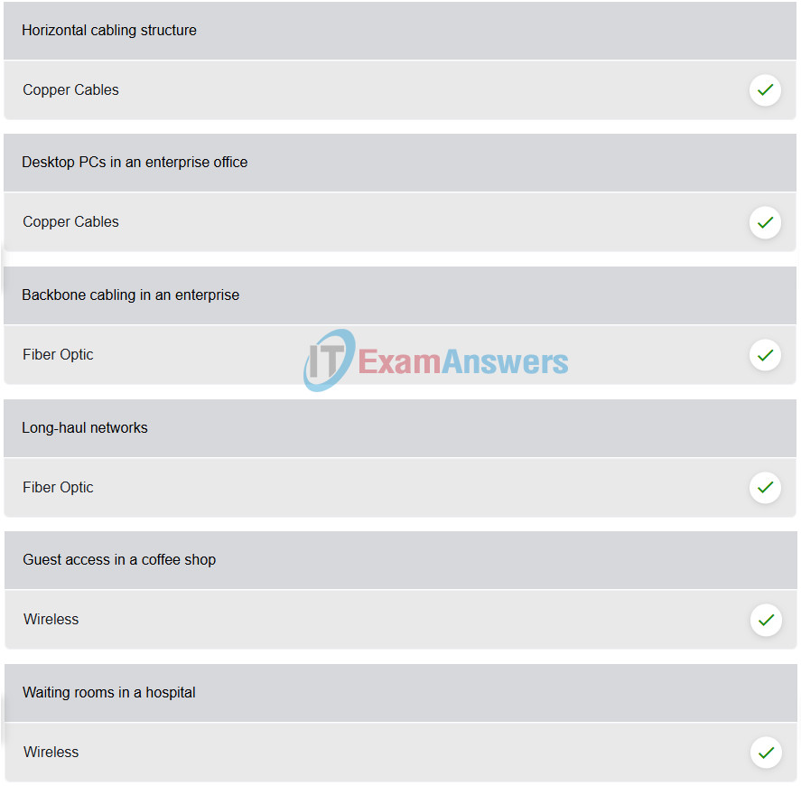
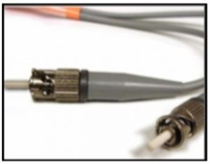
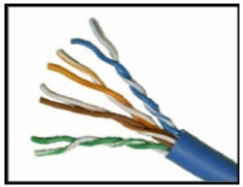
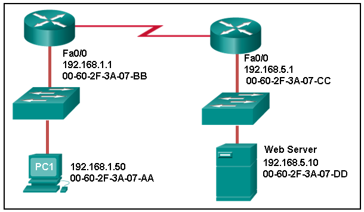
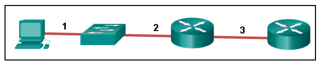
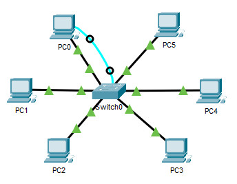

# CCNA 1 - Modules 4 - 7 Ethernet Concepts Exam Answers

## Question 1

**Question:**
What is the purpose of the OSI physical layer?

**Choices:**
- **A.** controlling access to media
- **B.** transmitting bits across the local media
- **C.** performing error detection on received frames
- **D.** exchanging frames between nodes over physical network media

**Correct Answer:**
transmitting bits across the local media

**Explanation:**
Topic 4.1.1

---

## Question 2

**Question:**
Why are two strands of fiber used for a single fiber optic connection?

**Choices:**
- **A.** The two strands allow the data to travel for longer distances without degrading.
- **B.** They prevent crosstalk from causing interference on the connection.
- **C.** They increase the speed at which the data can travel.
- **D.** They allow for full-duplex connectivity.

**Correct Answer:**
They allow for full-duplex connectivity.

**Explanation:**
Topic 4.5.4

---

## Question 3

**Question:**
Which characteristic describes crosstalk?

**Choices:**
- **A.** the distortion of the network signal from fluorescent lighting
- **B.** the distortion of the transmitted messages from signals carried in adjacent wires
- **C.** the weakening of the network signal over long cable lengths
- **D.** the loss of wireless signal over excessive distance from the access point

**Correct Answer:**
the distortion of the transmitted messages from signals carried in adjacent wires

**Explanation:**
Topic 4.3.1

---

## Question 4

**Question:**
Which procedure is used to reduce the effect of crosstalk in copper cables?

**Choices:**
- **A.** requiring proper grounding connections
- **B.** twisting opposing circuit wire pairs together
- **C.** wrapping the bundle of wires with metallic shielding
- **D.** designing a cable infrastructure to avoid crosstalk interference
- **E.** avoiding sharp bends during installation

**Correct Answer:**
twisting opposing circuit wire pairs together

**Explanation:**
Topic 4.3.1

---

## Question 5

**Question:**
Match the situation with the appropriate use of network media.

**Images:**

**Explanation:**
Topic 4.3.3 Place the options in the following order: Copper Cables Fiber optic Wireless horizontal cabling structure backbone cabling in an enterprise guest access in a coffee shop desktop PCs in offices in an enterprise long-haul networks waiting rooms in a hospital

---

## Question 6

**Question:**
A network administrator is measuring the transfer of bits across the company backbone for a mission critical financial application. The administrator notices that the network throughput appears lower than the bandwidth expected. Which three factors could influence the differences in throughput? (Choose three.)

**Choices:**
- **A.** the amount of traffic that is currently crossing the network
- **B.** the sophistication of the encapsulation method applied to the data
- **C.** the type of traffic that is crossing the network
- **D.** the latency that is created by the number of network devices that the data is crossing
- **E.** the bandwidth of the WAN connection to the Internet
- **F.** the reliability of the gigabit Ethernet infrastructure of the backbone

**Correct Answer:**
the amount of traffic that is currently crossing the network; the type of traffic that is crossing the network; the latency that is created by the number of network devices that the data is crossing

**Explanation:**
Topic 4.2.6 Throughput usually does not match the specified bandwidth of physical links due to multiple factors. These factors include, the amount of traffic, type of traffic, and latency created by the network devices the data has to cross.

---

## Question 7

**Question:**
What are two characteristics of fiber-optic cable? (Choose two.)

**Choices:**
- **A.** It is not affected by EMI or RFI.
- **B.** Each pair of cables is wrapped in metallic foil.
- **C.** It combines the technique of cancellation, shielding, and twisting to protect data.
- **D.** It typically contains 4 pairs of fiber-optic wires.
- **E.** It is more expensive than UTP cabling is.

**Correct Answer:**
It is not affected by EMI or RFI.; It is more expensive than UTP cabling is.

**Explanation:**
Topic 4.5.1 Fiber-optic cabling supports higher bandwidth than UTP for longer distances. Fiber is immune to EMI and RFI, but costs more, requires more skill to install, and requires more safety precautions.

---

## Question 8

**Question:**
What is a primary role of the Physical layer in transmitting data on the network?

**Choices:**
- **A.** create the signals that represent the bits in each frame on to the media
- **B.** provide physical addressing to the devices
- **C.** determine the path packets take through the network
- **D.** control data access to the media

**Correct Answer:**
create the signals that represent the bits in each frame on to the media

**Explanation:**
Topic 4.1.2 The OSI physical layer provides the means to transport the bits that make up a frame across the network media. This layer accepts a complete frame from the data link layer and encodes it as a series of signals that are transmitted to the local media.

---

## Question 9

**Question:**
With the use of unshielded twisted-pair copper wire in a network, what causes crosstalk within the cable pairs?

**Choices:**
- **A.** the magnetic field around the adjacent pairs of wire
- **B.** the use of braided wire to shield the adjacent wire pairs
- **C.** the reflection of the electrical wave back from the far end of the cable
- **D.** the collision caused by two nodes trying to use the media simultaneously

**Correct Answer:**
the magnetic field around the adjacent pairs of wire

**Explanation:**
Topic 4.3.1 Crosstalk is a type of noise, or interference that occurs when signal transmission on one wire interferes with another wire. When current flows through a wire a magnetic field is produced. The produced magnetic field will interface the signal carried in the adjacent wire.

---

## Question 10

**Question:**
Refer to the graphic. What type of cabling is shown?

**Images:**

**Choices:**
- **A.** STP
- **B.** UTP
- **C.** coax
- **D.** fiber

**Correct Answer:**
fiber

**Explanation:**
Topic 4.5.1 Network cabling include different types of cables: UTP cable consists of four pairs of color-coded wires that have been twisted together and then encased in a flexible plastic sheath. STP cable uses four pairs of wires, each wrapped in a foil shield, which are then wrapped in an overall metallic braid or foil. Coaxial cable uses a copper conductor and a layer of flexible plastic insulation surrounds the copper conductor. Fiber cable is a flexible, extremely thin, transparent strand of glass surrounded by plastic insulation.

---

## Question 11

**Question:**
In addition to the cable length, what two factors could interfere with the communication carried over UTP cables? (Choose two.)

**Choices:**
- **A.** crosstalk
- **B.** bandwidth
- **C.** size of the network
- **D.** signal modulation technique
- **E.** electromagnetic interference

**Correct Answer:**
crosstalk; electromagnetic interference

**Explanation:**
Topic 4.3.1 Copper media is widely used in network communications. However, copper media is limited by distance and signal interference. Data is transmitted on copper cables as electrical pulses. The electrical pulses are susceptible to interference from two sources: Electromagnetic interference (EMI) or radio frequency interference (RFI) – EMI and RFI signals can distort and corrupt the data signals being carried by copper media. Crosstalk – Crosstalk is a disturbance caused by the electric or magnetic fields of a signal on one wire interfering with the signal in an adjacent wire.

---

## Question 12

**Question:**
Refer to the graphic. What type of cabling is shown?

**Images:**

**Choices:**
- **A.** STP
- **B.** UTP
- **C.** coax
- **D.** fiber

**Correct Answer:**
UTP

**Explanation:**
Topic 4.3.3 Network cabling include different types of cables: UTP cable consists of four pairs of color-coded wires that have been twisted together and then encased in a flexible plastic sheath. STP cable uses four pairs of wires, each wrapped in a foil shield, which are then wrapped in an overall metallic braid or foil. Coaxial cable uses a copper conductor and a layer of flexible plastic insulation surrounds the copper conductor. Fiber cable is a flexible, extremely thin, transparent strand of glass surrounded by plastic insulation

---

## Question 13

**Question:**
Which two devices commonly affect wireless networks? (Choose two.)

**Choices:**
- **A.** Blu-ray players
- **B.** home theaters
- **C.** cordless phones
- **D.** microwaves
- **E.** incandescent light bulbs
- **F.** external hard drives

**Correct Answer:**
cordless phones; microwaves

**Explanation:**
Topic 4.6.1 Radio Frequency Interference (RFI) is the interference that is caused by radio transmitters and other devices that are transmitting in the same frequency.

---

## Question 14

**Question:**
Which two statements describe the services provided by the data link layer? (Choose two.)

**Choices:**
- **A.** It defines the end-to-end delivery addressing scheme.
- **B.** It maintains the path between the source and destination devices during the data transmission.
- **C.** It manages the access of frames to the network media.
- **D.** It provides reliable delivery through link establishment and flow control.
- **E.** It ensures that application data will be transmitted according to the prioritization.
- **F.** It packages various Layer 3 PDUs into a frame format that is compatible with the network interface.

**Correct Answer:**
It manages the access of frames to the network media.; It packages various Layer 3 PDUs into a frame format that is compatible with the network interface.

**Explanation:**
Topic 6.1.1 The data link layer is divided into two sub layers, namely Logical Link Control (LLC) and Media Access Control (MAC). LLC forms a frame from the network layer PDU into a format that conforms to the requirements of the network interface and media. A network layer PDU might be for IPv4 or IPv6. The MAC sub layer defines the media access processes performed by the hardware. It manages the frame access to the network media according to the physical signaling requirements (copper cable, fiber optic, wireless, etc.)

---

## Question 15

**Question:**
What is the function of the CRC value that is found in the FCS field of a frame?

**Choices:**
- **A.** to verify the integrity of the received frame
- **B.** to verify the physical address in the frame
- **C.** to verify the logical address in the frame
- **D.** to compute the checksum header for the data field in the frame

**Correct Answer:**
to verify the integrity of the received frame

**Explanation:**
Topic 6.3.2 The CRC value in the FCS field of the received frame is compared to the computed CRC value of that frame, in order to verify the integrity of the frame. If the two values do not match, then the frame is discarded.

---

## Question 16

**Question:**
What is contained in the trailer of a data-link frame?

**Choices:**
- **A.** logical address
- **B.** physical address
- **C.** data
- **D.** error detection

**Correct Answer:**
error detection

**Explanation:**
Topic 6.3.2 The trailer in a data-link frame contains error detection information that is pertinent to the frame included in the FCS field. The header contains control information, such as the addressing, while the area that is indicated by the word “data” includes the data, transport layer PDU, and the IP header.

---

## Question 17

**Question:**
Which statement describes a characteristic of the frame header fields of the data link layer?

**Choices:**
- **A.** They all include the flow control and logical connection fields.
- **B.** Ethernet frame header fields contain Layer 3 source and destination addresses.
- **C.** They vary depending on protocols.
- **D.** They include information on user applications.

**Correct Answer:**
They vary depending on protocols.

**Explanation:**
Topic 6.3.2 All data link layer protocols encapsulate the Layer 3 PDU within the data field of the frame. However, the structure of the frame and the fields that are contained in the header vary according to the protocol. Different data link layer protocols may use different fields, like priority/quality of service, logical connection control, physical link control, flow control, and congestion control.

---

## Question 18

**Question:**
A network team is comparing physical WAN topologies for connecting remote sites to a headquarters building. Which topology provides high availability and connects some, but not all, remote sites?

**Choices:**
- **A.** mesh
- **B.** partial mesh
- **C.** hub and spoke
- **D.** point-to-point

**Correct Answer:**
partial mesh

**Explanation:**
Topic 6.2.2 Partial mesh topologies provide high availability by interconnecting multiple remote sites, but do not require a connection between all remote sites. A mesh topology requires point-to-point links with every system being connected to every other system. A point-to-point topology is where each device is connected to one other device. A hub and spoke uses a central device in a star topology that connects to other point-to-point devices.

---

## Question 19

**Question:**
Which two fields or features does Ethernet examine to determine if a received frame is passed to the data link layer or discarded by the NIC? (Choose two.)

**Choices:**
- **A.** auto-MDIX
- **B.** CEF
- **C.** Frame Check Sequence
- **D.** minimum frame size
- **E.** source MAC address

**Correct Answer:**
Frame Check Sequence; minimum frame size

**Explanation:**
Topic 7.1.4 An Ethernet frame is not processed and is discarded if it is smaller than the minimum (64 bytes) or if the calculated frame check sequence (FCS) value does not match the received FCS value. Auto-MDIX (automatic medium-dependent interface crossover) is Layer 1 technology that detects cable straight-through or crossover types. The source MAC address is not used to determine how the frame is received. CEF (Cisco Express Forwarding) is a technology used to expedite Layer 3 switching.

---

## Question 20

**Question:**
Which media communication type does not require media arbitration in the data link layer?

**Choices:**
- **A.** deterministic
- **B.** half-duplex
- **C.** full-duplex
- **D.** controlled access

**Correct Answer:**
full-duplex

**Explanation:**
Topic 6.2.5 Half-duplex communication occurs when both devices can both transmit and receive on the medium but cannot do so simultaneously. Full-duplex communication occurs when both devices can transmit and receive on the medium at the same time and therefore does not require media arbitration. Half-duplex communication is typically contention-based, whereas controlled (deterministic) access is applied in technologies where devices take turns to access the medium.

---

## Question 21

**Question:**
Which statement describes an extended star topology?

**Choices:**
- **A.** End devices connect to a central intermediate device, which in turn connects to other central intermediate devices.
- **B.** End devices are connected together by a bus and each bus connects to a central intermediate device.
- **C.** Each end system is connected to its respective neighbor via an intermediate device.
- **D.** All end and intermediate devices are connected in a chain to each other.

**Correct Answer:**
End devices connect to a central intermediate device, which in turn connects to other central intermediate devices.

**Explanation:**
Topic 6.2.4 In an extended star topology, central intermediate devices interconnect other star topologies.

---

## Question 22

**Question:**
What is a characteristic of the LLC sublayer?

**Choices:**
- **A.** It provides the logical addressing required that identifies the device.
- **B.** It provides delimitation of data according to the physical signaling requirements of the medium.
- **C.** It places information in the frame allowing multiple Layer 3 protocols to use the same network interface and media.
- **D.** It defines software processes that provide services to the physical layer.

**Correct Answer:**
It places information in the frame allowing multiple Layer 3 protocols to use the same network interface and media.

**Explanation:**
Topic 6.1.2 The Logical Link Control (LLC) defines the software processes that provide services to the network layer protocols. The information is placed by LLC in the frame and identifies which network layer protocol is being used for the frame. This information allows multiple Layer 3 protocols, such as IPv4 and IPv6, to utilize the same network interface and media.

---

## Question 23

**Question:**
What are three ways that media access control is used in networking? (Choose three.)

**Choices:**
- **A.** Ethernet utilizes CSMA/CD.
- **B.** Media access control provides placement of data frames onto the media.
- **C.** Contention-based access is also known as deterministic.
- **D.** 802.11 utilizes CSMA/CD.
- **E.** Data link layer protocols define the rules for access to different media.
- **F.** Networks with controlled access have reduced performance due to data collisions.

**Correct Answer:**
Ethernet utilizes CSMA/CD.; Media access control provides placement of data frames onto the media.; Data link layer protocols define the rules for access to different media.

**Explanation:**
Topic 6.2.7 Wired Ethernet networks use CSMA/CD for media access control. IEEE 802.11 wireless networks use CSMA/CA, a similar method. Media access control defines the way data frames get placed on the media. The controlled access method is deterministic, not a contention-based access to networks. Because each device has its own time to use the medium, controlled access networks such as legacy Token Ring do not have collisions.

---

## Question 24

**Question:**
During the encapsulation process, what occurs at the data link layer for a PC connected to an Ethernet network?

**Choices:**
- **A.** An IP address is added.
- **B.** The logical address is added.
- **C.** The physical address is added.
- **D.** The process port number is added.

**Correct Answer:**
The physical address is added.

**Explanation:**
Topic 6.3.3 The Ethernet frame includes the source and destination physical address. The trailer includes a CRC value in the Frame Check Sequence field to allow the receiving device to determine if the frame has been changed (has errors) during the transmission.

---

## Question 25

**Question:**
What three items are contained in an Ethernet header and trailer? (Choose three.)

**Choices:**
- **A.** source IP address
- **B.** source MAC address
- **C.** destination IP address
- **D.** destination MAC address
- **E.** error-checking information

**Correct Answer:**
source MAC address; destination MAC address; error-checking information

**Explanation:**
Topic 6.3.2 Layer 2 headers contain the following: Frame start and stop indicator flags at the beginning and end of a frame Addressing – for Ethernet networks this part of the header contains source and destination MAC addresses Type field to indicate what Layer 3 protocol is being used Error detection to determine if the frame arrived without error

---

## Question 26

**Question:**
What type of communication rule would best describe CSMA/CD?

**Choices:**
- **A.** access method
- **B.** flow control
- **C.** message encapsulation
- **D.** message encoding

**Correct Answer:**
access method

**Explanation:**
Topic 6.2.6 Carrier sense multiple access collision detection (CSMA/CD) is the access method used with Ethernet. The access method rule of communication dictates how a network device is able to place a signal on the carrier. CSMA/CD dictates those rules on an Ethernet network and CSMA/CA dictates those rules on an 802.11 wireless LAN.

---

## Question 27

**Question:**
Which three basic parts are common to all frame types supported by the data link layer? (Choose three.)

**Choices:**
- **A.** header
- **B.** type field
- **C.** MTU size
- **D.** data
- **E.** trailer
- **F.** CRC value

**Correct Answer:**
header; data; trailer

**Explanation:**
Topic 6.3.1 The data link protocol is responsible for NIC-to-NIC communications within the same network. Although there are many different data link layer protocols that describe data link layer frames, each frame type has three basic parts: Header Data Trailer

---

## Question 28

**Question:**
Which statement is true about the CSMA/CD access method that is used in Ethernet?

**Choices:**
- **A.** When a device hears a carrier signal and transmits, a collision cannot occur.
- **B.** A jamming signal causes only devices that caused the collision to execute a backoff algorithm.
- **C.** All network devices must listen before transmitting.
- **D.** Devices involved in a collision get priority to transmit after the backoff period.

**Correct Answer:**
All network devices must listen before transmitting.

**Explanation:**
Topic 6.2.7 Legacy bus-topology Ethernet LAN uses CSMA/CD as network media access control protocol. It works by detecting a collision in the medium and backing off (after transmitting a jam signal) as necessary. When one host wants to transmit a frame, it listens on the medium to check if the medium is busy. After it senses that no one else is transmitting, the host starts transmitting the frame, it also monitors the current level to detect a collision. If it detects a collision, it transmits a special jam signal so that all other hosts can know there was a collision. The other host will receive this jam signal and stop transmitting. After this, both hosts enter an exponential backoff phase and retry transmission.

---

## Question 29

**Question:**
What is the auto-MDIX feature on a switch?

**Choices:**
- **A.** the automatic configuration of an interface for 10/100/1000 Mb/s operation
- **B.** the automatic configuration of an interface for a straight-through or a crossover Ethernet cable connection
- **C.** the automatic configuration of full-duplex operation over a single Ethernet copper or optical cable
- **D.** the ability to turn a switch interface on or off accordingly if an active connection is detected

**Correct Answer:**
the automatic configuration of an interface for a straight-through or a crossover Ethernet cable connection

**Explanation:**
Topic 7.4.5 The auto-MDIX enables a switch to use a crossover or a straight-through Ethernet cable to connect to a device regardless of the device on the other end of the connection.

---

## Question 30

**Question:**
Refer to the exhibit. What is the destination MAC address of the Ethernet frame as it leaves the web server if the final destination is PC1?

**Images:**

**Choices:**
- **A.** 00-60-2F-3A-07-AA
- **B.** 00-60-2F-3A-07-BB
- **C.** 00-60-2F-3A-07-CC
- **D.** 00-60-2F-3A-07-DD

**Correct Answer:**
00-60-2F-3A-07-CC

**Explanation:**
Topic 7.3.5 The destination MAC address is used for local delivery of Ethernet frames. The MAC (Layer 2) address changes at each network segment along the path. As the frame leaves the web server, it will be delivered by using the MAC address of the default gateway.

---

## Question 31

**Question:**
A Layer 2 switch is used to switch incoming frames from a 1000BASE-T port to a port connected to a 100Base-T network. Which method of memory buffering would work best for this task?

**Choices:**
- **A.** port-based buffering
- **B.** level 1 cache buffering
- **C.** shared memory buffering
- **D.** fixed configuration buffering

**Correct Answer:**
shared memory buffering

**Explanation:**
Topic 7.4.3 With shared memory buffering, the number of frames stored in the buffer is restricted only by the of the entire memory buffer and not limited to a single port buffer. This permits larger frames to be transmitted with fewer dropped frames. This is important to asymmetric switching, which applies to this scenario, where frames are being exchanged between ports of different rates. With port-based memory buffering, frames are stored in queues that are linked to specific incoming and outgoing ports making it possible for a single frame to delay the transmission of all the frames in memory because of a busy destination port. Level 1 cache is memory used in a CPU. Fixed configuration refers to the port arrangement in switch hardware.

---

## Question 32

**Question:**
What are two examples of the cut-through switching method? (Choose two.)

**Choices:**
- **A.** store-and-forward switching
- **B.** fast-forward switching
- **C.** CRC switching
- **D.** fragment-free switching
- **E.** QOS switching

**Correct Answer:**
fast-forward switching; fragment-free switching

**Explanation:**
Topic 7.4.2 Store-and forward switching accepts the entire frame and performs error checking using CRC before forwarding the frame. Store-and-forward is often required for QOS analysis. Fast-forward and fragment-free are both variations of the cut-through switching method where only part of the frame is received before the switch begins to forward it.

---

## Question 33

**Question:**
Which frame forwarding method receives the entire frame and performs a CRC check to detect errors before forwarding the frame?

**Choices:**
- **A.** cut-through switching
- **B.** store-and-forward switching
- **C.** fragment-free switching
- **D.** fast-forward switching

**Correct Answer:**
store-and-forward switching

**Explanation:**
Topic 7.4.1 Fast-forward and fragment-free switching are variations of cut-through switching, which begins to forward the frame before the entire frame is received.

---

## Question 34

**Question:**
What is the purpose of the FCS field in a frame?

**Choices:**
- **A.** to obtain the MAC address of the sending node
- **B.** to verify the logical address of the sending node
- **C.** to compute the CRC header for the data field
- **D.** to determine if errors occurred in the transmission and reception

**Correct Answer:**
to determine if errors occurred in the transmission and reception

**Explanation:**
Topic 7.1.4 The FCS field in a frame is used to detect any errors in the transmission and receipt of a frame. This is done by comparing the CRC value within the frame against a computed CRC value of the frame. If the two values do not match, then the frame is discarded.

---

## Question 35

**Question:**
Which switching method has the lowest level of latency?

**Choices:**
- **A.** cut-through
- **B.** store-and-forward
- **C.** fragment-free
- **D.** fast-forward

**Correct Answer:**
fast-forward

**Explanation:**
Topic 7.4.2 Fast-forward switching begins to forward a frame after reading the destination MAC address, resulting in the lowest latency. Fragment-free reads the first 64 bytes before forwarding. Store-and-forward has the highest latency because it reads the entire frame before beginning to forward it. Both fragment-free and fast-forward are types of cut-through switching.

---

## Question 36

**Question:**
A network administrator is connecting two modern switches using a straight-through cable. The switches are new and have never been configured. Which three statements are correct about the final result of the connection? (Choose three.)

**Choices:**
- **A.** The link between the switches will work at the fastest speed that is supported by both switches.
- **B.** The link between switches will work as full-duplex.
- **C.** If both switches support different speeds, they will each work at their own fastest speed.
- **D.** The auto-MDIX feature will configure the interfaces eliminating the need for a crossover cable.
- **E.** The connection will not be possible unless the administrator changes the cable to a crossover cable.
- **F.** The duplex capability has to be manually configured because it cannot be negotiated.

**Correct Answer:**
The link between the switches will work at the fastest speed that is supported by both switches.; The link between switches will work as full-duplex.; The auto-MDIX feature will configure the interfaces eliminating the need for a crossover cable.

**Explanation:**
Topic 7.4.4 Modern switches can negotiate to work in full-duplex mode if both switches are capable. They will negotiate to work using the fastest possible speed and the auto-MDIX feature is enabled by default, so a cable change is not needed.

---

## Question 37

**Question:**
Which advantage does the store-and-forward switching method have compared with the cut-through switching method?

**Choices:**
- **A.** collision detecting
- **B.** frame error checking
- **C.** faster frame forwarding
- **D.** frame forwarding using IPv4 Layer 3 and 4 information

**Correct Answer:**
frame error checking

**Explanation:**
Topic 7.4.1 A switch using the store-and-forward switching method performs an error check on an incoming frame by comparing the FCS value against its own FCS calculations after the entire frame is received. In comparison, a switch using the cut-through switching method makes quick forwarding decisions and starts the forwarding process without waiting for the entire frame to be received. Thus a switch using cut-through switching may send invalid frames to the network. The performance of store-and-forward switching is slower compared to cut-through switching performance. Collision detection is monitored by the sending device. Store-and-forward switching does not use IPv4 Layer 3 and 4 information for its forwarding decisions.

---

## Question 38

**Question:**
When the store-and-forward method of switching is in use, what part of the Ethernet frame is used to perform an error check?

**Choices:**
- **A.** CRC in the trailer
- **B.** source MAC address in the header
- **C.** destination MAC address in the header
- **D.** protocol type in the header

**Correct Answer:**
CRC in the trailer

**Explanation:**
Topic 7.4.1 The cyclic redundancy check (CRC) part of the trailer is used to determine if the frame has been modified during transit.​ If the integrity of the frame is verified, the frame is forwarded. If the integrity of the frame cannot be verified, then the frame is dropped.

---

## Question 39

**Question:**
Which switching method uses the CRC value in a frame?

**Choices:**
- **A.** cut-through
- **B.** fast-forward
- **C.** fragment-free
- **D.** store-and-forward

**Correct Answer:**
store-and-forward

**Explanation:**
Topic 7.4.1 When the store-and-forward switching method is used, the switch receives the complete frame before forwarding it on to the destination. The cyclic redundancy check (CRC) part of the trailer is used to determine if the frame has been modified during transit.​​ In contrast, a cut-through switch forwards the frame once the destination Layer 2 address is read. Two types of cut-through switching methods are fast-forward and fragment-free.

---

## Question 40

**Question:**
What are two actions performed by a Cisco switch? (Choose two.)

**Choices:**
- **A.** building a routing table that is based on the first IP address in the frame header
- **B.** using the source MAC addresses of frames to build and maintain a MAC address table
- **C.** forwarding frames with unknown destination IP addresses to the default gateway
- **D.** utilizing the MAC address table to forward frames via the destination MAC address
- **E.** examining the destination MAC address to add new entries to the MAC address table

**Correct Answer:**
using the source MAC addresses of frames to build and maintain a MAC address table; utilizing the MAC address table to forward frames via the destination MAC address

**Explanation:**
Topic 7.3.2 Important actions that a switch performs are as follows: When a frame comes in, the switch examines the Layer 2 source address to build and maintain the Layer 2 MAC address table. It examines the Layer 2 destination address to determine how to forward the frame. When the destination address is in the MAC address table, then the frame is sent out a particular port. When the address is unknown, the frame is sent to all ports that have devices connected to that network.

---

## Question 41

**Question:**
Which two statements describe features or functions of the logical link control sublayer in Ethernet standards? (Choose two.)

**Choices:**
- **A.** Logical link control is implemented in software.
- **B.** Logical link control is specified in the IEEE 802.3 standard.
- **C.** The LLC sublayer adds a header and a trailer to the data.
- **D.** The data link layer uses LLC to communicate with the upper layers of the protocol suite.
- **E.** The LLC sublayer is responsible for the placement and retrieval of frames on and off the media.

**Correct Answer:**
Logical link control is implemented in software.; The data link layer uses LLC to communicate with the upper layers of the protocol suite.

**Explanation:**
Topic 7.1.2 Logical link control is implemented in software and enables the data link layer to communicate with the upper layers of the protocol suite. Logical link control is specified in the IEEE 802.2 standard. IEEE 802.3 is a suite of standards that define the different Ethernet types. The MAC (Media Access Control) sublayer is responsible for the placement and retrieval of frames on and off the media. The MAC sublayer is also responsible for adding a header and a trailer to the network layer protocol data unit (PDU).

---

## Question 42

**Question:**
What is the auto-MDIX feature?

**Choices:**
- **A.** It enables a device to automatically configure an interface to use a straight-through or a crossover cable.
- **B.** It enables a device to automatically configure the duplex settings of a segment.
- **C.** It enables a device to automatically configure the speed of its interface.
- **D.** It enables a switch to dynamically select the forwarding method.

**Correct Answer:**
It enables a device to automatically configure an interface to use a straight-through or a crossover cable.

**Explanation:**
Topic 7.4.5 The auto-MDIX feature allows the device to configure its network port according to the cable type that is used (straight-through or crossover) and the type of device that is connected to that port. When a port of a switch is configured with auto-MDIX, this switch can be connected to another switch by the use of either a straight-through cable or a crossover cable.

---

## Question 43

**Question:**
What is one advantage of using the cut-through switching method instead of the store-and-forward switching method?

**Choices:**
- **A.** has a positive impact on bandwidth by dropping most of the invalid frames
- **B.** makes a fast forwarding decision based on the source MAC address of the frame
- **C.** has a lower latency appropriate for high-performance computing applications​
- **D.** provides the flexibility to support any mix of Ethernet speeds

**Correct Answer:**
has a lower latency appropriate for high-performance computing applications​

**Explanation:**
Topic 7.4.2 Cut-through switching provides lower latency switching for high-performance computing (HPC) applications. Cut-through switching allows more invalid frames to cross the network than store-and-forward switching. The cut-through switching method can make a forwarding decision as soon as it looks up the destination MAC address of the frame.

---

## Question 44

**Question:**
Which is a multicast MAC address?

**Choices:**
- **A.** FF-FF-FF-FF-FF-FF
- **B.** 5C-26-0A-4B-19-3E
- **C.** 01-00-5E-00-00-03
- **D.** 00-26-0F-4B-00-3E

**Correct Answer:**
01-00-5E-00-00-03

**Explanation:**
Topic 7.2.6 Multicast MAC addresses begin with the special value of 01-00-5E.

---

## Question 45

**Question:**
Refer to the exhibit. What is wrong with the displayed termination?

**Images:**

**Choices:**
- **A.** The woven copper braid should not have been removed.
- **B.** The wrong type of connector is being used.
- **C.** The untwisted length of each wire is too long.
- **D.** The wires are too thick for the connector that is used.

**Correct Answer:**
The untwisted length of each wire is too long.

**Explanation:**
Topic 4.4.2 When a cable to an RJ-45 connector is terminated, it is important to ensure that the untwisted wires are not too long and that the flexible plastic sheath surrounding the wires is crimped down and not the bare wires. None of the colored wires should be visible from the bottom of the jack.

---

## Question 46

**Question:**
Refer to the exhibit. The PC is connected to the console port of the switch. All the other connections are made through FastEthernet links. Which types of UTP cables can be used to connect the devices?​ Copy 1 - rollover, 2 - crossover, 3 - straight-through 1 - rollover, 2 - straight-through, 3 - crossover 1 - crossover, 2 - rollover, 3 - straight-through 1 - crossover, 2 - straight-through, 3 - rollover

**Images:**

**Explanation:**
Topic 4.4.3 A straight-through cable is commonly used to interconnect a host to a switch and a switch to a router. A crossover cable is used to interconnect similar devices together like switch to a switch, a host to a host, or a router to a router. If a switch has the MDIX capability, a crossover could be used to connect the switch to the router; however, that option is not available. A rollover cable is used to connect to a router or switch console port.

---

## Question 47

**Question:**
Open the PT Activity. Perform the tasks in the activity instructions and then answer the question. Modules 4 - 7: Ethernet Concepts Exam - Packet Tracer 0.00 KB 19369 downloads ... Download Which port does Switch0 use to send frames to the host with the IPv4 address 10.1.1.5?

**Images:**

**Choices:**
- **A.** Fa0/1
- **B.** Fa0/5
- **C.** Fa0/9
- **D.** Fa0/11

**Correct Answer:**
Fa0/11

**Explanation:**
Topic 7.3.2 Issuing the command ipconfig /all from the PC0 command prompt displays the IPv4 address and MAC address. When the IPv4 address 10.1.1.5 is pinged from PC0, the switch stores the source MAC address (from PC0) along with the port to which PC0 is connected. When the destination reply is received, the switch takes the destination MAC address and compares to MAC addresses stored in the MAC address table. Issuing the show mac-address-table on the PC0 Terminal application displays two dynamic MAC address entries. The MAC address and port entry that does not belong to PC0 must be the MAC address and port of the destination with the IPv4 address 10.1.1.5.

---

## Question 48

**Question:**
What does the term “attenuation” mean in data communication?

**Choices:**
- **A.** loss of signal strength as distance increases
- **B.** time for a signal to reach its destination
- **C.** leakage of signals from one cable pair to another
- **D.** strengthening of a signal by a networking device

**Correct Answer:**
loss of signal strength as distance increases

**Explanation:**
Topic 4.3.1 Data is transmitted on copper cables as electrical pulses. A detector in the network interface of a destination device must receive a signal that can be successfully decoded to match the signal sent. However, the farther the signal travels, the more it deteriorates. This is referred to as signal attenuation.

---

## Question 49

**Question:**
What makes fiber preferable to copper cabling for interconnecting buildings? (Choose three.)

**Choices:**
- **A.** greater distances per cable run
- **B.** lower installation cost
- **C.** limited susceptibility to EMI/RFI
- **D.** durable connections
- **E.** greater bandwidth potential
- **F.** easily terminated

**Correct Answer:**
greater distances per cable run; limited susceptibility to EMI/RFI; greater bandwidth potential

**Explanation:**
Topic 4.5.1 Optical fiber cable transmits data over longer distances and at higher bandwidths than any other networking media. Unlike copper wires, fiber-optic cable can transmit signals with less attenuation and is completely immune to EMI and RFI.

---

## Question 50

**Question:**
What OSI physical layer term describes the process by which one wave modifies another wave?

**Choices:**
- **A.** modulation
- **B.** IEEE
- **C.** EIA/TIA
- **D.** air

**Correct Answer:**
modulation

**Explanation:**
Topic 4.2.4 Modulation is the physical layer process where a data signal modifies one or more characteristics (amplitude, frequency, or phase) of another higher-frequency wave (the carrier wave). This technique allows digital binary data to be successfully transmitted over analog mediums, such as wireless airwaves.

---

## Question 51

**Question:**
What OSI physical layer term describes the capacity at which a medium can carry data?

**Choices:**
- **A.** bandwidth
- **B.** IEEE
- **C.** EIA/TIA
- **D.** air

**Correct Answer:**
bandwidth

**Explanation:**
Topic 4.2.5 Bandwidth is the physical layer term that describes the maximum theoretical capacity of a medium (such as copper or fiber-optic cabling) to carry data over a given period of time. It is typically measured in bits per second (bps), Mbps, or Gbps. It should not be confused with throughput , which represents the actual, real-world measure of data successfully traversing the media under practical conditions (often lower due to latency and network overhead).

---

## Question 52

**Question:**
What OSI physical layer term describes the measure of the transfer of bits across a medium over a given period of time?

**Choices:**
- **A.** throughput
- **B.** bandwidth
- **C.** latency
- **D.** goodput

**Correct Answer:**
throughput

**Explanation:**
Topic 4.2.6 Throughput is the physical layer term that describes the actual measure of bits transferred across a network medium over a given period of time. It is highly common to confuse this with Bandwidth , but there is a fundamental distinction: bandwidth represents the maximum theoretical capacity a medium can handle under perfect conditions, whereas throughput is the real-world, practical measure of data that successfully traverses the link. Throughput is almost always lower than bandwidth due to factors such as network traffic congestion, processing latency, and the overhead introduced by network protocols.

---

## Question 53

**Question:**
What OSI physical layer term describes the amount of time, including delays, for data to travel from one point to another?

**Choices:**
- **A.** latency
- **B.** bandwidth
- **C.** throughput
- **D.** goodput

**Correct Answer:**
latency

**Explanation:**
Topic 4.2.6 Latency is the physical layer term that describes the total amount of time, including various delays, required for data to travel from one specific point to another across a network. This time measurement encompasses the actual propagation delay (the time bits take to physically traverse the copper, fiber, or wireless media) as well as intermediary processing delays, queuing delays within routing or switching devices, and serialization delays. High latency directly impacts network performance, particularly for real-time traffic such as VoIP or online streaming.

---

## Question 54

**Question:**
What OSI physical layer term describes the amount of time, including delays, for data to travel from one point to another?

**Choices:**
- **A.** latency
- **B.** fiber-optic cable
- **C.** air
- **D.** copper cable

**Correct Answer:**
latency

**Explanation:**
Topic 4.2.6 Latency is the physical layer term that describes the total amount of time, including various delays, required for data to travel from one specific point to another across a network. This time measurement encompasses the actual propagation delay (the time bits take to physically traverse the copper, fiber, or wireless media) as well as intermediary processing delays, queuing delays within routing or switching devices, and serialization delays. High latency directly impacts network performance, particularly for real-time traffic such as VoIP or online streaming.

---

## Question 55

**Question:**
What OSI physical layer term describes the measure of usable data transferred over a given period of time?

**Choices:**
- **A.** goodput
- **B.** fiber-optic cable
- **C.** air
- **D.** copper cable

**Correct Answer:**
goodput

**Explanation:**
Topic 4.2.6 Goodput is the physical layer term that measures the actual amount of usable application data transferred over the network during a specific period of time. Unlike throughput , which accounts for all bits traveling across the media (including protocol overhead, headers, control packets, and retransmitted data due to errors), goodput filters out this technical overhead. It represents only the useful payload delivered to the end-user application. Consequently, goodput is always lower than throughput, which in turn is lower than bandwidth.

---

## Question 56

**Question:**
What OSI physical layer term describes the physical medium which uses electrical pulses?

**Choices:**
- **A.** copper cable
- **B.** fiber-optic cable
- **C.** air
- **D.** goodput

**Correct Answer:**
copper cable

**Explanation:**
Topic 4.3.1 Copper cable is the Layer 1 (Physical) medium that relies on electrical pulses to transmit binary data across a network. In local area networks, the most widely used types are Unshielded Twisted-Pair (UTP) and Shielded Twisted-Pair (STP). The transmitting network interface card (NIC) modifies voltage levels to represent bits, which are then decoded by the receiving device. Its primary limitations compared to fiber-optic cables are that electrical signals attenuate (lose strength) over shorter distances and are highly susceptible to electromagnetic interference (EMI) and crosstalk.

---

## Question 57

**Question:**
What OSI physical layer term describes the physical medium that uses the propagation of light?

**Choices:**
- **A.** fiber-optic cable
- **B.** goodput
- **C.** latency
- **D.** throughput

**Correct Answer:**
fiber-optic cable

**Explanation:**
Topic 4.2.4 The fiber-optic cable is the Layer 1 (Physical) medium that relies on the propagation of light (using modulated light pulses) to transmit binary data. Constructed from thin, flexible strands of high-quality glass or plastic, this medium is capable of carrying network data over immense distances at ultra-high bandwidth capacities. Additionally, because it uses light instead of electrical currents, it is completely immune to electromagnetic interference (EMI) and radio frequency interference (RFI).

---

## Question 58

**Question:**
What OSI physical layer term describes the physical medium for microwave transmissions?

**Choices:**
- **A.** air
- **B.** goodput
- **C.** latency
- **D.** throughput

**Correct Answer:**
air

**Explanation:**
Topic 4.2.4 Air is the physical medium used by the OSI physical layer (Layer 1) to carry radio frequency and microwave signals in wireless communications. Unlike guided media such as copper cabling (which relies on electrical pulses) or fiber-optic cabling (which relies on light pulses), wireless technologies transmit electromagnetic signals directly through unguided space. In this context, the air serves as the actual transmission channel through which modulated waves travel between antennas.

---

## Question 59

**Question:**
Which two functions are performed at the MAC sublayer of the OSI data link layer? (Choose two.)

**Choices:**
- **A.** Adds Layer 2 control information to network protocol data.
- **B.** Places information in the frame that identifies which network layer protocol is being used for the frame.
- **C.** Controls the NIC responsible for sending and receiving data on the physical medium.
- **D.** Implements a trailer to detect transmission errors.
- **E.** Enables IPv4 and IPv6 to utilize the same network interface and media.
- **F.** Provides synchronization between source and target nodes.
- **G.** Integrates various physical technologies.
- **H.** Communicates between the networking software at the upper layers and the device hardware at the lower layers.
- **I.** Controls the NIC responsible for sending and receiving data on the physical medium
- **J.** Provides a mechanism to allow multiple devices to communicate over a shared medium.

**Correct Answer:**
Controls the NIC responsible for sending and receiving data on the physical medium.; Implements a trailer to detect transmission errors.; Provides synchronization between source and target nodes.; Integrates various physical technologies.; Controls the NIC responsible for sending and receiving data on the physical medium; Provides a mechanism to allow multiple devices to communicate over a shared medium.

**Explanation:**
Case 2: Case 3: Case 4: Case 5: Case 6: Topic 6.1.2 The MAC sublayer (Media Access Control) constitutes the lower portion of the OSI Data Link Layer (Layer 2) and interfaces directly with the hardware and physical layer signaling. Its key assignments include: Synchronization: It embeds preamble and delimiter flags into the frame, which provides synchronization between source and destination nodes so they can detect precisely where a transmission begins and ends. Error Detection: It computes the Cyclic Redundancy Check (CRC) value and implements a trailer (FCS field) at the end of the frame, allowing the receiving NIC to check for data corruption. Media Access: It dictates the physical rules for placing data frames onto the transmission medium depending on the topology (e.g., CSMA/CD). The alternative choices (identifying network protocols or enabling IPv4 and IPv6 to share the same physical interface) are software functions belonging entirely to the upper LLC sublayer .

---

## Question 60

**Question:**
Which two functions are performed at the LLC sublayer of the OSI data link layer? (Choose two.)

**Choices:**
- **A.** Enables IPv4 and IPv6 to utilize the same network interface and media.
- **B.** Places information in the frame that identifies which network layer protocol is being used for the frame.
- **C.** Integrates various physical technologies.
- **D.** Implements a process to delimit fields within a Layer 2 frame.
- **E.** Controls the NIC responsible for sending and receiving data on the physical medium.

**Correct Answer:**
Enables IPv4 and IPv6 to utilize the same network interface and media.; Places information in the frame that identifies which network layer protocol is being used for the frame.

**Explanation:**
Topic 6.1.2 The OSI data link layer is divided into two distinct sublayers: LLC (Logical Link Control) and MAC (Media Access Control) . The LLC sublayer is defined by the IEEE 802.2 standard and is implemented entirely in software. The primary functions performed at the LLC sublayer include: Interfacing with upper layers: It acts as an intermediary between network software (Layer 3 protocols) and the underlying hardware. By inserting control information into the frame that identifies which network layer protocol is being used, it enables multiple protocols, such as IPv4 and IPv6, to utilize the same network interface and media . Initial control encapsulation: It is responsible for adding Layer 2 control information to the network protocol data units (PDUs) before handing them down to the MAC sublayer. The other choices describe functions belonging to the MAC sublayer or the Physical layer (such as integrating physical technologies, node synchronization, or implementing the FCS trailer with a CRC value for transmission error detection).

---

## Question 61

**Question:**
Which two functions are performed at the LLC sublayer of the OSI data link layer? (Choose two.)

**Choices:**
- **A.** Adds Layer 2 control information to network protocol data.
- **B.** Places information in the frame that identifies which network layer protocol is being used for the frame.
- **C.** Performs data encapsulation.
- **D.** Controls the NIC responsible for sending and receiving data on the physical medium.
- **E.** Integrates various physical technologies.

**Correct Answer:**
Adds Layer 2 control information to network protocol data.; Places information in the frame that identifies which network layer protocol is being used for the frame.

**Explanation:**
Topic 6.1.2 The OSI data link layer is divided into two distinct sublayers: LLC (Logical Link Control) and MAC (Media Access Control) . The LLC sublayer is defined by the IEEE 802.2 standard and is implemented entirely in software. The primary functions performed at the LLC sublayer include: Interfacing with upper layers: It acts as an intermediary between network software (Layer 3 protocols) and the underlying hardware. By inserting control information into the frame that identifies which network layer protocol is being used, it enables multiple protocols, such as IPv4 and IPv6, to utilize the same network interface and media . Initial control encapsulation: It is responsible for adding Layer 2 control information to the network protocol data units (PDUs) before handing them down to the MAC sublayer. The other choices describe functions belonging to the MAC sublayer or the Physical layer (such as integrating physical technologies, node synchronization, or implementing the FCS trailer with a CRC value for transmission error detection).

---

## Question 62

**Question:**
Which two functions are performed at the LLC sublayer of the OSI data link layer? (Choose two.)

**Choices:**
- **A.** Adds Layer 2 control information to network protocol data.
- **B.** Enables IPv4 and IPv6 to utilize the same network interface and media.
- **C.** Provides data link layer addressing.
- **D.** Implements a trailer to detect transmission errors.
- **E.** Provides synchronization between source and target nodes.

**Correct Answer:**
Adds Layer 2 control information to network protocol data.; Enables IPv4 and IPv6 to utilize the same network interface and media.

**Explanation:**
Topic 6.1.2 The OSI data link layer is divided into two distinct sublayers: LLC (Logical Link Control) and MAC (Media Access Control) . The LLC sublayer is defined by the IEEE 802.2 standard and is implemented entirely in software. The primary functions performed at the LLC sublayer include: Interfacing with upper layers: It acts as an intermediary between network software (Layer 3 protocols) and the underlying hardware. By inserting control information into the frame that identifies which network layer protocol is being used, it enables multiple protocols, such as IPv4 and IPv6, to utilize the same network interface and media . Initial control encapsulation: It is responsible for adding Layer 2 control information to the network protocol data units (PDUs) before handing them down to the MAC sublayer. The other choices describe functions belonging to the MAC sublayer or the Physical layer (such as integrating physical technologies, node synchronization, or implementing the FCS trailer with a CRC value for transmission error detection).

---

## Question 63

**Question:**
Which two functions are performed at the LLC sublayer of the OSI data link layer? (Choose two.)

**Choices:**
- **A.** Enables IPv4 and IPv6 to utilize the same network interface and media.
- **B.** Adds Layer 2 control information to network protocol data.
- **C.** Integrates various physical technologies.
- **D.** Implements a trailer to detect transmission errors.
- **E.** Provides synchronization between source and target nodes.

**Correct Answer:**
Enables IPv4 and IPv6 to utilize the same network interface and media.; Adds Layer 2 control information to network protocol data.

**Explanation:**
Topic 6.1.2 The OSI data link layer is divided into two distinct sublayers: LLC (Logical Link Control) and MAC (Media Access Control) . The LLC sublayer is defined by the IEEE 802.2 standard and is implemented entirely in software. The primary functions performed at the LLC sublayer include: Interfacing with upper layers: It acts as an intermediary between network software (Layer 3 protocols) and the underlying hardware. By inserting control information into the frame that identifies which network layer protocol is being used, it enables multiple protocols, such as IPv4 and IPv6, to utilize the same network interface and media . Initial control encapsulation: It is responsible for adding Layer 2 control information to the network protocol data units (PDUs) before handing them down to the MAC sublayer. The other choices describe functions belonging to the MAC sublayer or the Physical layer (such as integrating physical technologies, node synchronization, or implementing the FCS trailer with a CRC value for transmission error detection).

---

## Question 64

**Question:**
What action will occur if a switch receives a frame with the destination MAC address FF:FF:FF:FF:FF:FF?

**Choices:**
- **A.** The switch forwards it out all ports except the ingress port.
- **B.** The switch refreshes the timer on that entry.
- **C.** The switch does not forward the frame.
- **D.** The switch sends the frame to a connected router because the destination MAC address is not local.

**Correct Answer:**
The switch forwards it out all ports except the ingress port.

**Explanation:**
Topic 7.2.5 The MAC address FF:FF:FF:FF:FF:FF is a Layer 2 broadcast address. When an Ethernet switch receives a broadcast frame, it does not look up a specific destination port in its CAM/MAC address table. Instead, the switch is designed to flood the frame out of all active ports within the same broadcast domain (VLAN), excluding the original port where the frame was received (the ingress port). This behavior ensures that the broadcast message successfully reaches every end device connected to the local network.

---

## Question 65

**Question:**
What action will occur if a switch receives a frame with the destination MAC address 01:00:5E:00:00:D9?

**Choices:**
- **A.** The switch forwards it out all ports except the ingress port.
- **B.** The switch does not forward the frame.
- **C.** The switch sends the frame to a connected router because the destination MAC address is not local.
- **D.** The switch shares the MAC address table entry with any connected switches.

**Correct Answer:**
The switch forwards it out all ports except the ingress port.

**Explanation:**
Topic 7.2.6

---

## Question 66

**Question:**
What action will occur if a host receives a frame with a destination MAC address of FF:FF:FF:FF:FF:FF?

**Choices:**
- **A.** The host will process the frame.
- **B.** The host forwards the frame to the router.
- **C.** The host sends the frame to the switch to update the MAC address table.
- **D.** The host forwards the frame to all other hosts.

**Correct Answer:**
The host will process the frame.

**Explanation:**
Topic 7.2.5 The MAC address FF:FF:FF:FF:FF:FF represents a Layer 2 broadcast address. When a host’s network interface card (NIC) receives a frame containing this specific destination address, it instantly recognizes that the message is intended for every single device within the local network segment. As a result, instead of dropping it, the NIC accepts the data and hands it up the protocol stack so that the host will process the frame . End hosts do not forward broadcast frames to other devices or routers; that flooding action is strictly a switch behavior.

---

## Question 67

**Question:**
What action will occur if a switch receives a frame and does have the source MAC address in the MAC table?

**Choices:**
- **A.** The switch refreshes the timer on that entry.
- **B.** The switch adds it to its MAC address table associated with the port number.
- **C.** The switch forwards the frame to the associated port.
- **D.** The switch sends the frame to a connected router because the destination MAC address is not local.

**Correct Answer:**
The switch refreshes the timer on that entry.

**Explanation:**
Topic 7.3.2 When an Ethernet switch receives a frame, it performs two main lookups: it examines the source MAC address (to learn and maintain its address mapping table) and the destination MAC address (to decide which output port to forward the frame to). To build and maintain its MAC address table, the switch inspects the source address. If this specific source MAC address is already present in the table for the incoming port, the switch recognizes that the device is still active and connected to that interface. Instead of creating a duplicate entry, the switch simply refreshes the aging timer for that specific entry . This action resets the countdown clock, preventing the valid entry from expiring and being prematurely deleted from the switch’s CAM memory.

---

## Question 68

**Question:**
What action will occur if a host receives a frame with a destination MAC address of FF:FF:FF:FF:FF:FF?

**Choices:**
- **A.** The host will process the frame.
- **B.** The host returns the frame to the switch.
- **C.** The host replies to the switch with its own IP address.
- **D.** The host forwards the frame to all other hosts.

**Correct Answer:**
The host will process the frame.

**Explanation:**
Topic 7.2.5 The MAC address FF:FF:FF:FF:FF:FF represents a Layer 2 broadcast address. When a host’s network interface card (NIC) receives a frame containing this specific destination address, it instantly recognizes that the message is intended for every single device within the local network segment. As a result, instead of dropping it, the NIC accepts the data and hands it up the protocol stack so that the host will process the frame . End hosts do not forward broadcast frames to other devices or routers; that flooding action is strictly a switch behavior.

---

## Question 69

**Question:**
What action will occur if a host receives a frame with a destination MAC address it does not recognize?

**Choices:**
- **A.** The host will discard the frame.
- **B.** The host replies to the switch with its own IP address.
- **C.** The host forwards the frame to all other hosts.
- **D.** The host returns the frame to the switch.

**Correct Answer:**
The host will discard the frame.

**Explanation:**
Topic 7.2.3 When a host’s network interface card (NIC) receives an Ethernet frame, the very first action it takes is to examine the destination MAC address located within the Layer 2 header. The host will only accept and pass the frame up the protocol stack for processing if the destination MAC address matches: Its own unique physical MAC address. A broadcast MAC address (FF-FF-FF-FF-FF-FF). A multicast MAC address that the host is actively subscribed to. If the destination MAC address does not match any of these criteria (meaning it is a unicast address that it does not recognize as its own), the NIC determines that the data was not intended for this device and immediately drops the frame . End hosts do not forward unassigned frames or flood the network; that behavior is strictly handled by network switches.

---

## Question 70

**Question:**
Which type of UTP cable is used to connect a PC to a switch port?

**Choices:**
- **A.** console
- **B.** rollover
- **C.** crossover
- **D.** straight-through

**Correct Answer:**
straight-through

**Explanation:**
Topic 4.4.3 A rollover cable is a Cisco proprietary cable used to connect to a router or switch console port. A straight-through (also called patch) cable is usually used to interconnect a host to a switch and a switch to a router. A crossover cable is used to interconnect similar devices together, for example, between two switches, two routers, and two hosts.

---
