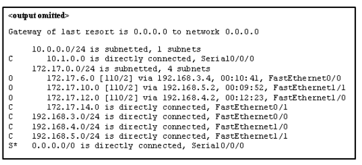
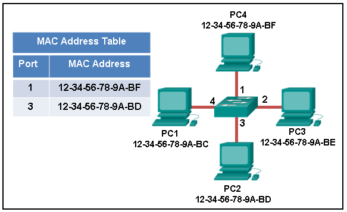
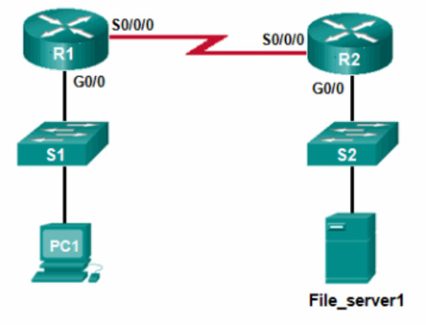
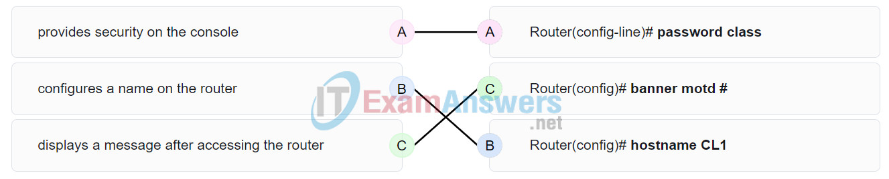
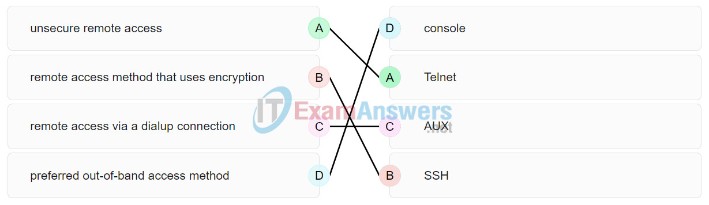
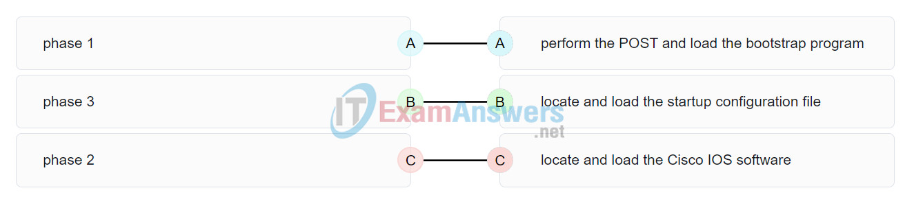
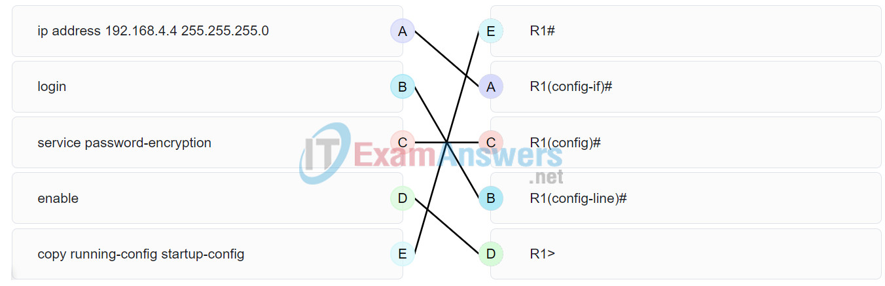
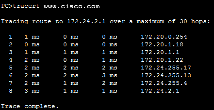
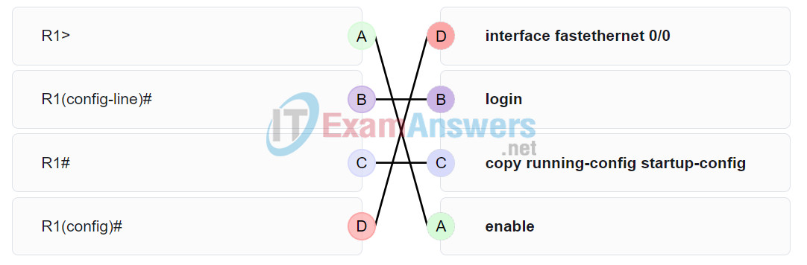
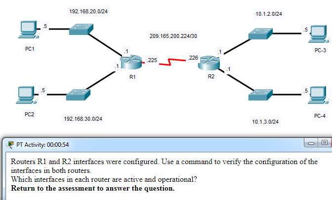

# CCNA 1 - Modules 8 - 10 Communicating Between Networks Exam Answers

## Question 1

**Question:**
Which information is used by routers to forward a data packet toward its destination?

**Choices:**
- **A.** source IP address
- **B.** destination IP address
- **C.** source data-link address
- **D.** destination data-link address

**Correct Answer:**
destination IP address

**Explanation:**
Topic 8.5.1

---

## Question 2

**Question:**
A computer has to send a packet to a destination host in the same LAN. How will the packet be sent?

**Choices:**
- **A.** The packet will be sent to the default gateway first, and then, depending on the response from the gateway, it may be sent to the destination host.
- **B.** The packet will be sent directly to the destination host.
- **C.** The packet will first be sent to the default gateway, and then from the default gateway it will be sent directly to the destination host.
- **D.** The packet will be sent only to the default gateway.

**Correct Answer:**
The packet will be sent directly to the destination host.

**Explanation:**
Topic 8.4.1

---

## Question 3

**Question:**
A router receives a packet from the Gigabit 0/0 interface and determines that the packet needs to be forwarded out the Gigabit 0/1 interface. What will the router do next?

**Choices:**
- **A.** route the packet out the Gigabit 0/1 interface
- **B.** create a new Layer 2 Ethernet frame to be sent to the destination
- **C.** look into the ARP cache to determine the destination IP address
- **D.** look into the routing table to determine if the destination network is in the routing table

**Correct Answer:**
create a new Layer 2 Ethernet frame to be sent to the destination

**Explanation:**
Topic 8.5.1

---

## Question 4

**Question:**
Which IPv4 address can a host use to ping the loopback interface?

**Choices:**
- **A.** 126.0.0.1
- **B.** 127.0.0.0
- **C.** 126.0.0.0
- **D.** 127.0.0.1

**Correct Answer:**
127.0.0.1

**Explanation:**
Topic 8.4.1

---

## Question 5

**Question:**
A computer can access devices on the same network but cannot access devices on other networks. What is the probable cause of this problem?

**Choices:**
- **A.** The cable is not connected properly to the NIC.
- **B.** The computer has an invalid IP address.
- **C.** The computer has an incorrect subnet mask.
- **D.** The computer has an invalid default gateway address.

**Correct Answer:**
The computer has an invalid default gateway address.

**Explanation:**
Topic 8.4.2

---

## Question 6

**Question:**
Which statement describes a feature of the IP protocol?

**Choices:**
- **A.** IP encapsulation is modified based on network media.
- **B.** IP relies on Layer 2 protocols for transmission error control.
- **C.** MAC addresses are used during the IP packet encapsulation.
- **D.** IP relies on upper layer services to handle situations of missing or out-of-order packets.

**Correct Answer:**
IP relies on upper layer services to handle situations of missing or out-of-order packets.

**Explanation:**
Topic 8.1.5 IP protocol is a connection-less protocol, considered unreliable in terms of end-to-end delivery. It does not provide error control in the cases where receiving packets are out-of-order or in cases of missing packets. It relies on upper layer services, such as TCP, to resolve these issues.

---

## Question 7

**Question:**
Why is NAT not needed in IPv6?​

**Choices:**
- **A.** Because IPv6 has integrated security, there is no need to hide the IPv6 addresses of internal networks.​
- **B.** Any host or user can get a public IPv6 network address because the number of available IPv6 addresses is extremely large.​
- **C.** The problems that are induced by NAT applications are solved because the IPv6 header improves packet handling by intermediate routers.​
- **D.** The end-to-end connectivity problems that are caused by NAT are solved because the number of routes increases with the number of nodes that are connected to the Internet.

**Correct Answer:**
Any host or user can get a public IPv6 network address because the number of available IPv6 addresses is extremely large.​

**Explanation:**
Topic 8.3.2 The large number of public IPv6 addresses eliminates the need for NAT. Sites from the largest enterprises to single households can get public IPv6 network addresses. This avoids some of the NAT-induced application problems that are experienced by applications that require end-to-end connectivity.

---

## Question 8

**Question:**
Which parameter does the router use to choose the path to the destination when there are multiple routes available?

**Choices:**
- **A.** the lower metric value that is associated with the destination network
- **B.** the lower gateway IP address to get to the destination network
- **C.** the higher metric value that is associated with the destination network
- **D.** the higher gateway IP address to get to the destination network

**Correct Answer:**
the lower metric value that is associated with the destination network

**Explanation:**
Topic 8.5.1

---

## Question 9

**Question:**
What are two services provided by the OSI network layer? (Choose two.)

**Choices:**
- **A.** performing error detection
- **B.** routing packets toward the destination
- **C.** encapsulating PDUs from the transport layer
- **D.** placement of frames on the media
- **E.** collision detection

**Correct Answer:**
routing packets toward the destination; encapsulating PDUs from the transport layer

**Explanation:**
Topic 8.1.1 The OSI network layer provides several services to allow communication between devices: addressing encapsulation routing de-encapsulation Error detection, placing frames on the media, and collision detection are all functions of the data ink layer.

---

## Question 10

**Question:**
Within a production network, what is the purpose of configuring a switch with a default gateway address?

**Choices:**
- **A.** Hosts that are connected to the switch can use the switch default gateway address to forward packets to a remote destination.
- **B.** A switch must have a default gateway to be accessible by Telnet and SSH.
- **C.** The default gateway address is used to forward packets originating from the switch to remote networks.
- **D.** It provides a next-hop address for all traffic that flows through the switch.

**Correct Answer:**
The default gateway address is used to forward packets originating from the switch to remote networks.

**Explanation:**
Topic 8.4.2 A default gateway address allows a switch to forward packets that originate on the switch to remote networks. A default gateway address on a switch does not provide Layer 3 routing for PCs that are connected on that switch. A switch can still be accessible from Telnet as long as the source of the Telnet connection is on the local network.

---

## Question 11

**Question:**
What is a basic characteristic of the IP protocol?

**Choices:**
- **A.** connectionless
- **B.** media dependent
- **C.** user data segmentation
- **D.** reliable end-to-end delivery

**Correct Answer:**
connectionless

**Explanation:**
Topic 8.1.3 Internet Protocol (IP) is a network layer protocol that does not require initial exchange of control information to establish an end-to-end connection before packets are forwarded. Thus, IP is connectionless and does not provide reliable end-to-end delivery by itself. IP is media independent. User data segmentation is a service provided at the transport layer.

---

## Question 12

**Question:**
Which field in the IPv4 header is used to prevent a packet from traversing a network endlessly?

**Choices:**
- **A.** Time-to-Live
- **B.** Sequence Number
- **C.** Acknowledgment Number
- **D.** Differentiated Services

**Correct Answer:**
Time-to-Live

**Explanation:**
Topic 8.2.2 The value of the Time-to-Live (TTL) field in the IPv4 header is used to limit the lifetime of a packet. The sending host sets the initial TTL value; which is decreased by one each time the packet is processed by a router. If the TTL field decrements to zero, the router discards the packet and sends an Internet Control Message Protocol (ICMP) Time Exceeded message to the source IP address. The Differentiated Services (DS) field is used to determine the priority of each packet. Sequence Number and Acknowledgment Number are two fields in the TCP header.

---

## Question 13

**Question:**
What is one advantage that the IPv6 simplified header offers over IPv4?

**Choices:**
- **A.** smaller-sized header
- **B.** little requirement for processing checksums
- **C.** smaller-sized source and destination IP addresses
- **D.** efficient packet handling

**Correct Answer:**
efficient packet handling

**Explanation:**
Topic 8.3.3 The IPv6 simplified header offers several advantages over IPv4: Better routing efficiency and efficient packet handling for performance and forwarding-rate scalability No requirement for processing checksums Simplified and more efficient extension header mechanisms (as opposed to the IPv4 Options field) A Flow Label field for per-flow processing with no need to open the transport inner packet to identify the various traffic flows

---

## Question 14

**Question:**
What IPv4 header field identifies the upper layer protocol carried in the packet?

**Choices:**
- **A.** Protocol
- **B.** Identification
- **C.** Version
- **D.** Differentiated Services

**Correct Answer:**
Protocol

**Explanation:**
Topic 8.2.2 It is the Protocol field in the IP header that identifies the upper-layer protocol the packet is carrying. The Version field identifies the IP version. The Differential Services field is used for setting packet priority. The Identification field is used to reorder fragmented packets.

---

## Question 15

**Question:**
Refer to the exhibit. Match the packets with their destination IP address to the exiting interfaces on the router. (Not all targets are used.) Place the options in the following order: packets with destination of 172.17.6.15 FastEthernet0/0 packets with destination of 172.17.14.8 FastEthernet0/1 packets with destination of 172.17.12.10 FastEthernet1/0 packets with destination of 172.17.10.5 FastEthernet1/1 packets with destination of 172.17.8.20 Serial0/0/0

**Images:**

**Explanation:**
Topic 8.5.1 Packets with a destination of 172.17.6.15 are forwarded through Fa0/0. Packets with a destination of 172.17.10.5 are forwarded through Fa1/1. Packets with a destination of 172.17.12.10 are forwarded through Fa1/0. Packets with a destination of 172.17.14.8 are forwarded through Fa0/1. Because network 172.17.8.0 has no entry in the routing table, it will take the gateway of last resort, which means that packets with a destination of 172.17.8.20 are forwarded through Serial0/0/0. Because a gateway of last resort exists, no packets will be dropped.

---

## Question 16

**Question:**
What information does the loopback test provide?

**Choices:**
- **A.** The TCP/IP stack on the device is working correctly.
- **B.** The device has end-to-end connectivity.
- **C.** DHCP is working correctly.
- **D.** The Ethernet cable is working correctly.
- **E.** The device has the correct IP address on the network.

**Correct Answer:**
The TCP/IP stack on the device is working correctly.

**Explanation:**
Topic 8.4.1 Because the loopback test sends packets back to the host device, it does not provide information about network connectivity to other hosts. The loopback test verifies that the host NIC, drivers, and TCP/IP stack are functioning.

---

## Question 17

**Question:**
What routing table entry has a next hop address associated with a destination network?

**Choices:**
- **A.** directly-connected routes
- **B.** local routes
- **C.** remote routes
- **D.** C and L source routes

**Correct Answer:**
remote routes

**Explanation:**
Topic 8.5.4 Routing table entries for remote routes will have a next hop IP address. The next hop IP address is the address of the router interface of the next device to be used to reach the destination network. Directly-connected and local routes have no next hop, because they do not require going through another router to be reached.

---

## Question 18

**Question:**
How do hosts ensure that their packets are directed to the correct network destination?

**Choices:**
- **A.** They have to keep their own local routing table that contains a route to the loopback interface, a local network route, and a remote default route.​
- **B.** They always direct their packets to the default gateway, which will be responsible for the packet delivery.
- **C.** They search in their own local routing table for a route to the network destination address and pass this information to the default gateway.
- **D.** They send a query packet to the default gateway asking for the best route.

**Correct Answer:**
They have to keep their own local routing table that contains a route to the loopback interface, a local network route, and a remote default route.​

**Explanation:**
Topic 8.4.4 Hosts must maintain their own local routing table to ensure that network layer packets are directed to the correct destination network. This local table typically contains a route to the loopback interface, a route to the network that the host is connected to, and a local default route, which represents the route that packets must take to reach all remote network addresses.

---

## Question 19

**Question:**
When transporting data from real-time applications, such as streaming audio and video, which field in the IPv6 header can be used to inform the routers and switches to maintain the same path for the packets in the same conversation?

**Choices:**
- **A.** Next Header
- **B.** Flow Label
- **C.** Traffic Class
- **D.** Differentiated Services

**Correct Answer:**
Flow Label

**Explanation:**
Topic 8.3.4 The Flow Label in IPv6 header is a 20-bit field that provides a special service for real-time applications. This field can be used to inform routers and switches to maintain the same path for the packet flow so that packets will not be reordered.

---

## Question 20

**Question:**
What statement describes the function of the Address Resolution Protocol?

**Choices:**
- **A.** ARP is used to discover the IP address of any host on a different network.
- **B.** ARP is used to discover the IP address of any host on the local network.
- **C.** ARP is used to discover the MAC address of any host on a different network.
- **D.** ARP is used to discover the MAC address of any host on the local network.

**Correct Answer:**
ARP is used to discover the MAC address of any host on the local network.

**Explanation:**
Topic 9.2.1 When a PC wants to send data on the network, it always knows the IP address of the destination. However, it also needs to discover the MAC address of the destination. ARP is the protocol that is used to discover the MAC address of a host that belongs to the same network.

---

## Question 21

**Question:**
Under which two circumstances will a switch flood a frame out of every port except the port that the frame was received on? (Choose two.)

**Choices:**
- **A.** The frame has the broadcast address as the destination address.
- **B.** The destination address is unknown to the switch.
- **C.** The source address in the frame header is the broadcast address.
- **D.** The source address in the frame is a multicast address.
- **E.** The destination address in the frame is a known unicast address.

**Correct Answer:**
The frame has the broadcast address as the destination address.; The destination address is unknown to the switch.

**Explanation:**
Topic 9.2.3 A switch will flood a frame out of every port, except the one that the frame was received from, under two circumstances. Either the frame has the broadcast address as the destination address, or the destination address is unknown to the switch.

---

## Question 22

**Question:**
Which statement describes the treatment of ARP requests on the local link?

**Choices:**
- **A.** They must be forwarded by all routers on the local network.
- **B.** They are received and processed by every device on the local network.
- **C.** They are dropped by all switches on the local network.
- **D.** They are received and processed only by the target device.

**Correct Answer:**
They are received and processed by every device on the local network.

**Explanation:**
Topic 9.2.8 One of the negative issues with ARP requests is that they are sent as a broadcast. This means all devices on the local link must receive and process the request.

---

## Question 23

**Question:**
Which destination address is used in an ARP request frame?

**Choices:**
- **A.** 0.0.0.0
- **B.** 255.255.255.255
- **C.** FFFF.FFFF.FFFF
- **D.** AAAA.AAAA.AAAA
- **E.** the physical address of the destination host

**Correct Answer:**
FFFF.FFFF.FFFF

**Explanation:**
Topic 9.2.3 The purpose of an ARP request is to find the MAC address of the destination host on an Ethernet LAN. The ARP process sends a Layer 2 broadcast to all devices on the Ethernet LAN. The frame contains the IP address of the destination and the broadcast MAC address, FFFF.FFFF.FFFF. The host with the IP address that matches the IP address in the ARP request will reply with a unicast frame that includes the MAC address of the host. Thus the original sending host will obtain the destination IP and MAC address pair to continue the encapsulation process for data transmission.

---

## Question 24

**Question:**
A network technician issues the arp -d * command on a PC after the router that is connected to the LAN is reconfigured. What is the result after this command is issued?

**Choices:**
- **A.** The ARP cache is cleared.
- **B.** The current content of the ARP cache is displayed.
- **C.** The detailed information of the ARP cache is displayed.
- **D.** The ARP cache is synchronized with the router interface.

**Correct Answer:**
The ARP cache is cleared.

**Explanation:**
Topic 9.2.6 Issuing the arp –d * command on a PC will clear the ARP cache content. This is helpful when a network technician wants to ensure the cache is populated with updated information.

---

## Question 25

**Question:**
Refer to the exhibit. The exhibit shows a small switched network and the contents of the MAC address table of the switch. PC1 has sent a frame addressed to PC3. What will the switch do with the frame?

**Images:**

**Choices:**
- **A.** The switch will discard the frame.
- **B.** The switch will forward the frame only to port 2.
- **C.** The switch will forward the frame to all ports except port 4.
- **D.** The switch will forward the frame to all ports.
- **E.** The switch will forward the frame only to ports 1 and 3.

**Correct Answer:**
The switch will forward the frame to all ports except port 4.

**Explanation:**
Topic 9.2.8 The MAC address of PC3 is not present in the MAC table of the switch. Because the switch does not know where to send the frame that is addressed to PC3, it will forward the frame to all the switch ports, except for port 4, which is the incoming port.

---

## Question 26

**Question:**
Which two types of IPv6 messages are used in place of ARP for address resolution?

**Choices:**
- **A.** anycast
- **B.** broadcast
- **C.** echo reply
- **D.** echo request
- **E.** neighbor solicitation
- **F.** neighbor advertisement

**Correct Answer:**
neighbor solicitation; neighbor advertisement

**Explanation:**
Topic 9.3.2 IPv6 does not use ARP. Instead, ICMPv6 neighbor discovery is used by sending neighbor solicitation and neighbor advertisement messages.

---

## Question 27

**Question:**
What is the aim of an ARP spoofing attack?

**Choices:**
- **A.** to flood the network with ARP reply broadcasts
- **B.** to fill switch MAC address tables with bogus addresses
- **C.** to associate IP addresses to the wrong MAC address
- **D.** to overwhelm network hosts with ARP requests

**Correct Answer:**
to associate IP addresses to the wrong MAC address

**Explanation:**
Topic 9.2.8 In an ARP spoofing attack, a malicious host intercepts ARP requests and replies to them so that network hosts will map an IP address to the MAC address of the malicious host.

---

## Question 28

**Question:**
Refer to the exhibit. PC1 attempts to connect to File_server1 and sends an ARP request to obtain a destination MAC address. Which MAC address will PC1 receive in the ARP reply?

**Images:**

**Choices:**
- **A.** the MAC address of S1
- **B.** the MAC address of the G0/0 interface on R1
- **C.** the MAC address of the G0/0 interface on R2
- **D.** the MAC address of S2
- **E.** the MAC address of File_server1

**Correct Answer:**
the MAC address of the G0/0 interface on R1

**Explanation:**
Topic 9.2.5 PC1 must have a MAC address to use as a destination Layer 2 address. PC1 will send an ARP request as a broadcast and R1 will send back an ARP reply with its G0/0 interface MAC address. PC1 can then forward the packet to the MAC address of the default gateway, R1.

---

## Question 29

**Question:**
Where are IPv4 address to Layer 2 Ethernet address mappings maintained on a host computer?

**Choices:**
- **A.** neighbor table
- **B.** ARP cache
- **C.** routing table
- **D.** MAC address table

**Correct Answer:**
ARP cache

**Explanation:**
Topic 9.2.2 The ARP cache is used to store IPv4 addresses and the Ethernet physical addresses or MAC addresses to which the IPv4 addresses are mapped. Incorrect mappings of IP addresses to MAC addresses can result in loss of end-to-end connectivity.

---

## Question 30

**Question:**
What important information is examined in the Ethernet frame header by a Layer 2 device in order to forward the data onward?

**Choices:**
- **A.** source MAC address
- **B.** source IP address
- **C.** destination MAC address
- **D.** Ethernet type
- **E.** destination IP address

**Correct Answer:**
destination MAC address

**Explanation:**
Topic 9.1.1 The Layer 2 device, such as a switch, uses the destination MAC address to determine which path (interface or port) should be used to send the data onward to the destination device.

---

## Question 31

**Question:**
Match the commands to the correct actions. (Not all options are used.)

**Images:**

**Explanation:**
Topic 10.1.1 Place the options in the following order: displays a message after accessing the router Router(config)# banner motd # provides security on the console Router(config-line)# password class configures a name on the router Router(config)# hostname CL1

---

## Question 32

**Question:**
A new network administrator has been asked to enter a banner message on a Cisco device. What is the fastest way a network administrator could test whether the banner is properly configured?

**Choices:**
- **A.** Reboot the device.
- **B.** Enter CTRL-Z at the privileged mode prompt.
- **C.** Exit global configuration mode.
- **D.** Power cycle the device.
- **E.** Exit privileged EXEC mode and press Enter.

**Correct Answer:**
Exit privileged EXEC mode and press Enter.

**Explanation:**
Topic 10.1.1 While at the privileged mode prompt such as Router#, type exit,press Enter, and the banner message appears. Power cycling a network device that has had the banner motd command issued will also display the banner message, but this is not a quick way to test the configuration.

---

## Question 33

**Question:**
A network administrator requires access to manage routers and switches locally and remotely. Match the description to the access method. (Not all options are used.) Place the options in the following order: remote access method that uses encryption SSH preferred out-of-band access method console remote access via a dialup connection AUX unsecure remote access Telnet

**Images:**

**Explanation:**
Topic 10.1.1 Both the console and AUX ports can be used to directly connect to a Cisco network device for management purposes. However, it is more common to use the console port. The AUX port is more often used for remote access via a dial up connection. SSH and Telnet are both remote access methods that depend on an active network connection. SSH uses a stronger password authentication than Telnet uses and also uses encryption on transmitted data.

---

## Question 34

**Question:**
Match the phases to the functions during the boot up process of a Cisco router. (Not all options are used.)

**Images:**

**Explanation:**
Topic 10.1.1 There are three major phases to the bootup process of a Cisco router: Perform the POST and load the bootstrap program. Locate and load the Cisco IOS software. Locate and load the startup configuration file If a startup configuration file cannot be located, the router will enter setup mode by displaying the setup mode prompt.

---

## Question 35

**Question:**
Match the command with the device mode at which the command is entered. (Not all options are used.) Place the options in the following order: service password-encryption R1(config)# enable R1> copy running-config startup-config R1# login R1(config-line)# ip address 192.168.4.4 255.255.255.0 R1(config-if)#

**Images:**

**Explanation:**
Topic 10.1.1 The enable command is entered in R1> mode. The login command is entered in R1(config-line)# mode. The copy running-config startup-config command is entered in R1# mode. The ip address 192.168.4.4 255.255.255.0 command is entered in R1(config-if)# mode. The service password-encryption command is entered in global configuration mode.

---

## Question 36

**Question:**
What are two functions of NVRAM? (Choose two.)

**Choices:**
- **A.** to store the routing table
- **B.** to retain contents when power is removed
- **C.** to store the startup configuration file
- **D.** to contain the running configuration file
- **E.** to store the ARP table

**Correct Answer:**
to retain contents when power is removed; to store the startup configuration file

**Explanation:**
Topic 10.1.1 NVRAM is permanent memory storage, so the startup configuration file is preserved even if the router loses power.

---

## Question 37

**Question:**
A router boots and enters setup mode. What is the reason for this?

**Choices:**
- **A.** The IOS image is corrupt.
- **B.** Cisco IOS is missing from flash memory.
- **C.** The configuration file is missing from NVRAM.
- **D.** The POST process has detected hardware failure.

**Correct Answer:**
The configuration file is missing from NVRAM.

**Explanation:**
Topic 10.1.1 If a router cannot locate the startup-config file in NVRAM, it will enter setup mode to allow the configuration to be entered from the console device.

---

## Question 38

**Question:**
The global configuration command ip default-gateway 172.16.100.1 is applied to a switch. What is the effect of this command?

**Choices:**
- **A.** The switch will have a management interface with the address 172.16.100.1.
- **B.** The switch can be remotely managed from a host on another network.
- **C.** The switch can communicate with other hosts on the 172.16.100.0 network.
- **D.** The switch is limited to sending and receiving frames to and from the gateway 172.16.100.1.

**Correct Answer:**
The switch can be remotely managed from a host on another network.

**Explanation:**
Topic 10.3.2 A default gateway address is typically configured on all devices to allow them to communicate beyond just their local network.In a switch this is achieved using the command ip default-gateway <ip address>.

---

## Question 39

**Question:**
What happens when the transport input ssh command is entered on the switch vty lines?

**Choices:**
- **A.** The SSH client on the switch is enabled.
- **B.** Communication between the switch and remote users is encrypted.
- **C.** The switch requires a username/password combination for remote access.
- **D.** The switch requires remote connections via a proprietary client software.

**Correct Answer:**
Communication between the switch and remote users is encrypted.

**Explanation:**
Topic 10.1.1 The transport input ssh command when entered on the switch vty (virtual terminal lines) will encrypt all inbound controlled telnet connections.

---

## Question 40

**Question:**
Refer to the exhibit. A user PC has successfully transmitted packets to www.cisco.com. Which IP address does the user PC target in order to forward its data off the local network?

**Images:**

**Choices:**
- **A.** 172.24.255.17
- **B.** 172.24.1.22
- **C.** 172.20.0.254
- **D.** 172.24.255.4
- **E.** 172.20.1.18

**Correct Answer:**
172.20.0.254

**Explanation:**
Topic 10.3.1

---

## Question 41

**Question:**
Match the configuration mode with the command that is available in that mode. (Not all options are used.) Place the options in the following order: R1> enable R1# copy running-config startup-config R1(config-line)# login R1(config)# interface fastethernet 0/0

**Images:**

**Explanation:**
Topic 10.2.1 The enable command is entered at the R1> prompt. The login command is entered at the R1(config-line)# prompt. The copy running-config startup-config command is entered at the R1# prompt. The interface fastethernet 0/0 command is entered at the R1(config)# prompt.

---

## Question 42

**Question:**
Which three commands are used to set up secure access to a router through a connection to the console interface? (Choose three.)

**Choices:**
- **A.** interface fastethernet 0/0
- **B.** line vty 0 4
- **C.** line console 0
- **D.** enable secret cisco
- **E.** login
- **F.** password cisco

**Correct Answer:**
line console 0; login; password cisco

**Explanation:**
Topic 10.1.1 The three commands needed to password protect the console port are as follows: line console 0 password cisco login The interface fastethernet 0/0 command is commonly used to access the configuration mode used to apply specific parameters such as the IP address to the Fa0/0 port. The line vty 0 4 command is used to access the configuration mode for Telnet. The0and 4 parameters specify ports 0 through 4, or a maximum of five simultaneous Telnet connections. The enable secret command is used to apply a password used on the router to access the privileged mode.

---

## Question 43

**Question:**
Refer to the exhibit. Consider the IP address configuration shown from PC1. What is a description of the default gateway address?

**Images:**

**Choices:**
- **A.** It is the IP address of the Router1 interface that connects the company to the Internet.
- **B.** It is the IP address of the Router1 interface that connects the PC1 LAN to Router1.
- **C.** It is the IP address of Switch1 that connects PC1 to other devices on the same LAN.
- **D.** It is the IP address of the ISP network device located in the cloud.

**Correct Answer:**
It is the IP address of the Router1 interface that connects the PC1 LAN to Router1.

**Explanation:**
Topic 10.3.1 The default gateway is used to route packets destined for remote networks. The default gateway IP address is the address of the first Layer 3 device (the router interface) that connects to the same network.

---

## Question 44

**Question:**
Which two functions are primary functions of a router? (Choose two.)

**Choices:**
- **A.** packet forwarding
- **B.** microsegmentation
- **C.** domain name resolution
- **D.** path selection
- **E.** flow control

**Correct Answer:**
packet forwarding; path selection

**Explanation:**
Topic 8.1.1 A router accepts a packet and accesses its routing table to determine the appropriate exit interface based on the destination address. The router then forwards the packet out of that interface.

---

## Question 45

**Question:**
What is the effect of using the Router# copy running-config startup-config command on a router?

**Choices:**
- **A.** The contents of ROM will change.
- **B.** The contents of RAM will change.
- **C.** The contents of NVRAM will change.
- **D.** The contents of flash will change.

**Correct Answer:**
The contents of NVRAM will change.

**Explanation:**
Topic 10.1.1 The command copy running-config startup-config copies the running-configuration file from RAM into NVRAM and saves it as the startup-configuration file. Since NVRAM is none-volatile memory it will be able to retain the configuration details when the router is powered off.

---

## Question 46

**Question:**
What will happen if the default gateway address is incorrectly configured on a host?

**Choices:**
- **A.** The host cannot communicate with other hosts in the local network.
- **B.** The switch will not forward packets initiated by the host.
- **C.** The host will have to use ARP to determine the correct address of the default gateway.
- **D.** The host cannot communicate with hosts in other networks.
- **E.** A ping from the host to 127.0.0.1 would not be successful.

**Correct Answer:**
The host cannot communicate with hosts in other networks.

**Explanation:**
Topic 10.3.1 When a host needs to send a message to another host located on the same network, it can forward the message directly. However, when a host needs to send a message to a remote network, it must use the router, also known as the default gateway. This is because the data link frame address of the remote destination host cannot be used directly. Instead, the IP packet has to be sent to the router (default gateway) and the router will forward the packet toward its destination. Therefore, if the default gateway is incorrectly configured, the host can communicate with other hosts on the same network, but not with hosts on remote networks.

---

## Question 47

**Question:**
What are two potential network problems that can result from ARP operation? (Choose two.)

**Choices:**
- **A.** Manually configuring static ARP associations could facilitate ARP poisoning or MAC address spoofing.
- **B.** On large networks with low bandwidth, multiple ARP broadcasts could cause data communication delays.
- **C.** Network attackers could manipulate MAC address and IP address mappings in ARP messages with the intent of intercepting network traffic.
- **D.** Large numbers of ARP request broadcasts could cause the host MAC address table to overflow and prevent the host from communicating on the network.
- **E.** Multiple ARP replies result in the switch MAC address table containing entries that match the MAC addresses of hosts that are connected to the relevant switch port.

**Correct Answer:**
On large networks with low bandwidth, multiple ARP broadcasts could cause data communication delays.; Network attackers could manipulate MAC address and IP address mappings in ARP messages with the intent of intercepting network traffic.

**Explanation:**
Topic 9.2.8 Large numbers of ARP broadcast messages could cause momentary data communications delays. Network attackers could manipulate MAC address and IP address mappings in ARP messages with the intent to intercept network traffic. ARP requests and replies cause entries to be made into the ARP table, not the MAC address table. ARP table overflows are very unlikely. Manually configuring static ARP associations is a way to prevent, not facilitate, ARP poisoning and MAC address spoofing. Multiple ARP replies resulting in the switch MAC address table containing entries that match the MAC addresses of connected nodes and are associated with the relevant switch port are required for normal switch frame forwarding operations. It is not an ARP caused network problem.

---

## Question 48

**Question:**
Open the PT activity. Perform the tasks in the activity instructions and then answer the question. CCNA 1 v7 Modules 8 – 10 Communicating Between Networks Exam Modules 8 - 10 Communicating Between Networks Packet Tracer file 235.82 KB 10856 downloads ... Download Which interfaces in each router are active and operational? R1: G0/0 and S0/0/0 R2: G0/0 and S0/0/0 R1: G0/1 and S0/0/1 R2: G0/0 and S0/0/1 R1: G0/0 and S0/0/0 R2: G0/1 and S0/0/0 R1: G0/0 and S0/0/1 R2: G0/1 and S0/0/1

**Images:**

**Explanation:**
Topic 10.2.4 The command to use for this activity is show ip interface brief in each router. The active and operational interfaces are represented by the value “up” in the “Status” and “Protocol” columns. The interfaces in R1 with these characteristics are G0/0 and S0/0/0. In R2 they are G0/1 and S0/0/0.

---

## Question 49

**Question:**
Which term describes a field in the IPv4 packet header used to identify the next level protocol?

**Choices:**
- **A.** protocol
- **B.** destination IPv4 address
- **C.** source IPv4 address
- **D.** TTL

**Correct Answer:**
protocol

**Explanation:**
Topic 8.2.2 The protocol field in the IPv4 packet header is an 8-bit field used to identify the specific upper-layer protocol (Transport layer or next level) carried inside the packet’s payload. Once the destination host receives the Layer 3 packet and completes its processing, it inspects this field to determine which particular protocol handler or service should receive the de-encapsulated data. Common predefined decimal values used in this field include 6 for TCP , 17 for UDP , and 1 for ICMP , which enables seamless multiplexing between the Network and Transport layers.

---

## Question 50

**Question:**
Which term describes a field in the IPv4 packet header that contains an 8-bit binary value used to determine the priority of each packet?

**Choices:**
- **A.** differentiated services
- **B.** destination IPv4 address
- **C.** source IPv4 address
- **D.** protocol

**Correct Answer:**
differentiated services

**Explanation:**
Topic 8.2.2

---

## Question 51

**Question:**
Which term describes a field in the IPv4 packet header that contains a 32-bit binary value associated with an interface on the sending device?

**Choices:**
- **A.** source IPv4 address
- **B.** destination IPv4 address
- **C.** protocol
- **D.** TTL

**Correct Answer:**
source IPv4 address

**Explanation:**
Topic 8.2.2 The source IPv4 address is a 32-bit field within the IPv4 packet header that identifies the logical address of the interface on the sending device. When a host transmits data across a network, it inserts its own IP address into this field. This allows the destination device to identify the origin of the packet, ensuring it knows exactly where to send any subsequent return traffic, acknowledgments, or error messages.

---

## Question 52

**Question:**
Which term describes a field in the IPv4 packet header used to detect corruption in the IPv4 header?

**Choices:**
- **A.** header checksum
- **B.** source IPv4 address
- **C.** protocol
- **D.** TTL
- **E.** 10.27.14.148
- **F.** 10.27.14.1
- **G.** 10.14.15.254
- **H.** 203.0.113.39
- **I.** 10.27.15.17

**Correct Answer:**
header checksum; 10.27.14.148

**Explanation:**
Topic 8.2.2 The header checksum field is a 16-bit field in the IPv4 header used to verify the integrity of the header data. During transmission, the sending device calculates a checksum value based on the fields within the IP header. When the packet arrives at its destination, the receiving device performs the same calculation. If the calculated value does not match the received value, the packet is considered corrupted and is discarded immediately by the receiving node. 53. Copy RTR1(config)# interface gi0/1 RTR1(config-if)# description Connects to the Marketing LAN RTR1(config-if)# ip address 10.27.15.17 255.255.255.0 RTR1(config-if)# no shutdown RTR1(config-if)# interface gi0/0 RTR1(config-if)# description Connects to the Payroll LAN RTR1(config-if)# ip address 10.27.14.148 255.255.255.0 RTR1(config-if)# no shutdown RTR1(config-if)# interface s0/0/0 RTR1(config-if)# description Connects to the ISP RTR1(config-if)# ip address 10.14.15.254 255.255.255.0 RTR1(config-if)# no shutdown RTR1(config-if)# interface s0/0/1 RTR1(config-if)# description Connects to the Head Office WAN RTR1(config-if)# ip address 203.0.113.39 255.255.255.0 RTR1(config-if)# no shutdown RTR1(config-if)# end Refer to the exhibit. A network administrator is connecting a new host to the Payroll LAN. The host needs to communicate with remote networks. What IP address would be configured as the default gateway on the new host? Topic 10.3.1 A host’s default gateway must always correspond to the IP address of the local router interface that is directly attached to its specific network segment. By examining the configuration output in the exhibit, it is evident that interface gi0/0 is configured with the description description Connects to the Payroll LAN. The unique IP address assigned to this interface is 10.27.14.148 . Consequently, any new host deployed on the “Payroll LAN” must use this exact IP address as its default gateway to successfully communicate with destinations on remote networks.

---

## Question 53

**Question:**
Which term describes a field in the IPv4 packet header that contains a unicast, multicast, or broadcast address?

**Choices:**
- **A.** destination IPv4 address
- **B.** protocol
- **C.** TTL
- **D.** header checksum

**Correct Answer:**
destination IPv4 address

**Explanation:**
Topic 8.2.2 The destination IPv4 address is a 32-bit field in the IP header that specifies the logical address of the end device to which the packet is being sent. This field can hold a unicast address (for a specific single host), a multicast address (for a specific group of hosts), or a broadcast address (for all hosts on the local network segment). Routers inspect this address to perform route lookups in their routing tables, ensuring the packet is forwarded out of the appropriate interface toward the intended destination.

---

## Question 54

**Question:**
Which term describes a field in the IPv4 packet header used to limit the lifetime of a packet?

**Choices:**
- **A.** TTL
- **B.** source IPv4 address
- **C.** protocol
- **D.** header checksum

**Correct Answer:**
TTL

**Explanation:**
Topic 8.2.2 The TTL ( Time-to-Live ) field is an 8-bit value in the IPv4 header used to prevent a packet from circulating endlessly in a network (for instance, due to a routing loop). The originating host sets an initial value; every time a router processes the packet, it decrements this value by one. If the TTL reaches zero before reaching its destination, the router discards the packet and sends an ICMP “Time Exceeded” message back to the source.

---

## Question 55

**Question:**
Which term describes a field in the IPv4 packet header that contains a 4-bit binary value set to 0100?

**Choices:**
- **A.** version
- **B.** source IPv4 address
- **C.** protocol
- **D.** TTL

**Correct Answer:**
version

**Explanation:**
Topic 8.2.2 The version field in the IPv4 packet header is a 4-bit field that identifies which internet protocol version is being used to format the Layer 3 data. The binary value 0100 directly translates to the decimal number 4 , which explicitly instructs routers and receiving network devices to process the incoming packet according to IPv4 structural standards and specifications. Conversely, a binary value of 0110 (decimal 6) in this exact field would signify an IPv6 packet architecture.

---

## Question 56

**Question:**
Which term describes a field in the IPv4 packet header used to identify the next level protocol?

**Choices:**
- **A.** protocol
- **B.** version
- **C.** differentiated services
- **D.** header checksum

**Correct Answer:**
protocol

**Explanation:**
Topic 8.2.2 The protocol field in the IPv4 packet header is an 8-bit field used to identify the specific upper-layer protocol (Transport layer or next level) carried inside the packet’s payload. Once the destination host receives the Layer 3 packet and completes its processing, it inspects this field to determine which particular protocol handler or service should receive the de-encapsulated data. Common predefined decimal values used in this field include 6 for TCP , 17 for UDP , and 1 for ICMP , which enables seamless multiplexing between the Network and Transport layers.

---

## Question 57

**Question:**
Which term describes a field in the IPv4 packet header that contains a 4-bit binary value set to 0100?

**Choices:**
- **A.** version
- **B.** differentiated services
- **C.** header checksum
- **D.** TTL

**Correct Answer:**
version

**Explanation:**
Topic 8.2.2 The version field in the IPv4 packet header is a 4-bit field that identifies which internet protocol version is being used to format the Layer 3 data. The binary value 0100 directly translates to the decimal number 4 , which explicitly instructs routers and receiving network devices to process the incoming packet according to IPv4 structural standards and specifications. Conversely, a binary value of 0110 (decimal 6) in this exact field would signify an IPv6 packet architecture.

---

## Question 58

**Question:**
What property of ARP causes cached IP-to-MAC mappings to remain in memory longer?

**Choices:**
- **A.** Entries in an ARP table are time-stamped and are purged after the timeout expires.
- **B.** A static IP-to-MAC address entry can be entered manually into an ARP table.
- **C.** The type field 0x806 appears in the header of the Ethernet frame.
- **D.** The port-to-MAC address table on a switch has the same entries as the ARP table on the switch.

**Correct Answer:**
Entries in an ARP table are time-stamped and are purged after the timeout expires.

**Explanation:**
Topic 9.2.4

---

## Question 59

**Question:**
What property of ARP allows MAC addresses of frequently used servers to be fixed in the ARP table?

**Choices:**
- **A.** A static IP-to-MAC address entry can be entered manually into an ARP table.
- **B.** Entries in an ARP table are time-stamped and are purged after the timeout expires.
- **C.** The type field 0x806 appears in the header of the Ethernet frame.
- **D.** The port-to-MAC address table on a switch has the same entries as the ARP table on the switch.

**Correct Answer:**
A static IP-to-MAC address entry can be entered manually into an ARP table.

**Explanation:**
Topic 9.2.4

---

## Question 60

**Question:**
What property of ARP allows MAC addresses of frequently used servers to be fixed in the ARP table?

**Choices:**
- **A.** A static IP-to-MAC address entry can be entered manually into an ARP table.
- **B.** The destination MAC address FF-FF-FF-FF-FF-FF appears in the header of the Ethernet frame.
- **C.** The source MAC address appears in the header of the Ethernet frame.
- **D.** The port-to-MAC address table on a switch has the same entries as the ARP table on the switch.

**Correct Answer:**
A static IP-to-MAC address entry can be entered manually into an ARP table.

**Explanation:**
Topic 9.2.4 By default, ARP table entries are dynamic and include an aging timer, which purges them automatically to ensure that the mapping information remains current. However, for critical devices like frequently used servers, a network administrator can configure a static entry . Because these are manually defined, they are not subject to aging timers and remain “fixed” in the device’s memory until they are explicitly deleted or the device is rebooted, which ensures immediate and reliable address resolution without the overhead of ARP requests.

---

## Question 61

**Question:**
What property of ARP allows hosts on a LAN to send traffic to remote networks?

**Choices:**
- **A.** Local hosts learn the MAC address of the default gateway.
- **B.** The destination MAC address FF-FF-FF-FF-FF-FF appears in the header of the Ethernet frame.
- **C.** The source MAC address appears in the header of the Ethernet frame.
- **D.** The port-to-MAC address table on a switch has the same entries as the ARP table on the switch.
- **E.** 192.168.235.234
- **F.** 192.168.235.1
- **G.** 10.234.235.254
- **H.** 203.0.113.3
- **I.** 192.168.234.114

**Correct Answer:**
Local hosts learn the MAC address of the default gateway.; 192.168.235.234

**Explanation:**
Topic 9.2.4 When a local host wants to send data to a device on a remote network, the Layer 3 IP packet contains the ultimate destination IP address. However, to deliver the frame over the local network medium at Layer 2, the host must encapsulate and address the frame to its default gateway (the local router). Since the host initially only knows the default gateway’s IPv4 address, it relies on ARP to dynamically discover its corresponding hardware MAC address. Once this MAC address is learned, the local host can successfully forward the traffic to the router for further internetwork routing. 63. Copy Floor(config)# interface gi0/1 Floor(config-if)# description Connects to the Registrar LAN Floor(config-if)# ip address 192.168.235.234 255.255.255.0 Floor(config-if)# no shutdown Floor(config-if)# interface gi0/0 Floor(config-if)# description Connects to the Manager LAN Floor(config-if)# ip address 192.168.234.114 255.255.255.0 Floor(config-if)# no shutdown Floor(config-if)# interface s0/0/0 Floor(config-if)# description Connects to the ISP Floor(config-if)# ip address 10.234.235.254 255.255.255.0 Floor(config-if)# no shutdown Floor(config-if)# interface s0/0/1 Floor(config-if)# description Connects to the Head Office WAN Floor(config-if)# ip address 203.0.113.3 255.255.255.0 Floor(config-if)# no shutdown Floor(config-if)# end Refer to the exhibit. A network administrator is connecting a new host to the Registrar LAN. The host needs to communicate with remote networks. What IP address would be configured as the default gateway on the new host? Topic 10.3.1 A host’s default gateway must correspond to the IP address of the local router interface that is directly attached to its specific network segment. Based on the configuration snippet provided, the gi0/1 interface is configured with the description descripction Se conecta al Registrador LAN and has been assigned the IP address 192.168.235.234 . Consequently, any host connected to the “Registrar LAN” must use this specific IP address as its default gateway to successfully route traffic to remote networks.

---

## Question 62

**Question:**
What property of ARP forces all Ethernet NICs to process an ARP request?

**Choices:**
- **A.** The destination MAC address FF-FF-FF-FF-FF-FF appears in the header of the Ethernet frame.
- **B.** The source MAC address appears in the header of the Ethernet frame.
- **C.** The type field 0x806 appears in the header of the Ethernet frame.
- **D.** ARP replies are broadcast on the network when a host receives an ARP request.

**Correct Answer:**
The destination MAC address FF-FF-FF-FF-FF-FF appears in the header of the Ethernet frame.

**Explanation:**
Topic 9.2.3 The ARP protocol relies on Layer 2 broadcast frames to discover the MAC address of a target device when only its IP address is known. To ensure that an ARP request reaches every device within a local network segment, the frame must use the broadcast address FF:FF:FF:FF:FF:FF as the destination MAC address. By standard hardware design, every Ethernet network interface card (NIC) is mandated to accept and pass the data portion of any frame addressed to this specific broadcast address up to the ARP process for examination.

---

## Question 63

**Question:**
What property of ARP causes a reply only to the source sending an ARP request?

**Choices:**
- **A.** The source MAC address appears in the header of the Ethernet frame.
- **B.** The destination MAC address FF-FF-FF-FF-FF-FF appears in the header of the Ethernet frame.
- **C.** The type field 0x806 appears in the header of the Ethernet frame.
- **D.** ARP replies are broadcast on the network when a host receives an ARP request.

**Correct Answer:**
The source MAC address appears in the header of the Ethernet frame.

**Explanation:**
Topic 9.2.3 When a host sends an ARP request, it is broadcast to all devices on the local network. To ensure the destination host knows where to send the reply, the Ethernet frame header containing the ARP request includes the source MAC address of the requesting host. Upon receiving and processing the request, the target host uses this specific source MAC address to send an ARP reply directly (unicast) to the original requester, rather than broadcasting the reply to the entire network.

---

## Question 64

**Question:**
What property of ARP causes the request to be flooded out all ports of a switch except for the port receiving the ARP request?

**Choices:**
- **A.** The destination MAC address FF-FF-FF-FF-FF-FF appears in the header of the Ethernet frame.
- **B.** The type field 0x806 appears in the header of the Ethernet frame.
- **C.** Entries in an ARP table are time-stamped and are purged after the timeout expires.
- **D.** ARP replies are broadcast on the network when a host receives an ARP request.

**Correct Answer:**
The destination MAC address FF-FF-FF-FF-FF-FF appears in the header of the Ethernet frame.

**Explanation:**
Topic 9.2.3 When a host needs to discover the MAC address of another device, it sends an ARP request. Since it does not know the physical address of the destination, it sends it as a Layer 2 broadcast frame. The destination MAC address used for this purpose is FF-FF-FF-FF-FF-FF . By design, switches flood any frame addressed to this broadcast address out of all active ports, except the port where the frame was received, ensuring that every device on the local network segment receives the ARP request.

---

## Question 65

**Question:**
What property of ARP causes the NICs receiving an ARP request to pass the data portion of the Ethernet frame to the ARP process?

**Choices:**
- **A.** The type field 0x806 appears in the header of the Ethernet frame.
- **B.** The destination MAC address FF-FF-FF-FF-FF-FF appears in the header of the Ethernet frame.
- **C.** Entries in an ARP table are time-stamped and are purged after the timeout expires.
- **D.** ARP replies are broadcast on the network when a host receives an ARP request.

**Correct Answer:**
The type field 0x806 appears in the header of the Ethernet frame.

**Explanation:**
Topic 9.2.3 The Ethernet II frame header contains a 2-byte field known as the Type field (or EtherType) . This field is responsible for specifying which upper-layer protocol or local subsystem should receive the payload enclosed within the frame. Every network protocol has a distinct hexadecimal identifier; for the Address Resolution Protocol ( ARP ), this specific code is 0x0806 . When a receiving network interface card (NIC) decapsulates an incoming frame and reads 0x0806 in the Type field, it instantly recognizes that the contents belong to an ARP message. As a result, the NIC bypasses the standard network stacks like IPv4 (0x0800) or IPv6 (0x86DD) and hands the data portion directly to the operating system’s internal ARP process.

---

## Question 66

**Question:**
What property of ARP causes the NICs receiving an ARP request to pass the data portion of the Ethernet frame to the ARP process?

**Choices:**
- **A.** The type field 0x806 appears in the header of the Ethernet frame.
- **B.** The destination MAC address FF-FF-FF-FF-FF-FF appears in the header of the Ethernet frame.
- **C.** Entries in an ARP table are time-stamped and are purged after the timeout expires.
- **D.** The port-to-MAC address table on a switch has the same entries as the ARP table on the switch.
- **E.** 172.29.157.156
- **F.** 172.29.157.1
- **G.** 10.156.157.254
- **H.** 198.51.100.177
- **I.** 172.29.156.36
- **J.** 192.168.191.189
- **K.** 192.168.191.1
- **L.** 10.190.191.254
- **M.** 198.51.100.213
- **N.** 192.168.190.70
- **O.** 192.168.225.223
- **P.** 192.168.225.1
- **Q.** 10.224.225.254
- **R.** 203.0.113.246
- **S.** 192.168.224.103
- **T.** 10.118.62.196
- **U.** 10.118.62.1
- **V.** 10.62.63.254
- **W.** 209.165.200.87
- **X.** 10.118.63.65
- **Y.** 172.19.98.230
- **Z.** 172.19.98.1
- **[.** 10.98.99.254
- **\.** 209.165.200.120
- **].** 172.19.99.99
- **^.** 172.20.132.13
- **_.** 172.20.132.1
- **`.** 10.132.133.254
- **a.** 198.51.100.156
- **b.** 172.20.133.132
- **c.** 192.168.167.166
- **d.** 192.168.167.1
- **e.** 10.166.167.254
- **f.** 198.51.100.189
- **g.** 192.168.166.46
- **h.** 192.168.201.200
- **i.** 192.168.201.1
- **j.** 10.200.201.254
- **k.** 203.0.113.222
- **l.** 192.168.200.80

**Correct Answer:**
The type field 0x806 appears in the header of the Ethernet frame.; 172.29.157.156; 192.168.191.189; 192.168.225.223; 10.118.62.196; 172.19.98.230; 172.20.132.13; 192.168.167.166; 192.168.201.200

**Explanation:**
Topic 9.2.3 The Ethernet II frame header contains a 2-byte field known as the Type field (or EtherType) . This field is responsible for specifying which upper-layer protocol or local subsystem should receive the payload enclosed within the frame. Every network protocol has a distinct hexadecimal identifier; for the Address Resolution Protocol ( ARP ), this specific code is 0x0806 . When a receiving network interface card (NIC) decapsulates an incoming frame and reads 0x0806 in the Type field, it instantly recognizes that the contents belong to an ARP message. As a result, the NIC bypasses the standard network stacks like IPv4 (0x0800) or IPv6 (0x86DD) and hands the data portion directly to the operating system’s internal ARP process. 69. Copy Main(config)# interface gi0/1 Main(config-if)# description Connects to the Service LAN Main(config-if)# ip address 172.29.157.156 255.255.255.0 Main(config-if)# no shutdown Main(config-if)# interface gi0/0 Main(config-if)# description Connects to the Engineering LAN Main(config-if)# ip address 172.29.156.36 255.255.255.0 Main(config-if)# no shutdown Main(config-if)# interface s0/0/0 Main(config-if)# description Connects to the ISP Main(config-if)# ip address 10.156.157.254 255.255.255.0 Main(config-if)# no shutdown Main(config-if)# interface s0/0/1 Main(config-if)# description Connects to the Head Office WAN Main(config-if)# ip address 198.51.100.177 255.255.255.0 Main(config-if)# no shutdown Main(config-if)# end Refer to the exhibit. A network administrator is connecting a new host to the Service LAN. The host needs to communicate with remote networks. What IP address would be configured as the default gateway on the new host? Topic 10.3.1 70. Copy BldgA(config)# interface gi0/1 BldgA(config-if)# description Connects to the Medical LAN BldgA(config-if)# ip address 192.168.191.189 255.255.255.0 BldgA(config-if)# no shutdown BldgA(config-if)# interface gi0/0 BldgA(config-if)# description Connects to the Client LAN BldgA(config-if)# ip address 192.168.190.70 255.255.255.0 BldgA(config-if)# no shutdown BldgA(config-if)# interface s0/0/0 BldgA(config-if)# description Connects to the ISP BldgA(config-if)# ip address 10.190.191.254 255.255.255.0 BldgA(config-if)# no shutdown BldgA(config-if)# interface s0/0/1 BldgA(config-if)# description Connects to the Head Office WAN BldgA(config-if)# ip address 198.51.100.213 255.255.255.0 BldgA(config-if)# no shutdown BldgA(config-if)# end Refer to the exhibit. A network administrator is connecting a new host to the Medical LAN. The host needs to communicate with remote networks. What IP address would be configured as the default gateway on the new host? Topic 10.3.1 By examining the configuration of the BldgA router, we can see that interface gi0/1 is configured with the description description Connects to the Medical LAN. The IP address assigned to this interface is 192.168.191.189 . Consequently, any device connected to the Medical LAN must be configured with this IP address as its default gateway, allowing the router to properly route its traffic toward remote networks. 71. Copy Floor(config)# interface gi0/1 Floor(config-if)# description Connects to the Registrar LAN Floor(config-if)# ip address 192.168.225.223 255.255.255.0 Floor(config-if)# no shutdown Floor(config-if)# interface gi0/0 Floor(config-if)# description Connects to the Manager LAN Floor(config-if)# ip address 192.168.224.103 255.255.255.0 Floor(config-if)# no shutdown Floor(config-if)# interface s0/0/0 Floor(config-if)# description Connects to the ISP Floor(config-if)# ip address 10.224.225.254 255.255.255.0 Floor(config-if)# no shutdown Floor(config-if)# interface s0/0/1 Floor(config-if)# description Connects to the Head Office WAN Floor(config-if)# ip address 203.0.113.246 255.255.255.0 Floor(config-if)# no shutdown Floor(config-if)# end Refer to the exhibit. A network administrator is connecting a new host to the Registrar LAN. The host needs to communicate with remote networks. What IP address would be configured as the default gateway on the new host? Topic 10.3.1 A host’s default gateway must always be the IP address of the local router interface that is directly attached to its specific network segment. By examining the configuration output provided, it is evident that interface gi0/1 is configured with the description description Connects to the Registrar LAN. The IP address assigned to this specific interface is 192.168.225.223 . Consequently, any new host deployed on the “Registrar LAN” must be configured with this exact IP address as its default gateway to successfully route traffic to remote networks. 72. Copy Floor(config)# interface gi0/1 Floor(config-if)# description Connects to the Registrar LAN Floor(config-if)# ip address 10.118.63.65 255.255.255.0 Floor(config-if)# no shutdown Floor(config-if)# interface gi0/0 Floor(config-if)# description Connects to the Manager LAN Floor(config-if)# ip address 10.118.62.196 255.255.255.0 Floor(config-if)# no shutdown Floor(config-if)# interface s0/0/0 Floor(config-if)# description Connects to the ISP Floor(config-if)# ip address 10.62.63.254 255.255.255.0 Floor(config-if)# no shutdown Floor(config-if)# interface s0/0/1 Floor(config-if)# description Connects to the Head Office WAN Floor(config-if)# ip address 209.165.200.87 255.255.255.0 Floor(config-if)# no shutdown Floor(config-if)# end Refer to the exhibit. A network administrator is connecting a new host to the Manager LAN. The host needs to communicate with remote networks. What IP address would be configured as the default gateway on the new host? Topic 10.3.1 A host’s default gateway must be the IP address of the local router interface that is directly attached to its specific network segment. Based on the provided configuration for the “Manager LAN” ( interface gi0/0 ), the administrator has assigned the IP address 10.118.62.196 . Consequently, any new device connected to this network segment must be configured with this exact IP address as its default gateway to successfully route traffic to remote networks. 73. Copy HQ(config)# interface gi0/1 HQ(config-if)# description Connects to the Branch LAN HQ(config-if)# ip address 172.19.99.99 255.255.255.0 HQ(config-if)# no shutdown HQ(config-if)# interface gi0/0 HQ(config-if)# description Connects to the Store LAN HQ(config-if)# ip address 172.19.98.230 255.255.255.0 HQ(config-if)# no shutdown HQ(config-if)# interface s0/0/0 HQ(config-if)# description Connects to the ISP HQ(config-if)# ip address 10.98.99.254 255.255.255.0 HQ(config-if)# no shutdown HQ(config-if)# interface s0/0/1 HQ(config-if)# description Connects to the Head Office WAN HQ(config-if)# ip address 209.165.200.120 255.255.255.0 HQ(config-if)# no shutdown HQ(config-if)# end Refer to the exhibit. A network administrator is connecting a new host to the Store LAN. The host needs to communicate with remote networks. What IP address would be configured as the default gateway on the new host? Topic 10.3.1 A host’s default gateway must be the IP address of the local router interface that is attached to its specific network segment. By examining the configuration output provided in the exhibit, we can see that the administrator configured interface gi0/0 with a description explicitly stating it connects to the Store LAN (description Connects to the Store LAN). The IP address assigned to this particular interface is 172.19.98.230 . Therefore, any new host connecting to the “Store LAN” must use this exact IP address as its default gateway in order to successfully route traffic to remote or external networks. 74. Copy HQ(config)# interface gi0/1 HQ(config-if)# description Connects to the Branch LAN HQ(config-if)# ip address 172.20.133.132 255.255.255.0 HQ(config-if)# no shutdown HQ(config-if)# interface gi0/0 HQ(config-if)# description Connects to the Store LAN HQ(config-if)# ip address 172.20.132.13 255.255.255.0 HQ(config-if)# no shutdown HQ(config-if)# interface s0/0/0 HQ(config-if)# description Connects to the ISP HQ(config-if)# ip address 10.132.133.254 255.255.255.0 HQ(config-if)# no shutdown HQ(config-if)# interface s0/0/1 HQ(config-if)# description Connects to the Head Office WAN HQ(config-if)# ip address 198.51.100.156 255.255.255.0 HQ(config-if)# no shutdown HQ(config-if)# end Refer to the exhibit. A network administrator is connecting a new host to the Store LAN. The host needs to communicate with remote networks. What IP address would be configured as the default gateway on the new host? Topic 10.3.1 75. Copy Main(config)# interface gi0/1 Main(config-if)# description Connects to the Service LAN Main(config-if)# ip address 192.168.167.166 255.255.255.0 Main(config-if)# no shutdown Main(config-if)# interface gi0/0 Main(config-if)# description Connects to the Engineering LAN Main(config-if)# ip address 192.168.166.46 255.255.255.0 Main(config-if)# no shutdown Main(config-if)# interface s0/0/0 Main(config-if)# description Connects to the ISP Main(config-if)# ip address 10.166.167.254 255.255.255.0 Main(config-if)# no shutdown Main(config-if)# interface s0/0/1 Main(config-if)# description Connects to the Head Office WAN Main(config-if)# ip address 198.51.100.189 255.255.255.0 Main(config-if)# no shutdown Main(config-if)# end Refer to the exhibit. A network administrator is connecting a new host to the Service LAN. The host needs to communicate with remote networks. What IP address would be configured as the default gateway on the new host? Topic 10.3.1 A default gateway is the local router interface IP address responsible for handling traffic from a specific subnet to forward it toward remote networks. By examining the configuration of the Main router in the exhibit, we can see that interface gi0/1 is assigned the description description Connects to the S (referring to the Service LAN ). The IP address configured on this specific interface is 192.168.167.166 . Consequently, any new host connecting to this Service LAN must be configured with this IP address as its default gateway to successfully communicate beyond its local segment. 76. Copy BldgA(config)# interface gi0/1 BldgA(config-if)# description Connects to the Medical LAN BldgA(config-if)# ip address 192.168.201.200 255.255.255.0 BldgA(config-if)# no shutdown BldgA(config-if)# interface gi0/0 BldgA(config-if)# description Connects to the Client LAN BldgA(config-if)# ip address 192.168.200.80 255.255.255.0 BldgA(config-if)# no shutdown BldgA(config-if)# interface s0/0/0 BldgA(config-if)# description Connects to the ISP BldgA(config-if)# ip address 10.200.201.254 255.255.255.0 BldgA(config-if)# no shutdown BldgA(config-if)# interface s0/0/1 BldgA(config-if)# description Connects to the Head Office WAN BldgA(config-if)# ip address 203.0.113.222 255.255.255.0 BldgA(config-if)# no shutdown BldgA(config-if)# end Refer to the exhibit. A network administrator is connecting a new host to the Medical LAN. The host needs to communicate with remote networks. What IP address would be configured as the default gateway on the new host? Topic 10.3.1 A host’s default gateway must always be the specific IP address assigned to the local router interface that is directly connected to the host’s network segment. In this configuration scenario, the interface on the local router (labeled as BldgA) that services the Medical LAN is configured with the IP address 192.168.201.200 . Consequently, any new device deployed within the Medical LAN domain must be explicitly configured with this exact IP address as its default gateway to successfully route traffic outside of the local area network.

---
