# CCNA 1 - Modules 11 - 13 IP Addressing Exam Answers

## Question 1

**Question:**
What is the prefix length notation for the subnet mask 255.255.255.224?

**Choices:**
- **A.** /25
- **B.** /26
- **C.** /27
- **D.** /28

**Correct Answer:**
/27

**Explanation:**
Topic 11.1.3 The binary format for 255.255.255.224 is 11111111.11111111.11111111.11100000. The prefix length is the number of consecutive 1s in the subnet mask. Therefore, the prefix length is /27.

---

## Question 2

**Question:**
How many valid host addresses are available on an IPv4 subnet that is configured with a /26 mask?

**Choices:**
- **A.** 254
- **B.** 190
- **C.** 192
- **D.** 62
- **E.** 64

**Correct Answer:**
62

**Explanation:**
Topic 11.5.2

---

## Question 3

**Question:**
Which subnet mask would be used if 5 host bits are available?

**Choices:**
- **A.** 255.255.255.0
- **B.** 255.255.255.128
- **C.** 255.255.255.224​
- **D.** 255.255.255.240

**Correct Answer:**
255.255.255.224​

**Explanation:**
Topic 11.5.2

---

## Question 4

**Question:**
A network administrator subnets the 192.168.10.0/24 network into subnets with /26 masks. How many equal-sized subnets are created?

**Choices:**
- **A.** 1
- **B.** 2
- **C.** 4
- **D.** 8
- **E.** 16
- **F.** 64

**Correct Answer:**
4

**Explanation:**
Topic 11.5.2

---

## Question 5

**Question:**
Match the subnetwork to a host address that would be included within the subnetwork. (Not all options are used.) Explanation: Topic 11.5.2 Subnet 192.168.1.32/27 will have a valid host range from 192.168.1.33 – 192.168.1.62 with the broadcast address as 192.168.1.63 Subnet 192.168.1.64/27 will have a valid host range from 192.168.1.65 – 192.168.1.94 with the broadcast address as 192.168.1.95 Subnet 192.168.1.96/27 will have a valid host range from 192.168.1.97 – 192.168.1.126 with the broadcast address as 192.168.1.127

**Images:**
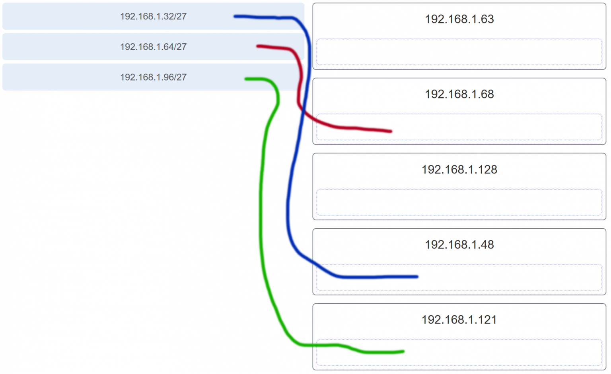

---

## Question 6

**Question:**
An administrator wants to create four subnetworks from the network address 192.168.1.0/24. What is the network address and subnet mask of the second useable subnet?

**Choices:**
- **A.** subnetwork 192.168.1.64 subnet mask 255.255.255.192
- **B.** subnetwork 192.168.1.32 subnet mask 255.255.255.240
- **C.** subnetwork 192.168.1.64 subnet mask 255.255.255.240
- **D.** subnetwork 192.168.1.128 subnet mask 255.255.255.192
- **E.** subnetwork 192.168.1.8 subnet mask 255.255.255.224

**Correct Answer:**
subnetwork 192.168.1.64 subnet mask 255.255.255.192

**Explanation:**
Topic 11.1.3 The number of bits that are borrowed would be two, thus giving a total of 4 useable subnets: 192.168.1.0 192.168.1.64 192.168.1.128 192.168.1.192 Because 2 bits are borrowed, the new subnet mask would be /26 or 255.255.255.192

---

## Question 7

**Question:**
How many bits must be borrowed from the host portion of an address to accommodate a router with five connected networks?

**Choices:**
- **A.** two
- **B.** three
- **C.** four
- **D.** five

**Correct Answer:**
three

**Explanation:**
Topic 11.5.2 Each network that is directly connected to an interface on a router requires its own subnet. The formula 2n, where n is the number of bits borrowed, is used to calculate the available number of subnets when borrowing a specific number of bits.

---

## Question 8

**Question:**
How many host addresses are available on the 192.168.10.128/26 network?

**Choices:**
- **A.** 30
- **B.** 32
- **C.** 60
- **D.** 62
- **E.** 64

**Correct Answer:**
62

**Explanation:**
Topic 11.5.2 A /26 prefix gives 6 host bits, which provides a total of 64 addresses, because 2^6 = 64. Subtracting the network and broadcast addresses leaves 62 usable host addresses.

---

## Question 9

**Question:**
How many host addresses are available on the network 172.16.128.0 with a subnet mask of 255.255.252.0?

**Choices:**
- **A.** 510
- **B.** 512
- **C.** 1022
- **D.** 1024
- **E.** 2046
- **F.** 2048

**Correct Answer:**
1022

**Explanation:**
Topic 11.5.2 A mask of 255.255.252.0 is equal to a prefix of /22. A /22 prefix provides 22 bits for the network portion and leaves 10 bits for the host portion. The 10 bits in the host portion will provide 1022 usable IP addresses (210 – 2 = 1022).

---

## Question 10

**Question:**
Match each IPv4 address to the appropriate address category. (Not all options are used.)

**Images:**
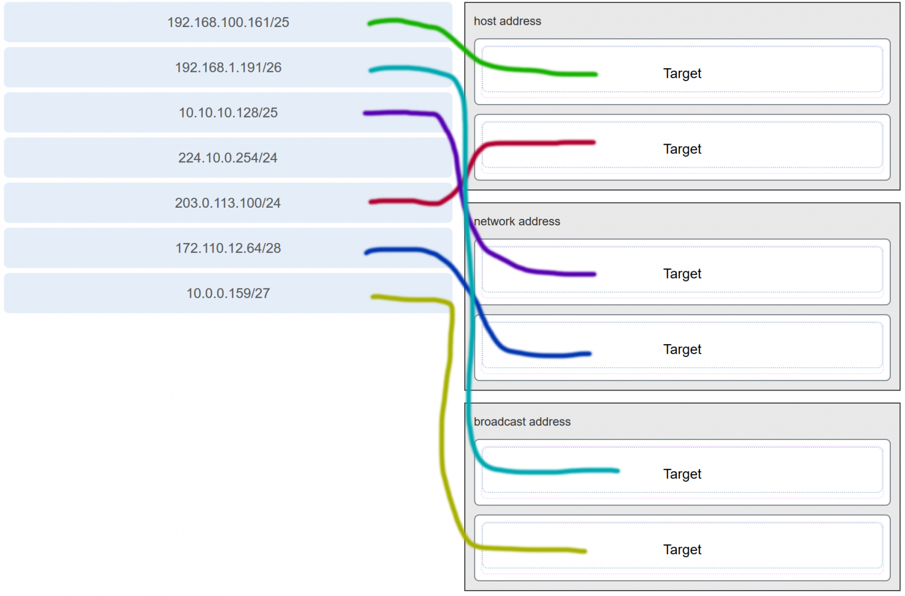

**Explanation:**
Topic 11.1.6

---

## Question 11

**Question:**
What three blocks of addresses are defined by RFC 1918 for private network use? (Choose three.)

**Choices:**
- **A.** 10.0.0.0/8
- **B.** 172.16.0.0/12
- **C.** 192.168.0.0/16
- **D.** 100.64.0.0/14
- **E.** 169.254.0.0/16
- **F.** 239.0.0.0/8

**Correct Answer:**
10.0.0.0/8; 172.16.0.0/12; 192.168.0.0/16

**Explanation:**
Topic 11.3.1 RFC 1918, Address Allocation for Private Internets, defines three blocks of IPv4 address for private networks that should not be routable on the public Internet. 10.0.0.0/8 172.16.0.0/12 192.168.0.0/16

---

## Question 12

**Question:**
Refer to the exhibit. An administrator must send a message to everyone on the router A network. What is the broadcast address for network 172.16.16.0/22?

**Images:**
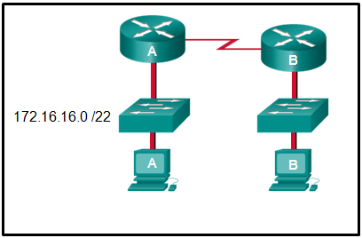

**Choices:**
- **A.** 172.16.16.255
- **B.** 172.16.20.255
- **C.** 172.16.19.255
- **D.** 172.16.23.255
- **E.** 172.16.255.255

**Correct Answer:**
172.16.19.255

**Explanation:**
Topic 11.1.6 The 172.16.16.0/22 network has 22 bits in the network portion and 10 bits in the host portion. Converting the network address to binary yields a subnet mask of 255.255.252.0. The range of addresses in this network will end with the last address available before 172.16.20.0. Valid host addresses for this network range from 172.16.16.1-172.16.19.254, making 172.16.19.255 the broadcast address.

---

## Question 13

**Question:**
A site administrator has been told that a particular network at the site must accommodate 126 hosts. Which subnet mask would be used that contains the required number of host bits?

**Choices:**
- **A.** 255.255.255.0
- **B.** 255.255.255.128
- **C.** 255.255.255.224
- **D.** 255.255.255.240

**Correct Answer:**
255.255.255.128

**Explanation:**
Topic 11.5.2 The subnet mask of 255.255.255.0 has 8 host bits. The mask of 255.255.255.128 results in 7 host bits. The mask of 255.255.255.224 has 5 host bits. Finally, 255.255.255.240 represents 4 host bits.

---

## Question 14

**Question:**
Refer to the exhibit. Considering the addresses already used and having to remain within the 10.16.10.0/24 network range, which subnet address could be assigned to the network containing 25 hosts?

**Images:**
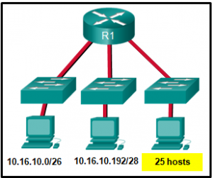

**Choices:**
- **A.** 10.16.10.160/26
- **B.** 10.16.10.128/28
- **C.** 10.16.10.64/27
- **D.** 10.16.10.224/26
- **E.** 10.16.10.240/27
- **F.** 10.16.10.240/28

**Correct Answer:**
10.16.10.64/27

**Explanation:**
Topic 11.5.2 Addresses 10.16.10.0 through 10.16.10.63 are taken for the leftmost network. Addresses 10.16.10.192 through 10.16.10.207 are used by the center network.The address space from 208-255 assumes a /28 mask, which does not allow enough host bits to accommodate 25 host addresses.The address ranges that are available include 10.16.10.64/26 and10.16.10.128/26. To accommodate 25 hosts, 5 host bits are needed, so a /27 mask is necessary. Four possible /27 subnets could be created from the available addresses between 10.16.10.64 and 10.16.10.191: 10.16.10.64/27 10.16.10.96/27 10.16.10.128/27 10.16.10.160/27

---

## Question 15

**Question:**
What is the usable number of host IP addresses on a network that has a /26 mask?

**Choices:**
- **A.** 256
- **B.** 254
- **C.** 64
- **D.** 62
- **E.** 32
- **F.** 16

**Correct Answer:**
62

**Explanation:**
Topic 11.1.3 A /26 mask is the same as 255.255.255.192. The mask leaves 6 host bits. With 6 host bits, 64 IP addresses are possible. One address represents the subnet number and one address represents the broadcast address, which means that 62 addresses can then be used to assign to network devices.

---

## Question 16

**Question:**
Which address prefix range is reserved for IPv4 multicast?

**Choices:**
- **A.** 240.0.0.0 – 254.255.255.255
- **B.** 224.0.0.0 – 239.255.255.255
- **C.** 169.254.0.0 – 169.254.255.255
- **D.** 127.0.0.0 – 127.255.255.255

**Correct Answer:**
224.0.0.0 – 239.255.255.255

**Explanation:**
Topic 11.2.3 Multicast IPv4 addresses use the reserved class D address range of 224.0.0.0 to 239.255.255.255.

---

## Question 17

**Question:**
Refer to the exhibit. Match the network with the correct IP address and prefix that will satisfy the usable host addressing requirements for each network. Place the options in the following order: Network A 192.168.0.128 /25 Network B 192.168.0.0 /26 Network C 192.168.0.96 /27 Network D 192.168.0.80 /30

**Images:**
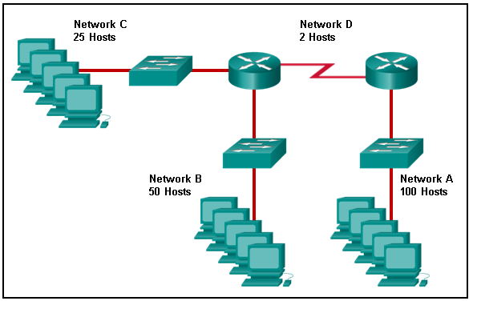
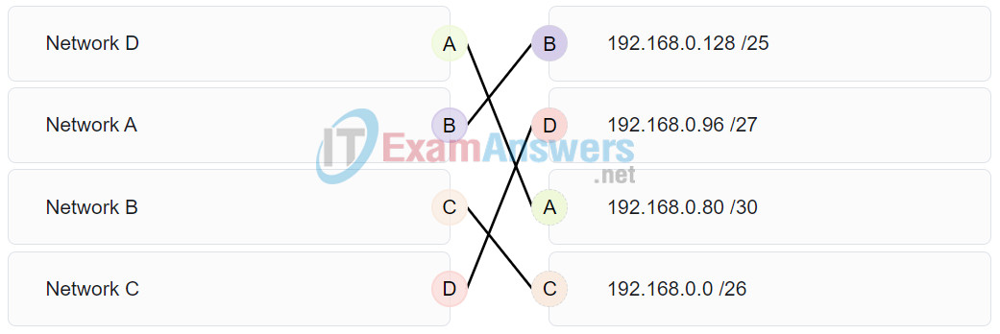

**Explanation:**
Topic 11.8.4 Network A needs to use 192.168.0.128 /25, which yields 128 host addresses. Network B needs to use 192.168.0.0 /26, which yields 64 host addresses. Network C needs to use 192.168.0.96 /27, which yields 32 host addresses. Network D needs to use 192.168.0.80/30, which yields 4 host addresses.

---

## Question 18

**Question:**
A high school in New York (school A) is using videoconferencing technology to establish student interactions with another high school (school B) in Russia. The videoconferencing is conducted between two end devices through the Internet. The network administrator of school A configures the end device with the IP address 209.165.201.10. The administrator sends a request for the IP address for the end device in school B and the response is 192.168.25.10. Neither school is using a VPN. The administrator knows immediately that this IP will not work. Why?

**Choices:**
- **A.** This is a loopback address.
- **B.** This is a link-local address.
- **C.** This is a private IP address.
- **D.** There is an IP address conflict.

**Correct Answer:**
This is a private IP address.

**Explanation:**
Topic 11.3.1 The IP address 192.168.25.10 is an IPv4 private address. This address will not be routed over the Internet, so school A will not be able to reach school B. Because the address is a private one, it can be used freely on an internal network. As long as no two devices on the internal network are assigned the same private IP, there is no IP conflict issue. Devices that are assigned a private IP will need to use NAT in order to communicate over the Internet.

---

## Question 19

**Question:**
Which three addresses are valid public addresses? (Choose three.)

**Choices:**
- **A.** 198.133.219.17
- **B.** 192.168.1.245
- **C.** 10.15.250.5
- **D.** 128.107.12.117
- **E.** 172.31.1.25
- **F.** 64.104.78.227

**Correct Answer:**
198.133.219.17; 128.107.12.117; 64.104.78.227

**Explanation:**
Topic 11.3.1 The ranges of private IPv4 addresses are as folllows: 10.0.0.0 – 10.255.255.255 172.16.0.0 – 172.31.255.255 192.168.0.0 – 192.168.255.255

---

## Question 20

**Question:**
A message is sent to all hosts on a remote network. Which type of message is it?

**Choices:**
- **A.** limited broadcast
- **B.** multicast
- **C.** directed broadcast
- **D.** unicast

**Correct Answer:**
directed broadcast

**Explanation:**
Topic 11.2.2 A directed broadcast is a message sent to all hosts on a specific network. It is useful for sending a broadcast to all hosts on a nonlocal network. A multicast message is a message sent to a selected group of hosts that are part of a subscribing multicast group. A limited broadcast is used for a communication that is limited to the hosts on the local network. A unicast message is a message sent from one host to another.

---

## Question 21

**Question:**
A company has a network address of 192.168.1.64 with a subnet mask of 255.255.255.192. The company wants to create two subnetworks that would contain 10 hosts and 18 hosts respectively. Which two networks would achieve that? (Choose two.)

**Choices:**
- **A.** 192.168.1.16/28
- **B.** 192.168.1.64/27
- **C.** 192.168.1.128/27
- **D.** 192.168.1.96/28
- **E.** 192.168.1.192/28

**Correct Answer:**
192.168.1.64/27; 192.168.1.96/28

**Explanation:**
Topic 11.8.3 Subnet 192.168.1.64 /27 has 5 bits that are allocated for host addresses and therefore will be able to support 32 addresses, but only 30 valid host IP addresses. Subnet 192.168.1.96/28 has 4 bits for host addresses and will be able to support 16 addresses, but only 14 valid host IP addresses.

---

## Question 22

**Question:**
Which address is a valid IPv6 link-local unicast address?

**Choices:**
- **A.** FEC8:1::FFFF
- **B.** FD80::1:1234
- **C.** FE80::1:4545:6578:ABC1
- **D.** FE0A::100:7788:998F
- **E.** FC90:5678:4251:FFFF

**Correct Answer:**
FE80::1:4545:6578:ABC1

**Explanation:**
Topic 12.4.3 IPv6 LLAs are in the fe80::/10 range. The /10 indicates that the first 10 bits are 1111 1110 10xx xxxx. The first hextet has a range of 1111 1110 1000 0000 (fe80) to 1111 1110 1011 1111 (febf).

---

## Question 23

**Question:**
Which of these addresses is the shortest abbreviation for the IP address: 3FFE:1044:0000:0000:00AB:0000:0000:0057?

**Choices:**
- **A.** 3FFE:1044::AB::57
- **B.** 3FFE:1044::00AB::0057
- **C.** 3FFE:1044:0:0:AB::57
- **D.** 3FFE:1044:0:0:00AB::0057
- **E.** 3FFE:1044:0000:0000:00AB::57
- **F.** 3FFE:1044:0000:0000:00AB::0057

**Correct Answer:**
3FFE:1044:0:0:AB::57

**Explanation:**
Topic 12.2.2 The rules for reducing the notation of IPv6 addresses are: 1. Omit any leading 0s (zeros) in any hextet. 2. Replace any single, contiguous string of one or more 16-bit hextets consisting of all zeros with a double colon (::) . 3. The double colon (::) can only be used once within an address.

---

## Question 24

**Question:**
A network administrator has received the IPv6 prefix 2001:DB8::/48 for subnetting. Assuming the administrator does not subnet into the interface ID portion of the address space, how many subnets can the administrator create from the /48 prefix?

**Choices:**
- **A.** 16
- **B.** 256
- **C.** 4096
- **D.** 65536

**Correct Answer:**
65536

**Explanation:**
Topic 12.8.1 With a network prefix of 48, there will be 16 bits available for subnetting because the interface ID starts at bit 64. Sixteen bits will yield 65536 subnets.

---

## Question 25

**Question:**
Given IPv6 address prefix 2001:db8::/48, what will be the last subnet that is created if the subnet prefix is changed to /52?

**Choices:**
- **A.** 2001:db8:0:f00::/52
- **B.** 2001:db8:0:8000::/52
- **C.** 2001:db8:0:f::/52
- **D.** 2001:db8:0:f000::/52

**Correct Answer:**
2001:db8:0:f000::/52

**Explanation:**
Topic 12.8.1 Prefix 2001:db8::/48 has 48 network bits. If we subnet to a /52, we are moving the network boundary four bits to the right and creating 16 subnets. The first subnet is 2001:db8::/52 the last subnet is 2001:db8:0:f000::/52.

---

## Question 26

**Question:**
Consider the following range of addresses: 2001:0DB8:BC15:00A0:0000:: 2001:0DB8:BC15:00A1:0000:: 2001:0DB8:BC15:00A2:0000:: … 2001:0DB8:BC15:00AF:0000:: The prefix-length for the range of addresses is /60 .

**Explanation:**
Topic 12.2.1 All the addresses have the part 2001:0DB8:BC15:00A in common. Each number or letter in the address represents 4 bits, so the prefix-length is /60.

---

## Question 27

**Question:**
What type of IPv6 address is FE80::1?

**Choices:**
- **A.** loopback
- **B.** link-local
- **C.** multicast
- **D.** global unicast

**Correct Answer:**
link-local

**Explanation:**
Topic 12.3.7 Link-local IPv6 addresses start with FE80::/10, which is any address from FE80:: to FEBF::. Link-local addresses are used extensively in IPv6 and allow directly connected devices to communicate with each other on the link they share.

---

## Question 28

**Question:**
Refer to the exhibit. A company is deploying an IPv6 addressing scheme for its network. The company design document indicates that the subnet portion of the IPv6 addresses is used for the new hierarchical network design, with the site subsection to represent multiple geographical sites of the company, the sub-site section to represent multiple campuses at each site, and the subnet section to indicate each network segment separated by routers. With such a scheme, what is the maximum number of subnets achieved per sub-site? Refer to the exhibit. A company is deploying an IPv6 addressing scheme for its network. The company design document indicates that the subnet portion of the IPv6 addresses is used for the new hierarchical network design, with the s ite subsection to represent multiple geographical sites of the company, the s ub-site section to represent multiple campuses at each site, and the s ubnet section to indicate each network segment separated by routers. With such a scheme, what is the maximum number of subnets achieved per sub-site ?

**Images:**
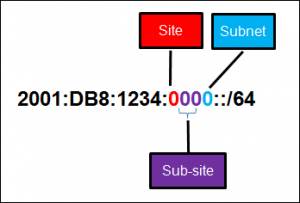

**Choices:**
- **A.** 0
- **B.** 4
- **C.** 16
- **D.** 256

**Correct Answer:**
16

**Explanation:**
Topic 12.8.1 Because only one hexadecimal character is used to represent the subnet, that one character can represent 16 different values 0 through F.

---

## Question 29

**Question:**
What is used in the EUI-64 process to create an IPv6 interface ID on an IPv6 enabled interface?

**Choices:**
- **A.** the MAC address of the IPv6 enabled interface
- **B.** a randomly generated 64-bit hexadecimal address
- **C.** an IPv6 address that is provided by a DHCPv6 server
- **D.** an IPv4 address that is configured on the interface

**Correct Answer:**
the MAC address of the IPv6 enabled interface

**Explanation:**
Topic 12.5.6 The EUI-64 process uses the MAC address of an interface to construct an interface ID (IID). Because the MAC address is only 48 bits in length, 16 additional bits (FF:FE) must be added to the MAC address to create the full 64-bit interface ID.

---

## Question 30

**Question:**
What is the prefix for the host address 2001:DB8:BC15:A:12AB::1/64?

**Choices:**
- **A.** 2001:DB8:BC15
- **B.** 2001:DB8:BC15:A
- **C.** 2001:DB8:BC15:A:1
- **D.** 2001:DB8:BC15:A:12

**Correct Answer:**
2001:DB8:BC15:A

**Explanation:**
Topic 12.8.1 The network portion, or prefix, of an IPv6 address is identified through the prefix length. A /64 prefix length indicates that the first 64 bits of the IPv6 address is the network portion. Hence the prefix is 2001:DB8:BC15:A.

---

## Question 31

**Question:**
An IPv6 enabled device sends a data packet with the destination address of FF02::1. What is the target of this packet?​

**Choices:**
- **A.** the one IPv6 device on the link that has been uniquely configured with this address
- **B.** all IPv6 enabled devices on the local link​ or network
- **C.** only IPv6 DHCP servers​
- **D.** only IPv6 configured routers

**Correct Answer:**
all IPv6 enabled devices on the local link​ or network

**Explanation:**
Topic 12.7.2 This address is one of the assigned IPv6 multicast addresses. Packets addressed to FF02::1 are for all IPv6 enabled devices on the link or network. FF02::2 is for all IPv6 routers that exist on the network.

---

## Question 32

**Question:**
Match the IPv6 address with the IPv6 address type. (Not all options are used.) Place the options in the following order: ::1 loopback FF02::1 all node multicast FF02::1:FFAE:F85F solicited node multicast 2001:DB8::BAF:3F57:FE94 global unicast

**Images:**
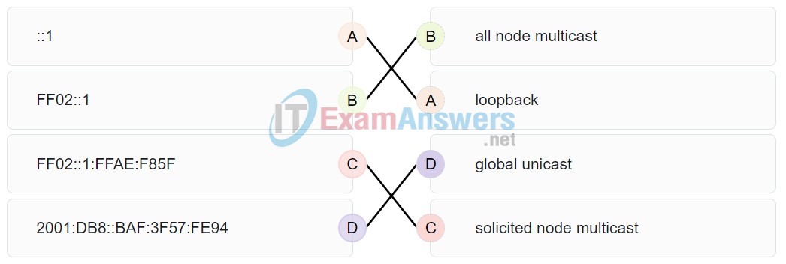

**Explanation:**
Topic 12.3.3 FF02::1:FFAE:F85F is a solicited node multicast address. 2001:DB8::BAF:3F57:FE94 is a global unicast address. FF02::1 is the all node multicast address. Packets sent to this address will be received by all IPv6 hosts on the local link. ::1 is the IPv6 loopback address. There are no examples of link local or unique local addresses provided.

---

## Question 33

**Question:**
Which IPv6 prefix is reserved for communication between devices on the same link?

**Choices:**
- **A.** FC00::/7
- **B.** 2001::/32
- **C.** FE80::/10
- **D.** FDFF::/7

**Correct Answer:**
FE80::/10

**Explanation:**
Topic 12.3.7 IPv6 link-local unicast addresses are in the FE80::/10 prefix range and are not routable. They are used only for communications between devices on the same link.

---

## Question 34

**Question:**
Which type of IPv6 address refers to any unicast address that is assigned to multiple hosts?

**Choices:**
- **A.** unique local
- **B.** global unicast
- **C.** link-local
- **D.** anycast

**Correct Answer:**
anycast

**Explanation:**
Topic 12.3.1 The IPv6 specifications include anycast addresses. An anycast address is any unicast IPv6 address that is assigned to multiple devices.

---

## Question 35

**Question:**
What are two types of IPv6 unicast addresses? (Choose two.)

**Choices:**
- **A.** multicast
- **B.** loopback
- **C.** link-local
- **D.** anycast
- **E.** broadcast

**Correct Answer:**
loopback; link-local

**Explanation:**
Topic 12.3.3 Multicast, anycast, and unicast are types of IPv6 addresses. There is no broadcast address in IPv6. Loopback and link-local are specific types of unicast addresses.

---

## Question 36

**Question:**
Which service provides dynamic global IPv6 addressing to end devices without using a server that keeps a record of available IPv6 addresses?

**Choices:**
- **A.** stateful DHCPv6
- **B.** SLAAC
- **C.** static IPv6 addressing
- **D.** stateless DHCPv6

**Correct Answer:**
SLAAC

**Explanation:**
Topic 12.5.2 Using stateless address autoconfiguration (SLAAC), a PC can solicit a router and receive the prefix length of the network. From this information the PC can then create its own IPv6 global unicast address.

---

## Question 37

**Question:**
Which protocol supports Stateless Address Autoconfiguration (SLAAC) for dynamic assignment of IPv6 addresses to a host?

**Choices:**
- **A.** ARPv6
- **B.** DHCPv6
- **C.** ICMPv6
- **D.** UDP

**Correct Answer:**
ICMPv6

**Explanation:**
Topic 12.5.1 SLAAC uses ICMPv6 messages when dynamically assigning an IPv6 address to a host. DHCPv6 is an alternate method of assigning an IPv6 addresses to a host. ARPv6 does not exist. Neighbor Discovery Protocol (NDP) provides the functionality of ARP for IPv6 networks. UDP is the transport layer protocol used by DHCPv6.

---

## Question 38

**Question:**
Three methods allow IPv6 and IPv4 to co-exist. Match each method with its description. (Not all options are used.) Place the options in the following order: The IPv4 packets and IPv6 packets coexist in the same network. dual-stack The IPv6 packet is transported inside an IPv4 packet. tunneling IPv6 packets are converted into IPv4 packets, and vice versa. translation

**Images:**
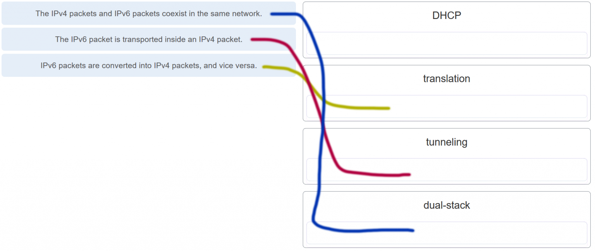

**Explanation:**
Topic 12.1.2 The term for the method that allows for the coexistence of the two types of packets on a single network is dual-stack. Tunneling allows for the IPv6 packet to be transported inside IPv4 packets. An IP packet can also be converted from version 6 to version 4 and vice versa. DHCP is a protocol that is used for allocating network parameters to hosts on an IP network

---

## Question 39

**Question:**
A technician uses the ping 127.0.0.1 command. What is the technician testing?

**Choices:**
- **A.** the TCP/IP stack on a network host
- **B.** connectivity between two adjacent Cisco devices
- **C.** connectivity between a PC and the default gateway
- **D.** connectivity between two PCs on the same network
- **E.** physical connectivity of a particular PC and the network

**Correct Answer:**
the TCP/IP stack on a network host

**Explanation:**
Topic 13.2.2

---

## Question 40

**Question:**
Refer to the exhibit. An administrator is trying to troubleshoot connectivity between PC1 and PC2 and uses the tracert command from PC1 to do it. Based on the displayed output, where should the administrator begin troubleshooting?

**Images:**
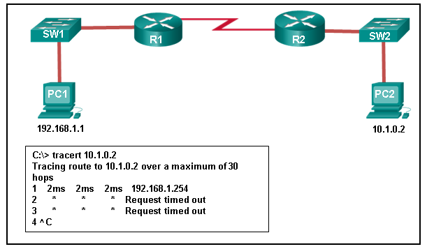

**Choices:**
- **A.** PC2
- **B.** R1
- **C.** SW2
- **D.** R2
- **E.** SW1

**Correct Answer:**
R1

**Explanation:**
Topic 13.2.5 Tracert is used to trace the path a packet takes. The only successful response was from the first device along the path on the same LAN as the sending host. The first device is the default gateway on router R1. The administrator should therefore start troubleshooting at R1.

---

## Question 41

**Question:**
Which protocol is used by the traceroute command to send and receive echo-requests and echo-replies?

**Choices:**
- **A.** SNMP
- **B.** ICMP
- **C.** Telnet
- **D.** TCP

**Correct Answer:**
ICMP

**Explanation:**
Topic 13.2.1 Traceroute uses the ICMP (Internet Control Message Protocol) to send and receive echo-request and echo-reply messages.

---

## Question 42

**Question:**
Which ICMPv6 message is sent when the IPv6 hop limit field of a packet is decremented to zero and the packet cannot be forwarded?

**Choices:**
- **A.** network unreachable
- **B.** time exceeded
- **C.** protocol unreachable
- **D.** port unreachable

**Correct Answer:**
time exceeded

**Explanation:**
Topic 13.2.5 ICMPv6 uses the hop limit field in the IPv6 packet header to determine if the packet has expired. If the hop limit field has reached zero, a router will send a time exceeded message back towards the source indicating that the router cannot forward the packet.

---

## Question 43

**Question:**
A user executes a traceroute over IPv6. At what point would a router in the path to the destination device drop the packet?

**Choices:**
- **A.** when the value of the Hop Limit field reaches 255
- **B.** when the value of the Hop Limit field reaches zero
- **C.** when the router receives an ICMP time exceeded message
- **D.** when the target host responds with an ICMP echo reply message

**Correct Answer:**
when the value of the Hop Limit field reaches zero

**Explanation:**
Topic 13.2.5 When a traceroute is performed, the value in the Hop Limit field of an IPv6 packet determines how many router hops the packet can travel. Once the Hop Limit field reaches a value of zero, it can no longer be forwarded and the receiving router will drop the packet.

---

## Question 44

**Question:**
What is the purpose of ICMP messages?

**Choices:**
- **A.** to inform routers about network topology changes
- **B.** to ensure the delivery of an IP packet
- **C.** to provide feedback of IP packet transmissions
- **D.** to monitor the process of a domain name to IP address resolution

**Correct Answer:**
to provide feedback of IP packet transmissions

**Explanation:**
Topic 13.1.1 The purpose of ICMP messages is to provide feedback about issues that are related to the processing of IP packets.

---

## Question 45

**Question:**
What source IP address does a router use by default when the traceroute command is issued?

**Choices:**
- **A.** the highest configured IP address on the router
- **B.** a loopback IP address
- **C.** the IP address of the outbound interface
- **D.** the lowest configured IP address on the router

**Correct Answer:**
the IP address of the outbound interface

**Explanation:**
Topic 13.2.5 When sending an echo request message, a router will use the IP address of the exit interface as the source IP address. This default behavior can be changed by using an extended ping and specifying a specific source IP address.

---

## Question 46

**Question:**
Match each description with an appropriate IP address. (Not all options are used.) Place the options in the following order: a link-local address 169.254.1.5 a TEST-NET address 192.0.2.123 an experimental address 240.2.6.255 a private address 172.19.20.5 a loopback address 127.0.0.1

**Images:**
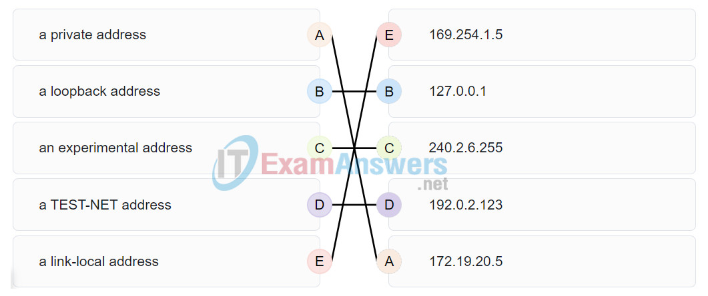

**Explanation:**
Topic 11.3.1 Link-Local addresses are assigned automatically by the OS environment and are located in the block 169.254.0.0/16. The private addresses ranges are 10.0.0.0/8, 172.16.0.0/12, and 192.168.0.0/16. TEST-NET addresses belong to the range 192.0.2.0/24. The addresses in the block 240.0.0.0 to 255.255.255.254 are reserved as experimental addresses. Loopback addresses belong to the block 127.0.0.0/8.

---

## Question 47

**Question:**
A user issues a ping 192.135.250.103 command and receives a response that includes a code of 1. What does this code represent?

**Choices:**
- **A.** host unreachable
- **B.** protocol unreachable
- **C.** port unreachable
- **D.** network unreachable

**Correct Answer:**
host unreachable

**Explanation:**
Topic 13.1.3 Within ICMPv4 “Destination Unreachable” messages (Type 3), the Code field identifies the precise diagnostic reason for the delivery failure. The standard codes are classified as follows: Code 0: Network unreachable (the router lacks a valid path to the destination network). Code 1: Host unreachable . This indicates that the packet successfully reached the local gateway or edge router responsible for the destination network segment, but the specific target host failed to respond (e.g., the device is powered off, disconnected, or its MAC address cannot be resolved via ARP). Code 2: Protocol unreachable. Code 3: Port unreachable.

---

## Question 48

**Question:**
Which subnet would include the address 192.168.1.96 as a usable host address?

**Choices:**
- **A.** 192.168.1.64/26
- **B.** 192.168.1.32/27
- **C.** 192.168.1.32/28
- **D.** 192.168.1.64/29

**Correct Answer:**
192.168.1.64/26

**Explanation:**
Topic 11.5.1 For the subnet of 192.168.1.64/26, there are 6 bits for host addresses, yielding 64 possible addresses. However, the first and last subnets are the network and broadcast addresses for this subnet. Therefore, the range of host addresses for this subnet is 192.168.1.65 to 192.168.1.126. The other subnets do not contain the address 192.168.1.96 as a valid host address.

---

## Question 49

**Question:**
Open the PT Activity. Perform the tasks in the activity instructions and then answer the question. CCNA 1 v7 Modules 11 – 13 IP Addressing Exam Answers Full Modules 11 – 13 IP Addressing Exam 1 file(s) 221.48 KB Download What are the three IPv6 addresses displayed when the route from PC1 to PC2 is traced? (Choose three.)

**Images:**
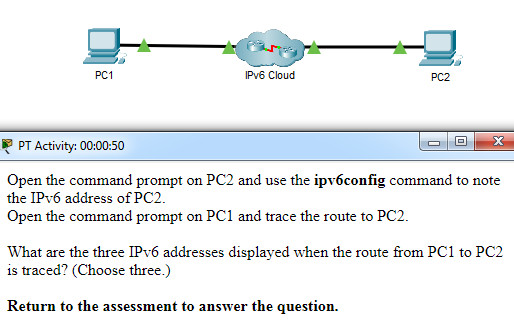

**Choices:**
- **A.** 2001:DB8:1:1::1
- **B.** 2001:DB8:1:1::A
- **C.** 2001:DB8:1:2::2
- **D.** 2001:DB8:1:2::1
- **E.** 2001:DB8:1:3::1
- **F.** 2001:DB8:1:3::2
- **G.** 2001:DB8:1:4::1

**Correct Answer:**
2001:DB8:1:1::1; 2001:DB8:1:2::1; 2001:DB8:1:3::2

**Explanation:**
Topic 13.2.6 Using the ipv6config command on PC2 displays the IPv6 address of PC2, which is 2001:DB8:1:4::A. The IPV6 link-local address, FE80::260:70FF:FE34:6930, is not used in route tracing. Using the tracert 2001:DB8:1:4::A command on PC1 displays four addresses: 2001:DB8:1:1::1, 2001:DB8:1:2::1 , 2001:DB8:1:3::2, and 2001:DB8:1:4::A.

---

## Question 50

**Question:**
A host is transmitting a broadcast. Which host or hosts will receive it?

**Choices:**
- **A.** all hosts in the same subnet
- **B.** a specially defined group of hosts
- **C.** the closest neighbor on the same network
- **D.** all hosts on the Internet

**Correct Answer:**
all hosts in the same subnet

**Explanation:**
Topic 11.2.2 A broadcast is delivered to every host that has an IP address within the same network.

---

## Question 51

**Question:**
A host is transmitting a unicast. Which host or hosts will receive it?

**Choices:**
- **A.** one specific host
- **B.** a specially defined group of hosts
- **C.** all hosts on the Internet
- **D.** the closest neighbor on the same network

**Correct Answer:**
one specific host

**Explanation:**
Topic 11.2.1 A unicast transmission is a one-to-one communication method where data is sent from a single source host to one specific destination IP address. Unlike a broadcast (which targets all hosts within the subnet) or a multicast (which targets a specifically defined group), a unicast packet is uniquely destined for one individual device on the network.

---

## Question 52

**Question:**
A user issues a ping 2001:db8:FACE:39::10 command and receives a response that includes a code of 3. What does this code represent?

**Choices:**
- **A.** address unreachable
- **B.** network unreachable
- **C.** host unreachable
- **D.** protocol unreachable

**Correct Answer:**
address unreachable

**Explanation:**
Topic 13.1.3 Within ICMPv6, Type 1 error messages indicate that the “Destination is Unreachable”. The specific Code field inside this message diagnoses the exact cause of the failure: Code 0: No route to destination (the router lacks a path to that network). Code 1: Communication with destination administratively prohibited (e.g., blocked by a firewall rule or ACL). Code 2: Beyond scope of the source address. Code 3: Address unreachable . This implies that the packet successfully reached the local gateway or edge router serving the destination segment, but that router failed to map or resolve the Layer 2 physical address (Neighbor Discovery/NDP failure) required to deliver the packet to the final host.

---

## Question 53

**Question:**
A host is transmitting a multicast. Which host or hosts will receive it?

**Choices:**
- **A.** a specially defined group of hosts
- **B.** the closest neighbor on the same network
- **C.** one specific host
- **D.** directly connected network devices

**Correct Answer:**
a specially defined group of hosts

**Explanation:**
Topic 11.2.3 A multicast transmission is designed to send data packets from a single source to a specific group of destination hosts that have explicitly joined or subscribed to a multicast group address (such as devices listening to routing protocols or video streams). Unlike a broadcast (which delivers data to every single host on the subnet) or a unicast (which targets one specific device), multicast optimizes network bandwidth by duplicating and delivering traffic only to the interested group members.

---

## Question 54

**Question:**
Which is the compressed format of the IPv6 address 2001:0db8:0000:0000:0000:a0b0:0008:0001?

**Choices:**
- **A.** 2001:db8::a0b0:8:1
- **B.** 2001:db8::ab8:1:0:1000
- **C.** 2001:db80:0:1::80:1
- **D.** 2001:db80:::1::80:1

**Correct Answer:**
2001:db8::a0b0:8:1

**Explanation:**
Topic 12.2.2

---

## Question 55

**Question:**
Which is the compressed format of the IPv6 address fe80:09ea:0000:2200:0000:0000:0fe0:0290?

**Choices:**
- **A.** fe80:9ea:0:2200::fe0:290
- **B.** fe80:9:20::b000:290
- **C.** fe80:9ea0::2020:0:bf:e0:9290
- **D.** fe80:9ea0::2020::bf:e0:9290

**Correct Answer:**
fe80:9ea:0:2200::fe0:290

**Explanation:**
Topic 12.2.2 Omit leading zeros: Remove any starting zeros from each 16-bit segment ( hextet ). Following this, 09ea becomes 9ea , 0000 becomes 0 , 0fe0 simplifies to fe0 , and 0290 reduces to 290 . (Note: Trailing zeros, such as those in 2200 , cannot be dropped). Compress with double colons ( :: ): This rule allows you to replace the longest contiguous string of all-zero hextets with a single :: . This specific address features a single 0000 in the third hextet and a consecutive pair of 0000:0000 in the fifth and sixth hextets. You must choose the longest sequence to compress, which substitutes the consecutive pair with :: . Combining these rules yields the correct optimized format: fe80:9ea:0:2200::fe0:290 .

---

## Question 56

**Question:**
Which is the compressed format of the IPv6 address 2002:0042:0010:c400:0000:0000:0000:0909?

**Choices:**
- **A.** 2002:42:10:c400::909
- **B.** 200:420:110:c4b::910:0:90
- **C.** 2002:4200::25:1090:0:99
- **D.** 2002:42::25:1090:0:99

**Correct Answer:**
2002:42:10:c400::909

**Explanation:**
Topic 12.2.2 Omit leading zeros: Drop any starting zeros within each 16-bit segment ( hextet ). Following this step, 0042 simplifies to 42 , 0010 becomes 10 , and 0909 reduces to 909 . Trailing zeros (such as the ones in c400 ) must be kept exactly as they are. Compress with the double colon ( :: ): The contiguous string of three consecutive all-zero segments ( 0000:0000:0000 ) is fully replaced by a single :: notation. Combining both optimization rules yields the correct compressed format: 2002:42:10:c400::909 .

---

## Question 57

**Question:**
Which is the compressed format of the IPv6 address 2001:0db8:0000:0000:0ab8:0001:0000:1000?

**Choices:**
- **A.** 2001:db8::ab8:1:0:1000
- **B.** 2001:db8::a0b0:8:1
- **C.** 2001:db8:1::ab8:0:1
- **D.** 2001:db8:0:1::8:1

**Correct Answer:**
2001:db8::ab8:1:0:1000

**Explanation:**
Topic 12.2.2 Omit leading zeros: Drop any starting zeros within each 16-bit segment ( hextet ). Following this step, 0db8 simplifies to db8 , 0ab8 becomes ab8 , 0001 reduces to 1 , and 0000 segments simplify to a single 0 . (Note: Trailing zeros, such as the ones in 1000 , cannot be omitted). Compress with the double colon ( :: ): Replace the longest continuous string of all-zero hextets with a single :: notation. This address contains two all-zero sequences: a two-block sequence ( 0000:0000 ) in the 3rd and 4th segments, and a single block ( 0000 ) in the 7th segment. Compressing the longest sequence turns the two consecutive blocks into :: , while the 7th segment remains represented by a single 0 . Combining both optimization rules yields the correct compressed format: 2001:db8::ab8:1:0:1000 .

---

## Question 58

**Question:**
Which is the compressed format of the IPv6 address 2002:0420:00c4:1008:0025:0190:0000:0990?

**Choices:**
- **A.** 2002:420:c4:1008:25:190::990
- **B.** 2002:42:10:c400::909
- **C.** 2002:4200::25:1090:0:99
- **D.** 2002:42::25:1090:0:99

**Correct Answer:**
2002:420:c4:1008:25:190::990

**Explanation:**
Topic 12.2.2 To compress an IPv6 address, two standard rules must be followed: Omit leading zeros in any 16-bit section (hextet). Following this rule: 0420 becomes 420 , 00c4 becomes c4 , 0025 becomes 25 , 0190 becomes 190 , and 0990 becomes 990 . Trailing zeros must not be dropped. Use a double colon ( :: ) to replace any single, contiguous string of one or more segments consisting entirely of zeros. In this address, the seventh hextet is 0000 , which is compressed into :: . Combining these rules, the original address successfully compresses to 2002:420:c4:1008:25:190::990 .

---

## Question 59

**Question:**
Which is the compressed format of the IPv6 address 2001:0db8:0000:0000:0000:a0b0:0008:0001?

**Choices:**
- **A.** 2001:db8::a0b0:8:1
- **B.** 2001:db8:1::ab8:0:1
- **C.** 2001:db8::ab8:1:0:1000
- **D.** 2001:db8:0:1::8:1

**Correct Answer:**
2001:db8::a0b0:8:1

**Explanation:**
Topic 12.2.2

---

## Question 60

**Question:**
Which is the compressed format of the IPv6 address fe80:0000:0000:0000:0220:0b3f:f0e0:0029?

**Choices:**
- **A.** fe80::220:b3f:f0e0:29
- **B.** fe80:9ea:0:2200::fe0:290
- **C.** fe80:9ea0::2020:0:bf:e0:9290
- **D.** fe80:9ea0::2020::bf:e0:9290

**Correct Answer:**
fe80::220:b3f:f0e0:29

**Explanation:**
Topic 12.2.2 Omit leading zeros: In every hextet, any leading zeros are dropped. Thus, 0220 becomes 220 , 0b3f becomes b3f , and 0029 reduces to 29 . Compress contiguous zeros using the double colon ( :: ): The three consecutive all-zero segments ( 0000:0000:0000 ) are replaced with a single :: notation. Combining these optimization steps results in the correct compressed address: fe80::220:b3f:f0e0:29 .

---

## Question 61

**Question:**
Which is the compressed format of the IPv6 address 2001:0db8:0000:0000:0000:a0b0:0008:0001?

**Choices:**
- **A.** 2001:db8::a0b0:8:1
- **B.** 2001:db8::ab8:1:0:1000
- **C.** 2001:db80:0:1::80:1
- **D.** 2001:db8:0:1::8:1

**Correct Answer:**
2001:db8::a0b0:8:1

**Explanation:**
Topic 12.2.2

---

## Question 62

**Question:**
Which is the compressed format of the IPv6 address 2002:0042:0010:c400:0000:0000:0000:0909?

**Choices:**
- **A.** 2002:42:10:c400::909
- **B.** 2002:4200::25:1090:0:99
- **C.** 2002:420:c4:1008:25:190::990
- **D.** 2002:42::25:1090:0:99

**Correct Answer:**
2002:42:10:c400::909

**Explanation:**
Topic 12.2.2 Omit leading zeros: Drop any starting zeros within each 16-bit segment ( hextet ). Following this step, 0042 simplifies to 42 , 0010 becomes 10 , and 0909 reduces to 909 . Trailing zeros (such as the ones in c400 ) must be kept exactly as they are. Compress with the double colon ( :: ): The contiguous string of three consecutive all-zero segments ( 0000:0000:0000 ) is fully replaced by a single :: notation. Combining both optimization rules yields the correct compressed format: 2002:42:10:c400::909 .

---

## Question 63

**Question:**
Which is the compressed format of the IPv6 address fe80:09ea:0000:2200:0000:0000:0fe0:0290?

**Choices:**
- **A.** fe80:9ea:0:2200::fe0:290
- **B.** fe80:9ea0::2020:0:bf:e0:9290
- **C.** fe80::220:b3f:f0e0:29
- **D.** fe80::0220:0b3f:f0e0:0029

**Correct Answer:**
fe80:9ea:0:2200::fe0:290

**Explanation:**
Topic 12.2.2 Omit leading zeros: Remove any starting zeros from each 16-bit segment ( hextet ). Following this, 09ea becomes 9ea , 0000 becomes 0 , 0fe0 simplifies to fe0 , and 0290 reduces to 290 . (Note: Trailing zeros, such as those in 2200 , cannot be dropped). Compress with double colons ( :: ): This rule allows you to replace the longest contiguous string of all-zero hextets with a single :: . This specific address features a single 0000 in the third hextet and a consecutive pair of 0000:0000 in the fifth and sixth hextets. You must choose the longest sequence to compress, which substitutes the consecutive pair with :: . Combining these rules yields the correct optimized format: fe80:9ea:0:2200::fe0:290 .

---

## Question 64

**Question:**
A user issues a ping 2001:db8:FACE:39::10 command and receives a response that includes a code of 2. What does this code represent?

**Choices:**
- **A.** beyond scope of the source address
- **B.** communication with the destination administratively prohibited
- **C.** address unreachable
- **D.** no route to destination

**Correct Answer:**
beyond scope of the source address

**Explanation:**
Topic 13.1.3 In ICMPv6 “Destination Unreachable” messages (Type 1), the Code field specifies the precise diagnostic reason why the packet could not be delivered. The standard ICMPv6 codes are defined as follows: Code 0: No route to destination. Code 1: Communication with destination administratively prohibited. Code 2: Beyond scope of the source address . This tells the sender that the scope of its source IP address is too constrained (for example, a Link-Local Address) to successfully communicate with the destination IP address (such as a Global Unicast Address). Code 3: Address unreachable.

---

## Question 65

**Question:**
A user issues a ping 192.135.250.103 command and receives a response that includes a code of 1. What does this code represent?

**Choices:**
- **A.** host unreachable
- **B.** beyond scope of the source address
- **C.** address unreachable
- **D.** communication with the destination administratively prohibited

**Correct Answer:**
host unreachable

**Explanation:**
Topic 13.1.3 Within ICMPv4 “Destination Unreachable” messages (Type 3), the Code field identifies the precise diagnostic reason for the delivery failure. The standard codes are classified as follows: Code 0: Network unreachable (the router lacks a valid path to the destination network). Code 1: Host unreachable . This indicates that the packet successfully reached the local gateway or edge router responsible for the destination network segment, but the specific target host failed to respond (e.g., the device is powered off, disconnected, or its MAC address cannot be resolved via ARP). Code 2: Protocol unreachable. Code 3: Port unreachable.

---

## Question 66

**Question:**
A user issues a ping fe80:65ab:dcc1::100 command and receives a response that includes a code of 3. What does this code represent?

**Choices:**
- **A.** address unreachable
- **B.** communication with the destination administratively prohibited
- **C.** beyond scope of the source address
- **D.** no route to destination

**Correct Answer:**
address unreachable

**Explanation:**
Topic 13.1.3 Within ICMPv6 “Destination Unreachable” messages (Type 1), the Code field values identify the precise reason for the delivery failure. The standard definitions are classified as follows: Code 0: No route to destination. Code 1: Communication with destination administratively prohibited. Code 2: Beyond scope of the source address. Code 3: Address unreachable (the targeted destination IP cannot be resolved or is physically unavailable on the local link).

---

## Question 67

**Question:**
A user issues a ping 10.10.14.67 command and receives a response that includes a code of 0. What does this code represent?

**Choices:**
- **A.** network unreachable
- **B.** protocol unreachable
- **C.** port unreachable
- **D.** host unreachable

**Correct Answer:**
network unreachable

**Explanation:**
Topic 13.1.3 Within ICMP “Destination Unreachable” messages (Type 3), Code 0 specifically stands for Network unreachable . This indicates that the router does not possess a valid route in its routing table to reach the destination network.

---

## Question 68

**Question:**
A user issues a ping fe80:65ab:dcc1::100 command and receives a response that includes a code of 4. What does this code represent?

**Choices:**
- **A.** port unreachable
- **B.** host unreachable
- **C.** protocol unreachable
- **D.** network unreachable

**Correct Answer:**
port unreachable

**Explanation:**
Topic 13.1.3 When a device replies with an ICMPv6 “Destination Unreachable” message (Type 1), it includes a specific Code value to explain precisely why the packet could not be delivered. Within the ICMPv6 standard, these codes are classified as follows: Code 0: No route to destination (Network unreachable). Code 1: Communication with destination administratively prohibited. Code 3: Address unreachable (Host unreachable). Code 4: Port unreachable . Consequently, a code of 4 fundamentally indicates that the packet successfully reached the destination host, but the transport layer protocol (such as UDP) on that host was unable to find an active application or service listening on the targeted port.

---

## Question 69

**Question:**
A user issues a ping 198.133.219.8 command and receives a response that includes a code of 0. What does this code represent?

**Choices:**
- **A.** network unreachable
- **B.** protocol unreachable
- **C.** port unreachable
- **D.** host unreachable

**Correct Answer:**
network unreachable

**Explanation:**
Topic 13.1.3

---

## Question 70

**Question:**
A user issues a ping 2001:db8:3040:114::88 command and receives a response that includes a code of 4. What does this code represent?

**Choices:**
- **A.** port unreachable
- **B.** host unreachable
- **C.** protocol unreachable
- **D.** network unreachable

**Correct Answer:**
port unreachable

**Explanation:**
Topic 13.1.3 Much like in IPv4 networking, the ICMPv6 protocol relies on distinct code numbers inside its “Destination Unreachable” error messages (Type 1) to provide diagnostic details about delivery failures. Code 4 specifically stands for Port unreachable . This means that the IP packet was successfully routed across the network and physically reached the target host. However, once the network layer passed the payload up to the transport layer (TCP or UDP), the receiving operating system could not find any active application or service listening on the specified destination port.

---

## Question 71

**Question:**
A user issues a ping 2001:db8:FACE:39::10 command and receives a response that includes a code of 2. What does this code represent?

**Choices:**
- **A.** beyond scope of the source address
- **B.** host unreachable
- **C.** protocol unreachable
- **D.** network unreachable

**Correct Answer:**
beyond scope of the source address

**Explanation:**
Topic 13.1.3 In ICMPv6 “Destination Unreachable” messages (Type 1), the Code field specifies the precise diagnostic reason why the packet could not be delivered. The standard ICMPv6 codes are defined as follows: Code 0: No route to destination. Code 1: Communication with destination administratively prohibited. Code 2: Beyond scope of the source address . This tells the sender that the scope of its source IP address is too constrained (for example, a Link-Local Address) to successfully communicate with the destination IP address (such as a Global Unicast Address). Code 3: Address unreachable.

---
