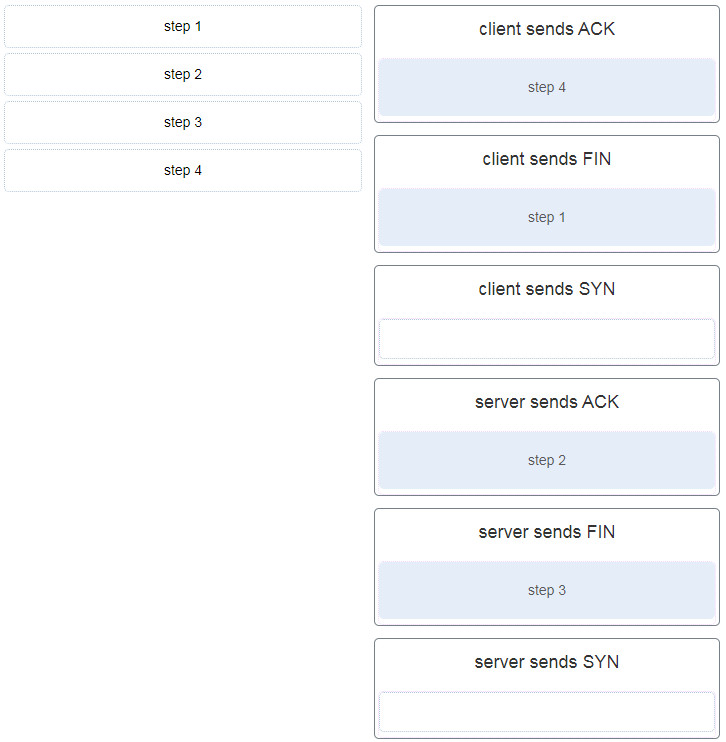
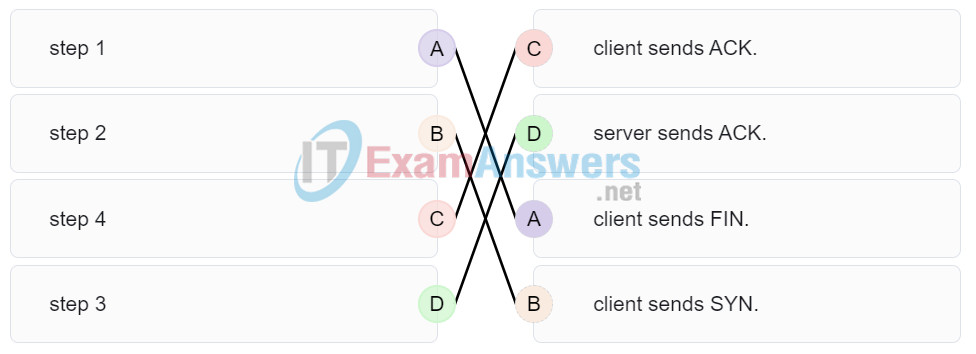

# CCNA 1 - Modules 14 - 15 Network Application Communications Exam Answers

## Question 1

**Question:**
Which action is performed by a client when establishing communication with a server via the use of UDP at the transport layer?

**Choices:**
- **A.** The client sets the window size for the session.
- **B.** The client sends an ISN to the server to start the 3-way handshake.
- **C.** The client randomly selects a source port number.
- **D.** The client sends a synchronization segment to begin the session.

**Correct Answer:**
The client randomly selects a source port number.

**Explanation:**
Topic 14.7.4

---

## Question 2

**Question:**
Which transport layer feature is used to guarantee session establishment?

**Choices:**
- **A.** UDP ACK flag
- **B.** TCP 3-way handshake
- **C.** UDP sequence number
- **D.** TCP port number

**Correct Answer:**
TCP 3-way handshake

**Explanation:**
Topic 14.5.2

---

## Question 3

**Question:**
What is the complete range of TCP and UDP well-known ports?

**Choices:**
- **A.** 0 to 255
- **B.** 0 to 1023
- **C.** 256 – 1023
- **D.** 1024 – 49151

**Correct Answer:**
0 to 1023

**Explanation:**
Topic 14.4.3

---

## Question 4

**Question:**
What is a socket?

**Choices:**
- **A.** the combination of the source and destination IP address and source and destination Ethernet address
- **B.** the combination of a source IP address and port number or a destination IP address and port number
- **C.** the combination of the source and destination sequence and acknowledgment numbers
- **D.** the combination of the source and destination sequence numbers and port numbers

**Correct Answer:**
the combination of a source IP address and port number or a destination IP address and port number

**Explanation:**
Topic 14.4.2

---

## Question 5

**Question:**
A PC is downloading a large file from a server. The TCP window is 1000 bytes. The server is sending the file using 100-byte segments. How many segments will the server send before it requires an acknowledgment from the PC?

**Choices:**
- **A.** 1 segment
- **B.** 10 segments
- **C.** 100 segments
- **D.** 1000 segments

**Correct Answer:**
10 segments

**Explanation:**
Topic 14.6.5 With a window of 1000 bytes, the destination host accepts segments until all 1000 bytes of data have been received. Then the destination host sends an acknowledgment.

---

## Question 6

**Question:**
Which factor determines TCP window size?

**Choices:**
- **A.** the amount of data to be transmitted
- **B.** the number of services included in the TCP segment
- **C.** the amount of data the destination can process at one time
- **D.** the amount of data the source is capable of sending at one time

**Correct Answer:**
the amount of data the destination can process at one time

**Explanation:**
Topic 14.6.5 Window is the number of bytes that the sender will send prior to expecting an acknowledgement from the destination device. The initial window is agreed upon during the session startup via the three-way handshake between source and destination. It is determined by how much data the destination device of a TCP session is able to accept and process at one time.

---

## Question 7

**Question:**
What does a client do when it has UDP datagrams to send?

**Choices:**
- **A.** It just sends the datagrams.
- **B.** It queries the server to see if it is ready to receive data.
- **C.** It sends a simplified three-way handshake to the server.
- **D.** It sends to the server a segment with the SYN flag set to synchronize the conversation.

**Correct Answer:**
It just sends the datagrams.

**Explanation:**
Topic 14.1.5 When a client has UDP datagrams to send, it just sends the datagrams.

---

## Question 8

**Question:**
Which three fields are used in a UDP segment header? (Choose three.)

**Choices:**
- **A.** Window Size
- **B.** Length
- **C.** Source Port
- **D.** Acknowledgment Number
- **E.** Checksum
- **F.** Sequence Number

**Correct Answer:**
Length; Source Port; Checksum

**Explanation:**
Topic 14.3.2 A UDP header consists of only the Source Port, Destination Port, Length, and Checksum fields. Sequence Number, Acknowledgment Number, and Window Size are TCP header fields.

---

## Question 9

**Question:**
What are two roles of the transport layer in data communication on a network? (Choose two.)

**Choices:**
- **A.** identifying the proper application for each communication stream
- **B.** tracking the individual communication between applications on the source and destination hosts
- **C.** providing frame delimiting to identify bits making up a frame
- **D.** performing a cyclic redundancy check on the frame for errors
- **E.** providing the interface between applications and the underlying network over which messages are transmitted

**Correct Answer:**
identifying the proper application for each communication stream; tracking the individual communication between applications on the source and destination hosts

**Explanation:**
Topic 14.1.1 The transport layer has several responsibilities. The primary responsibilities include the following: Tracking the individual communication streams between applications on the source and destination hosts Segmenting data at the source and reassembling the data at the destination Identifying the proper application for each communication stream through the use of port numbers

---

## Question 10

**Question:**
What information is used by TCP to reassemble and reorder received segments?

**Choices:**
- **A.** port numbers
- **B.** sequence numbers
- **C.** acknowledgment numbers
- **D.** fragment numbers

**Correct Answer:**
sequence numbers

**Explanation:**
Topic 14.6.1 At the transport layer, TCP uses the sequence numbers in the header of each TCP segment to reassemble the segments into the correct order.

---

## Question 11

**Question:**
What important information is added to the TCP/IP transport layer header to ensure communication and connectivity with a remote network device?

**Choices:**
- **A.** timing and synchronization
- **B.** destination and source port numbers
- **C.** destination and source physical addresses
- **D.** destination and source logical network addresses

**Correct Answer:**
destination and source port numbers

**Explanation:**
Topic 14.4.1 The destination and source port numbers are used to identify exactly which protocol and process is requesting or responding to a request.

---

## Question 12

**Question:**
Which two characteristics are associated with UDP sessions? (Choose two.)

**Choices:**
- **A.** Destination devices receive traffic with minimal delay.
- **B.** Transmitted data segments are tracked.
- **C.** Destination devices reassemble messages and pass them to an application.
- **D.** Received data is unacknowledged.
- **E.** Unacknowledged data packets are retransmitted.

**Correct Answer:**
Destination devices receive traffic with minimal delay.; Received data is unacknowledged.

**Explanation:**
Topic 14.7.1 TCP: Provides tracking of transmitted data segments Destination devices will acknowledge received data. Source devices will retransmit unacknowledged data. UDP Destination devices will not acknowledge received data Headers use very little overhead and cause minimal delay.​

---

## Question 13

**Question:**
A client application needs to terminate a TCP communication session with a server. Place the termination process steps in the order that they will occur. (Not all options are used.)

**Images:**

**Explanation:**
Topic 14.5.3 In order to terminate a TCP session, the client sends to the server a segment with the FIN flag set. The server acknowledges the client by sending a segment with the ACK flag set. The server sends a FIN to the client to terminate the server to client session. The client acknowledges the termination by sending a segment with the ACK flag set.

---

## Question 14

**Question:**
Which flag in the TCP header is used in response to a received FIN in order to terminate connectivity between two network devices?

**Choices:**
- **A.** FIN
- **B.** ACK
- **C.** SYN
- **D.** RST

**Correct Answer:**
ACK

**Explanation:**
Topic 14.5.3 In a TCP session, when a device has no more data to send, it will send a segment with the FIN flag set. The connected device that receives the segment will respond with an ACK to acknowledge that segment. The device that sent the ACK will then send a FIN message to close the connection it has with the other device. The sending of the FIN should be followed with the receipt of an ACK from the other device.​

---

## Question 15

**Question:**
Which protocol or service uses UDP for a client-to-server communication and TCP for server-to-server communication?

**Choices:**
- **A.** HTTP
- **B.** FTP
- **C.** DNS
- **D.** SMTP

**Correct Answer:**
DNS

**Explanation:**
Topic 14.4.3 Some applications may use both TCP and UDP. DNS uses UDP when clients send requests to a DNS server, and TCP when two DNS serves directly communicate.

---

## Question 16

**Question:**
What is a characteristic of UDP?

**Choices:**
- **A.** UDP datagrams take the same path and arrive in the correct order at the destination.​
- **B.** Applications that use UDP are always considered unreliable.​
- **C.** UDP reassembles the received datagrams in the order they were received.
- **D.** UDP only passes data to the network when the destination is ready to receive the data.

**Correct Answer:**
UDP reassembles the received datagrams in the order they were received.

**Explanation:**
Topic 14.7.2 UDP has no way to reorder the datagrams into their transmission order, so UDP simply reassembles the data in the order it was received and forwards it to the application.​

---

## Question 17

**Question:**
What kind of port must be requested from IANA in order to be used with a specific application?

**Choices:**
- **A.** registered port
- **B.** private port
- **C.** dynamic port
- **D.** source port

**Correct Answer:**
registered port

**Explanation:**
Topic 14.4.3 Registered ports (numbers 1024 to 49151) are assigned by IANA to a requesting entity to use with specific processes or applications. These processes are primarily individual applications that a user has chosen to install, rather than common applications that would receive a well-known port number. For example, Cisco has registered port 1985 for its Hot Standby Routing Protocol (HSRP) process.​

---

## Question 18

**Question:**
Which three application layer protocols use TCP? (Choose three.)

**Choices:**
- **A.** SMTP
- **B.** FTP
- **C.** SNMP
- **D.** HTTP
- **E.** TFTP
- **F.** DHCP

**Correct Answer:**
SMTP; FTP; HTTP

**Explanation:**
Topic 14.2.4 Some protocols require the reliable data transport that is provided by TCP. In addition, these protocols do not have real time communication requirements and can tolerate some data loss while minimizing protocol overhead. Examples of these protocols are SMTP, FTP, and HTTP.

---

## Question 19

**Question:**
Which three statements characterize UDP? (Choose three.)

**Choices:**
- **A.** UDP provides basic connectionless transport layer functions.
- **B.** UDP provides connection-oriented, fast transport of data at Layer 3.
- **C.** UDP relies on application layer protocols for error detection.
- **D.** UDP is a low overhead protocol that does not provide sequencing or flow control mechanisms.
- **E.** UDP relies on IP for error detection and recovery.
- **F.** UDP provides sophisticated flow control mechanisms.

**Correct Answer:**
UDP provides basic connectionless transport layer functions.; UDP relies on application layer protocols for error detection.; UDP is a low overhead protocol that does not provide sequencing or flow control mechanisms.

**Explanation:**
Topic 14.7.1 UDP is a simple protocol that provides the basic transport layer functions. It has much lower overhead than TCP because it is not connection-oriented and does not offer the sophisticated retransmission, sequencing, and flow control mechanisms that provide reliability.

---

## Question 20

**Question:**
Which two fields are included in the TCP header but not in the UDP header? (Choose two.)

**Choices:**
- **A.** window
- **B.** checksum
- **C.** source port
- **D.** destination port
- **E.** sequence number

**Correct Answer:**
window; sequence number

**Explanation:**
Topic 14.2.3 The sequence number and window fields are included in the TCP header but not in the UDP header.

---

## Question 21

**Question:**
Which field in the TCP header indicates the status of the three-way handshake process?

**Choices:**
- **A.** window
- **B.** reserved
- **C.** checksum
- **D.** control bits

**Correct Answer:**
control bits

**Explanation:**
Topic 14.5.4 The value in the control bits field of theTCP header indicates the progress and status of the connection.

---

## Question 22

**Question:**
Why does HTTP use TCP as the transport layer protocol?

**Choices:**
- **A.** to ensure the fastest possible download speed
- **B.** because HTTP is a best-effort protocol
- **C.** because transmission errors can be tolerated easily
- **D.** because HTTP requires reliable delivery

**Correct Answer:**
because HTTP requires reliable delivery

**Explanation:**
Topic 14.1.6 When a host requests a web page, transmission reliability and completeness must be guaranteed. Therefore, HTTP uses TCP as its transport layer protocol.

---

## Question 23

**Question:**
Which two types of applications are best suited for UDP? (Choose two.)

**Choices:**
- **A.** applications that need data flow control
- **B.** applications that require reliable delivery
- **C.** applications that handle reliability themselves
- **D.** applications that need the reordering of segments
- **E.** applications that can tolerate some data loss, but require little or no delay

**Correct Answer:**
applications that handle reliability themselves; applications that can tolerate some data loss, but require little or no delay

**Explanation:**
Topic 14.1.6 Applications that can tolerate some data loss, require a simple request and reply, and handle reliability themselves are best suited for UDP. UDP has low overhead and no requirement of reliability. TCP provides services for reliability, controlling data flow, and the reordering of segments.

---

## Question 24

**Question:**
How are port numbers used in the TCP/IP encapsulation process?

**Choices:**
- **A.** Source port numbers and destination port numbers are not necessary when UDP is the transport layer protocol being used for the communication.
- **B.** Source port and destination port numbers are randomly generated.
- **C.** If multiple conversations occur that are using the same service, the source port number is used to track the separate conversations.
- **D.** Destination port numbers are assigned automatically and cannot be changed.

**Correct Answer:**
If multiple conversations occur that are using the same service, the source port number is used to track the separate conversations.

**Explanation:**
Topic 14.4.1 Both UDP and TCP use port numbers to provide a unique identifier for each conversation. Source port numbers are randomly generated and are used to track different conversations. Destination port numbers identify specific services by using either a default port number for the service or a port number that is assigned manually by a system administrator.

---

## Question 25

**Question:**
In what two situations would UDP be better than TCP as the preferred transport protocol? (Choose two.)

**Choices:**
- **A.** when applications need to guarantee that a packet arrives intact, in sequence, and unduplicated
- **B.** when a faster delivery mechanism is needed
- **C.** when delivery overhead is not an issue
- **D.** when applications do not need to guarantee delivery of the data
- **E.** when destination port numbers are dynamic

**Correct Answer:**
when a faster delivery mechanism is needed; when applications do not need to guarantee delivery of the data

**Explanation:**
Topic 14.1.6 UDP is a very simple transport layer protocol that does not guarantee delivery. Devices on both ends of the conversation are not required to keep track of the conversation. UDP is used as the transport protocol for applications that need a speedy, best-effort delivery.

---

## Question 26

**Question:**
What are three responsibilities of the transport layer? (Choose three.)

**Choices:**
- **A.** meeting the reliability requirements of applications, if any
- **B.** multiplexing multiple communication streams from many users or applications on the same network
- **C.** identifying the applications and services on the client and server that should handle transmitted data
- **D.** directing packets towards the destination network
- **E.** formatting data into a compatible form for receipt by the destination devices
- **F.** conducting error detection of the contents in frames

**Correct Answer:**
meeting the reliability requirements of applications, if any; multiplexing multiple communication streams from many users or applications on the same network; identifying the applications and services on the client and server that should handle transmitted data

**Explanation:**
Topic 14.1.2 The transport layer has several responsibilities. Some of the primary responsibilities include the following: Tracking the individual communication streams between applications on the source and destination hosts Segmenting data at the source and reassembling the data at the destination Identifying the proper application for each communication stream through the use of port numbers Multiplexing the communications of multiple users or applications over a single network Managing the reliability requirements of applications

---

## Question 27

**Question:**
Which three statements describe a DHCP Discover message? (Choose three.)

**Choices:**
- **A.** The source MAC address is 48 ones (FF-FF-FF-FF-FF-FF).
- **B.** The destination IP address is 255.255.255.255.
- **C.** The message comes from a server offering an IP address.
- **D.** The message comes from a client seeking an IP address.
- **E.** All hosts receive the message, but only a DHCP server replies.
- **F.** Only the DHCP server receives the message.

**Correct Answer:**
The destination IP address is 255.255.255.255.; The message comes from a client seeking an IP address.; All hosts receive the message, but only a DHCP server replies.

**Explanation:**
Topic 15.4.7 When a host configured to use DHCP powers up on a network it sends a DHCPDISCOVER message. FF-FF-FF-FF-FF-FF is the L2 broadcast address. A DHCP server replies with a unicast DHCPOFFER message back to the host.

---

## Question 28

**Question:**
Which two protocols may devices use in the application process that sends email? (Choose two.)

**Choices:**
- **A.** HTTP
- **B.** SMTP
- **C.** POP
- **D.** IMAP
- **E.** DNS
- **F.** POP3

**Correct Answer:**
SMTP; DNS

**Explanation:**
Topic 15.3.2 POP, POP3, and IMAP are protocols that are used to retrieve email from servers. SMTP is the default protocol that is used to send email. DNS may be used by the sender email server to find the address of the destination email server.

---

## Question 29

**Question:**
What is true about the Server Message Block protocol?

**Choices:**
- **A.** Different SMB message types have a different format.
- **B.** Clients establish a long term connection to servers.
- **C.** SMB messages cannot authenticate a session.
- **D.** SMB uses the FTP protocol for communication.

**Correct Answer:**
Clients establish a long term connection to servers.

**Explanation:**
Topic 15.5.2 The Server Message Block protocol is a protocol for file, printer, and directory sharing. Clients establish a long term connection to servers and when the connection is active, the resources can be accessed. Every SMB message has the same format. The use of SMB differs from FTP mainly in the length of the sessions. SMB messages can authenticate sessions.

---

## Question 30

**Question:**
What is the function of the HTTP GET message?

**Choices:**
- **A.** to request an HTML page from a web server
- **B.** to send error information from a web server to a web client
- **C.** to upload content to a web server from a web client
- **D.** to retrieve client email from an email server using TCP port 110

**Correct Answer:**
to request an HTML page from a web server

**Explanation:**
Topic 15.3.2 There are three common HTTP message types: GET – used by clients to request data from the web server POST – used by clients to upload data to a web server PUT – used by clients to upload data to a web server

---

## Question 31

**Question:**
Which OSI layer provides the interface between the applications used to communicate and the underlying network over which messages are transmitted?

**Choices:**
- **A.** application
- **B.** presentation
- **C.** session
- **D.** transport

**Correct Answer:**
application

**Explanation:**
Topic 15.1.1 The application layer is the layer that is closest to the end user and provides the interface between the underlying network and the applications used to communicate.

---

## Question 32

**Question:**
Which networking model is being used when an author uploads one chapter document to a file server of a book publisher?

**Choices:**
- **A.** peer-to-peer
- **B.** master-slave
- **C.** client/server
- **D.** point-to-point

**Correct Answer:**
client/server

**Explanation:**
Topic 15.2.1 In the client/server network model, a network device assumes the role of server in order to provide a particular service such as file transfer and storage. In the client/server network model, a dedicated server does not have to be used, but if one is present, the network model being used is the client/server model. In contrast, a peer-to-peer network does not have a dedicated server.

---

## Question 33

**Question:**
What do the client/server and peer-to-peer network models have in common?

**Choices:**
- **A.** Both models have dedicated servers.
- **B.** Both models support devices in server and client roles.
- **C.** Both models require the use of TCP/IP-based protocols.
- **D.** Both models are used only in the wired network environment.

**Correct Answer:**
Both models support devices in server and client roles.

**Explanation:**
Topic 15.2.1 In both the client/server and peer-to-peer network models, clients and servers exist. In peer-to-peer networks, no dedicated server exists, but a device can assume the server role to provide information to a device serving in the client role.

---

## Question 34

**Question:**
In what networking model would eDonkey, eMule, BitTorrent, Bitcoin, and LionShare be used?

**Choices:**
- **A.** peer-to-peer
- **B.** client-based
- **C.** master-slave
- **D.** point-to-point

**Correct Answer:**
peer-to-peer

**Explanation:**
Topic 15.2.4 In a peer-to-peer networking model, data is exchanged between two network devices without the use of a dedicated server. Peer-to-peer applications such as Shareaz, eDonkey, and Bitcoin allow one network device to assume the role of server, while one or more other network devices assume the role of client using the peer-to-peer application.

---

## Question 35

**Question:**
What is a common protocol that is used with peer-to-peer applications such as WireShare, Bearshare, and Shareaza?

**Choices:**
- **A.** Ethernet
- **B.** Gnutella
- **C.** POP
- **D.** SMTP

**Correct Answer:**
Gnutella

**Explanation:**
Topic 15.2.4 The Gnutella protocol is used when one user shares an entire file with another user. A person would load a Gnutella-based application such as gtk-gnutella or WireShare and use that application to locate and access resources shared by others.

---

## Question 36

**Question:**
What is a key characteristic of the peer-to-peer networking model?

**Choices:**
- **A.** wireless networking
- **B.** social networking without the Internet
- **C.** network printing using a print server
- **D.** resource sharing without a dedicated server

**Correct Answer:**
resource sharing without a dedicated server

**Explanation:**
Topic 15.2.2 The peer-to-peer (P2P) networking model allows data, printer, and resource sharing without a dedicated server.​​

---

## Question 37

**Question:**
The application layer of the TCP/IP model performs the functions of what three layers of the OSI model? (Choose three.)

**Choices:**
- **A.** physical
- **B.** session
- **C.** network
- **D.** presentation
- **E.** data link
- **F.** transport
- **G.** application

**Correct Answer:**
session; presentation; application

**Explanation:**
Topic 15.1.1 The network access layer of the TCP/IP model performs the same functions as the physical and data link layers of the OSI model. The internetwork layer equates to the network layer of the OSI model. The transport layers are the same in both models. The application layer of the TCP/IP model represents the session, presentation, and application layers of the OSI model.​

---

## Question 38

**Question:**
What is an example of network communication that uses the client-server model?

**Choices:**
- **A.** A user uses eMule to download a file that is shared by a friend after the file location is determined.
- **B.** A workstation initiates an ARP to find the MAC address of a receiving host.
- **C.** A user prints a document by using a printer that is attached to a workstation of a coworker.
- **D.** A workstation initiates a DNS request when the user types www.cisco.com in the address bar of a web browser.

**Correct Answer:**
A workstation initiates a DNS request when the user types www.cisco.com in the address bar of a web browser.

**Explanation:**
Topic 15.2.1 When a user types a domain name of a website into the address bar of a web browser, a workstation needs to send a DNS request to the DNS server for the name resolution process. This request is a client/server model application. The eMule application is P2P. Sharing a printer on a workstation is a peer-to-peer network. Using ARP is just a broadcast message sent by a host.

---

## Question 39

**Question:**
Which layer in the TCP/IP model is used for formatting, compressing, and encrypting data?

**Choices:**
- **A.** internetwork
- **B.** session
- **C.** presentation
- **D.** application
- **E.** network access

**Correct Answer:**
application

**Explanation:**
Topic 15.1.1 The application layer of the TCP/IP model performs the functions of three layers of the OSI model – application, presentation, and session. The application layer of the TCP/IP model is the layer that provides the interface between the applications, is responsible for formatting, compressing, and encrypting data, and is used to create and maintain dialogs between source and destination applications.

---

## Question 40

**Question:**
What is an advantage of SMB over FTP?​

**Choices:**
- **A.** Only with SMB can data transfers occur in both directions.
- **B.** Only SMB establishes two simultaneous connections with the client, making the data transfer faster.​
- **C.** SMB is more reliable than FTP because SMB uses TCP and FTP uses UDP.​
- **D.** SMB clients can establish a long-term connection to the server.​

**Correct Answer:**
SMB clients can establish a long-term connection to the server.​

**Explanation:**
Topic 15.5.2 SMB and FTP are client/server protocols that are used for file transfer. SMB allows the connecting device to access resources as if they were on the local client device. SMB and FTP use the TCP protocol for connection establishment and they can transfer data in both directions. FTP requires two connections between the client and the server, one for commands and replies, the other for the actual file transfer.

---

## Question 41

**Question:**
A manufacturing company subscribes to certain hosted services from its ISP. The services that are required include hosted world wide web, file transfer, and e-mail. Which protocols represent these three key applications? (Choose three.)

**Choices:**
- **A.** FTP
- **B.** HTTP
- **C.** DNS
- **D.** SNMP
- **E.** DHCP
- **F.** SMTP

**Correct Answer:**
FTP; HTTP; SMTP

**Explanation:**
Topic 15.3.2 The ISP uses the HTTP protocol in conjunction with hosting web pages, the FTP protocol with file transfers, and SMTP with e-mail. DNS is used to translate domain names to IP addresses. SNMP is used for network management traffic. DHCP ic commonly used to manage IP addressing.

---

## Question 42

**Question:**
Which application layer protocol uses message types such as GET, PUT, and POST?

**Choices:**
- **A.** DNS
- **B.** DHCP
- **C.** SMTP
- **D.** HTTP
- **E.** POP3

**Correct Answer:**
HTTP

**Explanation:**
Topic 15.3.2 The GET command is a client request for data from a web server. A PUT command uploads resources and content, such as images, to a web server. A POST command uploads data files to a web server.

---

## Question 43

**Question:**
What type of information is contained in a DNS MX record?

**Choices:**
- **A.** the FQDN of the alias used to identify a service
- **B.** the IP address for an FQDN entry
- **C.** the domain name mapped to mail exchange servers
- **D.** the IP address of an authoritative name server

**Correct Answer:**
the domain name mapped to mail exchange servers

**Explanation:**
Topic 15.4.2 MX, or mail exchange messages, are used to map a domain name to several mail exchange servers that all belong to the same domain.

---

## Question 44

**Question:**
Which three protocols operate at the application layer of the TCP/IP model? (Choose three.)

**Choices:**
- **A.** ARP
- **B.** TCP
- **C.** UDP
- **D.** FTP
- **E.** POP3
- **F.** DHCP

**Correct Answer:**
FTP; POP3; DHCP

**Explanation:**
Topic 15.1.3 FTP, DHCP, and POP3 are application layer protocols. TCP and UDP are transport layer protocols. ARP is a network layer protocol.

---

## Question 45

**Question:**
Which protocol is used by a client to communicate securely with a web server?

**Choices:**
- **A.** SMTP
- **B.** SMB
- **C.** IMAP
- **D.** HTTPS

**Correct Answer:**
HTTPS

**Explanation:**
Topic 15.3.2 HTTPS is a secure form of HTTP used to access web content hosted by a web server.

---

## Question 46

**Question:**
Which applications or services allow hosts to act as client and server at the same time?

**Choices:**
- **A.** client/server applications
- **B.** email applications
- **C.** P2P applications
- **D.** authentication services

**Correct Answer:**
P2P applications

**Explanation:**
Topic 15.2.2 P2P applications allow the clients to behave as servers if needed. When using authentication services, email exchange, and client/server applications, one host acts as server and the other acts as client at all times.

---

## Question 47

**Question:**
What are two characteristics of peer-to-peer networks? (Choose two.)

**Choices:**
- **A.** scalability
- **B.** one way data flow
- **C.** decentralized resources
- **D.** centralized user accounts
- **E.** resource sharing without a dedicated server

**Correct Answer:**
decentralized resources; resource sharing without a dedicated server

**Explanation:**
Topic 15.2.2 Peer-to-peer networks have decentralized resources because every computer can serve as both a server and a client. One computer might assume the role of server for one transaction while acting as a client for another transaction. Peer-to-peer networks can share resources among network devices without the use of a dedicated server.

---

## Question 48

**Question:**
Which scenario describes a function provided by the transport layer?

**Choices:**
- **A.** A student is using a classroom VoIP phone to call home. The unique identifier burned into the phone is a transport layer address used to contact another network device on the same network.
- **B.** A student is playing a short web-based movie with sound. The movie and sound are encoded within the transport layer header.
- **C.** A student has two web browser windows open in order to access two web sites. The transport layer ensures the correct web page is delivered to the correct browser window.
- **D.** A corporate worker is accessing a web server located on a corporate network. The transport layer formats the screen so the web page appears properly no matter what device is being used to view the web site.

**Correct Answer:**
A student has two web browser windows open in order to access two web sites. The transport layer ensures the correct web page is delivered to the correct browser window.

**Explanation:**
Topic 14.1.2 The source and destination port numbers are used to identify the correct application and window within that application.

---

## Question 49

**Question:**
Which three layers of the OSI model provide similar network services to those provided by the application layer of the TCP/IP model? (Choose three.)

**Choices:**
- **A.** physical layer
- **B.** session layer
- **C.** transport layer
- **D.** application layer
- **E.** presentation layer
- **F.** data link layer

**Correct Answer:**
session layer; application layer; presentation layer

**Explanation:**
Topic 15.1.1 The three upper layers of the OSI model, the session, presentation, and application layers, provide application services similar to those provided by the TCP/IP model application layer. Lower layers of the OSI model are more concerned with data flow.

---

## Question 50

**Question:**
A PC that is communicating with a web server has a TCP window size of 6,000 bytes when sending data and a packet size of 1,500 bytes. Which byte of information will the web server acknowledge after it has received two packets of data from the PC?

**Choices:**
- **A.** 3001
- **B.** 6001
- **C.** 4500
- **D.** 6000

**Correct Answer:**
3001

**Explanation:**
Topic 14.6.3

---

## Question 51

**Question:**
A PC that is communicating with a web server has a TCP window size of 6,000 bytes when sending data and a packet size of 1,500 bytes. Which byte of information will the web server acknowledge after it has received three packets of data from the PC?

**Choices:**
- **A.** 4501
- **B.** 6001
- **C.** 6000
- **D.** 4500

**Correct Answer:**
4501

**Explanation:**
Topic 14.6.3

---

## Question 52

**Question:**
A PC that is communicating with a web server has a TCP window size of 6,000 bytes when sending data and a packet size of 1,500 bytes. Which byte of information will the web server acknowledge after it has received four packets of data from the PC?

**Choices:**
- **A.** 6001
- **B.** 3001
- **C.** 1501
- **D.** 1500

**Correct Answer:**
6001

**Explanation:**
Topic 14.6.3

---

## Question 53

**Question:**
A client creates a packet to send to a server. The client is requesting TFTP service. What number will be used as the destination port number in the sending packet?

**Choices:**
- **A.** 69
- **B.** 67
- **C.** 53
- **D.** 80

**Correct Answer:**
69

**Explanation:**
Topic 15.5.1

---

## Question 54

**Question:**
A client creates a packet to send to a server. The client is requesting FTP service. What number will be used as the destination port number in the sending packet?

**Choices:**
- **A.** 21
- **B.** 69
- **C.** 67
- **D.** 80

**Correct Answer:**
21

**Explanation:**
Topic 15.5.1

---

## Question 55

**Question:**
A client creates a packet to send to a server. The client is requesting SSH service. What number will be used as the destination port number in the sending packet?

**Choices:**
- **A.** 22
- **B.** 69
- **C.** 67
- **D.** 80

**Correct Answer:**
22

**Explanation:**
Topic 15.5.1

---

## Question 56

**Question:**
A client creates a packet to send to a server. The client is requesting HTTP service. What number will be used as the destination port number in the sending packet?

**Choices:**
- **A.** 80
- **B.** 67
- **C.** 53
- **D.** 69

**Correct Answer:**
80

**Explanation:**
Topic 15.1.3

---

## Question 57

**Question:**
A client creates a packet to send to a server. The client is requesting POP3 service. What number will be used as the destination port number in the sending packet?

**Choices:**
- **A.** 110
- **B.** 67
- **C.** 53
- **D.** 69
- **E.** 443
- **F.** 161
- **G.** 80

**Correct Answer:**
110

**Explanation:**
Topic 15.3.4

---

## Question 58

**Question:**
A client creates a packet to send to a server. The client is requesting telnet service. What number will be used as the destination port number in the sending packet?

**Choices:**
- **A.** 23
- **B.** 443
- **C.** 161
- **D.** 110

**Correct Answer:**
23

**Explanation:**
Topic 15.1.3

---

## Question 59

**Question:**
A client creates a packet to send to a server. The client is requesting SNMP service. What number will be used as the destination port number in the sending packet?

**Choices:**
- **A.** 161
- **B.** 443
- **C.** 110
- **D.** 80

**Correct Answer:**
161

**Explanation:**
Topic 15.1.3

---

## Question 60

**Question:**
A client creates a packet to send to a server. The client is requesting SMTP service. What number will be used as the destination port number in the sending packet?

**Choices:**
- **A.** 25
- **B.** 443
- **C.** 161
- **D.** 110

**Correct Answer:**
25

**Explanation:**
Topic 15.1.3

---

## Question 61

**Question:**
A client creates a packet to send to a server. The client is requesting HTTPS service. What number will be used as the destination port number in the sending packet?

**Choices:**
- **A.** 443
- **B.** 161
- **C.** 110
- **D.** 80

**Correct Answer:**
443

**Explanation:**
Topic 15.3.2

---
