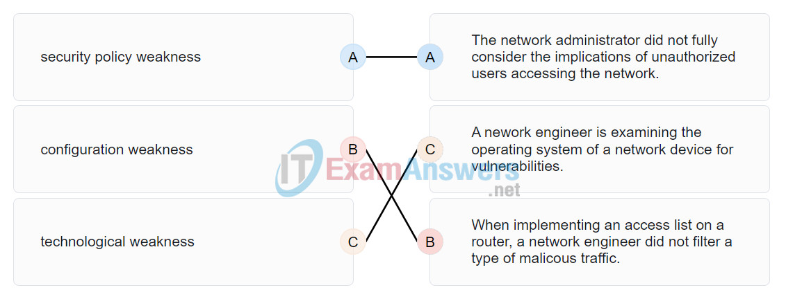
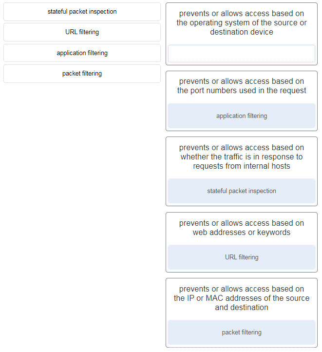
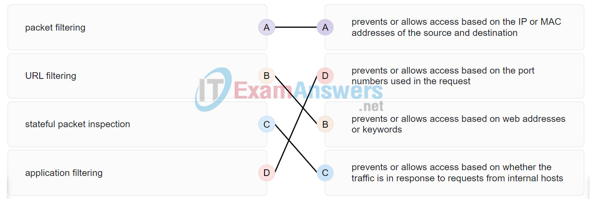
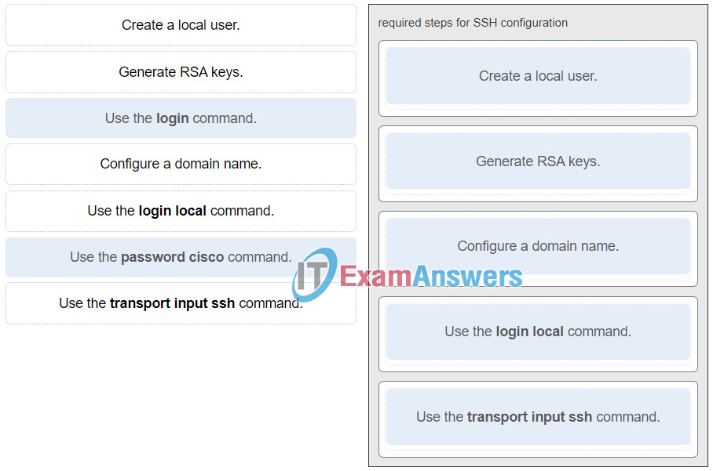
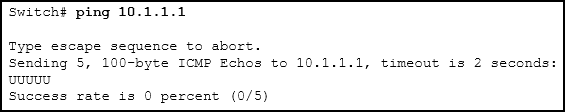
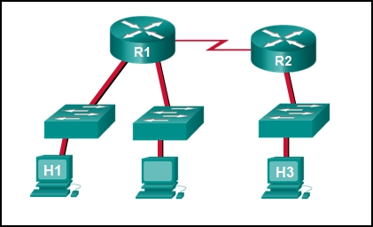
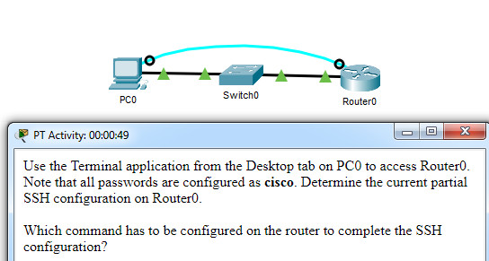

# CCNA 1 - Modules 16 - 17 Building and Securing a Small Network Exam Answers

## Question 1

**Question:**
Which component is designed to protect against unauthorized communications to and from a computer?

**Choices:**
- **A.** security center
- **B.** port scanner
- **C.** antimalware
- **D.** antivirus
- **E.** firewall

**Correct Answer:**
firewall

**Explanation:**
Topic 16.3.5

---

## Question 2

**Question:**
Which command will block login attempts on RouterA for a period of 30 seconds if there are 2 failed login attempts within 10 seconds?

**Choices:**
- **A.** RouterA(config)# login block-for 10 attempts 2 within 30
- **B.** RouterA(config)# login block-for 30 attempts 2 within 10
- **C.** RouterA(config)# login block-for 2 attempts 30 within 10
- **D.** RouterA(config)# login block-for 30 attempts 10 within 2

**Correct Answer:**
RouterA(config)# login block-for 30 attempts 2 within 10

**Explanation:**
Topic 16.4.3

---

## Question 3

**Question:**
What is the purpose of the network security accounting function?

**Choices:**
- **A.** to require users to prove who they are
- **B.** to determine which resources a user can access
- **C.** to keep track of the actions of a user
- **D.** to provide challenge and response questions

**Correct Answer:**
to keep track of the actions of a user

**Explanation:**
Topic 16.3.4

---

## Question 4

**Question:**
What type of attack may involve the use of tools such as nslookup and fping?

**Choices:**
- **A.** access attack
- **B.** reconnaissance attack
- **C.** denial of service attack
- **D.** worm attack

**Correct Answer:**
reconnaissance attack

**Explanation:**
Topic 16.2.2

---

## Question 5

**Question:**
Match each weakness with an example. (Not all options are used.) Place the options in the following order: security policy weakness The network administrator did not fully consider the implications of unauthorized users accessing the network. configuration weakness When implementing an access list on a router, a network engineer did not filter a type of malicous traffic. technological weakness A nework engineer is examining the operating system of a network device for vulnerabilities.

**Images:**

**Explanation:**
Topic 16.1.2 An employee who is trying to guess the password of another user exemplifies not a weakness but an attack.

---

## Question 6

**Question:**
Match the type of information security threat to the scenario. (Not all options are used.) Explanation: Topic 16.1.2 After an intruder gains access to a network, common network threats are as follows: Information theft Identity theft Data loss or manipulation Disruption of service Cracking the password for a known username is a type of access attack.

**Images:**

---

## Question 7

**Question:**
Which example of malicious code would be classified as a Trojan horse?

**Choices:**
- **A.** malware that was written to look like a video game
- **B.** malware that requires manual user intervention to spread between systems
- **C.** malware that attaches itself to a legitimate program and spreads to other programs when launched
- **D.** malware that can automatically spread from one system to another by exploiting a vulnerability in the target

**Correct Answer:**
malware that was written to look like a video game

**Explanation:**
Topic 16.2.1 A Trojan horse is malicious code that has been written specifically to look like a legitimate program. This is in contrast to a virus, which simply attaches itself to an actual legitimate program. Viruses require manual intervention from a user to spread from one system to another, while a worm is able to spread automatically between systems by exploiting vulnerabilities on those devices.

---

## Question 8

**Question:**
What is the difference between a virus and a worm?

**Choices:**
- **A.** Viruses self-replicate but worms do not.
- **B.** Worms self-replicate but viruses do not.
- **C.** Worms require a host file but viruses do not.
- **D.** Viruses hide in legitimate programs but worms do not.

**Correct Answer:**
Worms self-replicate but viruses do not.

**Explanation:**
Topic 16.2.1 Worms are able to self-replicate and exploit vulnerabilities on computer networks without user participation.

---

## Question 9

**Question:**
Which attack involves a compromise of data that occurs between two end points?

**Choices:**
- **A.** denial-of-service
- **B.** man-in-the-middle attack
- **C.** extraction of security parameters
- **D.** username enumeration

**Correct Answer:**
man-in-the-middle attack

**Explanation:**
Topic 16.2.3 Threat actors frequently attempt to access devices over the internet through communication protocols. Some of the most popular remote exploits are as follows: Man-In-the-middle attack (MITM) – The threat actor gets between devices in the system and intercepts all of the data being transmitted. This information could simply be collected or modified for a specific purpose and delivered to its original destination. Eavesdropping attack – When devices are being installed, the threat actor can intercept data such as security keys that are used by constrained devices to establish communications once they are up and running. SQL injection (SQLi) – Threat actors uses a flaw in the Structured Query Language (SQL) application that allows them to have access to modify the data or gain administrative privileges. Routing attack – A threat actor could either place a rogue routing device on the network or modify routing packets to manipulate routers to send all packets to the chosen destination of the threat actor. The threat actor could then drop specific packets, known as selective forwarding, or drop all packets, known as a sinkhole attack.

---

## Question 10

**Question:**
Which type of attack involves an adversary attempting to gather information about a network to identify vulnerabilities?

**Choices:**
- **A.** reconnaissance
- **B.** DoS
- **C.** dictionary
- **D.** man-in-the-middle

**Correct Answer:**
reconnaissance

**Explanation:**
Topic 16.2.2 Reconnaissance is a type of attack where the intruder is looking for wireless network vulnerabilities.

---

## Question 11

**Question:**
Match the description to the type of firewall filtering. (Not all options are used.)

**Images:**

**Explanation:**
Topic 16.3.6 Stateful packet inspection : Prevents or allows access based on whether the traffic is in response to requests from internal hosts. URL filtering : Prevents or allows access based on web addresses or keywords. Application filtering : Prevents or allows access based on the port numbers used in the request. Packet filtering : Prevents or allows access based on the IP or MAC addresses of the source and destination.

---

## Question 12

**Question:**
What is the purpose of the network security authentication function?

**Choices:**
- **A.** to require users to prove who they are
- **B.** to determine which resources a user can access
- **C.** to keep track of the actions of a user
- **D.** to provide challenge and response questions

**Correct Answer:**
to require users to prove who they are

**Explanation:**
Topic 16.3.4 Authentication, authorization, and accounting are network services collectively known as AAA. Authentication requires users to prove who they are. Authorization determines which resources the user can access. Accounting keeps track of the actions of the user.

---

## Question 13

**Question:**
Which firewall feature is used to ensure that packets coming into a network are legitimate responses to requests initiated from internal hosts?

**Choices:**
- **A.** stateful packet inspection
- **B.** URL filtering
- **C.** application filtering
- **D.** packet filtering

**Correct Answer:**
stateful packet inspection

**Explanation:**
Topic 16.3.6 Stateful packet inspection on a firewall checks that incoming packets are actually legitimate responses to requests originating from hosts inside the network. Packet filtering can be used to permit or deny access to resources based on IP or MAC address. Application filtering can permit or deny access based on port number. URL filtering is used to permit or deny access based on URL or on keywords.

---

## Question 14

**Question:**
When applied to a router, which command would help mitigate brute-force password attacks against the router?

**Choices:**
- **A.** exec-timeout 30
- **B.** service password-encryption
- **C.** banner motd $Max failed logins = 5$
- **D.** login block-for 60 attempts 5 within 60

**Correct Answer:**
login block-for 60 attempts 5 within 60

**Explanation:**
Topic 16.4.3 The login block-for command sets a limit on the maximum number of failed login attempts allowed within a defined period of time. If this limit is exceeded, no further logins are allowed for the specified period of time. This helps to mitigate brute-force password cracking since it will significantly increase the amount of time required to crack a password. The exec-timeout command specifies how long the session can be idle before the user is disconnected. The service password-encryption command encrypts the passwords in the running configuration. The banner motd command displays a message to users who are logging in to the device.

---

## Question 15

**Question:**
Identify the steps needed to configure a switch for SSH. The answer order does not matter. (Not all options are used.) ITN (Version 7.00) – Building and Securing a Small Network Exam

**Images:**

**Explanation:**
Topic 16.4.4 The login and password cisco commands are used with Telnet switch configuration, not SSH configuration.

---

## Question 16

**Question:**
What feature of SSH makes it more secure than Telnet for a device management connection?

**Choices:**
- **A.** confidentiality with IPsec
- **B.** stronger password requirement
- **C.** random one-time port connection
- **D.** login information and data encryption

**Correct Answer:**
login information and data encryption

**Explanation:**
Topic 16.4.4 Secure Shell (SSH) is a protocol that provides a secure management connection to a remote device. SSH provides security by providing encryption for both authentication (username and password) and the transmitted data. Telnet is a protocol that uses unsecure plaintext transmission. SSH is assigned to TCP port 22 by default. Although this port can be changed in the SSH server configuration, the port is not dynamically changed. SSH does not use IPsec.

---

## Question 17

**Question:**
What is the advantage of using SSH over Telnet?

**Choices:**
- **A.** SSH is easier to use.
- **B.** SSH operates faster than Telnet.
- **C.** SSH provides secure communications to access hosts.
- **D.** SSH supports authentication for a connection request.

**Correct Answer:**
SSH provides secure communications to access hosts.

**Explanation:**
Topic 16.4.4 SSH provides a secure method for remote access to hosts by encrypting network traffic between the SSH client and remote hosts. Although both Telnet and SSH request authentication before a connection is established, Telnet does not support encryption of login credentials.

---

## Question 18

**Question:**
What is the role of an IPS?

**Choices:**
- **A.** detecting and blocking of attacks in real time
- **B.** connecting global threat information to Cisco network security devices
- **C.** authenticating and validating traffic
- **D.** filtering of nefarious websites

**Correct Answer:**
detecting and blocking of attacks in real time

**Explanation:**
Topic 16.3.4 An intrusion prevention system (IPS) provides real-time detection and blocking of attacks.

---

## Question 19

**Question:**
A user is redesigning a network for a small company and wants to ensure security at a reasonable price. The user deploys a new application-aware firewall with intrusion detection capabilities on the ISP connection. The user installs a second firewall to separate the company network from the public network. Additionally, the user installs an IPS on the internal network of the company. What approach is the user implementing?

**Choices:**
- **A.** attack based
- **B.** risk based
- **C.** structured
- **D.** layered

**Correct Answer:**
layered

**Explanation:**
Topic 16.3.1 Using different defenses at various points of the network creates a layered approach.

---

## Question 20

**Question:**
What is an accurate description of redundancy?

**Choices:**
- **A.** configuring a router with a complete MAC address database to ensure that all frames can be forwarded to the correct destination
- **B.** configuring a switch with proper security to ensure that all traffic forwarded through an interface is filtered
- **C.** designing a network to use multiple virtual devices to ensure that all traffic uses the best path through the internetwork
- **D.** designing a network to use multiple paths between switches to ensure there is no single point of failure

**Correct Answer:**
designing a network to use multiple paths between switches to ensure there is no single point of failure

**Explanation:**
Topic 17.1.4 Redundancy attempts to remove any single point of failure in a network by using multiple physically cabled paths between switches in the network.

---

## Question 21

**Question:**
A network administrator is upgrading a small business network to give high priority to real-time applications traffic. What two types of network services is the network administrator trying to accommodate? (Choose two.)

**Choices:**
- **A.** voice
- **B.** video
- **C.** instant messaging
- **D.** FTP
- **E.** SNMP

**Correct Answer:**
voice; video

**Explanation:**
Topic 17.1.5 Streaming media, such as video, and voice traffic, are both examples of real-time traffic. Real-time traffic needs higher priority through the network than other types of traffic because it is very sensitive to network delay and latency.

---

## Question 22

**Question:**
What is the purpose of a small company using a protocol analyzer utility to capture network traffic on the network segments where the company is considering a network upgrade?

**Choices:**
- **A.** to identify the source and destination of local network traffic
- **B.** to capture the Internet connection bandwidth requirement
- **C.** to document and analyze network traffic requirements on each network segment
- **D.** to establish a baseline for security analysis after the network is upgraded

**Correct Answer:**
to document and analyze network traffic requirements on each network segment

**Explanation:**
Topic 17.3.2 An important prerequisite for considering network growth is to understand the type and amount of traffic that is crossing the network as well as the current traffic flow. By using a protocol analyzer in each network segment, the network administrator can document and analyze the network traffic pattern for each segment, which becomes the base in determining the needs and means of the network growth.

---

## Question 23

**Question:**
Refer to the exhibit. An administrator is testing connectivity to a remote device with the IP address 10.1.1.1. What does the output of this command indicate?

**Images:**

**Choices:**
- **A.** Connectivity to the remote device was successful.
- **B.** A router along the path did not have a route to the destination.
- **C.** A ping packet is being blocked by a security device along the path.
- **D.** The connection timed out while waiting for a reply from the remote device.

**Correct Answer:**
A router along the path did not have a route to the destination.

**Explanation:**
Topic 17.4.1 In the output of the ping command, an exclamation mark (!) indicates a response was successfully received, a period (.) indicates that the connection timed out while waiting for a reply, and the letter “U” indicates that a router along the path did not have a route to the destination and sent an ICMP destination unreachable message back to the source.

---

## Question 24

**Question:**
Which method is used to send a ping message specifying the source address for the ping?

**Choices:**
- **A.** Issue the ping command from within interface configuration mode.
- **B.** Issue the ping command without specifying a destination IP address.
- **C.** Issue the ping command without extended commands.
- **D.** Issue the ping command after shutting down un-needed interfaces.

**Correct Answer:**
Issue the ping command without specifying a destination IP address.

**Explanation:**
Topic 17.4.2 By issuing the ping command without a destination IP address in privileged EXEC mode, the Cisco IOS enters extended ping mode. This allows the user to implement extended commands which include source IP address.​

---

## Question 25

**Question:**
A network engineer is analyzing reports from a recently performed network baseline. Which situation would depict a possible latency issue?

**Choices:**
- **A.** a change in the bandwidth according to the show interfaces output
- **B.** a next-hop timeout from a traceroute
- **C.** an increase in host-to-host ping response times
- **D.** a change in the amount of RAM according to the show version output

**Correct Answer:**
an increase in host-to-host ping response times

**Explanation:**
Topic 17.4.1 While analyzing historical reports an administrator can compare host-to-host timers from the ping command and depict possible latency issues.​

---

## Question 26

**Question:**
Which statement is true about Cisco IOS ping indicators?​

**Choices:**
- **A.** ‘!’ indicates that the ping was unsuccessful and that the device may have issues finding a DNS server.
- **B.** ‘U’ may indicate that a router along the path did not contain a route to the destination address and that the ping was unsuccessful.
- **C.** ‘.’ indicates that the ping was successful but the response time was longer than normal.
- **D.** A combination of ‘.’ and ‘!’ indicates that a router along the path did not have a route to the destination address and responded with an ICMP unreachable message.​

**Correct Answer:**
‘U’ may indicate that a router along the path did not contain a route to the destination address and that the ping was unsuccessful.

**Explanation:**
Topic 17.4.1 The most common indicators of a ping issued from the Cisco IOS are “!”, “.”, and “U”. The “!” indicates that the ping completed successfully, verifying connectivity at Layer 3. The “.” may indicate that a connectivity problem, routing problem, or device security issue exists along the path and that an ICMP destination unreachable message was not provided. The “U” indicates that a router along the path may not have had a route to the destination address, and that it responded with an ICMP unreachable message.

---

## Question 27

**Question:**
A user reports a lack of network connectivity. The technician takes control of the user machine and attempts to ping other computers on the network and these pings fail. The technician pings the default gateway and that also fails. What can be determined for sure by the results of these tests?

**Choices:**
- **A.** The NIC in the PC is bad.
- **B.** The TCP/IP protocol is not enabled.
- **C.** The router that is attached to the same network as the workstation is down.
- **D.** Nothing can be determined for sure at this point.

**Correct Answer:**
Nothing can be determined for sure at this point.

**Explanation:**
Topic 17.4.1 In networks today, a failed ping could mean that the other devices on the network are blocking pings. Further investigation such as checking network connectivity from other devices on the same network is warranted.

---

## Question 28

**Question:**
A network technician issues the C:> tracert -6 www.cisco.com command on a Windows PC. What is the purpose of the -6 command option?

**Choices:**
- **A.** It forces the trace to use IPv6.
- **B.** It limits the trace to only 6 hops.
- **C.** It sets a 6 milliseconds timeout for each replay.
- **D.** It sends 6 probes within each TTL time period.

**Correct Answer:**
It forces the trace to use IPv6.

**Explanation:**
Topic 17.4.3 The -6 option in the command C:> tracert -6 www.cisco.com is used to force the trace to use IPv6.

---

## Question 29

**Question:**
Why would a network administrator use the tracert utility?

**Choices:**
- **A.** to determine the active TCP connections on a PC
- **B.** to check information about a DNS name in the DNS server
- **C.** to identify where a packet was lost or delayed on a network
- **D.** to display the IP address, default gateway, and DNS server address for a PC

**Correct Answer:**
to identify where a packet was lost or delayed on a network

**Explanation:**
Topic 17.4.3 The tracert utility is used to identify the path a packet takes from source to destination. Tracert is commonly used when packets are dropped or not reaching a specific destination.

---

## Question 30

**Question:**
A ping fails when performed from router R1 to directly connected router R2. The network administrator then proceeds to issue the show cdp neighbors command. Why would the network administrator issue this command if the ping failed between the two routers?

**Choices:**
- **A.** The network administrator suspects a virus because the ping command did not work.
- **B.** The network administrator wants to verify Layer 2 connectivity.
- **C.** The network administrator wants to verify the IP address configured on router R2.
- **D.** The network administrator wants to determine if connectivity can be established from a non-directly connected network.

**Correct Answer:**
The network administrator wants to verify Layer 2 connectivity.

**Explanation:**
Topic 17.5.6 The show cdp neighbors command can be used to prove that Layer 1 and Layer 2 connectivity exists between two Cisco devices. For example, if two devices have duplicate IP addresses, a ping between the devices will fail, but the output of show cdp neighbors will be successful. The show cdp neighbors detail could be used to verify the IP address of the directly connected device in case the same IP address is assigned to the two routers.

---

## Question 31

**Question:**
A network engineer is troubleshooting connectivity issues among interconnected Cisco routers and switches. Which command should the engineer use to find the IP address information, host name, and IOS version of neighboring network devices?

**Choices:**
- **A.** show version
- **B.** show ip route
- **C.** show interfaces
- **D.** show cdp neighbors detail

**Correct Answer:**
show cdp neighbors detail

**Explanation:**
Topic 17.5.6 The show cdp neighbors detail command reveals much information about neighboring Cisco devices, including the IP address, the capabilities, host name, and IOS version. The show interfaces and show version commands display information about the local device.

---

## Question 32

**Question:**
What information about a Cisco router can be verified using the show version command?

**Choices:**
- **A.** the routing protocol version that is enabled
- **B.** the value of the configuration register
- **C.** the operational status of serial interfaces
- **D.** the administrative distance used to reach networks

**Correct Answer:**
the value of the configuration register

**Explanation:**
Topic 17.5.5 The value of the configuration register can be verified with the show version command.

---

## Question 33

**Question:**
Which command should be used on a Cisco router or switch to allow log messages to be displayed on remotely connected sessions using Telnet or SSH?

**Choices:**
- **A.** debug all
- **B.** logging synchronous
- **C.** show running-config​
- **D.** terminal monitor

**Correct Answer:**
terminal monitor

**Explanation:**
Topic 17.6.4 The terminal monitor command is very important to use when log messages appear. Log messages appear by default when a user is directly consoled into a Cisco device, but require the terminal monitor command to be entered when a user is accessing a network device remotely.

---

## Question 34

**Question:**
Which command can an administrator issue on a Cisco router to send debug messages to the vty lines?

**Choices:**
- **A.** terminal monitor
- **B.** logging console
- **C.** logging buffered
- **D.** logging synchronous

**Correct Answer:**
terminal monitor

**Explanation:**
Topic 17.6.4 Debug messages, like other IOS log messages, are sent to the console line by default. Sending these messages to the terminal lines requires the terminal monitor command.

---

## Question 35

**Question:**
By following a structured troubleshooting approach, a network administrator identified a network issue after a conversation with the user. What is the next step that the administrator should take?

**Choices:**
- **A.** Verify full system functionality.
- **B.** Test the theory to determine cause.
- **C.** Establish a theory of probable causes.
- **D.** Establish a plan of action to resolve the issue.

**Correct Answer:**
Establish a theory of probable causes.

**Explanation:**
Topic 17.6.1 A structured network troubleshooting approach should include these steps in sequence: Identify the problem. Establish a theory of probable causes. Test the theory to determine cause. Establish a plan of action to resolve the issue. Verify full system functionality and implement preventive measures. Document findings, actions, and outcomes.

---

## Question 36

**Question:**
Users are complaining that they are unable to browse certain websites on the Internet. An administrator can successfully ping a web server via its IP address, but cannot browse to the domain name of the website. Which troubleshooting tool would be most useful in determining where the problem is?

**Choices:**
- **A.** netstat
- **B.** tracert
- **C.** nslookup
- **D.** ipconfig

**Correct Answer:**
nslookup

**Explanation:**
Topic 17.7.5 The nslookup command can be used to look up information about a particular DNS name in the DNS server. The information includes the IP address of the DNS server being used as well as the IP address associated with the specified DNS name. This command can help verify the DNS that is used and if the domain name to IP address resolution works.

---

## Question 37

**Question:**
An employee complains that a Windows PC cannot connect to the Internet. A network technician issues the ipconfig command on the PC and is shown an IP address of 169.254.10.3. Which two conclusions can be drawn? (Choose two.)

**Choices:**
- **A.** The PC cannot contact a DHCP server.
- **B.** The DNS server address is misconfigured.
- **C.** The default gateway address is not configured.
- **D.** The PC is configured to obtain an IP address automatically.
- **E.** The enterprise network is misconfigured for dynamic routing.

**Correct Answer:**
The PC cannot contact a DHCP server.; The PC is configured to obtain an IP address automatically.

**Explanation:**
Topic 17.7.3 When a Windows PC is configured to obtain an IP address automatically, the PC will try to obtain an IP address from a DHCP server. When the PC cannot contact a DHCP server, Windows will automatically assign an address belonging to the 169.254.0.0/16 range.

---

## Question 38

**Question:**
Refer to the exhibit. Host H3 is having trouble communicating with host H1. The network administrator suspects a problem exists with the H3 workstation and wants to prove that there is no problem with the R2 configuration. What tool could the network administrator use on router R2 to prove that communication exists to host H1 from the interface on R2, which is the interface that H3 uses when communicating with remote networks?

**Images:**

**Choices:**
- **A.** traceroute
- **B.** show cdp neighbors
- **C.** Telnet
- **D.** an extended ping

**Correct Answer:**
an extended ping

**Explanation:**
Topic 17.4.2 An extended ping allows an administrator to select specific ping features. For example in this situation, the network administrator could do an extended ping and specify a source address of the gigabit Ethernet port on the router. The destination address would be the IP address of host H1. If the ping succeeds connectivity exists from the Ethernet router interface on R2 to device H1.

---

## Question 39

**Question:**
Refer to the exhibit. Baseline documentation for a small company had ping round trip time statistics of 36/97/132 between hosts H1 and H3. Today the network administrator checked connectivity by pinging between hosts H1 and H3 that resulted in a round trip time of 1458/2390/6066. What does this indicate to the network administrator?

**Images:**

**Choices:**
- **A.** Connectivity between H1 and H3 is fine.
- **B.** H3 is not connected properly to the network.
- **C.** Something is causing interference between H1 and R1.
- **D.** Performance between the networks is within expected parameters.
- **E.** Something is causing a time delay between the networks.

**Correct Answer:**
Something is causing a time delay between the networks.

**Explanation:**
Topic 17.4.5 Ping round trip time statistics are shown in milliseconds. The larger the number the more delay. A baseline is critical in times of slow performance. By looking at the documentation for the performance when the network is performing fine and comparing it to information when there is a problem, a network administrator can resolve problems faster.

---

## Question 40

**Question:**
Which network service automatically assigns IP addresses to devices on the network?

**Choices:**
- **A.** DHCP
- **B.** Telnet
- **C.** DNS
- **D.** traceroute

**Correct Answer:**
DHCP

**Explanation:**
Topic 17.2.2 Dynamic Host Configuration Protocol (DHCP) can be used to allow end devices to automatically configure IP information, such as their IP address, subnet mask, DNS server, and default gateway. The DNS service is used to provide domain name resolution, mapping hostnames to IP addresses. Telnet is a method for remotely accessing a CLI session of a switch or router. Traceroute is a command used to determine the path a packet takes as it traverses the network.

---

## Question 41

**Question:**
Which command can an administrator execute to determine what interface a router will use to reach remote networks?

**Choices:**
- **A.** show arp
- **B.** show interfaces
- **C.** show ip route
- **D.** show protocols

**Correct Answer:**
show ip route

**Explanation:**
Topic 17.5.5 The show ip route command is used to display the IP routing table of the router. The IP routing table will show a list of known local and remote networks and the interfaces that the router will use to reach those networks.

---

## Question 42

**Question:**
On which two interfaces or ports can security be improved by configuring executive timeouts? (Choose two.)

**Choices:**
- **A.** Fast Ethernet interfaces
- **B.** console ports
- **C.** serial interfaces
- **D.** vty ports
- **E.** loopback interfaces

**Correct Answer:**
console ports; vty ports

**Explanation:**
Topic 16.4.3 Executive timeouts allow the Cisco device to automatically disconnect users after they have been idle for the specified time. Console, vty, and aux ports can be configured with executive timeouts.

---

## Question 43

**Question:**
When configuring SSH on a router to implement secure network management, a network engineer has issued the login local and transport input ssh line vty commands. What three additional configuration actions have to be performed to complete the SSH configuration? (Choose three.)

**Choices:**
- **A.** Set the user privilege levels.
- **B.** Generate the asymmetric RSA keys.
- **C.** Configure the correct IP domain name.
- **D.** Configure role-based CLI access.
- **E.** Create a valid local username and password database.
- **F.** Manually enable SSH after the RSA keys are generated.

**Correct Answer:**
Generate the asymmetric RSA keys.; Configure the correct IP domain name.; Create a valid local username and password database.

**Explanation:**
Topic 16.4.4 SSH is automatically enabled after the RSA keys are generated. Setting user privilege levels and configuring role-based CLI access are good security practices but are not a requirement of implementing SSH.

---

## Question 44

**Question:**
What is considered the most effective way to mitigate a worm attack?

**Choices:**
- **A.** Change system passwords every 30 days.
- **B.** Ensure that all systems have the most current virus definitions.
- **C.** Ensure that AAA is configured in the network.
- **D.** Download security updates from the operating system vendor and patch all vulnerable systems.

**Correct Answer:**
Download security updates from the operating system vendor and patch all vulnerable systems.

**Explanation:**
Topic 16.3.3 Because worms take advantage of vulnerabilities in the system itself, the most effective way to mitigate worm attacks is to download security updates from the operating system vendor and patch all vulnerable systems.

---

## Question 45

**Question:**
Which statement describes the ping and tracert commands?

**Choices:**
- **A.** Tracert shows each hop, while ping shows a destination reply only.
- **B.** Tracert uses IP addresses; ping does not.
- **C.** Both ping and tracert can show results in a graphical display.
- **D.** Ping shows whether the transmission is successful; tracert does not.

**Correct Answer:**
Tracert shows each hop, while ping shows a destination reply only.

**Explanation:**
Topic 17.4.1 The ping utility tests end-to-end connectivity between the two hosts. However, if the message does not reach the destination, there is no way to determine where the problem is located. On the other hand, the traceroute utility ( tracert in Windows) traces the route a message takes from its source to the destination. Traceroute displays each hop along the way and the time it takes for the message to get to that network and back.

---

## Question 46

**Question:**
A technician is to document the current configurations of all network devices in a college, including those in off-site buildings. Which protocol would be best to use to securely access the network devices?

**Choices:**
- **A.** FTP
- **B.** HTTP
- **C.** SSH
- **D.** Telnet

**Correct Answer:**
SSH

**Explanation:**
Topic 16.4.4 Telnet sends passwords and other information in clear text, while SSH encrypts its data. FTP and HTTP do not provide remote device access for configuration purposes.

---

## Question 47

**Question:**
Open the PT Activity. Perform the tasks in the activity instructions and then answer the question. CCNA 1 v7 Modules 16 – 17 Building and Securing a Small Network Exam Modules 16 – 17 Building and Securing a Small Network Exam 1 file(s) 180.48 KB Download Which command has to be configured on the router to complete the SSH configuration?

**Images:**

**Choices:**
- **A.** service password-encryption
- **B.** transport input ssh
- **C.** enable secret class
- **D.** ip domain-name cisco.com

**Correct Answer:**
transport input ssh

**Explanation:**
Topic 16.4.4 The missing command to complete the SSH configuration is transport input ssh in line vty 0 4 mode.The commands service password-encryption and enable secret class do configure secure features on the router, but are not required to configure SSH. The command ip domain-name cisco.com is not required because the command i p domain-name span.com has been used.

---

## Question 48

**Question:**
An administrator decides to use “WhatAreyouwaiting4” as the password on a newly installed router. Which statement applies to the password choice?

**Choices:**
- **A.** It is strong because it uses a passphrase.
- **B.** It is weak because it is often the default password on new devices.
- **C.** It is weak since it uses easily found personal information.
- **D.** It is weak since it is a word that is easily found in the dictionary.

**Correct Answer:**
It is strong because it uses a passphrase.

**Explanation:**
Topic 16.4.2

---

## Question 49

**Question:**
An administrator decides to use “pR3s!d7n&0” as the password on a newly installed router. Which statement applies to the password choice?

**Choices:**
- **A.** It is strong because it uses a minimum of 10 numbers, letters and special characters.
- **B.** It is weak because it is often the default password on new devices.
- **C.** It is weak since it uses easily found personal information.
- **D.** It is weak since it is a word that is easily found in the dictionary.

**Correct Answer:**
It is strong because it uses a minimum of 10 numbers, letters and special characters.

**Explanation:**
Topic 16.4.2

---

## Question 50

**Question:**
An administrator decides to use “5$7*4#033!” as the password on a newly installed router. Which statement applies to the password choice?

**Choices:**
- **A.** It is strong because it contains 10 numbers and special characters.
- **B.** It is weak because it is often the default password on new devices.
- **C.** It is weak since it uses easily found personal information.
- **D.** It is strong because it uses a minimum of 10 numbers, letters and special characters.

**Correct Answer:**
It is strong because it contains 10 numbers and special characters.

**Explanation:**
Topic 16.4.2

---

## Question 51

**Question:**
An administrator decides to use “pR3s!d7n&0” as the password on a newly installed router. Which statement applies to the password choice?

**Choices:**
- **A.** It is strong because it uses a minimum of 10 numbers, letters and special characters.
- **B.** It is weak since it is a word that is easily found in the dictionary.
- **C.** It is strong because it uses a passphrase.
- **D.** It is strong because it contains 10 numbers and special characters.

**Correct Answer:**
It is strong because it uses a minimum of 10 numbers, letters and special characters.

**Explanation:**
Topic 16.4.2

---

## Question 52

**Question:**
An administrator decides to use “12345678!” as the password on a newly installed router. Which statement applies to the password choice?

**Choices:**
- **A.** It is weak because it uses a series of numbers or letters.
- **B.** It is strong because it uses a passphrase.
- **C.** It is weak since it is a word that is easily found in the dictionary.
- **D.** It is strong because it uses a minimum of 10 numbers, letters and special characters.

**Correct Answer:**
It is weak because it uses a series of numbers or letters.

**Explanation:**
Topic 16.4.1

---

## Question 53

**Question:**
An administrator decides to use “admin” as the password on a newly installed router. Which statement applies to the password choice?

**Choices:**
- **A.** It is weak because it is often the default password on new devices.
- **B.** It is strong because it uses a passphrase.
- **C.** It is strong because it uses a minimum of 10 numbers, letters and special characters.
- **D.** It is strong because it contains 10 numbers and special characters.

**Correct Answer:**
It is weak because it is often the default password on new devices.

**Explanation:**
Topic 16.4.1

---

## Question 54

**Question:**
An administrator decides to use “Feb121978” as the password on a newly installed router. Which statement applies to the password choice?

**Choices:**
- **A.** It is weak because it uses easily found personal information.
- **B.** It is strong because it uses a passphrase.
- **C.** It is weak since it is a word that is easily found in the dictionary.
- **D.** It is strong because it uses a minimum of 10 numbers, letters and special characters.

**Correct Answer:**
It is weak because it uses easily found personal information.

**Explanation:**
Topic 16.4.2

---

## Question 55

**Question:**
An administrator decides to use “password” as the password on a newly installed router. Which statement applies to the password choice?

**Choices:**
- **A.** It is weak because it is a commonly used password.
- **B.** It is weak since it is a word that is easily found in the dictionary.
- **C.** It is strong because it uses a passphrase.
- **D.** It is strong because it uses a minimum of 10 numbers, letters and special characters.

**Correct Answer:**
It is weak because it is a commonly used password.

**Explanation:**
Topic 16.4.1

---

## Question 56

**Question:**
An administrator decides to use “RobErT” as the password on a newly installed router. Which statement applies to the password choice?

**Choices:**
- **A.** It is weak since it uses easily found personal information.
- **B.** It is strong because it uses a passphrase.
- **C.** It is strong because it uses a minimum of 10 numbers, letters and special characters.
- **D.** It is strong because it contains 10 numbers and special characters.

**Correct Answer:**
It is weak since it uses easily found personal information.

**Explanation:**
Topic 16.4.2

---

## Question 57

**Question:**
An administrator decides to use “Elizabeth” as the password on a newly installed router. Which statement applies to the password choice?

**Choices:**
- **A.** It is weak because it uses easily found personal information.
- **B.** It is strong because it uses a passphrase.
- **C.** It is weak since it is a word that is easily found in the dictionary.
- **D.** It is strong because it uses a minimum of 10 numbers, letters and special characters.

**Correct Answer:**
It is weak because it uses easily found personal information.

**Explanation:**
Topic 16.4.2 Rules for strong passwords: * minimum of 8 characters, preferably 10. * use complex combinations of numbers, special characters, and upper and lower case letters. * avoid repetition, common dictionary words, letter or number sequences. * avoid names of children, relatives, pets, birthdays, or any easily identifiable personal information. * can be created by misspelling words or replacing vowels with numbers or special characters.

---

## Question 58

**Question:**
A network technician is troubleshooting an issue and needs to verify the IP addresses of all interfaces on a router. What is the best command to use to accomplish the task?

**Choices:**
- **A.** show ip interface brief
- **B.** nslookup
- **C.** ipconfig getifaddr en0
- **D.** show ip route

**Correct Answer:**
show ip interface brief

**Explanation:**
Topic 17.5.7

---

## Question 59

**Question:**
Students who are connected to the same switch are having slower than normal response times. The administrator suspects a duplex setting issue. What is the best command to use to accomplish the task?

**Choices:**
- **A.** show interfaces
- **B.** ipconfig getifaddr en0
- **C.** copy running-config startup-config
- **D.** show ip nat translations

**Correct Answer:**
show interfaces

**Explanation:**
Topic 17.7.1

---

## Question 60

**Question:**
A user wants to know the IP address of the PC. What is the best command to use to accomplish the task?

**Choices:**
- **A.** ipconfig
- **B.** copy running-config startup-config
- **C.** show interfaces
- **D.** show ip nat translations

**Correct Answer:**
ipconfig

**Explanation:**
Topic 17.5.1

---

## Question 61

**Question:**
A student wants to save a router configuration to NVRAM. What is the best command to use to accomplish the task?

**Choices:**
- **A.** copy running-config startup-config
- **B.** show interfaces
- **C.** show ip nat translations
- **D.** show ip route

**Correct Answer:**
copy running-config startup-config

**Explanation:**
Topic 17.5.1

---

## Question 62

**Question:**
A support technician needs to know the IP address of the wireless interface on a MAC. What is the best command to use to accomplish the task?

**Choices:**
- **A.** ipconfig getifaddr en0
- **B.** copy running-config startup-config
- **C.** show interfaces
- **D.** show ip nat translations

**Correct Answer:**
ipconfig getifaddr en0

**Explanation:**
Topic 17.5.3

---

## Question 63

**Question:**
A network technician is troubleshooting an issue and needs to verify all of the IPv6 interface addresses on a router. What is the best command to use to accomplish the task?

**Choices:**
- **A.** show ipv6 interface
- **B.** show interfaces
- **C.** show ip nat translations
- **D.** show ip route

**Correct Answer:**
show ipv6 interface

**Explanation:**
Topic 17.5.5

---

## Question 64

**Question:**
A teacher is having difficulties connecting his PC to the classroom network. He needs to verify that a default gateway is configured correctly. What is the best command to use to accomplish the task?

**Choices:**
- **A.** ipconfig
- **B.** copy running-config startup-config
- **C.** show interfaces
- **D.** show ip nat translations

**Correct Answer:**
ipconfig

**Explanation:**
Topic 17.5.1

---

## Question 65

**Question:**
Only employees connected to IPv6 interfaces are having difficulty connecting to remote networks. The analyst wants to verify that IPv6 routing has been enabled. What is the best command to use to accomplish the task?

**Choices:**
- **A.** show running-config
- **B.** show interfaces
- **C.** copy running-config startup-config
- **D.** show ip nat translations

**Correct Answer:**
show running-config

**Explanation:**
Topic 17.7.2

---

## Question 66

**Question:**
An administrator is troubleshooting connectivity issues and needs to determine the IP address of a website. What is the best command to use to accomplish the task?

**Choices:**
- **A.** nslookup
- **B.** show ipv6 route
- **C.** show ipv6 interface
- **D.** copy startup-config running-config

**Correct Answer:**
nslookup

**Explanation:**
Topic 17.7.5

---

## Question 67

**Question:**
What is a characteristic of UDP?

**Choices:**
- **A.** UDP datagrams take the same path and arrive in the correct order at the destination.​
- **B.** Applications that use UDP are always considered unreliable.​
- **C.** UDP reassembles the received datagrams in the order they were received.
- **D.** UDP only passes data to the network when the destination is ready to receive the data.

**Explanation:**
Topic 17.8 UDP has no way to reorder the datagrams into their transmission order, so UDP simply reassembles the data in the order it was received and forwards it to the application.​

---
