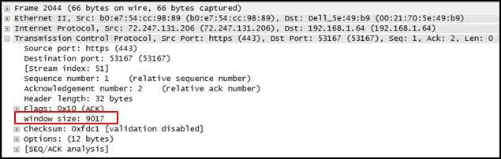
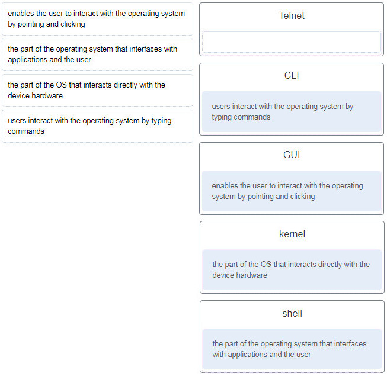
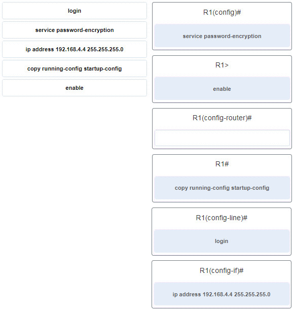
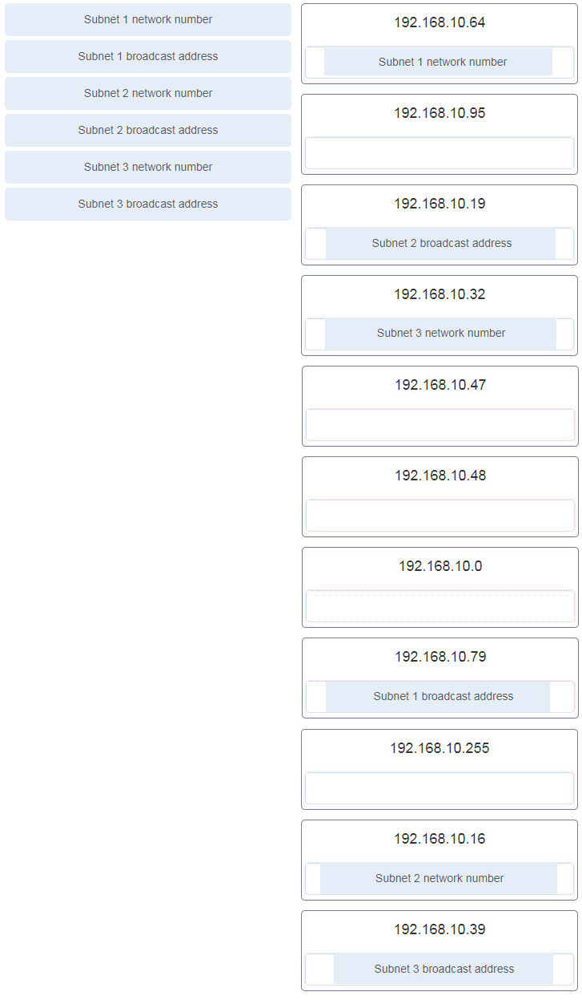
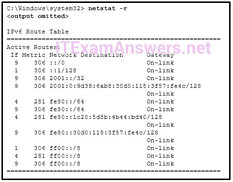
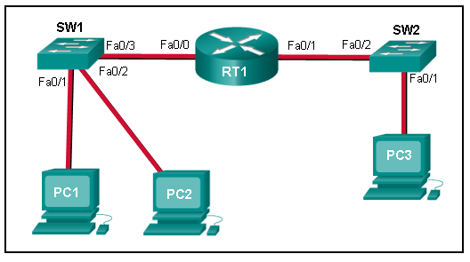
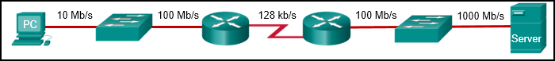
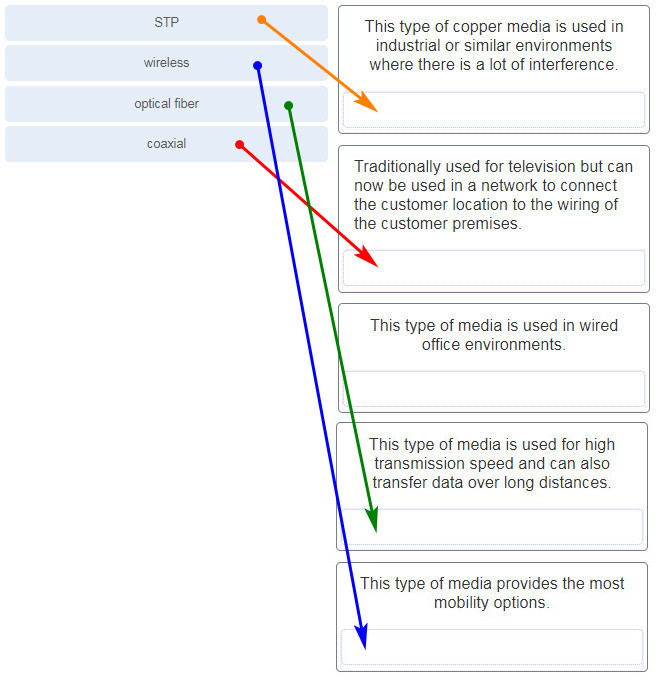

# CCNA 1 - ITNv7 Practice Final Exam

## Question 1

**Question:**
A client packet is received by a server. The packet has a destination port number of 22. What service is the client requesting?

**Choices:**
- **A.** SSH
- **B.** TFTP
- **C.** DHCP
- **D.** DNS

**Correct Answer:**
SSH

**Explanation:**
Topic 14.4.3 The destination port number 22 is the well-known port reserved for the SSH (Secure Shell) protocol. This application layer service is utilized to provide a secure, encrypted remote access connection to network devices and servers, serving as a secure alternative to Telnet (which operates over port 23). DHCP utilizes UDP ports 67 and 68. TFTP utilizes UDP port 69. DNS utilizes UDP/TCP port 53.

---

## Question 2

**Question:**
Refer to the exhibit. What does the value of the window size specify?

**Images:**

**Choices:**
- **A.** the amount of data that can be sent at one time
- **B.** the amount of data that can be sent before an acknowledgment is required
- **C.** the total number of bits received during this TCP session
- **D.** a random number that is used in establishing a connection with the 3-way handshake

**Correct Answer:**
the amount of data that can be sent before an acknowledgment is required

**Explanation:**
Topic 14.6.5 The window size determines the number of bytes that can be sent before expecting an acknowledgment. The acknowledgment number is the number of the next expected byte.

---

## Question 3

**Question:**
To which TCP port group does the port 414 belong?

**Choices:**
- **A.** well-known
- **B.** private or dynamic
- **C.** public
- **D.** registered

**Correct Answer:**
well-known

**Explanation:**
Topic 14.4.3 Well Known Ports: 0 through 1023. Registered Ports: 1024 through 49151. Dynamic/Private : 49152 through 65535.

---

## Question 4

**Question:**
Refer to the exhibit. An administrator is trying to configure the switch but receives the error message that is displayed in the exhibit. What is the problem?

**Images:**

**Choices:**
- **A.** The entire command, configure terminal, must be used.
- **B.** The administrator is already in global configuration mode.
- **C.** The administrator must first enter privileged EXEC mode before issuing the command.
- **D.** The administrator must connect via the console port to access global configuration mode.

**Correct Answer:**
The administrator must first enter privileged EXEC mode before issuing the command.

**Explanation:**
Topic 2.2.1 In order to enter global configuration mode, the command configure terminal, or a shortened version such as config t, must be entered from privileged EXEC mode. In this scenario the administrator is in user EXEC mode, as indicated by the > symbol after the hostname. The administrator would need to use the enable command to move into privileged EXEC mode before entering the configure terminal command.

---

## Question 5

**Question:**
What is a user trying to determine when issuing a ping 10.1.1.1 command on a PC?

**Choices:**
- **A.** if the TCP/IP stack is functioning on the PC without putting traffic on the wire
- **B.** if there is connectivity with the destination device
- **C.** the path that traffic will take to reach the destination
- **D.** what type of device is at the destination

**Correct Answer:**
if there is connectivity with the destination device

**Explanation:**
Topic 13.2.1 The ping destination command can be used to test connectivity.

---

## Question 6

**Question:**
What is a characteristic of a switch virtual interface (SVI)?​

**Choices:**
- **A.** An SVI is created in software and requires a configured IP address and a subnet mask in order to provide remote access to the switch.
- **B.** Although it is a virtual interface, it needs to have physical hardware on the device associated with it.
- **C.** SVIs do not require the no shutdown command to become enabled.
- **D.** SVIs come preconfigured on Cisco switches.

**Correct Answer:**
An SVI is created in software and requires a configured IP address and a subnet mask in order to provide remote access to the switch.

**Explanation:**
Topic 2.6.2 Cisco IOS Layer 2 switches have physical ports for devices to connect. These ports do not support Layer 3 IP addresses. Therefore, switches have one or more switch virtual interfaces (SVIs). These are virtual interfaces because there is no physical hardware on the device associated with it. An SVI is created in software. The virtual interface lets you remotely manage a switch over a network using IPv4 and IPv6. Each switch comes with one SVI appearing in the default configuration “out-of-the-box.” The default SVI is interface VLAN1.

---

## Question 7

**Question:**
Match the descriptions to the terms. (Not all options are used.) the part of the operating system that interfaces with applications and the user shell users interact with the operating system by typing commands CLI enables the user to interact with the operating system by pointing and clicking GUI the part of the OS that interacts directly with the device hardware kernel

**Images:**

**Explanation:**
Topic 2.1.1 A GUI, or graphical user interface, allows the user to interact with the operating system by pointing and clicking at elements on the screen. A CLI, or command-line interface, requires users to type commands at a prompt in order to interact with the OS. The shell is the part of the operating system that is closest to the user. The kernel is the part of the operating system that interfaces with the hardware.

---

## Question 8

**Question:**
What happens when a switch receives a frame and the calculated CRC value is different than the value that is in the FCS field?

**Choices:**
- **A.** The switch notifies the source of the bad frame.
- **B.** The switch places the new CRC value in the FCS field and forwards the frame.
- **C.** The switch drops the frame.
- **D.** The switch floods the frame to all ports except the port through which the frame arrived to notify the hosts of the error.

**Correct Answer:**
The switch drops the frame.

**Explanation:**
Topic 7.1.4 The purpose of the CRC value in the FCS field is to determine if the frame has errors. If the frame does have errors, then the frame is dropped by the switch.

---

## Question 9

**Question:**
Two network engineers are discussing the methods used to forward frames through a switch. What is an important concept related to the cut-through method of switching?

**Choices:**
- **A.** The fragment-free switching offers the lowest level of latency.
- **B.** Fast-forward switching can be viewed as a compromise between store-and-forward switching and fragment-free switching.
- **C.** Fragment-free switching is the typical cut-through method of switching.
- **D.** Packets can be relayed with errors when fast-forward switching is used.

**Correct Answer:**
Packets can be relayed with errors when fast-forward switching is used.

**Explanation:**
Topic 7.4.2 Fast-forward switching offers the lowest level of latency and it is the typical cut-through method of switching. Fragment-free switching can be viewed as a compromise between store-and-forward switching and fast-forward switching. Because fast-forward switching starts forwarding before the entire packet has been received, there may be times when packets are relayed with errors.

---

## Question 10

**Question:**
Which two issues can cause both runts and giants in Ethernet networks? (Choose two.)

**Choices:**
- **A.** using the incorrect cable type
- **B.** half-duplex operations
- **C.** a malfunctioning NIC
- **D.** electrical interference on serial interfaces
- **E.** CRC errors

**Correct Answer:**
half-duplex operations; a malfunctioning NIC

**Explanation:**
Topic 7.1.4 Because collisions are a normal aspect of half-duplex communications, runt and giant frames are common by-products of those operations. A malfunctioning NIC can also place frames on the network that are either too short or longer than the maximum allowed length. CRC errors can result from using the wrong type of cable or from electrical interference. Using a cable that is too long can result in late collisions rather than runts and giants.

---

## Question 11

**Question:**
Which two functions are performed at the LLC sublayer of the OSI Data Link Layer to facilitate Ethernet communication? (Choose two.)

**Choices:**
- **A.** implements CSMA/CD over legacy shared half-duplex media
- **B.** enables IPv4 and IPv6 to utilize the same physical medium
- **C.** integrates Layer 2 flows between 10 Gigabit Ethernet over fiber and 1 Gigabit Ethernet over copper
- **D.** implements a process to delimit fields within an Ethernet 2 frame
- **E.** places information in the Ethernet frame that identifies which network layer protocol is being encapsulated by the frame
- **F.** responsible for internal structure of Ethernet frame
- **G.** applies source and destination MAC addresses to Ethernet frame
- **H.** handles communication between upper layer networking software and Ethernet NIC hardware
- **I.** adds Ethernet control information to network protocol data
- **J.** implements trailer with frame check sequence for error detection

**Correct Answer:**
enables IPv4 and IPv6 to utilize the same physical medium; places information in the Ethernet frame that identifies which network layer protocol is being encapsulated by the frame; handles communication between upper layer networking software and Ethernet NIC hardware; adds Ethernet control information to network protocol data

**Explanation:**
Other case Other case Other case Topic 7.1.2 The data link layer is actually divided into two sublayers: + Logical Link Control (LLC): This upper sublayer defines the software processes that provide services to the network layer protocols. It places information in the frame that identifies which network layer protocol is being used for the frame. This information allows multiple Layer 3 protocols, such as IPv4 and IPv6, to utilize the same network interface and media. + Media Access Control (MAC): This lower sublayer defines the media access processes performed by the hardware. It provides data link layer addressing and delimiting of data according to the physical signaling requirements of the medium and the type of data link layer protocol in use.

---

## Question 12

**Question:**
Which two commands could be used to check if DNS name resolution is working properly on a Windows PC? (Choose two.)

**Choices:**
- **A.** nslookup cisco.com
- **B.** ping cisco.com
- **C.** ipconfig /flushdns
- **D.** net cisco.com
- **E.** nbtstat cisco.com

**Correct Answer:**
nslookup cisco.com; ping cisco.com

**Explanation:**
Topic 17.7.5 The ping command tests the connection between two hosts. When ping uses a host domain name to test the connection, the resolver on the PC will first perform the name resolution to query the DNS server for the IP address of the host. If the ping command is unable to resolve the domain name to an IP address, an error will result. Nslookup is a tool for testing and troubleshooting DNS servers.

---

## Question 13

**Question:**
A small advertising company has a web server that provides critical business service. The company connects to the Internet through a leased line service to an ISP. Which approach best provides cost effective redundancy for the Internet connection?

**Choices:**
- **A.** Add a second NIC to the web server.
- **B.** Add a connection to the Internet via a DSL line to another ISP.
- **C.** Add another web server to prepare failover support.
- **D.** Add multiple connections between the switches and the edge router.

**Correct Answer:**
Add a connection to the Internet via a DSL line to another ISP.

**Explanation:**
Topic 17.1.4 With a separate DSL connection to another ISP, the company will have a redundancy solution for the Internet connection, in case the leased line connection fails. The other options provide other aspects of redundancy, but not the Internet connection. The options of adding a second NIC and adding multiple connections between the switches and the edge router will provide redundancy in case one NIC fails or one connection between the switches and the edge router fails. The option of adding another web server provides redundancy if the main web server fails.

---

## Question 14

**Question:**
Only employees connected to IPv6 interfaces are having difficulty connecting to remote networks. The analyst wants to verify that IPv6 routing has been enabled. What is the best command to use to accomplish the task?

**Choices:**
- **A.** copy running-config startup-config
- **B.** show interfaces
- **C.** show ip nat translations
- **D.** show running-config

**Correct Answer:**
show running-config

**Explanation:**
Topic 12.5.1 For a Cisco router to forward IPv6 packets, the global configuration command ipv6 unicast-routing must be enabled. The show running-config command is the best option among the choices provided to verify whether this specific command is present in the device’s current active configuration. show ip nat translations is used exclusively for IPv4 Network Address Translation (NAT). show interfaces displays the status and statistics of interfaces but does not confirm if global IPv6 routing is enabled. copy running-config startup-config is used to save the active configuration to NVRAM, not for verification or troubleshooting.

---

## Question 15

**Question:**
Refer to the exhibit. A network administrator is connecting a new host to the Registrar LAN. The host needs to communicate with remote networks. What IP address would be configured as the default gateway on the new host? Copy Floor(config)# interface gi0/1 Floor(config-if)# description Connects to the Registrar LAN Floor(config-if)# ip address 192.168.235.234 255.255.255.0 Floor(config-if)# no shutdown Floor(config-if)# interface gi0/0 Floor(config-if)# description Connects to the Manager LAN Floor(config-if)# ip address 192.168.234.114 255.255.255.0 Floor(config-if)# no shutdown Floor(config-if)# interface s0/0/0 Floor(config-if)# description Connects to the ISP Floor(config-if)# ip address 10.234.235.254 255.255.255.0 Floor(config-if)# no shutdown Floor(config-if)# interface s0/0/1 Floor(config-if)# description Connects to the Head Office WAN Floor(config-if)# ip address 203.0.113.3 255.255.255.0 Floor(config-if)# no shutdown Floor(config-if)# end

**Choices:**
- **A.** 192.168.235.234
- **B.** 203.0.113.3
- **C.** 192.168.235.1
- **D.** 10.234.235.254
- **E.** 192.168.234.114

**Correct Answer:**
192.168.235.234

**Explanation:**
Topic 10.3.1 The host is being connected to the Registrar LAN. According to the router’s configuration, interface gi0/1 has the description “Connects to the Registrar LAN” and is assigned the IP address 192.168.235.234 . Since the default gateway for any host must be the IP address of the router interface directly attached to that specific local network segment, the correct IP address to configure on the new host is 192.168.235.234 .

---

## Question 16

**Question:**
Match the command with the device mode at which the command is entered. (Not all options are used.) Place the options in the following order: login R1(config-line)# ip address 192.168.4.4 255.255.255.0 R1(config-if)# service password-encryption R1(config)# enable R1> copy running-config startup-config R1#

**Images:**

**Explanation:**
Topic 10.1.1 The enable command is entered in R1> mode. The login command is entered in R1(config-line)# mode. The copy running-config startup-config command is entered in R1# mode. The ip address 192.168.4.4 255.255.255.0 command is entered in R1(config-if)# mode. The service password-encryption command is entered in global configuration mode.

---

## Question 17

**Question:**
A router boots and enters setup mode. What is the reason for this?

**Choices:**
- **A.** The IOS image is corrupt.
- **B.** Cisco IOS is missing from flash memory.
- **C.** The configuration file is missing from NVRAM.
- **D.** The POST process has detected hardware failure.
- **E.** Retrieves email from the server by downloading the email to the local mail application of the client.
- **F.** An application that allows real-time chatting among remote users.
- **G.** Allows remote access to network devices and servers.
- **H.** Uses encryption to provide secure remote access to network devices and servers.

**Correct Answer:**
The configuration file is missing from NVRAM.; Retrieves email from the server by downloading the email to the local mail application of the client.

**Explanation:**
Topic 10.1.1 The startup configuration file is stored in NVRAM and contains the commands needed to initially configure a router. It also creates the running configuration file that is stored in in RAM. 18. What service is provided by POP3? Topic 15.3.4 The Post Office Protocol version 3 (POP3) is an application layer protocol designed to enable email clients to retrieve messages from a mail server. According to the sources, the default operation of POP3 is to download the email to the client’s local application and then delete it from the server . This service operates over TCP port 110 and is specifically intended for message retrieval, distinguishing it from SMTP, which is used for sending mail, and IMAP, which typically maintains messages on the server.

---

## Question 18

**Question:**
Two students are working on a network design project. One student is doing the drawing, while the other student is writing the proposal. The drawing is finished and the student wants to share the folder that contains the drawing so that the other student can access the file and copy it to a USB drive. Which networking model is being used?

**Choices:**
- **A.** peer-to-peer
- **B.** client-based
- **C.** master-slave
- **D.** point-to-point

**Correct Answer:**
peer-to-peer

**Explanation:**
Topic 1.2.2 In a peer-to-peer (P2P) networking model, data is exchanged between two network devices without the use of a dedicated server. ​

---

## Question 19

**Question:**
Which command is used to manually query a DNS server to resolve a specific host name?

**Choices:**
- **A.** tracert
- **B.** ipconfig /displaydns
- **C.** nslookup
- **D.** net

**Correct Answer:**
nslookup

**Explanation:**
Topic 15.4.4 The nslookup command was created to allow a user to manually query a DNS server to resolve a given host name. The ipconfig /displaydns command only displays previously resolved DNS entries. The tracert command was created to examine the path that packets take as they cross a network and can resolve a hostname by automatically querying a DNS server. The net command is used to manage network computers, servers, printers, and network drives.

---

## Question 20

**Question:**
Which PDU is processed when a host computer is de-encapsulating a message at the transport layer of the TCP/IP model?

**Choices:**
- **A.** bits
- **B.** frame
- **C.** packet
- **D.** segment

**Correct Answer:**
segment

**Explanation:**
Topic 3.6.3 At the transport layer, a host computer will de-encapsulate a segment to reassemble data to an acceptable format by the application layer protocol of the TCP/IP model.

---

## Question 21

**Question:**
Which two OSI model layers have the same functionality as two layers of the TCP/IP model? (Choose two.)

**Choices:**
- **A.** data link
- **B.** network
- **C.** physical
- **D.** session
- **E.** transport

**Correct Answer:**
network; transport

**Explanation:**
Topic 3.5.4 The OSI transport layer is functionally equivalent to the TCP/IP transport layer, and the OSI network layer is equivalent to the TCP/IP internet layer. The OSI data link and physical layers together are equivalent to the TCP/IP network access layer. The OSI session layer (with the presentation layer) is included within the TCP/IP application layer.

---

## Question 22

**Question:**
Which three layers of the OSI model are comparable in function to the application layer of the TCP/IP model? (Choose three.)

**Choices:**
- **A.** presentation
- **B.** physical
- **C.** network
- **D.** data link
- **E.** transport
- **F.** application
- **G.** session

**Correct Answer:**
presentation; application; session

**Explanation:**
Topic 3.5.4 The TCP/IP model consists of four layers: application, transport, internet, and network access. The OSI model consists of seven layers: application, presentation, session, transport, network, data link, and physical. The top three layers of the OSI model: application, presentation, and session map to the application layer of the TCP/IP model.

---

## Question 23

**Question:**
Network information: * local router LAN interface: 172.19.29.254 / fe80:65ab:dcc1::10 * local router WAN interface: 198.133.219.33 / 2001:db8:FACE:39::10 * remote server: 192.135.250.103 What task might a user be trying to accomplish by using the ping 2001:db8:FACE:39::10 command?

**Choices:**
- **A.** verifying that there is connectivity within the local network
- **B.** creating a network performance benchmark to a server on the company intranet
- **C.** determining the path to reach the remote server
- **D.** verifying that there is connectivity to the internet

**Correct Answer:**
verifying that there is connectivity to the internet

**Explanation:**
Topic 17.4.1 The command ping 2001:db8:face:39::10 is being used to target the IPv6 address assigned to the local router’s WAN interface. Because the WAN (Wide Area Network) interface represents the gateway connecting the internal network to the outside world (the ISP), successfully pinging this address verifies that the host can reach the outer boundary of the network, thereby verifying that there is connectivity to the internet. verifying that there is connectivity within the local network is incorrect because the target address belongs to the external WAN interface, not the local LAN interface ( fe80:65ab:dcc1::10 ). determining the path to reach the remote server would require utilizing the traceroute or tracert command rather than a standard ping . creating a network performance benchmark... is not the primary purpose of a basic ICMP diagnostic test like ping .

---

## Question 24

**Question:**
Which two ICMP messages are used by both IPv4 and IPv6 protocols? (Choose two.)​

**Choices:**
- **A.** neighbor solicitation
- **B.** router advertisement
- **C.** router solicitation
- **D.** protocol unreachable
- **E.** route redirection

**Correct Answer:**
protocol unreachable; route redirection

**Explanation:**
Topic 13.1.1 The ICMP messages common to both ICMPv4 and ICMPv6 include: host confirmation, destination (net, host, protocol, port) or service unreachable, time exceeded, and route redirection. Router solicitation, neighbor solicitation, and router advertisement are new protocols implemented in ICMPv6.

---

## Question 25

**Question:**
A network technician types the command ping 127.0.0.1 at the command prompt on a computer. What is the technician trying to accomplish?

**Choices:**
- **A.** pinging a host computer that has the IP address 127.0.0.1 on the network
- **B.** tracing the path to a host computer on the network and the network has the IP address 127.0.0.1
- **C.** checking the IP address on the network card
- **D.** testing the integrity of the TCP/IP stack on the local machine

**Correct Answer:**
testing the integrity of the TCP/IP stack on the local machine

**Explanation:**
Topic 13.2.2 127.0.0.1 is an address reserved by TCP/IP to test the NIC, drivers and TCP/IP implementation of the device.

---

## Question 26

**Question:**
Although CSMA/CD is still a feature of Ethernet, why is it no longer necessary?

**Choices:**
- **A.** the virtually unlimited availability of IPv6 addresses
- **B.** the use of CSMA/CA
- **C.** the use of full-duplex capable Layer 2 switches
- **D.** the development of half-duplex switch operation
- **E.** the use of Gigabit Ethernet speeds

**Correct Answer:**
the use of full-duplex capable Layer 2 switches

**Explanation:**
Topic 7.1.3 The use of Layer 2 switches operating in full-duplex mode eliminates collisions, thereby eliminating the need for CSMA/CD.

---

## Question 27

**Question:**
What does a router do when it receives a Layer 2 frame over the network medium?

**Choices:**
- **A.** re-encapsulates the packet into a new frame
- **B.** forwards the new frame appropriate to the medium of that segment of the physical network
- **C.** determines the best path
- **D.** de-encapsulates the frame

**Correct Answer:**
de-encapsulates the frame

**Explanation:**
Topic 6.1.3 Routers are responsible for encapsulating a frame with the proper format for the physical network media they connect. At each hop along the path, a router does the following:Accepts a frame from a medium De-encapsulates the frame Determines the best path to forward the packet Re-encapsulates the packet into a new frame Forwards the new frame appropriate to the medium of that segment of the physical network

---

## Question 28

**Question:**
Which two acronyms represent the data link sublayers that Ethernet relies upon to operate? (Choose two.)

**Choices:**
- **A.** SFD
- **B.** LLC
- **C.** CSMA
- **D.** MAC
- **E.** FCS

**Correct Answer:**
LLC; MAC

**Explanation:**
Topic 7.1.2 For Layer 2 functions, Ethernet relies on logical link control (LLC) and MAC sublayers to operate at the data link layer. FCS (Frame Check Sequence) and SFD (Start Frame Delimiter) are fields of the Ethernet frame. CSMA (Carrier Sense Multiple Access) is the technology Ethernet uses to manage shared media access.

---

## Question 29

**Question:**
A network team is comparing topologies for connecting on a shared media. Which physical topology is an example of a hybrid topology for a LAN?

**Choices:**
- **A.** bus
- **B.** extended star
- **C.** ring
- **D.** partial mesh

**Correct Answer:**
extended star

**Explanation:**
Topic 6.2.4 An extended star topology is an example of a hybrid topology as additional switches are interconnected with other star topologies. A partial mesh topology is a common hybrid WAN topology. The bus and ring are not hybrid topology types.

---

## Question 30

**Question:**
Given network 172.18.109.0, which subnet mask would be used if 6 host bits were available?

**Choices:**
- **A.** 255.255.192.0
- **B.** 255.255.224.0
- **C.** 255.255.255.192
- **D.** 255.255.255.248
- **E.** 255.255.255.252

**Correct Answer:**
255.255.255.192

**Explanation:**
Topic 11.5.2 With an IPv4 network, the subnet mask is determined by the hosts bits that are required: 11 host bits required – 255.255.248.0 10 host bits required – 255.255.252.0 9 host bits required – 255.255.254.0 8 host bits required – 255.255.255.0 7 host bits required – 255.255.255.128 6 host bits required – 255.255.255.192 5 host bits required – 255.255.255.224 4 host bits required – 255.255.255.240 3 host bits required – 255.255.255.248 2 host bits required – 255.255.255.252

---

## Question 31

**Question:**
Three devices are on three different subnets. Match the network address and the broadcast address with each subnet where these devices are located. (Not all options are used.) Device 1: IP address 192.168.10.77/28 on subnet 1 Device 2: IP address192.168.10.17/30 on subnet 2 Device 3: IP address 192.168.10.35/29 on subnet 3 Place the options in the following order: Subnet 2 network number 192.168.10.16 Subnet 1 broadcast address 192.168.10.79 Subnet 3 broadcast address 192.168.10.39 Subnet 2 broadcast address 192.168.10.19 Subnet 1 network number 192.168.10.64 Subnet 3 network number 192.168.10.32

**Images:**

**Explanation:**
Topic 11.5.2 To calculate any of these addresses, write the device IP address in binary. Draw a line showing where the subnet mask 1s end. For example, with Device 1, the final octet (77) is 01001101. The line would be drawn between the 0100 and the 1101 because the subnet mask is /28. Change all the bits to the right of the line to 0s to determine the network number (01000000 or 64). Change all the bits to the right of the line to 1s to determine the broadcast address (01001111 or 79).

---

## Question 32

**Question:**
What type of address is 198.133.219.162?

**Choices:**
- **A.** link-local
- **B.** public
- **C.** loopback
- **D.** multicast

**Correct Answer:**
public

**Explanation:**
Topic 11.3.1 The address 198.133.219.162 is a globally routable public IP address. It does not fall into any of the following special purpose categories: link-local : Range 169.254.0.0/16 . Loopback : Range 127.0.0.0/8 . Multicast : Range 224.0.0.0 to 239.255.255.255 . Private addresses: Ranges 10.0.0.0/8 , 172.16.0.0/12 , and 192.168.0.0/16 .

---

## Question 33

**Question:**
What does the IP address 192.168.1.15/29 represent?

**Choices:**
- **A.** subnetwork address
- **B.** unicast address
- **C.** multicast address
- **D.** broadcast address

**Correct Answer:**
broadcast address

**Explanation:**
Topic 11.1.6 A broadcast address is the last address of any given network. This address cannot be assigned to a host, and it is used to communicate with all hosts on that network.

---

## Question 34

**Question:**
Why is NAT not needed in IPv6?​

**Choices:**
- **A.** Because IPv6 has integrated security, there is no need to hide the IPv6 addresses of internal networks.​
- **B.** The problems that are induced by NAT applications are solved because the IPv6 header improves packet handling by intermediate routers.​
- **C.** The end-to-end connectivity problems that are caused by NAT are solved because the number of routes increases with the number of nodes that are connected to the Internet.
- **D.** Any host or user can get a public IPv6 network address because the number of available IPv6 addresses is extremely large.​

**Correct Answer:**
Any host or user can get a public IPv6 network address because the number of available IPv6 addresses is extremely large.​

**Explanation:**
Topic 12.1.1 The large number of public IPv6 addresses eliminates the need for NAT. Sites from the largest enterprises to single households can get public IPv6 network addresses. This avoids some of the NAT-induced application problems that are experienced by applications that require end-to-end connectivity.

---

## Question 35

**Question:**
What routing table entry has a next hop address associated with a destination network?

**Choices:**
- **A.** directly-connected routes
- **B.** local routes
- **C.** remote routes
- **D.** C and L source routes

**Correct Answer:**
remote routes

**Explanation:**
Topic 8.5.2 Routing table entries for remote routes will have a next hop IP address. The next hop IP address is the address of the router interface of the next device to be used to reach the destination network. Directly-connected and local routes have no next hop, because they do not require going through another router to be reached.

---

## Question 36

**Question:**
Which term describes a field in the IPv4 packet header that contains a unicast, multicast, or broadcast address?

**Choices:**
- **A.** destination IPv4 address
- **B.** protocol
- **C.** TTL
- **D.** header checksum

**Correct Answer:**
destination IPv4 address

**Explanation:**
Topic 8.2.2 The destination IPv4 address field identifies the ultimate recipient of the packet. This field can contain a unicast address (a single host), a multicast address (a specific group), or a broadcast address (all hosts on the network). Protocol identifies the upper-layer protocol (such as TCP or UDP). header checksum is used to detect corruption in the header. TTL (Time to Live) limits the packet’s lifetime to prevent infinite routing loops.

---

## Question 37

**Question:**
If the default gateway is configured incorrectly on the host, what is the impact on communications?

**Choices:**
- **A.** There is no impact on communications.
- **B.** The host is unable to communicate on the local network.
- **C.** The host can communicate with other hosts on the local network, but is unable to communicate with hosts on remote networks.
- **D.** The host can communicate with other hosts on remote networks, but is unable to communicate with hosts on the local network.

**Correct Answer:**
The host can communicate with other hosts on the local network, but is unable to communicate with hosts on remote networks.

**Explanation:**
Topic 10.3.1 A default gateway is only required to communicate with devices on another network. The absence of a default gateway does not affect connectivity between devices on the same local network.

---

## Question 38

**Question:**
Which is the compressed format of the IPv6 address fe80:0000:0000:0000:0220:0b3f:f0e0:0029?

**Choices:**
- **A.** fe80:9ea:0:2200::fe0:290
- **B.** fe80:9ea0::2020::bf:e0:9290
- **C.** fe80::220:b3f:f0e0:29
- **D.** fe80:9ea0::2020:0:bf:e0:9290

**Correct Answer:**
fe80::220:b3f:f0e0:29

**Explanation:**
Topic 12.2.3 To properly compress an IPv6 address, two official rules must be applied: Omit leading zeros: In any quartet (hextet), any zeros at the beginning of the segment can be dropped. For example, 0220 becomes 220 , 0b3f becomes b3f , and 0029 becomes 29 . Use the double colon ( :: ): Consecutive segments consisting entirely of zeros (in this case, 0000:0000:0000 ) can be replaced with a single double colon :: . This rule can only be applied once within an entire address to prevent ambiguity. Applying these rules to fe80:0000:0000:0000:0220:0b3f:f0e0:0029 compresses the address precisely to fe80::220:b3f:f0e0:29 .

---

## Question 39

**Question:**
Refer to the exhibit. A user issues the command netstat –r on a workstation. Which IPv6 address is one of the link-local addresses of the workstation?

**Images:**

**Choices:**
- **A.** ::1/128
- **B.** fe80::30d0:115:3f57:fe4c/128
- **C.** fe80::/64
- **D.** 2001:0:9d38:6ab8:30d0:115:3f57:fe4c/128

**Correct Answer:**
fe80::30d0:115:3f57:fe4c/128

**Explanation:**
Topic 12.3.7 In the IPv6 address scheme, the network of fe80::/10 is reserved for link-local addresses. The address fe80::/64 is a network address that indicates, in this workstation, fe80::/64 is actually used for link-local addresses. Thus the address fe80::30d0:115:3f57:fe4c/128 is a valid IPv6 link-local address.

---

## Question 40

**Question:**
What type of IPv6 address is represented by ::1/128?

**Choices:**
- **A.** EUI-64 generated link-local
- **B.** global unicast
- **C.** unspecified
- **D.** loopback

**Correct Answer:**
loopback

**Explanation:**
Topic 12.3.3 The address ::1/128 (fully expanded as 0000:0000:0000:0000:0000:0000:0000:0001 ) is the designated loopback address in IPv6. It is used by a host to send network traffic to itself to test the integrity of the local TCP/IP protocol stack. It is the exact IPv6 equivalent of the IPv4 address 127.0.0.1 .

---

## Question 41

**Question:**
Which statement describes network security?

**Choices:**
- **A.** It supports growth over time in accordance with approved network design procedures.
- **B.** It synchronizes traffic flows using timestamps.
- **C.** It ensures sensitive corporate data is available for authorized users.
- **D.** It prioritizes data flows in order to give priority to delay-sensitive traffic.

**Correct Answer:**
It ensures sensitive corporate data is available for authorized users.

**Explanation:**
Topic 1.6.5 Network security focuses on protecting the confidentiality, integrity, and availability of information. Its primary objective is to ensure that sensitive corporate data remains accessible and available exclusively to authorized users. The options regarding traffic synchronization and prioritization describe Quality of Service (QoS) features. The option regarding network growth describes scalability.

---

## Question 42

**Question:**
Which two devices would be described as intermediary devices? (Choose two.)

**Choices:**
- **A.** wireless LAN controller
- **B.** server
- **C.** assembly line robots
- **D.** IPS
- **E.** gaming console
- **F.** retail scanner

**Correct Answer:**
wireless LAN controller; IPS

**Explanation:**
Topic 1.2.4 Intermediary devices connect individual hosts to the network and can interconnect multiple separate networks. A Wireless LAN Controller (WLC) and a security Discipline/Device (referred to as IPS in the original English exam) operate within the network infrastructure to manage and filter traffic flows. The options retail scanner , gaming console , and assembly line robots are end devices (hosts), as they function as either the source or the ultimate destination of data.

---

## Question 43

**Question:**
What characteristic describes spyware?

**Choices:**
- **A.** software that is installed on a user device and collects information about the user
- **B.** the use of stolen credentials to access private data
- **C.** an attack that slows or crashes a device or network service
- **D.** a network device that filters access and traffic coming into a network

**Correct Answer:**
software that is installed on a user device and collects information about the user

**Explanation:**
Topic 1.8.1 Spyware is a specific type of malicious software (malware) that is installed on an end device —such as a computer or smartphone—often without the user’s knowledge. Its primary characteristic is that it secretly collects information about the user, which can include browsing habits, personal data, or sensitive credentials. Unlike other attacks that might aim to crash a system or delete data, spyware focuses on stealthily monitoring activity for the purpose of information theft. It is categorized as a common external security threat that requires host-level protection, such as antispyware applications, to mitigate.

---

## Question 44

**Question:**
Refer to the exhibit. The exhibit shows a small switched network and the contents of the MAC address table of the switch. PC1 has sent a frame addressed to PC3. What will the switch do with the frame?

**Images:**

**Choices:**
- **A.** The switch will discard the frame.
- **B.** The switch will forward the frame to all ports.
- **C.** The switch will forward the frame only to port 2.
- **D.** The switch will forward the frame only to ports 1 and 3.
- **E.** The switch will forward the frame to all ports except port 4.

**Correct Answer:**
The switch will forward the frame to all ports except port 4.

**Explanation:**
Topic 7.3.2 The MAC address of PC3 is not present in the MAC table of the switch. Because the switch does not know where to send the frame that is addressed to PC3, it will forward the frame to all the switch ports, except for port 4, which is the incoming port.

---

## Question 45

**Question:**
Which destination address is used in an ARP request frame?

**Choices:**
- **A.** 0.0.0.0
- **B.** 255.255.255.255
- **C.** the physical address of the destination host
- **D.** FFFF.FFFF.FFFF
- **E.** AAAA.AAAA.AAAA

**Correct Answer:**
FFFF.FFFF.FFFF

**Explanation:**
Topic 9.2.3 The purpose of an ARP request is to find the MAC address of the destination host on an Ethernet LAN. The ARP process sends a Layer 2 broadcast to all devices on the Ethernet LAN. The frame contains the IP address of the destination and the broadcast MAC address, FFFF.FFFF.FFFF. The host with the IP address that matches the IP address in the ARP request will reply with a unicast frame that includes the MAC address of the host. Thus the original sending host will obtain the destination IP and MAC address pair to continue the encapsulation process for data transmission.

---

## Question 46

**Question:**
Refer to the exhibit. PC1 issues an ARP request because it needs to send a packet to PC3. In this scenario, what will happen next?

**Images:**

**Choices:**
- **A.** SW1 will send an ARP reply with its Fa0/1 MAC address.
- **B.** RT1 will send an ARP reply with its own Fa0/0 MAC address.
- **C.** RT1 will forward the ARP request to PC3.
- **D.** RT1 will send an ARP reply with the PC3 MAC address.
- **E.** RT1 will send an ARP reply with its own Fa0/1 MAC address.

**Correct Answer:**
RT1 will send an ARP reply with its own Fa0/0 MAC address.

**Explanation:**
Topic 9.2.5 When a network device has to communicate with a device on another network, it broadcasts an ARP request asking for the default gateway MAC address. The default gateway (RT1) unicasts an ARP reply with the Fa0/0 MAC address.

---

## Question 47

**Question:**
A network administrator is issuing the login block-for 180 attempts 2 within 30 command on a router. Which threat is the network administrator trying to prevent?

**Choices:**
- **A.** a user who is trying to guess a password to access the router
- **B.** a worm that is attempting to access another part of the network
- **C.** an unidentified individual who is trying to access the network equipment room
- **D.** a device that is trying to inspect the traffic on a link

**Correct Answer:**
a user who is trying to guess a password to access the router

**Explanation:**
Topic 16.4.3 The login block-for 180 attempts 2 within 30 command will cause the device to block authentication after 2 unsuccessful attempts within 30 seconds for a duration of 180 seconds. A device inspecting the traffic on a link has nothing to do with the router. The router configuration cannot prevent unauthorized access to the equipment room. A worm would not attempt to access the router to propagate to another part of the network.

---

## Question 48

**Question:**
Which statement describes the characteristics of packet-filtering and stateful firewalls as they relate to the OSI model?

**Choices:**
- **A.** A packet-filtering firewall uses session layer information to track the state of a connection, whereas a stateful firewall uses application layer information to track the state of a connection.
- **B.** Both stateful and packet-filtering firewalls can filter at the application layer.
- **C.** A packet-filtering firewall typically can filter up to the transport layer, whereas a stateful firewall can filter up to the session layer.
- **D.** A stateful firewall can filter application layer information, whereas a packet-filtering firewall cannot filter beyond the network layer.

**Correct Answer:**
A packet-filtering firewall typically can filter up to the transport layer, whereas a stateful firewall can filter up to the session layer.

**Explanation:**
Topic 16.3.6 Packet filtering firewalls can always filter Layer 3 content and sometimes TCP and UDP-based content. Stateful firewalls monitor connections and thus have to be able to support up to the session layer of the OSI model.

---

## Question 49

**Question:**
What are two ways to protect a computer from malware? (Choose two.)

**Choices:**
- **A.** Empty the browser cache.
- **B.** Use antivirus software.
- **C.** Delete unused software.
- **D.** Keep software up to date.
- **E.** Defragment the hard disk.

**Correct Answer:**
Use antivirus software.; Keep software up to date.

**Explanation:**
Topic 1.8.2 At a minimum, a computer should use antivirus software and have all software up to date to defend against malware.

---

## Question 50

**Question:**
The employees and residents of Ciscoville cannot access the Internet or any remote web-based services. IT workers quickly determine that the city firewall is being flooded with so much traffic that a breakdown of connectivity to the Internet is occurring. Which type of attack is being launched at Ciscoville?

**Choices:**
- **A.** access
- **B.** Trojan horse
- **C.** reconnaissance
- **D.** DoS

**Correct Answer:**
DoS

**Explanation:**
Topic 16.2.4 A DoS (denial of service) attack prevents authorized users from using one or more computing resources.

---

## Question 51

**Question:**
Which two statements describe the characteristics of fiber-optic cabling? (Choose two.)

**Choices:**
- **A.** Fiber-optic cabling does not conduct electricity.
- **B.** Multimode fiber-optic cabling carries signals from multiple sending devices.
- **C.** Fiber-optic cabling is primarily used as backbone cabling.
- **D.** Fiber-optic cabling uses LEDs for single-mode cab​les and laser technology for multimode cables.
- **E.** Fiber-optic cabling has high signal loss.

**Correct Answer:**
Fiber-optic cabling does not conduct electricity.; Fiber-optic cabling is primarily used as backbone cabling.

**Explanation:**
Topic 4.5.6 Fiber-optic cabling is primarily used for high-traffic backbone cabling and does not conduct electricity. Multimode fiber uses LEDs for signaling and single-mode fiber uses laser technology. FIber-optic cabling carries signals from only one device to another.

---

## Question 52

**Question:**
What OSI physical layer term describes the measure of the transfer of bits across a medium over a given period of time?

**Choices:**
- **A.** latency
- **B.** goodput
- **C.** throughput
- **D.** bandwidth

**Correct Answer:**
throughput

**Explanation:**
Topic 4.2.6 Throughput is the actual measure of the transfer of bits across a medium over a given period of time. Unlike bandwidth, which represents the maximum theoretical capacity of a link, throughput reflects the real amount of data that successfully passes through the network, which is influenced by factors such as traffic congestion, protocol overhead, and latency. Bandwidth is the maximum theoretical capacity of a medium to carry data. Goodput measures only the usable application data transferred, excluding any protocol header overhead. Latency refers to the time delay it takes for data to travel from one specific point to another.

---

## Question 53

**Question:**
Refer to the exhibit. What is the maximum possible throughput between the PC and the server?

**Images:**

**Choices:**
- **A.** 10 Mb/s
- **B.** 1000 Mb/s
- **C.** 128 kb/s
- **D.** 100 Mb/s

**Correct Answer:**
128 kb/s

**Explanation:**
Topic 4.2.6 The maximum throughput between any two nodes on a network is determined by the slowest link between those nodes.

---

## Question 54

**Question:**
Match the description with the media. (Not all options are used.) Place the options in the following order: wireless This type of media provides the most mobility options. coaxial Traditionally used for television but can now be used in a network to connect the customer location to the wiring of the customer premises. optical fiber This type of media is used for high transmission speed and can also transfer data over long distances. STP This type of copper media is used in industrial or similar environments where there is a lot of interference.

**Images:**

**Explanation:**
Topic 4.3.2 UTP cables are used in wired office environments. Coaxial cables are used to connect cable modems and televisions. Fiber optics are used for high transmission speeds and to transfer data over long distances. STP cables are used in environments where there is a lot of interference.

---

## Question 55

**Question:**
A Wireshark capture is shown with the Transmission Control Protocol section expanded. The item highlighted states Window size: 9017.

**Choices:**
- **A.** tracing the path to a host computer on the network and the network has the IP address 127.0.0.1
- **B.** testing the integrity of the TCP/IP stack on the local machine
- **C.** pinging a host computer that has the IP address 127.0.0.1 on the network
- **D.** checking the IP address on the network card

**Correct Answer:**
testing the integrity of the TCP/IP stack on the local machine

**Explanation:**
Topic 13.2.2 127.0.0.1 is an address reserved by TCP/IP to test the NIC, drivers and TCP/IP implementation of the device.

---
