# CCNA 1 - CCNA 1 v7 Course FINAL Exam Answers

## Question 1

**Question:**
Which two traffic types use the Real-Time Transport Protocol (RTP)? (Choose two.)

**Choices:**
- **A.** video
- **B.** web
- **C.** file transfer
- **D.** voice
- **E.** peer to peer

**Correct Answer:**
video; voice

**Explanation:**
Topic 14.3.4 The Real-Time Transport Protocol (RTP) is a specialized communication protocol designed specifically to facilitate the end-to-end delivery of data with real-time characteristics, such as interactive audio and video. Within the framework of network applications, particularly those utilizing the User Datagram Protocol (UDP) for transport, voice and video traffic are the primary types that leverage RTP. These media-rich transmissions, which include services such as Voice over IP (VoIP) and live multimedia streaming, are highly sensitive to latency and jitter; consequently, they prioritize the rapid, continuous flow of information over the absolute reliability provided by connection-oriented protocols. While applications such as file transfers and web browsing rely on the retransmission and sequencing mechanisms of TCP to ensure data integrity, real-time multimedia streaming accepts a degree of packet loss in favor of maintaining a synchronized and uninterrupted user experience. To manage these requirements effectively, RTP is often deployed in conjunction with the Real-Time Transport Control Protocol (RTCP) to minimize latency issues and ensure the priority delivery of real-time packets across the network infrastructure.

---

## Question 2

**Question:**
Which wireless technology has low-power and data rate requirements making it popular in home automation applications?

**Choices:**
- **A.** ZigBee
- **B.** LoRaWAN
- **C.** 5G
- **D.** Wi-Fi

**Correct Answer:**
ZigBee

**Explanation:**
Topic 4.6.2 ZigBee is an IEEE 802.15.4 wireless standard designed for creating personal-area networks. Low energy, power, and data rate requirements make Zigbee a popular protocol for connecting home automation devices.

---

## Question 3

**Question:**
Which layer of the TCP/IP model provides a route to forward messages through an internetwork?

**Choices:**
- **A.** application
- **B.** network access
- **C.** internet
- **D.** transport

**Correct Answer:**
internet

**Explanation:**
Topic 3.5.3 The OSI model network layer corresponds directly to the internet layer of the TCP/IP model and is used to describe protocols that address and route messages through an internetwork.

---

## Question 4

**Question:**
Which type of server relies on record types such as A, NS, AAAA, and MX in order to provide services?

**Choices:**
- **A.** DNS
- **B.** email
- **C.** file
- **D.** web

**Correct Answer:**
DNS

**Explanation:**
Topic 15.4.2 A DNS server stores records that are used to resolve IP addresses to host names. Some DNS record types include the following: A – an end device IPv4 address NS – an authoritative name server AAAA – an end device IPv6 address MX – a mail exchange record

---

## Question 5

**Question:**
What are proprietary protocols?

**Choices:**
- **A.** protocols developed by private organizations to operate on any vendor hardware
- **B.** protocols that can be freely used by any organization or vendor
- **C.** protocols developed by organizations who have control over their definition and operation
- **D.** a collection of protocols known as the TCP/IP protocol suite

**Correct Answer:**
protocols developed by organizations who have control over their definition and operation

**Explanation:**
Topic 3.3.4 Proprietary protocols have their definition and operation controlled by one company or vendor. Some of them can be used by different organizations with permission from the owner. The TCP/IP protocol suite is an open standard, not a proprietary protocol.

---

## Question 6

**Question:**
What service is provided by DNS?

**Choices:**
- **A.** Resolves domain names, such as cisco.com, into IP addresses.
- **B.** A basic set of rules for exchanging text, graphic images, sound, video, and other multimedia files on the web.
- **C.** Allows for data transfers between a client and a file server.
- **D.** Uses encryption to secure the exchange of text, graphic images, sound, and video on the web.

**Correct Answer:**
Resolves domain names, such as cisco.com, into IP addresses.

**Explanation:**
Topic 15.4.1 The Domain Name System (DNS) is a foundational application layer protocol designed to automate the translation of human-readable domain names into the numeric IP addresses required for network communication. Because it is impractical for users to memorize complex strings of numbers, DNS provides a hierarchical mapping service that allows individuals to use recognizable names, such as cisco.com, while the network infrastructure continues to route data based on underlying numeric identifiers. This automated resolution process is essential for maintaining connectivity even if a server’s numeric IP address changes, as the updated address can simply be re-linked to the existing domain name without impacting the end user’s experience. While other protocols like HTTP manage the exchange of web content and FTP handles file transfers, DNS specifically serves as the directory service that ensures requests are directed to the correct destination host.

---

## Question 7

**Question:**
A client packet is received by a server. The packet has a destination port number of 110. What service is the client requesting?

**Choices:**
- **A.** DNS
- **B.** DHCP
- **C.** SMTP
- **D.** POP3

**Correct Answer:**
POP3

**Explanation:**
Topic 14.4.3 The transport layer utilizes destination port numbers to identify the specific service or application being requested on a server. According to the standard port assignments defined by the Internet Assigned Numbers Authority (IANA), port 110 is reserved as a well-known port for the Post Office Protocol version 3 (POP3) . When a server receives a packet with this destination port, it recognizes that the client is requesting to establish a connection for retrieving email messages. While other ports are used for different mail services—such as port 25 for SMTP or port 143 for IMAP—port 110 specifically signals the server to direct the traffic to the POP3 application process to facilitate the download of mail to the client’s local application.

---

## Question 8

**Question:**
What command can be used on a Windows PC to see the IP configuration of that computer?

**Choices:**
- **A.** show ip interface brief
- **B.** ping
- **C.** show interfaces
- **D.** ipconfig

**Correct Answer:**
ipconfig

**Explanation:**
Topic 17.5.1 The ipconfig command is the primary utility used on a Windows-based computer to display its current IP configuration, including the IPv4 and IPv6 addresses, subnet mask, and default gateway. While networking devices like routers and switches use Cisco IOS commands such as show ip interface brief or show interfaces to verify their own configurations, Windows hosts rely on ipconfig to provide a summary of network settings directly from the command prompt. For a more comprehensive view that includes physical (MAC) addresses and DNS server details, the command can be extended with the /all switch

---

## Question 9

**Question:**
A wired laser printer is attached to a home computer. That printer has been shared so that other computers on the home network can also use the printer. What networking model is in use?

**Choices:**
- **A.** client-based
- **B.** master-slave
- **C.** point-to-point
- **D.** peer-to-peer (P2P)

**Correct Answer:**
peer-to-peer (P2P)

**Explanation:**
Topic 1.2.2 Peer-to-peer (P2P) networks have two or more network devices that can share resources such as printers or files without having a dedicated server.

---

## Question 10

**Question:**
What characteristic describes a virus?

**Choices:**
- **A.** a network device that filters access and traffic coming into a network
- **B.** the use of stolen credentials to access private data
- **C.** an attack that slows or crashes a device or network service
- **D.** malicious software or code running on an end device

**Correct Answer:**
malicious software or code running on an end device

**Explanation:**
Topic 16.2.1 A virus is a specific type of malware defined as malicious software or code running on an end device , such as a computer, laptop, or mobile phone. Unlike standalone threats, a virus typically propagates by inserting a copy of itself into another program or executable file and remains dormant until a user runs that host file. Once activated, the virus can spread to other systems through network transfers, file sharing, or email attachments, potentially causing damage ranging from minor annoyances to the total destruction of data and system functionality. This distinguishes viruses from other security concepts, such as firewalls which are hardware or software filters, or denial of service attacks which focus on overwhelming network resources.

---

## Question 11

**Question:**
Three bank employees are using the corporate network. The first employee uses a web browser to view a company web page in order to read some announcements. The second employee accesses the corporate database to perform some financial transactions. The third employee participates in an important live audio conference with other corporate managers in branch offices. If QoS is implemented on this network, what will be the priorities from highest to lowest of the different data types?

**Choices:**
- **A.** financial transactions, web page, audio conference
- **B.** audio conference, financial transactions, web page
- **C.** financial transactions, audio conference, web page
- **D.** audio conference, web page, financial transactions

**Correct Answer:**
audio conference, financial transactions, web page

**Explanation:**
Topic 1.6.4 QoS mechanisms enable the establishment of queue management strategies that enforce priorities for different categories of application data. Thus, this queuing enables voice data to have priority over transaction data, which has priority over web data.

---

## Question 12

**Question:**
Match the description to the IPv6 addressing component. (Not all options are used.)

**Images:**
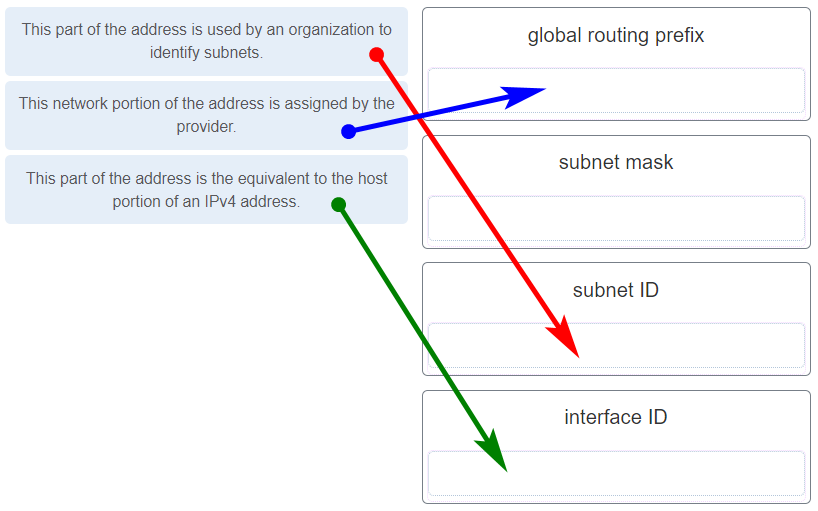

**Explanation:**
Topic 12.3.6 Place the options in the following order: This network portion of the address is assigned by the provider. global routing This part of the address is used by an organization to identify subnets. subnet ID This part of the address is the equivalent to the host portion of an IPv4 address. interface ID

---

## Question 13

**Question:**
Refer to the exhibit. If Host1 were to transfer a file to the server, what layers of the TCP/IP model would be used?

**Images:**

**Choices:**
- **A.** only application and Internet layers
- **B.** only Internet and network access layers
- **C.** only application, Internet, and network access layers
- **D.** application, transport, Internet, and network access layers
- **E.** only application, transport, network, data link, and physical layers
- **F.** application, session, transport, network, data link, and physical layers

**Correct Answer:**
application, transport, Internet, and network access layers

**Explanation:**
Topic 3.5.3 The TCP/IP model contains the application, transport, internet, and network access layers. A file transfer uses the FTP application layer protocol. The data would move from the application layer through all of the layers of the model and across the network to the file server.

---

## Question 14

**Question:**
Match the characteristic to the forwarding method. (Not all options are used.) Cut-through Store-and-forward low latency always stores the entire frame may forward runt frames checks the CRC before forwarding begins forwarding when the destination address is received checks the frame length before forwarding

**Images:**
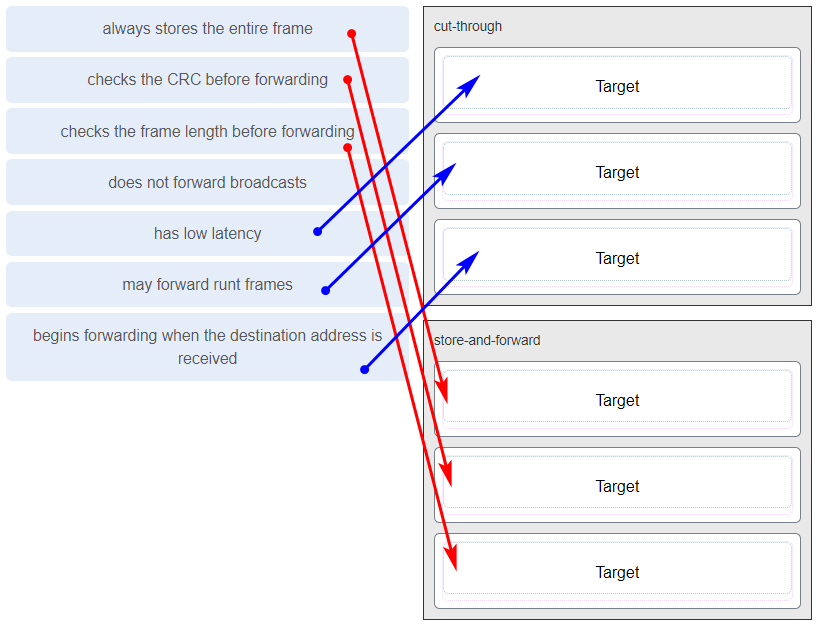

**Explanation:**
Topic 7.4.1 A store-and-forward switch always stores the entire frame before forwarding, and checks its CRC and frame length. A cut-through switch can forward frames before receiving the destination address field, thus presenting less latency than a store-and-forward switch. Because the frame can begin to be forwarded before it is completely received, the switch may transmit a corrupt or runt frame. All forwarding methods require a Layer 2 switch to forward broadcast frames.

---

## Question 15

**Question:**
Refer to the exhibit. The IP address of which device interface should be used as the default gateway setting of host H1?

**Images:**
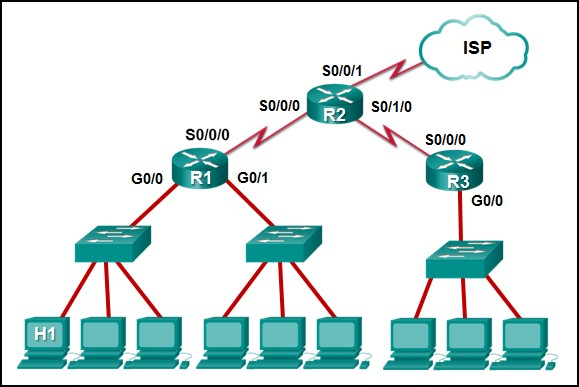

**Choices:**
- **A.** R1: S0/0/0
- **B.** R2: S0/0/1
- **C.** R1: G0/0
- **D.** R2: S0/0/0

**Correct Answer:**
R1: G0/0

**Explanation:**
Topic 10.3.1 The default gateway for host H1 is the router interface that is attached to the LAN that H1 is a member of. In this case, that is the G0/0 interface of R1. H1 should be configured with the IP address of that interface in its addressing settings. R1 will provide routing services to packets from H1 that need to be forwarded to remote networks.

---

## Question 16

**Question:**
What service is provided by Internet Messenger?

**Choices:**
- **A.** An application that allows real-time chatting among remote users.
- **B.** Allows remote access to network devices and servers.
- **C.** Resolves domain names, such as cisco.com, into IP addresses.
- **D.** Uses encryption to provide secure remote access to network devices and servers.

**Correct Answer:**
An application that allows real-time chatting among remote users.

**Explanation:**
Topic 1.2.1 Internet Messenger, widely recognized as instant messaging, is a service that facilitates real-time communication between remote users across a network infrastructure. According to the documentation on host roles, it functions as client software that allows individuals to interact synchronously, enabling the immediate exchange of text and ideas within online communities or organizational settings. Unlike asynchronous services such as email, which follow a store-and-forward model, Internet Messenger supports simultaneous messaging where users can both initiate and receive data in a continuous stream to achieve their communication objectives. This application is essential for modern collaboration, often operating through peer-to-peer or hybrid networking models to ensure that users stay connected across geographic and cultural boundaries.

---

## Question 17

**Question:**
Refer to the exhibit. Match the network with the correct IP address and prefix that will satisfy the usable host addressing requirements for each network.

**Images:**

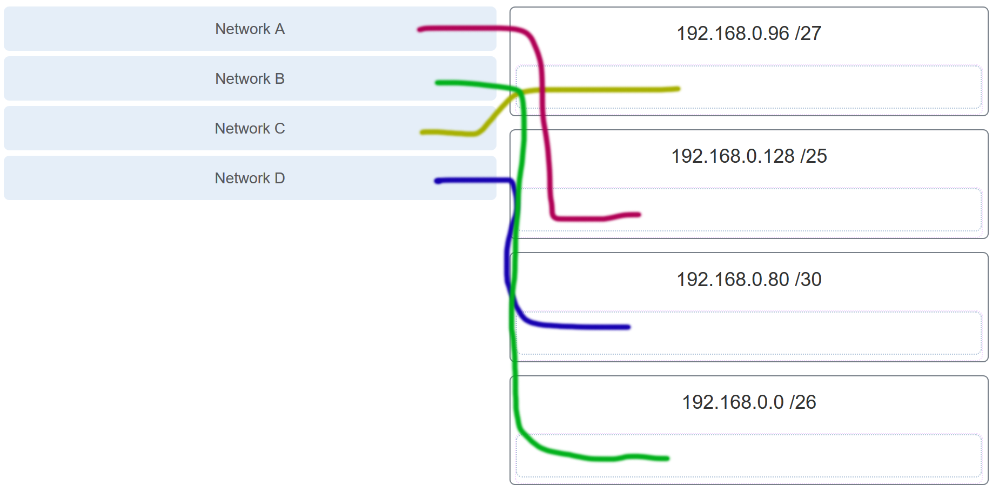

**Explanation:**
Topic 11.7.2 Network A needs to use 192.168.0.128 /25, which yields 128 host addresses. Network B needs to use 192.168.0.0 /26, which yields 64 host addresses. Network C needs to use 192.168.0.96 /27, which yields 32 host addresses. Network D needs to use 192.168.0.80/30, which yields 4 host addresses.

---

## Question 18

**Question:**
Refer to the exhibit. Which protocol was responsible for building the table that is shown?

**Images:**
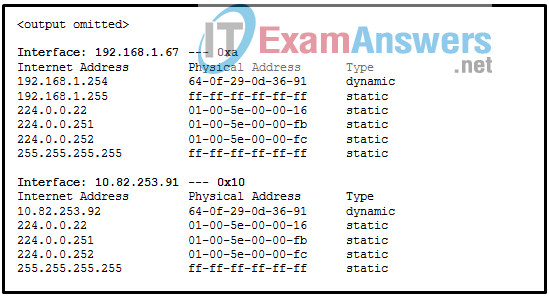

**Choices:**
- **A.** DHCP
- **B.** ARP
- **C.** DNS
- **D.** ICMP

**Correct Answer:**
ARP

**Explanation:**
Topic 9.2.7 The table that is shown corresponds to the output of the arp -a command, a command that is used on a Windows PC to display the ARP table.

---

## Question 19

**Question:**
A network administrator notices that some newly installed Ethernet cabling is carrying corrupt and distorted data signals. The new cabling was installed in the ceiling close to fluorescent lights and electrical equipment. Which two factors may interfere with the copper cabling and result in signal distortion and data corruption? (Choose two.)

**Choices:**
- **A.** crosstalk
- **B.** extended length of cabling
- **C.** RFI ​
- **D.** EMI
- **E.** signal attenuation

**Correct Answer:**
RFI ​; EMI

**Explanation:**
Topic 4.3.1 Copper cabling transmits data using electrical pulses, which are highly susceptible to distortion from external electromagnetic signals. According to the sources, electromagnetic interference (EMI) and radio frequency interference (RFI) are two primary factors that can corrupt data signals when cabling is positioned near electronic noise sources such as fluorescent lights, electric motors, or other heavy electrical equipment. While signal attenuation is related to the deterioration of a signal over an extended length of cabling and crosstalk involves interference between adjacent wires within the same cable, EMI and RFI represent external environmental disruptions that can change bit values during transmission. To mitigate these specific effects, network administrators must often use shielded cabling or ensure a physical distance between the data cables and potential sources of interference.

---

## Question 20

**Question:**
A host is trying to send a packet to a device on a remote LAN segment, but there are currently no mappings in its ARP cache. How will the device obtain a destination MAC address? (A host is trying to send a packet to a device on a remote LAN segment, but there are currently no mappings in the ARP cache. How will the device obtain a destination MAC address?)

**Choices:**
- **A.** It will send the frame and use its own MAC address as the destination.
- **B.** It will send an ARP request for the MAC address of the destination device.
- **C.** It will send the frame with a broadcast MAC address.
- **D.** It will send a request to the DNS server for the destination MAC address.
- **E.** It will send an ARP request for the MAC address of the default gateway.

**Correct Answer:**
It will send an ARP request for the MAC address of the default gateway.

**Explanation:**
Topic 9.2.5 When a source host identifies that a destination IP address resides on a remote network segment , it must forward the packet to its default gateway (the local router) to reach that destination. Because Layer 2 Ethernet frames are designed for local delivery within the same segment, the host requires the physical MAC address of the gateway’s interface to encapsulate the IP packet. If the ARP cache does not contain a mapping for the gateway’s IP address, the host initiates an ARP request specifically for the default gateway’s MAC address . The host does not request the MAC address of the final destination device, as that device is not on the local segment and cannot respond to local Layer 2 broadcast requests. Once the gateway’s MAC address is resolved and stored in the cache, the host can successfully transmit the frame to the router for further delivery across the internetwork.

---

## Question 21

**Question:**
A client packet is received by a server. The packet has a destination port number of 53. What service is the client requesting?

**Choices:**
- **A.** DNS
- **B.** NetBIOS (NetBT)
- **C.** POP3
- **D.** IMAP

**Correct Answer:**
DNS

**Explanation:**
Topic 14.4.3 The transport layer utilizes destination port numbers to identify the specific application or service being requested on a destination server. According to the standard assignments defined by the Internet Assigned Numbers Authority (IANA), port 53 is categorized as a well-known port reserved specifically for the Domain Name System (DNS) . When a server receives a packet with this destination port, it recognizes that the client is requesting a name resolution service, typically to translate a human-readable domain name into its corresponding numeric IP address. While other services such as POP3 or IMAP utilize their own designated well-known ports (110 and 143 respectively) to facilitate email retrieval, port 53 remains the global standard for DNS queries and responses using both UDP and TCP transport protocols.

---

## Question 22

**Question:**
A network administrator is adding a new LAN to a branch office. The new LAN must support 25 connected devices. What is the smallest network mask that the network administrator can use for the new network?

**Choices:**
- **A.** 255.255.255.128
- **B.** 255.255.255.192
- **C.** 255.255.255.224
- **D.** 255.255.255.240

**Correct Answer:**
255.255.255.224

**Explanation:**
Topic 11.7.2 To support a LAN with 25 connected devices, a network administrator must select a subnet mask that provides a sufficient number of usable host addresses while minimizing the waste of address space. The number of usable hosts is determined by the formula 2 n −2, where n represents the number of host bits remaining in the mask. A subnet mask of 255.255.255.224 (which corresponds to a /27 prefix) leaves 5 bits for the host portion, allowing for 30 usable host addresses (25−2=30). This is the most efficient (smallest) block among the choices provided because the next available mask, 255.255.255.240 (/28), only provides 14 usable addresses (24−2=14), which would not accommodate the 25 required devices. By utilizing the /27 mask, the administrator ensures that the requirements of the branch office are met while adhering to the principle of maximizing available subnets by minimizing unused IP addresses.

---

## Question 23

**Question:**
What characteristic describes a Trojan horse?

**Choices:**
- **A.** malicious software or code running on an end device
- **B.** an attack that slows or crashes a device or network service
- **C.** the use of stolen credentials to access private data
- **D.** a network device that filters access and traffic coming into a network

**Correct Answer:**
malicious software or code running on an end device

**Explanation:**
Topic 16.2.1 A Trojan horse is a specialized form of malware characterized by malicious software or code running on an end device that intentionally disguises itself as a legitimate program to deceive users. Unlike viruses which attach to existing host programs or worms which are standalone and self-propagating, Trojan horses rely on user interaction—such as opening an email attachment or executing a download—to be loaded and activated on a system. Once executed, the software can perform a variety of illegitimate actions, including the destruction of data, the theft of sensitive information, or the creation of unauthorized back doors that provide threat actors with persistent access to the compromised host. Because they present a harmful payload within a seemingly benign package, Trojan horses are considered a primary external security threat that exploits human trust rather than relying solely on technical system vulnerabilities.

---

## Question 24

**Question:**
What service is provided by HTTPS?

**Choices:**
- **A.** Uses encryption to provide secure remote access to network devices and servers.
- **B.** Resolves domain names, such as cisco.com, into IP addresses.
- **C.** Uses encryption to secure the exchange of text, graphic images, sound, and video on the web.
- **D.** Allows remote access to network devices and servers.

**Correct Answer:**
Uses encryption to secure the exchange of text, graphic images, sound, and video on the web.

**Explanation:**
Topic 15.3.2 Hypertext Transfer Protocol Secure (HTTPS) is the encrypted version of HTTP, designed to provide authentication and secure data transmission across the World Wide Web. While standard HTTP transmits data in plaintext that can be intercepted and read, HTTPS utilizes Secure Socket Layer (SSL) or Transport Layer Security (TLS) to encrypt the data stream as it travels between the client browser and the web server. This encryption specifically protects various types of web content—including text, graphic images, and multimedia files—ensuring that the information remains confidential and has not been altered during transit. Consequently, many organizations implement HTTPS as a security policy to authenticate websites and protect user interactions against data interception and theft.

---

## Question 25

**Question:**
A technician with a PC is using multiple applications while connected to the Internet. How is the PC able to keep track of the data flow between multiple application sessions and have each application receive the correct packet flows?

**Choices:**
- **A.** The data flow is being tracked based on the destination MAC address of the technician PC.
- **B.** The data flow is being tracked based on the source port number that is used by each application.
- **C.** The data flow is being tracked based on the source IP address that is used by the PC of the technician.
- **D.** The data flow is being tracked based on the destination IP address that is used by the PC of the technician.

**Correct Answer:**
The data flow is being tracked based on the source port number that is used by each application.

**Explanation:**
Topic 14.4.1 The source port number of an application is randomly generated and used to individually keep track of each session connecting out to the Internet. Each application will use a unique source port number to provide simultaneous communication from multiple applications through the Internet.

---

## Question 26

**Question:**
A network administrator is adding a new LAN to a branch office. The new LAN must support 61 connected devices. What is the smallest network mask that the network administrator can use for the new network?

**Choices:**
- **A.** 255.255.255.240
- **B.** 255.255.255.224
- **C.** 255.255.255.192
- **D.** 255.255.255.128

**Correct Answer:**
255.255.255.192

**Explanation:**
Topic 11.7.2 To support a LAN with 61 connected devices, the network administrator must select a subnet mask that provides a sufficient number of usable host addresses while minimizing wasted address space. The number of usable hosts is calculated using the formula 2 n −2, where n represents the number of host bits remaining in the mask. A subnet mask of 255.255.255.192 (which corresponds to a /26 prefix) leaves 6 bits for the host portion, providing 62 usable host addresses . This is the most efficient (smallest) mask among the choices because the next tighter mask, 255.255.255.224 (/27), only provides 30 usable addresses, which is insufficient for the 61 required devices. While the 255.255.255.128 (/25) mask would also accommodate the devices, it provides 126 usable addresses and would therefore result in a significant number of unused IP addresses compared to the /26 option.

---

## Question 27

**Question:**
Refer to the exhibit. Match the network with the correct IP address and prefix that will satisfy the usable host addressing requirements for each network. (Not all options are used.) ITN (Version 7.00) – ITNv7 Final Exam

**Images:**
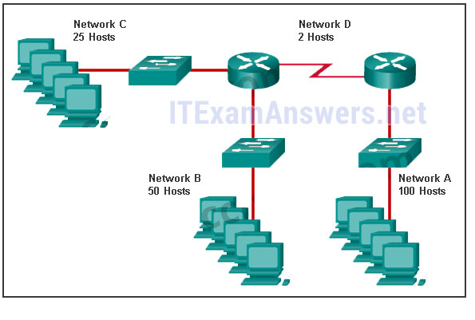
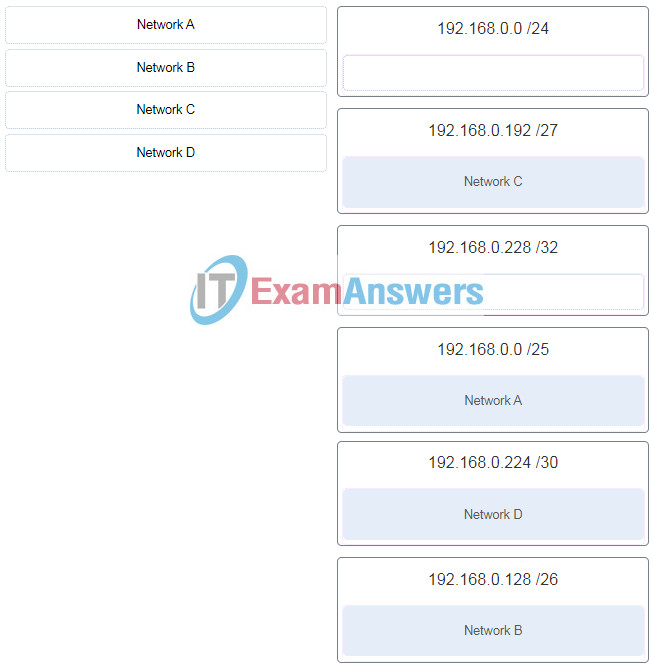

**Explanation:**
Topic 11.7.2 Network A needs to use 192.168.0.0 /25 which yields 128 host addresses. Network B needs to use 192.168.0.128 /26 which yields 64 host addresses. Network C needs to use 192.168.0.192 /27 which yields 32 host addresses. Network D needs to use 192.168.0.224 /30 which yields 4 host addresses.

---

## Question 28

**Question:**
What characteristic describes a DoS attack?

**Choices:**
- **A.** the use of stolen credentials to access private data
- **B.** a network device that filters access and traffic coming into a network
- **C.** software that is installed on a user device and collects information about the user
- **D.** an attack that slows or crashes a device or network service

**Correct Answer:**
an attack that slows or crashes a device or network service

**Explanation:**
Topic 16.2.4 A Denial of Service (DoS) attack is a malicious attempt to prevent legitimate users from accessing network services or resources by intentionally consuming system capacity. According to the sources, the primary characteristic of this attack type is that it is designed to slow or crash the applications and processes running on a network device. While other security threats such as identity theft or spyware focus on stealing data or monitoring user activity, DoS attacks prioritize the disruption of service availability, often leading to significant operational downtime and financial loss for an organization.

---

## Question 29

**Question:**
Match the application protocols to the correct transport protocols.

**Images:**
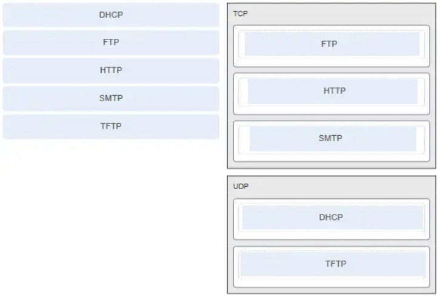

**Explanation:**
Topic 14.4.3

---

## Question 30

**Question:**
What service is provided by SMTP?

**Choices:**
- **A.** Allows clients to send email to a mail server and the servers to send email to other servers.
- **B.** Allows remote access to network devices and servers.
- **C.** Uses encryption to provide secure remote access to network devices and servers.
- **D.** An application that allows real-time chatting among remote users.

**Correct Answer:**
Allows clients to send email to a mail server and the servers to send email to other servers.

**Explanation:**
Topic 15.3.4 The Simple Mail Transfer Protocol (SMTP) is a foundational application layer protocol designed to facilitate the reliable transmission of electronic mail across a network. According to the sources, its primary function is to enable email clients to send messages to a local mail server and to allow those mail servers to further relay messages to other servers across the internet. Unlike retrieval protocols such as POP3 or IMAP, which are used by clients to download or manage mail stored on a server, SMTP specifically handles the outgoing delivery process and requires a properly formatted message header containing recipient and sender addresses. This service operates using a store-and-forward method where messages are spooled and periodically retried if the destination server is temporarily busy or offline, ensuring that communication remains persistent even when immediate end-to-end connectivity is not available.

---

## Question 31

**Question:**
Which scenario describes a function provided by the transport layer?

**Choices:**
- **A.** A student is using a classroom VoIP phone to call home. The unique identifier burned into the phone is a transport layer address used to contact another network device on the same network.
- **B.** A student is playing a short web-based movie with sound. The movie and sound are encoded within the transport layer header.
- **C.** A student has two web browser windows open in order to access two web sites. The transport layer ensures the correct web page is delivered to the correct browser window.
- **D.** A corporate worker is accessing a web server located on a corporate network. The transport layer formats the screen so the web page appears properly no matter what device is being used to view the web site.

**Correct Answer:**
A student has two web browser windows open in order to access two web sites. The transport layer ensures the correct web page is delivered to the correct browser window.

**Explanation:**
Topic 14.1.2 The source and destination port numbers are used to identify the correct application and window within that application.

---

## Question 32

**Question:**
Refer to the exhibit. Host B on subnet Teachers transmits a packet to host D on subnet Students. Which Layer 2 and Layer 3 addresses are contained in the PDUs that are transmitted from host B to the router? Layer 2 destination address = 00-00-0c-94-36-ab Layer 2 source address = 00-00-0c-94-36-bb Layer 3 destination address = 172.16.20.200 Layer 3 source address = 172.16.10.200 Layer 2 destination address = 00-00-0c-94-36-dd Layer 2 source address = 00-00-0c-94-36-bb Layer 3 destination address = 172.16.20.200 Layer 3 source address = 172.16.10.200 Layer 2 destination address = 00-00-0c-94-36-cd Layer 2 source address = 00-00-0c-94-36-bb Layer 3 destination address = 172.16.20.99 Layer 3 source address = 172.16.10.200 Layer 2 destination address = 00-00-0c-94-36-ab Layer 2 source address = 00-00-0c-94-36-bb Layer 3 destination address = 172.16.20.200 Layer 3 source address = 172.16.100.200

**Images:**
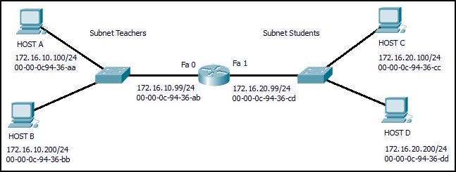

**Explanation:**
Topic 9.1.2 The source and destination port numbers are used to identify the correct application and window within that application.

---

## Question 33

**Question:**
What does the term “attenuation” mean in data communication?

**Choices:**
- **A.** strengthening of a signal by a networking device
- **B.** leakage of signals from one cable pair to another
- **C.** time for a signal to reach its destination
- **D.** loss of signal strength as distance increases

**Correct Answer:**
loss of signal strength as distance increases

**Explanation:**
Topic 4.3.1 Data is transmitted on copper cables as electrical pulses. A detector in the network interface of a destination device must receive a signal that can be successfully decoded to match the signal sent. However, the farther the signal travels, the more it deteriorates. This is referred to as signal attenuation.

---

## Question 34

**Question:**
Refer to the exhibit. An administrator is trying to configure the switch but receives the error message that is displayed in the exhibit. What is the problem?

**Images:**

**Choices:**
- **A.** The entire command, configure terminal, must be used.
- **B.** The administrator is already in global configuration mode.
- **C.** The administrator must first enter privileged EXEC mode before issuing the command.
- **D.** The administrator must connect via the console port to access global configuration mode.

**Correct Answer:**
The administrator must first enter privileged EXEC mode before issuing the command.

**Explanation:**
Topic 2.2.4 In order to enter global configuration mode, the command configure terminal, or a shortened version such as config t, must be entered from privileged EXEC mode. In this scenario the administrator is in user EXEC mode, as indicated by the > symbol after the hostname. The administrator would need to use the enable command to move into privileged EXEC mode before entering the configure terminal command.

---

## Question 35

**Question:**
Which two protocols operate at the top layer of the TCP/IP protocol suite? (Choose two.)

**Choices:**
- **A.** TCP
- **B.** IP
- **C.** UDP
- **D.** POP
- **E.** DNS
- **F.** Ethernet

**Correct Answer:**
POP; DNS

**Explanation:**
Topic 3.3.4 The top layer of the TCP/IP protocol suite is the application layer , which provides the primary interface for network-aware software to interact with the underlying network infrastructure. Within this model, both DNS (Domain Name System) and POP (Post Office Protocol) function at this highest level to facilitate specific user-facing services, such as translating human-readable domain names into numeric IP addresses and enabling the retrieval of email from mail servers. While other protocols like TCP and UDP operate at the transport layer to manage end-to-end communication, and IP operates at the internet layer to handle routing, DNS and POP are responsible for defining the content and formatting of requests and responses for their respective applications. Therefore, they belong to the application layer, ensuring that data is presented in a format that both the source and destination hosts can process effectively.

---

## Question 36

**Question:**
A company has a file server that shares a folder named Public. The network security policy specifies that the Public folder is assigned Read-Only rights to anyone who can log into the server while the Edit rights are assigned only to the network admin group. Which component is addressed in the AAA network service framework?

**Choices:**
- **A.** automation
- **B.** accounting
- **C.** authentication
- **D.** authorization

**Correct Answer:**
authorization

**Explanation:**
Topic 16.3.4 After a user is successfully authenticated (logged into the server), the authorization is the process of determining what network resources the user can access and what operations (such as read or edit) the user can perform.

---

## Question 37

**Question:**
What three requirements are defined by the protocols used in network communcations to allow message transmission across a network? (Choose three.)

**Choices:**
- **A.** message size
- **B.** message encoding
- **C.** connector specifications
- **D.** media selection
- **E.** delivery options
- **F.** end-device installation

**Correct Answer:**
message size; message encoding; delivery options

**Explanation:**
Topic 3.1.5 Network communication protocols establish specific rules and standards to ensure that data is successfully transmitted and understood by both the sender and the receiver. According to the sources, these protocols define several critical requirements for message transmission, including message encoding , which converts information into an acceptable format for the medium, and message size , which ensures data is broken into manageable pieces that receiving devices can process. Furthermore, protocols specify delivery options —such as unicast, multicast, or broadcast—to determine whether a message is intended for a single individual or a broader group of recipients. By standardizing these elements along with message timing and formatting, protocols facilitate effective communication between diverse devices across the network infrastructure.

---

## Question 38

**Question:**
What are two characteristics of IP? (Choose two.)

**Choices:**
- **A.** does not require a dedicated end-to-end connection
- **B.** operates independently of the network media
- **C.** retransmits packets if errors occur
- **D.** re-assembles out of order packets into the correct order at the receiver end
- **E.** guarantees delivery of packets

**Correct Answer:**
does not require a dedicated end-to-end connection; operates independently of the network media

**Explanation:**
Topic 8.1.3 The Internet Protocol (IP) is a connectionless, best effort protocol. This means that IP requires no end-to-end connection nor does it guarantee delivery of packets. IP is also media independent, which means it operates independently of the network media carrying the packets.

---

## Question 39

**Question:**
An employee of a large corporation remotely logs into the company using the appropriate username and password. The employee is attending an important video conference with a customer concerning a large sale. It is important for the video quality to be excellent during the meeting. The employee is unaware that after a successful login, the connection to the company ISP failed. The secondary connection, however, activated within seconds. The disruption was not noticed by the employee or other employees. What three network characteristics are described in this scenario? (Choose three.)

**Choices:**
- **A.** security
- **B.** quality of service
- **C.** scalability
- **D.** powerline networking
- **E.** integrity
- **F.** fault tolerance

**Correct Answer:**
security; quality of service; fault tolerance

**Explanation:**
Topic 1.6.1 Usernames and passwords relate to network security. Good quality video, to support video conferencing, relates to prioritizing the video traffic with quality of service (QoS). The fact that a connection to an ISP failed and was then restored but went unnoticed by employees relates to the fault tolerant design of the network.

---

## Question 40

**Question:**
What are two common causes of signal degradation when using UTP cabling? (Choose two.)

**Choices:**
- **A.** improper termination
- **B.** low-quality shielding in cable
- **C.** installing cables in conduit
- **D.** low-quality cable or connectors
- **E.** loss of light over long distances

**Correct Answer:**
improper termination; low-quality cable or connectors

**Explanation:**
Topic 4.4.2 When terminated improperly, each cable is a potential source of physical layer performance degradation.

---

## Question 41

**Question:**
Which subnet would include the address 192.168.1.96 as a usable host address?

**Choices:**
- **A.** 192.168.1.64/26
- **B.** 192.168.1.32/27
- **C.** 192.168.1.32/28
- **D.** 192.168.1.64/29

**Correct Answer:**
192.168.1.64/26

**Explanation:**
Topic 11.5.2 For the subnet of 192.168.1.64/26, there are 6 bits for host addresses, yielding 64 possible addresses. However, the first and last subnets are the network and broadcast addresses for this subnet. Therefore, the range of host addresses for this subnet is 192.168.1.65 to 192.168.1.126. The other subnets do not contain the address 192.168.1.96 as a valid host address.

---

## Question 42

**Question:**
Refer to the exhibit. On the basis of the output, which two statements about network connectivity are correct? (Choose two.)

**Images:**
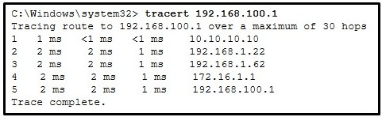

**Choices:**
- **A.** This host does not have a default gateway configured.
- **B.** There are 4 hops between this device and the device at 192.168.100.1.
- **C.** There is connectivity between this device and the device at 192.168.100.1.
- **D.** The connectivity between these two hosts allows for videoconferencing calls.
- **E.** The average transmission time between the two hosts is 2 milliseconds.

**Correct Answer:**
There are 4 hops between this device and the device at 192.168.100.1.; There is connectivity between this device and the device at 192.168.100.1.

**Explanation:**
Topic 17.4.3 The output displays a successful Layer 3 connection between a host computer and a host at 19.168.100.1. It can be determined that 4 hops exist between them and the average transmission time is 1 milliseconds. Layer 3 connectivity does not necessarily mean that an application can run between the hosts.

---

## Question 43

**Question:**
Which two statements describe how to assess traffic flow patterns and network traffic types using a protocol analyzer? (Choose two.)

**Choices:**
- **A.** Capture traffic on the weekends when most employees are off work.
- **B.** Capture traffic during peak utilization times to get a good representation of the different traffic types.
- **C.** Only capture traffic in the areas of the network that receive most of the traffic such as the data center.
- **D.** Perform the capture on different network segments.
- **E.** Only capture WAN traffic because traffic to the web is responsible for the largest amount of traffic on a network.

**Correct Answer:**
Capture traffic during peak utilization times to get a good representation of the different traffic types.; Perform the capture on different network segments.

**Explanation:**
Topic 17.3.2 Traffic flow patterns should be gathered during peak utilization times to get a good representation of the different traffic types. The capture should also be performed on different network segments because some traffic will be local to a particular segment.

---

## Question 44

**Question:**
What is the consequence of configuring a router with the ipv6 unicast-routing global configuration command?​

**Choices:**
- **A.** All router interfaces will be automatically activated.
- **B.** The IPv6 enabled router interfaces begin sending ICMPv6 Router Advertisement messages.
- **C.** Each router interface will generate an IPv6 link-local address.​
- **D.** It statically creates a global unicast address on this router.​

**Correct Answer:**
The IPv6 enabled router interfaces begin sending ICMPv6 Router Advertisement messages.

**Explanation:**
Topic 12.5.1 The ipv6 unicast-routing global configuration command is a critical step in IPv6 implementation because Cisco routers do not function as IPv6 routers by default. Once this command is issued, the router joins the all-routers multicast group and its IPv6-enabled interfaces begin transmitting ICMPv6 Router Advertisement (RA) messages periodically or in response to host solicitations. These RA messages are essential for dynamic address allocation, as they provide neighboring hosts with vital information such as the network prefix, prefix length, and the default gateway address. While link-local addresses are generated automatically when IPv6 is enabled on an interface, the global unicast routing command is specifically what triggers the router to begin its active role in directing IPv6 traffic and facilitating stateless address autoconfiguration (SLAAC).

---

## Question 45

**Question:**
Which three layers of the OSI model map to the application layer of the TCP/IP model? (Choose three.)

**Choices:**
- **A.** application
- **B.** network
- **C.** data link
- **D.** session
- **E.** presentation
- **F.** transport

**Correct Answer:**
application; session; presentation

**Explanation:**
Topic 15.1.1 The TCP/IP model consists of four layers: application, transport, internet, and network access. The OSI model consists of seven layers: application, presentation, session, transport, network, data link, and physical. The top three layers of the OSI model: application, presentation, and session map to the application layer of the TCP/IP model.

---

## Question 46

**Question:**
Refer to the exhibit. If PC1 is sending a packet to PC2 and routing has been configured between the two routers, what will R1 do with the Ethernet frame header attached by PC1?

**Images:**
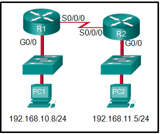

**Choices:**
- **A.** nothing, because the router has a route to the destination network
- **B.** open the header and use it to determine whether the data is to be sent out S0/0/0
- **C.** open the header and replace the destination MAC address with a new one
- **D.** remove the Ethernet header and configure a new Layer 2 header before sending it out S0/0/0

**Correct Answer:**
remove the Ethernet header and configure a new Layer 2 header before sending it out S0/0/0

**Explanation:**
Topic 6.1.3 When PC1 forms the various headers attached to the data one of those headers is the Layer 2 header. Because PC1 connects to an Ethernet network, an Ethernet header is used. The source MAC address will be the MAC address of PC1 and the destination MAC address will be that of G0/0 on R1. When R1 gets that information, the router removes the Layer 2 header and creates a new one for the type of network the data will be placed onto (the serial link).

---

## Question 47

**Question:**
What will happen if the default gateway address is incorrectly configured on a host?

**Choices:**
- **A.** The host cannot communicate with other hosts in the local network.
- **B.** The host cannot communicate with hosts in other networks.
- **C.** A ping from the host to 127.0.0.1 would not be successful.
- **D.** The host will have to use ARP to determine the correct address of the default gateway.
- **E.** The switch will not forward packets initiated by the host.

**Correct Answer:**
The host cannot communicate with hosts in other networks.

**Explanation:**
Topic 10.3.1 When a host needs to send a message to another host located on the same network, it can forward the message directly. However, when a host needs to send a message to a remote network, it must use the router, also known as the default gateway. This is because the data link frame address of the remote destination host cannot be used directly. Instead, the IP packet has to be sent to the router (default gateway) and the router will forward the packet toward its destination. Therefore, if the default gateway is incorrectly configured, the host can communicate with other hosts on the same network, but not with hosts on remote networks.

---

## Question 48

**Question:**
What are two features of ARP? (Choose two.)

**Choices:**
- **A.** When a host is encapsulating a packet into a frame, it refers to the MAC address table to determine the mapping of IP addresses to MAC addresses.
- **B.** An ARP request is sent to all devices on the Ethernet LAN and contains the IP address of the destination host and its multicast MAC address.
- **C.** If a host is ready to send a packet to a local destination device and it has the IP address but not the MAC address of the destination, it generates an ARP broadcast.
- **D.** If no device responds to the ARP request, then the originating node will broadcast the data packet to all devices on the network segment.
- **E.** If a device receiving an ARP request has the destination IPv4 address, it responds with an ARP reply.

**Correct Answer:**
If a host is ready to send a packet to a local destination device and it has the IP address but not the MAC address of the destination, it generates an ARP broadcast.; If a device receiving an ARP request has the destination IPv4 address, it responds with an ARP reply.

**Explanation:**
Topic 9.2.2 When a node encapsulates a data packet into a frame, it needs the destination MAC address. First it determines if the destination device is on the local network or on a remote network. Then it checks the ARP table (not the MAC table) to see if a pair of IP address and MAC address exists for either the destination IP address (if the destination host is on the local network) or the default gateway IP address (if the destination host is on a remote network). If the match does not exist, it generates an ARP broadcast to seek the IP address to MAC address resolution. Because the destination MAC address is unknown, the ARP request is broadcast with the MAC address FFFF.FFFF.FFFF. Either the destination device or the default gateway will respond with its MAC address, which enables the sending node to assemble the frame. If no device responds to the ARP request, then the originating node will discard the packet because a frame cannot be created.

---

## Question 49

**Question:**
A network administrator is adding a new LAN to a branch office. The new LAN must support 90 connected devices. What is the smallest network mask that the network administrator can use for the new network?

**Choices:**
- **A.** 255.255.255.128
- **B.** 255.255.255.240
- **C.** 255.255.255.248
- **D.** 255.255.255.224

**Correct Answer:**
255.255.255.128

**Explanation:**
Topic 11.7.2 To support a LAN with 90 connected devices, the network administrator must select a subnet mask that provides a sufficient number of usable host addresses while minimizing wasted address space. The number of usable hosts is calculated using the formula 2 n −2, where n represents the number of host bits remaining in the mask. A subnet mask of 255.255.255.128 (which corresponds to a /25 prefix) leaves 7 bits for the host portion, providing 126 usable host addresses . This is the most efficient (smallest) mask among the provided choices because the next tighter mask, 255.255.255.224 (/27), only provides 30 usable addresses, which is insufficient for the 90 required devices. By utilizing the /25 mask, the administrator ensures that the branch office requirements are met while adhering to the principle of maximizing available subnets by minimizing unused IP addresses.

---

## Question 50

**Question:**
What are two ICMPv6 messages that are not present in ICMP for IPv4? (Choose two.)

**Choices:**
- **A.** Neighbor Solicitation
- **B.** Destination Unreachable
- **C.** Host Confirmation
- **D.** Time Exceeded
- **E.** Router Advertisement
- **F.** Route Redirection

**Correct Answer:**
Neighbor Solicitation; Router Advertisement

**Explanation:**
Topic 13.1.5 While ICMPv6 maintains several error and informational messages common to ICMPv4—such as Destination Unreachable and Time Exceeded—it introduces enhanced functionality through the Neighbor Discovery Protocol (NDP). According to the sources, specific messages including Neighbor Solicitation and Router Advertisement are unique to ICMPv6 and are utilized to facilitate critical network processes like address resolution, duplicate address detection, and dynamic address allocation. These new messaging types allow IPv6-enabled devices to discover local routers and resolve MAC addresses for known IPv6 addresses more efficiently than the broadcast-based resolution methods used in IPv4 environments.

---

## Question 51

**Question:**
A client packet is received by a server. The packet has a destination port number of 80. What service is the client requesting?

**Choices:**
- **A.** DHCP
- **B.** SMTP
- **C.** DNS
- **D.** HTTP

**Correct Answer:**
HTTP

**Explanation:**
Topic 14.4.3 The transport layer uses port numbers to identify specific applications and services. According to the well-known port assignments, port 80 is reserved for Hypertext Transfer Protocol (HTTP) web services. When a server receives a packet with port 80 as the destination, it identifies the request as a client seeking to access web content, such as HTML pages. This standardized numbering allows the server to simultaneously handle multiple services, distinguishing web traffic from other requests like DNS (port 53) or SMTP (port 25).

---

## Question 52

**Question:**
What is an advantage for small organizations of adopting IMAP instead of POP?

**Choices:**
- **A.** POP only allows the client to store messages in a centralized way, while IMAP allows distributed storage.
- **B.** Messages are kept in the mail servers until they are manually deleted from the email client.
- **C.** When the user connects to a POP server, copies of the messages are kept in the mail server for a short time, but IMAP keeps them for a long time.
- **D.** IMAP sends and retrieves email, but POP only retrieves email.

**Correct Answer:**
Messages are kept in the mail servers until they are manually deleted from the email client.

**Explanation:**
Topic 15.3.4 IMAP and POP are protocols that are used to retrieve email messages. The advantage of using IMAP instead of POP is that when the user connects to an IMAP-capable server, copies of the messages are downloaded to the client application. IMAP then stores the email messages on the server until the user manually deletes those messages.

---

## Question 53

**Question:**
A technician can ping the IP address of the web server of a remote company but cannot successfully ping the URL address of the same web server. Which software utility can the technician use to diagnose the problem?

**Choices:**
- **A.** tracert
- **B.** ipconfig
- **C.** netstat
- **D.** nslookup

**Correct Answer:**
nslookup

**Explanation:**
Topic 15.4.4 Traceroute (tracert) is a utility that generates a list of hops that were successfully reached along the path from source to destination.This list can provide important verification and troubleshooting information. The ipconfig utility is used to display the IP configuration settings on a Windows PC. The Netstat utility is used to identify which active TCP connections are open and running on a networked host. Nslookup is a utility that allows the user to manually query the name servers to resolve a given host name. This utility can also be used to troubleshoot name resolution issues and to verify the current status of the name servers.

---

## Question 54

**Question:**
Which two functions are performed at the LLC sublayer of the OSI Data Link Layer to facilitate Ethernet communication? (Choose two.)

**Choices:**
- **A.** implements CSMA/CD over legacy shared half-duplex media
- **B.** enables IPv4 and IPv6 to utilize the same physical medium
- **C.** integrates Layer 2 flows between 10 Gigabit Ethernet over fiber and 1 Gigabit Ethernet over copper
- **D.** implements a process to delimit fields within an Ethernet 2 frame
- **E.** places information in the Ethernet frame that identifies which network layer protocol is being encapsulated by the frame
- **F.** responsible for internal structure of Ethernet frame
- **G.** applies source and destination MAC addresses to Ethernet frame
- **H.** handles communication between upper layer networking software and Ethernet NIC hardware
- **I.** adds Ethernet control information to network protocol data
- **J.** implements trailer with frame check sequence for error detection
- **K.** responsible for the internal structure of Ethernet frame

**Correct Answer:**
enables IPv4 and IPv6 to utilize the same physical medium; places information in the Ethernet frame that identifies which network layer protocol is being encapsulated by the frame; handles communication between upper layer networking software and Ethernet NIC hardware; adds Ethernet control information to network protocol data

**Explanation:**
Other case: Other case: Other case: Other case: Topic 6.1.2 The data link layer is actually divided into two sublayers: + Logical Link Control (LLC): This upper sublayer defines the software processes that provide services to the network layer protocols. It places information in the frame that identifies which network layer protocol is being used for the frame. This information allows multiple Layer 3 protocols, such as IPv4 and IPv6, to utilize the same network interface and media. + Media Access Control (MAC): This lower sublayer defines the media access processes performed by the hardware. It provides data link layer addressing and delimiting of data according to the physical signaling requirements of the medium and the type of data link layer protocol in use.

---

## Question 55

**Question:**
The global configuration command ip default-gateway 172.16.100.1 is applied to a switch. What is the effect of this command?

**Choices:**
- **A.** The switch can communicate with other hosts on the 172.16.100.0 network.
- **B.** The switch can be remotely managed from a host on another network.
- **C.** The switch is limited to sending and receiving frames to and from the gateway 172.16.100.1.
- **D.** The switch will have a management interface with the address 172.16.100.1.

**Correct Answer:**
The switch can be remotely managed from a host on another network.

**Explanation:**
Topic 10.3.2 A default gateway address is typically configured on all devices to allow them to communicate beyond just their local network.In a switch this is achieved using the command ip default-gateway <ip address>.

---

## Question 56

**Question:**
What happens when the transport input ssh command is entered on the switch vty lines?

**Choices:**
- **A.** The SSH client on the switch is enabled.
- **B.** The switch requires a username/password combination for remote access.
- **C.** Communication between the switch and remote users is encrypted.
- **D.** The switch requires remote connections via a proprietary client software.

**Correct Answer:**
Communication between the switch and remote users is encrypted.

**Explanation:**
Topic 16.4.4 The transport input ssh command when entered on the switch vty (virtual terminal lines) will encrypt all inbound controlled telnet connections.

---

## Question 57

**Question:**
Match the type of threat with the cause. (Not all options are used.) electrical threats voltage spikes, insufficient supply voltage (brownouts), unconditioned power (noise), and total power loss hardware threats physical damage to servers, routers, switches, cabling plant, and workstations environmental threats temperature extremes (too hot or too cold) or humidity extremes (too wet or too dry) maintenance threats poor handling of key electrical components (electrostatic discharge), lack of critical spare parts, poor cabling, and poor labeling

**Images:**
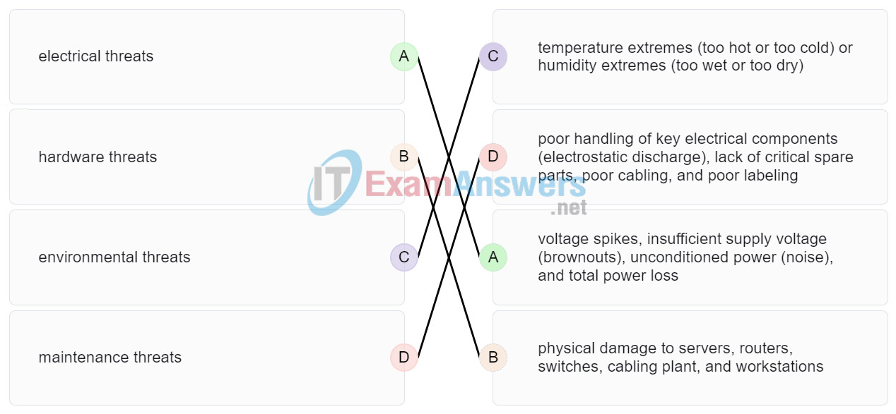

**Explanation:**
Topic 16.1.3

---

## Question 58

**Question:**
A disgruntled employee is using some free wireless networking tools to determine information about the enterprise wireless networks. This person is planning on using this information to hack the wireless network. What type of attack is this?

**Choices:**
- **A.** DoS
- **B.** access
- **C.** reconnaissance
- **D.** Trojan horse

**Correct Answer:**
reconnaissance

**Explanation:**
Topic 16.2.2 A reconnaissance attack is the unauthorized discovery and documentation of various computing networks, network systems, resources, applications, services, or vulnerabilities.

---

## Question 59

**Question:**
What service is provided by HTTP?

**Choices:**
- **A.** Uses encryption to secure the exchange of text, graphic images, sound, and video on the web.
- **B.** Allows for data transfers between a client and a file server.
- **C.** An application that allows real-time chatting among remote users.
- **D.** A basic set of rules for exchanging text, graphic images, sound, video, and other multimedia files on the web.

**Correct Answer:**
A basic set of rules for exchanging text, graphic images, sound, video, and other multimedia files on the web.

**Explanation:**
Topic 15.3.1 The Hypertext Transfer Protocol (HTTP) is an application layer protocol that defines a specific set of rules for how web browsers (clients) and web servers interact to exchange information across the World Wide Web. It governs the content and formatting of requests and responses, allowing for the successful delivery of various multimedia files, including text, graphic images, sound, and video. Unlike HTTPS, which adds a layer of encryption for security, standard HTTP transmits data in plaintext and relies on the request/response model—such as using GET messages to retrieve HTML pages—to facilitate web communication.

---

## Question 60

**Question:**
A client packet is received by a server. The packet has a destination port number of 67. What service is the client requesting?

**Choices:**
- **A.** FTP
- **B.** DHCP
- **C.** Telnet
- **D.** SSH

**Correct Answer:**
DHCP

**Explanation:**
Topic 14.4.3 The transport layer uses port numbers to identify specific applications and services. According to the IANA assignments for well-known ports, port 67 is reserved for the Dynamic Host Configuration Protocol (DHCP) server using the UDP protocol. When a server receives a packet with this destination port, it identifies the request as a client seeking to automatically acquire an IP configuration, including an IP address, subnet mask, and default gateway. While port 68 is used by the DHCP client to receive responses, port 67 is the standard destination for requests sent toward the server.

---

## Question 61

**Question:**
What are two problems that can be caused by a large number of ARP request and reply messages? (Choose two.)

**Choices:**
- **A.** Switches become overloaded because they concentrate all the traffic from the attached subnets.
- **B.** The ARP request is sent as a broadcast, and will flood the entire subnet.
- **C.** The network may become overloaded because ARP reply messages have a very large payload due to the 48-bit MAC address and 32-bit IP address that they contain.
- **D.** A large number of ARP request and reply messages may slow down the switching process, leading the switch to make many changes in its MAC table.
- **E.** All ARP request messages must be processed by all nodes on the local network.

**Correct Answer:**
The ARP request is sent as a broadcast, and will flood the entire subnet.; All ARP request messages must be processed by all nodes on the local network.

**Explanation:**
Topic 9.2.8 ARP requests are sent as broadcasts: (1) All nodes will receive them, and they will be processed by software, interrupting the CPU. (2) The switch forwards (floods) Layer 2 broadcasts to all ports. A switch does not change its MAC table based on ARP request or reply messages. The switch populates the MAC table using the source MAC address of all frames. The ARP payload is very small and does not overload the switch.

---

## Question 62

**Question:**
A group of Windows PCs in a new subnet has been added to an Ethernet network. When testing the connectivity, a technician finds that these PCs can access local network resources but not the Internet resources. To troubleshoot the problem, the technician wants to initially confirm the IP address and DNS configurations on the PCs, and also verify connectivity to the local router. Which three Windows CLI commands and utilities will provide the necessary information? (Choose three.)

**Choices:**
- **A.** netsh interface ipv6 show neighbor
- **B.** arp -a
- **C.** tracert
- **D.** ping
- **E.** ipconfig
- **F.** nslookup
- **G.** telnet

**Correct Answer:**
ping; ipconfig; nslookup

**Explanation:**
Topic 17.5.1 The ipconfig and nslookup commands will provide initial IP address and DNS configuration information to the technicians and determine if DHCP is assigning correct information to the PCs. The ping utility would be used to verify, or not, connectivity to the default gateway (router) using the configured default gateway address, or using the known correct default gateway address if these are found to be different. The arp -a or netsh interface ipv6 show neighbor commands could be used if the problem is then suspected to be an IP address to MAC address mapping issue. The telnet and tracert utilities could be used to determine where the problem was located in the network if the default gateway configuration was found to be correct.

---

## Question 63

**Question:**
During the process of forwarding traffic, what will the router do immediately after matching the destination IP address to a network on a directly connected routing table entry?

**Choices:**
- **A.** analyze the destination IP address
- **B.** switch the packet to the directly connected interface
- **C.** look up the next-hop address for the packet
- **D.** discard the traffic after consulting the route table

**Correct Answer:**
switch the packet to the directly connected interface

**Explanation:**
Topic 8.5.1 A router receives a packet on an interface and looks at the destination IP address. It consults its routing table and matches the destination IP address to a routing table entry. The router then discovers that it has to send the packet to the next-hop address or out to a directly connected interface. When the destination address is on a directly connected interface, the packet is switched over to that interface.

---

## Question 64

**Question:**
What characteristic describes antispyware?

**Choices:**
- **A.** applications that protect end devices from becoming infected with malicious software
- **B.** a network device that filters access and traffic coming into a network
- **C.** software on a router that filters traffic based on IP addresses or applications
- **D.** a tunneling protocol that provides remote users with secure access into the network of an organization

**Correct Answer:**
applications that protect end devices from becoming infected with malicious software

**Explanation:**
Topic 1.8.2 Antispyware refers to specialized applications designed to protect end devices —such as PCs, laptops, and smartphones—from being compromised by malicious software . While other security tools like firewalls or VPNs focus on filtering network traffic or creating secure tunnels, antispyware operates at the host level to detect and prevent software that secretly collects information about the user. It is considered a fundamental security component for both home and corporate networks, often implemented alongside antivirus software as part of a layered defense strategy to maintain device integrity.

---

## Question 65

**Question:**
A network administrator needs to keep the user ID, password, and session contents private when establishing remote CLI connectivity with a switch to manage it. Which access method should be chosen?

**Choices:**
- **A.** Telnet
- **B.** AUX
- **C.** SSH
- **D.** Console

**Correct Answer:**
SSH

**Explanation:**
Topic 2.1.4 SSH (Secure Shell) is the recommended method for establishing a remote CLI connection because it utilizes encryption to ensure that user IDs, passwords, and all session contents remain private and unreadable if intercepted. In contrast, Telnet is considered insecure because it transmits all data, including login credentials, in plaintext . While the Console and AUX ports provide administrative access, they are primarily intended for out-of-band management rather than secure remote connectivity over a standard IP network.

---

## Question 66

**Question:**
What are the two most effective ways to defend against malware? (Choose two.)

**Choices:**
- **A.** Implement a VPN.
- **B.** Implement network firewalls.
- **C.** Implement RAID.
- **D.** Implement strong passwords.
- **E.** Update the operating system and other application software.
- **F.** Install and update antivirus software.

**Correct Answer:**
Update the operating system and other application software.; Install and update antivirus software.

**Explanation:**
Topic 16.3.3 A cybersecurity specialist must be aware of the technologies and measures that are used as countermeasures to protect the organization from threats and vulnerabilities.

---

## Question 67

**Question:**
Which type of security threat would be responsible if a spreadsheet add-on disables the local software firewall?

**Choices:**
- **A.** brute-force attack
- **B.** Trojan horse
- **C.** DoS
- **D.** buffer overflow

**Correct Answer:**
Trojan horse

**Explanation:**
Topic 16.2.1 A Trojan horse is software that does something harmful, but is hidden in legitimate software code. A denial of service (DoS) attack results in interruption of network services to users, network devices, or applications. A brute-force attack commonly involves trying to access a network device. A buffer overflow occurs when a program attempts to store more data in a memory location than it can hold.

---

## Question 68

**Question:**
Which frame field is created by a source node and used by a destination node to ensure that a transmitted data signal has not been altered by interference, distortion, or signal loss?

**Choices:**
- **A.** User Datagram Protocol field
- **B.** transport layer error check field
- **C.** flow control field
- **D.** frame check sequence field
- **E.** error correction process field

**Correct Answer:**
frame check sequence field

**Explanation:**
Topic 6.3.2 The frame check sequence (FCS) field is a critical part of the data link layer frame trailer used for error detection . During the encapsulation process, a source node performs a mathematical calculation known as a cyclic redundancy check (CRC) on the frame’s contents and places the resulting value into the FCS field. The destination node performs the same calculation upon receiving the frame; if the results do not match the value in the FCS field, it indicates that the data has been altered during transmission. This alteration is often caused by external physical factors such as interference, distortion, or signal loss occurring on the network media. By identifying these discrepancies, the data link layer can reject and discard corrupt frames to ensure that only valid data is passed up to the higher layers of the protocol stack.

---

## Question 69

**Question:**
A network administrator is adding a new LAN to a branch office. The new LAN must support 4 connected devices. What is the smallest network mask that the network administrator can use for the new network?

**Choices:**
- **A.** 255.255.255.248
- **B.** 255.255.255.0
- **C.** 255.255.255.128
- **D.** 255.255.255.192

**Correct Answer:**
255.255.255.248

**Explanation:**
Topic 11.7.2 To support a LAN with 4 connected devices, the network administrator must select a subnet mask that provides a sufficient number of usable host addresses while minimizing wasted address space. The number of usable hosts is calculated using the formula 2 n −2, where n represents the number of host bits remaining in the mask. A subnet mask of 255.255.255.248 (which corresponds to a /29 prefix ) leaves 3 bits for the host portion, providing 6 usable host addresses . This is the most efficient (smallest) mask among the choices because it satisfies the requirement for 4 devices while leaving fewer unused addresses compared to 255.255.255.192 (/26), 255.255.255.128 (/25), or 255.255.255.0 (/24), which provide 62, 126, and 254 usable addresses respectively.

---

## Question 70

**Question:**
What service is provided by POP3?

**Choices:**
- **A.** Retrieves email from the server by downloading the email to the local mail application of the client.
- **B.** An application that allows real-time chatting among remote users.
- **C.** Allows remote access to network devices and servers.
- **D.** Uses encryption to provide secure remote access to network devices and servers.

**Correct Answer:**
Retrieves email from the server by downloading the email to the local mail application of the client.

**Explanation:**
Topic 15.3.4 The Post Office Protocol version 3 (POP3) is an application layer protocol designed to enable email clients to retrieve messages from a mail server. According to the sources, the default operation of POP3 is to download the email to the client’s local application and then delete it from the server . This service operates over TCP port 110 and is specifically intended for message retrieval, distinguishing it from SMTP, which is used for sending mail, and IMAP, which typically maintains messages on the server.

---

## Question 71

**Question:**
What two security solutions are most likely to be used only in a corporate environment? (Choose two.)

**Choices:**
- **A.** antispyware
- **B.** virtual private networks
- **C.** intrusion prevention systems
- **D.** strong passwords
- **E.** antivirus software

**Correct Answer:**
virtual private networks; intrusion prevention systems

**Explanation:**
Topic 1.8.2 While basic security measures like antivirus, antispyware, and firewall filtering are implemented in both home and corporate environments, corporate networks have advanced requirements due to their complexity. According to the sources, intrusion prevention systems (IPS) are specifically used in these larger environments to identify and stop fast-spreading threats like zero-day attacks. Similarly, virtual private networks (VPN) are corporate-level solutions that provide remote workers with secure, encrypted access into the organization’s private network. These components are part of a layered defense-in-depth approach used to protect vital business assets.

---

## Question 72

**Question:**
What characteristic describes antivirus software?

**Choices:**
- **A.** applications that protect end devices from becoming infected with malicious software
- **B.** a network device that filters access and traffic coming into a network
- **C.** a tunneling protocol that provides remote users with secure access into the network of an organization
- **D.** software on a router that filters traffic based on IP addresses or applications

**Correct Answer:**
applications that protect end devices from becoming infected with malicious software

**Explanation:**
Topic 1.8.2 Antivirus and antispyware are applications used to protect end devices (such as PCs, laptops, and smartphones) from being compromised or infected with malicious software . These tools are considered basic security components for both home and small office networks and are often required by corporate security policies to maintain endpoint integrity. While other security measures like firewalls or VPNs focus on network-level protection, antivirus software operates directly on the host to mitigate threats from viruses, worms, and other malware.

---

## Question 73

**Question:**
What mechanism is used by a router to prevent a received IPv4 packet from traveling endlessly on a network?

**Choices:**
- **A.** It checks the value of the TTL field and if it is 0, it discards the packet and sends a Destination Unreachable message to the source host.
- **B.** It checks the value of the TTL field and if it is 100, it discards the packet and sends a Destination Unreachable message to the source host.
- **C.** It decrements the value of the TTL field by 1 and if the result is 0, it discards the packet and sends a Time Exceeded message to the source host.
- **D.** It increments the value of the TTL field by 1 and if the result is 100, it discards the packet and sends a Parameter Problem message to the source host.

**Correct Answer:**
It decrements the value of the TTL field by 1 and if the result is 0, it discards the packet and sends a Time Exceeded message to the source host.

**Explanation:**
Topic 8.2.2 To prevent an IPv4 packet to travel in the network endlessly, TCP/IP protocols use ICMPv4 protocol to provide feedback about issues. When a router receives a packet and decrements the TTL field in the IPv4 packet by 1 and if the result is zero, it discards the packet and sends a Time Exceeded message to the source host.

---

## Question 74

**Question:**
A client packet is received by a server. The packet has a destination port number of 69. What service is the client requesting?

**Choices:**
- **A.** DNS
- **B.** DHCP
- **C.** SMTP
- **D.** TFTP

**Correct Answer:**
TFTP

**Explanation:**
Topic 14.4.3 The transport layer uses port numbers to identify and direct data to specific applications or services on a host. According to the standard assignments for well-known ports, port 69 is reserved for the Trivial File Transfer Protocol (TFTP) . TFTP is a simple, connectionless protocol that utilizes UDP for best-effort, unacknowledged file delivery, requiring less overhead than FTP. When a server receives a packet with destination port 69, it identifies the request as a client seeking to use this specific file transfer service.

---

## Question 75

**Question:**
An administrator defined a local user account with a secret password on router R1 for use with SSH. Which three additional steps are required to configure R1 to accept only encrypted SSH connections? (Choose three.)

**Choices:**
- **A.** Configure DNS on the router.
- **B.** Generate two-way pre-shared keys.
- **C.** Configure the IP domain name on the router.
- **D.** Generate the SSH keys.
- **E.** Enable inbound vty SSH sessions.
- **F.** Enable inbound vty Telnet sessions.

**Correct Answer:**
Configure the IP domain name on the router.; Generate the SSH keys.; Enable inbound vty SSH sessions.

**Explanation:**
Topic 16.4.4 To successfully transition a router from insecure Telnet to encrypted SSH, specific configuration steps must be followed according to the sources. Since the local user account is already created, the next requirement is to configure the IP domain name , which is essential for the key generation process. The administrator must then generate the SSH keys (typically RSA keys) using the crypto key generate rsa command to provide the foundation for session encryption. Finally, the VTY lines must be updated to enable inbound SSH sessions via the transport input ssh command. This last step is crucial because it ensures the router only accepts encrypted connections and rejects insecure plaintext protocols like Telnet.

---

## Question 76

**Question:**
Which two functions are performed at the MAC sublayer of the OSI Data Link Layer to facilitate Ethernet communication? (Choose two.)

**Choices:**
- **A.** handles communication between upper layer networking software and Ethernet NIC hardware
- **B.** implements trailer with frame check sequence for error detection
- **C.** places information in the Ethernet frame that identifies which network layer protocol is being encapsulated by the frame
- **D.** implements a process to delimit fields within an Ethernet 2 frame
- **E.** adds Ethernet control information to network protocol data
- **F.** responsible for internal structure of Ethernet frame
- **G.** enables IPv4 and IPv6 to utilize the same physical medium
- **H.** integrates Layer 2 flows between 10 Gigabit Ethernet over fiber and 1 Gigabit Ethernet over copper
- **I.** implements CSMA/CD over legacy shared half-duplex media
- **J.** applies delimiting of Ethernet frame fields to synchronize communication between nodes
- **K.** applies source and destination MAC addresses to Ethernet frame

**Correct Answer:**
implements trailer with frame check sequence for error detection; implements a process to delimit fields within an Ethernet 2 frame; responsible for internal structure of Ethernet frame; integrates Layer 2 flows between 10 Gigabit Ethernet over fiber and 1 Gigabit Ethernet over copper; implements CSMA/CD over legacy shared half-duplex media; applies delimiting of Ethernet frame fields to synchronize communication between nodes; applies source and destination MAC addresses to Ethernet frame

**Explanation:**
Topic 6.1.2 The OSI data link layer is divided into two sublayers: LLC and MAC . The MAC (Media Access Control) sublayer is responsible for data encapsulation and media access control. Its data encapsulation functions include frame delimiting , which uses bits to identify and synchronize fields within a frame, and error detection , which involves adding a trailer with a frame check sequence (FCS) to identify transmission errors. Other functions, such as identifying the network layer protocol or handling communication between upper-layer software and hardware, are performed by the LLC sublayer. Case 2: Topic 7.1.3 The MAC (Media Access Control) sublayer is responsible for hardware-based data encapsulation and media access. Its specific encapsulation functions include defining the internal structure of the Ethernet frame and providing error detection by implementing a trailer that contains the Frame Check Sequence (FCS) . Other tasks, such as identifying the encapsulated network layer protocol or enabling IPv4 and IPv6 to share the same physical medium, are functions performed by the LLC (Logical Link Control) sublayer . Case 3: Case 4: Case 5: Topic 6.1.2

---

## Question 77

**Question:**
An IPv6 enabled device sends a data packet with the destination address of FF02::2. What is the target of this packet?​

**Choices:**
- **A.** all IPv6 enabled devices on the local link​
- **B.** all IPv6 DHCP servers​
- **C.** all IPv6 enabled devices across the network​
- **D.** all IPv6 configured routers on the local link​

**Correct Answer:**
all IPv6 configured routers on the local link​

**Explanation:**
Topic 12.7.2 FF02::2 identifies all IPv6 routers that exist on the link or network. FF02::1 is the target for all IPv6 enabled devices on the link or network.​

---

## Question 78

**Question:**
What are the three parts of an IPv6 global unicast address? (Choose three.)

**Choices:**
- **A.** subnet ID
- **B.** subnet mask
- **C.** broadcast address
- **D.** global routing prefix
- **E.** interface ID

**Correct Answer:**
subnet ID; global routing prefix; interface ID

**Explanation:**
Topic 12.3.5 The general format for IPv6 global unicast addresses includes a global routing prefix, a subnet ID, and an interface ID. The global routing prefix is the network portion of the address. A typical global routing prefix is /48 assigned by the Internet provider. The subnet ID portion can be used by an organization to create multiple subnetwork numbers. The interface ID is similar to the host portion of an IPv4 address.

---

## Question 79

**Question:**
A network administrator is designing the layout of a new wireless network. Which three areas of concern should be accounted for when building a wireless network? (Choose three.)

**Choices:**
- **A.** extensive cabling
- **B.** mobility options
- **C.** packet collision
- **D.** interference
- **E.** security
- **F.** coverage area

**Correct Answer:**
interference; security; coverage area

**Explanation:**
Topic 4.6.1 The three areas of concern for wireless networks focus on the size of the coverage area, any nearby interference, and providing network security. Extensive cabling is not a concern for wireless networks, as a wireless network will require minimal cabling for providing wireless access to hosts. Mobility options are not a component of the areas of concern for wireless networks.

---

## Question 80

**Question:**
A new network administrator has been asked to enter a banner message on a Cisco device. What is the fastest way a network administrator could test whether the banner is properly configured?

**Choices:**
- **A.** Enter CTRL-Z at the privileged mode prompt.
- **B.** Exit global configuration mode.
- **C.** Power cycle the device.
- **D.** Reboot the device.
- **E.** Exit privileged EXEC mode and press Enter .

**Correct Answer:**
Exit privileged EXEC mode and press Enter .

**Explanation:**
Topic 2.4.5 While at the privileged mode prompt such as Router#, type exit,press Enter, and the banner message appears. Power cycling a network device that has had the banner motd command issued will also display the banner message, but this is not a quick way to test the configuration.

---

## Question 81

**Question:**
What method is used to manage contention-based access on a wireless network?

**Choices:**
- **A.** token passing
- **B.** CSMA/CA
- **C.** priority ordering
- **D.** CSMA/CD

**Correct Answer:**
CSMA/CA

**Explanation:**
Topic 6.2.8 Carrier sense multiple access with collision avoidance (CSMA/CA) is used with wireless networking technology to mediate media contention. Carrier sense multiple access with collision detection (CSMA/CD) is used with wired Ethernet technology to mediate media contention. Priority ordering and token passing are not used (or not a method) for media access control.

---

## Question 82

**Question:**
What is a function of the data link layer?

**Choices:**
- **A.** provides the formatting of data
- **B.** provides end-to-end delivery of data between hosts
- **C.** provides delivery of data between two applications
- **D.** provides for the exchange of frames over a common local media

**Correct Answer:**
provides for the exchange of frames over a common local media

**Explanation:**
Topic 6.1.1 The data link layer (Layer 2) is specifically responsible for the exchange of frames between network interface cards (NICs) over a common local media . It performs this by accepting Layer 3 packets (such as IPv4 or IPv6) and encapsulating them into Layer 2 frames, which include the necessary control information for the local segment. While higher layers focus on end-to-end delivery between remote hosts or formatting data for applications, the data link layer manages how data is placed on and received from the physical medium, ensuring communication between nodes on the same network .

---

## Question 83

**Question:**
What is the purpose of the TCP sliding window?

**Choices:**
- **A.** to ensure that segments arrive in order at the destination
- **B.** to end communication when data transmission is complete
- **C.** to inform a source to retransmit data from a specific point forward
- **D.** to request that a source decrease the rate at which it transmits data

**Correct Answer:**
to request that a source decrease the rate at which it transmits data

**Explanation:**
Topic 14.6.5 The TCP sliding window allows a destination device to inform a source to slow down the rate of transmission. To do this, the destination device reduces the value contained in the window field of the segment. It is acknowledgment numbers that are used to specify retransmission from a specific point forward. It is sequence numbers that are used to ensure segments arrive in order. Finally, it is a FIN control bit that is used to end a communication session.

---

## Question 84

**Question:**
What characteristic describes spyware?

**Choices:**
- **A.** a network device that filters access and traffic coming into a network
- **B.** software that is installed on a user device and collects information about the user
- **C.** an attack that slows or crashes a device or network service
- **D.** the use of stolen credentials to access private data

**Correct Answer:**
software that is installed on a user device and collects information about the user

**Explanation:**
Topic 1.8.1 Spyware is a specific type of malicious software (malware) that is installed on an end device —such as a computer or smartphone—often without the user’s knowledge. Its primary characteristic is that it secretly collects information about the user, which can include browsing habits, personal data, or sensitive credentials. Unlike other attacks that might aim to crash a system or delete data, spyware focuses on stealthily monitoring activity for the purpose of information theft. It is categorized as a common external security threat that requires host-level protection, such as antispyware applications, to mitigate.

---

## Question 85

**Question:**
Which switching method drops frames that fail the FCS check?

**Choices:**
- **A.** store-and-forward switching
- **B.** borderless switching
- **C.** ingress port buffering
- **D.** cut-through switching

**Correct Answer:**
store-and-forward switching

**Explanation:**
Topic 7.4.1 The FCS check is used with store-and-forward switching to drop any frame with a FCS that does not match the FCS calculation that is made by a switch. Cut-through switching does not perform any error checking. Borderless switching is a network architecture, not a switching method. Ingress port buffering is used with store-and-forward switching to support different Ethernet speeds, but it is not a switching method

---

## Question 86

**Question:**
Which range of link-local addresses can be assigned to an IPv6-enabled interface?

**Choices:**
- **A.** FEC0::/10
- **B.** FDEE::/7
- **C.** FE80::/10
- **D.** FF00::/8

**Correct Answer:**
FE80::/10

**Explanation:**
Topic 12.3.7 Link-local addresses are in the range of FE80::/10 to FEBF::/10. The original IPv6 specification defined site-local addresses and used the prefix range FEC0::/10, but these addresses were deprecated by the IETF in favor of unique local addresses. FDEE::/7 is a unique local address because it is in the range of FC00::/7 to FDFF::/7. IPv6 multicast addresses have the prefix FF00::/8.

---

## Question 87

**Question:**
What service is provided by FTP?

**Choices:**
- **A.** A basic set of rules for exchanging text, graphic images, sound, video, and other multimedia files on the web.
- **B.** An application that allows real-time chatting among remote users.
- **C.** Allows for data transfers between a client and a file server.
- **D.** Uses encryption to secure the exchange of text, graphic images, sound, and video on the web.

**Correct Answer:**
Allows for data transfers between a client and a file server.

**Explanation:**
Topic 15.5.1 The File Transfer Protocol (FTP) is an application layer protocol specifically designed to allow for data transfers between a client and a server. It sets the rules that enable a user on one host to access, upload (push) , and download (pull) files to and from another host over a network. FTP is a reliable and connection-oriented protocol that utilizes TCP services, establishing a control connection on port 21 and a separate data connection on port 20 for the actual transfer.

---

## Question 88

**Question:**
A user is attempting to access http://www.cisco.com/ without success. Which two configuration values must be set on the host to allow this access? (Choose two.)

**Choices:**
- **A.** DNS server
- **B.** source port number
- **C.** HTTP server
- **D.** source MAC address
- **E.** default gateway

**Correct Answer:**
DNS server; default gateway

**Explanation:**
Topic 11.1.2 To access a website like http://www.cisco.com/, two critical configuration values are required beyond a basic IP address and subnet mask. First, a DNS server address is necessary to resolve the human-readable domain name into a numeric IP address that the network layer can use for routing. Second, because the website resides on a remote network (the internet), a default gateway must be configured to allow the host to forward packets outside of its local network segment. Without these, the host can neither find the server’s IP address nor reach any destination beyond its own local LAN.

---

## Question 89

**Question:**
Which two statements accurately describe an advantage or a disadvantage when deploying NAT for IPv4 in a network? (Choose two.)

**Choices:**
- **A.** NAT adds authentication capability to IPv4.
- **B.** NAT introduces problems for some applications that require end-to-end connectivity.
- **C.** NAT will impact negatively on switch performance.
- **D.** NAT provides a solution to slow down the IPv4 address depletion.
- **E.** NAT improves packet handling.
- **F.** NAT causes routing tables to include more information.

**Correct Answer:**
NAT introduces problems for some applications that require end-to-end connectivity.; NAT provides a solution to slow down the IPv4 address depletion.

**Explanation:**
Topic 12.1.1 Network Address Translation (NAT) is a technology that is implemented within IPv4 networks. One application of NAT is to use private IP addresses inside a network and use NAT to share a few public IP addresses for many internal hosts. In this way it provides a solution to slow down the IPv4 address depletion. However, since NAT hides the actual IP addresses that are used by end devices, it may cause problems for some applications that require end-to-end connectivity.

---

## Question 90

**Question:**
What would be the interface ID of an IPv6 enabled interface with a MAC address of 1C-6F-65-C2-BD-F8 when the interface ID is generated by using the EUI-64 process?

**Choices:**
- **A.** 0C6F:65FF:FEC2:BDF8
- **B.** 1E6F:65FF:FEC2:BDF8
- **C.** C16F:65FF:FEC2:BDF8
- **D.** 106F:65FF:FEC2:BDF8

**Correct Answer:**
1E6F:65FF:FEC2:BDF8

**Explanation:**
Topic 12.5.6 To derive the EUI-64 interface ID by using the MAC address 1C-6F-65-C2-BD-F8, three steps are taken. Change the seventh bit of the MAC address from a binary 0 to a binary 1 which changes the hex C, into a hex E. Insert hex digits FFFE into the middle of the address. Rewrite the address in IPv6 format. The three steps, when complete, give the interface ID of 1E6F:65FF:FEC2:BDF8 .

---

## Question 91

**Question:**
Refer to the exhibit. PC1 issues an ARP request because it needs to send a packet to PC2. In this scenario, what will happen next?

**Images:**
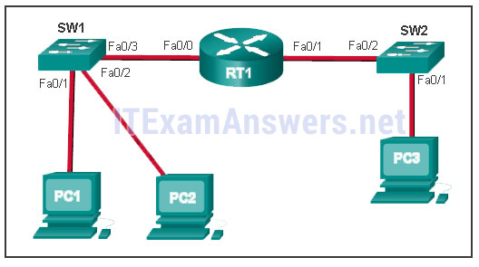

**Choices:**
- **A.** SW1 will send an ARP reply with the SW1 Fa0/1 MAC address.​
- **B.** SW1 will send an ARP reply with the PC2 MAC address.​
- **C.** PC2 will send an ARP reply with the PC2 MAC address.
- **D.** RT1 will send an ARP reply with the RT1 Fa0/0 MAC address.​
- **E.** RT1 will send an ARP reply with the PC2 MAC address.​

**Correct Answer:**
PC2 will send an ARP reply with the PC2 MAC address.

**Explanation:**
Topic 9.2.4 When a network device wants to communicate with another device on the same network, it sends a broadcast ARP request. In this case, the request will contain the IP address of PC2. The destination device (PC2) sends an ARP reply with its MAC address.

---

## Question 92

**Question:**
What service is provided by BOOTP?

**Choices:**
- **A.** Uses encryption to secure the exchange of text, graphic images, sound, and video on the web.
- **B.** Allows for data transfers between a client and a file server.
- **C.** Legacy application that enables a diskless workstation to discover its own IP address and find a BOOTP server on the network.
- **D.** A basic set of rules for exchanging text, graphic images, sound, video, and other multimedia files on the web.

**Correct Answer:**
Legacy application that enables a diskless workstation to discover its own IP address and find a BOOTP server on the network.

**Explanation:**
Topic 3.3.4 BOOTP (Bootstrap Protocol) is a precursor to DHCP that allows diskless workstations to automatically discover their own IP address , locate a BOOTP server , and identify a file to be loaded into memory for booting the machine.

---

## Question 93

**Question:**
What characteristic describes adware?

**Choices:**
- **A.** a network device that filters access and traffic coming into a network
- **B.** software that is installed on a user device and collects information about the user
- **C.** the use of stolen credentials to access private data
- **D.** an attack that slows or crashes a device or network service

**Correct Answer:**
software that is installed on a user device and collects information about the user

**Explanation:**
Topic 1.8.1 Adware and spyware are types of software installed on a user’s device that secretly collect information about the user.

---

## Question 94

**Question:**
When a switch configuration includes a user-defined error threshold on a per-port basis, to which switching method will the switch revert when the error threshold is reached?

**Choices:**
- **A.** cut-through
- **B.** store-and-forward
- **C.** fast-forward
- **D.** fragment-free

**Correct Answer:**
store-and-forward

**Explanation:**
Topic 7.4.2 When a switch is configured for cut-through switching , it can be set to monitor error rates on a per-port basis; if a user-defined error threshold is reached, the port automatically reverts to store-and-forward switching to perform error checking on all frames before forwarding. Once the error rate drops below the threshold, it changes back to cut-through switching.

---

## Question 95

**Question:**
Match a statement to the related network model. (Not all options are used.) ITN (Version 7.00) – ITNv7 Final Exam Place the options in the following order: peer-to-peer network [+] no dedicated server is required [+] client and server roles are set on a per request basis peer-to-peer aplication [#] requires a specific user interface [#] a background service is required

**Images:**
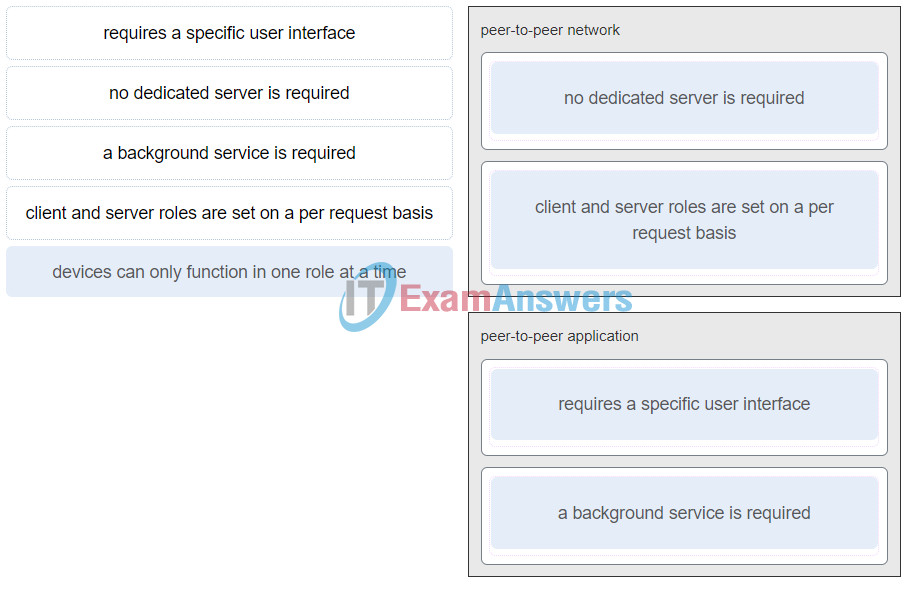

**Explanation:**
Topic 15.2.2 Peer-to-peer networks do not require the use of a dedicated server, and devices can assume both client and server roles simultaneously on a per request basis. Because they do not require formalized accounts or permissions, they are best used in limited situations. Peer-to-peer applications require a user interface and background service to be running, and can be used in more diverse situations.

---

## Question 96

**Question:**
What are two primary responsibilities of the Ethernet MAC sublayer? (Choose two.)

**Choices:**
- **A.** error detection
- **B.** frame delimiting
- **C.** accessing the media
- **D.** data encapsulation
- **E.** logical addressing

**Correct Answer:**
accessing the media; data encapsulation

**Explanation:**
Topic 7.1.3 The MAC sublayer is primarily responsible for data encapsulation and accessing the media . Data encapsulation includes framing (frame delimiting), addressing, and error detection, while accessing the media involves controlling the hardware (NIC) responsible for sending and receiving signals on the network medium.

---

## Question 97

**Question:**
Refer to the exhibit. What three facts can be determined from the viewable output of the show ip interface brief command? (Choose three.)

**Images:**
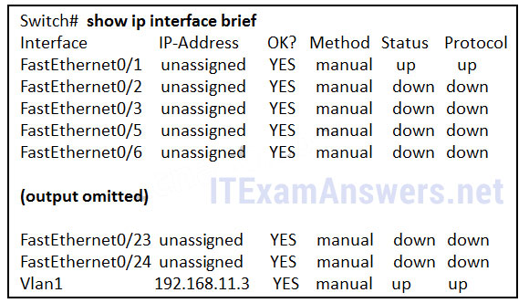

**Choices:**
- **A.** Two physical interfaces have been configured.
- **B.** The switch can be remotely managed.
- **C.** One device is attached to a physical interface.
- **D.** Passwords have been configured on the switch.
- **E.** Two devices are attached to the switch.
- **F.** The default SVI has been configured.

**Correct Answer:**
The switch can be remotely managed.; One device is attached to a physical interface.; The default SVI has been configured.

**Explanation:**
Topic 17.5.7 Vlan1 is the default SVI. Because an SVI has been configured, the switch can be configured and managed remotely. FastEthernet0/0 is showing up and up, so a device is connected.

---

## Question 98

**Question:**
Match each type of frame field to its function. (Not all options are used.) addressing This field helps to direct the frame toward its destination. error detection This field checks if the frame has been damaged during the transfer. type This field is used by the LLC to identify the Layer 3 protocol. frame start This field identifies the beginning of a frame.

**Images:**
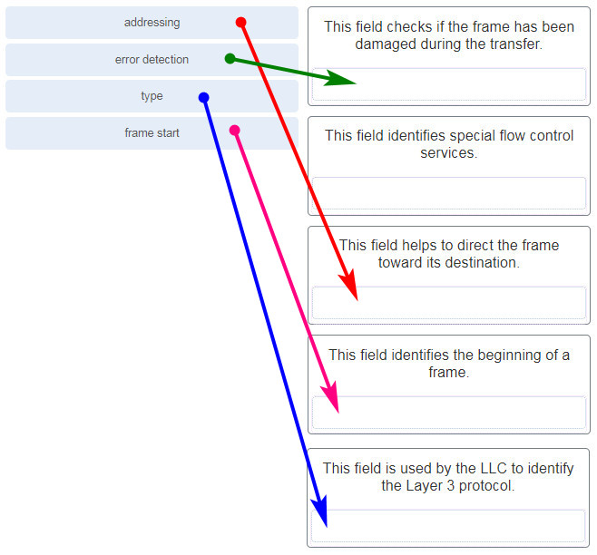

**Explanation:**
Topic 6.3.2

---

## Question 99

**Question:**
What is the subnet ID associated with the IPv6 address 2001:DA48:FC5:A4:3D1B::1/64?

**Choices:**
- **A.** 2001:DA48::/64​
- **B.** 2001:DA48:FC5::A4:/64​
- **C.** 2001:DA48:FC5:A4::/64​
- **D.** 2001::/64

**Correct Answer:**
2001:DA48:FC5:A4::/64​

**Explanation:**
Topic 12.3.6 The /64 represents the network and subnet IPv6 fields. The fourth field of hexadecimal digits is referred to as the subnet ID. The subnet ID for this address is 2001:DA48:FC5:A4::0/64.

---

## Question 100

**Question:**
Match the firewall function to the type of threat protection it provides to the network. (Not all options are used.) prevents access by port number application filtering prevents access based on IP or MAC address packet filtering prevents unsolicited incoming sessions stateful packet inspection prevents access to websites URL filtering

**Images:**
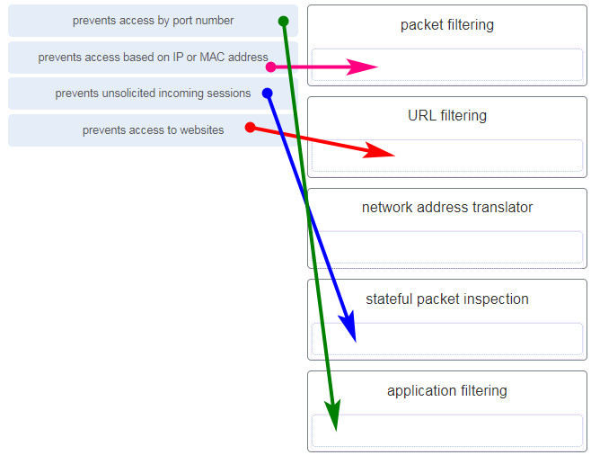

**Explanation:**
Topic 16.3.6 Firewall products come packaged in various forms. These products use different techniques for determining what will be permitted or denied access to a network. They include the following: + Packet filtering – Prevents or allows access based on IP or MAC addresses + Application filtering – Prevents or allows access by specific application types based on port numbers + URL filtering – Prevents or allows access to websites based on specific URLs or keywords + Stateful packet inspection (SPI) – Incoming packets must be legitimate responses to requests from internal hosts. Unsolicited packets are blocked unless permitted specifically. SPI can also include the capability to recognize and filter out specific types of attacks, such as denial of service (DoS)

---

## Question 101

**Question:**
Users are reporting longer delays in authentication and in accessing network resources during certain time periods of the week. What kind of information should network engineers check to find out if this situation is part of a normal network behavior?

**Choices:**
- **A.** syslog records and messages
- **B.** the network performance baseline
- **C.** debug output and packet captures
- **D.** network configuration files

**Correct Answer:**
the network performance baseline

**Explanation:**
Topic 17.4.5 The network engineers should first establish that the reported performance of the network is in fact abnormal. This is done by referring to the documented network performance baseline.Once it has been verified that the network is not having a proper performance, then specific troubleshooting processes can be applied.

---

## Question 102

**Question:**
How does the service password-encryption command enhance password security on Cisco routers and switches?

**Choices:**
- **A.** It requires encrypted passwords to be used when connecting remotely to a router or switch with Telnet.
- **B.** It encrypts passwords that are stored in router or switch configuration files.
- **C.** It requires that a user type encrypted passwords to gain console access to a router or switch.
- **D.** It encrypts passwords as they are sent across the network.

**Correct Answer:**
It encrypts passwords that are stored in router or switch configuration files.

**Explanation:**
Topic 2.4.4 The service password-encryption command encrypts plaintext passwords in the configuration file so that they cannot be viewed by unauthorized users.

---

## Question 103

**Question:**
Which two statements are correct in a comparison of IPv4 and IPv6 packet headers? (Choose two.)

**Choices:**
- **A.** The Source Address field name from IPv4 is kept in IPv6.
- **B.** The Version field from IPv4 is not kept in IPv6.
- **C.** The Destination Address field is new in IPv6.
- **D.** The Header Checksum field name from IPv4 is kept in IPv6.
- **E.** The Time-to-Live field from IPv4 has been replaced by the Hop Limit field in IPv6.

**Correct Answer:**
The Source Address field name from IPv4 is kept in IPv6.; The Time-to-Live field from IPv4 has been replaced by the Hop Limit field in IPv6.

**Explanation:**
Topic 8.3.3 The IPv6 packet header fields are as follows: Version, Traffic Class, Flow Label, Payload Length, Next Header, Hop Limit, Source Address, and Destination Address. The IPv4 packet header fields include the following: Version, Differentiated Services, Time-to-Live, Protocol, Source IP Address, and Destination IP Address. Both versions have a 4-bit Version field. Both versions have a Source (IP) Address field. IPv4 addresses are 32 bits; IPv6 addresses are 128 bits. The Time-to-Live or TTL field in IPv4 is now called Hop Limit in IPv6, but this field serves the same purpose in both versions. The value in this 8-bit field decrements each time a packet passes through any router. When this value is 0, the packet is discarded and is not forwarded to any other router.

---

## Question 104

**Question:**
A network administrator wants to have the same network mask for all networks at a particular small site. The site has the following networks and number of devices: IP phones – 22 addresses PCs – 20 addresses needed Printers – 2 addresses needed Scanners – 2 addresses needed The network administrator has deemed that 192.168.10.0/24 is to be the network used at this site. Which single subnet mask would make the most efficient use of the available addresses to use for the four subnetworks?

**Choices:**
- **A.** 255.255.255.192
- **B.** 255.255.255.252
- **C.** 255.255.255.240
- **D.** 255.255.255.248
- **E.** 255.255.255.0
- **F.** 255.255.255.224

**Correct Answer:**
255.255.255.224

**Explanation:**
Topic 11.7.2 If the same mask is to be used, then the network with the most hosts must be examined for the number of hosts, which in this case is 22 hosts. Thus, 5 host bits are needed. The /27 or 255.255.255.224 subnet mask would be appropriate to use for these networks.

---

## Question 105

**Question:**
What characteristic describes identity theft?

**Choices:**
- **A.** the use of stolen credentials to access private data
- **B.** software on a router that filters traffic based on IP addresses or applications
- **C.** software that identifies fast-spreading threats
- **D.** a tunneling protocol that provides remote users with secure access into the network of an organization

**Correct Answer:**
the use of stolen credentials to access private data

**Explanation:**
Topic 1.8.1 Identity theft is a specific type of information theft where a threat actor steals login credentials or personal information to access private data . Once accessed, this information is often used to take over a person’s identity to make unauthorized purchases or obtain legal documents.

---

## Question 106

**Question:**
A network administrator is adding a new LAN to a branch office. The new LAN must support 200 connected devices. What is the smallest network mask that the network administrator can use for the new network?

**Choices:**
- **A.** 255.255.255.240
- **B.** 255.255.255.0
- **C.** 255.255.255.248
- **D.** 255.255.255.224

**Correct Answer:**
255.255.255.0

**Explanation:**
Topic 11.7.2 To support 200 connected devices , the network administrator must choose a mask that provides at least 200 usable host addresses based on the formula 2 n −2. A mask with 7 host bits (2 7 −2=126) is insufficient, so 8 host bits are required (2 8 −2=254). A 32-bit IPv4 address with 8 host bits leaves 24 bits for the network portion (/24), which corresponds to the subnet mask 255.255.255.0 .

---

## Question 107

**Question:**
What are three commonly followed standards for constructing and installing cabling? (Choose three.)

**Choices:**
- **A.** cost per meter (foot)
- **B.** cable lengths
- **C.** connector color
- **D.** pinouts
- **E.** connector types
- **F.** tensile strength of plastic insulator

**Correct Answer:**
cable lengths; pinouts; connector types

**Explanation:**
Topic 4.4.2 According to the TIA/EIA-568 standard, which governs commercial cabling for LAN environments, several physical elements are defined to ensure consistency and performance. These include cable lengths , the specific connector types used (such as RJ-45), and the wire color-coded pin assignments, commonly referred to as pinouts .

---

## Question 108

**Question:**
Refer to the exhibit. What is wrong with the displayed termination?

**Images:**
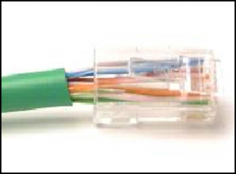

**Choices:**
- **A.** The woven copper braid should not have been removed.
- **B.** The wrong type of connector is being used.
- **C.** The untwisted length of each wire is too long.
- **D.** The wires are too thick for the connector that is used.

**Correct Answer:**
The untwisted length of each wire is too long.

**Explanation:**
Topic 4.4.2 When a cable to an RJ-45 connector is terminated, it is important to ensure that the untwisted wires are not too long and that the flexible plastic sheath surrounding the wires is crimped down and not the bare wires. None of the colored wires should be visible from the bottom of the jack.

---

## Question 109

**Question:**
Match the characteristic to the category. (Not all options are used.) IP address MAC address contained in the Layer 3 header contained in the Layer 2 header separated into a network portion and a unique identifier separated into OUI and a unique identifier 32 or 128 bits 48 bits

**Images:**
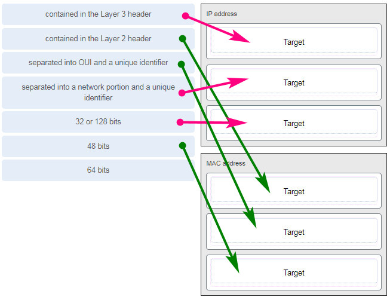

**Explanation:**
Topic 9.1.1

---

## Question 110

**Question:**
A client packet is received by a server. The packet has a destination port number of 143. What service is the client requesting?

**Choices:**
- **A.** IMAP
- **B.** FTP
- **C.** SSH
- **D.** Telnet

**Correct Answer:**
IMAP

**Explanation:**
Topic 14.4.3 Destination port 143 is the well-known port for IMAP (Internet Message Access Protocol) , which enables clients to access and maintain email stored on a mail server.

---

## Question 111

**Question:**
What are two characteristics shared by TCP and UDP? (Choose two.)

**Choices:**
- **A.** default window size
- **B.** connectionless communication
- **C.** port numbering
- **D.** 3-way handshake
- **E.** ability to to carry digitized voice
- **F.** use of checksum

**Correct Answer:**
port numbering; use of checksum

**Explanation:**
Topic 14.1.2 Both TCP and UDP use source and destination port numbers to distinguish different data streams and to forward the right data segments to the right applications. Error checking the header and data is done by both protocols by using a checksum calculation to determine the integrity of the data that is received. TCP is connection-oriented and uses a 3-way handshake to establish an initial connection. TCP also uses window to regulate the amount of traffic sent before receiving an acknowledgment. UDP is connectionless and is the best protocol for carry digitized VoIP signals.

---

## Question 112

**Question:**
Refer to the exhibit. Which two network addresses can be assigned to the network containing 10 hosts? Your answers should waste the fewest addresses, not reuse addresses that are already assigned, and stay within the 10.18.10.0/24 range of addresses. (Choose two.)

**Images:**
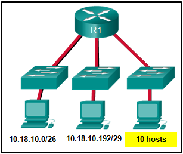

**Choices:**
- **A.** 10.18.10.200/28
- **B.** 10.18.10.208/28
- **C.** 10.18.10.240/27
- **D.** 10.18.10.200/27
- **E.** 10.18.10.224/27
- **F.** 10.18.10.224/28

**Correct Answer:**
10.18.10.208/28; 10.18.10.224/28

**Explanation:**
Topic 11.7.2 Addresses 10.18.10.0 through 10.18.10.63 are taken for the leftmost network. Addresses 192 through 199 are used by the center network. Because 4 host bits are needed to accommodate 10 hosts, a /28 mask is needed. 10.18.10.200/28 is not a valid network number. Two subnets that can be used are 10.18.10.208/28 and 10.18.10.224/28.

---

## Question 113

**Question:**
A client packet is received by a server. The packet has a destination port number of 21. What service is the client requesting?

**Choices:**
- **A.** FTP
- **B.** LDAP
- **C.** SLP
- **D.** SNMP

**Correct Answer:**
FTP

**Explanation:**
Topic 14.4.3 Destination port 21 is the well-known port used by FTP (File Transfer Protocol) for its control connection. This connection is established by the client to send commands to the server and receive replies, which is essential for managing the file transfer process.

---

## Question 114

**Question:**
What attribute of a NIC would place it at the data link layer of the OSI model?

**Choices:**
- **A.** attached Ethernet cable
- **B.** IP address
- **C.** MAC address
- **D.** RJ-45 port
- **E.** TCP/IP protocol stack

**Correct Answer:**
MAC address

**Explanation:**
Topic 7.2.2 The data link layer describes media access and physical addressing. The encoding of a MAC address on a NIC places it at that layer. Ports and cables are placed at the physical layer of the OSI model. IP addresses are placed at the network layer. The TCP/IP protocol stack describes a different model.

---

## Question 115

**Question:**
A network administrator is adding a new LAN to a branch office. The new LAN must support 10 connected devices. What is the smallest network mask that the network administrator can use for the new network?

**Choices:**
- **A.** 255.255.255.192
- **B.** 255.255.255.248
- **C.** 255.255.255.224
- **D.** 255.255.255.240

**Correct Answer:**
255.255.255.240

**Explanation:**
Topic 11.5.2 To support 10 connected devices , you must calculate the number of host bits required using the formula 2 n −2. A mask with 3 host bits (2 3 −2=6) is insufficient, so 4 host bits are needed, providing 14 usable host addresses (2 4 −2=14). A 32-bit IPv4 address with 4 host bits leaves 28 bits for the network portion ( /28 ), which corresponds to the subnet mask 255.255.255.240 .

---

## Question 116

**Question:**
What technique is used with UTP cable to help protect against signal interference from crosstalk?

**Choices:**
- **A.** wrapping a foil shield around the wire pairs
- **B.** twisting the wires together into pairs
- **C.** terminating the cable with special grounded connectors
- **D.** encasing the cables within a flexible plastic sheath

**Correct Answer:**
twisting the wires together into pairs

**Explanation:**
Topic 4.4.1 To help prevent the effects of crosstalk, UTP cable wires are twisted together into pairs. Twisting the wires together causes the magnetic fields of each wire to cancel each other out.

---

## Question 117

**Question:**
Refer to the exhibit. The network administrator has assigned the LAN of LBMISS an address range of 192.168.10.0. This address range has been subnetted using a /29 prefix. In order to accommodate a new building, the technician has decided to use the fifth subnet for configuring the new network (subnet zero is the first subnet). By company policies, the router interface is always assigned the first usable host address and the workgroup server is given the last usable host address. Which configuration should be entered into the properties of the workgroup server to allow connectivity to the Internet?

**Images:**

**Choices:**
- **A.** IP address: 192.168.10.65 subnet mask: 255.255.255.240, default gateway: 192.168.10.76
- **B.** IP address: 192.168.10.38 subnet mask: 255.255.255.240, default gateway: 192.168.10.33
- **C.** IP address: 192.168.10.38 subnet mask: 255.255.255.248, default gateway: 192.168.10.33
- **D.** IP address: 192.168.10.41 subnet mask: 255.255.255.248, default gateway: 192.168.10.46
- **E.** IP address: 192.168.10.254 subnet mask: 255.255.255.0, default gateway: 192.168.10.1

**Correct Answer:**
IP address: 192.168.10.38 subnet mask: 255.255.255.248, default gateway: 192.168.10.33

**Explanation:**
Topic 11.5.2 Using a /29 prefix to subnet 192.168.10.0 results in subnets that increment by 8: 192.168.10.0 (1) 192.168.10.8 (2) 192.168.10.16 (3) 192.168.10.24 (4) 192.168.10.32 (5)

---

## Question 118

**Question:**
Refer to the exhibit. The switches are in their default configuration. Host A needs to communicate with host D, but host A does not have the MAC address for its default gateway. Which network hosts will receive the ARP request sent by host A?

**Images:**
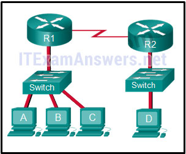

**Choices:**
- **A.** only host D
- **B.** only router R1
- **C.** only hosts A, B, and C
- **D.** only hosts A, B, C, and D
- **E.** only hosts B and C
- **F.** only hosts B, C, and router R1

**Correct Answer:**
only hosts B, C, and router R1

**Explanation:**
Topic 11.4.1 Since host A does not have the MAC address of the default gateway in its ARP table, host A sends an ARP broadcast. The ARP broadcast would be sent to every device on the local network. Hosts B, C, and router R1 would receive the broadcast. Router R1 would not forward the message.

---

## Question 119

**Question:**
Match a statement to the related network model. (Not all options are used.) ITN (Version 7.00) – ITNv7 Final Exam Place the options in the following order: peer-to-peer network [+] no dedicated server is required [+] client and server roles are set on a per request basis peer-to-peer aplication [#] requires a specific user interface [#] a background service is required

**Images:**

**Explanation:**
Topic 5.2 Peer-to-peer networks do not require the use of a dedicated server, and devices can assume both client and server roles simultaneously on a per request basis. Because they do not require formalized accounts or permissions, they are best used in limited situations. Peer-to-peer applications require a user interface and background service to be running, and can be used in more diverse situations.

---

## Question 120

**Question:**
Refer to the exhibit. A network engineer has been given the network address of 192.168.99.0 and a subnet mask of 255.255.255.192 to subnet across the four networks shown. How many total host addresses are unused across all four subnets?

**Images:**

**Choices:**
- **A.** 88
- **B.** 200
- **C.** 72
- **D.** 224
- **E.** 158

**Correct Answer:**
200

**Explanation:**
Topic 11.5.2 Usable hosts per subnet : A subnet mask of 255.255.255.192 (/26) leaves 6 host bits (32−26=6). Using the formula 2 n −2, each subnet provides 62 usable host addresses (2 6 −2=62). Used addresses : Across the four subnets, the total used addresses are 48 (30 for Network A, 14 for Network D, and 2 each for the router-to-router links in Networks B and C). Total unused : With four subnets, there are 248 total usable addresses (62×4=248). Subtracting the 48 used addresses results in 200 unused host addresses (248−48=200).

---

## Question 121

**Question:**
Which connector is used with twisted-pair cabling in an Ethernet LAN? LC conector SC conector BNC RJ 11 RJ 45 (true answer)

**Images:**
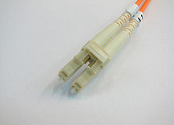
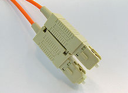
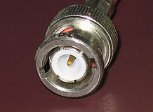
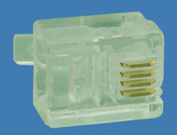
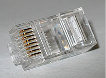

**Explanation:**
Topic 4.4.2

---

## Question 122

**Question:**
A client packet is received by a server. The packet has a destination port number of 22. What service is the client requesting?

**Choices:**
- **A.** SSH
- **B.** SMB/CIFS
- **C.** HTTPS
- **D.** SLP

**Correct Answer:**
SSH

**Explanation:**
Topic 14.4.3 Destination port 22 is the well-known port number reserved for SSH (Secure Shell) , which provides a secure remote access connection to network devices and servers. It is considered a secure, encrypted alternative to Telnet , which uses port 23.

---

## Question 123

**Question:**
What characteristic describes an IPS?

**Choices:**
- **A.** a tunneling protocol that provides remote users with secure access into the network of an organization
- **B.** a network device that filters access and traffic coming into a network
- **C.** software that identifies fast-spreading threats
- **D.** software on a router that filters traffic based on IP addresses or applications

**Correct Answer:**
software that identifies fast-spreading threats

**Explanation:**
Topic 1.8.2 IPS – An intrusion prevention system (IPS) monitors incoming and outgoing traffic looking for malware, network attack signatures, and more. If it recognizes a threat, it can immediately stop it.

---

## Question 124

**Question:**
What service is provided by DHCP?

**Choices:**
- **A.** An application that allows real-time chatting among remote users.
- **B.** Allows remote access to network devices and servers.
- **C.** Dynamically assigns IP addresses to end and intermediary devices.
- **D.** Uses encryption to provide secure remote access to network devices and servers.

**Correct Answer:**
Dynamically assigns IP addresses to end and intermediary devices.

**Explanation:**
Topic 15.4.6 DHCP (Dynamic Host Configuration Protocol) automates the assignment of IPv4 addresses , subnet masks, default gateways, and other parameters. It allows these addresses to be leased for a period of time and reused when no longer needed, which is more efficient than manual static addressing.

---

## Question 125

**Question:**
Match the header field with the appropriate layer of the OSI model. (Not all options are used.) Layer 2 Layer 3 Layer 4 802.2 header source IP address destination port number FCS (frame check sequence) TTL Acknowledgement number destination MAC address

**Images:**
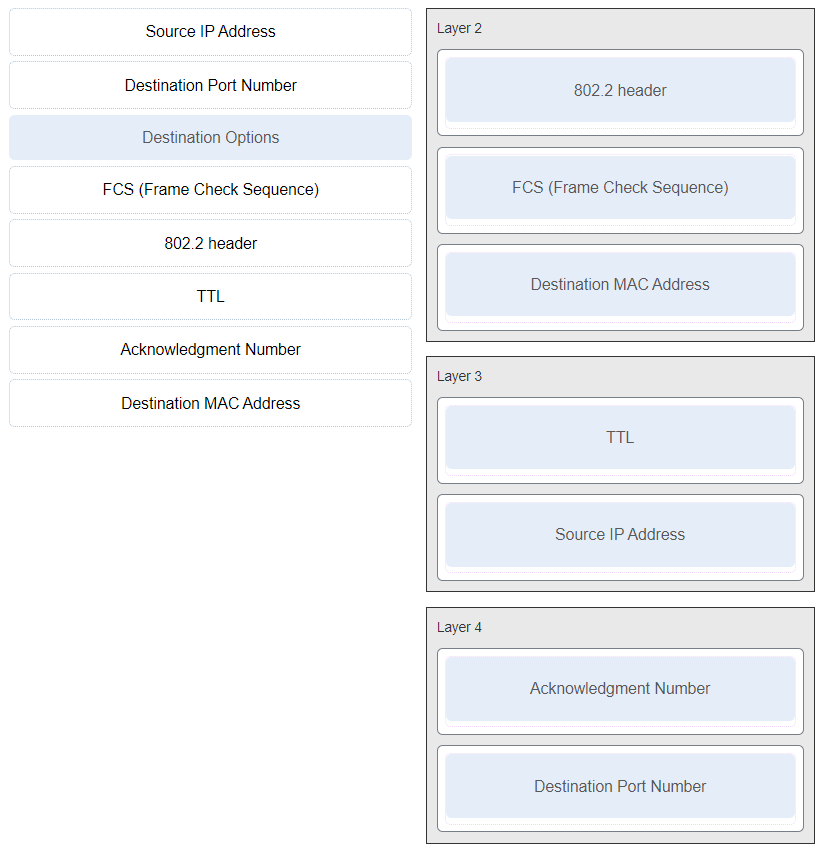

**Explanation:**
Topic 3.6.3

---

## Question 126

**Question:**
Refer to the exhibit. The switches have a default configuration. Host A needs to communicate with host D, but host A does not have the MAC address for the default gateway. Which network devices will receive the ARP request sent by host A?

**Images:**
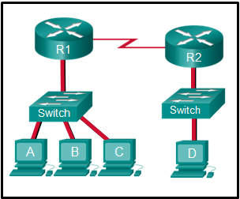

**Choices:**
- **A.** only host D
- **B.** only hosts A, B, C, and D
- **C.** only hosts B and C
- **D.** only hosts B, C, and router R1
- **E.** only hosts A, B, and C
- **F.** only router R1

**Correct Answer:**
only hosts B, C, and router R1

**Explanation:**
Topic 11.4.1 Because host A does not have the MAC address of the default gateway in the ARP table, host A sends an ARP broadcast. The ARP broadcast would be sent to every device on the local network. Hosts B, C, and router R1 would receive the broadcast. Router R1 would not forward the message.

---

## Question 127

**Question:**
Which wireless technology has low-power and low-data rate requirements making it popular in IoT environments?

**Choices:**
- **A.** Bluetooth
- **B.** Zigbee
- **C.** WiMAX
- **D.** Wi-Fi

**Correct Answer:**
Zigbee

**Explanation:**
Topic 4.6.2 Zigbee is a specification used for low-data rate, low-power communications. It is intended for applications that require short-range, low data-rates and long battery life. Zigbee is typically used for industrial and Internet of Things (IoT) environments such as wireless light switches and medical device data collection.

---

## Question 128

**Question:**
What two ICMPv6 message types must be permitted through IPv6 access control lists to allow resolution of Layer 3 addresses to Layer 2 MAC addresses? (Choose two.)

**Choices:**
- **A.** neighbor solicitations
- **B.** echo requests
- **C.** neighbor advertisements
- **D.** echo replies
- **E.** router solicitations
- **F.** router advertisements

**Correct Answer:**
neighbor solicitations; neighbor advertisements

**Explanation:**
Topic 9.3.3 IPv6 performs address resolution (mapping a known Layer 3 IPv6 address to a Layer 2 MAC address) using the Neighbor Discovery (ND) protocol instead of ARP. This process specifically requires Neighbor Solicitation (NS) messages to request the MAC address and Neighbor Advertisement (NA) messages to provide it; therefore, both must be permitted through access control lists for local network communication to function.

---

## Question 129

**Question:**
A client is using SLAAC to obtain an IPv6 address for its interface. After an address has been generated and applied to the interface, what must the client do before it can begin to use this IPv6 address?

**Choices:**
- **A.** It must send a DHCPv6 INFORMATION-REQUEST message to request the address of the DNS server.
- **B.** It must send a DHCPv6 REQUEST message to the DHCPv6 server to request permission to use this address.
- **C.** It must send an ICMPv6 Router Solicitation message to determine what default gateway it should use.
- **D.** It must send an ICMPv6 Neighbor Solicitation message to ensure that the address is not already in use on the network.

**Correct Answer:**
It must send an ICMPv6 Neighbor Solicitation message to ensure that the address is not already in use on the network.

**Explanation:**
Topic 12.5.7 Stateless DHCPv6 or stateful DHCPv6 uses a DHCP server, but Stateless Address Autoconfiguration (SLAAC) does not. A SLAAC client can automatically generate an address that is based on information from local routers via Router Advertisement (RA) messages. Once an address has been assigned to an interface via SLAAC, the client must ensure via Duplicate Address Detection (DAD) that the address is not already in use. It does this by sending out an ICMPv6 Neighbor Solicitation message and listening for a response. If a response is received, then it means that another device is already using this address.

---

## Question 130

**Question:**
Two pings were issued from a host on a local network. The first ping was issued to the IP address of the default gateway of the host and it failed. The second ping was issued to the IP address of a host outside the local network and it was successful. What is a possible cause for the failed ping?

**Choices:**
- **A.** The default gateway is not operational.
- **B.** The default gateway device is configured with the wrong IP address.
- **C.** Security rules are applied to the default gateway device, preventing it from processing ping requests.
- **D.** The TCP/IP stack on the default gateway is not working properly.

**Correct Answer:**
Security rules are applied to the default gateway device, preventing it from processing ping requests.

**Explanation:**
Topic 13.2.3 If the ping from one host to another host on a remote network is successful, this indicates that the default gateway is operational. In this scenario, if a ping from one host to the default gateway failed, it is possible that some security features are applied to the router interface, preventing it from responding to ping requests.

---

## Question 131

**Question:**
An organization is assigned an IPv6 address block of 2001:db8:0:ca00::/56. How many subnets can be created without using bits in the interface ID space?

**Choices:**
- **A.** 256
- **B.** 512
- **C.** 1024
- **D.** 4096

**Correct Answer:**
256

**Explanation:**
Topic 12.8.1 The organization is assigned a /56 prefix . Since a standard IPv6 subnet uses a /64 prefix length to preserve the 64-bit interface ID space, there are 8 bits available for subnetting (64−56=8). Using the formula 2 n , where n is the number of bits, 2 8 allows for the creation of 256 subnets .

---

## Question 132

**Question:**
What subnet mask is needed if an IPv4 network has 40 devices that need IP addresses and address space is not to be wasted?

**Choices:**
- **A.** 255.255.255.0
- **B.** 255.255.255.240
- **C.** 255.255.255.128
- **D.** 255.255.255.192
- **E.** 255.255.255.224

**Correct Answer:**
255.255.255.192

**Explanation:**
Topic 11.5.2 In order to accommodate 40 devices, 6 host bits are needed. With 6 bits, 64 addresses are possible, but one address is for the subnet number and one address is for a broadcast. This leaves 62 addresses that can be assigned to network devices. The mask associated with leaving 6 host bits for addressing is 255.255.255.192.

---

## Question 133

**Question:**
Refer to the exhibit. If host A sends an IP packet to host B, what will the destination address be in the frame when it leaves host A?

**Images:**
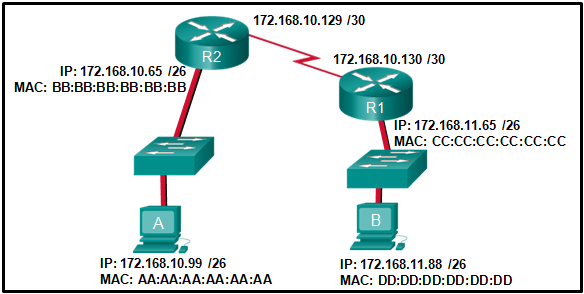

**Choices:**
- **A.** DD:DD:DD:DD:DD:DD
- **B.** 172.168.10.99
- **C.** CC:CC:CC:CC:CC:CC
- **D.** 172.168.10.65
- **E.** BB:BB:BB:BB:BB:BB
- **F.** AA:AA:AA:AA:AA:AA

**Correct Answer:**
BB:BB:BB:BB:BB:BB

**Explanation:**
Topic 9.1.2 When a host sends information to a distant network, the Layer 2 frame header will contain a source and destination MAC address. The source address will be the originating host device. The destination address will be the router interface that connects to the same network. In the case of host A sending information to host B, the source address is AA:AA:AA:AA:AA:AA and the destination address is the MAC address assigned to the R2 Ethernet interface, BB:BB:BB:BB:BB:BB.

---

## Question 134

**Question:**
What is a benefit of using cloud computing in networking?

**Choices:**
- **A.** Technology is integrated into every-day appliances allowing them to interconnect with other devices, making them more ‘smart’ or automated.
- **B.** Network capabilities are extended without requiring investment in new infrastructure, personnel, or software.
- **C.** End users have the freedom to use personal tools to access information and communicate across a business network.
- **D.** Home networking uses existing electrical wiring to connect devices to the network wherever there is an electrical outlet, saving the cost of installing data cables.

**Correct Answer:**
Network capabilities are extended without requiring investment in new infrastructure, personnel, or software.

**Explanation:**
Topic 1.7.6 Cloud computing extends IT’s capabilities without requiring investment in new infrastructure, training new personnel, or licensing new software. These services are available on-demand and delivered economically to any device anywhere in the world without compromising security or function. BYOD is about end users having the freedom to use personal tools to access information and communicate across a business or campus network. Smart home technology is integrated into every-day appliances allowing them to interconnect with other devices, making them more ‘smart’ or automated. Powerline networking is a trend for home networking that uses existing electrical wiring to connect devices to the network wherever there is an electrical outlet, saving the cost of installing data cables.

---

## Question 135

**Question:**
Which two statements are correct about MAC and IP addresses during data transmission if NAT is not involved? (Choose two.)

**Choices:**
- **A.** Destination IP addresses in a packet header remain constant along the entire path to a target host.
- **B.** Destination MAC addresses will never change in a frame that goes across seven routers.
- **C.** Every time a frame is encapsulated with a new destination MAC address, a new destination IP address is needed.
- **D.** Destination and source MAC addresses have local significance and change every time a frame goes from one LAN to another.
- **E.** A packet that has crossed four routers has changed the destination IP address four times.

**Correct Answer:**
Destination IP addresses in a packet header remain constant along the entire path to a target host.; Destination and source MAC addresses have local significance and change every time a frame goes from one LAN to another.

**Explanation:**
Topic 9.1.2 IP addresses (Layer 3) represent the original source and final destination of a packet and remain constant throughout the entire path across multiple networks, provided NAT is not involved. In contrast, MAC addresses (Layer 2) have local significance only and are used to deliver a frame from one network interface to another within the same network . Every time a packet reaches a router, the Layer 2 frame is stripped off and a new frame with updated source and destination MAC addresses is created for the next segment of the journey.

---

## Question 136

**Question:**
What is one main characteristic of the data link layer?

**Choices:**
- **A.** It generates the electrical or optical signals that represent the 1 and 0 on the media.
- **B.** It converts a stream of data bits into a predefined code.
- **C.** It shields the upper layer protocol from being aware of the physical medium to be used in the communication.
- **D.** It accepts Layer 3 packets and decides the path by which to forward the packet to a remote network.

**Correct Answer:**
It shields the upper layer protocol from being aware of the physical medium to be used in the communication.

**Explanation:**
Topic 6.1.1 The data link layer (Layer 2) prepares network data for the physical network and enables upper layers to access the media while remaining completely unaware of the type of physical medium used. Without this layer, higher-level protocols like IP would have to be specifically designed to connect to every possible type of media along a delivery path.

---

## Question 137

**Question:**
What are three characteristics of the CSMA/CD process? (Choose three.)

**Choices:**
- **A.** The device with the electronic token is the only one that can transmit after a collision.
- **B.** A device listens and waits until the media is not busy before transmitting.
- **C.** After detecting a collision, hosts can attempt to resume transmission after a random time delay has expired.
- **D.** All of the devices on a segment see data that passes on the network medium.
- **E.** A jam signal indicates that the collision has cleared and the media is not busy.
- **F.** Devices can be configured with a higher transmission priority.

**Correct Answer:**
A device listens and waits until the media is not busy before transmitting.; After detecting a collision, hosts can attempt to resume transmission after a random time delay has expired.; All of the devices on a segment see data that passes on the network medium.

**Explanation:**
Topic 6.2.7 The Carrier Sense Multiple Access/Collision Detection (CSMA/CD) process is a contention-based media access control mechanism used on shared media access networks, such as Ethernet. When a device needs to transmit data, it listens and waits until the media is available (quiet), then it will send data. If two devices transmit at the same time, a collision will occur. Both devices will detect the collision on the network. When a device detects a collision, it will stop the data transmission process, wait for a random amount of time, then try again.

---

## Question 138

**Question:**
Which information does the show startup-config command display?

**Choices:**
- **A.** the IOS image copied into RAM
- **B.** the bootstrap program in the ROM
- **C.** the contents of the current running configuration file in the RAM
- **D.** the contents of the saved configuration file in the NVRAM

**Correct Answer:**
the contents of the saved configuration file in the NVRAM

**Explanation:**
Topic 2.5.1 The show startup-config command displays the saved configuration located in NVRAM. The show running-config command displays the contents of the currently running configuration file located in RAM.​

---

## Question 139

**Question:**
Which two commands can be used on a Windows host to display the routing table? (Choose two.)

**Choices:**
- **A.** netstat -s
- **B.** route print
- **C.** show ip route
- **D.** netstat -r
- **E.** tracert

**Correct Answer:**
route print; netstat -r

**Explanation:**
Topic 8.4.4 On a Windows host, the route print or netstat -r commands can be used to display the host routing table. Both commands generate the same output. On a router, the show ip route command is used to display the routing table. The netstat –s command is used to display per-protocol statistics. The tracert command is used to display the path that a packet travels to its destination.

---

## Question 140

**Question:**
What are two functions that are provided by the network layer? (Choose two.)

**Choices:**
- **A.** directing data packets to destination hosts on other networks
- **B.** placing data on the network medium
- **C.** carrying data between processes that are running on source and destination hosts
- **D.** providing dedicated end-to-end connections
- **E.** providing end devices with a unique network identifier

**Correct Answer:**
directing data packets to destination hosts on other networks; providing end devices with a unique network identifier

**Explanation:**
Topic 8.1.1 The network layer is primarily concerned with passing data from a source to a destination on another network. IP addresses supply unique identifiers for the source and destination. The network layer provides connectionless, best-effort delivery. Devices rely on higher layers to supply services to processes.

---

## Question 141

**Question:**
Which two statements describe features of an IPv4 routing table on a router? (Choose two.)​

**Choices:**
- **A.** Directly connected interfaces will have two route source codes in the routing table: C and S .
- **B.** If there are two or more possible routes to the same destination, the route associated with the higher metric value is included in the routing table.
- **C.** The netstat -r command can be used to display the routing table of a router.​
- **D.** The routing table lists the MAC addresses of each active interface.
- **E.** It stores information about routes derived from the active router interfaces.
- **F.** If a default static route is configured in the router, an entry will be included in the routing table with source code S .
- **G.** The routing table stores information about routes derived from the active router interfaces.
- **H.** If a default static route is configured in the router, an entry will be included in the routing table with source code S

**Correct Answer:**
It stores information about routes derived from the active router interfaces.; If a default static route is configured in the router, an entry will be included in the routing table with source code S .; The routing table stores information about routes derived from the active router interfaces.; If a default static route is configured in the router, an entry will be included in the routing table with source code S

**Explanation:**
Other case: Topic 8.5.6 The show ip route command is used to display the routing table of the router. In IPv4, directly connected interfaces will have one source code: C . The routing table stores information about directly connected routes and remote routes. An entry in the routing table with a source code of S is included if a default static route is configured on the router.

---

## Question 142

**Question:**
What characteristic describes a VPN?

**Choices:**
- **A.** software on a router that filters traffic based on IP addresses or applications
- **B.** software that identifies fast-spreading threats
- **C.** a tunneling protocol that provides remote users with secure access into the network of an organization
- **D.** a network device that filters access and traffic coming into a network

**Correct Answer:**
a tunneling protocol that provides remote users with secure access into the network of an organization

**Explanation:**
Topic 1.8.2 A VPN (Virtual Private Network) uses a router to create secure encrypted tunnels that provide remote workers with secure access to an organization’s network resources. This connection allows a remote user to access internal servers as if they were a host directly within the intranet .

---

## Question 143

**Question:**
Why would a Layer 2 switch need an IP address?

**Choices:**
- **A.** to enable the switch to send broadcast frames to attached PCs
- **B.** to enable the switch to function as a default gateway
- **C.** to enable the switch to be managed remotely
- **D.** to enable the switch to receive frames from attached PCs

**Correct Answer:**
to enable the switch to be managed remotely

**Explanation:**
Topic 10.3.2 A switch, as a Layer 2 device, does not need an IP address to transmit frames to attached devices. However, when a switch is accessed remotely through the network, it must have a Layer 3 address. The IP address must be applied to a virtual interface rather than to a physical interface. Routers, not switches, function as default gateways.

---

## Question 144

**Question:**
Match each description to its corresponding term. (Not all options are used.) message encapsulation the process of placing one message format inside another message format message sizing the process of breaking up a long message into individual pieces before being sent over the network message encoding the process of converting information from one format into another acceptable for transmission

**Images:**
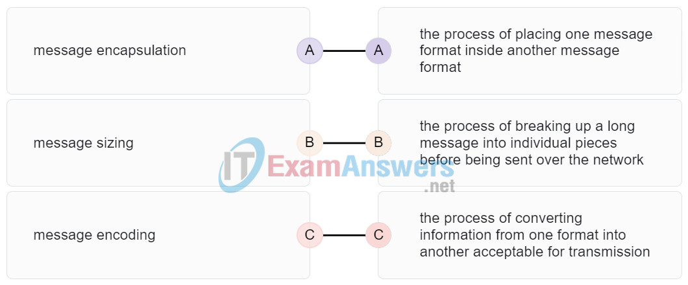

**Explanation:**
Topic 3.1.5

---

## Question 145

**Question:**
A user sends an HTTP request to a web server on a remote network. During encapsulation for this request, what information is added to the address field of a frame to indicate the destination?

**Choices:**
- **A.** the network domain of the destination host
- **B.** the IP address of the default gateway
- **C.** the MAC address of the destination host
- **D.** the MAC address of the default gateway

**Correct Answer:**
the MAC address of the default gateway

**Explanation:**
Topic 9.1.2 A frame is encapsulated with source and destination MAC addresses. The source device will not know the MAC address of the remote host. An ARP request will be sent by the source and will be responded to by the router. The router will respond with the MAC address of its interface, the one which is connected to the same network as the source.

---

## Question 146

**Question:**
What is an advantage to using a protocol that is defined by an open standard?

**Choices:**
- **A.** A company can monopolize the market.
- **B.** The protocol can only be run on equipment from a specific vendor.
- **C.** An open standard protocol is not controlled or regulated by standards organizations.
- **D.** It encourages competition and promotes choices.

**Correct Answer:**
It encourages competition and promotes choices.

**Explanation:**
Topic 3.4.1 A monopoly by one company is not a good idea from a user point of view. If a protocol can only be run on one brand, it makes it difficult to have mixed equipment in a network. A proprietary protocol is not free to use. An open standard protocol will in general be implemented by a wide range of vendors.

---

## Question 147

**Question:**
Data is being sent from a source PC to a destination server. Which three statements correctly describe the function of TCP or UDP in this situation? (Choose three.)

**Choices:**
- **A.** The source port field identifies the running application or service that will handle data returning to the PC.
- **B.** The TCP process running on the PC randomly selects the destination port when establishing a session with the server.
- **C.** UDP segments are encapsulated within IP packets for transport across the network.
- **D.** The UDP destination port number identifies the application or service on the server which will handle the data.
- **E.** TCP is the preferred protocol when a function requires lower network overhead.
- **F.** The TCP source port number identifies the sending host on the network.

**Correct Answer:**
The source port field identifies the running application or service that will handle data returning to the PC.; UDP segments are encapsulated within IP packets for transport across the network.; The UDP destination port number identifies the application or service on the server which will handle the data.

**Explanation:**
Topic 14.4.2 Layer 4 port numbers identify the application or service which will handle the data. The source port number is added by the sending device and will be the destination port number when the requested information is returned. Layer 4 segments are encapsulated within IP packets. UDP, not TCP, is used when low overhead is needed. A source IP address, not a TCP source port number, identifies the sending host on the network. Destination port numbers are specific ports that a server application or service monitors for requests.

---

## Question 148

**Question:**
Match each description with the corresponding TCP mechanism. (Not all options are used.) number of bytes a destination device can accept and process at one time window size used to identify missing segments of data sequence numbers method of managing segments of data loss retransmission received by a sender before transmitting more segments in a session acknowledgment

**Images:**
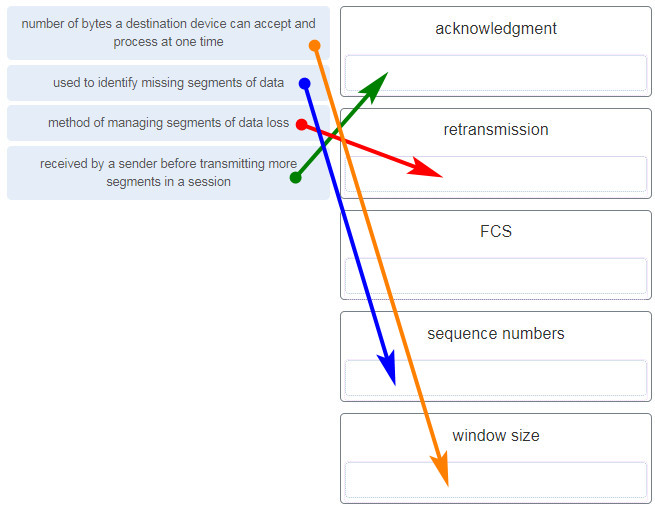

**Explanation:**
Topic 14.6

---

## Question 149

**Question:**
Refer to the exhibit. A company uses the address block of 128.107.0.0/16 for its network. What subnet mask would provide the maximum number of equal size subnets while providing enough host addresses for each subnet in the exhibit?

**Images:**
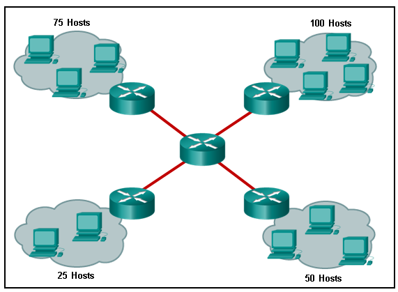

**Choices:**
- **A.** 255.255.255.192
- **B.** 255.255.255.0
- **C.** 255.255.255.128
- **D.** 255.255.255.240
- **E.** 255.255.255.224

**Correct Answer:**
255.255.255.128

**Explanation:**
Topic 11.7.2 The largest subnet in the topology has 100 hosts in it so the subnet mask must have at least 7 host bits in it (27-2=126). 255.255.255.0 has 8 hosts bits, but this does not meet the requirement of providing the maximum number of subnets.

---

## Question 150

**Question:**
A network administrator wants to have the same subnet mask for three subnetworks at a small site. The site has the following networks and numbers of devices: Copy Subnetwork A: IP phones – 10 addresses Subnetwork B: PCs – 8 addresses Subnetwork C: Printers – 2 addresses What single subnet mask would be appropriate to use for the three subnetworks?

**Choices:**
- **A.** 255.255.255.0
- **B.** 255.255.255.240
- **C.** 255.255.255.248
- **D.** 255.255.255.252

**Correct Answer:**
255.255.255.240

**Explanation:**
Topic 11.7.2 If the same mask is to be used, then the network with the most hosts must be examined for number of hosts. Because this is 10 hosts, 4 host bits are needed. The /28 or 255.255.255.240 subnet mask would be appropriate to use for these networks. ​

---

## Question 151

**Question:**
Match each item to the type of topology diagram on which it is typically identified. (Not all options are used.) physical topology diagram logical topology diagram location of a desktop PC in a classroom IP address of a server path of cables that connect rooms to wiring closets

**Images:**
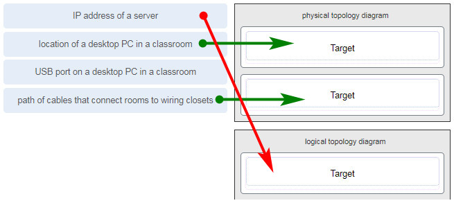

**Explanation:**
Topic 1.3.2 A logical topology diagram typically depicts the IP addressing scheme and groupings of devices and ports. A physical topology diagram shows how those devices are connected to each other and the network, focusing on the physical locations of intermediary devices, configured ports, and cabling.

---

## Question 152

**Question:**
What two pieces of information are displayed in the output of the show ip interface brief command? (Choose two.)

**Choices:**
- **A.** IP addresses
- **B.** interface descriptions
- **C.** MAC addresses
- **D.** next-hop addresses
- **E.** Layer 1 statuses
- **F.** speed and duplex settings

**Correct Answer:**
IP addresses; Layer 1 statuses

**Explanation:**
Topic 10.2.3 The command show ip interface brief shows the IP address of each interface, as well as the operational status of the interfaces at both Layer 1 and Layer 2. In order to see interface descriptions and speed and duplex settings, use the command show running-config interface. Next-hop addresses are displayed in the routing table with the command show ip route, and the MAC address of an interface can be seen with the command show interfaces.

---

## Question 153

**Question:**
A user is complaining that an external web page is taking longer than normal to load.The web page does eventually load on the user machine. Which tool should the technician use with administrator privileges in order to locate where the issue is in the network?

**Choices:**
- **A.** ping
- **B.** nslookup
- **C.** tracert
- **D.** ipconfig /displaydns

**Correct Answer:**
tracert

**Explanation:**
Topic 17.4.3 The Command Prompt command tracert will map the path from the PC to the web server and measure transit delays of packets across the network.

---

## Question 154

**Question:**
Which value, that is contained in an IPv4 header field, is decremented by each router that receives a packet?

**Choices:**
- **A.** Header Length
- **B.** Differentiated Services
- **C.** Time-to-Live
- **D.** Fragment Offset

**Correct Answer:**
Time-to-Live

**Explanation:**
Topic 8.2.2 When a router receives a packet, the router will decrement the Time-to-Live (TTL) field by one. When the field reaches zero, the receiving router will discard the packet and will send an ICMP Time Exceeded message to the sender.

---

## Question 155

**Question:**
A network technician is researching the use of fiber optic cabling in a new technology center. Which two issues should be considered before implementing fiber optic media? (Choose two.)

**Choices:**
- **A.** Fiber optic cabling requires different termination and splicing expertise from what copper cabling requires.
- **B.** Fiber optic cabling requires specific grounding to be immune to EMI.
- **C.** Fiber optic cabling is susceptible to loss of signal due to RFI.
- **D.** Fiber optic cable is able to withstand rough handling.
- **E.** Fiber optic provides higher data capacity but is more expensive than copper cabling.

**Correct Answer:**
Fiber optic cabling requires different termination and splicing expertise from what copper cabling requires.; Fiber optic provides higher data capacity but is more expensive than copper cabling.

**Explanation:**
Topic 4.5.6 Fiber optic media is more expensive than copper cabling used over the same distance. Fiber optic cables use light instead of an electrical signal, so EMI and RFI are not issues. However, fiber optic does require different skills to terminate and splice.

---

## Question 156

**Question:**
Match each description with an appropriate IP address. (Not all options are used.) an experimental address 240.2.6.255 a link-local address 169.254.1.5 a public address 198.133.219.2 a loopback address 127.0.0.1

**Images:**
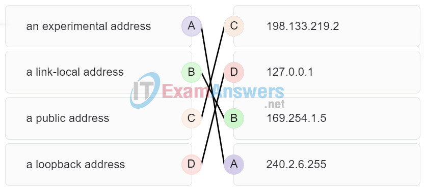

**Explanation:**
Topic 11.3.4

---

## Question 157

**Question:**
A user is executing a tracert to a remote device. At what point would a router, which is in the path to the destination device, stop forwarding the packet?

**Choices:**
- **A.** when the router receives an ICMP Time Exceeded message
- **B.** when the RTT value reaches zero
- **C.** when the host responds with an ICMP Echo Reply message
- **D.** when the value in the TTL field reaches zero
- **E.** when the values of both the Echo Request and Echo Reply messages reach zero

**Correct Answer:**
when the value in the TTL field reaches zero

**Explanation:**
Topic 13.1.4 When a router receives a traceroute packet, the value in the TTL field is decremented by 1. When the value in the field reaches zero, the receiving router will not forward the packet, and will send an ICMP Time Exceeded message back to the source.

---

## Question 158

**Question:**
Users report that the network access is slow. After questioning the employees, the network administrator learned that one employee downloaded a third-party scanning program for the printer. What type of malware might be introduced that causes slow performance of the network?

**Choices:**
- **A.** virus
- **B.** worm
- **C.** phishing
- **D.** spam

**Correct Answer:**
worm

**Explanation:**
Topic 16.2.1 A cybersecurity specialist needs to be familiar with the characteristics of the different types of malware and attacks that threaten an organization.

---
