# CCNA 2 - Modules 1 - 4 Switching Concepts VLANs and InterVLAN Routing Exam Answers

## Question 1

**Question:**
Which tasks can be accomplished by using the command history feature? (Choose two.)

**Choices:**
- **A.** View a list of commands entered in a previous session.
- **B.** Recall up to 15 command lines by default.
- **C.** Set the command history buffer size.
- **D.** Recall previously entered commands.
- **E.** Save command lines in a log file for future reference.

**Correct Answer:**
Set the command history buffer size.; Recall previously entered commands.

**Explanation:**
Topic 1.5.7 The history command allows you to view and reuse previously entered commands stored in the buffer. It is also used to manage the of the buffer.

---

## Question 2

**Question:**
What is the first action in the boot sequence when a switch is powered on?

**Choices:**
- **A.** load the default Cisco IOS software
- **B.** load boot loader software
- **C.** low-level CPU initialization
- **D.** load a power-on self-test program

**Correct Answer:**
load a power-on self-test program

**Explanation:**
Topic 1.1.1 The first action to take place when a switch is powered on is the POST or power-on self-test. POST performs tests on the CPU, memory, and flash in preparation for loading the boot loader.

---

## Question 3

**Question:**
What must an administrator have in order to reset a lost password on a router?

**Choices:**
- **A.** a TFTP server
- **B.** a crossover cable
- **C.** access to another router
- **D.** physical access to the router

**Correct Answer:**
physical access to the router

**Explanation:**
Topic 1.1.4 Console access to the device through a terminal or terminal emulator software on a PC is required for password recovery.

---

## Question 4

**Question:**
When configuring a switch for SSH access, what other command that is associated with the login local command is required to be entered on the switch?

**Choices:**
- **A.** enable secret password
- **B.** password password
- **C.** username username secret secret
- **D.** login block-for seconds attempts number within*seconds*

**Correct Answer:**
username username secret secret

**Explanation:**
Topic 1.3.4 The login local command designates that the local username database is used to authenticate interfaces such as console or vty.

---

## Question 5

**Question:**
Which command displays information about the auto-MDIX setting for a specific interface?​

**Choices:**
- **A.** show interfaces
- **B.** show controllers
- **C.** show processes
- **D.** show running-config

**Correct Answer:**
show controllers

**Explanation:**
Topic 1.2.3 To examine the auto-MDIX setting for a specific interface, the show controllers ethernet-controller command with the phy keyword should be used.

---

## Question 6

**Question:**
If one end of an Ethernet connection is configured for full duplex and the other end of the connection is configured for half duplex, where would late collisions be observed?

**Choices:**
- **A.** on both ends of the connection
- **B.** on the full-duplex end of the connection
- **C.** only on serial interfaces
- **D.** on the half-duplex end of the connection

**Correct Answer:**
on the half-duplex end of the connection

**Explanation:**
Topic 1.2.7 Full-duplex communications do not produce collisions. However, collisions often occur in half-duplex operations. When a connection has two different duplex configurations, the half-duplex end will experience late collisions. Collisions are found on Ethernet networks. Serial interfaces use technologies other than Ethernet.

---

## Question 7

**Question:**
Which command is used to set the BOOT environment variable that defines where to find the IOS image file on a switch?

**Choices:**
- **A.** config-register
- **B.** boot system
- **C.** boot loader
- **D.** confreg

**Correct Answer:**
boot system

**Explanation:**
Topic 1.1.2 The boot system command is used to set the BOOT environment variable. The config-register and confreg commands are used to set the configuration register. The boot loader command supports commands to format the flash file system, reinstall the operating system software, and recover from a lost or forgotten password.

---

## Question 8

**Question:**
What does a switch use to locate and load the IOS image?

**Choices:**
- **A.** BOOT environment variable
- **B.** IOS image file
- **C.** POST
- **D.** startup-config
- **E.** NVRAM

**Correct Answer:**
BOOT environment variable

**Explanation:**
Topic 1.1.2 The BOOT environment variable contains the information about where to find the IOS image file.

---

## Question 9

**Question:**
Which protocol adds security to remote connections?

**Choices:**
- **A.** FTP
- **B.** HTTP
- **C.** NetBEUI
- **D.** POP
- **E.** SSH

**Correct Answer:**
SSH

**Explanation:**
Topic 1.3.1 SSH allows a technician to securely connect to a remote network device for monitoring and troubleshooting. HTTP establishes web page requests. FTP manages file transfer. NetBEUI is not routed on the Internet. POP downloads email messages from email servers.

---

## Question 10

**Question:**
What is a characteristic of an IPv4 loopback interface on a Cisco IOS router?​

**Choices:**
- **A.** The no shutdown command is required to place this interface in an UP state.​
- **B.** It is a logical interface internal to the router.
- **C.** Only one loopback interface can be enabled on a router.​
- **D.** It is assigned to a physical port and can be connected to other devices.

**Correct Answer:**
It is a logical interface internal to the router.

**Explanation:**
Topic 1.4.6 The loopback interface is a logical interface internal to the router and is automatically placed in an UP state, as long as the router is functioning. It is not assigned to a physical port and can therefore never be connected to any other device. Multiple loopback interfaces can be enabled on a router.

---

## Question 11

**Question:**
What is the minimum Ethernet frame size that will not be discarded by the receiver as a runt frame?

**Choices:**
- **A.** 64 bytes
- **B.** 512 bytes
- **C.** 1024 bytes
- **D.** 1500 bytes

**Correct Answer:**
64 bytes

**Explanation:**
Topic 1.2.6 The minimum Ethernet frame size is 64 bytes. Frames smaller than 64 bytes are considered collision fragments or runt frames and are discarded.

---

## Question 12

**Question:**
After which step of the switch bootup sequence is the boot loader executed?

**Choices:**
- **A.** after CPU initialization
- **B.** after IOS localization
- **C.** after flash file system initialization
- **D.** after POST execution

**Correct Answer:**
after POST execution

**Explanation:**
Topic 1.1.1 The correct bootup sequence order is as follows: 1.- The switch loads and executes the POST. 2.- The switch loads the boot loader software. 3.- The boot loader performs low-level CPU initialization. 4.- The boot loader initializes the flash memory. 5.- The boot loader locates and loads the default IOS image.

---

## Question 13

**Question:**
Which impact does adding a Layer 2 switch have on a network?

**Choices:**
- **A.** an increase in the number of dropped frames
- **B.** an increase in the size of the broadcast domain
- **C.** an increase in the number of network collisions
- **D.** an increase in the size of the collision domain

**Correct Answer:**
an increase in the size of the broadcast domain

**Explanation:**
Topic 2.2.2 Adding a Layer 2 switch to a network increases the number of collision domains and increases the size of the broadcast domain. Layer 2 switches do not decrease the amount of broadcast traffic, do not increase the amount of network collisions and do not increase the number of dropped frames.

---

## Question 14

**Question:**
Which characteristic describes cut-through switching?

**Choices:**
- **A.** Error-free fragments are forwarded, so switching occurs with lower latency.
- **B.** Frames are forwarded without any error checking.
- **C.** Only outgoing frames are checked for errors.
- **D.** Buffering is used to support different Ethernet speeds.

**Correct Answer:**
Frames are forwarded without any error checking.

**Explanation:**
Topic 2.1.7 Cut-through switching reduces latency by forwarding frames as soon as the destination MAC address and the corresponding switch port are read from the MAC address table. This switching method does not perform any error checking and does not use buffers to support different Ethernet speeds. Error checking and buffers are characteristics of store-and-forward switching.

---

## Question 15

**Question:**
What is the significant difference between a hub and a Layer 2 LAN switch?

**Choices:**
- **A.** A hub extends a collision domain, and a switch divides collision domains.
- **B.** A hub divides collision domains, and a switch divides broadcast domains.
- **C.** Each port of a hub is a collision domain, and each port of a switch is a broadcast domain.
- **D.** A hub forwards frames, and a switch forwards only packets.

**Correct Answer:**
A hub extends a collision domain, and a switch divides collision domains.

**Explanation:**
Topic 2.2.1 Hubs operate only at the physical layer, forwarding bits as wire signals out all ports, and extend the collision domain of a network. Switches forward frames at the data link layer and each switch port is a separate collision domain which creates more, but smaller, collision domains. Switches do not manage broadcast domains because broadcast frames are always forwarded out all active ports.

---

## Question 16

**Question:**
Which statement is correct about Ethernet switch frame forwarding decisions?

**Choices:**
- **A.** Frame forwarding decisions are based on MAC address and port mappings in the CAM table.
- **B.** Cut-through frame forwarding ensures that invalid frames are always dropped.
- **C.** Only frames with a broadcast destination address are forwarded out all active switch ports.
- **D.** Unicast frames are always forwarded regardless of the destination MAC address.

**Correct Answer:**
Frame forwarding decisions are based on MAC address and port mappings in the CAM table.

**Explanation:**
Topic 2.1.2 Cut-through frame forwarding reads up to only the first 22 bytes of a frame, which excludes the frame check sequence and thus invalid frames may be forwarded. In addition to broadcast frames, frames with a destination MAC address that is not in the CAM are also flooded out all active ports. Unicast frames are not always forwarded. Received frames with a destination MAC address that is associated with the switch port on which it is received are not forwarded because the destination exists on the network segment connected to that port.

---

## Question 17

**Question:**
How do switch buffers affect network performance?

**Choices:**
- **A.** They provide error checking on the data received.
- **B.** They store frames received, thus preventing premature frame discarding when network congestion occurs.
- **C.** They provide extra memory for a particular port if autonegotiation of speed or duplex fails.
- **D.** They hold data temporarily when a collision occurs until normal data transmission resumes.

**Correct Answer:**
They store frames received, thus preventing premature frame discarding when network congestion occurs.

**Explanation:**
Topic 2.2.3 Switches have large frame buffers that allow data waiting to be transmitted to be stored so the data will not be dropped. This feature is beneficial especially if the incoming traffic is from a faster port than the egress port used for transmitting.

---

## Question 18

**Question:**
Which switch characteristic helps keep traffic local and alleviates network congestion?

**Choices:**
- **A.** high port density
- **B.** fast port speed
- **C.** large frame buffers
- **D.** fast internal switching

**Correct Answer:**
high port density

**Explanation:**
Topic 2.2.3 Switches that have a lot of ports (high port density) reduce the number of switches required and keep some of the traffic locally on the switch, thus removing the need to send it between switches.

---

## Question 19

**Question:**
Which switch component reduces the amount of packet handling time inside the switch?

**Choices:**
- **A.** ASIC
- **B.** dual processors
- **C.** large buffer size
- **D.** store-and-forward RAM

**Correct Answer:**
ASIC

**Explanation:**
Topic 2.1.5 Application-specific integrated circuits (ASICs) are used in Cisco switches to speed up switch operations so that the switch can have an increased number of ports without degrading switch performance.

---

## Question 20

**Question:**
Refer to the exhibit. A switch receives a Layer 2 frame that contains a source MAC address of 000b.a023.c501 and a destination MAC address of 0050.0fae.75aa. Place the switch steps in the order they occur. (Not all options are used.) CCNA2 v7 SRWE – Modules 1 – 4: Switching Concepts, VLANs, and InterVLAN Routing Exam Answers CCNA 2 v7 Modules 1 – 4: Switching Concepts, VLANs, and InterVLAN Routing Exam Answers 20

**Images:**
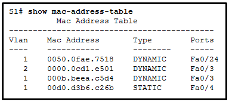
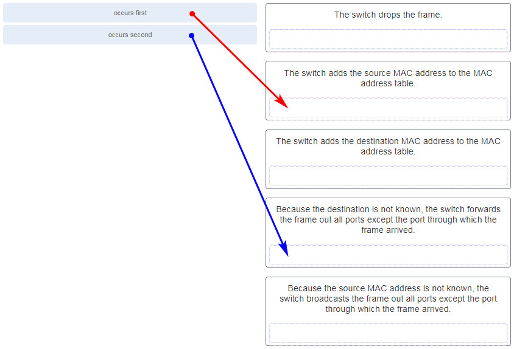

**Explanation:**
Topic 2.1.3 The first step a switch does when processing a frame is to see if the source MAC address is in the MAC address table. If the address is not there, the switch adds it. The switch then examines the destination MAC address and compares it to the MAC address table. If the address is in the table, the switch forwards the frame out the corresponding port. If the address is missing from the table, the switch will forward the frame to all ports except the port through which the frame arrived.

---

## Question 21

**Question:**
What information is added to the switch table from incoming frames?

**Choices:**
- **A.** source MAC address and incoming port number
- **B.** destination MAC address and incoming port number
- **C.** source IP address and incoming port number
- **D.** destination IP address and incoming port number

**Correct Answer:**
source MAC address and incoming port number

**Explanation:**
Topic 2.1.3 A switch “learns” or builds the MAC address table based on the source MAC address as a frame comes into the switch. A switch forwards the frame onward based on the destination MAC address.

---

## Question 22

**Question:**
Which switching method ensures that the incoming frame is error-free before forwarding?

**Choices:**
- **A.** cut-through
- **B.** FCS
- **C.** fragment free
- **D.** store-and-forward

**Correct Answer:**
store-and-forward

**Explanation:**
Topic 2.1.6 Two methods used by switches to transmit frames are store-and-forward and cut-through switching. The store-and-forward method performs error checking on the frame using the frame check sequence (FCS) value before sending the frame. In contrast, cut-through switching sends the frame as soon as the destination MAC address part of the header has been read and processed.

---

## Question 23

**Question:**
Refer to the exhibit. How many broadcast domains are displayed? CCNA2 v7 SRWE – Modules 1 – 4 Switching Concepts, VLANs, and InterVLAN Routing Exam Answers 23

**Images:**
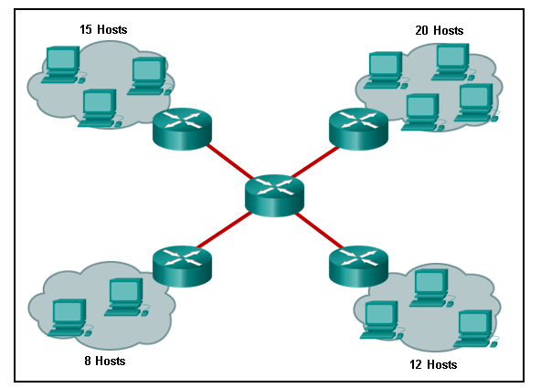

**Choices:**
- **A.** 1
- **B.** 4
- **C.** 8
- **D.** 16
- **E.** 55

**Correct Answer:**
8

**Explanation:**
Topic 2.2.2 A router defines a broadcast boundary, so every link between two routers is a broadcast domain. In the exhibit, 4 links between routers make 4 broadcast domains. Also, each LAN that is connected to a router is a broadcast domain. The 4 LANs in the exhibit result in 4 more broadcast domains, so there are 8 broadcast domains in all.

---

## Question 24

**Question:**
Under which two occasions should an administrator disable DTP while managing a local area network? (Choose two.)

**Choices:**
- **A.** when connecting a Cisco switch to a non-Cisco switch
- **B.** when a neighbor switch uses a DTP mode of dynamic auto
- **C.** when a neighbor switch uses a DTP mode of dynamic desirable
- **D.** on links that should not be trunking
- **E.** on links that should dynamically attempt trunking

**Correct Answer:**
when connecting a Cisco switch to a non-Cisco switch; on links that should not be trunking

**Explanation:**
Topic 3.5.1 Cisco best practice recommends disabling DTP on links where trunking is not intended and when a Cisco switch is connected to a non-Cisco switch. DTP is required for dynamic trunk negotiation.

---

## Question 25

**Question:**
Which two characteristics describe the native VLAN? (Choose two.)

**Choices:**
- **A.** Designed to carry traffic that is generated by users, this type of VLAN is also known as the default VLAN.
- **B.** The native VLAN traffic will be untagged across the trunk link.
- **C.** This VLAN is necessary for remote management of a switch.
- **D.** High priority traffic, such as voice traffic, uses the native VLAN.
- **E.** The native VLAN provides a common identifier to both ends of a trunk.

**Correct Answer:**
The native VLAN traffic will be untagged across the trunk link.; The native VLAN provides a common identifier to both ends of a trunk.

**Explanation:**
Topic 3.2.5 The native VLAN is assigned to 802.1Q trunks to provide a common identifier to both ends of the trunk link. Whatever VLAN native number is assigned to a port, or if the port is the default VLAN of 1, the port does not tag any frame in that VLAN as the traffic travels across the trunk. At the other end of the link, the receiving device that sees no tag knows the specific VLAN number because the receiving device must have the exact native VLAN number. The native VLAN should be an unused VLAN that is distinct from VLAN1, the default VLAN, as well as other VLANs. Data VLANs, also known as user VLANs, are configured to carry user-generated traffic, with the exception of high priority traffic, such as VoIP. Voice VLANs are configured for VoIP traffic. The management VLAN is configured to provide access to the management capabilities of a switch.

---

## Question 26

**Question:**
On a switch that is configured with multiple VLANs, which command will remove only VLAN 100 from the switch?

**Choices:**
- **A.** Switch# delete flash:vlan.dat
- **B.** Switch(config-if)# no switchport access vlan 100
- **C.** Switch(config-if)# no switchport trunk allowed vlan 100
- **D.** Switch(config)# no vlan 100

**Correct Answer:**
Switch(config)# no vlan 100

**Explanation:**
Topic 3.3.10 To remove all VLANs from a switch, the delete flash:vlan.dat command would be used. To change the assigned VLAN for an interface, the no switchport access vlan 100 interface configuration command would be used. To remove VLAN 100 as an allowed VLAN on a trunk, the no switchport trunk allowed vlan 100 would be used, but this would not remove the VLAN from the switch. To delete a single VLAN, such as VLAN 100, the no vlan 100 global configuration command would be used.

---

## Question 27

**Question:**
Refer to the exhibit. A network administrator is reviewing port and VLAN assignments on switch S2 and notices that interfaces Gi0/1 and Gi0/2 are not included in the output. Why would the interfaces be missing from the output? CCNA 2 v7 Modules 1 – 4 Switching Concepts, VLANs, and InterVLAN Routing Exam 27

**Images:**
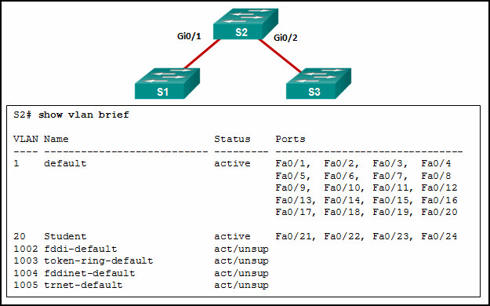

**Choices:**
- **A.** There is a native VLAN mismatch between the switches.
- **B.** There is no media connected to the interfaces.
- **C.** They are administratively shut down.
- **D.** They are configured as trunk interfaces.

**Correct Answer:**
They are configured as trunk interfaces.

**Explanation:**
Topic 3.3.8 Interfaces that are configured as trunks do not belong to a VLAN and therefore will not show in the output of the show vlan brief commands.

---

## Question 28

**Question:**
A network contains multiple VLANs spanning multiple switches. What happens when a device in VLAN 20 sends a broadcast Ethernet frame?

**Choices:**
- **A.** All devices in all VLANs see the frame.
- **B.** Devices in VLAN 20 and the management VLAN see the frame.
- **C.** Only devices in VLAN 20 see the frame.
- **D.** Only devices that are connected to the local switch see the frame.

**Correct Answer:**
Only devices in VLAN 20 see the frame.

**Explanation:**
Topic 3.1.1 VLANs create logical broadcast domains that can span multiple VLAN segments. Ethernet frames that are sent by a device on a specific VLAN can only be seen by other devices in the same VLAN.

---

## Question 29

**Question:**
Refer to the exhibit. All workstations are configured correctly in VLAN 20. Workstations that are connected to switch SW1 are not able to send traffic to workstations on SW2. What could be done to remedy the problem? CCNA2 v7 SRWE – Modules 1 – 4 Switching Concepts, VLANs, and InterVLAN Routing Exam Answers 29

**Images:**
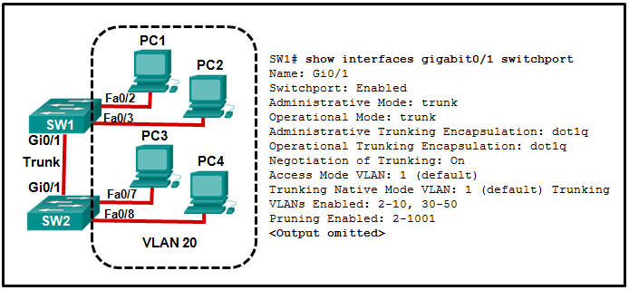

**Choices:**
- **A.** Allow VLAN 20 on the trunk link.
- **B.** Enable DTP on both ends of the trunk.
- **C.** Configure all workstations on SW1 to be part of the default VLAN.
- **D.** Configure all workstations on SW2 to be part of the native VLAN.

**Correct Answer:**
Allow VLAN 20 on the trunk link.

**Explanation:**
Topic 3.4.1 Enabling DTP on both switches simply allows negotiation of trunking. The “Negotiation of Trunking” line in the graphic shows that DTP is already enabled. The graphic also shows how the native VLAN is 1, and the default VLAN for any Cisco switch is 1. The graphic shows the PCs are to be in VLAN 20.

---

## Question 30

**Question:**
What happens to switch ports after the VLAN to which they are assigned is deleted?

**Choices:**
- **A.** The ports are disabled.
- **B.** The ports are placed in trunk mode.
- **C.** The ports are assigned to VLAN1, the default VLAN.
- **D.** The ports stop communicating with the attached devices.

**Correct Answer:**
The ports stop communicating with the attached devices.

**Explanation:**
Topic 3.3.10 Any ports that are not moved to an active VLAN cannot communicate with other hosts after the VLAN is deleted. They must be assigned to an active VLAN or their VLAN must be created.

---

## Question 31

**Question:**
Match the IEEE 802.1Q standard VLAN tag field with the description. (Not all options are used.) CCNA2 v7 Modules 1 – 4 Switching Concepts, VLANs, and InterVLAN Routing Exam Answers 31

**Images:**
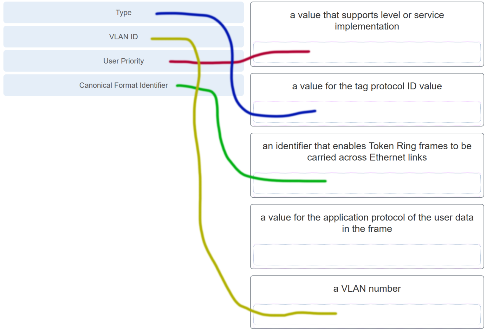
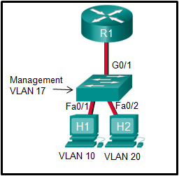

**Choices:**
- **A.** access
- **B.** trunk
- **C.** native
- **D.** auto

**Correct Answer:**
trunk

**Explanation:**
Topic 3.2.4 The IEEE 802.1Q standard header includes a 4-byte VLAN tag: Type – A 2-byte value called the tag protocol ID (TPID) value. User priority – A 3-bit value that supports level or service implementation. Canonical Format Identifier (CFI) – A 1-bit identifier that enables Token Ring frames to be carried across Ethernet links. VLAN ID (VID) – A 12-bit VLAN identification number that supports up to 4096 VLAN IDs. 32. Refer to the exhibit. In what switch mode should port G0/1 be assigned if Cisco best practices are being used? CCNA2 v7 Modules 1 – 4 Switching Concepts, VLANs, and InterVLAN Routing Exam Answers 32 Topic 3.4.1 The router is used to route between the two VLANs, thus switch port G0/1 needs to be configured in trunk mode.

---

## Question 32

**Question:**
Match the DTP mode with its function. (Not all options are used.)

**Images:**
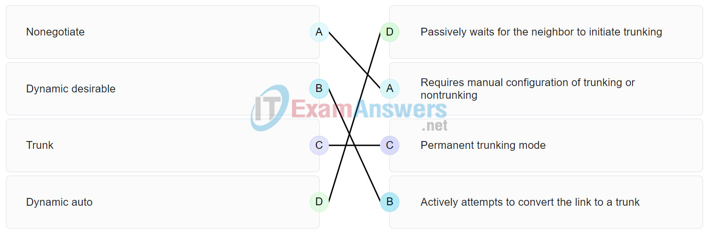

**Explanation:**
Topic 3.5.2 The dynamic auto mode makes the interface become a trunk interface if the neighboring interface is set to trunk or desirable mode. The dynamic desirable mode makes the interface actively attempt to convert the link to a trunk link. The trunk mode puts the interface into permanent trunking mode and negotiates to convert the neighboring link into a trunk link. The nonegotiate mode prevents the interface from generating DTP frames.

---

## Question 33

**Question:**
Port Fa0/11 on a switch is assigned to VLAN 30. If the command no switchport access vlan 30 is entered on the Fa0/11 interface, what will happen?

**Choices:**
- **A.** Port Fa0/11 will be shutdown.
- **B.** An error message would be displayed.
- **C.** Port Fa0/11 will be returned to VLAN 1.
- **D.** VLAN 30 will be deleted.

**Correct Answer:**
Port Fa0/11 will be returned to VLAN 1.

**Explanation:**
Topic 3.3.9 When the no switchport access vlan command is entered, the port is returned to the default VLAN 1. The port will remain active as a member of VLAN 1, and VLAN 30 will still be intact, even if no other ports are associated with it.

---

## Question 34

**Question:**
Which command displays the encapsulation type, the voice VLAN ID, and the access mode VLAN for the Fa0/1 interface?

**Choices:**
- **A.** show vlan brief
- **B.** show interfaces Fa0/1 switchport
- **C.** show mac address-table interface Fa0/1
- **D.** show interfaces trunk

**Correct Answer:**
show interfaces Fa0/1 switchport

**Explanation:**
Topic 3.3.8 The show interfaces switchport command displays the following information for a given port: Switchport Administrative Mode Operational Mode Administrative Trunking Encapsulation Operational Trunking Encapsulation Negotiation of Trunking Access Mode VLAN Trunking Native Mode VLAN Administrative Native VLAN tagging Voice VLAN

---

## Question 35

**Question:**
Refer to the exhibit. A technician is programming switch SW3 to manage voice and data traffic through port Fa0/20. What, if anything, is wrong with the configuration?

**Images:**
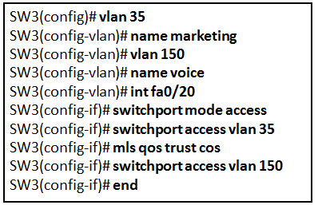

**Choices:**
- **A.** There is nothing wrong with the configuration.
- **B.** Interface Fa0/20 can only have one VLAN assigned.
- **C.** The mls qos trust cos command should reference VLAN 35.
- **D.** The command used to assign the voice VLAN to the switch port is incorrect.

**Correct Answer:**
The command used to assign the voice VLAN to the switch port is incorrect.

**Explanation:**
Topic 3.3.6 The voice VLAN should be configured with the switchport voice vlan 150 command. A switch interface can be configured to support one data VLAN and one voice VLAN. The mls qos trust cos associates with the interface. Voice traffic must be trusted so that fields within the voice packet can be used to classify it for QoS.

---

## Question 36

**Question:**
Which four steps are needed to configure a voice VLAN on a switch port? (Choose four).

**Choices:**
- **A.** Configure the interface as an IEEE 802.1Q trunk.
- **B.** Assign the voice VLAN to the switch port.
- **C.** Activate spanning-tree PortFast on the interface.
- **D.** Ensure that voice traffic is trusted and tagged with a CoS priority value.
- **E.** Add a voice VLAN.
- **F.** Configure the switch port interface with subinterfaces.
- **G.** Assign a data VLAN to the switch port.
- **H.** Configure the switch port in access mode.

**Correct Answer:**
Assign the voice VLAN to the switch port.; Ensure that voice traffic is trusted and tagged with a CoS priority value.; Add a voice VLAN.; Configure the switch port in access mode.

**Explanation:**
Topic 3.3.11 To add an IP phone, the following commands should be added to the switch port: SW3(config-vlan)# vlan 150 SW3(config-vlan)# name voice SW3(config-vlan)# int fa0/20 SW3(config-if)# switchport mode access SW3(config-if)# mls qos trust cos SW3(config-if)# switchport access vlan 150

---

## Question 37

**Question:**
Refer to the exhibit. PC1 is unable to communicate with server 1. The network administrator issues the show interfaces trunk command to begin troubleshooting. What conclusion can be made based on the output of this command? CCNA2 v7 Modules 1 – 4 Switching Concepts, VLANs, and InterVLAN Routing Exam Answers 38

**Images:**
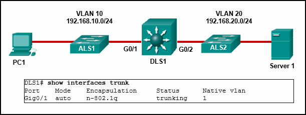

**Choices:**
- **A.** Interface G0/2 is not configured as a trunk.
- **B.** VLAN 20 has not been created.
- **C.** The encapsulation on interface G0/1 is incorrect.
- **D.** The DTP mode is incorrectly set to dynamic auto on interface G0/1.

**Correct Answer:**
Interface G0/2 is not configured as a trunk.

**Explanation:**
Topic 4.4.4 In the show interfaces trunk output, the G0/2 interface of DLS1 is not listed. This indicates the interface has probably not been configured as a trunk link. In the show interfaces trunk output, the G0/2 interface of DLS1 is not listed. This indicates the interface has probably not been configured as a trunk link.

---

## Question 38

**Question:**
Refer to the exhibit. What is the cause of the error that is displayed in the configuration of inter-VLAN routing on router CiscoVille? CCNA2 v7 Modules 1 – 4 Switching Concepts, VLANs, and InterVLAN Routing Exam Answers 39

**Images:**
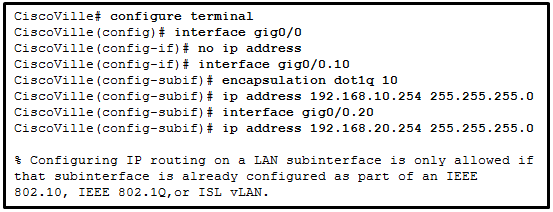

**Choices:**
- **A.** The gig0/0 interface does not support inter-VLAN routing.
- **B.** The no shutdown command has not been configured.
- **C.** The IP address on CiscoVille is incorrect.
- **D.** The encapsulation dot1Q 20 command has not been configured.​

**Correct Answer:**
The encapsulation dot1Q 20 command has not been configured.​

**Explanation:**
Topic 4.2.4

---

## Question 39

**Question:**
Refer to the exhibit. A network administrator has configured router CiscoVille with the above commands to provide inter-VLAN routing. What command will be required on a switch that is connected to the Gi0/0 interface on router CiscoVille to allow inter-VLAN routing?​

**Images:**
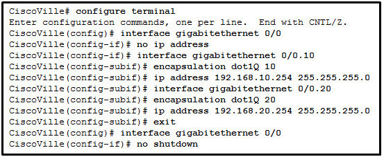

**Choices:**
- **A.** switchport mode access
- **B.** no switchport
- **C.** switchport mode trunk
- **D.** switchport mode dynamic desirable

**Correct Answer:**
switchport mode trunk

**Explanation:**
Topic 4.2.2 When they are configured for inter-VLAN routing, routers do not support the dynamic trunking protocol that is used by switches. For router-on-a-stick configurations to function, a connected switch must use the command switchport mode trunk .

---

## Question 40

**Question:**
A high school uses VLAN15 for the laboratory network and VLAN30 for the faculty network. What is required to enable communication between these two VLANs while using the router-on-a-stick approach?

**Choices:**
- **A.** A multilayer switch is needed.
- **B.** A router with at least two LAN interfaces is needed.
- **C.** Two groups of switches are needed, each with ports that are configured for one VLAN.
- **D.** A switch with a port that is configured as a trunk is needed when connecting to the router.

**Correct Answer:**
A switch with a port that is configured as a trunk is needed when connecting to the router.

**Explanation:**
Topic 4.1.3 With router-on-a-stick, inter-VLAN routing is performed by a router with a single router interface that is connected to a switch port configured with trunk mode. Multiple subinterfaces, each configured for a VLAN, can be configured under the single physical router interface. Switches can have ports that are assigned to different VLANs, but communication between those VLANs requires routing function from the router. A multilayer switch is not used in a router-on-a-stick approach to inter-VLAN routing.

---

## Question 41

**Question:**
When routing a large number of VLANs, what are two disadvantages of using the router-on-a-stick inter-VLAN routing method rather than the multilayer switch inter-VLAN routing method? (Choose two.)

**Choices:**
- **A.** Multiple SVIs are needed.
- **B.** A dedicated router is required.
- **C.** Router-on-a-stick requires subinterfaces to be configured on the same subnets.
- **D.** Router-on-a-stick requires multiple physical interfaces on a router.
- **E.** Multiple subinterfaces may impact the traffic flow speed.

**Correct Answer:**
A dedicated router is required.; Multiple subinterfaces may impact the traffic flow speed.

**Explanation:**
Topic 4.1.3 With the router-on-a-stick inter-VLAN routing method, a dedicated router is required. It only needs one physical interface on the router to route traffic among multiple VLANs, by using subinterfaces on one physical interface. On the other hand, since traffic of all VLANs will have to go through the same physical interfaces, the throughput will be impacted. Also, a multilayer switch can use multiple SVIs to perform inter-VLAN routing.

---

## Question 42

**Question:**
Refer to the exhibit. A network administrator is verifying the configuration of inter-VLAN routing. Users complain that PCs on different VLANs cannot communicate. Based on the output, what are two configuration errors on switch interface Gi1/1? (Choose two.) CCNA2 v7 Modules 1 – 4 Switching Concepts, VLANs, and InterVLAN Routing Exam Answers 43

**Images:**
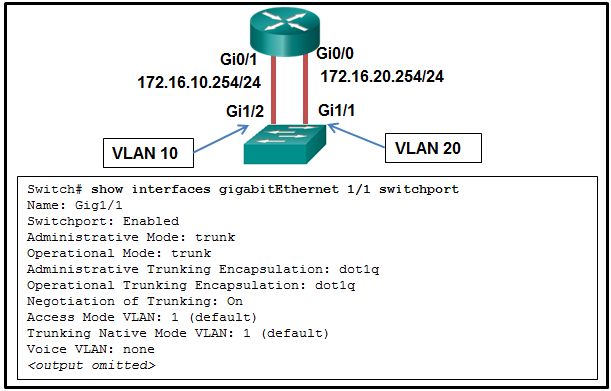

**Choices:**
- **A.** Gi1/1 is in the default VLAN.
- **B.** Voice VLAN is not assigned to Gi1/1.
- **C.** Gi1/1 is configured as trunk mode.
- **D.** Negotiation of trunking is turned on on Gi1/1.
- **E.** The trunking encapsulation protocol is configured wrong.

**Correct Answer:**
Gi1/1 is in the default VLAN.; Gi1/1 is configured as trunk mode.

**Explanation:**
Topic 4.4.4 With legacy inter-VLAN routing methods, the switch ports that connect to the router should be configured as access mode and be assigned appropriate VLANs. In this scenario, the Gi1/1 interface should be in access mode with VLAN 10 assigned. The other options are default settings on the switch and have no effect on legacy inter-VLAN routing.

---

## Question 43

**Question:**
Refer to the exhibit. A network administrator is verifying the configuration of inter-VLAN routing. Users complain that PC2 cannot communicate with PC1. Based on the output, what is the possible cause of the problem? CCNA2 v7 Modules 1 – 4 Switching Concepts, VLANs, and InterVLAN Routing Exam Answers 44

**Images:**
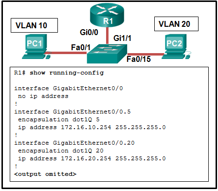

**Choices:**
- **A.** Gi0/0 is not configured as a trunk port.
- **B.** The command interface GigabitEthernet0/0.5 was entered incorrectly.
- **C.** There is no IP address configured on the interface Gi0/0.
- **D.** The no shutdown command is not entered on subinterfaces.
- **E.** The encapsulation dot1Q 5 command contains the wrong VLAN.

**Correct Answer:**
The encapsulation dot1Q 5 command contains the wrong VLAN.

**Explanation:**
Topic 4.4.6 In router-on-a-stick, the subinterface configuration should match the VLAN number in the encapsulation command, in this case, the command encapsulation dot1Q 10 should be used for VLAN 10. Since subinterfaces are used, there is no need to configure IP on the physical interface Gi0/0. The trunk mode is configured on the switch port that connects to the router. The subinterfaces are turned on when they are added.

---

## Question 44

**Question:**
Refer to the exhibit. A network administrator has configured router CiscoVille with the above commands to provide inter-VLAN routing. What type of port will be required on a switch that is connected to Gi0/0 on router CiscoVille to allow inter-VLAN routing?

**Images:**
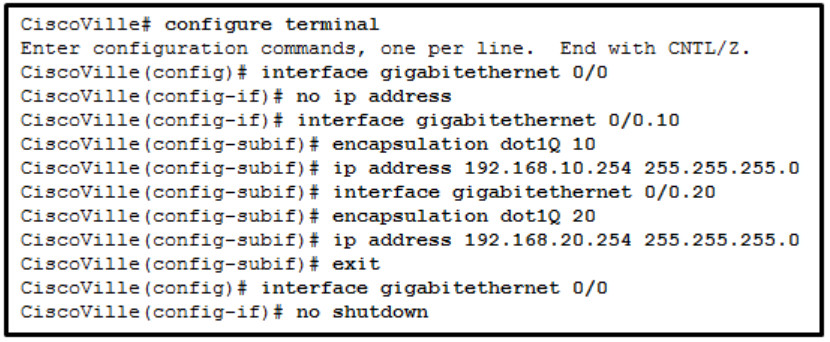

**Choices:**
- **A.** routed port
- **B.** access port
- **C.** trunk port
- **D.** SVI

**Correct Answer:**
trunk port

**Explanation:**
Topic 4.2.2 To allow a router-on-a-stick configuration to function, a switch must be connected to the router via a trunk port to carry the VLANs to be routed. An SVI would be used on a multilayer switch where the switch is performing inter-VLAN routing.

---

## Question 45

**Question:**
Refer to the exhibit. A network administrator is configuring RT1 for inter-VLAN routing. The switch is configured correctly and is functional. Host1, Host2, and Host3 cannot communicate with each other. Based on the router configuration, what is causing the problem? CCNA2 v7 Modules 1 – 4 Switching Concepts, VLANs, and InterVLAN Routing Exam Answers 46

**Images:**
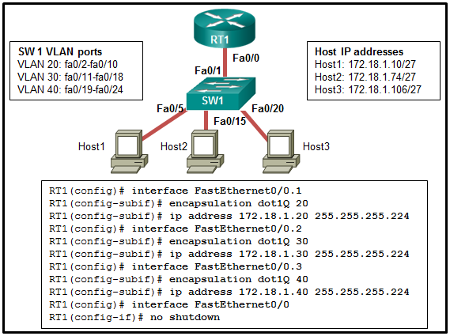

**Choices:**
- **A.** Interface Fa0/0 is missing IP address configuration information.
- **B.** IP addresses on the subinterfaces are incorrectly matched to the VLANs.
- **C.** Each subinterface of Fa0/0 needs separate no shutdown commands.
- **D.** Routers do not support 802.1Q encapsulation on subinterfaces.

**Correct Answer:**
IP addresses on the subinterfaces are incorrectly matched to the VLANs.

**Explanation:**
Topic 4.4.6 Since Host 1 (in VLAN 20) has the IP 172.18.1.10/27, the subinterface Fa0/0.1 should be configured with an IP address in the network 172.168.1.0/27. Similarly, Fa0/0.2 should be with an IP address in the network 172.168.1.64/27 and Fa0/0.3 should be with an IP address in the network 172.168.1.96/27.

---

## Question 46

**Question:**
Refer to the exhibit. A router-on-a-stick configuration was implemented for VLANs 15, 30, and 45, according to the show running-config command output. PCs on VLAN 45 that are using the 172.16.45.0 /24 network are having trouble connecting to PCs on VLAN 30 in the 172.16.30.0 /24 network. Which error is most likely causing this problem?​ CCNA2 v7 Modules 1 – 4 Switching Concepts, VLANs, and InterVLAN Routing Exam Answers 47

**Images:**

**Choices:**
- **A.** The wrong VLAN has been configured on GigabitEthernet 0/0.45.
- **B.** The command no shutdown is missing on GigabitEthernet 0/0.30.
- **C.** The GigabitEthernet 0/0 interface is missing an IP address.
- **D.** There is an incorrect IP address configured on GigabitEthernet 0/0.30.

**Correct Answer:**
There is an incorrect IP address configured on GigabitEthernet 0/0.30.

**Explanation:**
Topic 4.4.6 The subinterface GigabitEthernet 0/0.30 has an IP address that does not correspond to the VLAN addressing scheme. The physical interface GigabitEthernet 0/0 does not need an IP address for the subinterfaces to function. Subinterfaces do not require the no shutdown command.

---

## Question 47

**Question:**
What is a characteristic of a routed port on a Layer 3 switch?

**Choices:**
- **A.** It supports trunking.
- **B.** It is not assigned to a VLAN.
- **C.** It is commonly used as a WAN link.
- **D.** It cannot have an IP address assigned to it.

**Correct Answer:**
It is not assigned to a VLAN.

**Explanation:**
Topic 4.3.1 A routed port on a Layer 3 switch is commonly used for connecting between distribution and core layer switches or between a Layer 3 switch and a router. This port does not get VLAN or trunking commands assigned to it. Instead, the port is programmed with an IP address. This is commonly used when static routing is configured on the switch or when a routing protocol is being run between the Layer 3 switch and the router or another Layer 3 switch.

---

## Question 48

**Question:**
Refer to the exhibit. A network administrator needs to configure router-on-a-stick for the networks that are shown. How many subinterfaces will have to be created on the router if each VLAN that is shown is to be routed and each VLAN has its own subinterface? CCNA2 v7 Modules 1 – 4 Switching Concepts, VLANs, and InterVLAN Routing Exam Answers 49

**Images:**
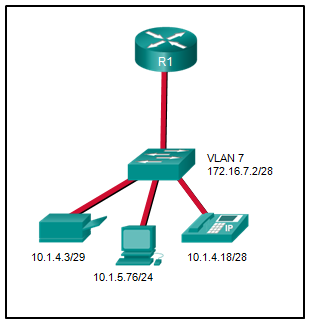

**Choices:**
- **A.** 1
- **B.** 2
- **C.** 3
- **D.** 4
- **E.** 5

**Correct Answer:**
4

**Explanation:**
Topic 4.2.4 Based on the IP addresses and masks given, the PC, printer, IP phone, and switch management VLAN are all on different VLANs. This situation will require four subinterfaces on the router.

---

## Question 49

**Question:**
A technician is configuring a new Cisco 2960 switch. What is the effect of issuing the BranchSw(config-if)# mdix auto command?

**Choices:**
- **A.** It automatically adjusts the port to allow device connections to use either a straight-through or a crossover cable.
- **B.** It applies an IPv4 address to the virtual interface.
- **C.** It applies an IPv6 address to the virtual interface.
- **D.** It permits an IPv6 address to be configured on a switch physical interface.
- **E.** It updates the MAC address table for the associated port.

**Correct Answer:**
It automatically adjusts the port to allow device connections to use either a straight-through or a crossover cable.

**Explanation:**
Topic 1.2.3 The mdix auto (Media Dependent Interface Crossover) command enables the automatic cable detection feature on the switch interface. When enabled, the switch automatically detects the required cable type (straight-through or crossover) for the connection and configures the interface copper pins internally to establish the link. This eliminates the need for physical cable swapping. For this feature to function properly, both the speed and duplex of the interface must be set to auto ( speed auto and duplex auto ).

---

## Question 50

**Question:**
A technician is configuring a new Cisco 2960 switch. What is the effect of issuing the BranchSw(config-if)# ip address 172.18.33.88 255.255.255.0 command?

**Choices:**
- **A.** It applies an IPv4 address to the virtual interface.
- **B.** It applies an IPv6 address to the virtual interface.
- **C.** It activates a virtual or physical switch interface.
- **D.** It permits an IPv6 address to be configured on a switch physical interface.
- **E.** It updates the MAC address table for the associated port.

**Correct Answer:**
It applies an IPv4 address to the virtual interface.

**Explanation:**
Topic 1.1.6 On a Layer 2 switch such as the Cisco 2960, physical ports do not support network layer IP addresses directly. In order to enable remote management (such as SSH or Telnet) and allow the switch to communicate over the network, an IP address must be assigned to a Switch Virtual Interface (SVI), which is a logical interface (typically interface vlan 1 by default). Therefore, when the technician issues this command within the appropriate virtual interface configuration mode, the direct effect is that it applies an IPv4 address to the virtual interface .

---

## Question 51

**Question:**
A technician is configuring a new Cisco 2960 switch. What is the effect of issuing the BranchSw# configure terminal command?

**Choices:**
- **A.** It enters the global configuration mode.
- **B.** It enters configuration mode for a switch virtual interface.
- **C.** It applies an IPv4 address to the virtual interface.
- **D.** It updates the MAC address table for the associated port.
- **E.** It permits an IPv6 address to be configured on a switch physical interface.

**Correct Answer:**
It enters the global configuration mode.

**Explanation:**
Topic 1.1.6 The configure terminal command is executed from the privileged EXEC mode (indicated by the # symbol in the prompt BranchSW# ) and is used to transition the device into global configuration mode . Once in this mode, the switch prompt changes to BranchSW(config)# , allowing the administrator to implement configuration changes that affect the entire device. Other options, such as saving the configuration ( copy running-config startup-config ) or disabling an interface ( shutdown ), require entirely different commands.

---

## Question 52

**Question:**
A technician is configuring a new Cisco 2960 switch. What is the effect of issuing the BranchSw# configure terminal command?

**Choices:**
- **A.** It enters the global configuration mode.
- **B.** It saves the running configuration to NVRAM.
- **C.** It disables a virtual or physical switch interface.
- **D.** It updates the MAC address table for the associated port.
- **E.** It saves the startup configuration to the running configuration.

**Correct Answer:**
It enters the global configuration mode.

**Explanation:**
Topic 1.1.6 The configure terminal command is executed from the privileged EXEC mode (indicated by the # symbol in the prompt BranchSW# ) and is used to transition the device into global configuration mode . Once in this mode, the switch prompt changes to BranchSW(config)# , allowing the administrator to implement configuration changes that affect the entire device. Other options, such as saving the configuration ( copy running-config startup-config ) or disabling an interface ( shutdown ), require entirely different commands.

---

## Question 53

**Question:**
A technician is configuring a new Cisco 2960 switch. What is the effect of issuing the BranchSw(config-if)# shutdown command?

**Choices:**
- **A.** It disables a virtual or physical switch interface.
- **B.** It saves the running configuration to NVRAM.
- **C.** It activates a virtual or physical switch interface.
- **D.** It updates the MAC address table for the associated port.
- **E.** It saves the startup configuration to the running configuration.

**Correct Answer:**
It disables a virtual or physical switch interface.

**Explanation:**
Topic 1.2.6 The shutdown command is used in Cisco IOS to administratively disable or turn off a specific interface. This applies to both physical interfaces (such as interface FastEthernet 0/1) and virtual / logical interfaces (such as an SVI like interface VLAN 10). When executed within the interface configuration mode (config-if), the interface immediately transitions to an “Administratively Down” state, completely halting all data traffic through it. To reverse this effect and re-enable the interface, the inverse command no shutdown must be used instead.

---

## Question 54

**Question:**
A technician is configuring a new Cisco 2960 switch. What is the effect of issuing the BranchSw(config-if)# shutdown command?

**Choices:**
- **A.** It disables a virtual or physical switch interface.
- **B.** It applies an IPv6 address to the virtual interface.
- **C.** It applies an IPv4 address to the virtual interface.
- **D.** It permits an IPv6 address to be configured on a switch physical interface.
- **E.** It updates the MAC address table for the associated port.

**Correct Answer:**
It disables a virtual or physical switch interface.

**Explanation:**
Topic 1.2.6 The shutdown command is used in Cisco IOS to administratively disable or turn off a specific interface. This applies to both physical interfaces (such as interface FastEthernet 0/1) and virtual / logical interfaces (such as an SVI like interface VLAN 10). When executed within the interface configuration mode (config-if), the interface immediately transitions to an “Administratively Down” state, completely halting all data traffic through it. To reverse this effect and re-enable the interface, the inverse command no shutdown must be used instead.

---

## Question 55

**Question:**
A technician is configuring a new Cisco 2960 switch. What is the effect of issuing the BranchSw(config-if)# ipv6 address 2001:db8:a2b4:88::1/64 command?

**Choices:**
- **A.** It applies an IPv6 address to the virtual interface.
- **B.** It activates a virtual or physical switch interface.
- **C.** It applies an IPv4 address to the virtual interface.
- **D.** It permits an IPv6 address to be configured on a switch physical interface.
- **E.** It updates the MAC address table for the associated port.

**Correct Answer:**
It applies an IPv6 address to the virtual interface.

**Explanation:**
Topic 1.1.6 On a Layer 2 switch like the Cisco Catalyst 2960, the physical ports (such as FastEthernet or GigabitEthernet ) operate strictly at the Data Link Layer (Layer 2). Therefore, you cannot directly assign a Layer 3 IP address (either IPv4 or IPv6) to a physical interface. In order for a Layer 2 switch to have IP connectivity — which is required for remote management via SSH, Telnet, or Web UI, as well as communicating with other network devices — the IP address must be assigned to a Switch Virtual Interface (SVI) , such as interface vlan 1. Consequently, when the technician executes this command within the interface configuration mode (config-if), they are configuring a logical/virtual interface, which successfully applies the global unicast IPv6 address to that specific SVI.

---

## Question 56

**Question:**
A technician is configuring a new Cisco 2960 switch. What is the effect of issuing the BranchSw(config-if)# exit command?

**Choices:**
- **A.** It returns to global configuration mode.
- **B.** It returns to privileged mode.
- **C.** It configures the default gateway for the switch.
- **D.** It enters user mode.
- **E.** It saves the startup configuration to the running configuration.

**Correct Answer:**
It returns to global configuration mode.

**Explanation:**
Topic 1.4.1 The Cisco IOS Command Line Interface (CLI) uses a strict hierarchical structure. When the prompt displays (config-if)# , it indicates that the technician is currently inside the interface configuration sub-mode . Issuing the exit command moves the user back exactly one level in the command hierarchy. As a result, the switch leaves the interface sub-mode and returns to global configuration mode , changing the CLI prompt back to branchSW(config)# .

---

## Question 57

**Question:**
A technician is configuring a new Cisco 2960 switch. What is the effect of issuing the BranchSw> enable command?

**Choices:**
- **A.** It enters privileged mode.
- **B.** It enters the global configuration mode.
- **C.** It enters configuration mode for a switch virtual interface.
- **D.** It updates the MAC address table for the associated port.
- **E.** It permits an IPv6 address to be configured on a switch physical interface.

**Correct Answer:**
It enters privileged mode.

**Explanation:**
Topic 1.1.6 The enable command is executed from the user EXEC mode (identified by the > symbol in the branchSW> prompt) and is used to transition the device into privileged EXEC mode . Once this command is entered, the switch prompt changes to branchSW# , granting the administrator access to higher-level monitoring and verification commands, as well as the ability to navigate into global configuration mode.

---

## Question 58

**Question:**
A technician is configuring a new Cisco 2960 switch. What is the effect of issuing the BranchSw(config-if)# duplex full command?

**Choices:**
- **A.** It allows data to flow in both directions at the same time on the interface.
- **B.** It allows data to flow in only one direction at a time on the interface
- **C.** It automatically adjusts the port to allow device connections to use either a straight-through or a crossover cable.
- **D.** It configures the switch as the default gateway.
- **E.** It encrypts user-mode passwords when users connect remotely.

**Correct Answer:**
It allows data to flow in both directions at the same time on the interface.

**Explanation:**
Topic 1.2.1 The duplex full command configures the switch interface to operate in full-duplex mode, enabling simultaneous two-way communication. This means that both the switch port and the connected device can transmit and receive data at the exact same time without causing any network collisions. In contrast, if the interface were configured with duplex half, data could only flow in one direction at a time, forcing devices to take turns transmitting and introducing the risk of collisions. Implementing Full-Duplex maximizes bandwidth efficiency and significantly improves network performance on the link.

---

## Question 59

**Question:**
What type of VLAN should not carry voice and network management traffic?

**Choices:**
- **A.** data VLAN
- **B.** voice VLAN
- **C.** management VLAN
- **D.** security VLAN

**Correct Answer:**
data VLAN

**Explanation:**
Topic 3.1.3 A data VLAN , also referred to as a user VLAN, is specifically designed to carry user-generated network traffic such as web browsing, emails, or file transfers. For both security and performance reasons, network design best practices dictate that a data VLAN should not carry high-priority voice traffic (VoIP) or critical network management traffic (such as SSH, Telnet, or SNMP). Separating these distinct types of traffic into dedicated VLANs ensures that regular user data congestion does not negatively impact essential network services or infrastructure management.

---

## Question 60

**Question:**
What type of VLAN is designed to reserve bandwidth to ensure IP Phone quality?

**Choices:**
- **A.** voice VLAN
- **B.** trunk VLAN
- **C.** security VLAN
- **D.** management VLAN

**Correct Answer:**
voice VLAN

**Explanation:**
Topic 3.2.6 A voice VLAN is specifically designed and configured to carry Voice over IP (VoIP) traffic from IP phones. Because voice communications are highly sensitive to network delay and jitter, a voice VLAN allows the implementation of Quality of Service (QoS) and traffic prioritization policies. This mechanism reserves the required network bandwidth to ensure crystal-clear and uninterrupted phone conversations by isolating critical voice streams from regular, lower-priority data traffic.

---

## Question 61

**Question:**
What type of VLAN is initially the management VLAN?

**Choices:**
- **A.** default VLAN
- **B.** native VLAN
- **C.** data VLAN
- **D.** management VLAN

**Correct Answer:**
default VLAN

**Explanation:**
Topic 3.1.3 In the out-of-the-box factory configuration of a Cisco switch, the default VLAN (VLAN 1) serves multiple foundational roles: it is the default data VLAN, the default native VLAN, and also the initial management VLAN . This means that before any custom configuration is applied, the switch’s virtual interface ( interface vlan 1 ) is the active logical interface used to assign an IP address for remote management. However, due to security best practices, it is highly recommended to change the management VLAN to a unique, dedicated VLAN separate from VLAN 1.

---

## Question 62

**Question:**
What type of VLAN is designed to have a delay of less than 150 ms across the network?

**Choices:**
- **A.** voice VLAN
- **B.** desirable VLAN
- **C.** trunk VLAN
- **D.** security VLAN

**Correct Answer:**
voice VLAN

**Explanation:**
Topic 3.1.3 A voice VLAN is explicitly designed to carry Voice over IP (VoIP) traffic. Because real-time voice communications are highly sensitive to network delay and jitter, industry standards (including Cisco guidelines) state that the one-way target delay across the network should not exceed 150 ms . To satisfy this stringent requirement, switches segment voice streams into a dedicated VLAN where Quality of Service (QoS) policies can be enforced to prioritize voice packets over regular data traffic.

---

## Question 63

**Question:**
What type of VLAN is used to separate the network into groups of users or devices?

**Choices:**
- **A.** data VLAN
- **B.** management VLAN
- **C.** voice VLAN
- **D.** native VLAN

**Correct Answer:**
data VLAN

**Explanation:**
Topic 3.1.3 A data VLAN , also referred to as a user VLAN, is specifically designed and configured to carry user-generated network traffic (such as web browsing, emails, or file transfers). The primary purpose of a data VLAN is to separate the network into logical groups of users or devices based on their roles or functions. This practice ensures that regular user data traffic is isolated from critical network management traffic and high-priority voice (VoIP) traffic.

---

## Question 64

**Question:**
What type of VLAN is configured specifically for network traffic such as SSH, Telnet, HTTPS, HTTP, and SNMP?

**Choices:**
- **A.** management VLAN
- **B.** security VLAN
- **C.** trunk VLAN
- **D.** voice VLAN

**Correct Answer:**
management VLAN

**Explanation:**
Topic 3.1.3 A management VLAN is any VLAN that is configured to provide remote management access to a switch. Network management traffic such as SSH, Telnet, HTTPS, HTTP, and SNMP is specifically assigned to this VLAN to ensure that IT personnel can securely configure, monitor, and troubleshoot network devices. This isolates critical infrastructure management traffic from regular user data traffic. By default, Cisco switches use VLAN 1 as the initial management VLAN, although security best practices dictate changing this to a unique, dedicated VLAN.

---

## Question 65

**Question:**
What type of VLAN supports untagged traffic?

**Choices:**
- **A.** native VLAN
- **B.** voice VLAN
- **C.** security VLAN
- **D.** management VLAN

**Correct Answer:**
native VLAN

**Explanation:**
Topic 3.2.5 On a switched network utilizing the IEEE 802.1Q encapsulation standard for trunk links, all data frames are normally tagged with a specific VLAN ID to identify their network of origin. The only exception to this rule is the native VLAN . Traffic belonging to the native VLAN is transmitted across the trunk link completely untagged . When the switch on the receiving end of the trunk encounters an untagged frame, it automatically associates it with its locally configured native VLAN.

---

## Question 66

**Question:**
What type of VLAN supports untagged traffic?

**Choices:**
- **A.** native VLAN
- **B.** desirable VLAN
- **C.** trunk VLAN
- **D.** security VLAN

**Correct Answer:**
native VLAN

**Explanation:**
Topic 3.2.5 On a switched network utilizing the IEEE 802.1Q encapsulation standard for trunk links, all data frames are normally tagged with a specific VLAN ID to identify their network of origin. The only exception to this rule is the native VLAN . Traffic belonging to the native VLAN is transmitted across the trunk link completely untagged . When the switch on the receiving end of the trunk encounters an untagged frame, it automatically associates it with its locally configured native VLAN.

---

## Question 67

**Question:**
Refer to the exhibit. A network administrator has configured R1 as shown. When the administrator checks the status of the serial interface, the interface is shown as being administratively down. What additional command must be entered on the serial interface of R1 to bring the interface up? CCNA2 v7 Modules 1 – 4 Switching Concepts, VLANs, and InterVLAN Routing Exam Answers 70

**Images:**
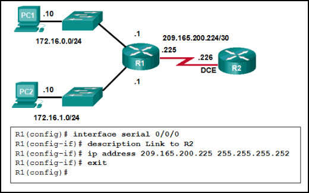

**Choices:**
- **A.** IPv6 enable
- **B.** clockrate 128000
- **C.** end
- **D.** no shutdown

**Correct Answer:**
no shutdown

**Explanation:**
Topic 1.4.4 By default all router interfaces are shut down. To bring the interfaces up, an administrator must issue the no shutdown command in interface mode.

---

## Question 68

**Question:**
Refer to the exhibit. The network administrator wants to configure Switch1 to allow SSH connections and prohibit Telnet connections. How should the network administrator change the displayed configuration to satisfy the requirement? CCNA2 v7 Modules 1 – 4 Switching Concepts, VLANs, and InterVLAN Routing Exam Answers 71

**Images:**
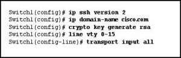

**Choices:**
- **A.** Use SSH version 1.
- **B.** Reconfigure the RSA key.
- **C.** Configure SSH on a different line.
- **D.** Modify the transport input command.

**Correct Answer:**
Modify the transport input command.

**Explanation:**
Topic 1.3.4 To restrict remote management access exclusively to SSH and block unencrypted Telnet traffic on the virtual terminal lines (vty), the command transport input ssh must be applied under the line configuration mode. In the exhibit, the current configuration shows transport input all , which accepts all incoming connection protocols (including both Telnet and SSH). Therefore, the network administrator needs to modify the transport input command to specify only ssh , forcing the switch to drop any Telnet connection attempts while keeping SSH active.

---

## Question 69

**Question:**
Which solution would help a college alleviate network congestion due to collisions?

**Choices:**
- **A.** a firewall that connects to two Internet providers
- **B.** a high port density switch
- **C.** a router with two Ethernet ports
- **D.** a router with three Ethernet ports

**Correct Answer:**
a high port density switch

**Explanation:**
Topic 2.2.3 Switches provide microsegmentation so that one device does not compete for the same Ethernet network bandwidth with another network device, thus practically eliminating collisions. A high port density switch provides very fast connectivity for many devices.

---

## Question 70

**Question:**
Which two statements are correct with respect to SVI inter-VLAN routing? (Choose two.)

**Choices:**
- **A.** Switching packets is faster with SVI.
- **B.** There is no need for a connection to a router.
- **C.** Virtual interfaces support subinterfaces.
- **D.** SVIs can be bundled into EtherChannels.
- **E.** SVIs eliminate the need for a default gateway in the hosts.

**Correct Answer:**
Switching packets is faster with SVI.; There is no need for a connection to a router.

**Explanation:**
Topic 4.1.4 The SVI inter-VLAN routing method is faster than other methods. The switch can route the existing VLANs without the need for a router.

---

## Question 71

**Question:**
Refer to the exhibit. A network administrator is configuring inter-VLAN routing on a network. For now, only one VLAN is being used, but more will be added soon. What is the missing parameter that is shown as the highlighted question mark in the graphic? CCNA2 v7 Modules 1 – 4 Switching Concepts, VLANs, and InterVLAN Routing Exam Answers 74

**Images:**
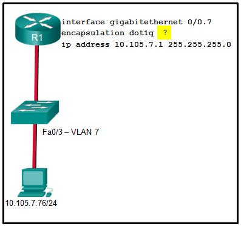

**Choices:**
- **A.** It identifies the subinterface.
- **B.** It identifies the VLAN number.
- **C.** It identifies the native VLAN number.
- **D.** It identifies the type of encapsulation that is used.
- **E.** It identifies the number of hosts that are allowed on the interface.

**Correct Answer:**
It identifies the VLAN number.

**Explanation:**
Topic 4.2.4 The completed command would be encapsulation dot1q 7 . The encapsulation dot1q part of the command enables trunking and identifies the type of trunking to use. The 7 identifies the VLAN number.

---

## Question 72

**Question:**
Which type of VLAN is used to designate which traffic is untagged when crossing a trunk port?

**Choices:**
- **A.** data
- **B.** default
- **C.** native
- **D.** management

**Correct Answer:**
native

**Explanation:**
Topic 3.2.5 A native VLAN is the VLAN that does not receive a VLAN tag in the IEEE 802.1Q frame header. Cisco best practices recommend the use of an unused VLAN (not a data VLAN, the default VLAN of VLAN 1, or the management VLAN) as the native VLAN whenever possible.

---

## Question 73

**Question:**
A network administrator issues the show vlan brief command while troubleshooting a user support ticket. What output will be displayed?

**Choices:**
- **A.** the VLAN assignment and membership for device MAC addresses
- **B.** the VLAN assignment and membership for all switch ports
- **C.** the VLAN assignment and trunking encapsulation
- **D.** the VLAN assignment and native VLAN

**Correct Answer:**
the VLAN assignment and membership for all switch ports

**Explanation:**
Topic 3.3.8 The show vlan brief command will provide information displaying the VLAN assignment and membership for all switch ports on a switch.

---

## Question 74

**Question:**
Open the PT Activity. Perform the tasks in the activity instructions and then answer the question. Modules 1 - 4 Switching Concepts, VLANs, and InterVLAN Routing 1 file(s) 287.41 KB Download Which message is displayed when 10.10.10.1 is entered into the PC1 Web Browser address bar?

**Images:**
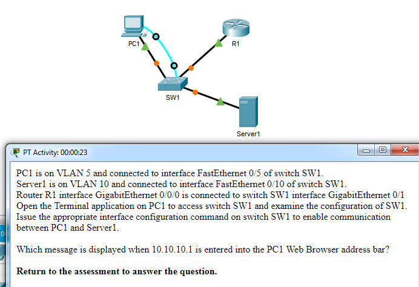

**Choices:**
- **A.** Local Server
- **B.** Test Server
- **C.** File Server
- **D.** Cisco Server

**Correct Answer:**
File Server

**Explanation:**
Topic 4.2.2 Examining the configuration of switch SW1 shows that interface Gi0/1 is not configured as a trunk. Issuing the interface configuration command switchport mode trunk on this interface will enable communications between PC1 and Server1.

---

## Question 75

**Question:**
Match each DHCP message type with its description. (Not all options are used.) CCNA 2 v7 Modules 1 – 4: Switching Concepts, VLANs, and InterVLAN Routing Exam Answers

**Images:**
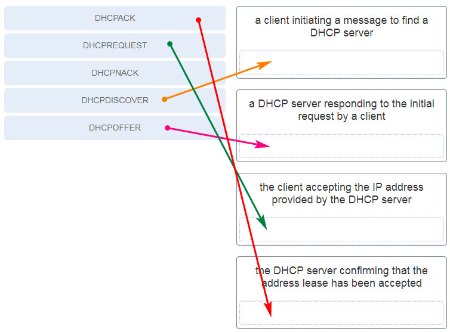

**Explanation:**
Topic 7.1.2 Place the options in the following order: a client initiating a message to find a DHCP server – DHCPDISCOVER a DHCP server responding to the initial request by a client – DHCPOFFER the client accepting the IP address provided by the DHCP server – DHCPREQUEST the DHCP server confirming that the lease has been accepted – DHCPACK

---

## Question 76

**Question:**
What type of VLAN is configured specifically for network traffic such as SSH, Telnet, HTTPS, HHTP, and SNMP?

**Choices:**
- **A.** voice VLAN
- **B.** management VLAN
- **C.** native VLAN
- **D.** security VLAN

**Correct Answer:**
management VLAN

**Explanation:**
Topic 3.1.3

---
