# CCNA 2 - Modules 5 - 6 Redundant Networks Exam Answers

## Question 1

**Question:**
What additional information is contained in the 12-bit extended system ID of a BPDU?

**Choices:**
- **A.** MAC address
- **B.** VLAN ID
- **C.** IP address
- **D.** port ID

**Correct Answer:**
VLAN ID

**Explanation:**
Topic 5.2.1

---

## Question 2

**Question:**
During the implementation of Spanning Tree Protocol, all switches are rebooted by the network administrator. What is the first step of the spanning-tree election process?

**Choices:**
- **A.** Each switch with a lower root ID than its neighbor will not send BPDUs.
- **B.** All the switches send out BPDUs advertising themselves as the root bridge.
- **C.** Each switch determines the best path to forward traffic.
- **D.** Each switch determines what port to block to prevent a loop from occurring.

**Correct Answer:**
All the switches send out BPDUs advertising themselves as the root bridge.

**Explanation:**
Topic 5.2.2

---

## Question 3

**Question:**
Which STP port role is adopted by a switch port if there is no other port with a lower cost to the root bridge?

**Choices:**
- **A.** designated port
- **B.** root port
- **C.** alternate
- **D.** disabled port

**Correct Answer:**
root port

**Explanation:**
Topic 5.2.5 The root port is the port with the lowest cost to reach the root bridge.

---

## Question 4

**Question:**
Which two concepts relate to a switch port that is intended to have only end devices attached and intended never to be used to connect to another switch? (Choose two.)

**Choices:**
- **A.** bridge ID
- **B.** edge port
- **C.** extended system ID
- **D.** PortFast
- **E.** PVST+

**Correct Answer:**
edge port; PortFast

**Explanation:**
Topic 5.3.4

---

## Question 5

**Question:**
Which three components are combined to form a bridge ID?

**Choices:**
- **A.** extended system ID
- **B.** cost
- **C.** IP address
- **D.** bridge priority
- **E.** MAC address
- **F.** port ID

**Correct Answer:**
extended system ID; bridge priority; MAC address

**Explanation:**
Topic 5.2.1 The three components that are combined to form a bridge ID are bridge priority, extended system ID, and MAC address.

---

## Question 6

**Question:**
Match the STP protocol with the correct description. (Not all options are used.)

**Images:**
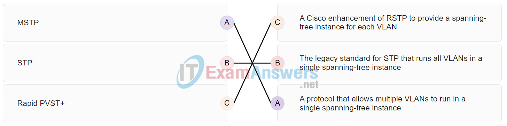
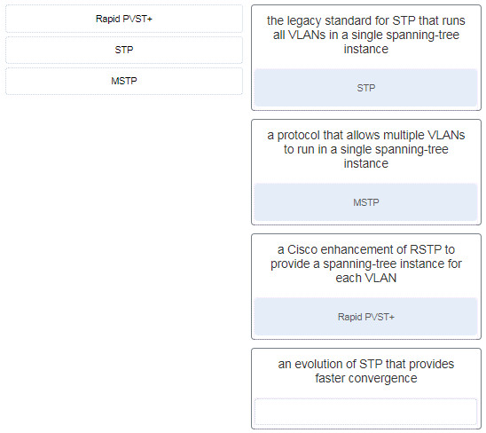

**Explanation:**
Topic 5.3.1

---

## Question 7

**Question:**
In which two port states does a switch learn MAC addresses and process BPDUs in a PVST network? (Choose two.)

**Choices:**
- **A.** disabled
- **B.** forwarding
- **C.** listening
- **D.** blocking
- **E.** learning

**Correct Answer:**
forwarding; learning

**Explanation:**
Topic 5.2.9 Switches learn MAC addresses at the learning and forwarding port states. They receive and process BPDUs at the blocking, listening, learning, and forwarding port states.

---

## Question 8

**Question:**
If no bridge priority is configured in PVST, which criteria is considered when electing the root bridge?

**Choices:**
- **A.** lowest MAC address
- **B.** lowest IP address
- **C.** highest IP address
- **D.** highest MAC address

**Correct Answer:**
lowest MAC address

**Explanation:**
Topic 5.2.3 Only one switch can be the root bridge for a VLAN. The root bridge is the switch with the lowest BID. The BID is determined by priority and the MAC address. If no priority is configured then all switches use the default priority and the election of the root bridge will be based on the lowest MAC address.

---

## Question 9

**Question:**
Match the spanning-tree feature with the protocol type. (Not all options are used.) Place the options in the following order: RSTP Cisco implementation of IEEE 802.1D MSTP Fast converging enhancement of IEEE 802.1D MST IEEE standard that reduces the number of STP instances PVST+ Proprietary per VLAN implementation of IEEE 802.1w

**Images:**

**Explanation:**
Topic 5.3.1

---

## Question 10

**Question:**
When the show spanning-tree vlan 33 command is issued on a switch, three ports are shown in the forwarding state. In which two port roles could these interfaces function while in the forwarding state? (Choose two.)

**Choices:**
- **A.** alternate
- **B.** designated
- **C.** disabled
- **D.** blocked
- **E.** root

**Correct Answer:**
designated; root

**Explanation:**
Topic 5.2.9 The role of each of the three ports will be either designated port or root port. Ports in the disabled state are administratively disabled. Ports in the blocking state are alternate ports.

---

## Question 11

**Question:**
What is the function of STP in a scalable network?

**Choices:**
- **A.** It decreases the size of the failure domain to contain the impact of failures.
- **B.** It protects the edge of the enterprise network from malicious activity.
- **C.** It combines multiple switch trunk links to act as one logical link for increased bandwidth.
- **D.** It disables redundant paths to eliminate Layer 2 loops.

**Correct Answer:**
It disables redundant paths to eliminate Layer 2 loops.

**Explanation:**
Topic 5.1.2 STP is an important component in a scalable network because it allows redundant physical connections between Layer 2 devices to be implemented without creating Layer 2 loops. STP prevents Layer 2 loops from forming by disabling interfaces on Layer 2 devices when they would create a loop.

---

## Question 12

**Question:**
What is a characteristic of spanning tree?

**Choices:**
- **A.** It is enabled by default on Cisco switches.
- **B.** It is used to discover information about an adjacent Cisco device.
- **C.** It has a TTL mechanism that works at Layer 2.
- **D.** It prevents propagation of Layer 2 broadcast frames.

**Correct Answer:**
It is enabled by default on Cisco switches.

**Explanation:**
Topic 5.3.1 Spanning tree does work at Layer 2 on Ethernet-based networks and is enabled by default, but it does not have a TTL mechanism. Spanning tree exists because Layer 2 frames do not have a TTL mechanism. Layer 2 frames are still broadcast when spanning tree is enabled, but the frames can only be transmitted through a single path through the Layer 2 network that was created by spanning tree. Cisco Discovery Protocol (CDP) is used to discover information about an adjacent Cisco device.

---

## Question 13

**Question:**
Which spanning tree standard supports only one root bridge so that traffic from all VLANs flows over the same path?

**Choices:**
- **A.** PVST+
- **B.** 802.1D
- **C.** MST
- **D.** Rapid PVST

**Correct Answer:**
802.1D

**Explanation:**
Topic 5.3.1 MST is the Cisco implementation of MSTP, an IEEE standard protocol that provides up to 16 instances of RSTP. PVST+ provides a separate 802.1D spanning-tree instance for each VLAN that is configured in the network. 802.1D is the original STP standard defined by the IEEE and allows for only one root bridge for all VLANs. 802.1w, or RSTP, provides faster convergence but still uses only one STP instance for all VLANs.

---

## Question 14

**Question:**
What is the purpose of the Spanning Tree Protocol (STP)?

**Choices:**
- **A.** creates smaller collision domains
- **B.** prevents routing loops on a router
- **C.** prevents Layer 2 loops
- **D.** allows Cisco devices to exchange routing table updates
- **E.** creates smaller broadcast domains

**Correct Answer:**
prevents Layer 2 loops

**Explanation:**
Topic 5.1.2 The Spanning-Tree Protocol (STP) creates one path through a switch network in order to prevent Layer 2 loops.

---

## Question 15

**Question:**
What is the value used to determine which port on a non-root bridge will become a root port in a STP network?

**Choices:**
- **A.** the path cost
- **B.** the highest MAC address of all the ports in the switch
- **C.** the lowest MAC address of all the ports in the switch
- **D.** the VTP revision number

**Correct Answer:**
the path cost

**Explanation:**
Topic 5.2.5 STP establishes one root port on each non-root bridge. The root port is the lowest-cost path from the non-root bridge to the root bridge, indicating the direction of the best path to the root bridge. This is primarily based on the path cost to the root bridge.

---

## Question 16

**Question:**
Refer to the exhibit. Which switch will be the root bridge after the election process is complete?

**Images:**
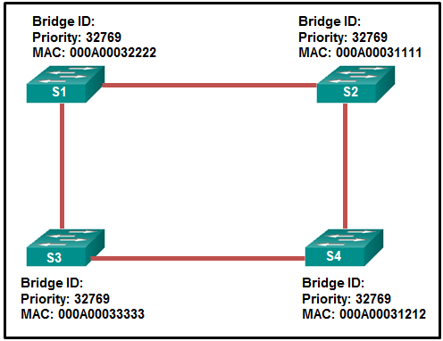

**Choices:**
- **A.** S1
- **B.** S2
- **C.** S3
- **D.** S4

**Correct Answer:**
S2

**Explanation:**
Topic 5.2.2 The root bridge is determined by the lowest bridge ID, which consists of the priority value and the MAC address. Because the priority values of all of the switches are identical, the MAC address is used to determine the root bridge. Because S2 has the lowest MAC address, S2 becomes the root bridge.

---

## Question 17

**Question:**
What are two drawbacks to turning spanning tree off and having multiple paths through the Layer 2 switch network? (Choose two.)

**Choices:**
- **A.** The MAC address table becomes unstable.
- **B.** The switch acts like a hub.
- **C.** Port security becomes unstable.
- **D.** Broadcast frames are transmitted indefinitely.
- **E.** Port security shuts down all of the ports that have attached devices.

**Correct Answer:**
The MAC address table becomes unstable.; Broadcast frames are transmitted indefinitely.

**Explanation:**
Topic 5.1.4 Spanning tree should never be disabled. Without it, the MAC address table becomes unstable, broadcast storms can render network clients and the switches unusable, and multiple copies of unicast frames can be delivered to the end devices.

---

## Question 18

**Question:**
A small company network has six interconnected Layer 2 switches. Currently all switches are using the default bridge priority value. Which value can be used to configure the bridge priority of one of the switches to ensure that it becomes the root bridge in this design?

**Choices:**
- **A.** 1
- **B.** 28672
- **C.** 32768
- **D.** 34816
- **E.** 61440

**Correct Answer:**
28672

**Explanation:**
Topic 5.2.1 The default bridge priority value for all Cisco switches is 32768. The range is 0 to 61440 in increments of 4096. Thus, the values 1 and 34816 are invalid. Configuring one switch with the lower value of 28672 (and leaving the bridge priority value of all other switches unchanged) will make the switch become the root bridge.

---

## Question 19

**Question:**
Refer to the exhibit. The administrator tried to create an EtherChannel between S1 and the other two switches via the commands that are shown, but was unsuccessful. What is the problem?

**Images:**
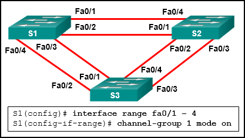

**Choices:**
- **A.** Traffic cannot be sent to two different switches through the same EtherChannel link.
- **B.** Traffic cannot be sent to two different switches, but only to two different devices like an EtherChannel-enabled server and a switch.​
- **C.** Traffic can only be sent to two different switches if EtherChannel is implemented on Gigabit Ethernet interfaces.​
- **D.** Traffic can only be sent to two different switches if EtherChannel is implemented on Layer 3 switches.​

**Correct Answer:**
Traffic cannot be sent to two different switches through the same EtherChannel link.

**Explanation:**
Topic 6.1.4 An EtherChannel link can only be created between two switches or between an EtherChannel-enabled server and a switch. Traffic cannot be sent to two different switches through the same EtherChannel link.

---

## Question 20

**Question:**
Which statement is true regarding the use of PAgP to create EtherChannels?

**Choices:**
- **A.** It requires full duplex.
- **B.** It increases the number of ports that are participating in spanning tree.
- **C.** It requires more physical links than LACP does.
- **D.** It mandates that an even number of ports (2, 4, 6, etc.) be used for aggregation.
- **E.** It is Cisco proprietary.

**Correct Answer:**
It is Cisco proprietary.

**Explanation:**
Topic 6.1.6 PAgP is used to automatically aggregate multiple ports into an EtherChannel bundle, but it only works between Cisco devices. LACP can be used for the same purpose between Cisco and non-Cisco devices. PAgP must have the same duplex mode at both ends and can use two ports or more. The number of ports depends on the switch platform or module. An EtherChannel aggregated link is seen as one port by the spanning-tree algorithm.

---

## Question 21

**Question:**
What are two requirements to be able to configure an EtherChannel between two switches? (Choose two.)

**Choices:**
- **A.** All the interfaces need to work at the same speed.
- **B.** All interfaces need to be assigned to different VLANs.
- **C.** Different allowed ranges of VLANs must exist on each end.
- **D.** All the interfaces need to be working in the same duplex mode.
- **E.** The interfaces that are involved need to be contiguous on the switch.

**Correct Answer:**
All the interfaces need to work at the same speed.; All the interfaces need to be working in the same duplex mode.

**Explanation:**
Topic 6.2.1 All interfaces in the EtherChannel bundle must be assigned to the same VLAN or be configured as a trunk. If the allowed range of VLANs is not the same, the interfaces do not form an EtherChannel even when set to auto or desirable mode.

---

## Question 22

**Question:**
Refer to the exhibit. On the basis of the output that is shown, what can be determined about the EtherChannel bundle? CCNA-2-v7-Modules 5 – 6 Redundant Networks Exam 22

**Images:**
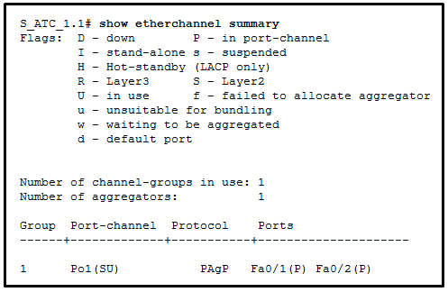

**Choices:**
- **A.** The EtherChannel bundle is down.
- **B.** Two Gigabit Ethernet ports are used to form the EtherChannel.
- **C.** A Cisco proprietary protocol was used to negotiate the EtherChannel link.
- **D.** The EtherChannel bundle is operating at both Layer 2 and Layer 3.

**Correct Answer:**
A Cisco proprietary protocol was used to negotiate the EtherChannel link.

**Explanation:**
Topic 6.1.6 Two protocols can be used to send negotiation frames that are used to try to establish an EtherChannel link: PAgP and LACP. PAgP is Cisco proprietary, and LACP adheres to the industry standard.

---

## Question 23

**Question:**
Which two parameters must match on the ports of two switches to create a PAgP EtherChannel between the switches? (Choose two.)

**Choices:**
- **A.** port ID
- **B.** PAgP mode
- **C.** MAC address
- **D.** speed
- **E.** VLAN information

**Correct Answer:**
speed; VLAN information

**Explanation:**
Topic 6.1.6 For an EtherChannel to be created, the ports that are concerned on the two switches must match in terms of the speed, duplex, and VLAN information. The PAgP mode must be compatible but not necessarily equal. The port ID and the MAC addresses do not have to match.

---

## Question 24

**Question:**
Refer to the exhibit. A network administrator is configuring an EtherChannel link between two switches, SW1 and SW2. Which statement describes the effect after the commands are issued on SW1 and SW2? CCNA-2-v7-Modules 5 – 6 Redundant Networks Exam 24

**Images:**
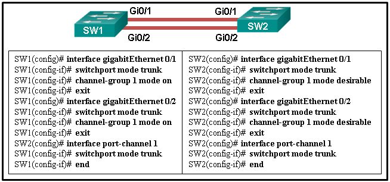

**Choices:**
- **A.** The EtherChannel is established after SW2 initiates the link request.
- **B.** The EtherChannel is established after SW1 initiates the link request.
- **C.** The EtherChannel is established without negotiation.
- **D.** The EtherChannel fails to establish.

**Correct Answer:**
The EtherChannel fails to establish.

**Explanation:**
Topic 6.1.7 The interfaces GigabitEthernet 0/1 and GigabitEthernet 0/2 are configured “on” for the EtherChannel link. This mode forces the interface to channel without PAgP or LACP. The EtherChannel will be established only if the other side is also set to “on”. However, the mode on SW2 side is set to PAgP desirable. Thus the EtherChannel link will not be established.

---

## Question 25

**Question:**
Refer to the exhibit. A network administrator is configuring an EtherChannel link between two switches, SW1 and SW2. However, the EtherChannel link fails to establish. What change in configuration would correct the problem? CCNA-2-v7-Modules 5 – 6 Redundant Networks Exam 25

**Images:**
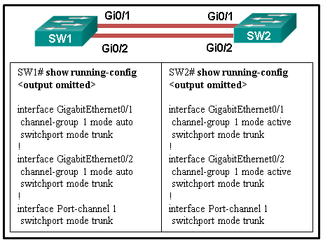

**Choices:**
- **A.** Configure SW2 EtherChannel mode to desirable.
- **B.** Configure SW2 EtherChannel mode to on.
- **C.** Configure SW1 EtherChannel mode to on.
- **D.** Configure SW2 EtherChannel mode to auto.

**Correct Answer:**
Configure SW2 EtherChannel mode to desirable.

**Explanation:**
Topic 6.1.7 The EtherChannel mode must be compatible on each side for the link to work. The three modes from PAgP protocol are on, desirable, and auto. The three modes from LACP protocol are on, active, and passive. The compatible modes include on-on, auto-desirable, desirable-desirable, active-passive, and active-active. Any other combinations will not form an EtherChannel link.

---

## Question 26

**Question:**
A network administrator configured an EtherChannel link with three interfaces between two switches. What is the result if one of the three interfaces is down?

**Choices:**
- **A.** The remaining two interfaces continue to load balance traffic.
- **B.** The remaining two interfaces become separate links between the two switches.
- **C.** One interface becomes an active link for data traffic and the other becomes a backup link.
- **D.** The EtherChannel fails.

**Correct Answer:**
The remaining two interfaces continue to load balance traffic.

**Explanation:**
Topic 6.1.3 EtherChannel creates an aggregation that is seen as one logical link. It provides redundancy because the overall link is one logical connection. The loss of one physical link within the channel does not create a change in the topology; the EtherChannel remains functional.

---

## Question 27

**Question:**
A network administrator is configuring an EtherChannel link between switches SW1 and SW2 by using the command SW1(config-if-range)# channel-group 1 mode auto. Which command must be used on SW2 to enable this EtherChannel?

**Choices:**
- **A.** SW2(config-if-range)# channel-group 1 mode passive
- **B.** SW2(config-if-range)# channel-group 1 mode desirable
- **C.** SW2(config-if-range)# channel-group 1 mode on
- **D.** SW2(config-if-range)# channel-group 1 mode active

**Correct Answer:**
SW2(config-if-range)# channel-group 1 mode desirable

**Explanation:**
Topic 6.1.6 The possible combinations to establish an EtherChannel between SW1 and SW2 using LACP or PAgP are as follows: PAgP on on auto desirable desirable desirable LACP on on active active passive active The EtherChannel mode chosen on each side of the EtherChannel must be compatible in order to enable it.

---

## Question 28

**Question:**
Which technology is an open protocol standard that allows switches to automatically bundle physical ports into a single logical link?

**Choices:**
- **A.** PAgP
- **B.** LACP
- **C.** Multilink PPP
- **D.** DTP

**Correct Answer:**
LACP

**Explanation:**
Topic 6.1.8 LACP, or Link Aggregation Control Protocol, is defined by IEEE 802.3ad and is an open standard protocol. LACP allows switches to automatically bundle switch ports into a single logical link to increase bandwidth. PAgP, or Port Aggregation Protocol, performs a similar function, but it is a Cisco proprietary protocol. DTP is Dynamic Trunking Protocol and is used to automatically and dynamically build trunks between switches. Multilink PPP is used to load-balance PPP traffic across multiple serial interfaces.

---

## Question 29

**Question:**
What is a requirement to configure a trunking EtherChannel between two switches?

**Choices:**
- **A.** The allowed range of VLANs must be the same on both switches.
- **B.** The participating interfaces must be assigned the same VLAN number on both switches.
- **C.** The participating interfaces must be physically contiguous on a switch.
- **D.** The participating interfaces must be on the same module on a switch.

**Correct Answer:**
The allowed range of VLANs must be the same on both switches.

**Explanation:**
Topic 6.2.1 To enable a trunking EtherChannel successfully, the range of VLANs allowed on all the interfaces must match; otherwise, the EtherChannel cannot be formed. The interfaces involved in an EtherChannel do not have to be physically contiguous, or on the same module. Because the EtherChannel is a trunking one, participating interfaces are configured as trunk mode, not access mode.

---

## Question 30

**Question:**
What are two advantages of using LACP? (Choose two.)

**Choices:**
- **A.** It allows directly connected switches to negotiate an EtherChannel link.
- **B.** It eliminates the need for configuring trunk interfaces when deploying VLANs on multiple switches.
- **C.** It decreases the amount of configuration that is needed on a switch.
- **D.** It provides a simulated environment for testing link aggregation.
- **E.** It allows the use of multivendor devices.
- **F.** LACP allows Fast Ethernet and Gigabit Ethernet interfaces to be mixed within a single EtherChannel.

**Correct Answer:**
It allows directly connected switches to negotiate an EtherChannel link.; It allows the use of multivendor devices.

**Explanation:**
Topic 6.1.8 The Link Aggregation Control Protocol (LACP) allows directly connected multivendor switches to negotiate an EtherChannel link. LACP helps create the EtherChannel link by detecting the configuration of each side and making sure that they are compatible so that the EtherChannel link can be enabled when needed.

---

## Question 31

**Question:**
A switch is configured to run STP. What term describes a non-root port that is permitted to forward traffic on the network?

**Choices:**
- **A.** root port
- **B.** designated port
- **C.** alternate port
- **D.** disabled

**Correct Answer:**
designated port

**Explanation:**
Topic 5.2.6

---

## Question 32

**Question:**
What are two advantages of EtherChannel? (Choose two.)

**Choices:**
- **A.** Spanning Tree Protocol views the physical links in an EtherChannel as one logical connection.
- **B.** Load balancing occurs between links configured as different EtherChannels.
- **C.** Configuring the EtherChannel interface provides consistency in the configuration of the physical links.
- **D.** Spanning Tree Protocol ensures redundancy by transitioning failed interfaces in an EtherChannel to a forwarding state.
- **E.** EtherChannel uses upgraded physical links to provide increased bandwidth.

**Correct Answer:**
Spanning Tree Protocol views the physical links in an EtherChannel as one logical connection.; Configuring the EtherChannel interface provides consistency in the configuration of the physical links.

**Explanation:**
Topic 6.1.3 EtherChannel configuration of one logical interface ensures configuration consistency across the physical links in the EtherChannel. The EtherChannel provides increased bandwidth using existing switch ports without requiring any upgrades to the physical interfaces. Load balancing methods are implemented between links that are part of the same Etherchannel. Because EtherChannel views the bundled physical links as one logical connection, spanning tree recalculation is not required if one of the bundled physical links fail. If a physical interface fails, STP cannot transition the failed interface into a forwarding state.

---

## Question 33

**Question:**
Refer to the exhibit. What are the possible port roles for ports A, B, C, and D in this RSTP-enabled network? Modules 5 – 6: Redundant Networks Exam 33

**Images:**

**Choices:**
- **A.** alternate, designated, root, root
- **B.** designated, alternate, root, root
- **C.** alternate, root, designated, root
- **D.** designated, root, alternate, root

**Correct Answer:**
alternate, designated, root, root

**Explanation:**
Topic 5.2.1 Because S1 is the root bridge, B is a designated port, and C and D root ports. RSTP supports a new port type, alternate port in discarding state, that can be port A in this scenario.

---

## Question 34

**Question:**
Refer to the exhibit. Which switching technology would allow each access layer switch link to be aggregated to provide more bandwidth between each Layer 2 switch and the Layer 3 switch? CCNA-2-v7-Modules 5 – 6 Redundant Networks Exam 02

**Images:**
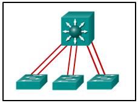

**Choices:**
- **A.** trunking
- **B.** HSRP
- **C.** PortFast
- **D.** EtherChannel

**Correct Answer:**
EtherChannel

**Explanation:**
Topic 6.1.1 PortFast is used to reduce the amount of time that a port spends going through the spanning-tree algorithm, so that devices can start sending data sooner. Trunking can be implemented in conjunction with EtherChannel, but trunking alone does not aggregate switch links. HSRP is used to load-balance traffic across two different connections to Layer 3 devices for default gateway redundancy. HSRP does not aggregate links at either Layer 2 or Layer 3 as EtherChannel does.

---

## Question 35

**Question:**
Refer to the exhibit. An administrator wants to form an EtherChannel between the two switches by using the Port Aggregation Protocol. If switch S1 is configured to be in auto mode, which mode should be configured on S2 to form the EtherChannel? CCNA-2-v7-Modules 5 – 6 Redundant Networks Exam 06

**Images:**
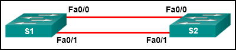

**Choices:**
- **A.** auto
- **B.** on
- **C.** off
- **D.** desirable

**Correct Answer:**
desirable

**Explanation:**
Topic 6.1.6 An EtherChannel will be formed via PAgP when both switches are in on mode or when one of them is in auto or desirable mode and the other is in desirable mode.

---

## Question 36

**Question:**
Open the PT Activity. Perform the tasks in the activity instructions and then answer the question. Which set of configuration commands issued on SW1 will successfully complete the EtherChannel link between SW1 and SW2? Modules 5 – 6 Redundant Networks 1 file(s) 283.11 KB Download CCNA-2-v7-Modules 5 – 6 Redundant Networks Exam 36

**Images:**
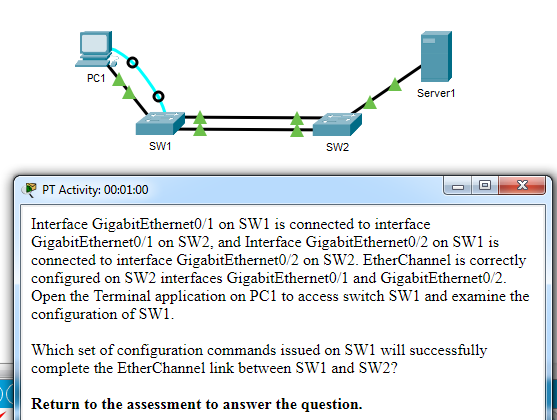

**Choices:**
- **A.** interface GigabitEthernet0/1 no shutdown
- **B.** interface Port-channel 1 no shutdown
- **C.** interface GigabitEthernet0/2 channel-group 2 mode desirable
- **D.** interface GigabitEthernet0/1 channel-group 1 mode desirable

**Correct Answer:**
interface GigabitEthernet0/1 channel-group 1 mode desirable

**Explanation:**
Topic 6.2.2 Issuing the show running-configuration command on SW1 shows that interface GigabitEthernet0/1 is missing the channel-group 1 mode desirable command which will compete the EtherChannel configuration for interface GigabitEthernet0/1 and interface GigabitEthernet0/2.

---

## Question 37

**Question:**
A set of switches is being connected in a LAN topology. Which STP bridge priority value will make it least likely for the switch to be selected as the root?

**Choices:**
- **A.** 65535
- **B.** 4096
- **C.** 32768
- **D.** 61440

**Correct Answer:**
61440

**Explanation:**
Topic 5.2.1 The STP bridge priority is a two byte number, but it can only be customized in increments of 4096. The smaller number is preferred, but the largest usable priority value is 61440.

---

## Question 38

**Question:**
In which two PVST+ port states are MAC addresses learned? (Choose two.)

**Choices:**
- **A.** learning
- **B.** forwarding
- **C.** disabled
- **D.** listening
- **E.** blocking

**Correct Answer:**
learning; forwarding

**Explanation:**
Topic 5.2.10 The two PVST+ port states during which MAC addresses are learned and populate the MAC address table are the learning and the forwarding states.

---

## Question 39

**Question:**
Which port role is assigned to the switch port that has the lowest cost to reach the root bridge?

**Choices:**
- **A.** designated port
- **B.** disabled port
- **C.** root port
- **D.** non-designated port

**Correct Answer:**
root port

**Explanation:**
Topic 5.2.5 The root port on a switch is the port with the lowest cost to reach the root bridge.

---

## Question 40

**Question:**
A switch is configured to run STP. What term describes the switch port closest, in terms of overall cost, to the root bridge?

**Choices:**
- **A.** root port
- **B.** designated port
- **C.** alternate port
- **D.** disabled

**Correct Answer:**
root port

**Explanation:**
Topic 5.2.5

---

## Question 41

**Question:**
A switch is configured to run STP. What term describes a field used to specify a VLAN ID?

**Choices:**
- **A.** extended system ID
- **B.** port ID
- **C.** bridge priority
- **D.** bridge ID

**Correct Answer:**
extended system ID

**Explanation:**
Topic 5.2.1

---

## Question 42

**Question:**
A switch is configured to run STP. What term describes the reference point for all path calculations?

**Choices:**
- **A.** root bridge
- **B.** root port
- **C.** designated port
- **D.** alternate port

**Correct Answer:**
root bridge

**Explanation:**
Topic 5.2.2

---

## Question 43

**Question:**
A switch is configured to run STP. What term describes a field that has a default value of 32,768 and is the initial deciding factor when electing a root bridge?

**Choices:**
- **A.** bridge priority
- **B.** MAC Address
- **C.** extended system ID
- **D.** bridge ID

**Correct Answer:**
bridge priority

**Explanation:**
Topic 5.2.1

---

## Question 44

**Question:**
Which statement describes an EtherChannel implementation?

**Choices:**
- **A.** EtherChannel operates only at Layer 2.
- **B.** PAgP cannot be used in conjunction with EtherChannel.
- **C.** A trunked port can be part of an EtherChannel bundle.
- **D.** EtherChannel can support up to a maximum of ten separate links.

**Correct Answer:**
A trunked port can be part of an EtherChannel bundle.

**Explanation:**
Topic 6.2.1 Up to 16 links can be grouped in an EtherChannel by using the the PAgP or LACP protocol. EtherChannel can be configured as a Layer 2 bundle or a Layer 3 bundle. Configuring a Layer 3 bundle is beyond the scope of this course. If a trunked port is a part of the EtherChannel bundle, all ports in the bundle need to be trunk ports and the native VLAN must be the same on all of these ports. A best practice is to apply the configuration to the port channel interface. The configuration is then automatically applied to the individual ports.

---

## Question 45

**Question:**
Refer to the exhibit. A network administrator issued the show etherchannel summary command on the switch S1. What conclusion can be drawn? CCNA2 v7 SRWE – Modules 5 – 6 Redundant Networks Exam Answers

**Images:**
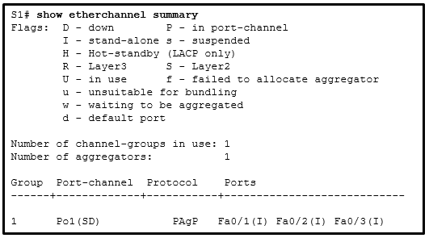

**Choices:**
- **A.** The EtherChannel is suspended.
- **B.** The EtherChannel is not functional.
- **C.** The port aggregation protocol PAgP is misconfigured.
- **D.** FastEthernet ports Fa0/1, Fa0/2, and Fa0/3 do not join the EtherChannel.

**Correct Answer:**
The EtherChannel is not functional.

**Explanation:**
Topic 6.3.3 The EtherChannel status shows as (SD), which means it is a Layer 2 EtherChannel with a status of D or down. Because the EtherChannel is down, the status of the interfaces in the channel group is stand-alone. PAgP is configured on S1, but there is no indication whether it is configured correctly on S1. The problem might also be the adjacent switch EtherChannel configuration.

---

## Question 46

**Question:**
Which statement describes a characteristic of EtherChannel?

**Choices:**
- **A.** It can combine up to a maximum of 4 physical links.
- **B.** It can bundle mixed types of 100 Mb/s and 1Gb/s Ethernet links.
- **C.** It consists of multiple parallel links between a switch and a router.
- **D.** It is made by combining multiple physical links that are seen as one link between two switches.

**Correct Answer:**
It is made by combining multiple physical links that are seen as one link between two switches.

**Explanation:**
Topic 6.1.1 An EtherChannel is formed by combining multiple (same type) Ethernet physical links so they are seen and configured as one logical link. It provides an aggregated link between two switches. Currently each EtherChannel can consist of up to eight compatibly configured Ethernet ports.

---

## Question 47

**Question:**
Which two channel group modes would place an interface in a negotiating state using PAgP? (Choose two.)

**Choices:**
- **A.** on
- **B.** desirable
- **C.** active
- **D.** auto
- **E.** passive

**Correct Answer:**
desirable; auto

**Explanation:**
Topic 6.1.6 There are three modes available when configuring an interface for PAgP: on, desirable, and auto. Only desirable and auto place the interface in a negotiating state. The active and passive states are used to configure LACP and not PAgP.

---

## Question 48

**Question:**
Which mode configuration setting would allow formation of an EtherChannel link between switches SW1 and SW2 without sending negotiation traffic? SW1: on SW2: on SW1: desirable SW2: desirable SW1: auto SW2: auto trunking enabled on both switches SW1: auto SW2: auto PortFast enabled on both switches SW1: passive SW2: active

**Explanation:**
Topic 6.1.6 The auto channel-group keyword enables PAgP only if a PAgP device is detected on the opposite side of the link. If the auto keyword is used, the only way to form an EtherChannel link is if the opposite connected device is configured with the desirable keyword. PortFast and trunking technologies are irrelevant to forming an EtherChannel link. Even though an EtherChannel can be formed if both sides are configured in desirable mode, PAgP is active and PAgP messages are being sent constantly across the link, decreasing the amount of bandwidth available for user traffic.

---

## Question 49

**Question:**
Refer to the exhibit. An EtherChannel was configured between switches S1 and S2, but the interfaces do not form an EtherChannel. What is the problem? CCNA2 v7 SRWE – Modules 5 – 6 Redundant Networks Exam Answers 50

**Images:**
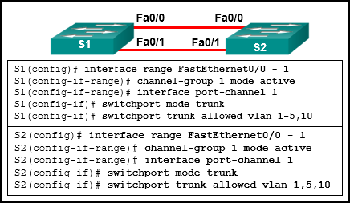

**Choices:**
- **A.** The interface port-channel number has to be different on each switch.
- **B.** The switch ports were not configured with speed and duplex mode.
- **C.** The switch ports have to be configured as access ports with each port having a VLAN assigned.​
- **D.** The EtherChannel was not configured with the same allowed range of VLANs on each interface.

**Correct Answer:**
The EtherChannel was not configured with the same allowed range of VLANs on each interface.

**Explanation:**
Topic 6.2.1

---

## Question 50

**Question:**
When EtherChannel is configured, which mode will force an interface into a port channel without exchanging aggregation protocol packets?

**Choices:**
- **A.** active
- **B.** auto
- **C.** on
- **D.** desirable

**Correct Answer:**
on

**Explanation:**
Topic 6.1.6 For both LACP and PAgP, the “on” mode will force an interface into an EtherChannel without exchanging protocol packets.

---

## Question 51

**Question:**
What are two load-balancing methods in the EtherChannel technology? (Choose two.)

**Choices:**
- **A.** combination of source port and IP to destination port and IP
- **B.** source IP to destination IP
- **C.** source port to destination port
- **D.** combination of source MAC and IP to destination MAC and IP
- **E.** source MAC to destination MAC

**Correct Answer:**
source IP to destination IP; source MAC to destination MAC

**Explanation:**
Topic 6.1.3 Depending on the hardware platform, one or more load-balancing methods can be implemented. These methods include source MAC to destination MAC load balancing or source IP to destination IP load balancing, across the physical links.

---

## Question 52

**Question:**
Which protocol provides up to 16 instances of RSTP, combines many VLANs with the same physical and logical topology into a common RSTP instance, and provides support for PortFast, BPDU guard, BPDU filter, root guard, and loop guard?

**Choices:**
- **A.** STP
- **B.** Rapid PVST+
- **C.** PVST+
- **D.** MST

**Correct Answer:**
MST

**Explanation:**
Topic 5.3.1 MST is the Cisco implementation of MSTP, an IEEE standard protocol that provides up to 16 instances of RSTP and combines many VLANs with the same physical and logical topology into a common RSTP instance. Each instance supports PortFast, BPDU guard, BPDU filter, root guard, and loop guard. STP and RSTP assume only one spanning-tree instance for the entire bridged network, regardless of the number of VLANs. PVST+ provides a separate 802.1D spanning-tree instance for each VLAN that is configured in the network.

---

## Question 53

**Question:**
What is the outcome of a Layer 2 broadcast storm?

**Choices:**
- **A.** Routers will take over the forwarding of frames as switches become congested.
- **B.** New traffic is discarded by the switch because it is unable to be processed.
- **C.** CSMA/CD will cause each host to continue transmitting frames.
- **D.** ARP broadcast requests are returned to the transmitting host.

**Correct Answer:**
New traffic is discarded by the switch because it is unable to be processed.

**Explanation:**
Topic 5.1.6 When the network is saturated with broadcast traffic that is looping between switches, new traffic is discarded by each switch because it is unable to be processed.

---

## Question 54

**Question:**
Which two network design features require Spanning Tree Protocol (STP) to ensure correct network operation? (Choose two.)

**Choices:**
- **A.** static default routes
- **B.** implementing VLANs to contain broadcasts
- **C.** redundant links between Layer 2 switches
- **D.** link-state dynamic routing that provides redundant routes
- **E.** removing single points of failure with multiple Layer 2 switches

**Correct Answer:**
redundant links between Layer 2 switches; removing single points of failure with multiple Layer 2 switches

**Explanation:**
Topic 5.1.1 Spanning Tree Protocol (STP) is required to ensure correct network operation when designing a network with multiple interconnected Layer 2 switches or using redundant links to eliminate single points of failure between Layer 2 switches. Routing is a Layer 3 function and does not relate to STP. VLANs do reduce the number of broadcast domains but relate to Layer 3 subnets, not STP.

---

## Question 55

**Question:**
A network administrator has configured an EtherChannel between two switches that are connected via four trunk links. If the physical interface for one of the trunk links changes to a down state, what happens to the EtherChannel?

**Choices:**
- **A.** Spanning Tree Protocol will transition the failed physical interface into forwarding mode.
- **B.** Spanning Tree Protocol will recalculate the remaining trunk links.
- **C.** The EtherChannel will transition to a down state.
- **D.** The EtherChannel will remain functional.

**Correct Answer:**
The EtherChannel will remain functional.

**Explanation:**
Topic 6.1.3 EtherChannel offers redundancy by bundling multiple trunk links into one logical connection. Failure of one physical link within the EtherChannel will not create a change in the topology and therefore a recalculation by Spanning Tree is unnecessary. Just one physical link must remain operational for the EtherChannel to continue to function.

---
