# CCNA 2 - Modules 7 - 9 Available and Reliable Networks Exam Answers

## Question 1

**Question:**
A DHCP-enabled client PC has just booted. During which two steps will the client PC use broadcast messages when communicating with a DHCP server? (Choose two.)

**Choices:**
- **A.** DHCPDISCOVER
- **B.** DHCPACK
- **C.** DHCPOFFER
- **D.** DHCPREQUEST
- **E.** DHCPNAK

**Correct Answer:**
DHCPDISCOVER; DHCPREQUEST

**Explanation:**
Topic 7.1.3 All DHCP messages between a DHCP-enabled client and a DHCP server are using broadcast messages until after the DHCPACK message. The DHCPDISCOVER and DHCPREQUEST messages are the only messages that are sent by a DHCP-enabled client. All DHCP messages between a DHCP-enabled client and a DHCP server use broadcast messages when the client is obtaining a lease for the first time.

---

## Question 2

**Question:**
An administrator issues the commands: Copy Router(config)# interface g0/1 Router(config-if)# ip address dhcp What is the administrator trying to achieve?

**Choices:**
- **A.** configuring the router to act as a DHCPv4 server
- **B.** configuring the router to obtain IP parameters from a DHCPv4 server
- **C.** configuring the router to act as a relay agent
- **D.** configuring the router to resolve IP address conflicts

**Correct Answer:**
configuring the router to obtain IP parameters from a DHCPv4 server

**Explanation:**
Topic 7.3.1

---

## Question 3

**Question:**
When a client is requesting an initial address lease from a DHCP server, why is the DHCPREQUEST message sent as a broadcast?

**Choices:**
- **A.** The client does not yet know the IP address of the DHCP server that sent the offer.
- **B.** The DHCP server may be on a different subnet, so the request must be sent as a broadcast.
- **C.** The client does not have a MAC address assigned yet, so it cannot send a unicast message at Layer 2.
- **D.** The client may have received offers from multiple servers, and the broadcast serves to implicitly decline those other offers.

**Correct Answer:**
The client may have received offers from multiple servers, and the broadcast serves to implicitly decline those other offers.

**Explanation:**
Topic 7.1.3 During the initial DHCP exchange between a client and server, the client broadcasts a DHCPDISCOVER message looking for DHCP servers. Multiple servers may be configured to respond to this request with DHCPOFFER messages. The client will choose the lease from one of the servers by sending a DHCPREQUEST message. It sends this message as a broadcast so that the other DHCP servers that sent offers will know that their offers were declined and the corresponding address can go back into the pool.

---

## Question 4

**Question:**
Which DHCP IPv4 message contains the following information? Destination address: 255.255.255.255 Client IPv4 address: 0.0.0.0 Default gateway address: 0.0.0.0 Subnet mask: 0.0.0.0

**Choices:**
- **A.** DHCPACK
- **B.** DHCPDISCOVER
- **C.** DHCPOFFER
- **D.** DHCPREQUEST

**Correct Answer:**
DHCPDISCOVER

**Explanation:**
Topic 7.1.3

---

## Question 5

**Question:**
Place the options in the following order:

**Choices:**
- **A.** a client initiating a message to find a DHCP server – DHCPDISCOVER
- **B.** a DHCP server responding to the initial request by a client – DHCPOFFER
- **C.** the client accepting the IP address provided by the DHCP server – DHCPREQUEST
- **D.** the DHCP server confirming that the lease has been accepted – DHCPACK

**Explanation:**
Topic 7.1.3

---

## Question 6

**Question:**
Which protocol automates assignment of IP addresses on a network, and which port number does it use? (Choose two.)

**Choices:**
- **A.** DHCP
- **B.** DNS
- **C.** SMB
- **D.** 53
- **E.** 67
- **F.** 80

**Correct Answer:**
DHCP; 67

**Explanation:**
Topic 7.1.1 DNS uses port 53 and translates URLs to IP addresses. SMB provides shared access to files and printers and uses port 445. Port 80 is used by HTTP. HTTP is a protocol used to communicate between a web browser and a server.

---

## Question 7

**Question:**
Refer to the exhibit. PC1 is configured to obtain a dynamic IP address from the DHCP server. PC1 has been shut down for two weeks. When PC1 boots and tries to request an available IP address, which destination IP address will PC1 place in the IP header?

**Images:**
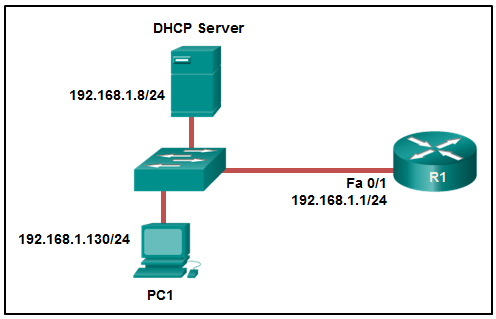

**Choices:**
- **A.** 192.168.1.1
- **B.** 192.168.1.255
- **C.** 255.255.255.255
- **D.** 192.168.1.8

**Correct Answer:**
255.255.255.255

**Explanation:**
Topic 7.1.3 When a host boots and has been configured for dynamic IP addressing, the device tries to obtain a valid IP address. It sends a DHCPDISCOVER message. This is a broadcast message because the DHCP server address is unknown (by design). The destination IP address in the IP header is 255.255.255.255 and the destination MAC address is FF:FF:FF:FF:FF:FF.

---

## Question 8

**Question:**
Which message does an IPv4 host use to reply when it receives a DHCPOFFER message from a DHCP server?

**Choices:**
- **A.** DHCPOFFER
- **B.** DHCPDISCOVER
- **C.** DHCPREQUEST
- **D.** DHCPACK

**Correct Answer:**
DHCPREQUEST

**Explanation:**
Topic 7.1.3 When the client receives the DHCPOFFER from the server, it sends back a DHCPREQUEST broadcast message. On receiving the DHCPREQUEST message, the server replies with a unicast DHCPACK message.

---

## Question 9

**Question:**
Which command, when issued in the interface configuration mode of a router, enables the interface to acquire an IPv4 address automatically from an ISP, when that link to the ISP is enabled?

**Choices:**
- **A.** service dhcp
- **B.** ip address dhcp
- **C.** ip helper-address
- **D.** ip dhcp pool

**Correct Answer:**
ip address dhcp

**Explanation:**
Topic 7.3.1 The ip address dhcp interface configuration command configures an Ethernet interface as a DHCP client. The service dhcp global configuration command enables the DHCPv4 server process on the router. The ip helper-address command is issued to enable DHCP relay on the router. The ip dhcp pool command creates the name of a pool of addresses that the server can assign to hosts.

---

## Question 10

**Question:**
Which kind of message is sent by a DHCP client when its IP address lease has expired?​

**Choices:**
- **A.** a DHCPDISCOVER unicast message​
- **B.** a DHCPREQUEST broadcast message​
- **C.** a DHCPREQUEST unicast message​
- **D.** a DHCPDISCOVER broadcast message

**Correct Answer:**
a DHCPREQUEST unicast message​

**Explanation:**
Topic 7.1.4 When the IP address lease time of the DHCP client expires, it sends a DHCPREQUEST unicast message directly to the DHCPv4 server that originally offered the IPv4 address.

---

## Question 11

**Question:**
A host PC is attempting to lease an address through DHCP. What message is sent by the server to let the client know it is able to use the provided IP information?

**Choices:**
- **A.** DHCPDISCOVER
- **B.** DHCPOFFER
- **C.** DHCPREQUEST
- **D.** DHCPACK
- **E.** DHCPNACK

**Correct Answer:**
DHCPACK

**Explanation:**
Topic 7.1.3 When a host uses DHCP to automatically configure an IP address, the typically sends two messages: the DHCPDISCOVER message and the DHCPREQUEST message. These two messages are usually sent as broadcasts to ensure that all DHCP servers receive them. The servers respond to these messages using DHCPOFFER, DHCPACK, and DHCPNACK messages, depending on the circumstance.

---

## Question 12

**Question:**
What is one indication that a Windows computer did not receive an IPv4 address from a DHCP server?

**Choices:**
- **A.** The computer cannot ping 127.0.0.1.
- **B.** The computer receives an IP address that starts with 169.254.
- **C.** Windows displays a DHCP timeout message.
- **D.** The computer cannot ping other devices on the same network with IP addresses in the 169.254.0.0/16 range.

**Correct Answer:**
The computer receives an IP address that starts with 169.254.

**Explanation:**
Topic 8.1.2 When a Windows PC cannot communicate with an IPv4 DHCP server, the computer automatically assigns an IP address in the 169.254.0.0/16 range. Any other device on the same network that receives an address in the same range is reachable.​

---

## Question 13

**Question:**
Which DHCPv4 message will a client send to accept an IPv4 address that is offered by a DHCP server?

**Choices:**
- **A.** broadcast DHCPACK
- **B.** broadcast DHCPREQUEST
- **C.** unicast DHCPACK
- **D.** unicast DHCPREQUEST

**Correct Answer:**
broadcast DHCPREQUEST

**Explanation:**
Topic 7.1.3 When a DHCP client receives DHCPOFFER messages, it will send a broadcast DHCPREQUEST message for two purposes. First, it indicates to the offering DHCP server that it would like to accept the offer and bind the IP address. Second, it notifies any other responding DHCP servers that their offers are declined.

---

## Question 14

**Question:**
A small coffee shop is offering free Wi-Fi to customers. The network includes a wireless router and a DSL modem that is connected to the local phone company. What method is typically used to configure the connection to the phone company?

**Choices:**
- **A.** Set the WAN connection in the wireless router as a DHCP client.
- **B.** Set the connection between the wireless router and the DSL modem as a private IP network.
- **C.** Set the DSL modem as a DHCP client to get a public IP address from the wireless router.
- **D.** Set the DSL modem as a DHCP client to the phone company and a DHCP server for the internal connection.

**Correct Answer:**
Set the WAN connection in the wireless router as a DHCP client.

**Explanation:**
Topic 7.3.3 In a SOHO environment, a wireless router connects to an ISP via a DSL or cable modem. The IP address between the wireless router and ISP site is typically assigned by the ISP through DHCP. The DSL modem does not manage IP address allocation.

---

## Question 15

**Question:**
A company uses DHCP to manage IP address deployment for employee workstations. The IT department deploys multiple DHCP servers in the data center and uses DHCP relay agents to facilitate the DHCP requests from workstations. Which two UDP ports are used to forward DHCP traffic? (Choose two.)

**Choices:**
- **A.** 23
- **B.** 53
- **C.** 67
- **D.** 68
- **E.** 80

**Correct Answer:**
67; 68

**Explanation:**
Topic 7.2.9 The DHCP protocol operates with 2 UDP ports. UDP port 67 is the destination port for DHCP servers, and DHCP clients use UDP port 68.

---

## Question 16

**Question:**
A client device on an Ethernet segment needs an IP address in order to communicate on the network. A DHCP server with IP address 192.168.1.1 has been configured and enabled on the network. How will a client device obtain a usable IP address for this network?

**Choices:**
- **A.** Send a DHCPACK packet to the default gateway address.
- **B.** Use a statically configured IP address from the pool of IP addresses that is offered by the DHCP server.
- **C.** Send a DHCPDISCOVER message to physical address FF-FF-FF-FF-FF-FF.
- **D.** Send a DHCPREQUEST packet to IP address 255.255.255.255.

**Correct Answer:**
Send a DHCPDISCOVER message to physical address FF-FF-FF-FF-FF-FF.

**Explanation:**
Topic 7.1.3 Like IP addressing, there is also a special MAC address for broadcast purposes: FF-FF-FF-FF-FF-FF. When a DHCP client needs to send a DHCP Discover message in order to seek DHCP servers, the client will use this MAC address as the destination MAC address in the Ethernet frame. It does this because it has no knowledge of the IP and MAC addresses of DHCP servers.

---

## Question 17

**Question:**
What is an advantage of configuring a Cisco router as a relay agent?

**Choices:**
- **A.** It can provide relay services for multiple UDP services.
- **B.** It reduces the response time from a DHCP server.
- **C.** It can forward both broadcast and multicast messages on behalf of clients.
- **D.** It will allow DHCPDISCOVER messages to pass without alteration.

**Correct Answer:**
It can provide relay services for multiple UDP services.

**Explanation:**
Topic 7.2.9 By default, the ip helper-address command forwards the following eight UDP services: Port 37: Time Port 49: TACACS Port 53: DNS Port 67: DHCP/BOOTP client Port 68: DHCP/BOOTP server Port 69: TFTP Port 137: NetBIOS name service Port 138: NetBIOS datagram service

---

## Question 18

**Question:**
Which statement is true about DHCP operation?​

**Choices:**
- **A.** When a device that is configured to use DHCP boots, the client broadcasts a DHCPDISCOVER message to identify any available DHCP servers on the network.​
- **B.** A client must wait for lease expiration before it sends another DHCPREQUEST message.​
- **C.** If the client receives several DHCPOFFER messages from different servers, it sends a unicast DHCPREQUEST message to the server from which it chooses to obtain the IP information.
- **D.** The DHCPDISCOVER message contains the IP address and subnet mask to be assigned, the IP address of the DNS server, and the IP address of the default gateway.​

**Correct Answer:**
When a device that is configured to use DHCP boots, the client broadcasts a DHCPDISCOVER message to identify any available DHCP servers on the network.​

**Explanation:**
Topic 7.1.3 The client broadcasts a DHCPDISCOVER message to identify any available DHCP servers on the network. A DHCP server replies with a DHCPOFFER message. This message offers to the client a lease that contains such information as the IP address and subnet mask to be assigned, the IP address of the DNS server, and the IP address of the default gateway. After the client receives the lease, the received information must be renewed through another DHCPREQUEST message prior to the lease expiration.

---

## Question 19

**Question:**
Order the DHCP message types as they would occur between a DHCP client and a DHCP server. Explanation: Topic 7.1.3 The DHCPDISCOVER message is used to identify any DHCP servers on a network. The DHCPOFFER message is used by a server to offer a lease to a client. The DHCPREQUEST message is used to identify both the specific DHCP server and the lease that the client is accepting. The DHCPACK message is used by a server to finalize a successful lease with a client. The DHCPNAK message is used when an offered lease is no longer valid.

**Images:**
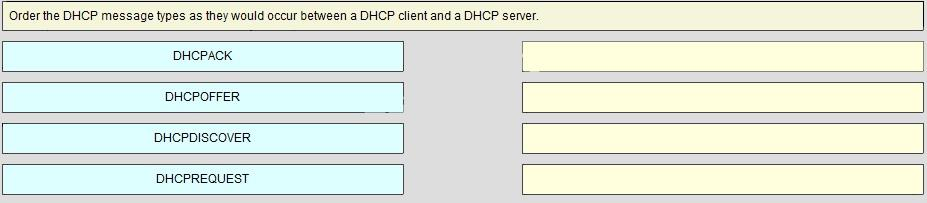

---

## Question 20

**Question:**
A network administrator configures a router to send RA messages with M flag as 0 and O flag as 1. Which statement describes the effect of this configuration when a PC tries to configure its IPv6 address?

**Choices:**
- **A.** It should contact a DHCPv6 server for the prefix, the prefix-length information, and an interface ID that is both random and unique.
- **B.** It should use the information that is contained in the RA message and contact a DHCPv6 server for additional information.
- **C.** It should use the information that is contained in the RA message exclusively.
- **D.** It should contact a DHCPv6 server for all the information that it needs.

**Correct Answer:**
It should use the information that is contained in the RA message and contact a DHCPv6 server for additional information.

**Explanation:**
Topic 8.3.2 ICMPv6 RA messages contain two flags to indicate whether a workstation should use SLAAC, a DHCPv6 server, or a combination to configure its IPv6 address. These two flags are M flag and O flag. When both flags are 0 (by default), a client must only use the information in the RA message. When M flag is 0 and O flag is 1, a client should use the information in the RA message and look for the other configuration parameters (such as DNS server addresses) on DHCPv6 servers.

---

## Question 21

**Question:**
Refer to the exhibit. What should be done to allow PC-A to receive an IPv6 address from the DHCPv6 server?

**Images:**

**Choices:**
- **A.** Add the ipv6 dhcp relay command to interface Fa0/0.
- **B.** Change the ipv6 nd managed-config-flag command to ipv6 nd other-config-flag.
- **C.** Configure the ipv6 nd managed-config-flag command on interface Fa0/1.
- **D.** Add the IPv6 address 2001:DB8:1234:5678::10/64 to the interface configuration of the DHCPv6 server.

**Correct Answer:**
Add the ipv6 dhcp relay command to interface Fa0/0.

**Explanation:**
Topic 8.4.7 Client DHCPv6 messages are sent to a multicast address with link-local scope, which means that the messages will not be forwarded by routers. Because the client and server are on different subnets on different interfaces, the message will not reach the server. The router can be configured to relay the DHCPv6 messages from the client to the server by configuring the ipv6 dhcp relay command on the interface that is connected to the client.

---

## Question 22

**Question:**
Refer to the exhibit. A network administrator is implementing the stateless DHCPv6 operation for the company. Clients are configuring IPv6 addresses as expected. However, the clients are not getting the DNS server address and the domain name information configured in the DHCP pool. What could be the cause of the problem?

**Images:**

**Choices:**
- **A.** The DNS server address is not on the same network as the clients are on.
- **B.** The router is configured for SLAAC operation.
- **C.** The GigabitEthernet interface is not activated.
- **D.** The clients cannot communicate with the DHCPv6 server, evidenced by the number of active clients being 0.

**Correct Answer:**
The router is configured for SLAAC operation.

**Explanation:**
Topic 8.3.3 The router is configured for SLAAC operation because there is no configuration command to change the RA M and O flag value. By default, both M and O flags are set to 0. In order to permint stateless DHCPv6 operation, the interface command ipv6 nd other-config-flag should be issued. The GigabitEthernet interface is in working condition because clients can get RA messages and configure their IPv6 addresses as expected. Also, the fact that R1 is the DHCPv6 server and clients are getting RA messages indicates that clients can communicate with the DHCP server. The number of active clients is 0 because the DHCPv6 server does not maintain the state of clients IPv6 addresses (it is not configured for stateful DHCPv6 operation). The DNS server address issue is not relevant to the problem.

---

## Question 23

**Question:**
Question as presented: A stateless DHCPv6 client would send a DHCPv6 INFORMATION-REQUEST message as step 3 in the process.

**Explanation:**
Topic 8.3.1

---

## Question 24

**Question:**
A company uses the SLAAC method to configure IPv6 addresses for the employee workstations. Which address will a client use as its default gateway?​

**Choices:**
- **A.** the global unicast address of the router interface that is attached to the network
- **B.** the unique local address of the router interface that is attached to the network
- **C.** the all-routers multicast address
- **D.** the link-local address of the router interface that is attached to the network

**Correct Answer:**
the link-local address of the router interface that is attached to the network

**Explanation:**
Topic 8.2.3 When a PC is configured to use the SLAAC method for configuring IPv6 addresses, it will use the prefix and prefix-length information that is contained in the RA message, combined with a 64-bit interface ID (obtained by using the EUI-64 process or by using a random number that is generated by the client operating system), to form an IPv6 address. It uses the link-local address of the router interface that is attached to the LAN segment as its IPv6 default gateway address.

---

## Question 25

**Question:**
Refer to the exhibit. A network administrator is configuring a router for DHCPv6 operation. Which conclusion can be drawn based on the commands?

**Images:**
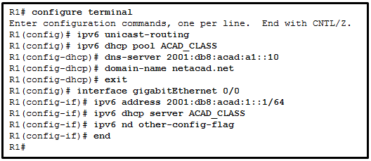

**Choices:**
- **A.** The router is configured for stateful DHCPv6 operation, but the DHCP pool configuration is incomplete.
- **B.** The DHCPv6 server name is ACAD_CLASS.
- **C.** Clients would configure the interface IDs above 0010.
- **D.** The router is configured for stateless DHCPv6 operation.

**Correct Answer:**
The router is configured for stateless DHCPv6 operation.

**Explanation:**
Topic 8.3.3 The DHCPv6 is for the stateless DHCPv6 operation that is indicated by changing the O flag to 1 and leaving the M flag as default, which is 0. Therefore, it is not configured for stateful DHCPv6 operation. Although the DNS server has the interface ID 0010, clients in stateless DHCPv6 operation will configure their interface IDs either by EUI-64 or a random number. The ACAD_CLASS is the name of the DHCP pool, not the DHCP server name.

---

## Question 26

**Question:**
A network administrator is analyzing the features that are supported by different first-hop router redundancy protocols. Which statement describes a feature that is associated with HSRP?

**Choices:**
- **A.** HSRP uses active and standby routers.
- **B.** HSRP is nonproprietary.
- **C.** It allows load balancing between a group of redundant routers.
- **D.** It uses ICMP messages in order to assign the default gateway to hosts.

**Correct Answer:**
HSRP uses active and standby routers.

**Explanation:**
Topic 9.2.1 The HSRP first-hop router redundancy protocol is Cisco proprietary and supports standby and active devices. VRRPv2 and VRRPv3 are nonproprietary. GLBP is Cisco proprietary and supports load balancing between a group of redundant routers.

---

## Question 27

**Question:**
Refer to the exhibit. What protocol can be configured on gateway routers R1 and R2 that will allow traffic from the internal LAN to be load balanced across the two gateways to the Internet?

**Images:**
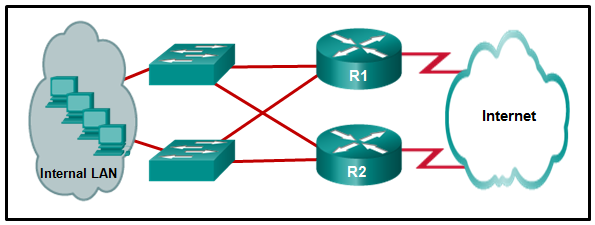

**Choices:**
- **A.** GLBP
- **B.** PVST+
- **C.** PVST
- **D.** STP

**Correct Answer:**
GLBP

**Explanation:**
Topic 9.1.4 GLBP, or Group Load Balancing Protocol, allows multiple routers to act as a single default gateway for hosts. GLBP load balances the traffic across the individual routers on a per host basis.

---

## Question 28

**Question:**
Refer to the exhibit. A network engineer is troubleshooting host connectivity on a LAN that uses a first hop redundancy protocol. Which IPv4 gateway address should be configured on the host?

**Images:**
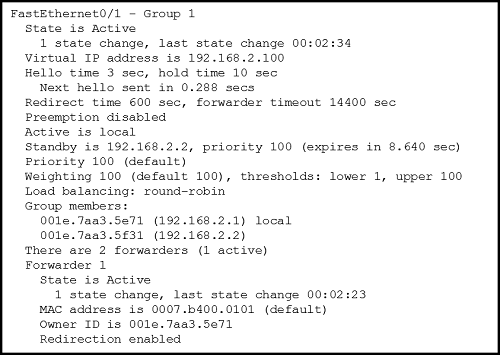

**Choices:**
- **A.** 192.168.2.0
- **B.** 192.168.2.1
- **C.** 192.168.2.2
- **D.** 192.168.2.100

**Correct Answer:**
192.168.2.100

**Explanation:**
Topic 9.1.2 The host default gateway address should be the FHRP (in this case GLBP) virtual IP address.

---

## Question 29

**Question:**
Refer to the exhibit. Which destination MAC address is used when frames are sent from the workstation to the default gateway?

**Images:**

**Choices:**
- **A.** MAC address of the virtual router
- **B.** MAC address of the standby router
- **C.** MAC addresses of both the forwarding and standby routers
- **D.** MAC address of the forwarding router

**Correct Answer:**
MAC address of the virtual router

**Explanation:**
Topic 9.1.2 The IP address of the virtual router acts as the default gateway for all the workstations. Therefore, the MAC address that is returned by the Address Resolution Protocol to the workstation will be the MAC address of the virtual router.

---

## Question 30

**Question:**
Question as presented: Hot Standby Router Protocol (HSRP) is a Cisco-proprietary protocol that is designed to allow for transparent failover of a first-hop IPv4 device.

**Explanation:**
Topic 9.1.4

---

## Question 31

**Question:**
Which FHRP implementation is a Cisco-proprietary protocol that suppports IPv4 load sharing?

**Choices:**
- **A.** IRDP
- **B.** GLBP
- **C.** VRRPv3
- **D.** GLBP for IPv6

**Correct Answer:**
GLBP

**Explanation:**
Topic 9.1.4

---

## Question 32

**Question:**
The address pool of a DHCP server is configured with 10.92.71.0/25. The network administrator reserves 8 IP addresses for servers. How many IP addresses are left in the pool to be assigned to other hosts?

**Choices:**
- **A.** 122
- **B.** 118
- **C.** 119
- **D.** 108
- **E.** 116

**Correct Answer:**
118

**Explanation:**
Topic 7.2.2 Calculate the maximum number of hosts available for the slash value and subtract the required static IP addresses required for the devices. /24 = 254 hosts /25 = 126 hosts /26 = 62 hosts /27 = 30 hosts /28 = 14 hosts

---

## Question 33

**Question:**
Question as presented: The broadcast DHCPDISCOVER message finds DHCPv4 servers on the network. When the DHCPv4 server receives a DHCPDISCOVER message, it reserves an available IPv4 address to lease to the client and sends the unicast DHCPOFFER message to the requesting client. When the client receives the DHCPOFFER from the server, it sends back a DHCPREQUEST. On receiving the DHCPREQUEST message the server replies with a unicast DHCPACK message. DHCPREPLY and DHCPINFORMATION-REQUEST are DHCPv6 messages.

**Explanation:**
Topic 7.1.3

---

## Question 34

**Question:**
After a host has generated an IPv6 address by using the DHCPv6 or SLAAC process, how does the host verify that the address is unique and therefore usable?

**Choices:**
- **A.** The host sends an ICMPv6 echo request message to the DHCPv6 or SLAAC-learned address and if no reply is returned, the address is considered unique.
- **B.** The host sends an ICMPv6 neighbor solicitation message to the DHCP or SLAAC-learned address and if no neighbor advertisement is returned, the address is considered unique.
- **C.** The host checks the local neighbor cache for the learned address and if the address is not cached, it it considered unique.
- **D.** The host sends an ARP broadcast to the local link and if no hosts send a reply, the address is considered unique.

**Correct Answer:**
The host sends an ICMPv6 neighbor solicitation message to the DHCP or SLAAC-learned address and if no neighbor advertisement is returned, the address is considered unique.

**Explanation:**
Topic 8.2.6 Before a host can actually configure and use an IPv6 address learned through SLAAC or DHCP, the host must verify that no other host is already using that address. To verify that the address is indeed unique, the host sends an ICMPv6 neighbor solicitation to the address. If no neighbor advertisement is returned, the host considers the address to be unique and configures it on the interface.

---

## Question 35

**Question:**
Which statement describes HSRP?​

**Choices:**
- **A.** It is used within a group of routers for selecting an active device and a standby device to provide gateway services to a LAN.
- **B.** It uses ICMP to allow IPv4 hosts to locate routers that provide IPv4 connectivity to remote IP networks.​
- **C.** If the virtual router master fails, one router is elected as the virtual router master with the other routers acting as backups.
- **D.** It is an open standard protocol.

**Correct Answer:**
It is used within a group of routers for selecting an active device and a standby device to provide gateway services to a LAN.

**Explanation:**
Topic 9.1.4 It is VRRP that elects one router as the virtual router master, with the other routers acting as backups in case the virtual router master fails. HSRP is a Cisco-proprietary protocol. IRDP uses ICMP messages to allow IPv4 hosts to locate routers that provide IPv4 connectivity to other (nonlocal) IP networks. HSRP selects active and standby routers to provide gateway services to hosts on a LAN.

---

## Question 36

**Question:**
Open the PT Activity. Perform the tasks in the activity instructions and then answer the question. Modules 7 - 9 Available and Reliable Networks 1 file(s) 159.43 KB Download What is the keyword that is displayed on www.netacad.com?

**Images:**
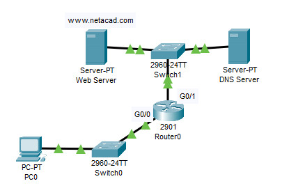

**Choices:**
- **A.** DHCP
- **B.** switch
- **C.** Router
- **D.** networking
- **E.** Cisco
- **F.** IPv6

**Correct Answer:**
Router

**Explanation:**
Topic 8.3.3 In order for the host to receive the address of the DNS server, the host must use stateless DHCPv6. The router is configured with the correct DHCPv6 pool, but is missing the command ipv6 nd other-config-flag that signals to the host that it should use DHCPv6 to get additional address information. This command should be added to the interface Gigabit0/0 configuration on the router.

---

## Question 37

**Question:**
Match each DHCP message type with its description. (Not all options are used.) Explanation: Topic 7.1.3 Place the options in the following order: a client initiating a message to find a DHCP server – DHCPDISCOVER a DHCP server responding to the initial request by a client – DHCPOFFER the client accepting the IP address provided by the DHCP server – DHCPREQUEST the DHCP server confirming that the lease has been accepted – DHCPACK

**Images:**
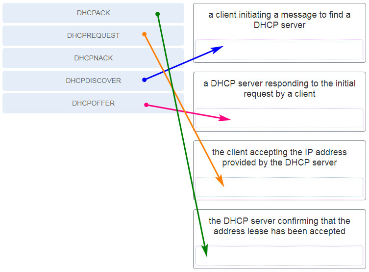

---

## Question 38

**Question:**
Match the purpose with its DHCP message type. (Not all options are used.)

**Images:**

**Explanation:**
Topic 7.1.3 DHCPREQUEST A message that is used to locate any available DHCP server on a network DHCPOFFER A message that is used to suggest a lease to a client DHCPDISCOVER A message that is used to identify the explicit server and lease offer to accept DHCPNAK A message that is used to acknowledge that the lease is successful DHCPACK A message is used by a server to finalize a successful lease with a client

---

## Question 39

**Question:**
Match the DHCP message types to the order of the stateful DHCPv6 process when a client first connects to an IPv6 network. (Not all options are used.) Step 1 DHCPv6 SOLICIT Step 2 DHCPv6 ADVERTISE Step 3 DHCPv6 REQUEST Step 4 DHCPv6 REPLY

**Images:**
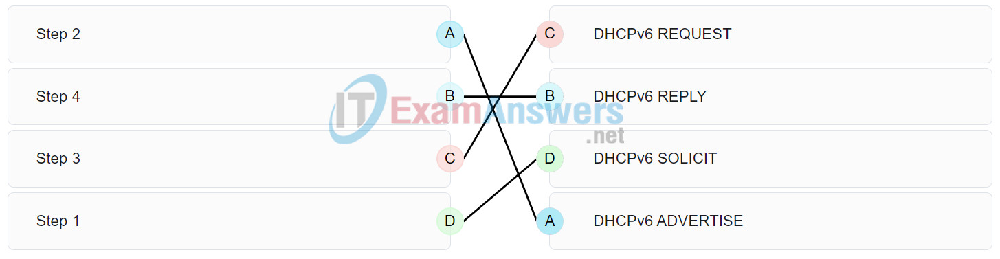

**Explanation:**
Topic 8.3.1

---

## Question 40

**Question:**
Match the step number to the sequence of stages that occur during the HSRP failover process. (Not all options are used.) Step 1 The forwarding router fails. Step 2 The standby router stops seeing hello messages from the forwarding router. Step 3 The standby router assumes the role of the forwarding router. Step 4 The new forwarding router assumes both the IP and MAC addresses of the virtual router.

**Images:**
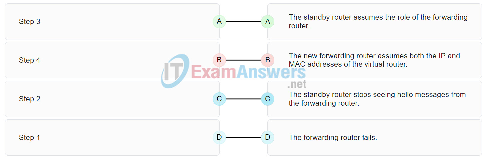

**Explanation:**
Topic 9.1.3 Hot Standby Router Protocol (HSRP) is a Cisco-proprietary protocol that is designed to allow for transparent failover of a first-hop IPv4 device.

---

## Question 41

**Question:**
Match the FHRP protocols to the appropriate description. (Not all options are used.) GLBP a Cisco proprietary FHRP that provides load sharing in addition to redundancy HSRP a Cisco proprietary FHRP that provides redundancy through use of an active device and standby device VRRP an open standard FHRP that provides redundancy through use of a virtual routers master and one or more backups

**Images:**

**Explanation:**
Topic 9.1.4

---

## Question 42

**Question:**
Match the DHCP message types to the order of the DHCPv4 process. (Not all options are used.) Step 1 DHCPDISCOVER Step 2 DHCPOFFER Step 3 DHCPREQUEST Step 4 DHCPACK

**Images:**
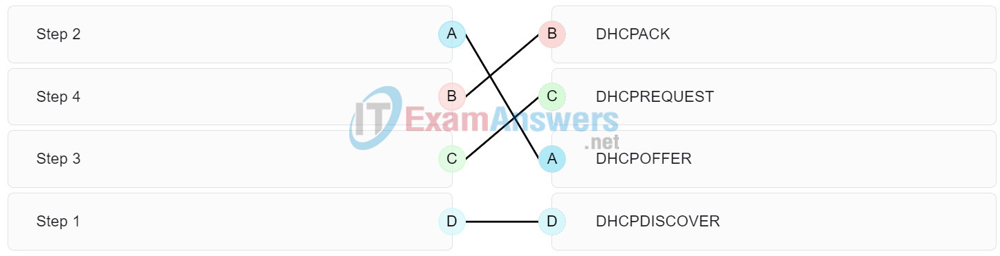

**Explanation:**
Topic 7.1.3 The broadcast DHCPDISCOVER message finds DHCPv4 servers on the network. When the DHCPv4 server receives a DHCPDISCOVER message, it reserves an available IPv4 address to lease to the client and sends the unicast DHCPOFFER message to the requesting client. When the client receives the DHCPOFFER from the server, it sends back a DHCPREQUEST. On receiving the DHCPREQUEST message the server replies with a unicast DHCPACK message. DHCPREPLY and DHCPINFORMATION-REQUEST are DHCPv6 messages.

---

## Question 43

**Question:**
The address pool of a DHCP server is configured with 192.168.234.0/27. The network administrator reserves 22 IP addresses for IP phones. How many IP addresses are left in the pool to be assigned to other hosts?

**Choices:**
- **A.** 10
- **B.** 0
- **C.** 8
- **D.** 21
- **E.** 18

**Correct Answer:**
8

**Explanation:**
Topic 7.2.2 Calculate the maximum number of hosts available for the slash value and subtract the required static IP addresses required for the devices. /24 = 254 hosts /25 = 126 hosts /26 = 62 hosts /27 = 30 hosts /28 = 14 hosts

---

## Question 44

**Question:**
A company uses DHCP servers to dynamically assign IPv4 addresses to employee workstations. The address lease duration is set as 5 days. An employee returns to the office after an absence of one week. When the employee boots the workstation, it sends a message to obtain an IP address. Which Layer 2 and Layer 3 destination addresses will the message contain?

**Choices:**
- **A.** both MAC and IPv4 addresses of the DHCP server
- **B.** FF-FF-FF-FF-FF-FF and IPv4 address of the DHCP server
- **C.** FF-FF-FF-FF-FF-FF and 255.255.255.255
- **D.** MAC address of the DHCP server and 255.255.255.255

**Correct Answer:**
FF-FF-FF-FF-FF-FF and 255.255.255.255

**Explanation:**
Topic 7.1.3 When the lease of a dynamically assigned IPv4 address has expired, a workstation will send a DHCPDISCOVER message to start the process of obtaining a valid IP address. Because the workstation does not know the addresses of DHCP servers, it sends the message via broadcast, with destination addresses of FF-FF-FF-FF-FF-FF and 255.255.255.255.

---

## Question 45

**Question:**
Which command will allow a network administrator to check the IP address that is assigned to a particular MAC address?

**Choices:**
- **A.** Router# show running-config I section_dhcp
- **B.** Router# show ip dhcp server statistics
- **C.** Router# show ip dhcp binding
- **D.** Router# show ip dhcp pool

**Correct Answer:**
Router# show ip dhcp binding

**Explanation:**
Topic 7.2.4 The show ip dhcp binding command will show the leases, including IP addresses, MAC addresses, lease expiration, type of lease, client ID, and user name.

---

## Question 46

**Question:**
What is the reason that an ISP commonly assigns a DHCP address to a wireless router in a SOHO environment?

**Choices:**
- **A.** better network performance
- **B.** better connectivity
- **C.** easy IP address management
- **D.** easy configuration on ISP firewall

**Correct Answer:**
easy IP address management

**Explanation:**
Topic 7.3.3 In a SOHO environment, a wireless router connects to the ISP via a DSL or cable modem. The IP address between the wireless router and ISP site is typically assigned by the ISP through DHCP. This method facilitates the IP addressing management in that IP addresses for clients are dynamically assigned so that if a client is dropped, the assigned IP address can be easily reassigned to another client.

---

## Question 47

**Question:**
What information can be verified through the show ip dhcp binding command?

**Choices:**
- **A.** the IPv4 addresses that are assigned to hosts by the DHCP server
- **B.** that DHCPv4 discover messages are still being received by the DHCP server
- **C.** the IPv4 addresses that have been excluded from the DHCPv4 pool
- **D.** the number of IP addresses remaining in the DHCP pool

**Correct Answer:**
the IPv4 addresses that are assigned to hosts by the DHCP server

**Explanation:**
Topic 7.2.4 The show ip dhcp binding command shows a list of IPv4 addresses and the MAC addresses of the hosts to which they are assigned. Using this information an administrator can determine which host interfaces have been assigned to specific hosts.

---

## Question 48

**Question:**
What is the result of a network technician issuing the command ip dhcp excluded-address 10.0.15.1 10.0.15.15 on a Cisco router?

**Choices:**
- **A.** The Cisco router will exclude only the 10.0.15.1 and 10.0.15.15 IP addresses from being leased to DHCP clients.
- **B.** The Cisco router will exclude 15 IP addresses from being leased to DHCP clients.
- **C.** The Cisco router will automatically create a DHCP pool using a /28 mask.
- **D.** The Cisco router will allow only the specified IP addresses to be leased to clients.

**Correct Answer:**
The Cisco router will exclude 15 IP addresses from being leased to DHCP clients.

**Explanation:**
Topic 7.2.2 The ip dhcp excluded-address command is followed by the first and the last addresses to be excluded from being leased to DHCP clients.

---

## Question 49

**Question:**
Match the descriptions to the corresponding DHCPv6 server type. (Not all options are used.)

**Images:**
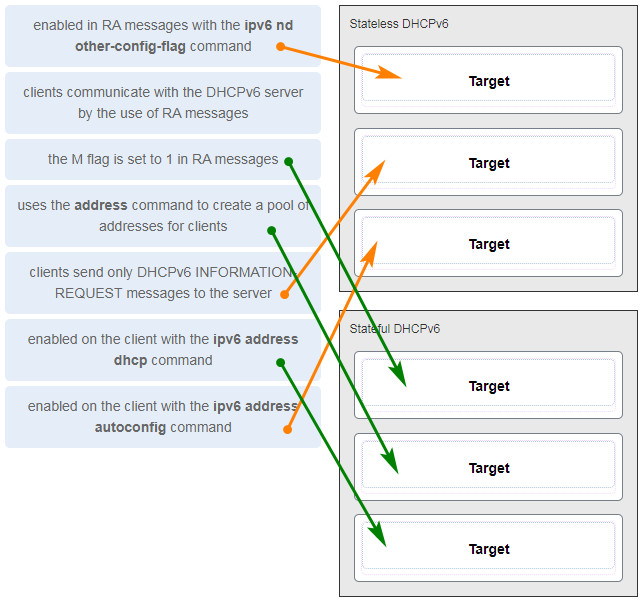

**Explanation:**
Topic 8.1.3

---

## Question 50

**Question:**
Refer to the exhibit. Based on the output that is shown, what kind of IPv6 addressing is being configured? CCNA 2 v7 Modules 7 – 9: Available and Reliable Networks Exam Answers

**Images:**

**Choices:**
- **A.** stateless DHCPv6
- **B.** SLAAC
- **C.** static link-local
- **D.** stateful DHCPv6

**Correct Answer:**
stateless DHCPv6

**Explanation:**
Topic 8.4.2 Stateful DHCPv6 pools are configured with address prefixes for hosts via the address command, whereas stateless DHCPv6 pools typically only contain information such as DNS server addresses and the domain name. RA messages that are sent from routers that are configured as stateful DHCPv6 servers have the M flag set to 1 with the command ipv6 nd managed-config-flag , whereas stateless DHCPv6 servers are indicated by setting the O flag to 1 with the ipv6 nd other-config-flag command.

---

## Question 51

**Question:**
Which FHRP implementation is a Cisco-proprietary protocol that suppports IPv6 load balancing?

**Choices:**
- **A.** GLBP
- **B.** GLBP for IPv6
- **C.** VRRPv3
- **D.** VRRPv2

**Correct Answer:**
GLBP for IPv6

**Explanation:**
Topic 9.1.4

---

## Question 52

**Question:**
Which set of commands will configure a router as a DHCP server that will assign IPv4 addresses to the 192.168.100.0/23 LAN while reserving the first 10 and the last addresses for static assignment? ip dhcp excluded-address 192.168.100.1 192.168.100.9 ip dhcp excluded-address 192.168.101.254 ip dhcp pool LAN-POOL-100 ip network 192.168.100.0 255.255.254.0 ip default-gateway 192.168.100.1 dhcp pool LAN-POOL-100 ip dhcp excluded-address 192.168.100.1 192.168.100.9 ip dhcp excluded-address 192.168.100.254 network 192.168.100.0 255.255.254.0 default-router 192.168.101.1 ip dhcp excluded-address 192.168.100.1 192.168.100.10 ip dhcp excluded-address 192.168.100.254 ip dhcp pool LAN-POOL-100 network 192.168.100.0 255.255.255.0 ip default-gateway 192.168.100.1 ip dhcp excluded-address 192.168.100.1 192.168.100.10 ip dhcp excluded-address 192.168.101.254 ip dhcp pool LAN-POOL-100 network 192.168.100.0 255.255.254.0 default-router 192.168.100.1

**Explanation:**
Topic 7.2.2 The /23 prefix is equivalent to a network mask of 255.255.254.0. The network usable IPv4 address range is 192.168.100.1 to 192.168.101.254 inclusive. The commands dhcp pool, ip default-gateway, and ip network are not valid DHCP configuration commands.

---

## Question 53

**Question:**
What is a result when the DHCP servers are not operational in a network?

**Choices:**
- **A.** Workstations are assigned with the IP address 127.0.0.1.
- **B.** Workstations are assigned with IP addresses in the 10.0.0.0/8 network.
- **C.** Workstations are assigned with IP addresses in the 169.254.0.0/16 network.
- **D.** Workstations are assigned with the IP address 0.0.0.0.

**Correct Answer:**
Workstations are assigned with IP addresses in the 169.254.0.0/16 network.

**Explanation:**
Topic 8.1.2 When workstations are configured with obtaining IP address automatically but DHCP servers are not available to respond to the requests, a workstation can assign itself an IP addresses from the 169.254.0.0/16 network.

---

## Question 54

**Question:**
A company uses the method SLAAC to configure IPv6 addresses for the workstations of the employees. A network administrator configured the IPv6 address on the LAN interface of the router. The interface status is UP. However, the workstations on the LAN segment did not obtain the correct prefix and prefix length. What else should be configured on the router that is attached to the LAN segment for the workstations to obtain the information?​ R1(config)# ipv6 dhcp pool R1(config-if)# ipv6 enable R1(config)# ipv6 unicast-routing R1(config-if)# ipv6 nd other-config-flag

**Explanation:**
Topic 8.2.3 A PC that is configured to use the SLAAC method obtains the IPv6 prefix and prefix length from a router. When the PC boots, it sends an RS message to inform the routers that it needs the information. A router sends an RA message that includes the required information. For a router to be able to send RA messages, it must be enabled as an IPv6 router by the unicast ipv6-routing command in global configuration mode. The other options are not used to enable IPv6 routing on a router.

---

## Question 55

**Question:**
Which FHRP implementation is a nonproprietary protocol which relies on ICMP to provide IPv4 redundancy?

**Choices:**
- **A.** VRRPv3
- **B.** GLBP for IPv6
- **C.** IRDP
- **D.** GLBP

**Correct Answer:**
IRDP

**Explanation:**
Topic 9.1.4

---

## Question 56

**Question:**
Refer to the exhibit. PC-A is unable to receive an IPv6 address from the stateful DHCPv6 server. What is the problem?

**Images:**
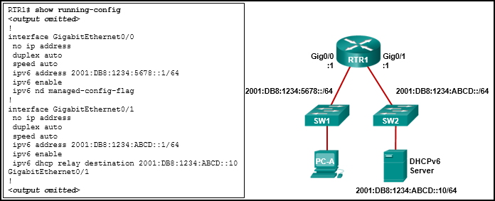

**Choices:**
- **A.** The ipv6 dhcp relay command should be applied to interface Gig0/0.
- **B.** The ipv6 nd managed-config-flag should be applied to interface Gig0/1.
- **C.** The ipv6 dhcp relay command should use the link-local address of the DHCP server.
- **D.** The ipv6 nd managed-config-flag command should be ipv6 nd other-config-flag .

**Correct Answer:**
The ipv6 dhcp relay command should be applied to interface Gig0/0.

**Explanation:**
Topic 8.4.7 The ipv6 dhcp relay command must be applied to the interface where the clients are located. The ipv6 dhcp relay command can use either the link-local or global unicast address of the DHCPv6 server, or even a multicast address. The ipv6 nd managed-config-flag indicates to the clients that they should use stateful DHCPv6 and is also applied to the interface where the clients are located.

---

## Question 57

**Question:**
Refer to the exhibit. A network administrator is configuring a router as a DHCPv6 server. The administrator issues a show ipv6 dhcp pool command to verify the configuration. Which statement explains the reason that the number of active clients is 0?

**Images:**

**Choices:**
- **A.** The default gateway address is not provided in the pool.
- **B.** No clients have communicated with the DHCPv6 server yet.
- **C.** The IPv6 DHCP pool configuration has no IPv6 address range specified.
- **D.** The state is not maintained by the DHCPv6 server under stateless DHCPv6 operation.

**Correct Answer:**
The state is not maintained by the DHCPv6 server under stateless DHCPv6 operation.

**Explanation:**
Topic 8.3.2 Under the stateless DHCPv6 configuration, indicated by the command ipv6 nd other-config-flag, the DHCPv6 server does not maintain the state information, because client IPv6 addresses are not managed by the DHCP server. Because the clients will configure their IPv6 addresses by combining the prefix/prefix-length and a self-generated interface ID, the ipv6 dhcp pool configuration does not need to specify the valid IPv6 address range. And because clients will use the link-local address of the router interface as the default gateway address, the default gateway address is not necessary.

---

## Question 58

**Question:**
Which FHRP implementation is Cisco-proprietary and permits only one router in a group to forward IPv6 packets?

**Choices:**
- **A.** VRRPv3
- **B.** HSRP
- **C.** HSRP for IPv6
- **D.** VRRPv2

**Correct Answer:**
HSRP for IPv6

**Explanation:**
Topic 9.1.4

---

## Question 59

**Question:**
Which FHRP implementation is a nonproprietary IPv4-only election protocol which has one master router per group?

**Choices:**
- **A.** HSRP for IPv6
- **B.** GLBP
- **C.** VRRPv2
- **D.** VRRPv3

**Correct Answer:**
VRRPv2

**Explanation:**
Topic 9.1.4

---

## Question 60

**Question:**
The address pool of a DHCP server is configured with 172.18.93.0/25. The network administrator reserves 10 IP addresses for web servers. How many IP addresses are left in the pool to be assigned to other hosts?

**Choices:**
- **A.** 106
- **B.** 117
- **C.** 114
- **D.** 120
- **E.** 116

**Correct Answer:**
116

**Explanation:**
Topic 7.2.2 Calculate the maximum number of hosts available for the slash value and subtract the required static IP addresses required for the devices. /24 = 254 hosts /25 = 126 hosts /26 = 62 hosts /27 = 30 hosts /28 = 14 hosts

---

## Question 61

**Question:**
The address pool of a DHCP server is configured with 10.3.2.0/24. The network administrator reserves 3 IP addresses for printers. How many IP addresses are left in the pool to be assigned to other hosts?

**Choices:**
- **A.** 252
- **B.** 241
- **C.** 255
- **D.** 249
- **E.** 251

**Correct Answer:**
251

**Explanation:**
Topic 7.2.2 CIDR Subnet Calculator Online

---

## Question 62

**Question:**
The address pool of a DHCP server is configured with 172.23.143.0/26. The network administrator reserves 14 IP addresses for file servers. How many IP addresses are left in the pool to be assigned to other hosts?

**Choices:**
- **A.** 58
- **B.** 48
- **C.** 50
- **D.** 61
- **E.** 40

**Correct Answer:**
48

**Explanation:**
Topic 7.2.2

---

## Question 63

**Question:**
The address pool of a DHCP server is configured with 10.7.30.0/24. The network administrator reserves 5 IP addresses for printers. How many IP addresses are left in the pool to be assigned to other hosts?

**Choices:**
- **A.** 253
- **B.** 239
- **C.** 249
- **D.** 250
- **E.** 247

**Correct Answer:**
249

**Explanation:**
Topic 7.2.2 Calculate the maximum number of hosts available for the slash value and subtract the required static IP addresses required for the devices. /24 = 254 hosts /25 = 126 hosts /26 = 62 hosts /27 = 30 hosts /28 = 14 hosts

---

## Question 64

**Question:**
Which FHRP implementation is a nonproprietary IPv4-only election protocol with limited scalability?

**Choices:**
- **A.** VRRPv2
- **B.** GLBP
- **C.** GLBP for IPv6
- **D.** IRDP

**Correct Answer:**
VRRPv2

**Explanation:**
Topic 9.1.4

---

## Question 65

**Question:**
The address pool of a DHCP server is configured with 192.168.184.0/26. The network administrator reserves 18 IP addresses for access points. How many IP addresses are left in the pool to be assigned to other hosts?

**Choices:**
- **A.** 57
- **B.** 44
- **C.** 54
- **D.** 36
- **E.** 46

**Correct Answer:**
44

**Explanation:**
Topic 7.2.2

---

## Question 66

**Question:**
The address pool of a DHCP server is configured with 10.19.44.0/24. The network administrator reserves 3 IP addresses for servers. How many IP addresses are left in the pool to be assigned to other hosts?

**Choices:**
- **A.** 255
- **B.** 252
- **C.** 241
- **D.** 251
- **E.** 249

**Correct Answer:**
251

**Explanation:**
Topic 7.2.2

---

## Question 67

**Question:**
The address pool of a DHCP server is configured with 10.19.44.0/24. The network administrator reserves 6 IP addresses for servers. How many IP addresses are left in the pool to be assigned to other hosts?

**Choices:**
- **A.** 246
- **B.** 252
- **C.** 249
- **D.** 248
- **E.** 238

**Correct Answer:**
248

**Explanation:**
Topic 7.2.2

---

## Question 68

**Question:**
The address pool of a DHCP server is configured with 172.21.121.0/25. The network administrator reserves 12 IP addresses for web servers. How many IP addresses are left in the pool to be assigned to other hosts?

**Choices:**
- **A.** 115
- **B.** 114
- **C.** 118
- **D.** 104
- **E.** 112

**Correct Answer:**
114

**Explanation:**
Topic 7.2.2 Calculate the maximum number of hosts available for the slash value and subtract the required static IP addresses required for the devices. /24 = 254 hosts /25 = 126 hosts /26 = 62 hosts /27 = 30 hosts /28 = 14 hosts

---

## Question 69

**Question:**
Which kind of message is sent by a DHCP client when its IP address lease is about to expire?​

**Choices:**
- **A.** a DHCPREQUEST broadcast message​
- **B.** a DHCPDISCOVER unicast message​
- **C.** a DHCPDISCOVER broadcast message
- **D.** a DHCPREQUEST unicast message​

**Correct Answer:**
a DHCPREQUEST unicast message​

**Explanation:**
Topic 7.1.4

---
