# CCNA 2 - Modules 14 - 16 Routing Concepts and Configuration Exam Answers

## Question 1

**Question:**
Which feature on a Cisco router permits the forwarding of traffic for which there is no specific route?

**Choices:**
- **A.** next-hop
- **B.** gateway of last resort
- **C.** route source
- **D.** outgoing interface

**Correct Answer:**
gateway of last resort

**Explanation:**
Topic 14.4.9 A default static route is used as a gateway of last resort to forward unknown destination traffic to a next hop/exit interface. The next-hop or exit interface is the destination to send traffic to on a network after the traffic is matched in a router. The route source is the location a route was learned from.

---

## Question 2

**Question:**
Which three advantages are provided by static routing? (Choose three.)

**Choices:**
- **A.** Static routing does not advertise over the network, thus providing better security.
- **B.** Configuration of static routes is error-free.
- **C.** Static routes scale well as the network grows.
- **D.** Static routing typically uses less network bandwidth and fewer CPU operations than dynamic routing does.
- **E.** The path a static route uses to send data is known.
- **F.** No intervention is required to maintain changing route information.

**Correct Answer:**
Static routing does not advertise over the network, thus providing better security.; Static routing typically uses less network bandwidth and fewer CPU operations than dynamic routing does.; The path a static route uses to send data is known.

**Explanation:**
Topic 14.5.1 Static routes are prone to errors from incorrect configuration by the administrator. They do not scale well, because the routes must be manually reconfigured to accommodate a growing network. Intervention is required each time a route change is necessary. They do provide better security, use less bandwidth, and provide a known path to the destination.

---

## Question 3

**Question:**
What are two functions of dynamic routing protocols? (Choose two.)

**Choices:**
- **A.** to maintain routing tables
- **B.** to assure low router overhead
- **C.** to avoid exposing network information
- **D.** to discover the network
- **E.** to choose the path that is specified by the administrator

**Correct Answer:**
to maintain routing tables; to discover the network

**Explanation:**
Topic 14.5.3 Dynamic routing protocols exist to discover the network, maintain routing tables, and calculate the best path. Having low levels of routing overhead, using the path specified by the administrator, and avoiding the exposure of network information are functions of static routing.

---

## Question 4

**Question:**
What is an advantage of using dynamic routing protocols instead of static routing?

**Choices:**
- **A.** easier to implement
- **B.** more secure in controlling routing updates
- **C.** fewer router resource overhead requirements
- **D.** ability to actively search for new routes if the current path becomes unavailable​

**Correct Answer:**
ability to actively search for new routes if the current path becomes unavailable​

**Explanation:**
Topic 14.5.3 Dynamic routing has the ability to search and find a new best path if the current path is no longer available. The other options are actually the advantages of static routing.

---

## Question 5

**Question:**
What happens to a static route entry in a routing table when the outgoing interface associated with that route goes into the down state?

**Choices:**
- **A.** The static route is removed from the routing table.
- **B.** The router polls neighbors for a replacement route.
- **C.** The router automatically redirects the static route to use another interface.
- **D.** The static route remains in the table because it was defined as static.

**Correct Answer:**
The static route is removed from the routing table.

**Explanation:**
Topic 14.1.6 When the interface associated with a static route goes down, the router will remove the route because it is no longer valid.

---

## Question 6

**Question:**
What is a characteristic of a static route that matches all packets?

**Choices:**
- **A.** It uses a single network address to send multiple static routes to one destination address.
- **B.** It identifies the gateway IP address to which the router sends all IP packets for which it does not have a learned or static route.
- **C.** It backs up a route already discovered by a dynamic routing protocol.
- **D.** It is configured with a higher administrative distance than the original dynamic routing protocol has.

**Correct Answer:**
It identifies the gateway IP address to which the router sends all IP packets for which it does not have a learned or static route.

**Explanation:**
Topic 15.3.1 A default static route is a route that matches all packets. It identifies the gateway IP address to which the router sends all IP packets for which it does not have a learned or static route. A default static route is simply a static route with 0.0.0.0/0 as the destination IPv4 address. Configuring a default static route creates a gateway of last resort.

---

## Question 7

**Question:**
When would it be more beneficial to use a dynamic routing protocol instead of static routing?

**Choices:**
- **A.** in an organization where routers suffer from performance issues
- **B.** on a stub network that has a single exit point
- **C.** in an organization with a smaller network that is not expected to grow in size
- **D.** on a network where there is a lot of topology changes

**Correct Answer:**
on a network where there is a lot of topology changes

**Explanation:**
Topic 14.5.1 Dynamic routing protocols consume more router resources, are suitable for larger networks, and are more useful on networks that are growing and changing.

---

## Question 8

**Question:**
Which route would be used to forward a packet with a source IP address of 192.168.10.1 and a destination IP address of 10.1.1.1?

**Choices:**
- **A.** C 192.168.10.0/30 is directly connected, GigabitEthernet0/1
- **B.** O 10.1.1.0/24 [110/65] via 192.168.200.2, 00:01:20, Serial0/1/0
- **C.** S* 0.0.0.0/0 [1/0] via 172.16.1.1
- **D.** S 10.1.0.0/16 is directly connected, GigabitEthernet0/0

**Correct Answer:**
O 10.1.1.0/24 [110/65] via 192.168.200.2, 00:01:20, Serial0/1/0

**Explanation:**
Topic 14.1.3 Even though OSPF has a higher administrative distance value (less trustworthy), the best match is the route in the routing table that has the most number of far left matching bits.

---

## Question 9

**Question:**
Refer to the exhibit. What is the administrative distance value of the route for router R1 to reach the destination IPv6 address of 2001:DB8:CAFE:4::A?

**Images:**
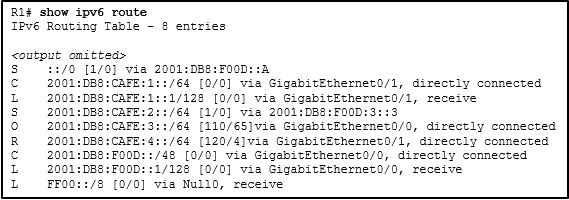

**Choices:**
- **A.** 120
- **B.** 110
- **C.** 1
- **D.** 4

**Correct Answer:**
120

**Explanation:**
Topic 14.4.3 The RIP route with the source code R is used to forward data to the destination IPv6 address of 2001:DB8:CAFE:4::A. This route has an AD value of 120.

---

## Question 10

**Question:**
Which value in a routing table represents trustworthiness and is used by the router to determine which route to install into the routing table when there are multiple routes toward the same destination?

**Choices:**
- **A.** administrative distance
- **B.** metric
- **C.** outgoing interface
- **D.** routing protocol

**Correct Answer:**
administrative distance

**Explanation:**
Topic 14.4.12 The administrative distance represents the trustworthiness of a particular route. The lower an administrative distance, the more trustworthy the learned route is. When a router learns multiple routes toward the same destination, the router uses the administrative distance value to determine which route to place into the routing table. A metric is used by a routing protocol to compare routes received from the routing protocol. An exit interface is the interface used to send a packet in the direction of the destination network. A routing protocol is used to exchange routing updates between two or more adjacent routers.

---

## Question 11

**Question:**
Refer to the graphic. Which command would be used on router A to configure a static route to direct traffic from LAN A that is destined for LAN C?

**Images:**
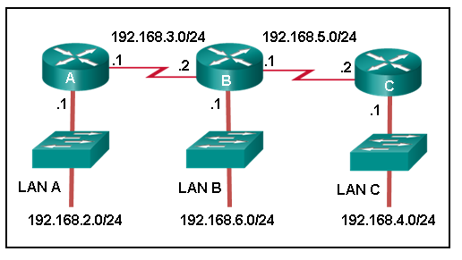

**Choices:**
- **A.** A(config)# ip route 192.168.3.0 255.255.255.0 192.168.3.1
- **B.** A(config)# ip route 192.168.3.2 255.255.255.0 192.168.4.0
- **C.** A(config)# ip route 192.168.4.0 255.255.255.0 192.168.5.2
- **D.** A(config)# ip route 192.168.5.0 255.255.255.0 192.168.3.2
- **E.** A(config)# ip route 192.168.4.0 255.255.255.0 192.168.3.2

**Correct Answer:**
A(config)# ip route 192.168.4.0 255.255.255.0 192.168.3.2

**Explanation:**
Topic 15.2.1 The destination network on LAN C is 192.168.4.0 and the next-hop address from the perspective of router A is 192.168.3.2.

---

## Question 12

**Question:**
On which two routers would a default static route be configured? (Choose two.)

**Choices:**
- **A.** any router where a backup route to dynamic routing is needed for reliability
- **B.** the router that serves as the gateway of last resort
- **C.** any router running an IOS prior to 12.0
- **D.** stub router connection to the rest of the corporate or campus network
- **E.** edge router connection to the ISP

**Correct Answer:**
stub router connection to the rest of the corporate or campus network; edge router connection to the ISP

**Explanation:**
Topic 15.3.1 A stub router or an edge router connected to an ISP has only one other router as a connection. A default static route works in those situations because all traffic will be sent to one destination. The destination router is the gateway of last resort. The default route is not configured on the gateway, but on the router sending traffic to the gateway. The router IOS does not matter.

---

## Question 13

**Question:**
Refer to the exhibit. This network has two connections to the ISP, one via router C and one via router B. The serial link between router A and router C supports EIGRP and is the primary link to the Internet. If the primary link fails, the administrator needs a floating static route that avoids recursive route lookups and any potential next-hop issues caused by the multiaccess nature of the Ethernet segment with router B. What should the administrator configure?

**Images:**
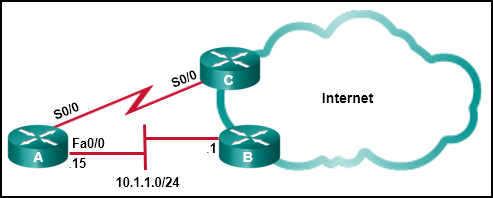

**Choices:**
- **A.** Create a static route pointing to 10.1.1.1 with an AD of 95.
- **B.** Create a fully specified static route pointing to Fa0/0 with an AD of 1.
- **C.** Create a fully specified static route pointing to Fa0/0 with an AD of 95.
- **D.** Create a static route pointing to 10.1.1.1 with an AD of 1.
- **E.** Create a static route pointing to Fa0/0 with an AD of 1.

**Correct Answer:**
Create a fully specified static route pointing to Fa0/0 with an AD of 95.

**Explanation:**
Topic 15.2.5 A floating static route is a static route with an administrative distance higher than that of another route already in the routing table. If the route in the table disappears, the floating static route will be put into the routing table in its place. Internal EIGRP has an AD of 90, so a floating static route in this scenario would need to have an AD higher than 90. Also, when creating a static route to a multiaccess interface like a FastEthernet segment a fully specified route should be used, with both a next-hop IP address and an exit interface. This prevents the router from doing a recursive lookup, but still ensures the correct next-hop device on the multiaccess segment forwards the packet.

---

## Question 14

**Question:**
What is a characteristic of a floating static route?

**Choices:**
- **A.** When it is configured, it creates a gateway of last resort.​
- **B.** It is used to provide load balancing between static routes.
- **C.** It is simply a static route with 0.0.0.0/0 as the destination IPv4 address.
- **D.** It is configured with a higher administrative distance than the original dynamic routing protocol has.

**Correct Answer:**
It is configured with a higher administrative distance than the original dynamic routing protocol has.

**Explanation:**
Topic 15.4.1 Floating static routes are static routes used to provide a backup path to a primary static or dynamic route, in the event of a link failure. They must be configured with a higher administrative distance than the original dynamic routing protocol has. A default static route is simply a static route with 0.0.0.0/0 as the destination IPv4 address. Configuring a default static route creates a gateway of last resort.

---

## Question 15

**Question:**
What network prefix and prefix-length combination is used to create a default static route that will match any IPv6 destination?

**Choices:**
- **A.** FFFF::/128
- **B.** ::1/64
- **C.** ::/128
- **D.** ::/0

**Correct Answer:**
::/0

**Explanation:**
Topic 15.3.1 A default static route configured for IPv6, is a network prefix of all zeros and a prefix mask of 0 which is expressed as ::/0.

---

## Question 16

**Question:**
Consider the following command: ip route 192.168.10.0 255.255.255.0 10.10.10.2 5 What does the 5 at the end of the command signify?

**Choices:**
- **A.** exit interface
- **B.** maximum number of hops to the 192.168.10.0/24 network
- **C.** metric
- **D.** administrative distance

**Correct Answer:**
administrative distance

**Explanation:**
Topic 15.1.3 The 5 at the end of the command signifies administrative distance. This value is added to floating static routes or routes that only appear in the routing table when the preferred route has gone down. The 5 at the end of the command signifies administrative distance configured for the static route. This value indicates that the floating static route will appear in the routing table when the preferred route (with an administrative distance less than 5) is down.

---

## Question 17

**Question:**
Refer to the exhibit. The routing table for R2 is as follows: Gateway of last resort is not set 10.0.0.0/30 is subnetted, 2 subnets C 10.0.0.0 is directly connected, Serial0/0/0 C 10.0.0.4 is directly connected, Serial0/0/1 192.168.10.0/26 is subnetted, 3 subnets S 192.168.10.0 is directly connected, Serial0/0/0 C 192.168.10.64 is directly connected, FastEthernet0/0 S 192.168.10.128 [1/0] via 10.0.0.6 What will router R2 do with a packet destined for 192.168.10.129?

**Images:**
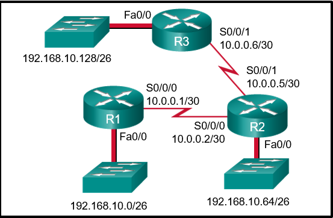

**Choices:**
- **A.** send the packet out interface FastEthernet0/0
- **B.** send the packet out interface Serial0/0/1
- **C.** drop the packet
- **D.** send the packet out interface Serial0/0/0

**Correct Answer:**
send the packet out interface Serial0/0/1

**Explanation:**
Topic 15.2.1 When a static route is configured with the next hop address (as in the case of the 192.168.10.128 network), the output of the show ip route command lists the route as “via” a particular IP address. The router has to look up that IP address to determine which interface to send the packet out. Because the IP address of 10.0.0.6 is part of network 10.0.0.4, the router sends the packet out interface Serial0/0/1.

---

## Question 18

**Question:**
An administrator issues the ipv6 route 2001:db8:acad:1::/32 gigabitethernet0/0 2001:db8:acad:6::1 100 command on a router. What administrative distance is assigned to this route?

**Choices:**
- **A.** 0
- **B.** 1
- **C.** 32
- **D.** 100

**Correct Answer:**
100

**Explanation:**
Topic 15.1.4 The command ipv6 route 2001:db8:acad:1::/32 gigabitethernet0/0 2001:db8:acad:6::1 100 will configure a floating static route on a router. The 100 at the end of the command specifies the administrative distance of 100 to be applied to the route.

---

## Question 19

**Question:**
Refer to the exhibit. Which default static route command would allow R1 to potentially reach all unknown networks on the Internet?

**Images:**
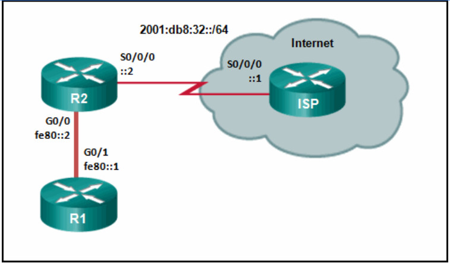

**Choices:**
- **A.** R1(config)# ipv6 route 2001:db8:32::/64 G0/0
- **B.** R1(config)# ipv6 route ::/0 G0/0 fe80::2
- **C.** R1(config)# ipv6 route 2001:db8:32::/64 G0/1 fe80::2
- **D.** R1(config)# ipv6 route ::/0 G0/1 fe80::2

**Correct Answer:**
R1(config)# ipv6 route ::/0 G0/1 fe80::2

**Explanation:**
Topic 15.2.6 To route packets to unknown IPv6 networks a router will need an IPv6 default route. The static route ipv6 route ::/0 G0/1 fe80::2 will match all networks and send packets out the specified exit interface G0/1 toward R2.

---

## Question 20

**Question:**
Refer to the exhibit. The network engineer for the company that is shown wants to use the primary ISP connection for all external connectivity. The backup ISP connection is used only if the primary ISP connection fails. Which set of commands would accomplish this goal?

**Images:**

**Choices:**
- **A.** ip route 0.0.0.0 0.0.0.0 s0/0/0 ip route 0.0.0.0 0.0.0.0 s0/1/0
- **B.** ip route 0.0.0.0 0.0.0.0 s0/0/0 ip route 0.0.0.0 0.0.0.0 s0/1/0 10
- **C.** ip route 198.133.219.24 255.255.255.252 ip route 64.100.210.80 255.255.255.252 10
- **D.** ip route 198.133.219.24 255.255.255.252 ip route 64.100.210.80 255.255.255.252

**Correct Answer:**
ip route 0.0.0.0 0.0.0.0 s0/0/0 ip route 0.0.0.0 0.0.0.0 s0/1/0 10

**Explanation:**
Topic 15.4.1 A static route that has no administrative distance added as part of the command has a default administrative distance of 1. The backup link should have a number higher than 1. The correct answer has an administrative distance of 10. The other quad zero route would load balance packets across both links and both links would appear in the routing table. The remaining answers are simply static routes (either a default route or a floating static default route).

---

## Question 21

**Question:**
Refer to the exhibit. Which set of commands will configure static routes that will allow the Park and the Alta routers to a) forward packets to each LAN and b) direct all other traffic to the Internet?

**Images:**
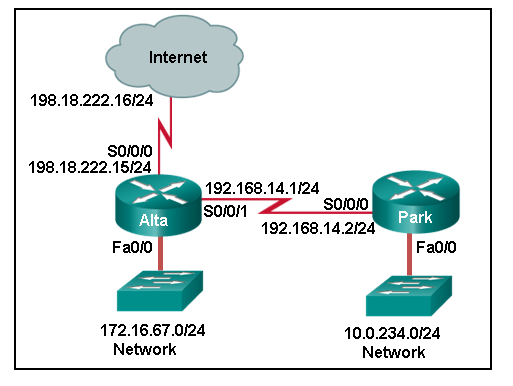

**Choices:**
- **A.** Park(config)# ip route 0.0.0.0 0.0.0.0 192.168.14.1 Alta(config)# ip route 10.0.234.0 255.255.255.0 192.168.14.2 Alta(config)# ip route 0.0.0.0 0.0.0.0 s0/0/0
- **B.** Park(config)# ip route 0.0.0.0 0.0.0.0 192.168.14.1 Alta(config)# ip route 10.0.234.0 255.255.255.0 192.168.14.2 Alta(config)# ip route 198.18.222.0 255.255.255.255 s0/0/0
- **C.** Park(config)# ip route 172.16.67.0 255.255.255.0 192.168.14.1 Park(config)# ip route 0.0.0.0 0.0.0.0 192.168.14.1 Alta(config)# ip route 10.0.234.0 255.255.255.0 192.168.14.2
- **D.** Park(config)# ip route 172.16.67.0 255.255.255.0 192.168.14.1 Alta(config)# ip route 10.0.234.0 255.255.255.0 192.168.14.2 Alta(config)# ip route 0.0.0.0 0.0.0.0 s0/0/1

**Correct Answer:**
Park(config)# ip route 0.0.0.0 0.0.0.0 192.168.14.1 Alta(config)# ip route 10.0.234.0 255.255.255.0 192.168.14.2 Alta(config)# ip route 0.0.0.0 0.0.0.0 s0/0/0

**Explanation:**
Topic 15.3.1 The LAN connected to the router Park is a stud network, therefore, a default route should be used to forward network traffic destined to non-local networks. The router Alta connects to both the internet and the Park router, it would require two static routes configured, one toward the internet and the other toward the LAN connected to the router Park.

---

## Question 22

**Question:**
Refer to the exhibit. The small company shown uses static routing. Users on the R2 LAN have reported a problem with connectivity. What is the issue?

**Images:**

**Choices:**
- **A.** R1 needs a static route to the R2 LAN.
- **B.** R2 needs a static route to the R1 LANs.
- **C.** R1 needs a default route to R2.
- **D.** R2 needs a static route to the Internet.
- **E.** R1 and R2 must use a dynamic routing protocol.

**Correct Answer:**
R1 needs a static route to the R2 LAN.

**Explanation:**
Topic 14.4.2 R1 has a default route to the Internet. R2 has a default route to R1. R1 is missing a static route for the 10.0.60.0 network. Any traffic that reached R1 and is destined for 10.0.60.0/24 will be routed to the ISP.

---

## Question 23

**Question:**
Refer to the exhibit. An administrator is attempting to install an IPv6 static route on router R1 to reach the network attached to router R2. After the static route command is entered, connectivity to the network is still failing. What error has been made in the static route configuration?

**Images:**
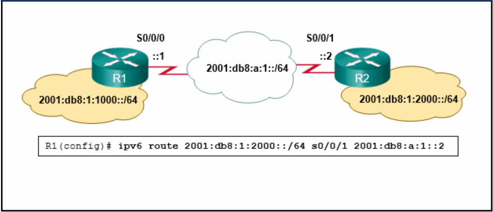

**Choices:**
- **A.** The next hop address is incorrect.
- **B.** The interface is incorrect.
- **C.** The destination network is incorrect.
- **D.** The network prefix is incorrect.

**Correct Answer:**
The interface is incorrect.

**Explanation:**
Topic 15.1.4 In this example the interface in the static route is incorrect. The interface should be the exit interface on R1, which is s0/0/0.

---

## Question 24

**Question:**
Refer to the exhibit. How was the host route 2001:DB8:CAFE:4::1/128 installed in the routing table?

**Images:**
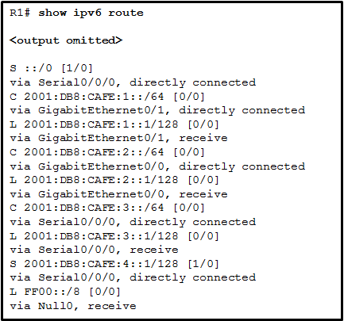

**Choices:**
- **A.** The route was dynamically created by router R1.
- **B.** The route was dynamically learned from another router.
- **C.** The route was manually entered by an administrator.
- **D.** The route was automatically installed when an IP address was configured on an active interface.

**Correct Answer:**
The route was manually entered by an administrator.

**Explanation:**
Topic 15.5.3 A host route is an IPv6 route with a 128-bit mask. A host route can be installed in a routing table automatically when an IP address is configured on a router interface or manually if a static route is created.

---

## Question 25

**Question:**
Refer to the exhibit. HostA is attempting to contact ServerB. Which two statements correctly describe the addressing that HostA will generate in the process? (Choose two.)

**Images:**

**Choices:**
- **A.** A packet with the destination IP address of RouterA.
- **B.** A frame with the destination MAC address of SwitchA.
- **C.** A packet with the destination IP address of ServerB.
- **D.** A frame with the destination MAC address of RouterA.
- **E.** A frame with the destination MAC address of ServerB.
- **F.** A packet with the destination IP address of RouterB.

**Correct Answer:**
A packet with the destination IP address of ServerB.; A frame with the destination MAC address of RouterA.

**Explanation:**
Topic 14.2.2 In order to send data to ServerB, HostA will generate a packet that contains the IP address of the destination device on the remote network and a frame that contains the MAC address of the default gateway device on the local network.

---

## Question 26

**Question:**
Refer to the exhibit. A ping from R1 to 10.1.1.2 is successful, but a ping from R1 to any address in the 192.168.2.0 network fails. What is the cause of this problem?

**Images:**
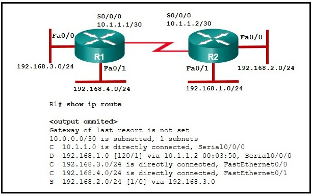

**Choices:**
- **A.** There is no gateway of last resort at R1.
- **B.** The static route for 192.168.2.0 is incorrectly configured.
- **C.** A default route is not configured on R1.
- **D.** The serial interface between the two routers is down.

**Correct Answer:**
The static route for 192.168.2.0 is incorrectly configured.

**Explanation:**
Topic 15.2.1

---

## Question 27

**Question:**
Refer to the exhibit. An administrator is attempting to install a default static route on router R1 to reach the Site B network on router R2. After entering the static route command, the route is still not showing up in the routing table of router R1. What is preventing the route from installing in the routing table?

**Images:**
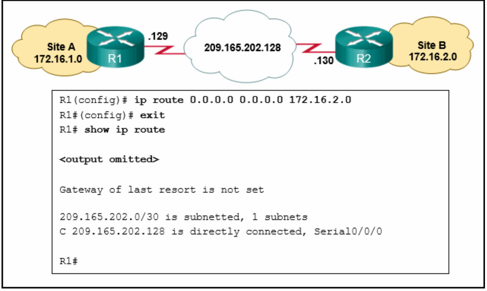

**Choices:**
- **A.** The netmask is incorrect.
- **B.** The exit interface is missing.
- **C.** The next hop address is incorrect.
- **D.** The destination network is incorrect.

**Correct Answer:**
The next hop address is incorrect.

**Explanation:**
Topic 15.2.1 The next hop address is incorrect. From R1 the next hop address should be that of the serial interface of R2, 209.165.202.130.

---

## Question 28

**Question:**
Refer to the exhibit. The Branch Router has an OSPF neighbor relationship with the HQ router over the 198.51.0.4/30 network. The 198.51.0.8/30 network link should serve as a backup when the OSPF link goes down. The floating static route command ip route 0.0.0.0 0.0.0.0 S0/1/1 100 was issued on Branch and now traffic is using the backup link even when the OSPF link is up and functioning. Which change should be made to the static route command so that traffic will only use the OSPF link when it is up?

**Images:**
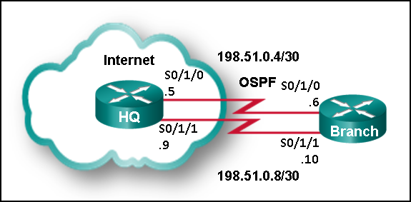

**Choices:**
- **A.** Add the next hop neighbor address of 198.51.0.8.
- **B.** Change the administrative distance to 1.
- **C.** Change the destination network to 198.51.0.5.
- **D.** Change the administrative distance to 120.

**Correct Answer:**
Change the administrative distance to 120.

**Explanation:**
Topic 15.4.1 The problem with the current floating static route is that the administrative distance is set too low. The administrative distance will need to be higher than that of OSPF, which is 110, so that the router will only use the OSPF link when it is up.

---

## Question 29

**Question:**
What characteristic completes the following statement? When an IPv6 static route is configured, the next-hop address can be ……

**Choices:**
- **A.** a destination host route with a /128 prefix.
- **B.** the “show ipv6 route static” command.
- **C.** an IPv6 link-local address on the adjacent router.
- **D.** the interface type and interface number.

**Correct Answer:**
an IPv6 link-local address on the adjacent router.

**Explanation:**
Topic 15.5.6

---

## Question 30

**Question:**
Gateway of last resort is not set. 172.19.115.0/26 is variously subnetted, 7 subnets, 3 masks O 172.19.115.0/26 [110/10] via 172.19.39.1, 00:00:24, Serial0/0/0 O 172.19.115.64/26 [110/20] via 172.19.39.6, 00:00:56, Serial 0/0/1 O 172.19.115.128/26 [110/10] via 172.19.39.1, 00:00:24, Serial 0/0/0 C 172.19.115.192/27 is directly connected, GigabitEthernet0/0 L 172.19.115.193/27 is directly connected, GigabitEthernet0/0 C 172.19.115.224/27 is directly connected, GigabitEthernet0/1 L 172.19.115.225/27 is directly connected, GigabitEthernet0/1 172.19.39.0/24 is variably subnetted, 4 subnets, 2 masks C 172.19.39.0/30 is directly connected, Serial0/0/0 L 172.19.39.2/32 is directly connected, Serial0/0/0 C 172.19.39.4/30 is directly connected, Serial0/0/1 L 172.19.39.5/32 is directly connected, Serial0/0/1 S 172.19.40.0/26 [1/0] via 172.19.39.1, 00:00:24, Serial0/0/0 R1# Refer to the exhibit. Which interface will be the exit interface to forward a data packet that has the destination IP address 172.19.115.206?

**Choices:**
- **A.** GigabitEthernet0/1
- **B.** None, the packet will be dropped.
- **C.** GigabitEthernet0/0
- **D.** Serial0/0/1

**Correct Answer:**
GigabitEthernet0/0

**Explanation:**
Topic 14.1.3

---

## Question 31

**Question:**
Refer to the exhibit. What routing solution will allow both PC A and PC B to access the Internet with the minimum amount of router CPU and network bandwidth utilization?

**Images:**
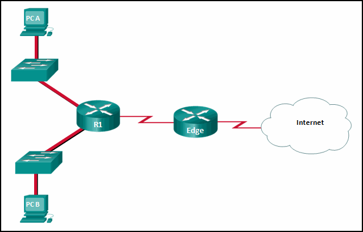

**Choices:**
- **A.** Configure a dynamic routing protocol between R1 and Edge and advertise all routes.
- **B.** Configure a static route from R1 to Edge and a dynamic route from Edge to R1.
- **C.** Configure a static default route from R1 to Edge, a default route from Edge to the Internet, and a static route from Edge to R1.
- **D.** Configure a dynamic route from R1 to Edge and a static route from Edge to R1.

**Correct Answer:**
Configure a static default route from R1 to Edge, a default route from Edge to the Internet, and a static route from Edge to R1.

**Explanation:**
Topic 14.4.5 Two routes have to be created: a default route in R1 to reach Edge and a static route in Edge to reach R1 for the return traffic. This is a best solution once PC A and PC B belong to stub networks. Moreover, static routing consumes less bandwidth than dynamic routing.

---

## Question 32

**Question:**
Refer to the exhibit. What would happen after the IT administrator enters the new static route?

**Images:**
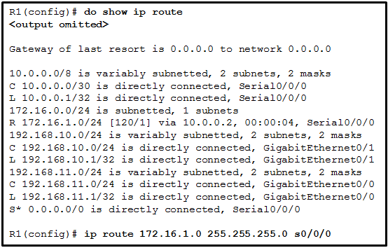

**Choices:**
- **A.** The 172.16.1.0 static route would be entered into the running-config but not shown in the routing table.
- **B.** The 172.16.1.0 route learned from RIP would be replaced with the 172.16.1.0 static route.
- **C.** The 0.0.0.0 default route would be replaced with the 172.16.1.0 static route.
- **D.** The 172.16.1.0 static route is added to the existing routes in the routing table.

**Correct Answer:**
The 172.16.1.0 route learned from RIP would be replaced with the 172.16.1.0 static route.

**Explanation:**
Topic 14.4.12 A route will be installed in a routing table if there is not another routing source with a lower administrative distance. If a route with a lower administrative distance to the same destination network as a current route is entered, the route with the lower administrative distance will replace the route with a higher administrative distance.

---

## Question 33

**Question:**
What two pieces of information are needed in a fully specified static route to eliminate recursive lookups? (Choose two.)

**Choices:**
- **A.** the interface ID of the next-hop neighbor
- **B.** the interface ID exit interface
- **C.** the IP address of the exit interface
- **D.** the IP address of the next-hop neighbor
- **E.** the administrative distance for the destination network

**Correct Answer:**
the interface ID exit interface; the IP address of the next-hop neighbor

**Explanation:**
Topic 15.1.2 A fully specified static route can be used to avoid recursive routing table lookups by the router. A fully specified static route contains both the IP address of the next-hop router and the ID of the exit interface.

---

## Question 34

**Question:**
Refer to the exhibit. Which command will properly configure an IPv6 static route on R2 that will allow traffic from PC2 to reach PC1 without any recursive lookups by router R2?

**Images:**
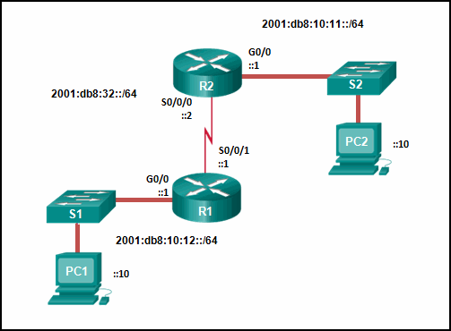

**Choices:**
- **A.** R2(config)# ipv6 route ::/0 2001:db8:32::1
- **B.** R2(config)# ipv6 route 2001:db8:10:12::/64 S0/0/0
- **C.** R2(config)# ipv6 route 2001:db8:10:12::/64 2001:db8:32::1
- **D.** R2(config)# ipv6 route 2001:db8:10:12::/64 S0/0/1

**Correct Answer:**
R2(config)# ipv6 route 2001:db8:10:12::/64 S0/0/0

**Explanation:**
Topic 15.2.4 A nonrecursive route must have an exit interface specified from which the destination network can be reached. In this example 2001:db8:10:12::/64 is the destination network and R2 will use exit interface S0/0/0 to reach that network. Therefore, the static route would be ipv6 route 2001:db8:10:12::/64 S0/0/0.

---

## Question 35

**Question:**
Refer to the exhibit. Which static route would an IT technician enter to create a backup route to the 172.16.1.0 network that is only used if the primary RIP learned route fails?

**Images:**

**Choices:**
- **A.** ip route 172.16.1.0 255.255.255.0 s0/0/0
- **B.** ip route 172.16.1.0 255.255.255.0 s0/0/0 121
- **C.** ip route 172.16.1.0 255.255.255.0 s0/0/0 111
- **D.** ip route 172.16.1.0 255.255.255.0 s0/0/0 91

**Correct Answer:**
ip route 172.16.1.0 255.255.255.0 s0/0/0 121

**Explanation:**
Topic 15.4.1 A backup static route is called a floating static route. A floating static route has an administrative distance greater than the administrative distance of another static route or dynamic route.

---

## Question 36

**Question:**
Open the PT Activity. Perform the tasks in the activity instructions and then answer the question. Modules 14 – 16: Routing Concepts and Configuration Exam A user reports that PC0 cannot visit the web server www.server.com. Troubleshoot the network configuration to identify the problem. Modules 14 - 16: Routing Concepts and Configuration 1 file(s) 488.03 KB Download What is the cause of the problem?

**Images:**
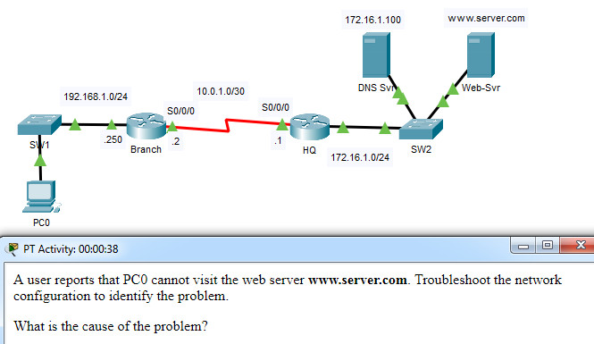

**Choices:**
- **A.** The clock rate on one of the serial links is configured incorrectly.
- **B.** A serial interface on Branch is configured incorrectly.
- **C.** The DNS server address on PC0 is configured incorrectly.
- **D.** Routing between HQ and Branch is configured incorrectly.

**Correct Answer:**
Routing between HQ and Branch is configured incorrectly.

**Explanation:**
Topic 16.2.3 In order to allow communication to remote networks, proper routing, either static or dynamic, is necessary. Both routers must be configured with a routing method.

---

## Question 37

**Question:**
Match the routing table entry to the corresponding function. (Not all options are used.)

**Images:**
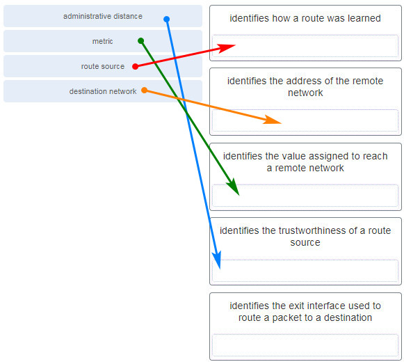

**Explanation:**
Topic 14.4.3

---

## Question 38

**Question:**
Refer to the exhibit. PC A sends a request to Server B. What IPv4 address is used in the destination field in the packet as the packet leaves PC A?

**Images:**
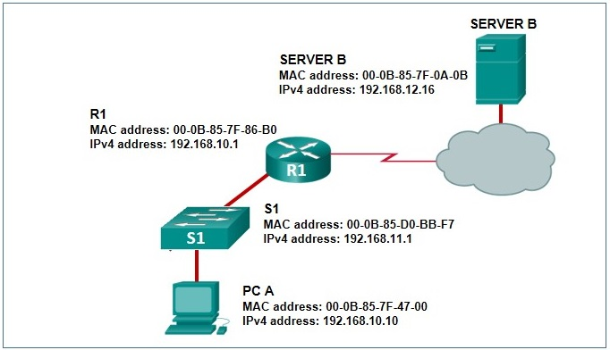

**Choices:**
- **A.** 192.168.11.1
- **B.** 192.168.10.1
- **C.** 192.168.12.16
- **D.** 192.168.10.10

**Correct Answer:**
192.168.12.16

**Explanation:**
Topic 14.2.2 The destination IP address in packets does not change along the path between the source and destination.

---

## Question 39

**Question:**
What does R1 use as the MAC address of the destination when constructing the frame that will go from R1 to Server B?

**Images:**
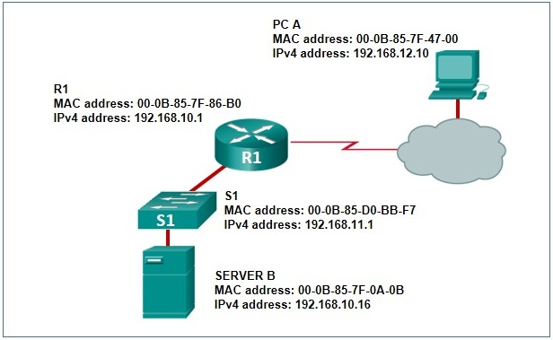

**Choices:**
- **A.** If the destination MAC address that corresponds to the IPv4 address is not in the ARP cache, R1 sends an ARP request.
- **B.** R1 uses the destination MAC address of S1.
- **C.** The packet is encapsulated into a PPP frame, and R1 adds the PPP destination address to the frame.
- **D.** R1 leaves the field blank and forwards the data to the PC.

**Correct Answer:**
If the destination MAC address that corresponds to the IPv4 address is not in the ARP cache, R1 sends an ARP request.

**Explanation:**
Topic 14.2.1 Communication inside a local network uses Address Resolution Protocol to obtain a MAC address from a known IPv4 address. A MAC address is needed to construct the frame in which the packet is encapsulated.

---

## Question 40

**Question:**
What route would have the lowest administrative distance?

**Choices:**
- **A.** a route received through the OSPF routing protocol
- **B.** a directly connected network
- **C.** a static route
- **D.** a route received through the EIGRP routing protocol

**Correct Answer:**
a directly connected network

**Explanation:**
Topic 14.4.12 The most believable route or the route with the lowest administrative distance is one that is directly connected to a router.

---

## Question 41

**Question:**
What characteristic completes the following statement? When an IPv6 static route is configured, as a backup route to a static route in the routing table, the “distance” command is used with ……

**Choices:**
- **A.** the “show ipv6 route static” command.
- **B.** an administrative distance of 2.
- **C.** a destination host route with a /128 prefix.
- **D.** the interface type and interface number.

**Correct Answer:**
an administrative distance of 2.

**Explanation:**
Topic 15.4.1

---

## Question 42

**Question:**
A router has used the OSPF protocol to learn a route to the 172.16.32.0/19 network. Which command will implement a backup floating static route to this network?

**Choices:**
- **A.** ip route 172.16.0.0 255.255.224.0 S0/0/0 100
- **B.** ip route 172.16.0.0 255.255.240.0 S0/0/0 200
- **C.** ip route 172.16.32.0 255.255.224.0 S0/0/0 200
- **D.** ip route 172.16.32.0 255.255.0.0 S0/0/0 100

**Correct Answer:**
ip route 172.16.32.0 255.255.224.0 S0/0/0 200

**Explanation:**
Topic 15.4.1 OSPF has an administrative distance of 110, so the floating static route must have an administrative distance higher than 110. Because the target network is 172.16.32.0/19, that static route must use the network 172.16.32.0 and a netmask of 255.255.224.0.

---

## Question 43

**Question:**
Consider the following command: Copy ip route 192.168.10.0 255.255.255.0 10.10.10.2 5 How would an administrator test this configuration?

**Choices:**
- **A.** Delete the default gateway route on the router.
- **B.** Manually shut down the router interface used as a primary route.
- **C.** Ping from the 192.168.10.0 network to the 10.10.10.2 address.
- **D.** Ping any valid address on the 192.168.10.0/24 network.

**Correct Answer:**
Manually shut down the router interface used as a primary route.

**Explanation:**
Topic 15.4.3 A floating static is a backup route that only appears in the routing table when the interface used with the primary route is down. To test a floating static route, the route must be in the routing table. Therefore, shutting down the interface used as a primary route would allow the floating static route to appear in the routing table.

---

## Question 44

**Question:**
Refer to the exhibit. Which type of IPv6 static route is configured in the exhibit?

**Images:**

**Choices:**
- **A.** floating static route
- **B.** fully specified static route
- **C.** recursive static route
- **D.** directly attached static route

**Correct Answer:**
recursive static route

**Explanation:**
Topic 15.1.4 The route provided points to another address that must be looked up in the routing table. This makes the route a recursive static route.

---

## Question 45

**Question:**
What characteristic completes the following statement? When an IPv6 static route is configured, it is first necessary to configure ……

**Choices:**
- **A.** the next-hop address of two different adjacent routers.
- **B.** the “ipv6 unicast-routing” command.
- **C.** an IPv6 link-local address on the adjacent router.
- **D.** an administrative distance of 2.

**Correct Answer:**
the “ipv6 unicast-routing” command.

**Explanation:**
Topic 15.1.4

---

## Question 46

**Question:**
Gateway of last resort is not set. Copy 172.18.109.0/26 is variously subnetted, 7 subnets, 3 masks O 172.18.109.0/26 [110/10] via 172.18.32.1, 00:00:24, Serial0/0/0 O 172.18.109.64/26 [110/20] via 172.18.32.6, 00:00:56, Serial 0/0/1 O 172.18.109.128/26 [110/10] via 172.18.32.1, 00:00:24, Serial 0/0/0 C 172.18.109.192/27 is directly connected, GigabitEthernet0/0 L 172.18.109.193/27 is directly connected, GigabitEthernet0/0 C 172.18.109.224/27 is directly connected, GigabitEthernet0/1 L 172.18.109.225/27 is directly connected, GigabitEthernet0/1 172.18.32.0/24 is variably subnetted, 4 subnets, 2 masks C 172.18.32.0/30 is directly connected, Serial0/0/0 L 172.18.32.2/32 is directly connected, Serial0/0/0 C 172.18.32.4/30 is directly connected, Serial0/0/1 L 172.18.32.5/32 is directly connected, Serial0/0/1 S 172.18.33.0/26 [1/0] via 172.18.32.1, 00:00:24, Serial0/0/0 R1# Refer to the exhibit. Which interface will be the exit interface to forward a data packet that has the destination IP address 172.18.109.152?

**Choices:**
- **A.** GigabitEthernet0/0
- **B.** GigabitEthernet0/1
- **C.** Serial0/0/0
- **D.** None, the packet will be dropped.

**Correct Answer:**
Serial0/0/0

**Explanation:**
Topic 14.1.3

---

## Question 47

**Question:**
Refer to the exhibit. What will the router do with a packet that has a destination IP address of 192.168.12.227?

**Images:**
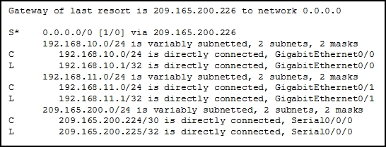

**Choices:**
- **A.** Drop the packet.
- **B.** Send the packet out the GigabitEthernet0/0 interface.
- **C.** Send the packet out the Serial0/0/0 interface.
- **D.** Send the packet out the GigabitEthernet0/1 interface.

**Correct Answer:**
Send the packet out the Serial0/0/0 interface.

**Explanation:**
Topic 14.4.9 After a router determines the destination network by ANDing the destination IP address with the subnet mask, the router examines the routing table for the resulting destination network number. When a match is found, the packet is sent to the interface associated with the network number. When no routing table entry is found for the particular network, the default gateway or gateway of last resort (if configured or known) is used. If there is no gateway of last resort, the packet is dropped. In this instance, the 192.168.12.224 network is not found in the routing table and the router uses the gateway of last resort. The gateway of last resort is the IP address of 209.165.200.226. The router knows this is an IP address that is associated with the 209.165.200.224 network. The router then proceeds to transmit the packet out the Serial0/0/0 interface, or the interface that is associated with 209.165.200.224.

---

## Question 48

**Question:**
Consider the following command: Copy ip route 192.168.10.0 255.255.255.0 10.10.10.2 5 Which route would have to go down in order for this static route to appear in the routing table?

**Choices:**
- **A.** a default route
- **B.** a static route to the 192.168.10.0/24 network
- **C.** an OSPF-learned route to the 192.168.10.0/24 network
- **D.** an EIGRP-learned route to the 192.168.10.0/24 network

**Correct Answer:**
a static route to the 192.168.10.0/24 network

**Explanation:**
Topic 15.4.1 The administrative distance of 5 added to the end of the static route creates a floating static situation for a static route that goes down. Static routes have a default administrative distance of 1. This route that has an administrative distance of 5 will not be placed into the routing table unless the previously entered static route to the 192.168.10.0/24 goes down or was never entered. The administrative distance of 5 added to the end of the static route configuration creates a floating static route that will be placed in the routing table when the primary route to the same destination network goes down. By default, a static route to the 192.168.10.0/24 network has an administrative distance of 1. Therefore, the floating route with an administrative distance of 5 will not be placed into the routing table unless the previously entered static route to the 192.168.10.0/24 goes down or was never entered. Because the floating route has an administrative distance of 5, the route is preferred to an OSPF-learned route (with the administrative distance of 110) or an EIGRP-learned route (with the administrative distance of 110) to the same destination network.

---

## Question 49

**Question:**
What are two advantages of static routing over dynamic routing? (Choose two.)

**Choices:**
- **A.** Static routing is more secure because it does not advertise over the network.
- **B.** Static routing scales well with expanding networks.
- **C.** Static routing requires very little knowledge of the network for correct implementation.
- **D.** Static routing uses fewer router resources than dynamic routing.
- **E.** Static routing is relatively easy to configure for large networks.

**Correct Answer:**
Static routing is more secure because it does not advertise over the network.; Static routing uses fewer router resources than dynamic routing.

**Explanation:**
Topic 14.5.1 Static routing requires a thorough understanding of the entire network for proper implementation. It can be prone to errors and does not scale well for large networks. Static routing uses fewer router resources, because no computing is required for updating routes. Static routing can also be more secure because it does not advertise over the network.

---

## Question 50

**Question:**
What characteristic completes the following statement? When an IPv6 static route is configured, it is possible that the same IPv6 link-local address is used for …

**Choices:**
- **A.** a destination host route with a /128 prefix.
- **B.** the “ipv6 unicast-routing” command.
- **C.** the next-hop address of two different adjacent routers.
- **D.** an administrative distance of 2.

**Correct Answer:**
the next-hop address of two different adjacent routers.

**Explanation:**
Topic 15.2.6

---

## Question 51

**Question:**
A network administrator configures the interface fa0/0 on the router R1 with the command ip address 172.16.1.254 255.255.255.0. However, when the administrator issues the command show ip route, the routing table does not show the directly connected network. What is the possible cause of the problem?

**Choices:**
- **A.** The subnet mask is incorrect for the IPv4 address.
- **B.** The configuration needs to be saved first.
- **C.** The interface fa0/0 has not been activated.
- **D.** No packets with a destination network of 172.16.1.0 have been sent to R1.

**Correct Answer:**
The interface fa0/0 has not been activated.

**Explanation:**
Topic 14.4.4 A directly connected network will be added to the routing table when these three conditions are met: (1) the interface is configured with a valid IP address; (2) it is activated with no shutdown command; and (3) it receives a carrier signal from another device that is connected to the interface. An incorrect subnet mask for an IPv4 address will not prevent its appearance in the routing table, although the error may prevent successful communications.

---

## Question 52

**Question:**
Refer to the exhibit. What command would be used to configure a static route on R1 so that traffic from both LANs can reach the 2001:db8:1:4::/64 remote network?

**Images:**
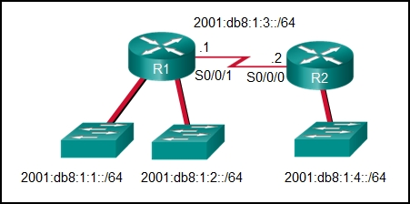

**Choices:**
- **A.** ipv6 route 2001:db8:1:4::/64 2001:db8:1:3::1
- **B.** ipv6 route 2001:db8:1::/65 2001:db8:1:3::1
- **C.** ipv6 route ::/0 serial0/0/0
- **D.** ipv6 route 2001:db8:1:4::/64 2001:db8:1:3::2

**Correct Answer:**
ipv6 route 2001:db8:1:4::/64 2001:db8:1:3::2

**Explanation:**
Topic 15.2.2 To configure an IPv6 static route, use the ipv6 route command followed by the destination network. Then add either the IP address of the adjacent router or the interface R1 will use to transmit a packet to the 2001:db8:1:4::/64 network.

---

## Question 53

**Question:**
Refer to the exhibit. What two commands will change the next-hop address for the 10.0.0.0/8 network from 172.16.40.2 to 192.168.1.2? (Choose two.)

**Images:**
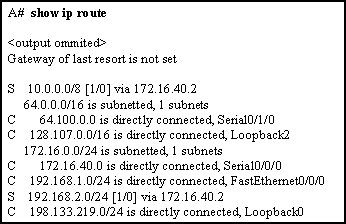

**Choices:**
- **A.** A(config)# ip route 10.0.0.0 255.0.0.0 192.168.1.2
- **B.** A(config)# ip route 10.0.0.0 255.0.0.0 s0/0/0
- **C.** A(config)# no ip address 10.0.0.1 255.0.0.0 172.16.40.2
- **D.** A(config)# no network 10.0.0.0 255.0.0.0 172.16.40.2
- **E.** A(config)# no ip route 10.0.0.0 255.0.0.0 172.16.40.2

**Correct Answer:**
A(config)# ip route 10.0.0.0 255.0.0.0 192.168.1.2; A(config)# no ip route 10.0.0.0 255.0.0.0 172.16.40.2

**Explanation:**
Topic 15.1.3 The two required commands are A(config)# no ip route 10.0.0.0 255.0.0.0 172.16.40.2 and A(config)# ip route 10.0.0.0 255.0.0.0 192.168.1.2.

---

## Question 54

**Question:**
Refer to the exhibit. Which interface will be the exit interface to forward a data packet that has the destination IP address 192.168.139.244? Copy Gateway of last resort is not set. 192.168.139.0/26 is variously subnetted, 7 subnets, 3 masks O 192.168.139.0/26 [110/10] via 192.168.70.1, 00:00:24, Serial0/0/0 O 192.168.139.64/26 [110/20] via 192.168.70.6, 00:00:56, Serial 0/0/1 O 192.168.139.128/26 [110/10] via 192.168.70.1, 00:00:24, Serial 0/0/0 C 192.168.139.192/27 is directly connected, GigabitEthernet0/0 L 192.168.139.193/27 is directly connected, GigabitEthernet0/0 C 192.168.139.224/27 is directly connected, GigabitEthernet0/1 L 192.168.139.225/27 is directly connected, GigabitEthernet0/1 192.168.70.0/24 is variably subnetted, 4 subnets, 2 masks C 192.168.70.0/30 is directly connected, Serial0/0/0 L 192.168.70.2/32 is directly connected, Serial0/0/0 C 192.168.70.4/30 is directly connected, Serial0/0/1 L 192.168.70.5/32 is directly connected, Serial0/0/1 S 192.168.71.0/26 [1/0] via 192.168.70.1, 00:00:24, Serial0/0/0 R1#

**Choices:**
- **A.** GigabitEthernet0/1
- **B.** None, the packet will be dropped.
- **C.** Serial0/0/1
- **D.** GigabitEthernet0/0

**Correct Answer:**
GigabitEthernet0/1

**Explanation:**
Topic 14.1.3

---

## Question 55

**Question:**
What characteristic completes the following statement? When an IPv6 static route is configured, a fully-specified configuration should be used with …

**Choices:**
- **A.** ::/0.
- **B.** the “ipv6 unicast-routing” command.
- **C.** the next-hop address of two different adjacent routers.
- **D.** a directly connected multiaccess network.

**Correct Answer:**
a directly connected multiaccess network.

**Explanation:**
Topic 15.2.6

---

## Question 56

**Question:**
Refer to the exhibit. Which interface will be the exit interface to forward a data packet that has the destination IP address 192.168.71.52? Copy Gateway of last resort is not set. 192.168.139.0/26 is variously subnetted, 7 subnets, 3 masks O 192.168.139.0/26 [110/10] via 192.168.70.1, 00:00:24, Serial0/0/0 O 192.168.139.64/26 [110/20] via 192.168.70.6, 00:00:56, Serial 0/0/1 O 192.168.139.128/26 [110/10] via 192.168.70.1, 00:00:24, Serial 0/0/0 C 192.168.139.192/27 is directly connected, GigabitEthernet0/0 L 192.168.139.193/27 is directly connected, GigabitEthernet0/0 C 192.168.139.224/27 is directly connected, GigabitEthernet0/1 L 192.168.139.225/27 is directly connected, GigabitEthernet0/1 192.168.70.0/24 is variably subnetted, 4 subnets, 2 masks C 192.168.70.0/30 is directly connected, Serial0/0/0 L 192.168.70.2/32 is directly connected, Serial0/0/0 C 192.168.70.4/30 is directly connected, Serial0/0/1 L 192.168.70.5/32 is directly connected, Serial0/0/1 S 192.168.71.0/26 [1/0] via 192.168.70.1, 00:00:24, Serial0/0/0 R1#

**Choices:**
- **A.** The packet will take the gateway of last resort.
- **B.** GigabitEthernet0/1
- **C.** Serial0/0/0
- **D.** None, the packet will be dropped.

**Correct Answer:**
Serial0/0/0

**Explanation:**
Topic 14.1.3

---

## Question 57

**Question:**
What characteristic completes the following statement? When an IPv6 static route is configured, the installation of the route can be verified with ……

**Choices:**
- **A.** a destination host route with a /128 prefix.
- **B.** the interface type and interface number.
- **C.** the “show ipv6 route static” command.
- **D.** an administrative distance of 2.

**Correct Answer:**
the “show ipv6 route static” command.

**Explanation:**
Topic 15.2.7

---

## Question 58

**Question:**
Refer to the exhibit. Which interface will be the exit interface to forward a data packet that has the destination IP address 10.55.99.78? Copy Gateway of last resort is not set. 10.55.99.0/26 is variously subnetted, 7 subnets, 3 masks O 10.55.99.0/26 [110/10] via 10.55.18.1, 00:00:24, Serial0/0/0 O 10.55.99.64/26 [110/20] via 10.55.18.6, 00:00:56, Serial 0/0/1 O 10.55.99.128/26 [110/10] via 10.55.18.1, 00:00:24, Serial 0/0/0 C 10.55.99.192/27 is directly connected, GigabitEthernet0/0 L 10.55.99.193/27 is directly connected, GigabitEthernet0/0 C 10.55.99.224/27 is directly connected, GigabitEthernet0/1 L 10.55.99.225/27 is directly connected, GigabitEthernet0/1 10.55.18.0/24 is variably subnetted, 4 subnets, 2 masks C 10.55.18.0/30 is directly connected, Serial0/0/0 L 10.55.18.2/32 is directly connected, Serial0/0/0 C 10.55.18.4/30 is directly connected, Serial0/0/1 L 10.55.18.5/32 is directly connected, Serial0/0/1 S 10.55.19.0/26 [1/0] via 10.55.18.1, 00:00:24, Serial0/0/0 R1#

**Choices:**
- **A.** None, the packet will be dropped.
- **B.** GigabitEthernet0/0
- **C.** GigabitEthernet0/1
- **D.** Serial0/0/1

**Correct Answer:**
Serial0/0/1

**Explanation:**
Topic 14.1.3

---

## Question 59

**Question:**
A network administrator configures the interface fa0/0 on the router R1 with the command ip address 172.16.1.254 255.255.255.0. However, when the administrator issues the command show ip route, the routing table does not show the directly connected network. What is the possible cause of the problem?

**Choices:**
- **A.** The subnet mask is incorrect for the IPv4 address.
- **B.** No packets with a destination network of 172.16.1.0 have been sent to R1.
- **C.** The configuration needs to be saved first.
- **D.** The interface fa0/0 has not been activated.

**Correct Answer:**
The interface fa0/0 has not been activated.

**Explanation:**
Topic 14.4.4 A directly connected network will be added to the routing table when these three conditions are met: (1) the interface is configured with a valid IP address; (2) it is activated with no shutdown command; and (3) it receives a carrier signal from another device that is connected to the interface. An incorrect subnet mask for an IPv4 address will not prevent its appearance in the routing table, although the error may prevent successful communications.

---

## Question 60

**Question:**
Refer to the exhibit. Which interface will be the exit interface to forward a data packet that has the destination IP address 10.3.86.2? Copy Gateway of last resort is not set. 10.3.86.0/26 is variously subnetted, 7 subnets, 3 masks O 10.3.86.0/26 [110/10] via 10.3.2.1, 00:00:24, Serial0/0/0 O 10.3.86.64/26 [110/20] via 10.3.2.6, 00:00:56, Serial 0/0/1 O 10.3.86.128/26 [110/10] via 10.3.2.1, 00:00:24, Serial 0/0/0 C 10.3.86.192/27 is directly connected, GigabitEthernet0/0 L 10.3.86.193/27 is directly connected, GigabitEthernet0/0 C 10.3.86.224/27 is directly connected, GigabitEthernet0/1 L 10.3.86.225/27 is directly connected, GigabitEthernet0/1 10.3.2.0/24 is variably subnetted, 4 subnets, 2 masks C 10.3.2.0/30 is directly connected, Serial0/0/0 L 10.3.2.2/32 is directly connected, Serial0/0/0 C 10.3.2.4/30 is directly connected, Serial0/0/1 L 10.3.2.5/32 is directly connected, Serial0/0/1 S 10.3.3.0/26 [1/0] via 10.3.2.1, 00:00:24, Serial0/0/0 R1#

**Choices:**
- **A.** GigabitEthernet0/1
- **B.** Serial0/0/1
- **C.** GigabitEthernet0/0
- **D.** Serial0/0/0

**Correct Answer:**
Serial0/0/0

**Explanation:**
Topic 14.1.3

---

## Question 61

**Question:**
Match the characteristic to the corresponding type of routing. (Not all options are used.) Place the options in the following order. static routing dynamic routing typically used on stub networks new networks are added automatically to the routing table less routing overhead best choice for large networks not suitable for topologies where more than one router is required

**Images:**
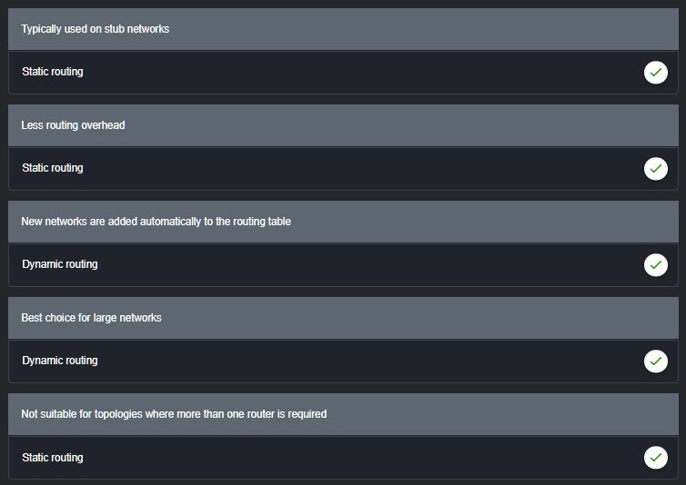

**Explanation:**
Topic 14.5.1 Both static and dynamic routing could be used when more than one router is involved. Dynamic routing is when a routing protocol is used. Static routing is when every remote route is entered manually by an administrator into every router in the network topology.

---

## Question 62

**Question:**
Refer to the exhibit. Which interface will be the exit interface to forward a data packet that has the destination IP address 172.25.128.244? Copy Gateway of last resort is not set. 172.25.128.0/26 is variously subnetted, 7 subnets, 3 masks O 172.25.128.0/26 [110/10] via 172.25.56.1, 00:00:24, Serial0/0/0 O 172.25.128.64/26 [110/20] via 172.25.56.6, 00:00:56, Serial 0/0/1 O 172.25.128.128/26 [110/10] via 172.25.56.1, 00:00:24, Serial 0/0/0 C 172.25.128.192/27 is directly connected, GigabitEthernet0/0 L 172.25.128.193/27 is directly connected, GigabitEthernet0/0 C 172.25.128.224/27 is directly connected, GigabitEthernet0/1 L 172.25.128.225/27 is directly connected, GigabitEthernet0/1 172.25.56.0/24 is variably subnetted, 4 subnets, 2 masks C 172.25.56.0/30 is directly connected, Serial0/0/0 L 172.25.56.2/32 is directly connected, Serial0/0/0 C 172.25.56.4/30 is directly connected, Serial0/0/1 L 172.25.56.5/32 is directly connected, Serial0/0/1 S 172.25.57.0/26 [1/0] via 172.25.56.1, 00:00:24, Serial0/0/0 R1#

**Choices:**
- **A.** GigabitEthernet0/0
- **B.** GigabitEthernet0/1
- **C.** None, the packet will be dropped.
- **D.** Serial0/0/1

**Correct Answer:**
GigabitEthernet0/1

**Explanation:**
Topic 14.1.3

---

## Question 63

**Question:**
Ipv6 route 2001:0DB8::/32 2001:0DB8:3000::1 Which static route is configured here?

**Choices:**
- **A.** Floating static
- **B.** Recursive static
- **C.** Directly attached static
- **D.** Fully specified static

**Correct Answer:**
Recursive static

**Explanation:**
Topic 15.1.2 The Router has to look up in the routing table twice to find the exit interface. The first is shown in the Question now the router has to lookup what interface ex.s0/0/0 that the 3000::1 address is associated with. route table ex. 2001:0DB8:3000::1 is directly connected, Serial0/0/0. This is the 2nd lookup in the table to find out that the packet needs to exit the s0/0/0 interface making the first route a recursive and 2nd route a direct.

---
