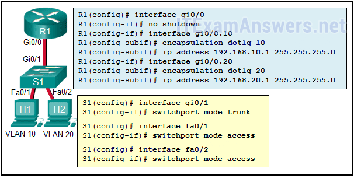
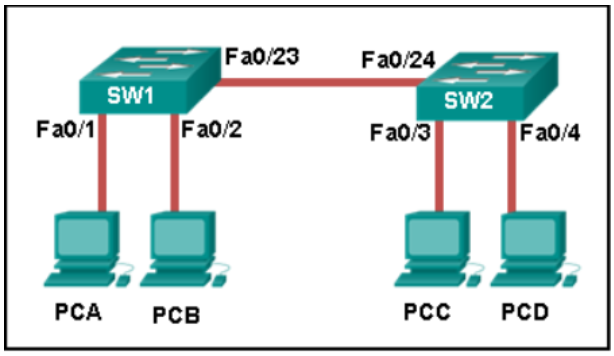
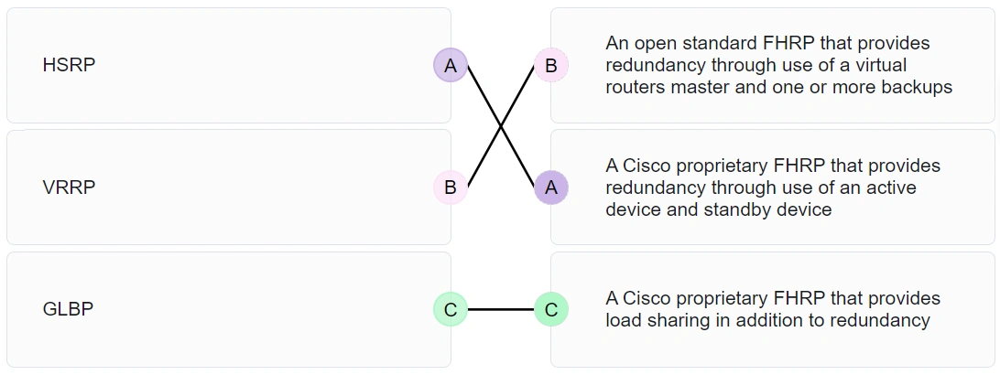
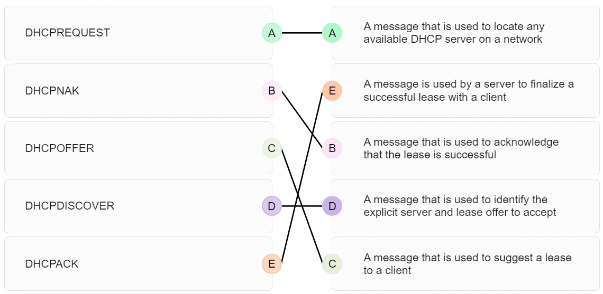
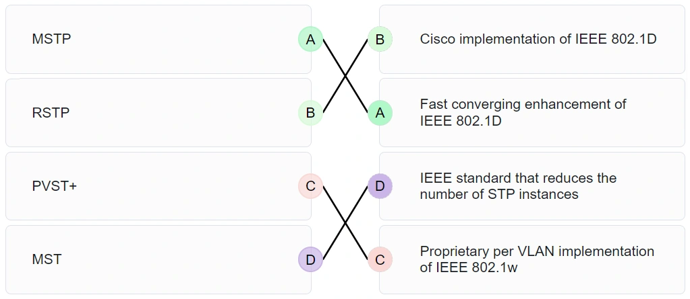

# CCNA 2 - SRWEv7 Practice Final Exam

## Question 1

**Question:**
A network administrator is using the router-on-a-stick method to configure inter-VLAN routing. Switch port Gi1/1 is used to connect to the router. Which command should be entered to prepare this port for the task? Switch(config)# interface gigabitethernet 1/1 Switch(config-if)# spanning-tree vlan 1 Switch(config)# interface gigabitethernet 1/1 Switch(config-if)# spanning-tree portfast Switch(config)# interface gigabitethernet 1/1 Switch(config-if)# switchport mode trunk Switch(config)# interface gigabitethernet 1/1 Switch(config-if)# switchport access vlan 1

**Explanation:**
Topic 4.2.2 With the router-on-a-stick method, the switch port that connects to the router must be configured as trunk mode. This can be done with the command Switch(config-if)# switchport mode trunk. The other options do not put the switch port into trunk mode.

---

## Question 2

**Question:**
Refer to the exhibit. The configuration shows commands entered by a network administrator for inter-VLAN routing. However, host H1 cannot communicate with H2. Which part of the inter-VLAN configuration causes the problem?

**Images:**

**Choices:**
- **A.** trunking
- **B.** port mode on the two switch FastEthernet ports
- **C.** VLAN configuration
- **D.** router port configuration

**Correct Answer:**
VLAN configuration

**Explanation:**
Topic 4.4.5 All Cisco switch ports are assigned to VLAN 1 by default. For VLAN implementation, ports Fa0/1 and Fa0/2 should be assigned to VLAN 10 and VLAN 20, respectively. The missing commands on S1 are as follows: switchport access vlan 10 and switchport access vlan 20 .

---

## Question 3

**Question:**
Refer to the exhibit. Inter-VLAN communication between VLAN 10, VLAN 20, and VLAN 30 is not successful. What is the problem?

**Images:**

**Choices:**
- **A.** The access interfaces do not have IP addresses and each should be configured with an IP address.
- **B.** The switch interface FastEthernet0/1 is configured as an access interface and should be configured as a trunk interface.
- **C.** The switch interface FastEthernet0/1 is configured to not negotiate and should be configured to negotiate.​
- **D.** The switch interfaces FastEthernet0/2, FastEthernet0/3, and FastEthernet0/4 are configured to not negotiate and should be configured to negotiate.

**Correct Answer:**
The switch interface FastEthernet0/1 is configured as an access interface and should be configured as a trunk interface.

**Explanation:**
Topic 4.4.4 To forward all VLANs to the router, the switch interface Fa0/1 must be configured as a trunk interface with the switchport mode trunk command.

---

## Question 4

**Question:**
An employee connects wirelessly to the company network using a cell phone. The employee then configures the cell phone to act as a wireless access point that will allow new employees to connect to the company network. Which type of security threat best describes this situation?

**Choices:**
- **A.** cracking
- **B.** denial of service
- **C.** rogue access point
- **D.** spoofing

**Correct Answer:**
rogue access point

**Explanation:**
Topic 12.6.4 Configuring the cell phone to act as a wireless access point means that the cell phone is now a rogue access point. The employee unknowingly breached the security of the company network by allowing a user to access the network without connecting through the company access point. Cracking is the process of obtaining passwords from data stored or transmitted on a network. Denial of service attacks refer to sending large amounts of data to a networked device, such as a server, to prevent legitimate access to the server. Spoofing refers to access gained to a network or data by an attacker appearing to be a legitimate network device or user.

---

## Question 5

**Question:**
Which combination of WLAN authentication and encryption is recommended as a best practice for home users?

**Choices:**
- **A.** WPA2 and AES
- **B.** WEP and RC4
- **C.** WPA and PSK
- **D.** EAP and AES
- **E.** WEP and TKIP

**Correct Answer:**
WPA2 and AES

**Explanation:**
Topic 12.7.4 WPA2 is the Wi-Fi alliance version of 802.11i, the industry standard for authentication. Neither WEP nor WPA possess the level of authentication provided by WPA2. AES aligns with WPA2 as an encryption standard, and is stronger than TKIP or RC4. PSK refers to pre-shared passwords, an authentication method that can be used by either WPA or WPA2. EAP is intended for use with enterprise networks which use a RADIUS server.

---

## Question 6

**Question:**
What are the two methods that a wireless NIC can use to discover an AP? (Choose two.)

**Choices:**
- **A.** transmitting a probe request
- **B.** sending an ARP request broadcast
- **C.** receiving a broadcast beacon frame
- **D.** initiating a three-way handshake
- **E.** sending a multicast frame

**Correct Answer:**
transmitting a probe request; receiving a broadcast beacon frame

**Explanation:**
Topic 12.3.7 Two methods can be used by a wireless device to discover and register with an access point: passive mode and active mode. In passive mode, the AP sends a broadcast beacon frame that contains the SSID and other wireless settings. In active mode, the wireless device must be manually configured for the SSID, and then the device broadcasts a probe request.

---

## Question 7

**Question:**
What address and prefix length is used when configuring an IPv6 default static route?

**Choices:**
- **A.** ::/0
- **B.** ::1/128
- **C.** 0.0.0.0/0
- **D.** FF02::1/8

**Correct Answer:**
::/0

**Explanation:**
Topic 15.3.1 The IPv6 address and prefix for a default static route is ::/0. This represents all zeros in the address and a prefix length of zero.

---

## Question 8

**Question:**
Refer to the exhibit. Match the description with the routing table entries. (Not all options are used.)

**Images:**

**Explanation:**
Topic 14.4.3 route source protocol = D (which is EIGRP) destination network = 10.3.0.0 metric = 21024000 administrative distance = 1 next hop = 172.16.2.2 route timestamp = 00:22:15

---

## Question 9

**Question:**
Refer to the exhibit. Which interface will be the exit interface to forward a data packet that has the destination IP address 172.18.109.152? Copy Gateway of last resort is not set. 172.18.109.0/26 is variously subnetted, 7 subnets, 3 masks O 172.18.109.0/26 [110/10] via 172.18.32.1, 00:00:24, Serial0/0/0 O 172.18.109.64/26 [110/20] via 172.18.32.6, 00:00:56, Serial 0/0/1 O 172.18.109.128/26 [110/10] via 172.18.32.1, 00:00:24, Serial 0/0/0 C 172.18.109.192/27 is directly connected, GigabitEthernet0/0 L 172.18.109.193/27 is directly connected, GigabitEthernet0/0 C 172.18.109.224/27 is directly connected, GigabitEthernet0/1 L 172.18.109.225/27 is directly connected, GigabitEthernet0/1 172.18.32.0/24 is variably subnetted, 4 subnets, 2 masks C 172.18.32.0/30 is directly connected, Serial0/0/0 L 172.18.32.2/32 is directly connected, Serial0/0/0 C 172.18.32.4/30 is directly connected, Serial0/0/1 L 172.18.32.5/32 is directly connected, Serial0/0/1 S 172.18.33.0/26 [1/0] via 172.18.32.1, 00:00:24, Serial0/0/0 R1#

**Choices:**
- **A.** GigabitEthernet0/0
- **B.** GigabitEthernet0/1
- **C.** Serial0/0/0
- **D.** None, the packet will be dropped.

**Correct Answer:**
Serial0/0/0

**Explanation:**
Topic 14.1.3

---

## Question 10

**Question:**
Match the dynamic routing protocol component to the characteristic. (Not all options are used.) data structures – tables or databases that are stored in RAM routing protocol messages – exchanges routing information and maintains accurate information about networks algorithm – a finite list of steps used to determine the best path

**Images:**

**Explanation:**
Topic 14.5.3

---

## Question 11

**Question:**
Which statement describes the behavior of a switch when the MAC address table is full?

**Choices:**
- **A.** It treats frames as unknown unicast and floods all incoming frames to all ports on the switch.
- **B.** It treats frames as unknown unicast and floods all incoming frames to all ports across multiple switches.
- **C.** It treats frames as unknown unicast and floods all incoming frames to all ports within the local VLAN.
- **D.** It treats frames as unknown unicast and floods all incoming frames to all ports within the collision domain.

**Correct Answer:**
It treats frames as unknown unicast and floods all incoming frames to all ports within the local VLAN.

**Explanation:**
Topic 10.4.2 When the MAC address table is full, the switch treats the frame as an unknown unicast and begins to flood all incoming traffic to all ports only within the local VLAN.

---

## Question 12

**Question:**
Which term describes the role of a Cisco switch in the 802.1X port-based access control?

**Choices:**
- **A.** agent
- **B.** supplicant
- **C.** authenticator
- **D.** authentication server

**Correct Answer:**
authenticator

**Explanation:**
Topic 10.2.6 802.1X port-based authentication defines specific roles for the devices in the network: Client (Supplicant) – The device that requests access to LAN and switch services Switch (Authenticator) – Controls physical access to the network based on the authentication status of the client Authentication server – Performs the actual authentication of the client

---

## Question 13

**Question:**
What is a result of connecting two or more switches together?

**Choices:**
- **A.** The number of broadcast domains is increased.
- **B.** The size of the broadcast domain is increased.
- **C.** The number of collision domains is reduced.
- **D.** The size of the collision domain is increased.

**Correct Answer:**
The size of the broadcast domain is increased.

**Explanation:**
Topic 2.2.2 When two or more switches are connected together, the size of the broadcast domain is increased and so is the number of collision domains. The number of broadcast domains is increased only when routers are added.

---

## Question 14

**Question:**
A small publishing company has a network design such that when a broadcast is sent on the LAN, 200 devices receive the transmitted broadcast. How can the network administrator reduce the number of devices that receive broadcast traffic?

**Choices:**
- **A.** Add more switches so that fewer devices are on a particular switch.
- **B.** Replace the switches with switches that have more ports per switch. This will allow more devices on a particular switch.
- **C.** Segment the LAN into smaller LANs and route between them.
- **D.** Replace at least half of the switches with hubs to reduce the size of the broadcast domain.

**Correct Answer:**
Segment the LAN into smaller LANs and route between them.

**Explanation:**
Topic 2.2.2 By dividing the one big network into two smaller network, the network administrator has created two smaller broadcast domains. When a broadcast is sent on the network now, the broadcast will only be sent to the devices on the same Ethernet LAN. The other LAN will not receive the broadcast.

---

## Question 15

**Question:**
Refer to the exhibit. How is a frame sent from PCA forwarded to PCC if the MAC address table on switch SW1 is empty?

**Images:**

**Choices:**
- **A.** SW1 forwards the frame directly to SW2. SW2 floods the frame to all ports connected to SW2, excluding the port through which the frame entered the switch.
- **B.** SW1 floods the frame on all ports on the switch, excluding the interconnected port to switch SW2 and the port through which the frame entered the switch.
- **C.** SW1 floods the frame on all ports on SW1, excluding the port through which the frame entered the switch.
- **D.** SW1 drops the frame because it does not know the destination MAC address.

**Correct Answer:**
SW1 floods the frame on all ports on SW1, excluding the port through which the frame entered the switch.

**Explanation:**
Topic 2.1.3 When a switch powers on, the MAC address table is empty. The switch builds the MAC address table by examining the source MAC address of incoming frames. The switch forwards based on the destination MAC address found in the frame header. If a switch has no entries in the MAC address table or if the destination MAC address is not in the switch table, the switch will forward the frame out all ports except the port that brought the frame into the switch.

---

## Question 16

**Question:**
What are two switch characteristics that could help alleviate network congestion? (Choose two.)

**Choices:**
- **A.** fast internal switching
- **B.** large frame buffers
- **C.** store-and-forward switching
- **D.** low port density
- **E.** frame check sequence (FCS) check

**Correct Answer:**
fast internal switching; large frame buffers

**Explanation:**
Topic 2.2.3 Switch characteristics that help alleviate network congestion include fast port speeds, fast internal switching, large frame buffers, and high port density.

---

## Question 17

**Question:**
A network engineer is configuring a LAN with a redundant first hop to make better use of the available network resources. Which protocol should the engineer implement?

**Choices:**
- **A.** FHRP
- **B.** GLBP
- **C.** HSRP
- **D.** VRRP

**Correct Answer:**
GLBP

**Explanation:**
Topic 9.1.4 Gateway Load Balancing Protocol (GLBP) provides load sharing between a group of redundant routers while also protecting data traffic from a failed router or circuit.

---

## Question 18

**Question:**
Match the FHRP protocols to the appropriate description. (Not all options are used.) GLBP a Cisco proprietary FHRP that provides load sharing in addition to redundancy HSRP a Cisco proprietary FHRP that provides redundancy through use of an active device and standby device VRRP an open standard FHRP that provides redundancy through use of a virtual routers master and one or more backups

**Images:**

**Explanation:**
Topic 9.1.4 GLBP, A Cisco proprietary FHRP that provides load sharing in addition to redundancy. HSRP A Cisco proprietary FHRP that provides redundancy through use of an active device and standby device. VRRP, An open standard FHRP that provides redundancy through use of a virtual routers master and one or more backups. Distractor, A legacy open standard FHRP that allows IPv4 hosts to discover gateway routers.

---

## Question 19

**Question:**
After sticky learning of MAC addresses is enabled, what action is needed to prevent dynamically learned MAC addresses from being lost in the event that an associated interface goes down?

**Choices:**
- **A.** Reboot the switch.
- **B.** Copy the running configuration to the startup configuration.
- **C.** Shut down the interface then enable it again with the no shutdown command.
- **D.** Configure port security for violation protect mode.

**Correct Answer:**
Copy the running configuration to the startup configuration.

**Explanation:**
Topic 11.1.4 When sticky learning is enabled, dynamically learned MAC addresses are stored in the running configuration in RAM and will be lost if the switch is rebooted or an interface goes down. To prevent the loss of learned MAC addresses, an administrator can save the running configuration into the startup configuration in NVRAM.

---

## Question 20

**Question:**
A small coffee shop is offering free Wi-Fi to customers. The network includes a wireless router and a DSL modem that is connected to the local phone company. What method is typically used to configure the connection to the phone company?

**Choices:**
- **A.** Set the WAN connection in the wireless router as a DHCP client.
- **B.** Set the connection between the wireless router and the DSL modem as a private IP network.
- **C.** Set the DSL modem as a DHCP client to get a public IP address from the wireless router.
- **D.** Set the DSL modem as a DHCP client to the phone company and a DHCP server for the internal connection.

**Correct Answer:**
Set the WAN connection in the wireless router as a DHCP client.

**Explanation:**
Topic 7.3.3 In a SOHO environment, a wireless router connects to an ISP via a DSL or cable modem. The IP address between the wireless router and ISP site is typically assigned by the ISP through DHCP. The DSL modem does not manage IP address allocation.

---

## Question 21

**Question:**
Match the purpose with its DHCP message type. (Not all options are used.)

**Images:**

**Explanation:**
Topic 7.1.3 DHCPREQUEST A message that is used to locate any available DHCP server on a network DHCPOFFER A message that is used to suggest a lease to a client DHCPDISCOVER A message that is used to identify the explicit server and lease offer to accept DHCPNAK A message that is used to acknowledge that the lease is successful DHCPACK A message is used by a server to finalize a successful lease with a client

---

## Question 22

**Question:**
Match the spanning-tree feature with the protocol type. (Not all options are used.)

**Images:**

**Explanation:**
Topic 5.3.1 Place the options in the following order: RSTP Cisco implementation of IEEE 802.1D MSTP Fast converging enhancement of IEEE 802.1D MST IEEE standard that reduces the number of STP instances PVST+ Proprietary per VLAN implementation of IEEE 802.1w

---
