# CCNA 2 - CCNA 2 v7 Course FINAL Exam Answers

## Question 1

**Question:**
Refer to the exhibit. What will router R1 do with a packet that has a destination IPv6 address of 2001:db8:cafe:5::1?

**Images:**
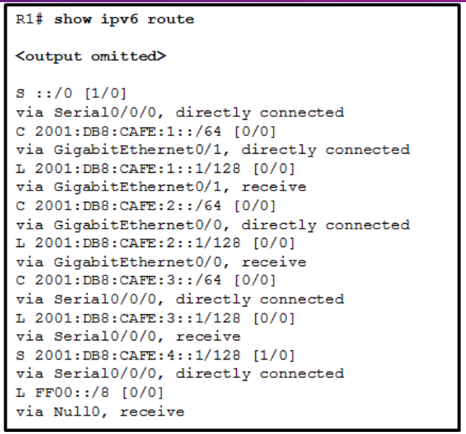

**Choices:**
- **A.** forward the packet out GigabitEthernet0/0
- **B.** drop the packet
- **C.** forward the packet out GigabitEthernet0/1
- **D.** forward the packet out Serial0/0/0

**Correct Answer:**
forward the packet out Serial0/0/0

**Explanation:**
Topic 14.4.9 The route ::/0 is the compressed form of the 0000:0000:0000:0000:0000:0000:0000:0000/0 default route. The default route is used if a more specific route is not found in the routing table.

---

## Question 2

**Question:**
Refer to the exhibit. Currently router R1 uses an EIGRP route learned from Branch2 to reach the 10.10.0.0/16 network. Which floating static route would create a backup route to the 10.10.0.0/16 network in the event that the link between R1 and Branch2 goes down?

**Images:**
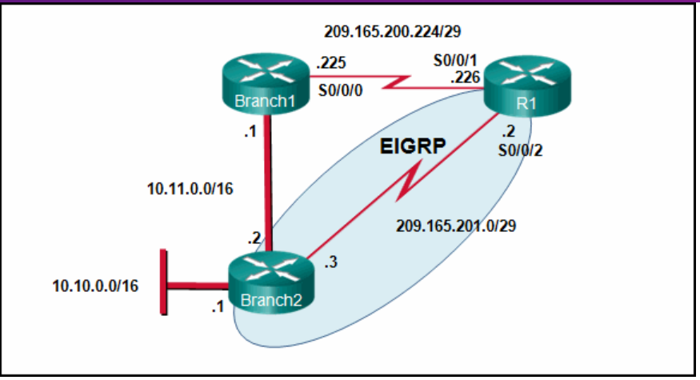

**Choices:**
- **A.** ip route 10.10.0.0 255.255.0.0 Serial 0/0/0 100
- **B.** ip route 10.10.0.0 255.255.0.0 209.165.200.226 100
- **C.** ip route 10.10.0.0 255.255.0.0 209.165.200.225 100
- **D.** ip route 10.10.0.0 255.255.0.0 209.165.200.225 50

**Correct Answer:**
ip route 10.10.0.0 255.255.0.0 209.165.200.225 100

**Explanation:**
Topic 15.4.1 A floating static route needs to have an administrative distance that is greater than the administrative distance of the active route in the routing table. Router R1 is using an EIGRP route which has an administrative distance of 90 to reach the 10.10.0.0/16 network. To be a backup route the floating static route must have an administrative distance greater than 90 and have a next hop address corresponding to the serial interface IP address of Branch1.

---

## Question 3

**Question:**
Refer to the exhibit. R1 was configured with the static route command ip route 209.165.200.224 255.255.255.224 S0/0/0 and consequently users on network 172.16.0.0/16 are unable to reach resources on the Internet. How should this static route be changed to allow user traffic from the LAN to reach the Internet? CCNA 2 v7 Switching Routing and Wireless Essentials-Version-Final-Answers-3

**Images:**
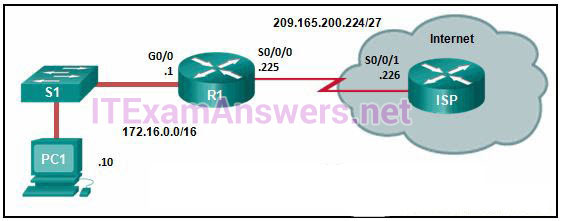

**Choices:**
- **A.** Add an administrative distance of 254.
- **B.** Change the destination network and mask to 0.0.0.0 0.0.0.0
- **C.** Change the exit interface to S0/0/1.
- **D.** Add the next-hop neighbor address of 209.165.200.226.

**Correct Answer:**
Change the destination network and mask to 0.0.0.0 0.0.0.0

**Explanation:**
Topic 15.3.1 The static route on R1 has been incorrectly configured with the wrong destination network and mask. The correct destination network and mask is 0.0.0.0 0.0.0.0.

---

## Question 4

**Question:**
Which option shows a correctly configured IPv4 default static route?

**Choices:**
- **A.** ip route 0.0.0.0 255.255.255.0 S0/0/0
- **B.** ip route 0.0.0.0 0.0.0.0 S0/0/0
- **C.** ip route 0.0.0.0 255.255.255.255 S0/0/0
- **D.** ip route 0.0.0.0 255.0.0.0 S0/0/0

**Correct Answer:**
ip route 0.0.0.0 0.0.0.0 S0/0/0

**Explanation:**
Topic 15.3.1 The static route ip route 0.0.0.0 0.0.0.0 S0/0/0 is considered a default static route and will match all destination networks.

---

## Question 5

**Question:**
Refer to the exhibit. Which static route command can be entered on R1 to forward traffic to the LAN connected to R2? CCNA 2 v7 Switching Routing and Wireless Essentials-Version-Final-Answers-5

**Images:**
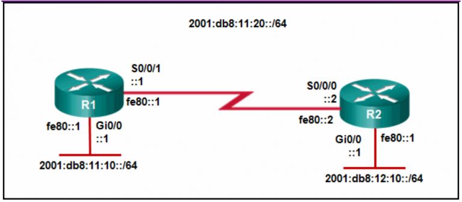

**Choices:**
- **A.** ipv6 route 2001:db8:12:10::/64 S0/0/0
- **B.** ipv6 route 2001:db8:12:10::/64 S0/0/1 fe80::2
- **C.** ipv6 route 2001:db8:12:10::/64 S0/0/0 fe80::2
- **D.** ipv6 route 2001:db8:12:10::/64 S0/0/1 2001:db8:12:10::1

**Correct Answer:**
ipv6 route 2001:db8:12:10::/64 S0/0/1 fe80::2

**Explanation:**
Topic 15.2.6 A fully specified static route must be used when the next hop is an IPv6 link-local address because link-local addresses are not contained in the IPv6 routing table and are only unique to a specific link, requiring the exit interface to be explicitly identified so the router knows which network segment the address belongs to.

---

## Question 6

**Question:**
What is a method to launch a VLAN hopping attack?

**Choices:**
- **A.** introducing a rogue switch and enabling trunking
- **B.** sending spoofed native VLAN information
- **C.** sending spoofed IP addresses from the attacking host
- **D.** flooding the switch with MAC addresses

**Correct Answer:**
introducing a rogue switch and enabling trunking

**Explanation:**
Topic 10.5.2 A VLAN hopping attack enables traffic from one VLAN to be seen by another without the aid of a router by configuring a host or rogue switch to spoof Dynamic Trunking Protocol (DTP) signaling, which exploits switch ports that have the automatic trunking feature enabled by default to establish an unauthorized trunk link and grant the attacker access to all VLANs on the switch.

---

## Question 7

**Question:**
A cybersecurity analyst is using the macof tool to evaluate configurations of switches deployed in the backbone network of an organization. Which type of LAN attack is the analyst targeting during this evaluation?

**Choices:**
- **A.** VLAN hopping
- **B.** DHCP spoofing
- **C.** MAC address table overflow
- **D.** VLAN double-tagging

**Correct Answer:**
MAC address table overflow

**Explanation:**
Topic 10.4.2 Macof is a network attack tool and is mainly used to flood LAN switches with MAC addresses.

---

## Question 8

**Question:**
Refer to the exhibit. A network administrator is configuring a router as a DHCPv6 server. The administrator issues a show ipv6 dhcp pool command to verify the configuration. Which statement explains the reason that the number of active clients is 0?

**Images:**

**Choices:**
- **A.** The default gateway address is not provided in the pool.
- **B.** No clients have communicated with the DHCPv6 server yet.
- **C.** The IPv6 DHCP pool configuration has no IPv6 address range specified.
- **D.** The state is not maintained by the DHCPv6 server under stateless DHCPv6 operation.

**Correct Answer:**
The state is not maintained by the DHCPv6 server under stateless DHCPv6 operation.

**Explanation:**
Topic 8.3.2 Under the stateless DHCPv6 configuration, indicated by the command ipv6 nd other-config-flag, the DHCPv6 server does not maintain the state information, because client IPv6 addresses are not managed by the DHCP server. Because the clients will configure their IPv6 addresses by combining the prefix/prefix-length and a self-generated interface ID, the ipv6 dhcp pool configuration does not need to specify the valid IPv6 address range. And because clients will use the link-local address of the router interface as the default gateway address, the default gateway address is not necessary.

---

## Question 9

**Question:**
Refer to the exhibit. A network administrator configured routers R1 and R2 as part of HSRP group 1. After the routers have been reloaded, a user on Host1 complained of lack of connectivity to the Internet The network administrator issued the show standby brief command on both routers to verify the HSRP operations. In addition, the administrator observed the ARP table on Host1. Which entry should be seen in the ARP table on Host1 in order to gain connectivity to the Internet?

**Images:**
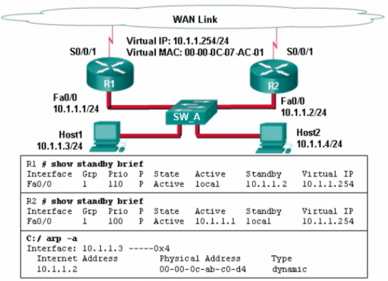

**Choices:**
- **A.** the virtual IP address and the virtual MAC address for the HSRP group 1
- **B.** the virtual IP address of the HSRP group 1 and the MAC address of R1
- **C.** the virtual IP address of the HSRP group 1 and the MAC address of R2
- **D.** the IP address and the MAC address of R1

**Correct Answer:**
the virtual IP address and the virtual MAC address for the HSRP group 1

**Explanation:**
Topic 9.1.2 Hosts will send an ARP request to the default gateway which is the virtual IP address. ARP replies from the HSRP routers contain the virtual MAC address. The host ARP tables will contain a mapping of the virtual IP to the virtual MAC.

---

## Question 10

**Question:**
Match the forwarding characteristic to its type. (Not all options are used.) Match the forwarding characteristic to its type. (Not all options are used.)

**Images:**
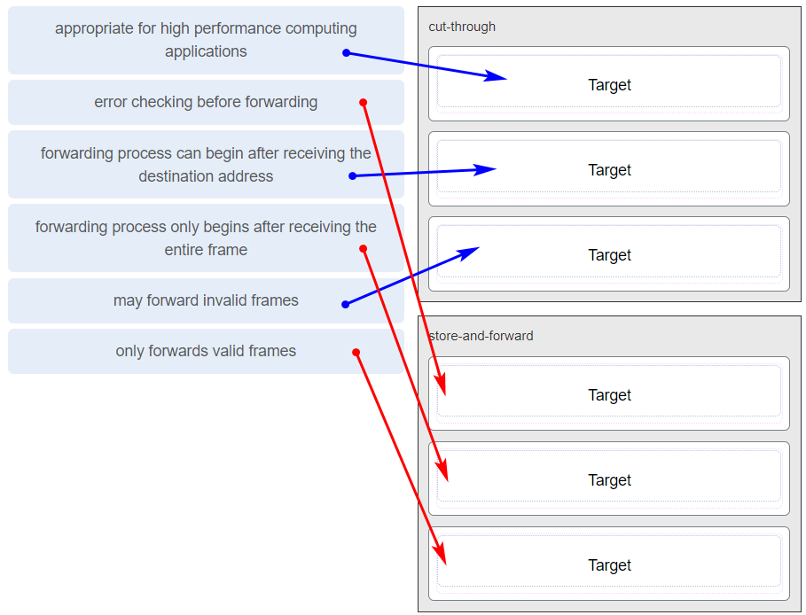

**Explanation:**
Topic 2.1.5

---

## Question 11

**Question:**
Which statement is correct about how a Layer 2 switch determines how to forward frames?

**Choices:**
- **A.** Frame forwarding decisions are based on MAC address and port mappings in the CAM table.
- **B.** Only frames with a broadcast destination address are forwarded out all active switch ports.
- **C.** Unicast frames are always forwarded regardless of the destination MAC address.
- **D.** Cut-through frame forwarding ensures that invalid frames are always dropped.

**Correct Answer:**
Frame forwarding decisions are based on MAC address and port mappings in the CAM table.

**Explanation:**
Topic 2.1.2 Cut-through frame forwarding reads up to only the first 22 bytes of a frame, which excludes the frame check sequence and thus invalid frames may be forwarded. In addition to broadcast frames, frames with a destination MAC address that is not in the CAM are also flooded out all active ports. Unicast frames are not always forwarded. Received frames with a destination MAC address that is associated with the switch port on which it is received are not forwarded because the destination exists on the network segment connected to that port.

---

## Question 12

**Question:**
Which statement describes a result after multiple Cisco LAN switches are interconnected?

**Choices:**
- **A.** The broadcast domain expands to all switches.
- **B.** One collision domain exists per switch.
- **C.** There is one broadcast domain and one collision domain per switch.
- **D.** Frame collisions increase on the segments connecting the switches.
- **E.** Unicast frames are always forwarded regardless of the destination MAC address.

**Correct Answer:**
The broadcast domain expands to all switches.

**Explanation:**
Topic 2.2.2 In Cisco LAN switches, the microsegmentation makes it possible for each port to represent a separate segment and thus each switch port represents a separate collision domain. This fact will not change when multiple switches are interconnected. However, LAN switches do not filter broadcast frames. A broadcast frame is flooded to all ports. Interconnected switches form one big broadcast domain.

---

## Question 13

**Question:**
Match the link state to the interface and protocol status. (Not all options are used.)

**Images:**
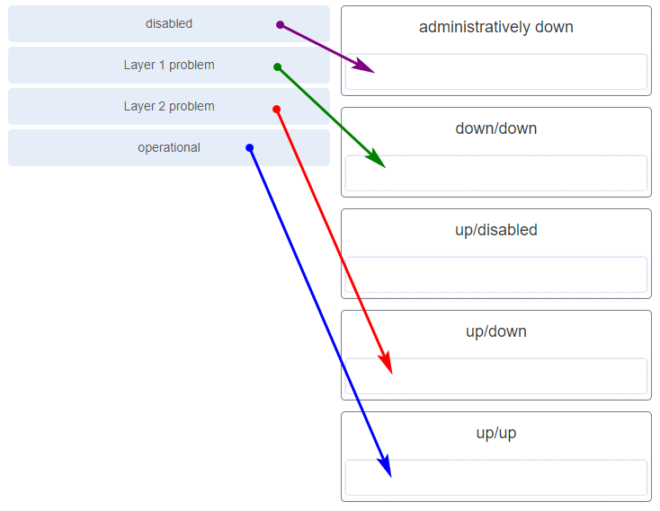

**Explanation:**
Topic 1.2.6 Layer 1 problem down/down Layer 2 problem up/down Disabled administratively down Operational up/up

---

## Question 14

**Question:**
Refer to the exhibit. How is a frame sent from PCA forwarded to PCC if the MAC address table on switch SW1 is empty?

**Images:**

**Choices:**
- **A.** SW1 forwards the frame directly to SW2. SW2 floods the frame to all ports connected to SW2, excluding the port through which the frame entered the switch.
- **B.** SW1 floods the frame on all ports on the switch, excluding the interconnected port to switch SW2 and the port through which the frame entered the switch.
- **C.** SW1 floods the frame on all ports on SW1, excluding the port through which the frame entered the switch.
- **D.** SW1 drops the frame because it does not know the destination MAC address.

**Correct Answer:**
SW1 floods the frame on all ports on SW1, excluding the port through which the frame entered the switch.

**Explanation:**
Topic 2.1.3 When a switch powers on, the MAC address table is empty. The switch builds the MAC address table by examining the source MAC address of incoming frames. The switch forwards based on the destination MAC address found in the frame header. If a switch has no entries in the MAC address table or if the destination MAC address is not in the switch table, the switch will forward the frame out all ports except the port that brought the frame into the switch.

---

## Question 15

**Question:**
An administrator is trying to remove configurations from a switch. After using the command erase startup-config and reloading the switch, the administrator finds that VLANs 10 and 100 still exist on the switch. Why were these VLANs not removed?

**Choices:**
- **A.** Because these VLANs are stored in a file that is called vlan.dat that is located in flash memory, this file must be manually deleted.
- **B.** These VLANs cannot be deleted unless the switch is in VTP client mode.
- **C.** These VLANs are default VLANs that cannot be removed.
- **D.** These VLANs can only be removed from the switch by using the no vlan 10 and no vlan 100 commands.

**Correct Answer:**
Because these VLANs are stored in a file that is called vlan.dat that is located in flash memory, this file must be manually deleted.

**Explanation:**
Topic 3.3.10 Standard range VLANs (1-1005) are stored in a file that is called vlan.dat that is located in flash memory. Erasing the startup configuration and reloading a switch does not automatically remove these VLANs. The vlan.dat file must be manually deleted from flash memory and then the switch must be reloaded.

---

## Question 16

**Question:**
Match the description to the correct VLAN type. (Not all options are used.) Native VLAN Carries untagged traffic Management VLAN An IP address and subnet mask are assigned to this VLAN, allowing the switch to be accessed by HTTP, Telnet, SSH, or SNMP Default VLAN All switch ports are assigned to this VLAN after initial bootup of the switch Data VLANs Configured to carry user generated traffic

**Images:**
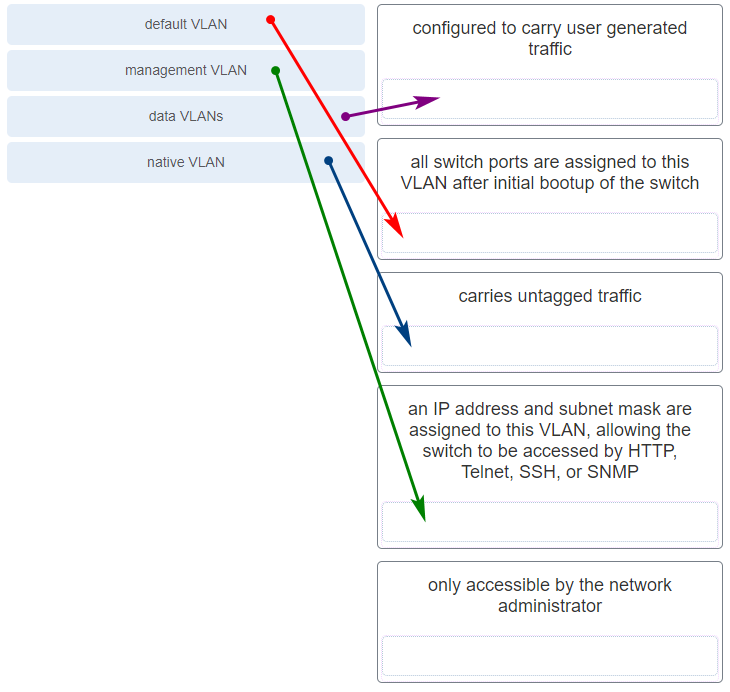

**Explanation:**
Topic 3.1.3 A data VLAN is configured to carry user-generated traffic. A default VLAN is the VLAN where all switch ports belong after the initial boot up of a switch loading the default configuration. A native VLAN is assigned to an 802.1Q trunk port, and untagged traffic is placed on it. A management VLAN is any VLAN that is configured to access the management capabilities of a switch. An IP address and subnet mask are assigned to it, allowing the switch to be managed via HTTP, Telnet, SSH, or SNMP.

---

## Question 17

**Question:**
Refer to the exhibit. A network administrator has connected two switches together using EtherChannel technology. If STP is running, what will be the end result?

**Images:**
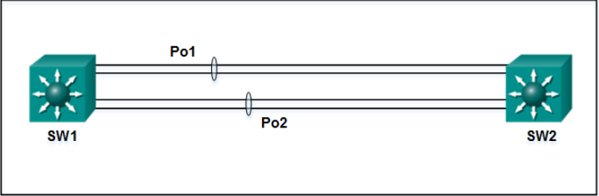

**Choices:**
- **A.** STP will block one of the redundant links.
- **B.** The switches will load balance and utilize both EtherChannels to forward packets.
- **C.** The resulting loop will create a broadcast storm.
- **D.** Both port channels will shutdown.

**Correct Answer:**
STP will block one of the redundant links.

**Explanation:**
Topic 6.1.3 Cisco switches support two protocols for negotiating a channel between two switches: LACP and PAgP. PAgP is Cisco-proprietary. In the topology shown, the switches are connected to each other using redundant links. By default, STP is enabled on switch devices. STP will block redundant links to prevent loops.

---

## Question 18

**Question:**
What is a secure configuration option for remote access to a network device?

**Choices:**
- **A.** Configure an ACL and apply it to the VTY lines.
- **B.** Configure 802.1x.
- **C.** Configure SSH.
- **D.** Configure Telnet.

**Correct Answer:**
Configure SSH.

**Explanation:**
Topic 1.3.2 Secure Shell (SSH) is a secure protocol that provides an encrypted management connection to a remote device by using strong encryption for both the authentication process and the data transmitted between devices, making it the secure replacement for Telnet which transmits information in insecure plaintext.

---

## Question 19

**Question:**
Which wireless encryption method is the most secure?

**Choices:**
- **A.** WPA2 with AES
- **B.** WPA2 with TKIP
- **C.** WEP
- **D.** WPA

**Correct Answer:**
WPA2 with AES

**Explanation:**
Topic 12.7.4 IEEE 802.11i and WPA2 both use the Advanced Encryption Standard (AES) for encryption. AES is currently considered the strongest encryption protocol. WPA2 does not use TKIP (Temporal Key Integrity Protocol). It is WPA that uses TKIP. Although WPA provides stronger encryption than WEP, it is is not as strong as WPA2 (AES).

---

## Question 20

**Question:**
After attaching four PCs to the switch ports, configuring the SSID and setting authentication properties for a small office network, a technician successfully tests the connectivity of all PCs that are connected to the switch and WLAN. A firewall is then configured on the device prior to connecting it to the Internet. What type of network device includes all of the described features?

**Choices:**
- **A.** firewall appliance
- **B.** wireless router
- **C.** switch
- **D.** standalone wireless access point

**Correct Answer:**
wireless router

**Explanation:**
Topic 12.2.3 A wireless router is an integrated device that combines the functionality of a switch to interconnect wired PCs, an access point to provide wireless connectivity via a configured SSID, and a router to serve as a default gateway for internet access while also providing built-in firewall and security features to protect the local network.

---

## Question 21

**Question:**
Refer to the exhibit. Host A has sent a packet to host B. What will be the source MAC and IP addresses on the packet when it arrives at host B? CCNA 2 v7 Switching Routing and Wireless Essentials-Version-Final-Answers-21

**Images:**

**Choices:**
- **A.** Source MAC: 00E0.FE91.7799 Source IP: 10.1.1.10
- **B.** Source MAC: 00E0.FE10.17A3 Source IP: 10.1.1.10
- **C.** Source MAC: 00E0.FE10.17A3 Source IP: 192.168.1.1
- **D.** Source MAC: 00E0.FE91.7799 Source IP: 10.1.1.1
- **E.** Source MAC: 00E0.FE91.7799 Source IP: 192.168.1.1

**Correct Answer:**
Source MAC: 00E0.FE91.7799 Source IP: 10.1.1.10

**Explanation:**
Topic 14.2.2 As a packet traverses the network, the Layer 2 addresses will change at every hop as the packet is de-encapsulated and re-encapsulated, but the Layer 3 addresses will remain the same.

---

## Question 22

**Question:**
Refer to the exhibit. In addition to static routes directing traffic to networks 10.10.0.0/16 and 10.20.0.0/16, Router HQ is also configured with the following command: Copy ip route 0.0.0.0 0.0.0.0 serial 0/1/1 What is the purpose of this command? CCNA 2 v7 Switching Routing and Wireless Essentials-Version-Final-Answers-23

**Images:**
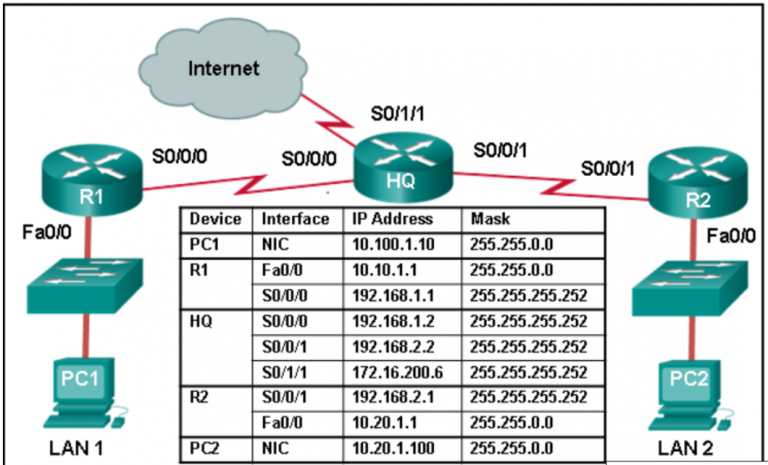

**Choices:**
- **A.** Packets that are received from the Internet will be forwarded to one of the LANs connected to R1 or R2.
- **B.** Packets with a destination network that is not 10.10.0.0/16 or is not 10.20.0.0/16 or is not a directly connected network will be forwarded to the Internet.
- **C.** Packets from the 10.10.0.0/16 network will be forwarded to network 10.20.0.0/16, and packets from the 10.20.0.0/16 network will be forwarded to network 10.10.0.0/16.
- **D.** Packets that are destined for networks that are not in the routing table of HQ will be dropped.

**Correct Answer:**
Packets with a destination network that is not 10.10.0.0/16 or is not 10.20.0.0/16 or is not a directly connected network will be forwarded to the Internet.

**Explanation:**
Topic 15.3.1 The command ip route 0.0.0.0 0.0.0.0 serial 0/1/1 configures a default static route, also known as a quad-zero route, which serves as a gateway of last resort by matching all packets that do not have a more specific entry in the routing table, ensuring that traffic destined for unknown remote networks like the Internet is forwarded out the specified serial interface instead of being dropped.

---

## Question 23

**Question:**
What protocol or technology disables redundant paths to eliminate Layer 2 loops?

**Choices:**
- **A.** VTP
- **B.** STP
- **C.** EtherChannel
- **D.** DTP

**Correct Answer:**
STP

**Explanation:**
Topic 5.1.2 Spanning Tree Protocol (STP) is a loop-prevention network protocol specifically designed to eliminate Layer 2 loops in redundant switched networks by intentionally identifying and blocking redundant physical paths to ensure that only one logical path exists between any two devices at a time, while still maintaining the ability to automatically unblock those paths if an active link fails.

---

## Question 24

**Question:**
Refer to the exhibit. Based on the exhibited configuration and output, why is VLAN 99 missing? CCNA 2 v7 Switching Routing and Wireless Essentials-Version-Final-Answers-25

**Images:**
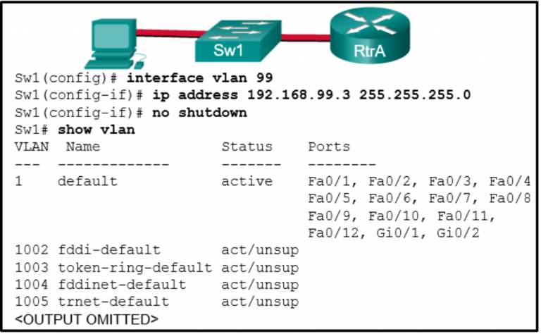

**Choices:**
- **A.** because VLAN 99 is not a valid management VLAN
- **B.** because there is a cabling problem on VLAN 99
- **C.** because VLAN 1 is up and there can only be one management VLAN on the switch
- **D.** because VLAN 99 has not yet been created

**Correct Answer:**
because VLAN 99 has not yet been created

**Explanation:**
Topic 4.4.3 VLAN 99 is the management VLAN and must be added to the VLAN database before it will appear in the show vlan output. To do so, enter the following commands: Copy Sw1(config)# vlan 99 Sw1(config-vlan)# name Management SW1(config-vlan)# exit

---

## Question 25

**Question:**
Which two VTP modes allow for the creation, modification, and deletion of VLANs on the local switch? (Choose two.)

**Choices:**
- **A.** client
- **B.** master
- **C.** distribution
- **D.** slave
- **E.** server
- **F.** transparent

**Correct Answer:**
server; transparent

**Explanation:**
Topic 3.3.1 The three VTP modes are server, client, and transparent. In server VTP mode, the switch can create, modify, and delete VLANs and send this information on to other switches that are in the same VTP domain. Switches in transparent VTP mode can do the same except that information is not transmitted to other switches.

---

## Question 26

**Question:**
Which three steps should be taken before moving a Cisco switch to a new VTP management domain? (Choose three.)

**Choices:**
- **A.** Configure the switch with the name of the new management domain.
- **B.** Reset the VTP counters to allow the switch to synchronize with the other switches in the domain.
- **C.** Configure the VTP server in the domain to recognize the BID of the new switch.
- **D.** Download the VTP database from the VTP server in the new domain.
- **E.** Select the correct VTP mode and version.
- **F.** Reboot the switch.

**Correct Answer:**
Configure the switch with the name of the new management domain.; Select the correct VTP mode and version.; Reboot the switch.

**Explanation:**
Topic 3.3.1 When adding a new switch to a VTP domain, it is critical to configure the switch with a new domain name, the correct VTP mode, VTP version number, and password. A switch with a higher revision number can propagate invalid VLANs and erase valid VLANs thus preventing connectivity for multiple devices on the valid VLANs.

---

## Question 27

**Question:**
A network administrator is preparing the implementation of Rapid PVST+ on a production network. How are the Rapid PVST+ link types determined on the switch interfaces?

**Choices:**
- **A.** Link types can only be configured on access ports configured with a single VLAN.
- **B.** Link types can only be determined if PortFast has been configured.
- **C.** Link types are determined automatically.
- **D.** Link types must be configured with specific port configuration commands.

**Correct Answer:**
Link types are determined automatically.

**Explanation:**
Topic 5.3.2 When Rapid PVST+ is being implemented, link types are automatically determined but can be specified manually. Link types can be either point-to-point, shared, or edge.

---

## Question 28

**Question:**
Refer to the exhibit. All the displayed switches are Cisco 2960 switches with the same default priority and operating at the same bandwidth. Which three ports will be STP designated ports? (Choose three.) CCNA 2 v7 Switching Routing and Wireless Essentials-Version-Final-Answers-29

**Images:**
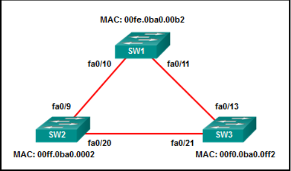

**Choices:**
- **A.** fa0/9
- **B.** fa0/13
- **C.** fa0/10
- **D.** fa0/20
- **E.** fa0/21
- **F.** fa0/11

**Correct Answer:**
fa0/13; fa0/10; fa0/21

**Explanation:**
Topic 5.2.6 Given that all the switches have the same default priority and are operating at the same bandwidth, the switch with the lowest MAC address will become the root bridge. This would be SW3 and all its ports would be designated ports. SW1 has a lower MAC address than SW2 has and therefore port fa0/10 will become the designated port on that link.

---

## Question 29

**Question:**
How will a router handle static routing differently if Cisco Express Forwarding is disabled?

**Choices:**
- **A.** It will not perform recursive lookups.
- **B.** Ethernet multiaccess interfaces will require fully specified static routes to avoid routing inconsistencies.
- **C.** Static routes that use an exit interface will be unnecessary.
- **D.** Serial point-to-point interfaces will require fully specified static routes to avoid routing inconsistencies.

**Correct Answer:**
Ethernet multiaccess interfaces will require fully specified static routes to avoid routing inconsistencies.

**Explanation:**
Topic 15.2.5 In most platforms running IOS 12.0 or later, Cisco Express Forwarding is enabled by default. Cisco Express Forwarding eliminates the need for the recursive lookup. If Cisco Express Forwarding is disabled, multiaccess network interfaces require fully specified static routes in order to avoid inconsistencies in their routing tables. Point-to-point interfaces do not have this problem, because multiple end points are not present. With or without Cisco Express Forwarding enabled, using an exit interface when configuring a static route is a viable option.

---

## Question 30

**Question:**
Compared with dynamic routes, what are two advantages of using static routes on a router? (Choose two.)

**Choices:**
- **A.** They improve netw​ork security.
- **B.** They take less time to converge when the network topology changes.
- **C.** They improve the efficiency of discovering neighboring networks.
- **D.** They use fewer router resources.

**Correct Answer:**
They improve netw​ork security.; They use fewer router resources.

**Explanation:**
Topic 14.5.1 Static routes are manually configured on a router. Static routes are not automatically updated and must be manually reconfigured if the network topology changes. Thus static routing improves network security because it does not make route updates among neighboring routers. Static routes also improve resource efficiency by using less bandwidth, and no CPU cycles are used to calculate and communicate routes.

---

## Question 31

**Question:**
Refer to the exhibit. Which route was configured as a static route to a specific network using the next-hop address?

**Images:**
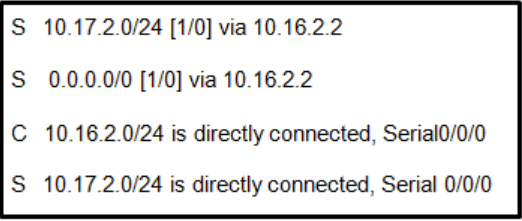

**Choices:**
- **A.** S 10.17.2.0/24 [1/0] via 10.16.2.2
- **B.** S 0.0.0.0/0 [1/0] via 10.16.2.2
- **C.** S 10.17.2.0/24 is directly connected, Serial 0/0/0
- **D.** C 10.16.2.0/24 is directly connected, Serial0/0/0

**Correct Answer:**
S 10.17.2.0/24 [1/0] via 10.16.2.2

**Explanation:**
Topic 15.2.1 The C in a routing table indicates an interface that is up and has an IP address assigned. The S in a routing table signifies that a route was installed using the ip route command. Two of the routing table entries shown are static routes to a specific destination (the 192.168.2.0 network). The entry that has the S denoting a static route and [1/0] was configured using the next-hop address. The other entry (S 192.168.2.0/24 is directly connected, Serial 0/0/0) is a static route configured using the exit interface. The entry with the 0.0.0.0 route is a default static route which is used to send packets to any destination network that is not specifically listed in the routing table.

---

## Question 32

**Question:**
What is the effect of entering the spanning-tree portfast configuration command on a switch?

**Choices:**
- **A.** It disables an unused port.
- **B.** It disables all trunk ports.
- **C.** It enables portfast on a specific switch interface.
- **D.** It checks the source L2 address in the Ethernet header against the sender L2 address in the ARP body.

**Correct Answer:**
It enables portfast on a specific switch interface.

**Explanation:**
Topic 11.5.2 The spanning-tree portfast interface configuration command is used to enable PortFast on a specific switch port, which allows the interface to bypass the standard Spanning Tree Protocol (STP) listening and learning states to transition immediately from a blocking state to a forwarding state. This feature is specifically designed for ports connected to end devices to minimize the time they must wait for STP to converge, thereby preventing issues such as DHCP timeouts during the initial connection process.

---

## Question 33

**Question:**
What is the IPv6 prefix that is used for link-local addresses?

**Choices:**
- **A.** FF01::/8
- **B.** 2001::/3
- **C.** FC00::/7
- **D.** FE80::/10

**Correct Answer:**
FE80::/10

**Explanation:**
Topic 1.5.3 The IPv6 link-local prefix is FE80::/10 and is used to create a link-local IPv6 address on an interface.

---

## Question 34

**Question:**
Which two statements are characteristics of routed ports on a multilayer switch? (Choose two.)​

**Choices:**
- **A.** In a switched network, they are mostly configured between switches at the core and distribution layers.
- **B.** The interface vlan command has to be entered to create a VLAN on routed ports.
- **C.** They support subinterfaces, like interfaces on the Cisco IOS routers.
- **D.** They are used for point-to-multipoint links.
- **E.** They are not associated with a particular VLAN.

**Correct Answer:**
In a switched network, they are mostly configured between switches at the core and distribution layers.; They are not associated with a particular VLAN.

**Explanation:**
Topic 4.3.1 Routed ports are physical ports that act similarly to a router interface. They are not associated with a particular VLAN, they do not support subinterfaces, and they are used for point-to-point links. In a switched network, they are mostly configured between switches at the core and distribution layers. To configure routed ports, the no switchport interface command has to be used on the appropriate ports.

---

## Question 35

**Question:**
Successful inter-VLAN routing has been operating on a network with multiple VLANs across multiple switches for some time. When an inter-switch trunk link fails and Spanning Tree Protocol brings up a backup trunk link, it is reported that hosts on two VLANs can access some, but not all the network resources that could be accessed previously. Hosts on all other VLANS do not have this problem. What is the most likely cause of this problem?

**Choices:**
- **A.** The protected edge port function on the backup trunk interfaces has been disabled.
- **B.** The allowed VLANs on the backup link were not configured correctly.
- **C.** Dynamic Trunking Protocol on the link has failed.
- **D.** Inter-VLAN routing also failed when the trunk link failed.

**Correct Answer:**
The allowed VLANs on the backup link were not configured correctly.

**Explanation:**
Topic 4.4.1 When a backup trunk link is activated by STP and only specific VLANs experience connectivity issues while others remain functional, the most likely cause is that the backup interface’s allowed VLAN list was not configured to include all the necessary VLAN IDs. Because trunks only propagate traffic for VLANs explicitly permitted in their configuration, an incomplete allowed list on the backup link will block traffic for the missing VLANs once the primary link fails, even if inter-VLAN routing is otherwise operational.

---

## Question 36

**Question:**
Which command will start the process to bundle two physical interfaces to create an EtherChannel group via LACP?

**Choices:**
- **A.** interface port-channel 2
- **B.** channel-group 1 mode desirable
- **C.** interface range GigabitEthernet 0/4 – 5
- **D.** channel-group 2 mode auto

**Correct Answer:**
interface range GigabitEthernet 0/4 – 5

**Explanation:**
Topic 6.2.2 To specify the interfaces in an EtherChannel group, use the interface range interface global configuration command for the range of interfaces used. The interface range GigabitEthernet 0/4 – 5 command is the correct option because it specifies two interfaces for the EtherChannel group.

---

## Question 37

**Question:**
What action takes place when a frame entering a switch has a multicast destination MAC address?

**Choices:**
- **A.** The switch will forward the frame out all ports except the incoming port.
- **B.** The switch forwards the frame out of the specified port.
- **C.** The switch adds a MAC address table entry mapping for the destination MAC address and the ingress port.
- **D.** The switch replaces the old entry and uses the more current port.

**Correct Answer:**
The switch will forward the frame out all ports except the incoming port.

**Explanation:**
Topic 2.1.3 If the destination MAC address is a broadcast or a multicast, the frame is also flooded out all ports except the incoming port.

---

## Question 38

**Question:**
A junior technician was adding a route to a LAN router. A traceroute to a device on the new network revealed a wrong path and unreachable status. What should be done or checked?

**Choices:**
- **A.** Verify that there is not a default route in any of the edge router routing tables.
- **B.** Check the configuration on the floating static route and adjust the AD.
- **C.** Create a floating static route to that network.
- **D.** Check the configuration of the exit interface on the new static route.

**Correct Answer:**
Check the configuration of the exit interface on the new static route.

**Explanation:**
Topic 15.2.3 When a traceroute reveals a wrong path or unreachable status immediately after adding a static route, it typically indicates that the route was configured with an incorrect egress point; therefore, checking the exit interface is essential to ensure the router is forwarding packets toward the intended network segment rather than misdirecting them out a different physical or logical interface.

---

## Question 39

**Question:**
Select the three PAgP channel establishment modes. (Choose three.)

**Choices:**
- **A.** auto
- **B.** default
- **C.** passive
- **D.** desirable
- **E.** extended
- **F.** on

**Correct Answer:**
auto; desirable; on

**Explanation:**
Topic 6.1.6 Port Aggregation Protocol (PAgP) supports three channel establishment modes: on , which forces the interface to channel without exchanging PAgP packets; desirable , which places the interface in an active negotiating state to initiate negotiations with other interfaces; and auto , which puts the interface in a passive negotiating state where it responds to received PAgP packets but does not initiate negotiation.

---

## Question 40

**Question:**
A static route has been configured on a router. However, the destination network no longer exists. What should an administrator do to remove the static route from the routing table?

**Choices:**
- **A.** Remove the route using the no ip route command.
- **B.** Change the administrative distance for that route.
- **C.** Change the routing metric for that route.
- **D.** Nothing. The static route will go away on its own.

**Correct Answer:**
Remove the route using the no ip route command.

**Explanation:**
Topic 15.2 When the destination network specified in a static route does not exist anymore, the static route stays in the routing table until it is manually removed by using the no ip route command.

---

## Question 41

**Question:**
Refer to the exhibit. What can be concluded about the configuration shown on R1?

**Images:**
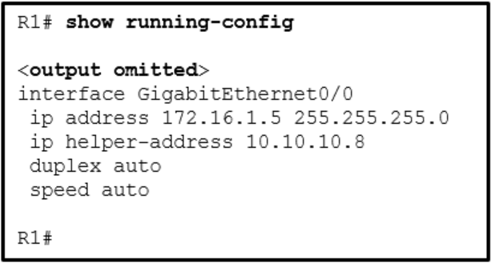

**Choices:**
- **A.** R1 is configured as a DHCPv4 relay agent.
- **B.** R1 is operating as a DHCPv4 server.
- **C.** R1 will broadcast DHCPv4 requests on behalf of local DHCPv4 clients.
- **D.** R1 will send a message to a local DHCPv4 client to contact a DHCPv4 server at 10.10.10.8.

**Correct Answer:**
R1 is configured as a DHCPv4 relay agent.

**Explanation:**
Topic 7.2.8 The presence of the ip helper-address 10.10.10.8 command on the GigabitEthernet0/0 interface indicates that R1 is acting as a DHCPv4 relay agent , which allows the router to intercept local broadcast DHCPv4 discovery messages and forward them as unicast packets to a DHCPv4 server located on a different subnet.

---

## Question 42

**Question:**
Match the step to each switch boot sequence description. (Not all options are used.) Explanation: Topic 1.1.1 The steps are: 1. execute POST 2. load the boot loader from ROM 3. CPU register initializations 4. flash file system initialization 5. load the IOS 6. transfer switch control to the IOS

**Images:**
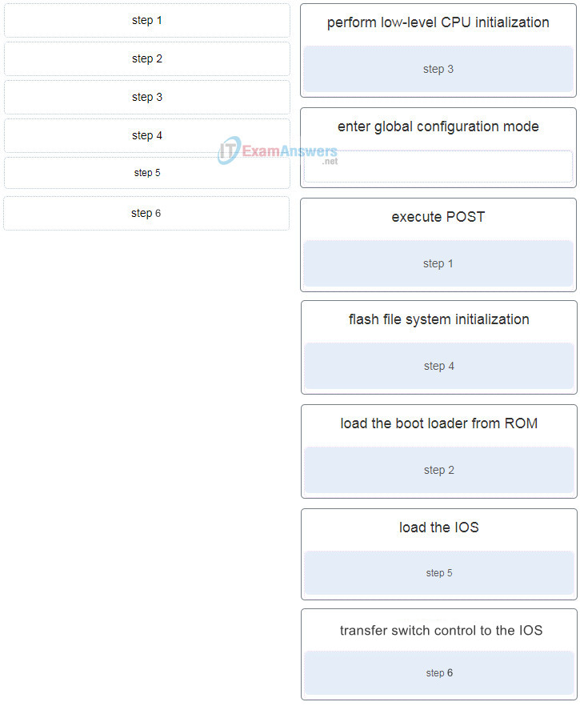

---

## Question 43

**Question:**
Refer to the exhibit. R1 has been configured as shown. However, PC1 is not able to receive an IPv4 address. What is the problem?​

**Images:**
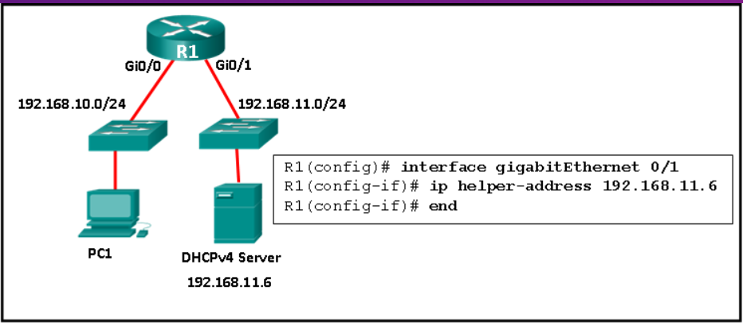

**Choices:**
- **A.** The ip helper-address command was applied on the wrong interface.
- **B.** R1 is not configured as a DHCPv4 server.​
- **C.** A DHCP server must be installed on the same LAN as the host that is receiving the IP address.
- **D.** The ip address dhcp command was not issued on the interface Gi0/1.

**Correct Answer:**
The ip helper-address command was applied on the wrong interface.

**Explanation:**
Topic 7.2.8 The ip helper-address command has to be applied on interface Gi0/0. This command must be present on the interface of the LAN that contains the DHCPv4 client PC1 and must be directed to the correct DHCPv4 server.

---

## Question 44

**Question:**
What two default wireless router settings can affect network security? (Choose two.)

**Images:**

**Choices:**
- **A.** The SSID is broadcast.
- **B.** MAC address filtering is enabled.
- **C.** WEP encryption is enabled.
- **D.** The wireless channel is automatically selected.
- **E.** A well-known administrator password is set.

**Correct Answer:**
The SSID is broadcast.; A well-known administrator password is set.

**Explanation:**
Topic 13.1.3 Default settings on wireless routers often include broadcasting the SSID and using a well-known administrative password. Both of these pose a security risk to wireless networks. WEP encryption and MAC address filtering are not set by default. The automatic selection of the wireless channel poses no security risks.

---

## Question 45

**Question:**
What is the common term given to SNMP log messages that are generated by network devices and sent to the SNMP server?

**Choices:**
- **A.** traps
- **B.** acknowledgments
- **C.** auditing
- **D.** warnings

**Correct Answer:**
traps

**Explanation:**
Topic 13.3.2 Network devices being monitored by the SNMP protocol can be configured to generate log messages that are sent to an SNMP server. The log messages, also called traps, contain all type of information from simple status reports to complex urgent conditions that require immediate attention.

---

## Question 46

**Question:**
A network administrator is adding a new WLAN on a Cisco 3500 series WLC. Which tab should the administrator use to create a new VLAN interface to be used for the new WLAN?

**Choices:**
- **A.** WIRELESS
- **B.** MANAGEMENT
- **C.** CONTROLLER
- **D.** WLANs

**Correct Answer:**
CONTROLLER

**Explanation:**
Topic 13.3.7 To create a new VLAN interface on a Cisco Wireless LAN Controller, the administrator must navigate to the CONTROLLER tab and select the Interfaces menu, as this is where software-based virtual interfaces are defined with specific VLAN IDs and IP addresses before they can be mapped to a WLAN profile.

---

## Question 47

**Question:**
A network administrator is configuring a WLAN. Why would the administrator change the default DHCP IPv4 addresses on an AP?

**Choices:**
- **A.** to restrict access to the WLAN by authorized, authenticated users only
- **B.** to monitor the operation of the wireless network
- **C.** to reduce outsiders intercepting data or accessing the wireless network by using a well-known address range
- **D.** to reduce the risk of interference by external devices such as microwave ovens

**Correct Answer:**
to reduce outsiders intercepting data or accessing the wireless network by using a well-known address range

**Explanation:**
Topic 13.1.3 Changing default DHCP IPv4 addresses is a fundamental security best practice because default IP ranges and management addresses for wireless routers are well-known and easily found on the internet, meaning that using a non-default range makes it more difficult for unauthorized outsiders to identify the network’s structure or gain access to the device’s management interface.

---

## Question 48

**Question:**
Which two functions are performed by a WLC when using split media access control (MAC)? (Choose two.)

**Choices:**
- **A.** packet acknowledgments and retransmissions
- **B.** frame queuing and packet prioritization
- **C.** beacons and probe responses
- **D.** frame translation to other protocols
- **E.** association and re-association of roaming clients

**Correct Answer:**
frame translation to other protocols; association and re-association of roaming clients

**Explanation:**
Topic 12.4.3 Under the CAPWAP split MAC architecture, management and less time-sensitive tasks are shifted to the Wireless LAN Controller (WLC), which specifically performs association and re-association of roaming clients along with frame translation to other protocols , while the Access Point (AP) handles real-time MAC functions such as beacons, probe responses, and packet acknowledgments.

---

## Question 49

**Question:**
On what switch ports should BPDU guard be enabled to enhance STP stability?

**Choices:**
- **A.** all PortFast-enabled ports
- **B.** only ports that are elected as designated ports
- **C.** only ports that attach to a neighboring switch
- **D.** all trunk ports that are not root ports

**Correct Answer:**
all PortFast-enabled ports

**Explanation:**
Topic 11.5.3 End-user ports should connect only to end-user devices and not to other switches. To prevent a switch from being added to the network on an end-user port, BPDU guard will immediately put the port into the error disabled state if a BPDU is received on that port. However, if PortFast is not configured on an end-user port, BPDU guard is not activated on that port.

---

## Question 50

**Question:**
Which network attack is mitigated by enabling BPDU guard?

**Choices:**
- **A.** rogue switches on a network
- **B.** CAM table overflow attacks
- **C.** MAC address spoofing
- **D.** rogue DHCP servers on a network

**Correct Answer:**
rogue switches on a network

**Explanation:**
Topic 10.5.9 There are several recommended STP stability mechanisms to help mitigate STP manipulation attacks: PortFast – used to immediately bring an interface configured as an access or trunk port to the forwarding state from a blocking state. Applied to all end-user ports. BPDU guard – immediately error-disables a port that receives a BPDU. Applied to all end-user ports.The receipt of BPDUs may be part of an unauthorized attempt to add a switch to the network. Root guard – prevents a switch from becoming the root switch. Applied to all ports where the root switch should not be located. Loop guard – detects unidirectional links to prevent alternate or root ports from becoming designated ports. Applied to all ports that are or can become nondesignated.

---

## Question 51

**Question:**
Why is DHCP snooping required when using the Dynamic ARP Inspection feature?

**Choices:**
- **A.** It relies on the settings of trusted and untrusted ports set by DHCP snooping.
- **B.** It uses the MAC address table to verify the default gateway IP address.
- **C.** It redirects ARP requests to the DHCP server for verification.
- **D.** It uses the MAC-address-to-IP-address binding database to validate an ARP packet.

**Correct Answer:**
It uses the MAC-address-to-IP-address binding database to validate an ARP packet.

**Explanation:**
Topic 11.4.1 DAI relies on DHCP snooping. DHCP snooping listens to DHCP message exchanges and builds a bindings database of valid tuples (MAC address, IP address, VLAN interface). When DAI is enabled, the switch drops ARP packet if the sender MAC address and sender IP address do not match an entry in the DHCP snooping bindings database. However, it can be overcome through static mappings. Static mappings are useful when hosts configure static IP addresses, DHCP snooping cannot be run, or other switches in the network do not run dynamic ARP inspection. A static mapping associates an IP address to a MAC address on a VLAN.

---

## Question 52

**Question:**
Refer to the exhibit. Router R1 has an OSPF neighbor relationship with the ISP router over the 192.168.0.32 network. The 192.168.0.36 network link should serve as a backup when the OSPF link goes down. The floating static route command ip route 0.0.0.0 0.0.0.0 S0/0/1 100 was issued on R1 and now traffic is using the backup link even when the OSPF link is up and functioning. Which change should be made to the static route command so that traffic will only use the OSPF link when it is up?​

**Images:**
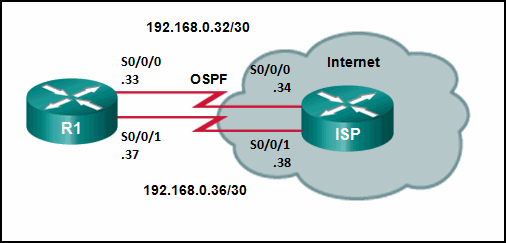

**Choices:**
- **A.** Change the administrative distance to 120.
- **B.** Add the next hop neighbor address of 192.168.0.36.
- **C.** Change the destination network to 192.168.0.34.
- **D.** Change the administrative distance to 1.

**Correct Answer:**
Change the administrative distance to 120.

**Explanation:**
Topic 15.4.1 The problem with the current floating static route is that the administrative distance is set too low. The administrative distance will need to be higher than that of OSPF, which is 110, so that the router will only use the OSPF link when it is up.

---

## Question 53

**Question:**
Refer to the exhibit. What is the metric to forward a data packet with the IPv6 destination address 2001:DB8:ACAD:E:240:BFF:FED4:9DD2?

**Images:**
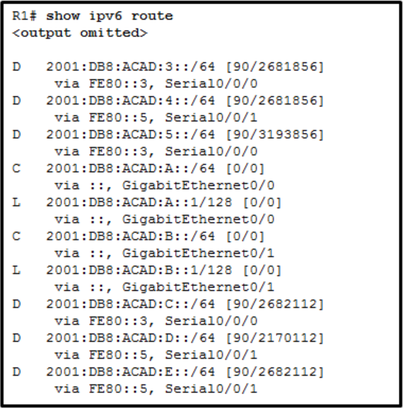

**Choices:**
- **A.** 90
- **B.** 128
- **C.** 2170112
- **D.** 2681856
- **E.** 2682112
- **F.** 3193856

**Correct Answer:**
2682112

**Explanation:**
Topic 14.4.3 The IPv6 destination address 2001:DB8:ACAD:E:240:BFF:FED4:9DD2 belongs to the network of 2001:DB8:ACAD:E::/64. In the routing table, the route to forward the packet has Serial 0/0/1 as an exit interface and 2682112 as the cost.

---

## Question 54

**Question:**
A network administrator is configuring a new Cisco switch for remote management access. Which three items must be configured on the switch for the task? (Choose three.)

**Choices:**
- **A.** IP address
- **B.** VTP domain
- **C.** vty lines
- **D.** default VLAN
- **E.** default gateway
- **F.** loopback address

**Correct Answer:**
IP address; vty lines; default gateway

**Explanation:**
Topic 1.1.5 To enable the remote management access, the Cisco switch must be configured with an IP address and a default gateway. In addition, vty lines must configured to enable either Telnet or SSH connections. A loopback address, default VLAN, and VTP domain configurations are not necessary for the purpose of remote switch management.

---

## Question 55

**Question:**
Refer to the exhibit. Which statement shown in the output allows router R1 to respond to stateless DHCPv6 requests?

**Images:**
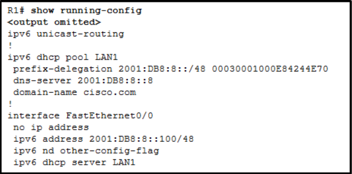

**Choices:**
- **A.** ipv6 nd other-config-flag​
- **B.** prefix-delegation 2001:DB8:8::/48 00030001000E84244E70​
- **C.** ipv6 dhcp server LAN1​
- **D.** ipv6 unicast-routing
- **E.** dns-server 2001:DB8:8::8​

**Correct Answer:**
ipv6 nd other-config-flag​

**Explanation:**
Topic 8.3.3 The interface command ipv6 nd other-config-flag allows RA messages to be sent on this interface, indicating that additional information is available from a stateless DHCPv6 server.

---

## Question 56

**Question:**
Refer to the exhibit. A Layer 3 switch routes for three VLANs and connects to a router for Internet connectivity. Which two configurations would be applied to the switch? (Choose two.) CCNA-2-v7-exam-answers-57 (config)# interface gigabitethernet1/1 (config-if)# switchport mode trunk (config)# interface gigabitethernet 1/1 (config-if)# no switchport (config-if)# ip address 192.168.1.2 255.255.255.252 (config)# interface vlan 1 (config-if)# ip address 192.168.1.2 255.255.255.0 (config-if)# no shutdown (config)# ip routing (config)# interface fastethernet0/4 (config-if)# switchport mode trunk

**Images:**
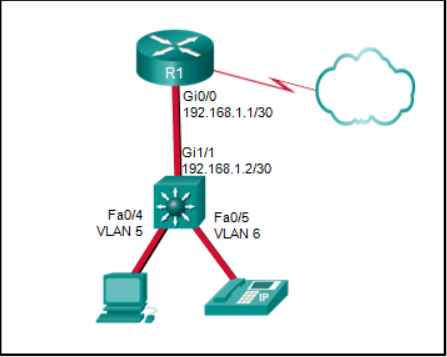

**Explanation:**
Topic 4.3.7 The no switchport command allows a switch port to be assigned an IP address. The port is a routed port at that point. The ip routing command enables routing for a switch. Use the interface vlan x command on the switch to configure routing for any VLAN that is attached to the switch, including the management VLAN. No management VLAN is shown in this scenario, but the commands interface vlan 5 and interface vlan 6, along with an appropriate IP address and subnet mask for each VLAN, would be used on the switch in the exhibit. There is no need to add an IP address or use the no shutdown command on VLAN 1 because VLAN 1 is not used in this design and because VLAN 1 is “up and up” by default.

---

## Question 57

**Question:**
A technician is troubleshooting a slow WLAN and decides to use the split-the-traffic approach. Which two parameters would have to be configured to do this? (Choose two.)

**Choices:**
- **A.** Configure the 5 GHz band for streaming multimedia and time sensitive traffic.
- **B.** Configure the security mode to WPA Personal TKIP/AES for one network and WPA2 Personal AES for the other network
- **C.** Configure the 2.4 GHz band for basic internet traffic that is not time sensitive.
- **D.** Configure the security mode to WPA Personal TKIP/AES for both networks.
- **E.** Configure a common SSID for both split networks.

**Correct Answer:**
Configure the 5 GHz band for streaming multimedia and time sensitive traffic.; Configure the 2.4 GHz band for basic internet traffic that is not time sensitive.

**Explanation:**
Topic 13.4.3 The “split-the-traffic” approach optimizes wireless performance by using the 2.4 GHz and 5 GHz bands as two separate networks to manage data flow more effectively. In this configuration, the 5 GHz band is dedicated to high-bandwidth, time-sensitive traffic like streaming multimedia because it is less crowded and has more interference-free channels, while the 2.4 GHz band is used for basic, non-time-sensitive tasks such as web browsing and email.

---

## Question 58

**Question:**
A company has just switched to a new ISP. The ISP has completed and checked the connection from its site to the company. However, employees at the company are not able to access the internet. What should be done or checked?

**Choices:**
- **A.** Verify that the static route to the server is present in the routing table.
- **B.** Check the configuration on the floating static route and adjust the AD.
- **C.** Ensure that the old default route has been removed from the company edge routers.
- **D.** Create a floating static route to that network.

**Correct Answer:**
Ensure that the old default route has been removed from the company edge routers.

**Explanation:**
Topic 15.3 When switching to a new ISP, a new default static route (0.0.0.0/0) must be configured to point to the new provider’s gateway; however, if the old default route remains in the routing table, the router may continue to misdirect internet-bound traffic toward the inactive link of the previous provider. Removing the obsolete route ensures that the router correctly uses the new path as the gateway of last resort for all traffic destined for the internet.

---

## Question 59

**Question:**
Which information does a switch use to populate the MAC address table?

**Choices:**
- **A.** the destination MAC address and the incoming port
- **B.** the destination MAC address and the outgoing port
- **C.** the source and destination MAC addresses and the incoming port
- **D.** the source and destination MAC addresses and the outgoing port
- **E.** the source MAC address and the incoming port
- **F.** the source MAC address and the outgoing port

**Correct Answer:**
the source MAC address and the incoming port

**Explanation:**
Topic 2.1.3 To maintain the MAC address table, the switch uses the source MAC address of the incoming packets and the port that the packets enter. The destination address is used to select the outgoing port.

---

## Question 60

**Question:**
Refer to the exhibit. A network administrator is reviewing the configuration of switch S1. Which protocol has been implemented to group multiple physical ports into one logical link?

**Images:**
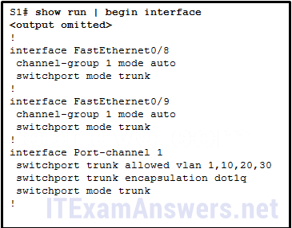

**Choices:**
- **A.** PAgP
- **B.** DTP
- **C.** LACP
- **D.** STP

**Correct Answer:**
PAgP

**Explanation:**
Topic 6.1.6 The EtherChannel protocol PAgP provides the grouping of physical interfaces and utilizes the modes of auto and desirable. The EtherChannel protocol LACP provides the grouping of physical interfaces and utilizes the modes of passive and active. DTP and STP are not utilized to group multiple physical interfaces into a single logical link.

---

## Question 61

**Question:**
Which type of static route is configured with a greater administrative distance to provide a backup route to a route learned from a dynamic routing protocol?

**Choices:**
- **A.** floating static route
- **B.** default static route
- **C.** summary static route
- **D.** standard static route

**Correct Answer:**
floating static route

**Explanation:**
Topic 15.4.1 There are four basic types of static routes. Floating static routes are backup routes that are placed into the routing table if a primary route is lost. A summary static route aggregates several routes into one, reducing the of the routing table. Standard static routes are manually entered routes into the routing table. Default static routes create a gateway of last resort.

---

## Question 62

**Question:**
What action takes place when a frame entering a switch has a unicast destination MAC address appearing in the MAC address table?

**Choices:**
- **A.** The switch updates the refresh timer for the entry.
- **B.** The switch forwards the frame out of the specified port.
- **C.** The switch purges the entire MAC address table.
- **D.** The switch replaces the old entry and uses the more current port.

**Correct Answer:**
The switch forwards the frame out of the specified port.

**Explanation:**
Topic 2.1.3 During the forwarding stage of switch operation, if the destination MAC address is a unicast address found in the MAC address table, the switch uses the existing entry to direct the frame exclusively out of the associated egress port rather than flooding it. In contrast, actions such as updating refresh timers or replacing entries occur during the learning stage when examining the source MAC address.

---

## Question 63

**Question:**
The exhibit shows two PCs called PC A and PC B, two routes called R1 and R2, and two switches. PC A has the address 172.16.1.1/24 and is connected to a switch and into an interface on R1 that has the IP address 172.16.1.254. PC B has the address 172.16.2.1/24 and is connected to a switch that is connected to another interface on R1 with the IP address 172.16.2.254. The serial interface on R1 has the address 172.16.3.1 and is connected to the serial interface on R2 that has the address 172.16.3.2/24. R2 is connected to the internet cloud. Which command will create a static route on R2 in order to reach PC B?

**Images:**
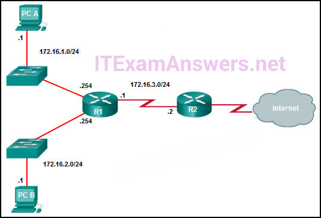

**Choices:**
- **A.** R2(config)# ip route 172.16.2.1 255.255.255.0 172.16.3.1
- **B.** R2(config)# ip route 172.16.2.0 255.255.255.0 172.16.2.254
- **C.** R2(config)# ip route 172.16.2.0 255.255.255.0 172.16.3.1
- **D.** R2(config)# ip route 172.16.3.0 255.255.255.0 172.16.2.254

**Correct Answer:**
R2(config)# ip route 172.16.2.0 255.255.255.0 172.16.3.1

**Explanation:**
Topic 15.2.1 The correct syntax is: router(config)# ip route destination-network destination-mask {next-hop-ip-address | exit-interface} If the local exit interface instead of the next-hop IP address is used then the route will be displayed as a directly connected route instead of a static route in the routing table. Because the network to be reached is 172.16.2.0 and the next-hop IP address is 172.16.3.1, the command is R2(config)# ip route 172.16.2.0 255.255.255.0 172.16.3.1

---

## Question 64

**Question:**
What protocol or technology allows data to transmit over redundant switch links?

**Choices:**
- **A.** EtherChannel
- **B.** DTP
- **C.** STP
- **D.** VTP

**Correct Answer:**
EtherChannel

**Explanation:**
Topic 6.1.1 EtherChannel is a link aggregation technology that groups multiple physical Ethernet links into a single logical link, allowing data to transmit over redundant paths simultaneously without being blocked by the Spanning Tree Protocol (STP). While STP prevents loops by disabling redundant paths, EtherChannel allows those physical links to remain active and functional by making them appear as a single connection to the network.

---

## Question 65

**Question:**
Refer to the exhibit. Which three hosts will receive ARP requests from host A, assuming that port Fa0/4 on both switches is configured to carry traffic for multiple VLANs? (Choose three.)

**Images:**
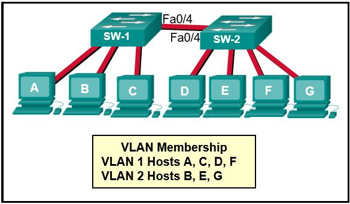

**Choices:**
- **A.** host B
- **B.** host C
- **C.** host D
- **D.** host E
- **E.** host F
- **F.** host G

**Correct Answer:**
host C; host D; host F

**Explanation:**
Topic 3.1.1 ARP requests are sent out as broadcasts. That means the ARP request is sent only throughout a specific VLAN. VLAN 1 hosts will only hear ARP requests from hosts on VLAN 1. VLAN 2 hosts will only hear ARP requests from hosts on VLAN 2.

---

## Question 66

**Question:**
Refer to the exhibit. The network administrator configures both switches as displayed. However, host C is unable to ping host D and host E is unable to ping host F. What action should the administrator take to enable this communication?

**Images:**
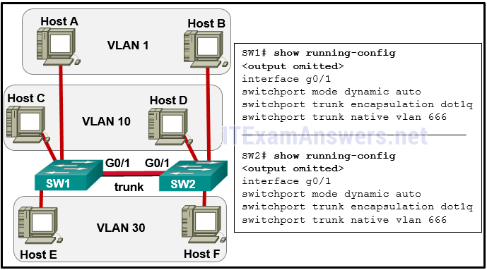

**Choices:**
- **A.** Associate hosts A and B with VLAN 10 instead of VLAN 1.
- **B.** Configure either trunk port in the dynamic desirable mode.
- **C.** Include a router in the topology.
- **D.** Remove the native VLAN from the trunk.
- **E.** Add the switchport nonegotiate command to the configuration of SW2.

**Correct Answer:**
Configure either trunk port in the dynamic desirable mode.

**Explanation:**
Topic 3.5.3 If one trunk port is in auto DTP negotiation mode, a trunk will be formed if the adjacent switch port is placed in trunk or dynamic desirable mode.

---

## Question 67

**Question:**
What is the effect of entering the shutdown configuration command on a switch?

**Choices:**
- **A.** It enables BPDU guard on a specific port.
- **B.** It disables an unused port.
- **C.** It enables portfast on a specific switch interface.
- **D.** It disables DTP on a non-trunking interface.

**Correct Answer:**
It disables an unused port.

**Explanation:**
Topic 11.1.1 The shutdown interface configuration command is used to administratively disable a switch port, which prevents any traffic from being sent or received through that interface. Issuing this command on all unused ports is a fundamental security best practice to protect a network from unauthorized access by ensuring those physical entry points remain inactive until needed.

---

## Question 68

**Question:**
What would be the primary reason an attacker would launch a MAC address overflow attack?

**Choices:**
- **A.** so that the switch stops forwarding traffic
- **B.** so that legitimate hosts cannot obtain a MAC address
- **C.** so that the attacker can see frames that are destined for other hosts
- **D.** so that the attacker can execute arbitrary code on the switch

**Correct Answer:**
so that the attacker can see frames that are destined for other hosts

**Explanation:**
Topic 10.4.2 A MAC address overflow attack (or MAC flooding) aims to fill the switch’s MAC address table with fake entries, forcing the switch to treat all subsequent incoming frames as unknown unicast traffic. When this happens, the switch floods those frames out of all ports on the VLAN, which allows the attacker to use packet sniffing software to capture and view data intended for other devices.

---

## Question 69

**Question:**
During the AAA process, when will authorization be implemented?

**Choices:**
- **A.** Immediately after successful authentication against an AAA data source
- **B.** Immediately after AAA accounting and auditing receives detailed reports
- **C.** Immediately after an AAA client sends authentication information to a centralized server
- **D.** Immediately after the determination of which resources a user can access

**Correct Answer:**
Immediately after successful authentication against an AAA data source

**Explanation:**
Topic 10.2.4 AAA authorization is implemented immediately after the user is authenticated against a specific AAA data source.

---

## Question 70

**Question:**
A company security policy requires that all MAC addressing be dynamically learned and added to both the MAC address table and the running configuration on each switch. Which port security configuration will accomplish this?

**Choices:**
- **A.** auto secure MAC addresses
- **B.** dynamic secure MAC addresses
- **C.** static secure MAC addresses
- **D.** sticky secure MAC addresses

**Correct Answer:**
sticky secure MAC addresses

**Explanation:**
Topic 11.1.4 With sticky secure MAC addressing, the MAC addresses can be either dynamically learned or manually configured and then stored in the address table and added to the running configuration file. In contrast, dynamic secure MAC addressing provides for dynamically learned MAC addressing that is stored only in the address table.

---

## Question 71

**Question:**
Which three Wi-Fi standards operate in the 2.4GHz range of frequencies? (Choose three.)

**Choices:**
- **A.** 802.11a
- **B.** 802.11b
- **C.** 802.11g
- **D.** 802.11n
- **E.** 802.11ac

**Correct Answer:**
802.11b; 802.11g; 802.11n

**Explanation:**
Topic 12.1.4 802.11b and 802.11g operate in the 2.4GHz range, and 802.11n can operate in either the 2.4GHz or the 5GHz range. 802.11a and 802.11ac operate only in the 5GHz range of frequencies.

---

## Question 72

**Question:**
To obtain an overview of the spanning tree status of a switched network, a network engineer issues the show spanning-tree command on a switch. Which two items of information will this command display? (Choose two.)

**Choices:**
- **A.** The root bridge BID.
- **B.** The role of the ports in all VLANs.
- **C.** The status of native VLAN ports.
- **D.** The number of broadcasts received on each root port.
- **E.** The IP address of the management VLAN interface.

**Correct Answer:**
The root bridge BID.; The role of the ports in all VLANs.

**Explanation:**
Topic 5.2 The show spanning-tree command will display the status of STP for all VLANs that are defined on a switch and other information including the root bridge BID. It does not show the number of broadcast packets received on the ports. The IP address of the management VLAN interface is not related to STP and is displayed by the show running-configuration command.

---

## Question 73

**Question:**
Refer to the exhibit. Which trunk link will not forward any traffic after the root bridge election process is complete?

**Images:**
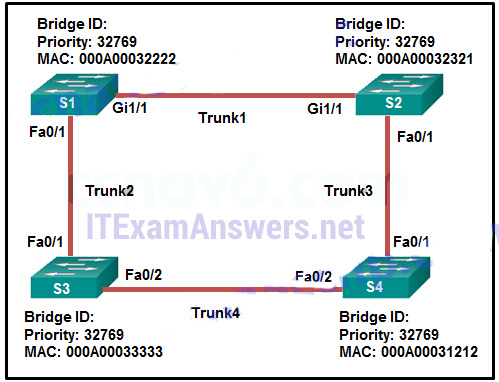

**Choices:**
- **A.** Trunk1
- **B.** Trunk2
- **C.** Trunk3
- **D.** Trunk4

**Correct Answer:**
Trunk2

**Explanation:**
Topic 5.2 S4 has the lowest bridge ID, thus S4 is the root bridge. Because the path cost S1-S2-S4 is lower than the path cost S1-S3-S4, path S1-S2-S4 is the preferred path for S1 to reach S4. Thus, STP will set the S1 port Fa0/1 to a blocking state, and the trunk link Trunk2 will not forward any traffic.

---

## Question 74

**Question:**
Which method of IPv6 prefix assignment relies on the prefix contained in RA messages?

**Choices:**
- **A.** EUI-64
- **B.** SLAAC
- **C.** static
- **D.** stateful DHCPv6

**Correct Answer:**
SLAAC

**Explanation:**
Topic 8.2.1 Stateless Address Autoconfiguration (SLAAC) relies on information received in router advertisement (RA) messages in order to automatically create an IPv6 address. The RA messages contain information such as the network prefix and prefix length, which the host combines with an interface ID in order to make a unique IPv6 unicast address.

---

## Question 75

**Question:**
Which two protocols are used to provide server-based AAA authentication? (Choose two.)

**Choices:**
- **A.** 802.1x
- **B.** SSH
- **C.** SNMP
- **D.** TACACS+
- **E.** RADIUS

**Correct Answer:**
TACACS+; RADIUS

**Explanation:**
Topic 10.2.3 Server-based AAA authentication uses an external TACACS or RADIUS authentication server to maintain a username and password database. When a client establishes a connection with an AAA enabled device, the device authenticates the client by querying the authentication servers.

---

## Question 76

**Question:**
A network administrator is configuring a WLAN. Why would the administrator disable the broadcast feature for the SSID?

**Choices:**
- **A.** to eliminate outsiders scanning for available SSIDs in the area
- **B.** to reduce the risk of interference by external devices such as microwave ovens
- **C.** to reduce the risk of unauthorized APs being added to the network
- **D.** to provide privacy and integrity to wireless traffic by using encryption

**Correct Answer:**
to eliminate outsiders scanning for available SSIDs in the area

**Explanation:**
Topic 12.7.2 Disabling the SSID broadcast feature, also known as SSID cloaking , prevents an Access Point (AP) from including the network name in its periodic beacon frames. While this does not provide strong security against professional attackers, it effectively hides the network from casual outsiders or unauthorized users scanning for available wireless networks, as they must manually configure the SSID on their devices to attempt a connection.

---

## Question 77

**Question:**
Which mitigation technique would prevent rogue servers from providing false IP configuration parameters to clients?

**Choices:**
- **A.** implementing port security
- **B.** turning on DHCP snooping
- **C.** disabling CDP on edge ports
- **D.** implementing port-security on edge ports

**Correct Answer:**
turning on DHCP snooping

**Explanation:**
Topic 11.3.2 Like Dynamic ARP Inspection (DAI), IP Source Guard (IPSG) needs to determine the validity of MAC-address-to-IP-address bindings. To do this IPSG uses the bindings database built by DHCP snooping.

---

## Question 78

**Question:**
A network administrator configures the port security feature on a switch. The security policy specifies that each access port should allow up to two MAC addresses. When the maximum number of MAC addresses is reached, a frame with the unknown source MAC address is dropped and a notification is sent to the syslog server. Which security violation mode should be configured for each access port?

**Choices:**
- **A.** shutdown
- **B.** restrict
- **C.** warning
- **D.** protect

**Correct Answer:**
restrict

**Explanation:**
Topic 11.1.6 In port security implementation, an interface can be configured for one of three violation modes: Protect – a port security violation causes the interface to drop packets with unknown source addresses and no notification is sent that a security violation has occurred. Restrict – a port security violation causes the interface to drop packets with unknown source addresses and to send a notification that a security violation has occurred. Shutdown – a port security violation causes the interface to immediately become error-disabled and turns off the port LED. No notification is sent that a security violation has occurred.

---

## Question 79

**Question:**
What protocol or technology defines a group of routers, one of them defined as active and another one as standby?

**Choices:**
- **A.** EtherChannel
- **B.** VTP
- **C.** HSRP
- **D.** DTP

**Correct Answer:**
HSRP

**Explanation:**
Topic 9.2.1 Hot Standby Router Protocol (HSRP) is a Cisco-proprietary First Hop Redundancy Protocol (FHRP) designed to provide default gateway redundancy. It operates by grouping multiple physical routers into a single virtual router where one device is elected as active to forward packets, while another is designated as standby to monitor the group and take over forwarding responsibilities if the active device fails.

---

## Question 80

**Question:**
Refer to the exhibit. After attempting to enter the configuration that is shown in router RTA, an administrator receives an error and users on VLAN 20 report that they are unable to reach users on VLAN 30. What is causing the problem?

**Images:**
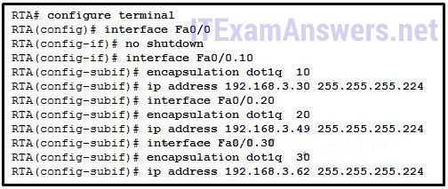

**Choices:**
- **A.** There is no address on Fa0/0 to use as a default gateway.
- **B.** RTA is using the same subnet for VLAN 20 and VLAN 30.
- **C.** Dot1q does not support subinterfaces.
- **D.** The no shutdown command should have been issued on Fa0/0.20 and Fa0/0.30.

**Correct Answer:**
RTA is using the same subnet for VLAN 20 and VLAN 30.

**Explanation:**
Topic 4.2.4 The IP 192.168.2.49/27 and 192.168.3.62/27 belong to the same subnet of 192.168.3.32/27. Valid host IPv4 addresses include 192.168.3.33 to 192.168.3.62.

---

## Question 81

**Question:**
Which three pairs of trunking modes will establish a functional trunk link between two Cisco switches? (Choose three.)

**Choices:**
- **A.** dynamic auto – dynamic auto
- **B.** access – trunk
- **C.** dynamic desirable – trunk
- **D.** access – dynamic auto
- **E.** dynamic desirable – dynamic desirable
- **F.** dynamic desirable – dynamic auto

**Correct Answer:**
dynamic desirable – trunk; dynamic desirable – dynamic desirable; dynamic desirable – dynamic auto

**Explanation:**
Topic 3.5.3 Dynamic Trunking Protocol (DTP) manages trunk negotiation between Cisco switch ports on a point-to-point basis. Dynamic desirable is an active mode that initiates negotiation and will successfully establish a functional trunk when the neighbor is configured in trunk , dynamic desirable , or dynamic auto modes. In contrast, if both ends are in dynamic auto , they both wait passively for the other to initiate negotiation, resulting in a non-trunking access link instead.

---

## Question 82

**Question:**
A technician is configuring a router for a small company with multiple WLANs and doesn’t need the complexity of a dynamic routing protocol. What should be done or checked?

**Choices:**
- **A.** Verify that there is not a default route in any of the edge router routing tables.
- **B.** Create static routes to all internal networks and a default route to the internet.
- **C.** Create extra static routes to the same location with an AD of 1.
- **D.** Check the statistics on the default route for oversaturation.

**Correct Answer:**
Create static routes to all internal networks and a default route to the internet.

**Explanation:**
Topic 14.4.5 In smaller networks where the complexity of a dynamic routing protocol is not required, static routes are used to manually define paths to internal network segments. Additionally, a default static route (0.0.0.0/0) is configured to serve as the “gateway of last resort,” directing all traffic destined for the internet toward the service provider’s next-hop router.

---

## Question 83

**Question:**
A company is deploying a wireless network in the distribution facility in a Boston suburb. The warehouse is quite large and it requires multiple access points to be used. Because some of the company devices still operate at 2.4GHz, the network administrator decides to deploy the 802.11g standard. Which channel assignments on the multiple access points will make sure that the wireless channels are not overlapping?

**Choices:**
- **A.** channels 1, 5, and 9
- **B.** channels 1, 6, and 11
- **C.** channels 1, 7, and 13
- **D.** channels 2, 6, and 10

**Correct Answer:**
channels 1, 6, and 11

**Explanation:**
Topic 12.5.2 In the North America domain, 11 channels are allowed for 2.4GHz wireless networking. Among these 11 channels, the combination of channels 1, 6, and 11 are the only non-overlapping channel combination.

---

## Question 84

**Question:**
A network administrator of a small advertising company is configuring WLAN security by using the WPA2 PSK method. Which credential do office users need in order to connect their laptops to the WLAN?

**Choices:**
- **A.** the company username and password through Active Directory service
- **B.** a key that matches the key on the AP
- **C.** a user passphrase
- **D.** a username and password configured on the AP

**Correct Answer:**
a key that matches the key on the AP

**Explanation:**
Topic 12.7.5 When a WLAN is configured with WPA2 PSK, wireless users must know the pre-shared key to associate and authenticate with the AP.

---

## Question 85

**Question:**
Refer to the exhibit. What are the possible port roles for ports A, B, C, and D in this RSTP-enabled network?

**Images:**
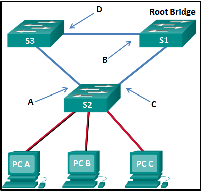

**Choices:**
- **A.** alternate, designated, root, root
- **B.** designated, alternate, root, root
- **C.** alternate, root, designated, root
- **D.** designated, root, alternate, root

**Correct Answer:**
alternate, designated, root, root

**Explanation:**
Topic 5.2.1 Because S1 is the root bridge, B is a designated port, and C and D root ports. RSTP supports a new port type, alternate port in discarding state, that can be port A in this scenario.

---

## Question 86

**Question:**
Refer to the exhibit. Which static route would an IT technician enter to create a backup route to the 172.16.1.0 network that is only used if the primary RIP learned route fails?

**Images:**
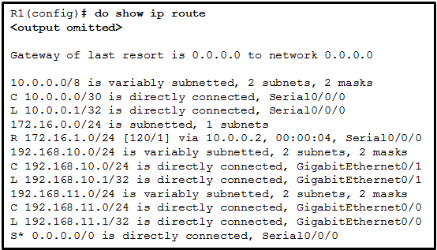

**Choices:**
- **A.** ip route 172.16.1.0 255.255.255.0 s0/0/0
- **B.** ip route 172.16.1.0 255.255.255.0 s0/0/0 121
- **C.** ip route 172.16.1.0 255.255.255.0 s0/0/0 111
- **D.** ip route 172.16.1.0 255.255.255.0 s0/0/0 91

**Correct Answer:**
ip route 172.16.1.0 255.255.255.0 s0/0/0 121

**Explanation:**
Topic 15.4.1 A backup static route is called a floating static route. A floating static route has an administrative distance greater than the administrative distance of another static route or dynamic route.

---

## Question 87

**Question:**
What mitigation plan is best for thwarting a DoS attack that is creating a MAC address table overflow?

**Choices:**
- **A.** Disable DTP.
- **B.** Disable STP.
- **C.** Enable port security.
- **D.** Place unused ports in an unused VLAN.

**Correct Answer:**
Enable port security.

**Explanation:**
Topic 11.1.2 A MAC address (CAM) table overflow attack, buffer overflow, and MAC address spoofing can all be mitigated by configuring port security. A network administrator would typically not want to disable STP because it prevents Layer 2 loops. DTP is disabled to prevent VLAN hopping. Placing unused ports in an unused VLAN prevents unauthorized wired connectivity.

---

## Question 88

**Question:**
A network engineer is troubleshooting a newly deployed wireless network that is using the latest 802.11 standards. When users access high bandwidth services such as streaming video, the wireless network performance is poor. To improve performance the network engineer decides to configure a 5 Ghz frequency band SSID and train users to use that SSID for streaming media services. Why might this solution improve the wireless network performance for that type of service?

**Choices:**
- **A.** Requiring the users to switch to the 5 GHz band for streaming media is inconvenient and will result in fewer users accessing these services.
- **B.** The 5 GHz band has more channels and is less crowded than the 2.4 GHz band, which makes it more suited to streaming multimedia.
- **C.** The 5 GHz band has a greater range and is therefore likely to be interference-free.
- **D.** The only users that can switch to the 5 GHz band will be those with the latest wireless NICs, which will reduce usage.

**Correct Answer:**
The 5 GHz band has more channels and is less crowded than the 2.4 GHz band, which makes it more suited to streaming multimedia.

**Explanation:**
Topic 13.4.3 Wireless range is determined by the access point antenna and output power, not the frequency band that is used. In this scenario it is stated that all users have wireless NICs that comply with the latest standard, and so all can access the 5 GHz band. Although some users may find it inconvenient to switch to the 5 Ghz band to access streaming services, it is the greater number of channels, not just fewer users, that will improve network performance.

---

## Question 89

**Question:**
Which DHCPv4 message will a client send to accept an IPv4 address that is offered by a DHCP server?

**Choices:**
- **A.** broadcast DHCPACK
- **B.** broadcast DHCPREQUEST
- **C.** unicast DHCPACK
- **D.** unicast DHCPREQUEST

**Correct Answer:**
broadcast DHCPREQUEST

**Explanation:**
Topic 7.1.3 When a DHCP client receives DHCPOFFER messages, it will send a broadcast DHCPREQUEST message for two purposes. First, it indicates to the offering DHCP server that it would like to accept the offer and bind the IP address. Second, it notifies any other responding DHCP servers that their offers are declined.

---

## Question 90

**Question:**
Refer to the exhibit. Which destination MAC address is used when frames are sent from the workstation to the default gateway?

**Images:**
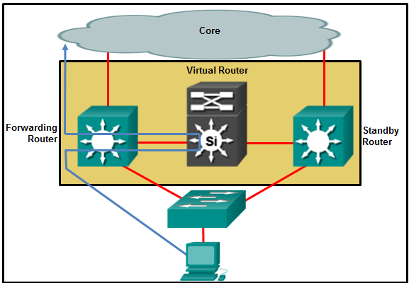

**Choices:**
- **A.** MAC address of the virtual router
- **B.** MAC address of the standby router
- **C.** MAC addresses of both the forwarding and standby routers
- **D.** MAC address of the forwarding router

**Correct Answer:**
MAC address of the virtual router

**Explanation:**
Topic 9.1.2 The IP address of the virtual router acts as the default gateway for all the workstations. Therefore, the MAC address that is returned by the Address Resolution Protocol to the workstation will be the MAC address of the virtual router.

---

## Question 91

**Question:**
After a host has generated an IPv6 address by using the DHCPv6 or SLAAC process, how does the host verify that the address is unique and therefore usable?

**Choices:**
- **A.** The host sends an ICMPv6 echo request message to the DHCPv6 or SLAAC-learned address and if no reply is returned, the address is considered unique.
- **B.** The host sends an ICMPv6 neighbor solicitation message to the DHCP or SLAAC-learned address and if no neighbor advertisement is returned, the address is considered unique.
- **C.** The host checks the local neighbor cache for the learned address and if the address is not cached, it it considered unique.
- **D.** The host sends an ARP broadcast to the local link and if no hosts send a reply, the address is considered unique.

**Correct Answer:**
The host sends an ICMPv6 neighbor solicitation message to the DHCP or SLAAC-learned address and if no neighbor advertisement is returned, the address is considered unique.

**Explanation:**
Topic 8.2.6 Before a host can actually configure and use an IPv6 address learned through SLAAC or DHCP, the host must verify that no other host is already using that address. To verify that the address is indeed unique, the host sends an ICMPv6 neighbor solicitation to the address. If no neighbor advertisement is returned, the host considers the address to be unique and configures it on the interface.

---

## Question 92

**Question:**
Match the purpose with its DHCP message type. (Not all options are used.)

**Images:**

**Explanation:**
Topic 7.1.3 DHCPREQUEST A message that is used to locate any available DHCP server on a network DHCPOFFER A message that is used to suggest a lease to a client DHCPDISCOVER A message that is used to identify the explicit server and lease offer to accept DHCPNAK A message that is used to acknowledge that the lease is successful DHCPACK A message is used by a server to finalize a successful lease with a client

---

## Question 93

**Question:**
Which protocol adds security to remote connections?

**Choices:**
- **A.** FTP
- **B.** HTTP
- **C.** NetBEUI
- **D.** POP
- **E.** SSH

**Correct Answer:**
SSH

**Explanation:**
Topic 1.3.2 SSH allows a technician to securely connect to a remote network device for monitoring and troubleshooting. HTTP establishes web page requests. FTP manages file transfer. NetBEUI is not routed on the Internet. POP downloads email messages from email servers.

---

## Question 94

**Question:**
Refer to the exhibit. A network administrator is verifying the configuration of inter-VLAN routing. Users complain that PC2 cannot communicate with PC1. Based on the output, what is the possible cause of the problem?

**Images:**

**Choices:**
- **A.** Gi0/0 is not configured as a trunk port.
- **B.** The command interface GigabitEthernet0/0.5 was entered incorrectly.
- **C.** There is no IP address configured on the interface Gi0/0.
- **D.** The no shutdown command is not entered on subinterfaces.
- **E.** The encapsulation dot1Q 5 command contains the wrong VLAN.

**Correct Answer:**
The encapsulation dot1Q 5 command contains the wrong VLAN.

**Explanation:**
Topic 4.4.6 In router-on-a-stick, the subinterface configuration should match the VLAN number in the encapsulation command, in this case, the command encapsulation dot1Q 10 should be used for VLAN 10. Since subinterfaces are used, there is no need to configure IP on the physical interface Gi0/0. The trunk mode is configured on the switch port that connects to the router. The subinterfaces are turned on when they are added.

---

## Question 95

**Question:**
Refer to the exhibit. A network administrator is configuring inter-VLAN routing on a network. For now, only one VLAN is being used, but more will be added soon. What is the missing parameter that is shown as the highlighted question mark in the graphic?

**Images:**

**Choices:**
- **A.** It identifies the subinterface.
- **B.** It identifies the VLAN number.
- **C.** It identifies the native VLAN number.
- **D.** It identifies the type of encapsulation that is used.
- **E.** It identifies the number of hosts that are allowed on the interface.

**Correct Answer:**
It identifies the VLAN number.

**Explanation:**
Topic 4.2.4 The completed command would be encapsulation dot1q 7 . The encapsulation dot1q part of the command enables trunking and identifies the type of trunking to use. The 7 identifies the VLAN number.

---

## Question 96

**Question:**
Match each DHCP message type with its description. (Not all options are used.) CCNA 2 v7 Modules 1 – 4: Switching Concepts, VLANs, and InterVLAN Routing Exam Answers

**Images:**

**Explanation:**
Topic 7.1.3 Place the options in the following order: a client initiating a message to find a DHCP server – DHCPDISCOVER a DHCP server responding to the initial request by a client – DHCPOFFER the client accepting the IP address provided by the DHCP server – DHCPREQUEST the DHCP server confirming that the lease has been accepted – DHCPACK

---

## Question 97

**Question:**
What network attack seeks to create a DoS for clients by preventing them from being able to obtain a DHCP lease?

**Choices:**
- **A.** IP address spoofing
- **B.** DHCP starvation
- **C.** CAM table attack
- **D.** DHCP spoofing

**Correct Answer:**
DHCP starvation

**Explanation:**
Topic 10.5.5 DCHP starvation attacks are launched by an attacker with the intent to create a DoS for DHCP clients. To accomplish this goal, the attacker uses a tool that sends many DHCPDISCOVER messages in order to lease the entire pool of available IP addresses, thus denying them to legitimate hosts.

---

## Question 98

**Question:**
Refer to the exhibit. If the IP addresses of the default gateway router and the DNS server are correct, what is the configuration problem?

**Images:**

**Choices:**
- **A.** The DNS server and the default gateway router should be in the same subnet.
- **B.** The IP address of the default gateway router is not contained in the excluded address list.
- **C.** The default-router and dns-server commands need to be configured with subnet masks.
- **D.** The IP address of the DNS server is not contained in the excluded address list.

**Correct Answer:**
The IP address of the default gateway router is not contained in the excluded address list.

**Explanation:**
Topic 7.2.2 In this configuration, the excluded address list should include the address that is assigned to the default gateway router. So the command should be ip dhcp excluded-address 192.168.10.1 192.168.10.9.

---

## Question 99

**Question:**
Refer to the exhibit. A network administrator has added a new subnet to the network and needs hosts on that subnet to receive IPv4 addresses from the DHCPv4 server. What two commands will allow hosts on the new subnet to receive addresses from the DHCP4 server? (Choose two.)

**Images:**

**Choices:**
- **A.** R1(config-if)# ip helper-address 10.2.0.250
- **B.** R1(config)# interface G0/1
- **C.** R1(config)# interface G0/0
- **D.** R2(config-if)# ip helper-address 10.2.0.250
- **E.** R2(config)# interface G0/0
- **F.** R1(config-if)# ip helper-address 10.1.0.254

**Correct Answer:**
R1(config-if)# ip helper-address 10.2.0.250; R1(config)# interface G0/0

**Explanation:**
Topic 7.2.8 You need the router interface that is connected to the new subnet and the dhcp server address. The ip helper-address command is used to configure a router to be a DHCPv4 relay. The command should be placed on the interface facing the DHCPv4 clients. When the command is applied on the router interface, the interface will receive DHCPv4 broadcast messages and forward them as unicast to the IP address of the DHCPv4 server.

---

## Question 100

**Question:**
What protocol or technology uses source IP to destination IP as a load-balancing mechanism?

**Choices:**
- **A.** VTP
- **B.** EtherChannel
- **C.** DTP
- **D.** STP

**Correct Answer:**
EtherChannel

**Explanation:**
Topic 6.1.3 EtherChannel is a link aggregation technology that bundles multiple physical links into a single logical link to increase bandwidth and provide redundancy. One of its key advantages is the ability to perform load balancing across the bundled physical links, which can be implemented using mechanisms such as source IP to destination IP or source MAC to destination MAC, depending on the hardware platform.

---

## Question 101

**Question:**
What protocol should be disabled to help mitigate VLAN attacks?

**Choices:**
- **A.** CDP
- **B.** ARP
- **C.** STP
- **D.** DTP

**Correct Answer:**
DTP

**Explanation:**
Topic 11.2.2 Dynamic Trunking Protocol (DTP) should be disabled to mitigate VLAN hopping attacks because a threat actor can spoof DTP signaling to trick a switch port into establishing an unauthorized trunk link. Once a trunk is established, the attacker can access all VLANs on the switch. Mitigation involves disabling DTP negotiations on both access ports (by setting them to static access mode) and trunk ports (using the switchport nonegotiate command) to ensure that trunking is only enabled manually.

---

## Question 102

**Question:**
What protocol or technology requires switches to be in server mode or client mode?

**Choices:**
- **A.** EtherChannel
- **B.** STP
- **C.** VTP
- **D.** DTP

**Correct Answer:**
VTP

**Explanation:**
Topic 3.3.1 VLAN Trunking Protocol (VTP) is a Cisco-proprietary protocol used to synchronize and manage the VLAN database across multiple switches in a network. It requires switches to be configured in specific modes to operate: Server mode (the default) allows administrators to create, modify, or delete VLANs, while Client mode prevents local changes and instead requires the switch to receive and store VLAN information from a VTP server.

---

## Question 103

**Question:**
What are two reasons a network administrator would segment a network with a Layer 2 switch? (Choose two.)

**Choices:**
- **A.** to create fewer collision domains
- **B.** to enhance user bandwidth
- **C.** to create more broadcast domains
- **D.** to eliminate virtual circuits
- **E.** to isolate traffic between segments
- **F.** to isolate ARP request messages from the rest of the network

**Correct Answer:**
to enhance user bandwidth; to isolate traffic between segments

**Explanation:**
Topic 2.2.3 A switch has the ability of creating temporary point-to-point connections between the directly-attached transmitting and receiving network devices. The two devices have full-bandwidth full-duplex connectivity during the transmission.

---

## Question 104

**Question:**
What command will enable a router to begin sending messages that allow it to configure a link-local address without using an IPv6 DHCP server?

**Choices:**
- **A.** a static route
- **B.** the ipv6 route ::/0 command
- **C.** the ipv6 unicast-routing command
- **D.** the ip routing command

**Correct Answer:**
the ipv6 unicast-routing command

**Explanation:**
Topic 8.2.2 To enable IPv6 on a router you must use the ipv6 unicast-routing global configuration command or use the ipv6 enable interface configuration command. This is equivalent to entering ip routing to enable IPv4 routing on a router when it has been turned off. Keep in mind that IPv4 is enabled on a router by default. IPv6 is not enabled by default.

---

## Question 105

**Question:**
A network administrator is using the router-on-a-stick model to configure a switch and a router for inter-VLAN routing. What configuration should be made on the switch port that connects to the router?

**Choices:**
- **A.** Configure it as a trunk port and allow only untagged traffic.
- **B.** Configure the port as an access port and a member of VLAN1.
- **C.** Configure the port as an 802.1q trunk port.
- **D.** Configure the port as a trunk port and assign it to VLAN1.

**Correct Answer:**
Configure the port as an 802.1q trunk port.

**Explanation:**
Topic 4.1.3 The port on the switch that connects to the router interface should be configured as a trunk port. Once it becomes a trunk port, it does not belong to any particular VLAN and will forward traffic from various VLANs.

---

## Question 106

**Question:**
What are three techniques for mitigating VLAN attacks? (Choose three.)

**Choices:**
- **A.** Use private VLANs.
- **B.** Enable BPDU guard.
- **C.** Enable trunking manually
- **D.** Enable Source Guard.
- **E.** Disable DTP.
- **F.** Set the native VLAN to an unused VLAN.

**Correct Answer:**
Enable trunking manually; Disable DTP.; Set the native VLAN to an unused VLAN.

**Explanation:**
Topic 11.2.2 Mitigating a VLAN attack can be done by disabling Dynamic Trunking Protocol (DTP), manually setting ports to trunking mode, and by setting the native VLAN of trunk links to VLANs not in use.

---

## Question 107

**Question:**
Match the DHCP message types to the order of the DHCPv4 process. (Not all options are used.) Step 1 DHCPDISCOVER Step 2 DHCPOFFER Step 3 DHCPREQUEST Step 4 DHCPACK

**Images:**
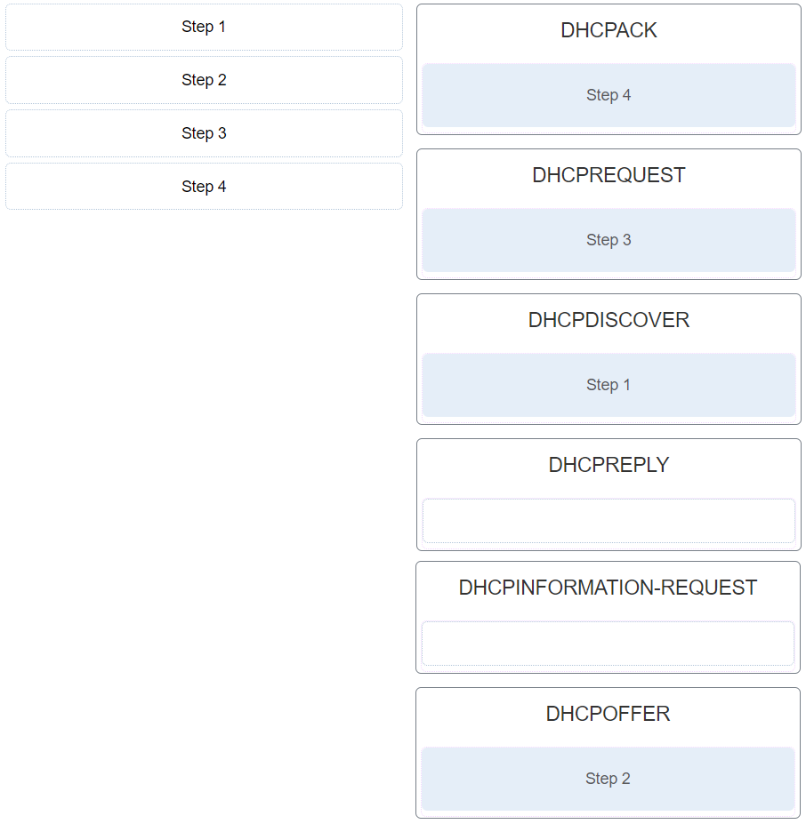

**Explanation:**
Topic 7.1.3 The broadcast DHCPDISCOVER message finds DHCPv4 servers on the network. When the DHCPv4 server receives a DHCPDISCOVER message, it reserves an available IPv4 address to lease to the client and sends the unicast DHCPOFFER message to the requesting client. When the client receives the DHCPOFFER from the server, it sends back a DHCPREQUEST. On receiving the DHCPREQUEST message the server replies with a unicast DHCPACK message. DHCPREPLY and DHCPINFORMATION-REQUEST are DHCPv6 messages.

---

## Question 108

**Question:**
In which situation would a technician use the show interfaces switch command?

**Choices:**
- **A.** to determine if remote access is enabled
- **B.** when packets are being dropped from a particular directly attached host
- **C.** when an end device can reach local devices, but not remote devices
- **D.** to determine the MAC address of a directly attached network device on a particular interface

**Correct Answer:**
when packets are being dropped from a particular directly attached host

**Explanation:**
Topic 1.2.6 The show interfaces command is useful to detect media errors, to see if packets are being sent and received, and to determine if any runts, giants, CRCs, interface resets, or other errors have occurred. Problems with reachability to a remote network would likely be caused by a misconfigured default gateway or other routing issue, not a switch issue. The show mac address-table command shows the MAC address of a directly attached device.

---

## Question 109

**Question:**
What is a drawback of the local database method of securing device access that can be solved by using AAA with centralized servers?

**Choices:**
- **A.** There is no ability to provide accountability.
- **B.** User accounts must be configured locally on each device, which is an unscalable authentication solution.
- **C.** It is very susceptible to brute-force attacks because there is no username.
- **D.** The passwords can only be stored in plain text in the running configuration.

**Correct Answer:**
User accounts must be configured locally on each device, which is an unscalable authentication solution.

**Explanation:**
Topic 10.2.1 The local database method of securing device access utilizes usernames and passwords that are configured locally on the router. This allows administrators to keep track of who logged in to the device and when. The passwords can also be encrypted in the configuration. However, the account information must be configured on each device where that account should have access, making this solution very difficult to scale.

---

## Question 110

**Question:**
What action does a DHCPv4 client take if it receives more than one DHCPOFFER from multiple DHCP servers?

**Choices:**
- **A.** It sends a DHCPREQUEST that identifies which lease offer the client is accepting.
- **B.** It sends a DHCPNAK and begins the DHCP process over again.
- **C.** It discards both offers and sends a new DHCPDISCOVER.
- **D.** It accepts both DHCPOFFER messages and sends a DHCPACK.

**Correct Answer:**
It sends a DHCPREQUEST that identifies which lease offer the client is accepting.

**Explanation:**
Topic 7.1.3 If there are multiple DHCP servers in a network, it is possible for a client to receive more than one DHCPOFFER. In this scenario, the client will only send one DHCPREQUEST, which includes the server from which the client is accepting the offer.

---

## Question 111

**Question:**
Refer to the exhibit. The network administrator is configuring the port security feature on switch SWC. The administrator issued the command show port-security interface fa 0/2 to verify the configuration. What can be concluded from the output that is shown? (Choose three.) Switching, Routing, and Wireless Essentials ( Version 7.00) – SRWE Final Exam

**Images:**
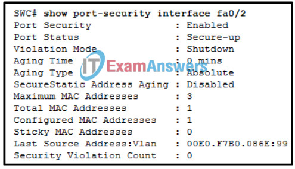

**Choices:**
- **A.** Three security violations have been detected on this interface.
- **B.** This port is currently up.
- **C.** The port is configured as a trunk link.
- **D.** Security violations will cause this port to shut down immediately.
- **E.** There is no device currently connected to this port.
- **F.** The switch port mode for this interface is access mode.

**Correct Answer:**
This port is currently up.; Security violations will cause this port to shut down immediately.; The switch port mode for this interface is access mode.

**Explanation:**
Topic 11.1.3 Because the security violation count is at 0, no violation has occurred. The system shows that 3 MAC addresses are allowed on port fa0/2, but only one has been configured and no sticky MAC addresses have been learned. The port is up because of the port status of secure-up. The violation mode is what happens when an unauthorized device is attached to the port. A port must be in access mode in order to activate and use port security.

---

## Question 112

**Question:**
What method of wireless authentication is dependent on a RADIUS authentication server?

**Choices:**
- **A.** WEP
- **B.** WPA Personal
- **C.** WPA2 Personal
- **D.** WPA2 Enterprise

**Correct Answer:**
WPA2 Enterprise

**Explanation:**
Topic 12.7.7 WPA2 Enterprise relies on an external RADIUS server to authenticate clients when they attempt to connect. WEP and WPA/WPA2 Personal both use a pre-shared key that the clients must know in order to authenticate.

---

## Question 113

**Question:**
A network administrator has found a user sending a double-tagged 802.1Q frame to a switch. What is the best solution to prevent this type of attack?

**Choices:**
- **A.** The native VLAN number used on any trunk should be one of the active data VLANs.
- **B.** The VLANs for user access ports should be different VLANs than any native VLANs used on trunk ports.
- **C.** Trunk ports should be configured with port security.
- **D.** Trunk ports should use the default VLAN as the native VLAN number.

**Correct Answer:**
The VLANs for user access ports should be different VLANs than any native VLANs used on trunk ports.

**Explanation:**
Topic 10.5.3 A double-tagging attack is unidirectional and specifically requires the attacker to be connected to a port residing in the same VLAN as the native VLAN of the trunk port . When this condition is met, the first switch strips the outer tag (the native VLAN) and forwards the frame untagged, leaving the hidden inner tag to be processed by the second switch. The best solution is to ensure that user access ports are assigned to VLANs that are distinct from the native VLANs used on trunk links, effectively breaking the prerequisite for the attack.

---

## Question 114

**Question:**
Refer to the exhibit. Which two conclusions can be drawn from the output? (Choose two.)

**Images:**
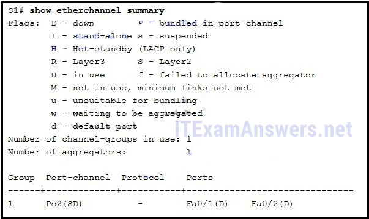

**Choices:**
- **A.** The EtherChannel is down.
- **B.** The port channel ID is 2.
- **C.** The port channel is a Layer 3 channel.
- **D.** The bundle is fully operational.
- **E.** The load-balancing method used is source port to destination port.

**Correct Answer:**
The EtherChannel is down.; The port channel ID is 2.

**Explanation:**
Topic 6.3.1 According to the Flags provided in the output, the letter “D” indicates that the channel and its member ports (Fa0/1 and Fa0/2) are down . The port channel is identified as Po2 , which signifies that the port channel ID is 2 . Additionally, the letter “S” indicates this is a Layer 2 EtherChannel, not Layer 3.

---

## Question 115

**Question:**
Match the step number to the sequence of stages that occur during the HSRP failover process. (Not all options are used.) Step 1 The forwarding router fails. Step 2 The standby router stops seeing hello messages from the forwarding router. Step 3 The standby router assumes the role of the forwarding router using both the IP and MAC addresses of the virtual router.

**Images:**
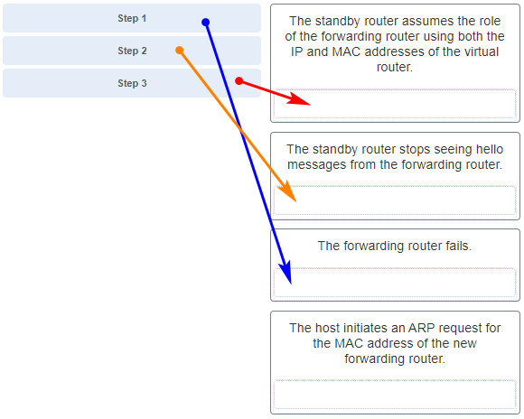

**Explanation:**
Topic 9.1.3 Hot Standby Router Protocol (HSRP) is a Cisco-proprietary protocol that is designed to allow for transparent failover of a first-hop IPv4 device.

---

## Question 116

**Question:**
On a Cisco 3504 WLC Summary page ( Advanced > Summary ), which tab allows a network administrator to configure a particular WLAN with a WPA2 policy?

**Choices:**
- **A.** WLANs
- **B.** SECURITY
- **C.** WIRELESS
- **D.** MANAGEMENT

**Correct Answer:**
WLANs

**Explanation:**
Topic 13.2.6 The WLANs tab in the Cisco 3504 WLC advanced Summary page allows a user to access the configuration of WLANs including security, QoS, and policy-mapping.

---

## Question 117

**Question:**
Refer to the exhibit. A network engineer is configuring IPv6 routing on the network. Which command issued on router HQ will configure a default route to the Internet to forward packets to an IPv6 destination network that is not listed in the routing table?​

**Images:**
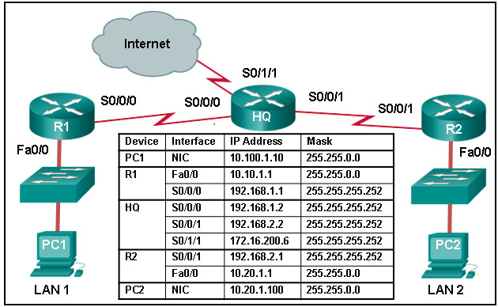

**Choices:**
- **A.** ipv6 route ::/0 serial 0/0/0
- **B.** ip route 0.0.0.0 0.0.0.0 serial 0/1/1
- **C.** ipv6 route ::1/0 serial 0/1/1
- **D.** ipv6 route ::/0 serial 0/1/1

**Correct Answer:**
ipv6 route ::/0 serial 0/1/1

**Explanation:**
Topic 15.3.1 An IPv6 default static route uses the prefix ::/0 , where the /0 prefix length indicates that no bits need to match the destination IP address for the route to be used. On router HQ, the Serial 0/1/1 interface is the exit point connected directly to the Internet; therefore, specifying this interface in the command ensures all traffic without a more specific match is forwarded toward the ISP.

---

## Question 118

**Question:**
Users are complaining of sporadic access to the internet every afternoon. What should be done or checked?

**Choices:**
- **A.** Create static routes to all internal networks and a default route to the internet.
- **B.** Verify that there is not a default route in any of the edge router routing tables.
- **C.** Create a floating static route to that network.
- **D.** Check the statistics on the default route for oversaturation.

**Correct Answer:**
Check the statistics on the default route for oversaturation.

**Explanation:**
Topic 16.2.1 Sporadic internet access occurring at specific times (such as every afternoon) often indicates that a network link has become oversaturated due to high traffic volume. According to the sources, when there are changes in network status or links become congested, administrators must use troubleshooting tools to check for oversaturation, which causes intermittent connectivity rather than a complete routing failure.

---

## Question 119

**Question:**
What action takes place when the source MAC address of a frame entering a switch appears in the MAC address table associated with a different port?

**Choices:**
- **A.** The switch purges the entire MAC address table.
- **B.** The switch replaces the old entry and uses the more current port.
- **C.** The switch updates the refresh timer for the entry.
- **D.** The switch forwards the frame out of the specified port.

**Correct Answer:**
The switch replaces the old entry and uses the more current port.

**Explanation:**
Topic 2.1.3 During the learning process, if a switch receives a frame and discovers that the source MAC address already exists in its MAC address table but is associated with a different port , it treats this as a location change for that device. The switch then replaces the old entry with the more current port number and updates the refresh timer to maintain accurate forwarding information.

---

## Question 120

**Question:**
A network administrator is configuring a WLAN. Why would the administrator use a WLAN controller?

**Choices:**
- **A.** to centralize management of multiple WLANs
- **B.** to provide privacy and integrity to wireless traffic by using encryption
- **C.** to facilitate group configuration and management of multiple WLANs through a WLC
- **D.** to provide prioritized service for time-sensitive applications

**Correct Answer:**
to facilitate group configuration and management of multiple WLANs through a WLC

**Explanation:**
Topic 12.4.2 A WLAN Controller (WLC) is used to centrally manage and automatically configure multiple Lightweight Access Points (LAPs) and WLANs using the CAPWAP protocol. While autonomous APs require time-consuming manual configuration for each device, a WLC facilitates group configuration , allowing an administrator to manage many APs simultaneously as a single system, which is essential for scalability in large network environments.

---

## Question 121

**Question:**
A new Layer 3 switch is connected to a router and is being configured for interVLAN routing. What are three of the five steps required for the configuration? (Choose three.) Case 7 (NEW):

**Choices:**
- **A.** creating SVI interfaces
- **B.** adjusting the route metric
- **C.** enabling IP routing
- **D.** assigning ports to VLANs
- **E.** deleting the default VLAN
- **F.** assigning the ports to the native VLAN
- **G.** modifying the default VLAN
- **H.** installing a static route
- **I.** entering “no switchport” on the port connected to the router
- **J.** establishing adjacencies
- **K.** implementing a routing protocol
- **L.** creating VLANs

**Correct Answer:**
creating SVI interfaces; enabling IP routing; assigning ports to VLANs; entering “no switchport” on the port connected to the router; creating VLANs

**Explanation:**
Case 1: Case 2: Case 3: Case 4: Case 5: Case 6: Topic 4.3.3 Steps to configure Layer 3 switch to route with a router: Step 1. Configure the routed port. Step 2. Enable routing. Step 3. Configure routing. Step 4. Verify routing. Step 5. Verify connectivity. Reference: 4.3.8 Packet Tracer Configure Layer 3 Switching and inter VLAN Routing

---

## Question 122

**Question:**
Which three statements accurately describe duplex and speed settings on Cisco 2960 switches? (Choose three.)

**Choices:**
- **A.** An autonegotiation failure can result in connectivity issues.
- **B.** When the speed is set to 1000 Mb/s, the switch ports will operate in full-duplex mode.
- **C.** The duplex and speed settings of each switch port can be manually configured.
- **D.** Enabling autonegotiation on a hub will prevent mismatched port speeds when connecting the hub to the switch.
- **E.** By default, the speed is set to 100 Mb/s and the duplex mode is set to autonegotiation.
- **F.** By default, the autonegotiation feature is disabled.

**Correct Answer:**
An autonegotiation failure can result in connectivity issues.; When the speed is set to 1000 Mb/s, the switch ports will operate in full-duplex mode.; The duplex and speed settings of each switch port can be manually configured.

**Explanation:**
Topic 1.2.2 Cisco 2960 switches allow administrators to manually configure speed and duplex settings for each port using the speed and duplex interface commands. While ports default to autonegotiation , a failure in this process leads to mismatched settings, which can cause significant connectivity issues . Additionally, when a port speed is set to 1000 Mb/s (Gigabit Ethernet) , the switch port is restricted to operating only in full-duplex mode .

---

## Question 123

**Question:**
Refer to the exhibit. A network administrator configures R1 for inter-VLAN routing between VLAN 10 and VLAN 20. However, the devices in VLAN 10 and VLAN 20 cannot communicate. Based on the configuration in the exhibit, what is a possible cause for the problem?

**Images:**
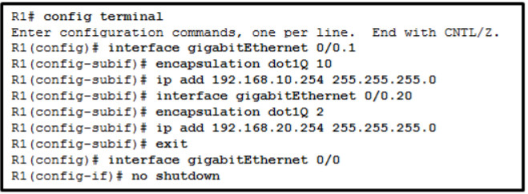

**Choices:**
- **A.** The port Gi0/0 should be configured as trunk port.
- **B.** The encapsulation is misconfigured on a subinterface.
- **C.** A no shutdown command should be added in each subinterface configuration.
- **D.** The command interface gigabitEthernet 0/0.1 is wrong.

**Correct Answer:**
The encapsulation is misconfigured on a subinterface.

**Explanation:**
Topic 4.2.4 In a router-on-a-stick configuration, each subinterface must be assigned to the correct VLAN using the encapsulation dot1q vlan-id command. The exhibit shows two errors: first, “dot10” is an incorrect protocol name (it should be dot1q ), and second, the second subinterface is assigned to VLAN 2 (encapsulation dot10 2) instead of the intended VLAN 20 associated with the 192.168.20.0/24 subnet.

---

## Question 124

**Question:**
A network administrator uses the spanning-tree portfast bpduguard default global configuration command to enable BPDU guard on a switch. However, BPDU guard is not activated on all access ports. What is the cause of the issue?

**Choices:**
- **A.** BPDU guard needs to be activated in the interface configuration command mode.
- **B.** Access ports configured with root guard cannot be configured with BPDU guard.
- **C.** Access ports belong to different VLANs.
- **D.** PortFast is not configured on all access ports.

**Correct Answer:**
PortFast is not configured on all access ports.

**Explanation:**
Topic 11.5.3 BPDU guard can be enabled globally on all PortFast-enabled ports by using the spanning-tree portfast bpduguard default global configuration command. If PortFast is not configured, then BPDU guard is not activated.

---

## Question 125

**Question:**
Which two types of spanning tree protocols can cause suboptimal traffic flows because they assume only one spanning-tree instance for the entire bridged network? (Choose two.)

**Choices:**
- **A.** MSTP
- **B.** RSTP
- **C.** Rapid PVST+
- **D.** PVST+
- **E.** STP

**Correct Answer:**
RSTP; STP

**Explanation:**
Topic 5.3.1 STP and RSTP assume only one IEEE 802.1D spanning-tree instance for the entire bridged network irrespective of the number of VLANs, This can result in suboptimal traffic flow issues. PVST+ provides a separate spanning-tree instance for each VLAN configured. Rapid PVST+ provides a separate instance of 802.1w per VLAN, and MSTP maps multiple VLANs that have the same traffic flow requirements into the same spanning-tree instance but allows for more than one instance for dissimilar traffic flows.

---

## Question 126

**Question:**
Refer to the exhibit. A network administrator is configuring the router R1 for IPv6 address assignment. Based on the partial configuration, which IPv6 global unicast address assignment scheme does the administrator intend to implement?

**Images:**
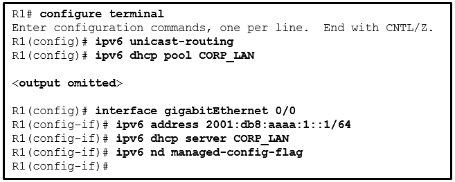

**Choices:**
- **A.** stateful
- **B.** stateless
- **C.** manual configuration
- **D.** SLAAC

**Correct Answer:**
stateful

**Explanation:**
Topic 8.3.5 The command ipv6 nd managed-config-flag is used to set the M (Managed Address Configuration) flag to 1 in ICMPv6 Router Advertisement (RA) messages. Setting this flag informs hosts that they must contact a stateful DHCPv6 server to acquire their IPv6 global unicast address and all other network configuration information, rather than using SLAAC.

---

## Question 127

**Question:**
A WLAN engineer deploys a WLC and five wireless APs using the CAPWAP protocol with the DTLS feature to secure the control plane of the network devices. While testing the wireless network, the WLAN engineer notices that data traffic is being exchanged between the WLC and the APs in plain-text and is not being encrypted. What is the most likely reason for this?

**Choices:**
- **A.** DTLS only provides data security through authentication and does not provide encryption for data moving between a wireless LAN controller (WLC) and an access point (AP).
- **B.** Although DTLS is enabled by default to secure the CAPWAP control channel, it is disabled by default for the data channel.
- **C.** DTLS is a protocol that only provides security between the access point (AP) and the wireless client.
- **D.** Data encryption requires a DTLS license to be installed on each access point (AP) prior to being enabled on the wireless LAN controller (WLC).

**Correct Answer:**
Although DTLS is enabled by default to secure the CAPWAP control channel, it is disabled by default for the data channel.

**Explanation:**
Topic 12.4.4 TLS is a protocol which provides security between the AP and the WLC. It allows them to communicate using encryption and prevents eavesdropping or tampering. DTLS is enabled by default to secure the CAPWAP control channel but is disabled by default for the data channel. All CAPWAP management and control traffic exchanged between an AP and WLC is encrypted and secured by default to provide control plane privacy and prevent Man-In-the-Middle (MITM) attacks.

---

## Question 128

**Question:**
A new switch is to be added to an existing network in a remote office. The network administrator does not want the technicians in the remote office to be able to add new VLANs to the switch, but the switch should receive VLAN updates from the VTP domain. Which two steps must be performed to configure VTP on the new switch to meet these conditions? (Choose two.)

**Choices:**
- **A.** Configure the new switch as a VTP client.
- **B.** Configure the existing VTP domain name on the new switch.
- **C.** Configure an IP address on the new switch.
- **D.** Configure all ports of both switches to access mode.
- **E.** Enable VTP pruning.

**Correct Answer:**
Configure the new switch as a VTP client.; Configure the existing VTP domain name on the new switch.

**Explanation:**
Topic 3.3.1 Before the switch is put in the correct VTP domain and in client mode, the switch must be connected to any other switch in the VTP domain through a trunk in order to receive/transmit VTP information.

---

## Question 129

**Question:**
Refer to the exhibit. Consider that the main power has just been restored. PC3 issues a broadcast IPv4 DHCP request. To which port will SW1 forward this request?​

**Images:**
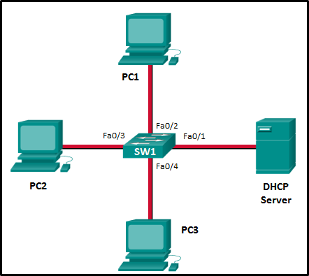

**Choices:**
- **A.** to Fa0/1, Fa0/2, and Fa0/3 only
- **B.** to Fa0/1, Fa0/2, Fa0/3, and Fa0/4
- **C.** to Fa0/1 only​
- **D.** to Fa0/1, Fa0/2, and Fa0/4 only​
- **E.** to Fa0/1 and Fa0/2 only

**Correct Answer:**
to Fa0/1, Fa0/2, and Fa0/3 only

**Explanation:**
Topic 2.1.3 When a switch receives a broadcast frame , such as a DHCP Discover request, it follows a specific forwarding rule: it floods the frame out of all available ports in the same VLAN except for the port where the frame entered the switch (the ingress port ). In this star topology, PC3 sends the request through port Fa0/4 ; therefore, SW1 will forward that broadcast to all other active ports, which are Fa0/1 (the DHCP Server), Fa0/2 (PC1), and Fa0/3 (PC2). Although the restoration of power means the switch is undergoing the STP convergence process, the logic for broadcast forwarding remains defined by the exclusion of the source port.

---

## Question 130

**Question:**
What action takes place when the source MAC address of a frame entering a switch is not in the MAC address table?

**Choices:**
- **A.** The switch forwards the frame out of the specified port.
- **B.** The switch will forward the frame out all ports except the incoming port.
- **C.** The switch adds the MAC address and incoming port number to the table.
- **D.** The switch adds a MAC address table entry mapping for the destination MAC address and the ingress port.
- **E.** The switch adds a MAC address table entry for the destination MAC address and the egress port.
- **F.** The switch replaces the old entry and uses the more current port.
- **G.** The switch updates the refresh timer for the entry.

**Correct Answer:**
The switch adds the MAC address and incoming port number to the table.

**Explanation:**
Case 2: Topic 2.1.3 Every frame that enters a switch is checked for new information during the learning process. If the switch examines the source MAC address and finds it does not exist in the MAC address table, it adds that MAC address along with the incoming (ingress) port number to the table. This allows the switch to populate its database so it can efficiently forward future frames destined for that specific device.

---

## Question 131

**Question:**
Employees are unable to connect to servers on one of the internal networks. What should be done or checked?

**Choices:**
- **A.** Use the “show ip interface brief” command to see if an interface is down.
- **B.** Verify that there is not a default route in any of the edge router routing tables.
- **C.** Create static routes to all internal networks and a default route to the internet.
- **D.** Check the statistics on the default route for oversaturation.

**Correct Answer:**
Use the “show ip interface brief” command to see if an interface is down.

**Explanation:**
Topic 1.5.2 When connectivity to a specific internal network is lost, the network administrator must determine if the physical or logical path is active. The show ip interface brief command is a fundamental troubleshooting tool that provides a quick summary of the status and protocol for all interfaces, allowing the technician to immediately see if an interface has failed or been administratively shut down. While checking for oversaturation is useful for sporadic issues, a complete inability to connect typically requires verifying interface operational status first.

---

## Question 132

**Question:**
What is the effect of entering the ip dhcp snooping configuration command on a switch?

**Choices:**
- **A.** It enables DHCP snooping globally on a switch.
- **B.** It enables PortFast globally on a switch.
- **C.** It disables DTP negotiations on trunking ports.
- **D.** It manually enables a trunk link.

**Correct Answer:**
It enables DHCP snooping globally on a switch.

**Explanation:**
Topic 11.3.3 The ip dhcp snooping global configuration command is used to activate the DHCP snooping security feature on the switch. It is the essential first step that must be performed before an administrator can configure trusted interfaces or enable the feature for specific VLANs to mitigate DHCP spoofing and starvation attacks.

---

## Question 133

**Question:**
An administrator notices that large numbers of packets are being dropped on one of the branch routers. What should be done or checked?

**Choices:**
- **A.** Create static routes to all internal networks and a default route to the internet.
- **B.** Create extra static routes to the same location with an AD of 1.
- **C.** Check the statistics on the default route for oversaturation.
- **D.** Check the routing table for a missing static route.

**Correct Answer:**
Check the routing table for a missing static route.

**Explanation:**
Topic 16.2.1 When an administrator observes large numbers of packets being dropped , it is often a symptom of link congestion or oversaturation . According to the sources, network links are subject to events where they become overwhelmed by traffic volume, leading to drops. By checking the statistics (such as interface counters or queue drops), an administrator can determine if the traffic load exceeds the link’s capacity, which is a common cause of performance degradation on branch routers.

---

## Question 134

**Question:**
What are two switch characteristics that could help alleviate network congestion? (Choose two.)

**Choices:**
- **A.** fast internal switching
- **B.** large frame buffers
- **C.** store-and-forward switching
- **D.** low port density
- **E.** frame check sequence (FCS) check

**Correct Answer:**
fast internal switching; large frame buffers

**Explanation:**
Topic 2.2.3 Fast internal switching utilizes high-speed internal buses or shared memory to provide high performance during data processing. Large frame buffers provide the capacity to temporarily store more received frames, which prevents them from being dropped during traffic bursts or when forwarding data from a high-speed ingress port to a slower egress port.

---

## Question 135

**Question:**
What is a result of connecting two or more switches together?

**Choices:**
- **A.** The number of broadcast domains is increased.
- **B.** The size of the broadcast domain is increased.
- **C.** The number of collision domains is reduced.
- **D.** The size of the collision domain is increased.

**Correct Answer:**
The size of the broadcast domain is increased.

**Explanation:**
Topic 2.2.2 When two or more switches are connected together, the size of the broadcast domain is increased and so is the number of collision domains. The number of broadcast domains is increased only when routers are added.

---

## Question 136

**Question:**
Branch users were able to access a site in the morning but have had no connectivity with the site since lunch time. What should be done or checked?

**Choices:**
- **A.** Verify that the static route to the server is present in the routing table.
- **B.** Use the “show ip interface brief” command to see if an interface is down.
- **C.** Check the configuration on the floating static route and adjust the AD.
- **D.** Create a floating static route to that network.

**Correct Answer:**
Verify that the static route to the server is present in the routing table.

**Explanation:**
Topic 16.2.3 When connectivity to a remote site is suddenly lost, the administrator should verify that the path still exists in the router’s database. A static route is only installed and maintained in the routing table as long as the associated exit interface is active; if the physical or logical link fails, the router automatically removes the route. Using the show ip route command helps confirm if the route has disappeared due to an interface failure or a topology change.

---

## Question 137

**Question:**
What is the effect of entering the switchport port-security configuration command on a switch?

**Choices:**
- **A.** It dynamically learns the L2 address and copies it to the running configuration.
- **B.** It enables port security on an interface.
- **C.** It enables port security globally on the switch.
- **D.** It restricts the number of discovery messages, per second, to be received on the interface.

**Correct Answer:**
It enables port security on an interface.

**Explanation:**
Topic 11.1.3 The switchport port-security command is an interface configuration command used to activate the port security feature on a specific switch port. Once entered, the switch will begin to secure the port by limiting the number of allowed MAC addresses (defaulting to one) and applying a violation mode (defaulting to shutdown) if an unauthorized device is detected. Unlike DHCP snooping, port security is not enabled globally but must be configured on each individual access or trunk port.

---

## Question 138

**Question:**
A network administrator is configuring a WLAN. Why would the administrator use multiple lightweight APs?

**Choices:**
- **A.** to centralize management of multiple WLANs
- **B.** to monitor the operation of the wireless network
- **C.** to provide prioritized service for time-sensitive applications
- **D.** to facilitate group configuration and management of multiple WLANs through a WLC

**Correct Answer:**
to facilitate group configuration and management of multiple WLANs through a WLC

**Explanation:**
Topic 13.2.2 Lightweight APs (LAPs) are controller-based devices that require no initial configuration and communicate with a WLAN Controller (WLC) using protocols like CAPWAP or LWAPP. The primary benefit of using multiple LAPs is that they allow a network administrator to centrally manage and automatically configure a large number of access points as a single system through the WLC. This architecture facilitates efficient group configuration and management of multiple WLANs, which is essential for scalability in enterprise environments.

---

## Question 139

**Question:**
Refer to the exhibit. PC-A and PC-B are both in VLAN 60. PC-A is unable to communicate with PC-B. What is the problem?

**Images:**
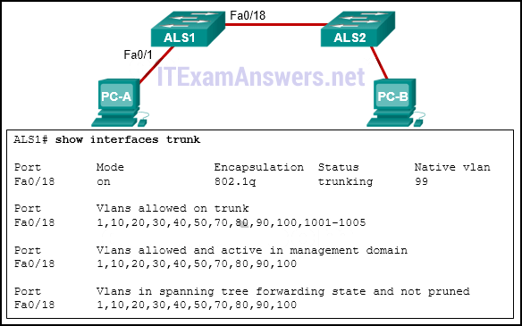

**Choices:**
- **A.** The native VLAN should be VLAN 60.
- **B.** The native VLAN is being pruned from the link.
- **C.** The trunk has been configured with the switchport nonegotiate command.
- **D.** The VLAN that is used by PC-A is not in the list of allowed VLANs on the trunk.

**Correct Answer:**
The VLAN that is used by PC-A is not in the list of allowed VLANs on the trunk.

**Explanation:**
Topic 3.4.1 Because PC-A and PC-B are connected to different switches, traffic between them must flow over the trunk link. Trunks can be configured so that they only allow traffic for particular VLANs to cross the link. In this scenario, VLAN 60, the VLAN that is associated with PC-A and PC-B, has not been allowed across the link, as shown by the output of show interfaces trunk.

---

## Question 140

**Question:**
A network administrator is configuring a WLAN. Why would the administrator use RADIUS servers on the network?

**Choices:**
- **A.** to centralize management of multiple WLANs
- **B.** to restrict access to the WLAN by authorized, authenticated users only
- **C.** to facilitate group configuration and management of multiple WLANs through a WLC
- **D.** to monitor the operation of the wireless network

**Correct Answer:**
to restrict access to the WLAN by authorized, authenticated users only

**Explanation:**
Topic 12.7.7 A RADIUS server is required for Enterprise security mode to provide Authentication, Authorization, and Accounting (AAA) services. Unlike the Personal mode which uses a single pre-shared key, RADIUS requires users to provide their own unique username and password . This allows the administrator to restrict access to authorized users only, centrally manage user accounts, and maintain a detailed audit trail of individual network activity.

---

## Question 141

**Question:**
What is the effect of entering the switchport mode access configuration command on a switch?

**Choices:**
- **A.** It enables BPDU guard on a specific port.
- **B.** It manually enables a trunk link.
- **C.** It disables an unused port.
- **D.** It disables DTP on a non-trunking interface.

**Correct Answer:**
It disables DTP on a non-trunking interface.

**Explanation:**
Topic 11.2.2 The switchport mode access command puts an interface into permanent nontrunking mode. By explicitly defining the port as an access port, it disables DTP (auto trunking) negotiations , which is a critical security measure to mitigate VLAN hopping attacks where a threat actor might try to spoof trunking signals to access unauthorized VLANs.

---

## Question 142

**Question:**
A network administrator has configured a router for stateless DHCPv6 operation. However, users report that workstations are not receiving DNS server information. Which two router configuration lines should be verified to ensure that stateless DHCPv6 service is properly configured? (Choose two.)

**Choices:**
- **A.** The domain-name line is included in the ipv6 dhcp pool section.
- **B.** The dns-server line is included in the ipv6 dhcp pool section.
- **C.** The ipv6 nd other-config-flag is entered for the interface that faces the LAN segment.
- **D.** The address prefix line is included in the ipv6 dhcp pool section.
- **E.** The ipv6 nd managed-config-flag is entered for the interface that faces the LAN segment.

**Correct Answer:**
The dns-server line is included in the ipv6 dhcp pool section.; The ipv6 nd other-config-flag is entered for the interface that faces the LAN segment.

**Explanation:**
Topic 8.3.3 To use the stateless DHCPv6 method, the router must inform DHCPv6 clients to configure a SLAAC IPv6 address and contact the DHCPv6 server for additional configuration parameters, such as the DNS server address. This is done through the command ipv6 nd other-config-flag entered at the interface configuration mode. The DNS server address is indicated in the ipv6 dhcp pool configuration.

---

## Question 143

**Question:**
A network administrator is configuring a WLAN. Why would the administrator disable the broadcast feature for the SSID?

**Choices:**
- **A.** to eliminate outsiders scanning for available SSIDs in the area
- **B.** to centralize management of multiple WLANs
- **C.** to facilitate group configuration and management of multiple WLANs through a WLC
- **D.** to provide prioritized service for time-sensitive applications

**Correct Answer:**
to eliminate outsiders scanning for available SSIDs in the area

**Explanation:**
Topic 12.7.2 Disabling the SSID broadcast feature, also known as SSID cloaking , prevents an Access Point (AP) from including the network name in its periodic beacon frames. While this does not provide strong security against professional attackers, it effectively hides the network from casual outsiders or unauthorized users scanning for available wireless networks, as they must manually configure the SSID on their devices to attempt a connection.

---

## Question 144

**Question:**
Refer to the exhibit. An administrator is attempting to install an IPv6 static route on router R1 to reach the network attached to router R2. After the static route command is entered, connectivity to the network is still failing. What error has been made in the static route configuration?

**Images:**

**Choices:**
- **A.** The next hop address is incorrect.
- **B.** The interface is incorrect.
- **C.** The destination network is incorrect.
- **D.** The network prefix is incorrect.

**Correct Answer:**
The interface is incorrect.

**Explanation:**
Topic 15.1.2 In this example the interface in the static route is incorrect. The interface should be the exit interface on R1, which is s0/0/0.

---

## Question 145

**Question:**
What action takes place when a frame entering a switch has a unicast destination MAC address that is not in the MAC address table?

**Choices:**
- **A.** The switch updates the refresh timer for the entry.
- **B.** The switch resets the refresh timer on all MAC address table entries.
- **C.** The switch replaces the old entry and uses the more current port.
- **D.** The switch will forward the frame out all ports except the incoming port.

**Correct Answer:**
The switch will forward the frame out all ports except the incoming port.

**Explanation:**
Topic 2.1.3 When a switch receives a frame with a unicast destination MAC address that is not in its MAC address table, it does not know which specific port to use for forwarding. Consequently, it treats the frame as an unknown unicast and floods it out of all available ports within the same VLAN, except for the ingress port (the port where the frame originally entered the switch). This process ensures the intended recipient receives the frame so the switch can later learn its location from the response.

---

## Question 146

**Question:**
A junior technician was adding a route to a LAN router. A traceroute to a device on the new network revealed a wrong path and unreachable status. What should be done or checked?

**Choices:**
- **A.** Create a floating static route to that network.
- **B.** Check the configuration on the floating static route and adjust the AD.
- **C.** Check the configuration of the exit interface on the new static route.
- **D.** Verify that the static route to the server is present in the routing table.

**Correct Answer:**
Check the configuration of the exit interface on the new static route.

**Explanation:**
Topic 16.2.1 When a traceroute reveals a wrong path or unreachable status immediately after adding a static route, it typically indicates that the route was configured with an incorrect egress point; therefore, checking the exit interface is essential to ensure the router is forwarding packets toward the intended network segment rather than misdirecting them out a different physical or logical interface.

---

## Question 147

**Question:**
What is the effect of entering the ip arp inspection vlan 10 configuration command on a switch?

**Choices:**
- **A.** It specifies the maximum number of L2 addresses allowed on a port.
- **B.** It enables DAI on specific switch interfaces previously configured with DHCP snooping.
- **C.** It enables DHCP snooping globally on a switch.
- **D.** It globally enables BPDU guard on all PortFast-enabled ports.

**Correct Answer:**
It enables DAI on specific switch interfaces previously configured with DHCP snooping.

**Explanation:**
Topic 11.4.2 The ip arp inspection vlan 10 global configuration command is used to enable Dynamic ARP Inspection (DAI) for the specified VLAN. DAI is a security feature that helps prevent ARP spoofing by intercepting ARP packets on untrusted ports and validating them against a DHCP snooping binding table ; therefore, DHCP snooping must be enabled on the VLAN and trusted interfaces before DAI can operate.

---

## Question 148

**Question:**
What protocol or technology manages trunk negotiations between switches?

**Choices:**
- **A.** VTP
- **B.** EtherChannel
- **C.** DTP
- **D.** STP

**Correct Answer:**
DTP

**Explanation:**
Topic 3.5.1 Dynamic Trunking Protocol (DTP) is a Cisco proprietary protocol specifically designed to automatically manage trunk negotiation between neighboring switches. It operates on a point-to-point basis to determine whether a link should become a trunk or remain as an access port, thereby simplifying and speeding up the network configuration process.

---

## Question 149

**Question:**
A network administrator is configuring a WLAN. Why would the administrator apply WPA2 with AES to the WLAN?

**Choices:**
- **A.** to reduce the risk of unauthorized APs being added to the network
- **B.** to centralize management of multiple WLANs
- **C.** to provide prioritized service for time-sensitive applications
- **D.** to provide privacy and integrity to wireless traffic by using encryption

**Correct Answer:**
to provide privacy and integrity to wireless traffic by using encryption

**Explanation:**
Topic 12.7.6 WPA2 utilizes Advanced Encryption Standard (AES) to protect wireless data. Encryption provides privacy by ensuring that even if data is intercepted, it cannot be deciphered in a reasonable amount of time. Furthermore, it ensures integrity through the use of CCMP, which allows receiving hosts to identify if the encrypted or non-encrypted bits have been altered during transmission.

---

## Question 150

**Question:**
Users on a LAN are unable to get to a company web server but are able to get elsewhere. What should be done or checked?

**Choices:**
- **A.** Ensure that the old default route has been removed from the company edge routers.
- **B.** Verify that the static route to the server is present in the routing table.
- **C.** Check the configuration on the floating static route and adjust the AD.
- **D.** Create a floating static route to that network.

**Correct Answer:**
Verify that the static route to the server is present in the routing table.

**Explanation:**
Topic 16.2.3

---

## Question 151

**Question:**
What IPv6 prefix is designed for link-local communication?

**Choices:**
- **A.** 2001::/3
- **B.** ff00::/8
- **C.** fc::/07
- **D.** fe80::/10

**Correct Answer:**
fe80::/10

**Explanation:**
Topic 1.5.3 IPv6 link-local addresses are designed for communication between devices on the same local network link and are not routable beyond that segment. The sources specify that these addresses always begin with the prefix FE80 . Every IPv6-enabled interface is required to have a link-local address to facilitate local network functions.

---

## Question 152

**Question:**
What is the effect of entering the ip dhcp snooping limit rate 6 configuration command on a switch?

**Choices:**
- **A.** It displays the IP-to-MAC address associations for switch interfaces.
- **B.** It enables port security globally on the switch.
- **C.** It restricts the number of discovery messages, per second, to be received on the interface.
- **D.** It dynamically learns the L2 address and copies it to the running configuration.

**Correct Answer:**
It restricts the number of discovery messages, per second, to be received on the interface.

**Explanation:**
Topic 11.3.3 The ip dhcp snooping limit rate command is used on untrusted interfaces to mitigate DHCP starvation attacks. It restricts the number of DHCP discovery messages that can be received on a port every second; if the limit (in this case, 6 packets per second ) is exceeded, the interface can be placed into an error-disabled state to protect the DHCP server’s resources.

---

## Question 153

**Question:**
A network administrator is configuring a WLAN. Why would the administrator change the default DHCP IPv4 addresses on an AP?

**Choices:**
- **A.** to eliminate outsiders scanning for available SSIDs in the area
- **B.** to reduce the risk of unauthorized APs being added to the network
- **C.** to reduce outsiders intercepting data or accessing the wireless network by using a well-known address range
- **D.** to reduce the risk of interference by external devices such as microwave ovens

**Correct Answer:**
to reduce outsiders intercepting data or accessing the wireless network by using a well-known address range

**Explanation:**
Topic 13.1.3 Changing default DHCP IPv4 addresses is a fundamental security best practice because default IP ranges and management addresses for wireless routers are well-known and easily found on the internet, meaning that using a non-default range makes it more difficult for unauthorized outsiders to identify the network’s structure or gain access to the device’s management interface.

---

## Question 154

**Question:**
What is the effect of entering the ip arp inspection validate src-mac configuration command on a switch?

**Choices:**
- **A.** It checks the source L2 address in the Ethernet header against the sender L2 address in the ARP body.
- **B.** It disables all trunk ports.
- **C.** It displays the IP-to-MAC address associations for switch interfaces.
- **D.** It enables portfast on a specific switch interface.

**Correct Answer:**
It checks the source L2 address in the Ethernet header against the sender L2 address in the ARP body.

**Explanation:**
Topic 11.4.3 The ip arp inspection validate src-mac command is a supplemental DAI feature used to prevent ARP spoofing. It specifically instructs the switch to check the source MAC address in the Ethernet header and compare it against the sender MAC address found in the body of the ARP packet . If these two Layer 2 addresses do not match, the ARP packet is considered invalid and is dropped.

---

## Question 155

**Question:**
What protocol or technology is a Cisco proprietary protocol that is automatically enabled on 2960 switches?

**Choices:**
- **A.** DTP
- **B.** STP
- **C.** VTP
- **D.** EtherChannel

**Correct Answer:**
DTP

**Explanation:**
Topic 3.5.1 Dynamic Trunking Protocol (DTP) is a Cisco proprietary protocol that is automatically enabled on Catalyst 2960 and 3650 Series switches. Its default state on these switches is dynamic auto , which allows the interface to automatically negotiate a trunk link if the neighboring device is set to trunk or desirable mode. While Spanning Tree Protocol (STP) is also enabled by default, the base protocol (802.1D) is an IEEE standard, and EtherChannel must be manually configured.

---

## Question 156

**Question:**
What address and prefix length is used when configuring an IPv6 default static route?

**Choices:**
- **A.** ::/0
- **B.** FF02::1/8
- **C.** 0.0.0.0/0
- **D.** ::1/128

**Correct Answer:**
::/0

**Explanation:**
Topic 15.3.1 The IPv6 address and prefix for a default static route is ::/0. This represents all zeros in the address and a prefix length of zero.

---

## Question 157

**Question:**
What are two characteristics of Cisco Express Forwarding (CEF)? (Choose two.)

**Choices:**
- **A.** When a packet arrives on a router interface, it is forwarded to the control plane where the CPU matches the destination address with a matching routing table entry.
- **B.** This is the fastest forwarding mechanism on Cisco routers and multilayer switches.
- **C.** With this switching method, flow information for a packet is stored in the fast-switching cache to forward future packets to the same destination without CPU intervention.
- **D.** Packets are forwarded based on information in the FIB and an adjacency table.
- **E.** When a packet arrives on a router interface, it is forwarded to the control plane where the CPU searches for a match in the fast-switching cache.

**Correct Answer:**
This is the fastest forwarding mechanism on Cisco routers and multilayer switches.; Packets are forwarded based on information in the FIB and an adjacency table.

**Explanation:**
Topic 14.2.3 Cisco Express Forwarding (CEF) builds a forwarding information base (FIB) and an adjacency table to be able to route packets quicker than traditional packet forwarding methods can.

---

## Question 158

**Question:**
Which term describes the role of a Cisco switch in the 802.1X port-based access control?

**Choices:**
- **A.** agent
- **B.** supplicant
- **C.** authenticator
- **D.** authentication server

**Correct Answer:**
authenticator

**Explanation:**
Topic 10.2.6 802.1X port-based authentication defines specific roles for the devices in the network: Client (Supplicant) – The device that requests access to LAN and switch services Switch (Authenticator) – Controls physical access to the network based on the authentication status of the client Authentication server – Performs the actual authentication of the client

---

## Question 159

**Question:**
Which Cisco solution helps prevent ARP spoofing and ARP poisoning attacks?

**Choices:**
- **A.** Dynamic ARP Inspection
- **B.** IP Source Guard
- **C.** DHCP Snooping
- **D.** Port Security

**Correct Answer:**
Dynamic ARP Inspection

**Explanation:**
Topic 10.3.3 Dynamic ARP Inspection (DAI) is a security feature designed to mitigate ARP spoofing and ARP poisoning attacks . It works by intercepting all ARP requests and replies on untrusted ports and verifying each packet for a valid IP-to-MAC address binding . DAI relies on the DHCP snooping binding table to identify legitimate addresses, dropping and logging any invalid ARP messages to prevent a threat actor from poisoning the ARP caches of other devices on the network.

---

## Question 160

**Question:**
What is an advantage of PVST+?

**Choices:**
- **A.** PVST+ optimizes performance on the network through autoselection of the root bridge.
- **B.** PVST+ reduces bandwidth consumption compared to traditional implementations of STP that use CST.
- **C.** PVST+ requires fewer CPU cycles for all the switches in the network.
- **D.** PVST+ optimizes performance on the network through load sharing.

**Correct Answer:**
PVST+ optimizes performance on the network through load sharing.

**Explanation:**
Topic 5.3.1 PVST+ results in optimum load balancing. However, this is accomplished by manually configuring switches to be elected as root bridges for different VLANs on the network. The root bridges are not automatically selected. Furthermore, having spanning-tree instances for each VLAN actually consumes more bandwidth and it increases the CPU cycles for all the switches in the network.

---

## Question 161

**Question:**
What protocol or technology uses a standby router to assume packet-forwarding responsibility if the active router fails?

**Choices:**
- **A.** EtherChannel
- **B.** DTP
- **C.** HSRP
- **D.** VTP

**Correct Answer:**
HSRP

**Explanation:**
Topic 9.2.1 Hot Standby Router Protocol (HSRP) is a Cisco-proprietary protocol designed to provide first-hop redundancy. In an HSRP group, one router is elected as the active device to forward packets while another acts as the standby router . The standby router’s function is to monitor the operational status of the active router and assume packet-forwarding responsibility immediately if the active router fails, ensuring high network availability for hosts.

---

## Question 162

**Question:**
What is the effect of entering the show ip dhcp snooping binding configuration command on a switch?

**Choices:**
- **A.** It switches a trunk port to access mode.
- **B.** It checks the source L2 address in the Ethernet header against the sender L2 address in the ARP body.
- **C.** It restricts the number of discovery messages, per second, to be received on the interface.
- **D.** It displays the IP-to-MAC address associations for switch interfaces.

**Correct Answer:**
It displays the IP-to-MAC address associations for switch interfaces.

**Explanation:**
Topic 11.3.4 The show ip dhcp snooping binding command is used to display the DHCP snooping binding table . This table records the associations (bindings) between the source MAC addresses of devices on untrusted ports and the IPv4 addresses assigned to them by a legitimate DHCP server. It is an essential tool for verifying which clients have received DHCP information and serves as a critical database for other security features like Dynamic ARP Inspection (DAI).

---

## Question 163

**Question:**
What action takes place when the source MAC address of a frame entering a switch is in the MAC address table?

**Choices:**
- **A.** The switch forwards the frame out of the specified port.
- **B.** The switch updates the refresh timer for the entry.
- **C.** The switch replaces the old entry and uses the more current port.
- **D.** The switch adds a MAC address table entry for the destination MAC address and the egress port.

**Correct Answer:**
The switch updates the refresh timer for the entry.

**Explanation:**
Topic 2.1.3 Every frame entering a switch is checked for new information. If the source MAC address is already present in the MAC address table, the switch simply updates the refresh timer for that entry to prevent it from aging out and being deleted. If the address exists in the table but appears on a different port , the switch will then update the entry with the more current port number.

---

## Question 164

**Question:**
A small publishing company has a network design such that when a broadcast is sent on the LAN, 200 devices receive the transmitted broadcast. How can the network administrator reduce the number of devices that receive broadcast traffic?

**Choices:**
- **A.** Add more switches so that fewer devices are on a particular switch.
- **B.** Replace the switches with switches that have more ports per switch. This will allow more devices on a particular switch.
- **C.** Segment the LAN into smaller LANs and route between them.
- **D.** Replace at least half of the switches with hubs to reduce the size of the broadcast domain.

**Correct Answer:**
Segment the LAN into smaller LANs and route between them.

**Explanation:**
Topic 3.1.2 By dividing the one big network into two smaller network, the network administrator has created two smaller broadcast domains. When a broadcast is sent on the network now, the broadcast will only be sent to the devices on the same Ethernet LAN. The other LAN will not receive the broadcast.

---

## Question 165

**Question:**
What defines a host route on a Cisco router?

**Choices:**
- **A.** The link-local address is added automatically to the routing table as an IPv6 host route.
- **B.** An IPv4 static host route configuration uses a destination IP address of a specific device and a /32 subnet mask.
- **C.** A host route is designated with a C in the routing table.
- **D.** A static IPv6 host route must include the interface type and the interface number of the next hop router.

**Correct Answer:**
An IPv4 static host route configuration uses a destination IP address of a specific device and a /32 subnet mask.

**Explanation:**
Topic 15.5.1 A host route is an IPv4 address with a 32-bit mask, or an IPv6 address with a 128-bit mask. When an active interface on a router is configured with an IPv4 or IPv6 address, a local host route is automatically added to the routing table. A host route is marked with L in the output of the routing table. For IPv6 static routes, the next-hop address can be the link-local address of the adjacent router. In this case you must specify the interface type and the interface number of the local router.

---

## Question 166

**Question:**
What else is required when configuring an IPv6 static route using a next-hop link-local address?

**Choices:**
- **A.** administrative distance
- **B.** ip address of the neighbor router
- **C.** network number and subnet mask on the interface of the neighbor router
- **D.** interface number and type

**Correct Answer:**
interface number and type

**Explanation:**
Topic 15.2.6 When configuring an IPv6 static route with a next-hop link-local address , the router requires a fully specified static route , which includes both the next-hop address and the interface number and type (exit interface) . This is necessary because link-local addresses are only unique to a specific link and are not contained in the IPv6 routing table ; therefore, the router must be explicitly told which interface to use to reach that particular neighbor. If the interface is not specified, the command will fail because the next-hop link-local address could theoretically be valid on multiple networks connected to the same router.

---

## Question 167

**Question:**
A technician is configuring a wireless network for a small business using a SOHO wireless router. Which two authentication methods are used, if the router is configured with WPA2? (Choose two.)

**Choices:**
- **A.** personal
- **B.** AES
- **C.** TKIP
- **D.** WEP
- **E.** enterprise

**Correct Answer:**
personal; enterprise

**Explanation:**
Topic 12.7.5 WPA2 provides two primary authentication modes: Personal (WPA2-PSK), which uses a pre-shared key for home or small office environments, and Enterprise (WPA2-Enterprise), which requires a RADIUS server for centralized user authentication via 802.1X. AES and TKIP are encryption protocols used to protect the data, not authentication methods themselves, while WEP is an obsolete legacy standard that is separate from WPA2.

---

## Question 168

**Question:**
Which mitigation technique would prevent rogue servers from providing false IPv6 configuration parameters to clients?

**Choices:**
- **A.** enabling DHCPv6 Guard
- **B.** enabling RA Guard
- **C.** implementing port security on edge ports
- **D.** disabling CDP on edge ports

**Correct Answer:**
enabling DHCPv6 Guard

**Explanation:**
Topic 11.6.2 DHCPv6 Guard is a feature designed to ensure that rogue DHCPv6 servers are not able to hand out addresses to clients, redirect client traffic, or starve out the DHCPv6 server and cause a DoS attack. DHCPv6 Guard requires a policy to be configured in DHCP Guard configuration mode, and DHCPv6 Guard is enabled on an interface-by-interface basis.

---

## Question 169

**Question:**
A PC has sent an RS message to an IPv6 router attached to the same network. Which two pieces of information will the router send to the client? (Choose two.)

**Choices:**
- **A.** prefix length
- **B.** subnet mask in dotted decimal notation
- **C.** domain name
- **D.** administrative distance
- **E.** prefix
- **F.** DNS server IP address

**Correct Answer:**
prefix length; prefix

**Explanation:**
Topic 8.2.4 Router is part of the IPv6 all-routers group and received the RS message. It generates an RA containing the local network prefix and prefix length (e.g., 2001:db8:acad:1::/64)

---

## Question 170

**Question:**
While attending a conference, participants are using laptops for network connectivity. When a guest speaker attempts to connect to the network, the laptop fails to display any available wireless networks. The access point must be operating in which mode?

**Choices:**
- **A.** mixed
- **B.** passive
- **C.** active
- **D.** open

**Correct Answer:**
active

**Explanation:**
Topic 12.3.7 Active is a mode used to configure an access point so that clients must know the SSID to connect to the access point. APs and wireless routers can operate in a mixed mode meaning that that multiple wireless standards are supported. Open is an authentication mode for an access point that has no impact on the listing of available wireless networks for a client. When an access point is configured in passive mode, the SSID is broadcast so that the name of wireless network will appear in the listing of available networks for clients.

---

## Question 171

**Question:**
Which three components are combined to form a bridge ID?

**Choices:**
- **A.** extended system ID
- **B.** cost
- **C.** IP address
- **D.** bridge priority
- **E.** MAC address
- **F.** port ID

**Correct Answer:**
extended system ID; bridge priority; MAC address

**Explanation:**
Topic 5.2.1 The three components that are combined to form a bridge ID are bridge priority, extended system ID, and MAC address.

---

## Question 172

**Question:**
On a Cisco 3504 WLC Summary page (Advanced > Summary), which tab allows a network administrator to configure a particular WLAN with a WPA2 policy?

**Choices:**
- **A.** SECURITY
- **B.** WIRELESS
- **C.** WLANs
- **D.** MANAGEMENT

**Correct Answer:**
WLANs

**Explanation:**
Topic 13.2.6 To configure or edit settings for a particular WLAN , including its WPA2 security policy , a network administrator must first navigate to the WLANs tab from the top-level menu of the WLC. Once a specific WLAN is selected or created, the administrator can access its individual Security sub-tab to enable WPA2 and set encryption parameters. The top-level SECURITY tab is used for global security configurations, such as defining RADIUS or SNMP servers, rather than configuring specific WLAN profiles.

---
