# CCNA 1 v2 - CCNA 1 - Pretest

## Question 1

**Question:**
Convert the decimal number 231 into its binary equivalent. Select the correct answer from the list below.

**Choices:**
- **A.** 11110010
- **B.** 11011011
- **C.** 11110110
- **D.** 11100111
- **E.** 11100101
- **F.** 11101110

**Correct Answer:**
11100111

---

## Question 2

**Question:**
Convert the binary number 10111010 into its hexadecimal equivalent. Select the correct answer from the list below.

**Choices:**
- **A.** 85
- **B.** 90
- **C.** BA
- **D.** A1
- **E.** B3
- **F.** 1C

**Correct Answer:**
BA

---

## Question 3

**Question:**
The failure rate in a certain brand of network interface card has been determined to be 15%. How many cards could be expected to fail in a company that has 80 of the cards installed?

**Choices:**
- **A.** 8
- **B.** 10
- **C.** 12
- **D.** 15

**Correct Answer:**
12

---

## Question 4

**Question:**
A local real estate company can have its 25 computer systems upgraded for $1000. If the company chooses only to upgrade 10 systems, how much will the upgrade cost if the same rate is used?

**Choices:**
- **A.** $100
- **B.** $200
- **C.** $400
- **D.** $500
- **E.** $600

**Correct Answer:**
$400

---

## Question 5

**Question:**
Considering the average capacity of storage device media, drag the storage media on the left to the capacity list on the right.

**Images:**
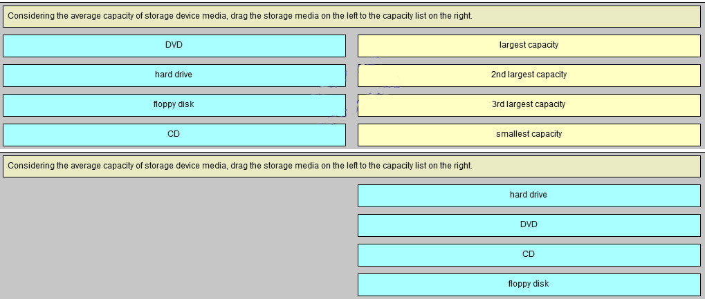
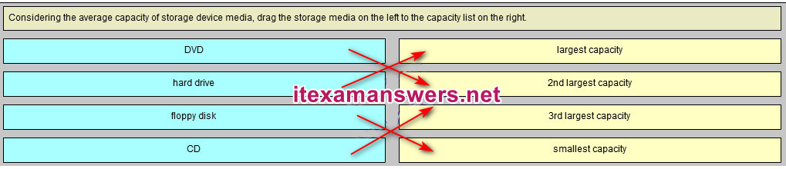

---

## Question 6

**Question:**
Which two devices provide permanent data storage? (Choose two.)

**Choices:**
- **A.** Blu-Ray disc
- **B.** hard drive
- **C.** keyboard
- **D.** monitor
- **E.** RAM

**Correct Answer:**
Blu-Ray disc; hard drive

---

## Question 7

**Question:**
If a technician uses an average of 2 cans of compressed air per week for cleaning, how many cans should be ordered for 8 technicians over the next 10 weeks?

**Choices:**
- **A.** 16
- **B.** 20
- **C.** 80
- **D.** 160
- **E.** 200

**Correct Answer:**
160

---

## Question 8

**Question:**
What is a function of the BIOS?

**Choices:**
- **A.** enables a computer to connect to a network
- **B.** provides temporary data storage for the CPU
- **C.** performs a power-on self test of internal components
- **D.** provides graphic capabilities for games and applications

**Correct Answer:**
performs a power-on self test of internal components

---

## Question 9

**Question:**
Match the form of network communication with its description. (Not all options are used.) Question and Answer: 10. Refer to the exhibit. Match the port to the associated letter shown in the exhibit. (Not all options are used.) Question: Answer:

**Images:**
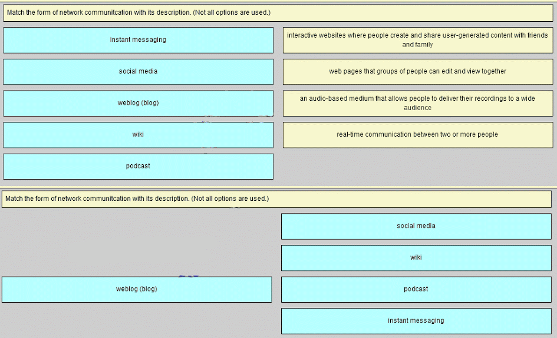
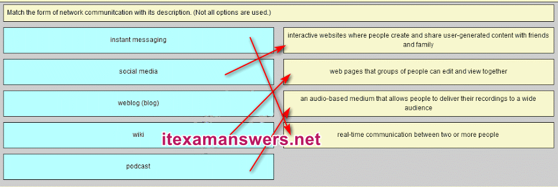
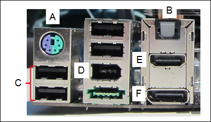
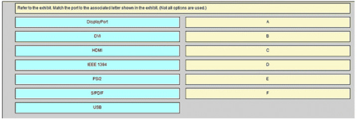
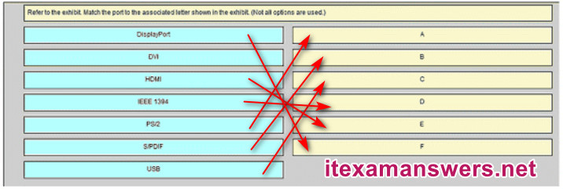

---

## Question 10

**Question:**
Which is a characteristic of the Internet?

**Choices:**
- **A.** It is not centrally governed.
- **B.** It uses only physical addresses.
- **C.** It uses private IP addressing.
- **D.** It is localized to specific geographic locations.

**Correct Answer:**
It is not centrally governed.

**Explanation:**
The Internet is a global system of interconnected computer networks that has no central governance. It is not limited to geographic boundaries and uses static public IP addresses for communication.

---

## Question 11

**Question:**
Match the icon to its likely associated use. (Not all options are used.)

**Images:**
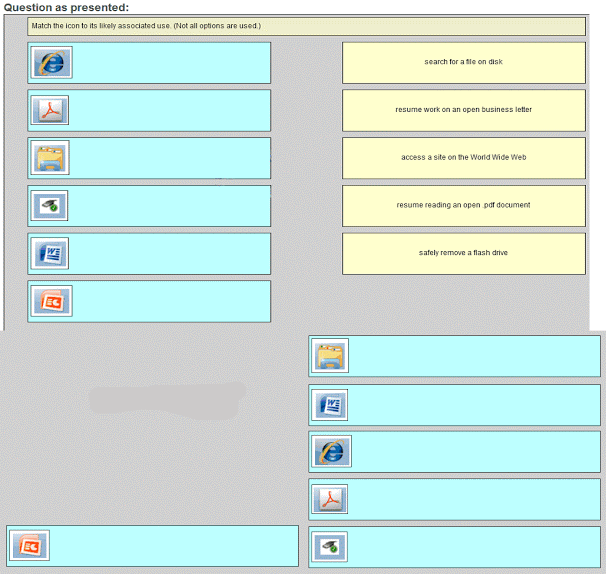
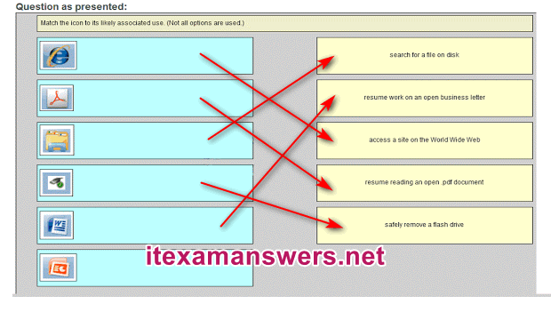

---

## Question 12

**Question:**
Which command can be used to test connectivity between two computers that are attached to a network?

**Choices:**
- **A.** ipconfig
- **B.** ping
- **C.** winipcfg
- **D.** ifconfig
- **E.** nbtstst -s

**Correct Answer:**
ping

---

## Question 13

**Question:**
A person-hour is the amount of work that the average worker can do in one hour. It is anticipated that a company-wide system upgrade will take approximately 60 person-hours to complete. How long will it take five technicians to perform the refresh?

**Choices:**
- **A.** 5 hours
- **B.** 8 hours
- **C.** 10 hours
- **D.** 12 hours

**Correct Answer:**
12 hours

---

## Question 14

**Question:**
Match the application with the correct compressed files format. (Not all options are used.) Question: Match the application with the correct compressed files format Answer:

**Images:**
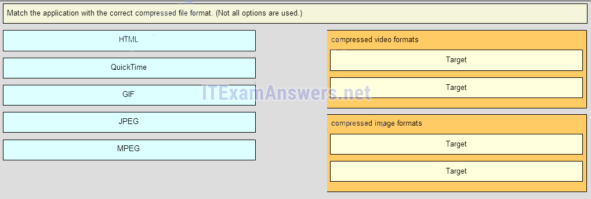
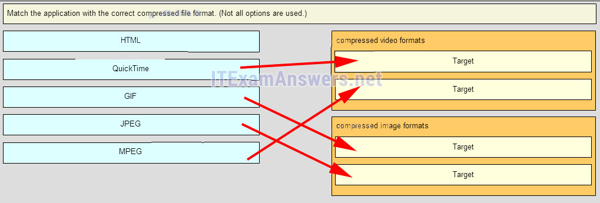

---

## Question 15

**Question:**
Which type of connector does a network interface card use?

**Choices:**
- **A.** DIN
- **B.** PS-2
- **C.** RJ-11
- **D.** RJ-45

**Correct Answer:**
RJ-45

---

## Question 16

**Question:**
A user is having problems accessing the Internet. The command ping www.cisco.com fails. However, pinging the IP address of cisco.com with the command ping 198.133.219.25 is successful. What is the problem?

**Choices:**
- **A.** The web server is down.
- **B.** The default gateway is incorrect.
- **C.** There is a problem with DNS.
- **D.** The address of the ARP cache is incorrect.

**Correct Answer:**
There is a problem with DNS.

---

## Question 17

**Question:**
Which option shows the proper notation for an IPv6 address?

**Choices:**
- **A.** 2001,0db8,3c55,0015,abcd,ff13
- **B.** 2001-0db8-3c55-0015-abcd-ff13
- **C.** 2001.0db8.3c55.0015.abcd.ff13
- **D.** 2001:0db8:3c55:0015::abcd:ff13

**Correct Answer:**
2001:0db8:3c55:0015::abcd:ff13

---

## Question 18

**Question:**
What is the purpose of the routing process?

**Choices:**
- **A.** to encapsulate data that is used to communicate across a network
- **B.** to select the paths that are used to direct traffic to destination networks
- **C.** to convert a URL name into an IP address
- **D.** to provide secure Internet file transfer
- **E.** to forward traffic on the basis of MAC addresses

**Correct Answer:**
to select the paths that are used to direct traffic to destination networks

---

## Question 19

**Question:**
Which device should be used for enabling a host to communicate with another host on a different network?

**Choices:**
- **A.** switch
- **B.** hub
- **C.** router
- **D.** host

**Correct Answer:**
router

---

## Question 20

**Question:**
A home user is looking for an ISP connection that provides high speed digital transmission over regular phone lines. What ISP connection type should be used?

**Choices:**
- **A.** DSL
- **B.** dial-up
- **C.** satellite
- **D.** cell modem
- **E.** cable modem

**Correct Answer:**
DSL

**Explanation:**
DSL is the best technology to use over existing phone lines. A lot of ISPs have a lookup on their website where you can enter your phone number and see if they can offer you service.

---

## Question 21

**Question:**
A company is expanding its business to other countries. All branch offices must remain connected to corporate headquarters at all times. Which network technology is required to support this requirement?

**Choices:**
- **A.** LAN
- **B.** MAN
- **C.** WAN
- **D.** WLAN

**Correct Answer:**
WAN

**Explanation:**
A local-area network (LAN) normally connects end users and network resources over a limited geographic area using Ethernet technology. A wireless LAN (WLAN) serves the same purpose as a LAN but uses wireless technologies. A metropolitan-area network (MAN) spans a larger geographic area such as a city, and a wide-area network (WAN) connects networks together over a large geographic area. WANs can span cities, countries, or the globe.

---

## Question 22

**Question:**
Why would a network administrator use the tracert utility?

**Choices:**
- **A.** to determine the active TCP connections on a PC
- **B.** to check information about a DNS name in the DNS server
- **C.** to identify where a packet was lost or delayed on a network
- **D.** to display the IP address, default gateway, and DNS server address for a PC

**Correct Answer:**
to identify where a packet was lost or delayed on a network

---

## Question 23

**Question:**
Which basic process is used to select the best path for forwarding data?

**Choices:**
- **A.** routing
- **B.** switching
- **C.** addressing
- **D.** encapsulation

**Correct Answer:**
routing

---

## Question 24

**Question:**
Which wireless security procedure should be used to hide the WLAN ID from wireless clients?

**Choices:**
- **A.** Configure WEP only on the access point.
- **B.** Install WAP on the wireless clients.
- **C.** Configure MAC address filtering on the access point.
- **D.** Disable the broadcast of the SSID on the access point.
- **E.** Decrease the antenna spectrum on each wireless client.

**Correct Answer:**
Disable the broadcast of the SSID on the access point.

---

## Question 25

**Question:**
What is the purpose of having a converged network?

**Choices:**
- **A.** to provide high speed connectivity to all end devices
- **B.** to make sure that all types of data packets will be treated equally
- **C.** to achieve fault tolerance and high availability of data network infrastructure devices
- **D.** to reduce the cost of deploying and maintaining the communication infrastructure

**Correct Answer:**
to reduce the cost of deploying and maintaining the communication infrastructure

**Explanation:**
With the development of technology, companies can now consolidate disparate networks onto one platform called a converged network. In a converged network, voice, video, and data travel over the same network, thus eliminating the need to create and maintain separate networks. This also reduces the costs associated with providing and maintaining the communication network infrastructure.

---

## Question 26

**Question:**
Refer to the exhibit. Consider the IP address configuration shown from PC1. What is a description of the default gateway address?

**Images:**

**Choices:**
- **A.** It is the IP address of the Router1 interface that connects the company to the Internet.
- **B.** It is the IP address of the Router1 interface that connects the PC1 LAN to Router1.
- **C.** It is the IP address of Switch1 that connects PC1 to other devices on the same LAN.
- **D.** It is the IP address of the ISP network device located in the cloud.

**Correct Answer:**
It is the IP address of the Router1 interface that connects the PC1 LAN to Router1.

**Explanation:**
The default gateway is used to route packets destined for remote networks. The default gateway IP address is the address of the first Layer 3 device (the router interface) that connects to the same network.

---

## Question 27

**Question:**
Which technology provides a solution to IPv4 address depletion by allowing multiple devices to share one public IP address?

**Choices:**
- **A.** ARP
- **B.** DNS
- **C.** NAT
- **D.** SMB
- **E.** DHCP
- **F.** HTTP

**Correct Answer:**
NAT

**Explanation:**
Network Address Translation (NAT) is a technology implemented within IPv4 networks. One application of NAT is to use a few public IP addresses to be shared by many internal network hosts which use private IP addresses. NAT removes the need for public addresses for every internal host. It therefore provides a solution to slow down the IPv4 address depletion.

---

## Question 28

**Question:**
Which subnet would include the address 192.168.1.96 as a usable host address?

**Choices:**
- **A.** 192.168.1.64/26
- **B.** 192.168.1.32/27
- **C.** 192.168.1.32/28
- **D.** 192.168.1.64/29

**Correct Answer:**
192.168.1.64/26

---

## Question 29

**Question:**
A technician uses the ping 127.0.0.1 command. What is the technician testing?

**Choices:**
- **A.** the TCP/IP stack on a network host
- **B.** connectivity between two adjacent Cisco devices
- **C.** connectivity between a PC and the default gateway
- **D.** connectivity between two PCs on the same network
- **E.** physical connectivity of a particular PC and the network

**Correct Answer:**
the TCP/IP stack on a network host

---

## Question 30

**Question:**
Which function is provided by TCP?

**Choices:**
- **A.** data encapsulation
- **B.** detection of missing packets
- **C.** communication session control
- **D.** path determination for data packets

**Correct Answer:**
detection of missing packets

---

## Question 31

**Question:**
What is the purpose of ICMP message s?

**Choices:**
- **A.** to inform routers about network topology changes
- **B.** to ensure the delivery of an IP packet
- **C.** to provide feedback of IP packet transmissions
- **D.** to monitor the process of a domain name to IP address resolution

**Correct Answer:**
to provide feedback of IP packet transmissions

---

## Question 32

**Question:**
What statement describes the function of the Address Resolution Protocol?

**Choices:**
- **A.** ARP is used to discover the IP address of any host on a different network.
- **B.** ARP is used to discover the IP address of any host on the local network.
- **C.** ARP is used to discover the MAC address of any host on a different network.
- **D.** ARP is used to discover the MAC address of any host on the local network.

**Correct Answer:**
ARP is used to discover the MAC address of any host on the local network.

**Explanation:**
When a PC wants to send data on the network, it always knows the IP address of the destination. However, it also needs to discover the MAC address of the destination. ARP is the protocol that is used to discover the MAC address of a host that belongs to the same network.

---

## Question 33

**Question:**
What is the general term that is used to describe a piece of data at any layer of a networking model?

**Choices:**
- **A.** frame
- **B.** packet
- **C.** protocol data unit
- **D.** segment

**Correct Answer:**
protocol data unit

---

## Question 34

**Question:**
Which three IP addresses are private ? (Choose three.)

**Choices:**
- **A.** 10.1.1.1
- **B.** 172.32.5.2
- **C.** 192.167.10.10
- **D.** 172.16.4.4
- **E.** 192.168.5.5
- **F.** 224.6.6.6

**Correct Answer:**
10.1.1.1; 172.16.4.4; 192.168.5.5

---

## Question 35

**Question:**
How does a networked server manage requests from multiple clients for different services?

**Choices:**
- **A.** The server sends all requests through a default gateway.
- **B.** Each request is assigned source and destination port numbers.
- **C.** The server uses IP addresses to identify different services.
- **D.** Each request is tracked through the physical address of the client.

**Correct Answer:**
Each request is assigned source and destination port numbers.

---

## Question 36

**Question:**
Which protocol translates a website name such as www.cisco.com into a network address?

**Choices:**
- **A.** HTTP
- **B.** FTP
- **C.** DHCP
- **D.** DNS

**Correct Answer:**
DNS

**Explanation:**
Domain Name Service translates names into numerical addresses, and associates the two. DHCP provides IP addresses dynamically to pools of devices. HTTP delivers web pages to users. FTP manages file transfers.

---

## Question 37

**Question:**
What is an advantage of using IPv6 ?

**Choices:**
- **A.** more addresses for networks and hosts
- **B.** faster connectivity
- **C.** higher bandwidth
- **D.** more frequencies

**Correct Answer:**
more addresses for networks and hosts

**Explanation:**
An IPv6 address is comprised of 128 bits as opposed to 32 bits in an IPv4 address. Thus it offers far more addresses for networks and hosts than an IPv4 address does.

---

## Question 38

**Question:**
Refer to the exhibit. Using the network in the exhibit, what would be the default gateway address for host A in the 192.133.219.0 network?

**Images:**
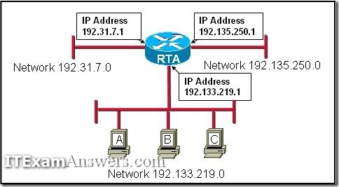

**Choices:**
- **A.** 192.135.250.1
- **B.** 192.31.7.1
- **C.** 192.133.219.0
- **D.** 192.133.219.1

**Correct Answer:**
192.133.219.1

---

## Question 39

**Question:**
Refer to the exhibit. Host_A is preparing to send data to Server_B. How will Host_A address the packets and frames that will carry this data? (Choose two.)

**Images:**
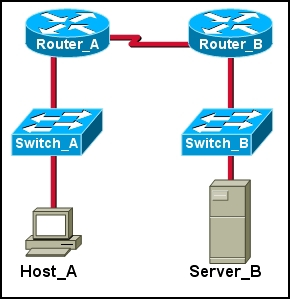

**Choices:**
- **A.** The packet destination will be addressed with the IP address of the Router_B interface that is attached to Router_A.
- **B.** The frame destination will be addressed with the MAC address of Switch_A.
- **C.** The packet destination will be addressed with the IP address of the Router_A LAN interface.
- **D.** The frame destination will be addressed with the MAC address of the Router_A LAN interface.
- **E.** The packet destination will be addressed with the IP address of Server_B.
- **F.** The frame destination will be addressed with the MAC address of Server_B..

**Correct Answer:**
The frame destination will be addressed with the MAC address of the Router_A LAN interface.; The packet destination will be addressed with the IP address of Server_B.

---

## Question 40

**Question:**
A network technician is attempting to configure an interface by entering the following command: SanJose(config)# ip address 192.168.2.1 255.255.255.0. The command is rejected by the device. What is the reason for this?

**Choices:**
- **A.** The command is being entered from the wrong mode of operation.
- **B.** The command syntax is wrong.
- **C.** The subnet mask information is incorrect.
- **D.** The interface is shutdown and must be enabled before the switch will accept the IP address.

**Correct Answer:**
The command is being entered from the wrong mode of operation.

**Explanation:**
The wrong mode of operation is being used. The CLI prompt indicates that the mode of operation is global configuration. IP addresses must be configured from interface configuration mode, as indicated by the SanJose(config-if)# prompt.

---

## Question 41

**Question:**
What protocol is responsible for controlling the size of segments and the rate at which segments are exchanged between a web client and a web server?

**Choices:**
- **A.** TCP
- **B.** IP
- **C.** HTTP
- **D.** Ethernet

**Correct Answer:**
TCP

**Explanation:**
TCP is a Layer 4 protocol of the OSI model. TCP has several responsibilities in the network communication process. It divides large messages into smaller segments which are more efficient to send across the network. It also controls the size and rate of segments exchanged between clients and servers.

---

## Question 42

**Question:**
A network administrator is troubleshooting connectivity issues on a server. Using a tester, the administrator notices that the signals generated by the server NIC are distorted and not usable. In which layer of the OSI model is the error categorized?

**Choices:**
- **A.** presentation layer
- **B.** network layer
- **C.** physical layer
- **D.** data link layer

**Correct Answer:**
physical layer

---

## Question 43

**Question:**
Which statement is true about variable-length subnet masking?

**Choices:**
- **A.** Each subnet is the same size.
- **B.** The size of each subnet may be different, depending on requirements.
- **C.** Subnets may only be subnetted one additional time.
- **D.** Bits are returned, rather than borrowed, to create additional subnets.

**Correct Answer:**
The size of each subnet may be different, depending on requirements.

---

## Question 44

**Question:**
A wireless host needs to request an IP address. What protocol would be used to process the request?

**Choices:**
- **A.** FTP
- **B.** HTTP
- **C.** DHCP
- **D.** ICMP
- **E.** SNMP

**Correct Answer:**
DHCP

---

## Question 45

**Question:**
What will a host on an Ethernet network do if it receives a frame with a destination MAC address that does not match its own MAC address?

**Choices:**
- **A.** It will discard the frame.
- **B.** It will forward the frame to the next host.
- **C.** It will remove the frame from the media.
- **D.** It will strip off the data-link frame to check the destination IP address.

**Correct Answer:**
It will discard the frame.

---

## Question 46

**Question:**
Which connection provides a secure CLI session with encryption to a Cisco switch?

**Choices:**
- **A.** a console connection
- **B.** an AUX connection
- **C.** a Telnet connection
- **D.** an SSH connection

**Correct Answer:**
an SSH connection

**Explanation:**
A CLI session using Secure Shell (SSH) provides enhanced security because SSH supports strong passwords and encryption during the transport of session data. The other methods support authentication but not encryption.

---

## Question 47

**Question:**
What are the three ranges of IP addresses that are reserved for internal private use? (Choose three.)

**Choices:**
- **A.** 10.0.0.0/8
- **B.** 64.100.0.0/14
- **C.** 127.16.0.0/12
- **D.** 172.16.0.0/12
- **E.** 192.31.7.0/24
- **F.** 192.168.0.0/16

**Correct Answer:**
10.0.0.0/8; 172.16.0.0/12; 192.168.0.0/16

---

## Question 48

**Question:**
Refer to the exhibit. Match the packets with their destination IP address to the exiting interfaces on the router. (Not all targets are used.) Place the options in the following order:

**Images:**
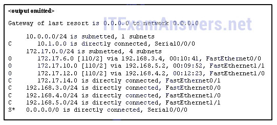
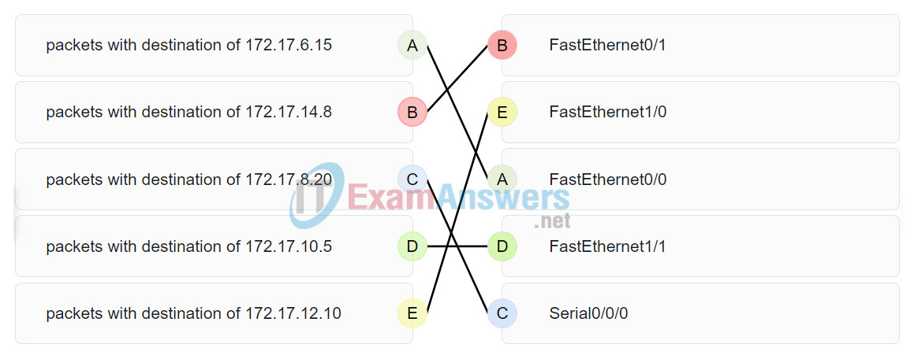

---
