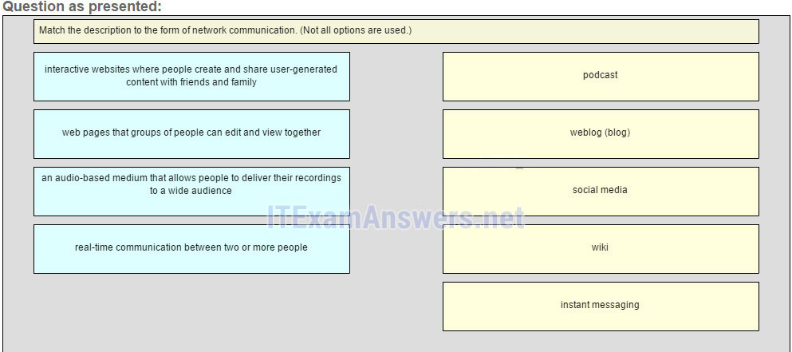
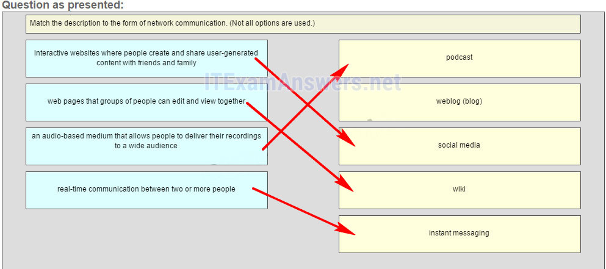
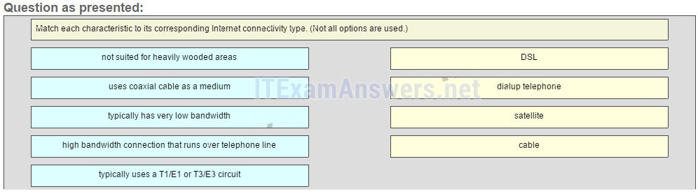
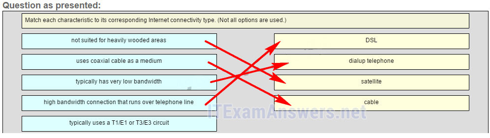
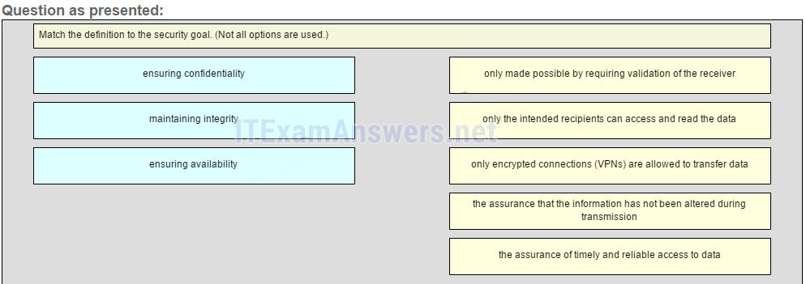
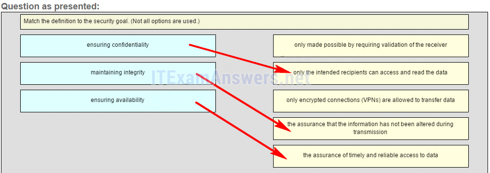
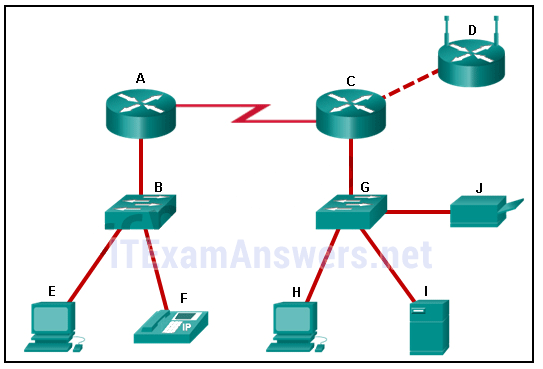

# CCNA 1 v2 - CCNA 1 - Chapter 1

## Question 1

**Question:**
A company is contemplating whether to use a client/server or a peer-to-peer network. What are three characteristics of a peer-to-peer network? (Choose three.)

**Choices:**
- **A.** better security
- **B.** easy to create
- **C.** better device performance when acting as both client and server
- **D.** lacks centralized administration
- **E.** less cost to implement
- **F.** scalable

**Correct Answer:**
easy to create; lacks centralized administration; less cost to implement

**Explanation:**
Because network devices and dedicated servers are not required, peer-to-peer networks are easy to create, less complex, and have lower costs. Peer-to-peer networks also have no centralized administration. They are less secure, not scalable, and those devices acting as both client and server may perform slower.

---

## Question 2

**Question:**
Which device performs the function of determining the path that messages should take through internetworks?

**Choices:**
- **A.** a router
- **B.** a firewall
- **C.** a web server
- **D.** a DSL modem

**Correct Answer:**
a router

**Explanation:**
A router is used to determine the path that the messages should take through the network. A firewall is used to filter incoming and outgoing traffic. A DSL modem is used to provide Internet connection for a home or an organization.

---

## Question 3

**Question:**
What two criteria are used to help select a network medium from various network media? (Choose two.)

**Choices:**
- **A.** the types of data that need to be prioritized
- **B.** the cost of the end devices utilized in the network
- **C.** the distance the selected medium can successfully carry a signal
- **D.** the number of intermediary devices installed in the network
- **E.** the environment where the selected medium is to be installed

**Correct Answer:**
the distance the selected medium can successfully carry a signal; the environment where the selected medium is to be installed

**Explanation:**
Criteria for choosing a network medium are the distance the selected medium can successfully carry a signal, the environment in which the selected medium is to be installed, the amount of data and the speed at which the data must be transmitted, and the cost of the medium and its installation.

---

## Question 4

**Question:**
Which two statements describe intermediary devices? (Choose two.)

**Choices:**
- **A.** Intermediary devices generate data content.
- **B.** Intermediary devices alter data content.
- **C.** Intermediary devices direct the path of the data.
- **D.** Intermediary devices connect individual hosts to the network.
- **E.** Intermediary devices initiate the encapsulation process.

**Correct Answer:**
Intermediary devices direct the path of the data.; Intermediary devices connect individual hosts to the network.

**Explanation:**
Applications on end devices generate data, alter data content, and are responsible for initiating the encapsulation process.

---

## Question 5

**Question:**
What are two functions of end devices on a network? (Choose two.)

**Choices:**
- **A.** They originate the data that flows through the network.
- **B.** They direct data over alternate paths in the event of link failures.
- **C.** They filter the flow of data to enhance security.
- **D.** They are the interface between humans and the communication network.
- **E.** They provide the channel over which the network message travels.

**Correct Answer:**
They originate the data that flows through the network.; They are the interface between humans and the communication network.

**Explanation:**
End devices originate the data that flows through the network. Intermediary devices direct data over alternate paths in the event of link failures and filter the flow of data to enhance security. Network media provide the channel through which network messages travel.

---

## Question 6

**Question:**
Which area of the network would a college IT staff most likely have to redesign as a direct result of many students bringing their own tablets and smartphones to school to access school resources?

**Choices:**
- **A.** extranet
- **B.** intranet
- **C.** wired LAN
- **D.** wireless LAN
- **E.** wireless WAN

**Correct Answer:**
wireless LAN

**Explanation:**
An extranet is a network area where people or corporate partners external to the company access data. An intranet simply describes the network area that is normally accessed only by internal personnel. The wired LAN is affected by BYODs (bring your own devices) when the devices attach to the wired network. A college wireless LAN is most likely used by the tablet and smartphone. A wireless WAN would more likely be used by college students to access their cell provider network.

---

## Question 7

**Question:**
An employee at a branch office is creating a quote for a customer. In order to do this, the employee needs to access confidential pricing information from internal servers at the Head Office. What type of network would the employee access?

**Choices:**
- **A.** an intranet
- **B.** the Internet
- **C.** an extranet
- **D.** a local area network

**Correct Answer:**
an intranet

**Explanation:**
Intranet is a term used to refer to a private connection of LANs and WANs that belongs to an organization. An intranet is designed to be accessible only by the organization’s members, employees, or others with authorization.

---

## Question 8

**Question:**
Which two connection options provide an always-on, high-bandwidth Internet connection to computers in a home office? (Choose two.)

**Choices:**
- **A.** cellular
- **B.** DSL
- **C.** satellite
- **D.** cable
- **E.** dial-up telephone

**Correct Answer:**
DSL; cable

**Explanation:**
Cable and DSL both provide high bandwidth, an always on connection, and an Ethernet connection to a host computer or LAN.

---

## Question 9

**Question:**
Which two Internet connection options do not require that physical cables be run to the building? (Choose two.)

**Choices:**
- **A.** DSL
- **B.** cellular
- **C.** satellite
- **D.** dialup
- **E.** dedicated leased line

**Correct Answer:**
cellular; satellite

**Explanation:**
Cellular connectivity requires the use of the cell phone network. Satellite connectivity is often used where physical cabling is not available outside the home or business.

---

## Question 10

**Question:**
Which term describes the state of a network when the demand on the network resources exceeds the available capacity?

**Choices:**
- **A.** convergence
- **B.** congestion
- **C.** optimization
- **D.** synchronization

**Correct Answer:**
congestion

**Explanation:**
When the demand on the network resources exceeds the available capacity, the network becomes congested. A converged network is designed to deliver multiple communication types, such as data, video and voice services, using the same network infrastructure.

---

## Question 11

**Question:**
Which expression accurately defines the term bandwidth?

**Choices:**
- **A.** a method of limiting the impact of a hardware or software failure on the network
- **B.** a measure of the data carrying capacity of the media
- **C.** a state where the demand on the network resources exceeds the available capacity
- **D.** a set of techniques to manage the utilization of network resources

**Correct Answer:**
a measure of the data carrying capacity of the media

**Explanation:**
A method of limiting the impact of a hardware or software failure is fault tolerance. A measure of the data carrying capacity is bandwidth. A set of techniques to manage the utilization of network resources is QoS. A state where the demand on the network resources exceeds the available capacity is called congestion.

---

## Question 12

**Question:**
Which networking trend involves the use of personal tools and devices for accessing resources on a business or campus network?

**Choices:**
- **A.** video conferencing
- **B.** cloud computing
- **C.** BYOD
- **D.** powerline networking

**Correct Answer:**
BYOD

**Explanation:**
BYOD, or bring your own device, is a trend in networking where users are allowed to use personal devices and tools on business and campus networks

---

## Question 13

**Question:**
What is a characteristic of a converged network?

**Choices:**
- **A.** it provides only one path between the source and destination of a message
- **B.** it limits the impact of a failure by minimizing the number of devices affected
- **C.** it delivers data, voice, and video over the same network infrastructure
- **D.** A converged network requires a separate network infrastructure for each type of communication technology

**Correct Answer:**
it delivers data, voice, and video over the same network infrastructure

**Explanation:**
A converged network is one in which multiple technologies such as data, telephone, and video are all delivered on the same network infrastructure.

---

## Question 14

**Question:**
Which statement describes a characteristic of cloud computing?

**Choices:**
- **A.** A business can connect directly to the Internet without the use of an ISP.
- **B.** Applications can be accessed over the Internet by individual users or businesses using any device, anywhere in the world.
- **C.** Devices can connect to the Internet through existing electrical wiring.
- **D.** Investment in new infrastructure is required in order to access the cloud.

**Correct Answer:**
Applications can be accessed over the Internet by individual users or businesses using any device, anywhere in the world.

**Explanation:**
Cloud computing allows users to access applications, back up and store files, and perform tasks without needing additional software or servers. Cloud users access resources through subscription-based or pay-per-use services, in real time, using nothing more than a web browser.

---

## Question 15

**Question:**
Which statement describes the use of powerline networking technology?

**Choices:**
- **A.** New “smart” electrical cabling is used to extend an existing home LAN.
- **B.** A home LAN is installed without the use of physical cabling.
- **C.** A device connects to an existing home LAN using an adapter and an existing electrical outlet.
- **D.** Wireless access points use powerline adapters to distribute data through the home LAN.

**Correct Answer:**
A device connects to an existing home LAN using an adapter and an existing electrical outlet.

**Explanation:**
Powerline networking adds the ability to connect a device to the network using an adapter wherever there is an electrical outlet.​ The network uses existing electrical wiring to send data. It is not a replacement for physical cabling, but it can add functionality in places where wireless access points cannot be used or cannot reach devices.​

---

## Question 16

**Question:**
What security violation would cause the most amount of damage to the life of a home user?

**Choices:**
- **A.** denial of service to your email server
- **B.** replication of worms and viruses in your computer
- **C.** capturing of personal data that leads to identity theft
- **D.** spyware that leads to spam emails

**Correct Answer:**
capturing of personal data that leads to identity theft

**Explanation:**
On a personal PC, denial of service to servers, worms and viruses, and spyware producing spam emails can be annoying, invasive, and frustrating. However, identity theft can be devastating and life altering. Security solutions should be in place on all personal devices to protect against this type of threat.

---

## Question 17

**Question:**
A user is implementing security on a small office network. Which two actions would provide the minimum security requirements for this network? (Choose two.)

**Choices:**
- **A.** implementing a firewall
- **B.** installing a wireless network
- **C.** installing antivirus software
- **D.** implementing an intrusion detection system
- **E.** adding a dedicated intrusion prevention device

**Correct Answer:**
implementing a firewall; installing antivirus software

**Explanation:**
Technically complex security measures such as intrusion prevention and intrusion prevention systems are usually associated with business networks rather than home networks. Installing antivirus software, antimalware software, and implementing a firewall will usually be the minimum requirements for home networks. Installing a home wireless network will not improve network security, and will require further security actions to be taken.

---

## Question 18

**Question:**
Fill in the blank. A converged network is capable of delivering voice, video, text, and graphics over the same communication channels. Explain: When one network is used for all types of communication such as voice, video, text, and graphics, the network is referred to as a converged network.

---

## Question 19

**Question:**
Fill in the blank. The acronym byod refers to the policy that allows employees to use their personal devices in the business office to access the network and other resources.

---

## Question 20

**Question:**
What are two functions of intermediary devices on a network? (Choose two.)

**Choices:**
- **A.** They are the primary source and providers of information and services to end devices.
- **B.** They run applications that support collaboration for business.
- **C.** They form the interface between the human network and the underlying communication network.
- **D.** They direct data along alternate pathways when there is a link failure.
- **E.** They filter the flow of data, based on security settings.

**Correct Answer:**
They direct data along alternate pathways when there is a link failure.; They filter the flow of data, based on security settings.

---

## Question 21

**Question:**
Match the description to the form of network communication. (Not all options are used. Place the options in the following order: an audio-based medium that allows people to deliver their recordings to a wide audience –> podcast interactive websites where people create and share user-generated content with friends and family –> social media web pages that groups of people can edit and view together –> wiki real-time communication between two or more people –> instant messaging

**Images:**

---

## Question 22

**Question:**
Match each characteristic to its corresponding internet conectivity type. (Not all options are used) Place the options in the following order: high bandwidth connection that runs over telephone line -> 1 typically has very low bandwidth -> 2 not suited for heavily wooded areas -> 3 uses coaxial cable as a medium -> 4 Explain: DSL is an always-on, high bandwidth connection that runs over telephone lines. Cable uses the same coaxial cable that carries television signals into the home to provide Internet access. Dialup telephone is much slower than either DSL or cable, but is the least expensive option for home users because it can use any telephone line and a simple modem. Satellite requires a clear line of sight and is affected by trees and other obstructions. None of these typical home options use dedicated leased lines such as T1/E1 and T3/E3.

**Images:**

---

## Question 23

**Question:**
What is the Internet?

**Choices:**
- **A.** It is a network based on Ethernet technology.
- **B.** It provides network access for mobile devices.
- **C.** It provides connections through interconnected global networks.
- **D.** It is a private network for an organization with LAN and WAN connections.

**Correct Answer:**
It provides connections through interconnected global networks.

**Explanation:**
The Internet provides global connections that enable networked devices (workstations and mobile devices) with different network technologies, such as Ethernet, DSL/cable, and serial connections, to communicate. A private network for an organization with LAN and WAN connections is an intranet.

---

## Question 24

**Question:**
Match the definition to the security goal. (Not all options are used.) ensuring confidentiality -> only the intended recipients can access and read the data maintaining integrity -> the assurance that the information has not been altered during transmission ensuring availability -> the assurance of timely and reliable access to data Explain: Data integrity verifies that the data has not been altered on the trip between the sender and the receiver. A field calculated by the sender is recalculated and verified to be the same by the receiver. Passwords and authorization maintain control over who has access to personal data. Redundant devices and links attempt to provide 99.999% availability to users. Integrity is made possible by requiring validation of the sender, not the destination. VPNs are not the only secure method by which data can be transferred confidentially.

**Images:**

---

## Question 25

**Question:**
What type of network must a home user access in order to do online shopping?

**Choices:**
- **A.** an intranet
- **B.** the Internet
- **C.** an extranet
- **D.** a local area network

**Correct Answer:**
the Internet

---

## Question 26

**Question:**
What type of network traffic requires QoS?

**Choices:**
- **A.** email
- **B.** on-line purchasing
- **C.** video conferencing
- **D.** wiki

**Correct Answer:**
video conferencing

---

## Question 27

**Question:**
A network administrator is implementing a policy that requires strong, complex passwords. Which data protection goal does this policy support?

**Choices:**
- **A.** data integrity
- **B.** data quality
- **C.** data confidentiality
- **D.** data redundancy

**Correct Answer:**
data confidentiality

---

## Question 28

**Question:**
What are two characteristics of a scalable network? (Choose two.)

**Choices:**
- **A.** easily overloaded with increased traffic
- **B.** grows in size without impacting existing users
- **C.** is not as reliable as a small network
- **D.** suitable for modular devices that allow for expansion
- **E.** offers limited number of applications

**Correct Answer:**
grows in size without impacting existing users; suitable for modular devices that allow for expansion

**Explanation:**
Older Version

---

## Question 29

**Question:**
Refer to the exhibit. Which set of devices contains only intermediary devices?

**Images:**

**Choices:**
- **A.** A, B, D, G
- **B.** A, B, E, F
- **C.** C, D, G, I
- **D.** G, H, I, J

**Correct Answer:**
A, B, D, G

---

## Question 30

**Question:**
Which two statements about the relationship between LANs and WANs are true? (Choose two.)

**Choices:**
- **A.** Both LANs and WANs connect end devices.
- **B.** WANs connect LANs at slower speed bandwidth than LANs connect their internal end devices.
- **C.** LANs connect multiple WANs together.
- **D.** WANs must be publicly-owned, but LANs can be owned by either public or private entities.
- **E.** WANs are typically operated through multiple ISPs, but LANs are typically operated by single organizations or individuals.

**Correct Answer:**
WANs connect LANs at slower speed bandwidth than LANs connect their internal end devices.; WANs are typically operated through multiple ISPs, but LANs are typically operated by single organizations or individuals.

---

## Question 31

**Question:**
Which two Internet solutions provide an always-on, high-bandwidth connection to computers on a LAN? (Choose two.) Which two Internet solutions provide an always-on, high-bandwidth connection to computers on a LAN? (Choose two.)

**Choices:**
- **A.** cellular
- **B.** DSL
- **C.** satellite
- **D.** cable
- **E.** dial-up telephone

**Correct Answer:**
DSL; cable

---

## Question 32

**Question:**
Which description correctly defines a converged network?

**Choices:**
- **A.** a single network channel capable of delivering multiple communication forms
- **B.** a network that allows users to interact directly with each other over multiple channels
- **C.** a dedicated network with separate channels for video and voice services
- **D.** a network that is limited to exchanging character-based information

**Correct Answer:**
a single network channel capable of delivering multiple communication forms

---

## Question 33

**Question:**
Which statement describes a network that supports QoS?

**Choices:**
- **A.** The fewest possible devices are affected by a failure.
- **B.** The network should be able to expand to keep up with user demand.
- **C.** The network provides predictable levels of service to different types of traffic.
- **D.** Data sent over the network is not altered in transmission.

**Correct Answer:**
The network provides predictable levels of service to different types of traffic.

---

## Question 34

**Question:**
What is a characteristic of circuit-switched networks?

**Choices:**
- **A.** If all circuits are busy, a new call cannot be placed.
- **B.** If a circuit fails, the call will be forwarded on a new path.
- **C.** Circuit-switched networks can dynamically learn and use redundant circuits.
- **D.** A single message can be broken into multiple message blocks that are transmitted through multiple circuits simultaneously.

**Correct Answer:**
If all circuits are busy, a new call cannot be placed.

---

## Question 35

**Question:**
Which expression accurately defines the term congestion?

**Choices:**
- **A.** a method of limiting the impact of a hardware or software failure on the network
- **B.** a measure of the data carrying capacity of the network
- **C.** a state where the demand on the network resources exceeds the available capacity
- **D.** a set of techniques to manage the utilization of network resources

**Correct Answer:**
a state where the demand on the network resources exceeds the available capacity

---

## Question 36

**Question:**
Which tool provides real-time video and audio communication over the Internet so that businesses can conduct corporate meetings with participants from several remote locations?

**Choices:**
- **A.** wiki
- **B.** weblog
- **C.** TelePresence
- **D.** instant messaging

**Correct Answer:**
TelePresence

---

## Question 37

**Question:**
Requiring strong, complex passwords is a practice that supports which network security goal?

**Choices:**
- **A.** maintaining communication integrity
- **B.** ensuring reliability of access
- **C.** ensuring data confidentiality
- **D.** ensuring redundancy

**Correct Answer:**
ensuring data confidentiality

---

## Question 38

**Question:**
Which three network tools provide the minimum required security protection for home users? (Choose three.)

**Choices:**
- **A.** an intrusion prevention system
- **B.** antivirus software
- **C.** antispyware software
- **D.** access control lists
- **E.** a firewall
- **F.** powerline networking

**Correct Answer:**
antivirus software; antispyware software; a firewall

---

## Question 39

**Question:**
Which two Internet solutions provide an always-on, high-bandwidth connection to computers on a LAN? (Choose two.)

**Choices:**
- **A.** cellular
- **B.** DSL
- **C.** satellite
- **D.** cable
- **E.** dial-up telephone

**Correct Answer:**
DSL; cable

---

## Question 40

**Question:**
What two criteria are used to help select network media? (Choose two.)

**Choices:**
- **A.** the distance the media can successfully carry a signal
- **B.** the environment where the media is to be installed
- **C.** the cost of the end devices utilized in the network
- **D.** the number of intermediary devices installed in the network
- **E.** the types of data that need to be prioritized

**Correct Answer:**
the distance the media can successfully carry a signal; the environment where the media is to be installed

---

## Question 41

**Question:**
Fill in the blank. The acronym byod refers to the trend of end users being able to use their personal devices to access the business network and resources.

---

## Question 42

**Question:**
A college is building a new dormitory on its campus. Workers are digging in the ground to install a new water pipe for the dormitory. A worker accidentally damages a fiber optic cable that connects two of the existing dormitories to the campus data center. Although the cable has been cut, students in the dormitories only experience a very short interruption of network services. What characteristic of the network is shown here?

**Choices:**
- **A.** quality of service (QoS)
- **B.** scalability
- **C.** security
- **D.** fault tolerance
- **E.** integrity

**Correct Answer:**
fault tolerance

**Explanation:**
Download PDF File below: ITexamanswers.net – CCNA 1 (v5.1 + v6.0) Chapter 1 Exam Answers 2018 – 100% Full.pdf 1.25 MB 289908 downloads

---
