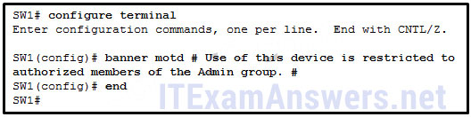
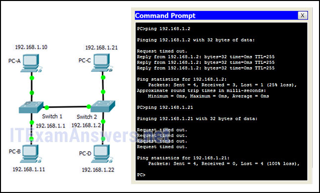
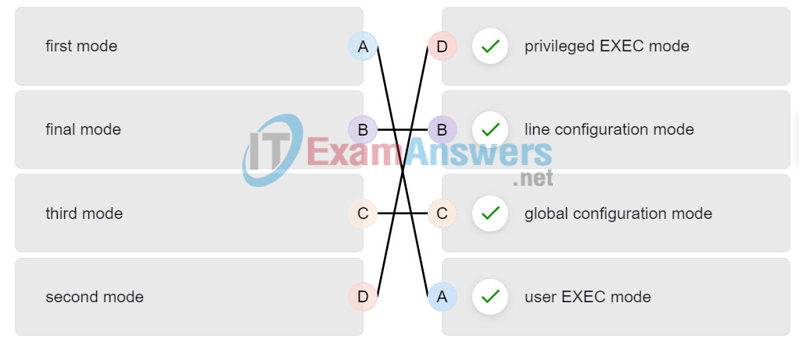
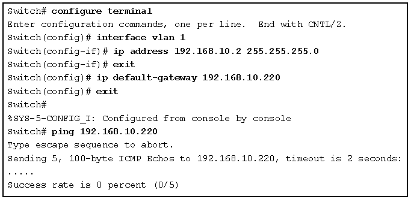
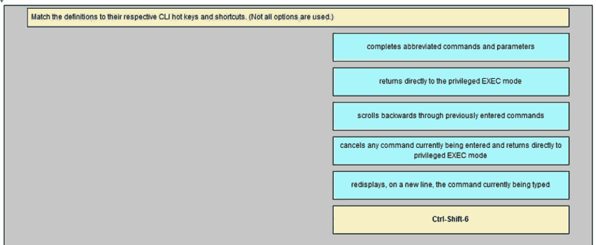
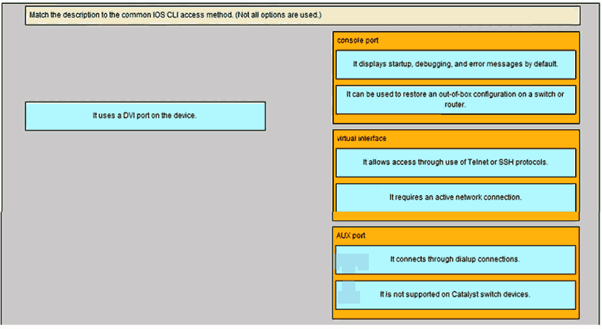

# CCNA 1 v2 - CCNA 1 - Chapter 2

## Question 1

**Question:**
What is the function of the kernel of an operating software?

**Choices:**
- **A.** It provides a user interface that allows users to request a specific task.
- **B.** The kernel links the hardware drivers with the underlying electronics of a computer.
- **C.** It is an application that allows the initial configuration of a Cisco device.
- **D.** The kernel provisions hardware resources to meet software requirements.

**Correct Answer:**
The kernel provisions hardware resources to meet software requirements.

**Explanation:**
Operating systems function with a shell, a kernel, and the hardware. The shell interfaces with the users, allowing them to request specific tasks from the device. The kernel provisions resources from the hardware to meet software requirements. The hardware functions by using drivers and their underlying electronics. The hardware represents the physical components of the device.

---

## Question 2

**Question:**
A network administrator needs to keep the user ID, password, and session contents private when establishing remote CLI connectivity with a switch to manage it. Which access method should be chosen?

**Choices:**
- **A.** Telnet
- **B.** Console
- **C.** AUX
- **D.** SSH

**Correct Answer:**
SSH

**Explanation:**
To be truly private a technician would use a Console connection however if remote management is required SSH provides a secure method.

---

## Question 3

**Question:**
Which procedure is used to access a Cisco 2960 switch when performing an initial configuration in a secure environment?

**Choices:**
- **A.** Use Telnet to remotely access the switch through the network.
- **B.** Use the console port to locally access the switch from a serial or USB interface of the PC.
- **C.** Use Secure Shell to remotely access the switch through the network.
- **D.** Use the AUX port to locally access the switch from a serial or USB interface of the PC.

**Correct Answer:**
Use the console port to locally access the switch from a serial or USB interface of the PC.

**Explanation:**
Telnet and SSH require active networking services to be configured on a Cisco device before they become functional. Cisco switches do not contain AUX ports.

---

## Question 4

**Question:**
Which command or key combination allows a user to return to the previous level in the command hierarchy?

**Choices:**
- **A.** end
- **B.** exit
- **C.** Ctrl-Z
- **D.** Ctrl-C

**Correct Answer:**
exit

**Explanation:**
End and CTRL-Z return the user to the privileged EXEC mode. Ctrl-C ends a command in process. The exit command returns the user to the previous level.

---

## Question 5

**Question:**
A router has a valid operating system and a configuration file stored in NVRAM. The configuration file contains an enable secret password but no console password. When the router boots up, which mode will display?

**Choices:**
- **A.** global configuration mode
- **B.** setup mode
- **C.** privileged EXEC mode
- **D.** user EXEC mode

**Correct Answer:**
user EXEC mode

**Explanation:**
If a Cisco IOS device has a valid IOS and a valid configuration file, it will boot into user EXEC mode. A password will be required to enter privileged EXEC mode.

---

## Question 6

**Question:**
Which two functions are provided to users by the context-sensitive help feature of the Cisco IOS CLI? (Choose two.)

**Choices:**
- **A.** providing an error message when a wrong command is submitted
- **B.** displaying a list of all available commands within the current mode
- **C.** allowing the user to complete the remainder of an abbreviated command with the TAB key
- **D.** determining which option, keyword, or argument is available for the entered command
- **E.** selecting the best command to accomplish a task

**Correct Answer:**
displaying a list of all available commands within the current mode; determining which option, keyword, or argument is available for the entered command

**Explanation:**
Context-sensitive help provides the user with a list of commands and the arguments associated with those commands within the current mode of a networking device. A syntax checker provides error checks on submitted commands and the TAB key can be used for command completion if a partial command is entered.

---

## Question 7

**Question:**
Which information does the show startup-config command display?

**Choices:**
- **A.** the IOS image copied into RAM
- **B.** the bootstrap program in the ROM
- **C.** the contents of the current running configuration file in the RAM
- **D.** the contents of the saved configuration file in the NVRAM

**Correct Answer:**
the contents of the saved configuration file in the NVRAM

**Explanation:**
The show startup-config command displays the saved configuration located in NVRAM. The show running-config command displays the contents of the currently running configuration file located in RAM.​

---

## Question 8

**Question:**
Why is it important to configure a hostname on a device?

**Choices:**
- **A.** a Cisco router or switch only begins to operate when its hostname is set
- **B.** a hostname must be configured before any other parameters
- **C.** to identify the device during remote access (SSH or telnet)
- **D.** to allow local access to the device through the console port

**Correct Answer:**
to identify the device during remote access (SSH or telnet)

**Explanation:**
It is important to configure a hostname because various authentication processes use the device hostname. Hostnames are helpful for documentation, and they identify the device during remote access.

---

## Question 9

**Question:**
Which two host names follow the guidelines for naming conventions on Cisco IOS devices? (Choose two.)

**Choices:**
- **A.** Branch2!
- **B.** RM-3-Switch-2A4
- **C.** Floor(15)
- **D.** HO Floor 17
- **E.** SwBranch799

**Correct Answer:**
RM-3-Switch-2A4; SwBranch799

**Explanation:**
Some guidelines for naming conventions are that names should: Start with a letter Contain no spaces End with a letter or digit Use only letters, digits, and dashes Be less than 64 characters in length

---

## Question 10

**Question:**
How does the service password-encryption command enhance password security on Cisco routers and switches?

**Choices:**
- **A.** It encrypts passwords as they are sent across the network.
- **B.** It encrypts passwords that are stored in router or switch configuration files.
- **C.** It requires that a user type encrypted passwords to gain console access to a router or switch.
- **D.** It requires encrypted passwords to be used when connecting remotely to a router or switch with Telnet.

**Correct Answer:**
It encrypts passwords that are stored in router or switch configuration files.

**Explanation:**
The service password-encryption command encrypts plaintext passwords in the configuration file so that they cannot be viewed by unauthorized users.

---

## Question 11

**Question:**
In your opinion (this has no bearing on your grade), please indicate how enthusiastic you are about the content of this course and the things you’re learning (or have learned):

**Choices:**
- **A.** Not At All Enthusiastic
- **B.** Slightly Enthusiastic
- **C.** Enthusiastic
- **D.** Very Enthusiastic
- **E.** Completely Enthusiastic

**Correct Answer:**
Enthusiastic

---

## Question 12

**Question:**
In your opinion (this has no bearing on your grade), please indicate your interest in this course:

**Choices:**
- **A.** Not At All Interested
- **B.** Slightly Interested
- **C.** Interested
- **D.** Very Interested
- **E.** Completely Interested

**Correct Answer:**
Interested

---

## Question 13

**Question:**
Refer to the exhibit. A network administrator is configuring the MOTD on switch SW1. What is the purpose of this command?

**Images:**

**Choices:**
- **A.** to display a message when a user accesses the switch
- **B.** to configure switch SW1 so that only the users in the Admin group can telnet into SW1
- **C.** to force users of the Admin group to enter a password for authentication
- **D.** to configure switch SW1 so that the message will display when a user enters the enable command

**Correct Answer:**
to display a message when a user accesses the switch

**Explanation:**
A banner message can be an important part of the legal process in the event that someone is prosecuted for breaking into a device. A banner message should make it clear that only authorized personnel should attempt to access the device. However, the banner command does not prevent unauthorized entry.

---

## Question 14

**Question:**
While trying to solve a network issue, a technician made multiple changes to the current router configuration file. The changes did not solve the problem and were not saved. What action can the technician take to discard the changes and work with the file in NVRAM?

**Choices:**
- **A.** Issue the reload command without saving the running configuration.
- **B.** Delete the vlan.dat file and reboot the device.
- **C.** Close and reopen the terminal emulation software.
- **D.** Issue the copy startup-config running-config command.

**Correct Answer:**
Issue the reload command without saving the running configuration.

**Explanation:**
The technician does not want to make any mistakes trying to remove all the changes that were done to the running configuration file. The solution is to reboot the router without saving the running configuration. The copy startup-config running-config command does not overwrite the running configuration file with the configuration file stored in NVRAM, but rather it just has an additive effect.

---

## Question 15

**Question:**
What is the function of the kernel of an operating system?

**Choices:**
- **A.** It provides a user interface that allows users to request a specific task.
- **B.** The kernel links the hardware drivers with the underlying electronics of a computer.
- **C.** It is an application that allows the initial configuration of a Cisco device.
- **D.** The kernel provisions hardware resources to meet software requirements.

**Correct Answer:**
The kernel provisions hardware resources to meet software requirements.

**Explanation:**
Operating systems function with a shell, a kernel, and the hardware. The shell interfaces with the users, allowing them to request specific tasks from the device. The kernel provisions resources from the hardware to meet software requirements. The hardware functions by using drivers and their underlying electronics. The hardware represents the physical components of the device.

---

## Question 16

**Question:**
A router with a valid operating system contains a configuration file stored in NVRAM. The configuration file has an enable secret password but no console password. When the router boots up, which mode will display?

**Choices:**
- **A.** privileged EXEC mode
- **B.** setup mode
- **C.** user EXEC mode
- **D.** global configuration mode

**Correct Answer:**
user EXEC mode

**Explanation:**
If a Cisco IOS device has a valid IOS and a valid configuration file, it will boot into user EXEC mode. A password will be required to enter privileged EXEC mode.

---

## Question 17

**Question:**
In your opinion (this has no bearing on your grade), please rate your motivation to do well in this course:

**Choices:**
- **A.** Not At All Motivated
- **B.** Slightly Motivated
- **C.** Motivated
- **D.** Very Motivated
- **E.** Completely Motivated

**Correct Answer:**
Very Motivated

---

## Question 18

**Question:**
Which statement is true about the running configuration file in a Cisco IOS device?

**Choices:**
- **A.** It affects the operation of the device immediately when modified.
- **B.** It is stored in NVRAM.
- **C.** It should be deleted using the erase running-config command.
- **D.** It is automatically saved when the router reboots.

**Correct Answer:**
It affects the operation of the device immediately when modified.

**Explanation:**
As soon as configuration commands are entered into a router, they modify the device immediately. Running configuration files can not be deleted nor are they saved automatically.

---

## Question 19

**Question:**
What are two characteristics of RAM on a Cisco device? (Choose two.)

**Choices:**
- **A.** RAM provides nonvolatile storage.
- **B.** The configuration that is actively running on the device is stored in RAM.
- **C.** The contents of RAM are lost during a power cycle.
- **D.** RAM is a component in Cisco switches but not in Cisco routers.
- **E.** RAM is able to store multiple versions of IOS and configuration files.

**Correct Answer:**
The configuration that is actively running on the device is stored in RAM.; The contents of RAM are lost during a power cycle.

**Explanation:**
RAM stores data that is used by the device to support network operations. The running configuration is stored in RAM. This type of memory is considered volatile memory because data is lost during a power cycle. Flash memory stores the IOS and delivers a copy of the IOS into RAM when a device is powered on. Flash memory is nonvolatile since it retains stored contents during a loss of power.

---

## Question 20

**Question:**
Which interface allows remote management of a Layer 2 switch?

**Choices:**
- **A.** the AUX interface
- **B.** the console port interface
- **C.** the switch virtual interface
- **D.** the first Ethernet port interface

**Correct Answer:**
the switch virtual interface

**Explanation:**
In a Layer 2 switch, there is a switch virtual interface (SVI) that provides a means for remotely managing the device.

---

## Question 21

**Question:**
Which interface is the default SVI on a Cisco switch?

**Choices:**
- **A.** FastEthernet 0/1
- **B.** GigabitEthernet 0/1
- **C.** VLAN 1
- **D.** VLAN 99

**Correct Answer:**
VLAN 1

**Explanation:**
An SVI is a virtual interface and VLAN 1 is enabled by default on Cisco switches. VLAN 99 must be configured to be used. FastEthernet 0/1 and GigabitEthernet 0/1 are physical interfaces.

---

## Question 22

**Question:**
Why would a Layer 2 switch need an IP address?

**Choices:**
- **A.** to enable the switch to send broadcast frames to attached PCs
- **B.** to enable the switch to function as a default gateway
- **C.** to enable the switch to be managed remotely
- **D.** to enable the switch to receive frames from attached PCs

**Correct Answer:**
to enable the switch to be managed remotely

**Explanation:**
A switch, as a Layer 2 device, does not need an IP address to transmit frames to attached devices. However, when a switch is accessed remotely through the network, it must have a Layer 3 address. The IP address must be applied to a virtual interface rather than to a physical interface. Routers, not switches, function as default gateways.

---

## Question 23

**Question:**
What command can be used on a Windows PC to see the IP configuration of that computer?

**Choices:**
- **A.** ping
- **B.** ipconfig
- **C.** show interfaces
- **D.** show ip interface brief

**Correct Answer:**
ipconfig

**Explanation:**
The ipconfig command is the primary utility used on a Windows-based computer to display its current IP configuration, including the IPv4 and IPv6 addresses, subnet mask, and default gateway. While networking devices like routers and switches use Cisco IOS commands such as show ip interface brief or show interfaces to verify their own configurations, Windows hosts rely on ipconfig to provide a summary of network settings directly from the command prompt. For a more comprehensive view that includes physical (MAC) addresses and DNS server details, the command can be extended with the /all switch

---

## Question 24

**Question:**
A technician is adding a new PC to a LAN. After unpacking the components and making all the connections, the technician starts the PC. After the OS loads, the technician opens a browser, and verifies that the PC can reach the Internet. Why was the PC able to connect to the network with no additional configuration?

**Choices:**
- **A.** The PC does not require any additional information to function on the network.
- **B.** The PC came preconfigured with IP addressing information from the factory.
- **C.** The PC was preconfigured to use DHCP.
- **D.** The PC used DNS to automatically receive IP addressing information from a server.
- **E.** The PC virtual interface is compatible with any network.

**Correct Answer:**
The PC was preconfigured to use DHCP.

**Explanation:**
The new PC was preconfigured to use DHCP. When the PC is connected to a network that uses DHCP, it gets the IP address settings from the DHCP server that will allow it to function on the network. All devices require at least an IP address and subnet mask to function on a LAN. DNS does not automatically configure addresses on hosts. PC virtual interfaces are not universally compatible with LANs and do not necessarily provide a host with an IP address. At this place in the course, virtual interfaces are used on network switches.

---

## Question 25

**Question:**
What is a user trying to determine when issuing a ping 10.1.1.1 command on a PC?

**Choices:**
- **A.** if the TCP/IP stack is functioning on the PC without putting traffic on the wire
- **B.** if there is connectivity with the destination device
- **C.** the path that traffic will take to reach the destination
- **D.** what type of device is at the destination

**Correct Answer:**
if there is connectivity with the destination device

**Explanation:**
The ping destination command can be used to test connectivity.

---

## Question 26

**Question:**
Refer to the exhibit. A network technician is testing connectivity in a new network. Based on the test results shown in the exhibit, which device does the technician have connectivity with and which device does the technician not have connectivity with? (Choose two.)

**Images:**

**Choices:**
- **A.** connectivity: switch 2
- **B.** connectivity: PC-D
- **C.** connectivity: PC-B
- **D.** no connectivity: switch 1
- **E.** no connectivity: switch 2
- **F.** no connectivity: PC-C

**Correct Answer:**
connectivity: switch 2; no connectivity: PC-C

**Explanation:**
The exhibit shows ping tests to two devices. One device has the IP address of 192.168.1.2, which is switch 2. The other test is to the IP address of 192.168.1.21, which is host PC-C. For the first test, to switch 2, the results are successful, with four reply messages received. This means that connectivity exists to switch 2. For the second test, all four messages timed out. This indicates that connectivity does not exist to PC-C.

---

## Question 27

**Question:**
Refer to the exhibit. Refer to the exhibit. What three facts can be determined from the viewable output of the show ip interface brief command? (Choose three.)

**Images:**

**Choices:**
- **A.** Two physical interfaces have been configured.
- **B.** The switch can be remotely managed.
- **C.** One device is attached to a physical interface.
- **D.** Passwords have been configured on the switch.
- **E.** Two devices are attached to the switch.
- **F.** The default SVI has been configured.

**Correct Answer:**
The switch can be remotely managed.; One device is attached to a physical interface.; The default SVI has been configured.

**Explanation:**
Vlan1 is the default SVI. Because an SVI has been configured, the switch can be configured and managed remotely. FastEthernet0/0 is showing up and up, so a device is connected.

---

## Question 28

**Question:**
An administrator is configuring a switch console port with a password. In what order will the administrator travel through the IOS modes of operation in order to reach the mode in which the configuration commands will be entered? (Not all options are used.) Place the options in the following order:

**Images:**

**Explanation:**
The configuration mode that the administrator first encounters is user EXEC mode. After the enable command is entered, the next mode is privileged EXEC mode. From there, the configure termina l command is entered to move to global configuration mode. Finally, the administrator enters the line console 0 command to enter the mode in which the configuration will be entered.

---

## Question 29

**Question:**
Match the definitions to their respective CLI hot keys and shortcuts. (Not all options are used.) Question Place the options in the following order: completes abbreviated commands and parameters displays the next screen scrolls backwards through previously entered commands – not scored – provides context-sensitive help aborts commands such as trace and ping

**Images:**

**Explanation:**
The shortcuts with their functions are as follows: – Tab – Completes the remainder of a partially typed command or keyword – Space bar – displays the next screen – ? – provides context-sensitive help – Up Arrow – Allows user to scroll backward through former commands – Ctrl-C – cancels any command currently being entered and returns directly to privileged EXEC mode – Ctrl-Shift-6 – Allows the user to interrupt an IOS process such as ping or traceroute Other Questions

---

## Question 30

**Question:**
A network administrator is planning an IOS upgrade on several of the head office routers and switches. Which three questions must be answered before continuing with the IOS selection and upgrade? (Choose three.)

**Choices:**
- **A.** Are the devices on the same LAN?
- **B.** Do the devices have enough NVRAM to store the IOS image?
- **C.** What models of routers and switches require upgrades?
- **D.** What ports are installed on the routers and switches?
- **E.** Do the routers and switches have enough RAM and flash memory for the proposed IOS versions?
- **F.** What features are required for the devices?

**Correct Answer:**
What models of routers and switches require upgrades?; Do the routers and switches have enough RAM and flash memory for the proposed IOS versions?; What features are required for the devices?

---

## Question 31

**Question:**
A router has a valid operating system and a configuration stored in NVRAM. When the router boots up, which mode will display?

**Choices:**
- **A.** global configuration mode
- **B.** setup mode
- **C.** ROM monitor mode
- **D.** user EXEC mode

**Correct Answer:**
user EXEC mode

---

## Question 32

**Question:**
Which two characters are allowed as part of the hostname of a Cisco device? (Choose two.)

**Choices:**
- **A.** numbers
- **B.** question mark
- **C.** space
- **D.** tab
- **E.** dash

**Correct Answer:**
numbers; dash

---

## Question 33

**Question:**
What is a result of using the service password-encryption command on a Cisco network device?

**Choices:**
- **A.** The command encrypts the banner message.
- **B.** The command encrypts the enable mode password.
- **C.** All passwords in the configuration are not shown in clear text when viewing the configuration.
- **D.** A network administrator who later logs into the device will be required to enter an administrator password in order to gain access to the Cisco device.

**Correct Answer:**
All passwords in the configuration are not shown in clear text when viewing the configuration.

---

## Question 34

**Question:**
A new network administrator has been asked to enter a banner message on a Cisco device. What is the fastest way a network administrator could test whether the banner is properly configured?

**Choices:**
- **A.** Reboot the device.
- **B.** Enter CTRL-Z at the privileged mode prompt.
- **C.** Exit global configuration mode.
- **D.** Power cycle the device.
- **E.** Exit privileged EXEC mode and press Enter.

**Correct Answer:**
Exit privileged EXEC mode and press Enter.

**Explanation:**
While at the privileged mode prompt such as Router#, type exit,press Enter, and the banner message appears. Power cycling a network device that has had the banner motd command issued will also display the banner message, but this is not a quick way to test the configuration.

---

## Question 35

**Question:**
Passwords can be used to restrict access to all or parts of the Cisco IOS. Select the modes and interfaces that can be protected with passwords. (Choose three.)

**Choices:**
- **A.** VTY interface
- **B.** console interface
- **C.** Ethernet interface
- **D.** boot IOS mode
- **E.** privileged EXEC mode
- **F.** router configuration mode

**Correct Answer:**
VTY interface; console interface; privileged EXEC mode

---

## Question 36

**Question:**
What benefit does DHCP provide to a network?

**Choices:**
- **A.** Hosts always have the same IP address and are therefore always reachable.
- **B.** DHCP allows users to refer to locations by a name rather than an IP address.
- **C.** Hosts can connect to the network and get an IP address without manual configuration.
- **D.** Duplicate addresses cannot occur on a network that issues dynamic addresses using DHCP and has static assignments.

**Correct Answer:**
Hosts can connect to the network and get an IP address without manual configuration.

**Explanation:**
DHCP provides automatic IP address configuration to hosts on a network. Hosts will be dynamically assigned an address when they connect to the network, although not necessarily the same address each time they connect. If there are static and dynamic addresses used together on the network there could still be the possibility of address conflicts. DNS can be used in conjunction with DHCP to allow users to communicate using names rather than IP addresses.

---

## Question 37

**Question:**
What criterion must be followed in the design of an IPv4 addressing scheme for end devices?

**Choices:**
- **A.** Each IP address must match the address that is assigned to the host by DNS.
- **B.** Each IP address must be unique within the local network.
- **C.** Each IP address needs to be compatible with the MAC address.
- **D.** Each local host should be assigned an IP address with a unique network component.

**Correct Answer:**
Each IP address must be unique within the local network.

**Explanation:**
The IP address is independent of a MAC address. IP addresses that are assigned to end devices should be unique. They can be dynamically assigned by a DHCP server (not a DNS server) or manually assigned by local network administrators. If an address is assigned manually, the network administrator must make sure that it is unique.

---

## Question 38

**Question:**
Refer to the exhibit. A switch was configured as shown. A ping to the default gateway was issued, but the ping was not successful. Other switches in the same network can ping this gateway. What is a possible reason for this?

**Images:**

**Choices:**
- **A.** The VLAN IP address and the default gateway IP address are not in the same network.
- **B.** The local DNS server is not functioning correctly.
- **C.** The no shutdown command was not issued for VLAN 1.
- **D.** The ip default-gateway command has to be issued in the VLAN interface configuration mode.
- **E.** The default gateway address must be 192.168.10.1.

**Correct Answer:**
The no shutdown command was not issued for VLAN 1.

---

## Question 39

**Question:**
Match the difinitions to their respective CLI hot keys and shortcuts. Tab -> Completes abbreviated commands and parameters Ctrl-R -> returns directly to the privileged EXEC mode Up Arrow -> scrolls backwards through previously entered commands Ctrl-Z -> cancels any command currently being entered and returns directly to privileged EXEC mode Ctrl-C -> Redisplays, on a new line, the command currently being typed

**Images:**

---

## Question 40

**Question:**
Which two features are characteristics of flash memory? (Choose two.)

**Choices:**
- **A.** Flash receives a copy of the IOS from RAM when a device is powered on.
- **B.** Flash provides nonvolatile storage.
- **C.** The contents of flash may be overwritten.
- **D.** Flash is a component in Cisco switches but not in Cisco routers.
- **E.** The contents of flash may be lost during a power cycle.

**Correct Answer:**
Flash provides nonvolatile storage.; The contents of flash may be overwritten.

---

## Question 41

**Question:**
Match the description to the common IOS CLI access method. Console port It displays startup, debugging, and error messages by default.* It can be used to restore an out-of-box configuration on a switch or router.* Virtual interface It allows access throught use of Telnet or SSH protocols.* It requires an active network connection.* AUX port It connects throught dialup connections* It is not supported on Catalyst switch devices*

**Images:**

---

## Question 42

**Question:**
An employee of a large corporation remotely logs into the company using the appropriate username and password. The employee is attending an important video conference with a customer concerning a large sale. It is important for the video quality to be excellent during the meeting. The employee is unaware that after a successful login, the connection to the company ISP failed. The secondary connection, however, activated within seconds. The disruption was not noticed by the employee or other employees.

---

## Question 43

**Question:**
What three network characteristics are described in this scenario? (Choose three.)

**Choices:**
- **A.** security
- **B.** quality of service
- **C.** scalability
- **D.** powerline networking
- **E.** integrity
- **F.** fault tolerance

**Correct Answer:**
security; quality of service; fault tolerance

**Explanation:**
Usernames and passwords relate to network security. Good quality video, to support video conferencing, relates to prioritizing the video traffic with quality of service (QoS). The fact that a connection to an ISP failed and was then restored but went unnoticed by employees relates to the fault tolerant design of the network.

---

## Question 44

**Question:**
What is the consequence of configuring a router with the ipv6 unicast-routing global configuration command?​

**Choices:**
- **A.** All router interfaces will be automatically activated.
- **B.** The IPv6 enabled router interfaces begin sending ICMPv6 Router Advertisement messages.
- **C.** Each router interface will generate an IPv6 link-local address.​
- **D.** It statically creates a global unicast address on this router.​

**Correct Answer:**
The IPv6 enabled router interfaces begin sending ICMPv6 Router Advertisement messages.

**Explanation:**
The ipv6 unicast-routing global configuration command is a critical step in IPv6 implementation because Cisco routers do not function as IPv6 routers by default. Once this command is issued, the router joins the all-routers multicast group and its IPv6-enabled interfaces begin transmitting ICMPv6 Router Advertisement (RA) messages periodically or in response to host solicitations. These RA messages are essential for dynamic address allocation, as they provide neighboring hosts with vital information such as the network prefix, prefix length, and the default gateway address. While link-local addresses are generated automatically when IPv6 is enabled on an interface, the global unicast routing command is specifically what triggers the router to begin its active role in directing IPv6 traffic and facilitating stateless address autoconfiguration (SLAAC).

---

## Question 45

**Question:**
What are two ICMPv6 messages that are not present in ICMP for IPv4? (Choose two.)

**Choices:**
- **A.** Neighbor Solicitation
- **B.** Destination Unreachable
- **C.** Host Confirmation
- **D.** Time Exceeded
- **E.** Router Advertisement
- **F.** Route Redirection

**Correct Answer:**
Neighbor Solicitation; Router Advertisement

**Explanation:**
ICMPv6 includes four new message types: Router Advertisement, Neighbor Advertisement, Router Solicitation, and Neighbor Solicitation.

---

## Question 46

**Question:**
What two pieces of information are displayed in the output of the show ip interface brief command? (Choose two.)

**Choices:**
- **A.** IP addresses
- **B.** interface descriptions
- **C.** MAC addresses
- **D.** next-hop addresses
- **E.** Layer 1 statuses
- **F.** speed and duplex settings

**Correct Answer:**
IP addresses; Layer 1 statuses

**Explanation:**
The command show ip interface brief shows the IP address of each interface, as well as the operational status of the interfaces at both Layer 1 and Layer 2. In order to see interface descriptions and speed and duplex settings, use the command show running-config interface. Next-hop addresses are displayed in the routing table with the command show ip route, and the MAC address of an interface can be seen with the command show interfaces.

---

## Question 47

**Question:**
A client packet is received by a server. The packet has a destination port number of 80. What service is the client requesting?

**Choices:**
- **A.** DHCP
- **B.** SMTP
- **C.** DNS
- **D.** HTTP

**Correct Answer:**
HTTP

**Explanation:**
The transport layer uses port numbers to identify specific applications and services. According to the well-known port assignments, port 80 is reserved for Hypertext Transfer Protocol (HTTP) web services. When a server receives a packet with port 80 as the destination, it identifies the request as a client seeking to access web content, such as HTML pages. This standardized numbering allows the server to simultaneously handle multiple services, distinguishing web traffic from other requests like DNS (port 53) or SMTP (port 25).

---
