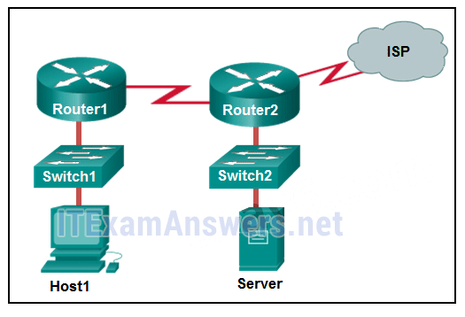
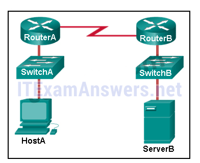
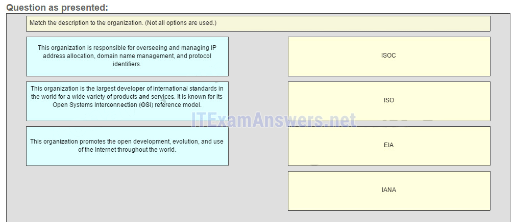
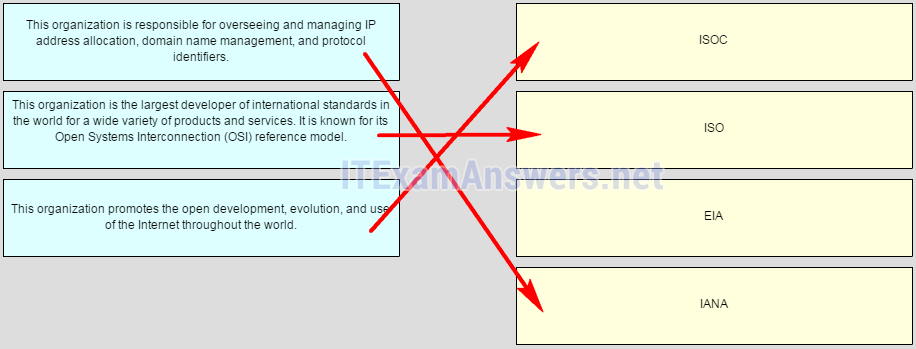
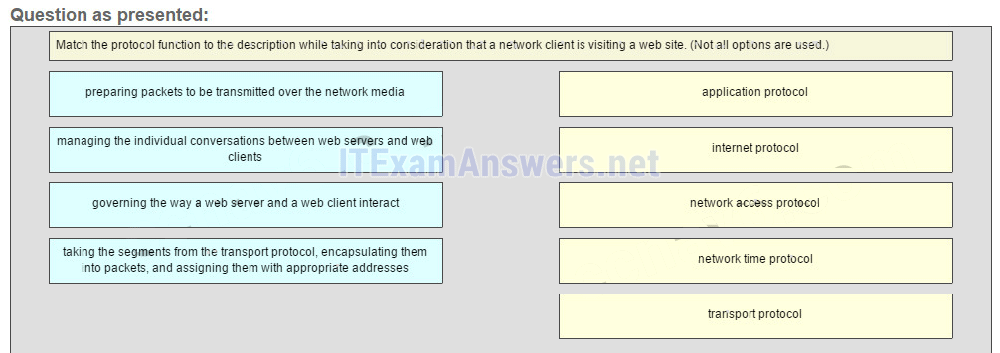
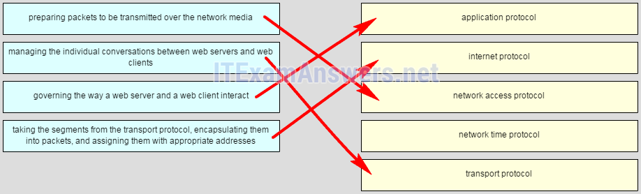
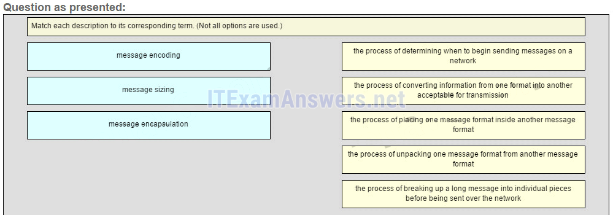
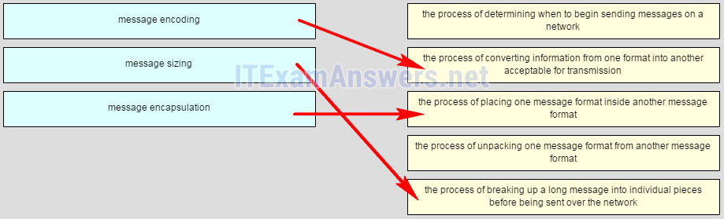
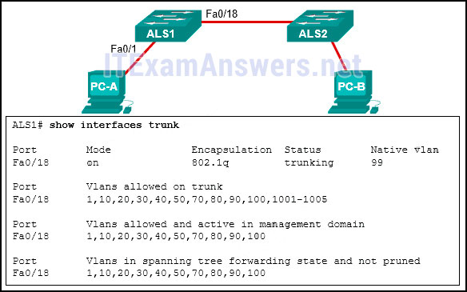

# CCNA 1 v2 - CCNA 1 - Chapter 3

## Question 1

**Question:**
What method can be used by two computers to ensure that packets are not dropped because too much data is being sent too quickly?

**Choices:**
- **A.** encapsulation
- **B.** flow control
- **C.** access method
- **D.** response timeout

**Correct Answer:**
flow control

**Explanation:**
In order for two computers to be able to communicate effectively, there must be a mechanism that allows both the source and destination to set the timing of the transmission and receipt of data. Flow control allows for this by ensuring that data is not sent too fast for it to be received properly.

---

## Question 2

**Question:**
What type of communication will send a message to all devices on a local area network?

**Choices:**
- **A.** broadcast
- **B.** multicast
- **C.** unicast
- **D.** allcast

**Correct Answer:**
broadcast

**Explanation:**
Broadcast communication is a one-to-all communication. A unicast communication is a one-to-one communication. Multicast is a one-to-many communication where the message is delivered to a specific group of hosts. Allcast is not a standard term to describe message delivery.

---

## Question 3

**Question:**
What process is used to place one message inside another message for transfer from the source to the destination?

**Choices:**
- **A.** access control
- **B.** decoding
- **C.** encapsulation
- **D.** flow control

**Correct Answer:**
encapsulation

**Explanation:**
Encapsulation is the process of placing one message format into another message format. An example is how a packet is placed in its entirety into the data field as it is encapsulated into a frame.

---

## Question 4

**Question:**
A web client is sending a request for a webpage to a web server. From the perspective of the client, what is the correct order of the protocol stack that is used to prepare the request for transmission?

**Choices:**
- **A.** HTTP, IP, TCP, Ethernet
- **B.** HTTP, TCP, IP, Ethernet
- **C.** Ethernet, TCP, IP, HTTP
- **D.** Ethernet, IP, TCP, HTTP

**Correct Answer:**
HTTP, TCP, IP, Ethernet

**Explanation:**
1. HTTP governs the way that a web server and client interact. 2. TCP manages individual conversations between web servers and clients. 3. IP is responsible for delivery across the best path to the destination. 4. Ethernet takes the packet from IP and formats it for transmission.

---

## Question 5

**Question:**
Which statement is correct about network protocols?

**Choices:**
- **A.** Network protocols define the type of hardware that is used and how it is mounted in racks.
- **B.** They define how messages are exchanged between the source and the destination.
- **C.** They all function in the network access layer of TCP/IP.
- **D.** They are only required for exchange of messages between devices on remote networks.

**Correct Answer:**
They define how messages are exchanged between the source and the destination.

**Explanation:**
Network protocols are implemented in hardware, or software, or both. They interact with each other within different layers of a protocol stack. Protocols have nothing to do with the installation of the network equipment. Network protocols are required to exchange information between source and destination devices in both local and remote networks.

---

## Question 6

**Question:**
Which statement is true about the TCP/IP and OSI models?

**Choices:**
- **A.** The TCP/IP transport layer and OSI Layer 4 provide similar services and functions.
- **B.** The TCP/IP network access layer has similar functions to the OSI network layer.
- **C.** The OSI Layer 7 and the TCP/IP application layer provide identical functions.
- **D.** The first three OSI layers describe general services that are also provided by the TCP/IP internet layer.

**Correct Answer:**
The TCP/IP transport layer and OSI Layer 4 provide similar services and functions.

**Explanation:**
The TCP/IP internet layer provides the same function as the OSI network layer. The transport layer of both the TCP/IP and OSI models provides the same function. The TCP/IP application layer includes the same functions as OSI Layers 5, 6, and 7.

---

## Question 7

**Question:**
What is an advantage of using standards to develop and implement protocols?

**Choices:**
- **A.** A particular protocol can only be implemented by one manufacturer.
- **B.** Products from different manufacturers can interoperate successfully.
- **C.** Different manufacturers are free to apply different requirements when implementing a protocol.
- **D.** Standards provide flexibility for manufacturers to create devices that comply with unique requirements.

**Correct Answer:**
Products from different manufacturers can interoperate successfully.

**Explanation:**
Standards-based protocols enable products from different manufacturers to interoperate successfully. Standards-based protocols enable many manufacturers to implement that protocol. If different manufacturers implement different requirements within the same protocol, then their products will not be interoperable.

---

## Question 8

**Question:**
What three application layer protocols are part of the TCP/IP protocol suite? (Choose three.)

**Choices:**
- **A.** ARP
- **B.** DHCP
- **C.** DNS
- **D.** FTP
- **E.** NAT
- **F.** PPP

**Correct Answer:**
DHCP; DNS; FTP

**Explanation:**
DNS, DHCP, and FTP are all application layer protocols in the TCP/IP protocol suite. ARP and PPP are network access layer protocols, and NAT is an internet layer protocol in the TCP/IP protocol suite.

---

## Question 9

**Question:**
What are proprietary protocols?

**Choices:**
- **A.** protocols developed by private organizations to operate on any vendor hardware
- **B.** protocols that can be freely used by any organization or vendor
- **C.** protocols developed by organizations who have control over their definition and operation
- **D.** a collection of protocols known as the TCP/IP protocol suite

**Correct Answer:**
protocols developed by organizations who have control over their definition and operation

**Explanation:**
Proprietary protocols have their definition and operation controlled by one company or vendor. Some of them can be used by different organizations with permission from the owner. The TCP/IP protocol suite is an open standard, not a proprietary protocol.

---

## Question 10

**Question:**
What is an advantage of network devices using open standard protocols?

**Choices:**
- **A.** Network communications is confined to data transfers between devices from the same vendor.
- **B.** A client host and a server running different operating systems can successfully exchange data.
- **C.** Internet access can be controlled by a single ISP in each market.
- **D.** Competition and innovation are limited to specific types of products.

**Correct Answer:**
A client host and a server running different operating systems can successfully exchange data.

**Explanation:**
An advantage of network devices implementing open standard protocols, such as from the TCP/IP suite, is that clients and servers running different operating systems can communicate with each other. Open standard protocols facilitate innovation and competition between vendors and across markets, and can reduce the occurrence of monopolies in networking markets.

---

## Question 11

**Question:**
Refer to the exhibit. If Host1 were to transfer a file to the server, what layers of the TCP/IP model would be used?

**Images:**

**Choices:**
- **A.** only application and Internet layers
- **B.** only Internet and network access layers
- **C.** only application, Internet, and network access layers
- **D.** application, transport, Internet, and network access layers
- **E.** only application, transport, network, data link, and physical layers
- **F.** application, session, transport, network, data link, and physical layers

**Correct Answer:**
application, transport, Internet, and network access layers

**Explanation:**
The TCP/IP model contains the application, transport, internet, and network access layers. A file transfer uses the FTP application layer protocol. The data would move from the application layer through all of the layers of the model and across the network to the file server.

---

## Question 12

**Question:**
Which three layers of the OSI model are comparable in function to the application layer of the TCP/IP model? (Choose three.)

**Choices:**
- **A.** application
- **B.** presentation
- **C.** session
- **D.** transport
- **E.** data link
- **F.** physical
- **G.** network

**Correct Answer:**
application; presentation; session

**Explanation:**
The TCP/IP model consists of four layers: application, transport, internet, and network access. The OSI model consists of seven layers: application, presentation, session, transport, network, data link, and physical. The top three layers of the OSI model: application, presentation, and session map to the application layer of the TCP/IP model.

---

## Question 13

**Question:**
At which layer of the OSI model would a logical address be encapsulated?

**Choices:**
- **A.** physical layer
- **B.** data link layer
- **C.** network layer
- **D.** transport layer

**Correct Answer:**
network layer

**Explanation:**
Logical addresses, also known as IP addresses, are encapsulated at the network layer. Physical addresses are encapsulated at the data link layer. Port addresses are encapsulated at the transport layer. No addresses are encapsulated at the physical layer.

---

## Question 14

**Question:**
At which layer of the OSI model would a logical address be added during encapsulation?

**Choices:**
- **A.** physical layer
- **B.** data link layer
- **C.** network layer
- **D.** transport layer

**Correct Answer:**
network layer

**Explanation:**
Logical addresses, also known as IP addresses, are encapsulated at the network layer. Physical addresses are encapsulated at the data link layer. Port addresses are encapsulated at the transport layer. No addresses are encapsulated at the physical layer.

---

## Question 15

**Question:**
Which PDU format is used when bits are received from the network medium by the NIC of a host?

**Choices:**
- **A.** file
- **B.** frame
- **C.** packet
- **D.** segment

**Correct Answer:**
frame

**Explanation:**
When received at the physical layer of a host, the bits are formatted into a frame at the data link layer. A packet is the PDU at the network layer. A segment is the PDU at the transport layer. A file is a data structure that may be used at the application layer.

---

## Question 16

**Question:**
Which PDU is processed when a host computer is de-encapsulating a message at the transport layer of the TCP/IP model?

**Choices:**
- **A.** bits
- **B.** frame
- **C.** packet
- **D.** segment

**Correct Answer:**
segment

**Explanation:**
At the transport layer, a host computer will de-encapsulate a segment to reassemble data to an acceptable format by the application layer protocol of the TCP/IP model.

---

## Question 17

**Question:**
Refer to the exhibit. HostA is attempting to contact ServerB. Which two statements correctly describe the addressing that HostA will generate in the process? (Choose two.)

**Images:**

**Choices:**
- **A.** A packet with the destination IP address of RouterB.
- **B.** A frame with the destination MAC address of SwitchA.
- **C.** A packet with the destination IP address of RouterA.
- **D.** A frame with the destination MAC address of RouterA.
- **E.** A packet with the destination IP address of ServerB.
- **F.** A frame with the destination MAC address of ServerB.

**Correct Answer:**
A frame with the destination MAC address of RouterA.; A packet with the destination IP address of ServerB.

**Explanation:**
In order to send data to ServerB, HostA will generate a packet that contains the IP address of the destination device on the remote network and a frame that contains the MAC address of the default gateway device on the local network.

---

## Question 18

**Question:**
Which address does a NIC use when deciding whether to accept a frame?

**Choices:**
- **A.** source IP address
- **B.** source MAC address
- **C.** destination IP address
- **D.** destination MAC address
- **E.** source Ethernet address

**Correct Answer:**
destination MAC address

---

## Question 19

**Question:**
What will happen if the default gateway address is incorrectly configured on a host?

**Choices:**
- **A.** The host cannot communicate with other hosts in the local network.
- **B.** The switch will not forward packets initiated by the host.
- **C.** The host will have to use ARP to determine the correct address of the default gateway.
- **D.** The host cannot communicate with hosts in other networks.
- **E.** A ping from the host to 127.0.0.1 would not be successful.

**Correct Answer:**
The host cannot communicate with hosts in other networks.

**Explanation:**
When a host needs to send a message to another host located on the same network, it can forward the message directly. However, when a host needs to send a message to a remote network, it must use the router, also known as the default gateway. This is because the data link frame address of the remote destination host cannot be used directly. Instead, the IP packet has to be sent to the router (default gateway) and the router will forward the packet toward its destination. Therefore, if the default gateway is incorrectly configured, the host can communicate with other hosts on the same network, but not with hosts on remote networks.

---

## Question 20

**Question:**
Which characteristic describes the default gateway of a host computer?

**Choices:**
- **A.** the logical address of the router interface on the same network as the host computer
- **B.** the physical address of the switch interface connected to the host computer
- **C.** the physical address of the router interface on the same network as the host computer
- **D.** the logical address assigned to the switch interface connected to the router

**Correct Answer:**
the logical address of the router interface on the same network as the host computer

**Explanation:**
The default gateway is the IP address of an interface on the router on the same network as the sending host.

---

## Question 21

**Question:**
Match the description to the organization. (Not all options are used.) ISOC -> The organization promotes the open development, evolution, and use of the internet throughout the world ISO -> This organization is the largest developer of international standars in the world for a wide variety of products and services. It is know for its Open System Interconection (OSI) reference model. IANA -> This organization is responsible for overseeing and managing IP address allocation, domain name management, and protocol identifiers Explain: The EIA is an international standards and trade organization for electronics organizations. It is best known for its standards related to electrical wiring, connectors, and the 19-inch racks used to mount networking equipment.

**Images:**

---

## Question 22

**Question:**
Match the protocol function to the description while taking into consideration that a network client is visiting a web site. (Not all options are used.) Place the options in the following order: governing the way a web server and a web client interact –> application protocol taking the segments from transport protocol, encapsulating them into packets, and assigning them with appropriate addresses –> internet protocol preparing packets to be transmitted over the network media –> network access protocol – not scored – managing the individual conversations between web servers and web clients –> transport protocol Explain: When a web client visits a web server, several network communication protocols are involved. These different protocols work together to ensure that the messages are received and understood by both parties. These protocols include the following: Application Protocol – governing the way a web server and a web client interact Transport Protocol – managing the individual conversations between web servers and web clients Internet Protocol – taking the formatted segments from the transport protocol, encapsulating them into packets, assigning them the appropriate addresses, and delivering them across the best path to the destination host Network Access Protocol – preparing packets to be transmitted over the network media Network Time Protocol is used to synchronize clocks between computer systems. It is not involved in this case.

**Images:**

---

## Question 23

**Question:**
Match each description to its corresponding term. (Not all options are used.) Place the options in the following order: – not scored – message encoding -> the process of converting information from one format into another acceptable for transmission message encapsulation -> the process of placing one message format inside another message format – not scored – message sizing -> the process of breaking up a long message into individual pieces before being sent over the network Other Quetions

**Images:**

---

## Question 24

**Question:**
A computer in a given network is communicating with a specific group of computers. What type of communication is this?

**Choices:**
- **A.** broadcast
- **B.** multicast
- **C.** unicast
- **D.** ARP
- **E.** HTTP

**Correct Answer:**
multicast

---

## Question 25

**Question:**
Which protocol is responsible for controlling the size and rate of the HTTP messages exchanged between server and client?

**Choices:**
- **A.** HTTP
- **B.** ARP
- **C.** TCP
- **D.** DHCP

**Correct Answer:**
TCP

---

## Question 26

**Question:**
A user is viewing an HTML document located on a web server. What protocol segments the messages and manages the segments in the individual conversation between the web server and the web client?

**Choices:**
- **A.** DHCP
- **B.** TCP
- **C.** HTTP
- **D.** ARP

**Correct Answer:**
TCP

---

## Question 27

**Question:**
Which IEEE standard enables a wireless NIC to connect to a wireless AP that is made by a different manufacturer?

**Choices:**
- **A.** 802.1
- **B.** 802.11
- **C.** 802.3
- **D.** 802.2

**Correct Answer:**
802.11

---

## Question 28

**Question:**
What is a function of Layer 4 of the OSI model?

**Choices:**
- **A.** to specify the packet type to be used by the communications
- **B.** to apply framing information to the packet, based on the attached media
- **C.** to represent data to the user, including encoding and dialog control
- **D.** to describe the ordered and reliable delivery of data between source and destination

**Correct Answer:**
to describe the ordered and reliable delivery of data between source and destination

---

## Question 29

**Question:**
What is a benefit of using a layered model for network communications?

**Choices:**
- **A.** fostering competition among device and software vendors by enforcing the compatibility of their products
- **B.** enhancing network transmission performance by defining targets for each layer
- **C.** avoiding possible incompatibility issues by using a common set of developing tools
- **D.** simplifying protocol development by limiting every layer to one function

**Correct Answer:**
fostering competition among device and software vendors by enforcing the compatibility of their products

---

## Question 30

**Question:**
What is the general term that is used to describe a piece of data at any layer of a networking model?

**Choices:**
- **A.** frame
- **B.** packet
- **C.** protocol data unit
- **D.** segment

**Correct Answer:**
protocol data unit

---

## Question 31

**Question:**
Which statement accurately describes a TCP/IP encapsulation process when a PC is sending data to the network?

**Choices:**
- **A.** Data is sent from the internet layer to the network access layer.
- **B.** Packets are sent from the network access layer to the transport layer.
- **C.** Segments are sent from the transport layer to the internet layer.
- **D.** Frames are sent from the network access layer to the internet layer.

**Correct Answer:**
Segments are sent from the transport layer to the internet layer.

---

## Question 32

**Question:**
What statement describes the function of the Address Resolution Protocol?

**Choices:**
- **A.** ARP is used to discover the IP address of any host on a different network.
- **B.** ARP is used to discover the IP address of any host on the local network.
- **C.** ARP is used to discover the MAC address of any host on a different network.
- **D.** ARP is used to discover the MAC address of any host on the local network.

**Correct Answer:**
ARP is used to discover the MAC address of any host on the local network.

**Explanation:**
When a PC wants to send data on the network, it always knows the IP address of the destination. However, it also needs to discover the MAC address of the destination. ARP is the protocol that is used to discover the MAC address of a host that belongs to the same network.

---

## Question 33

**Question:**
Which address provides a unique host address for data communications at the internet layer?

**Choices:**
- **A.** data-link address
- **B.** logical address
- **C.** Layer 2 address
- **D.** physical address

**Correct Answer:**
logical address

---

## Question 34

**Question:**
Which protocol is used by a computer to find the MAC address of the default gateway on an Ethernet network?

**Choices:**
- **A.** ARP
- **B.** TCP
- **C.** UDP
- **D.** DHCP

**Correct Answer:**
ARP

**Explanation:**
TCP provides reliable delivery of data. UDP provides unreliable delivery of data. DHCP is used for the automatic assignment of IP addresses. ARP is used to discover the MAC address of a device on the Ethernet network.

---

## Question 35

**Question:**
If the default gateway is configured incorrectly on the host, what is the impact on communications?

**Choices:**
- **A.** The host is unable to communicate on the local network.
- **B.** The host can communicate with other hosts on the local network, but is unable to communicate with hosts on remote networks.
- **C.** The host can communicate with other hosts on remote networks, but is unable to communicate with hosts on the local network.
- **D.** There is no impact on communications.

**Correct Answer:**
The host can communicate with other hosts on the local network, but is unable to communicate with hosts on remote networks.

---

## Question 36

**Question:**
Open the PT Activity. Perform the tasks in the activity instructions and then answer the question. Based on the configured network, what IP address would PC1 and PC2 use as their default gateway?

**Choices:**
- **A.** 192.168.1.2
- **B.** 10.1.1.1
- **C.** 172.16.1.1
- **D.** 192.168.1.1
- **E.** 192.168.1.10

**Correct Answer:**
192.168.1.1

---

## Question 37

**Question:**
A user sends an HTTP request to a web server on a remote network. During encapsulation for this request, what information is added to the address field of a frame to indicate the destination?

**Choices:**
- **A.** the MAC address of the default gateway
- **B.** the IP address of the destination host
- **C.** the MAC address of the destination host
- **D.** the IP address of the default gateway

**Correct Answer:**
the MAC address of the default gateway

**Explanation:**
A frame is encapsulated with source and destination MAC addresses. The source device will not know the MAC address of the remote host. An ARP request will be sent by the source and will be responded to by the router. The router will respond with the MAC address of its interface, the one which is connected to the same network as the source.

---

## Question 38

**Question:**
Refer to the exhibit. PC-A and PC-B are both in VLAN 60. PC-A is unable to communicate with PC-B. What is the problem?

**Images:**

**Choices:**
- **A.** The native VLAN is being pruned from the link.
- **B.** The trunk has been configured with the switchport nonegotiate command.
- **C.** The native VLAN should be VLAN 60.
- **D.** The VLAN that is used by PC-A is not in the list of allowed VLANs on the trunk.

**Correct Answer:**
The VLAN that is used by PC-A is not in the list of allowed VLANs on the trunk.

---

## Question 39

**Question:**
Which command is used to remove only VLAN 20 from a switch?

**Choices:**
- **A.** no switchport access vlan 20
- **B.** no vlan 20
- **C.** delete vlan.dat
- **D.** delete flash:vlan.dat
- **E.** the amount of work required to move electrons through a circuit
- **F.** the resistance to the flow of current in a circuit
- **G.** the amount of electrons flowing through a circuit per second
- **H.** the work required to move electrons through a circuit multiplied by the number of electrons flowing through a circuit per second

**Correct Answer:**
no vlan 20; the work required to move electrons through a circuit multiplied by the number of electrons flowing through a circuit per second

**Explanation:**
What characteristic of electricity is expressed in watts? Watts is the unit used to measure the electrical power. Power refers to the work required to move electrons through a circuit multiplied by the number of electrons flowing through a circuit per second. Download PDF File below: ITexamanswers.net – CCNA 1 (v5.1 + v6.0) Chapter 3 Exam Answers Full.pdf 1.65 MB 53048 downloads

---
