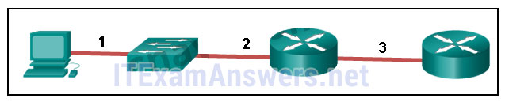
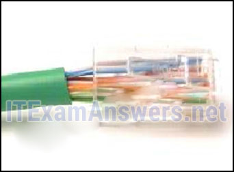
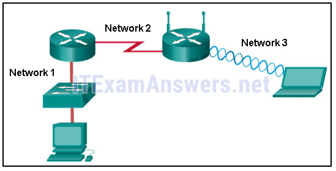
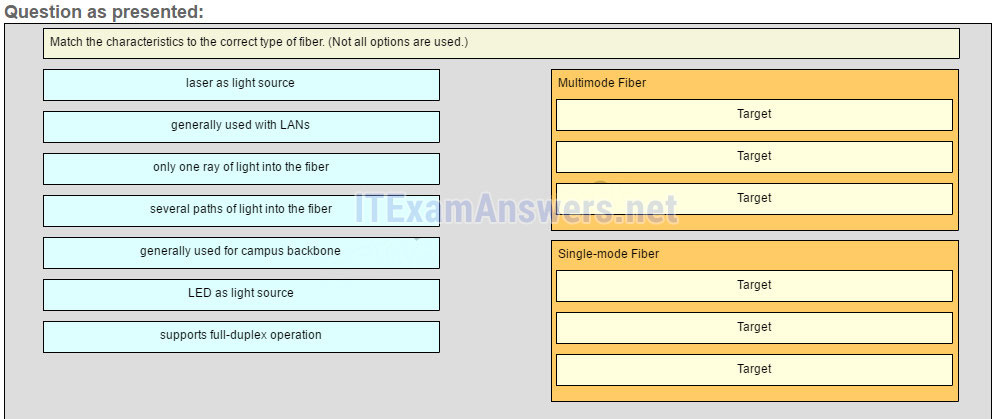
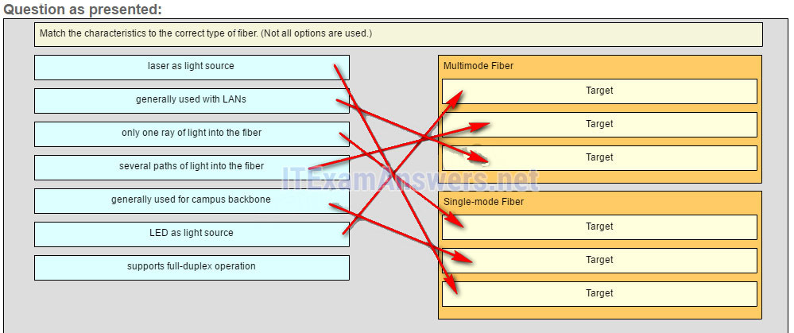
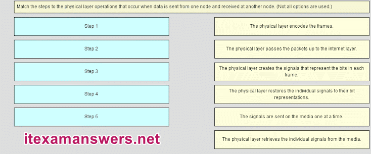
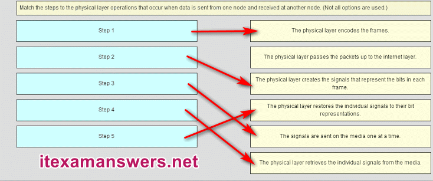
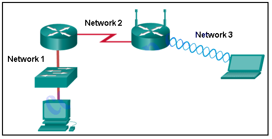

# CCNA 1 v2 - CCNA 1 - Chapter 4

## Question 1

**Question:**
What are two reasons for physical layer protocols to use frame encoding techniques? (Choose two.)

**Choices:**
- **A.** to reduce the number of collisions on the media
- **B.** to distinguish data bits from control bits
- **C.** to provide better media error correction
- **D.** to identify where the frame starts and ends
- **E.** to increase the media throughput
- **F.** to distinguish data from control information

**Correct Answer:**
to distinguish data bits from control bits; to identify where the frame starts and ends

**Explanation:**
An encoding technique converts a stream of data bits in a predefined code that can be recognized by both the transmitter and the receiver. Using predefined patterns helps to differentiate data bits from control bits and provide better media error detection.

---

## Question 2

**Question:**
What is indicated by the term throughput?

**Choices:**
- **A.** the guaranteed data transfer rate offered by an ISP
- **B.** the capacity of a particular medium to carry data
- **C.** the measure of the usable data transferred across the media
- **D.** the measure of the bits transferred across the media over a given period of time
- **E.** the time it takes for a message to get from sender to receiver

**Correct Answer:**
the measure of the bits transferred across the media over a given period of time

**Explanation:**
Throughput is the measure of the transfer of bits across the media over a given period of time. Throughput is affected by a number of factors such as, EMI and latency, so it rarely matches the specified bandwidth for a network medium. The throughput measurement includes user data bits and other data bits, such as overhead, acknowledging, and encapsulation. The measure of the usable data transferred across the media is called goodput.

---

## Question 3

**Question:**
A network administrator notices that some newly installed Ethernet cabling is carrying corrupt and distorted data signals. The new cabling was installed in the ceiling close to fluorescent lights and electrical equipment. Which two factors may interfere with the copper cabling and result in signal distortion and data corruption? (Choose two.)

**Choices:**
- **A.** EMI
- **B.** crosstalk
- **C.** RFI
- **D.** signal attenuation
- **E.** extended length of cabling

**Correct Answer:**
EMI; RFI

**Explanation:**
EMI and RFI signals can distort and corrupt data signals that are carried by copper media. These distortions usually come from radio waves and electromagnetic devices such as motors and florescent lights. Crosstalk is a disturbance that is caused by adjacent wires bundled too close together with the magnetic field of one wire affecting another. Signal attenuation is caused when an electrical signal begins to deteriorate over the length of a copper cable.

---

## Question 4

**Question:**
Which characteristic describes crosstalk?

**Choices:**
- **A.** the distortion of the network signal from fluorescent lighting
- **B.** the distortion of the transmitted messages from signals carried in adjacent wires
- **C.** the weakening of the network signal over long cable lengths
- **D.** the loss of wireless signal over excessive distance from the access point

**Correct Answer:**
the distortion of the transmitted messages from signals carried in adjacent wires

**Explanation:**
EMI and RFI can distort network signals because of interference from fluorescent lights or electric motors. Attenuation results in deterioration of the network signal as it travels along copper cabling. Wireless devices can experience loss of signals because of excessive distances from a access point, but this is not crosstalk. Crosstalk is the disturbance caused by the electric or magnetic fields of the signal carried on an adjacent wire within the same cable.

---

## Question 5

**Question:**
What technique is used with UTP cable to help protect against signal interference from crosstalk?

**Choices:**
- **A.** twisting the wires together into pairs
- **B.** wrapping a foil shield around the wire pairs
- **C.** encasing the cables within a flexible plastic sheath
- **D.** terminating the cable with special grounded connectors

**Correct Answer:**
twisting the wires together into pairs

**Explanation:**
To help prevent the effects of crosstalk, UTP cable wires are twisted together into pairs. Twisting the wires together causes the magnetic fields of each wire to cancel each other out.

---

## Question 6

**Question:**
Refer to the exhibit. The PC is connected to the console port of the switch. All the other connections are made through FastEthernet links. Which types of UTP cables can be used to connect the devices?

**Images:**

**Choices:**
- **A.** 1 – rollover, 2 – crossover, 3 – straight-through
- **B.** 1 – rollover, 2 – straight-through, 3 – crossover
- **C.** 1 – crossover, 2 – straight-through, 3 – rollover
- **D.** 1 – crossover, 2 – rollover, 3 – straight-through

**Correct Answer:**
1 – rollover, 2 – straight-through, 3 – crossover

**Explanation:**
A straight-through cable is commonly used to interconnect a host to a switch and a switch to a router. A crossover cable is used to interconnect similar devices together like switch to a switch, a host to a host, or a router to a router. If a switch has the MDIX capability, a crossover could be used to connect the switch to the router; however, that option is not available. A rollover cable is used to connect to a router or switch console port.

---

## Question 7

**Question:**
Refer to the exhibit. What is wrong with the displayed termination?

**Images:**

**Choices:**
- **A.** The woven copper braid should not have been removed.
- **B.** The wrong type of connector is being used.
- **C.** The untwisted length of each wire is too long.
- **D.** The wires are too thick for the connector that is used.

**Correct Answer:**
The untwisted length of each wire is too long.

**Explanation:**
When a cable to an RJ-45 connector is terminated, it is important to ensure that the untwisted wires are not too long and that the flexible plastic sheath surrounding the wires is crimped down and not the bare wires. None of the colored wires should be visible from the bottom of the jack.

---

## Question 8

**Question:**
Which type of connector does a network interface card use?

**Choices:**
- **A.** DIN
- **B.** PS-2
- **C.** RJ-11
- **D.** RJ-45

**Correct Answer:**
RJ-45

---

## Question 9

**Question:**
What is one advantage of using fiber optic cabling rather than copper cabling?

**Choices:**
- **A.** It is usually cheaper than copper cabling.
- **B.** It is able to be installed around sharp bends.
- **C.** It is easier to terminate and install than copper cabling.
- **D.** It is able to carry signals much farther than copper cabling.

**Correct Answer:**
It is able to carry signals much farther than copper cabling.

**Explanation:**
Copper cabling is usually cheaper and easier to install than fiber optic cabling. However, fiber cables generally have a much greater signaling range than copper.

---

## Question 10

**Question:**
Why are two strands of fiber used for a single fiber optic connection?

**Choices:**
- **A.** The two strands allow the data to travel for longer distances without degrading.
- **B.** They prevent crosstalk from causing interference on the connection.
- **C.** They increase the speed at which the data can travel.
- **D.** They allow for full-duplex connectivity.

**Correct Answer:**
They allow for full-duplex connectivity.

**Explanation:**
Light can only travel in one direction down a single strand of fiber. In order to allow for full-duplex communication two strands of fiber must be connected between each device.

---

## Question 11

**Question:**
A network administrator is designing the layout of a new wireless network. Which three areas of concern should be accounted for when building a wireless network? (Choose three.)

**Choices:**
- **A.** mobility options
- **B.** security
- **C.** interference
- **D.** coverage area
- **E.** extensive cabling
- **F.** packet collision

**Correct Answer:**
security; interference; coverage area

**Explanation:**
The three areas of concern for wireless networks focus on the size of the coverage area, any nearby interference, and providing network security. Extensive cabling is not a concern for wireless networks, as a wireless network will require minimal cabling for providing wireless access to hosts. Mobility options are not a component of the areas of concern for wireless networks.

---

## Question 12

**Question:**
Which layer of the OSI model is responsible for specifying the encapsulation method used for specific types of media?

**Choices:**
- **A.** application
- **B.** transport
- **C.** data link
- **D.** physical

**Correct Answer:**
data link

**Explanation:**
Encapsulation is a function of the data link layer. Different media types require different data link layer encapsulation.

---

## Question 13

**Question:**
What are two services performed by the data link layer of the OSI model? (Choose two.)

**Choices:**
- **A.** It encrypts data packets.
- **B.** It determines the path to forward packets.
- **C.** It accepts Layer 3 packets and encapsulates them into frames.
- **D.** It provides media access control and performs error detection.
- **E.** It monitors the Layer 2 communication by building a MAC address table.

**Correct Answer:**
It accepts Layer 3 packets and encapsulates them into frames.; It provides media access control and performs error detection.

**Explanation:**
The data link layer is responsible for the exchange of frames between nodes over a physical network media. Specifically the data link layer performs two basic services: It accepts Layer 3 packets and encapsulates them into frames. It provides media access control and performs error detection. Path determination is a service provided at Layer 3. A Layer 2 switch builds a MAC address table as part of its operation, but path determination is not the service that is provided by the data link layer.

---

## Question 14

**Question:**
What is true concerning physical and logical topologies?

**Choices:**
- **A.** The logical topology is always the same as the physical topology.
- **B.** Physical topologies are concerned with how a network transfers frames.
- **C.** Physical topologies display the IP addressing scheme of each network.
- **D.** Logical topologies refer to how a network transfers data between devices.

**Correct Answer:**
Logical topologies refer to how a network transfers data between devices.

**Explanation:**
Physical topologies show the physical interconnection of devices. Logical topologies show the way the network will transfer data between connected nodes.

---

## Question 15

**Question:**
Which method of data transfer allows information to be sent and received at the same time?

**Choices:**
- **A.** full duplex
- **B.** half duplex
- **C.** multiplex
- **D.** simplex

**Correct Answer:**
full duplex

---

## Question 16

**Question:**
Which statement describes an extended star topology?

**Choices:**
- **A.** End devices connect to a central intermediate device, which in turn connects to other central intermediate devices.
- **B.** End devices are connected together by a bus and each bus connects to a central intermediate device.
- **C.** Each end system is connected to its respective neighbor via an intermediate device.
- **D.** All end and intermediate devices are connected in a chain to each other.

**Correct Answer:**
End devices connect to a central intermediate device, which in turn connects to other central intermediate devices.

**Explanation:**
In an extended star topology, central intermediate devices interconnect other star topologies.

---

## Question 17

**Question:**
Refer to the exhibit. Which statement describes the media access control methods that are used by the networks in the exhibit?

**Images:**

**Choices:**
- **A.** All three networks use CSMA/CA
- **B.** None of the networks require media access control.
- **C.** Network 1 uses CSMA/CD and Network 3 uses CSMA/CA.
- **D.** Network 1 uses CSMA/CA and Network 2 uses CSMA/CD.
- **E.** Network 2 uses CSMA/CA and Network 3 uses CSMA/CD.

**Correct Answer:**
Network 1 uses CSMA/CD and Network 3 uses CSMA/CA.

**Explanation:**
Network 1 represents an Ethernet LAN. Data on the wired LAN accesses the media using CSMA/CD. Network 2 represents a point-to-point WAN connection so no media access method is required. Network 3 represents a WLAN and data accesses the network using CSMA/CA.

---

## Question 18

**Question:**
What is contained in the trailer of a data-link frame?

**Choices:**
- **A.** logical address
- **B.** physical address
- **C.** data
- **D.** error detection

**Correct Answer:**
error detection

**Explanation:**
The trailer in a data-link frame contains error detection information that is pertinent to the frame included in the FCS field. The header contains control information, such as the addressing, while the area that is indicated by the word “data” includes the data, transport layer PDU, and the IP header.

---

## Question 19

**Question:**
As data travels on the media in a stream of 1s and 0s how does a receiving node identify the beginning and end of a frame?

**Choices:**
- **A.** The transmitting node inserts start and stop bits into the frame.
- **B.** The transmitting node sends a beacon to notify that a data frame is attached.
- **C.** The receiving node identifies the beginning of a frame by seeing a physical address.
- **D.** The transmitting node sends an out-of-band signal to the receiver about the beginning of the frame.

**Correct Answer:**
The transmitting node inserts start and stop bits into the frame.

**Explanation:**
When data travels on the media, it is converted into a stream of 1s and 0s. The framing process inserts into the frame start and stop indicator flags so that the destination can detect the beginning and end of the frame.

---

## Question 20

**Question:**
What is a role of the Logical Link Control sublayer?

**Choices:**
- **A.** to provide data link layer addressing
- **B.** to provide access to various Layer 1 network technologies
- **C.** to define the media access processes performed by network hardware
- **D.** to mark frames to identify the network layer protocol being carried

**Correct Answer:**
to mark frames to identify the network layer protocol being carried

**Explanation:**
There are two data link sublayers, MAC and LLC. The LLC sublayer is responsible for communicating with the network layer and for tagging frames to identify what Layer 3 protocol is encapsulated.

---

## Question 21

**Question:**
What is the definition of bandwidth?

**Choices:**
- **A.** the measure of usable data transferred over a given period of time
- **B.** the speed at which bits travel on the network
- **C.** the measure of the transfer of bits across the media over a given period of time
- **D.** the amount of data that can flow from one place to another in a given amount of time

**Correct Answer:**
the amount of data that can flow from one place to another in a given amount of time

**Explanation:**
Bandwidth is the measure of the capacity of a network medium to carry data. It is the amount of data that can move between two points on the network over a specific period of time, typically one second.

---

## Question 22

**Question:**
What is the function of the CRC value that is found in the FCS field of a frame?

**Choices:**
- **A.** to verify the integrity of the received frame
- **B.** to verify the physical address in the frame
- **C.** to verify the logical address in the frame
- **D.** to compute the checksum header for the data field in the frame

**Correct Answer:**
to verify the integrity of the received frame

**Explanation:**
The CRC value in the FCS field of the received frame is compared to the computed CRC value of that frame, in order to verify the integrity of the frame. If the two values do not match, then the frame is discarded.

---

## Question 23

**Question:**
Fill in the blank. The term bandwidth indicates the capacity of a medium to carry data and it is typically measured in kilobits per second (kb/s) or megabits per second (Mb/s). Explain: Bandwidth is the capacity of a medium to carry data in a given amount of time. It is typically measured in kilobits per second (kb/s) or megabits per second (Mb/s).​

---

## Question 24

**Question:**
Fill in the blank. What acronym is used to reference the data link sublayer that identifies the network layer protocol encapsulated in the frame? LLC Explain: Logical Link Control (LLC) is the data link sublayer that defines the software processes that provide services to the network layer protocols. LLC places information in the frame and that information identifies the network layer protocol that is encapsulated in the frame.

---

## Question 25

**Question:**
Match the characteristics to the correct type of fiber. (Not all options are used.) Multimode Fiber LED as light source several paths of light into the fiber generally used with LANs Single-mode Fiber only one ray of light into the fiber generally used for campus backbone laser as light source Explain: Single-mode fiber uses a laser as the light source. Its small core produces a single straight path for light and it is commonly used with campus backbones. Multimode fiber uses LEDs as the light source. Its larger core allows for multiple paths for the light. It is commonly used with LANs.

**Images:**

---

## Question 26

**Question:**
Fill in the blank. A physical topology that is a variation or combination of a point-to-point, hub and spoke, or mesh topology is commonly known as a hybrid topology. Explain: A hybrid topology is a variation or combination of a point-to-point, hub and spoke, or mesh topology. This may include a partial mesh or extended star topology.

---

## Question 27

**Question:**
What are two examples of hybrid topologies? (Choose two.)

**Choices:**
- **A.** point-to-point
- **B.** partial mesh
- **C.** extended star
- **D.** hub and spoke
- **E.** full mesh

**Correct Answer:**
partial mesh; extended star

**Explanation:**
A hybrid topology is one that is a variation or a combination of other topologies. Both partial mesh and the extended star are examples of hybrid topologies. Other Quetions

---

## Question 28

**Question:**
Which statement describes signaling at the physical layer?

**Choices:**
- **A.** Sending the signals asynchronously means that they are transmitted without a clock signal.
- **B.** In signaling, a 1 always represents voltage and a 0 always represents the absence of voltage.
- **C.** Wireless encoding includes sending a series of clicks to delimit the frames.
- **D.** Signaling is a method of converting a stream of data into a predefined code

**Correct Answer:**
Sending the signals asynchronously means that they are transmitted without a clock signal.

---

## Question 29

**Question:**
The throughput of a FastEthernet network is 80 Mb/s. The traffic overhead for establishing sessions, acknowledgments, and encapsulation is 15 Mb/s for the same time period. What is the goodput for this network?

**Choices:**
- **A.** 15 Mb/s
- **B.** 95 Mb/s
- **C.** 55 Mb/s
- **D.** 65 Mb/s
- **E.** 80 Mb/s

**Correct Answer:**
65 Mb/s

---

## Question 30

**Question:**
How is the magnetic field cancellation effect enhanced in UTP cables?

**Choices:**
- **A.** by increasing the thickness of the PVC sheath that encases all the wires
- **B.** by increasing and varying the number of twists in each wire pair
- **C.** by increasing the thickness of the copper wires
- **D.** by decreasing the number of wires that are used to carry data

**Correct Answer:**
by increasing and varying the number of twists in each wire pair

---

## Question 31

**Question:**
Which statement is correct about multimode fiber?

**Choices:**
- **A.** Multimode fiber cables carry signals from multiple connected sending devices.
- **B.** Multimode fiber commonly uses a laser as a light source.
- **C.** SC-SC patch cords are used with multimode fiber cables.
- **D.** Multimode fiber has a thinner core than single-mode fiber..

**Correct Answer:**
SC-SC patch cords are used with multimode fiber cables.

---

## Question 32

**Question:**
A network administrator is required to upgrade wireless access to end users in a building. To provide data rates up to 1.3 Gb/s and still be backward compatible with older devices, which wireless standard should be implemented?

**Choices:**
- **A.** 802.11n
- **B.** 802.11ac
- **C.** 802.11g
- **D.** 802.11b

**Correct Answer:**
802.11ac

---

## Question 33

**Question:**
What is one main characteristic of the data link layer?

**Choices:**
- **A.** It generates the electrical or optical signals that represent the 1 and 0 on the media.
- **B.** It converts a stream of data bits into a predefined code.
- **C.** It shields the upper layer protocol from being aware of the physical medium to be used in the communication.
- **D.** It accepts Layer 3 packets and decides the path by which to forward a frame to a host on a remote network.

**Correct Answer:**
It shields the upper layer protocol from being aware of the physical medium to be used in the communication.

**Explanation:**
The data link layer (Layer 2) prepares network data for the physical network and enables upper layers to access the media while remaining completely unaware of the type of physical medium used. Without this layer, higher-level protocols like IP would have to be specifically designed to connect to every possible type of media along a delivery path.

---

## Question 34

**Question:**
What are two characteristics of 802.11 wireless networks? (Choose two.)

**Choices:**
- **A.** They use CSMA/CA technology.
- **B.** They use CSMA/CD technology.
- **C.** They are collision-free networks.
- **D.** Stations can transmit at any time.
- **E.** Collisions can exist in the networks.

**Correct Answer:**
They use CSMA/CA technology.; Collisions can exist in the networks.

---

## Question 35

**Question:**
What is the purpose of the FCS field in a frame?

**Choices:**
- **A.** to obtain the MAC address of the sending node
- **B.** to verify the logical address of the sending node
- **C.** to compute the CRC header for the data field
- **D.** to determine if errors occurred in the transmission and reception

**Correct Answer:**
to determine if errors occurred in the transmission and reception

---

## Question 36

**Question:**
Fill in the blank with a number. 10,000,000,000 b/s can also be written as 10 Gb/s.

---

## Question 37

**Question:**
Match the steps to the physical layer operations that occur when data is sent from one node and received at another node. Sort elements The physical layer encodes the frames -> Step 1 The physical layer creates the signals that represent the bits in each frame -> Step 2 The signals are sent on the media one at a time. -> Step 3 The physical layer retrieves the individual signals from the media -> Step 4 The physical layer restores the individual signals to their bit representations -> Step 5

**Images:**

---

## Question 38

**Question:**
Refer to the exhibit. Which statement describes the media access control methods that are used by the networks in the exhibit? All three networks use CSMA/CA None of the networks require media access control. Network 1 uses CSMA/CD and Network 3 uses CSMA/CA. Network 1 uses CSMA/CA and Network 2 uses CSMA/CD. Network 2 uses CSMA/CA and Network 3 uses CSMA/CD. Download PDF File below: ITexamanswers.net – CCNA 1 (v5.1 + v6.0) Chapter 4 Exam Answers Full.pdf 1.26 MB 32814 downloads

**Images:**

---
