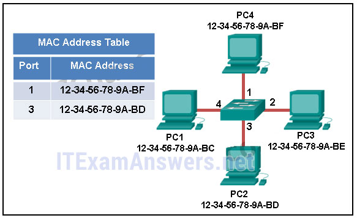
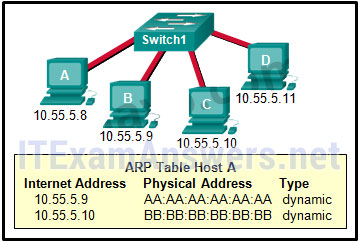
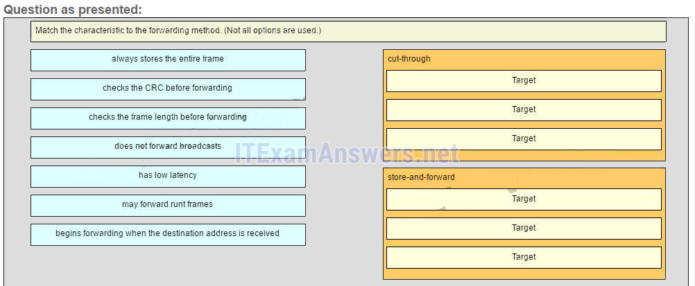
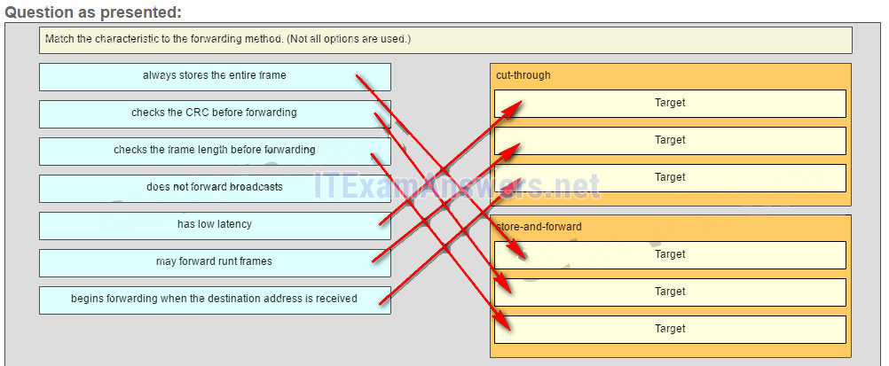
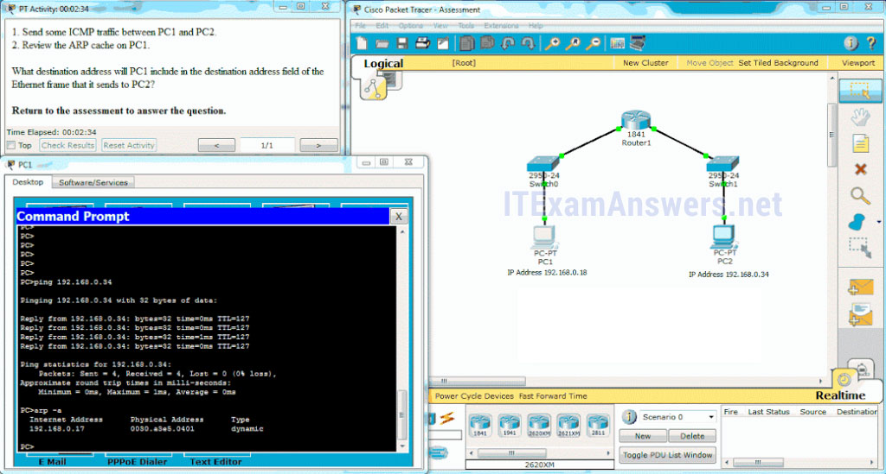
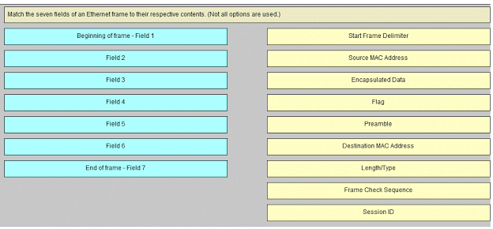
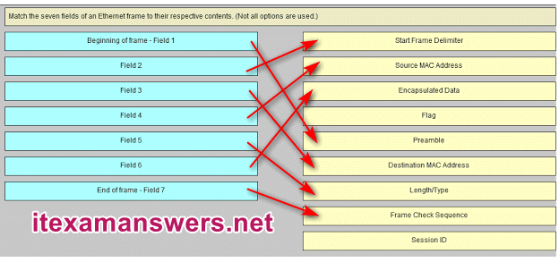

# CCNA 1 v2 - CCNA 1 - Chapter 5

## Question 1

**Question:**
What happens to runt frames received by a Cisco Ethernet switch?

**Choices:**
- **A.** The frame is dropped.
- **B.** The frame is returned to the originating network device.
- **C.** The frame is broadcast to all other devices on the same network.
- **D.** The frame is sent to the default gateway.

**Correct Answer:**
The frame is dropped.

**Explanation:**
In an attempt to conserve bandwidth and not forward useless frames, Ethernet devices drop frames that are considered to be runt (less than 64 bytes) or jumbo (greater than 1500 bytes) frames.

---

## Question 2

**Question:**
What are the two sizes (minimum and maximum) of an Ethernet frame? (Choose two.)

**Choices:**
- **A.** 56 bytes
- **B.** 64 bytes
- **C.** 128 bytes
- **D.** 1024 bytes
- **E.** 1518 bytes

**Correct Answer:**
64 bytes; 1518 bytes

**Explanation:**
The minimum Ethernet frame is 64 bytes. The maximum Ethernet frame is 1518 bytes. A network technician must know the minimum and maximum frame size in order to recognize runt and jumbo frames.

---

## Question 3

**Question:**
What statement describes Ethernet?

**Choices:**
- **A.** It defines the most common LAN type in the world.
- **B.** It is the required Layer 1 and 2 standard for Internet communication.
- **C.** It defines a standard model used to describe how networking works.
- **D.** It connects multiple sites such as routers located in different countries.

**Correct Answer:**
It defines the most common LAN type in the world.

**Explanation:**
Ethernet is the most common LAN protocol in the world. It operates at Layer 1 and 2, but is not required for Internet communication. The OSI model is used to describe how networks operate. A WAN connects multiple sites located in different countries.

---

## Question 4

**Question:**
Which two statements describe features or functions of the logical link control sublayer in Ethernet standards? (Choose two.)

**Choices:**
- **A.** Logical link control is implemented in software.
- **B.** Logical link control is specified in the IEEE 802.3 standard.
- **C.** The LLC sublayer adds a header and a trailer to the data.
- **D.** The data link layer uses LLC to communicate with the upper layers of the protocol suite.
- **E.** The LLC sublayer is responsible for the placement and retrieval of frames on and off the media.

**Correct Answer:**
Logical link control is implemented in software.; The data link layer uses LLC to communicate with the upper layers of the protocol suite.

**Explanation:**
Logical link control is implemented in software and enables the data link layer to communicate with the upper layers of the protocol suite. Logical link control is specified in the IEEE 802.2 standard. IEEE 802.3 is a suite of standards that define the different Ethernet types. The MAC (Media Access Control) sublayer is responsible for the placement and retrieval of frames on and off the media. The MAC sublayer is also responsible for adding a header and a trailer to the network layer protocol data unit (PDU).

---

## Question 5

**Question:**
What statement describes a characteristic of MAC addresses?

**Choices:**
- **A.** They must be globally unique.
- **B.** They are only routable within the private network.
- **C.** They are added as part of a Layer 3 PDU.
- **D.** They have a 32-bit binary value.

**Correct Answer:**
They must be globally unique.

**Explanation:**
Any vendor selling Ethernet devices must register with the IEEE to ensure the vendor is assigned a unique 24-bit code, which becomes the first 24 bits of the MAC address. The last 24 bits of the MAC address are generated per hardware device. This helps to ensure globally unique addresses for each Ethernet device.

---

## Question 6

**Question:**
Which statement is true about MAC addresses?

**Choices:**
- **A.** MAC addresses are implemented by software.
- **B.** A NIC only needs a MAC address if connected to a WAN.
- **C.** The first three bytes are used by the vendor assigned OUI.
- **D.** The ISO is responsible for MAC addresses regulations.

**Correct Answer:**
The first three bytes are used by the vendor assigned OUI.

**Explanation:**
A MAC address is composed of 6 bytes. The first 3 bytes are used for vendor identification and the last 3 bytes must be assigned a unique value within the same OUI. MAC addresses are implemented in hardware. A NIC needs a MAC address to communicate over the LAN. The IEEE regulates the MAC addresses.

---

## Question 7

**Question:**
Which destination address is used in an ARP request frame?

**Choices:**
- **A.** 0.0.0.0
- **B.** 255.255.255.255
- **C.** FFFF.FFFF.FFFF
- **D.** 127.0.0.1
- **E.** 01-00-5E-00-AA-23

**Correct Answer:**
FFFF.FFFF.FFFF

**Explanation:**
The purpose of an ARP request is to find the MAC address of the destination host on an Ethernet LAN. The ARP process sends a Layer 2 broadcast to all devices on the Ethernet LAN. The frame contains the IP address of the destination and the broadcast MAC address, FFFF.FFFF.FFFF.

---

## Question 8

**Question:**
What addressing information is recorded by a switch to build its MAC address table?

**Choices:**
- **A.** the destination Layer 3 address of incoming packets
- **B.** the destination Layer 2 address of outgoing frames
- **C.** the source Layer 3 address of outgoing packets
- **D.** the source Layer 2 address of incoming frames

**Correct Answer:**
the source Layer 2 address of incoming frames

**Explanation:**
A switch builds a MAC address table by inspecting incoming Layer 2 frames and recording the source MAC address found in the frame header. The discovered and recorded MAC address is then associated with the port used to receive the frame.

---

## Question 9

**Question:**
Refer to the exhibit. The exhibit shows a small switched network and the contents of the MAC address table of the switch. PC1 has sent a frame addressed to PC3. What will the switch do with the frame?

**Images:**

**Choices:**
- **A.** The switch will discard the frame.
- **B.** The switch will forward the frame only to port 2.
- **C.** The switch will forward the frame to all ports except port 4.
- **D.** The switch will forward the frame to all ports.
- **E.** The switch will forward the frame only to ports 1 and 3.

**Correct Answer:**
The switch will forward the frame to all ports except port 4.

**Explanation:**
The MAC address of PC3 is not present in the MAC table of the switch. Because the switch does not know where to send the frame that is addressed to PC3, it will forward the frame to all the switch ports, except for port 4, which is the incoming port.

---

## Question 10

**Question:**
Which switching method uses the CRC value in a frame?

**Choices:**
- **A.** cut-through
- **B.** fast-forward
- **C.** fragment-free
- **D.** store-and-forward

**Correct Answer:**
store-and-forward

**Explanation:**
When the store-and-forward switching method is used, the switch receives the complete frame before forwarding it on to the destination. The cyclic redundancy check (CRC) part of the trailer is used to determine if the frame has been modified during transit.​​ In contrast, a cut-through switch forwards the frame once the destination Layer 2 address is read. Two types of cut-through switching methods are fast-forward and fragment-free.

---

## Question 11

**Question:**
What is auto-MDIX?

**Choices:**
- **A.** a type of Cisco switch
- **B.** an Ethernet connector type
- **C.** a type of port on a Cisco switch
- **D.** a feature that detects Ethernet cable type

**Correct Answer:**
a feature that detects Ethernet cable type

**Explanation:**
Auto-MDIX is a feature that is enabled on the latest Cisco switches and that allows the switch to detect and use whatever type of cable is attached to a specific port.​​

---

## Question 12

**Question:**
Refer to the exhibit. PC1 issues an ARP request because it needs to send a packet to PC2. In this scenario, what will happen next?

**Images:**

**Choices:**
- **A.** PC2 will send an ARP reply with its MAC address.
- **B.** RT1 will send an ARP reply with its Fa0/0 MAC address.
- **C.** RT1 will send an ARP reply with the PC2 MAC address.
- **D.** SW1 will send an ARP reply with the PC2 MAC address.
- **E.** SW1 will send an ARP reply with its Fa0/1 MAC address.

**Correct Answer:**
PC2 will send an ARP reply with its MAC address.

**Explanation:**
When a network device wants to communicate with another device on the same network, it sends a broadcast ARP request. In this case, the request will contain the IP address of PC2. The destination device (PC2) sends an ARP reply with its MAC address.

---

## Question 13

**Question:**
What is the aim of an ARP spoofing attack?

**Choices:**
- **A.** to associate IP addresses to the wrong MAC address
- **B.** to overwhelm network hosts with ARP requests
- **C.** to flood the network with ARP reply broadcasts
- **D.** to fill switch MAC address tables with bogus addresses

**Correct Answer:**
to associate IP addresses to the wrong MAC address

**Explanation:**
In an ARP spoofing attack, a malicious host intercepts ARP requests and replies to them so that network hosts will map an IP address to the MAC address of the malicious host.

---

## Question 14

**Question:**
What is a characteristic of port-based memory buffering?

**Choices:**
- **A.** Frames in the memory buffer are dynamically linked to destination ports.
- **B.** All frames are stored in a common memory buffer.
- **C.** Frames are buffered in queues linked to specific ports.
- **D.** All ports on a switch share a single memory buffer.

**Correct Answer:**
Frames are buffered in queues linked to specific ports.

**Explanation:**
Buffering is a technique used by Ethernet switches to store frames until they can be transmitted. With port-based buffering, frames are stored in queues that are linked to specific incoming and outgoing ports.

---

## Question 15

**Question:**
What is the minimum Ethernet frame size that will not be discarded by the receiver as a runt frame?

**Choices:**
- **A.** 64 bytes
- **B.** 512 bytes
- **C.** 1024 bytes
- **D.** 1500 bytes

**Correct Answer:**
64 bytes

---

## Question 16

**Question:**
What are two potential network problems that can result from ARP operation? (Choose two.)

**Choices:**
- **A.** Manually configuring static ARP associations could facilitate ARP poisoning or MAC address spoofing.
- **B.** On large networks with low bandwidth, multiple ARP broadcasts could cause data communication delays.
- **C.** Network attackers could manipulate MAC address and IP address mappings in ARP messages with the intent of intercepting network traffic.
- **D.** Large numbers of ARP request broadcasts could cause the host MAC address table to overflow and prevent the host from communicating on the network.
- **E.** Multiple ARP replies result in the switch MAC address table containing entries that match the MAC addresses of hosts that are connected to the relevant switch port.

**Correct Answer:**
On large networks with low bandwidth, multiple ARP broadcasts could cause data communication delays.; Network attackers could manipulate MAC address and IP address mappings in ARP messages with the intent of intercepting network traffic.

**Explanation:**
Large numbers of ARP broadcast messages could cause momentary data communications delays. Network attackers could manipulate MAC address and IP address mappings in ARP messages with the intent to intercept network traffic. ARP requests and replies cause entries to be made into the ARP table, not the MAC address table. ARP table overflows are very unlikely. Manually configuring static ARP associations is a way to prevent, not facilitate, ARP poisoning and MAC address spoofing. Multiple ARP replies resulting in the switch MAC address table containing entries that match the MAC addresses of connected nodes and are associated with the relevant switch port are required for normal switch frame forwarding operations. It is not an ARP caused network problem.

---

## Question 17

**Question:**
Fill in the blank. A collision fragment, also known as a RUNT frame, is a frame of fewer than 64 bytes in length. Explain: A runt frame is a frame of fewer than 64 bytes, usually generated by a collision or a network interface failure.

---

## Question 18

**Question:**
Fill in the blank. On a Cisco switch, port-based memory buffering is used to buffer frames in queues linked to specific incoming and outgoing ports.

---

## Question 19

**Question:**
Fill in the blank. ARP spoofing is a technique that is used to send fake ARP messages to other hosts in the LAN. The aim is to associate IP addresses to the wrong MAC addresses. Explain: ARP spoofing or ARP poisoning is a technique used by an attacker to reply to an ARP request for an IPv4 address belonging to another device, such as the default gateway.

---

## Question 20

**Question:**
Which statement describes the treatment of ARP requests on the local link?

**Choices:**
- **A.** They must be forwarded by all routers on the local network.
- **B.** They are received and processed by every device on the local network.
- **C.** They are dropped by all switches on the local network.
- **D.** They are received and processed only by the target device.

**Correct Answer:**
They are received and processed by every device on the local network.

---

## Question 21

**Question:**
Refer to the exhibit. The switches are in their default configuration. Host A needs to communicate with host D, but host A does not have the MAC address for its default gateway. Which network hosts will receive the ARP request sent by host A?

**Images:**

**Choices:**
- **A.** only host D
- **B.** only router R1
- **C.** only hosts A, B, and C
- **D.** only hosts A, B, C, and D
- **E.** only hosts B and C
- **F.** only hosts B, C, and router R1

**Correct Answer:**
only hosts B, C, and router R1

**Explanation:**
Since host A does not have the MAC address of the default gateway in its ARP table, host A sends an ARP broadcast. The ARP broadcast would be sent to every device on the local network. Hosts B, C, and router R1 would receive the broadcast. Router R1 would not forward the message.

---

## Question 22

**Question:**
Refer to the exhibit. A switch with a default configuration connects four hosts. The ARP table for host A is shown. What happens when host A wants to send an IP packet to host D?

**Images:**

**Choices:**
- **A.** Host A sends an ARP request to the MAC address of host D.
- **B.** Host D sends an ARP request to host A.
- **C.** Host A sends out the packet to the switch. The switch sends the packet only to the host D, which in turn responds.
- **D.** Host A sends out a broadcast of FF:FF:FF:FF:FF:FF. Every other host connected to the switch receives the broadcast and host D responds with its MAC address.

**Correct Answer:**
Host A sends out a broadcast of FF:FF:FF:FF:FF:FF. Every other host connected to the switch receives the broadcast and host D responds with its MAC address.

**Explanation:**
Whenever the destination MAC address is not contained within the ARP table of the originating host, the host (host A in this example) will send a Layer 2 broadcast that has a destination MAC address of FF:FF:FF:FF:FF:FF. All devices on the same network receive this broadcast. Host D will respond to this broadcast.

---

## Question 23

**Question:**
True or False? When a device is sending data to another device on a remote network, the Ethernet frame is sent to the MAC address of the default gateway.

**Choices:**
- **A.** true
- **B.** false

**Correct Answer:**
true

**Explanation:**
A MAC address is only useful on the local Ethernet network. When data is destined for a remote network of any type, the data is sent to the default gateway device, the Layer 3 device that routes for the local network.

---

## Question 24

**Question:**
The ARP table in a switch maps which two types of address together?

**Choices:**
- **A.** Layer 3 address to a Layer 2 address
- **B.** Layer 3 address to a Layer 4 address
- **C.** Layer 4 address to a Layer 2 address
- **D.** Layer 2 address to a Layer 4 address

**Correct Answer:**
Layer 3 address to a Layer 2 address

**Explanation:**
The switch ARP table keeps a mapping of Layer 2 MAC addresses to Layer 3 IP addresses. These mappings can be learned by the switch dynamically through ARP or statically through manual configuration.

---

## Question 25

**Question:**
Match the characteristic to the forwarding method. (Not all options are used.) Explain: A store-and-forward switch always stores the entire frame before forwarding, and checks its CRC and frame length. A cut-through switch can forward frames before receiving the destination address field, thus presenting less latency than a store-and-forward switch. Because the frame can begin to be forwarded before it is completely received, the switch may transmit a corrupt or runt frame. All forwarding methods require a Layer 2 switch to forward broadcast frames. Other Questions

**Images:**

---

## Question 26

**Question:**
What is a characteristic of a contention-based access method?

**Choices:**
- **A.** It processes more overhead than the controlled access methods do.
- **B.** It has mechanisms to track the turns to access the media.
- **C.** It is a nondeterministic method.
- **D.** It scales very well under heavy media use.

**Correct Answer:**
It is a nondeterministic method.

---

## Question 27

**Question:**
What is the purpose of the preamble in an Ethernet frame?

**Choices:**
- **A.** is used as a padding for data
- **B.** is used for timing synchronization
- **C.** is used to identify the source address
- **D.** is used to identify the destination address

**Correct Answer:**
is used for timing synchronization

---

## Question 28

**Question:**
What is the Layer 2 multicast MAC address that corresponds to the Layer 3 IPv4 multicast address 224.139.34.56?

**Choices:**
- **A.** 00-00-00-0B-22-38
- **B.** 01-00-5E-0B-22-38
- **C.** 01-5E-00-0B-22-38
- **D.** FE-80-00-0B-22-38
- **E.** FF-FF-FF-0B-22-38

**Correct Answer:**
01-00-5E-0B-22-38

---

## Question 29

**Question:**
Which two statements are correct about MAC and IP addresses during data transmission if NAT is not involved? (Choose two.)

**Choices:**
- **A.** A packet that has crossed four routers has changed the destination IP address four times.
- **B.** Destination MAC addresses will never change in a frame that goes across seven routers.
- **C.** Destination and source MAC addresses have local significance and change every time a frame goes from one LAN to another.
- **D.** Destination IP addresses in a packet header remain constant along the entire path to a target host.
- **E.** Every time a frame is encapsulated with a new destination MAC address, a new destination IP address is needed.

**Correct Answer:**
Destination and source MAC addresses have local significance and change every time a frame goes from one LAN to another.; Destination IP addresses in a packet header remain constant along the entire path to a target host.

**Explanation:**
IP addresses (Layer 3) represent the original source and final destination of a packet and remain constant throughout the entire path across multiple networks, provided NAT is not involved. In contrast, MAC addresses (Layer 2) have local significance only and are used to deliver a frame from one network interface to another within the same network . Every time a packet reaches a router, the Layer 2 frame is stripped off and a new frame with updated source and destination MAC addresses is created for the next segment of the journey.

---

## Question 30

**Question:**
What are two features of ARP? (Choose two.)

**Choices:**
- **A.** If a host is ready to send a packet to a local destination device and it has the IP address but not the MAC address of the destination, it generates an ARP broadcast.
- **B.** An ARP request is sent to all devices on the Ethernet LAN and contains the IP address of the destination host and its multicast MAC address.
- **C.** When a host is encapsulating a packet into a frame, it refers to the MAC address table to determine the mapping of IP addresses to MAC addresses.
- **D.** If no device responds to the ARP request, then the originating node will broadcast the data packet to all devices on the network segment.
- **E.** If a device receiving an ARP request has the destination IPv4 address, it responds with an ARP reply.

**Correct Answer:**
If a host is ready to send a packet to a local destination device and it has the IP address but not the MAC address of the destination, it generates an ARP broadcast.; If a device receiving an ARP request has the destination IPv4 address, it responds with an ARP reply.

---

## Question 31

**Question:**
A host is trying to send a packet to a device on a remote LAN segment, but there are currently no mappings in its ARP cache. How will the device obtain a destination MAC address?

**Choices:**
- **A.** It will send an ARP request for the MAC address of the destination device.
- **B.** It will send an ARP request for the MAC address of the default gateway.
- **C.** It will send the frame and use its own MAC address as the destination.
- **D.** It will send the frame with a broadcast MAC address.
- **E.** It will send a request to the DNS server for the destination MAC address.

**Correct Answer:**
It will send an ARP request for the MAC address of the default gateway.

**Explanation:**
When a source host identifies that a destination IP address resides on a remote network segment , it must forward the packet to its default gateway (the local router) to reach that destination. Because Layer 2 Ethernet frames are designed for local delivery within the same segment, the host requires the physical MAC address of the gateway’s interface to encapsulate the IP packet. If the ARP cache does not contain a mapping for the gateway’s IP address, the host initiates an ARP request specifically for the default gateway’s MAC address . The host does not request the MAC address of the final destination device, as that device is not on the local segment and cannot respond to local Layer 2 broadcast requests. Once the gateway’s MAC address is resolved and stored in the cache, the host can successfully transmit the frame to the router for further delivery across the internetwork.

---

## Question 32

**Question:**
A network administrator is connecting two modern switches using a straight-through cable. The switches are new and have never been configured. Which three statements are correct about the final result of the connection? (Choose three.)

**Choices:**
- **A.** The link between the switches will work at the fastest speed that is supported by both switches.
- **B.** The link between switches will work as full-duplex.
- **C.** If both switches support different speeds, they will each work at their own fastest speed.
- **D.** The auto-MDIX feature will configure the interfaces eliminating the need for a crossover cable.
- **E.** The connection will not be possible unless the administrator changes the cable to a crossover cable.
- **F.** The duplex capability has to be manually configured because it cannot be negotiated.

**Correct Answer:**
The link between the switches will work at the fastest speed that is supported by both switches.; The link between switches will work as full-duplex.; The auto-MDIX feature will configure the interfaces eliminating the need for a crossover cable.

---

## Question 33

**Question:**
A Layer 2 switch is used to switch incoming frames from a 1000BASE-T port to a port connected to a 100Base-T network. Which method of memory buffering would work best for this task?

**Choices:**
- **A.** port-based buffering
- **B.** level 1 cache buffering
- **C.** shared memory buffering
- **D.** fixed configuration buffering

**Correct Answer:**
shared memory buffering

---

## Question 34

**Question:**
When would a switch record multiple entries for a single switch port in its MAC address table?

**Choices:**
- **A.** when a router is connected to the switch port
- **B.** when multiple ARP broadcasts have been forwarded
- **C.** when another switch is connected to the switch port
- **D.** when the switch is configured for Layer 3 switching

**Correct Answer:**
when another switch is connected to the switch port

**Explanation:**
When another switch or a hub is connected to a switch port then frames could be received from the multiple nodes connected to the other switch or the hub. This will result in the MAC address for each of those multiple nodes to be recorded in the MAC address table against that one port. When a router is connected to a switch port, only the MAC address of the router interface would be recorded against the switch port. ARP broadcasts are used to associate MAC addresses with IP addresses and such broadcasts would not directly result in multiple MAC addresses being recorded against a single switch port. Configuring the switch to perform Layer 3 switching will not result in multiple MAC addresses being recorded against a single switch port. The ARP table associated with the Layer 3 switch port may contain multiple IP address to MAC address mappings but this is to enable the correct framing of Layer 3 packets, not the Layer 2 frame switching function.

---

## Question 35

**Question:**
Which two statements describe a fixed configuration Ethernet switch? (Choose two.)

**Choices:**
- **A.** The switch cannot be configured with multiple VLANs.
- **B.** An SVI cannot be configured on the switch.
- **C.** A fixed configuration switch may be stackable.
- **D.** The number of ports on the switch cannot be increased.
- **E.** The port density of the switch is determined by the Cisco IOS.

**Correct Answer:**
A fixed configuration switch may be stackable.; The number of ports on the switch cannot be increased.

---

## Question 36

**Question:**
How does adding an Ethernet line card affect the form factor of a switch?

**Choices:**
- **A.** by increasing the back plane switching speed
- **B.** by expanding the port density
- **C.** by making the switch stackable
- **D.** by expanding the NVRAM capacity

**Correct Answer:**
by expanding the port density

---

## Question 37

**Question:**
Which address or combination of addresses does a Layer 3 switch use to make forwarding decisions?

**Choices:**
- **A.** IP address only
- **B.** port address only
- **C.** MAC address only
- **D.** MAC and port addresses
- **E.** MAC and IP addresses

**Correct Answer:**
MAC and IP addresses

---

## Question 38

**Question:**
What statement illustrates a drawback of the CSMA/CD access method?

**Choices:**
- **A.** Deterministic media access protocols slow network performance.
- **B.** It is more complex than non-deterministic protocols.
- **C.** Collisions can decrease network performance.
- **D.** CSMA/CD LAN technologies are only available at slower speeds than other LAN technologies.

**Correct Answer:**
Collisions can decrease network performance.

---

## Question 39

**Question:**
Open the PT Activity. Perform the tasks in the activity instruction and then answer the question. What destination address will PC1 include in the destination address field of the Ethernet frame that it sends to PC2?

**Choices:**
- **A.** 192.168.0.17
- **B.** 192.168.0.34
- **C.** 0030.a3e5.0401
- **D.** 00e0.b0be.8014
- **E.** 0007.ec35.a5c6

**Correct Answer:**
0030.a3e5.0401

---

## Question 40

**Question:**
Which address or combination of addresses does a Layer 3 switch use to make forwarding decisions?

**Choices:**
- **A.** MAC and IP addresses
- **B.** MAC address only
- **C.** MAC and port addresses
- **D.** port address only
- **E.** IP address only

**Correct Answer:**
MAC and IP addresses

---

## Question 41

**Question:**
Launch PT. Hide and Save PT Open the PT Activity. Perform the tasks in the activity instruction and then answer the question. What destination address will PC1 include in the destination address field of the Ethernet frame that it sends to PC2?

**Images:**

**Choices:**
- **A.** 00e0.b0be.8014
- **B.** 0030.a3e5.0401
- **C.** 192.168.0.34
- **D.** 192.168.0.17
- **E.** 0007.ec35.a5c6

**Correct Answer:**
0030.a3e5.0401

---

## Question 42

**Question:**
How does adding an Ethernet line card affect the form factor of a switch?

**Choices:**
- **A.** by increasing the back plane switching speed
- **B.** by expanding the port density
- **C.** by expanding the NVRAM capacity
- **D.** by making the switch stackable

**Correct Answer:**
by expanding the port density

---

## Question 43

**Question:**
What statement illustrates a drawback of the CSMA/CD access method?

**Choices:**
- **A.** Collisions can decrease network performance.
- **B.** Deterministic media access protocols slow network performance.
- **C.** CSMA/CD LAN technologies are only available at slower speeds than other LAN technologies.
- **D.** It is more complex than non-deterministic protocols.

**Correct Answer:**
Collisions can decrease network performance.

---

## Question 44

**Question:**
A network administrator issues the following commands on a Layer 3 switch: What is the administrator configuring?

**Choices:**
- **A.** a Cisco Express Forwarding instance
- **B.** a routed port
- **C.** a trunk interface
- **D.** a switched virtual interface

**Correct Answer:**
a routed port

---

## Question 45

**Question:**
The binary number 0000 1010 can be expressed as “ A ” in hexadecimal. Match the seven fields of an Ethernet frame to their respective contents. (Not all options are used.) Sort elements Start Frame Delimiter -> Field 2* Source MAC Address -> Field 4* Encapsulated Data -> Field 6* Preamble -> Beginning of frame – Field 1* Destination MAC Address -> Field 3* Length/Type -> Field 5* Frame Check Sequence -> End of frame – Field 7 Download PDF File below: ITexamanswers.net – CCNA 1 (v5.1 + v6.0) Chapter 5 Exam Answers Full.pdf 1.23 MB 21986 downloads

**Images:**

---
