# CCNA 1 v2 - CCNA 1 - Chapter 6

## Question 1

**Question:**
Which characteristic of the network layer in the OSI model allows carrying packets for multiple types of communications among many hosts?

**Choices:**
- **A.** the de-encapsulation of headers from lower layers
- **B.** the selection of paths for and direct packets toward the destination
- **C.** the ability to operate without regard to the data that is carried in each packet
- **D.** the ability to manage the data transport between processes running on hosts

**Correct Answer:**
the ability to operate without regard to the data that is carried in each packet

**Explanation:**
The function of the network layer protocols specifies the packet structure and processing used to carry the data from one host to another host. The actual communication data is encapsulated in the network layer PDU. The feature of its operation without regard to the data carried in each packet allows the network layer to carry packets for multiple types of communications.

---

## Question 2

**Question:**
What are two characteristics of IP? (Choose two.)

**Choices:**
- **A.** does not require a dedicated end-to-end connection
- **B.** operates independently of the network media
- **C.** retransmits packets if errors occur
- **D.** re-assembles out of order packets into the correct order at the receiver end
- **E.** guarantees delivery of packets

**Correct Answer:**
does not require a dedicated end-to-end connection; operates independently of the network media

**Explanation:**
The Internet Protocol (IP) is a connectionless, best effort protocol. This means that IP requires no end-to-end connection nor does it guarantee delivery of packets. IP is also media independent, which means it operates independently of the network media carrying the packets.

---

## Question 3

**Question:**
When a connectionless protocol is in use at a lower layer of the OSI model, how is missing data detected and retransmitted if necessary?

**Choices:**
- **A.** Connectionless acknowledgements are used to request retransmission.
- **B.** Upper-layer connection-oriented protocols keep track of the data received and can request retransmission from the upper-level protocols on the sending host.
- **C.** Network layer IP protocols manage the communication sessions if connection-oriented transport services are not available.
- **D.** The best-effort delivery process guarantees that all packets that are sent are received.

**Correct Answer:**
Upper-layer connection-oriented protocols keep track of the data received and can request retransmission from the upper-level protocols on the sending host.

**Explanation:**
When connectionless protocols are in use at a lower layer of the OSI model, upper-level protocols may need to work together on the sending and receiving hosts to account for and retransmit lost data. In some cases, this is not necessary, because for some applications a certain amount of data loss is tolerable.

---

## Question 4

**Question:**
Which field in the IPv4 header is used to prevent a packet from traversing a network endlessly?

**Choices:**
- **A.** Time-to-Live
- **B.** Sequence Number
- **C.** Acknowledgment Number
- **D.** Differentiated Services

**Correct Answer:**
Time-to-Live

**Explanation:**
The value of the Time-to-Live (TTL) field in the IPv4 header is used to limit the lifetime of a packet. The sending host sets the initial TTL value; which is decreased by one each time the packet is processed by a router. If the TTL field decrements to zero, the router discards the packet and sends an Internet Control Message Protocol (ICMP) Time Exceeded message to the source IP address. The Differentiated Services (DS) field is used to determine the priority of each packet. Sequence Number and Acknowledgment Number are two fields in the TCP header.

---

## Question 5

**Question:**
What IPv4 header field identifies the upper layer protocol carried in the packet?

**Choices:**
- **A.** Protocol
- **B.** Identification
- **C.** Version
- **D.** Differentiated Services

**Correct Answer:**
Protocol

**Explanation:**
It is the Protocol field in the IP header that identifies the upper-layer protocol the packet is carrying. The Version field identifies the IP version. The Differential Services field is used for setting packet priority. The Identification field is used to reorder fragmented packets.

---

## Question 6

**Question:**
What is one advantage that the IPv6 simplified header offers over IPv4?

**Choices:**
- **A.** smaller-sized header
- **B.** little requirement for processing checksums
- **C.** smaller-sized source and destination IP addresses
- **D.** efficient packet handling

**Correct Answer:**
efficient packet handling

**Explanation:**
The IPv6 simplified header offers several advantages over IPv4: · Better routing efficiency and efficient packet handling for performance and forwarding-rate scalability · No requirement for processing checksums · Simplified and more efficient extension header mechanisms (as opposed to the IPv4 Options field) · A Flow Label field for per-flow processing with no need to open the transport inner packet to identify the various traffic flows

---

## Question 7

**Question:**
Refer to the exhibit. Which route from the PC1 routing table will be used to reach PC2?

**Images:**
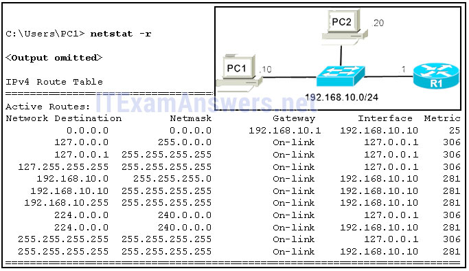
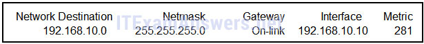
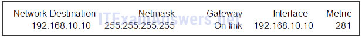
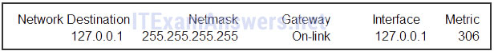
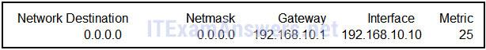

**Choices:**
- **A.** A. The graphic contains a table that has five columns. The column headings and values are as follows. The column one heading is Network Destination and the value is 192.168.10.0. The column two heading is Netmask and the value is 255.255.255.0. The column three heading is Gateway and the value is On-link. The column four heading is Interface and the value is 192.168.10.10. The column five heading is Metric and the value is 281.
- **B.** B. The graphic contains a table that has five columns. The column headings and values are as follows. The column one heading is Network Destination and the value is 192.168.10.10. The column two heading is Netmask and the value is 255.255.255.255. The column three heading is Gateway and the value is On-link. The column four heading is Interface and the value is 192.168.10.10. The column five heading is Metric and the value is 281.
- **C.** C. The graphic contains a table that has five columns. The column headings and values are as follows. The column one heading is Network Destination and the value is 127.0.0.1. The column two heading is Netmask and the value is 255.255.255.255. The column three heading is Gateway and the value is On-link. The column four heading is Interface and the value is 127.0.0.1. The column five heading is Metric and the value is 306.
- **D.** D. The graphic contains a table that has five columns. The column headings and values are as follows. The column one heading is Network Destination and the value is 0.0.0.0. The column two heading is Netmask and the value is 0.0.0.0. The column three heading is Gateway and the value is 192.168.10.1. The column four heading is Interface and the value is 192.168.10.10. The column five heading is Metric and the value is 25.

**Correct Answer:**
A

**Explanation:**
PC1 and PC2 are both on network 192.168.10.0 with mask 255.255.255.0, so there is no need to access the default gateway (entry 0.0.0.0 0.0.0.0). Entry 127.0.0.1 255.255.255.255 is the loopback interface and entry 192.168.10.10 255.255.255.255 identifies the PC1 address interface.

---

## Question 8

**Question:**
Refer to the exhibit. R1 receives a packet destined for the IP address 192.168.2.10. Out which interface will R1 forward the packet?

**Images:**
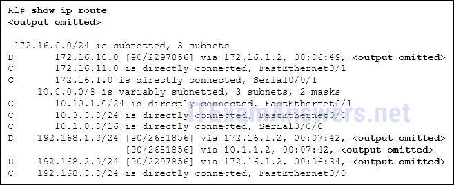

**Choices:**
- **A.** FastEthernet0/0
- **B.** FastEthernet0/1
- **C.** Serial0/0/0
- **D.** Serial0/0/1

**Correct Answer:**
Serial0/0/1

**Explanation:**
If a route in the routing table points to a next hop address, the router will perform a second lookup to determine out which interface the next hop is located.

---

## Question 9

**Question:**
What type of route is indicated by the code C in an IPv4 routing table on a Cisco router?

**Choices:**
- **A.** static route
- **B.** default route
- **C.** directly connected route
- **D.** dynamic route that is learned through EIGRP

**Correct Answer:**
directly connected route

**Explanation:**
Some of the IPv4 routing table codes include the following: C – directly connected S – static D – EIGRP * – candidate default

---

## Question 10

**Question:**
What routing table entry has a next hop address associated with a destination network?

**Choices:**
- **A.** directly-connected routes
- **B.** local routes
- **C.** remote routes
- **D.** C and L source routes

**Correct Answer:**
remote routes

**Explanation:**
Routing table entries for remote routes will have a next hop IP address. The next hop IP address is the address of the router interface of the next device to be used to reach the destination network. Directly-connected and local routes have no next hop, because they do not require going through another router to be reached.

---

## Question 11

**Question:**
Which statement describes a hardware feature of a Cisco 1941 router that has the default hardware configuration?

**Choices:**
- **A.** It does not have an AUX port.
- **B.** It has three FastEthernet interfaces for LAN access.
- **C.** It has two types of ports that can be used to access the console.
- **D.** It does not require a CPU because it relies on Compact Flash to run the IOS.

**Correct Answer:**
It has two types of ports that can be used to access the console.

**Explanation:**
The connections in a Cisco 1941 router include two types of ports that are used for initial configuration and command-line interface management access. The two ports are the regular RJ-45 port and a new USB Type-B (mini-B USB) connector. In addition, the router has an AUX port for remote management access, and two Gigabit Ethernet interfaces for LAN access. Compact Flash can be used increase device storage, but it does not perform the functions of the CPU, which is required for operation of the device.

---

## Question 12

**Question:**
Following default settings, what is the next step in the router boot sequence after the IOS loads from flash?

**Choices:**
- **A.** Perform the POST routine.
- **B.** Locate and load the startup-config file from NVRAM.
- **C.** Load the bootstrap program from ROM.
- **D.** Load the running-config file from RAM.

**Correct Answer:**
Locate and load the startup-config file from NVRAM.

**Explanation:**
There are three major steps to the router boot sequence: Perform Power-On-Self-Test (POST) Load the IOS from Flash or TFTP server Load the startup configuration file from NVRAM

---

## Question 13

**Question:**
What are two types of router interfaces? (Choose two.)

**Choices:**
- **A.** SVI
- **B.** LAN
- **C.** DHCP
- **D.** Telnet
- **E.** WAN

**Correct Answer:**
LAN; WAN

**Explanation:**
Router interfaces can be grouped into two categories: · LAN interfaces – Used for connecting cables that terminate with LAN devices, such as computers and switches. This interface can also be used to connect routers to each other. · WAN interfaces – Used for connecting routers to external networks, usually over a larger geographical distance.

---

## Question 14

**Question:**
Which two pieces of information are in the RAM of a Cisco router during normal operation? (Choose two.)

**Choices:**
- **A.** Cisco IOS
- **B.** backup IOS file
- **C.** IP routing table
- **D.** basic diagnostic software
- **E.** startup configuration file

**Correct Answer:**
Cisco IOS; IP routing table

**Explanation:**
The Cisco IOS file is stored in flash memory and copied into RAM during the boot up. The IP routing table is also stored in RAM. The basic diagnostic software is stored in ROM and the startup configuration file is stored in NVRAM.

---

## Question 15

**Question:**
A router boots and enters setup mode. What is the reason for this?

**Choices:**
- **A.** The IOS image is corrupt.
- **B.** Cisco IOS is missing from flash memory.
- **C.** The configuration file is missing from NVRAM.
- **D.** The POST process has detected hardware failure.

**Correct Answer:**
The configuration file is missing from NVRAM.

**Explanation:**
If a router cannot locate the startup-config file in NVRAM, it will enter setup mode to allow the configuration to be entered from the console device.

---

## Question 16

**Question:**
What is the purpose of the startup configuration file on a Cisco router?

**Choices:**
- **A.** to facilitate the basic operation of the hardware components of a device
- **B.** to contain the commands that are used to initially configure a router on startup
- **C.** to contain the configuration commands that the router IOS is currently using
- **D.** to provide a limited backup version of the IOS, in case the router cannot load the full featured IOS

**Correct Answer:**
to contain the commands that are used to initially configure a router on startup

**Explanation:**
The startup configuration file is stored in NVRAM and contains the commands needed to initially configure a router. It also creates the running configuration file that is stored in in RAM.

---

## Question 17

**Question:**
Which three commands are used to set up secure access to a router through a connection to the console interface? (Choose three.)

**Choices:**
- **A.** interface fastethernet 0/0
- **B.** line vty 0 4
- **C.** line console 0
- **D.** enable secret cisco
- **E.** login
- **F.** password cisco

**Correct Answer:**
line console 0; login; password cisco

**Explanation:**
The three commands needed to password protect the console port are as follows: line console 0 password cisco login Theinterface fastethernet 0/0 command is commonly used to access the configuration mode used to apply specific parameters such as the IP address to the Fa0/0 port. The line vty 0 4 command is used to access the configuration mode for Telnet. The0and 4 parameters specify ports 0 through 4, or a maximum of five simultaneous Telnet connections. The enable secret command is used to apply a password used on the router to access the privileged mode.

---

## Question 18

**Question:**
Which characteristic describes an IPv6 enhancement over IPv4?

**Choices:**
- **A.** IPv6 addresses are based on 128-bit flat addressing as opposed to IPv4 which is based on 32-bit hierarchical addressing.
- **B.** The IPv6 header is simpler than the IPv4 header is, which improves packet handling.
- **C.** Both IPv4 and IPv6 support authentication, but only IPv6 supports privacy capabilities.
- **D.** The IPv6 address space is four times bigger than the IPv4 address space.

**Correct Answer:**
The IPv6 header is simpler than the IPv4 header is, which improves packet handling.

**Explanation:**
IPv6 addresses are based on 128-bit hierarchical addressing, and the IPv6 header has been simplified with fewer fields, improving packet handling. IPv6 natively supports authentication and privacy capabilities as opposed to IPv4 that needs additional features to support those. The IPv6 address space is many times bigger than IPv4 address space.

---

## Question 19

**Question:**
Open the PT Activity. The enable password on all devices is cisco. Perform the tasks in the activity instructions and then answer the question. For what reason is the failure occurring?

**Choices:**
- **A.** PC1 has an incorrect default gateway configured.
- **B.** SW1 does not have a default gateway configured.
- **C.** The IP address of SW1 is configured in a wrong subnet.
- **D.** PC2 has an incorrect default gateway configured.

**Correct Answer:**
SW1 does not have a default gateway configured.

**Explanation:**
The ip default-gateway command is missing on the SW1 configuration. Packets from PC2 are able to successfully reach SW1, but SW1 is unable to forward reply packets beyond the local network without the ip default-gateway command issued.

---

## Question 20

**Question:**
Match the command with the device mode at which the command is entered. (Not all options are used.) Question Answer

**Images:**
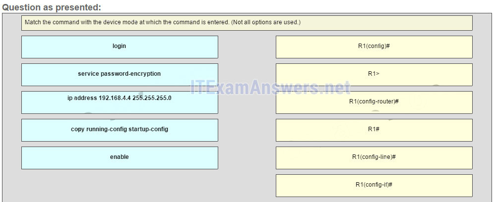
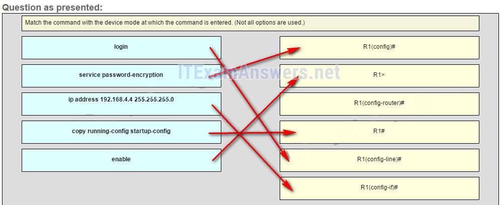

**Explanation:**
The enable command is entered in R1> mode. The login command is entered in R1(config-line)# mode. The copy running-config startup-config command is entered in R1# mode. The ip address 192.168.4.4 255.255.255.0 command is entered in R1(config-if)# mode. The service password-encryption command is entered in global configuration mode. Other Questions

---

## Question 21

**Question:**
When connectionless protocols are implemented at the lower layers of the OSI model, what are usually used to acknowledge the data receipt and request the retransmission of missing data?

**Choices:**
- **A.** connectionless acknowledgements
- **B.** upper-layer connection-oriented protocols
- **C.** Network layer IP protocols
- **D.** Transport layer UDP protocols

**Correct Answer:**
upper-layer connection-oriented protocols

---

## Question 22

**Question:**
Which IPv4 header field is responsible for defining the priority of the packet?

**Choices:**
- **A.** flow label
- **B.** flags
- **C.** differentiated services
- **D.** traffic class

**Correct Answer:**
differentiated services

**Explanation:**
Differentiated services (DiffServ) is an IPv4 header field that is used to define the priority of each packet. The first 6 bits identify the value that is used by the QoS mechanism, and the last 2 bits identify the value that can be used to avoid packet dropping during network congestion. Traffic class is an IPv6 header field that is equivalent to the IPv4 differentiated services (DiffServ) field. Flow label is also an IPv6 header field that can be used to tell routers and switches to keep the same path for the packet flow to avoid packet reordering. Flags is an IPv4 header field that identifies how the packet is fragmented.

---

## Question 23

**Question:**
Why is NAT not needed in IPv6?

**Choices:**
- **A.** Because IPv6 has integrated security, there is no need to hide the IPv6 addresses of internal networks.?
- **B.** Any host or user can get a public IPv6 network address because the number of available IPv6 addresses is extremely large.​
- **C.** The problems that are induced by NAT applications are solved because the IPv6 header improves packet handling by intermediate routers.?
- **D.** The end-to-end connectivity problems that are caused by NAT are solved because the number of routes increases with the number of nodes that are connected to the Internet.

**Correct Answer:**
Any host or user can get a public IPv6 network address because the number of available IPv6 addresses is extremely large.​

**Explanation:**
The large number of public IPv6 addresses eliminates the need for NAT. Sites from the largest enterprises to single households can get public IPv6 network addresses. This avoids some of the NAT-induced application problems that are experienced by applications that require end-to-end connectivity.

---

## Question 24

**Question:**
What is a service provided by the Flow Label field of the IPv6 header?

**Choices:**
- **A.** It limits the lifetime of a packet.
- **B.** It identifies the total length of the IPv6 packet.
- **C.** It classifies packets for traffic congestion control.
- **D.** It informs network devices to maintain the same path for real-time application packets.

**Correct Answer:**
It informs network devices to maintain the same path for real-time application packets.

---

## Question 25

**Question:**
How do hosts ensure that their packets are directed to the correct network destination?

**Choices:**
- **A.** They have to keep their own local routing table that contains a route to the loopback interface, a local network route, and a remote default route.?
- **B.** They always direct their packets to the default gateway, which will be responsible for the packet delivery.
- **C.** They search in their own local routing table for a route to the network destination address and pass this information to the default gateway.
- **D.** They send a query packet to the default gateway asking for the best route.

**Correct Answer:**
They have to keep their own local routing table that contains a route to the loopback interface, a local network route, and a remote default route.?

**Explanation:**
Hosts must maintain their own local routing table to ensure that network layer packets are directed to the correct destination network. This local table typically contains a route to the loopback interface, a route to the network that the host is connected to, and a local default route, which represents the route that packets must take to reach all remote network addresses.

---

## Question 26

**Question:**
Which two commands can be used on a Windows host to display the routing table? (Choose two.)

**Choices:**
- **A.** netstat -s
- **B.** route print
- **C.** show ip route
- **D.** netstat -r
- **E.** tracert

**Correct Answer:**
route print; netstat -r

---

## Question 27

**Question:**
During the process of forwarding traffic, what will the router do immediately after matching the destination IP address to a network on a directly connected routing table entry?

**Choices:**
- **A.** discard the traffic after consulting the route table
- **B.** look up the next-hop address for the packet
- **C.** switch the packet to the directly connected interface
- **D.** analyze the destination IP address

**Correct Answer:**
switch the packet to the directly connected interface

**Explanation:**
A router receives a packet on an interface and looks at the destination IP address. It consults its routing table and matches the destination IP address to a routing table entry. The router then discovers that it has to send the packet to the next-hop address or out to a directly connected interface. When the destination address is on a directly connected interface, the packet is switched over to that interface.

---

## Question 28

**Question:**
A technician is configuring a router that is actively running on the network. Suddenly, power to the router is lost. If the technician has not saved the configuration, which two types of information will be lost? (Choose two.)

**Choices:**
- **A.** Cisco IOS image file
- **B.** routing table
- **C.** bootstrap file
- **D.** ARP cache
- **E.** startup configuration

**Correct Answer:**
routing table; ARP cache

---

## Question 29

**Question:**
Which two interfaces will allow access via the VTY lines to configure the router? (Choose two.)

**Choices:**
- **A.** aux interfaces
- **B.** LAN interfaces
- **C.** WAN interfaces
- **D.** console interfaces
- **E.** USB interfaces

**Correct Answer:**
LAN interfaces; WAN interfaces

---

## Question 30

**Question:**
Which two files, if found, are copied into RAM as a router with the default configuration register setting boots up? (Choose two.)

**Choices:**
- **A.** running configuration
- **B.** IOS image file
- **C.** startup configuration
- **D.** POST diagnostics

**Correct Answer:**
IOS image file; startup configuration

**Explanation:**
The two primary files needed for bootup are the IOS image file and startup configuration, which are copied into RAM to maximize performance. If a router configuration register is set to 0x2102, the router will attempt to load the IOS image from flash memory and the startup configuration file from NVRAM.

---

## Question 31

**Question:**
When would the Cisco IOS image held in ROM be used to boot the router?

**Choices:**
- **A.** during a file transfer operation
- **B.** during a normal boot process
- **C.** when the full IOS cannot be found
- **D.** when the running configuration directs the router to do this

**Correct Answer:**
when the full IOS cannot be found

---

## Question 32

**Question:**
After troubleshooting a router, the network administrator wants to save the router configuration so that it will be used automatically the next time that the router reboots. What command should be issued?

**Choices:**
- **A.** copy running-config flash
- **B.** copy startup-config flash
- **C.** copy running-config startup-config
- **D.** reload
- **E.** copy startup-config running-config

**Correct Answer:**
copy running-config startup-config

---

## Question 33

**Question:**
Which three commands are used to set up a password for a person who attaches a cable to a new router so that an initial configuration can be performed? (Choose three.)

**Choices:**
- **A.** interface fastethernet 0/0
- **B.** line vty 0 4
- **C.** line console 0
- **D.** enable secret cisco
- **E.** login
- **F.** password cisco

**Correct Answer:**
line console 0; login; password cisco

---

## Question 34

**Question:**
Which statement about router interfaces is true?

**Choices:**
- **A.** Router LAN interfaces are not activated by default, but router WAN interfaces are.
- **B.** Once the no shutdown command is given, a router interface is active and operational.
- **C.** Commands that apply an IP address and subnet mask to an interface are entered in global configuration mode.
- **D.** A configured and activated router interface must be connected to another device in order to operate.

**Correct Answer:**
Once the no shutdown command is given, a router interface is active and operational.; A configured and activated router interface must be connected to another device in order to operate.

---

## Question 35

**Question:**
Which command displays a summary chart of all router interfaces, their IP addresses, and their current operational status?

**Choices:**
- **A.** show ip route
- **B.** show version
- **C.** show interfaces
- **D.** show ip interface brief

**Correct Answer:**
show ip interface brief

---

## Question 36

**Question:**
A technician is manually configuring a computer with the necessary IP parameters to communicate over the corporate network. The computer already has an IP address, a subnet mask, and a DNS server. What else has to be configured for Internet access?

**Choices:**
- **A.** the WINS server address
- **B.** the default gateway address
- **C.** the MAC address
- **D.** the domain name of the organization

**Correct Answer:**
the default gateway address

---

## Question 37

**Question:**
A computer has to send a packet to a destination host in the same LAN. How will the packet be sent?

**Choices:**
- **A.** The packet will be sent to the default gateway first, and then, depending on the response from the gateway, it may be sent to the destination host.
- **B.** The packet will be sent directly to the destination host.
- **C.** The packet will first be sent to the default gateway, and then from the default gateway it will be sent directly to the destination host.
- **D.** The packet will be sent only to the default gateway.

**Correct Answer:**
The packet will be sent directly to the destination host.

---

## Question 38

**Question:**
Refer to the exhibit. Fill in the blank. A packet leaving PC-1 has to traverse 3 hops to reach PC-4.?

**Images:**
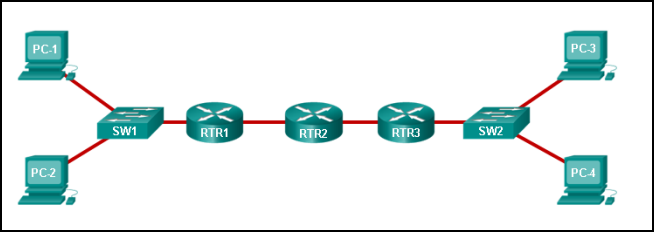

---

## Question 39

**Question:**
Fill in the blank. In a router, ROM is the nonvolatile memory where the diagnostic software, the bootup instructions, and a limited IOS are stored.

---

## Question 40

**Question:**
Refer to the exhibit. Match the packets with their destination IP address to the exiting interfaces on the router. (Not all targets are used.)

**Images:**
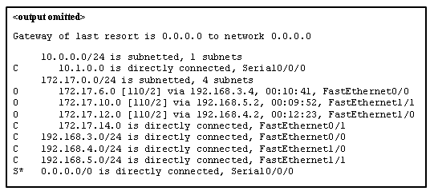
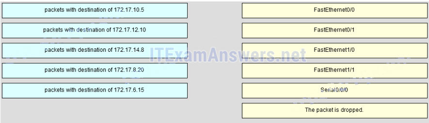
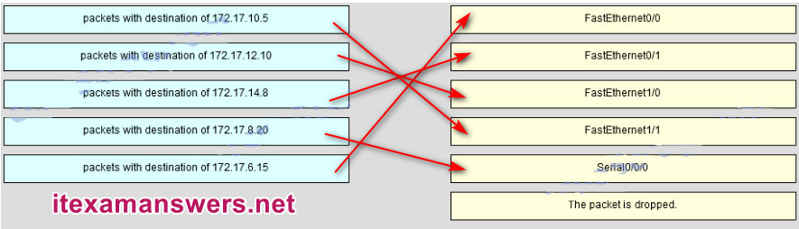

---

## Question 41

**Question:**
Open the PT Activity. Perform the tasks in the activity instructions and then answer the question or complete the task. Does the router have enough RAM and flash memory to support the new IOS?

**Choices:**
- **A.** The router has enough RAM and flash memory for the IOS upgrade.
- **B.** The router has enough RAM, but needs more flash memory for the IOS upgrade.
- **C.** The router has enough flash memory, but needs more RAM for the IOS upgrade.
- **D.** The router needs more RAM and more flash memory for the IOS upgrade.

**Correct Answer:**
The router has enough RAM and flash memory for the IOS upgrade.

---

## Question 42

**Question:**
Match the configuration mode with the command that is available in that mode. (Not all options are used.) Sort elements enable -> R1> copy running-config startup-config -> R1# login -> R1(config-line)# interface fastethernet 0/0 -> R1(config)#

**Images:**
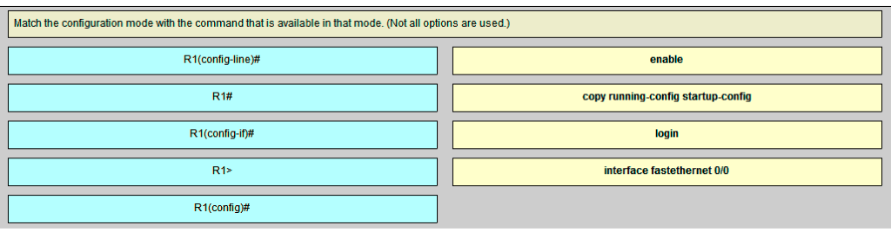
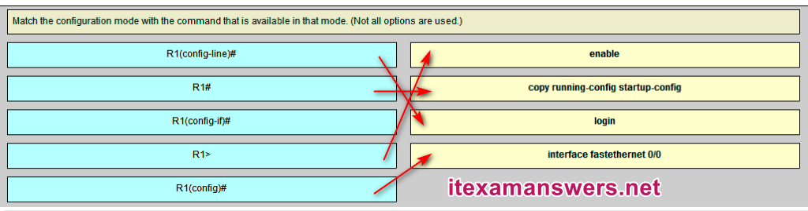

---

## Question 43

**Question:**
Match field names to the IP header where they would be found. (Not all options are used) Sort elements IP v4 Header (A) -> Flags (A) IP v4 Header (B) -> Total Length (B) IP v6 Header (C) -> Traffic Class (C) IP v6 Header (D) -> Flow Label (D)

**Images:**
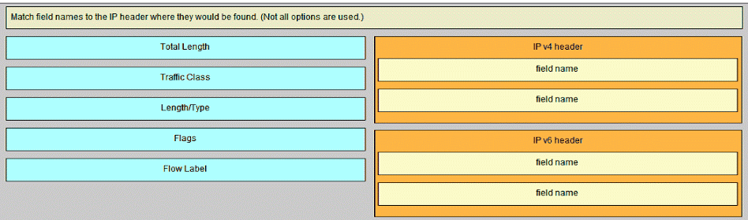
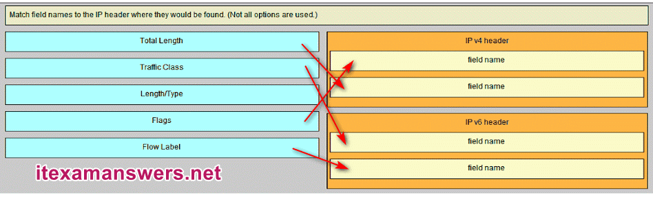

---

## Question 44

**Question:**
Which type of static route that is configured on a router uses only the exit interface?

**Choices:**
- **A.** fully specified static route
- **B.** default static route
- **C.** directly connected static route
- **D.** recursive static route

**Correct Answer:**
directly connected static route

**Explanation:**
Download PDF File below: ITexamanswers.net – CCNA 1 (v5.1 + v6.0) Chapter 6 Exam Answers Full.pdf 1.60 MB 22839 downloads

---
