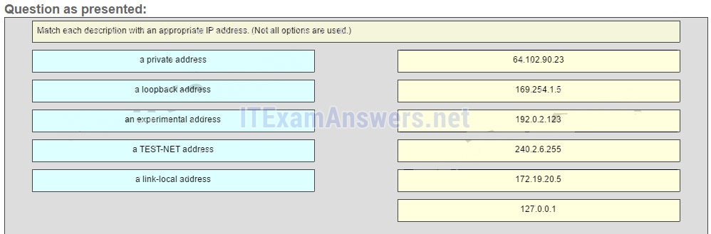
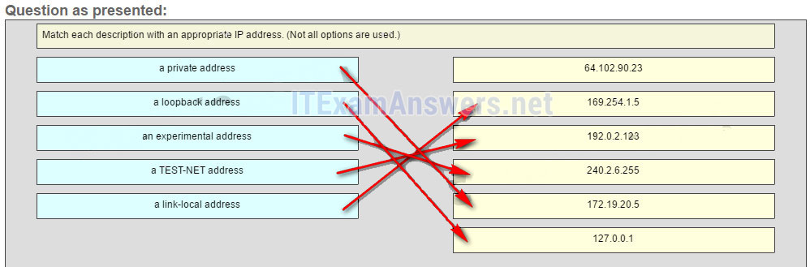
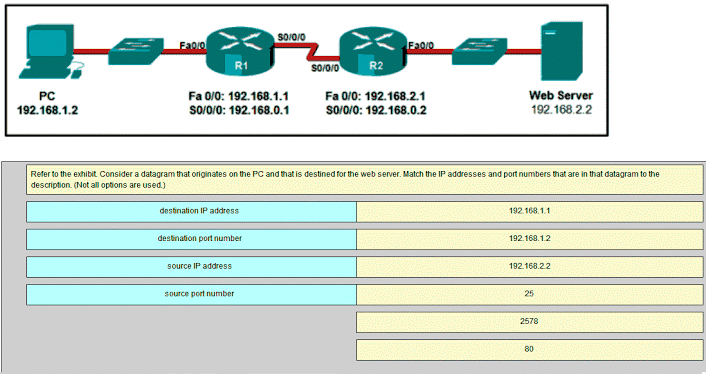
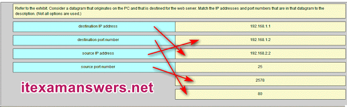
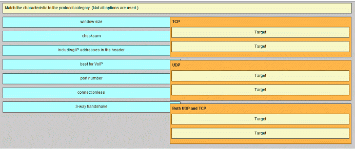
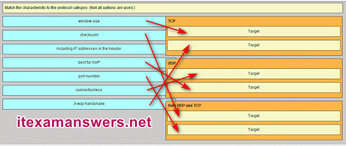
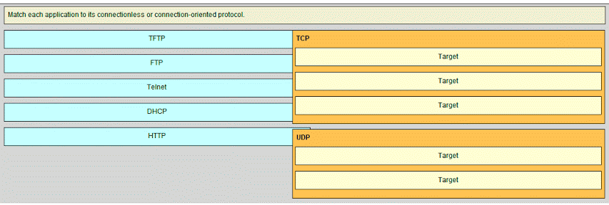
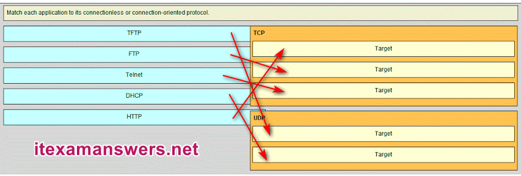

# CCNA 1 v2 - CCNA 1 - Chapter 7

## Question 1

**Question:**
How many bits are in an IPv4 address?

**Choices:**
- **A.** 32
- **B.** 64
- **C.** 128
- **D.** 256

**Correct Answer:**
32

**Explanation:**
An IPv4 address is comprised of 4 octets of binary digits, each containing 8 bits, resulting in a 32-bit address.

---

## Question 2

**Question:**
Which two parts are components of an IPv4 address? (Choose two.)

**Choices:**
- **A.** subnet portion
- **B.** network portion
- **C.** logical portion
- **D.** host portion
- **E.** physical portion
- **F.** broadcast portion

**Correct Answer:**
network portion; host portion

**Explanation:**
An IPv4 address is divided into two parts: a network portion – to identify the specific network on which a host resides, and a host portion – to identify specific hosts on a network. A subnet mask is used to identify the length of each portion.

---

## Question 3

**Question:**
What does the IP address 172.17.4.250/24 represent?

**Choices:**
- **A.** network address
- **B.** multicast address
- **C.** host address
- **D.** broadcast address

**Correct Answer:**
host address

**Explanation:**
The /24 shows that the network address is 172.17.4.0. The broadcast address for this network would be 172.17.4.255. Useable host addresses for this network are 172.17.4.1 through 172.17.4.254.

---

## Question 4

**Question:**
What is the purpose of the subnet mask in conjunction with an IP address?

**Choices:**
- **A.** to uniquely identify a host on a network
- **B.** to identify whether the address is public or private
- **C.** to determine the subnet to which the host belongs
- **D.** to mask the IP address to outsiders

**Correct Answer:**
to determine the subnet to which the host belongs

**Explanation:**
With the IPv4 address, a subnet mask is also necessary. A subnet mask is a special type of IPv4 address that coupled with the IP address determines the subnet of which the device is a member.

---

## Question 5

**Question:**
What subnet mask is represented by the slash notation /20?

**Choices:**
- **A.** 255.255.255.248
- **B.** 255.255.224.0
- **C.** 255.255.240.0
- **D.** 255.255.255.0
- **E.** 255.255.255.192

**Correct Answer:**
255.255.240.0

**Explanation:**
The slash notation /20 represents a subnet mask with 20 1s. This would translate to: 11111111.11111111.11110000.0000, which in turn would convert into 255.255.240.0.

---

## Question 6

**Question:**
A message is sent to all hosts on a remote network. Which type of message is it?

**Choices:**
- **A.** limited broadcast
- **B.** multicast
- **C.** directed broadcast
- **D.** unicast

**Correct Answer:**
directed broadcast

**Explanation:**
A directed broadcast is a message sent to all hosts on a specific network. It is useful for sending a broadcast to all hosts on a nonlocal network. A multicast message is a message sent to a selected group of hosts that are part of a subscribing multicast group. A limited broadcast is used for a communication that is limited to the hosts on the local network. A unicast message is a message sent from one host to another.

---

## Question 7

**Question:**
What are three characteristics of multicast transmission? (Choose three.)

**Choices:**
- **A.** The source address of a multicast transmission is in the range of 224.0.0.0 to 224.0.0.255.
- **B.** A single packet can be sent to a group of hosts.
- **C.** Multicast transmission can be used by routers to exchange routing information.
- **D.** The range of 224.0.0.0 to 224.0.0.255 is reserved to reach multicast groups on a local network.
- **E.** Computers use multicast transmission to request IPv4 addresses.
- **F.** Multicast messages map lower layer addresses to upper layer addresses.

**Correct Answer:**
A single packet can be sent to a group of hosts.; Multicast transmission can be used by routers to exchange routing information.; The range of 224.0.0.0 to 224.0.0.255 is reserved to reach multicast groups on a local network.

**Explanation:**
Broadcast messages consist of single packets that are sent to all hosts on a network segment. These types of messages are used to request IPv4 addresses, and map upper layer addresses to lower layer addresses. A multicast transmission is a single packet sent to a group of hosts and is used by routing protocols, such as OSPF and RIPv2, to exchange routes. The address range 224.0.0.0 to 224.0.0.255 is reserved for link-local addresses to reach multicast groups on a local network.

---

## Question 8

**Question:**
Which three IP addresses are private ? (Choose three.)

**Choices:**
- **A.** 10.1.1.1
- **B.** 172.32.5.2
- **C.** 192.167.10.10
- **D.** 172.16.4.4
- **E.** 192.168.5.5
- **F.** 224.6.6.6

**Correct Answer:**
10.1.1.1; 172.16.4.4; 192.168.5.5

**Explanation:**
The private IP addresses are within these three ranges: 10.0.0.0 – 10.255.255.255 172.16.0.0 – 172.31.255.255 192.168.0.0 – 192.168.255.255

---

## Question 9

**Question:**
Which two IPv4 to IPv6 transition techniques manage the interconnection of IPv6 domains? (Choose two.)

**Choices:**
- **A.** trunking
- **B.** dual stack
- **C.** encapsulation
- **D.** tunneling
- **E.** multiplexing

**Correct Answer:**
dual stack; tunneling

**Explanation:**
There are three techniques to allow IPv4 and IPv6 to co-exist on a network. Dual stack allows IPv4 and IPv6 to coexist on the same network segment. Dual stack devices run both IPv4 and IPv6 protocol stacks simultaneously. Tunneling is a method of transporting an IPv6 packet over an IPv4 network. The IPv6 packet is encapsulated inside an IPv4 packet, similar to other types of data. Network Address Translation 64 (NAT64) allows IPv6-enabled devices to communicate with IPv4-enabled devices using a translation technique similar to NAT for IPv4

---

## Question 10

**Question:**
Which of these addresses is the shortest abbreviation for the IP address: 3FFE:1044:0000:0000:00AB:0000:0000:0057?

**Choices:**
- **A.** 3FFE:1044::AB::57
- **B.** 3FFE:1044::00AB::0057
- **C.** 3FFE:1044:0:0:AB::57
- **D.** 3FFE:1044:0:0:00AB::0057
- **E.** 3FFE:1044:0000:0000:00AB::57
- **F.** 3FFE:1044:0000:0000:00AB::0057

**Correct Answer:**
3FFE:1044:0:0:AB::57

---

## Question 11

**Question:**
What type of address is automatically assigned to an interface when IPv6 is enabled on that interface?

**Choices:**
- **A.** global unicast
- **B.** link-local
- **C.** loopback
- **D.** unique local

**Correct Answer:**
link-local

**Explanation:**
When IPv6 is enabled on any interface, that interface will automatically generate an IPv6 link-local address.

---

## Question 12

**Question:**
What are two types of IPv6 unicast addresses? (Choose two.)

**Choices:**
- **A.** multicast
- **B.** loopback
- **C.** link-local
- **D.** anycast
- **E.** broadcast

**Correct Answer:**
loopback; link-local

**Explanation:**
Multicast, anycast, and unicast are types of IPv6 addresses. There is no broadcast address in IPv6. Loopback and link-local are specific types of unicast addresses.

---

## Question 13

**Question:**
What are three parts of an IPv6 global unicast address? (Choose three.)

**Choices:**
- **A.** an interface ID that is used to identify the local network for a particular host
- **B.** a global routing prefix that is used to identify the network portion of the address that has been provided by an ISP
- **C.** a subnet ID that is used to identify networks inside of the local enterprise site
- **D.** a global routing prefix that is used to identify the portion of the network address provided by a local administrator
- **E.** an interface ID that is used to identify the local host on the network

**Correct Answer:**
a global routing prefix that is used to identify the network portion of the address that has been provided by an ISP; a subnet ID that is used to identify networks inside of the local enterprise site; an interface ID that is used to identify the local host on the network

**Explanation:**
There are three elements that make up an IPv6 global unicast address. A global routing prefix which is provided by an ISP, a subnet ID which is determined by the organization, and an interface ID which uniquely identifies the interface interface of a host.

---

## Question 14

**Question:**
An administrator wants to configure hosts to automatically assign IPv6 addresses to themselves by the use of Router Advertisement messages, but also to obtain the DNS server address from a DHCPv6 server. Which address assignment method should be configured?

**Choices:**
- **A.** SLAAC
- **B.** stateless DHCPv6
- **C.** stateful DHCPv6
- **D.** RA and EUI-64

**Correct Answer:**
stateless DHCPv6

**Explanation:**
Stateless DHCPv6 allows clients to use ICMPv6 Router Advertisement (RA) messages to automatically assign IPv6 addresses to themselves, but then allows these clients to contact a DHCPv6 server to obtain additional information such as the domain name and address of DNS servers. SLAAC does not allow the client to obtain additional information through DHCPv6, and stateful DHCPv6 requires that the client receive its interface address directly from a DHCPv6 server. RA messages, when combined with an EUI-64 interface identifier, are used to automatically create an interface IPv6 address, and are part of both SLAAC and stateless DHCPv6.

---

## Question 15

**Question:**
Which protocol supports Stateless Address Autoconfiguration (SLAAC) for dynamic assignment of IPv6 addresses to a host?

**Choices:**
- **A.** ARPv6
- **B.** DHCPv6
- **C.** ICMPv6
- **D.** UDP

**Correct Answer:**
ICMPv6

**Explanation:**
SLAAC uses ICMPv6 messages when dynamically assigning an IPv6 address to a host. DHCPv6 is an alternate method of assigning an IPv6 addresses to a host. ARPv6 does not exist. Neighbor Discovery Protocol (NDP) provides the functionality of ARP for IPv6 networks. UDP is the transport layer protocol used by DHCPv6.

---

## Question 16

**Question:**
Which two things can be determined by using the ping command? (Choose two.)

**Choices:**
- **A.** the number of routers between the source and destination device
- **B.** the IP address of the router nearest the destination device
- **C.** the average time it takes a packet to reach the destination and for the response to return to the source
- **D.** the destination device is reachable through the network
- **E.** the average time it takes each router in the path between source and destination to respond

**Correct Answer:**
the average time it takes a packet to reach the destination and for the response to return to the source; the destination device is reachable through the network

**Explanation:**
A ping command provides feedback on the time between when an echo request was sent to a remote host and when the echo reply was received. This can be a measure of network performance. A successful ping also indicates that the destination host was reachable through the network.

---

## Question 17

**Question:**
What is the purpose of ICMP messages?

**Choices:**
- **A.** to inform routers about network topology changes
- **B.** to ensure the delivery of an IP packet
- **C.** to provide feedback of IP packet transmissions
- **D.** to monitor the process of a domain name to IP address resolution

**Correct Answer:**
to provide feedback of IP packet transmissions

**Explanation:**
The purpose of ICMP messages is to provide feedback about issues that are related to the processing of IP packets.

---

## Question 18

**Question:**
What is indicated by a successful ping to the ::1 IPv6 address?

**Choices:**
- **A.** The host is cabled properly.
- **B.** The default gateway address is correctly configured.
- **C.** All hosts on the local link are available.
- **D.** The link-local address is correctly configured.
- **E.** IP is properly installed on the host.

**Correct Answer:**
IP is properly installed on the host.

**Explanation:**
The IPv6 address ::1 is the loopback address. A successful ping to this address means that the TCP/IP stack is correctly installed. It does not mean that any addresses are correctly configured.

---

## Question 19

**Question:**
A user is executing a tracert to a remote device. At what point would a router, which is in the path to the destination device, stop forwarding the packet?

**Choices:**
- **A.** when the router receives an ICMP Time Exceeded message
- **B.** when the RTT value reaches zero
- **C.** when the host responds with an ICMP Echo Reply message
- **D.** when the value in the TTL field reaches zero
- **E.** when the values of both the Echo Request and Echo Reply messages reach zero

**Correct Answer:**
when the value in the TTL field reaches zero

**Explanation:**
When a router receives a traceroute packet, the value in the TTL field is decremented by 1. When the value in the field reaches zero, the receiving router will not forward the packet, and will send an ICMP Time Exceeded message back to the source.

---

## Question 20

**Question:**
What is the binary equivalent of the decimal number 232?

**Choices:**
- **A.** 11101000
- **B.** 11000110
- **C.** 10011000
- **D.** 11110010

**Correct Answer:**
11101000

---

## Question 21

**Question:**
What is the decimal equivalent of the binary number 10010101?

**Choices:**
- **A.** 149
- **B.** 157
- **C.** 168
- **D.** 192

**Correct Answer:**
149

---

## Question 22

**Question:**
What field content is used by ICMPv6 to determine that a packet has expired?

**Choices:**
- **A.** TTL field
- **B.** CRC field
- **C.** Hop Limit field
- **D.** Time Exceeded field

**Correct Answer:**
Hop Limit field

**Explanation:**
ICMPv6 sends a Time Exceeded message if the router cannot forward an IPv6 packet because the packet expired. The router uses a hop limit field to determine if the packet has expired, and does not have a TTL field.

---

## Question 23

**Question:**
Fill in the blank. The decimal equivalent of the binary number 10010101 is 149 Explain: To convert a binary number to the decimal equivalent, add the value of the position where any binary 1 is present.

---

## Question 24

**Question:**
Fill in the blank. The binary equivalent of the decimal number 232 is 11101000 Explain: To convert a decimal number to binary, first determine if the decimal number is equal to or greater than 128. In this case, because 232 is larger than 128, a 1 is placed in the bit position for decimal value 128 and the value of 128 is then subtracted from 232. This results in the value of 104. We then compare this value to 64. As 104 is larger than 64, a 1 is placed in the bit position for the decimal value 64 and the value of 64 is subtracted from 104. The remaining value is then 40. The process should be continued for all the remaining bit positions.​

---

## Question 25

**Question:**
Fill in the blank. What is the decimal equivalent of the hex number 0x3F? 63 Explain: To convert from hexadecimal to decimal, multiply each digit by the place value that is associated with the position of the digit and add the results.

---

## Question 26

**Question:**
Match each description with an appropriate IP address. (Not all options are used.) Question Answer 169.254.1.5 -> a link-local address 192.0.2.123 -> a TEST-NET address 240.2.6.255 -> an experimental address 172.19.20.5 -> a private address 127.0.0.1 -> a loopback address

**Images:**

**Explanation:**
Link-Local addresses are assigned automatically by the OS environment and are located in the block 169.254.0.0/16. The private addresses ranges are 10.0.0.0/8, 172.16.0.0/12, and 192.168.0.0/16. TEST-NET addresses belong to the range 192.0.2.0/24. The addresses in the block 240.0.0.0 to 255.255.255.254 are reserved as experimental addresses. Loopback addresses belong to the block 127.0.0.0/8. Older Versions

---

## Question 27

**Question:**
What is a socket?

**Choices:**
- **A.** the combination of the source and destination IP address and source and destination Ethernet address
- **B.** the combination of a source IP address and port number or a destination IP address and port number
- **C.** the combination of the source and destination sequence and acknowledgment numbers
- **D.** the combination of the source and destination sequence numbers and port numbers

**Correct Answer:**
the combination of a source IP address and port number or a destination IP address and port number

---

## Question 28

**Question:**
A host device needs to send a large video file across the network while providing data communication to other users. Which feature will allow different communication streams to occur at the same time, without having a single data stream using all available bandwidth?

**Choices:**
- **A.** window size
- **B.** multiplexing
- **C.** port numbers
- **D.** acknowledgments

**Correct Answer:**
multiplexing

---

## Question 29

**Question:**
A host device sends a data packet to a web server via the HTTP protocol. What is used by the transport layer to pass the data stream to the proper application on the server?

**Choices:**
- **A.** sequence number
- **B.** acknowledgment
- **C.** source port number
- **D.** destination port number

**Correct Answer:**
destination port number

---

## Question 30

**Question:**
What is a beneficial feature of the UDP transport protocol?

**Choices:**
- **A.** acknowledgment of received data
- **B.** fewer delays in transmission
- **C.** tracking of data segments using sequence numbers
- **D.** the ability to retransmit lost data

**Correct Answer:**
fewer delays in transmission

---

## Question 31

**Question:**
Which scenario describes a function provided by the transport layer?

**Choices:**
- **A.** A student is using a classroom VoIP phone to call home. The unique identifier burned into the phone is a transport layer address used to contact another network device on the same network.
- **B.** A student is playing a short web-based movie with sound. The movie and sound are encoded within the transport layer header.
- **C.** A student has two web browser windows open in order to access two web sites. The transport layer ensures the correct web page is delivered to the correct browser window.
- **D.** A corporate worker is accessing a web server located on a corporate network. The transport layer formats the screen so the web page appears properly no matter what device is being used to view the web site.

**Correct Answer:**
A student has two web browser windows open in order to access two web sites. The transport layer ensures the correct web page is delivered to the correct browser window.

---

## Question 32

**Question:**
What is the complete range of TCP and UDP well-known ports?

**Choices:**
- **A.** 0 to 255
- **B.** 0 to 1023
- **C.** 256 – 1023
- **D.** 1024 – 49151

**Correct Answer:**
0 to 1023

---

## Question 33

**Question:**
What does a client application select for a TCP or UDP source port number?

**Choices:**
- **A.** a random value in the well-known port range
- **B.** a random value in the range of the registered ports
- **C.** a predefined value in the well-known port range
- **D.** a predefined value in the range of the registered ports

**Correct Answer:**
a random value in the range of the registered ports

**Explanation:**
The client randomly selects an available source port in the range of the registered ports.

---

## Question 34

**Question:**
Compared to UDP, what factor causes additional network overhead for TCP communication?

**Choices:**
- **A.** network traffic that is caused by retransmissions
- **B.** the identification of applications based on destination port numbers
- **C.** the encapsulation into IP packets
- **D.** the checksum error detection

**Correct Answer:**
network traffic that is caused by retransmissions

---

## Question 35

**Question:**
Which transport layer feature is used to guarantee session establishment?

**Choices:**
- **A.** UDP ACK flag
- **B.** TCP 3-way handshake
- **C.** UDP sequence number
- **D.** TCP port number

**Correct Answer:**
TCP 3-way handshake

---

## Question 36

**Question:**
Which two flags in the TCP header are used in a TCP three-way handshake to establish connectivity between two network devices? (Choose two.)

**Choices:**
- **A.** ACK
- **B.** FIN
- **C.** PSH
- **D.** RST
- **E.** SYN
- **F.** URG

**Correct Answer:**
ACK; SYN

---

## Question 37

**Question:**
Which factor determines TCP window size?

**Choices:**
- **A.** the amount of data to be transmitted
- **B.** the number of services included in the TCP segment
- **C.** the amount of data the destination can process at one time
- **D.** the amount of data the source is capable of sending at one time

**Correct Answer:**
the amount of data the destination can process at one time

---

## Question 38

**Question:**
During a TCP session, a destination device sends an acknowledgment number to the source device. What does the acknowledgment number represent?

**Choices:**
- **A.** the total number of bytes that have been received
- **B.** one number more than the sequence number
- **C.** the next byte that the destination expects to receive
- **D.** the last sequence number that was sent by the source

**Correct Answer:**
the next byte that the destination expects to receive

**Explanation:**
The window size determines the number of bytes that will be sent before expecting an acknowledgement. The acknowledgement number is the number of the next expected byte. For example, if a host has received 3140 bytes, the host would respond with an acknowledgement number of 3141.

---

## Question 39

**Question:**
A PC is downloading a large file from a server. The TCP window is 1000 bytes. The server is sending the file using 100-byte segments. How many segments will the server send before it requires an acknowledgment from the PC?

**Choices:**
- **A.** 1 segment
- **B.** 10 segments
- **C.** 100 segments
- **D.** 1000 segments

**Correct Answer:**
10 segments

---

## Question 40

**Question:**
Which two TCP header fields are used to confirm receipt of data?

**Choices:**
- **A.** FIN flag
- **B.** SYN flag
- **C.** checksum
- **D.** sequence number
- **E.** acknowledgment number

**Correct Answer:**
sequence number; acknowledgment number

**Explanation:**
Together the TCP sequence number and acknowledgment number fields are used by the receiver to inform the sender of the bytes of data that the receiver has accepted.

---

## Question 41

**Question:**
What happens if the first packet of a TFTP transfer is lost?

**Choices:**
- **A.** The client will wait indefinitely for the reply.
- **B.** The TFTP application will retry the request if a reply is not received.
- **C.** The next-hop router or the default gateway will provide a reply with an error code.
- **D.** The transport layer will retry the query if a reply is not received.

**Correct Answer:**
The TFTP application will retry the request if a reply is not received.

---

## Question 42

**Question:**
What does a client do when it has UDP datagrams to send?

**Choices:**
- **A.** It just sends the datagrams.
- **B.** It queries the server to see if it is ready to receive data.
- **C.** It sends a simplified three-way handshake to the server.
- **D.** It sends to the server a segment with the SYN flag set to synchronize the conversation.

**Correct Answer:**
It just sends the datagrams.

---

## Question 43

**Question:**
A technician wishes to use TFTP to transfer a large file from a file server to a remote router. Which statement is correct about this scenario?

**Choices:**
- **A.** The file is segmented and then reassembled in the correct order by TCP.
- **B.** The file is segmented and then reassembled in the correct order at the destination, if necessary, by the upper-layer protocol.
- **C.** The file is not segmented, because UDP is the transport layer protocol that is used by TFTP.
- **D.** Large files must be sent by FTP not TFTP.

**Correct Answer:**
The file is segmented and then reassembled in the correct order at the destination, if necessary, by the upper-layer protocol.

---

## Question 44

**Question:**
Fill in the blank. During a TCP session, the SYN flag is used by the client to request communication with the server.

---

## Question 45

**Question:**
Fill in the blank using a number. A total of 4 messages are exchanged during the TCP session termination process between the client and the server.

---

## Question 46

**Question:**
Refer to the exhibit. Consider a datagram that originates on the PC and that is destined for the web server. Match the IP addresses and port numbers that are in that datagram to the description. (Not all options are used.) 192.168.1.2 -> source IP address 192.168.2.2 -> destination IP address 2578 -> source port number 80 -> destination port number

**Images:**

---

## Question 47

**Question:**
Match the characteristic to the protocol category. (Not all options are used.) TCP -> window size TCP -> 3-way handshake UDP -> connectionless UDP -> best for VoIP Both UDP and TCP -> checksum Both UDP and TCP -> port number

**Images:**

---

## Question 48

**Question:**
Match each application to its connectionless or connection-oriented protocol. TCP -> HTTP TCP -> FTP TCP -> TELNET UDP -> TFTP UDP -> DHCP

**Images:**

---
