# CCNA 1 v2 - CCNA 1 - Chapter 8

## Question 1

**Question:**
What is a result of connecting two or more switches together?

**Choices:**
- **A.** The number of broadcast domains is increased.
- **B.** The size of the broadcast domain is increased.
- **C.** The number of collision domains is reduced.
- **D.** The size of the collision domain is increased.

**Correct Answer:**
The size of the broadcast domain is increased.

**Explanation:**
When two or more switches are connected together, the size of the broadcast domain is increased and so is the number of collision domains. The number of broadcast domains is increased only when routers are added.

---

## Question 2

**Question:**
Refer to the exhibit. How many broadcast domains are there?

**Images:**
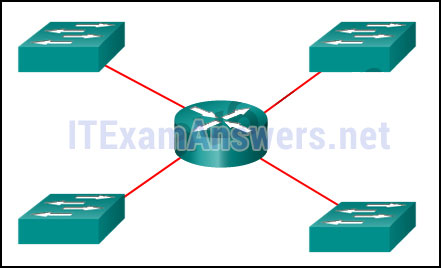

**Choices:**
- **A.** 1
- **B.** 2
- **C.** 3
- **D.** 4

**Correct Answer:**
4

**Explanation:**
A router is used to route traffic between different networks. Broadcast traffic is not permitted to cross the router and therefore will be contained within the respective subnets where it originated.

---

## Question 3

**Question:**
What are two reasons a network administrator might want to create subnets? (Choose two.)

**Choices:**
- **A.** simplifies network design
- **B.** improves network performance
- **C.** easier to implement security policies
- **D.** reduction in number of routers needed
- **E.** reduction in number of switches needed

**Correct Answer:**
improves network performance; easier to implement security policies

**Explanation:**
Two reasons for creating subnets include reduction of overall network traffic and improvement of network performance. Subnets also allow an administrator to implement subnet-based security policies. The number of routers or switches is not affected. Subnets do not simplify network design.

---

## Question 4

**Question:**
Refer to the exhibit. A company uses the address block of 128.107.0.0/16 for its network. What subnet mask would provide the maximum number of equal size subnets while providing enough host addresses for each subnet in the exhibit?

**Images:**
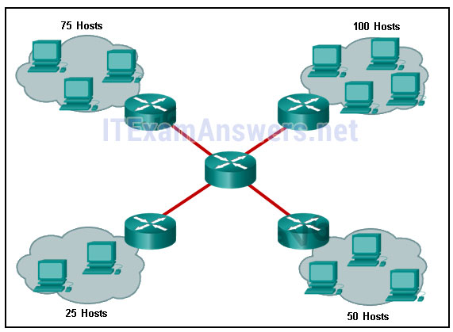

**Choices:**
- **A.** 255.255.255.0
- **B.** 255.255.255.128
- **C.** 255.255.255.192
- **D.** 255.255.255.224
- **E.** 255.255.255.240

**Correct Answer:**
255.255.255.128

**Explanation:**
The largest subnet in the topology has 100 hosts in it so the subnet mask must have at least 7 host bits in it (27-2=126). 255.255.255.0 has 8 hosts bits, but this does not meet the requirement of providing the maximum number of subnets.

---

## Question 5

**Question:**
Refer to the exhibit. The network administrator has assigned the LAN of LBMISS an address range of 192.168.10.0. This address range has been subnetted using a /29 prefix. In order to accommodate a new building, the technician has decided to use the fifth subnet for configuring the new network (subnet zero is the first subnet). By company policies, the router interface is always assigned the first usable host address and the workgroup server is given the last usable host address. Which configuration should be entered into the properties of the workgroup server to allow connectivity to the Internet?

**Images:**
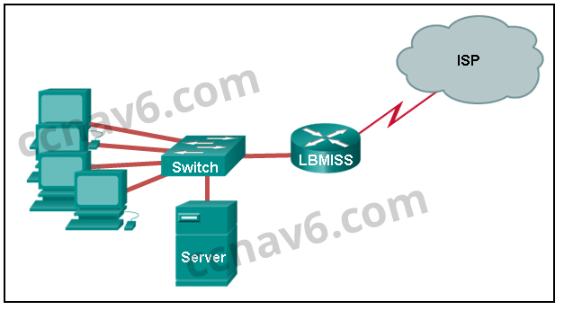

**Choices:**
- **A.** IP address: 192.168.10.65 subnet mask: 255.255.255.240, default gateway: 192.168.10.76
- **B.** IP address: 192.168.10.38 subnet mask: 255.255.255.240, default gateway: 192.168.10.33
- **C.** IP address: 192.168.10.38 subnet mask: 255.255.255.248, default gateway: 192.168.10.33
- **D.** IP address: 192.168.10.41 subnet mask: 255.255.255.248, default gateway: 192.168.10.46
- **E.** IP address: 192.168.10.254 subnet mask: 255.255.255.0, default gateway: 192.168.10.1

**Correct Answer:**
IP address: 192.168.10.38 subnet mask: 255.255.255.248, default gateway: 192.168.10.33

**Explanation:**
Using a /29 prefix to subnet 192.168.10.0 results in subnets that increment by 8: 192.168.10.0 (1) 192.168.10.8 (2) 192.168.10.16 (3) 192.168.10.24 (4) 192.168.10.32 (5)

---

## Question 6

**Question:**
If a network device has a mask of /28, how many IP addresses are available for hosts on this network?

**Choices:**
- **A.** 256
- **B.** 254
- **C.** 62
- **D.** 32
- **E.** 16
- **F.** 14

**Correct Answer:**
14

**Explanation:**
A /28 mask is the same as 255.255.255.240. This leaves 4 host bits. With 4 host bits, 16 IP addresses are possible, but one address represents the subnet number and one address represents the broadcast address. 14 addresses can then be used to assign to network devices.

---

## Question 7

**Question:**
Which subnet mask would be used if 5 host bits are available?

**Choices:**
- **A.** 255.255.255.0
- **B.** 255.255.255.128
- **C.** 255.255.255.224
- **D.** 255.255.255.240

**Correct Answer:**
255.255.255.224

**Explanation:**
The subnet mask of 255.255.255.0 has 8 host bits. The mask of 255.255.255.128 results in 7 host bits. The mask of 255.255.255.224 has 5 host bits. Finally, 255.255.255.240 represents 4 host bits.

---

## Question 8

**Question:**
How many host addresses are available on the network 172.16.128.0 with a subnet mask of 255.255.252.0?

**Choices:**
- **A.** 510
- **B.** 512
- **C.** 1022
- **D.** 1024
- **E.** 2046
- **F.** 2048

**Correct Answer:**
1022

**Explanation:**
A mask of 255.255.252.0 is equal to a prefix of /22. A /22 prefix provides 22 bits for the network portion and leaves 10 bits for the host portion. The 10 bits in the host portion will provide 1022 usable IP addresses (2^10 – 2 = 1022).

---

## Question 9

**Question:**
How many bits must be borrowed from the host portion of an address to accommodate a router with five connected networks?

**Choices:**
- **A.** two
- **B.** three
- **C.** four
- **D.** five

**Correct Answer:**
three

**Explanation:**
Each network that is directly connected to an interface on a router requires its own subnet. The formula 2n, where n is the number of bits borrowed, is used to calculate the available number of subnets when borrowing a specific number of bits.

---

## Question 10

**Question:**
A network administrator wants to have the same network mask for all networks at a particular small site. The site has the following networks and number of devices: IP phones – 22 addresses PCs – 20 addresses needed Printers – 2 addresses needed Scanners – 2 addresses needed The network administrator has deemed that 192.168.10.0/24 is to be the network used at this site. Which single subnet mask would make the most efficient use of the available addresses to use for the four subnetworks?

**Choices:**
- **A.** 255.255.255.0
- **B.** 255.255.255.192
- **C.** 255.255.255.224
- **D.** 255.255.255.240
- **E.** 255.255.255.248
- **F.** 255.255.255.252

**Correct Answer:**
255.255.255.224

**Explanation:**
If the same mask is to be used, then the network with the most hosts must be examined for the number of hosts, which in this case is 22 hosts. Thus, 5 host bits are needed. The /27 or 255.255.255.224 subnet mask would be appropriate to use for these networks.

---

## Question 11

**Question:**
A company has a network address of 192.168.1.64 with a subnet mask of 255.255.255.192. The company wants to create two subnetworks that would contain 10 hosts and 18 hosts respectively. Which two networks would achieve that? (Choose two.)

**Choices:**
- **A.** 192.168.1.16/28
- **B.** 192.168.1.64/27
- **C.** 192.168.1.128/27
- **D.** 192.168.1.96/28
- **E.** 192.168.1.192/28

**Correct Answer:**
192.168.1.64/27; 192.168.1.96/28

**Explanation:**
Subnet 192.168.1.64 /27 has 5 bits that are allocated for host addresses and therefore will be able to support 32 addresses, but only 30 valid host IP addresses. Subnet 192.168.1.96/28 has 4 bits for host addresses and will be able to support 16 addresses, but only 14 valid host IP addresses

---

## Question 12

**Question:**
A network administrator is variably subnetting a network. The smallest subnet has a mask of 255.255.255.248. How many usable host addresses will this subnet provide?

**Choices:**
- **A.** 4
- **B.** 6
- **C.** 8
- **D.** 10
- **E.** 12

**Correct Answer:**
6

**Explanation:**
The mask 255.255.255.248 is equivalent to the /29 prefix. This leaves 3 bits for hosts, providing a total of 6 usable IP addresses (23 = 8 – 2 = 6).

---

## Question 13

**Question:**
Refer to the exhibit. Given the network address of 192.168.5.0 and a subnet mask of 255.255.255.224, how many total host addresses are unused in the assigned subnets?

**Images:**

**Choices:**
- **A.** 56
- **B.** 60
- **C.** 64
- **D.** 68
- **E.** 72

**Correct Answer:**
72

**Explanation:**
The network IP address 192.168.5.0 with a subnet mask of 255.255.255.224 provides 30 usable IP addresses for each subnet. Subnet A needs 30 host addresses. There are no addresses wasted. Subnet B uses 2 of the 30 available IP addresses, because it is a serial link. Consequently, it wastes 28 addresses. Likewise, subnet C wastes 28 addresses. Subnet D needs 14 addresses, so it wastes 16 addresses. The total wasted addresses are 0+28+28+16=72 addresses.

---

## Question 14

**Question:**
Refer to the exhibit. Considering the addresses already used and having to remain within the 10.16.10.0/24 network range, which subnet address could be assigned to the network containing 25 hosts?

**Images:**
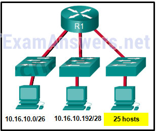

**Choices:**
- **A.** 10.16.10.160/26
- **B.** 10.16.10.128/28
- **C.** 10.16.10.64/27
- **D.** 10.16.10.224/26
- **E.** 10.16.10.240/27
- **F.** 10.16.10.240/28

**Correct Answer:**
10.16.10.64/27

**Explanation:**
Addresses 10.16.10.0 through 10.16.10.63 are taken for the leftmost network. Addresses 10.16.10.192 through 10.16.10.207 are used by the center network.The address space from 208-255 assumes a /28 mask, which does not allow enough host bits to accommodate 25 host addresses.The address ranges that are available include 10.16.10.64/26 and10.16.10.128/26. To accommodate 25 hosts, 5 host bits are needed, so a /27 mask is necessary. Four possible /27 subnets could be created from the available addresses between 10.16.10.64 and 10.16.10.191: 10.16.10.64/27 10.16.10.96/27 10.16.10.128/27 10.16.10.160/27

---

## Question 15

**Question:**
Refer to the exhibit. Given the network address of 192.168.5.0 and a subnet mask of 255.255.255.224 for all subnets, how many total host addresses are unused in the assigned subnets?

**Images:**
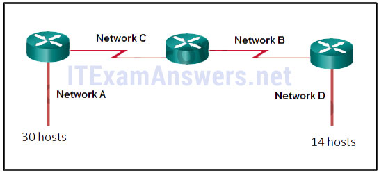

**Choices:**
- **A.** 64
- **B.** 56
- **C.** 68
- **D.** 60
- **E.** 72

**Correct Answer:**
72

---

## Question 16

**Question:**
A network administrator needs to monitor network traffic to and from servers in a data center. Which features of an IP addressing scheme should be applied to these devices?

**Choices:**
- **A.** random static addresses to improve security
- **B.** addresses from different subnets for redundancy
- **C.** predictable static IP addresses for easier identification
- **D.** dynamic addresses to reduce the probability of duplicate addresses

**Correct Answer:**
predictable static IP addresses for easier identification

**Explanation:**
When monitoring servers, a network administrator needs to be able to quickly identify them. Using a predictable static addressing scheme for these devices makes them easier to identify. Server security, redundancy, and duplication of addresses are not features of an IP addressing scheme.

---

## Question 17

**Question:**
Which two reasons generally make DHCP the preferred method of assigning IP addresses to hosts on large networks? (Choose two.)

**Choices:**
- **A.** It eliminates most address configuration errors.
- **B.** It ensures that addresses are only applied to devices that require a permanent address.
- **C.** It guarantees that every device that needs an address will get one.
- **D.** It provides an address only to devices that are authorized to be connected to the network.
- **E.** It reduces the burden on network support staff.

**Correct Answer:**
It eliminates most address configuration errors.; It reduces the burden on network support staff.

**Explanation:**
DHCP is generally the preferred method of assigning IP addresses to hosts on large networks because it reduces the burden on network support staff and virtually eliminates entry errors. However, DHCP itself does not discriminate between authorized and unauthorized devices and will assign configuration parameters to all requesting devices. DHCP servers are usually configured to assign addresses from a subnet range, so there is no guarantee that every device that needs an address will get one.

---

## Question 18

**Question:**
A DHCP server is used to assign IP addresses dynamically to the hosts on a network. The address pool is configured with 192.168.10.0/24. There are 3 printers on this network that need to use reserved static IP addresses from the pool. How many IP addresses in the pool are left to be assigned to other hosts?

**Choices:**
- **A.** 254
- **B.** 251
- **C.** 252
- **D.** 253

**Correct Answer:**
251

**Explanation:**
If the block of addresses allocated to the pool is 192.168.10.0/24, there are 254 IP addresses to be assigned to hosts on the network. As there are 3 printers which need to have their addresses assigned statically, then there are 251 IP addresses left for assignment.

---

## Question 19

**Question:**
Refer to the exhibit. A company is deploying an IPv6 addressing scheme for its network. The company design document indicates that the subnet portion of the IPv6 addresses is used for the new hierarchical network design, with the site subsection to represent multiple geographical sites of the company, the sub-site section to represent multiple campuses at each site, and the subnet section to indicate each network segment separated by routers. With such a scheme, what is the maximum number of subnets achieved per sub-site?

**Images:**
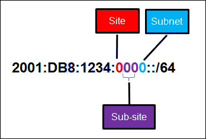

**Choices:**
- **A.** 0
- **B.** 4
- **C.** 16
- **D.** 256

**Correct Answer:**
16

**Explanation:**
Because only one hexadecimal character is used to represent the subnet, that one character can represent 16 different values 0 through F.

---

## Question 20

**Question:**
What is the prefix for the host address 2001:DB8:BC15:A:12AB::1/64?

**Choices:**
- **A.** 2001:DB8:BC15
- **B.** 2001:DB8:BC15:A
- **C.** 2001:DB8:BC15:A:1
- **D.** 2001:DB8:BC15:A:12

**Correct Answer:**
2001:DB8:BC15:A

**Explanation:**
The network portion, or prefix, of an IPv6 address is identified through the prefix length. A /64 prefix length indicates that the first 64 bits of the IPv6 address is the network portion. Hence the prefix is 2001:DB8:BC15:A.

---

## Question 21

**Question:**
Consider the following range of addresses: The prefix-length for the range of addresses is /60 Explain: All the addresses have the part 2001:0DB8:BC15:00A in common. Each number or letter in the address represents 4 bits, so the prefix-length is /60.

---

## Question 22

**Question:**
Match the subnetwork to a host address that would be included within the subnetwork. (Not all options are used.) Question Answer Explain: Subnet 192.168.1.32/27 will have a valid host range from 192.168.1.33 – 192.168.1.62 with the broadcast address as 192.168.1.63 Subnet 192.168.1.64/27 will have a valid host range from 192.168.1.65 – 192.168.1.94 with the broadcast address as 192.168.1.95 Subnet 192.168.1.96/27 will have a valid host range from 192.168.1.97 – 192.168.1.126 with the broadcast address as 192.168.1.127

**Images:**
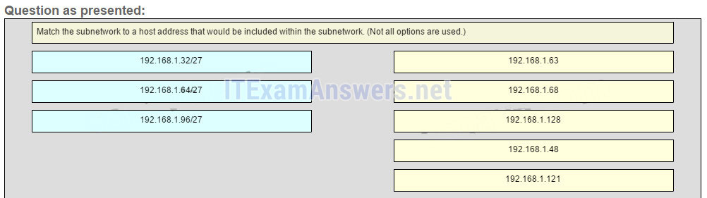
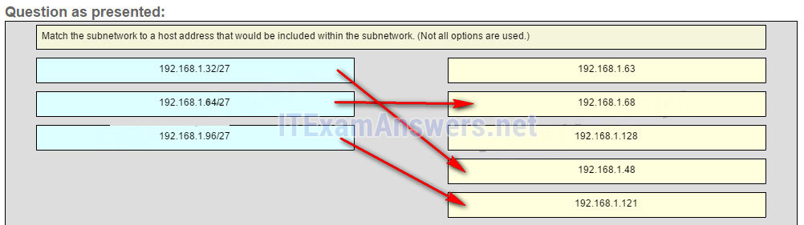

---

## Question 23

**Question:**
Refer to the exhibit. Match the network with the correct IP address and prefix that will satisfy the usable host addressing requirements for each network. (Not all options are used.) From right to left, network A has 100 hosts connected to the router on the right. The router on the right is connected via a serial link to the router on the left. The serial link represents network D with 2 hosts. The left router connects network B with 50 hosts and network C with 25 hosts. Question Answer

**Images:**

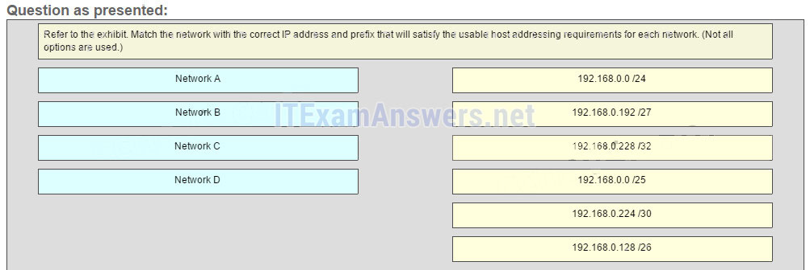
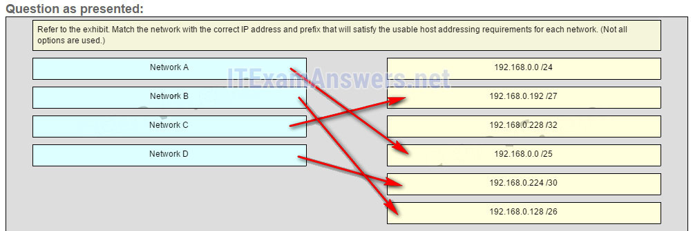

**Explanation:**
Network A needs to use 192.168.0.0 /25 which yields 128 host addresses. Network B needs to use 192.168.0.128 /26 which yields 64 host addresses. Network C needs to use 192.168.0.192 /27 which yields 32 host addresses. Network D needs to use 192.168.0.224 /30 which yields 4 host addresses. Older Version

---

## Question 24

**Question:**
How many bits are in an IPv4 address?

**Choices:**
- **A.** 32
- **B.** 64
- **C.** 128
- **D.** 256

**Correct Answer:**
32

---

## Question 25

**Question:**
Which two parts are components of an IPv4 address? (Choose two.)

**Choices:**
- **A.** subnet portion
- **B.** network portion
- **C.** logical portion
- **D.** host portion
- **E.** physical portion
- **F.** broadcast portion

**Correct Answer:**
network portion; host portion

---

## Question 26

**Question:**
What is the prefix length notation for the subnet mask 255.255.255.224?

**Choices:**
- **A.** /25
- **B.** /26
- **C.** /27

**Correct Answer:**
/27

---

## Question 27

**Question:**
A message is sent to all hosts on a remote network. Which type of message is it?

**Choices:**
- **A.** limited broadcast
- **B.** multicast
- **C.** directed broadcast
- **D.** unicast

**Correct Answer:**
directed broadcast

---

## Question 28

**Question:**
What two statements describe characteristics of Layer 3 broadcasts? (Choose two.)

**Choices:**
- **A.** Broadcasts are a threat and users must avoid using protocols that implement them.
- **B.** Routers create broadcast domains.
- **C.** Some IPv6 protocols use broadcasts.
- **D.** There is a broadcast domain on each switch interface.
- **E.** A limited broadcast packet has a destination IP address of 255.255.255.255.
- **F.** A router will not forward any type of Layer 3 broadcast packet.

**Correct Answer:**
Routers create broadcast domains.; A limited broadcast packet has a destination IP address of 255.255.255.255.

---

## Question 29

**Question:**
Which network migration technique encapsulates IPv6 packets inside IPv4 packets to carry them over IPv4 network infrastructures?

**Choices:**
- **A.** encapsulation
- **B.** translation
- **C.** dual-stack
- **D.** tunneling

**Correct Answer:**
tunneling

**Explanation:**
The tunneling migration technique encapsulates an IPv6 packet inside an IPv4 packet. Encapsulation assembles a message and adds information to each layer in order to transmit the data over the network. Translation is a migration technique that allows IPv6-enabled devices to communicate with IPv4-enabled devices using a translation technique similar to NAT for IPv4. The dual-stack migration technique allows IPv4 and IPv6 protocol stacks to coexist on the same network simultaneously.

---

## Question 30

**Question:**
Which two statements are correct about IPv4 and IPv6 addresses? (Choose two.)

**Choices:**
- **A.** IPv6 addresses are represented by hexadecimal numbers.
- **B.** IPv4 addresses are represented by hexadecimal numbers.
- **C.** IPv6 addresses are 32 bits in length.
- **D.** IPv4 addresses are 32 bits in length.
- **E.** IPv4 addresses are 128 bits in length.
- **F.** IPv6 addresses are 64 bits in length.

**Correct Answer:**
IPv6 addresses are represented by hexadecimal numbers.; IPv4 addresses are 32 bits in length.

---

## Question 31

**Question:**
Which IPv6 address is most compressed for the full FE80:0:0:0:2AA:FF:FE9A:4CA3 address?

**Choices:**
- **A.** FE8::2AA:FF:FE9A:4CA3?
- **B.** FE80::2AA:FF:FE9A:4CA3
- **C.** FE80::0:2AA:FF:FE9A:4CA3?
- **D.** FE80:::0:2AA:FF:FE9A:4CA3?

**Correct Answer:**
FE80::2AA:FF:FE9A:4CA3

**Explanation:**
When an IPv6 address is being compressed, the :: can be used to replace a recurring set of 0s only once.

---

## Question 32

**Question:**
What are two types of IPv6 unicast addresses? (Choose two.)

**Choices:**
- **A.** multicast
- **B.** loopback
- **C.** link-local
- **D.** anycast
- **E.** broadcast

**Correct Answer:**
loopback; link-local

---

## Question 33

**Question:**
What are three parts of an IPv6 global unicast address? (Choose three.)

**Choices:**
- **A.** an interface ID that is used to identify the local network for a particular host
- **B.** a global routing prefix that is used to identify the network portion of the address that has been provided by an ISP
- **C.** a subnet ID that is used to identify networks inside of the local enterprise site
- **D.** a global routing prefix that is used to identify the portion of the network address provided by a local administrator
- **E.** an interface ID that is used to identify the local host on the network

**Correct Answer:**
a global routing prefix that is used to identify the network portion of the address that has been provided by an ISP; a subnet ID that is used to identify networks inside of the local enterprise site; an interface ID that is used to identify the local host on the network

---

## Question 34

**Question:**
An IPv6 enabled device sends a data packet with the destination address of FF02::1. What is the target of this packet?

**Choices:**
- **A.** all IPv6 DHCP servers
- **B.** all IPv6 enabled nodes on the local link
- **C.** all IPv6 configured routers on the local link
- **D.** all IPv6 configured routers across the network

**Correct Answer:**
all IPv6 enabled nodes on the local link

---

## Question 35

**Question:**
When a Cisco router is being moved from an IPv4 network to a complete IPv6 environment, which series of commands would correctly enable IPv6 forwarding and interface addressing?

**Choices:**
- **A.** Router# configure terminal Router(config)# interface fastethernet 0/0 Router(config-if)# ip address 192.168.1.254 255.255.255.0 Router(config-if)# no shutdown Router(config-if)# exit Router(config)# ipv6 unicast-routing
- **B.** Router# configure terminal Router(config)# interface fastethernet 0/0 Router(config-if)# ipv6 address 2001:db8:bced:1::9/64 Router(config-if)# no shutdown Router(config-if)# exit Router(config)# ipv6 unicast-routing
- **C.** Router# configure terminal Router(config)# interface fastethernet 0/0 Router(config-if)# ipv6 address 2001:db8:bced:1::9/64 Router(config-if)# no shutdown
- **D.** Router# configure terminal Router(config)# interface fastethernet 0/0 Router(config-if)# ip address 2001:db8:bced:1::9/64 Router(config-if)# ip address 192.168.1.254 255.255.255.0 Router(config-if)# no shutdown

**Correct Answer:**
Router# configure terminal Router(config)# interface fastethernet 0/0 Router(config-if)# ipv6 address 2001:db8:bced:1::9/64 Router(config-if)# no shutdown Router(config-if)# exit Router(config)# ipv6 unicast-routing

---

## Question 36

**Question:**
Which two ICMP messages are used by both IPv4 and IPv6 protocols? (Choose two.)?

**Choices:**
- **A.** router solicitation
- **B.** route redirection
- **C.** neighbor solicitation
- **D.** protocol unreachable
- **E.** router advertisement

**Correct Answer:**
route redirection; protocol unreachable

---

## Question 37

**Question:**
When an IPv6 enabled host needs to discover the MAC address of an intended IPv6 destination, which destination address is used by the source host in the NS message?

**Choices:**
- **A.** all-node multicast address
- **B.** solicited-node multicast address
- **C.** link-local address of the receiver
- **D.** global unicast address of the receiver

**Correct Answer:**
solicited-node multicast address

---

## Question 38

**Question:**
When will a router drop a traceroute packet?

**Choices:**
- **A.** when the router receives an ICMP Time Exceeded message
- **B.** when the RTT value reaches zero
- **C.** when the host responds with an ICMP Echo Reply message
- **D.** when the value in the TTL field reaches zero
- **E.** when the values of both the Echo Request and Echo Reply messages reach zero

**Correct Answer:**
when the value in the TTL field reaches zero

---

## Question 39

**Question:**
What is indicated by a successful ping to the ::1 IPv6 address?

**Choices:**
- **A.** The host is cabled properly.
- **B.** The default gateway address is correctly configured.
- **C.** All hosts on the local link are available.
- **D.** The link-local address is correctly configured.
- **E.** IP is properly installed on the host.

**Correct Answer:**
IP is properly installed on the host.

---

## Question 40

**Question:**
Which two things can be determined by using the ping command? (Choose two.)

**Choices:**
- **A.** the number of routers between the source and destination device
- **B.** the IP address of the router nearest the destination device
- **C.** the average time it takes a packet to reach the destination and for the response to return to the source
- **D.** whether or not the destination device is reachable through the network
- **E.** the average time it takes each router in the path between source and destination to respond

**Correct Answer:**
the average time it takes a packet to reach the destination and for the response to return to the source; whether or not the destination device is reachable through the network

---

## Question 41

**Question:**
Fill in the blank. The decimal equivalent of the binary number 10010101 is 149

---

## Question 42

**Question:**
Fill in the blank. What is the decimal equivalent of the hex number 0x3F? 63

---

## Question 43

**Question:**
Open the PT Activity. Perform the tasks in the activity instructions and then answer the question. Which message is displayed on the web server?

**Choices:**
- **A.** You did it right!
- **B.** Correct configuration!
- **C.** IPv6 address configured!
- **D.** Successful configuration!

**Correct Answer:**
Correct configuration!

---

## Question 44

**Question:**
Match each IPv4 address to the appropriate address category. (Not all options are used.) Place the options in the following order: Host address [A] 192.168.100.161/25 [A] Host address [B] 203.0.113.100/24 [B] Host address [C] 10.0.50.10/30 [C] Network address [D] 192.168.1.80/29 [D] Network address [E] 172.110.12.64/28 [E] Network address [F] 10.10.10.128/25 [F] Broadcast address [G] 10.0.0.159/27 [G] Broadcast address [H] 192.168.1.191/26 [H]

**Images:**
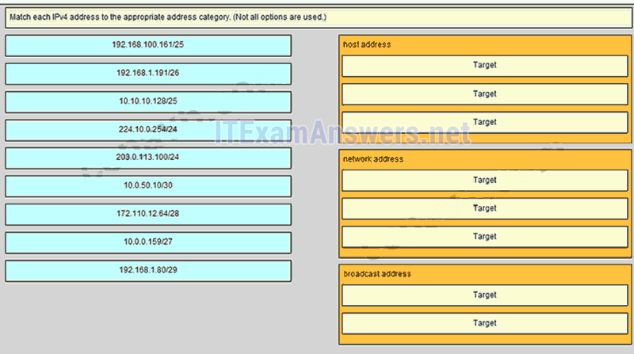
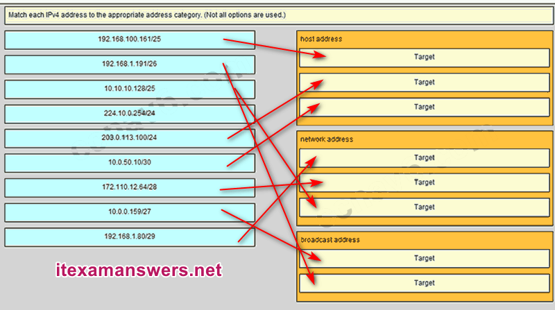
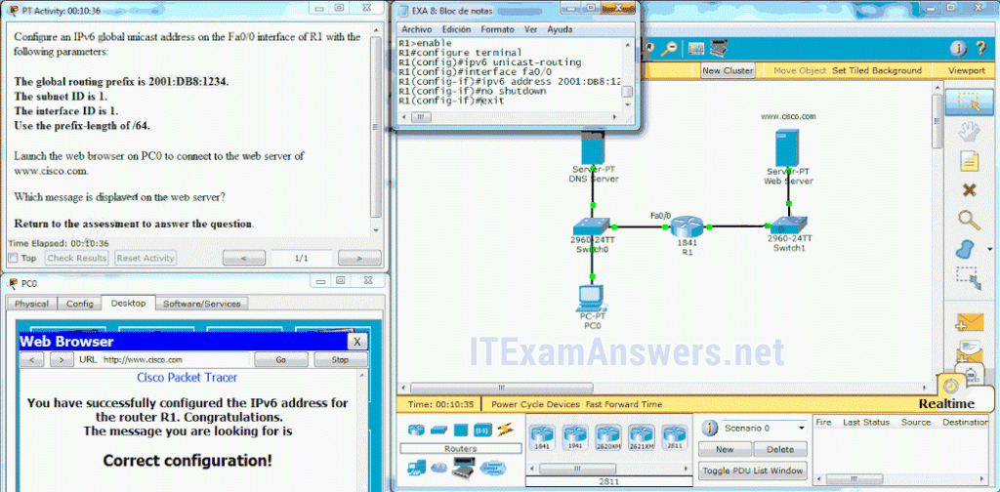

---

## Question 45

**Question:**
Match each description with an appropriate IP address. (Not all options are used) 169.254.1.5 -> a link-local address 192.0.2.153 -> a TEST-NET address 240.2.6.255 -> an experimental address 172.19.20.5 -> a private address 127.0.0.1 -> a loopback address

**Images:**
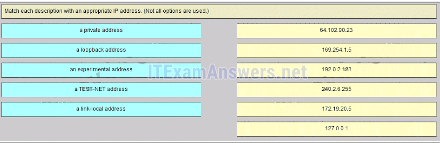
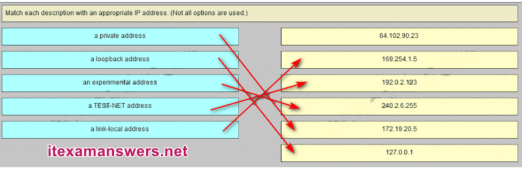

---

## Question 46

**Question:**
Match each description with an appropriate IP address. (Not all options are used.) 192.31.18.123 -> a legacy class C address 198.256.2.6 -> an invalid IPv4 address 64.100.3.5 -> a legacy class A address 224.2.6.255 -> a legacy class D address 128.107.5.1 -> a legacy class B address

**Images:**
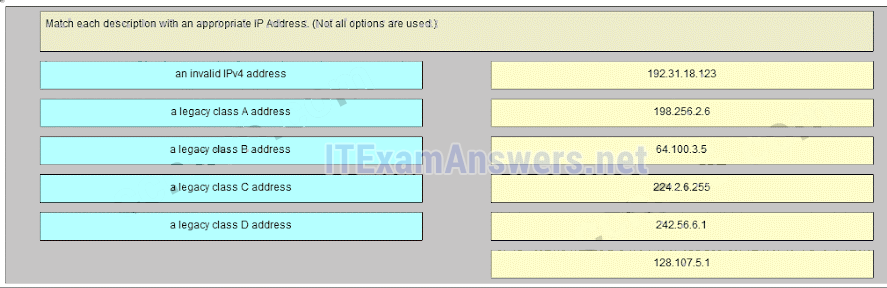
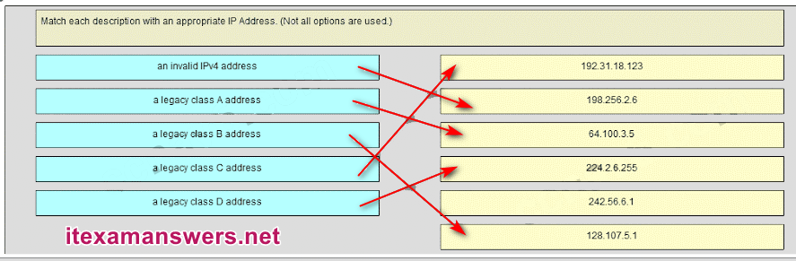

---

## Question 47

**Question:**
Which three addresses could be used as the destination address for OSPFv3 messages? (Choose three.)

**Choices:**
- **A.** FF02::A
- **B.** FF02::1:2
- **C.** 2001:db8:cafe::1
- **D.** FE80::1
- **E.** FF02::5
- **F.** FF02::6

**Correct Answer:**
FE80::1; FF02::5; FF02::6

---

## Question 48

**Question:**
What is the result of connecting multiple switches to each other?

**Choices:**
- **A.** The number of broadcast domains is increasing.
- **B.** The number of collision domains decreases.
- **C.** The size of the broadcast domain is increasing.
- **D.** The size of the collision domain decreases.

**Correct Answer:**
The size of the broadcast domain is increasing.

---

## Question 49

**Question:**
Which wildcard mask would be used to advertise the 192.168.5.96/27 network as part of an OSPF configuration?

**Choices:**
- **A.** 255.255.255.224
- **B.** 0.0.0.32
- **C.** 255.255.255.223
- **D.** 0.0.0.31

**Correct Answer:**
0.0.0.31

---

## Question 50

**Question:**
Media description: An IPv6 network address with 64 bit network mask is shown. The first three blocks are 2001, DB8, and 1234. The fourth block shows four zeros. The first zero is labeled SIte, the second and third zeros are labeled together as Sub-site, the last zero is labeled Subnet. Refer to the exhibit. A company is deploying an IPv6 addressing scheme for its network. The company design document indicates that the subnet portion of the IPv6 addresses is used for the new hierarchical network design, with the site subsection to represent multiple geographical sites of the company, the sub-site section to represent multiple campuses at each site, and the subnet section to indicate each network segment separated by routers. With such a scheme, what is the maximum number of subnetsachieved per sub-site?

**Images:**

**Choices:**
- **A.** 4
- **B.** 16
- **C.** 256
- **D.** 0

**Correct Answer:**
16

---
