# CCNA 1 v2 - CCNA 1 - Chapter 9

## Question 1

**Question:**
Which two characteristics are associated with UDP sessions? (Choose two.)

**Choices:**
- **A.** Destination devices receive traffic with minimal delay.
- **B.** Transmitted data segments are tracked.
- **C.** Destination devices reassemble messages and pass them to an application.
- **D.** Received data is unacknowledged.
- **E.** Unacknowledged data packets are retransmitted.

**Correct Answer:**
Destination devices receive traffic with minimal delay.; Received data is unacknowledged.

**Explanation:**
TCP: · Provides tracking of transmitted data segments · Destination devices will acknowledge received data. · Source devices will retransmit unacknowledged data. UDP · Destination devices will not acknowledge received data · Headers use very little overhead and cause minimal delay.​

---

## Question 2

**Question:**
What happens if part of an FTP message is not delivered to the destination?

**Choices:**
- **A.** The message is lost because FTP does not use a reliable delivery method.
- **B.** The FTP source host sends a query to the destination host.
- **C.** The part of the FTP message that was lost is re-sent.
- **D.** The entire FTP message is re-sent.

**Correct Answer:**
The part of the FTP message that was lost is re-sent.

**Explanation:**
Because FTP uses TCP as its transport layer protocol, sequence and acknowledgment numbers will identify the missing segments, which will be re-sent to complete the message.

---

## Question 3

**Question:**
A host device needs to send a large video file across the network while providing data communication to other users. Which feature will allow different communication streams to occur at the same time, without having a single data stream using all available bandwidth?

**Choices:**
- **A.** window size
- **B.** multiplexing
- **C.** port numbers
- **D.** acknowledgments

**Correct Answer:**
multiplexing

**Explanation:**
Multiplexing is useful for interleaving multiple communication streams. Window size is used to slow down the rate of data communication. Port numbers are used to pass data streams to their proper applications. Acknowledgments are used to notify a sending device that a stream of data packets has or has not been received.

---

## Question 4

**Question:**
What kind of port must be requested from IANA in order to be used with a specific application?

**Choices:**
- **A.** registered port
- **B.** private port
- **C.** dynamic port
- **D.** source port

**Correct Answer:**
registered port

**Explanation:**
Registered ports (numbers 1024 to 49151) are assigned by IANA to a requesting entity to use with specific processes or applications. These processes are primarily individual applications that a user has chosen to install, rather than common applications that would receive a well-known port number. For example, Cisco has registered port 1985 for its Hot Standby Routing Protocol (HSRP) process.​

---

## Question 5

**Question:**
What type of information is included in the transport header?

**Choices:**
- **A.** destination and source logical addresses
- **B.** destination and source physical addresses
- **C.** destination and source port numbers
- **D.** encoded application data

**Correct Answer:**
destination and source port numbers

**Explanation:**
In a segment, the transport layer header will include the source and destination process, or port numbers. Destination and source physical addressing is included in the frame header. Destination and source logical addressing is included in the network header. Application data is encoded in the upper layers of the protocol stack.

---

## Question 6

**Question:**
What is a socket?

**Choices:**
- **A.** the combination of the source and destination IP address and source and destination Ethernet address
- **B.** the combination of a source IP address and port number or a destination IP address and port number
- **C.** the combination of the source and destination sequence and acknowledgment numbers
- **D.** the combination of the source and destination sequence numbers and port numbers

**Correct Answer:**
the combination of a source IP address and port number or a destination IP address and port number

**Explanation:**
A socket is a combination of the source IP address and source port or the destination IP address and the destination port number.

---

## Question 7

**Question:**
What is the complete range of TCP and UDP well-known ports?

**Choices:**
- **A.** 0 to 255
- **B.** 0 to 1023
- **C.** 256 – 1023
- **D.** 1024 – 49151

**Correct Answer:**
0 to 1023

**Explanation:**
There are three ranges of TCP and UDP ports. The well-know range of port numbers is from 0 – 1023.

---

## Question 8

**Question:**
Which flag in the TCP header is used in response to a received FIN in order to terminate connectivity between two network devices?

**Choices:**
- **A.** FIN
- **B.** ACK
- **C.** SYN
- **D.** RST

**Correct Answer:**
ACK

**Explanation:**
In a TCP session, when a device has no more data to send, it will send a segment with the FIN flag set. The connected device that receives the segment will respond with an ACK to acknowledge that segment. The device that sent the ACK will then send a FIN message to close the connection it has with the other device. The sending of the FIN should be followed with the receipt of an ACK from the other device.​

---

## Question 9

**Question:**
What is a characteristic of a TCP server process?

**Choices:**
- **A.** Every application process running on the server has to be configured to use a dynamic port number.
- **B.** There can be many ports open simultaneously on a server, one for each active server application.
- **C.** An individual server can have two services assigned to the same port number within the same transport layer services.
- **D.** A host running two different applications can have both configured to use the same server port.

**Correct Answer:**
There can be many ports open simultaneously on a server, one for each active server application.

**Explanation:**
Each application process running on the server is configured to use a port number, either by default or manually, by a system administrator. An individual server cannot have two services assigned to the same port number within the same transport layer services. A host running a web server application and a file transfer application cannot have both configured to use the same server port. There can be many ports open simultaneously on a server, one for each active server application.

---

## Question 10

**Question:**
Which two flags in the TCP header are used in a TCP three-way handshake to establish connectivity between two network devices? (Choose two.)

**Choices:**
- **A.** ACK
- **B.** FIN
- **C.** PSH
- **D.** RST
- **E.** SYN
- **F.** URG

**Correct Answer:**
ACK; SYN

**Explanation:**
TCP uses the SYN and ACK flags in order to establish connectivity between two network devices.

---

## Question 11

**Question:**
A PC is downloading a large file from a server. The TCP window is 1000 bytes. The server is sending the file using 100-byte segments. How many segments will the server send before it requires an acknowledgment from the PC?

**Choices:**
- **A.** 1 segment
- **B.** 10 segments
- **C.** 100 segments
- **D.** 1000 segments

**Correct Answer:**
10 segments

**Explanation:**
With a window of 1000 bytes, the destination host accepts segments until all 1000 bytes of data have been received. Then the destination host sends an acknowledgment.

---

## Question 12

**Question:**
Which factor determines TCP window size?

**Choices:**
- **A.** the amount of data to be transmitted
- **B.** the number of services included in the TCP segment
- **C.** the amount of data the destination can process at one time
- **D.** the amount of data the source is capable of sending at one time

**Correct Answer:**
the amount of data the destination can process at one time

**Explanation:**
Window is the number of bytes that the sender will send prior to expecting an acknowledgement from the destination device. The initial window is agreed upon during the session startup via the three-way handshake between source and destination. It is determined by how much data the destination device of a TCP session is able to accept and process at one time.

---

## Question 13

**Question:**
During a TCP session, a destination device sends an acknowledgment number to the source device. What does the acknowledgment number represent?

**Choices:**
- **A.** the total number of bytes that have been received
- **B.** one number more than the sequence number
- **C.** the next byte that the destination expects to receive
- **D.** the last sequence number that was sent by the source

**Correct Answer:**
the next byte that the destination expects to receive

**Explanation:**
The window size determines the number of bytes that will be sent before expecting an acknowledgement. The acknowledgement number is the number of the next expected byte. For example, if a host has received 3140 bytes, the host would respond with an acknowledgement number of 3141.

---

## Question 14

**Question:**
What information is used by TCP to reassemble and reorder received segments?

**Choices:**
- **A.** port numbers
- **B.** sequence numbers
- **C.** acknowledgment numbers
- **D.** fragment numbers

**Correct Answer:**
sequence numbers

**Explanation:**
At the transport layer, TCP uses the sequence numbers in the header of each TCP segment to reassemble the segments into the correct order.

---

## Question 15

**Question:**
What does TCP do if the sending source detects network congestion on the path to the destination?

**Choices:**
- **A.** The source host will send a request for more frequent acknowledgments to the destination.
- **B.** The source will decrease the amount of data that it sends before it must receive acknowledgements from the destination.
- **C.** The destination will request retransmission of the entire message.
- **D.** The source will acknowledge the last segment that is sent and include a request for a smaller window size in the message.

**Correct Answer:**
The source will decrease the amount of data that it sends before it must receive acknowledgements from the destination.

**Explanation:**
If the source determines that TCP segments are either not being acknowledged or not acknowledged in a timely manner, then it can reduce the number of bytes it sends before receiving an acknowledgment. Notice that it is the source that is reducing the number of unacknowledged bytes it sends. This does not involve changing the window size in the segment header.

---

## Question 16

**Question:**
What is a characteristic of UDP?

**Choices:**
- **A.** UDP datagrams take the same path and arrive in the correct order at the destination.
- **B.** Applications that use UDP are always considered unreliable.
- **C.** UDP reassembles the received datagrams in the order they were received.
- **D.** UDP only passes data to the network when the destination is ready to receive the data.

**Correct Answer:**
UDP reassembles the received datagrams in the order they were received.

**Explanation:**
UDP has no way to reorder the datagrams into their transmission order, so UDP simply reassembles the data in the order it was received and forwards it to the application.​

---

## Question 17

**Question:**
What does a client do when it has UDP datagrams to send?

**Choices:**
- **A.** It just sends the datagrams.
- **B.** It queries the server to see if it is ready to receive data.
- **C.** It sends a simplified three-way handshake to the server.
- **D.** It sends to the server a segment with the SYN flag set to synchronize the conversation.

**Correct Answer:**
It just sends the datagrams.

**Explanation:**
When a client has UDP datagrams to send, it just sends the datagrams.

---

## Question 18

**Question:**
What happens if the first packet of a TFTP transfer is lost?

**Choices:**
- **A.** The client will wait indefinitely for the reply.
- **B.** The TFTP application will retry the request if a reply is not received.
- **C.** The next-hop router or the default gateway will provide a reply with an error code.
- **D.** The transport layer will retry the query if a reply is not received.

**Correct Answer:**
The TFTP application will retry the request if a reply is not received.

**Explanation:**
The TFTP protocol uses UDP for queries, so the TFTP application must implement the reliability, if needed.

---

## Question 19

**Question:**
A host device is receiving live streaming video. How does the device account for video data that is lost during transmission?

**Choices:**
- **A.** The device will immediately request a retransmission of the missing data.
- **B.** The device will use sequence numbers to pause the video stream until the correct data arrives.
- **C.** The device will delay the streaming video until the entire video stream is received.
- **D.** The device will continue receiving the streaming video, but there may be a momentary disruption.

**Correct Answer:**
The device will continue receiving the streaming video, but there may be a momentary disruption.

**Explanation:**
When TCP is used as the transport protocol, data must be received in a specific sequence or all data must be fully received in order for it to be used. TCP will use sequence numbers, acknowledgments and retransmission to accomplish this. However, when UDP is used as the transport protocol, data that arrives out of order or with missing segments may cause a momentary disruption, but the destination device may still be able to use the data that it has received. This technology results in the least amount of network delay by providing minimal reliability. Since live streaming video applications use UDP as the transport protocol, the receiver will continue showing the video although there may be a slight delay or reduction in quality.

---

## Question 20

**Question:**
Why does HTTP use TCP as the transport layer protocol?

**Choices:**
- **A.** to ensure the fastest possible download speed
- **B.** because HTTP is a best-effort protocol
- **C.** because transmission errors can be tolerated easily
- **D.** because HTTP requires reliable delivery

**Correct Answer:**
because HTTP requires reliable delivery

**Explanation:**
When a host requests a web page, transmission reliability and completeness must be guaranteed. Therefore, HTTP uses TCP as its transport layer protocol.

---

## Question 21

**Question:**
When is UDP preferred to TCP?

**Choices:**
- **A.** when a client sends a segment to a server
- **B.** when all the data must be fully received before any part of it is considered useful
- **C.** when an application can tolerate some loss of data during transmission
- **D.** when segments must arrive in a very specific sequence to be processed successfully

**Correct Answer:**
when an application can tolerate some loss of data during transmission

**Explanation:**
UDP can be used when an application can tolerate some data loss. UDP is the preferred protocol for applications that provide voice or video that cannot tolerate delay.

---

## Question 22

**Question:**
Which three application layer protocols use TCP? (Choose three.)

**Choices:**
- **A.** SMTP
- **B.** FTP
- **C.** SNMP
- **D.** HTTP
- **E.** TFTP
- **F.** DHCP

**Correct Answer:**
SMTP; FTP; HTTP

**Explanation:**
Some protocols require the reliable data transport that is provided by TCP. In addition, these protocols do not have real time communication requirements and can tolerate some data loss while minimizing protocol overhead. Examples of these protocols are SMTP, FTP, and HTTP.

---

## Question 23

**Question:**
Refer to the exhibit. Consider a datagram that originates on the PC and that is destined for the web server. Match the IP addresses and port numbers that are in that datagram to the description. (Not all options are used.) destination IP address -> 192.168.2.2 destination port number -> 80 source IP address -> 192.168.1.2 source port number -> 2578 Explain: A TCP/IP segment that originated on the PC has 192.168.1.2 as the IP source address. 2578 is the only possible option for the source port number because the PC port number must be in the range of registered ports 1024 to 49151. The destination is the web server, which has the IP address 192.168.2.2, and the destination port number is 80 according to the HTTP protocol standard.

**Images:**
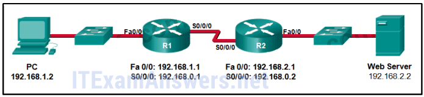
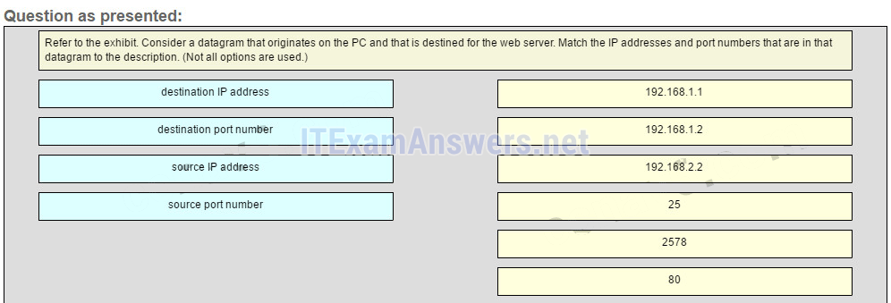
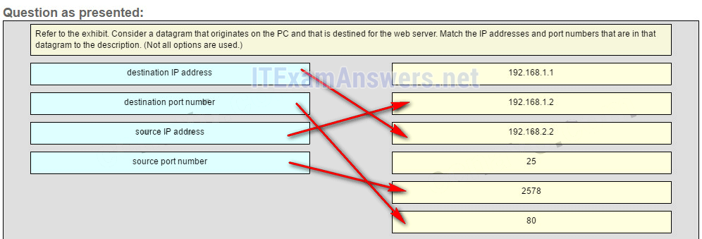

---

## Question 24

**Question:**
What information is used by TCP to reassemble and reorder received segments?

**Choices:**
- **A.** sequence numbers
- **B.** acknowledgment numbers
- **C.** fragment numbers
- **D.** port numbers

**Correct Answer:**
sequence numbers

**Explanation:**
Older Version

---

## Question 25

**Question:**
Refer to the exhibit. How many broadcast domains are there?

**Images:**
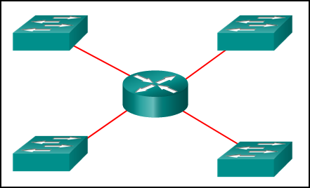

**Choices:**
- **A.** 1
- **B.** 2
- **C.** 3
- **D.** 4

**Correct Answer:**
4

**Explanation:**
A router is used to route traffic between different networks. Broadcast traffic is not permitted to cross the router and therefore will be contained within the respective subnets where it originated.

---

## Question 26

**Question:**
How many usable host addresses are there in the subnet 192.168.1.32/27?

**Choices:**
- **A.** 32
- **B.** 30
- **C.** 64
- **D.** 16
- **E.** 62

**Correct Answer:**
30

---

## Question 27

**Question:**
How many host addresses are available on the network 172.16.128.0 with a subnet mask of 255.255.252.0?

**Choices:**
- **A.** 510
- **B.** 512
- **C.** 1022
- **D.** 1024
- **E.** 2046
- **F.** 2048

**Correct Answer:**
1022

**Explanation:**
A mask of 255.255.252.0 is equal to a prefix of /22. A /22 prefix provides 22 bits for the network portion and leaves 10 bits for the host portion. The 10 bits in the host portion will provide 1022 usable IP addresses (210 – 2 = 1022).

---

## Question 28

**Question:**
A network administrator is variably subnetting a network. The smallest subnet has a mask of 255.255.255.248. How many host addresses will this subnet provide?

**Choices:**
- **A.** 4
- **B.** 6
- **C.** 8
- **D.** 10
- **E.** 12

**Correct Answer:**
6

**Explanation:**
The mask 255.255.255.248 is equivalent to the /29 prefix. This leaves 3 bits for hosts, providing a total of 6 usable IP addresses (23 = 8 – 2 = 6).

---

## Question 29

**Question:**
Refer to the exhibit. A company uses the address block of 128.107.0.0/16 for its network. What subnet mask would provide the maximum number of equal size subnets while providing enough host addresses for each subnet in the exhibit?

**Images:**
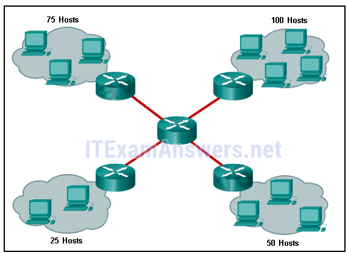

**Choices:**
- **A.** 255.255.255.0
- **B.** 255.255.255.128
- **C.** 255.255.255.192
- **D.** 255.255.255.224
- **E.** 255.255.255.240

**Correct Answer:**
255.255.255.128

**Explanation:**
The largest subnet in the topology has 100 hosts in it so the subnet mask must have at least 7 host bits in it (27-2=126). 255.255.255.0 has 8 hosts bits, but this does not meet the requirement of providing the maximum number of subnets.

---

## Question 30

**Question:**
Refer to the exhibit. The network administrator has assigned the LAN of LBMISS an address range of 192.168.10.0. This address range has been subnetted using a /29 prefix. In order to accommodate a new building, the technician has decided to use the fifth subnet for configuring the new network (subnet zero is the first subnet). By company policies, the router interface is always assigned the first usable host address and the workgroup server is given the last usable host address. Which configuration should be entered into the properties of the workgroup server to allow connectivity to the Internet?

**Images:**
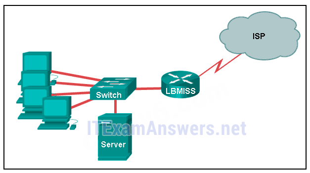

**Choices:**
- **A.** IP address: 192.168.10.65 subnet mask: 255.255.255.240, default gateway: 192.168.10.76
- **B.** IP address: 192.168.10.38 subnet mask: 255.255.255.240, default gateway: 192.168.10.33
- **C.** IP address: 192.168.10.38 subnet mask: 255.255.255.248, default gateway: 192.168.10.33
- **D.** IP address: 192.168.10.41 subnet mask: 255.255.255.248, default gateway: 192.168.10.46
- **E.** IP address: 192.168.10.254 subnet mask: 255.255.255.0, default gateway: 192.168.10.1

**Correct Answer:**
IP address: 192.168.10.38 subnet mask: 255.255.255.248, default gateway: 192.168.10.33

**Explanation:**
Using a /29 prefix to subnet 192.168.10.0 results in subnets that increment by 8: 192.168.10.0 (1) 192.168.10.8 (2) 192.168.10.16 (3) 192.168.10.24 (4) 192.168.10.32 (5)

---

## Question 31

**Question:**
How many bits must be borrowed from the host portion of an address to accommodate a router with five connected networks?

**Choices:**
- **A.** two
- **B.** three
- **C.** four
- **D.** five

**Correct Answer:**
three

**Explanation:**
Each network that is directly connected to an interface on a router requires its own subnet. The formula 2n, where n is the number of bits borrowed, is used to calculate the available number of subnets when borrowing a specific number of bits.

---

## Question 32

**Question:**
A company has a network address of 192.168.1.64 with a subnet mask of 255.255.255.192. The company wants to create two subnetworks that would contain 10 hosts and 18 hosts respectively. Which two networks would achieve that? (Choose two.)

**Choices:**
- **A.** 192.168.1.16/28
- **B.** 192.168.1.64/27
- **C.** 192.168.1.128/27
- **D.** 192.168.1.96/28
- **E.** 192.168.1.192/28

**Correct Answer:**
192.168.1.64/27; 192.168.1.96/28

**Explanation:**
Subnet 192.168.1.64 /27 has 5 bits that are allocated for host addresses and therefore will be able to support 32 addresses, but only 30 valid host IP addresses. Subnet 192.168.1.96/28 has 4 bits for host addresses and will be able to support 16 addresses, but only 14 valid host IP addresses

---

## Question 33

**Question:**
In a network that uses IPv4, what prefix would best fit a subnet containing 100 hosts?

**Choices:**
- **A.** /23
- **B.** /24
- **C.** /25
- **D.** /26

**Correct Answer:**
/25

---

## Question 34

**Question:**
Refer to the exhibit. Given the network address of 192.168.5.0 and a subnet mask of 255.255.255.224, how many total host addresses are unused in the assigned subnets?

**Images:**
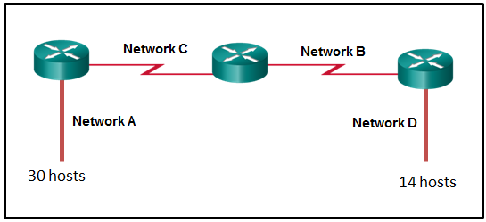

**Choices:**
- **A.** 56
- **B.** 60
- **C.** 64
- **D.** 68
- **E.** 72

**Correct Answer:**
72

**Explanation:**
The network IP address 192.168.5.0 with a subnet mask of 255.255.255.224 provides 30 usable IP addresses for each subnet. Subnet A needs 30 host addresses. There are no addresses wasted. Subnet B uses 2 of the 30 available IP addresses, because it is a serial link. Consequently, it wastes 28 addresses. Likewise, subnet C wastes 28 addresses. Subnet D needs 14 addresses, so it wastes 16 addresses. The total wasted addresses are 0+28+28+16=72 addresses.

---

## Question 35

**Question:**
When developing an IP addressing scheme for an enterprise network, which devices are recommended to be grouped into their own subnet or logical addressing group?

**Choices:**
- **A.** end-user clients
- **B.** workstation clients
- **C.** mobile and laptop hosts
- **D.** hosts accessible from the Internet

**Correct Answer:**
hosts accessible from the Internet

---

## Question 36

**Question:**
A network administrator needs to monitor network traffic to and from servers in a data center. Which features of an IP addressing scheme should be applied to these devices?

**Choices:**
- **A.** random static addresses to improve security
- **B.** addresses from different subnets for redundancy
- **C.** predictable static IP addresses for easier identification
- **D.** dynamic addresses to reduce the probability of duplicate addresses

**Correct Answer:**
predictable static IP addresses for easier identification

**Explanation:**
When monitoring servers, a network administrator needs to be able to quickly identify them. Using a predictable static addressing scheme for these devices makes them easier to identify. Server security, redundancy, and duplication of addresses are not features of an IP addressing scheme.

---

## Question 37

**Question:**
Which two reasons generally make DHCP the preferred method of assigning IP addresses to hosts on large networks? (Choose two.)

**Choices:**
- **A.** It eliminates most address configuration errors.
- **B.** It ensures that addresses are only applied to devices that require a permanent address.
- **C.** It guarantees that every device that needs an address will get one.
- **D.** It provides an address only to devices that are authorized to be connected to the network.
- **E.** It reduces the burden on network support staff.

**Correct Answer:**
It eliminates most address configuration errors.; It reduces the burden on network support staff.

**Explanation:**
DHCP is generally the preferred method of assigning IP addresses to hosts on large networks because it reduces the burden on network support staff and virtually eliminates entry errors. However, DHCP itself does not discriminate between authorized and unauthorized devices and will assign configuration parameters to all requesting devices. DHCP servers are usually configured to assign addresses from a subnet range, so there is no guarantee that every device that needs an address will get one.

---

## Question 38

**Question:**
Refer to the exhibit. A computer that is configured with the IPv6 address as shown in the exhibit is unable to access the internet. What is the problem?

**Images:**
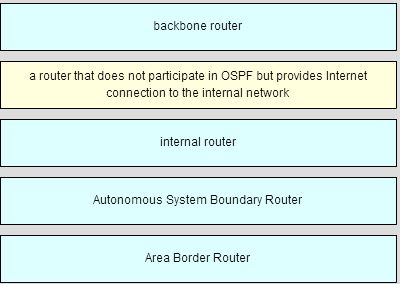

**Choices:**
- **A.** The DNS address is wrong.
- **B.** There should not be an alternative DNS address.
- **C.** The gateway address is in the wrong subnet.
- **D.** The settings were not validated.

**Correct Answer:**
The gateway address is in the wrong subnet.

---

## Question 39

**Question:**
When subnetting a /64 IPv6 network prefix, which is the preferred new prefix length?

**Choices:**
- **A.** /66
- **B.** /70
- **C.** /72
- **D.** /74

**Correct Answer:**
/72

---

## Question 40

**Question:**
What is the subnet address for the address 2001:DB8:BC15:A:12AB::1/64?

**Choices:**
- **A.** 2001:DB8:BC15::0
- **B.** 2001:DB8:BC15:A::0
- **C.** 2001:DB8:BC15:A:1::1
- **D.** 2001:DB8:BC15:A:12::0

**Correct Answer:**
2001:DB8:BC15:A::0

---

## Question 41

**Question:**
Which two notations are useable nibble boundaries when subnetting in IPv6? (Choose two.)

**Choices:**
- **A.** /62
- **B.** /64
- **C.** /66
- **D.** /68
- **E.** /70

**Correct Answer:**
/64; /68

---

## Question 42

**Question:**
Fill in the blank. In dotted decimal notation, the IP address 172.25.0.126 is the last host address for the network 172.25.0.64/26.

---

## Question 43

**Question:**
Fill in the blank. In dotted decimal notation, the subnet mask 255.255.254.0 will accommodate 500 hosts per subnet. Consider the following range of addresses: 2001:0DB8:BC15:00A0:0000:: 2001:0DB8:BC15:00A1:0000:: 2001:0DB8:BC15:00A2:0000:: … 2001:0DB8:BC15:00AF:0000:: The prefix-length for the range of addresses is /60

---

## Question 44

**Question:**
Fill in the blank. A nibble consists of 4 bits.

---

## Question 45

**Question:**
Open the PT Activity. Perform the tasks in the activity instructions and then answer the question. What issue is causing Host A to be unable to communicate with Host B?

**Choices:**
- **A.** The subnet mask of host A is incorrect.
- **B.** Host A has an incorrect default gateway.
- **C.** Host A and host B are on overlapping subnets.
- **D.** The IP address of host B is not in the same subnet as the default gateway is on.

**Correct Answer:**
Host A and host B are on overlapping subnets.

---

## Question 46

**Question:**
Refer to the exhibit. Given the network address of 192.168.5.0 and a subnet mask of 255.255.255.224, how many addresses are wasted in total by subnetting each network with a subnet mask of 255.255.255.224?

**Images:**
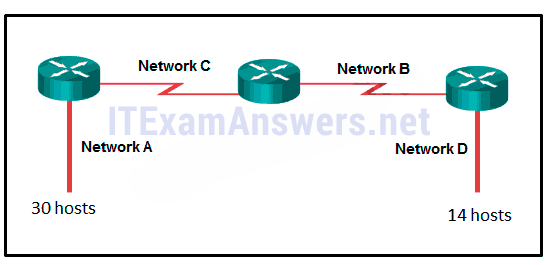

**Choices:**
- **A.** 56
- **B.** 60
- **C.** 64
- **D.** 68
- **E.** 72

**Correct Answer:**
72

---

## Question 47

**Question:**
Match the subnetwork to a host address that would be included within the subnetwork. (Not all options are used.) Explanation: Subnet 192.168.1.32/27 will have a valid host range from 192.168.1.33 – 192.168.1.62 with the broadcast address as 192.168.1.63 Subnet 192.168.1.64/27 will have a valid host range from 192.168.1.65 – 192.168.1.94 with the broadcast address as 192.168.1.95 Subnet 192.168.1.96/27 will have a valid host range from 192.168.1.97 – 192.168.1.126 with the broadcast address as 192.168.1.127

**Images:**

---

## Question 48

**Question:**
Refer to the exhibit. Match the network with the correct IP address and prefix that will satisfy the usable host addressing requirements for each network. (Not all options are used.) Place the options in the following order: – not scored – Network C – not scored – Network A Network D Network B

**Images:**
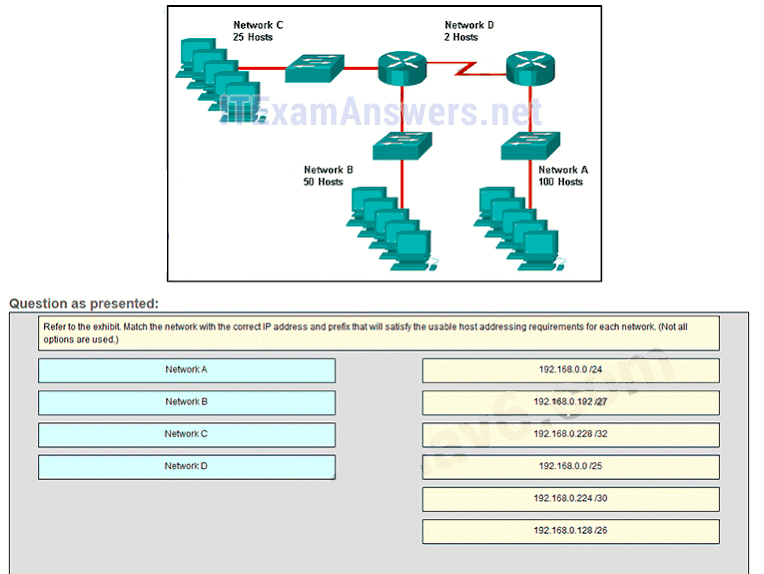
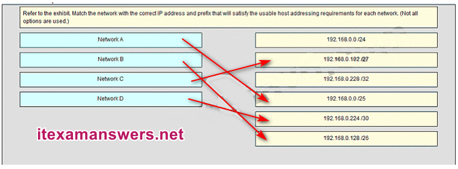

---

## Question 49

**Question:**
Which three features can be configured in the BIOS settings to secure a computer? (Choose three.)

**Choices:**
- **A.** MAC filtering
- **B.** drive encryption
- **C.** TPM
- **D.** file encryption
- **E.** TKIP key
- **F.** passwords

**Correct Answer:**
drive encryption; TPM; passwords

**Explanation:**
Passwords, drive encryption, and TPM are BIOS configurable security features. File encryption, TKIP key, and MAC filtering are security features not configured within BIOS.

---

## Question 50

**Question:**
Refer to the exhibit. A network administrator has configured OSPFv2 on the two Cisco routers. The routers are unable to form a neighbor adjacency. What should be done to fix the problem on router R2?

**Images:**
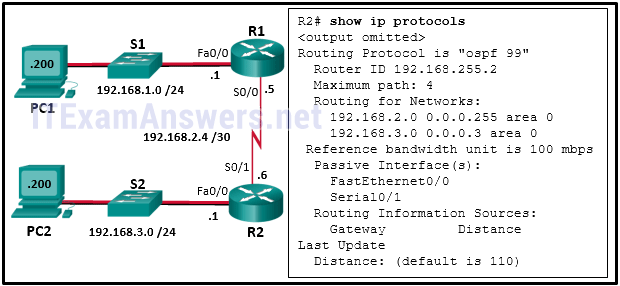

**Choices:**
- **A.** Implement the command no passive-interface Serial0/1.
- **B.** Implement the command network 192.168.2.6 0.0.0.0 area 0 on router R2.
- **C.** Change the router-id of router R2 to 2.2.2.2.
- **D.** Implement the command network 192.168.3.1 0.0.0.0 area 0 on router R2.

**Explanation:**
OSPF-enabled routers must exchange Hello packets to discover neighbors and establish adjacencies. However, the passive-interface command suppresses these OSPF messages, preventing the router from sending and receiving routing updates on that specific interface. Because the show ip protocols output for R2 indicates that Serial0/1 (the interface connecting it to R1) is configured as a passive interface, R2 is not sending the necessary Hello packets to form an adjacency with R1. Removing this configuration on Serial0/1 will allow OSPF communication to resume on that link.

---
