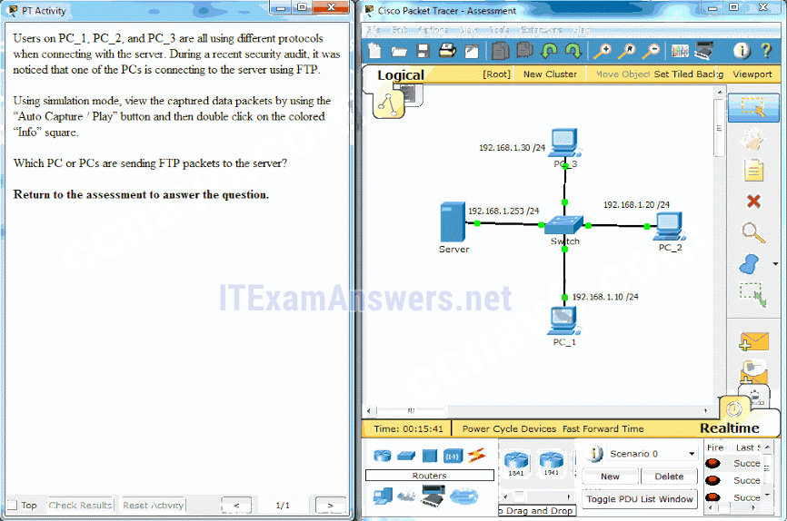
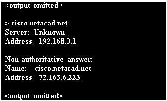
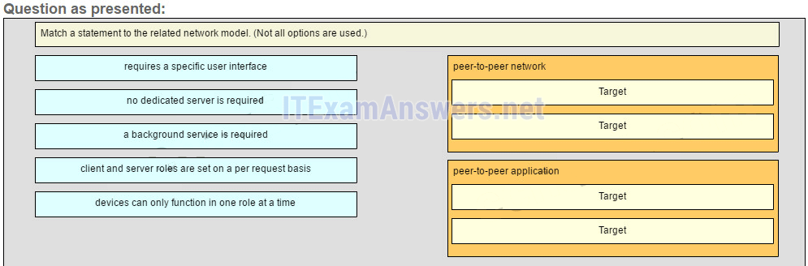
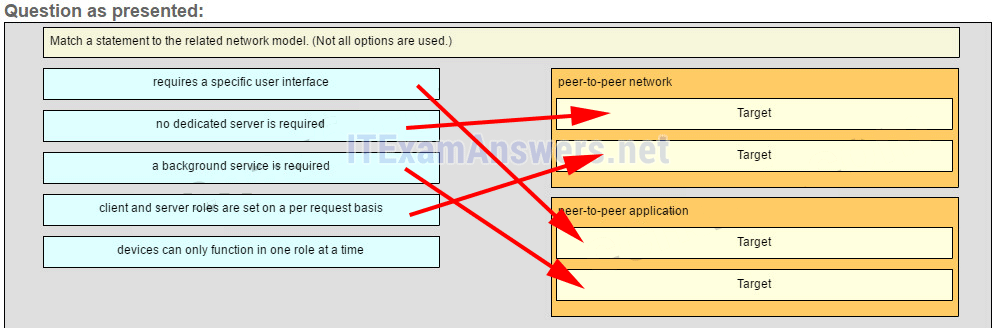
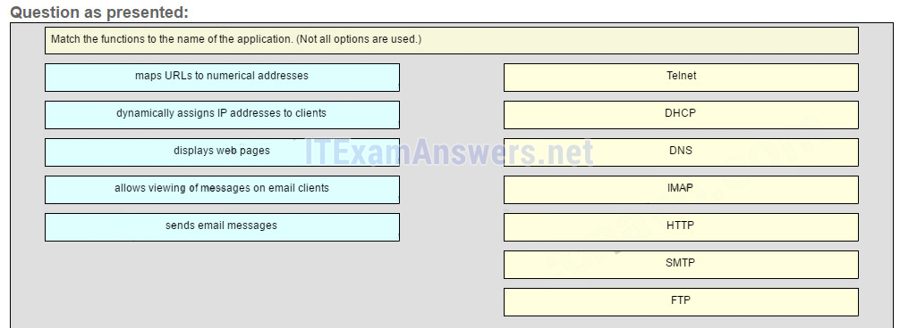
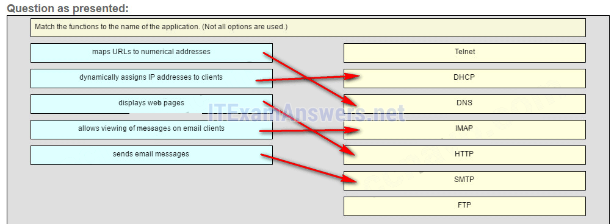
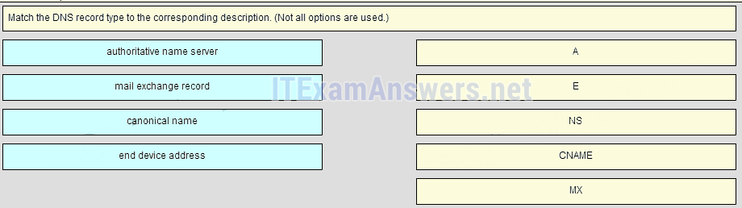
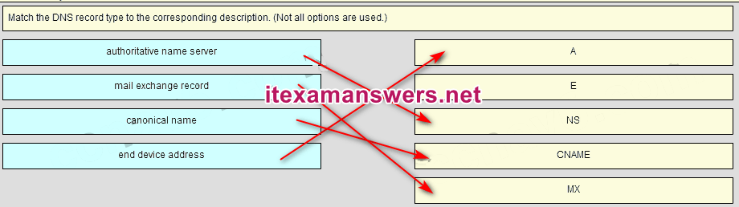

# CCNA 1 v2 - CCNA 1 - Chapter 10

## Question 1

**Question:**
Which two definitions accurately describe the associated application layer protocol? (Choose two.)

**Choices:**
- **A.** SMTP – transfers web pages from web servers to clients
- **B.** Telnet – provides remote access to servers and networking devices
- **C.** DNS – resolves Internet names to IP addresses
- **D.** FTP – transfers email messages and attachments
- **E.** HTTP – enables devices on a network to obtain IP addresses

**Correct Answer:**
Telnet – provides remote access to servers and networking devices; DNS – resolves Internet names to IP addresses

**Explanation:**
The Domain Name Service (DNS) protocol resolves Internet names to IP addresses. Hypertext Transfer Protocol (HTTP) transfers files that make up the web pages of the World Wide Web. The Simple Mail Transfer Protocol (SMTP) transfers mail messages and attachments. Telnet, a terminal emulation protocol, provides remote access to servers and networking devices. The File Transfer Protocol (FTP) transfers files between systems.

---

## Question 2

**Question:**
The application layer of the TCP/IP model performs the functions of what three layers of the OSI model? (Choose three.)

**Choices:**
- **A.** physical
- **B.** session
- **C.** network
- **D.** presentation
- **E.** data link
- **F.** transport
- **G.** application

**Correct Answer:**
session; presentation; application

**Explanation:**
The network access layer of the TCP/IP model performs the same functions as the physical and data link layers of the OSI model. The internetwork layer equates to the network layer of the OSI model. The transport layers are the same in both models. The application layer of the TCP/IP model represents the session, presentation, and application layers of the OSI model.​

---

## Question 3

**Question:**
Which layer in the TCP/IP model is used for formatting, compressing, and encrypting data?

**Choices:**
- **A.** internetwork
- **B.** session
- **C.** presentation
- **D.** application
- **E.** network access

**Correct Answer:**
application

**Explanation:**
The application layer of the TCP/IP model performs the functions of three layers of the OSI model – application, presentation, and session. The application layer of the TCP/IP model is the layer that provides the interface between the applications, is responsible for formatting, compressing, and encrypting data, and is used to create and maintain dialogs between source and destination applications.

---

## Question 4

**Question:**
What are two characteristics of the application layer of the TCP/IP model? (Choose two.)

**Choices:**
- **A.** responsibility for logical addressing
- **B.** responsibility for physical addressing
- **C.** the creation and maintenance of dialogue between source and destination applications
- **D.** closest to the end user
- **E.** the establishing of window size

**Correct Answer:**
the creation and maintenance of dialogue between source and destination applications; closest to the end user

**Explanation:**
The application layer of the TCP/IP model is the layer that is closest to the end user, providing the interface between the applications. It is responsible for formatting, compressing, and encrypting data, and is used to create and maintain dialog between source and destination applications.

---

## Question 5

**Question:**
A manufacturing company subscribes to certain hosted services from its ISP. The services that are required include hosted world wide web, file transfer, and e-mail. Which protocols represent these three key applications? (Choose three.)

**Choices:**
- **A.** FTP
- **B.** HTTP
- **C.** DNS
- **D.** SNMP
- **E.** DHCP
- **F.** SMTP

**Correct Answer:**
FTP; HTTP; SMTP

**Explanation:**
The ISP uses the HTTP protocol in conjunction with hosting web pages, the FTP protocol with file transfers, and SMTP with e-mail. DNS is used to translate domain names to IP addresses. SNMP is used for network management traffic. DHCP ic commonly used to manage IP addressing.

---

## Question 6

**Question:**
What is an example of network communication that uses the client-server model?

**Choices:**
- **A.** A user uses eMule to download a file that is shared by a friend after the file location is determined.
- **B.** A workstation initiates an ARP to find the MAC address of a receiving host.
- **C.** A user prints a document by using a printer that is attached to a workstation of a coworker.
- **D.** A workstation initiates a DNS request when the user types www.cisco.com in the address bar of a web browser.

**Correct Answer:**
A workstation initiates a DNS request when the user types www.cisco.com in the address bar of a web browser.

**Explanation:**
When a user types a domain name of a website into the address bar of a web browser, a workstation needs to send a DNS request to the DNS server for the name resolution process. This request is a client/server model application. The eMule application is P2P. Sharing a printer on a workstation is a peer-to-peer network. Using ARP is just a broadcast message sent by a host.

---

## Question 7

**Question:**
Two students are working on a network design project. One student is doing the drawing, while the other student is writing the proposal. The drawing is finished and the student wants to share the folder that contains the drawing so that the other student can access the file and copy it to a USB drive. Which networking model is being used?

**Choices:**
- **A.** peer-to-peer
- **B.** client-based
- **C.** master-slave
- **D.** point-to-point

**Correct Answer:**
peer-to-peer

**Explanation:**
In a peer-to-peer (P2P) networking model, data is exchanged between two network devices without the use of a dedicated server. ​​

---

## Question 8

**Question:**
What do the client/server and peer-to-peer network models have in common?

**Choices:**
- **A.** Both models have dedicated servers.
- **B.** Both models support devices in server and client roles.
- **C.** Both models require the use of TCP/IP-based protocols.
- **D.** Both models are used only in the wired network environment.

**Correct Answer:**
Both models support devices in server and client roles.

**Explanation:**
In both the client/server and peer-to-peer network models, clients and servers exist. In peer-to-peer networks, no dedicated server exists, but a device can assume the server role to provide information to a device serving in the client role.

---

## Question 9

**Question:**
What is an advantage for small organizations of adopting IMAP instead of POP?

**Choices:**
- **A.** Messages are kept in the mail servers until they are manually deleted from the email client.
- **B.** When the user connects to a POP server, copies of the messages are kept in the mail server for a short time, but IMAP keeps them for a long time.
- **C.** IMAP sends and retrieves email, but POP only retrieves email.
- **D.** POP only allows the client to store messages in a centralized way, while IMAP allows distributed storage.

**Correct Answer:**
Messages are kept in the mail servers until they are manually deleted from the email client.

**Explanation:**
IMAP and POP are protocols that are used to retrieve email messages. The advantage of using IMAP instead of POP is that when the user connects to an IMAP-capable server, copies of the messages are downloaded to the client application. IMAP then stores the email messages on the server until the user manually deletes those messages.

---

## Question 10

**Question:**
Which application layer protocol uses message types such as GET, PUT, and POST?

**Choices:**
- **A.** DNS
- **B.** DHCP
- **C.** SMTP
- **D.** HTTP
- **E.** POP3

**Correct Answer:**
HTTP

**Explanation:**
The GET command is a client request for data from a web server. A PUT command uploads resources and content, such as images, to a web server. A POST command uploads data files to a web server.

---

## Question 11

**Question:**
When retrieving email messages, which protocol allows for easy, centralized storage and backup of emails that would be desirable for a small- to medium-sized business?

**Choices:**
- **A.** IMAP
- **B.** POP
- **C.** SMTP
- **D.** HTTPS

**Correct Answer:**
IMAP

**Explanation:**
IMAP is preferred for small-to medium-sized businesses as IMAP allows centralized storage and backup of emails, with copies of the emails being forwarded to clients. POP delivers the emails to the clients and deletes them on the email server. SMTP is used to send emails and not to receive them. HTTPS is not used for secure web browsing.

---

## Question 12

**Question:**
What is the function of the Nslookup utility?

**Choices:**
- **A.** to manually query the name servers to resolve a given host name
- **B.** to view the network settings on a host
- **C.** to manually force a client to send a DHCP request
- **D.** to display all cached DNS entries on a host

**Correct Answer:**
to manually query the name servers to resolve a given host name

**Explanation:**
Nslookup is a command-line utility that is used to send a query to DNS servers to resolve a specific host name to an IP address.

---

## Question 13

**Question:**
What message type is used by an HTTP client to request data from a web server?

**Choices:**
- **A.** POST
- **B.** ACK
- **C.** GET
- **D.** PUT

**Correct Answer:**
GET

**Explanation:**
HTTP clients send GET messages to request data from web servers.

---

## Question 14

**Question:**
Which protocol is used by a client to communicate securely with a web server?

**Choices:**
- **A.** SMB
- **B.** HTTPS
- **C.** SMTP
- **D.** IMAP

**Correct Answer:**
HTTPS

**Explanation:**
HTTPS is a secure form of HTTP used to access web content hosted by a web server.

---

## Question 15

**Question:**
Which three statements describe a DHCP Discover message? (Choose three.)

**Choices:**
- **A.** The source MAC address is 48 ones (FF-FF-FF-FF-FF-FF).
- **B.** The destination IP address is 255.255.255.255.
- **C.** The message comes from a server offering an IP address.
- **D.** The message comes from a client seeking an IP address.
- **E.** All hosts receive the message, but only a DHCP server replies.
- **F.** Only the DHCP server receives the message.

**Correct Answer:**
The destination IP address is 255.255.255.255.; The message comes from a client seeking an IP address.; All hosts receive the message, but only a DHCP server replies.

**Explanation:**
When a host configured to use DHCP powers up on a network it sends a DHCPDISCOVER message. FF-FF-FF-FF-FF-FF is the L2 broadcast address. A DHCP server replies with a unicast DHCPOFFER message back to the host.

---

## Question 16

**Question:**
What part of the URL, http://www.cisco.com/index.html, represents the top-level DNS domain?

**Choices:**
- **A.** .com
- **B.** www
- **C.** http
- **D.** index

**Correct Answer:**
.com

**Explanation:**
The components of the URL http://www.cisco.com/index.htm are as follows: http = protocol www = part of the server name cisco = part of the domain name index = file name com = the top-level domain

---

## Question 17

**Question:**
Which two tasks can be performed by a local DNS server? (Choose two.)

**Choices:**
- **A.** providing IP addresses to local hosts
- **B.** allowing data transfer between two network devices
- **C.** mapping name-to-IP addresses for internal hosts
- **D.** forwarding name resolution requests between servers
- **E.** retrieving email messages

**Correct Answer:**
mapping name-to-IP addresses for internal hosts; forwarding name resolution requests between servers

**Explanation:**
Two important functions of DNS are to (1) provide IP addresses for domain names such as www.cisco.com, and (2) forward requests that cannot be resolved to other servers in order to provide domain name to IP address translation. DHCP provides IP addressing information to local devices. A file transfer protocol such as FTP, SFTP, or TFTP provides file sharing services. IMAP or POP can be used to retrieve an email message from a server.

---

## Question 18

**Question:**
Which phrase describes an FTP daemon?

**Choices:**
- **A.** a diagnostic FTP program
- **B.** a program that is running on an FTP server
- **C.** a program that is running on an FTP client
- **D.** an application that is used to request data from an FTP server

**Correct Answer:**
a program that is running on an FTP server

**Explanation:**
An FTP server runs an FTP daemon, which is a program that provides FTP services. End users who request services must run an FTP client program.

---

## Question 19

**Question:**
Which statement is true about FTP?

**Choices:**
- **A.** The client can choose if FTP is going to establish one or two connections with the server.
- **B.** The client can download data from or upload data to the server.
- **C.** FTP is a peer-to-peer application.
- **D.** FTP does not provide reliability during data transmission.

**Correct Answer:**
The client can download data from or upload data to the server.

**Explanation:**
FTP is a client/server protocol. FTP requires two connections between the client and the server and uses TCP to provide reliable connections. With FTP, data transfer can happen in either direction. The client can download (pull) data from the server or upload (push) data to the server.

---

## Question 20

**Question:**
What is true about the Server Message Block protocol?

**Choices:**
- **A.** Different SMB message types have a different format.
- **B.** Clients establish a long term connection to servers.
- **C.** SMB messages cannot authenticate a session.
- **D.** SMB uses the FTP protocol for communication.

**Correct Answer:**
Clients establish a long term connection to servers.

**Explanation:**
The Server Message Block protocol is a protocol for file, printer, and directory sharing. Clients establish a long term connection to servers and when the connection is active, the resources can be accessed. Every SMB message has the same format. The use of SMB differs from FTP mainly in the length of the sessions. SMB messages can authenticate sessions.

---

## Question 21

**Question:**
Which application layer protocol is used to provide file-sharing and print services to Microsoft applications?

**Choices:**
- **A.** HTTP
- **B.** SMTP
- **C.** DHCP
- **D.** SMB

**Correct Answer:**
SMB

**Explanation:**
SMB is used in Microsoft networking for file-sharing and print services. The Linux operating system provides a method of sharing resources with Microsoft networks by using a version of SMB called SAMBA.

---

## Question 22

**Question:**
Fill in the blank. What is the acronym for the protocol that is used when securely communicating with a web server? HTTPS Explain: Hypertext Transfer Protocol Secure (HTTPS) is the protocol that is used for accessing or posting web server information using a secure communication channel.

---

## Question 23

**Question:**
Fill in the blank. The HTTP message type used by the client to request data from the web server is the GET message. Explain: GET is one of the message types used by HTTP. A client (web browser) sends the GET message to the web server to request HTML pages.​

---

## Question 24

**Question:**
Open the PT Activity. Perform the tasks in the activity instructions and then answer the question. Which PC or PCs are sending FTP packets to the server?

**Images:**

**Choices:**
- **A.** PC_3
- **B.** PC_1
- **C.** PC_2
- **D.** PC_1 and PC_3

**Correct Answer:**
PC_2

**Explanation:**
After you view the details of the packets that are being transferred between each PC and the server, you will see that the PC that is using a destination port number of 20 or 21 is the PC using the FTP service. PC_2 has an outbound port number of 21 to create an FTP control session with the server at 192.168.1.253.

---

## Question 25

**Question:**
Fill in the blank. Refer to the exhibit. What command was used to resolve a given host name by querying the name servers? nslookup Explain: A user can manually query the name servers to resolve a given host name using the nslookup command.​ Nslookup is both a command and a utility.​

**Images:**

---

## Question 26

**Question:**
Match a statement to the related network model. (Not all options are used.) Place the options in the following order: peer-to-peer network [+] no dedicated server is required [+] client and server roles are set on a per request basis peer-to-peer aplication [#] requires a specific user interface [#] a background service is required Explain: Peer-to-peer networks do not require the use of a dedicated server, and devices can assume both client and server roles simultaneously on a per request basis. Because they do not require formalized accounts or permissions, they are best used in limited situations. Peer-to-peer applications require a user interface and background service to be running, and can be used in more diverse situations.

**Images:**

---

## Question 27

**Question:**
Match the functions to the name of the application. (Not all options are used.) Place the options in the following order: — not scored — DHCP -> dynamically assigns IP address to clients DNS -> maps URLs to numerical addresses IMAP -> allows viewing of messages on email clients HTTP -> displays web pages SMTP -> sends email messages — not scored — Older Version

**Images:**

---

## Question 28

**Question:**
Which three layers of the OSI model provide similar network services to those provided by the application layer of the TCP/IP model? (Choose three.)

**Choices:**
- **A.** physical layer
- **B.** session layer
- **C.** transport layer
- **D.** application layer
- **E.** presentation layer
- **F.** data link layer

**Correct Answer:**
session layer; application layer; presentation layer

**Explanation:**
The three upper layers of the OSI model, the session, presentation, and application layers, provide application services similar to those provided by the TCP/IP model application layer. Lower layers of the OSI model are more concerned with data flow.

---

## Question 29

**Question:**
Which two tasks are functions of the presentation layer? (Choose two.)

**Choices:**
- **A.** compression
- **B.** addressing
- **C.** encryption
- **D.** session control
- **E.** authentication

**Correct Answer:**
compression; encryption

**Explanation:**
The presentation layer deals with common data format. Encryption, formatting, and compression are some of the functions of the layer. Addressing occurs in the network layer, session control occurs in the session layer, and authentication takes place in the application or session layer.

---

## Question 30

**Question:**
Select three protocols that operate at the Application Layer of the OSI model. (Choose three.)

**Choices:**
- **A.** ARP
- **B.** TCP
- **C.** DSL
- **D.** FTP
- **E.** POP3
- **F.** DHCP

**Correct Answer:**
FTP; POP3; DHCP

---

## Question 31

**Question:**
A manufacturing company subscribes to certain hosted services from their ISP. The services required include hosted world wide web, file transfer, and e-mail. Which protocols represent these three key applications? (Choose three.)

**Choices:**
- **A.** FTP
- **B.** HTTP
- **C.** DNS
- **D.** SNMP
- **E.** DHCP
- **F.** SMTP

**Correct Answer:**
FTP; HTTP; SMTP

---

## Question 32

**Question:**
What are two characteristics of peer-to-peer networks? (Choose two.)

**Choices:**
- **A.** scalable
- **B.** one way data flow
- **C.** decentralized resources
- **D.** centralized user accounts
- **E.** resource sharing without a dedicated server

**Correct Answer:**
decentralized resources; resource sharing without a dedicated server

**Explanation:**
Peer-to-peer networks have decentralized resources because every computer can serve as both a server and a client. One computer might assume the role of server for one transaction while acting as a client for another transaction. Peer-to-peer networks can share resources among network devices without the use of a dedicated server.

---

## Question 33

**Question:**
Which two actions are taken by SMTP if the destination email server is busy when email messages are sent? (Choose two.)

**Choices:**
- **A.** SMTP sends an error message back to the sender and closes the connection.
- **B.** SMTP tries to send the messages at a later time.
- **C.** SMTP will discard the message if it is still not delivered after a predetermined expiration time.
- **D.** SMTP periodically checks the queue for messages and attempts to send them again.
- **E.** SMTP sends the messages to another mail server for delivery.

**Correct Answer:**
SMTP tries to send the messages at a later time.; SMTP periodically checks the queue for messages and attempts to send them again.

---

## Question 34

**Question:**
A DHCP-enabled client PC has just booted. During which two steps will the client PC use broadcast messages when communicating with a DHCP server? (Choose two.)

**Choices:**
- **A.** DHCPDISCOVER
- **B.** DHCPACK
- **C.** DHCPOFFER
- **D.** DHCPREQUEST
- **E.** DHCPNAK

**Correct Answer:**
DHCPDISCOVER; DHCPREQUEST

**Explanation:**
All DHCP messages between a DHCP-enabled client and a DHCP server are using broadcast messages until after the DHCPACK message. The DHCPDISCOVER and DHCPREQUEST messages are the only messages that are sent by a DHCP-enabled client. All DHCP messages between a DHCP-enabled client and a DHCP server use broadcast messages when the client is obtaining a lease for the first time.

---

## Question 35

**Question:**
A user accessed the game site www.nogamename.com last week. The night before the user accesses the game site again, the site administrator changes the site IP address. What will be the consequence of that action for the user?

**Choices:**
- **A.** The user will not be able to access the site.
- **B.** The user will access the site without problems.
- **C.** The user will have to modify the DNS server address on the local PC in order to access the site.
- **D.** The user will have to issue a ping to this new IP address to be sure that the domain name remained the same.

**Correct Answer:**
The user will access the site without problems.

---

## Question 36

**Question:**
Which DNS server in the DNS hierarchy would be considered authoritative for the domain name records of a company named netacad?

**Choices:**
- **A.** .com
- **B.** netacad.com
- **C.** mx.netacad.com
- **D.** www.netacad.com

**Correct Answer:**
netacad.com

---

## Question 37

**Question:**
When would it be more efficient to use SMB to transfer files instead of FTP?

**Choices:**
- **A.** when downloading large files with a variety of formats from different servers
- **B.** when a peer-to-peer application is required
- **C.** when the host devices on the network use the Windows operating system
- **D.** when downloading large numbers of files from the same server
- **E.** when uploading the same file to multiple remote servers

**Correct Answer:**
when downloading large numbers of files from the same server

---

## Question 38

**Question:**
Fill in the blank. What is the acronym for the protocol that is used when securely communicating with a web server? HTTPS Hypertext Transfer Protocol Secure (HTTPS) is the protocol that is used for accessing or posting web server information using a secure communication channel.

---

## Question 39

**Question:**
Match the DNS record type to the corresponding description. (Not all options are used.) Place the options in the following order: end device address – not scored – authoritative name server canonical name mail exchange record

**Images:**

---

## Question 40

**Question:**
Match the purpose with its DHCP message type. (Not all options are used.)

**Images:**

---

## Question 41

**Question:**
Open the PT activity. Perform the tasks in the activity instructions and then answer the question. What is the application layer service being requested from Server0 by PC0? CCNA 1 System Test Course (Version 1.1) – System Test Exam PT In the Simulation mode, capture the packets. What is the application layer service being requested from Server0 by PC0? Return to the assessment to answer the question.

**Choices:**
- **A.** FTP
- **B.** DNS
- **C.** HTTPS
- **D.** HTTP
- **E.** SMTP

**Correct Answer:**
HTTPS

**Explanation:**
From the PDU, the destination port is 443, which means the service requested is HTTPS. CCNA 1 System Test Course (Version 1.1) – System Test Exam PT Answer

---

## Question 42

**Question:**
Which protocol is used by Windows for file and printer sharing?

**Choices:**
- **A.** SMB
- **B.** SMTP
- **C.** HTTPS
- **D.** IMAP

**Correct Answer:**
SMB

**Explanation:**
SMB (Server Message Block) is the protocol used for file and printer sharing by Windows. SMTP and IMAP are protocols used in email services. HTTPS is the protocol used for secure web browsing.

---
