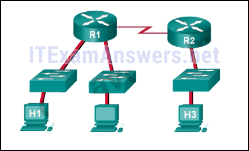
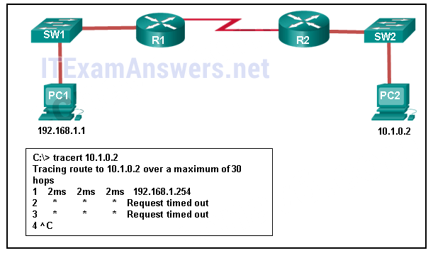
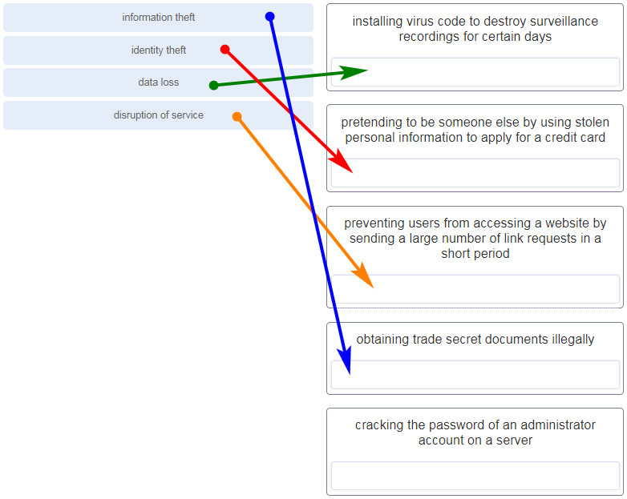

# CCNA 1 v2 - CCNA 1 - Chapter 11

## Question 1

**Question:**
A newly hired network technician is given the task of ordering new hardware for a small business with a large growth forecast. Which primary factor should the technician be concerned with when choosing the new devices?

**Choices:**
- **A.** devices with a fixed number and type of interfaces
- **B.** devices that have support for network monitoring
- **C.** redundant devices
- **D.** devices with support for modularity

**Correct Answer:**
devices with support for modularity

**Explanation:**
In a small business with a large growth forecast, the primary influencing factor would be the ability of devices to support modularity. Devices with a fixed type/number of interfaces would not support growth. Redundancy is an important factor, but typically found in large enterprises. Network monitoring is also an important consideration, but not as important as modularity.

---

## Question 2

**Question:**
Which network design consideration would be more important to a large corporation than to a small business?

**Choices:**
- **A.** Internet router
- **B.** firewall
- **C.** low port density switch
- **D.** redundancy

**Correct Answer:**
redundancy

**Explanation:**
Small businesses today do need Internet access and use an Internet router to provide this need. A switch is required to connect the two host devices and any IP phones or network devices such as a printer or a scanner. The switch may be integrated into the router. A firewall is needed to protect the business computing assets. Redundancy is not normally found in very small companies, but slightly larger small companies might use port density redundancy or have redundant Internet providers/links.

---

## Question 3

**Question:**
Which two traffic types require delay sensitive delivery? (Choose two.)

**Choices:**
- **A.** email
- **B.** web
- **C.** FTP
- **D.** voice
- **E.** video

**Correct Answer:**
voice; video

**Explanation:**
Voice and video traffic have delay sensitive characteristics and must be given priority over other traffic types such as web, email, and file transfer traffic.

---

## Question 4

**Question:**
A network administrator for a small company is contemplating how to scale the network over the next three years to accommodate projected growth. Which three types of information should be used to plan for network growth? (Choose three.)

**Choices:**
- **A.** human resource policies and procedures for all employees in the company
- **B.** documentation of the current physical and logical topologies
- **C.** analysis of the network traffic based on protocols, applications, and services used on the network
- **D.** history and mission statement of the company
- **E.** inventory of the devices that are currently used on the network
- **F.** listing of the current employees and their role in the company

**Correct Answer:**
documentation of the current physical and logical topologies; analysis of the network traffic based on protocols, applications, and services used on the network; inventory of the devices that are currently used on the network

**Explanation:**
Several elements that are needed to scale a network include documentation of the physical and logical topology, a list of devices that are used on the network, and an analysis of the traffic on the network.

---

## Question 5

**Question:**
Which two statements describe how to assess traffic flow patterns and network traffic types using a protocol analyzer? (Choose two.)

**Choices:**
- **A.** Capture traffic on the weekends when most employees are off work.
- **B.** Only capture traffic in the areas of the network that receive most of the traffic such as the data center.
- **C.** Capture traffic during peak utilization times to get a good representation of the different traffic types.
- **D.** Perform the capture on different network segments.
- **E.** Only capture WAN traffic because traffic to the web is responsible for the largest amount of traffic on a network.

**Correct Answer:**
Capture traffic during peak utilization times to get a good representation of the different traffic types.; Perform the capture on different network segments.

**Explanation:**
Traffic flow patterns should be gathered during peak utilization times to get a good representation of the different traffic types. The capture should also be performed on different network segments because some traffic will be local to a particular segment.

---

## Question 6

**Question:**
Some routers and switches in a wiring closet malfunctioned after an air conditioning unit failed. What type of threat does this situation describe?

**Choices:**
- **A.** configuration
- **B.** environmental
- **C.** electrical
- **D.** maintenance

**Correct Answer:**
environmental

**Explanation:**
The four classes of threats are as follows: Hardware threats – physical damage to servers, routers, switches, cabling plant, and workstations Environmental threats – temperature extremes (too hot or too cold) or humidity extremes (too wet or too dry) Electrical threats – voltage spikes, insufficient supply voltage (brownouts), unconditioned power (noise), and total power loss Maintenance threats – poor handling of key electrical components (electrostatic discharge), lack of critical spare parts, poor cabling, and poor labeling

---

## Question 7

**Question:**
Which type of network threat is intended to prevent authorized users from accessing resources?

**Choices:**
- **A.** DoS attacks
- **B.** access attacks
- **C.** reconnaissance attacks
- **D.** trust exploitation

**Correct Answer:**
DoS attacks

**Explanation:**
Network reconnaissance attacks involve the unauthorized discovery and mapping of the network and network systems. Access attacks and trust exploitation involve unauthorized manipulation of data and access to systems or user privileges. DoS, or Denial of Service attacks, are intended to prevent legitimate users and devices from accessing network resources.

---

## Question 8

**Question:**
Which two actions can be taken to prevent a successful network attack on an email server account? (Choose two.)

**Choices:**
- **A.** Never send the password through the network in a clear text.
- **B.** Never use passwords that need the Shift key.
- **C.** Use servers from different vendors.
- **D.** Distribute servers throughout the building, placing them close to the stakeholders.
- **E.** Limit the number of unsuccessful attempts to log in to the server.

**Correct Answer:**
Never send the password through the network in a clear text.; Limit the number of unsuccessful attempts to log in to the server.

**Explanation:**
One of the most common types of access attack uses a packet sniffer to yield user accounts and passwords that are transmitted as clear text. Repeated attempts to log in to a server to gain unauthorized access constitute another type of access attack. Limiting the number of attempts to log in to the server and using encrypted passwords will help prevent successful logins through these types of access attack.

---

## Question 9

**Question:**
Which firewall feature is used to ensure that packets coming into a network are legitimate responses initiated from internal hosts?

**Choices:**
- **A.** application filtering
- **B.** stateful packet inspection
- **C.** URL filtering
- **D.** packet filtering

**Correct Answer:**
stateful packet inspection

**Explanation:**
Stateful packet inspection on a firewall checks that incoming packets are actually legitimate responses to requests originating from hosts inside the network. Packet filtering can be used to permit or deny access to resources based on IP or MAC address. Application filtering can permit or deny access based on port number. URL filtering is used to permit or deny access based on URL or on keywords.

---

## Question 10

**Question:**
What is the purpose of the network security authentication function?

**Choices:**
- **A.** to require users to prove who they are
- **B.** to determine which resources a user can access
- **C.** to keep track of the actions of a user
- **D.** to provide challenge and response questions

**Correct Answer:**
to require users to prove who they are

**Explanation:**
Authentication, authorization, and accounting are network services collectively known as AAA. Authentication requires users to prove who they are. Authorization determines which resources the user can access. Accounting keeps track of the actions of the user.

---

## Question 11

**Question:**
A network administrator is issuing the login block-for 180 attempts 2 within 30 command on a router. Which threat is the network administrator trying to prevent?

**Choices:**
- **A.** a user who is trying to guess a password to access the router
- **B.** a worm that is attempting to access another part of the network
- **C.** an unidentified individual who is trying to access the network equipment room
- **D.** a device that is trying to inspect the traffic on a link

**Correct Answer:**
a user who is trying to guess a password to access the router

**Explanation:**
The login block-for 180 attempts 2 within 30 command will cause the device to block authentication after 2 unsuccessful attempts within 30 seconds for a duration of 180 seconds. A device inspecting the traffic on a link has nothing to do with the router. The router configuration cannot prevent unauthorized access to the equipment room. A worm would not attempt to access the router to propagate to another part of the network.

---

## Question 12

**Question:**
Which two steps are required before SSH can be enabled on a Cisco router? (Choose two.)

**Choices:**
- **A.** Give the router a host name and domain name.
- **B.** Create a banner that will be displayed to users when they connect.
- **C.** Generate a set of secret keys to be used for encryption and decryption.
- **D.** Set up an authentication server to handle incoming connection requests.
- **E.** Enable SSH on the physical interfaces where the incoming connection requests will be received.

**Correct Answer:**
Give the router a host name and domain name.; Generate a set of secret keys to be used for encryption and decryption.

**Explanation:**
There are four steps to configure SSH on a Cisco router. First, set the host name and domain name. Second, generate a set of RSA keys to be used for encrypting and decrypting the traffic. Third, create the user IDs and passwords of the users who will be connecting. Lastly, enable SSH on the vty lines on the router. SSH does not need to be set up on any physical interfaces, nor does an external authentication server need to be used. While it is a good idea to configure a banner to display legal information for connecting users, it is not required to enable SSH.​

---

## Question 13

**Question:**
Refer to the exhibit. Baseline documentation for a small company had ping round trip time statistics of 36/97/132 between hosts H1 and H3. Today the network administrator checked connectivity by pinging between hosts H1 and H3 that resulted in a round trip time of 1458/2390/6066. What does this indicate to the network administrator?

**Images:**

**Choices:**
- **A.** Connectivity between H1 and H3 is fine.
- **B.** H3 is not connected properly to the network.
- **C.** Something is causing interference between H1 and R1.
- **D.** Performance between the networks is within expected parameters.
- **E.** Something is causing a time delay between the networks.

**Correct Answer:**
Something is causing a time delay between the networks.

**Explanation:**
Ping round trip time statistics are shown in milliseconds. The larger the number the more delay. A baseline is critical in times of slow performance. By looking at the documentation for the performance when the network is performing fine and comparing it to information when there is a problem, a network administrator can resolve problems faster.

---

## Question 14

**Question:**
When should an administrator establish a network baseline?

**Choices:**
- **A.** when the traffic is at peak in the network
- **B.** when there is a sudden drop in traffic
- **C.** at the lowest point of traffic in the network
- **D.** at regular intervals over a period of time

**Correct Answer:**
at regular intervals over a period of time

**Explanation:**
An effective network baseline can be established by monitoring the traffic at regular intervals. This allows the administrator to take note when any deviance from the established norm occurs in the network.

---

## Question 15

**Question:**
Refer to the exhibit. An administrator is trying to troubleshoot connectivity between PC1 and PC2 and uses the tracert command from PC1 to do it. Based on the displayed output, where should the administrator begin troubleshooting?

**Images:**

**Choices:**
- **A.** PC2
- **B.** R1
- **C.** SW2
- **D.** R2
- **E.** SW1

**Correct Answer:**
R1

**Explanation:**
Tracert is used to trace the path a packet takes. The only successful response was from the first device along the path on the same LAN as the sending host. The first device is the default gateway on router R1. The administrator should therefore start troubleshooting at R1.

---

## Question 16

**Question:**
Which statement is true about CDP on a Cisco device?

**Choices:**
- **A.** The show cdp neighbor detail command will reveal the IP address of a neighbor only if there is Layer 3 connectivity.
- **B.** To disable CDP globally, the no cdp enable command in interface configuration mode must be used.
- **C.** CDP can be disabled globally or on a specific interface.
- **D.** Because it runs at the data link layer, the CDP protocol can only be implemented in switches.

**Correct Answer:**
CDP can be disabled globally or on a specific interface.

**Explanation:**
CDP is a Cisco-proprietary protocol that can be disabled globally by using the no cdp run global configuration command, or disabled on a specific interface, by using the no cdp enable interface configuration command. Because CDP operates at the data link layer, two or more Cisco network devices, such as routers can learn about each other even if Layer 3 connectivity does not exist. The show cdp neighbors detail command reveals the IP address of a neighboring device regardless of whether you can ping the neighbor.

---

## Question 17

**Question:**
A network administrator for a small campus network has issued the show ip interface brief command on a switch. What is the administrator verifying with this command?

**Choices:**
- **A.** the status of the switch interfaces and the address configured on interface vlan 1
- **B.** that a specific host on another network can be reached
- **C.** the path that is used to reach a specific host on another network
- **D.** the default gateway that is used by the switch

**Correct Answer:**
the status of the switch interfaces and the address configured on interface vlan 1

**Explanation:**
The show ip interface brief command is used to verify the status and IP address configuration of the physical and switch virtual interfaces (SVI).

---

## Question 18

**Question:**
A network technician issues the arp -d * command on a PC after the router that is connected to the LAN is reconfigured. What is the result after this command is issued?

**Choices:**
- **A.** The ARP cache is cleared.
- **B.** The current content of the ARP cache is displayed.
- **C.** The detailed information of the ARP cache is displayed.
- **D.** The ARP cache is synchronized with the router interface.

**Correct Answer:**
The ARP cache is cleared.

**Explanation:**
Issuing the arp –d * command on a PC will clear the ARP cache content. This is helpful when a network technician wants to ensure the cache is populated with updated information.

---

## Question 19

**Question:**
Fill in the blank. VoIP defines the protocols and technologies that implement the transmission of voice data over an IP network

---

## Question 20

**Question:**
Fill in the blank. Do not use abbreviations. The show file systems command provides information about the amount of free nvram and flash memory with the permissions for reading or writing data.

---

## Question 21

**Question:**
Fill in the blank. Do not use abbreviations. The show version command that is issued on a router is used to verify the value of the software configuration register. Explain: The show version command that is issued on a router displays the value of the configuration register, the Cisco IOS version being used, and the amount of flash memory on the device, among other information.​

---

## Question 22

**Question:**
What service defines the protocols and technologies that implement the transmission of voice packets over an IP network?

**Choices:**
- **A.** VoIP
- **B.** NAT
- **C.** DHCP
- **D.** QoS

**Correct Answer:**
VoIP

---

## Question 23

**Question:**
What is the purpose of using SSH to connect to a router?

**Choices:**
- **A.** It allows a secure remote connection to the router command line interface.
- **B.** It allows a router to be configured using a graphical interface.
- **C.** It allows the router to be monitored through a network management application.
- **D.** It allows secure transfer of the IOS software image from an unsecure workstation or server.

**Correct Answer:**
It allows a secure remote connection to the router command line interface.

---

## Question 24

**Question:**
What information about a Cisco router can be verified using the show version command?

**Choices:**
- **A.** the value of the configuration register
- **B.** the administrative distance used to reach networks
- **C.** the operational status of serial interfaces
- **D.** the routing protocol version that is enabled

**Correct Answer:**
the value of the configuration register

---

## Question 25

**Question:**
A network technician issues the C:\> tracert -6 www.cisco.com command on a Windows PC. What is the purpose of the -6 command option?

**Choices:**
- **A.** It forces the trace to use IPv6.
- **B.** It limits the trace to only 6 hops.
- **C.** It sets a 6 milliseconds timeout for each replay.
- **D.** It sends 6 probes within each TTL time period.

**Correct Answer:**
It forces the trace to use IPv6.

**Explanation:**
The -6 option in the command C:\> tracert -6 www.cisco.com is used to force the trace to use IPv6.

---

## Question 26

**Question:**
Which command should be used on a Cisco router or switch to allow log messages to be displayed on remotely connected sessions using Telnet or SSH?

**Choices:**
- **A.** debug all
- **B.** logging synchronous
- **C.** show running-config​
- **D.** terminal monitor

**Correct Answer:**
terminal monitor

**Explanation:**
The terminal monitor command is very important to use when log messages appear. Log messages appear by default when a user is directly consoled into a Cisco device, but require the terminal monitor command to be entered when a user is accessing a network device remotely.

---

## Question 27

**Question:**
Match the type of information security threat to the scenario. (Not all options are used.) Explain: After an intruder gains access to a network, common network threats are as follows: Information theft Identity theft Data loss or manipulation Disruption of service Cracking the password for a known username is a type of access attack. Older Version

**Images:**

---

## Question 28

**Question:**
What is the purpose of issuing the commands cd nvram: then dir at the privilege exec mode of a router?

**Choices:**
- **A.** to clear the content of the NVRAM
- **B.** to direct all new files to the NVRAM
- **C.** to list the content of the NVRAM
- **D.** to copy the directories from the NVRAM

**Correct Answer:**
to list the content of the NVRAM

---

## Question 29

**Question:**
Which command will backup the configuration that is stored in NVRAM to a TFTP server?

**Choices:**
- **A.** copy running-config tftp
- **B.** copy tftp running-config
- **C.** copy startup-config tftp
- **D.** copy tftp startup-config
- **E.** SNMP
- **F.** TCP
- **G.** PoE
- **H.** RTP

**Correct Answer:**
copy startup-config tftp; RTP

**Explanation:**
The startup configuration file is stored in NVRAM, and the running configuration is stored in RAM. The copy command is followed by the source, then the destination. 30. Which protocol supports rapid delivery of streaming media?

---

## Question 30

**Question:**
How should traffic flow be captured in order to best understand traffic patterns in a network?

**Choices:**
- **A.** during low utilization times
- **B.** during peak utilization times
- **C.** when it is on the main network segment only
- **D.** when it is from a subset of users

**Correct Answer:**
during peak utilization times

---

## Question 31

**Question:**
A network administrator checks the security log and notices there was unauthorized access to an internal file server over the weekend. Upon further investigation of the file system log, the administrator notices several important documents were copied to a host located outside of the company. What kind of threat is represented in this scenario?

**Choices:**
- **A.** data loss
- **B.** identity theft
- **C.** information theft
- **D.** disruption of service

**Correct Answer:**
information theft

---

## Question 32

**Question:**
Which two actions can be taken to prevent a successful attack on an email server account? (Choose two.)

**Choices:**
- **A.** Never send the password through the network in a clear text.
- **B.** Never use passwords that need the Shift key.
- **C.** Never allow physical access to the server console.
- **D.** Only permit authorized access to the server room.
- **E.** Limit the number of unsuccessful attempts to log in to the server.

**Correct Answer:**
Never send the password through the network in a clear text.; Limit the number of unsuccessful attempts to log in to the server.

---

## Question 33

**Question:**
Which type of network attack involves the disabling or corruption of networks, systems, or services?

**Choices:**
- **A.** reconnaissance attacks
- **B.** access attacks
- **C.** denial of service attacks
- **D.** malicious code attacks

**Correct Answer:**
denial of service attacks

---

## Question 34

**Question:**
A network administrator has determined that various computers on the network are infected with a worm. Which sequence of steps should be followed to mitigate the worm attack?

**Choices:**
- **A.** inoculation, containment, quarantine, and treatment
- **B.** containment, quarantine, treatment, and inoculation
- **C.** treatment, quarantine, inoculation, and containment
- **D.** containment, inoculation, quarantine, and treatment

**Correct Answer:**
containment, inoculation, quarantine, and treatment

---

## Question 35

**Question:**
What is a security feature of using NAT on a network?

**Choices:**
- **A.** allows external IP addresses to be concealed from internal users
- **B.** allows internal IP addresses to be concealed from external users
- **C.** denies all packets that originate from private IP addresses
- **D.** denies all internal hosts from communicating outside their own network

**Correct Answer:**
allows internal IP addresses to be concealed from external users

**Explanation:**
Network Address Translation (NAT) translates private addresses into public addresses for use on public networks. This feature prevents outside devices from seeing the actual IP addresses that are used by the internal hosts.

---

## Question 36

**Question:**
A ping fails when performed from router R1 to directly connected router R2. The network administrator then proceeds to issue the show cdp neighbors command. Why would the network administrator issue this command if the ping failed between the two routers?

**Choices:**
- **A.** The network administrator suspects a virus because the ping command did not work.
- **B.** The network administrator wants to verify Layer 2 connectivity.
- **C.** The network administrator wants to verify the IP address configured on router R2.
- **D.** The network administrator wants to determine if connectivity can be established from a non-directly connected network.

**Correct Answer:**
The network administrator wants to verify Layer 2 connectivity.

---

## Question 37

**Question:**
If a configuration file is saved to a USB flash drive attached to a router, what must be done by the network administrator before the file can be used on the router?

**Choices:**
- **A.** Convert the file system from FAT32 to FAT16.
- **B.** Edit the configuration file with a text editor.
- **C.** Change the permission on the file from ro to rw.
- **D.** Use the dir command from the router to remove the Windows automatic alphabetization of the files on the flash drive.

**Correct Answer:**
Edit the configuration file with a text editor.

---

## Question 38

**Question:**
Which two statements about a service set identifier (SSID) are true? (Choose two.)

**Choices:**
- **A.** tells a wireless device to which WLAN it belongs
- **B.** consists of a 32-character string and is not case sensitive
- **C.** responsible for determining the signal strength
- **D.** all wireless devices on the same WLAN must have the same SSID
- **E.** used to encrypt data sent across the wireless network

**Correct Answer:**
tells a wireless device to which WLAN it belongs; all wireless devices on the same WLAN must have the same SSID

---

## Question 39

**Question:**
What do WLANs that conform to IEEE 802.11 standards allow wireless users to do?

**Choices:**
- **A.** use wireless mice and keyboards
- **B.** create a one-to-many local network using infrared technology
- **C.** use cell phones to access remote services over very large areas
- **D.** connect wireless hosts to hosts or services on a wired Ethernet network

**Correct Answer:**
connect wireless hosts to hosts or services on a wired Ethernet network

---

## Question 40

**Question:**
Which WLAN security protocol generates a new dynamic key each time a client establishes a connection with the AP?

**Choices:**
- **A.** EAP
- **B.** PSK
- **C.** WEP
- **D.** WPA

**Correct Answer:**
WPA

---

## Question 41

**Question:**
Which two statements characterize wireless network security? (Choose two.)

**Choices:**
- **A.** Wireless networks offer the same security features as wired networks.
- **B.** Some RF channels provide automatic encryption of wireless data.
- **C.** With SSID broadcast disabled, an attacker must know the SSID to connect.
- **D.** Using the default IP address on an access point makes hacking easier.
- **E.** An attacker needs physical access to at least one network device to launch an attack.

**Correct Answer:**
With SSID broadcast disabled, an attacker must know the SSID to connect.; Using the default IP address on an access point makes hacking easier.

---

## Question 42

**Question:**
Open the PT Activity. Perform the tasks in the activity instructions and then answer the question. How long will a user be blocked if the user exceeds the maximum allowed number of unsuccessful login attempts?

**Choices:**
- **A.** 1 minute
- **B.** 2 minutes
- **C.** 3 minutes
- **D.** 4 minutes

**Correct Answer:**
3 minutes

**Explanation:**
Download PDF File below: ITexamanswers.net – CCNA 1 (v5.1 + v6.0) Chapter 11 Exam Answers Full.pdf 1.12 MB 13756 downloads

---
