# CCNA 1 v2 - CCNA 1 - Practice Final

## Question 1

**Question:**
Which term refers to a network that provides secure access to the corporate offices by suppliers, customers and collaborators?

**Choices:**
- **A.** Internet
- **B.** intranet
- **C.** extranet
- **D.** extendednet

**Correct Answer:**
extranet

**Explanation:**
The term Internet refers to the worldwide collection of connected networks. Intranet refers to a private connection of LANs and WANS that belong to an organization and is designed to be accessible to the members of the organization, employees, or others with authorization. Extranets provide secure and Vafe access to ​suppliers, customers, and collaborators. Extendednet is not a type of network.

---

## Question 2

**Question:**
A small business user is looking for an ISP connection that provides high speed digital transmission over regular phone lines. What ISP connection type should be used?

**Choices:**
- **A.** DSL
- **B.** dial-up
- **C.** satellite
- **D.** cell modem
- **E.** cable modem

**Correct Answer:**
DSL

**Explanation:**
DSL is the best technology to use over existing phone lines. A lot of ISPs have a lookup on their website where you can enter your phone number and see if they can offer you service.

---

## Question 3

**Question:**
Refer to the exhibit. An administrator is trying to configure the switch but receives the error message that is displayed in the exhibit. What is the problem?

**Images:**
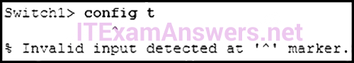

**Choices:**
- **A.** The entire command, configure terminal, must be used.
- **B.** The administrator is already in global configuration mode.
- **C.** The administrator must first enter privileged EXEC mode before issuing the command.
- **D.** The administrator must connect via the console port to access global configuration mode.

**Correct Answer:**
The administrator must first enter privileged EXEC mode before issuing the command.

**Explanation:**
In order to enter global configuration mode, the command configure terminal, or a shortened version such as config t, must be entered from privileged EXEC mode. In this scenario the administrator is in user EXEC mode, as indicated by the > symbol after the hostname. The administrator would need to use the enable command to move into privileged EXEC mode before entering the configure terminal command.

---

## Question 4

**Question:**
Which keys act as a hot key combination that is used to interrupt an IOS process?

**Choices:**
- **A.** Ctrl-Shift-X
- **B.** Ctrl-Shift-6
- **C.** Ctrl-Z
- **D.** Ctrl-C

**Correct Answer:**
Ctrl-Shift-6

**Explanation:**
The Cisco IOS provides both hot keys and shortcuts for configuring routers and switches. The Ctrl-Shift-6 hot key combination is used to interrupt an IOS process, such as a ping or traceroute. Ctrl-Z is used to exit the configuration mode. Ctrl-C aborts the current command. Ctrl-Shift-X has no IOS function.

---

## Question 5

**Question:**
Refer to the exhibit. A network administrator is configuring access control to switch SW1. If the administrator uses Telnet to connect to the switch, which password is needed to access user EXEC mode?

**Images:**
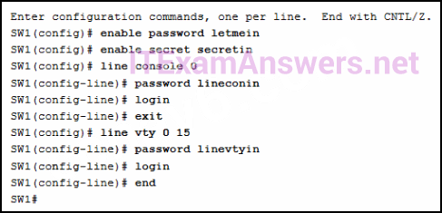

**Choices:**
- **A.** letmein
- **B.** secretin
- **C.** lineconin
- **D.** linevtyin

**Correct Answer:**
linevtyin

**Explanation:**
Telnet accesses a network device through the virtual interface configured with the line VTY command. The password configured under this is required to access the user EXEC mode. The password configured under the line console 0 command is required to gain entry through the console port, and the enable and enable secret passwords are used to allow entry into the privileged EXEC mode.

---

## Question 6

**Question:**
A network administrator enters the service password­encryption command into the configuration mode of a router. What does this command accomplish?

**Choices:**
- **A.** This command encrypts passwords as they are transmitted across serial WAN links.
- **B.** This command prevents someone from viewing the running configuration passwords.
- **C.** This command enables a strong encryption algorithm for the enable secret password command.
- **D.** This command automatically encrypts passwords in configuration files that are currently stored in NVRAM.
- **E.** This command provides an exclusive encrypted password for external service personnel who are required to do router maintenance.

**Correct Answer:**
This command prevents someone from viewing the running configuration passwords.

---

## Question 7

**Question:**
What is the purpose of the SVI on a Cisco switch?

**Choices:**
- **A.** The SVI provides a physical interface for remote access to the switch.
- **B.** The SVI provides a faster method for switching traffic between ports on the switch.
- **C.** The SVI adds Layer 4 connectivity between VLANs.
- **D.** The SVI provides a virtual interface for remote access to the switch.

**Correct Answer:**
The SVI provides a virtual interface for remote access to the switch.

**Explanation:**
The SVI is a virtual, not physical, interface that provides remote access to the switch. It does not impact Layer 4 nor does it enhance switching between switch ports on the switch.

---

## Question 8

**Question:**
Which message delivery option is used when all devices need to receive the same message simultaneously?

**Choices:**
- **A.** duplex
- **B.** unicast
- **C.** multicast
- **D.** broadcast

**Correct Answer:**
broadcast

**Explanation:**
When all devices need to receive the same message simultaneously, the message would be delivered as a broadcast. Unicast delivery occurs when one source host sends a message to one destination host. The sending of the same message from a host to a group of destination hosts is multicast delivery. Duplex communications refers to the ability of the medium to carry messages in both directions.

---

## Question 9

**Question:**
Which two protocols function at the internet layer? (Choose two.)

**Choices:**
- **A.** POP
- **B.** BOOTP
- **C.** ICMP
- **D.** IP
- **E.** PPP

**Correct Answer:**
ICMP; IP

**Explanation:**
ICMP and IP both function at the internet layer, whereas PPP is a network access layer protocol, and POP and BOOTP are application layer protocols.

---

## Question 10

**Question:**
What PDU is associated with the transport layer?

**Choices:**
- **A.** segment
- **B.** packet
- **C.** frame
- **D.** bits

**Correct Answer:**
segment

**Explanation:**
The PDU for the transport layer is called a segment. Packets, frames, and bits are PDUs for the network, data link, and physical layers respectively.

---

## Question 11

**Question:**
What is done to an IP packet before it is transmitted over the physical medium?

**Choices:**
- **A.** It is tagged with information guaranteeing reliable delivery.
- **B.** It is segmented into smaller individual pieces.
- **C.** It is encapsulated into a TCP segment.
- **D.** It is encapsulated in a Layer 2 frame.

**Correct Answer:**
It is encapsulated in a Layer 2 frame.

**Explanation:**
When messages are sent on a network, the encapsulation process works from the top of the OSI or TCP/IP model to the bottom. At each layer of the model, the upper layer information is encapsulated into the data field of the next protocol. For example, before an IP packet can be sent, it is encapsulated in a data link frame at Layer 2 so that it can be sent over the physical medium.

---

## Question 12

**Question:**
What type of communication medium is used with a wireless LAN connection?

**Choices:**
- **A.** fiber
- **B.** radio waves
- **C.** microwave
- **D.** UTP

**Correct Answer:**
radio waves

**Explanation:**
A wired LAN connection commonly uses UTP. A wireless LAN connection uses radio waves.

---

## Question 13

**Question:**
In addition to the cable length, what two factors could interfere with the communication carried over UTP cables? (Choose two.)

**Choices:**
- **A.** crosstalk
- **B.** bandwidth
- **C.** size of the network
- **D.** signal modulation technique
- **E.** electromagnetic interference

**Correct Answer:**
crosstalk; electromagnetic interference

**Explanation:**
Copper media is widely used in network communications. However, copper media is limited by distance and signal interference. Data is transmitted on copper cables as electrical pulses. The electrical pulses are susceptible to interference from two sources: Electromagnetic interference (EMI) or radio frequency interference (RFI) – EMI and RFI signals can distort and corrupt the data signals being carried by copper media. Crosstalk – Crosstalk is a disturbance caused by the electric or magnetic fields of a signal on one wire interfering with the signal in an adjacent wire.

---

## Question 14

**Question:**
What are the two sublayers of the OSI model data link layer? (Choose two.)

**Choices:**
- **A.** internet
- **B.** physical
- **C.** LLC
- **D.** transport
- **E.** MAC
- **F.** network access

**Correct Answer:**
LLC; MAC

**Explanation:**
The data link layer of the OSI model is divided into two sublayers: the Media Access Control (MAC) sublayer and the Logical Link Control (LLC) sublayer.

---

## Question 15

**Question:**
A technician has been asked to develop a physical topology for a network that provides a high level of redundancy. Which physical topology requires that every node is attached to every other node on the network?

**Choices:**
- **A.** bus
- **B.** hierarchical
- **C.** mesh
- **D.** ring
- **E.** star

**Correct Answer:**
mesh

**Explanation:**
The mesh topology provides high availability because every node is connected to all other nodes. Mesh topologies can be found in WANs. A partial mesh topology can also be used where some, but not all, end points connect to one another.

---

## Question 16

**Question:**
What type of communication rule would best describe CSMA/CD?

**Choices:**
- **A.** access method
- **B.** flow control
- **C.** message encapsulation
- **D.** message encoding

**Correct Answer:**
access method

**Explanation:**
Carrier sense multiple access collision detection (CSMA/CD) is the access method used with Ethernet. The access method rule of communication dictates how a network device is able to place a signal on the carrier. CSMA/CD dictates those rules on an Ethernet network and CSMA/CA dictates those rules on an 802.11 wireless LAN.

---

## Question 17

**Question:**
If data is being sent over a wireless network, then connects to an Ethernet network, and eventually connects to a DSL connection, which header will be replaced each time the data travels through a network infrastructure device?

**Choices:**
- **A.** Layer 3
- **B.** data link
- **C.** physical
- **D.** Layer 4

**Correct Answer:**
data link

**Explanation:**
Because each data link layer protocol controls how the device accesses the media, the data link information must be removed and re-attached. Even if a packet is going from one Ethernet network to another Ethernet network, the data link layer information is replaced.

---

## Question 18

**Question:**
What best describes the destination IPv4 address that is used by multicasting?

**Choices:**
- **A.** a single IP multicast address that is used by all destinations in a group
- **B.** an IP address that is unique for each destination in the group
- **C.** a group address that shares the last 23 bits with the source IPv4 address
- **D.** a 48 bit address that is determined by the number of members in the multicast group

**Correct Answer:**
a single IP multicast address that is used by all destinations in a group

**Explanation:**
The destination multicast IPv4 address is a group address, which is a single IP multicast address within the Class D range.

---

## Question 19

**Question:**
In an Ethernet network, when a device receives a frame of 1200 bytes, what will it do?

**Choices:**
- **A.** drop the frame
- **B.** process the frame as it is
- **C.** send an error message to the sending device
- **D.** add random data bytes to make the frame 1518 bytes long and then forward it

**Correct Answer:**
process the frame as it is

**Explanation:**
Ethernet standards define the minimum frame as 64 bytes and a maximum of 1518 bytes. A frame less than 64 bytes is considered a “collision fragment” or “runt frame” and is automatically discarded by receiving devices. A frame greater than 1500 is considered a “baby giant”. A 1200 byte frame is within the normal range so it would be processed as is.

---

## Question 20

**Question:**
What important information is examined in the Ethernet frame header by a Layer 2 device in order to forward the data onward?

**Choices:**
- **A.** source MAC address
- **B.** source IP address
- **C.** destination MAC address
- **D.** Ethernet type
- **E.** destination IP address

**Correct Answer:**
destination MAC address

**Explanation:**
The Layer 2 device, such as a switch, uses the destination MAC address to determine which path (interface or port) should be used to send the data onward to the destination device.

---

## Question 21

**Question:**
What will a Layer 2 switch do when the destination MAC address of a received frame is not in the MAC table?

**Choices:**
- **A.** It initiates an ARP request.
- **B.** It broadcasts the frame out of all ports on the switch.
- **C.** It notifies the sending host that the frame cannot be delivered.
- **D.** It forwards the frame out of all ports except for the port at which the frame was received.

**Correct Answer:**
It forwards the frame out of all ports except for the port at which the frame was received.

**Explanation:**
A Layer 2 switch determines how to handle incoming frames by using its MAC address table. When an incoming frame contains a destination MAC address that is not in the table, the switch forwards the frame out all ports, except for the port on which it was received.

---

## Question 22

**Question:**
What are two features of ARP? (Choose two.)

**Choices:**
- **A.** If a host is ready to send a packet to a local destination device and it has the IP address but not the MAC address of the destination, it generates an ARP broadcast.
- **B.** An ARP request is sent to all devices on the Ethernet LAN and contains the IP address of the destination host and its multicast MAC address.
- **C.** When a host is encapsulating a packet into a frame, it refers to the MAC address table to determine the mapping of IP addresses to MAC addresses.
- **D.** If no device responds to the ARP request, then the originating node will broadcast the data packet to all devices on the network segment.
- **E.** If a device receiving an ARP request has the destination IPv4 address, it responds with an ARP reply.

**Correct Answer:**
If a host is ready to send a packet to a local destination device and it has the IP address but not the MAC address of the destination, it generates an ARP broadcast.; If a device receiving an ARP request has the destination IPv4 address, it responds with an ARP reply.

**Explanation:**
When a node encapsulates a data packet into a frame, it needs the destination MAC address. First it determines if the destination device is on the local network or on a remote network. Then it checks the ARP table (not the MAC table) to see if a pair of IP address and MAC address exists for either the destination IP address (if the destination host is on the local network) or the default gateway IP address (if the destination host is on a remote network). If the match does not exist, it generates an ARP broadcast to seek the IP address to MAC address resolution. Because the destination MAC address is unknown, the ARP request is broadcast with the MAC address FFFF.FFFF.FFFF. Either the destination device or the default gateway will respond with its MAC address, which enables the sending node to assemble the frame. If no device responds to the ARP request, then the originating node will discard the packet because a frame cannot be created.

---

## Question 23

**Question:**
Which two services are required to enable a computer to receive dynamic IP addresses and access the Internet using domain names? (Choose two.)

**Choices:**
- **A.** DNS
- **B.** WINS
- **C.** HTTP
- **D.** DHCP
- **E.** SMTP

**Correct Answer:**
DNS; DHCP

---

## Question 24

**Question:**
What is a basic characteristic of the IP protocol?

**Choices:**
- **A.** connectionless
- **B.** media dependent
- **C.** user data segmentation
- **D.** reliable end-to-end delivery

**Correct Answer:**
connectionless

**Explanation:**
Internet Protocol (IP) is a network layer protocol that does not require initial exchange of control information to establish an end-to-end connection before packets are forwarded. Thus, IP is connectionless and does not provide reliable end-to-end delivery by itself. IP is media independent. User data segmentation is a service provided at the transport layer.

---

## Question 25

**Question:**
Refer to the exhibit. A user issues the command netstat –r on a workstation. Which IPv6 address is one of the link-local addresses of the workstation?

**Images:**

**Choices:**
- **A.** ::1/128
- **B.** fe80::30d0:115:3f57:fe4c/128
- **C.** fe80::/64
- **D.** 2001:0:9d38:6ab8:30d0:115:3f57:fe4c/128

**Correct Answer:**
fe80::30d0:115:3f57:fe4c/128

**Explanation:**
In the IPv6 address scheme, the network of fe80::/10 is reserved for link-local addresses. The address fe80::/64 is a network address that indicates, in this workstation, fe80::/64 is actually used for link-local addresses. Thus the address fe80::30d0:115:3f57:fe4c/128 is a valid IPv6 link-local address.

---

## Question 26

**Question:**
What is the valid most compressed format possible of the IPv6 address 2001:0DB8:0000:AB00:0000:0000:0000:1234?

**Choices:**
- **A.** 2001:DB8:0:AB00::1234
- **B.** 2001:DB8:0:AB::1234
- **C.** 2001:DB8::AB00::1234
- **D.** 2001:DB8:0:AB:0:1234

**Correct Answer:**
2001:DB8:0:AB00::1234

**Explanation:**
There are two rules defining how an IPv6 address can be compressed. The first rule states that leading zeros in a hextet can be eliminated. The second rule states that a single :: can be used to represent one or more contiguous all zero hextets. There can be one and only one :: in an IPv6 address.

---

## Question 27

**Question:**
At a minimum, which address is required on IPv6-enabled interfaces?

**Choices:**
- **A.** link-local
- **B.** unique local
- **C.** site local
- **D.** global unicast

**Correct Answer:**
link-local

**Explanation:**
All IPv6 enabled interfaces must at minimum have a link-local address. Other IPv6 addresses can be assigned to the interface as required.

---

## Question 28

**Question:**
An IPv6 enabled device sends a data packet with the destination address of FF02::2. What is the target of this packet?

**Choices:**
- **A.** all IPv6 enabled devices across the network
- **B.** all IPv6 enabled devices on the local link
- **C.** all IPv6 DHCP servers
- **D.** all IPv6 configured routers on the local link

**Correct Answer:**
all IPv6 configured routers on the local link

**Explanation:**
FF02::2 identifies all IPv6 routers that exist on the link or network. FF02::1 is the target for all IPv6 enabled devices on the link or network.​

---

## Question 29

**Question:**
What is the purpose of ICMP messages?

**Choices:**
- **A.** to inform routers about network topology changes
- **B.** to ensure the delivery of an IP packet
- **C.** to provide feedback of IP packet transmissions
- **D.** to monitor the process of a domain name to IP address resolution

**Correct Answer:**
to provide feedback of IP packet transmissions

**Explanation:**
The purpose of ICMP messages is to provide feedback about issues that are related to the processing of IP packets.

---

## Question 30

**Question:**
Which statement describes a characteristic of the traceroute utility?

**Choices:**
- **A.** It sends four Echo Request messages.
- **B.** It utilizes the ICMP Source Quench messages.
- **C.** It is primarily used to test connectivity between two hosts.
- **D.** It identifies the routers in the path from a source host to a destination host.

**Correct Answer:**
It identifies the routers in the path from a source host to a destination host.

**Explanation:**
Traceroute is a utility that generates a list of hops (or routers) along the path from a source host to the destination host.

---

## Question 31

**Question:**
What is the usable number of host IP addresses on a network that has a /26 mask?

**Choices:**
- **A.** 256
- **B.** 254
- **C.** 64
- **D.** 62
- **E.** 32
- **F.** 16

**Correct Answer:**
62

**Explanation:**
A /26 mask is the same as 255.255.255.192. The mask leaves 6 host bits. With 6 host bits, 64 IP addresses are possible. One address represents the subnet number and one address represents the broadcast address, which means that 62 addresses can then be used to assign to network devices.

---

## Question 32

**Question:**
Refer to the exhibit. An administrator must send a message to everyone on the router A network. What is the broadcast address for network 172.16.16.0/22?

**Images:**
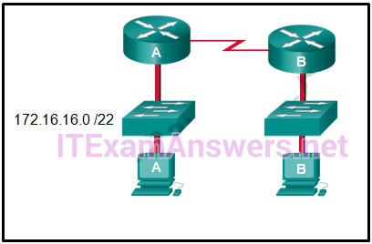

**Choices:**
- **A.** 172.16.16.255
- **B.** 172.16.20.255
- **C.** 172.16.19.255
- **D.** 172.16.23.255
- **E.** 172.16.255.255

**Correct Answer:**
172.16.19.255

**Explanation:**
The 172.16.16.0/22 network has 22 bits in the network portion and 10 bits in the host portion. Converting the network address to binary yields a subnet mask of 255.255.252.0. The range of addresses in this network will end with the last address available before 172.16.20.0. Valid host addresses for this network range from 172.16.16.1-172.16.19.254, making 172.16.19.255 the broadcast address.

---

## Question 33

**Question:**
Given IPv6 address prefix 2001:db8::/48, what will be the last subnet that is created if the subnet prefix is changed to /52?

**Choices:**
- **A.** 2001:db8:0:f00::/52
- **B.** 2001:db8:0:8000::/52
- **C.** 2001:db8:0:f::/52
- **D.** 2001:db8:0:f000::/52

**Correct Answer:**
2001:db8:0:f000::/52

**Explanation:**
Prefix 2001:db8::/48 has 48 network bits. If we subnet to a /52, we are moving the network boundary four bits to the right and creating 16 subnets. The first subnet is 2001:db8::/52 the last subnet is 2001:db8:0:f000::/52.

---

## Question 34

**Question:**
A technician with a PC is using multiple applications while connected to the Internet. How is the PC able to keep track of the data flow between multiple application sessions and have each application receive the correct packet flows?

**Choices:**
- **A.** The data flow is being tracked based on the destination port number utilized by each application.
- **B.** The data flow is being tracked based on the source port number utilized by each application.
- **C.** The data flow is being tracked based on the source IP address used by the PC of the technician.
- **D.** The data flow is being tracked based on the destination IP address used by the PC of the technician.

**Correct Answer:**
The data flow is being tracked based on the source port number utilized by each application.

**Explanation:**
The source port number of an application is randomly generated and used to individually keep track of each session connecting out to the Internet. Each application will use a unique source port number to provide simultaneous communication from multiple applications through the Internet.

---

## Question 35

**Question:**
What three services are provided by the transport layer? (Choose three.)

**Choices:**
- **A.** flow control
- **B.** encryption of data
- **C.** path determination
- **D.** connection establishment
- **E.** error recovery
- **F.** bit transmission
- **G.** data representation

**Correct Answer:**
flow control; connection establishment; error recovery

**Explanation:**
The transport layer is responsible for tracking digital conversations between a source application and a destination application through the use of port numbers. Two protocols that operate at the transport layer are TCP and UDP. TCP can provide reliability by establishing a connection, maintaining flow control, and error recovery.

---

## Question 36

**Question:**
An Internet television transmission is using UDP. What happens when part of the transmission is not delivered to the destination?

**Choices:**
- **A.** A delivery failure message is sent to the source host.
- **B.** The part of the television transmission that was lost is re-sent.
- **C.** The entire transmission is re-sent.
- **D.** The transmission continues without the missing portion.

**Correct Answer:**
The transmission continues without the missing portion.

**Explanation:**
Most streaming services, such as Internet television, use UDP as the transport layer protocol. These transmissions can tolerate some transmission failures, and no failure messages or retransmissions are required. Such control measures would create noticeable disruption to the flow of data.

---

## Question 37

**Question:**
Which two OSI model layers are considered to be included in the top layer of the TCP/IP protocol stack? (Choose two.)

**Choices:**
- **A.** internet
- **B.** network
- **C.** presentation
- **D.** session
- **E.** transport

**Correct Answer:**
presentation; session

**Explanation:**
The top three OSI model layers are included in the top layer of the TCP/IP protocol stack. These top three OSI model layers include the application, presentation, and session layers

---

## Question 38

**Question:**
An author is uploading one chapter document from a personal computer to a file server of a book publisher. What role is the personal computer assuming in this network model?

**Choices:**
- **A.** client
- **B.** master
- **C.** server
- **D.** slave
- **E.** transient

**Correct Answer:**
client

**Explanation:**
In the client/server network model, a network device assumes the role of server in order to provide a particular service such as file transfer and storage. The device requesting the service assumes the role of client. In the client/server network model, a dedicated server does not have to be used, but if one is present, the network model being used is the client/server model. In contrast, the peer-to-peer network model does not have a dedicated server.

---

## Question 39

**Question:**
Which two automatic addressing assignments are supported by DHCPv4? (Choose two.)

**Choices:**
- **A.** local server address
- **B.** subnet mask
- **C.** default gateway address
- **D.** physical address of the recipient
- **E.** physical address of the sender

**Correct Answer:**
subnet mask; default gateway address

---

## Question 40

**Question:**
When a network administrator is trying to manage network traffic on a growing network, when should traffic flow patterns be analyzed?

**Choices:**
- **A.** during times of peak utilization
- **B.** during off-peak hours
- **C.** during employee holidays and weekends
- **D.** during randomly selected times

**Correct Answer:**
during times of peak utilization

**Explanation:**
Planning for network growth requires knowledge of the types of traffic traveling on the network. Network administrators can use a protocol analyzer to identify the traffic on the network. To get the best representation of the different types of traffic, the network should be analyzed during peak utilization.

---

## Question 41

**Question:**
What is the objective of a network reconnaissance attack?

**Choices:**
- **A.** discovery and mapping of systems
- **B.** unauthorized manipulation of data
- **C.** disabling network systems or services
- **D.** denying access to resources by legitimate users

**Correct Answer:**
discovery and mapping of systems

**Explanation:**
The objective of a network reconnaissance attack is to discover information about a network, network systems, and network services.

---

## Question 42

**Question:**
A network administrator enters the service password-encryption command into the configuration mode of a router. What does this command accomplish?

**Choices:**
- **A.** This command encrypts passwords as they are transmitted across serial WAN links.
- **B.** This command automatically encrypts passwords in configuration files that are currently stored in NVRAM.
- **C.** This command provides an exclusive encrypted password for external service personnel who are required to do router maintenance.
- **D.** This command enables a strong encryption algorithm for the enable secret password command.
- **E.** This command prevents someone from viewing the running configuration passwords.

**Correct Answer:**
This command prevents someone from viewing the running configuration passwords.

---

## Question 43

**Question:**
What will be the result of failed login attempts if the following command is entered into a router?

**Choices:**
- **A.** login block-for 150 attempts 4 within 90
- **B.** All login attempts will be blocked for 150 seconds if there are 4 failed attempts within 90 seconds.
- **C.** All login attempts will be blocked for 90 seconds if there are 4 failed attempts within 150 seconds.
- **D.** All login attempts will be blocked for 1.5 hours if there are 4 failed attempts within 150 seconds.
- **E.** All login attempts will be blocked for 4 hours if there are 90 failed attempts within 150 seconds.

**Correct Answer:**
All login attempts will be blocked for 150 seconds if there are 4 failed attempts within 90 seconds.

**Explanation:**
The components of the login block-for 150 attempts 4 within 90 command are as follows: The expression block-for 150 is the time in seconds that logins will be blocked. The expression attempts 4 is the number of failed attempts that will trigger the blocking of login requests. The expression within 90 is the time in seconds in which the 4 failed attempts must occur.

---

## Question 44

**Question:**
Which two statements correctly describe a router memory type and its contents? (Choose two.)

**Choices:**
- **A.** ROM is nonvolatile and stores the running IOS.
- **B.** FLASH is nonvolatile and contains a limited portion of the IOS​.
- **C.** RAM is volatile and stores the IP routing table.
- **D.** NVRAM is nonvolatile and stores a full version of the IOS.
- **E.** ROM is nonvolatile and contains basic diagnostic software.

**Correct Answer:**
RAM is volatile and stores the IP routing table.; ROM is nonvolatile and contains basic diagnostic software.

**Explanation:**
ROM is a nonvolatile memory and stores bootup instructions, basic diagnostic software, and a limited IOS. Flash is a nonvolatile memory used as permanent storage for the IOS and other system-related files. RAM is volatile memory and stores the IP routing table, IPv4 to MAC address mappings in the ARP cache, packets that are buffered or temporarily stored, the running configuration, and the currently running IOS. NVRAM is a nonvolatile memory that stores the startup configuration file.

---

## Question 45

**Question:**
A user reports a lack of network connectivity. The technician takes control of the user machine and attempts to ping other computers on the network and these pings fail. The technician pings the default gateway and that also fails. What can be determined for sure by the results of these tests?

**Choices:**
- **A.** The NIC in the PC is bad.
- **B.** The TCP/IP protocol is not enabled.
- **C.** The router that is attached to the same network as the workstation is down.
- **D.** Nothing can be determined for sure at this point.

**Correct Answer:**
Nothing can be determined for sure at this point.

**Explanation:**
In networks today, a failed ping could mean that the other devices on the network are blocking pings. Further investigation such as checking network connectivity from other devices on the same network is warranted.

---

## Question 46

**Question:**
For Cisco IOS, which escape sequence allows terminating a traceroute operation?

**Choices:**
- **A.** Ctrl+Shift+6
- **B.** Ctrl+Esc
- **C.** Ctrl+x
- **D.** Ctrl+c

**Correct Answer:**
Ctrl+Shift+6

**Explanation:**
Once a traceroute is initiated in the Cisco IOS, it can be stopped by issuing the Ctrl+Shift+6 escape sequence.

---

## Question 47

**Question:**
Match the phases to the functions during the boot up process of a Cisco router. (Not all options are used.) Place the options in the following order. — not scored — locale and load the Cisco IOS software -> phase 2 locate and load the startup configuration file -> phase 3 perform the POST and load the bootstrap program -> phase 1 Explain: There are three major phases to the bootup process of a Cisco router: Perform the POST and load the bootstrap program. Locate and load the Cisco IOS software. Locate and load the startup configuration file If a startup configuration file cannot be located, the router will enter setup mode by displaying the setup mode prompt.

**Images:**
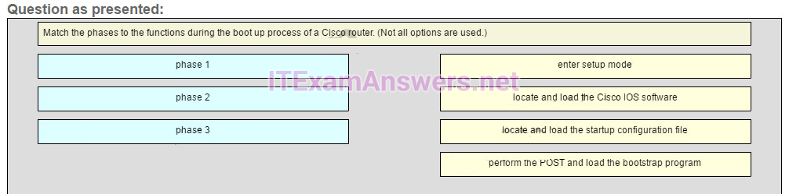
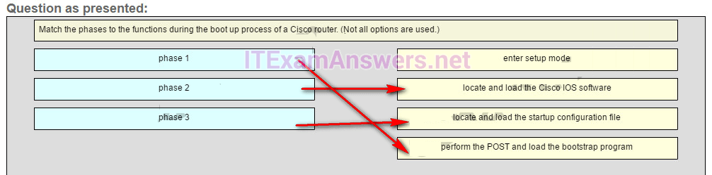

---

## Question 48

**Question:**
What three blocks of addresses are defined by RFC 1918 for private network use? (Choose three.)

**Choices:**
- **A.** 10.0.0.0/8
- **B.** 172.16.0.0/12
- **C.** 192.168.0.0/16
- **D.** 100.64.0.0/14
- **E.** 169.254.0.0/16
- **F.** 239.0.0.0/8

**Correct Answer:**
10.0.0.0/8; 172.16.0.0/12; 192.168.0.0/16

**Explanation:**
RFC 1918, Address Allocation for Private Internets, defines three blocks of IPv4 address for private networks that should not be routable on the public Internet. 10.0.0.0/8 172.16.0.0/12 192.168.0.0/16

---

## Question 49

**Question:**
A network administrator is variably subnetting a given block of IPv4 addresses. Which combination of network addresses and prefix lengths will make the most efficient use of addresses when the need is for 2 subnets capable of supporting 10 hosts and 1 subnet that can support 6 hosts?

**Choices:**
- **A.** 10.1.1.128/28 10.1.1.144/28 10.1.1.160/29
- **B.** 10.1.1.128/28 10.1.1.144/28 10.1.1.160/2810.1.1.128/28 10.1.1.140/28 10.1.1.158/26
- **C.** 10.1.1.128/26 10.1.1.144/26 10.1.1.160/26
- **D.** 10.1.1.128/26 10.1.1.140/26 10.1.1.158/28

**Correct Answer:**
10.1.1.128/28 10.1.1.144/28 10.1.1.160/29

**Explanation:**
Prefix lengths of /28 and /29 are the most efficient to create subnets of 16 addresses (to support 10 hosts) and 8 addresses (to support 6 hosts), respectively. Addresses in one subnet must also not overlap into the range of another subnet.

---

## Question 50

**Question:**
Match the descriptions to the terms. (Not all options are used.) Question Answer Place the options in the following order. — not scored — CLI -> users interact with the operating system by typing commands GUI -> enables the user to interact with the operating system by pointing and clicking kernel -> the part of the OS that interacts directly with the device hardware shell -> the part of the operating system that interfaces with applications and the user Explain: A GUI, or graphical user interface, allows the user to interact with the operating system by pointing and clicking at elements on the screen. A CLI, or command-line interface, requires users to type commands at a prompt in order to interact with the OS. The shell is the part of the operating system that is closest to the user. The kernel is the part of the operating system that interfaces with the hardware.

**Images:**
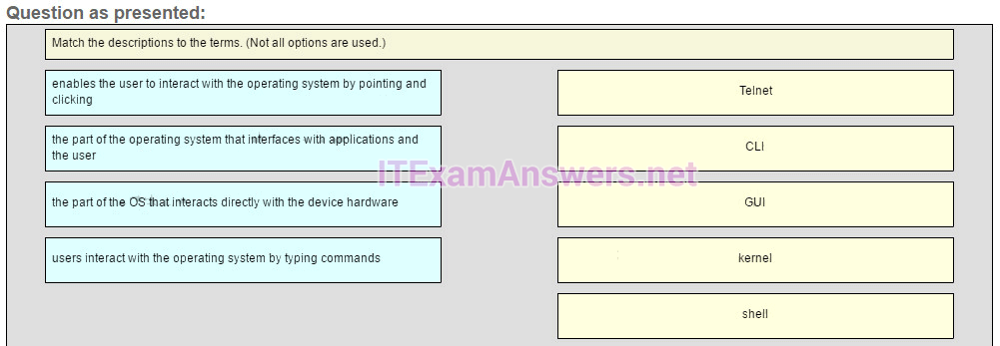
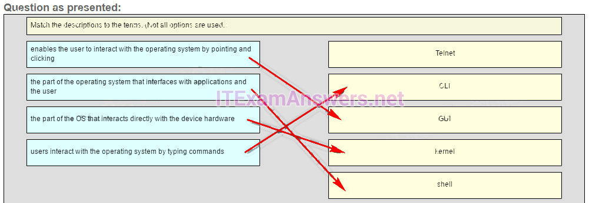

---

## Question 51

**Question:**
Match the requirements of a reliable network with the supporting network architecture. (Not all options are used.) Question Answer Place the options in the following order. Protect the network from unauthorized access. -> security Provide redundant links and devices. -> fault tolerance — not scored — Expand the network without degrading the service for existing users. -> scalability — not scored —

**Images:**
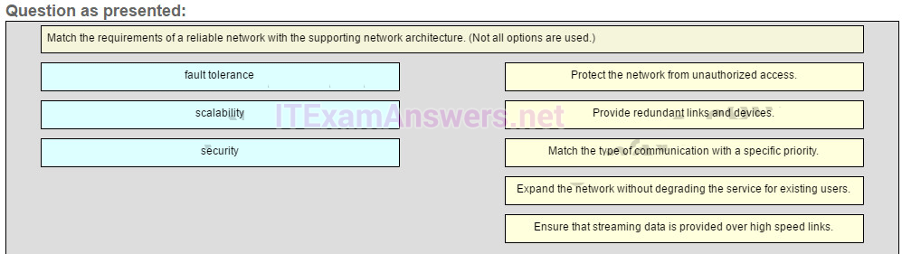
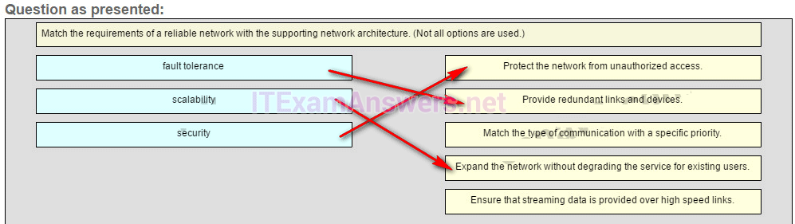

---

## Question 52

**Question:**
Match the functions with the corresponding OSI layer. (Not all options are used.) Question Answer Place the options in the following order. Application layer HTTP and FTP end user program functionality Presentation layer compression common format Session layer dialog maintenance

**Images:**
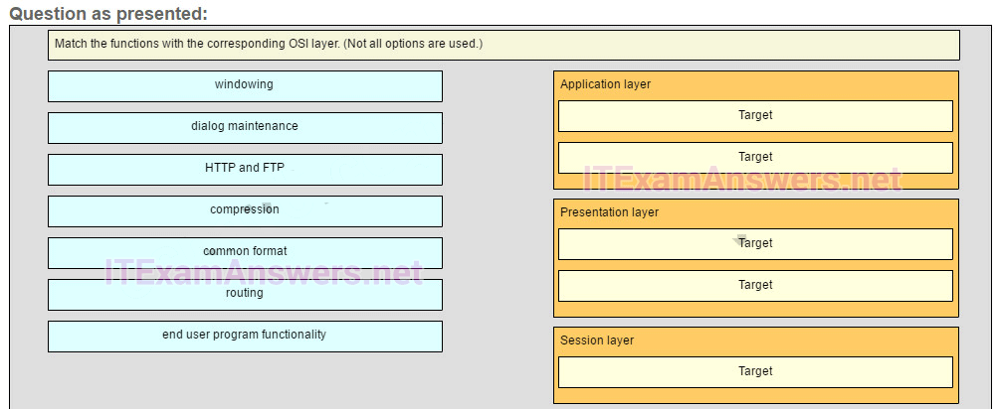
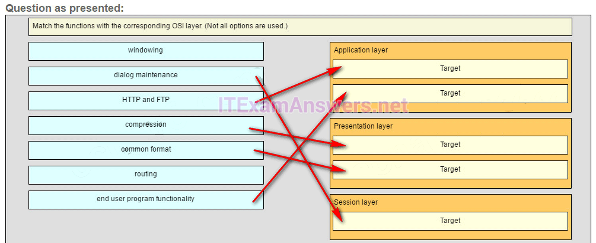

---

## Question 53

**Question:**
What subnet mask is required to support 512 subnets on networks 172.28.0.0/16?

**Choices:**
- **A.** 255.255.240.0
- **B.** 255.255.255.224
- **C.** 255.255.255.240
- **D.** 255.255.255.128
- **E.** 255.255.252.0

**Correct Answer:**
255.255.255.128

---

## Question 54

**Question:**
A DHCP server is used to IP addresses dynamically to the hosts on a network. The address pool is configured with 10.29.244.0/25. There are 19 printers on this network that need to use reserve static IP addresses from the pool. How many IP address in the pool are left to be assign to other hosts?

**Choices:**
- **A.** 210
- **B.** 60
- **C.** 109
- **D.** 107
- **E.** 146

**Correct Answer:**
107

**Explanation:**
Older Version

---

## Question 55

**Question:**
What is an advantage of storing configuration files to a USB flash drive instead of to a TFTP server?

**Choices:**
- **A.** The files can be saved without using terminal emulation software.
- **B.** The transfer of the files does not rely on network connectivity.
- **C.** The USB flash drive is more secure.
- **D.** The configuration files can be stored to a flash drive that uses any file system format.

**Correct Answer:**
The transfer of the files does not rely on network connectivity.

---

## Question 56

**Question:**
Refer to the exhibit. An administrator is trying to view the current configuration on this switch but receives the error message that is displayed. What does this error indicate?

**Images:**
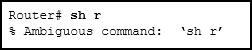

**Choices:**
- **A.** The command does not exist.
- **B.** One or more required keywords or arguments were omitted.
- **C.** Not enough characters were entered for the interpreter to recognize the command.
- **D.** The administrator does not have the required level of access to use this command.

**Correct Answer:**
Not enough characters were entered for the interpreter to recognize the command.

---

## Question 57

**Question:**
A host is accessing a Web server on a remote network. Which three functions are performed by intermediary network devices during this conversation? (Choose three.)

**Choices:**
- **A.** regenerating data signals
- **B.** acting as a client or a server
- **C.** providing a channel over which messages travel
- **D.** applying security settings to control the flow of data
- **E.** notifying other devices when errors occur
- **F.** serving as the source or destination of the messages

**Correct Answer:**
regenerating data signals; applying security settings to control the flow of data; notifying other devices when errors occur

---

## Question 58

**Question:**
For which three reasons was a packet-switched connectionless data communications technology used when developing the Internet? (Choose three.)

**Choices:**
- **A.** It can rapidly adapt to the loss of data transmission facilities.
- **B.** It efficiently utilizes the network infrastructure to transfer data.
- **C.** Data packets can travel multiple paths through the network simultaneously.
- **D.** It allows for billing of network use by the amount of time a connection is established.
- **E.** It requires that a data circuit between the source and destination be established before data can be transferred.

**Correct Answer:**
It can rapidly adapt to the loss of data transmission facilities.; It efficiently utilizes the network infrastructure to transfer data.; Data packets can travel multiple paths through the network simultaneously.

---

## Question 59

**Question:**
A medium-sized business is researching available options for connecting to the Internet. The company is looking for a high speed option with dedicated, symmetric access. Which connection type should the company choose?

**Choices:**
- **A.** DSL
- **B.** dialup
- **C.** satellite
- **D.** leased line
- **E.** cable modem

**Correct Answer:**
leased line

---

## Question 60

**Question:**
What is an ISP?

**Choices:**
- **A.** It is a standards body that develops cabling and wiring standards for networking.
- **B.** It is a protocol that establishes how computers within a local network communicate.
- **C.** It is an organization that enables individuals and businesses to connect to the Internet.
- **D.** It is a networking device that combines the functionality of several different networking devices in one.

**Correct Answer:**
It is an organization that enables individuals and businesses to connect to the Internet.

---

## Question 61

**Question:**
Refer to the exhibit. A network engineer is attempting to connect to a new router to perform the initial configuration. The engineer connects a rollover cable from the serial port of a PC to the Aux port on the router, then configures HyperTerminal as shown. The engineer cannot get a login prompt in HyperTerminal. What would fix the problem? CCNA 1 Practice Final Answer 001 (v5.02, 2015)

**Images:**
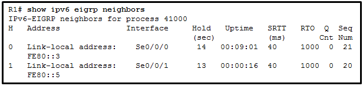

**Choices:**
- **A.** Connect to the Ethernet port on the PC.
- **B.** Change connection settings to even parity.
- **C.** Move the cable to the router console port.
- **D.** Use a crossover cable instead of a rollover cable.

**Correct Answer:**
Move the cable to the router console port.

---

## Question 62

**Question:**
Which connection provides a secure CLI session with encryption to a Cisco router?

**Choices:**
- **A.** a console connection
- **B.** an AUX connection
- **C.** a Telnet connection
- **D.** an SSH connection

**Correct Answer:**
an SSH connection

**Explanation:**
A CLI session using Secure Shell (SSH) provides enhanced security because SSH supports strong passwords and encryption during the transport of session data. The other methods support authentication but not encryption.

---

## Question 63

**Question:**
Refer to the exhibit. From global configuration mode, an administrator is attempting to create a message-of-the-day banner by using the command banner motd V Authorized access only! Violators will be prosecuted! V When users log in using Telnet, the banner does not appear correctly. What is the problem? CCNA 1 Practice Final Answer 003 (v5.02, 2015)

**Images:**
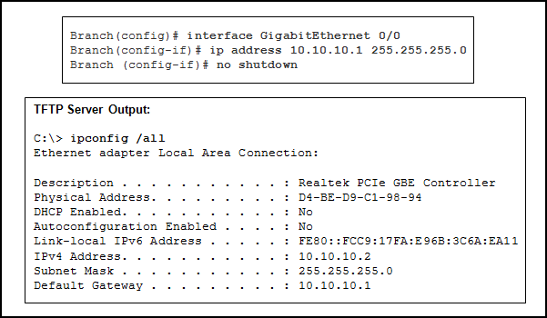

**Choices:**
- **A.** The banner message is too long.
- **B.** The delimiting character appears in the banner message.
- **C.** The symbol “!” signals the end of a banner message.
- **D.** Message-of-the-day banners will only appear when a user logs in through the console port.

**Correct Answer:**
The delimiting character appears in the banner message.

---

## Question 64

**Question:**
What will happen if the default gateway address is incorrectly configured on a host?

**Choices:**
- **A.** The host cannot communicate with other hosts in the local network.
- **B.** The switch will not forward packets initiated by the host.
- **C.** The host will have to use ARP to determine the correct address of the default gateway.
- **D.** The host cannot communicate with hosts in other networks.
- **E.** A ping from the host to 127.0.0.1 would not be successful.

**Correct Answer:**
The host cannot communicate with hosts in other networks.

---

## Question 65

**Question:**
A network administrator is designing a new network infrastructure that includes both wired and wireless connectivity. Under which situation would a wireless connection be recommended?

**Choices:**
- **A.** The end-user device only has an Ethernet NIC.
- **B.** The end-user device requires a dedicated connection because of performance requirements.
- **C.** The end-user device needs mobility when connecting to the network.
- **D.** The end-user device area has a high concentration of RFI.

**Correct Answer:**
The end-user device needs mobility when connecting to the network.

---

## Question 66

**Question:**
A network administrator is troubleshooting connectivity issues on a server. Using a tester, the administrator notices that the signals generated by the server NIC are distorted and not usable. In which layer of the OSI model is the error categorized?

**Choices:**
- **A.** presentation layer
- **B.** network layer
- **C.** physical layer
- **D.** data link layer

**Correct Answer:**
physical layer

---

## Question 67

**Question:**
Refer to the exhibit. Which layer of the OSI model would format data in this way? CCNA 1 Practice Final Answer 005 (v5.02, 2015)

**Images:**
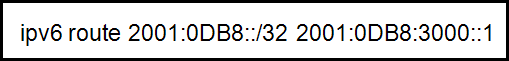

**Choices:**
- **A.** physical
- **B.** network
- **C.** data link
- **D.** transport
- **E.** application

**Correct Answer:**
data link

---

## Question 68

**Question:**
On a point-to-point network, which communication type is used when two devices can both transmit and receive but not at the same time?

**Choices:**
- **A.** controlled access
- **B.** deterministic
- **C.** full-duplex
- **D.** half-duplex

**Correct Answer:**
half-duplex

**Explanation:**
Half-duplex communication occurs when both devices can both transmit and receive on the medium but cannot do so simultaneously. Full-duplex communication occurs when both devices can transmit and receive on the medium at the same time. Half-duplex communication is typically contention-based, whereas controlled (deterministic) access is applied in technologies where devices take turns to access the medium.

---

## Question 69

**Question:**
A frame is transmitted from one networking device to another. Why does the receiving device check the FCS field in the frame?

**Choices:**
- **A.** to determine the physical address of the sending device
- **B.** to verify the network layer protocol information
- **C.** to compare the interface media type between the sending and receiving ends
- **D.** to check the frame for possible transmission errors
- **E.** to verify that the frame destination matches the MAC address of the receiving device

**Correct Answer:**
to check the frame for possible transmission errors

---

## Question 70

**Question:**
The ARP table in a switch maps which two types of address together?

**Choices:**
- **A.** Layer 3 address to a Layer 2 address
- **B.** Layer 3 address to a Layer 4 address
- **C.** Layer 4 address to a Layer 2 address
- **D.** Layer 2 address to a Layer 4 address

**Correct Answer:**
Layer 3 address to a Layer 2 address

---

## Question 71

**Question:**
What are two actions performed by a Cisco switch? (Choose two.)

**Choices:**
- **A.** building a routing table that is based on the first IP address in the frame header
- **B.** using the source MAC addresses of frames to build and maintain a MAC address table
- **C.** forwarding frames with unknown destination IP addresses to the default gateway
- **D.** utilizing the MAC address table to forward frames via the destination MAC address
- **E.** examining the destination MAC address to add new entries to the MAC address table

**Correct Answer:**
using the source MAC addresses of frames to build and maintain a MAC address table; utilizing the MAC address table to forward frames via the destination MAC address

---

## Question 72

**Question:**
Which two functions are primary functions of a router? (Choose two.)

**Choices:**
- **A.** packet switching
- **B.** microsegmentation
- **C.** domain name resolution
- **D.** path selection
- **E.** flow control

**Correct Answer:**
packet switching; path selection

---

## Question 73

**Question:**
A router boots and enters setup mode. What is the reason for this?

**Choices:**
- **A.** The IOS image is corrupt.
- **B.** Cisco IOS is missing from flash memory.
- **C.** The configuration file is missing from NVRAM.
- **D.** The POST process has detected hardware failure.

**Correct Answer:**
The configuration file is missing from NVRAM.

**Explanation:**
If a router cannot locate the startup-config file in NVRAM, it will enter setup mode to allow the configuration to be entered from the console device.

---

## Question 74

**Question:**
Using default settings, what is the next step in the router boot sequence after the IOS loads from flash?

**Choices:**
- **A.** Perform the POST routine.
- **B.** Search for a backup IOS in ROM.
- **C.** Load the bootstrap program from ROM.
- **D.** Load the running-config file from RAM.
- **E.** Locate and load the startup-config file from NVRAM.

**Correct Answer:**
Locate and load the startup-config file from NVRAM.

**Explanation:**
There are three major steps to the router boot sequence: Perform Power-On-Self-Test (POST) Load the IOS from Flash or TFTP server Load the startup configuration file from NVRAM

---

## Question 75

**Question:**
What are two ways that TCP uses the sequence numbers in a segment? (Choose two.)

**Choices:**
- **A.** to identify missing segments at the destination
- **B.** to reassemble the segments at the remote location
- **C.** to specify the order in which the segments travel from source to destination
- **D.** to limit the number of segments that can be sent out of an interface at one time
- **E.** to determine if the packet changed during transit

**Correct Answer:**
to identify missing segments at the destination; to reassemble the segments at the remote location

---

## Question 76

**Question:**
A high school in New York (school A) is using videoconferencing technology to establish student interactions with another high school (school B) in Russia. The videoconferencing is conducted between two end devices through the Internet. The network administrator of school A configures the end device with the IP address 192.168.25.10. The administrator sends a request for the IP address for the end device in school B and the response is 192.168.25.10. The administrator knows immediately that this IP will not work. Why?

**Choices:**
- **A.** This is a loopback address.
- **B.** This is a link-local address.
- **C.** This is a private IP address.
- **D.** There is an IP address conflict.

**Correct Answer:**
This is a private IP address.

---

## Question 77

**Question:**
Which service will translate private internal IP addresses into Internet routable public IP addresses?

**Choices:**
- **A.** ARP
- **B.** DHCP
- **C.** DNS
- **D.** NAT

**Correct Answer:**
NAT

---

## Question 78

**Question:**
Which IPv6 address notation is valid?

**Choices:**
- **A.** 2001:0DB8::ABCD::1234
- **B.** ABCD:160D::4GAB:FFAB
- **C.** 2001:DB8:0:1111::200
- **D.** 2001::ABCD::

**Correct Answer:**
2001:DB8:0:1111::200

**Explanation:**
IPv6 addresses are represented by 32 hexadecimal digits (0-9, A-F). The size of the notation can be reduced by eliminating leading zeroes in any hextet and by replacing a single, contiguous string of hextets containing all zeroes with a double colon, which can only be used one time.

---

## Question 79

**Question:**
Which range of link-local addresses can be assigned to an IPv6-enabled interface??

**Choices:**
- **A.** FEC0::/10?
- **B.** FDEE::/7?
- **C.** FEBF::/10
- **D.** FF00::/8?

**Correct Answer:**
FEBF::/10

---

## Question 80

**Question:**
What are the three parts of an IPv6 global unicast address? (Choose three.)

**Choices:**
- **A.** broadcast address
- **B.** global routing prefix
- **C.** subnet mask
- **D.** subnet ID
- **E.** interface ID

**Correct Answer:**
global routing prefix; subnet ID; interface ID

**Explanation:**
The general format for IPv6 global unicast addresses includes a global routing prefix, a subnet ID, and an interface ID. The global routing prefix is the network portion of the address. A typical global routing prefix is /48 assigned by the Internet provider. The subnet ID portion can be used by an organization to create multiple subnetwork numbers. The interface ID is similar to the host portion of an IPv4 address.

---

## Question 81

**Question:**
A network administrator has been issued a network address of 192.31.7.64/26. How many subnets of equal size could be created from the assigned /26 network by using a /28 prefix?

**Choices:**
- **A.** 3
- **B.** 4
- **C.** 6
- **D.** 8
- **E.** 14
- **F.** 16

**Correct Answer:**
4

---

## Question 82

**Question:**
A small satellite office has been given the overall network number of 192.168.99.0/24 and the network technician can subdivide the network addresses as needed. The office needs network access for both wired and wireless devices. However, because of the security consideration, these two networks should be separate. The wired network will have 20 devices. The wireless network has a potential connection of 45 devices. Which addressing scheme would be most efficient for these two networks?

**Choices:**
- **A.** 192.168.99.0/26 192.168.99.64/27
- **B.** 192.168.99.0/27 192.168.99.32/26
- **C.** 192.168.99.0/27 192.168.99.32/28
- **D.** 192.168.99.0/28 192.168.99.16/28
- **E.** 192.168.99.0/28 192.168.99.64/26

**Correct Answer:**
192.168.99.0/26 192.168.99.64/27

---

## Question 83

**Question:**
The administrator of a branch office receives an IPv6 prefix of 2001:db8:3000::/52 from the corporate network manager. How many subnets can the administrator create?

**Choices:**
- **A.** 1024
- **B.** 2048
- **C.** 4096
- **D.** 8192
- **E.** 65536

**Correct Answer:**
4096

---

## Question 84

**Question:**
A user is attempting to access http://www.cisco.com/ without success. Which two configuration values must be set on the host to allow this access? (Choose two.)

**Choices:**
- **A.** DNS server
- **B.** source port number
- **C.** HTTP server
- **D.** source MAC address
- **E.** default gateway

**Correct Answer:**
DNS server; default gateway

**Explanation:**
To access a website like http://www.cisco.com/, two critical configuration values are required beyond a basic IP address and subnet mask. First, a DNS server address is necessary to resolve the human-readable domain name into a numeric IP address that the network layer can use for routing. Second, because the website resides on a remote network (the internet), a default gateway must be configured to allow the host to forward packets outside of its local network segment. Without these, the host can neither find the server’s IP address nor reach any destination beyond its own local LAN.

---

## Question 85

**Question:**
Which devices should be secured to mitigate against MAC address spoofing attacks?

**Choices:**
- **A.** Layer 7 devices
- **B.** Layer 4 devices
- **C.** Layer 2 devices
- **D.** Layer 3 devices

**Correct Answer:**
Layer 2 devices

---

## Question 86

**Question:**
Which router configuration mode would an administrator use to configure the router for SSH or Telnet login access?

**Choices:**
- **A.** line
- **B.** router
- **C.** global
- **D.** interface
- **E.** privileged EXEC

**Correct Answer:**
line

---

## Question 87

**Question:**
Refer to the exhibit. An administrator is testing connectivity to a remote device with the IP address 10.1.1.1. What does the output of this command indicate?

**Images:**

**Choices:**
- **A.** Connectivity to the remote device was successful.
- **B.** A router along the path did not have a route to the destination.
- **C.** A ping packet is being blocked by a security device along the path.
- **D.** The connection timed out while waiting for a reply from the remote device.

**Correct Answer:**
A router along the path did not have a route to the destination.

**Explanation:**
In the output of the ping command, an exclamation mark (!) indicates a response was successfully received, a period (.) indicates that the connection timed out while waiting for a reply, and the letter “U” indicates that a router along the path did not have a route to the destination and sent an ICMP destination unreachable message back to the source.

---

## Question 88

**Question:**
Which is a function of the show ip route command when used as a tool for troubleshooting network connectivity?

**Choices:**
- **A.** indicates the point of failure in the connection
- **B.** shows the IP address of the next hop router for each route
- **C.** lists the IP addresses of all hops the traffic will pass through to reach the destination network
- **D.** shows the incoming and outgoing interfaces the traffic will go through in order to reach the destination network

**Correct Answer:**
shows the IP address of the next hop router for each route

---

## Question 89

**Question:**
A user calls the help desk to report that a Windows XP workstation is unable to connect to the network after startup and that a popup window says “This connection has limited or no connectivity.” The technician asks the user to issue the ipconfig /all command. The user reports the IP address is 169.254.69.196 with subnet mask of 255.255.0.0 and nothing is displayed for the DNS server IP address. What is the cause of the problem?

**Choices:**
- **A.** The workstation NIC has malfunctioned.
- **B.** The subnet mask was configured incorrectly.
- **C.** The DNS server IP address needs to be configured.
- **D.** The workstation is unable to obtain an IP address from a DHCP server.

**Correct Answer:**
The workstation is unable to obtain an IP address from a DHCP server.

---

## Question 90

**Question:**
A particular email site does not appear to be responding on a Windows 7 computer. What command could the technician use to show any cached DNS entries for this web page?

**Choices:**
- **A.** ipconfig /all
- **B.** arp -a
- **C.** ipconfig /displaydns
- **D.** nslookup

**Correct Answer:**
ipconfig /displaydns

---

## Question 91

**Question:**
To revert to a previous configuration, an administrator issues the command copy tftp startup-config on a router and enters the host address and file name when prompted. After the command is completed, why does the current configuration remain unchanged?

**Choices:**
- **A.** The command should have been copy startup-config tftp.
- **B.** The configuration should have been copied to the running configuration instead.
- **C.** The configuration changes were copied into RAM and require a reboot to take effect.
- **D.** A TFTP server can only be used to restore the Cisco IOS, not the router configuration.

**Correct Answer:**
The configuration should have been copied to the running configuration instead.

---

## Question 92

**Question:**
Refer to the graphic. What is the effect of setting the security mode to WEP on the Linksys integrated router? CCNA 1 Practice Final Answer 008 (v5.02, 2015)

**Images:**
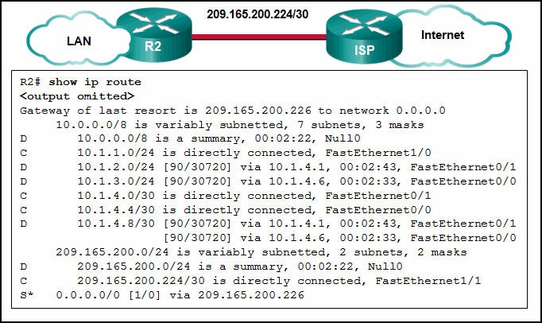

**Choices:**
- **A.** It identifies the wireless LAN.
- **B.** It allows the access point to inform clients of its presence.
- **C.** It translates IP addresses into easy-to-remember domain names.
- **D.** It encrypts data between the wireless client and the access point.
- **E.** It translates an internal address or group of addresses into an outside, public address.

**Correct Answer:**
It encrypts data between the wireless client and the access point.

---

## Question 93

**Question:**
Which type of wireless security is easily compromised?

**Choices:**
- **A.** EAP
- **B.** PSK
- **C.** WEP
- **D.** WPA

**Correct Answer:**
WEP

---

## Question 94

**Question:**
Refer to the exhibit. Which two settings could be changed to improve security on the wireless network? (Choose two.) CCNA 1 Practice Final Answer 009 (v5.02, 2015)

**Images:**
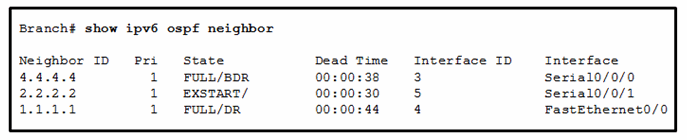

**Choices:**
- **A.** network mode
- **B.** SSID
- **C.** radio band
- **D.** wide channel
- **E.** standard channel
- **F.** SSID broadcast

**Correct Answer:**
SSID; SSID broadcast

---

## Question 95

**Question:**
Fill in the blank. Do not abbreviate. Use lower case. Which interface configuration mode command puts a Layer 3 switch interface into Layer 3 mode? no switchport

---

## Question 96

**Question:**
Fill in the blank. A nibble consists of 4 bits.

---

## Question 97

**Question:**
Match each item to the type of topology diagram on which it is typically identified. (Not all options are used.)

**Images:**
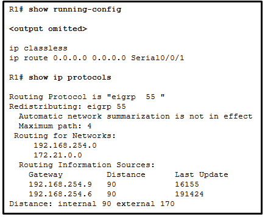

---

## Question 98

**Question:**
Match the situation with the appropriate use of network media.

**Images:**
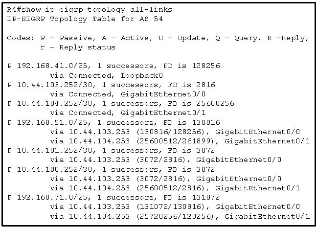

---

## Question 99

**Question:**
Open the PT activity. Perform the tasks in the activity instructions and then fill in the blank. The Server0 message is winner .?

**Images:**

---

## Question 100

**Question:**
Which two statements are correct in a comparison of IPv4 and IPv6 packet headers? (Choose two.)

**Choices:**
- **A.** The Source Address field name from IPv4 is kept in IPv6.
- **B.** The Version field from IPv4 is not kept in IPv6.
- **C.** The Destination Address field is new in IPv6.
- **D.** The Header Checksum field name from IPv4 is kept in IPv6.
- **E.** The Time-to-Live field from IPv4 has been replaced by the Hop Limit field in IPv6.

**Correct Answer:**
The Source Address field name from IPv4 is kept in IPv6.; The Time-to-Live field from IPv4 has been replaced by the Hop Limit field in IPv6.

**Explanation:**
The IPv6 packet header fields are as follows: Version, Traffic Class, Flow Label, Payload Length, Next Header, Hop Limit, Source Address, and Destination Address. The IPv4 packet header fields include the following: Version, Differentiated Services, Time-to-Live, Protocol, Source IP Address, and Destination IP Address. Both versions have a 4-bit Version field. Both versions have a Source (IP) Address field. IPv4 addresses are 32 bits; IPv6 addresses are 128 bits. The Time-to-Live or TTL field in IPv4 is now called Hop Limit in IPv6, but this field serves the same purpose in both versions. The value in this 8-bit field decrements each time a packet passes through any router. When this value is 0, the packet is discarded and is not forwarded to any other router.

---

## Question 101

**Question:**
Why are port numbers included in the TCP header of a segment?

**Choices:**
- **A.** to allow the receiving host to assemble the packet in the proper order
- **B.** to enable a receiving host to forward the data to the appropriate application
- **C.** to determine which Layer 3 protocol should be used to encapsulate the data
- **D.** to identify which switch ports should receive or forward the segment
- **E.** to indicate the correct router interface that should be used to forward a segment

**Correct Answer:**
to enable a receiving host to forward the data to the appropriate application

---

## Question 102

**Question:**
Open the PT Activity. Perform the tasks in the activity instructions and then answer the question. What is the secret keyword that is displayed on the web page?

**Images:**
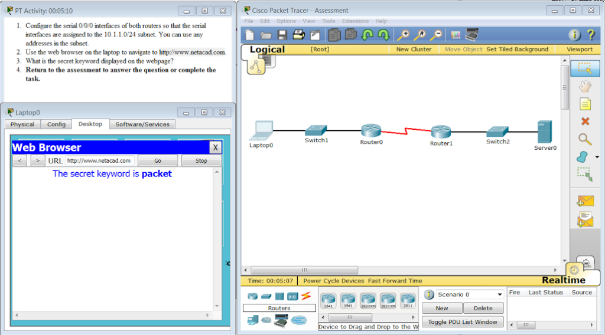

**Choices:**
- **A.** cisco
- **B.** switch
- **C.** frame
- **D.** packet
- **E.** router

**Correct Answer:**
packet

---

## Question 103

**Question:**
Which two types of applications rely on their traffic having priority over other traffic types through the network? (Choose two.)

**Choices:**
- **A.** email
- **B.** voice
- **C.** file transfer
- **D.** instant messaging
- **E.** video

**Correct Answer:**
voice; video

---

## Question 104

**Question:**
Fill in the blank. In dotted decimal notation, the IP address “ 172.25.0.126 ” is the last host address for the network 172.25.0.64/26.

---

## Question 105

**Question:**
What are two characteristics of a scalable network? (Choose two.)

**Choices:**
- **A.** is not as reliable as a small network
- **B.** grows in size without impacting existing users
- **C.** easily overloaded with increased traffic
- **D.** suitable for modular devices that allow for expansion
- **E.** offers limited number of applications

**Correct Answer:**
grows in size without impacting existing users; suitable for modular devices that allow for expansion

---

## Question 106

**Question:**
Match the subnetwork to a host address that would be included within the subnetwork. (Not all options are used.) Explanation: Subnet 192.168.1.32/27 will have a valid host range from 192.168.1.33 – 192.168.1.62 with the broadcast address as 192.168.1.63 Subnet 192.168.1.64/27 will have a valid host range from 192.168.1.65 – 192.168.1.94 with the broadcast address as 192.168.1.95 Subnet 192.168.1.96/27 will have a valid host range from 192.168.1.97 – 192.168.1.126 with the broadcast address as 192.168.1.127

**Images:**

---

## Question 107

**Question:**
What information is added during encapsulation at OSI Layer 3?

**Choices:**
- **A.** source and destination port number
- **B.** source and destination MAC
- **C.** source and destination IP address
- **D.** source and destination application protocol

**Correct Answer:**
source and destination IP address

---

## Question 108

**Question:**
Refer to the exhibit. HostA is attempting to contact ServerB. Which two statements correctly describe the addressing that HostA will generate in the process? (Choose two.)

**Images:**
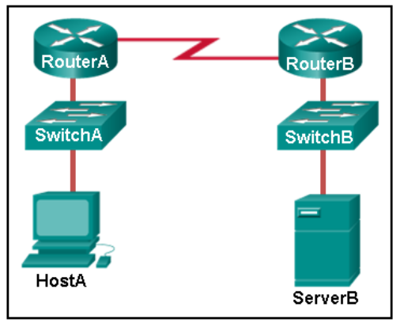

**Choices:**
- **A.** A packet with the destination IP address of RouterA.
- **B.** A frame with the destination MAC address of SwitchA.
- **C.** A frame with the destination MAC address of RouterA.
- **D.** A packet with the destination IP address of RouterB.
- **E.** A packet with the destination IP address of ServerB.
- **F.** A frame with the destination MAC address of ServerB.

**Correct Answer:**
A frame with the destination MAC address of RouterA.; A packet with the destination IP address of ServerB.

---

## Question 109

**Question:**
What will a host on an Ethernet network do if it receives a frame with a destination MAC address that does not match its own MAC address?

**Choices:**
- **A.** It will remove the frame from the media.
- **B.** It will discard the frame.
- **C.** It will forward the frame to the next host.
- **D.** It will strip off the data-link frame to check the destination IP address.

**Correct Answer:**
It will discard the frame.

---

## Question 110

**Question:**
A PC that is communicating with a web server is utilizing a window size of 6,000 bytes when sending data and a packet size of 1,500 bytes. What byte of information will the web server acknowledge after it has received four packets of data from the PC?

**Choices:**
- **A.** 1,500
- **B.** 5
- **C.** 6,001
- **D.** 1,501
- **E.** 6,000

**Correct Answer:**
6,001

---

## Question 111

**Question:**
What three primary functions does data link layer encapsulation provide? (Choose three.)

**Choices:**
- **A.** error detection
- **B.** port identification
- **C.** addressing
- **D.** path determination
- **E.** IP address resolution
- **F.** frame delimiting

**Correct Answer:**
error detection; addressing; frame delimiting

---

## Question 112

**Question:**
Fill in the blank using a number. The minimum Ethernet frame size is “ 64 ” bytes. Anything smaller than that should be considered a “runt frame.”

---

## Question 113

**Question:**
What three statements describe features or functions of media access control? (Choose three.)

**Choices:**
- **A.** Ethernet utilizes CSMA/CD.
- **B.** 802.11 utilizes CSMA/CD.
- **C.** It uses contention-based access also known as deterministic access.
- **D.** Data link layer protocols define the rules for access to different media.
- **E.** Controlled media access involves collision handling.
- **F.** It is responsible for detecting transmission errors in transmitted data.

**Correct Answer:**
Ethernet utilizes CSMA/CD.; Data link layer protocols define the rules for access to different media.; It is responsible for detecting transmission errors in transmitted data.

---

## Question 114

**Question:**
Open the PT activity. Perform the tasks in the activity instructions and then answer the question. Which information is obtained from this command output?

**Images:**
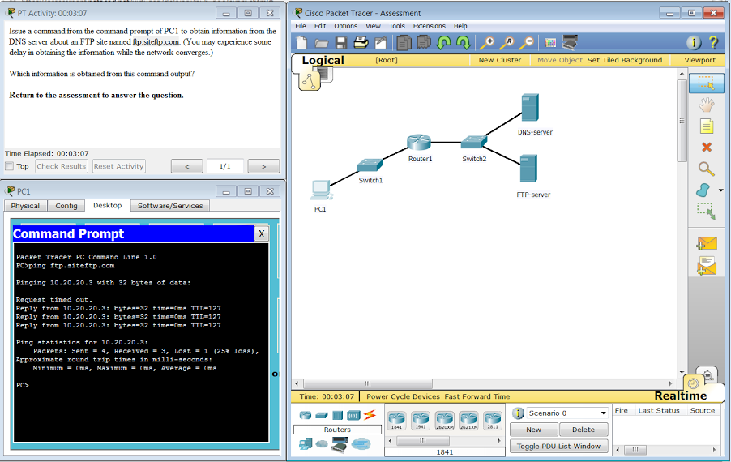

**Choices:**
- **A.** 10.20.20.3, non-authoritative answer
- **B.** 10.20.20.4, non-authoritative answer
- **C.** 10.20.20.3, authoritative answer
- **D.** 10.20.20.4, authoritative answer

**Correct Answer:**
10.20.20.3, non-authoritative answer

---

## Question 115

**Question:**
What makes fiber preferable to copper cabling for interconnecting buildings? (Choose three.)

**Choices:**
- **A.** greater bandwidth potential
- **B.** limited susceptibility to EMI/RFI
- **C.** durable connections
- **D.** easily terminated
- **E.** greater distances per cable run
- **F.** lower installation cost

**Correct Answer:**
greater bandwidth potential; limited susceptibility to EMI/RFI; greater distances per cable run

---

## Question 116

**Question:**
A network team is comparing physical WAN topologies for connecting remote sites to a headquarters building. Which topology provides high availability and connects some, but not all, remote sites?

**Choices:**
- **A.** point-to-point
- **B.** mesh
- **C.** partial mesh
- **D.** hub and spoke

**Correct Answer:**
partial mesh

---

## Question 117

**Question:**
What is the function of CSMA/CA in a WLAN?

**Choices:**
- **A.** It assures that clients are connected to the correct WLAN.
- **B.** It describes the smallest building block of the WLAN.
- **C.** It provides the mechanism for media access.
- **D.** It allows a host to move between cells without loss of signal.

**Correct Answer:**
It provides the mechanism for media access.

---

## Question 118

**Question:**
Fill in the blank. A nibble consists of “ 4 ” bits.

---

## Question 119

**Question:**
Place the options in the following order: [+] cables connecting rooms to wiring closets [+] desktop PC in a classroom [#] IP address of a server [#] a switch located in a classroom [+] Order does not matter within this group. [#] Order does not matter within this group.

**Images:**
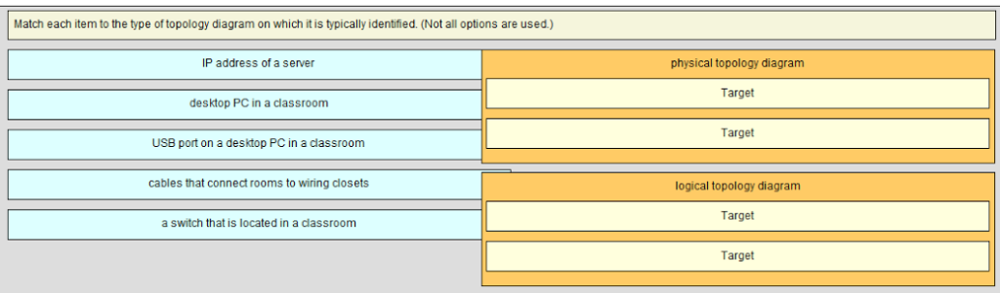
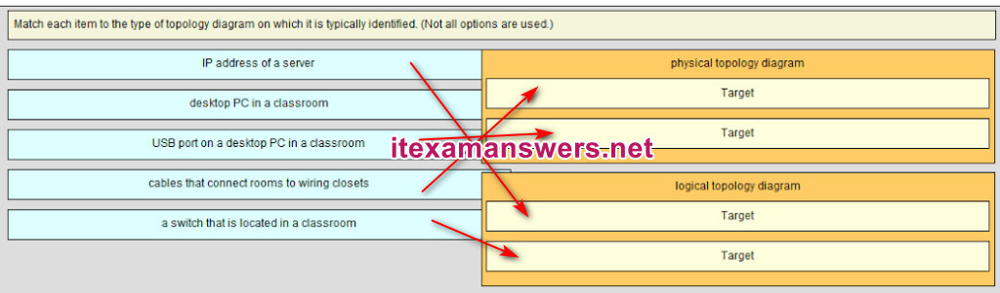

---

## Question 120

**Question:**
Why are the paired wires twisted in a CAT5 cable?

**Choices:**
- **A.** to improve the mechanical strength
- **B.** to provide eletromagnetic noise cancellation
- **C.** to facilitate cable termination in the connector
- **D.** to extend the signaling length

**Correct Answer:**
to provide eletromagnetic noise cancellation

---

## Question 121

**Question:**
Refer to the exhibit. What will be the result of entering this configuration the next time a network administrator connects a console cable to the router and no additional commands have been entered?

**Images:**
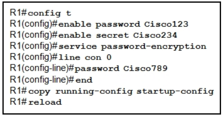

**Choices:**
- **A.** The administrator will be presented with the R1> prompt.
- **B.** The administrator will be required to enter Cisco789.
- **C.** The administrator will be required to enter Cisco234.
- **D.** The administrator will be required to enter Cisco123.

**Correct Answer:**
The administrator will be presented with the R1> prompt.

**Explanation:**
Until both the password password and the login commands are entered in console line configuration mode, no password is required to gain access to enable mode.

---

## Question 122

**Question:**
Match each description with the appropriate type of threat (Not all options are used.)

**Images:**
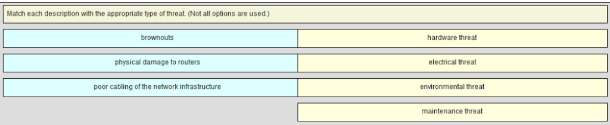
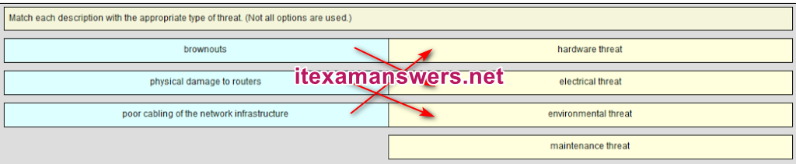

---

## Question 123

**Question:**
Refer to the exhibit. Using VLSM, what is the largest and smallest subnet mask required on this network in order to minimize address waste?

**Images:**
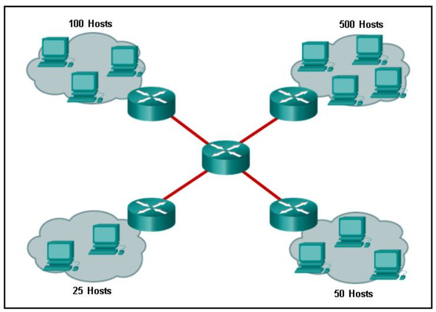

**Choices:**
- **A.** 255.255.254.0 and 255.255.255.252
- **B.** 255.255.255.128 and 255.255.255.224
- **C.** 255.255.254.0 and 255.255.255.224
- **D.** 255.255.255.0 and 255.255.255.252

**Correct Answer:**
255.255.254.0 and 255.255.255.252

---

## Question 124

**Question:**
What is one purpose of the TCP three-way handshake?

**Choices:**
- **A.** synchronizing sequence numbers between source and destination in preparation for data transfer
- **B.** determining the IP address of the destination host in preparation for data transfer
- **C.** sending echo requests from the source to the destination host to establish the presence of the destination
- **D.** requesting the destination to transfer a binary file to the source

**Correct Answer:**
synchronizing sequence numbers between source and destination in preparation for data transfer

---

## Question 125

**Question:**
Which type of wireless security is easily compromised?

**Choices:**
- **A.** EAP
- **B.** PSK
- **C.** WEP
- **D.** WPA

**Correct Answer:**
WEP

---

## Question 126

**Question:**
An administrator needs to upgrade the IOS in a router to a version that supports new features. Which factor should the administrator consider before performing the upgrade?

**Choices:**
- **A.** NVRAM must be erased before the new IOS can be installed.
- **B.** The old IOS should be backed up to NVRAM so that it is not lost during a power failure.
- **C.** The new IOS might require more RAM to function properly.
- **D.** The old IOS must be removed first.

**Correct Answer:**
The new IOS might require more RAM to function properly.

---

## Question 127

**Question:**
Which two statements describe the characteristics of fiber-optic cabling? (Choose two.)

**Choices:**
- **A.** Fiber-optic cabling does not conduct electricity.
- **B.** Fiber-optic cabling has high signal loss.
- **C.** Fiber-optic cabling is primarily used as backbone cabling.
- **D.** Multimode fiber-optic cabling carries signals from multiple sending devices.
- **E.** Fiber-optic cabling uses LEDs for single-mode cab​les and laser technology for multimode cables.

**Correct Answer:**
Fiber-optic cabling does not conduct electricity.; Fiber-optic cabling is primarily used as backbone cabling.

---

## Question 128

**Question:**
A host PC is attempting to lease an address through DHCP. What message is sent by the server to let the client know it is able to use the provided IP information?

**Choices:**
- **A.** DHCPDISCOVER
- **B.** DHCPOFFER
- **C.** DHCPREQUEST
- **D.** DHCPACK*
- **E.** DHCPNACK

**Correct Answer:**
DHCPACK*

---

## Question 129

**Question:**
What part of the URL, http://www.cisco.com/index.html , represents the top-level DNS domain?

**Choices:**
- **A.** www
- **B.** .com
- **C.** http
- **D.** index

**Correct Answer:**
.com

---

## Question 130

**Question:**
A user issues the ipconfig /displaydns command on the workstation. What is the function of this command?

**Choices:**
- **A.** to show all of the cached DNS entries
- **B.** to show the local DNS server parameters
- **C.** to show the result of last name resolution request
- **D.** to show the DNS configuration for the workstation

**Correct Answer:**
to show all of the cached DNS entries

---

## Question 131

**Question:**
Consider the following range of addresses: The prefix-length for the range of addresses is __ 60 __

---

## Question 132

**Question:**
Which publicly available resources describe protocols, processes, and technologies for the Internet but do not give implementation details?

**Choices:**
- **A.** protocol models
- **B.** Request for Comments
- **C.** IRTF research papers
- **D.** IEEE standards

**Correct Answer:**
Request for Comments

---

## Question 133

**Question:**
What information does the loopback test provide?

**Choices:**
- **A.** The device has the correct IP address on the network.
- **B.** The Ethernet cable is working correctly.
- **C.** The device has end-to-end connectivity.
- **D.** DHCP is working correctly.
- **E.** The TCP/IP stack on the device is working correctly.

**Correct Answer:**
The TCP/IP stack on the device is working correctly.

**Explanation:**
Because the loopback test sends packets back to the host device, it does not provide information about network connectivity to other hosts. The loopback test verifies that the host NIC, drivers, and TCP/IP stack are functioning.

---

## Question 134

**Question:**
What are the two main components of Cisco Express Forwarding (CEF)? (Choose two.)

**Choices:**
- **A.** adjacency tables
- **B.** ARP tables
- **C.** routing tables
- **D.** forwarding information base (FIB)
- **E.** MAC-address tables

**Correct Answer:**
adjacency tables; forwarding information base (FIB)

---

## Question 135

**Question:**
Which subnet would include the address 192.168.1.96 as a usable host address?

**Choices:**
- **A.** 192.168.1.64/26
- **B.** 192.168.1.32/27
- **C.** 192.168.1.32/28
- **D.** 192.168.1.64/29

**Correct Answer:**
192.168.1.64/26

---

## Question 136

**Question:**
When applied to a router, which command would help mitigate brute-force password attacks against the router?

**Choices:**
- **A.** exec-timeout 30
- **B.** banner motd $Max failed logins = 5$
- **C.** login block-for 60 attempts 5 within 60
- **D.** service password-encryption

**Correct Answer:**
login block-for 60 attempts 5 within 60

---

## Question 137

**Question:**
Which statement best describes the operation of the File Transfer Protocol?

**Choices:**
- **A.** An FTP client uses a source port number of 21 and a randomly generated destination port number during the establishment of control traffic with an FTP Server.
- **B.** An FTP client uses a source port number of 20 and a randomly generated destination port number during the establishment of data traffic with an FTP Server.
- **C.** An FTP server uses a source port number of 20 and a randomly generated destination port number during the establishment of control traffic with an FTP client.
- **D.** An FTP server uses a source port number of 21 and a randomly generated destination port number during the establishment of control traffic with an FTP client.

**Correct Answer:**
An FTP server uses a source port number of 21 and a randomly generated destination port number during the establishment of control traffic with an FTP client.

**Explanation:**
When using the File Transfer Protocol, an FTP client uses a randomly generated source port number, but targets a destination port number of 20 or 21 on the FTP server. The destination port numbers depend on whether it is the first connection for control traffic on port 21 or the second connection for data traffic on port 20.

---

## Question 138

**Question:**
What is a characteristic of multicast messages?

**Choices:**
- **A.** They are sent to a select group of hosts.
- **B.** They are sent to all hosts on a network.
- **C.** They must be acknowledged.
- **D.** They are sent to a single destination.
- **E.** The fragment-free switching offers the lowest level of latency.
- **F.** Fast-forward switching can be viewed as a compromise between store-and-forward switching and fragment-free switching.
- **G.** Fragment-free switching is the typical cut-through method of switching.
- **H.** Packets can be relayed with errors when fast-forward switching is used.

**Correct Answer:**
Packets can be relayed with errors when fast-forward switching is used.

**Explanation:**
Multicast is a one-to-many type of communication. Multicast messages are addressed to a specific multicast group. Two network engineers are discussing the methods used to forward frames through a switch. What is an important concept related to the cut-through method of switching? Fast-forward switching offers the lowest level of latency and it is the typical cut-through method of switching. Fragment-free switching can be viewed as a compromise between store-and-forward switching and fast-forward switching. Because fast-forward switching starts forwarding before the entire packet has been received, there may be times when packets are relayed with errors.

---
