# CCNA 1 v2 - CCNA 1 - Final Exam

## Question 1

**Question:**
What is a characteristic of a fault tolerant network?

**Choices:**
- **A.** a network that protects confidential information from unauthorized access
- **B.** a network that can expand quickly to support new users and applications without impacting the performance of the service delivered to existing users
- **C.** a network that supports a mechanism for managing congestion and ensuring reliable delivery of content to all users
- **D.** a network that recovers quickly when a failure occurs and depends on redundancy to limit the impact of a failure

**Correct Answer:**
a network that recovers quickly when a failure occurs and depends on redundancy to limit the impact of a failure

**Explanation:**
Fault tolerant networks limit the impact of a failure because the networks are built in a way that allows for quick recovery when such a failure occurs. These networks depend on multiple or redundant paths between the source and destination of a message. A scalable network can expand quickly to support new users and applications without impacting the performance of the service being delivered to existing users. Quality of service (QoS) is a mechanism for managing congestion and ensuring reliable delivery of content to all users.

---

## Question 2

**Question:**
Three bank employees are using the corporate network. The first employee uses a web browser to view a company web page in order to read some announcements. The second employee accesses the corporate database to perform some financial transactions. The third employee participates in an important live audio conference with other corporate managers in branch offices. If QoS is implemented on this network, what will be the priorities from highest to lowest of the different data types?

**Choices:**
- **A.** financial transactions, audio conference, web page
- **B.** audio conference, financial transactions, web page
- **C.** audio conference, web page, financial transactions
- **D.** financial transactions, web page, audio conference

**Correct Answer:**
audio conference, financial transactions, web page

**Explanation:**
QoS mechanisms enable the establishment of queue management strategies that enforce priorities for different categories of application data. Thus, this queuing enables voice data to have priority over transaction data, which has priority over web data.

---

## Question 3

**Question:**
What is a benefit of using cloud computing in networking?

**Choices:**
- **A.** End users have the freedom to use personal tools to access information and communicate across a business network.
- **B.** Network capabilities are extended without requiring investment in new infrastructure, personnel, or software.
- **C.** Technology is integrated into every-day appliances allowing them to interconnect with other devices, making them more ‘smart’ or automated.
- **D.** Home networking uses existing electrical wiring to connect devices to the network wherever there is an electrical outlet, saving the cost of installing data cables.

**Correct Answer:**
Network capabilities are extended without requiring investment in new infrastructure, personnel, or software.

**Explanation:**
Cloud computing extends IT’s capabilities without requiring investment in new infrastructure, training new personnel, or licensing new software. These services are available on-demand and delivered economically to any device anywhere in the world without compromising security or function. BYOD is about end users having the freedom to use personal tools to access information and communicate across a business or campus network. Smart home technology is integrated into every-day appliances allowing them to interconnect with other devices, making them more ‘smart’ or automated. Powerline networking is a trend for home networking that uses existing electrical wiring to connect devices to the network wherever there is an electrical outlet, saving the cost of installing data cables.

---

## Question 4

**Question:**
What is the function of the shell in an OS?

**Choices:**
- **A.** It interacts with the device hardware.
- **B.** It interfaces between the users and the kernel.
- **C.** It provides dedicated firewall services.
- **D.** It provides the intrusion protection services for the device.

**Correct Answer:**
It interfaces between the users and the kernel.

**Explanation:**
Most operating systems contain a shell and a kernel. The kernel interacts with the hardware and the shell interfaces between the kernel and the users.

---

## Question 5

**Question:**
Which connection provides a secure CLI session with encryption to a Cisco switch?

**Choices:**
- **A.** a console connection
- **B.** an AUX connection
- **C.** a Telnet connection
- **D.** an SSH connection

**Correct Answer:**
an SSH connection

**Explanation:**
A CLI session using Secure Shell (SSH) provides enhanced security because SSH supports strong passwords and encryption during the transport of session data. The other methods support authentication but not encryption.

---

## Question 6

**Question:**
A network technician is attempting to configure an interface by entering the following command: SanJose(config)# ip address 192.168.2.1 255.255.255.0. The command is rejected by the device. What is the reason for this?

**Choices:**
- **A.** The command is being entered from the wrong mode of operation.
- **B.** The command syntax is wrong.
- **C.** The subnet mask information is incorrect.
- **D.** The interface is shutdown and must be enabled before the switch will accept the IP address.

**Correct Answer:**
The command is being entered from the wrong mode of operation.

**Explanation:**
The wrong mode of operation is being used. The CLI prompt indicates that the mode of operation is global configuration. IP addresses must be configured from interface configuration mode, as indicated by the SanJose(config-if)# prompt.

---

## Question 7

**Question:**
An administrator uses the Ctrl-Shift-6 key combination on a switch after issuing the ping command. What is the purpose of using these keystrokes?

**Choices:**
- **A.** to restart the ping process
- **B.** to interrupt the ping process
- **C.** to exit to a different configuration mode
- **D.** to allow the user to complete the command

**Correct Answer:**
to interrupt the ping process

**Explanation:**
To interrupt an IOS process such as ping or traceroute, a user enters the Ctrl-Shift-6 key combination. Tab completes the remainder of parameters or arguments within a command. To exit from configuration mode to privileged mode use the Ctrl-Z keystroke. CTRL-R will redisplay the line just typed, thus making it easier for the user to press Enter and reissue the ping command.

---

## Question 8

**Question:**
Refer to the exhibit. A network administrator is configuring access control to switch SW1. If the administrator uses a console connection to connect to the switch, which password is needed to access user EXEC mode?

**Images:**
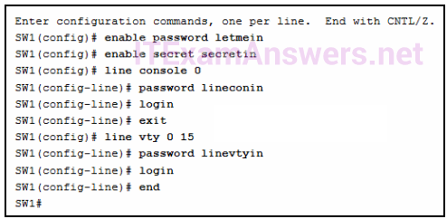

**Choices:**
- **A.** letmein
- **B.** secretin
- **C.** linevtyin
- **D.** lineconin

**Correct Answer:**
lineconin

**Explanation:**
Telnet accesses a network device through the virtual interface configured with the line VTY command. The password configured under this is required to access the user EXEC mode. The password configured under the line console 0 command is required to gain entry through the console port, and the enable and enable secret passwords are used to allow entry into the privileged EXEC mode.

---

## Question 9

**Question:**
On which switch interface would an administrator configure an IP address so that the switch can be managed remotely?

**Choices:**
- **A.** FastEthernet0/1
- **B.** VLAN 1
- **C.** vty 0
- **D.** console 0

**Correct Answer:**
VLAN 1

**Explanation:**
Interface VLAN 1 is a virtual interface on a switch, called SVI (switch virtual interface). Configuring an IP address on the default SVI, interface VLAN 1, will allow a switch to be accessed remotely. The VTY line must also be configured to allow remote access, but an IP address cannot be configured on this line.

---

## Question 10

**Question:**
What protocol is responsible for controlling the size of segments and the rate at which segments are exchanged between a web client and a web server?

**Choices:**
- **A.** TCP
- **B.** IP
- **C.** HTTP
- **D.** Ethernet

**Correct Answer:**
TCP

**Explanation:**
TCP is a Layer 4 protocol of the OSI model. TCP has several responsibilities in the network communication process. It divides large messages into smaller segments which are more efficient to send across the network. It also controls the size and rate of segments exchanged between clients and servers.

---

## Question 11

**Question:**
What is an advantage to using a protocol that is defined by an open standard?

**Choices:**
- **A.** A company can monopolize the market.
- **B.** The protocol can only be run on equipment from a specific vendor.
- **C.** An open standard protocol is not controlled or regulated by standards organizations.
- **D.** It encourages competition and promotes choices.

**Correct Answer:**
It encourages competition and promotes choices.

**Explanation:**
A monopoly by one company is not a good idea from a user point of view. If a protocol can only be run on one brand, it makes it difficult to have mixed equipment in a network. A proprietary protocol is not free to use. An open standard protocol will in general be implemented by a wide range of vendors.

---

## Question 12

**Question:**
What are two benefits of using a layered network model? (Choose two.)

**Choices:**
- **A.** It assists in protocol design.
- **B.** It speeds up packet delivery.
- **C.** It prevents designers from creating their own model.
- **D.** It prevents technology in one layer from affecting other layers.
- **E.** It ensures a device at one layer can function at the next higher layer.

**Correct Answer:**
It assists in protocol design.; It prevents technology in one layer from affecting other layers.

**Explanation:**
Some vendors have developed their own reference models and protocols. Today, if a device is to communicate on the Internet, the device must use the TCP/IP model. The benefits of using a layered model are as follows: assists in protocol design fosters competition between vendors prevents a technology that functions at one layer from affecting any other layer provides a common language for describing network functionality helps in visualizing the interaction between each layer and protocols between each layer

---

## Question 13

**Question:**
Which two OSI model layers have the same functionality as two layers of the TCP/IP model? (Choose two.)

**Choices:**
- **A.** data link
- **B.** network
- **C.** physical
- **D.** session
- **E.** transport

**Correct Answer:**
network; transport

**Explanation:**
The OSI transport layer is functionally equivalent to the TCP/IP transport layer, and the OSI network layer is equivalent to the TCP/IP internet layer. The OSI data link and physical layers together are equivalent to the TCP/IP network access layer. The OSI session layer (with the presentation layer) is included within the TCP/IP application layer.

---

## Question 14

**Question:**
Which name is assigned to the transport layer PDU?

**Choices:**
- **A.** bits
- **B.** data
- **C.** frame
- **D.** packet
- **E.** segment

**Correct Answer:**
segment

**Explanation:**
Application data is passed down the protocol stack on its way to be transmitted across the network media. During the process, various protocols add information to it at each level. At each stage of the process, a PDU (protocol data unit) has a different name to reflect its new functions. The PDUs are named according to the protocols of the TCP/IP suite: Data – The general term for the PDU used at the application layer. Segment – transport layer PDU Packet – network layer PDU Frame – data link layer PDU Bits – A physical layer PDU used when physically transmitting data over the medium

---

## Question 15

**Question:**
A network engineer is measuring the transfer of bits across the company backbone for a mission critical database application. The engineer notices that the network throughput appears lower than the bandwidth expected. Which three factors could influence the differences in throughput? (Choose three.)

**Choices:**
- **A.** the amount of traffic that is currently crossing the network
- **B.** the sophistication of the encapsulation method applied to the data
- **C.** the type of traffic that is crossing the network
- **D.** the latency that is created by the number of network devices that the data is crossing
- **E.** the bandwidth of the WAN connection to the Internet
- **F.** the reliability of the gigabit Ethernet infrastructure of the backbone

**Correct Answer:**
the amount of traffic that is currently crossing the network; the type of traffic that is crossing the network; the latency that is created by the number of network devices that the data is crossing

**Explanation:**
Throughput usually does not match the specified bandwidth of physical links due to multiple factors. These factors include, the amount of traffic, type of traffic, and latency created by the network devices the data has to cross.

---

## Question 16

**Question:**
A network administrator is troubleshooting connectivity issues on a server. Using a tester, the administrator notices that the signals generated by the server NIC are distorted and not usable. In which layer of the OSI model is the error categorized?

**Choices:**
- **A.** presentation layer
- **B.** network layer
- **C.** physical layer
- **D.** data link layer

**Correct Answer:**
physical layer

**Explanation:**
The NIC has responsibilities in both Layer 1 and Layer 2. The NIC encodes the frame as a series of signals that are transmitted onto the local media. This is the responsibility of the physical layer of the OSI model. The signal could be in the form of electrical, optical, or radio waves.

---

## Question 17

**Question:**
Which type of UTP cable is used to connect a PC to a switch port?

**Choices:**
- **A.** console
- **B.** rollover
- **C.** crossover
- **D.** straight-through

**Correct Answer:**
straight-through

**Explanation:**
A rollover cable is a Cisco proprietary cable used to connect to a router or switch console port. A straight-through (also called patch) cable is usually used to interconnect a host to a switch and a switch to a router. A crossover cable is used to interconnect similar devices together, for example, between two switches, two routers, and two hosts.

---

## Question 18

**Question:**
A network administrator is measuring the transfer of bits across the company backbone for a mission critical financial application. The administrator notices that the network throughput appears lower than the bandwidth expected. Which three factors could influence the differences in throughput? (Choose three.)

**Choices:**
- **A.** the amount of traffic that is currently crossing the network
- **B.** the sophistication of the encapsulation method applied to the data
- **C.** the type of traffic that is crossing the network
- **D.** the latency that is created by the number of network devices that the data is crossing
- **E.** the bandwidth of the WAN connection to the Internet
- **F.** the reliability of the gigabit Ethernet infrastructure of the backbone

**Correct Answer:**
the amount of traffic that is currently crossing the network; the type of traffic that is crossing the network; the latency that is created by the number of network devices that the data is crossing

**Explanation:**
Throughput usually does not match the specified bandwidth of physical links due to multiple factors. These factors include, the amount of traffic, type of traffic, and latency created by the network devices the data has to cross.

---

## Question 19

**Question:**
What is a characteristic of UTP cabling?

**Choices:**
- **A.** cancellation
- **B.** cladding
- **C.** immunity to electrical hazards
- **D.** woven copper braid or metallic foil

**Correct Answer:**
cancellation

**Explanation:**
Cladding and immunization from electrical hazards are characteristics for fiber-optic cabling. A woven copper braid or metallic foil is used as a shield for the inner coaxial cable conductor. Cancellation is a property of UTP cabling where two wires are located adjacent to one another so each magnetic field cancels out the adjacent magnetic field.

---

## Question 20

**Question:**
What are two characteristics of fiber-optic cable? (Choose two.)

**Choices:**
- **A.** It is not affected by EMI or RFI.
- **B.** Each pair of cables is wrapped in metallic foil.
- **C.** It combines the technique of cancellation, shielding, and twisting to protect data.
- **D.** It typically contains 4 pairs of fiber-optic wires.
- **E.** It is more expensive than UTP cabling is.

**Correct Answer:**
It is not affected by EMI or RFI.; It is more expensive than UTP cabling is.

**Explanation:**
Fiber-optic cabling supports higher bandwidth than UTP for longer distances. Fiber is immune to EMI and RFI, but costs more, requires more skill to install, and requires more safety precautions.

---

## Question 21

**Question:**
What is a characteristic of the LLC sublayer?

**Choices:**
- **A.** It provides the logical addressing required that identifies the device.
- **B.** It provides delimitation of data according to the physical signaling requirements of the medium.
- **C.** It places information in the frame allowing multiple Layer 3 protocols to use the same network interface and media.
- **D.** It defines software processes that provide services to the physical layer.

**Correct Answer:**
It places information in the frame allowing multiple Layer 3 protocols to use the same network interface and media.

**Explanation:**
The Logical Link Control (LLC) defines the software processes that provide services to the network layer protocols. The information is placed by LLC in the frame and identifies which network layer protocol is being used for the frame. This information allows multiple Layer 3 protocols, such as IPv4 and IPv6, to utilize the same network interface and media.

---

## Question 22

**Question:**
A network team is comparing physical WAN topologies for connecting remote sites to a headquarters building. Which topology provides high availability and connects some, but not all, remote sites?

**Choices:**
- **A.** mesh
- **B.** partial mesh
- **C.** hub and spoke
- **D.** point-to-point

**Correct Answer:**
partial mesh

**Explanation:**
Partial mesh topologies provide high availability by interconnecting multiple remote sites, but do not require a connection between all remote sites. A mesh topology requires point-to-point links with every system being connected to every other system. A point-to-point topology is where each device is connected to one other device. A hub and spoke uses a central device in a star topology that connects to other point-to-point devices.

---

## Question 23

**Question:**
What method is used to manage contention-based access on a wireless network?

**Choices:**
- **A.** CSMA/CD
- **B.** priority ordering
- **C.** CSMA/CA
- **D.** token passing

**Correct Answer:**
CSMA/CA

**Explanation:**
Carrier sense multiple access with collision avoidance (CSMA/CA) is used with wireless networking technology to mediate media contention. Carrier sense multiple access with collision detection (CSMA/CD) is used with wired Ethernet technology to mediate media contention. Priority ordering and token passing are not used (or not a method) for media access control.

---

## Question 24

**Question:**
What are the three primary functions provided by Layer 2 data encapsulation? (Choose three.)

**Choices:**
- **A.** error correction through a collision detection method
- **B.** session control using port numbers
- **C.** data link layer addressing
- **D.** placement and removal of frames from the media
- **E.** detection of errors through CRC calculations
- **F.** delimiting groups of bits into frames
- **G.** conversion of bits into data signals

**Correct Answer:**
data link layer addressing; detection of errors through CRC calculations; delimiting groups of bits into frames

**Explanation:**
Through the framing process, delimiters are used to identify the start and end of the sequence of bits that make up a frame. Data link layer addressing is added to enable a frame to be delivered to a destination node. A cyclic redundancy check (CRC) field is calculated on every bit and added to the frame. If the CRC value contained in the arriving frame is the same as the one the receiving node creates, the frame will be processed.

---

## Question 25

**Question:**
What will a host on an Ethernet network do if it receives a frame with a destination MAC address that does not match its own MAC address?

**Choices:**
- **A.** It will discard the frame.
- **B.** It will forward the frame to the next host.
- **C.** It will remove the frame from the media.
- **D.** It will strip off the data-link frame to check the destination IP address.

**Correct Answer:**
It will discard the frame.

**Explanation:**
In an Ethernet network, each NIC in the network checks every arriving frame to see if the destination MAC address in the frame matches its own MAC address. If there is no match, the device discards the frame. If there is a match, the NIC passes the frame up to the next OSI layer.

---

## Question 26

**Question:**
What are two examples of the cut-through switching method? (Choose two.)

**Choices:**
- **A.** store-and-forward switching
- **B.** fast-forward switching
- **C.** CRC switching
- **D.** fragment-free switching
- **E.** QOS switching

**Correct Answer:**
fast-forward switching; fragment-free switching

**Explanation:**
Store-and forward switching accepts the entire frame and performs error checking using CRC before forwarding the frame. Store-and-forward is often required for QOS analysis. Fast-forward and fragment-free are both variations of the cut-through switching method where only part of the frame is received before the switch begins to forward it.

---

## Question 27

**Question:**
What are two actions performed by a Cisco switch? (Choose two.)

**Choices:**
- **A.** building a routing table that is based on the first IP address in the frame header
- **B.** using the source MAC addresses of frames to build and maintain a MAC address table
- **C.** forwarding frames with unknown destination IP addresses to the default gateway
- **D.** utilizing the MAC address table to forward frames via the destination MAC address
- **E.** examining the destination MAC address to add new entries to the MAC address table

**Correct Answer:**
using the source MAC addresses of frames to build and maintain a MAC address table; utilizing the MAC address table to forward frames via the destination MAC address

**Explanation:**
Important actions that a switch performs are as follows: When a frame comes in, the switch examines the Layer 2 source address to build and maintain the Layer 2 MAC address table. It examines the Layer 2 destination address to determine how to forward the frame. When the destination address is in the MAC address table, then the frame is sent out a particular port. When the address is unknown, the frame is sent to all ports that have devices connected to that network.

---

## Question 28

**Question:**
Which frame forwarding method receives the entire frame and performs a CRC check to detect errors before forwarding the frame?

**Choices:**
- **A.** cut-through switching
- **B.** store-and-forward switching
- **C.** fragment-free switching
- **D.** fast-forward switching

**Correct Answer:**
store-and-forward switching

**Explanation:**
Fast-forward and fragment-free switching are variations of cut-through switching, which begins to forward the frame before the entire frame is received.

---

## Question 29

**Question:**
Refer to the exhibit. If host A sends an IP packet to host B, what will the destination address be in the frame when it leaves host A?

**Images:**
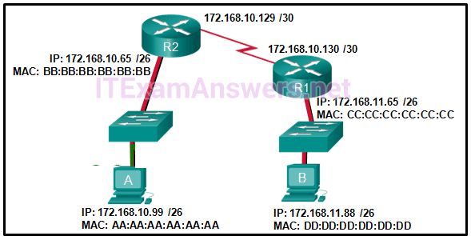

**Choices:**
- **A.** DD:DD:DD:DD:DD:DD
- **B.** 172.168.10.99
- **C.** CC:CC:CC:CC:CC:CC
- **D.** 172.168.10.65
- **E.** BB:BB:BB:BB:BB:BB
- **F.** AA:AA:AA:AA:AA:AA

**Correct Answer:**
BB:BB:BB:BB:BB:BB

**Explanation:**
When a host sends information to a distant network, the Layer 2 frame header will contain a source and destination MAC address. The source address will be the originating host device. The destination address will be the router interface that connects to the same network. In the case of host A sending information to host B, the source address is AA:AA:AA:AA:AA:AA and the destination address is the MAC address assigned to the R2 Ethernet interface, BB:BB:BB:BB:BB:BB.

---

## Question 30

**Question:**
What addresses are mapped by ARP?

**Choices:**
- **A.** destination MAC address to a destination IPv4 address
- **B.** destination IPv4 address to the source MAC address
- **C.** destination IPv4 address to the destination host name
- **D.** destination MAC address to the source IPv4 address

**Correct Answer:**
destination MAC address to a destination IPv4 address

**Explanation:**
ARP, or the Address Resolution Protocol, works by mapping a destination MAC address to a destination IPv4 address. The host knows the destination IPv4 address and uses ARP to resolve the corresponding destination MAC address.

---

## Question 31

**Question:**
What information is added during encapsulation at OSI Layer 3?

**Choices:**
- **A.** source and destination MAC
- **B.** source and destination application protocol
- **C.** source and destination port number
- **D.** source and destination IP address

**Correct Answer:**
source and destination IP address

**Explanation:**
IP is a Layer 3 protocol. Layer 3 devices can open the Layer 3 header to inspect the Layer 3 header which contains IP-related information including the source and destination IP addresses.

---

## Question 32

**Question:**
What are two services provided by the OSI network layer? (Choose two.)

**Choices:**
- **A.** performing error detection
- **B.** routing packets toward the destination
- **C.** encapsulating PDUs from the transport layer
- **D.** placement of frames on the media
- **E.** collision detection

**Correct Answer:**
routing packets toward the destination; encapsulating PDUs from the transport layer

**Explanation:**
The OSI network layer provides several services to allow communication between devices: addressing encapsulation routing de-encapsulation Error detection, placing frames on the media, and collision detection are all functions of the data ink layer.

---

## Question 33

**Question:**
Refer to the exhibit. The network administrator for a small advertising company has chosen to use the 192.168.5.96/27 network for internal LAN addressing. As shown in the exhibit, a static IP address is assigned to the company web server. However, the web server cannot access the Internet. The administrator verifies that local workstations with IP addresses that are assigned by a DHCP server can access the Internet, and the web server is able to ping local workstations. Which component is incorrectly configured?

**Images:**
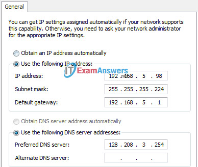

**Choices:**
- **A.** subnet mask
- **B.** DNS address
- **C.** host IP address
- **D.** default gateway address

**Correct Answer:**
default gateway address

**Explanation:**
When a 255.255.255.224 subnet mask is used, the first three bits of the last octet are part of the network portion for an IPv4 address in the subnet. For the 192.168.5.96/27 network, valid host addresses are 192.168.5.97 through 192.168.5.126. The default gateway address is for the Layer 3 device on the same network and it must contain an IP address within the valid IP address range.

---

## Question 34

**Question:**
Why does a Layer 3 device perform the ANDing process on a destination IP address and subnet mask?

**Choices:**
- **A.** to identify the broadcast address of the destination network
- **B.** to identify the host address of the destination host
- **C.** to identify faulty frames
- **D.** to identify the network address of the destination network

**Correct Answer:**
to identify the network address of the destination network

**Explanation:**
ANDing allows us to identify the network address from the IP address and the network mask.

---

## Question 35

**Question:**
What are two functions of NVRAM? (Choose two.)

**Choices:**
- **A.** to store the routing table
- **B.** to retain contents when power is removed
- **C.** to store the startup configuration file
- **D.** to contain the running configuration file
- **E.** to store the ARP table

**Correct Answer:**
to retain contents when power is removed; to store the startup configuration file

**Explanation:**
NVRAM is permanent memory storage, so the startup configuration file is preserved even if the router loses power.

---

## Question 36

**Question:**
Refer to the exhibit. What will be the result of entering this configuration the next time a network administrator connects a console cable to the router and no additional commands have been entered?

**Images:**
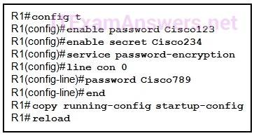

**Choices:**
- **A.** The administrator will be required to enter Cisco123.
- **B.** The administrator will be required to enter Cisco234.
- **C.** The administrator will be required to enter Cisco789.
- **D.** The administrator will be presented with the R1> prompt.

**Correct Answer:**
The administrator will be presented with the R1> prompt.

**Explanation:**
Until both the password password and the login commands are entered in console line configuration mode, no password is required to gain access to enable mode.

---

## Question 37

**Question:**
What is the dotted decimal representation of the IPv4 address 11001011.00000000.01110001.11010011?

**Choices:**
- **A.** 192.0.2.199
- **B.** 198.51.100.201
- **C.** 203.0.113.211
- **D.** 209.165.201.223

**Correct Answer:**
203.0.113.211

**Explanation:**
Each section (octet) contains eight binary digits. Each digit represents a specific value (128, 64, 32, 16, 8, 4, 2, and 1). Everywhere there is a 1, the specific value is relevant. Add all relevant values in a particular octet to obtain the decimal value. For example binary 11001011 equals 203 in decimal.

---

## Question 38

**Question:**
What are three characteristics of multicast transmission? (Choose three.)

**Choices:**
- **A.** The source address of a multicast transmission is in the range of 224.0.0.0 to 224.0.0.255.
- **B.** A single packet can be sent to a group of hosts.
- **C.** Multicast transmission can be used by routers to exchange routing information.
- **D.** Routers will not forward multicast addresses in the range of 224.0.0.0 to 224.0.0.255.
- **E.** Computers use multicast transmission to request IPv4 addresses.
- **F.** Multicast messages map lower layer addresses to upper layer addresses.

**Correct Answer:**
A single packet can be sent to a group of hosts.; Multicast transmission can be used by routers to exchange routing information.; Routers will not forward multicast addresses in the range of 224.0.0.0 to 224.0.0.255.

**Explanation:**
Broadcast messages consist of single packets that are sent to all hosts on a network segment. These types of messages are used to request IPv4 addresses, and map upper layer addresses to lower layer addresses. A multicast transmission is a single packet sent to a group of hosts and is used by routing protocols, such as OSPF and RIPv2, to exchange routes. The address range 224.0.0.0 to 224.0.0.255 is reserved for link-local addresses to reach multicast groups on a local network.

---

## Question 39

**Question:**
What are the three ranges of IP addresses that are reserved for internal private use? (Choose three.)

**Choices:**
- **A.** 10.0.0.0/8
- **B.** 64.100.0.0/14
- **C.** 127.16.0.0/12
- **D.** 172.16.0.0/12
- **E.** 192.31.7.0/24
- **F.** 192.168.0.0/16

**Correct Answer:**
10.0.0.0/8; 172.16.0.0/12; 192.168.0.0/16

**Explanation:**
The private IP address blocks that are used inside companies are as follows: 10.0.0.0 /8 (any address that starts with 10 in the first octet) 172.16.0.0 /12 (any address that starts with 172.16 in the first two octets through 172.31.255.255) 192.168.0.0 /16 (any address that starts with 192.168 in the first two octets)

---

## Question 40

**Question:**
What purpose does NAT64 serve in IPv6?

**Choices:**
- **A.** It converts IPv6 packets into IPv4 packets.
- **B.** It translates private IPv6 addresses into public IPv6 addresses.
- **C.** It enables companies to use IPv6 unique local addresses in the network.
- **D.** It converts regular IPv6 addresses into 64-bit addresses that can be used on the Internet.
- **E.** It converts the 48-bit MAC address into a 64-bit host address that can be used for automatic host addressing.

**Correct Answer:**
It converts IPv6 packets into IPv4 packets.

**Explanation:**
NAT64 is typically used in IPv6 when networks are being transitioned from IPv4 to IPv6. It allows the IPv6 networks to connect to IPv4 networks (such as the Internet), and works by translating the IPv6 packets into IPv4 packets.

---

## Question 41

**Question:**
What is the most compressed representation of the IPv6 address 2001:0000:0000:abcd:0000:0000:0000:0001?

**Choices:**
- **A.** 2001:0:abcd::1
- **B.** 2001:0:0:abcd::1
- **C.** 2001::abcd::1
- **D.** 2001:0000:abcd::1
- **E.** 2001::abcd:0:1

**Correct Answer:**
2001:0:0:abcd::1

**Explanation:**
The IPv6 address 2001:0000:0000:abcd:0000:0000:0000:0001 in its most compressed format would be 2001:0:0:abcd::1. The first two hextets of zeros would each compress to a single zero. The three consecutive hextets of zeros can be compressed to a double colon ::. The three leading zeros in the last hextet can be removed. The double colon :: can only be used once in an address.

---

## Question 42

**Question:**
Which range of link-local addresses can be assigned to an IPv6-enabled interface?

**Choices:**
- **A.** FEC0::/10
- **B.** FDEE::/7
- **C.** FE80::/10
- **D.** FF00::/8

**Correct Answer:**
FE80::/10

**Explanation:**
Link-local addresses are in the range of FE80::/10 to FEBF::/10. The original IPv6 specification defined site-local addresses and used the prefix range FEC0::/10, but these addresses were deprecated by the IETF in favor of unique local addresses. FDEE::/7 is a unique local address because it is in the range of FC00::/7 to FDFF::/7. IPv6 multicast addresses have the prefix FF00::/8.

---

## Question 43

**Question:**
Which three addresses are valid public addresses? (Choose three.)

**Choices:**
- **A.** 198.133.219.17
- **B.** 192.168.1.245
- **C.** 10.15.250.5
- **D.** 128.107.12.117
- **E.** 192.15.301.240
- **F.** 64.104.78.227

**Correct Answer:**
198.133.219.17; 128.107.12.117; 64.104.78.227

**Explanation:**
The ranges of private IPv4 addresses are as folllows: 10.0.0.0 – 10.255.255.255 172.16.0.0 – 172.31.255.255 192.168.0.0 – 192.168.255.255

---

## Question 44

**Question:**
Refer to the exhibit. On the basis of the output, which two statements about network connectivity are correct? (Choose two.)

**Images:**
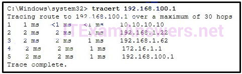

**Choices:**
- **A.** There is connectivity between this device and the device at 192.168.100.1.
- **B.** The connectivity between these two hosts allows for videoconferencing calls.
- **C.** There are 4 hops between this device and the device at 192.168.100.1.
- **D.** The average transmission time between the two hosts is 2 milliseconds.
- **E.** This host does not have a default gateway configured.

**Correct Answer:**
There is connectivity between this device and the device at 192.168.100.1.; There are 4 hops between this device and the device at 192.168.100.1.

**Explanation:**
The output displays a successful Layer 3 connection between a host computer and a host at 19.168.100.1. It can be determined that 4 hops exist between them and the average transmission time is 1 milliseconds. Layer 3 connectivity does not necessarily mean that an application can run between the hosts.

---

## Question 45

**Question:**
What type of IPv6 address is FE80::1?

**Choices:**
- **A.** loopback
- **B.** link-local
- **C.** multicast
- **D.** global unicast

**Correct Answer:**
link-local

**Explanation:**
Link-local IPv6 addresses start with FE80::/10, which is any address from FE80:: to FEBF::. Link-local addresses are used extensively in IPv6 and allow directly connected devices to communicate with each other on the link they share.

---

## Question 46

**Question:**
How many valid host addresses are available on an IPv4 subnet that is configured with a /26 mask?

**Choices:**
- **A.** 254
- **B.** 190
- **C.** 192
- **D.** 62
- **E.** 64

**Correct Answer:**
62

**Explanation:**
When a /26 mask is used, 6 bits are used as host bits. With 6 bits, 64 addresses are possible, but one address is for the subnet number and one address is for a broadcast. This leaves 62 addresses that can be assigned to network devices.

---

## Question 47

**Question:**
A site administrator has been told that a particular network at the site must accommodate 126 hosts. Which subnet mask would be used that contains the required number of host bits?

**Choices:**
- **A.** 255.255.255.0
- **B.** 255.255.255.128
- **C.** 255.255.255.224
- **D.** 255.255.255.240

**Correct Answer:**
255.255.255.128

**Explanation:**
The subnet mask of 255.255.255.0 has 8 host bits. The mask of 255.255.255.128 results in 7 host bits. The mask of 255.255.255.224 has 5 host bits. Finally, 255.255.255.240 represents 4 host bits.

---

## Question 48

**Question:**
A network administrator wants to have the same subnet mask for three subnetworks at a small site. The site has the following networks and numbers of devices: Subnetwork A: IP phones – 10 addresses Subnetwork B: PCs – 8 addresses Subnetwork C: Printers – 2 addresses What single subnet mask would be appropriate to use for the three subnetworks?

**Choices:**
- **A.** 255.255.255.0
- **B.** 255.255.255.240
- **C.** 255.255.255.248
- **D.** 255.255.255.252

**Correct Answer:**
255.255.255.240

**Explanation:**
If the same mask is to be used, then the network with the most hosts must be examined for number of hosts. Because this is 10 hosts, 4 host bits are needed. The /28 or 255.255.255.240 subnet mask would be appropriate to use for these networks. ​

---

## Question 49

**Question:**
How many hosts are addressable on a network that has a mask of 255.255.255.248?

**Choices:**
- **A.** 2
- **B.** 6
- **C.** 8
- **D.** 14
- **E.** 16
- **F.** 254

**Correct Answer:**
6

**Explanation:**
The subnet mask of 255.255.255.248 is the same as /29. This means the network portion of the address is 29 of the 32 bits in the address. Only 3 bits remain for host bits. 2^3 = 8, but one of these addresses has to be used for the network number and one address must be used as the broadcast address to reach all of the hosts on this network. That leaves only 6 usable IP addresses that can be assigned to hosts in this network. Don’t forget that the default gateway must be one of these devices if this network is to communicate with other networks.

---

## Question 50

**Question:**
Which subnet would include the address 192.168.1.96 as a usable host address?

**Choices:**
- **A.** 192.168.1.64/26
- **B.** 192.168.1.32/27
- **C.** 192.168.1.32/28
- **D.** 192.168.1.64/29

**Correct Answer:**
192.168.1.64/26

**Explanation:**
For the subnet of 192.168.1.64/26, there are 6 bits for host addresses, yielding 64 possible addresses. However, the first and last subnets are the network and broadcast addresses for this subnet. Therefore, the range of host addresses for this subnet is 192.168.1.65 to 192.168.1.126. The other subnets do not contain the address 192.168.1.96 as a valid host address.

---

## Question 51

**Question:**
What subnet mask is needed if an IPv4 network has 40 devices that need IP addresses and address space is not to be wasted?

**Choices:**
- **A.** 255.255.255.0
- **B.** 255.255.255.128
- **C.** 255.255.255.192
- **D.** 255.255.255.224
- **E.** 255.255.255.240

**Correct Answer:**
255.255.255.192

**Explanation:**
In order to accommodate 40 devices, 6 host bits are needed. With 6 bits, 64 addresses are possible, but one address is for the subnet number and one address is for a broadcast. This leaves 62 addresses that can be assigned to network devices. The mask associated with leaving 6 host bits for addressing is 255.255.255.192.

---

## Question 52

**Question:**
What are two characteristics shared by TCP and UDP? (Choose two.)

**Choices:**
- **A.** default window size
- **B.** connectionless communication
- **C.** port numbering
- **D.** 3-way handshake
- **E.** ability to to carry digitized voice
- **F.** use of checksum

**Correct Answer:**
port numbering; use of checksum

**Explanation:**
Both TCP and UDP use source and destination port numbers to distinguish different data streams and to forward the right data segments to the right applications. Error checking the header and data is done by both protocols by using a checksum calculation to determine the integrity of the data that is received. TCP is connection-oriented and uses a 3-way handshake to establish an initial connection. TCP also uses window to regulate the amount of traffic sent before receiving an acknowledgment. UDP is connectionless and is the best protocol for carry digitized VoIP signals.

---

## Question 53

**Question:**
Why are port numbers included in the TCP header of a segment?

**Choices:**
- **A.** to indicate the correct router interface that should be used to forward a segment
- **B.** to identify which switch ports should receive or forward the segment
- **C.** to determine which Layer 3 protocol should be used to encapsulate the data
- **D.** to enable a receiving host to forward the data to the appropriate application
- **E.** to allow the receiving host to assemble the packet in the proper order

**Correct Answer:**
to enable a receiving host to forward the data to the appropriate application

---

## Question 54

**Question:**
Refer to the exhibit. Consider the IP address of 192.168.10.0/24 that has been assigned to a high school building. The largest network in this building has 100 devices. If 192.168.10.0 is the network number for the largest network, what would be the network number for the next largest network, which has 40 devices?

**Images:**
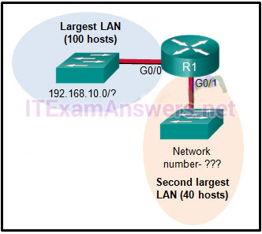

**Choices:**
- **A.** 192.168.10.0
- **B.** 192.168.10.128
- **C.** 192.168.10.192
- **D.** 192.168.10.224
- **E.** 192.168.10.240

**Correct Answer:**
192.168.10.128

**Explanation:**
The first thing to calculate is what IP addresses are used by the largest LAN. Because the LAN has 100 hosts, 7 bits must be left for host bits. This would be a subnet mask of 255.255.255.128 for the largest LAN (192.168.10.0/25). The IP addresses range from 192.168.10.0 through 192.168.10.127. 192.168.10.0 is the network number (all 0s in the host bits) and 192.168.10.127 is the broadcast for this Ethernet LAN (all 1s in the host bits). The next available IP address is the next network number – 192.168.10.128.

---

## Question 55

**Question:**
Which statement is true about variable-length subnet masking?

**Choices:**
- **A.** Each subnet is the same size.
- **B.** The size of each subnet may be different, depending on requirements.
- **C.** Subnets may only be subnetted one additional time.
- **D.** Bits are returned, rather than borrowed, to create additional subnets.

**Correct Answer:**
The size of each subnet may be different, depending on requirements.

**Explanation:**
In variable-length subnet masking, bits are borrowed to create subnets. Additional bits may be borrowed to create additional subnets within the original subnets. This may continue until there are no bits available to borrow.

---

## Question 56

**Question:**
In what two situations would UDP be the preferred transport protocol over TCP? (Choose two.)

**Choices:**
- **A.** when applications need to guarantee that a packet arrives intact, in sequence, and unduplicated
- **B.** when a faster delivery mechanism is needed
- **C.** when delivery overhead is not an issue
- **D.** when applications do not need to guarantee delivery of the data
- **E.** when destination port numbers are dynamic

**Correct Answer:**
when a faster delivery mechanism is needed; when applications do not need to guarantee delivery of the data

**Explanation:**
UDP is a stateless protocol, which means that neither device on either end of the conversation must keep track of the conversation. As a stateless protocol, UDP is used as the Layer 4 protocol for applications that need speedy (best-effort) delivery. An example of such traffic is the transport of digitized voice or video.

---

## Question 57

**Question:**
What important information is added to the TCP/IP transport layer header to ensure communication and connectivity with a remote network device?

**Choices:**
- **A.** timing and synchronization
- **B.** destination and source port numbers
- **C.** destination and source physical addresses
- **D.** destination and source logical network addresses

**Correct Answer:**
destination and source port numbers

**Explanation:**
The destination and source port numbers are used to identify exactly which protocol and process is requesting or responding to a request.

---

## Question 58

**Question:**
What is the TCP mechanism used in congestion avoidance?

**Choices:**
- **A.** three-way handshake
- **B.** socket pair
- **C.** two-way handshake
- **D.** sliding window

**Correct Answer:**
sliding window

**Explanation:**
TCP uses windows to attempt to manage the rate of transmission to the maximum flow that the network and destination device can support while minimizing loss and retransmissions. When overwhelmed with data, the destination can send a request to reduce the of the window. This congestion avoidance is called sliding windows.

---

## Question 59

**Question:**
Which scenario describes a function provided by the transport layer?

**Choices:**
- **A.** A student is using a classroom VoIP phone to call home. The unique identifier burned into the phone is a transport layer address used to contact another network device on the same network.
- **B.** A student is playing a short web-based movie with sound. The movie and sound are encoded within the transport layer header.
- **C.** A student has two web browser windows open in order to access two web sites. The transport layer ensures the correct web page is delivered to the correct browser window.
- **D.** A corporate worker is accessing a web server located on a corporate network. The transport layer formats the screen so the web page appears properly no matter what device is being used to view the web site.

**Correct Answer:**
A student has two web browser windows open in order to access two web sites. The transport layer ensures the correct web page is delivered to the correct browser window.

**Explanation:**
The source and destination port numbers are used to identify the correct application and window within that application.

---

## Question 60

**Question:**
A user opens three browsers on the same PC to access www.cisco.com to search for certification course information. The Cisco web server sends a datagram as a reply to the request from one of the web browsers. Which information is used by the TCP/IP protocol stack in the PC to identify which of the three web browsers should receive the reply?

**Choices:**
- **A.** the destination IP address
- **B.** the destination port number
- **C.** the source IP address
- **D.** the source port number

**Correct Answer:**
the destination port number

**Explanation:**
Each web browser client application opens a randomly generated port number in the range of the registered ports and uses this number as the source port number in the datagram that it sends to a server. The server then uses this port number as the destination port number in the reply datagram that it sends to the web browser. The PC that is running the web browser application receives the datagram and uses the destination port number that is contained in this datagram to identify the client application.

---

## Question 61

**Question:**
What are two ways that TCP uses the sequence numbers in a segment? (Choose two.)

**Choices:**
- **A.** to identify missing segments at the destination
- **B.** to reassemble the segments at the remote location
- **C.** to specify the order in which the segments travel from source to destination
- **D.** to limit the number of segments that can be sent out of an interface at one time
- **E.** to determine if the packet changed during transit

**Correct Answer:**
to identify missing segments at the destination; to reassemble the segments at the remote location

---

## Question 62

**Question:**
Which two tasks are functions of the presentation layer? (Choose two.)

**Choices:**
- **A.** compression
- **B.** addressing
- **C.** encryption
- **D.** session control
- **E.** authentication

**Correct Answer:**
compression; encryption

**Explanation:**
The presentation layer deals with common data format. Encryption, formatting, and compression are some of the functions of the layer. Addressing occurs in the network layer, session control occurs in the session layer, and authentication takes place in the application or session layer.

---

## Question 63

**Question:**
Which three statements characterize UDP? (Choose three.)

**Choices:**
- **A.** UDP provides basic connectionless transport layer functions.
- **B.** UDP provides connection-oriented, fast transport of data at Layer 3.
- **C.** UDP relies on application layer protocols for error detection.
- **D.** UDP is a low overhead protocol that does not provide sequencing or flow control mechanisms.
- **E.** UDP relies on IP for error detection and recovery.
- **F.** UDP provides sophisticated flow control mechanisms.

**Correct Answer:**
UDP provides basic connectionless transport layer functions.; UDP relies on application layer protocols for error detection.; UDP is a low overhead protocol that does not provide sequencing or flow control mechanisms.

**Explanation:**
UDP is a simple protocol that provides the basic transport layer functions. It has much lower overhead than TCP because it is not connection-oriented and does not offer the sophisticated retransmission, sequencing, and flow control mechanisms that provide reliability.

---

## Question 64

**Question:**
What is a key characteristic of the peer-to-peer networking model?

**Choices:**
- **A.** wireless networking
- **B.** social networking without the Internet
- **C.** network printing using a print server
- **D.** resource sharing without a dedicated server

**Correct Answer:**
resource sharing without a dedicated server

**Explanation:**
The peer-to-peer (P2P) networking model allows data, printer, and resource sharing without a dedicated server.​​

---

## Question 65

**Question:**
A technician can ping the IP address of the web server of a remote company but cannot successfully ping the URL address of the same web server. Which software utility can the technician use to diagnose the problem?

**Choices:**
- **A.** tracert
- **B.** ipconfig
- **C.** netstat
- **D.** nslookup

**Correct Answer:**
nslookup

**Explanation:**
Traceroute (tracert) is a utility that generates a list of hops that were successfully reached along the path from source to destination.This list can provide important verification and troubleshooting information. The ipconfig utility is used to display the IP configuration settings on a Windows PC. The Netstat utility is used to identify which active TCP connections are open and running on a networked host. Nslookup is a utility that allows the user to manually query the name servers to resolve a given host name. This utility can also be used to troubleshoot name resolution issues and to verify the current status of the name servers.

---

## Question 66

**Question:**
Which domain name would be an example of a top-level domain?

**Choices:**
- **A.** www.cisco.com
- **B.** cisco.com
- **C.** .com
- **D.** root.cisco.com

**Correct Answer:**
.com

**Explanation:**
Top-level domains represent a country or type of organization, such as .com or .edu.

---

## Question 67

**Question:**
A PC obtains its IP address from a DHCP server. If the PC is taken off the network for repair, what happens to the IP address configuration?

**Choices:**
- **A.** The configuration is permanent and nothing changes.
- **B.** The address lease is automatically renewed until the PC is returned.
- **C.** The address is returned to the pool for reuse when the lease expires.
- **D.** The configuration is held by the server to be reissued when the PC is returned.

**Correct Answer:**
The address is returned to the pool for reuse when the lease expires.

**Explanation:**
When a DCHP address is issued to a host, it is for a specific lease time. Once the lease expires, the address is returned to the DHCP pool.

---

## Question 68

**Question:**
When planning for network growth, where in the network should packet captures take place to assess network traffic?

**Choices:**
- **A.** on as many different network segments as possible
- **B.** only at the edge of the network
- **C.** between hosts and the default gateway
- **D.** only on the busiest network segment

**Correct Answer:**
on as many different network segments as possible

**Explanation:**
Because some types of traffic will be only on specific network segments, packet captures for analysis should be performed on as many segments as possible.

---

## Question 69

**Question:**
A wireless host needs to request an IP address. What protocol would be used to process the request?

**Choices:**
- **A.** FTP
- **B.** HTTP
- **C.** DHCP
- **D.** ICMP
- **E.** SNMP

**Correct Answer:**
DHCP

**Explanation:**
The DHCP protocol is used to request, issue, and manage IP addressing information. CSMA/CD is the access method used with wired Ethernet. ICMP is used to test connectivity. SNMP is used with network management and FTP is used for file transfer.

---

## Question 70

**Question:**
Which example of malicious code would be classified as a Trojan horse?

**Choices:**
- **A.** malware that was written to look like a video game
- **B.** malware that requires manual user intervention to spread between systems
- **C.** malware that attaches itself to a legitimate program and spreads to other programs when launched
- **D.** malware that can automatically spread from one system to another by exploiting a vulnerability in the target

**Correct Answer:**
malware that was written to look like a video game

**Explanation:**
A Trojan horse is malicious code that has been written specifically to look like a legitimate program. This is in contrast to a virus, which simply attaches itself to an actual legitimate program. Viruses require manual intervention from a user to spread from one system to another, while a worm is able to spread automatically between systems by exploiting vulnerabilities on those devices.

---

## Question 71

**Question:**
When applied to a router, which command would help mitigate brute-force password attacks against the router?

**Choices:**
- **A.** exec-timeout 30
- **B.** service password-encryption
- **C.** banner motd $Max failed logins = 5$
- **D.** login block-for 60 attempts 5 within 60

**Correct Answer:**
login block-for 60 attempts 5 within 60

**Explanation:**
The login block-for command sets a limit on the maximum number of failed login attempts allowed within a defined period of time. If this limit is exceeded, no further logins are allowed for the specified period of time. This helps to mitigate brute-force password cracking since it will significantly increase the amount of time required to crack a password. The exec-timeout command specifies how long the session can be idle before the user is disconnected. The service password-encryption command encrypts the passwords in the running configuration. The banner motd command displays a message to users who are logging in to the device.

---

## Question 72

**Question:**
A network technician suspects that a particular network connection between two Cisco switches is having a duplex mismatch. Which command would the technician use to see the Layer 1 and Layer 2 details of a switch port?

**Choices:**
- **A.** show mac-address-table
- **B.** show ip interface brief
- **C.** show interfaces
- **D.** show running-config

**Correct Answer:**
show interfaces

**Explanation:**
The show interfaces command can be used on both routers and switches to see speed, duplex, media type, MAC address, port type, and other Layer 1/Layer 2-related information.

---

## Question 73

**Question:**
Where are Cisco IOS debug output messages sent by default?

**Choices:**
- **A.** Syslog server
- **B.** console line
- **C.** memory buffers
- **D.** vty lines

**Correct Answer:**
console line

**Explanation:**
Debug messages, like other IOS log messages, are sent to the console line by default. Sending these messages to the terminal lines requires the terminal monitor command.

---

## Question 74

**Question:**
Match the description with the associated IOS mode. (not all options are used.) Question Answer user EXEC mode limited number of basic monitoring commands the first entrance intro the CLI of an IOS device privileged EXEC mode accessed by entering the enable command identified by a prompt ending with the # character global configuration mode changes made affect the operation of the device as a whole accessed by entering the configure terminal command

**Images:**
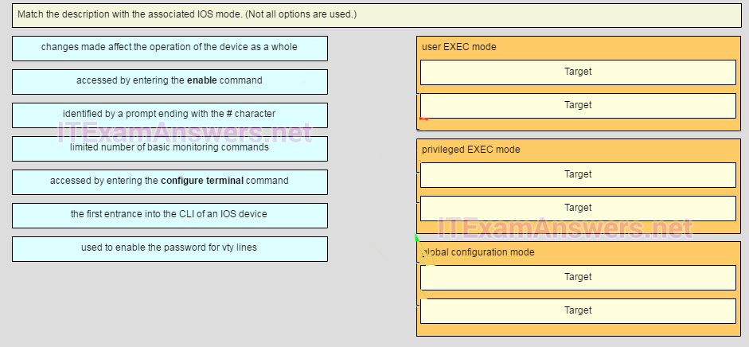
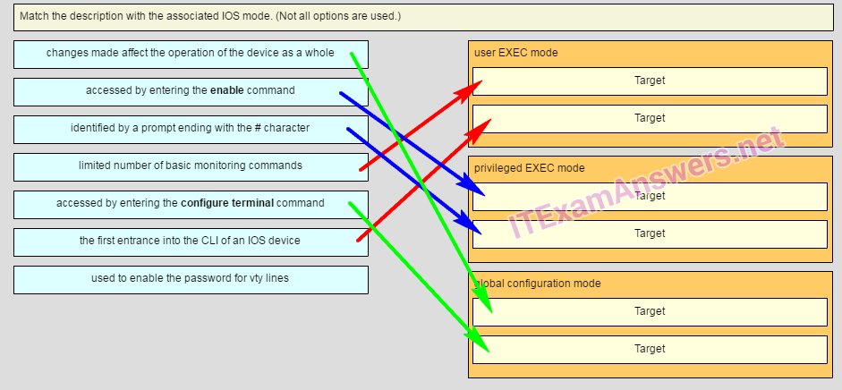

---

## Question 75

**Question:**
Refer to the exhibit. Match the packets with their destination IP address to the exiting interfaces on the router. (Not all targets are used.) Place the options in the following order:

**Images:**
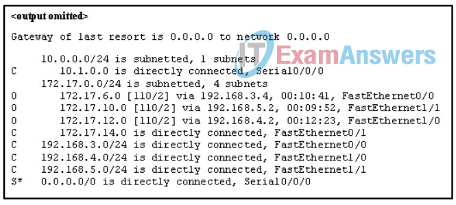

**Explanation:**
Packets with a destination of 172.17.6.15 are forwarded through Fa0/0. Packets with a destination of 172.17.10.5 are forwarded through Fa1/1. Packets with a destination of 172.17.12.10 are forwarded through Fa1/0. Packets with a destination of 172.17.14.8 are forwarded through Fa0/1. Because network 172.17.8.0 has no entry in the routing table, it will take the gateway of last resort, which means that packets with a destination of 172.17.8.20 are forwarded through Serial0/0/0. Because a gateway of last resort exists, no packets will be dropped.

---

## Question 76

**Question:**
Refer to the exhibit. An administrator is testing connectivity to a remote device with the IP address 10.1.1.1. What does the output of this command indicate?

**Images:**
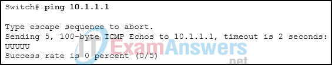

**Choices:**
- **A.** Connectivity to the remote device was successful.
- **B.** A router along the path did not have a route to the destination.
- **C.** A ping packet is being blocked by a security device along the path.
- **D.** The connection timed out while waiting for a reply from the remote device.

**Correct Answer:**
A router along the path did not have a route to the destination.

**Explanation:**
In the output of the ping command, an exclamation mark (!) indicates a response was successfully received, a period (.) indicates that the connection timed out while waiting for a reply, and the letter “U” indicates that a router along the path did not have a route to the destination and sent an ICMP destination unreachable message back to the source.

---

## Question 77

**Question:**
A user is unable to reach the web site when typing http://www.cisco.com in a web browser, but can reach the same site by typing http://72.163.4.161. What is the issue?

**Choices:**
- **A.** default gateway
- **B.** DHCP
- **C.** TCP/IP protocol stack
- **D.** DNS

**Correct Answer:**
DNS

**Explanation:**
Domain Name Service (DNS) is used to translate a web address to an IP address. The address of the DNS server is provided via DHCP to host computers.​

---

## Question 78

**Question:**
A company is expanding its business to other countries. All branch offices must remain connected to corporate headquarters at all times. Which network technology is required to support this requirement?

**Choices:**
- **A.** LAN
- **B.** MAN
- **C.** WAN
- **D.** WLAN

**Correct Answer:**
WAN

**Explanation:**
A local-area network (LAN) normally connects end users and network resources over a limited geographic area using Ethernet technology. A wireless LAN (WLAN) serves the same purpose as a LAN but uses wireless technologies. A metropolitan-area network (MAN) spans a larger geographic area such as a city, and a wide-area network (WAN) connects networks together over a large geographic area. WANs can span cities, countries, or the globe.

---

## Question 79

**Question:**
A home user is looking for an ISP connection that provides high speed digital transmission over regular phone lines. What ISP connection type should be used?

**Choices:**
- **A.** DSL
- **B.** dial-up
- **C.** satellite
- **D.** cell modem
- **E.** cable modem

**Correct Answer:**
DSL

**Explanation:**
DSL is the best technology to use over existing phone lines. A lot of ISPs have a lookup on their website where you can enter your phone number and see if they can offer you service.

---

## Question 80

**Question:**
How does quality of service help a network support a wide range of applications and services?

**Choices:**
- **A.** by limiting the impact of a network failure
- **B.** by allowing quick recovery from network failures
- **C.** by providing mechanisms to manage congested network traffic
- **D.** by providing the ability for the network to grow to accommodate new users

**Correct Answer:**
by providing mechanisms to manage congested network traffic

**Explanation:**
Quality of service (QoS), is a vital component of the architecture of a network. With QoS, network administrators can provide applications with predictable and measurable service guarantees through mechanisms that manage congested network traffic.

---

## Question 81

**Question:**
What source IP address does a router use by default when the traceroute command is issued?

**Choices:**
- **A.** the highest configured IP address on the router
- **B.** the lowest configured IP address on the router
- **C.** a loopback IP address
- **D.** the IP address of the outbound interface

**Correct Answer:**
the IP address of the outbound interface

**Explanation:**
When sending an echo request message, a router will use the IP address of the exit interface as the source IP address. This default behavior can be changed by using an extended ping and specifying a specific source IP address.

---

## Question 82

**Question:**
After making configuration changes on a Cisco switch, a network administrator issues a copy running-config startup-config command. What is the result of issuing this command?

**Choices:**
- **A.** The new configuration will be stored in flash memory.
- **B.** The new configuration will be loaded if the switch is restarted.
- **C.** The current IOS file will be replaced with the newly configured file.
- **D.** The configuration changes will be removed and the original configuration will be restored.

**Correct Answer:**
The new configuration will be loaded if the switch is restarted.

**Explanation:**
With the copy running-config startup-config command, the content of the current operating configuration replaces the startup configuration file stored in NVRAM. The configuration file saved in NVRAM will be loaded when the device is restarted.

---

## Question 83

**Question:**
Refer to the exhibit. A network administrator is configuring access control to switch SW1. If the administrator has already logged into a Telnet session on the switch, which password is needed to access privileged EXEC mode?

**Images:**
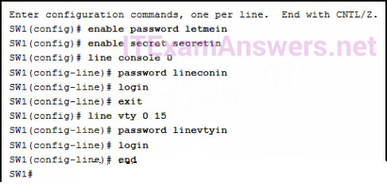

**Choices:**
- **A.** letmein
- **B.** secretin
- **C.** lineconin
- **D.** linevtyin

**Correct Answer:**
secretin

**Explanation:**
Telnet accesses a network device through the virtual interface configured with the line VTY command. The password configured under this is required to access the user EXEC mode. The password configured under the line console 0 command is required to gain entry through the console port, and the enable and enable secret passwords are used to allow entry into the privileged EXEC mode.

---

## Question 84

**Question:**
Match each item to the type of topology diagram on which it is typically identified. (Not all options are used.)

**Images:**

**Explanation:**
A logical topology diagram typically depicts the IP addressing scheme and groupings of devices and ports. A physical topology diagram shows how those devices are connected to each other and the network, focusing on the physical locations of intermediary devices, configured ports, and cabling.

---

## Question 85

**Question:**
Which connection provides a secure CLI session with encryption to a Cisco network device?

**Choices:**
- **A.** a console connection
- **B.** an AUX connection
- **C.** a Telnet connection
- **D.** an SSH connection

**Correct Answer:**
an SSH connection

**Explanation:**
A CLI session using Secure Shell (SSH) provides enhanced security because SSH supports strong passwords and encryption during the transport of session data. The other methods support authentication but not encryption.

---

## Question 86

**Question:**
What function does pressing the Tab key have when entering a command in IOS?

**Choices:**
- **A.** It aborts the current command and returns to configuration mode.
- **B.** It exits configuration mode and returns to user EXEC mode.
- **C.** It moves the cursor to the beginning of the next line.
- **D.** It completes the remainder of a partially typed word in a command.

**Correct Answer:**
It completes the remainder of a partially typed word in a command.

**Explanation:**
Pressing the Tab key after a command has been partially typed will cause the IOS to complete the rest of the command.

---

## Question 87

**Question:**
What layer is responsible for routing messages through an internetwork in the TCP/IP model?

**Choices:**
- **A.** internet
- **B.** transport
- **C.** network access
- **D.** session

**Correct Answer:**
internet

**Explanation:**
The TCP/IP model consists of four layers: application, transport, internet, and network access. Of these four layers, it is the internet layer that is responsible for routing messages. The session layer is not part of the TCP/IP model but is rather part of the OSI model.

---

## Question 88

**Question:**
Which statement accurately describes a TCP/IP encapsulation process when a PC is sending data to the network?

**Choices:**
- **A.** Data is sent from the internet layer to the network access layer.
- **B.** Packets are sent from the network access layer to the transport layer.
- **C.** Segments are sent from the transport layer to the internet layer.
- **D.** Frames are sent from the network access layer to the internet layer.

**Correct Answer:**
Segments are sent from the transport layer to the internet layer.

**Explanation:**
When the data is traveling from the PC to the network, the transport layer sends segments to the internet layer. The internet layer sends packets to the network access layer, which creates frames and then converts the frames to bits. The bits are released to the network media.

---

## Question 89

**Question:**
What unique address is embedded in an Ethernet NIC and used for communication on an Ethernet network?

**Choices:**
- **A.** host address
- **B.** IP address
- **C.** MAC address
- **D.** network address
- **E.** k layer

**Correct Answer:**
MAC address

**Explanation:**
The MAC address is a 48-bit address that is burned into every Ethernet NIC. Each MAC address is unique throughout the world.

---

## Question 90

**Question:**
Which procedure is used to reduce the effect of crosstalk in copper cables?

**Choices:**
- **A.** requiring proper grounding connections
- **B.** twisting opposing circuit wire pairs together
- **C.** wrapping the bundle of wires with metallic shielding
- **D.** designing a cable infrastructure to avoid crosstalk interference
- **E.** avoiding sharp bends during installation

**Correct Answer:**
twisting opposing circuit wire pairs together

**Explanation:**
In copper cables, crosstalk is a disturbance caused by the electric or magnetic fields of a signal on one wire interfering with the signal in an adjacent wire. Twisting opposing circuit wire pairs together can effectively cancel the crosstalk. The other options are effective measures to counter the negative effects of EMI and RFI, but not crosstalk.

---

## Question 91

**Question:**
During the encapsulation process, what occurs at the data link layer for a PC connected to an Ethernet network?

**Choices:**
- **A.** An IP address is added.
- **B.** The logical address is added.
- **C.** The physical address is added.
- **D.** The process port number is added.

**Correct Answer:**
The physical address is added.

**Explanation:**
The Ethernet frame includes the source and destination physical address. The trailer includes a CRC value in the Frame Check Sequence field to allow the receiving device to determine if the frame has been changed (has errors) during the transmission.

---

## Question 92

**Question:**
What are two characteristics of Ethernet MAC addresses? (Choose two.)

**Choices:**
- **A.** They are globally unique.
- **B.** They are routable on the Internet.
- **C.** They are expressed as 12 hexadecimal digits.
- **D.** MAC addresses use a flexible hierarchical structure.
- **E.** MAC addresses must be unique for both Ethernet and serial interfaces on a device.

**Correct Answer:**
They are globally unique.; They are expressed as 12 hexadecimal digits.

**Explanation:**
An Ethernet MAC address is a 48-bit binary value expressed as 12 hexadecimal digits. MAC addresses must be globally unique by design. MAC addresses are in flat structure and thus they are not routable on the Internet. Serial interfaces do not use MAC addresses.

---

## Question 93

**Question:**
If a device receives an Ethernet frame of 60 bytes, what will it do?

**Choices:**
- **A.** drop the frame
- **B.** process the frame as it is
- **C.** send an error message to the sending device
- **D.** add random data bytes to make it 64 bytes long and then forward it

**Correct Answer:**
drop the frame

**Explanation:**
Ethernet standards define the minimum frame size as 64 bytes. A frame less than 64 bytes is considered a “collision fragment” or “runt frame” and is automatically discarded by receiving devices.

---

## Question 94

**Question:**
Under which two circumstances will a switch flood a frame out of every port except the port that the frame was received on? (Choose two.)

**Choices:**
- **A.** The frame has the broadcast address as the destination address.
- **B.** The destination address is unknown to the switch.
- **C.** The source address in the frame header is the broadcast address.
- **D.** The source address in the frame is a multicast address.
- **E.** The destination address in the frame is a known unicast address.

**Correct Answer:**
The frame has the broadcast address as the destination address.; The destination address is unknown to the switch.

**Explanation:**
A switch will flood a frame out of every port, except the one that the frame was received from, under two circumstances. Either the frame has the broadcast address as the destination address, or the destination address is unknown to the switch.

---

## Question 95

**Question:**
Which switching method has the lowest level of latency?

**Choices:**
- **A.** cut-through
- **B.** store-and-forward
- **C.** fragment-free
- **D.** fast-forward

**Correct Answer:**
fast-forward

**Explanation:**
Fast-forward switching begins to forward a frame after reading the destination MAC address, resulting in the lowest latency. Fragment-free reads the first 64 bytes before forwarding. Store-and-forward has the highest latency because it reads the entire frame before beginning to forward it. Both fragment-free and fast-forward are types of cut-through switching.

---

## Question 96

**Question:**
Which two commands can be used on a Windows host to display the routing table? (Choose two.)

**Choices:**
- **A.** netstat -s
- **B.** route print
- **C.** show ip route
- **D.** netstat -r
- **E.** tracert

**Correct Answer:**
route print; netstat -r

**Explanation:**
On a Windows host, the route print or netstat -r commands can be used to display the host routing table. Both commands generate the same output. On a router, the show ip route command is used to display the routing table. The netstat –scommand is used to display per-protocol statistics. The tracert command is used to display the path that a packet travels to its destination.

---

## Question 97

**Question:**
Which two functions are primary functions of a router? (Choose two.)

**Choices:**
- **A.** packet forwarding
- **B.** microsegmentation
- **C.** domain name resolution
- **D.** path selection
- **E.** flow control

**Correct Answer:**
packet forwarding; path selection

**Explanation:**
A router accepts a packet and accesses its routing table to determine the appropriate exit interface based on the destination address. The router then forwards the packet out of that interface.

---

## Question 98

**Question:**
What is the binary representation of 0xCA?

**Choices:**
- **A.** 10111010
- **B.** 11010101
- **C.** 11001010
- **D.** 11011010

**Correct Answer:**
11001010

**Explanation:**
When converted, CA in hex is equivalent to 11011010 in binary. One way to do the conversion is one nibble at a time, C = 1100 and A = 1010. Combine the two nibbles gives 11001010.

---

## Question 99

**Question:**
At a minimum, which address is required on IPv6-enabled interfaces?

**Choices:**
- **A.** link-local
- **B.** unique local
- **C.** site local
- **D.** global unicast

**Correct Answer:**
link-local

**Explanation:**
All IPv6 enabled interfaces must at minimum have a link-local address. Other IPv6 addresses can be assigned to the interface as required.

---

## Question 100

**Question:**
Which service provides dynamic global IPv6 addressing to end devices without using a server that keeps a record of available IPv6 addresses?

**Choices:**
- **A.** stateful DHCPv6
- **B.** SLAAC
- **C.** static IPv6 addressing
- **D.** stateless DHCPv6

**Correct Answer:**
SLAAC

**Explanation:**
Using stateless address autoconfiguration (SLAAC), a PC can solicit a router and receive the prefix length of the network. From this information the PC can then create its own IPv6 global unicast address.

---

## Question 101

**Question:**
What is the purpose of the command ping ::1?

**Choices:**
- **A.** It tests the internal configuration of an IPv6 host.
- **B.** It tests the broadcast capability of all hosts on the subnet.
- **C.** It tests the multicast connectivity to all hosts on the subnet.
- **D.** It tests the reachability of the default gateway for the network.

**Correct Answer:**
It tests the internal configuration of an IPv6 host.

**Explanation:**
The address ::1 is an IPv6 loopback address. Using the command ping ::1 tests the internal IP stack to ensure that it is configured and functioning correctly. It does not test reachability to any external device, nor does it confirm that IPv6 addresses are properly configured on the host.

---

## Question 102

**Question:**
How many usable IP addresses are available on the 192.168.1.0/27 network?

**Choices:**
- **A.** 256
- **B.** 254
- **C.** 62
- **D.** 30
- **E.** 16
- **F.** 32

**Correct Answer:**
30

**Explanation:**
A /27 mask is the same as 255.255.255.224. This leaves 5 host bits. With 5 host bits, 32 IP addresses are possible, but one address represents the subnet number and one address represents the broadcast address. Thus, 30 addresses can then be used to assign to network devices.

---

## Question 103

**Question:**
What is the process of dividing a data stream into smaller pieces before transmission?

**Choices:**
- **A.** segmentation
- **B.** encapsulation
- **C.** encoding
- **D.** flow control

**Correct Answer:**
segmentation

**Explanation:**
Data streams would cause significant network congestion if they were transmitted as a single large stream of bits. To increase efficiency, data streams are segmented into smaller more manageable pieces which are then transmitted over the network.

---

## Question 104

**Question:**
When IPv4 addressing is manually configured on a web server, which property of the IPv4 configuration identifies the network and host portion for an IPv4 address?

**Choices:**
- **A.** DNS server address
- **B.** subnet mask
- **C.** default gateway
- **D.** DHCP server address

**Correct Answer:**
subnet mask

**Explanation:**
There are several components that need to be entered when configuring IPv4 for an end device: IPv4 address – uniquely identifies an end device on the network Subnet mask – determines the network address portion and host portion for an IPv4 address Default gateway – the IP address of the router interface used for communicating with hosts in another network DNS server address – the IP address of the Domain Name System (DNS) server DHCP server address (if DHCP is used) is not configured manually on end devices. It will be provided by a DHCP server when an end device requests an IP address.

---

## Question 105

**Question:**
Which two roles can a computer assume in a peer-to-peer network where a file is being shared between two computers? (Choose two.)

**Choices:**
- **A.** client
- **B.** master
- **C.** server
- **D.** slave
- **E.** transient

**Correct Answer:**
client; server

**Explanation:**
In a peer-to-peer (P2P) network, two or more computers are connected and can share resources without the use of a dedicated server. The computer that has the file acts as a server for the device (the client) that requests the file.​

---

## Question 106

**Question:**
Which two protocols operate at the highest layer of the TCP/IP protocol stack? (Choose two.)

**Choices:**
- **A.** DNS
- **B.** Ethernet
- **C.** IP
- **D.** POP
- **E.** TCP
- **F.** UDP

**Correct Answer:**
DNS; POP

**Explanation:**
The application layer is the top layer of the TCP/IP protocol stack. Application layer protocols include HTTP, DNS, HTML, TFTP, POP, IMAP, FTP, and SMTP.

---

## Question 107

**Question:**
What is one difference between the client-server and peer-to-peer network models?

**Choices:**
- **A.** Only in the client-server model can file transfers occur.
- **B.** Every device in a peer-to-peer network can function as a client or a server.
- **C.** A peer-to-peer network transfers data faster than a transfer using a client-server network.
- **D.** A data transfer that uses a device serving in a client role requires that a dedicated server be present.

**Correct Answer:**
Every device in a peer-to-peer network can function as a client or a server.

**Explanation:**
Data transfer speeds depend on a number of factors including the amount of traffic, the quality of service imposed, and the network media. Transfer speeds are not dependent on the network model type. File transfers can occur using the client-server model or the peer-to-peer model. A data transfer between a device acting in the client role and a device acting in the server role can occur in both peer-to-peer and client-server networks.

---

## Question 108

**Question:**
What is the function of the HTTP GET message?

**Choices:**
- **A.** to request an HTML page from a web server
- **B.** to send error information from a web server to a web client
- **C.** to upload content to a web server from a web client
- **D.** to retrieve client email from an email server using TCP port 110

**Correct Answer:**
to request an HTML page from a web server

**Explanation:**
There are three common HTTP message types: GET – used by clients to request data from the web server POST – used by clients to upload data to a web server PUT – used by clients to upload data to a web server

---

## Question 109

**Question:**
Which networking model is being used when an author uploads one chapter document to a file server of a book publisher?

**Choices:**
- **A.** peer-to-peer
- **B.** master-slave
- **C.** client/server
- **D.** point-to-point

**Correct Answer:**
client/server

**Explanation:**
In the client/server network model, a network device assumes the role of server in order to provide a particular service such as file transfer and storage. In the client/server network model, a dedicated server does not have to be used, but if one is present, the network model being used is the client/server model. In contrast, a peer-to-peer network does not have a dedicated server.

---

## Question 110

**Question:**
What network service resolves the URL entered on a PC to the IP address of the destination server?

**Choices:**
- **A.** DNS
- **B.** DHCP
- **C.** FTP
- **D.** SNMP

**Correct Answer:**
DNS

**Explanation:**
When a client attempts to connect to a website, the destination URL must be resolved to an IP address. To do this the client queries a Domain Name System (DNS) server.

---

## Question 111

**Question:**
A network engineer is analyzing reports from a recently performed network baseline. Which situation would depict a possible latency issue?

**Choices:**
- **A.** a change in the bandwidth according to the show interfaces output
- **B.** a next-hop timeout from a traceroute
- **C.** an increase in host-to-host ping response times
- **D.** a change in the amount of RAM according to the show version output

**Correct Answer:**
an increase in host-to-host ping response times

**Explanation:**
While analyzing historical reports an administrator can compare host-to-host timers from the ping command and depict possible latency issues.​

---

## Question 112

**Question:**
Which firewall feature is used to ensure that packets coming into a network are legitimate responses to requests initiated from internal hosts?

**Choices:**
- **A.** stateful packet inspection
- **B.** URL filtering
- **C.** application filtering
- **D.** packet filtering

**Correct Answer:**
stateful packet inspection

**Explanation:**
Stateful packet inspection on a firewall checks that incoming packets are actually legitimate responses to requests originating from hosts inside the network. Packet filtering can be used to permit or deny access to resources based on IP or MAC address. Application filtering can permit or deny access based on port number. URL filtering is used to permit or deny access based on URL or on keywords.

---

## Question 113

**Question:**
What is one indication that a Windows computer did not receive an IPv4 address from a DHCP server?

**Choices:**
- **A.** The computer cannot ping 127.0.0.1.
- **B.** Windows displays a DHCP timeout message.
- **C.** The computer receives an IP address that starts with 169.254
- **D.** The computer cannot ping other devices on the same network with IP addresses in the 169.254.0.0/16 range.

**Correct Answer:**
The computer receives an IP address that starts with 169.254

**Explanation:**
When a Windows PC cannot communicate with an IPv4 DHCP server, the computer automatically assigns an IP address in the 169.254.0.0/16 range. Any other device on the same network that receives an address in the same range is reachable.​

---

## Question 114

**Question:**
Which command can an administrator issue on a Cisco router to send debug messages to the vty lines?

**Choices:**
- **A.** terminal monitor
- **B.** logging console
- **C.** logging buffered
- **D.** logging synchronous

**Correct Answer:**
terminal monitor

**Explanation:**
Debug messages, like other IOS log messages, are sent to the console line by default. Sending these messages to the terminal lines requires the terminal monitor command.

---

## Question 115

**Question:**
Fill in the blank. During data communications, a host may need to send a single message to a specific group of destination hosts simultaneously. This message is in the form of a Multicast message.

---

## Question 116

**Question:**
A medium-sized business is researching available options for connecting to the Internet. The company is looking for a high speed option with dedicated, symmetric access. Which connection type should the company choose?

**Choices:**
- **A.** DSL
- **B.** dialup
- **C.** satellite
- **D.** leased line
- **E.** cable modem

**Correct Answer:**
leased line

---

## Question 117

**Question:**
What is the purpose of having a converged network?

**Choices:**
- **A.** to provide high speed connectivity to all end devices
- **B.** to make sure that all types of data packets will be treated equally
- **C.** to achieve fault tolerance and high availability of data network infrastructure devices
- **D.** to reduce the cost of deploying and maintaining the communication infrastructure

**Correct Answer:**
to reduce the cost of deploying and maintaining the communication infrastructure

**Explanation:**
With the development of technology, companies can now consolidate disparate networks onto one platform called a converged network. In a converged network, voice, video, and data travel over the same network, thus eliminating the need to create and maintain separate networks. This also reduces the costs associated with providing and maintaining the communication network infrastructure.

---

## Question 118

**Question:**
What characteristic of a network enables it to quickly grow to support new users and applications without impacting the performance of the service being delivered to existing users?

**Choices:**
- **A.** reliability
- **B.** scalability
- **C.** quality of service
- **D.** accessibility

**Correct Answer:**
scalability

**Explanation:**
Networks must be able to quickly grow to support new users and services, without impacting existing users and services. This ability to grow is known as scalability.

---

## Question 119

**Question:**
After several configuration changes are made to a router, the copy running-configuration startup-configuration command is issued. Where will the changes be stored?

**Choices:**
- **A.** flash
- **B.** ROM
- **C.** NVRAM
- **D.** RAM
- **E.** the configuration register
- **F.** a TFTP server

**Correct Answer:**
NVRAM

**Explanation:**
When changes are made to the running-config file, it should be saved to NVRAM as the startup configuration file in case the router is restarted or loses power. The following command saves the configuration to NVRAM: copy running-config startup-config

---

## Question 120

**Question:**
Refer to the exhibit. From global configuration mode, an administrator is attempting to create a message-of-the-day banner by using the command banner motd V Authorized access only! Violators will be prosecuted! V When users log in using Telnet, the banner does not appear correctly. What is the problem?

**Images:**
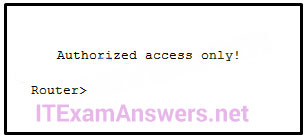

**Choices:**
- **A.** The banner message is too long.
- **B.** The delimiting character appears in the banner message.
- **C.** The symbol “!” signals the end of a banner message.
- **D.** Message-of-the-day banners will only appear when a user logs in through the console port.

**Correct Answer:**
The delimiting character appears in the banner message.

**Explanation:**
To create a banner message of the day on a device, use the banner motd # the message of the day # global config command. The “#” in the command syntax is called the delimiting character. It is entered before and after the message. The delimiting character can be any character as long as it does not occur in the message.

---

## Question 121

**Question:**
What are three characteristics of an SVI? (Choose three.)

**Choices:**
- **A.** It is designed as a security protocol to protect switch ports.
- **B.** It is not associated with any physical interface on a switch.
- **C.** It is a special interface that allows connectivity by different types of media.
- **D.** It is required to allow connectivity by any device at any location.
- **E.** It provides a means to remotely manage a switch.
- **F.** It is associated with VLAN1 by default.

**Correct Answer:**
It is not associated with any physical interface on a switch.; It provides a means to remotely manage a switch.; It is associated with VLAN1 by default.

**Explanation:**
Switches have one or more switch virtual interfaces (SVIs). SVIs are created in software since there is no physical hardware associated with them. Virtual interfaces provide a means to remotely manage a switch over a network that is using IP. Each switch comes with one SVI appearing in the default configuration “out-of-the-box.” The default SVI interface is VLAN1.

---

## Question 122

**Question:**
A technician configures a switch with these commands: What is the technician configuring?

**Choices:**
- **A.** Telnet access
- **B.** SVI
- **C.** password encryption
- **D.** physical switchport access

**Correct Answer:**
SVI

**Explanation:**
For a switch to have an IP address, a switch virtual interface must be configured. This allows the switch to be managed remotely over the network.

---

## Question 123

**Question:**
In computer communication, what is the purpose of message encoding?

**Choices:**
- **A.** to convert information to the appropriate form for transmission
- **B.** to interpret information
- **C.** to break large messages into smaller frames
- **D.** to negotiate correct timing for successful communication

**Correct Answer:**
to convert information to the appropriate form for transmission

**Explanation:**
Before a message is sent across a network it must first be encoded. Encoding is the process of converting the data message into another format suitable for transmission across the physical medium. Each bit of the message is encoded into a pattern of sounds, light waves, or electrical impulses depending on the network media over which the bits are transmitted. The destination host receives and decodes the signals in order to interpret the message.

---

## Question 124

**Question:**
What is a characteristic of multicast messages?

**Choices:**
- **A.** They are sent to a select group of hosts.
- **B.** They must be acknowledged.
- **C.** They are sent to a single destination.
- **D.** They are sent to all hosts on a network.

**Correct Answer:**
They are sent to a select group of hosts.

**Explanation:**
Multicast is a one-to-many type of communication. Multicast messages are addressed to a specific multicast group.

---

## Question 125

**Question:**
A large corporation has modified its network to allow users to access network resources from their personal laptops and smart phones. Which networking trend does this describe?

**Choices:**
- **A.** bring your own device
- **B.** video conferencing
- **C.** online collaboration
- **D.** cloud computing

**Correct Answer:**
bring your own device

**Explanation:**
BYOD allows end users to use personal tools to access the corporate network. Allowing this trend can have major impacts on a network, such as security and compatibility with corporate software and devices.

---

## Question 126

**Question:**
True or False. A dedicated server is not needed when implementing a peer-to-peer network.

**Choices:**
- **A.** true
- **B.** false

**Correct Answer:**
true

---

## Question 127

**Question:**
Which term refers to a network that provides secure access to the corporate offices by suppliers, customers and collaborators?

**Choices:**
- **A.** Internet
- **B.** intranet
- **C.** extranet
- **D.** extendednet

**Correct Answer:**
extranet

**Explanation:**
The term Internet refers to the worldwide collection of connected networks. Intranet refers to a private connection of LANs and WANS that belong to an organization and is designed to be accessible to the members of the organization, employees, or others with authorization.​ Extranets provide secure and safe access to ​suppliers, customers, and collaborators. Extendednet is not a type of network.

---

## Question 128

**Question:**
What subnet mask is required to support 512 subnets on networks 172.28.0.0/16?

**Choices:**
- **A.** 255.255.240.0
- **B.** 255.255.255.224
- **C.** 255.255.255.240
- **D.** 255.255.255.128
- **E.** 255.255.252.0

**Correct Answer:**
255.255.255.128

---

## Question 129

**Question:**
A DHCP server is used to IP addresses dynamically to the hosts on a network. The address pool is configured with 10.29.244.0/25. There are 19 printers on this network that need to use reserve static IP addresses from the pool. How many IP address in the pool are left to be assign to other hosts?

**Choices:**
- **A.** 210
- **B.** 60
- **C.** 109
- **D.** 107
- **E.** 146

**Correct Answer:**
107

**Explanation:**
Version 5:

---

## Question 130

**Question:**
What is a function of the data link layer?

**Choices:**
- **A.** provides the formatting of data
- **B.** provides for the exchange of data over a common local media
- **C.** provides end-to-end delivery of data between hosts
- **D.** provides delivery of data between two applications

**Correct Answer:**
provides for the exchange of data over a common local media

---

## Question 131

**Question:**
Which communication tool allows real-time collaboration?

**Choices:**
- **A.** wiki
- **B.** e-mail
- **C.** weblog
- **D.** instant messaging

**Correct Answer:**
instant messaging

---

## Question 132

**Question:**
A host is accessing a Web server on a remote network. Which three functions are performed by intermediary network devices during this conversation? (Choose three.)

**Choices:**
- **A.** regenerating data signals
- **B.** acting as a client or a server
- **C.** providing a channel over which messages travel
- **D.** applying security settings to control the flow of data
- **E.** notifying other devices when errors occur
- **F.** serving as the source or destination of the messages

**Correct Answer:**
regenerating data signals; applying security settings to control the flow of data; notifying other devices when errors occur

---

## Question 133

**Question:**
Refer to the exhibit. From which location did this router load the IOS?

**Images:**
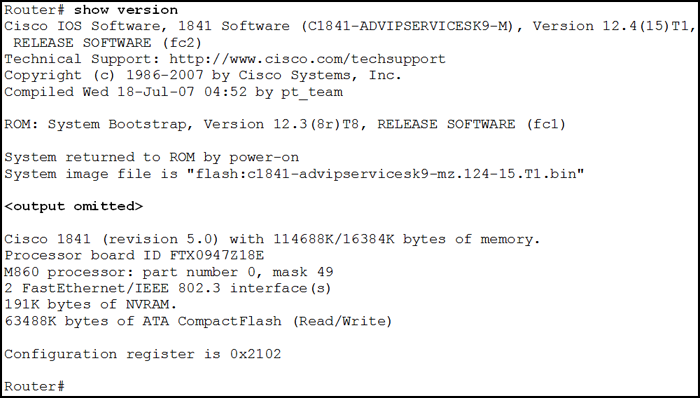

**Choices:**
- **A.** flash memory
- **B.** NVRAM?
- **C.** RAM
- **D.** ROM
- **E.** a TFTP server?

**Correct Answer:**
flash memory

**Explanation:**
In the provided show version output, the line System image file is “flash:c1841-advipservicesk9-mz.124-15.Tl.bin” explicitly identifies the source of the Cisco IOS. The prefix flash: indicates that the router successfully located and loaded the operating system image from its internal flash memory during the boot process. Additionally, the configuration register value of 0x2102 confirms the router is set to follow standard boot procedures, which typically involve loading the first valid IOS image found in flash if no other specific boot instructions are present.

---

## Question 134

**Question:**
Refer to the exhibit. Which action will be successful?

**Images:**
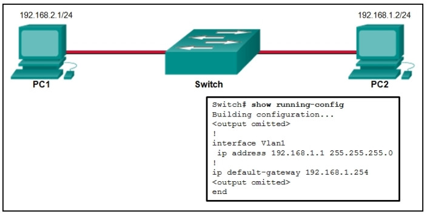

**Choices:**
- **A.** PC1 can send a ping to 192.168.1.1?.
- **B.** PC1 can send a ping to 192.168.1.254?.
- **C.** PC2 can send a ping to 192.168.1.1.
- **D.** PC2 can send a ping to 192.168.1.254?.

**Correct Answer:**
PC2 can send a ping to 192.168.1.1.

---

## Question 135

**Question:**
Fill in the blank. Port numbers ranging from 0 to 1023 are considered to be Well Known ports.

---

## Question 136

**Question:**
Fill in the blank. ISOC, IANA, EIA, and IEEE represent standards organizations which help to promote and maintain an open Internet.

---

## Question 137

**Question:**
Refer to the exhibit. An administrator is trying to configure the switch but receives the error message that is displayed in the exhibit. What is the problem?

**Images:**

**Choices:**
- **A.** The entire command, configure terminal, must be used.
- **B.** The administrator is already in global configuration mode.
- **C.** The administrator must first enter privileged EXEC mode before issuing the command.
- **D.** The administrator must connect via the console port to access global configuration mode.

**Correct Answer:**
The administrator must first enter privileged EXEC mode before issuing the command.

**Explanation:**
In order to enter global configuration mode, the command configure terminal, or a shortened version such as config t, must be entered from privileged EXEC mode. In this scenario the administrator is in user EXEC mode, as indicated by the > symbol after the hostname. The administrator would need to use the enable command to move into privileged EXEC mode before entering the configure terminal command.

---

## Question 138

**Question:**
A company is expanding its business to other countries. All branch offices must remain connected to corporate headquarters at all times. Which network technology is required to support this requirement?

**Choices:**
- **A.** LAN
- **B.** MAN
- **C.** WAN
- **D.** WLAN

**Correct Answer:**
WAN

**Explanation:**
A local-area network (LAN) normally connects end users and network resources over a limited geographic area using Ethernet technology. A wireless LAN (WLAN) serves the same purpose as a LAN but uses wireless technologies. A metropolitan-area network (MAN) spans a larger geographic area such as a city, and a wide-area network (WAN) connects networks together over a large geographic area. WANs can span cities, countries, or the globe.

---

## Question 139

**Question:**
A network administrator is upgrading a small business network to give high priority to real-time applications traffic. What two types of network services is the network administrator trying to accommodate? (Choose two.)

**Choices:**
- **A.** SNMP
- **B.** instant messaging
- **C.** voice
- **D.** FTP
- **E.** video

**Correct Answer:**
voice; video

**Explanation:**
Streaming media, such as video, and voice traffic, are both examples of real-time traffic. Real-time traffic needs higher priority through the network than other types of traffic because it is very sensitive to network delay and latency.

---

## Question 140

**Question:**
Match the situation with the appropriate use of network media. Place the options in the following order:

**Images:**

**Explanation:**
Copper Cables – horizontal cabling structure and desktop PCs in offices in an enterprise Fiber optic – backbone cabling in an enterprise and long-haul networks Wireless – coffee shops and waiting rooms in a hospital

---

## Question 141

**Question:**
Which IPv4 address can be pinged to test the internal TCP/IP operation of a host?

**Choices:**
- **A.** 0.0.0.0
- **B.** 0.0.0.1
- **C.** 127.0.0.1
- **D.** 192.168.1.1
- **E.** 255.255.255.255

**Correct Answer:**
127.0.0.1

---

## Question 142

**Question:**
What three application layer protocols are part of the TCP/IP protocol suite? (Choose three.)

**Choices:**
- **A.** ARP
- **B.** DHCP
- **C.** DNS
- **D.** FTP
- **E.** NAT
- **F.** PPP

**Correct Answer:**
DHCP; DNS; FTP

**Explanation:**
DNS, DHCP, and FTP are all application layer protocols in the TCP/IP protocol suite. ARP and PPP are network access layer protocols, and NAT is an internet layer protocol in the TCP/IP protocol suite.

---

## Question 143

**Question:**
Which two protocols function at the internet layer? (Choose two)

**Choices:**
- **A.** ARP
- **B.** BOOTP
- **C.** ICMP
- **D.** IP
- **E.** PPP

**Correct Answer:**
ICMP; IP

**Explanation:**
ICMP and IP both function at the internet layer, whereas PPP is a network access layer protocol, and POP and BOOTP are application layer protocols.

---

## Question 144

**Question:**
Which publicly available resources describe protocols, processes, and technologies for the Internet but do not give implementation details?

**Choices:**
- **A.** Request for Comments
- **B.** IRTF research papers
- **C.** protocol models
- **D.** IEEE standards

**Correct Answer:**
Request for Comments

---

## Question 145

**Question:**
Which address on a PC does not change, even if the PC is moved to a different network?

**Choices:**
- **A.** IP address
- **B.** default gateway address
- **C.** MAC address
- **D.** logical address

**Correct Answer:**
MAC address

---

## Question 146

**Question:**
What is the protocol that is used to discover a physical address from a known logical address and what message type does it use?

**Choices:**
- **A.** ARP, multicast
- **B.** DNS, unicast
- **C.** DNS, broadcast
- **D.** ARP, broadcast
- **E.** PING, multicast
- **F.** PING, broadcast

**Correct Answer:**
ARP, broadcast

**Explanation:**
An ARP request is broadcast to all devices on a LAN segment which seek the MAC address for a known IP address. Pings are used to verify connectivity between two devices, and DNS resolves URLs to IP addresses.

---

## Question 147

**Question:**
What will happen if the default gateway address is incorrectly configured on a host?

**Choices:**
- **A.** The host cannot communicate with other hosts in the local network.
- **B.** The switch will not forward packets initiated by the host.
- **C.** The host will have to use ARP to determine the correct address of the default gateway.
- **D.** The host cannot communicate with hosts in other networks.
- **E.** A ping from the host to 127.0.0.1 would not be successful.

**Correct Answer:**
The host cannot communicate with hosts in other networks.

**Explanation:**
When a host needs to send a message to another host located on the same network, it can forward the message directly. However, when a host needs to send a message to a remote network, it must use the router, also known as the default gateway. This is because the data link frame address of the remote destination host cannot be used directly. Instead, the IP packet has to be sent to the router (default gateway) and the router will forward the packet toward its destination. Therefore, if the default gateway is incorrectly configured, the host can communicate with other hosts on the same network, but not with hosts on remote networks.

---

## Question 148

**Question:**
What is an important function of the physical layer of the OSI model?

**Choices:**
- **A.** It accepts frames from the physical media.
- **B.** It encapsulates upper layer data into frames.
- **C.** It defines the media access method performed by the hardware interface.
- **D.** It encodes frames into electrical, optical, or radio wave signals.

**Correct Answer:**
It encodes frames into electrical, optical, or radio wave signals.

**Explanation:**
The physical layer of the OSI model accepts frames from the data link layer and encodes it for transport as bits across the network media.

---

## Question 149

**Question:**
Which two statements describe the characteristics of fiber-optic cabling? (Choose two.)

**Choices:**
- **A.** Fiber-optic cabling does not conduct electricity.
- **B.** Fiber-optic cabling has high signal loss.
- **C.** Fiber-optic cabling is primarily used as backbone cabling.
- **D.** Multimode fiber-optic cabling carries signals from multiple sending devices.
- **E.** Fiber-optic cabling uses LEDs for single-mode cab?les and laser technology for multimode cables.

**Correct Answer:**
Fiber-optic cabling does not conduct electricity.; Fiber-optic cabling is primarily used as backbone cabling.

**Explanation:**
Fiber-optic cabling is primarily used for high-traffic backbone cabling and does not conduct electricity. Multimode fiber uses LEDs for signaling and single-mode fiber uses laser technology. FIber-optic cabling carries signals from only one device to another.

---

## Question 150

**Question:**
What is contained in the trailer of a data-link frame?

**Choices:**
- **A.** logical address
- **B.** physical address
- **C.** data
- **D.** error detection

**Correct Answer:**
error detection

**Explanation:**
The trailer in a data-link frame contains error detection information that is pertinent to the frame included in the FCS field. The header contains control information, such as the addressing, while the area that is indicated by the word “data” includes the data, transport layer PDU, and the IP header.

---

## Question 151

**Question:**
Refer to the exhibit. A ping to PC3 is issued from PC0, PC1, and PC2 in this exact order. Which MAC addresses will be contained in the S1 MAC address table that is associated with the Fa0/1 port?

**Images:**
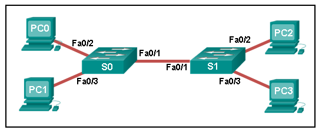

**Choices:**
- **A.** just PC0 and PC1 MAC addresses
- **B.** just the PC0 MAC address
- **C.** PC0, PC1, and PC2 MAC addresses
- **D.** just the PC1 MAC address
- **E.** just the PC2 MAC address

**Correct Answer:**
just PC0 and PC1 MAC addresses

**Explanation:**
Switch S1 builds a MAC address table based on the source MAC address in the frame and the port upon which the frame enters the switch. The PC2 MAC address will be associated with port FA0/2. Because port FA0/1 of switch S1 connects with another switch, port FA0/1 will receive frames from multiple different devices. The MAC address table on switch S1 will therefore contain MAC addresses associated with each of the sending PCs.

---

## Question 152

**Question:**
How does a Layer 3 switch differ from a Layer 2 switch?

**Choices:**
- **A.** A Layer 3 switch supports VLANs, but a Layer 2 switch does not.
- **B.** An IP address can be assigned to a physical port of a Layer 3 switch. However, this is not supported in Layer 2 switches.
- **C.** A Layer 3 switch maintains an IP address table instead of a MAC address table.
- **D.** A Layer 3 switch learns the MAC addresses that are associated with each of its ports. However, a Layer 2 switch does not.

**Correct Answer:**
An IP address can be assigned to a physical port of a Layer 3 switch. However, this is not supported in Layer 2 switches.

---

## Question 153

**Question:**
What is the purpose of the routing process?

**Choices:**
- **A.** to encapsulate data that is used to communicate across a network
- **B.** to select the paths that are used to direct traffic to destination networks
- **C.** to convert a URL name into an IP address
- **D.** to provide secure Internet file transfer
- **E.** to forward traffic on the basis of MAC addresses

**Correct Answer:**
to select the paths that are used to direct traffic to destination networks

---

## Question 154

**Question:**
Which technology provides a solution to IPv4 address depletion by allowing multiple devices to share one public IP address?

**Choices:**
- **A.** ARP
- **B.** DNS
- **C.** NAT
- **D.** SMB
- **E.** DHCP
- **F.** HTTP

**Correct Answer:**
NAT

**Explanation:**
Network Address Translation (NAT) is a technology implemented within IPv4 networks. One application of NAT is to use a few public IP addresses to be shared by many internal network hosts which use private IP addresses. NAT removes the need for public addresses for every internal host. It therefore provides a solution to slow down the IPv4 address depletion.

---

## Question 155

**Question:**
Refer to the exhibit. Consider the IP address configuration shown from PC1. What is a description of the default gateway address?

**Images:**
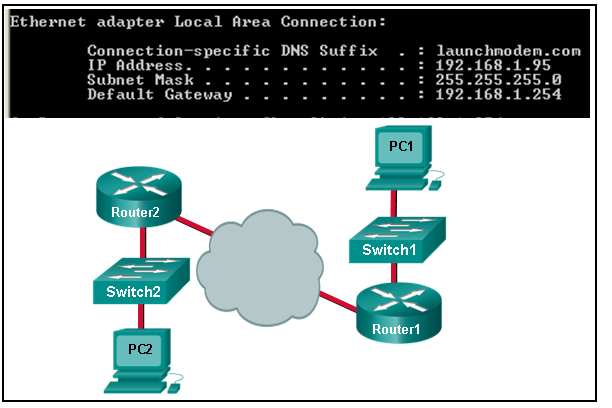

**Choices:**
- **A.** It is the IP address of the Router1 interface that connects the company to the Internet.
- **B.** It is the IP address of the Router1 interface that connects the PC1 LAN to Router1.
- **C.** It is the IP address of Switch1 that connects PC1 to other devices on the same LAN.
- **D.** It is the IP address of the ISP network device located in the cloud.

**Correct Answer:**
It is the IP address of the Router1 interface that connects the PC1 LAN to Router1.

**Explanation:**
The default gateway is used to route packets destined for remote networks. The default gateway IP address is the address of the first Layer 3 device (the router interface) that connects to the same network.

---

## Question 156

**Question:**
Which of the following are primary functions of a router? (Choose two.)

**Choices:**
- **A.** packet switching
- **B.** microsegmentation
- **C.** domain name resolution
- **D.** path selection
- **E.** flow control

**Correct Answer:**
packet switching; path selection

---

## Question 157

**Question:**
Which two statements correctly describe a router memory type and its contents? (Choose two.)

**Choices:**
- **A.** ROM is nonvolatile and contains basic diagnostic software.
- **B.** FLASH is nonvolatile and contains a limited portion of the IOS​.
- **C.** ROM is nonvolatile and stores the running IOS.
- **D.** RAM is volatile and stores the IP routing table.
- **E.** NVRAM is nonvolatile and stores other system files.

**Correct Answer:**
ROM is nonvolatile and contains basic diagnostic software.; RAM is volatile and stores the IP routing table.

**Explanation:**
ROM is a nonvolatile memory and stores bootup instructions, basic diagnostic software, and a limited IOS. Flash is a nonvolatile memory used as permanent storage for the IOS and other system-related files. RAM is volatile memory and stores the IP routing table, IPv4 to MAC address mappings in the ARP cache, packets that are buffered or temporarily stored, the running configuration, and the currently running IOS. NVRAM is a nonvolatile memory that stores the startup configuration file.

---

## Question 158

**Question:**
In which default order will a router search for startup configuration information?

**Choices:**
- **A.** NVRAM, RAM, TFTP
- **B.** NVRAM, TFTP, setup mode
- **C.** setup mode, NVRAM, TFTP
- **D.** TFTP, ROM, NVRAM
- **E.** flash, ROM, setup mode

**Correct Answer:**
NVRAM, TFTP, setup mode

---

## Question 159

**Question:**
What happens when part of an Internet VoIP transmission is not delivered to the destination?

**Choices:**
- **A.** A delivery failure message is sent to the source host.
- **B.** The part of the VoIP transmission that was lost is re-sent.
- **C.** The entire transmission is re-sent.
- **D.** The transmission continues without the missing portion.

**Correct Answer:**
The transmission continues without the missing portion.

---

## Question 160

**Question:**
Which three IP addresses are private ? (Choose three.)

**Choices:**
- **A.** 10.172.168.1
- **B.** 172.32.5.2
- **C.** 192.167.10.10
- **D.** 172.20.4.4
- **E.** 192.168.5.254
- **F.** 224.6.6.6

**Correct Answer:**
10.172.168.1; 172.20.4.4; 192.168.5.254

**Explanation:**
The private IP addresses are within these three ranges: 10.0.0.0 – 10.255.255.255 172.16.0.0 – 172.31.255.255 192.168.0.0 – 192.168.255.255

---

## Question 161

**Question:**
How many bits make up the single IPv6 hextet :10CD:?

**Choices:**
- **A.** 4
- **B.** 8
- **C.** 16
- **D.** 32

**Correct Answer:**
16

**Explanation:**
A hextet consists of 4 hexadecimal characters. Each hexadecimal character is represented by four bits, giving a total of 16 bits.

---

## Question 162

**Question:**
What is the effect of configuring the ipv6 unicast-routing command on a router?

**Choices:**
- **A.** to assign the router to the all-nodes multicast group
- **B.** to enable the router as an IPv6 router
- **C.** to permit only unicast packets on the router
- **D.** to prevent the router from joining the all-routers multicast group

**Correct Answer:**
to enable the router as an IPv6 router

**Explanation:**
When the ipv6 unicast-routing command is implemented on a router, it enables the router as an IPv6 router. Use of this command also assigns the router to the all-routers multicast group.

---

## Question 163

**Question:**
Which group of IPv6 addresses cannot be allocated as a host source address?

**Choices:**
- **A.** FEC0::/10?
- **B.** FDFF::/7?
- **C.** FEBF::/10?
- **D.** FF00::/8

**Correct Answer:**
FF00::/8

---

## Question 164

**Question:**
What is the purpose of ICMP messages?

**Choices:**
- **A.** to inform routers about network topology changes
- **B.** to ensure the delivery of an IP packet
- **C.** to provide feedback of IP packet transmissions
- **D.** to monitor the process of a domain name to IP address resolution

**Correct Answer:**
to provide feedback of IP packet transmissions

**Explanation:**
The purpose of ICMP messages is to provide feedback about issues that are related to the processing of IP packets.

---

## Question 165

**Question:**
Refer to the exhibit. A technician has configured a user workstation with the IP address and default subnet masks that are shown. Although the user can access all local LAN resources, the user cannot access any Internet sites by using either FQDN or IP addresses. Based upon the exhibit, what could account for this failure?

**Images:**
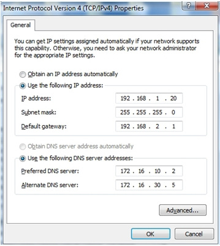

**Choices:**
- **A.** The DNS server addresses are incorrect.
- **B.** The default gateway address in incorrect.
- **C.** The wrong subnet mask was assigned to the workstation.
- **D.** The workstation is not in the same network as the DNS servers.

**Correct Answer:**
The default gateway address in incorrect.

---

## Question 166

**Question:**
A network administrator needs to monitor network traffic to and from servers in a data center. Which features of an IP addressing scheme should be applied to these devices?

**Choices:**
- **A.** random static addresses to improve security
- **B.** addresses from different subnets for redundancy
- **C.** predictable static IP addresses for easier identification
- **D.** dynamic addresses to reduce the probability of duplicate addresses

**Correct Answer:**
predictable static IP addresses for easier identification

**Explanation:**
When monitoring servers, a network administrator needs to be able to quickly identify them. Using a predictable static addressing scheme for these devices makes them easier to identify. Server security, redundancy, and duplication of addresses are not features of an IP addressing scheme.

---

## Question 167

**Question:**
Refer to the exhibit. Which IP addressing scheme should be changed?

**Images:**
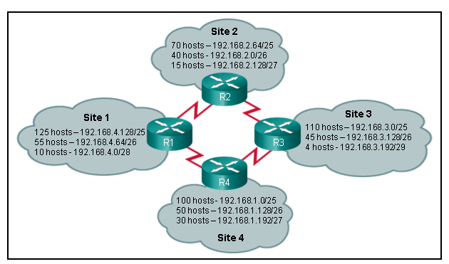

**Choices:**
- **A.** Site 1
- **B.** Site 2
- **C.** Site 3
- **D.** Site 4

**Correct Answer:**
Site 2

---

## Question 168

**Question:**
Which two notations are useable nibble boundaries when subnetting in IPv6? (Choose two.)

**Choices:**
- **A.** /62
- **B.** /64
- **C.** /66
- **D.** /68
- **E.** /70

**Correct Answer:**
/64; /68

---

## Question 169

**Question:**
A host PC has just booted and is attempting to lease an address through DHCP. Which two messages will the client typically broadcast on the network? (Choose two.)

**Choices:**
- **A.** DHCPDISCOVER
- **B.** DHCPOFFER
- **C.** DHCPREQUEST
- **D.** DHCPACK
- **E.** DHCPNACK

**Correct Answer:**
DHCPDISCOVER; DHCPREQUEST

**Explanation:**
When a host uses DHCP to automatically configure an IP address, the typically sends two messages: the DHCPDISCOVER message and the DHCPREQUEST message. These two messages are usually sent as broadcasts to ensure that all DHCP servers receive them. The servers respond to these messages using DHCPOFFER, DHCPACK, and DHCPNACK messages, depending on the circumstance.

---

## Question 170

**Question:**
What is the purpose of the network security accounting function?

**Choices:**
- **A.** to require users to prove who they are
- **B.** to determine which resources a user can access
- **C.** to keep track of the actions of a user
- **D.** to provide challenge and response questions

**Correct Answer:**
to keep track of the actions of a user

**Explanation:**
Authentication, authorization, and accounting are network services collectively known as AAA. Authentication requires users to prove who they are. Authorization determines which resources the user can access. Accounting keeps track of the actions of the user.

---

## Question 171

**Question:**
Refer to the exhibit. The network administrator enters these commands into the R1 router: R1# copy running-config tftp Address or name of remote host [ ]? When the router prompts for an address or remote host name, what IP address should the administrator enter at the prompt?

**Images:**
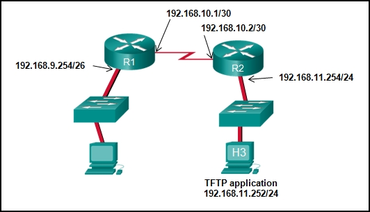

**Choices:**
- **A.** 192.168.9.254
- **B.** 192.168.10.1
- **C.** 192.168.10.2
- **D.** 192.168.11.252
- **E.** 192.168.11.254

**Correct Answer:**
192.168.11.252

**Explanation:**
The requested address is the address of the TFTP server. A TFTP server is an application that can run on a multitude of network devices including a router, server, or even a networked PC.

---

## Question 172

**Question:**
Match the IPv6 address to the IPv6 address type. (Not all options are used.) Options matched to the correct selection.

**Images:**
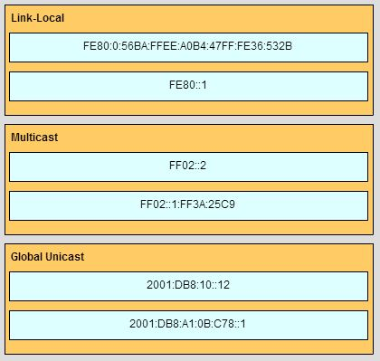

---

## Question 173

**Question:**
What two preconfigured settings that affect security are found on most new wireless routers? (Choose two.)

**Choices:**
- **A.** broadcast SSID
- **B.** MAC filtering enabled
- **C.** WEP encryption enabled
- **D.** PSK authentication required
- **E.** default administrator password

**Correct Answer:**
broadcast SSID; default administrator password

---

## Question 174

**Question:**
Which type of wireless security generates dynamic encryption keys each time a client associates with an AP?

**Choices:**
- **A.** EAP
- **B.** PSK
- **C.** WEP
- **D.** WPA

**Correct Answer:**
WPA

---

## Question 175

**Question:**
Fill in the blank. TFTP is a best-effort, connectionless application layer protocol that is used to transfer files.

---

## Question 176

**Question:**
Which two components are necessary for a wireless client to be installed on a WLAN? (Choose two.)

**Choices:**
- **A.** media
- **B.** wireless NIC
- **C.** custom adapter
- **D.** crossover cable
- **E.** wireless bridge
- **F.** wireless client software

**Correct Answer:**
wireless NIC; wireless client software

---

## Question 177

**Question:**
Consider the following range of addresses: The prefix-length for the range of addresses is /60

**Explanation:**
All the addresses have the part 2001:0DB8:BC15:00A in common. Each number or letter in the address represents 4 bits, so the prefix-length is /60.

---

## Question 178

**Question:**
Match the phases to their correct stage in the router bootup process. (Not all options are used.) 179. A host is accessing an FTP server on a remote network. Which three functions are performed by intermediary network devices during this conversation? (Choose three.)

**Images:**
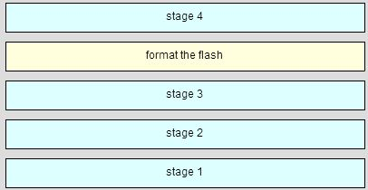

**Choices:**
- **A.** regenerating data signals
- **B.** acting as a client or a server
- **C.** providing a channel over which messages travel
- **D.** applying security settings to control the flow of data
- **E.** notifying other devices when errors occur
- **F.** serving as the source or destination of the messages

**Correct Answer:**
regenerating data signals; applying security settings to control the flow of data; notifying other devices when errors occur

---

## Question 179

**Question:**
When is a dial-up connection used to connect to an ISP?

**Choices:**
- **A.** when a cellular telephone provides the service
- **B.** when a high-speed connection is provided over a cable TV network
- **C.** when a satellite dish is used
- **D.** when a regular telephone line is used

**Correct Answer:**
when a regular telephone line is used

---

## Question 180

**Question:**
On a school network, students are surfing the web, searching the library database, and attending an audio conference with their sister school in Japan. If network traffic is prioritized with QoS, how will the traffic be classified from highest priority to lowest priority?

**Choices:**
- **A.** audio conference, database, HTTP
- **B.** database, HTTP, audio conference
- **C.** audio conference, HTTP, database
- **D.** database, audio conference, HTTP

**Correct Answer:**
audio conference, database, HTTP

---

## Question 181

**Question:**
During normal operation, from which location do most Cisco routers run the IOS?

**Choices:**
- **A.** RAM
- **B.** flash
- **C.** NVRAM
- **D.** disk drive

**Correct Answer:**
RAM

**Explanation:**
When a Cisco switch is powered on, the IOS is copied into RAM. The switch then runs the IOS from RAM, thus enhancing operating performance.

---

## Question 182

**Question:**
Which keys act as a hot key combination that is used to interrupt an IOS process?

**Choices:**
- **A.** Ctrl-Shift-X
- **B.** Ctrl-Shift-6
- **C.** Ctrl-Z
- **D.** Ctrl-C

**Correct Answer:**
Ctrl-Shift-6

**Explanation:**
The Cisco IOS provides both hot keys and shortcuts for configuring routers and switches. The Ctrl-Shift-6 hot key combination is used to interrupt an IOS process, such as a ping or traceroute. Ctrl-Z is used to exit the configuration mode. Ctrl-C aborts the current command. Ctrl-Shift-X has no IOS function.

---

## Question 183

**Question:**
Refer to the exhibit. An administrator wants to change the name of a brand new switch, using the hostname command as shown. What prompt will display after the command is issued?

**Images:**
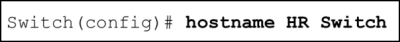

**Choices:**
- **A.** HR Switch(config)#?
- **B.** Switch(config)#?
- **C.** HRSwitch(config)#?
- **D.** HR(config)#?
- **E.** Switch#

**Correct Answer:**
Switch(config)#?

---

## Question 184

**Question:**
A technician uses the ping 127.0.0.1 command. What is the technician testing?

**Choices:**
- **A.** the TCP/IP stack on a network host
- **B.** connectivity between two adjacent Cisco devices
- **C.** connectivity between a PC and the default gateway
- **D.** connectivity between two PCs on the same network
- **E.** physical connectivity of a particular PC and the network

**Correct Answer:**
the TCP/IP stack on a network host

---

## Question 185

**Question:**
What is the correct order for PDU encapsulation? 187. Which device should be used for enabling a host to communicate with another host on a different network?

**Images:**
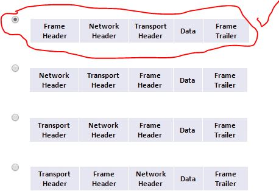

**Choices:**
- **A.** switch
- **B.** hub
- **C.** router
- **D.** host

**Correct Answer:**
router

---

## Question 186

**Question:**
A network technician is measuring the transfer of bits across the company backbone for a mission critical application. The technician notices that the network throughput appears lower than the bandwidth expected. Which three factors could influence the differences in throughput? (Choose three.)

**Choices:**
- **A.** the amount of traffic that is currently crossing the network
- **B.** the sophistication of the encapsulation method applied to the data
- **C.** the type of traffic that is crossing the network
- **D.** the latency that is created by the number of network devices that the data is crossing
- **E.** the bandwidth of the WAN connection to the Internet
- **F.** the reliability of the gigabit Ethernet infrastructure of the backbone

**Correct Answer:**
the amount of traffic that is currently crossing the network; the type of traffic that is crossing the network; the latency that is created by the number of network devices that the data is crossing

---

## Question 187

**Question:**
Which characteristics describe fiber optic cable? (Choose two.)

**Choices:**
- **A.** It is not affected by EMI or RFI.
- **B.** Each pair of cables is wrapped in metallic foil.
- **C.** It combines the technique of cancellation, shielding and twisting to protect data.
- **D.** It has a maximum speed of 100 Mbps.
- **E.** It is the most expensive type of LAN cabling

**Correct Answer:**
It is not affected by EMI or RFI.; It is the most expensive type of LAN cabling

---

## Question 188

**Question:**
What are two features of a physical, star network topology? (Choose two.)

**Choices:**
- **A.** It is straightforward to troubleshoot.
- **B.** End devices are connected together by a bus.
- **C.** It is easy to add and remove end devices.
- **D.** All end devices are connected in a chain to each other.
- **E.** Each end system is connected to its respective neighbor.

**Correct Answer:**
It is straightforward to troubleshoot.; It is easy to add and remove end devices.

---

## Question 189

**Question:**
A frame is transmitted from one networking device to another. Why does the receiving device check the FCS field in the frame?

**Choices:**
- **A.** to determine the physical address of the sending device
- **B.** to verify the network layer protocol information
- **C.** to compare the interface media type between the sending and receiving ends
- **D.** to check the frame for possible transmission errors
- **E.** to verify that the frame destination matches the MAC address of the receiving device

**Correct Answer:**
to check the frame for possible transmission errors

---

## Question 190

**Question:**
What will a Layer 2 switch do when the destination MAC address of a received frame is not in the MAC table?

**Choices:**
- **A.** It initiates an ARP request.
- **B.** It broadcasts the frame out of all ports on the switch.
- **C.** It notifies the sending host that the frame cannot be delivered.
- **D.** It forwards the frame out of all ports except for the port at which the frame was received.

**Correct Answer:**
It forwards the frame out of all ports except for the port at which the frame was received.

---

## Question 191

**Question:**
Which parameter does the router use to choose the path to the destination when there are multiple routes available?

**Choices:**
- **A.** the lower metric value that is associated with the destination network
- **B.** the lower gateway IP address to get to the destination network
- **C.** the higher metric value that is associated with the destination network
- **D.** the higher gateway IP address to get to the destination network

**Correct Answer:**
the lower metric value that is associated with the destination network

---

## Question 192

**Question:**
Which two statements describe the functions or characteristics of ROM in a router? (Choose two.)

**Choices:**
- **A.** stores routing tables
- **B.** allows software to be updated without replacing pluggable chips on the motherboard
- **C.** maintains instructions for POST diagnostics
- **D.** holds ARP cache
- **E.** stores bootstrap program

**Correct Answer:**
maintains instructions for POST diagnostics; stores bootstrap program

---

## Question 193

**Question:**
Which statement describes a characteristic of the Cisco router management ports?

**Choices:**
- **A.** A console port is used for remote management of the router.
- **B.** A console port is not used for packet forwarding.
- **C.** Serial and DSL interfaces are types of management ports.
- **D.** Each Cisco router has a LED indicator to provide information about the status of the management ports.

**Correct Answer:**
A console port is not used for packet forwarding.

---

## Question 194

**Question:**
What happens when part of an Internet radio transmission is not delivered to the destination?

**Choices:**
- **A.** A delivery failure message is sent to the source host.
- **B.** The part of the radio transmission that was lost is re-sent.
- **C.** The entire transmission is re-sent.
- **D.** The transmission continues without the missing portion.

**Correct Answer:**
The transmission continues without the missing portion.

---

## Question 195

**Question:**
What types of addresses make up the majority of addresses within the /8 block IPv4 bit space?

**Choices:**
- **A.** private addresses
- **B.** public addresses
- **C.** multicast addresses
- **D.** experimental addresses

**Correct Answer:**
public addresses

---

## Question 196

**Question:**
Refer to the exhibit. What is the maximum TTL value that is used to reach the destination www.cisco.com??

**Images:**
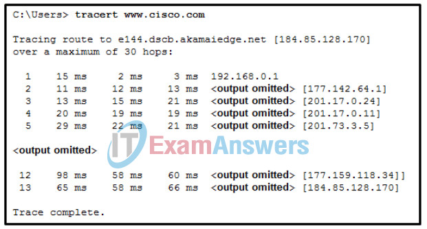

**Choices:**
- **A.** 11
- **B.** 12
- **C.** 13
- **D.** 14

**Correct Answer:**
13

**Explanation:**
Traceroute (in this case the command tracert) sets the TTL field to a value of 1 and sends the packet. At each router hop, this value is decreased by one and a “TTL expired” message is sent back to the source host. This message has a source address which is used by the host to build the trace. The host then progressively increments the TTL field (2, 3, 4…) for each sequence of messages until the destination is reached or it is incremented to a predefined maximum. Because the executed command reached the destination in the 13th line, the TTL was increased up to the value of 13.

---

## Question 197

**Question:**
A company has a network address of 192.168.1.64 with a subnet mask of 255.255.255.192. The company wants to create two subnetworks that would contain 10 hosts and 18 hosts respectively. Which two networks would achieve that? (Choose two.)

**Choices:**
- **A.** 192.168.1.16/28
- **B.** 192.168.1.64/27
- **C.** 192.168.1.128/27
- **D.** 192.168.1.96/28
- **E.** 192.168.1.192/28

**Correct Answer:**
192.168.1.64/27; 192.168.1.96/28

**Explanation:**
Subnet 192.168.1.64 /27 has 5 bits that are allocated for host addresses and therefore will be able to support 32 addresses, but only 30 valid host IP addresses. Subnet 192.168.1.96/28 has 4 bits for host addresses and will be able to support 16 addresses, but only 14 valid host IP addresses

---

## Question 198

**Question:**
In a network that uses IPv4, what prefix would best fit a subnet containing 100 hosts?

**Choices:**
- **A.** /23
- **B.** /24
- **C.** /25
- **D.** /26

**Correct Answer:**
/25

---

## Question 199

**Question:**
Which protocol supports rapid delivery of streaming media?

**Choices:**
- **A.** Transmission Control Protocol
- **B.** Real-Time Transport Protocol
- **C.** Secure File Transfer Protocol
- **D.** Video over Internet Protocol

**Correct Answer:**
Real-Time Transport Protocol

---

## Question 200

**Question:**
Why would a network administrator use the tracert utility?

**Choices:**
- **A.** to determine the active TCP connections on a PC
- **B.** to check information about a DNS name in the DNS server
- **C.** to identify where a packet was lost or delayed on a network
- **D.** to display the IP address, default gateway, and DNS server address for a PC

**Correct Answer:**
to identify where a packet was lost or delayed on a network

**Explanation:**
The tracert utility is used to identify the path a packet takes from source to destination. Tracert is commonly used when packets are dropped or not reaching a specific destination.

---

## Question 201

**Question:**
Refer to the exhibit. What is the significance of the asterisk (*) in the exhibited output?

**Images:**
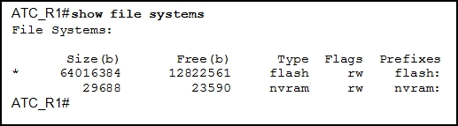

**Choices:**
- **A.** The asterisk shows which file system was used to boot the system.
- **B.** The asterisk designates which file system is the default file system.
- **C.** An asterisk indicates that the file system is bootable.
- **D.** An asterisk designates that the file system has at least one file that uses that file system.

**Correct Answer:**
The asterisk designates which file system is the default file system.

---

## Question 202

**Question:**
Which WLAN security protocol generates a new dynamic key each time a client establishes a connection with the AP?

**Choices:**
- **A.** EAP
- **B.** PSK
- **C.** WEP
- **D.** WPA

**Correct Answer:**
WPA

---

## Question 203

**Question:**
Fill in the blank. Point-to-point communications where both devices can transmit and receive on the medium at the same time are known as full-duplex

---

## Question 204

**Question:**
Match each characteristic to the appropriate email protocol. (Not all options are used.) POP:

**Images:**
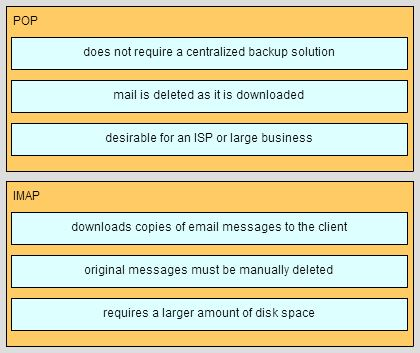

**Choices:**
- **A.** does not require a centralized backup solution.
- **B.** mail is deleted as it is downloaded.
- **C.** desirable for an ISP or large business.
- **D.** download copies of messages to be the client.
- **E.** original messages must be manually deleted.
- **F.** requires a larger a mount of disk space.

**Explanation:**
IMAP:

---

## Question 205

**Question:**
A host is accessing a Telnet server on a remote network. Which three functions are performed by intermediary network devices during this conversation? (Choose three.)

**Choices:**
- **A.** regenerating data signals
- **B.** acting as a client or a server
- **C.** providing a channel over which messages travel
- **D.** applying security settings to control the flow of data
- **E.** notifying other devices when errors occur
- **F.** serving as the source or destination of the messages

**Correct Answer:**
regenerating data signals; applying security settings to control the flow of data; notifying other devices when errors occur

---

## Question 206

**Question:**
Refer to the exhibit. Which area would most likely be an extranet for the company network that is shown?

**Images:**
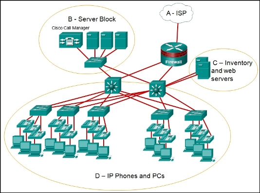

**Choices:**
- **A.** area A
- **B.** area B
- **C.** area C
- **D.** area D

**Correct Answer:**
area C

---

## Question 207

**Question:**
Three office workers are using the corporate network. The first employee uses a web browser to view a company web page in order to read some announcements. The second employee accesses the corporate database to perform some financial transactions. The third employee participates in an important live audio conference with other office workers in branch offices. If QoS is implemented on this network, what will be the priorities from highest to lowest of the different data types?

**Choices:**
- **A.** audio conference, financial transactions, web page
- **B.** financial transactions, web page, audio conference
- **C.** audio conference, web page, financial transactions
- **D.** financial transactions, audio conference, web page

**Correct Answer:**
audio conference, financial transactions, web page

**Explanation:**
QoS mechanisms enable the establishment of queue management strategies that enforce priorities for different categories of application data. Thus, this queuing enables voice data to have priority over transaction data, which has priority over web data.

---

## Question 208

**Question:**
During normal operation, from which location do most Cisco switches and routers run the IOS?

**Choices:**
- **A.** RAM
- **B.** flash
- **C.** NVRAM
- **D.** disk drive

**Correct Answer:**
RAM

---

## Question 209

**Question:**
A network administrator is making changes to the configuration of a router. After making the changes and verifying the results, the administrator issues the copy running-config startup-config command. What will happen after this command executes?

**Choices:**
- **A.** The configuration will be copied to flash.
- **B.** The configuration will load when the router is restarted.
- **C.** The new configuration file will replace the IOS file.
- **D.** The changes will be lost when the router restarts.

**Correct Answer:**
The configuration will load when the router is restarted.

---

## Question 210

**Question:**
What information does the loopback test provide?

**Choices:**
- **A.** The TCP/IP stack on the device is working correctly.
- **B.** The device has end-to-end connectivity.
- **C.** DHCP is working correctly.
- **D.** The Ethernet cable is working correctly.
- **E.** The device has the correct IP address on the network.

**Correct Answer:**
The TCP/IP stack on the device is working correctly.

**Explanation:**
Because the loopback test sends packets back to the host device, it does not provide information about network connectivity to other hosts. The loopback test verifies that the host NIC, drivers, and TCP/IP stack are functioning.

---

## Question 211

**Question:**
What happens when a switch receives a frame and the calculated CRC value is different than the value that is in the FCS field?

**Choices:**
- **A.** The switch places the new CRC value in the FCS field and forwards the frame.
- **B.** The switch notifies the source of the bad frame.
- **C.** The switch drops the frame.
- **D.** The switch floods the frame to all ports except the port through which the frame arrived to notify the hosts of the error.

**Correct Answer:**
The switch drops the frame.

**Explanation:**
The purpose of the CRC value in the FCS field is to determine if the frame has errors. If the frame does have errors, then the frame is dropped by the switch.

---

## Question 212

**Question:**
Which destination address is used in an ARP request frame?

**Choices:**
- **A.** 0.0.0.0
- **B.** 255.255.255.255
- **C.** FFFF.FFFF.FFFF
- **D.** 127.0.0.1
- **E.** 01-00-5E-00-AA-23

**Correct Answer:**
FFFF.FFFF.FFFF

**Explanation:**
The purpose of an ARP request is to find the MAC address of the destination host on an Ethernet LAN. The ARP process sends a Layer 2 broadcast to all devices on the Ethernet LAN. The frame contains the IP address of the destination and the broadcast MAC address, FFFF.FFFF.FFFF. The host with the IP address that matches the IP address in the ARP request will reply with a unicast frame that includes the MAC address of the host. Thus the original sending host will obtain the destination IP and MAC address pair to continue the encapsulation process for data transmission.

---

## Question 213

**Question:**
What is the auto-MDIX feature on a switch?

**Choices:**
- **A.** the automatic configuration of an interface for 10/100/1000 Mb/s operation
- **B.** the automatic configuration of an interface for a straight-through or a crossover Ethernet cable connection
- **C.** the automatic configuration of full-duplex operation over a single Ethernet copper or optical cable
- **D.** the ability to turn a switch interface on or off accordingly if an active connection is detected

**Correct Answer:**
the automatic configuration of an interface for a straight-through or a crossover Ethernet cable connection

**Explanation:**
The auto-MDIX enables a switch to use a crossover or a straight-through Ethernet cable to connect to a device regardless of the device on the other end of the connection.

---

## Question 214

**Question:**
What are the two main components of Cisco Express Forwarding (CEF)? (Choose two.)

**Choices:**
- **A.** adjacency tables
- **B.** MAC-address tables
- **C.** routing tables
- **D.** ARP tables
- **E.** forwarding information base (FIB)

**Correct Answer:**
adjacency tables; forwarding information base (FIB)

**Explanation:**
The forwarding information base (FIB) and adjacency tables are the main components of CEF. The FIB is similar to a routing table, but neither the routing table, nor the ARP table, nor the MAC-address table is part of CEF.

---

## Question 215

**Question:**
Which statement describes the sequence of processes executed by a router when it receives a packet from a host to be delivered to a host on another network?

**Choices:**
- **A.** It receives the packet and forwards it directly to the destination host.
- **B.** It de-encapsulates the packet, selects the appropriate path, and encapsulates the packet to forward it toward the destination host
- **C.** It de-encapsulates the packet and forwards it toward the destination host.
- **D.** It selects the path and forwards it toward the destination host.

**Correct Answer:**
It de-encapsulates the packet, selects the appropriate path, and encapsulates the packet to forward it toward the destination host

**Explanation:**
The router receives the packet, de-encapsulates it to select the appropriate path, encapsulates the packet, and then forwards it toward the destination host.

---

## Question 216

**Question:**
Refer to the exhibit. Router R1 has two interfaces that were configured with correct IP addresses and subnet masks. Why does the show ip route command output not display any information about the directly connected networks?

**Images:**
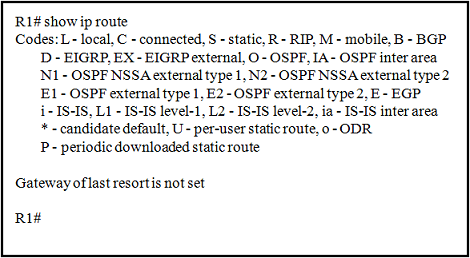

**Choices:**
- **A.** The directly connected networks have to be created manually to be displayed in the routing table.
- **B.** The routing table will only display information about these networks when the router receives a packet.
- **C.** The no shutdown command was not issued on these interfaces.
- **D.** The gateway of last resort was not configured.

**Correct Answer:**
The no shutdown command was not issued on these interfaces.

---

## Question 217

**Question:**
What happens when part of an Internet television transmission is not delivered to the destination?

**Choices:**
- **A.** A delivery failure message is sent to the source host.
- **B.** The part of the television transmission that was lost is re-sent.
- **C.** The entire transmission is re-sent.
- **D.** The transmission continues without the missing portion.

**Correct Answer:**
The transmission continues without the missing portion.

---

## Question 218

**Question:**
Which three statements characterize the transport layer protocols? (Choose three.)

**Choices:**
- **A.** TCP and UDP port numbers are used by application layer protocols.
- **B.** TCP uses port numbers to provide reliable transportation of IP packets.
- **C.** UDP uses windowing and acknowledgments for reliable transfer of data.
- **D.** TCP uses windowing and sequencing to provide reliable transfer of data.
- **E.** TCP is a connection-oriented protocol. UDP is a connectionless protocol.

**Correct Answer:**
TCP and UDP port numbers are used by application layer protocols.; TCP uses windowing and sequencing to provide reliable transfer of data.; TCP is a connection-oriented protocol. UDP is a connectionless protocol.

---

## Question 219

**Question:**
Which statement is true regarding the UDP client process during a session with a server?

**Choices:**
- **A.** Datagrams that arrive in a different order than that in which they were sent are not placed in order.
- **B.** A session must be established before datagrams can be exchanged.
- **C.** A three-way handshake takes place before the transmission of data begins.
- **D.** Application servers have to use port numbers above 1024 in order to be UDP capable.

**Correct Answer:**
Datagrams that arrive in a different order than that in which they were sent are not placed in order.

**Explanation:**
Because there are no sequence numbers in UDP segments, there is no possibility to arrange the datagrams in the correct order. Sessions and three-way handshake are related to TCP communications. UDP servers can use registered or nonregistered port numbers to listen to clients.

---

## Question 220

**Question:**
Which two components are configured via software in order for a PC to participate in a network environment? (Choose two.)

**Choices:**
- **A.** MAC address
- **B.** IP address
- **C.** kernel
- **D.** shell
- **E.** subnet mask

**Correct Answer:**
IP address; subnet mask

---

## Question 221

**Question:**
Which two reasons generally make DHCP the preferred method of assigning IP addresses to hosts on large networks? (Choose two.)

**Choices:**
- **A.** It eliminates most address configuration errors.
- **B.** It ensures that addresses are only applied to devices that require a permanent address.
- **C.** It guarantees that every device that needs an address will get one.
- **D.** It provides an address only to devices that are authorized to be connected to the network.
- **E.** It reduces the burden on network support staff.

**Correct Answer:**
It eliminates most address configuration errors.; It reduces the burden on network support staff.

**Explanation:**
DHCP is generally the preferred method of assigning IP addresses to hosts on large networks because it reduces the burden on network support staff and virtually eliminates entry errors. However, DHCP itself does not discriminate between authorized and unauthorized devices and will assign configuration parameters to all requesting devices. DHCP servers are usually configured to assign addresses from a subnet range, so there is no guarantee that every device that needs an address will get one.

---

## Question 222

**Question:**
What is the subnet address for the address 2001:DB8:BC15:A:12AB::1/64?

**Choices:**
- **A.** 2001:DB8:BC15::0
- **B.** 2001:DB8:BC15:A::0
- **C.** 2001:DB8:BC15:A:1::1
- **D.** 2001:DB8:BC15:A:12::0

**Correct Answer:**
2001:DB8:BC15:A::0

---

## Question 223

**Question:**
What is the purpose of the network security authentication function?

**Choices:**
- **A.** to require users to prove who they are
- **B.** to determine which resources a user can access
- **C.** to keep track of the actions of a user
- **D.** to provide challenge and response questions

**Correct Answer:**
to require users to prove who they are

**Explanation:**
Authentication, authorization, and accounting are network services collectively known as AAA. Authentication requires users to prove who they are. Authorization determines which resources the user can access. Accounting keeps track of the actions of the user.

---

## Question 224

**Question:**
Which type of wireless security makes use of dynamic encryption keys each time a client associates with an AP?

**Choices:**
- **A.** EAP
- **B.** PSK
- **C.** WEP
- **D.** WPA

**Correct Answer:**
WPA

---

## Question 225

**Question:**
Launch PT – Hide and Save PT. Open the PT activity. Perform the tasks in the activity instructions and then fill in the blank. The Server0 message isb ” winner ”

**Images:**
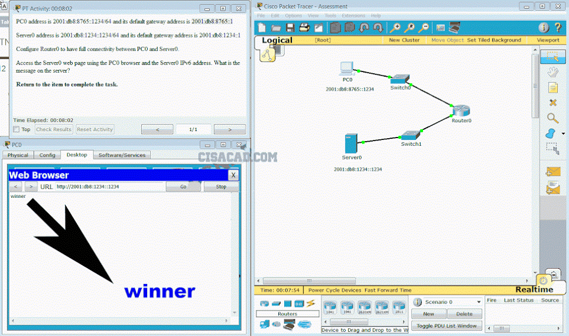

---

## Question 226

**Question:**
Which field in an IPv4 packet header will typically stay the same during its transmission?

**Choices:**
- **A.** Packet Length
- **B.** Destination Address
- **C.** Flag
- **D.** Time-to-Live

**Correct Answer:**
Destination Address

**Explanation:**
The value in the Destination Address field in an IPv4 header will stay the same during its transmission. The other options might change during its transmission.

---

## Question 227

**Question:**
Launch PT – Hide and Save PT Open the PT Activity. Perform the tasks in the activity instructions and then answer the question. Which IPv6 address is assigned to the Serial0/0/0 interface on RT2?

**Images:**

**Choices:**
- **A.** 2001:db8:abc:1::1
- **B.** 2001:db8:abc:5::1
- **C.** 2001:db8:abc:5::2
- **D.** 2001:db8:abc:10::15

**Correct Answer:**
2001:db8:abc:5::1

---

## Question 228

**Question:**
What must be configured to enable Cisco Express Forwarding (CEF) on most Cisco devices that perform Layer 3 switching?

**Choices:**
- **A.** Manually configure next-hop Layer 2 addresses.
- **B.** Issue the no shutdown command on routed ports.
- **C.** CEF is enabled by default, so no configuration is necessary.
- **D.** Manually map Layer 2 addresses to Layer 3 addresses to populate the forwarding information base (FIB).

**Correct Answer:**
CEF is enabled by default, so no configuration is necessary.

---

## Question 229

**Question:**
What is the purpose of adjacency tables as used in Cisco Express Forwarding (CEF)?

**Choices:**
- **A.** to populate the forwarding information base (FIB)
- **B.** to maintain Layer 2 next-hop addresses
- **C.** to allow the separation of Layer 2 and Layer 3 decision making
- **D.** to update the forwarding information base (FIB)

**Correct Answer:**
to maintain Layer 2 next-hop addresses

---

## Question 230

**Question:**
Which statement describes a characteristic of the network layer in the OSI model?

**Choices:**
- **A.** It manages the data transport between the processes running on each host.
- **B.** In the encapsulation process, it adds source and destination port numbers to the IP header.
- **C.** When a packet arrives at the destination host, its IP header is checked by the network layer to determine where the packet has to be routed.
- **D.** Its protocols specify the packet structure and processing used to carry the data from one host to another.

**Correct Answer:**
Its protocols specify the packet structure and processing used to carry the data from one host to another.

**Explanation:**
The transport layer manages the data transport between the processes that are running on each host. In the encapsulation process, the network layer adds the IP header information, such as the IP address of the source (sending) and destination (receiving) hosts. When a packet arrives at the network layer of the destination host, the host checks the IP header of the packet to verify if the destination IP address within the header matches its own IP address.

---

## Question 231

**Question:**
A user gets an IP address of 192.168.0.1 from the company network administrator. A friend of the user at a different company gets the same IP address on another PC. How can two PCs use the same IP address and still reach the Internet, send and receive email, and search the web?

**Choices:**
- **A.** Both users must be using the same Internet Service Provider.
- **B.** ISPs use Network Address Translation to change a user IP address into an address that can be used on the Internet.
- **C.** ISPs use Domain Name Service to change a user IP address into a public IP address that can be used on the Internet.
- **D.** Both users must be on the same network.

**Correct Answer:**
ISPs use Network Address Translation to change a user IP address into an address that can be used on the Internet.

**Explanation:**
As user traffic from behind an ISP firewall reaches the gateway device, Network Address Translation changes private IP addresses into a public, routable IP address. Private user addresses remain hidden from the public Internet, and thus more than one user can have the same private IP address, regardless of ISP.

---

## Question 232

**Question:**
Why does HTTP use TCP as the transport layer protocol?

**Choices:**
- **A.** to ensure the fastest possible download speed
- **B.** because HTTP is a best-effort protocol
- **C.** because transmission errors can be tolerated easily
- **D.** because HTTP requires reliable delivery

**Correct Answer:**
because HTTP requires reliable delivery

**Explanation:**
When a host requests a web page, transmission reliability and completeness must be guaranteed. Therefore, HTTP uses TCP as its transport layer protocol.

---

## Question 233

**Question:**
What is the valid most compressed format possible of the IPv6 address 2001:0DB8:0000:AB00:0000:0000:0000:1234?

**Choices:**
- **A.** 2001:DB8:0:AB00::1234
- **B.** 2001:DB8:0:AB::1234
- **C.** 2001:DB8::AB00::1234
- **D.** 2001:DB8:0:AB:0:1234

**Correct Answer:**
2001:DB8:0:AB00::1234

**Explanation:**
There are two rules defining how an IPv6 address can be compressed. The first rule states that leading zeros in a hextet can be eliminated. The second rule states that a single :: can be used to represent one or more contiguous all zero hextets. There can be one and only one :: in an IPv6 address.

---

## Question 234

**Question:**
What field content is used by ICMPv6 to determine that a packet has expired?

**Choices:**
- **A.** TTL field
- **B.** CRC field
- **C.** Hop Limit field
- **D.** Time Exceeded field

**Correct Answer:**
Hop Limit field

**Explanation:**
ICMPv6 sends a Time Exceeded message if the router cannot forward an IPv6 packet because the packet expired. The router uses a hop limit field to determine if the packet has expired, and does not have a TTL field.

---

## Question 235

**Question:**
Which firewall technique blocks incoming packets unless they are responses to internal requests?

**Choices:**
- **A.** port filtering
- **B.** stateful packet inspection
- **C.** URL filtering
- **D.** application filtering

**Correct Answer:**
stateful packet inspection

---

## Question 236

**Question:**
A network technician is investigating network connectivity from a PC to a remote host with the address 10.1.1.5. Which command issued on the PC will return to the technician the complete path to the remote host?

**Choices:**
- **A.** trace 10.1.1.5
- **B.** traceroute 10.1.1.5
- **C.** tracert 10.1.1.5
- **D.** ping 10.1.1.5

**Correct Answer:**
tracert 10.1.1.5

---

## Question 237

**Question:**
Fill in the blank. To prevent faulty network devices from carrying dangerous voltage levels, equipment must be grounded correctly

---

## Question 238

**Question:**
What is a possible hazard that can be caused by network cables in a fire?

**Choices:**
- **A.** The cable insulation could be flammable.
- **B.** Users could be exposed to excessive voltage.
- **C.** Network cables could be exposed to water.
- **D.** The network cable could explode.

**Correct Answer:**
The cable insulation could be flammable.

---

## Question 239

**Question:**
What device is commonly used to verify a UTP cable?

**Choices:**
- **A.** a multimeter
- **B.** an Optical Time Domain Reflectometer
- **C.** a cable tester
- **D.** an ohmmeter

**Correct Answer:**
a cable tester

---

## Question 240

**Question:**
What needs to be checked when testing a UTP network cable?

**Choices:**
- **A.** capacitance
- **B.** wire map
- **C.** inductance
- **D.** flexibility

**Correct Answer:**
wire map

---

## Question 241

**Question:**
Refer to the exhibit. A ping to PC2 is issued from PC0, PC1, and PC3 in this exact order. Which MAC addresses will be contained in the S1 MAC address table that is associated with the Fa0/1 port?

**Images:**

**Choices:**
- **A.** just PC0 and PC1 MAC addresses
- **B.** just the PC0 MAC address
- **C.** PC0, PC1, and PC2 MAC addresses
- **D.** just the PC1 MAC address
- **E.** just the PC2 MAC address

**Correct Answer:**
just PC0 and PC1 MAC addresses

**Explanation:**
Switch S1 builds a MAC address table based on the source MAC address in the frame and the port upon which the frame enters the switch. The PC2 MAC address will be associated with port FA0/2. Because port FA0/1 of switch S1 connects with another switch, port FA0/1 will receive frames from multiple different devices. The MAC address table on switch S1 will therefore contain MAC addresses associated with each of the sending PCs.

---

## Question 242

**Question:**
Which function is provided by TCP?

**Choices:**
- **A.** data encapsulation
- **B.** detection of missing packets
- **C.** communication session control
- **D.** path determination for data packets

**Correct Answer:**
detection of missing packets

---

## Question 243

**Question:**
What does a router use to determine where to send data it receives from the network?

**Choices:**
- **A.** an ARP table
- **B.** a routing table
- **C.** the destination PC physical address
- **D.** a switching table

**Correct Answer:**
a routing table

---

## Question 244

**Question:**
Which router interface should be used for direct remote access to the router via a modem?

**Choices:**
- **A.** an inband router interface
- **B.** a console port
- **C.** a serial WAN interface
- **D.** an AUX port

**Correct Answer:**
an AUX port

---

## Question 245

**Question:**
A technician is configuring a router to allow for all forms of management access. As part of each different type of access, the technician is trying to type the command login. Which configuration mode should be entered to do this task?

**Choices:**
- **A.** user executive mode
- **B.** global configuration mode
- **C.** any line configuration mode
- **D.** privileged EXEC mode

**Correct Answer:**
any line configuration mode

**Explanation:**
The command login is used to allow access to a router or switch through aux lines, console lines, and Telnet lines.

---

## Question 246

**Question:**
Which three statements characterize the transport layer protocols? (Choose three.)

**Choices:**
- **A.** TCP and UDP port numbers are used by application layer protocols.
- **B.** TCP uses port numbers to provide reliable transportation of IP packets.
- **C.** UDP uses windowing and acknowledgments for reliable transfer of data.
- **D.** TCP uses windowing and sequencing to provide reliable transfer of data.
- **E.** TCP is a connection-oriented protocol. UDP is a connectionless protocol.

**Correct Answer:**
TCP and UDP port numbers are used by application layer protocols.; TCP uses windowing and sequencing to provide reliable transfer of data.; TCP is a connection-oriented protocol. UDP is a connectionless protocol.

---

## Question 247

**Question:**
Refer to the exhibit. A TCP segment from a server has been captured by Wireshark, which is running on a host. What acknowledgement number will the host return for the TCP segment that has been received?

**Images:**
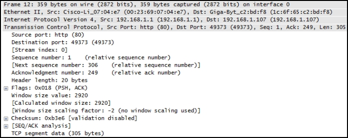

**Choices:**
- **A.** 2
- **B.** 21
- **C.** 250
- **D.** 306
- **E.** 2921

**Correct Answer:**
306

---

## Question 248

**Question:**
Which statement is true about an interface that is configured with the IPv6 address command?

**Choices:**
- **A.** IPv6 traffic-forwarding is enabled on the interface.
- **B.** A link-local IPv6 address is automatically configured on the interface.
- **C.** A global unicast IPv6 address is dynamically configured on the interface.
- **D.** Any IPv4 addresses that are assigned to the interface are replaced with an IPv6 address.

**Correct Answer:**
A link-local IPv6 address is automatically configured on the interface.

---

## Question 249

**Question:**
Refer to the exhibit. An administrator must send a message to everyone on the router A network. What is the broadcast address for network 172.16.16.0/22?

**Images:**

**Choices:**
- **A.** 172.16.16.255
- **B.** 172.16.20.255
- **C.** 172.16.19.255
- **D.** 172.16.23.255
- **E.** 172.16.255.255

**Correct Answer:**
172.16.19.255

**Explanation:**
The 172.16.16.0/22 network has 22 bits in the network portion and 10 bits in the host portion. Converting the network address to binary yields a subnet mask of 255.255.252.0. The range of addresses in this network will end with the last address available before 172.16.20.0. Valid host addresses for this network range from 172.16.16.1-172.16.19.254, making 172.16.19.255 the broadcast address.

---

## Question 250

**Question:**
A network administrator is variably subnetting a given block of IPv4 addresses. Which combination of network addresses and prefix lengths will make the most efficient use of addresses when the need is for 2 subnets capable of supporting 10 hosts and 1 subnet that can support 6 hosts?

**Choices:**
- **A.** 10.1.1.128/28 10.1.1.144/28 10.1.1.160/29
- **B.** 10.1.1.128/28 10.1.1.144/28 10.1.1.160/28
- **C.** 10.1.1.128/28 10.1.1.140/28 10.1.1.158/26
- **D.** 10.1.1.128/26 10.1.1.144/26 10.1.1.160/26
- **E.** 10.1.1.128/26 10.1.1.140/26 10.1.1.158/28

**Correct Answer:**
10.1.1.128/28 10.1.1.144/28 10.1.1.160/29

**Explanation:**
Prefix lengths of /28 and /29 are the most efficient to create subnets of 16 addresses (to support 10 hosts) and 8 addresses (to support 6 hosts), respectively. Addresses in one subnet must also not overlap into the range of another subnet.

---

## Question 251

**Question:**
How many additional bits should be borrowed from a /26 subnet mask in order to create subnets for WAN links that need only 2 useable addresses?

**Choices:**
- **A.** 2
- **B.** 3
- **C.** 4
- **D.** 5
- **E.** 6

**Correct Answer:**
4

**Explanation:**
WAN links needing only 2 useable addresses use a /30 subnet, so 4 additional bits would need to be borrowed.

---

## Question 252

**Question:**
A network administrator requires access to manage routers and switches locally and remotely. Match the description to the access method. (Not all options are used.)

**Images:**
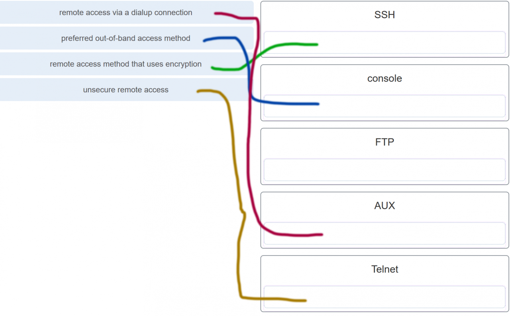
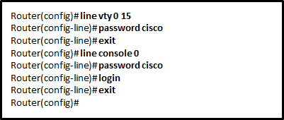

**Choices:**
- **A.** Unauthorized individuals can connect to the router via Telnet without entering a password.
- **B.** Because the IOS includes the login command on the vty lines by default, access to the device via Telnet will require authentication.
- **C.** Access to the vty lines will not be allowed via Telnet by anyone.
- **D.** Because the login command was omitted, the password cisco command is not applied to the vty lines.

**Correct Answer:**
Because the IOS includes the login command on the vty lines by default, access to the device via Telnet will require authentication.

**Explanation:**
Both the console and AUX ports can be used to directly connect to a Cisco network device for management purposes. However, it is more common to use the console port. The AUX port is more often used for remote access via a dial up connection. SSH and Telnet are both remote access methods that depend on an active network connection. SSH uses a stronger password authentication than Telnet uses and also uses encryption on transmitted data. 255. Refer to the exhibit. The administrator configured the access to the console and the vty lines of a router. Which conclusion can be drawn from this configuration? By default, the IOS includes the login command on the vty lines. This prevents Telnet access to the device without authentication. If, by mistake, the no login command is set, which removes the requirement for authentication, unauthorized persons could connect across the network to the line through Telnet. This would be a major security risk.​

---

## Question 253

**Question:**
An administrator issued the service password-encryption command to apply encryption to the passwords configured for enable password, vty, and console lines. What will be the consequences if the administrator later issues the no service password-encryption command?

**Choices:**
- **A.** It will remove encryption from all passwords.
- **B.** It will reverse only the vty and console password encryptions.
- **C.** It will not reverse any encryption.
- **D.** It will reverse only the enable password encryption.

**Correct Answer:**
It will not reverse any encryption.

**Explanation:**
The service password-encryption command can be executed and the encryption will be applied to the passwords. Once the encryption has been applied, issuing the no service-password encryption command does not reverse the encryption.​

---

## Question 254

**Question:**
After making configuration changes, a network administrator issues a copy running-config startup-config command in a Cisco switch. What is the result of issuing this command?

**Choices:**
- **A.** The new configuration will be stored in flash memory.
- **B.** The new configuration will be loaded if the switch is restarted.
- **C.** The current IOS file will be replaced with the newly configured file.
- **D.** The configuration changes will be removed and the original configuration will be restored.

**Correct Answer:**
The new configuration will be loaded if the switch is restarted.

**Explanation:**
With the copy running-config startup-config command, the content of the current operating configuration replaces the startup configuration file stored in NVRAM. The configuration file saved in NVRAM will be loaded when the device is restarted.​

---

## Question 255

**Question:**
What are two features of ARP? (Choose two.)

**Choices:**
- **A.** If a host is ready to send a packet to a local destination device and it has the IP address but not the MAC address of the destination, it generates an ARP broadcast.
- **B.** An ARP request is sent to all devices on the Ethernet LAN and contains the IP address of the destination host and its multicast MAC address.
- **C.** When a host is encapsulating a packet into a frame, it refers to the MAC address table to determine the mapping of IP addresses to MAC addresses.
- **D.** If no device responds to the ARP request, then the originating node will broadcast the data packet to all devices on the network segment.
- **E.** If a device receiving an ARP request has the destination IPv4 address, it responds with an ARP reply.

**Correct Answer:**
If a host is ready to send a packet to a local destination device and it has the IP address but not the MAC address of the destination, it generates an ARP broadcast.; If a device receiving an ARP request has the destination IPv4 address, it responds with an ARP reply.

**Explanation:**
When a node encapsulates a data packet into a frame, it needs the destination MAC address. First it determines if the destination device is on the local network or on a remote network. Then it checks the ARP table (not the MAC table) to see if a pair of IP address and MAC address exists for either the destination IP address (if the destination host is on the local network) or the default gateway IP address (if the destination host is on a remote network). If the match does not exist, it generates an ARP broadcast to seek the IP address to MAC address resolution. Because the destination MAC address is unknown, the ARP request is broadcast with the MAC address FFFF.FFFF.FFFF. Either the destination device or the default gateway will respond with its MAC address, which enables the sending node to assemble the frame. If no device responds to the ARP request, then the originating node will discard the packet because a frame cannot be created.​

---

## Question 256

**Question:**
A network administrator is enabling services on a newly installed server. Which two statements describe how services are used on a server? (Choose two.)

**Choices:**
- **A.** Data sent with a service that uses TCP is received in the order the data was sent.
- **B.** A port is considered to be open when it has an active server application that is assigned to it.
- **C.** An individual server can have two services that are assigned to the same port number.
- **D.** An individual server cannot have multiple services running at the same time.
- **E.** Server security can be improved by closing ports that are associated with unused services.

**Correct Answer:**
A port is considered to be open when it has an active server application that is assigned to it.; Server security can be improved by closing ports that are associated with unused services.

---

## Question 257

**Question:**
Given the binary address of 11101100 00010001 00001100 00001010, which address does this represent in dotted decimal format?

**Choices:**
- **A.** 234.17.10.9
- **B.** 234.16.12.10
- **C.** 236.17.12.6
- **D.** 236.17.12.10

**Correct Answer:**
236.17.12.10

**Explanation:**
The binary number 11101100 00010001 00001100 00001010 translates to 236.17.12.10.​

---

## Question 258

**Question:**
A particular telnet site does not appear to be responding on a Windows 7 computer. What command could the technician use to show any cached DNS entries for this web page?

**Choices:**
- **A.** ipconfig /all
- **B.** arp -a
- **C.** ipconfig /displaydns
- **D.** nslookup

**Correct Answer:**
ipconfig /displaydns

---

## Question 259

**Question:**
Fill in the blank. Network devices come in two physical configurations. Devices that have expansion slots that provide the flexibility to add new modules have a Modular configuration.

---

## Question 260

**Question:**
Refer to the exhibit. What is the maximum TIL value that is used to reach the destination www.cisco.com?

**Images:**
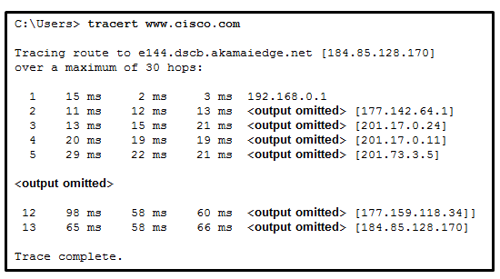

**Choices:**
- **A.** 11
- **B.** 12
- **C.** 13
- **D.** 14

**Correct Answer:**
13

---

## Question 261

**Question:**
Which statement is true about DHCP operation?

**Choices:**
- **A.** When a device that is configured to use DHCP boots, the client broadcasts a DHCPDISCOVER message to identify any available DHCP servers on the network.
- **B.** A client must wait for lease expiration before it sends another DHCPREOUEST message.
- **C.** The DHCPDISCOVER message contains the IP address and sub net masK to be assigned, the IP address of the DNS server, and the IP address of the default gateway.
- **D.** If the client receives several DHCPOFFER messages from different servers, it sends a unicast DHCPREOUEST message to the server from which it chooses to obtain the IP information.

**Correct Answer:**
When a device that is configured to use DHCP boots, the client broadcasts a DHCPDISCOVER message to identify any available DHCP servers on the network.

**Explanation:**
The client broadcasts a DHCPDISCOVER message to identify any available DHCP servers on the network. A DHCP server replies with a DHCPOFFER message. This message offers to the client a lease that contains such information as the IP address and subnet mask to be assigned, the IP address of the DNS server, and the IP address of the default gateway. After the client receives the lease, the received information must be renewed through another DHCPREQUEST message prior to the lease expiration.​

---

## Question 262

**Question:**
Which type of wireless security is easily compromised?

**Choices:**
- **A.** EAP
- **B.** PSK
- **C.** WEP
- **D.** WPA

**Correct Answer:**
WEP

---

## Question 263

**Question:**
A network administrator notices that the throughput on the network appears lower than expected when compared to the end-to-end network bandwidth. Which three factors can explain this difference? (Choose three.)

**Choices:**
- **A.** the amount of traffic
- **B.** the type of data encapsulation in use
- **C.** the type of traffic
- **D.** the number and type of network devices that the data is crossing
- **E.** the bandwidth of the connection to the ISP
- **F.** the reliability of the network backbone

**Correct Answer:**
the amount of traffic; the type of traffic; the number and type of network devices that the data is crossing

---

## Question 264

**Question:**
A host PC is attempting to lease an address through DHCP. What message is sent by the server to the client know it is able to use the provided IP information?

**Choices:**
- **A.** DHCPDISCOVER
- **B.** DHCPOFFER
- **C.** DHCPPREQUEST
- **D.** DHCPACK
- **E.** DHCPNACK

**Correct Answer:**
DHCPOFFER

---

## Question 265

**Question:**
A network administrator is configuring access control to switch SW1. If the administrator uses console line to connect to the switch, which password is needed to access user EXEC mode?

**Images:**
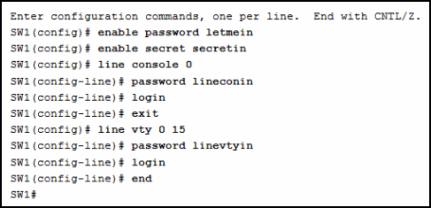

**Choices:**
- **A.** letmein
- **B.** secretin
- **C.** lineconin
- **D.** linevtyin

**Correct Answer:**
lineconin

**Explanation:**
Telnet accesses a network device through the virtual interface configured with the line VTY command. The password configured under this is required to access the user EXEC mode. The password configured under the line console 0 command is required to gain entry through the console port, and the enable and enable secret passwords are used to allow entry into the privileged EXEC mode.

---

## Question 266

**Question:**
How many bits would need to be borrowed if a network admin were given the IP addressing scheme of 172.16.0.0/16 and needed no more than 16 subnet with equal number of hosts?

**Choices:**
- **A.** 10
- **B.** 12
- **C.** 2
- **D.** 4
- **E.** 8

**Correct Answer:**
4

---

## Question 267

**Question:**
Question: It will give 4 options about ping, the correct one is: The PC2 will be able to ping 192.168.1.1

**Images:**
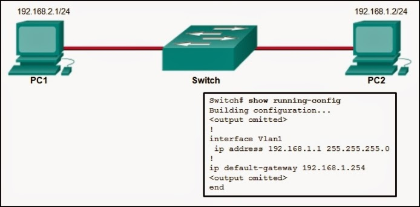

---

## Question 268

**Question:**
Which statement best describes the operation of the File Transfer Protocol?

**Choices:**
- **A.** An FTP client uses a source port number of 21 and a randomly generated destination port number during the establishment of control traffic with an FTP Server.
- **B.** An FTP client uses a source port number of 20 and a randomly generated destination port number during the establishment of data traffic with an FTP Server.
- **C.** An FTP server uses a source port number of 20 and a randomly generated destination port number during the establishment of control traffic with an FTP client.
- **D.** An FTP server uses a source port number of 21 and a randomly generated destination port number during the establishment of control traffic with an FTP client.

**Correct Answer:**
An FTP server uses a source port number of 21 and a randomly generated destination port number during the establishment of control traffic with an FTP client.

**Explanation:**
When using the File Transfer Protocol, an FTP client uses a randomly generated source port number, but targets a destination port number of 20 or 21 on the FTP server. The destination port numbers depend on whether it is the first connection for control traffic on port 21 or the second connection for data traffic on port 20.

---

## Question 269

**Question:**
A client is establishing a TCP session with a server. How is the acknowledgment number in the response segment to the client determined?

**Choices:**
- **A.** The acknowledgment number field is modified by adding 1 to the randomly chosen initial sequence number in response to the client.
- **B.** The acknowledgment number is set to 11 to signify an acknowledgment packet and synchronization packet back to the client.
- **C.** The acknowledgment number field uses a random source port number in response to the client.
- **D.** The acknowledgment number is set to 1 to signify an acknowledgment packet back to the client.

**Correct Answer:**
The acknowledgment number field is modified by adding 1 to the randomly chosen initial sequence number in response to the client.

**Explanation:**
To establish a session with the client, the TCP server will acknowledge the receipt of the SYN segment from the client. The server sends a segment back to the client with the ACK flag set indicating that the acknowledgment number is significant.The value of the acknowledgment number field is equal to the randomly chosen initial sequence number (ISN) plus 1.

---

## Question 270

**Question:**
Why does layer 3 device perform the ANDing process on a destination IP and subnet Mask?

**Choices:**
- **A.** to identify the broadcast address of the destination network
- **B.** to identify the host address of the destination host
- **C.** to identify faulty frames
- **D.** to identify the network address of the destination network

**Correct Answer:**
to identify the network address of the destination network

**Explanation:**
ANDing allows us to identify the network address from the IP address and the network mask.

---

## Question 271

**Question:**
There was also a question about if you activated service password encryption in the past and you prompt “no service password encryption” what password are modified ?

**Choices:**
- **A.** no password at all;
- **B.** password of the lines are in clear;
- **C.** login password;
- **D.** ?

**Correct Answer:**
no password at all;

---

## Question 272

**Question:**
What type of communication rule would best describe CSMA/CD?

**Choices:**
- **A.** message encapsulation
- **B.** flow control
- **C.** message encoding
- **D.** access method

**Correct Answer:**
access method

**Explanation:**
Carrier sense multiple access collision detection (CSMA/CD) is the access method used with Ethernet. The access method rule of communication dictates how a network device is able to place a signal on the carrier. CSMA/CD dictates those rules on an Ethernet network and CSMA/CA dictates those rules on an 802.11 wireless LAN.

---

## Question 273

**Question:**
What is the primary reason to subnet IPv6 prefixes?

**Choices:**
- **A.** to conserve IPv6 addresses
- **B.** to avoid wasting IPv6 addresses
- **C.** to conserve IPv6 prefixes
- **D.** to create a hierarchical Layer 3 network design

**Correct Answer:**
to create a hierarchical Layer 3 network design

---

## Question 274

**Question:**
Which statement describes data throughput?

**Choices:**
- **A.** It is the measure of the bits transferred across the media under perfect conditions.
- **B.** It is the measure of the bits transferred across the media over a given period of time.
- **C.** It indicates the capacity of a particular medium to carry data.
- **D.** It is the guaranteed data transfer rate offered by an ISP.

**Correct Answer:**
It is the measure of the bits transferred across the media over a given period of time.

---

## Question 275

**Question:**
Fill in the blank. Use a number. IPv4 multicast addresses are directly mapped to IEEE 802 (Ethernet) MAC addresses using the last ___ 4 ___ of the 28 available bits in the IPv4 multicast group address.

---

## Question 276

**Question:**
How could a faulty network device create a source of hazard for a user? (Choose two.)

**Choices:**
- **A.** It could stop functioning.
- **B.** It could apply dangerous voltage to other pieces of equipment.
- **C.** It could explode.
- **D.** It could produce an unsafe electromagnetic field.
- **E.** It could apply dangerous voltage to itself.

**Correct Answer:**
It could stop functioning.; It could explode.

---

## Question 277

**Question:**
What are three important considerations when planning the structure of an IP addressing scheme? (Choose three.)

**Choices:**
- **A.** preventing duplication of addresses
- **B.** providing and controlling access
- **C.** documenting the network
- **D.** monitoring security and performance
- **E.** conserving addresses
- **F.** implementing new services

**Correct Answer:**
preventing duplication of addresses; providing and controlling access; conserving addresses

---

## Question 278

**Question:**
What is the metric value that is used to reach the 10.1.1.0 network in the following routing table entry? D 10.1.1.0/24 [90/2170112] via 209.165.200.226, 00:00:05, Serial0/0/0

**Choices:**
- **A.** 24
- **B.** 90
- **C.** 05
- **D.** 2170112

**Correct Answer:**
2170112

---

## Question 279

**Question:**
Which two services or protocols use the preferred UDP protocol for fast transmission and low overhead? (Choose two)

**Choices:**
- **A.** VoIP
- **B.** DNS
- **C.** HTTP
- **D.** FTP
- **E.** POP3

**Correct Answer:**
VoIP; DNS

**Explanation:**
Both DNS and VoIP use UDP to provide low overhead services within a network implementation. New Questions (v6.0):

---

## Question 280

**Question:**
What action does a DHCPv4 client take if it receives more than one DHCPOFFER from multiple DHCP servers?

**Choices:**
- **A.** It sends a DHCPREQUEST that identifies which lease offer the client is accepting.
- **B.** It sends a DHCPNAK and begins the DHCP process over again.
- **C.** It discards both offers and sends a new DHCPDISCOVER.
- **D.** It accepts both DHCPOFFER messages and sends a DHCPACK.

**Correct Answer:**
It sends a DHCPREQUEST that identifies which lease offer the client is accepting.

**Explanation:**
If there are multiple DHCP servers in a network, it is possible for a client to receive more than one DHCPOFFER. In this scenario, the client will only send one DHCPREQUEST, which includes the server from which the client is accepting the offer.

---

## Question 281

**Question:**
To what legacy address class does the address 10.0.0.0 belong?

**Choices:**
- **A.** Class B
- **B.** Class D
- **C.** Class A
- **D.** Class C
- **E.** Class E

**Correct Answer:**
Class A

---

## Question 282

**Question:**
How many IPv4 addresses are available to be assigned to hosts on a network that has a mask of 255.255.255.248?

**Choices:**
- **A.** 16
- **B.** 14
- **C.** 8
- **D.** 254
- **E.** 6
- **F.** 2

**Correct Answer:**
6

---

## Question 283

**Question:**
What type of communication medium is used with a wireless LAN connection?

**Choices:**
- **A.** radio waves
- **B.** fiber
- **C.** microwave
- **D.** UTP

**Correct Answer:**
radio waves

**Explanation:**
A wired LAN connection commonly uses UTP. A wireless LAN connection uses radio waves.

---

## Question 284

**Question:**
Which method of IPv6 prefix assignment relies on the prefix contained in RA messages?

**Choices:**
- **A.** EUI-64
- **B.** static
- **C.** SLAAC
- **D.** stateful DHCPv6

**Correct Answer:**
SLAAC

**Explanation:**
Stateless Address Autoconfiguration (SLAAC) relies on information received in router advertisement (RA) messages in order to automatically create an IPv6 address. The RA messages contain information such as the network prefix and prefix length, which the host combines with an interface ID in order to make a unique IPv6 unicast address.

---

## Question 285

**Question:**
What is a characteristic of DNS?

**Choices:**
- **A.** DNS servers can cache recent queries to reduce DNS query traffic.
- **B.** DNS servers are programmed to drop requests for name translations that are not within their zone.
- **C.** All DNS servers must maintain mappings for the entire DNS structure.
- **D.** DNS relies on a hub-and-spoke topology with centralized servers.

**Correct Answer:**
DNS servers can cache recent queries to reduce DNS query traffic.

**Explanation:**
DNS uses a hierarchy for decentralized servers to perform name resolution. DNS servers only maintain records for their zone and can cache recent queries so that future queries do not produce excessive DNS traffic.

---

## Question 286

**Question:**
What is the prefix for the host address 2001:DB8:BC15:A:12AB::1/64?

**Choices:**
- **A.** 2001:DB8:BC15
- **B.** 2001:DB8:BC15:A
- **C.** 2001:DB8:BC15:A:1
- **D.** 2001:DB8:BC15:A:12

**Correct Answer:**
2001:DB8:BC15:A

**Explanation:**
The network portion, or prefix, of an IPv6 address is identified through the prefix length. A /64 prefix length indicates that the first 64 bits of the IPv6 address is the network portion. Hence the prefix is 2001:DB8:BC15:A.

---

## Question 287

**Question:**
What information is maintained in the CEF adjacency table?

**Choices:**
- **A.** Layer 2 next hops
- **B.** MAC address to IPv4 address mappings
- **C.** IP address to interface mappings
- **D.** the IP addresses of all neighboring routers

**Correct Answer:**
MAC address to IPv4 address mappings

---

## Question 288

**Question:**
Which command can an administrator issue on a Cisco router to send debug messages to the vty lines?

**Choices:**
- **A.** terminal monitor
- **B.** logging console
- **C.** logging buffered
- **D.** logging synchronous

**Correct Answer:**
terminal monitor

**Explanation:**
Debug messages, like other IOS log messages, are sent to the console line by default. Sending these messages to the terminal lines requires the terminal monitor command.

---

## Question 289

**Question:**
What is an example of a top-level domain?

**Choices:**
- **A.** root.cisco.com
- **B.** http://www.cisco.com
- **C.** .com
- **D.** cisco.com

**Correct Answer:**
.com

**Explanation:**
Top-level domains represent a country or type of organization, such as .com or .edu.

---

## Question 290

**Question:**
Which protocol requires the establishment of a session between sender and receiver hosts prior to transmitting data?

**Choices:**
- **A.** UDP
- **B.** TCP
- **C.** IP
- **D.** ICMP

**Correct Answer:**
TCP

---

## Question 291

**Question:**
Which two protocols operate at the top layer of the TCP/IP protocol suite? (Choose two.)

**Choices:**
- **A.** TCP
- **B.** IP
- **C.** UDP
- **D.** POP
- **E.** DNS
- **F.** Ethernet

**Correct Answer:**
POP; DNS

**Explanation:**
The top layer of the TCP/IP protocol suite is the application layer , which provides the primary interface for network-aware software to interact with the underlying network infrastructure. Within this model, both DNS (Domain Name System) and POP (Post Office Protocol) function at this highest level to facilitate specific user-facing services, such as translating human-readable domain names into numeric IP addresses and enabling the retrieval of email from mail servers. While other protocols like TCP and UDP operate at the transport layer to manage end-to-end communication, and IP operates at the internet layer to handle routing, DNS and POP are responsible for defining the content and formatting of requests and responses for their respective applications. Therefore, they belong to the application layer, ensuring that data is presented in a format that both the source and destination hosts can process effectively.

---

## Question 292

**Question:**
What does a client do when it has UDP datagrams to send?

**Choices:**
- **A.** It sends to the server a segment with the SYN flag set to synchronize the conversation.
- **B.** It just sends the datagrams.
- **C.** It queries the server to see if it is ready to receive data.
- **D.** It sends a simplified three-way handshake to the server.

**Correct Answer:**
It just sends the datagrams.

**Explanation:**
When a client has UDP datagrams to send, it just sends the datagrams.

---

## Question 293

**Question:**
What is a characteristic of multicast messages?

**Choices:**
- **A.** They are sent to all hosts on a network.
- **B.** They must be acknowledged.
- **C.** They are sent to a select group of hosts.
- **D.** They are sent to a single destination.

**Correct Answer:**
They are sent to a select group of hosts.

---

## Question 294

**Question:**
Which protocol or service uses UDP for a client-to-server communication and TCP for server-to-server communication?

**Choices:**
- **A.** FTP
- **B.** HTTP
- **C.** DNS
- **D.** SMTP

**Correct Answer:**
DNS

**Explanation:**
Some applications may use both TCP and UDP. DNS uses UDP when clients send requests to a DNS server, and TCP when two DNS serves directly communicate.

---

## Question 295

**Question:**
In what networking model would eDonkey, eMule, BitTorrent, Bitcoin, and LionShare be used?

**Choices:**
- **A.** master-slave
- **B.** client-based
- **C.** peer-to-peer
- **D.** point-to-point

**Correct Answer:**
peer-to-peer

**Explanation:**
In a peer-to-peer networking model, data is exchanged between two network devices without the use of a dedicated server. Peer-to-peer applications such as Shareaz, eDonkey, and Bitcoin allow one network device to assume the role of server, while one or more other network devices assume the role of client using the peer-to-peer application.

---

## Question 296

**Question:**
A network technician is attempting to configure an interface by entering the following command: SanJose(config)# ip address 192.168.2.1 255.255.255.0 . The command is rejected by the device. What is the reason for this?

**Choices:**
- **A.** The interface is shutdown and must be enabled before the switch will accept the IP address.
- **B.** The subnet mask information is incorrect.
- **C.** The command syntax is wrong.
- **D.** The command is being entered from the wrong mode of operation.

**Correct Answer:**
The command is being entered from the wrong mode of operation.

**Explanation:**
The wrong mode of operation is being used. The CLI prompt indicates that the mode of operation is global configuration. IP addresses must be configured from interface configuration mode, as indicated by the SanJose(config-if)# prompt.

---

## Question 297

**Question:**
Refer to the exhibit. A company uses the address block of 128.107.0.0/16 for its network. What subnet mask would provide the maximum number of equal size subnets while providing enough host addresses for each subnet in the exhibit?

**Images:**

**Choices:**
- **A.** 255.255.255.192
- **B.** 255.255.255.0
- **C.** 255.255.255.128
- **D.** 255.255.255.240
- **E.** 255.255.255.224

**Correct Answer:**
255.255.255.128

**Explanation:**
The largest subnet in the topology has 100 hosts in it so the subnet mask must have at least 7 host bits in it (27-2=126). 255.255.255.0 has 8 hosts bits, but this does not meet the requirement of providing the maximum number of subnets.

---
