# CCNA 2 v2 - CCNA 2 - Pretest

## Question 1

**Question:**
Which two components are configured via software in order for a PC to participate in a network environment? (Choose two.)

**Choices:**
- **A.** MAC address
- **B.** IP address*
- **C.** kernel
- **D.** shell
- **E.** subnet mask*

**Correct Answer:**
IP address*; subnet mask*

---

## Question 2

**Question:**
What is the correct order for PDU encapsulation?

**Images:**
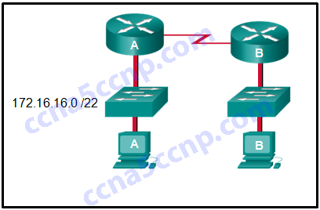
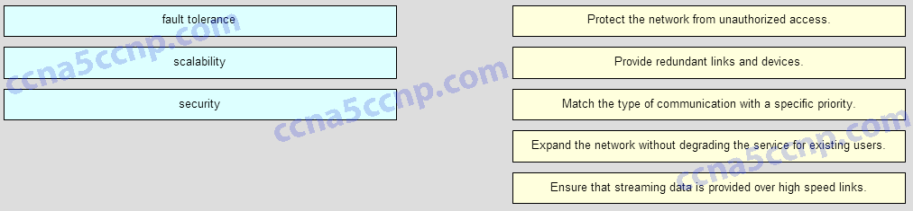

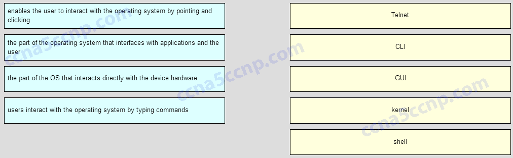

---

## Question 3

**Question:**
Which advantage does the store-and-forward switching method have compared with the cut-through switching method?

**Choices:**
- **A.** frame error checking*
- **B.** faster frame forwarding
- **C.** frame forwarding using IPv4 Layer 3 and 4 information
- **D.** collision detecting

**Correct Answer:**
frame error checking*

**Explanation:**
A switch using the store-and-forward switching method performs an error check on an incoming frame by comparing the FCS value against its own FCS calculations after the entire frame is received. In comparison, a switch using the cut-through switching method makes quick forwarding decisions and starts the forwarding process without waiting for the entire frame to be received. Thus a switch using cut-through switching may send invalid frames to the network. The performance of store-and-forward switching is slower compared to cut-through switching performance. Collision detection is monitored by the sending device. Store-and-forward switching does not use IPv4 Layer 3 and 4 information for its forwarding decisions.

---

## Question 4

**Question:**
To revert to a previous configuration, an administrator issues the command copy tftp startup-config on a router and enters the host address and file name when prompted. After the command is completed, why does the current configuration remain unchanged?

**Choices:**
- **A.** The command should have been copy startup-config tftp.
- **B.** The configuration should have been copied to the running configuration instead.*
- **C.** The configuration changes were copied into RAM and require a reboot to take effect.
- **D.** A TFTP server can only be used to restore the Cisco IOS, not the router configuration.

**Correct Answer:**
The configuration should have been copied to the running configuration instead.*

---

## Question 5

**Question:**
A small car dealership has a scanner that is attached to the PC of the sales manager. When salesmen need to scan a document, they place the document in the scanner and use their own PCs to control the scanner through software on the PC of the manager. After the document is scanned, they can attach it to an email or upload it into the sales software. What type of network model does this scenario describe?

**Choices:**
- **A.** client/server
- **B.** packet-switched
- **C.** peer-to-peer*
- **D.** centralized
- **E.** hierarchical

**Correct Answer:**
peer-to-peer*

---

## Question 6

**Question:**
Which media access method requires that an end device send a notification across the media before sending data?

**Choices:**
- **A.** CSMA/CA​
- **B.** CSMA/CD​
- **C.** deterministic
- **D.** token passing

**Correct Answer:**
CSMA/CA​

**Explanation:**
Using CSMA/CA as the media access control method, a device will examine the network media. If there is no carrier, the device sends a notification and, if no other device uses the media, it begins to send its data. This method differs from CSMA/CD, where a device will send data once it senses that the media is free, without sending a notification.

---

## Question 7

**Question:**
Refer to the exhibit. PC1 is configured to obtain a dynamic IP address from the DHCP server. PC1 has been shut down for two weeks. When PC1 boots and tries to request an available IP address, which destination IP address will PC1 place in the IP header?

**Images:**
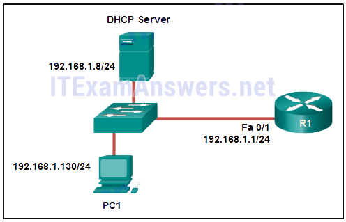

**Choices:**
- **A.** 192.168.1.1
- **B.** 192.168.1.8
- **C.** 192.168.1.255
- **D.** 255.255.255.255*

**Correct Answer:**
255.255.255.255*

**Explanation:**
When a host boots and has been configured for dynamic IP addressing, the device tries to obtain a valid IP address. It sends a DHCPDISCOVER message. This is a broadcast message because the DHCP server address is unknown (by design). The destination IP address in the IP header is 255.255.255.255 and the destination MAC address is FF:FF:FF:FF:FF:FF.

---

## Question 8

**Question:**
Which statement is true about IPv6 addresses?

**Choices:**
- **A.** Global unicast addresses are globally unique and can be routed through the Internet.*
- **B.** Link-local addresses must be unique.
- **C.** A loopback address is represented by ::/128.​
- **D.** Unique local addresses are used to communicate with other devices on the same link.

**Correct Answer:**
Global unicast addresses are globally unique and can be routed through the Internet.*

---

## Question 9

**Question:**
Refer to the exhibit. Which IP addressing scheme should be changed?

**Images:**
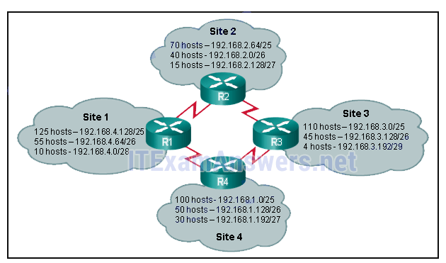

**Choices:**
- **A.** Site 1
- **B.** Site 2*
- **C.** Site 3
- **D.** Site 4

**Correct Answer:**
Site 2*

---

## Question 10

**Question:**
What is the most effective way to mitigate worm and virus attacks?

**Choices:**
- **A.** Secure all Layer 2 devices.
- **B.** Ensure that users change their passwords often.
- **C.** Deploy packet filtering firewalls at the network edge.
- **D.** Install security updates to patch vulnerable systems.*

**Correct Answer:**
Install security updates to patch vulnerable systems.*

---

## Question 11

**Question:**
A particular website does not appear to be responding on a Windows 7 computer. What command could the technician use to show any cached DNS entries for this web page?

**Choices:**
- **A.** ipconfig /all
- **B.** arp -a
- **C.** ipconfig /displaydns*
- **D.** nslookup

**Correct Answer:**
ipconfig /displaydns*

---

## Question 12

**Question:**
Refer to the exhibit. A network administrator is configuring access control to switch SW1. If the administrator uses Telnet to connect to the switch, which password is needed to access user EXEC mode?

**Images:**
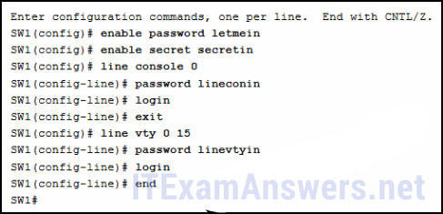

**Choices:**
- **A.** letmein
- **B.** secretin
- **C.** lineconin
- **D.** linevtyin*

**Correct Answer:**
linevtyin*

**Explanation:**
Telnet accesses a network device through the virtual interface configured with the line VTY command. The password configured under this is required to access the user EXEC mode. The password configured under the line console 0 command is required to gain entry through the console port, and the enable and enable secret passwords are used to allow entry into the privileged EXEC mode.

---

## Question 13

**Question:**
In performing a protocol analysis of a network, when should traffic be captured to ensure the most accurate representation of the different traffic types on the network?

**Choices:**
- **A.** during software upgrades
- **B.** during times of moderate network use
- **C.** during hours of peak network use*
- **D.** during weekends and holidays when network use is light

**Correct Answer:**
during hours of peak network use*

---

## Question 14

**Question:**
Refer to the exhibit. A TCP segment from a server has been captured by Wireshark, which is running on a host. What acknowledgement number will the host return for the TCP segment that has been received?

**Images:**
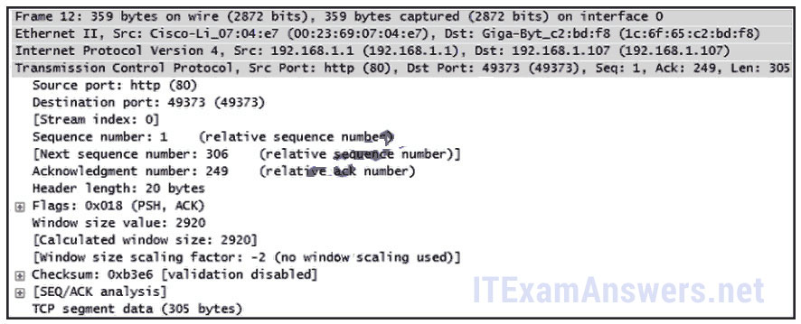

**Choices:**
- **A.** 2
- **B.** 21
- **C.** 250
- **D.** 306*
- **E.** 2921

**Correct Answer:**
306*

---

## Question 15

**Question:**
Refer to the exhibit. What is the link-local IPv6 address of the local computer shown based on the output of the netstat -r command?

**Images:**
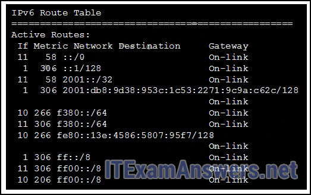

**Choices:**
- **A.** ::1/128
- **B.** 2001::/32
- **C.** 2001:db8:9d38:953c:1c53:2271:9c9a:c62c/128
- **D.** fe80::/64
- **E.** fe80::13e:4586:5807:95f7/128*

**Correct Answer:**
fe80::13e:4586:5807:95f7/128*

---

## Question 16

**Question:**
A network administrator is checking the system logs and notices unusual connectivity tests to multiple well-known ports on a server. What kind of potential network attack could this indicate?

**Choices:**
- **A.** access
- **B.** reconnaissance*
- **C.** denial of service
- **D.** information theft

**Correct Answer:**
reconnaissance*

---

## Question 17

**Question:**
Which technology provides a solution to IPv4 address depletion by allowing multiple devices to share one public IP address?

**Choices:**
- **A.** ARP
- **B.** DNS
- **C.** NAT
- **D.** SMB
- **E.** DHCP
- **F.** HTTP

**Correct Answer:**
NAT

**Explanation:**
Network Address Translation (NAT) is a technology implemented within IPv4 networks. One application of NAT is to use a few public IP addresses to be shared by many internal network hosts which use private IP addresses. NAT removes the need for public addresses for every internal host. It therefore provides a solution to slow down the IPv4 address depletion.

---

## Question 18

**Question:**
What happens when part of an Internet television transmission is not delivered to the destination?

**Choices:**
- **A.** A delivery failure message is sent to the source host.
- **B.** The part of the television transmission that was lost is re-sent.
- **C.** The entire transmission is re-sent.
- **D.** The transmission continues without the missing portion.*

**Correct Answer:**
The transmission continues without the missing portion.*

---

## Question 19

**Question:**
Which three IP addresses are public? (Choose three.)

**Choices:**
- **A.** 10.1.1.1
- **B.** 128.107.0.7 *
- **C.** 192.31.7.10*
- **D.** 172.16.4.4
- **E.** 192.168.5.5
- **F.** 64.104.7.7*

**Correct Answer:**
128.107.0.7 *; 192.31.7.10*; 64.104.7.7*

---

## Question 20

**Question:**
A host is accessing an FTP server on a remote network. Which three functions are performed by intermediary network devices during this conversation? (Choose three.)

**Choices:**
- **A.** regenerating data signals*
- **B.** acting as a client or a server
- **C.** providing a channel over which messages travel
- **D.** applying security settings to control the flow of data *
- **E.** notifying other devices when errors occur*
- **F.** serving as the source or destination of the messages

**Correct Answer:**
regenerating data signals*; applying security settings to control the flow of data *; notifying other devices when errors occur*

---

## Question 21

**Question:**
Which IP address is a valid network address?

**Choices:**
- **A.** 172.16.4.32/27*
- **B.** 172.16.4.79/28
- **C.** 172.16.4.255/22
- **D.** 172.16.5.255/23

**Correct Answer:**
172.16.4.32/27*

---

## Question 22

**Question:**
What is the range of host IP addresses for the subnet 172.16.1.32/28?

**Choices:**
- **A.** 172.16.1.33 – 172.16.1.38
- **B.** 172.16.1.33 – 172.16.1.46*
- **C.** 172.16.1.33 – 172.16.1.62
- **D.** 172.16.1.32 – 172.16.1.39
- **E.** 172.16.1.32 – 172.16.1.47

**Correct Answer:**
172.16.1.33 – 172.16.1.46*

---

## Question 23

**Question:**
An organization has received the IPv6 network prefix of 2001:db8:1234::/52 from their ISP. How many subnets can be created from this prefix without borrowing bits from the interface ID?

**Choices:**
- **A.** 1024
- **B.** 4096 *
- **C.** 8192
- **D.** 65536

**Correct Answer:**
4096 *

---

## Question 24

**Question:**
Match the application protocols to the correct transport protocols.

**Images:**
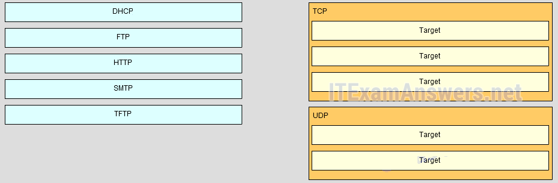
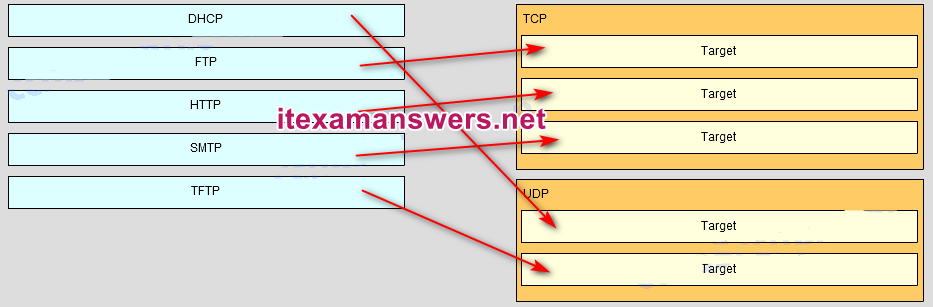

**Choices:**
- **A.** Question
- **B.** Answer

---

## Question 25

**Question:**
Which type of static route is configured with a greater administrative distance to provide a backup route to a route learned from a dynamic routing protocol?

**Choices:**
- **A.** Standard static route
- **B.** Summary static route
- **C.** Floating static route*
- **D.** Default static route

**Correct Answer:**
Floating static route*

**Explanation:**
There are four basic types of static routes. Floating static routes are backup routes that are placed into the routing table if a primary route is lost. A summary static route aggregates several routes into one, reducing the of the routing table. Standard static routes are manually entered routes into the routing table. Default static routes create a gateway of last resort.

---

## Question 26

**Question:**
Which information does a switch use to populate the MAC address table?

**Choices:**
- **A.** The source and destination MAC addresses and the incoming port
- **B.** The source MAC address and the outgoing port
- **C.** The destination MAC address and the outgoing port
- **D.** The destination MAC address and the incoming port
- **E.** The source and destination MAC addresses and the outgoing port
- **F.** The source MAC address and the incoming port*

**Correct Answer:**
The source MAC address and the incoming port*

**Explanation:**
To maintain the MAC address table, the switch uses the source MAC address of the incoming packets and the port that the packets enter. The destination address is used to select the outgoing port.

---

## Question 27

**Question:**
What is the reason why the DHCPREQUEST message is sent as a broadcast during the DHCPv4 process?

**Choices:**
- **A.** For hosts on other subnets to receive the information
- **B.** For routers to fill their routing tables with this new information
- **C.** To notify other DHCP servers on the subnet that the IP address was leased*
- **D.** To notify other hosts not to request the same IP address

**Correct Answer:**
To notify other DHCP servers on the subnet that the IP address was leased*

---

## Question 28

**Question:**
Which type of traffic would most likely have problems when passing through a NAT device?

**Choices:**
- **A.** Telnet
- **B.** IPsec*
- **C.** HTTP
- **D.** ICMP
- **E.** DNS

**Correct Answer:**
IPsec*

---

## Question 29

**Question:**
Refer to the exhibit. An administrator is examining the message in a syslog server. What can be determined from the message?

**Images:**
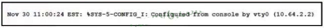

**Choices:**
- **A.** This is an error message that indicates the system in unusable
- **B.** This is an error message for which warning conditions exist
- **C.** This is an alert message for which immediate action is needed
- **D.** This is a notification message for a normal but significant condition*

**Correct Answer:**
This is a notification message for a normal but significant condition*

**Explanation:**
The number 5 in the message output %SYS-5-CONFIG_I, indicated this is a notification level message that is for normal but significant conditions.

---

## Question 30

**Question:**
Conpared with dynamic routes, what are two advantages of using static routes on a router? (Choose two.)

**Choices:**
- **A.** They take less time to converge when the network topology changes
- **B.** They improve network security*
- **C.** They improve the efficiency of discovering neighbouring networks
- **D.** They automatically switch the path to the destination network when the topology changes
- **E.** They use fewer router resources*

**Correct Answer:**
They improve network security*; They use fewer router resources*

---

## Question 31

**Question:**
Open the PT Activity. Perform the tasks in the activity instructions and then answer the question.What is the secret keyword that is displayed on the web page?

**Choices:**
- **A.** router
- **B.** switch
- **C.** frame
- **D.** packet*
- **E.** cisco

**Correct Answer:**
packet*

---

## Question 32

**Question:**
Open the PT Activity. Perform the tasks in the activity instructions and then answer the question. Which IPv6 address is assigned to the Serial0/0/0 interface on RT2?

**Images:**
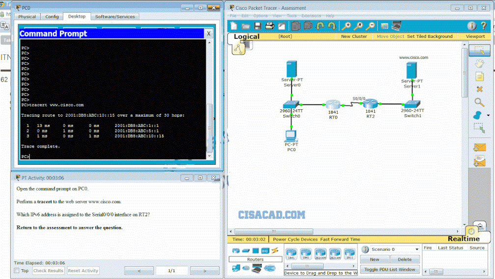

**Choices:**
- **A.** 2001:db8:abc:1::1
- **B.** 2001:db8:abc:5::1*
- **C.** 2001:db8:abc:5::2
- **D.** 2001:db8:abc:10::15

**Correct Answer:**
2001:db8:abc:5::1*

---

## Question 33

**Question:**
What is the purpose of a routing protocol?

**Choices:**
- **A.** It is used to build and maintain ARP tables.
- **B.** It provides a method for segmenting and reassembling data packets.
- **C.** It allows an administrator to devise an addressing scheme for the network.
- **D.** It allows a router to share information about known networks with other routers.*
- **E.** It provides a procedure for encoding and decoding data into bits for packet forwarding.

**Correct Answer:**
It allows a router to share information about known networks with other routers.*

---

## Question 34

**Question:**
ACLs are used primarily to filter traffic. What are two additional uses of ACLs? (Choose two.)

**Choices:**
- **A.** specifying source addresses for authentication
- **B.** specifying internal hosts for NAT *
- **C.** identifying traffic for QoS*
- **D.** reorganizing traffic into VLANs
- **E.** filtering VTP packets

**Correct Answer:**
specifying internal hosts for NAT *; identifying traffic for QoS*

**Explanation:**
ACLs are used to filter traffic to determine which packets will be permitted or denied through the router and which packets will be subject to policy-based routing. ACLs can also be used to identify traffic that requires NAT and QoS services. Prefix lists are used to control which routes will be redistributed or advertised to other routers.

---

## Question 35

**Question:**
What are two functions of a router? (Choose two.)

**Choices:**
- **A.** It connects multiple IP networks.*
- **B.** It controls the flow of data via the use of Layer 2 addresses.
- **C.** It determines the best path to send packets.*
- **D.** It manages the VLAN database.
- **E.** It increases the size of the broadcast domain.

**Correct Answer:**
It connects multiple IP networks.*; It determines the best path to send packets.*

---

## Question 36

**Question:**
Employees of a company connect their wireless laptop computers to the enterprise LAN via wireless access points that are cabled to the Ethernet ports of switches. At which layer of the three-layer hierarchical network design model do these switches operate?

**Choices:**
- **A.** core
- **B.** physical
- **C.** access*
- **D.** distribution
- **E.** data link

**Correct Answer:**
access*

---

## Question 37

**Question:**
Which statement describes a route that has been learned dynamically?

**Choices:**
- **A.** It is automatically updated and maintained by routing protocols.*
- **B.** It is unaffected by changes in the topology of the network.
- **C.** It has an administrative distance of 1.
- **D.** It is identified by the prefix C in the routing table.

**Correct Answer:**
It is automatically updated and maintained by routing protocols.*

**Explanation:**
Dynamically learned routes are constantly updated and maintained by routing protocols.

---

## Question 38

**Question:**
Refer to the exhibit. What will the router do with a packet that has a destination IP address of 192.168.12.227?

**Images:**
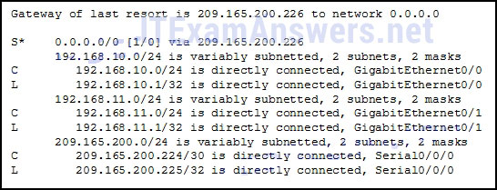

**Choices:**
- **A.** Drop the packet.
- **B.** Send the packet out the Serial0/0/0 interface.*
- **C.** Send the packet out the GigabitEthernet0/0 interface.
- **D.** Send the packet out the GigabitEthernet0/1 interface.

**Correct Answer:**
Send the packet out the Serial0/0/0 interface.*

---

## Question 39

**Question:**
A network administrator is configuring a new Cisco switch for remote management access. Which three items must be configured on the switch for the task? (Choose three.)

**Choices:**
- **A.** loopback address
- **B.** default gateway*
- **C.** IP address*
- **D.** vty lines*
- **E.** VTP domain
- **F.** default VLAN

**Correct Answer:**
default gateway*; IP address*; vty lines*

**Explanation:**
To enable the remote management access, the Cisco switch must be configured with an IP address and a default gateway. In addition, vty lines must configured to enable either Telnet or SSH connections. A loopback address, default VLAN, and VTP domain configurations are not necessary for the purpose of remote switch management.

---

## Question 40

**Question:**
Which type of traffic is designed for a native VLAN?

**Choices:**
- **A.** untagged*
- **B.** management
- **C.** user-generated
- **D.** tagged

**Correct Answer:**
untagged*

**Explanation:**
A native VLAN carries untagged traffic, which is traffic that does not come from a VLAN. A data VLAN carries user-generated traffic. A management VLAN carries management traffic.

---

## Question 41

**Question:**
Compared with dynamic routes, what are two advantages of using static routes on a router? (Choose two.)

**Choices:**
- **A.** They use fewer router resources.*
- **B.** They improve the efficiency of discovering neighboring networks.
- **C.** They take less time to converge when the network topology changes.
- **D.** They improve netw​ork security.*
- **E.** They automatically switch the path to the destination network when the topology changes.

**Correct Answer:**
They use fewer router resources.*; They improve netw​ork security.*

**Explanation:**
Static routes are manually configured on a router. Static routes are not automatically updated and must be manually reconfigured if the network topology changes. Thus static routing improves network security because it does not make route updates among neighboring routers. Static routes also improve resource efficiency by using less bandwidth, and no CPU cycles are used to calculate and communicate routes.

---

## Question 42

**Question:**
Which three advantages are provided by static routing? (Choose three.)

**Choices:**
- **A.** Static routing does not advertise over the network, thus providing better security.*
- **B.** Configuration of static routes is error-free.
- **C.** Static routes scale well as the network grows.
- **D.** Static routing typically uses less network bandwidth and fewer CPU operations than dynamic routing does.*
- **E.** The path a static route uses to send data is known. *
- **F.** No intervention is required to maintain changing route information.

**Correct Answer:**
Static routing does not advertise over the network, thus providing better security.*; Static routing typically uses less network bandwidth and fewer CPU operations than dynamic routing does.*; The path a static route uses to send data is known. *

**Explanation:**
Static routes are prone to errors from incorrect configuration by the administrator. They do not scale well, because the routes must be manually reconfigured to accommodate a growing network. Intervention is required each time a route change is necessary. They do provide better security, use less bandwidth, and provide a known path to the destination.

---

## Question 43

**Question:**
What is the most likely scenario in which the WAN interface of a router would be configured as a DHCP client to be assigned a dynamic IP address from an ISP?

**Choices:**
- **A.** There is a web server for public access on the LAN that is attached to the router.
- **B.** The router is also the gateway for a LAN.
- **C.** It is a SOHO or home broadband router.*
- **D.** The router is configured as a DHCP server.

**Correct Answer:**
It is a SOHO or home broadband router.*

**Explanation:**
SOHO and home broadband routers are typically set to acquire an IPv4 address automatically from the ISP. The IP address that is assigned is typically a dynamic address to reduce the cost, but a static IP address is possible with more cost. However, if the router is assigned a dynamic IP address, DNS issues will result in the web server behind the router not being easily accessible to the public. Routers are typically also gateways for LANs, but this has no bearing on whether the router is configured as a DHCP client on its WAN link or not. Likewise, a router can be configured to be a DHCP client in order to obtain an IP address from the ISP, but at the same time, it can be configured as a DHCP server to serve the IP addressing for the devices on its LAN.

---

## Question 44

**Question:**
What are two characteristics of link-state protocols compared to distance vector protocols? (Choose two.)

**Choices:**
- **A.** They require a lot of hardware resources.*
- **B.** They know of the network topology from the perspective of their neighbors.
- **C.** They compute their own knowledge of the network topology.*
- **D.** They use hop counts to compute the network topology.
- **E.** They flood the routing table to all hosts periodically.

**Correct Answer:**
They require a lot of hardware resources.*; They compute their own knowledge of the network topology.*

---

## Question 45

**Question:**
Which two factors are important when deciding which interior gateway routing protocol to use? (Choose two.)

**Choices:**
- **A.** scalability*
- **B.** ISP selection
- **C.** speed of convergence*
- **D.** the autonomous system that is used
- **E.** campus backbone architecture

**Correct Answer:**
scalability*; speed of convergence*

---

## Question 46

**Question:**
Refer to the exhibit. How many broadcast and collision domains exist in the topology?

**Images:**
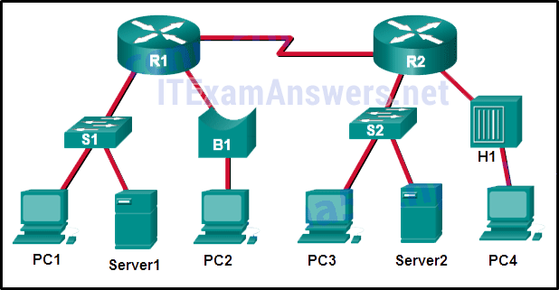

**Choices:**
- **A.** 10 broadcast domains and 5 collision domains
- **B.** 5 broadcast domains and 10 collision domains*
- **C.** 5 broadcast domains and 11 collision domains
- **D.** 16 broadcast domains and 11 collision domains

**Correct Answer:**
5 broadcast domains and 10 collision domains*

---

## Question 47

**Question:**
A network contains multiple VLANs spanning multiple switches. What happens when a device in VLAN 20 sends a broadcast Ethernet frame?

**Choices:**
- **A.** All devices in all VLANs see the frame.
- **B.** Devices in VLAN 20 and the management VLAN see the frame.
- **C.** Only devices in VLAN 20 see the frame.*
- **D.** Only devices that are connected to the local switch see the frame.

**Correct Answer:**
Only devices in VLAN 20 see the frame.*

**Explanation:**
VLANs create logical broadcast domains that can span multiple VLAN segments. Ethernet frames that are sent by a device on a specific VLAN can only be seen by other devices in the same VLAN.

---

## Question 48

**Question:**
What does the cost of an OSPF link indicate?

**Choices:**
- **A.** A higher cost for an OSPF link indicates a faster path to the destination.
- **B.** Link cost indicates a proportion of the accumulated value of the route to the destination.
- **C.** Cost equals bandwidth.
- **D.** A lower cost indicates a better path to the destination than a higher cost does.*

**Correct Answer:**
A lower cost indicates a better path to the destination than a higher cost does.*

---

## Question 49

**Question:**
A small-sized company has 30 workstations and 2 servers. The company has been assigned a group of IPv4 addresses 209.165.200.224/29 from its ISP. The two servers must be assigned public IP addresses so they are reachable from the outside world. What technology should the company implement in order to allow all workstations to access services over the Internet simultaneously?

**Choices:**
- **A.** DHCP
- **B.** static NAT
- **C.** dynamic NAT
- **D.** port address translation*

**Correct Answer:**
port address translation*

**Explanation:**
The company allocated only 6 usable host public addresses. Two public addresses should be assigned to the two servers. Since the four remaining public addresses are not enough for the 30 clients, NAT must be implemented for internal workstations to access the Internet. Therefore, the company should use PAT, also known as NAT with overload. DHCP can be used to dynamically assign internal private IP addresses to the workstations, but cannot provide the NAT service required.

---

## Question 50

**Question:**
Which information does a switch use to keep the MAC address table information current?

**Choices:**
- **A.** the destination MAC address and the incoming port
- **B.** the destination MAC address and the outgoing port
- **C.** the source and destination MAC addresses and the incoming port
- **D.** the source and destination MAC addresses and the outgoing port
- **E.** the source MAC address and the incoming port*
- **F.** the source MAC address and the outgoing port

**Correct Answer:**
the source MAC address and the incoming port*

---

## Question 51

**Question:**
Open the PT Activity. Perform the tasks in the activity instructions and then answer the question. Fill in the blank. Do not use abbreviations.What is the missing command on S1? ip address 192.168.99.2 255.255.255.0* Download PDF File below: ITexamanswers.net – CCNA 2 (v5.1 + v6.0) Pretest Exam Answers Full.pdf 1.14 MB 17333 downloads

---
