# CCNA 2 v2 - CCNA 2 - Chapter 1

## Question 1

**Question:**
A network administrator enters the command copy running-config startup-config. Which type of memory will the startup configuration be placed into?

**Choices:**
- **A.** flash
- **B.** RAM
- **C.** NVRAM
- **D.** ROM

**Correct Answer:**
NVRAM

**Explanation:**
A router contains four types of memory: RAM – volatile memory used to store the running IOS, running configuration file, routing table, ARP table, as well as serve as a packet buffer ROM – nonvolatile memory used to hold a limited version of the IOS, bootup instructions, and basic diagnostic software NVRAM – nonvolatile memory used to hold the startup configuration file Flash – nonvolatile memory used to hold the IOS and other system files

---

## Question 2

**Question:**
Which packet-forwarding method does a router use to make switching decisions when it is using a forwarding information base and an adjacency table?

**Choices:**
- **A.** fast switching
- **B.** Cisco Express Forwarding
- **C.** process switching
- **D.** flow process

**Correct Answer:**
Cisco Express Forwarding

**Explanation:**
Cisco Express Forwarding (CEF) is the fastest and preferred switching method. It uses a FIB and an adjacency table to perform the task of packet switching. These data structures change with the topology.

---

## Question 3

**Question:**
Fill in the blank. When a router receives a packet, it examines the destination address of the packet and looks in the ———- table to determine the best path to use to forward the packet. Correct Answer: Routing

---

## Question 4

**Question:**
What are two functions of a router? (Choose two.)

**Choices:**
- **A.** A router connects multiple IP networks
- **B.** It controls the flow of data via the use of Layer 2 addresses
- **C.** It determines the best path to send packets
- **D.** It provides segmentation at Layer 2
- **E.** It builds a routing table based on ARP requests

**Correct Answer:**
A router connects multiple IP networks; It determines the best path to send packets

**Explanation:**
Routers connect multiple networks, determine the best path to send packets, and forward packets based on a destination IP address.

---

## Question 5

**Question:**
In order for packets to be sent to a remote destination, what three pieces of information must be configured on a host? (Choose three.)

**Choices:**
- **A.** hostname
- **B.** IP address
- **C.** subnet mask
- **D.** default gateway
- **E.** DNS server address
- **F.** DHCP server address

**Correct Answer:**
IP address; subnet mask; default gateway

**Explanation:**
A host can use its IP address and subnet mask to determine if a destination is on the same network or on a remote network. If it is on a remote network, the host will need a configured default gateway in order to send packets to the remote destination. DNS servers translate names into IP addresses, and DHCP servers are used to automatically assign IP addressing information to hosts. Neither of these servers has to be configured for basic remote connectivity.

---

## Question 6

**Question:**
Which software is used for a network administrator to make the initial router configuration securely?

**Choices:**
- **A.** SSH client software
- **B.** Telnet client software
- **C.** HTTPS client software
- **D.** terminal emulation client software

**Correct Answer:**
terminal emulation client software

**Explanation:**
Connecting to the router console port is required for making the initial router configuration. A console cable and terminal emulation software are needed to connect to the console port. SSH, Telnet, and HTTPS could be used to configure a router if the router has been configured with IP addresses and its interface can be reached through the network.

---

## Question 7

**Question:**
The exhibit consists of a network diagram that shows R1 with three network connections: two Ethernet segments and a WAN link. The WAN link connects R1 to a second router R2. R2 is the DCE on the WAN link. The configuration shown is as follows: Refer to the exhibit. A network administrator has configured R1 as shown. When the administrator checks the status of the serial interface, the interface is shown as being administratively down. What additional command must be entered on the serial interface of R1 to bring the interface up?

**Images:**
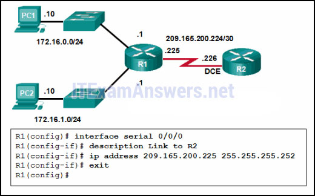

**Choices:**
- **A.** IPv6 enable
- **B.** clockrate 128000
- **C.** end
- **D.** no shutdown

**Correct Answer:**
no shutdown

**Explanation:**
By default all router interfaces are shut down. To bring the interfaces up, an administrator must issue the no shutdown command in interface mode.

---

## Question 8

**Question:**
What is a characteristic of an IPv4 loopback interface on a Cisco IOS router?​

**Choices:**
- **A.** The no shutdown command is required to place this interface in an UP state
- **B.** It is a logical interface internal to the router
- **C.** Only one loopback interface can be enabled on a router
- **D.** It is assigned to a physical port and can be connected to other devices

**Correct Answer:**
It is a logical interface internal to the router

**Explanation:**
The loopback interface is a logical interface internal to the router and is automatically placed in an UP state, as long as the router is functioning. It is not assigned to a physical port and can therefore never be connected to any other device. Multiple loopback interfaces can be enabled on a router.

---

## Question 9

**Question:**
What two pieces of information are displayed in the output of the show ip interface brief command? (Choose two.)

**Choices:**
- **A.** IP addresses
- **B.** MAC addresses
- **C.** Layer 1 statuses
- **D.** next-hop addresses
- **E.** interface descriptions
- **F.** speed and duplex settings

**Correct Answer:**
IP addresses; Layer 1 statuses

**Explanation:**
The command show ip interface brief shows the IP address of each interface, as well as the operational status of the interfaces at both Layer 1 and Layer 2. In order to see interface descriptions and speed and duplex settings, use the command show running-config interface. Next-hop addresses are displayed in the routing table with the command show ip route, and the MAC address of an interface can be seen with the command show interfaces.

---

## Question 10

**Question:**
When a router receives a packet, what information must be examined in order for the packet to be forwarded to a remote destination?

**Choices:**
- **A.** destination MAC address
- **B.** destination IP address
- **C.** source IP address
- **D.** source MAC address

**Correct Answer:**
destination IP address

**Explanation:**
When a router receives a packet, it examines the destination address of the packet and uses the routing table to search for the best path to that network.

---

## Question 11

**Question:**
Which two items are used by a host device when performing an ANDing operation to determine if a destination address is on the same local network? (Choose two.)

**Choices:**
- **A.** destination IP address
- **B.** destination MAC address
- **C.** source MAC address
- **D.** subnet mask
- **E.** network number

**Correct Answer:**
destination IP address; subnet mask

**Explanation:**
The result of ANDing any IP address with a subnet mask is a network number. If the source network number is the same as the destination network number, the data stays on the local network. If the destination network number is different, the packet is sent to the default gateway (the router that will send the packet onward toward the destination network).

---

## Question 12

**Question:**
PC A is connected to switch S1, which in turn is connected to router R1. Router R1 is connected to a cloud, and the cloud is connected to Server B. At one side of the PC is a label with the following information: PC A MAC address: 00-0B-85-7F-47-00 IPv4 address: 192.168.10.10At one side of the switch is a label with the following information: S1 MAC address: 00-0B-85-D0-BB-F7 IPv4 address: 192.168.11.1At one side of the router is a label with the following information: R1 MAC address: 00-0B-85-7F-86-B0 IPv4 address: 192.168.10.1At one side of the server is a label with the following information: SERVER B MAC address: 00-0B-85-7F-0A-0B IPv4 address: 192.168.12.16 Refer to the exhibit. PC A sends a request to Server B. What IPv4 address is used in the destination field in the packet as the packet leaves PC A?

**Images:**
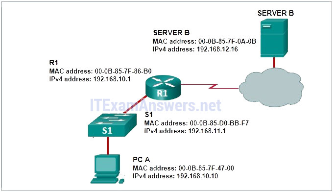

**Choices:**
- **A.** 192.168.10.10
- **B.** 192.168.11.1
- **C.** 192.168.10.1
- **D.** 192.168.12.16

**Correct Answer:**
192.168.12.16

**Explanation:**
The destination IP address in packets does not change along the path between the source and destination.

---

## Question 13

**Question:**
Server B is connected to switch S1, which in turn is connected to router R1. Router R1 is connected to a cloud, and the cloud is connected to PC A. At one side of the server is a label with the following information: SERVER B MAC address: 00-0B-85-7F-0A-0B IPv4 address: 192.168.10.16At one side of the switch is a label with the following information: S1 MAC address: 00-0B-85-D0-BB-F7 IPv4 address: 192.168.11.1At one side of the router is a label with the following information: R1 MAC address: 00-0B-85-7F-86-B0 IPv4 address: 192.168.10.1At one side of the PC is a label with the following information: PC A MAC address: 00-0B-85-7F-47-00 IPv4 address: 192.168.12.10 Refer to the exhibit. What does R1 use as the MAC address of the destination when constructing the frame that will go from R1 to Server B?

**Images:**
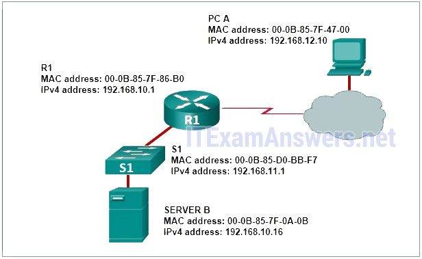

**Choices:**
- **A.** If the destination MAC address that corresponds to the IPv4 address is not in the ARP cache, R1 sends an ARP request
- **B.** The packet is encapsulated into a PPP frame, and R1 adds the PPP destination address to the frame
- **C.** R1 uses the destination MAC address of S1
- **D.** R1 leaves the field blank and forwards the data to the PC

**Correct Answer:**
If the destination MAC address that corresponds to the IPv4 address is not in the ARP cache, R1 sends an ARP request

**Explanation:**
Communication inside a local network uses Address Resolution Protocol to obtain a MAC address from a known IPv4 address. A MAC address is needed to construct the frame in which the packet is encapsulated.

---

## Question 14

**Question:**
Refer to the exhibit. If PC1 is sending a packet to PC2 and routing has been configured between the two routers, what will R1 do with the Ethernet frame header attached by PC1?

**Images:**
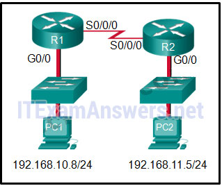

**Choices:**
- **A.** nothing, because the router has a route to the destination network
- **B.** remove the Ethernet header and configure a new Layer 2 header before sending it out S0/0/0
- **C.** open the header and replace the destination MAC address with a new one
- **D.** open the header and use it to determine whether the data is to be sent out S0/0/0

**Correct Answer:**
remove the Ethernet header and configure a new Layer 2 header before sending it out S0/0/0

**Explanation:**
When PC1 forms the various headers attached to the data one of those headers is the Layer 2 header. Because PC1 connects to an Ethernet network, an Ethernet header is used. The source MAC address will be the MAC address of PC1 and the destination MAC address will be that of G0/0 on R1. When R1 gets that information, the router removes the Layer 2 header and creates a new one for the type of network the data will be placed onto (the serial link).

---

## Question 15

**Question:**
The exhibit shows the following router output: The gateway of last resort is 209.165.200.226 to network 0.0.0.0 S* 0.0.0.0/0 [1/0] via 209.165.200.226 192.168.10.0/24 is variably subnetted, 2 subnets, 2 masks C 192.168.10.0/24 is directly connected, GigabitEthernet0/0 L 192.168.10.1/32 is directly connected, GigabitEthernet0/0 192.168.11.0/24 is variably subnetted, 2 subnets, 2 masks C 192.168.11.0/24 is directly connected, GigabitEthernet0/1 L 192.168.11.1/32 is directly connected, GigabitEthernet0/1 209.165.200.0/24 is variably subnetted, 2 subnets, 2 masks C 209.165.200.224/30 is directly connected, Serial0/0/0 L 209.165.200.225/32 is directly connected, Serial0/0/0 Refer to the exhibit. What will the router do with a packet that has a destination IP address of 192.168.12.227?

**Images:**
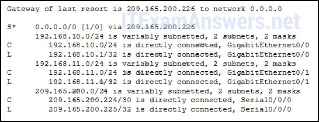

**Choices:**
- **A.** Drop the packet
- **B.** Send the packet out the Serial0/0/0 interface
- **C.** Send the packet out the GigabitEthernet0/0 interface
- **D.** Send the packet out the GigabitEthernet0/1 interface

**Correct Answer:**
Send the packet out the Serial0/0/0 interface

**Explanation:**
After a router determines the destination network by ANDing the destination IP address with the subnet mask, the router examines the routing table for the resulting destination network number. When a match is found, the packet is sent to the interface associated with the network number. When no routing table entry is found for the particular network, the default gateway or gateway of last resort (if configured or known) is used. If there is no gateway of last resort, the packet is dropped. In this instance, the 192.168.12.224 network is not found in the routing table and the router uses the gateway of last resort. The gateway of last resort is the IP address of 209.165.200.226. The router knows this is an IP address that is associated with the 209.165.200.224 network. The router then proceeds to transmit the packet out the Serial0/0/0 interface, or the interface that is associated with 209.165.200.224.

---

## Question 16

**Question:**
Which two statements correctly describe the concepts of administrative distance and metric? (Choose two.)

**Choices:**
- **A.** Administrative distance refers to the trustworthiness of a particular route
- **B.** A router first installs routes with higher administrative distances
- **C.** The value of the administrative distance can not be altered by the network administrator
- **D.** Routes with the smallest metric to a destination indicate the best path
- **E.** The metric is always determined based on hop count
- **F.** The metric varies depending which Layer 3 protocol is being routed

**Correct Answer:**
Administrative distance refers to the trustworthiness of a particular route; Routes with the smallest metric to a destination indicate the best path

---

## Question 17

**Question:**
Which two parameters are used by EIGRP as metrics to select the best path to reach a network? (Choose two.)​

**Choices:**
- **A.** hop count
- **B.** bandwidth
- **C.** jitter
- **D.** resiliency
- **E.** delay
- **F.** confidentiality

**Correct Answer:**
bandwidth; delay

**Explanation:**
EIGRP uses bandwidth, delay, load, and reliability as metrics for selecting the best path to reach a network.​

---

## Question 18

**Question:**
What route would have the lowest administrative distance?

**Choices:**
- **A.** a directly connected network
- **B.** a static route
- **C.** a route received through the EIGRP routing protocol
- **D.** a route received through the OSPF routing protocol

**Correct Answer:**
a directly connected network

**Explanation:**
The most believable route or the route with the lowest administrative distance is one that is directly connected to a router.

---

## Question 19

**Question:**
Which two statements correctly describe the concepts of administrative distance and metric? (Choose two.)

**Choices:**
- **A.** Administrative distance refers to the trustworthiness of a particular route
- **B.** A router first installs routes with higher administrative distances
- **C.** The value of the administrative distance cannot be altered by the network administrator
- **D.** Routes with the smallest metric to a destination indicate the best path
- **E.** The metric is always determined based on hop count
- **F.** The metric varies depending on which Layer 3 protocol is being routed

**Correct Answer:**
Administrative distance refers to the trustworthiness of a particular route; Routes with the smallest metric to a destination indicate the best path

**Explanation:**
A metric is calculated by a routing protocol and is used to determine the best path (smallest metric value) to a remote network. Administrative distance (AD) is used when a router has two or more routes to a remote destination that were learned from different sources. The source with the lowest AD is installed in the routing table.

---

## Question 20

**Question:**
Consider the following routing table entry for R1: D 10.1.1.0/24 [90/2170112] via 209.165.200.226, 00:00:05, Serial0/0/0 What is the significance of the Serial0/0/0?

**Choices:**
- **A.** It is the interface on R1 used to send data that is destined for 10.1.1.0/24
- **B.** It is the R1 interface through which the EIGRP update was learned.
- **C.** It is the interface on the final destination router that is directly connected to the 10.1.1.0/24 network.
- **D.** It is the interface on the next-hop router when the destination IP address is on the 10.1.1.0/24 network.

**Correct Answer:**
It is the interface on R1 used to send data that is destined for 10.1.1.0/24

**Explanation:**
The Serial0/0/0 indicates the outgoing interface on R1 that is used to send packets for the 10.1.1.0/24 destination network.

---

## Question 21

**Question:**
The exhibit contains CLI output that says: Refer to the exhibit. A network administrator issues the show ipv6 route command on R1. What two conclusions can be drawn from the routing table? (Choose two.)

**Images:**
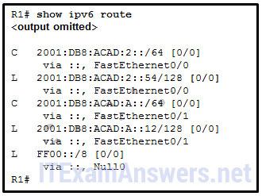

**Choices:**
- **A.** R1 does not know a route to any remote networks
- **B.** The network FF00::/8 is installed through a static route command
- **C.** The interface Fa0/1 is configured with IPv6 address 2001:DB8:ACAD:A::12
- **D.** Packets that are destined for the network 2001:DB8:ACAD:2::/64 will be forwarded through Fa0/1
- **E.** Packets that are destined for the network 2001:DB8:ACAD:2::54/128 will be forwarded through Fa0/0

**Correct Answer:**
R1 does not know a route to any remote networks; The interface Fa0/1 is configured with IPv6 address 2001:DB8:ACAD:A::12

**Explanation:**
From the routing table, R1 knows two directly connected networks and the multicast network (FF00::/8). It does not know any routes to remote networks. The entry 2001:DB8:ACAD:A::12/128 is the local host interface route.

---

## Question 22

**Question:**
A network administrator configures the interface fa0/0 on the router R1 with the command ip address 172.16.1.254 255.255.255.0. However, when the administrator issues the command show ip route, the routing table does not show the directly connected network. What is the possible cause of the problem?

**Choices:**
- **A.** The interface fa0/0 has not been activated
- **B.** The configuration needs to be saved first.
- **C.** No packets with a destination network of 172.16.1.0 have been sent to R1.
- **D.** The subnet mask is incorrect for the IPv4 address.

**Correct Answer:**
The interface fa0/0 has not been activated

**Explanation:**
A directly connected network will be added to the routing table when these three conditions are met: (1) the interface is configured with a valid IP address; (2) it is activated with no shutdown command; and (3) it receives a carrier signal from another device that is connected to the interface. An incorrect subnet mask for an IPv4 address will not prevent its appearance in the routing table, although the error may prevent successful communications.

---

## Question 23

**Question:**
A network administrator configures a router by the command ip route 0.0.0.0 0.0.0.0 209.165.200.226. What is the purpose of this command?

**Choices:**
- **A.** to forward all packets to the device with IP address 209.165.200.226
- **B.** to add a dynamic route for the destination network 0.0.0.0 to the routing table
- **C.** to forward packets destined for the network 0.0.0.0 to the device with IP address 209.165.200.226
- **D.** to provide a route to forward packets for which there is no route in the routing table

**Correct Answer:**
to provide a route to forward packets for which there is no route in the routing table

**Explanation:**
The command ip route 0.0.0.0 0.0.0.0 adds a default route to the routing table of a router. When the router receives a packet and does not have a specific route toward the destination, it forwards the packet to the next hop indicated in the default route. A route created with the ip route command is a static route, not a dynamic route.

---

## Question 24

**Question:**
What are two common types of static routes in routing tables? (Choose two)

**Choices:**
- **A.** a default static route
- **B.** a built-in static route by IOS
- **C.** a static route to a specific network
- **D.** a static route shared between two neighboring routers
- **E.** a static route converted from a route that is learned through a dynamic routing protocol

**Correct Answer:**
a default static route; a static route to a specific network

**Explanation:**
There are two common types of static routes in a routing table, namely, a static route to a specific network and a default static route. A static route configured on a router can be distributed by the router to other neighboring routers. However, the distributed static route will be a little different in the routing table on neighboring routers.

---

## Question 25

**Question:**
What is the effect of configuring the ipv6 unicast-routing command on a router?

**Choices:**
- **A.** to assign the router to the all-nodes multicast group
- **B.** to enable the router as an IPv6 router
- **C.** to permit only unicast packets on the router
- **D.** to prevent the router from joining the all-routers multicast group

**Correct Answer:**
to enable the router as an IPv6 router

**Explanation:**
When the ipv6 unicast-routing command is implemented on a router, it enables the router as an IPv6 router. Use of this command also assigns the router to the all-routers multicast group.

---

## Question 26

**Question:**
Refer to the exhibit. Match the description with the routing table entries. (Not all options are used.) Question as presented: route source protocol = D (which is EIGRP) destination network = 10.3.0.0 metric = 21024000 administrative distance = 1 next hop = 172.16.2.2 route timestamp = 00:22:15 Older Version:

**Images:**
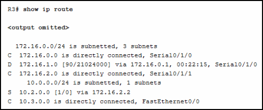
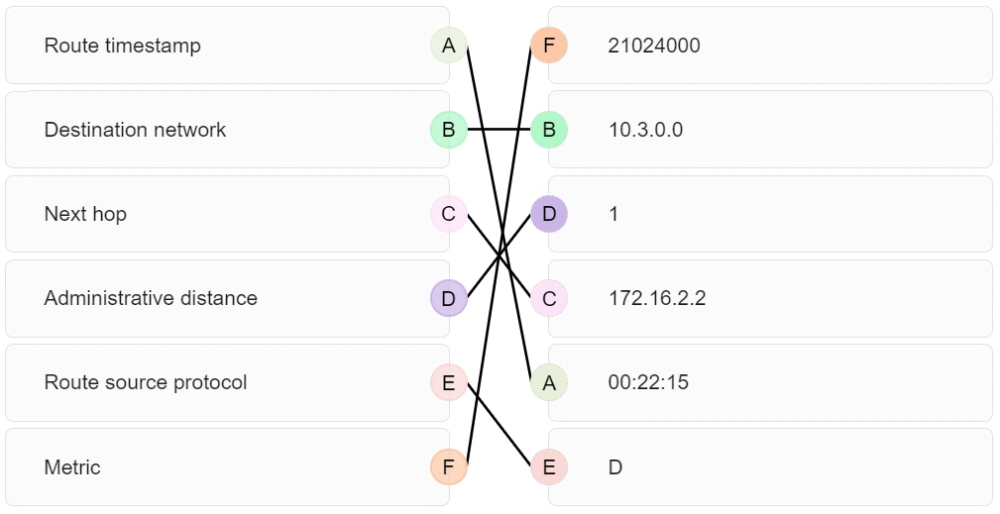

---

## Question 27

**Question:**
What is a basic function of the Cisco Borderless Architecture distribution layer?

**Choices:**
- **A.** acting as a backbone
- **B.** aggregating all the campus blocks
- **C.** aggregating Layer 3 routing boundaries
- **D.** providing access to end user devices

**Correct Answer:**
aggregating Layer 3 routing boundaries

---

## Question 28

**Question:**
A network designer must provide a rationale to a customer for a design which will move an enterprise from a flat network topology to a hierarchical network topology. Which two features of the hierarchical design make it the better choice? (Choose two.)

**Choices:**
- **A.** lower bandwidth requirements
- **B.** reduced cost for equipment and user training
- **C.** easier to provide redundant links to ensure higher availability
- **D.** less required equipment to provide the same performance levels
- **E.** simpler deployment for additional switch equipment

**Correct Answer:**
easier to provide redundant links to ensure higher availability; simpler deployment for additional switch equipment

---

## Question 29

**Question:**
What is a collapsed core in a network design?

**Choices:**
- **A.** a combination of the functionality of the access and distribution layers
- **B.** a combination of the functionality of the distribution and core layers
- **C.** a combination of the functionality of the access and core layers
- **D.** a combination of the functionality of the access, distribution, and core layers

**Correct Answer:**
a combination of the functionality of the distribution and core layers

**Explanation:**
A collapsed core design is appropriate for a small, single building business. This type of design uses two layers (the collapsed core and distribution layers consolidated into one layer and the access layer). Larger businesses use the traditional three-tier switch design model.

---

## Question 30

**Question:**
Which two previously independent technologies should a network administrator attempt to combine after choosing to upgrade to a converged network infrastructure? (Choose two.)

**Choices:**
- **A.** user data traffic
- **B.** analog and VoIP phone traffic
- **C.** scanners and printers
- **D.** mobile cell phone traffic
- **E.** electrical system

**Correct Answer:**
user data traffic; analog and VoIP phone traffic

---

## Question 31

**Question:**
What is a definition of a two-tier LAN network design?

**Choices:**
- **A.** access and core layers collapsed into one tier, and the distribution layer on a separate tier
- **B.** access and distribution layers collapsed into one tier, and the core layer on a separate tier
- **C.** distribution and core layers collapsed into one tier, and the access layer on a separate tier
- **D.** access, distribution, and core layers collapsed into one tier, with a separate backbone layer

**Correct Answer:**
distribution and core layers collapsed into one tier, and the access layer on a separate tier

---

## Question 32

**Question:**
A local law firm is redesigning the company network so that all 20 employees can be connected to a LAN and to the Internet. The law firm would prefer a low cost and easy solution for the project. What type of switch should be selected?

**Choices:**
- **A.** fixed configuration
- **B.** modular configuration
- **C.** stackable configuration
- **D.** StackPower
- **E.** StackWise

**Correct Answer:**
fixed configuration

---

## Question 33

**Question:**
What are two advantages of modular switches over fixed-configuration switches? (Choose two.)

**Choices:**
- **A.** lower cost per switch
- **B.** increased scalability
- **C.** lower forwarding rates
- **D.** need for fewer power outlets
- **E.** availability of multiple ports for bandwidth aggregation

**Correct Answer:**
increased scalability; need for fewer power outlets

---

## Question 34

**Question:**
Refer to the exhibit. Consider that the main power has just been restored. PC3 issues a broadcast IPv4 DHCP request. To which port will SW1 forward this request?

**Images:**
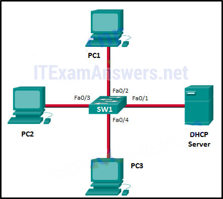

**Choices:**
- **A.** to Fa0/1 only​
- **B.** to Fa0/1 and Fa0/2 only
- **C.** to Fa0/1, Fa0/2, and Fa0/3 only
- **D.** to Fa0/1, Fa0/2, Fa0/3, and Fa0/4
- **E.** to Fa0/1, Fa0/2, and Fa0/4 only​

**Correct Answer:**
to Fa0/1, Fa0/2, and Fa0/3 only

**Explanation:**
When a switch receives a broadcast frame , such as a DHCP Discover request, it follows a specific forwarding rule: it floods the frame out of all available ports in the same VLAN except for the port where the frame entered the switch (the ingress port ). In this star topology, PC3 sends the request through port Fa0/4 ; therefore, SW1 will forward that broadcast to all other active ports, which are Fa0/1 (the DHCP Server), Fa0/2 (PC1), and Fa0/3 (PC2). Although the restoration of power means the switch is undergoing the STP convergence process, the logic for broadcast forwarding remains defined by the exclusion of the source port.

---

## Question 35

**Question:**
What is one function of a Layer 2 switch?

**Choices:**
- **A.** forwards data based on logical addressing
- **B.** duplicates the electrical signal of each frame to every port
- **C.** learns the port assigned to a host by examining the destination MAC address
- **D.** determines which interface is used to forward a frame based on the destination MAC address

**Correct Answer:**
determines which interface is used to forward a frame based on the destination MAC address

---

## Question 36

**Question:**
Refer to the exhibit. How is a frame sent from PCA forwarded to PCC if the MAC address table on switch SW1 is empty?

**Images:**
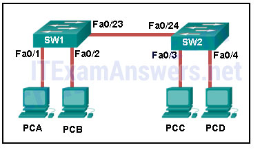

**Choices:**
- **A.** SW1 floods the frame on all ports on the switch, excluding the interconnected port to switch SW2 and the port through which the frame entered the switch.
- **B.** SW1 floods the frame on all ports on SW1, excluding the port through which the frame entered the switch.
- **C.** SW1 forwards the frame directly to SW2. SW2 floods the frame to all ports connected to SW2, excluding the port through which the frame entered the switch.
- **D.** SW1 drops the frame because it does not know the destination MAC address.

**Correct Answer:**
SW1 floods the frame on all ports on SW1, excluding the port through which the frame entered the switch.

---

## Question 37

**Question:**
What two criteria are used by a Cisco LAN switch to decide how to forward Ethernet frames? (Choose two.)

**Choices:**
- **A.** path cost
- **B.** egress port
- **C.** ingress port
- **D.** destination IP address
- **E.** destination MAC address

**Correct Answer:**
ingress port; destination MAC address

---

## Question 38

**Question:**
Which network device can be used to eliminate collisions on an Ethernet network?

**Choices:**
- **A.** firewall
- **B.** hub
- **C.** router
- **D.** switch

**Correct Answer:**
switch

---

## Question 39

**Question:**
Which type of address does a switch use to build the MAC address table?

**Choices:**
- **A.** destination IP address
- **B.** source IP address
- **C.** destination MAC address
- **D.** source MAC address

**Correct Answer:**
source MAC address

**Explanation:**
When a switch receives a frame with a source MAC address that is not in the MAC address table, the switch will add that MAC address to the table and map that address to a specific port. Switches do not use IP addressing in the MAC address table.

---

## Question 40

**Question:**
What are two reasons a network administrator would segment a network with a Layer 2 switch? (Choose two.)

**Choices:**
- **A.** to create fewer collision domains
- **B.** to enhance user bandwidth
- **C.** to create more broadcast domains
- **D.** to eliminate virtual circuits
- **E.** to isolate traffic between segments
- **F.** to isolate ARP request messages from the rest of the network

**Correct Answer:**
to enhance user bandwidth; to isolate traffic between segments

---

## Question 41

**Question:**
Refer to the exhibit. How many broadcast domains are displayed?

**Choices:**
- **A.** 1
- **B.** 4
- **C.** 8
- **D.** 16
- **E.** 55

**Correct Answer:**
8

---

## Question 42

**Question:**
Which statement describes the microsegmentation feature of a LAN switch?

**Choices:**
- **A.** Frame collisions are forwarded.
- **B.** Each port forms a collision domain.
- **C.** The switch will not forward broadcast frames.
- **D.** All ports inside the switch form one collision domain.

**Correct Answer:**
Each port forms a collision domain.

**Explanation:**
When a LAN switch with the microsegmentation feature is used, each port represents a segment, which in turns forms a collision domain. If each port is connected with an end-user device, there will be no collisions. However, if multiple end devices are connected to a hub and the hub is connected to a port on the switch, some collisions will occur in that particular segment-but not beyond it.

---

## Question 43

**Question:**
What is the destination address in the header of a broadcast frame?

**Choices:**
- **A.** 0.0.0.0
- **B.** 255.255.255.255
- **C.** 11-11-11-11-11-11
- **D.** FF-FF-FF-FF-FF-FF

**Correct Answer:**
FF-FF-FF-FF-FF-FF

---

## Question 44

**Question:**
Fill in the blank. A converged network is one that uses the same infrastructure to carry voice, data, and video signals.

---

## Question 45

**Question:**
Match the functions to the corresponding layers. (Not all options are used.) Question Answer

**Images:**
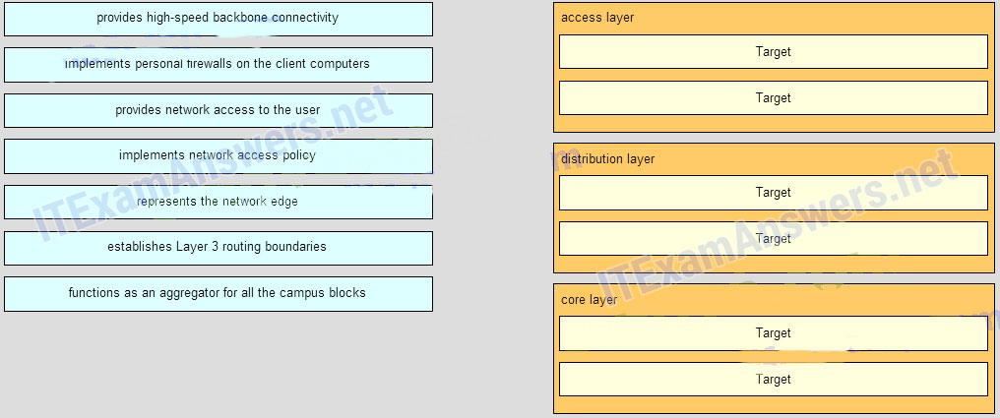
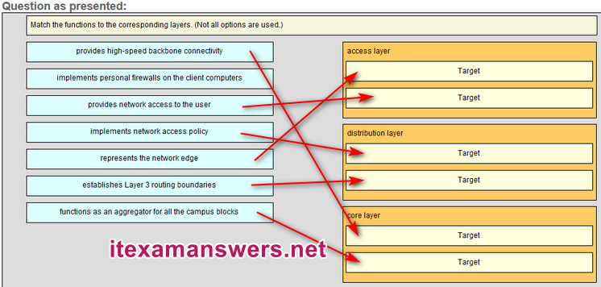

---

## Question 46

**Question:**
Match the borderless switched network guideline description to the principle. (Not all options are used.) Question

**Images:**

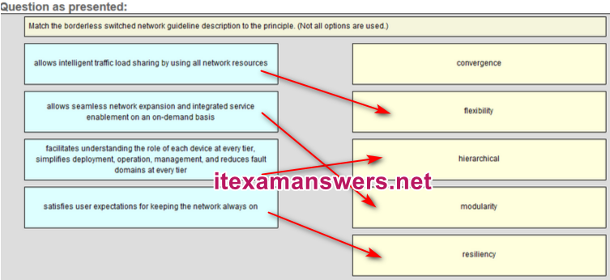
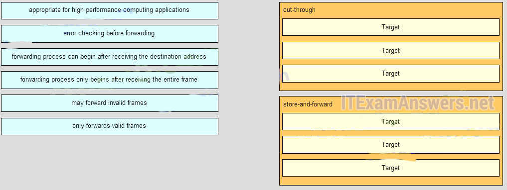
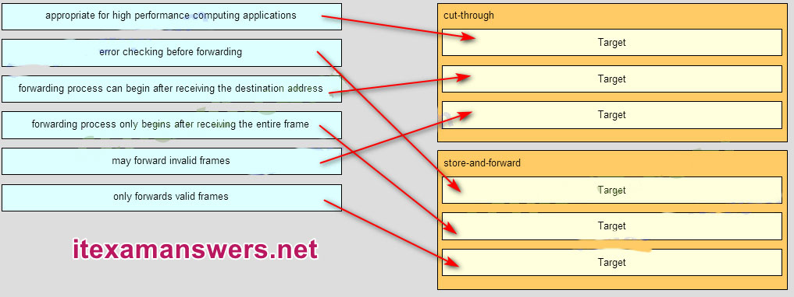

**Correct Answer:**
47. Match the forwarding characteristic to its type. (Not all options are used.)

**Explanation:**
Question Answer

---

## Question 47

**Question:**
What is one advantage of using the cut-through switching method instead of the store-and-forward switching method?

**Choices:**
- **A.** has a positive impact on bandwidth by dropping most of the invalid frames
- **B.** makes a fast forwarding decision based on the source MAC address of the frame
- **C.** has a lower latency appropriate for high-performance computing applications​
- **D.** provides the flexibility to support any mix of Ethernet speeds

**Correct Answer:**
has a lower latency appropriate for high-performance computing applications​

---

## Question 48

**Question:**
Refer to the exhibit. Consider that the main power has just been restored. PC1 asks the DHCP server for IPv4 addressing. The DHCP server sends it an IPv4 address. While PC2 is still booting up, PC3 issues a broadcast IPv4 DHCP request. To which port will SW1 forward this request?​

**Images:**
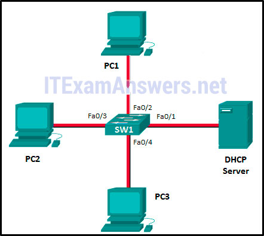

**Choices:**
- **A.** to Fa0/1, Fa0/2, and Fa0/4 only​
- **B.** to Fa0/1, Fa0/2, Fa0/3, and Fa0/4
- **C.** to Fa0/1 and Fa0/2 only
- **D.** to Fa0/1, Fa0/2, and Fa0/3 only
- **E.** to Fa0/1 only​

**Correct Answer:**
to Fa0/1, Fa0/2, and Fa0/3 only

---

## Question 49

**Question:**
Refer to the exhibit. Fill in the blank. There are ” 12 ” collision domains in the topology.​

**Images:**
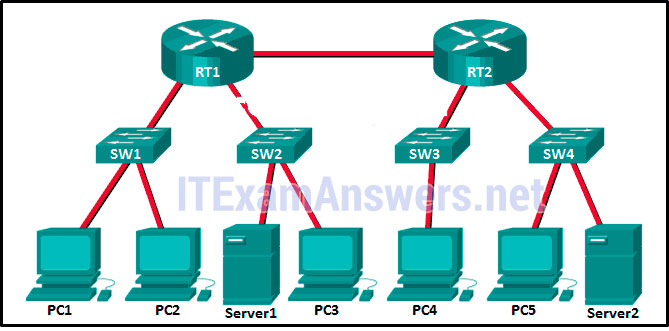

---

## Question 50

**Question:**
ABC, Inc. has about fifty hosts in one LAN. The administrator would like to increase the throughput of that LAN. Which device will increase the number of collision domains and thereby increase the throughput of the LAN?

**Choices:**
- **A.** hub
- **B.** host
- **C.** NIC
- **D.** switch

**Correct Answer:**
switch

---

## Question 51

**Question:**
What does the term “port density” represent for an Ethernet switch?

**Choices:**
- **A.** the numbers of hosts that are connected to each switch port
- **B.** the speed of each port
- **C.** the memory space that is allocated to each switch port
- **D.** the number of available ports

**Correct Answer:**
the number of available ports

---

## Question 52

**Question:**
Which type of transmission does a switch use when the destination MAC address is not contained in the MAC address table?

**Choices:**
- **A.** anycast
- **B.** unicast
- **C.** broadcast
- **D.** multicast

**Correct Answer:**
broadcast

---

## Question 53

**Question:**
What information is added to the switch table from incoming frames?

**Choices:**
- **A.** source MAC address and incoming port number
- **B.** destination MAC address and incoming port number
- **C.** destination IP address and incoming port number
- **D.** source IP address and incoming port number

**Correct Answer:**
source MAC address and incoming port number

---

## Question 54

**Question:**
An administrator purchases new Cisco switches that have a feature called StackPower. What is the purpose of this feature?

**Choices:**
- **A.** It enables many switches to be connected with a special fiber-optic power cable to provide higher bandwidth.
- **B.** It enables the sharing of power among multiple stackable switches.
- **C.** It enables many switches to be connected to increase port density.
- **D.** It enables many switches to be physically stacked in an equipment rack.
- **E.** It enables AC power for a switch to be provided from a powered patch panel.

**Correct Answer:**
It enables the sharing of power among multiple stackable switches.

---

## Question 55

**Question:**
Which switch form factor should be used when large port density, fault tolerance, and low price are important factors?

**Choices:**
- **A.** fixed-configuration switch
- **B.** modular switch
- **C.** stackable switch
- **D.** rackable 1U switch

**Correct Answer:**
stackable switch

---

## Question 56

**Question:**
Refer to the exhibit. Fill in the blank. There are ” 5 ” broadcast domains in the topology.​

**Images:**
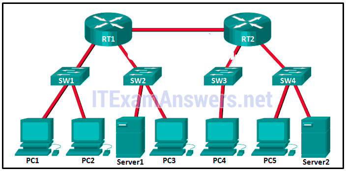

---

## Question 57

**Question:**
What tool is important to consider for use when making hardware improvement decisions about switches?

**Choices:**
- **A.** switched virtual interfaces
- **B.** authentication servers
- **C.** multilayer switching
- **D.** traffic flow analysis

**Correct Answer:**
traffic flow analysis

---

## Question 58

**Question:**
What is the maximum wire speed of a single port on a 48-port gigabit switch?

**Choices:**
- **A.** 1000 Mb/s
- **B.** 48 Mb/s
- **C.** 48 Gb/s
- **D.** 100 Mb/s

**Correct Answer:**
1000 Mb/s

---

## Question 59

**Question:**
When the installation of a network infrastructure is being planned, which technology will allow power to be provided via Ethernet cabling to a downstream switch and its connected devices?

**Choices:**
- **A.** PoE pass-through
- **B.** Gigabit Ethernet
- **C.** wireless APs and VoIP phones
- **D.** PoE

**Correct Answer:**
PoE pass-through

---

## Question 60

**Question:**
Match the function to the corresponding switch type. (Not all options are used.) Layer 2 switches [+] typically used in the access layer of a switched network [+] forward traffic based on information in the Ethernet header —— Multilayer switches [#] can build a routing table [#] supports a few routing protocols

---

## Question 61

**Question:**
Refer to the exhibit. Fill in the blank. How many collision domains are shown in the topology? __ 2 __

**Images:**
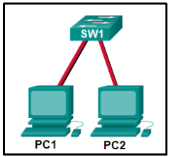

---

## Question 62

**Question:**
Match the borderless switched network guidline description to the principle (not all options used) Place the options in the following order: – allows intelligent traffic load sharing by using all network resources -> flexibility – facilitates understanding the role of each device at every tier, simplifies deployment, operation, management, and reduces fault domains at every tier -> hierarchical – allows seamless network expansion and integrated service enablement on an on-demand basis -> modularity – satisfies user expectations for keeping the network always on -> resiliency Download PDF File below: ITexamanswers.net – CCNA 2 (v5.1 + v6.0) Chapter 1 Exam Answers Full.pdf 2.86 MB 18103 downloads

**Images:**
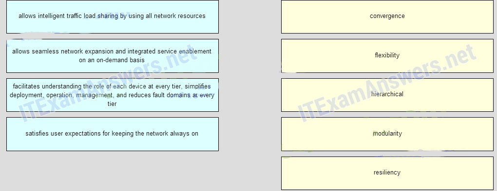
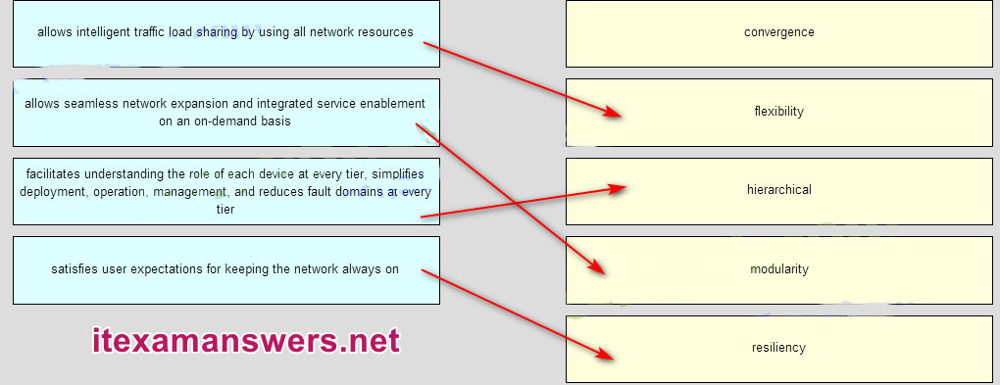

---
