# CCNA 2 v2 - CCNA 2 - Chapter 2

## Question 1

**Question:**
What are two advantages of static routing over dynamic routing? (Choose two.)

**Choices:**
- **A.** Static routing is more secure because it does not advertise over the network.
- **B.** Static routing scales well with expanding networks.
- **C.** Static routing requires very little knowledge of the network for correct implementation.
- **D.** Static routing uses fewer router resources than dynamic routing.
- **E.** Static routing is relatively easy to configure for large networks.

**Correct Answer:**
Static routing is more secure because it does not advertise over the network.; Static routing uses fewer router resources than dynamic routing.

**Explanation:**
Static routing requires a thorough understanding of the entire network for proper implementation. It can be prone to errors and does not scale well for large networks. Static routing uses fewer router resources, because no computing is required for updating routes. Static routing can also be more secure because it does not advertise over the network.

---

## Question 2

**Question:**
Refer to the exhibit. What routing solution will allow both PC A and PC B to access the Internet with the minimum amount of router CPU and network bandwidth utilization?

**Images:**

**Choices:**
- **A.** Configure a static route from R1 to Edge and a dynamic route from Edge to R1.
- **B.** Configure a static default route from R1 to Edge, a default route from Edge to the Internet, and a static route from Edge to R1.
- **C.** Configure a dynamic route from R1 to Edge and a static route from Edge to R1.
- **D.** Configure a dynamic routing protocol between R1 and Edge and advertise all routes.

**Correct Answer:**
Configure a static default route from R1 to Edge, a default route from Edge to the Internet, and a static route from Edge to R1.

**Explanation:**
Two routes have to be created: a default route in R1 to reach Edge and a static route in Edge to reach R1 for the return traffic. This is a best solution once PC A and PC B belong to stub networks. Moreover, static routing consumes less bandwidth than dynamic routing.

---

## Question 3

**Question:**
What is the correct syntax of a floating static route?

**Choices:**
- **A.** ip route 209.165.200.228 255.255.255.248 serial 0/0/0
- **B.** ip route 209.165.200.228 255.255.255.248 10.0.0.1 120
- **C.** ip route 0.0.0.0 0.0.0.0 serial 0/0/0
- **D.** ip route 172.16.0.0 255.248.0.0 10.0.0.1

**Correct Answer:**
ip route 209.165.200.228 255.255.255.248 10.0.0.1 120

**Explanation:**
Floating static routes are used as backup routes, often to routes learned from dynamic routing protocols. To be a floating static route, the configured route must have a higher administrative distance than the primary route. For example, if the primary route is learned through OSPF, then a floating static route that serves as a backup to the OSPF route must have an administrative distance greater than 110. The administrative distance on a floating static route is put at the end of the static route: ip route 209.165.200.228 255.255.255.248 10.0.0.1 120.

---

## Question 4

**Question:**
What is a characteristic of a static route that matches all packets?

**Choices:**
- **A.** It backs up a route already discovered by a dynamic routing protocol.
- **B.** It uses a single network address to send multiple static routes to one destination address.
- **C.** It identifies the gateway IP address to which the router sends all IP packets for which it does not have a learned or static route.
- **D.** It is configured with a higher administrative distance than the original dynamic routing protocol has.

**Correct Answer:**
It identifies the gateway IP address to which the router sends all IP packets for which it does not have a learned or static route.

**Explanation:**
A default static route is a route that matches all packets. It identifies the gateway IP address to which the router sends all IP packets for which it does not have a learned or static route. A default static route is simply a static route with 0.0.0.0/0 as the destination IPv4 address. Configuring a default static route creates a gateway of last resort.

---

## Question 5

**Question:**
What type of route allows a router to forward packets even though its routing table contains no specific route to the destination network?

**Choices:**
- **A.** dynamic route
- **B.** default route
- **C.** destination route
- **D.** generic route

**Correct Answer:**
default route

**Explanation:**
A static default route is a catch-all route for all unmatched networks.

---

## Question 6

**Question:**
Why would a floating static route be configured with an administrative distance that is higher than the administrative distance of a dynamic routing protocol that is running on the same router?

**Choices:**
- **A.** to be used as a backup route
- **B.** to load-balance the traffic
- **C.** to act as a gateway of last resort
- **D.** to be the priority route in the routing table

**Correct Answer:**
to be used as a backup route

**Explanation:**
By default, dynamic routing protocols have a higher administrative distance than static routes. Configuring a static route with a higher administrative distance than that of the dynamic routing protocol will result in the dynamic route being used instead of the static route. However, should the dynamically learned route fail, then the static route will be used as a backup.

---

## Question 7

**Question:**
A company has several networks with the following IP address requirements: Which block of addresses would be the minimum to accommodate all of these devices if each type of device was on its own network?

**Choices:**
- **A.** 172.16.0.0/25
- **B.** 172.16.0.0/24
- **C.** 172.16.0.0/23
- **D.** 172.16.0.0/22

**Correct Answer:**
172.16.0.0/24

**Explanation:**
The network for the PCs would require a subnet mask of /25 in order to accommodate 70 devices. That network could use IP addresses 0 through 127. Phones require a subnet mask of /26 for 50 devices (addresses 128-191). Three /28 networks are needed in order to accommodate cameras, APs, and printers. The network scanner network can use a /30. A block of addresses with a mask of /24 will accommodate this site as the minimum amount needed.

---

## Question 8

**Question:**
What happens to a static route entry in a routing table when the outgoing interface associated with that route goes into the down state?

**Choices:**
- **A.** The static route is removed from the routing table.
- **B.** The router polls neighbors for a replacement route.
- **C.** The static route remains in the table because it was defined as static.
- **D.** The router automatically redirects the static route to use another interface.

**Correct Answer:**
The static route is removed from the routing table.

**Explanation:**
When the interface associated with a static route goes down, the router will remove the route because it is no longer valid.

---

## Question 9

**Question:**
The network administrator configures the router with the ip route 172.16.1.0 255.255.255.0 172.16.2.2 command. How will this route appear in the routing table?

**Choices:**
- **A.** C 172.16.1.0 is directly connected, Serial0/0
- **B.** S 172.16.1.0 is directly connected, Serial0/0
- **C.** C 172.16.1.0 [1/0] via 172.16.2.2
- **D.** S 172.16.1.0 [1/0] via 172.16.2.2

**Correct Answer:**
S 172.16.1.0 [1/0] via 172.16.2.2

**Explanation:**
The route will appear in the routing with a code of S (Static).

---

## Question 10

**Question:**
Graphic shows output of show ip route as follows: Refer to the exhibit. What two commands will change the next-hop address for the 10.0.0.0/8 network from 172.16.40.2 to 192.168.1.2? (Choose two.)

**Images:**
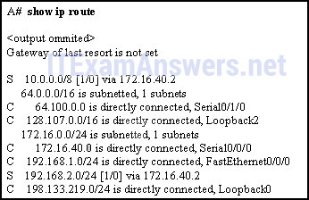

**Choices:**
- **A.** A(config)# no network 10.0.0.0 255.0.0.0 172.16.40.2
- **B.** A(config)# no ip address 10.0.0.1 255.0.0.0 172.16.40.2
- **C.** A(config)# no ip route 10.0.0.0 255.0.0.0 172.16.40.2
- **D.** A(config)# ip route 10.0.0.0 255.0.0.0 s0/0/0
- **E.** A(config)# ip route 10.0.0.0 255.0.0.0 192.168.1.2

**Correct Answer:**
A(config)# no ip route 10.0.0.0 255.0.0.0 172.16.40.2; A(config)# ip route 10.0.0.0 255.0.0.0 192.168.1.2

**Explanation:**
The two required commands are A(config)# no ip route 10.0.0.0 255.0.0.0 172.16.40.2 and A(config)# ip route 10.0.0.0 255.0.0.0 192.168.1.2.

---

## Question 11

**Question:**
Which type of static route that is configured on a router uses only the exit interface?

**Choices:**
- **A.** recursive static route
- **B.** directly connected static route
- **C.** fully specified static route
- **D.** default static route

**Correct Answer:**
directly connected static route

**Explanation:**
When only the exit interface is used, the route is a directly connected static route. When the next-hop IP address is used, the route is a recursive static route. When both are used, it is a fully specified static route.

---

## Question 12

**Question:**
Refer to the graphic. Which command would be used on router A to configure a static route to direct traffic from LAN A that is destined for LAN C?

**Images:**
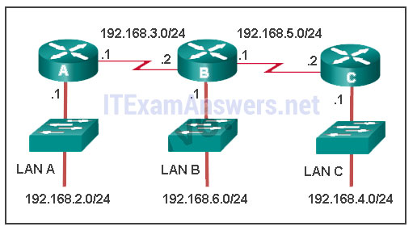

**Choices:**
- **A.** A(config)# ip route 192.168.4.0 255.255.255.0 192.168.5.2
- **B.** A(config)# ip route 192.168.4.0 255.255.255.0 192.168.3.2
- **C.** A(config)# ip route 192.168.5.0 255.255.255.0 192.168.3.2
- **D.** A(config)# ip route 192.168.3.0 255.255.255.0 192.168.3.1
- **E.** A(config)# ip route 192.168.3.2 255.255.255.0 192.168.4.0

**Correct Answer:**
A(config)# ip route 192.168.4.0 255.255.255.0 192.168.3.2

**Explanation:**
The destination network on LAN C is 192.168.4.0 and the next-hop address from the perspective of router A is 192.168.3.2.

---

## Question 13

**Question:**
Refer to the exhibit. The network administrator needs to configure a default route on the Border router. Which command would the administrator use to configure a default route that will require the least amount of router processing when forwarding packets?

**Images:**
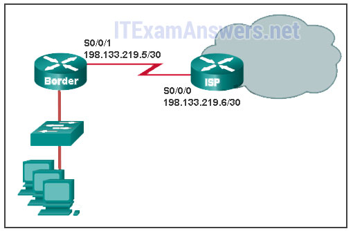

**Choices:**
- **A.** Border(config)# ip route 0.0.0.0 0.0.0.0 198.133.219.5
- **B.** Border(config)# ip route 0.0.0.0 0.0.0.0 198.133.219.6
- **C.** Border(config)# ip route 0.0.0.0 0.0.0.0 s0/0/1
- **D.** Border(config)# ip route 0.0.0.0 0.0.0.0 s0/0/0

**Correct Answer:**
Border(config)# ip route 0.0.0.0 0.0.0.0 s0/0/1

---

## Question 14

**Question:**
What two pieces of information are needed in a fully specified static route to eliminate recursive lookups? (Choose two.)

**Choices:**
- **A.** the interface ID exit interface
- **B.** the interface ID of the next-hop neighbor
- **C.** the IP address of the next-hop neighbor
- **D.** the administrative distance for the destination network
- **E.** the IP address of the exit interface

**Correct Answer:**
the interface ID exit interface; the IP address of the next-hop neighbor

**Explanation:**
A fully specified static route can be used to avoid recursive routing table lookups by the router. A fully specified static route contains both the IP address of the next-hop router and the ID of the exit interface.

---

## Question 15

**Question:**
Refer to the exhibit. What command would be used to configure a static route on R1 so that traffic from both LANs can reach the 2001:db8:1:4::/64 remote network?

**Images:**
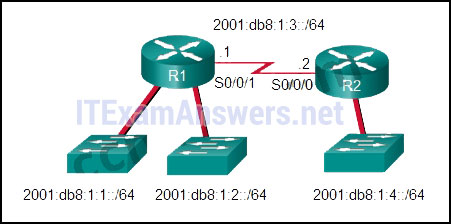

**Choices:**
- **A.** ipv6 route ::/0 serial0/0/0
- **B.** ipv6 route 2001:db8:1:4::/64 2001:db8:1:3::1
- **C.** ipv6 route 2001:db8:1:4::/64 2001:db8:1:3::2
- **D.** ipv6 route 2001:db8:1::/65 2001:db8:1:3::1

**Correct Answer:**
ipv6 route 2001:db8:1:4::/64 2001:db8:1:3::2

**Explanation:**
To configure an IPv6 static route, use the ipv6 route command followed by the destination network. Then add either the IP address of the adjacent router or the interface R1 will use to transmit a packet to the 2001:db8:1:4::/64 network.

---

## Question 16

**Question:**
Refer to the exhibit. Which default static route command would allow R1 to potentially reach all unknown networks on the Internet?

**Images:**
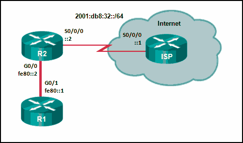

**Choices:**
- **A.** R1(config)# ipv6 route 2001:db8:32::/64 G0/0
- **B.** R1(config)# ipv6 route ::/0 G0/0 fe80::2
- **C.** R1(config)# ipv6 route ::/0 G0/1 fe80::2
- **D.** R1(config)# ipv6 route 2001:db8:32::/64 G0/1 fe80::2

**Correct Answer:**
R1(config)# ipv6 route ::/0 G0/1 fe80::2

**Explanation:**
To route packets to unknown IPv6 networks a router will need an IPv6 default route. The static route ipv6 route ::/0 G0/1 fe80::2 will match all networks and send packets out the specified exit interface G0/1 toward R2.

---

## Question 17

**Question:**
Consider the following command: ip route 192.168.10.0 255.255.255.0 10.10.10.2 5 Which route would have to go down in order for this static route to appear in the routing table?

**Choices:**
- **A.** a default route
- **B.** a static route to the 192.168.10.0/24 network
- **C.** an OSPF-learned route to the 192.168.10.0/24 network
- **D.** an EIGRP-learned route to the 192.168.10.0/24 network

**Correct Answer:**
a static route to the 192.168.10.0/24 network

**Explanation:**
The administrative distance of 5 added to the end of the static route creates a floating static situation for a static route that goes down. Static routes have a default administrative distance of 1. This route that has an administrative distance of 5 will not be placed into the routing table unless the previously entered static route to the 192.168.10.0/24 goes down or was never entered. The administrative distance of 5 added to the end of the static route configuration creates a floating static route that will be placed in the routing table when the primary route to the same destination network goes down. By default, a static route to the 192.168.10.0/24 network has an administrative distance of 1. Therefore, the floating route with an administrative distance of 5 will not be placed into the routing table unless the previously entered static route to the 192.168.10.0/24 goes down or was never entered. Because the floating route has an administrative distance of 5, the route is preferred to an OSPF-learned route (with the administrative distance of 110) or an EIGRP-learned route (with the administrative distance of 110) to the same destination network.

---

## Question 18

**Question:**
Refer to the exhibit. The routing table for R2 is as follows: What will router R2 do with a packet destined for 192.168.10.129?

**Images:**
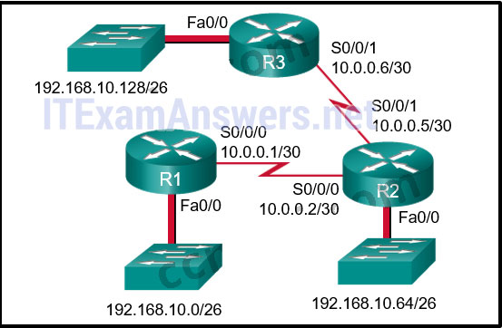

**Choices:**
- **A.** drop the packet
- **B.** send the packet out interface Serial0/0/0
- **C.** send the packet out interface Serial0/0/1
- **D.** send the packet out interface FastEthernet0/0

**Correct Answer:**
send the packet out interface Serial0/0/1

**Explanation:**
When a static route is configured with the next hop address (as in the case of the 192.168.10.128 network), the output of the show ip route command lists the route as “via” a particular IP address. The router has to look up that IP address to determine which interface to send the packet out. Because the IP address of 10.0.0.6 is part of network 10.0.0.4, the router sends the packet out interface Serial0/0/1.

---

## Question 19

**Question:**
A network administrator has entered a static route to an Ethernet LAN that is connected to an adjacent router. However, the route is not shown in the routing table. Which command would the administrator use to verify that the exit interface is up?

**Choices:**
- **A.** show ip interface brief
- **B.** show ip protocols
- **C.** show ip route
- **D.** tracert

**Correct Answer:**
show ip interface brief

**Explanation:**
The network administrator should use the show ip interface brief command to verify that the exit interface or the interface connected to the next hop address is up and up. The show ip route command has already been issued by the administrator. The show ip protocols command is used when a routing protocol is enabled. The tracert command is used from a Windows PC.

---

## Question 20

**Question:**
Consider the following command: ip route 192.168.10.0 255.255.255.0 10.10.10.2 5 How would an administrator test this configuration?

**Choices:**
- **A.** Delete the default gateway route on the router.
- **B.** Ping any valid address on the 192.168.10.0/24 network.
- **C.** Manually shut down the router interface used as a primary route.
- **D.** Ping from the 192.168.10.0 network to the 10.10.10.2 addres

**Correct Answer:**
Manually shut down the router interface used as a primary route.

**Explanation:**
A floating static is a backup route that only appears in the routing table when the interface used with the primary route is down. To test a floating static route, the route must be in the routing table. Therefore, shutting down the interface used as a primary route would allow the floating static route to appear in the routing table.

---

## Question 21

**Question:**
R1 router has a serial connection to the ISP out s0/0/1. R1 router has the 10.0.30.0/24 LAN connected to G0/0. R1 has the 10.0.40.0/24 LAN connected to G0/1. Finally, R1 has the s0/0/0 10.0.50.0/24 network shared with R2. R2 also has the 10.0.60.0/24 LAN connected through G0/0. The following information is below R1. Refer to the exhibit. The small company shown uses static routing. Users on the R2 LAN have reported a problem with connectivity. What is the issue?

**Images:**
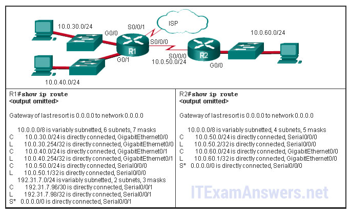

**Choices:**
- **A.** R2 needs a static route to the R1 LANs.
- **B.** R1 and R2 must use a dynamic routing protocol.
- **C.** R1 needs a default route to R2.
- **D.** R1 needs a static route to the R2 LAN.
- **E.** R2 needs a static route to the Internet.

**Correct Answer:**
R1 needs a static route to the R2 LAN.

**Explanation:**
R1 has a default route to the Internet. R2 has a default route to R1. R1 is missing a static route for the 10.0.60.0 network. Any traffic that reached R1 and is destined for 10.0.60.0/24 will be routed to the ISP.

---

## Question 22

**Question:**
Which three IOS troubleshooting commands can help to isolate problems with a static route? (Choose three.)

**Choices:**
- **A.** show version
- **B.** ping
- **C.** tracert
- **D.** show ip route
- **E.** show ip interface brief
- **F.** show arp

**Correct Answer:**
ping; show ip route; show ip interface brief

**Explanation:**
The ping, show ip route, and show ip interface brief commands provide information to help troubleshoot static routes. Show version does not provide any routing information. The tracert command is used at the Windows command prompt and is not an IOS command. The show arp command displays learned IP address to MAC address mappings contained in the Address Resolution Protocol (ARP) table.

---

## Question 23

**Question:**
An administrator issues the ipv6 route 2001:db8:acad:1::/32 gigabitethernet0/0 2001:db8:acad:6::1 100 command on a router. What administrative distance is assigned to this route?

**Choices:**
- **A.** 0
- **B.** 1
- **C.** 32
- **D.** 100

**Correct Answer:**
100

**Explanation:**
The command ipv6 route 2001:db8:acad:1::/32 gigabitethernet0/0 2001:db8:acad:6::1 100 will configure a floating static route on a router. The 100 at the end of the command specifies the administrative distance of 100 to be applied to the route.

---

## Question 24

**Question:**
Refer to the exhibit. The network engineer for the company that is shown wants to use the primary ISP connection for all external connectivity. The backup ISP connection is used only if the primary ISP connection fails. Which set of commands would accomplish this goal?

**Images:**
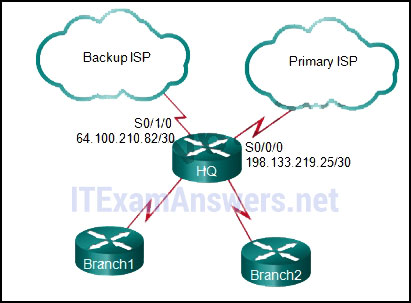

**Choices:**
- **A.** ip route 198.133.219.24 255.255.255.252 ip route 64.100.210.80 255.255.255.252
- **B.** ip route 198.133.219.24 255.255.255.252 ip route 64.100.210.80 255.255.255.252 10
- **C.** ip route 0.0.0.0 0.0.0.0 s0/0/0 ip route 0.0.0.0 0.0.0.0 s0/1/0
- **D.** ip route 0.0.0.0 0.0.0.0 s0/0/0 ip route 0.0.0.0 0.0.0.0 s0/1/0 10

**Correct Answer:**
ip route 0.0.0.0 0.0.0.0 s0/0/0 ip route 0.0.0.0 0.0.0.0 s0/1/0 10

**Explanation:**
A static route that has no administrative distance added as part of the command has a default administrative distance of 1. The backup link should have a number higher than 1. The correct answer has an administrative distance of 10. The other quad zero route would load balance packets across both links and both links would appear in the routing table. The remaining answers are simply static routes (either a default route or a floating static default route).

---

## Question 25

**Question:**
Open the PT Activity. Perform the tasks in the activity instructions and then answer the question. Why are the pings from PC0 to Server0 not successful?

**Choices:**
- **A.** The static route to network 192.168.1.0 is misconfigured on Router1.
- **B.** The static route to network 192.168.1.0 is misconfigured on Router2.​
- **C.** The static route to network 192.168.2.0 is misconfigured on Router1.​
- **D.** The static route to network 192.168.2.0 is misconfigured on Router2.​

**Correct Answer:**
The static route to network 192.168.2.0 is misconfigured on Router1.​

**Explanation:**
Static routes should specify either a local interface or a next-hop IP address.

---

## Question 26

**Question:**
Open the PT Activity. Perform the tasks in the activity instructions and then answer the question. What IPv6 static route can be configured on router R1 to make a fully converged network?

**Choices:**
- **A.** ipv6 route 2001:db8:10:12::/64 S0/0/1
- **B.** ipv6 route 2001:db8:10:12::/64 S0/0/0
- **C.** ipv6 route 2001:db8:10:12::/64 2001:db8:10:12::1
- **D.** ipv6 route 2001:db8:10:12::/64 2001:db8:32:77::1

**Correct Answer:**
ipv6 route 2001:db8:10:12::/64 S0/0/1

**Explanation:**
To reach the remote network, R1 will need a static route with a destination IPv6 address of 2001:db8:10:12::/64 and an exit interface of S0/0/1. The correct static route configuration will be as follows:ipv6 route 2001:db8:10:12::/64 S0/0/1. Older Version

---

## Question 27

**Question:**
Which interface is the default location that would contain the IP address used to manage a 24-port Ethernet switch?

**Choices:**
- **A.** VLAN 1
- **B.** Fa0/0
- **C.** Fa0/1
- **D.** interface connected to the default gateway
- **E.** VLAN 99

**Correct Answer:**
VLAN 1

**Explanation:**
Interface VLAN 1 is the default management SVI.

---

## Question 28

**Question:**
Which statement describes the port speed LED on the Cisco Catalyst 2960 switch?

**Choices:**
- **A.** If the LED is green, the port is operating at 100 Mb/s.
- **B.** If the LED is off, the port is not operating.
- **C.** If the LED is blinking green, the port is operating at 10 Mb/s.
- **D.** If the LED is amber, the port is operating at 1000 Mb/s.

**Correct Answer:**
If the LED is green, the port is operating at 100 Mb/s.

---

## Question 29

**Question:**
What is a function of the switch boot loader?

**Choices:**
- **A.** to speed up the boot process
- **B.** to provide security for the vulnerable state when the switch is booting
- **C.** to control how much RAM is available to the switch during the boot process
- **D.** to provide an environment to operate in when the switch operating system cannot be found

**Correct Answer:**
to provide an environment to operate in when the switch operating system cannot be found

---

## Question 30

**Question:**
In which situation would a technician use the show interfaces switch command?

**Choices:**
- **A.** to determine if remote access is enabled
- **B.** when packets are being dropped from a particular directly attached host
- **C.** when an end device can reach local devices, but not remote devices
- **D.** to determine the MAC address of a directly attached network device on a particular interface

**Correct Answer:**
when packets are being dropped from a particular directly attached host

---

## Question 31

**Question:**
Refer to the exhibit. A network technician is troubleshooting connectivity issues in an Ethernet network with the command show interfaces fastEthernet 0/0. What conclusion can be drawn based on the partial output in the exhibit?

**Images:**
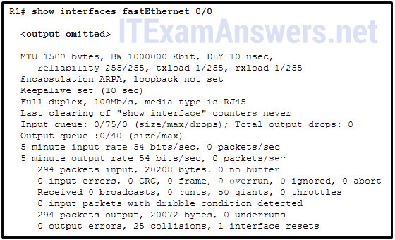

**Choices:**
- **A.** All hosts on this network communicate in full-duplex mode.
- **B.** Some workstations might use an incorrect cabling type to connect to the network.
- **C.** There are collisions in the network that cause frames to occur that are less than 64 bytes in length.
- **D.** A malfunctioning NIC can cause frames to be transmitted that are longer than the allowed maximum length.

**Correct Answer:**
A malfunctioning NIC can cause frames to be transmitted that are longer than the allowed maximum length.

---

## Question 32

**Question:**
Refer to the exhibit. The network administrator wants to configure Switch1 to allow SSH connections and prohibit Telnet connections. How should the network administrator change the displayed configuration to satisfy the requirement?

**Images:**
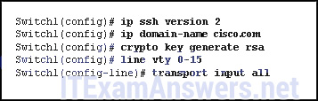

**Choices:**
- **A.** Use SSH version 1.
- **B.** Reconfigure the RSA key.
- **C.** Configure SSH on a different line.
- **D.** Modify the transport input command.

**Correct Answer:**
Modify the transport input command.

---

## Question 33

**Question:**
What is one difference between using Telnet or SSH to connect to a network device for management purposes?

**Choices:**
- **A.** Telnet uses UDP as the transport protocol whereas SSH uses TCP.
- **B.** Telnet does not provide authentication whereas SSH provides authentication.
- **C.** Telnet supports a host GUI whereas SSH only supports a host CLI.
- **D.** Telnet sends a username and password in plain text, whereas SSH encrypts the username and password .

**Correct Answer:**
Telnet sends a username and password in plain text, whereas SSH encrypts the username and password .

---

## Question 34

**Question:**
In which type of attack does a malicious node request all available IP addresses in the address pool of a DHCP server in order to prevent legitimate hosts from obtaining network access?​

**Choices:**
- **A.** CAM table overflow
- **B.** MAC address flooding
- **C.** DHCP starvation
- **D.** DHCP spoofing

**Correct Answer:**
DHCP starvation

---

## Question 35

**Question:**
Which method would mitigate a MAC address flooding attack?

**Choices:**
- **A.** increasing the size of the CAM table
- **B.** configuring port security
- **C.** using ACLs to filter broadcast traffic on the switch​
- **D.** increasing the speed of switch ports

**Correct Answer:**
configuring port security

**Explanation:**
Port security can be configured on switches to assist in preventing the MAC address table from being overwhelmed with invalid MAC addresses. ACLs will not assist a switch in filtering broadcast traffic, and increasing the size of the CAM table or the speed of switch ports will not resolve this issue.

---

## Question 36

**Question:**
Which two features on a Cisco Catalyst switch can be used to mitigate DHCP starvation and DHCP spoofing attacks? (Choose two.)

**Choices:**
- **A.** port security
- **B.** extended ACL
- **C.** DHCP snooping
- **D.** DHCP server failover
- **E.** strong password on DHCP servers

**Correct Answer:**
port security; DHCP snooping

**Explanation:**
In DHCP starvation attacks, an attacker floods the DHCP server with DHCP requests to use up all the available IP addresses that the DHCP server can issue. In DHCP spoofing attacks, an attacker configures a fake DHCP server on the network so that it provides clients with false DNS server addresses. The port security feature can limit the number of dynamically learned MAC addresses per port or allow only known valid NICs to be connected via their specific MAC addresses. The DHCP snooping feature can identify the legitimate DHCP servers and block fake DHCP servers from issuing IP address information. These two features can help fight against DHCP attacks.

---

## Question 37

**Question:**
Which two basic functions are performed by network security tools? (Choose two.)

**Choices:**
- **A.** revealing the type of information an attacker is able to gather from monitoring network traffic
- **B.** educating employees about social engineering attacks
- **C.** simulating attacks against the production network to determine any existing vulnerabilities
- **D.** writing a security policy document for protecting networks
- **E.** controlling physical access to user devices

**Correct Answer:**
revealing the type of information an attacker is able to gather from monitoring network traffic; simulating attacks against the production network to determine any existing vulnerabilities

---

## Question 38

**Question:**
An administrator wants to use a network security auditing tool on a switch to verify which ports are not protected against a MAC flooding attack. For the audit to be successful, what important factor must the administrator consider?

**Choices:**
- **A.** if the CAM table is empty before the audit is started
- **B.** if all the switch ports are operational at the same speed
- **C.** if the number of valid MAC addresses and spoofed MAC addresses is the same
- **D.** the aging-out period of the MAC address table

**Correct Answer:**
the aging-out period of the MAC address table

---

## Question 39

**Question:**
Which action will bring an error-disabled switch port back to an operational state?

**Choices:**
- **A.** Remove and reconfigure port security on the interface.
- **B.** Issue the switchport mode access command on the interface.
- **C.** Clear the MAC address table on the switch.
- **D.** Issue the shutdown and then no shutdown interface commands.

**Correct Answer:**
Issue the shutdown and then no shutdown interface commands.

---

## Question 40

**Question:**
Refer to the exhibit. Port Fa0/2 has already been configured appropriately. The IP phone and PC work properly. Which switch configuration would be most appropriate for port Fa0/2 if the network administrator has the following goals?

**Images:**
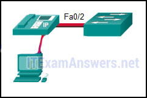

**Choices:**
- **A.** SWA(config-if)# switchport port-security SWA(config-if)# switchport port-security mac-address sticky
- **B.** SWA(config-if)# switchport port-security mac-address sticky SWA(config-if)# switchport port-security maximum 2
- **C.** SWA(config-if)# switchport port-security SWA(config-if)# switchport port-security maximum 2 SWA(config-if)# switchport port-security mac-address sticky
- **D.** SWA(config-if)# switchport port-security SWA(config-if)# switchport port-security maximum 2 SWA(config-if)# switchport port-security mac-address sticky SWA(config-if)# switchport port-security violation restrict

**Correct Answer:**
SWA(config-if)# switchport port-security SWA(config-if)# switchport port-security maximum 2 SWA(config-if)# switchport port-security mac-address sticky

---

## Question 41

**Question:**
Which two statements are true regarding switch port security? (Choose two.)

**Choices:**
- **A.** The three configurable violation modes all log violations via SNMP.
- **B.** Dynamically learned secure MAC addresses are lost when the switch reboots.
- **C.** The three configurable violation modes all require user intervention to re-enable ports.
- **D.** After entering the sticky parameter, only MAC addresses subsequently learned are converted to secure MAC addresses.
- **E.** If fewer than the maximum number of MAC addresses for a port are configured statically, dynamically learned addresses are added to CAM until the maximum number is reached.

**Correct Answer:**
Dynamically learned secure MAC addresses are lost when the switch reboots.; If fewer than the maximum number of MAC addresses for a port are configured statically, dynamically learned addresses are added to CAM until the maximum number is reached.

**Explanation:**
Dynamically learned secure MAC addresses are lost when the switch reboots. Sticky MAC addresses are learned and added to the running config. These addressess can be retained if the configuration is saved and then rebooted. MAC addresses may also be configured statically (that is, manually). If fewer than the maximum number of MAC addresses for a port are configured statically, dynamically learned addresses are added to CAM until the maximum number is reached.

---

## Question 42

**Question:**
A network administrator configures the port security feature on a switch. The security policy specifies that each access port should allow up to two MAC addresses. When the maximum number of MAC addresses is reached, a frame with the unknown source MAC address is dropped and a notification is sent to the syslog server. Which security violation mode should be configured for each access port?

**Choices:**
- **A.** restrict
- **B.** protect
- **C.** warning
- **D.** shutdown

**Correct Answer:**
restrict

---

## Question 43

**Question:**
Refer to the exhibit. What can be determined about port security from the information that is shown?

**Images:**
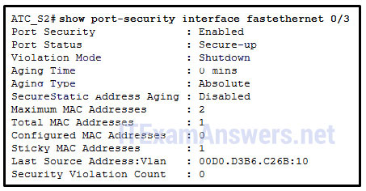

**Choices:**
- **A.** The port has been shut down.
- **B.** The port has two attached devices.
- **C.** The port violation mode is the default for any port that has port security enabled.
- **D.** The port has the maximum number of MAC addresses that is supported by a Layer 2 switch port which is configured for port security.

**Correct Answer:**
The port violation mode is the default for any port that has port security enabled.

---

## Question 44

**Question:**
Open the PT Activity. Perform the tasks in the activity instructions and then answer the question. Fill in the blank. Do not use abbreviations.What is the missing command on S1? ip address 192.168.99.2 255.255.255.0

---

## Question 45

**Question:**
Open the PT Activity. Perform the tasks in the activity instructions and then answer the question. Which event will take place if there is a port security violation on switch S1 interface Fa0/1?

**Images:**
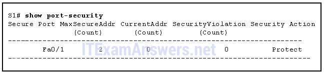

**Choices:**
- **A.** A notification is sent.
- **B.** A syslog message is logged.
- **C.** Packets with unknown source addresses will be dropped.
- **D.** The interface will go into error-disabled state.

**Correct Answer:**
Packets with unknown source addresses will be dropped.

---

## Question 46

**Question:**
What impact does the use of the mdix auto configuration command haveon an Ethernet interface on a switch?

**Choices:**
- **A.** automatically detects duplex settings
- **B.** automatically detects interface speed
- **C.** automatically detects copper cable type
- **D.** automatically assigns the first detected MAC address to an interface

**Correct Answer:**
automatically detects copper cable type

---

## Question 47

**Question:**
Which type of cable does a network administrator need to connect a PC to a switch to recover it after the Cisco IOS software fails to load?

**Choices:**
- **A.** a coaxial cable
- **B.** a console cable
- **C.** a crossover cable
- **D.** a straight-through cable

**Correct Answer:**
a console cable

---

## Question 48

**Question:**
While troubleshooting a connectivity problem, a network administrator notices that a switch port status LED is alternating between green and amber. What could this LED indicate?

**Choices:**
- **A.** The port has no link.
- **B.** The port is experiencing errors.
- **C.** The port is administratively down.
- **D.** A PC is using the wrong cable to connect to the port.
- **E.** The port has an active link with normal traffic activity.

**Correct Answer:**
The port is experiencing errors.

---

## Question 49

**Question:**
A production switch is reloaded and finishes with a Switch> prompt. What two facts can be determined? (Choose two.)

**Choices:**
- **A.** POST occurred normally.
- **B.** The boot process was interrupted.
- **C.** There is not enough RAM or flash on this router.
- **D.** A full version of the Cisco IOS was located and loaded.
- **E.** The switch did not locate the Cisco IOS in flash, so it defaulted to ROM.

**Correct Answer:**
POST occurred normally.; A full version of the Cisco IOS was located and loaded.

**Explanation:**
A switch booting to the Switch> prompt indicates that the switch booted normally. This means a the switch successfully completed POST full version of the Cisco IOS was loaded.

---

## Question 50

**Question:**
Which command displays information about the auto-MDIX setting for a specific interface?

**Choices:**
- **A.** show interfaces
- **B.** show controllers
- **C.** show processes
- **D.** show running-config

**Correct Answer:**
show controllers

---

## Question 51

**Question:**
Refer to the exhibit. What media issue might exist on the link connected to Fa0/1 based on the show interface command?

**Images:**
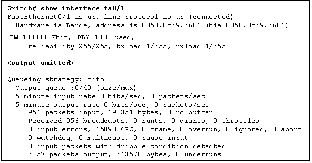

**Choices:**
- **A.** The bandwidth parameter on the interface might be too high.
- **B.** There could be an issue with a faulty NIC.
- **C.** There could be too much electrical interference and noise on the link.
- **D.** The cable attaching the host to port Fa0/1 might be too long.
- **E.** The interface might be configured as half-duplex.

**Correct Answer:**
There could be too much electrical interference and noise on the link.

---

## Question 52

**Question:**
Which protocol or service sends broadcasts containing the Cisco IOS software version of the sending device, and the packets of which can be captured by malicious hosts on the network?

**Choices:**
- **A.** CDP
- **B.** DHCP
- **C.** DNS
- **D.** SSH

**Correct Answer:**
CDP

---

## Question 53

**Question:**
Refer to the exhibit. Which S1 switch port interface or interfaces should be configured with the ip dhcp snooping trust command if best practices are implemented?

**Images:**
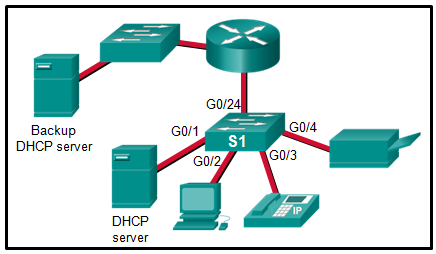

**Choices:**
- **A.** only the G0/1 port
- **B.** only unused ports
- **C.** only the G0/1 and G0/24 ports
- **D.** only the G0/2, G0/3, and G0/4 ports
- **E.** only the G0/1, G0/2, G0/3, and G0/4 ports

**Correct Answer:**
only the G0/1 and G0/24 ports; only the G0/2, G0/3, and G0/4 ports

---

## Question 54

**Question:**
The network administrator enters the following commands on a Cisco switch: Switch(config)# interface vlan1 Switch(config-if)# ip address 192.168.1.2 255.255.255.0 Switch(config-if)# no shutdown What is the effect of entering these commands?

**Choices:**
- **A.** All devices attached to this switch must be in the 192.168.1.0/24 subnet to communicate.
- **B.** The switch is able to forward frames to remote networks.
- **C.** The address of the default gateway for this LAN is 192.168.1.2/24.
- **D.** Users on the 192.168.1.0/24 subnet are able to ping the switch at IP address 192.168.1.2.

**Correct Answer:**
Users on the 192.168.1.0/24 subnet are able to ping the switch at IP address 192.168.1.2.

---

## Question 55

**Question:**
Fill in the blank. When port security is enabled, a switch port uses the default violation mode of shutdown until specifically configured to use a different violation mode. Explanation: If no violation mode is specified when port security is enabled on a switch port, then the security violation mode defaults to shutdown.

---

## Question 56

**Question:**
Which three statements are true about using full-duplex Fast Ethernet? (Choose three.)

**Choices:**
- **A.** Performance is improved with bidirectional data flow.
- **B.** Performance is improved because the NIC is able to detect collisions.
- **C.** Latency is reduced because the NIC processes frames faster.
- **D.** Full-duplex Fast Ethernet offers 100 percent efficiency in both directions.
- **E.** Nodes operate in full-duplex with unidirectional data flow.
- **F.** Performance is improved because the collision detect function is disabled on the device.

**Correct Answer:**
Performance is improved with bidirectional data flow.; Full-duplex Fast Ethernet offers 100 percent efficiency in both directions.; Performance is improved because the collision detect function is disabled on the device.

---

## Question 57

**Question:**
Fill in the blank. ” Full-duplex ” communication allows both ends of a connection to transmit and receive data simultaneously.

**Explanation:**
Full-duplex communication improves the performance of a switched LAN, increasing effective bandwidth by allowing both ends of a connection to transmit and receive data simultaneously.

---

## Question 58

**Question:**
Place the options in the following order: step 3 – not scored – step 1 step 4 step 2 step 5 step 6

**Images:**
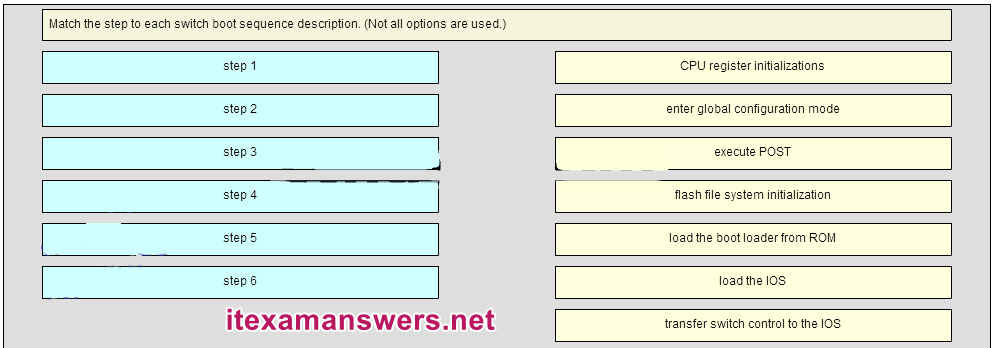
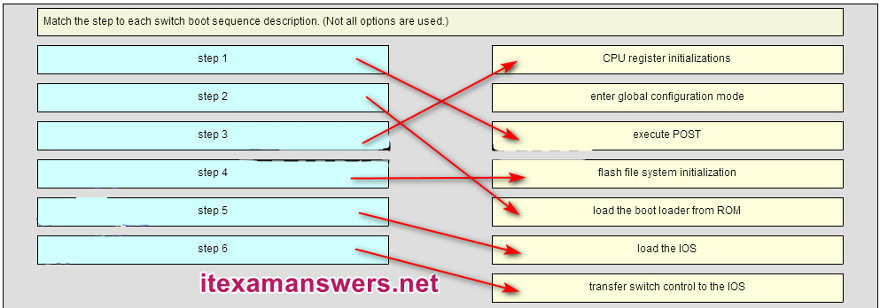

---

## Question 59

**Question:**
Identify the steps needed to configure a switch for SSH. Place the options in the following order: [+] Create a local user. [+] Generate RSA keys. [+] Configure a domain name. [+] Use the login local command. [+] Use the transport input ssh command. [+] Order does not matter within this group.

**Images:**
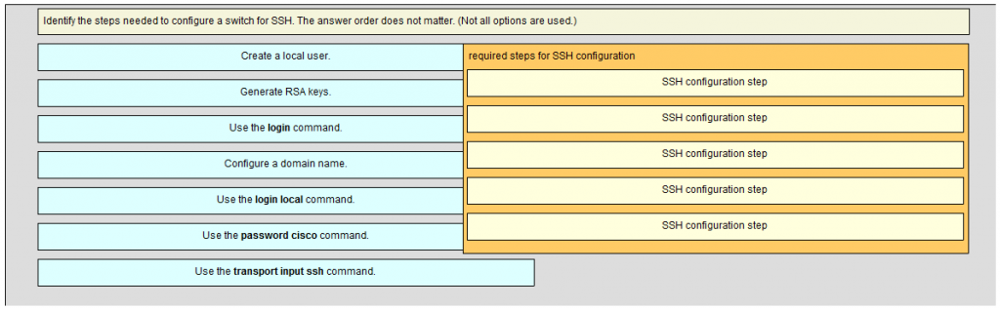
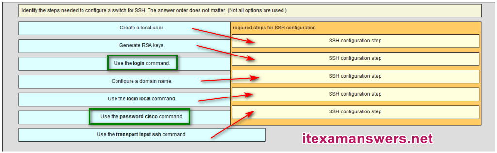

---

## Question 60

**Question:**
Match the Link State to the interface and protocol status. Place the options in the following order: disable -> admin down Layer 1 problem -> down/down – not scored – Layer 2 problem -> up/down operational -> up/up Download PDF File below: ITexamanswers.net – CCNA 2 (v5.1 + v6.0) Chapter 2 Exam Answers Full.pdf 1.58 MB 11273 downloads

**Images:**
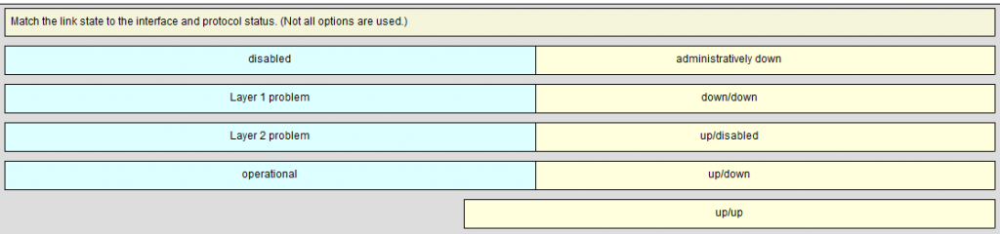
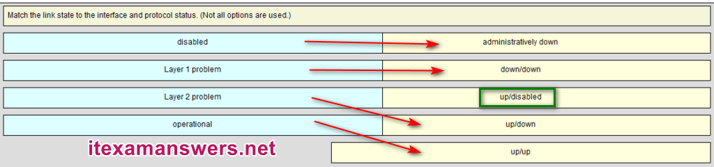

---
