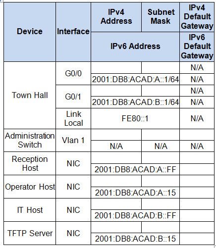
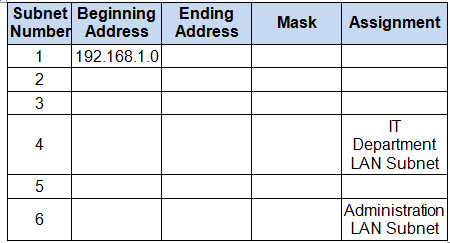

# CCNA 2 v2 - Chapter 2 SIC Practice Skills

## Question 1

**Question:**
Do not use the browser Back button or close or reload any exam windows during the exam. 2. Do not close Packet Tracer when you are done. It will close automatically. 3. Click the Submit Assessment button in the browser window to submit your work. Introduction In this assessment, you will configure devices in an IPv4/IPv6 network. For the sake of time, you will not be asked to perform all configurations on all network devices as you may be required to do in a real network or other assessment. Instead, you will use the skills and knowledge that you have learned in the labs in this course to configure the Town Hall router. In addition, you will address the hosts on two LANs with IPv4 and IPv6 addresses, activate and address the management interface of the Administration Switch, and back up a device configuration to a TFTP server. You will receive one of several topologies. You are not required to configure the IT Department Switch, and you will not be able to access it in this practice skills assessment activity. All IOS device configurations should be completed from a direct terminal connection to the device console. In addition, many values that are required to complete the configurations have not been given to you. In those cases, create the values that you need to complete the requirements. For values that have been supplied to you, they must be entered exactly as they appear in order for you to get full credit for your configuration. You will practice and be assessed on the following skills:

**Images:**

**Choices:**
- **A.** Configuration of initial IOS device settings
- **B.** Design and calculation of IPv4 addressing
- **C.** Configuration of IOS device interfaces including IPv4 and IPv6 addressing when appropriate
- **D.** Addressing of network hosts with IPv4 and IPv6 addresses
- **E.** Enhancing device security, including configuration of the secure transport protocol for remote device configuration
- **F.** Configuration of a switch management interface
- **G.** Configuration of initial router settings
- **H.** Interface configuration and IPv4 and IPv6 addressing
- **I.** Device security enhancement or device hardening
- **J.** Secure transport for remote configuration connections as covered in the labs
- **K.** Backup of the configuration file to a TFTP server
- **L.** Enabling basic remote management by Telnet
- **M.** IPv4 full addressing
- **N.** IPv6 addressing
- **O.** Configure the router hostname: Middle
- **P.** Protect device configurations from unauthorized access with the encrypted privileged exec password.
- **Q.** Secure all access lines into the router using methods covered in the course and labs.
- **R.** Require newly-entered passwords must have a minimum length of 10 characters.
- **S.** Prevent all passwords from being viewed in clear text in device configuration files.
- **T.** Configure the router to only accept in-band management connections over the protocol that is more secure than Telnet, as was done in the labs. Use the value 1024 for encryption key strength.
- **U.** Configure local user authentication for in-band management connections. Create a user with the name netadmin and a secret password of Cisco_CCNA5 Give the user the highest administrative privileges. Your answer must match these values exactly.
- **V.** Reconfigure the link local addresses to the value shown in the table.
- **W.** Document the interfaces in the configuration file.
- **X.** Use the IPv4 addressing from Step 1 and the IPv6 addressing values provided in the addressing table to configure all host PCs with the correct addressing.
- **Y.** Use the router interface link-local address as the IPv6 default gateways on the hosts.
- **Z.** Complete the configuration of the TFTP server using the IPv4 addressing values from Step 1 and the values in the addressing table.

**Explanation:**
Requirements by device: Town Hall router: Administration Switch: PC and Server hosts: Addressing Table Instructions Step 1: Determine the IP Addressing Scheme. Design an IPv4 addressing scheme and complete the Addressing Table based on the following requirements. Use the table to help you organize your work. a.Subnet the 192.168.1.0/24 network to provide 30 host addresses per subnet while wasting the fewest addresses. b. Assign the fourth subnet to the IT Department LAN. c. Assign the last network host address (the highest) in this subnet to the G0/0 interface on Town Hall. d. Starting with the fifth subnet, subnet the network again so that the new subnets will provide 14 host addresses per subnet while wasting the fewest addresses. e. Assign the second of these new 14-host subnets to the Administration LAN. f. Assign the last network host address (the highest) in the Administration LAN subnet to the G0/1 interface of the Town Hall router. g. Assign the second to the last address (the second highest) in this subnet to the VLAN 1 interface of the Administration Switch. h. Configure addresses on the hosts using any of the remaining addresses in their respective subnets. Step 2: Configure the Town Hall Router. Configure the Town Hall router with all initial configurations that you have learned in the course so far: b. Configure the two Gigabit Ethernet interfaces using the IPv4 addressing values you calculated and the IPv6 values provided in the addressing table. Step 3: Configure the Administration Switch. Configure Administration Switch for remote management over Telnet. Step 4: Configure and Verify Host Addressing. Introduction In this practice skills assessment, you will configure SW-1 with an initial configuration, SSH, and port security. You are only required to configure SW-1 in this assessment. All IOS device configurations should be completed from a direct terminal connection to the device console. It is possible that information that is required to complete the configurations has not been given to you. In that case, create the values that you need to complete the requirements. These values may include certain IP addresses, passwords, interface descriptions, banner text, and other values. You should always use the values that are provided in the instructions in any case. You will practice and be assessed on the following skills: • Configuration of initial device settings • Configuration of switch ports • Configuration and addressing of the switch management interface (SVI) • Configuration of the SSH protocol for remote switch access. • Configuration of port security features. Addressing Table Scenario The network administrator has asked you to configure a new switch. In this activity, you will use a list of requirements to configure the new switch with initial settings, SSH, and port security. • Configure the switch with the hostname value from the addressing table. Your configured value must match the value in the addressing table exactly. • Configure a banner message-of-the-day. • Enable access to the device console with the password cisco . • Create an MD5 encrypted enable password of class. • Encrypt all plain text passwords. • Management SVI addressing • Address the default management interface. • The switch should be reachable over the network from PC-1 and PC-2 . • A domain name of cisco.com • RSA key-pair parameters to support SSH version 2. Use a modulus of 1024. • Set SSH to version 2. • Create a user admin with password ccna . • Configure vty lines to only accept SSH connections. • Require the user created above to supply the user name and password in order to login over SSH. • Disable all unused ports. • Set all Fast Ethernet ports to access ports. • Enable port security to allow only two hosts per port. • Enable the MAC addresses of hosts that have connected to the switch ports to be recorded in the configuration file. • Ensure that port violations disable ports. Instruction Can apply to all type (Type A, Type B, Type C, ...). Please check HOSTNAME and IP on instruction Download PDF File below: CCNA 2 RSE Chapter 2 SIC Practice Skills Assessment – Packet Tracer Answers 74.41 KB 17429 downloads ... Download Download Packet Tracer .PKA file: RSE v6.0 - Chapter 2 Practice Skills Assessment - PT 317.98 KB 14048 downloads

---
