# CCNA 2 v2 - CCNA 2 - Chapter 3

## Question 1

**Question:**
Which dynamic routing protocol was developed to interconnect different Internet service providers?

**Choices:**
- **A.** BGP
- **B.** EIGRP
- **C.** OSPF
- **D.** RIP

**Correct Answer:**
BGP

**Explanation:**
BGP is a protocol developed to interconnect different levels of ISPs as well as ISPs and some of their larger private clients.

---

## Question 2

**Question:**
Which routing protocol is limited to smaller network implementations because it does not accommodate growth for larger networks?

**Choices:**
- **A.** OSPF
- **B.** RIP
- **C.** EIGRP
- **D.** IS-IS

**Correct Answer:**
RIP

**Explanation:**
The RIP protocol was created with a metric that does not support larger networks. Other routing protocols, including OSPF, EIGRP, and IS-IS, scale well and accommodate growth and larger networks.

---

## Question 3

**Question:**
What two tasks do dynamic routing protocols perform? (Choose two.)

**Choices:**
- **A.** discover hosts
- **B.** update and maintain routing tables
- **C.** propagate host default gateways
- **D.** network discovery
- **E.** assign IP addressing

**Correct Answer:**
update and maintain routing tables; network discovery

**Explanation:**
Routing protocols are responsible for discovering local and remote networks and for maintaining and updating the routing table.

---

## Question 4

**Question:**
When would it be more beneficial to use a dynamic routing protocol instead of static routing?

**Choices:**
- **A.** in an organization with a smaller network that is not expected to grow in size
- **B.** on a stub network that has a single exit point
- **C.** in an organization where routers suffer from performance issues
- **D.** on a network where there is a lot of topology changes

**Correct Answer:**
on a network where there is a lot of topology changes

**Explanation:**
Dynamic routing protocols consume more router resources, are suitable for larger networks, and are more useful on networks that are growing and changing.

---

## Question 5

**Question:**
When would it be more beneficial to use static routing instead of dynamic routing protocols?

**Choices:**
- **A.** on a network where dynamic updates would pose a security risk
- **B.** on a network that is expected to continually grow in size
- **C.** on a network that has a large amount of redundant paths
- **D.** on a network that commonly experiences link failures

**Correct Answer:**
on a network where dynamic updates would pose a security risk

**Explanation:**
Dynamic routing protocols are viewed as less secure than static routing because they commonly forward routing information on the same links that data traffic is crossing.

---

## Question 6

**Question:**
What is a purpose of the network command when configuring RIPv2 as the routing protocol?

**Choices:**
- **A.** It identifies the interfaces that belong to a specified network.
- **B.** It specifies the remote network that can now be reached.
- **C.** It immediately advertises the specified network to neighbor routers with a classful mask.
- **D.** It populates the routing table with the network entry.

**Correct Answer:**
It identifies the interfaces that belong to a specified network.

**Explanation:**
The network command is used to advertise the directly connected networks of a router. It enables RIP on the interfaces that belong to the specified network.

---

## Question 7

**Question:**
A network administrator configures a static route on the edge router of a network to assign a gateway of last resort. How would a network administrator configure the edge router to automatically share this route within RIP?

**Choices:**
- **A.** Use the auto-summary command.
- **B.** Use the passive-interface command.
- **C.** Use the network command.
- **D.** Use the default-information originate command.

**Correct Answer:**
Use the default-information originate command.

**Explanation:**
The default-information originate command instructs a router to propagate the static default route in RIP or OSPF.

---

## Question 8

**Question:**
What is the purpose of the passive-interface command?

**Choices:**
- **A.** allows a routing protocol to forward updates out an interface that is missing its IP address
- **B.** allows a router to send routing updates on an interface but not receive updates via that interface
- **C.** allows an interface to remain up without receiving keepalives
- **D.** allows interfaces to share IP addresses
- **E.** allows a router to receive routing updates on an interface but not send updates via that interface

**Correct Answer:**
allows a router to receive routing updates on an interface but not send updates via that interface

**Explanation:**
A passive interface does not send routing updates or hello packets; however, it is still advertised to other routers connected to nonpassive interfaces.

---

## Question 9

**Question:**
Which route would be automatically created when a router interface is activated and configured with an IP address?

**Choices:**
- **A.** D 10.16.0.0/24 [90/3256] via 192.168.6.9
- **B.** C 192.168.0.0/24 is directly connected, FastEthernet 0/0
- **C.** S 192.168.1.0/24 is directly connected, FastEthernet 0/1
- **D.** O 172.16.0.0/16 [110/65] via 192.168.5.1

**Correct Answer:**
C 192.168.0.0/24 is directly connected, FastEthernet 0/0

**Explanation:**
Directly connected networks are identified with a C and are automatically created whenever an interface is configured with an IP address and activated.

---

## Question 10

**Question:**
Refer to the exhibit. Which two types of routes could be used to describe the 192.168.200.0/30 route? (Choose two.)

**Images:**
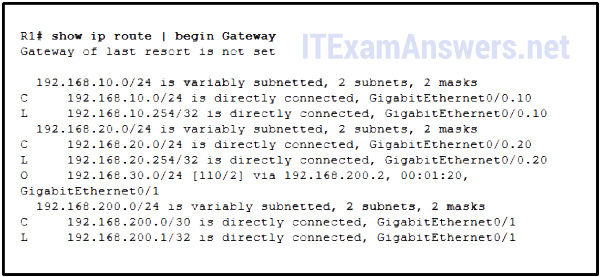

**Choices:**
- **A.** ultimate route
- **B.** level 1 parent route
- **C.** level 1 network route
- **D.** level 2 child route
- **E.** supernet route

**Correct Answer:**
ultimate route; level 2 child route

**Explanation:**
A level 2 child route is a route that has a network with a mask that is greater than the classful equivalent. An ultimate route is a route that uses a next-hop IP address or exit interface to forward traffic.

---

## Question 11

**Question:**
What occurs next in the router lookup process after a router identifies a destination IP address and locates a matching level 1 parent route?

**Choices:**
- **A.** The level 2 child routes are examined.
- **B.** The level 1 supernet routes are examined.
- **C.** The level 1 ultimate routes are examined.
- **D.** The router drops the packet.

**Correct Answer:**
The level 2 child routes are examined.

**Explanation:**
When a router locates a parent route that matches the destination IP address of a packet, the router will then examine the level 2 child routes contained within it.

---

## Question 12

**Question:**
Which route would be used to forward a packet with a source IP address of 192.168.10.1 and a destination IP address of 10.1.1.1?

**Choices:**
- **A.** C 192.168.10.0/30 is directly connected, GigabitEthernet0/1
- **B.** S 10.1.0.0/16 is directly connected, GigabitEthernet0/0
- **C.** O 10.1.1.0/24 [110/65] via 192.168.200.2, 00:01:20, Serial0/1/0
- **D.** S* 0.0.0.0/0 [1/0] via 172.16.1.1

**Correct Answer:**
O 10.1.1.0/24 [110/65] via 192.168.200.2, 00:01:20, Serial0/1/0

**Explanation:**
Even though OSPF has a higher administrative distance value (less trustworthy), the best match is the route in the routing table that has the most number of far left matching bits.

---

## Question 13

**Question:**
Which two requirements are used to determine if a route can be considered as an ultimate route in a router’s routing table? (Choose two.)

**Choices:**
- **A.** contain subnets
- **B.** be a default route
- **C.** contain an exit interface
- **D.** be a classful network entry
- **E.** contain a next-hop IP address

**Correct Answer:**
contain an exit interface; contain a next-hop IP address

**Explanation:**
An ultimate route is a routing table entry that contains either a next-hop IP address (another path) or an exit interface, or both. This means that directly connected and link-local routes are ultimate routes. A default route is a level 1 ultimate route, but not all ultimate routes are default routes. Routing table entries that are subnetted are level 1 parent routes but do not meet either of the two requirements to be ultimate routes. Ultimate routes do not have to be classful network entries.

---

## Question 14

**Question:**
What is a disadvantage of using dynamic routing protocols?

**Choices:**
- **A.** They are only suitable for simple topologies.
- **B.** Their configuration complexity increases as the size of the network grows.
- **C.** They send messages about network status insecurely across networks by default.
- **D.** They require administrator intervention when the pathway of traffic changes.

**Correct Answer:**
They send messages about network status insecurely across networks by default.

**Explanation:**
By default, dynamic routing protocols forward messages across a network without authenticating the receiver or originator of traffic. Static routes increase in configuration complexity as the network grows larger and are more suitable for smaller networks. Static routes also require manual intervention when a network topology changes or links become disabled.

---

## Question 15

**Question:**
Which two statements are true regarding classless routing protocols? (Choose two.)

**Choices:**
- **A.** sends subnet mask information in routing updates
- **B.** sends complete routing table update to all neighbors
- **C.** is supported by RIP version 1
- **D.** allows for use of both 192.168.1.0/30 and 192.168.1.16/28 subnets in the same topology
- **E.** reduces the amount of address space available in an organization

**Correct Answer:**
sends subnet mask information in routing updates; allows for use of both 192.168.1.0/30 and 192.168.1.16/28 subnets in the same topology

**Explanation:**
Classless routing updates include subnet mask information and support VLSM.

---

## Question 16

**Question:**
Refer to the exhibit. Based on the partial output from the show ip route command, what two facts can be determined about the RIP routing protocol? (Choose two.)

**Images:**
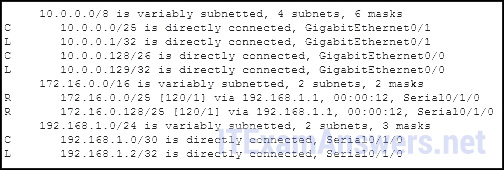

**Choices:**
- **A.** RIP version 2 is running on this router and its RIP neighbor.
- **B.** The metric to the network 172.16.0.0 is 120.
- **C.** RIP version 1 is running on this router and its RIP neighbor.
- **D.** The command no auto-summary has been used on the RIP neighbor router.
- **E.** RIP will advertise two networks to its neighbor.

**Correct Answer:**
RIP version 2 is running on this router and its RIP neighbor.; The command no auto-summary has been used on the RIP neighbor router.

**Explanation:**
The router learned, via RIP, that 172.16.0.0 is variably subnetted, and that there are two subnet and mask entries for that network. This means that RIP version 2 is running on both routers and that the command no auto-summary has been applied on the neighbor router. RIPv2 has an administrative distance of 120 and this router will advertise all connected networks to the neighbor via 192.168.1.1.

---

## Question 17

**Question:**
While configuring RIPv2 on an enterprise network, an engineer enters the command network 192.168.10.0 into router configuration mode. What is the result of entering this command?

**Choices:**
- **A.** The interface of the 192.168.10.0 network is sending version 1 and version 2 updates.
- **B.** The interface of the 192.168.10.0 network is receiving version 1 and version 2 updates.
- **C.** The interface of the 192.168.10.0 network is sending only version 2 updates.
- **D.** The interface of the 192.168.10.0 network is sending RIP hello messages.

**Correct Answer:**
The interface of the 192.168.10.0 network is sending only version 2 updates.

**Explanation:**
The command being entered by the engineer will cause RIPv2 to activate on the interface for the 192.168.10.0 network. If RIPv1 is configured, the router will send only version 1 updates, but will listen for both version 1 and version 2 updates. If RIPv2 is configured, the router will send and listen to only version 2 updates.

---

## Question 18

**Question:**
A destination route in the routing table is indicated with a code D. Which kind of route entry is this?

**Choices:**
- **A.** a static route
- **B.** a route used as the default gateway
- **C.** a network directly connected to a router interface
- **D.** a route dynamically learned through the EIGRP routing protocol

**Correct Answer:**
a route dynamically learned through the EIGRP routing protocol

**Explanation:**
Routes in a routing table are manually created or dynamically learned. Letter D indicates that the route was learned dynamically through the EIGRP routing protocol.

---

## Question 19

**Question:**
Refer to the exhibit. Which interface will be the exit interface to forward a data packet with the destination IP address 172.16.0.66?

**Images:**
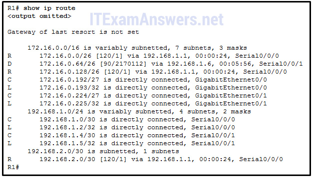

**Choices:**
- **A.** Serial0/0/0
- **B.** Serial0/0/1
- **C.** GigabitEthernet0/0
- **D.** GigabitEthernet0/1

**Correct Answer:**
Serial0/0/1

**Explanation:**
The destination IP address 172.16.0.66 belongs to the network 172.16.0.64/26. In the routing table there is a route learned by EIGRP (identified with code “D”) with 192.168.1.6 as the next-hop address and Serial 0/0/1 as the exiting interface.

---

## Question 20

**Question:**
Which type of route will require a router to perform a recursive lookup?

**Choices:**
- **A.** an ultimate route that is using a next hop IP address on a router that is not using CEF
- **B.** a level 2 child route that is using an exit interface on a router that is not using CEF
- **C.** a level 1 network route that is using a next hop IP address on a router that is using CEF
- **D.** a parent route on a router that is using CEF

**Correct Answer:**
an ultimate route that is using a next hop IP address on a router that is not using CEF

**Explanation:**
When Cisco Express Forwarding (CEF) is not being used on a router, a recursive lookup must be performed when a route using a next-hop IP address is selected as the best pathway to forward data.​

---

## Question 21

**Question:**
Which route is the best match for a packet entering a router with a destination address of 10.16.0.2?

**Choices:**
- **A.** S 10.0.0.0/8 [1/0] via 192.168.0.2
- **B.** S 10.16.0.0/24 [1/0] via 192.168.0.9
- **C.** S 10.16.0.0/16 is directly connected, Ethernet 0/1
- **D.** S 10.0.0.0/16 is directly connected, Ethernet 0/0

**Correct Answer:**
S 10.16.0.0/24 [1/0] via 192.168.0.9

**Explanation:**
Before the administrative distance of a route is compared, the route with the most specific best match is utilized. The 192.168.14.0/26 network contains the best match to the destination IP address of 192.168.14.20 and thus the 192.168.14.0/26 RIP route is utilized over the EIGRP and OSFP routes, regardless of administrative distance.

---

## Question 22

**Question:**
A router is configured to participate in multiple routing protocol: RIP, EIGRP, and OSPF. The router must send a packet to network 192.168.14.0. Which route will be used to forward the traffic?

**Choices:**
- **A.** a 192.168.14.0/26 route that is learned via RIP
- **B.** a 192.168.14.0/24 route that is learned via EIGRP
- **C.** a 192.168.14.0/25 route that is learned via OSPF
- **D.** a 192.168.14.0/25 route that is learned via RIP

**Correct Answer:**
a 192.168.14.0/26 route that is learned via RIP

---

## Question 23

**Question:**
What is different between IPv6 routing table entries compared to IPv4 routing table entries?

**Choices:**
- **A.** IPv6 routing tables include local route entries which IPv4 routing tables do not.
- **B.** By design IPv6 is classless so all routes are effectively level 1 ultimate routes.
- **C.** The selection of IPv6 routes is based on the shortest matching prefix, unlike IPv4 route selection which is based on the longest matching prefix.
- **D.** IPv6 does not use static routes to populate the routing table as used in IPv4.

**Correct Answer:**
By design IPv6 is classless so all routes are effectively level 1 ultimate routes.

**Explanation:**
Routers running IOS release 15 have link local routing table entries for both IPv4 and IPv6. The selection of both IPv6 routes and IPv4 routes is based on the longest matching prefix. The routing tables of both IPv6 and IPv4 use directly connected interfaces, static routes, and dynamically learned routes.

---

## Question 24

**Question:**
Match the dynamic routing protocol component to the characteristic. (Not all options are used.)

**Images:**
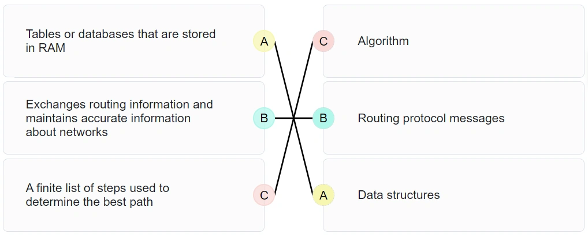

**Explanation:**
data structures – tables or databases that are stored in RAM routing protocol messages – exchanges routing information and maintains accurate information about networks algorithm – a finite list of steps used to determine the best path

---

## Question 25

**Question:**
Match the characteristic to the corresponding type of routing. (Not all options are used.) Place the options in the following order: [+] typically used on stub networks [+] less routing overhead [#] new networks are added automatically to the routing table [#] best choice for large networks Both static and dynamic routing could be used when more than one router is involved. Dynamic routing is when a routing protocol is used. Static routing is when every remote route is entered manually by an administrator into every router in the network topology. Older Version:

**Images:**
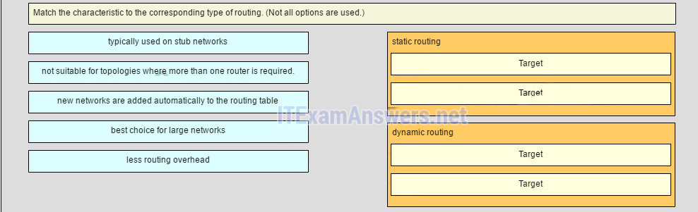
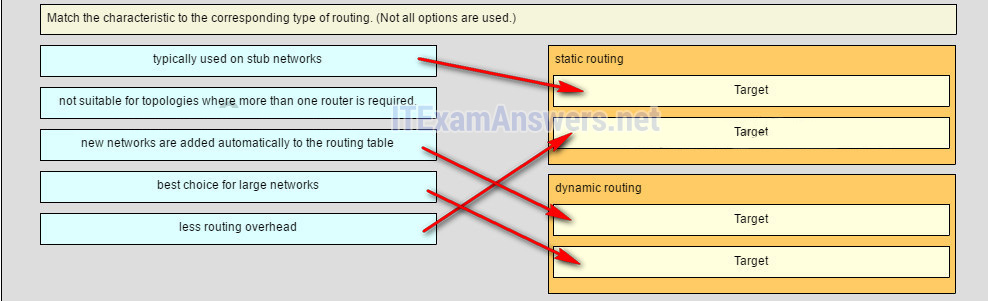

---

## Question 26

**Question:**
Which three statements accurately describe VLAN types? (Choose three).

**Choices:**
- **A.** A management VLAN is any VLAN that is configured to access management features of the switch.
- **B.** A data VLAN is used to carry VLAN management data and user-generated traffic.
- **C.** After the initial boot of an unconfigured switch, all ports are members of the default VLAN.
- **D.** An 802.1Q trunk port, with a native VLAN assigned, supports both tagged and untagged traffic.
- **E.** Voice VLANs are used to support user phone and e-mail traffic on a network.
- **F.** VLAN 1 is always used as the management VLAN.

**Correct Answer:**
A management VLAN is any VLAN that is configured to access management features of the switch.; After the initial boot of an unconfigured switch, all ports are members of the default VLAN.; An 802.1Q trunk port, with a native VLAN assigned, supports both tagged and untagged traffic.

**Explanation:**
A management VLAN is a VLAN that is configured to manage features of the switch. By default, all ports are members of the default VLAN. An 802.1Q trunk port supports both tagged and untagged traffic.

---

## Question 27

**Question:**
Which type of VLAN is used to designate which traffic is untagged when crossing a trunk port?

**Choices:**
- **A.** data
- **B.** default
- **C.** native
- **D.** management

**Correct Answer:**
native

---

## Question 28

**Question:**
What are three primary benefits of using VLANs? (Choose three.)

**Choices:**
- **A.** security
- **B.** a reduction in the number of trunk links
- **C.** cost reduction
- **D.** end user satisfaction
- **E.** improved IT staff efficiency
- **F.** no required configuration

**Correct Answer:**
security; cost reduction; improved IT staff efficiency

---

## Question 29

**Question:**
Refer to the exhibit. A frame is traveling between PC-A and PC-B through the switch. Which statement is true concerning VLAN tagging of the frame?

**Images:**
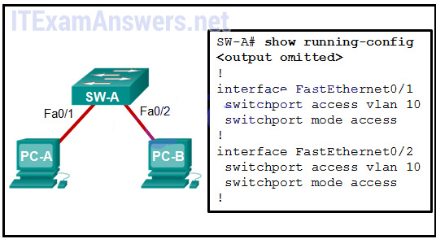

**Choices:**
- **A.** A VLAN tag is added when the frame leaves PC-A.
- **B.** A VLAN tag is added when the frame is accepted by the switch.
- **C.** A VLAN tag is added when the frame is forwarded out the port to PC-B.
- **D.** No VLAN tag is added to the frame.

**Correct Answer:**
No VLAN tag is added to the frame.

---

## Question 30

**Question:**
Which command displays the encapsulation type, the voice VLAN ID, and the access mode VLAN for the Fa0/1 interface?

**Choices:**
- **A.** show vlan brief
- **B.** show interfaces Fa0/1 switchport
- **C.** show mac address-table interface Fa0/1
- **D.** show interfaces trunk

**Correct Answer:**
show interfaces Fa0/1 switchport

---

## Question 31

**Question:**
What must the network administrator do to remove Fast Ethernet port fa0/1 from VLAN 2 and assign it to VLAN 3?

**Choices:**
- **A.** Enter the no vlan 2 and the vlan 3 commands in global configuration mode.
- **B.** Enter the switchport access vlan 3 command in interface configuration mode.
- **C.** Enter the switchport trunk native vlan 3 command in interface configuration mode.
- **D.** Enter the no shutdown in interface configuration mode to return it to the default configuration and then configure the port for VLAN 3.

**Correct Answer:**
Enter the switchport access vlan 3 command in interface configuration mode.

**Explanation:**
There is no need to enter the no shutdown command or remove VLAN 2 using the no vlan 2 command. The switchport trunk command is not used on an access port.

---

## Question 32

**Question:**
A Cisco Catalyst switch has been added to support the use of multiple VLANs as part of an enterprise network. The network technician finds it necessary to clear all VLAN information from the switch in order to incorporate a new network design. What should the technician do to accomplish this task?

**Choices:**
- **A.** Erase the startup configuration and reboot the switch.
- **B.** Erase the running configuration and reboot the switch.
- **C.** Delete the startup configuration and the vlan.dat file in the flash memory of the switch and reboot the switch.
- **D.** Delete the IP address that is assigned to the management VLAN and reboot the switch.

**Correct Answer:**
Delete the startup configuration and the vlan.dat file in the flash memory of the switch and reboot the switch.

**Explanation:**
To restore a Catalyst switch to its factory default condition, unplug all cables except the console and power cable from the switch. Then enter the erase startup-config privileged EXEC mode command followed by the delete vlan.dat command and reboot the switch.

---

## Question 33

**Question:**
Which two characteristics match extended range VLANs? (Choose two.)

**Choices:**
- **A.** CDP can be used to learn and store these VLANs.
- **B.** VLAN IDs exist between 1006 to 4094.
- **C.** They are saved in the running-config file by default.
- **D.** VLANs are initialized from flash memory.
- **E.** They are commonly used in small networks.

**Correct Answer:**
VLAN IDs exist between 1006 to 4094.; They are saved in the running-config file by default.

---

## Question 34

**Question:**
What happens to switch ports after the VLAN to which they are assigned is deleted?

**Choices:**
- **A.** The ports are disabled.
- **B.** The ports are placed in trunk mode.
- **C.** The ports are assigned to VLAN1, the default VLAN.
- **D.** The ports stop communicating with the attached devices.

**Correct Answer:**
The ports stop communicating with the attached devices.

**Explanation:**
Any ports that are not moved to an active VLAN cannot communicate with other hosts after the VLAN is deleted. They must be assigned to an active VLAN or their VLAN must be created.

---

## Question 35

**Question:**
A Cisco switch currently allows traffic tagged with VLANs 10 and 20 across trunk port Fa0/5. What is the effect of issuing a switchport trunk allowed vlan 30 command on Fa0/5?

**Choices:**
- **A.** It allows VLANs 1 to 30 on Fa0/5.
- **B.** It allows VLANs 10, 20, and 30 on Fa0/5.
- **C.** It allows only VLAN 30 on Fa0/5.
- **D.** It allows a native VLAN of 30 to be implemented on Fa0/5.

**Correct Answer:**
It allows only VLAN 30 on Fa0/5.

---

## Question 36

**Question:**
What VLANs are allowed across a trunk when the range of allowed VLANs is set to the default value?

**Choices:**
- **A.** All VLANs will be allowed across the trunk.
- **B.** Only VLAN 1 will be allowed across the trunk.
- **C.** Only the native VLAN will be allowed across the trunk.
- **D.** The switches will negotiate via VTP which VLANs to allow across the trunk.

**Correct Answer:**
All VLANs will be allowed across the trunk.

**Explanation:**
By default, all VLANs, including the native VLAN and untagged traffic, are allowed across a trunk link.

---

## Question 37

**Question:**
Which command should the network administrator implement to prevent the transfer of DTP frames between a Cisco switch and a non-Cisco switch?

**Choices:**
- **A.** S1(config-if)# switchport mode trunk
- **B.** S1(config-if)# switchport nonegotiate
- **C.** S1(config-if)# switchport mode dynamic desirable
- **D.** S1(config-if)# switchport mode access
- **E.** S1(config-if)# switchport trunk allowed vlan none

**Correct Answer:**
S1(config-if)# switchport nonegotiate

---

## Question 38

**Question:**
Under which two occasions should an administrator disable DTP while managing a local area network? (Choose two.)

**Choices:**
- **A.** when connecting a Cisco switch to a non-Cisco switch
- **B.** when a neighbor switch uses a DTP mode of dynamic auto
- **C.** when a neighbor switch uses a DTP mode of dynamic desirable
- **D.** on links that should not be trunking
- **E.** on links that should dynamically attempt trunking

**Correct Answer:**
when connecting a Cisco switch to a non-Cisco switch; on links that should not be trunking

---

## Question 39

**Question:**
In a basic VLAN hopping attack, which switch feature do attackers take advantage of?

**Choices:**
- **A.** an open Telnet connection
- **B.** automatic encapsulation negotiation
- **C.** forwarding of broadcasts
- **D.** the default automatic trunking configuration

**Correct Answer:**
the default automatic trunking configuration

---

## Question 40

**Question:**
Which two Layer 2 security best practices would help prevent VLAN hopping attacks? (Choose two.)

**Choices:**
- **A.** Change the native VLAN number to one that is distinct from all user VLANs and is not VLAN 1.
- **B.** Change the management VLAN to a distinct VLAN that is not accessible by regular users.
- **C.** Statically configure all ports that connect to end-user host devices to be in trunk mode.
- **D.** Disable DTP autonegotiation on end-user ports.
- **E.** Use SSH for all remote management access.

**Correct Answer:**
Change the native VLAN number to one that is distinct from all user VLANs and is not VLAN 1.; Disable DTP autonegotiation on end-user ports.

**Explanation:**
Allowing end-user devices to negotiate trunk settings via DTP can lead to a VLAN hopping attack, so DTP autonegotiation should be disabled on access ports. Configuring a trunk link with a native VLAN that is also used for end-users can lead to VLAN hopping attacks as well. The native VLAN should be set to a VLAN that is not used anywhere else.

---

## Question 41

**Question:**
Refer to the exhibit. Interface Fa0/1 is connected to a PC. Fa0/2 is a trunk link to another switch. All other ports are unused. Which security best practice did the administrator forget to configure?

**Images:**
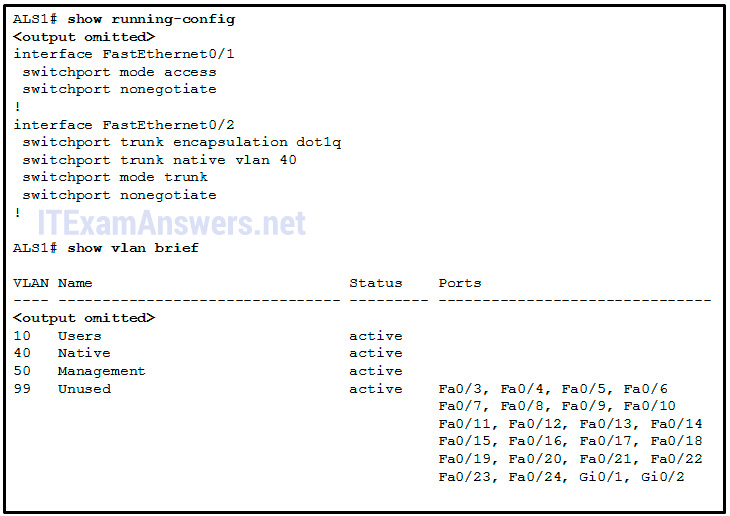

**Choices:**
- **A.** Disable autonegotiation and set ports to either static access or static trunk.
- **B.** Change the native VLAN to a fixed VLAN that is distinct from all user VLANs and to a VLAN number that is not VLAN 1.
- **C.** Configure all unused ports to a ‘black-hole’ VLAN that is not used for anything on the network.
- **D.** All user ports are associated with VLANs distinct from VLAN 1 and distinct from the ‘black-hole’ VLAN.

**Correct Answer:**
All user ports are associated with VLANs distinct from VLAN 1 and distinct from the ‘black-hole’ VLAN.

---

## Question 42

**Question:**
A network administrator is determining the best placement of VLAN trunk links. Which two types of point-to-point connections utilize VLAN trunking? (Choose two.)

**Choices:**
- **A.** between two switches that utilize multiple VLANs
- **B.** between a switch and a client PC
- **C.** between a switch and a server that has an 802.1Q NIC
- **D.** between a switch and a network printer
- **E.** between two switches that share a common VLAN

**Correct Answer:**
between two switches that utilize multiple VLANs; between a switch and a server that has an 802.1Q NIC

---

## Question 43

**Question:**
What is the effect of issuing a switchport access vlan 20 command on the Fa0/18 port of a switch that does not have this VLAN in the VLAN database?

**Choices:**
- **A.** The command will have no effect on the switch.
- **B.** VLAN 20 will be created automatically.
- **C.** An error stating that VLAN 20 does not exist will be displayed and VLAN 20 is not created.
- **D.** Port Fa0/18 will be shut down.

**Correct Answer:**
VLAN 20 will be created automatically.

---

## Question 44

**Question:**
Port Fa0/11 on a switch is assigned to VLAN 30. If the command no switchport access vlan 30 is entered on the Fa0/11 interface, what will happen?

**Choices:**
- **A.** Port Fa0/11 will be shutdown.
- **B.** An error message would be displayed.
- **C.** Port Fa0/11 will be returned to VLAN 1.
- **D.** VLAN 30 will be deleted.

**Correct Answer:**
Port Fa0/11 will be returned to VLAN 1.

---

## Question 45

**Question:**
Which command is used to remove only VLAN 20 from a switch?

**Choices:**
- **A.** delete vlan.dat
- **B.** delete flash:vlan.dat
- **C.** no vlan 20
- **D.** no switchport access vlan 20

**Correct Answer:**
no vlan 20

---

## Question 46

**Question:**
Refer to the exhibit. PC-A and PC-B are both in VLAN 60. PC-A is unable to communicate with PC-B. What is the problem? CCNA 2 Chapter 3 Exam Answer 002 (v5.02, 2015)

**Images:**
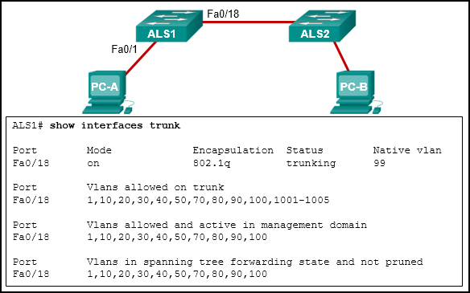

**Choices:**
- **A.** The native VLAN should be VLAN 60.
- **B.** The native VLAN is being pruned from the link.
- **C.** The trunk has been configured with the switchport nonegotiate command.
- **D.** The VLAN that is used by PC-A is not in the list of allowed VLANs on the trunk.

**Correct Answer:**
The VLAN that is used by PC-A is not in the list of allowed VLANs on the trunk.

---

## Question 47

**Question:**
What happens to a port that is associated with VLAN 10 when the administrator deletes VLAN 10 from the switch?

**Choices:**
- **A.** The port becomes inactive.
- **B.** The port goes back to the default VLAN.
- **C.** The port automatically associates itself with the native VLAN.
- **D.** The port creates the VLAN again.

**Correct Answer:**
The port becomes inactive.

---

## Question 48

**Question:**
In a basic VLAN hopping attack, which switch feature do attackers take advantage of?

**Choices:**
- **A.** an open Telnet connection
- **B.** automatic encapsulation negotiation
- **C.** forwarding of broadcasts
- **D.** the default automatic trunking configuration

**Correct Answer:**
the default automatic trunking configuration

---

## Question 49

**Question:**
Which two Layer 2 security best practices would help prevent VLAN hopping attacks? (Choose two.)

**Choices:**
- **A.** Change the native VLAN number to one that is distinct from all user VLANs and is not VLAN 1.
- **B.** Change the management VLAN to a distinct VLAN that is not accessible by regular users.
- **C.** Statically configure all ports that connect to end-user host devices to be in trunk mode.
- **D.** Disable DTP autonegotiation on end-user ports.
- **E.** Use SSH for all remote management access.

**Correct Answer:**
Change the native VLAN number to one that is distinct from all user VLANs and is not VLAN 1.; Disable DTP autonegotiation on end-user ports.

---

## Question 50

**Question:**
Refer to the exhibit. Interface Fa0/1 is connected to a PC. Fa0/2 is a trunk link to another switch. All other ports are unused. Which security best practice did the administrator forget to configure?

**Images:**
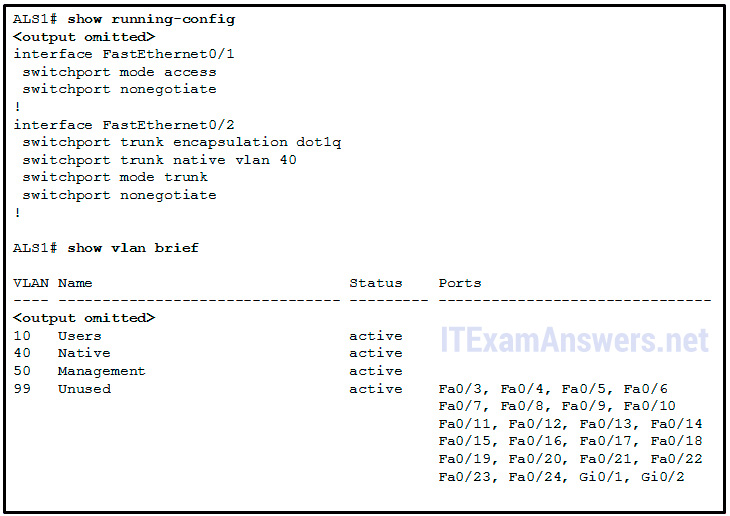

**Choices:**
- **A.** Disable autonegotiation and set ports to either static access or static trunk.
- **B.** Change the native VLAN to a fixed VLAN that is distinct from all user VLANs and to a VLAN number that is not VLAN 1.
- **C.** Configure all unused ports to a ‘black-hole’ VLAN that is not used for anything on the network.
- **D.** All user ports are associated with VLANs distinct from VLAN 1 and distinct from the ‘black-hole’ VLAN.

**Correct Answer:**
All user ports are associated with VLANs distinct from VLAN 1 and distinct from the ‘black-hole’ VLAN.

---

## Question 51

**Question:**
A network administrator is determining the best placement of VLAN trunk links. Which two types of point-to-point connections utilize VLAN trunking?​ (Choose two.)

**Choices:**
- **A.** between two switches that share a common VLAN
- **B.** between a switch and a server that has an 802.1Q NIC
- **C.** between a switch and a client PC
- **D.** between a switch and a network printer
- **E.** between two switches that utilize multiple VLANs

**Correct Answer:**
between a switch and a server that has an 802.1Q NIC; between two switches that utilize multiple VLANs

---

## Question 52

**Question:**
What happens to a port that is associated with VLAN 10 when the administrator deletes VLAN 10 from the switch?

**Choices:**
- **A.** The port automatically associates itself with the native VLAN.
- **B.** The port creates the VLAN again.
- **C.** The port goes back to the default VLAN.
- **D.** The port becomes inactive.

**Correct Answer:**
The port becomes inactive.

---

## Question 53

**Question:**
Refer to the exhibit. Interface Fa0/1 is connected to a PC. Fa0/2 is a trunk link to another switch. All other ports are unused. Which security best practice did the administrator forget to configure?

**Images:**

**Choices:**
- **A.** Configure all unused ports to a ‘black-hole’ VLAN that is not used for anything on the network.
- **B.** Disable autonegotiation and set ports to either static access or static trunk.
- **C.** Change the native VLAN to a fixed VLAN that is distinct from all user VLANs and to a VLAN number that is not VLAN 1.
- **D.** All user ports are associated with VLANs distinct from VLAN 1 and distinct from the ‘black-hole’ VLAN.

**Correct Answer:**
All user ports are associated with VLANs distinct from VLAN 1 and distinct from the ‘black-hole’ VLAN.

---

## Question 54

**Question:**
Which command is used to remove only VLAN 20 from a switch?

**Choices:**
- **A.** no switchport access vlan 20
- **B.** delete flash:vlan.dat
- **C.** no vlan 20
- **D.** delete vlan.dat

**Correct Answer:**
no vlan 20

---

## Question 55

**Question:**
What is the effect of issuing a switchport access vlan 20 command on the Fa0/18 port of a switch that does not have this VLAN in the VLAN database?

**Choices:**
- **A.** VLAN 20 will be created automatically.
- **B.** The command will have no effect on the switch.
- **C.** Port Fa0/18 will be shut down.
- **D.** An error stating that VLAN 20 does not exist will be displayed and VLAN 20 is not created.

**Correct Answer:**
VLAN 20 will be created automatically.

---

## Question 56

**Question:**
Place the options in the following order: – not scored – dynamic auto nonegotiate dynamic desirable trunk

**Images:**
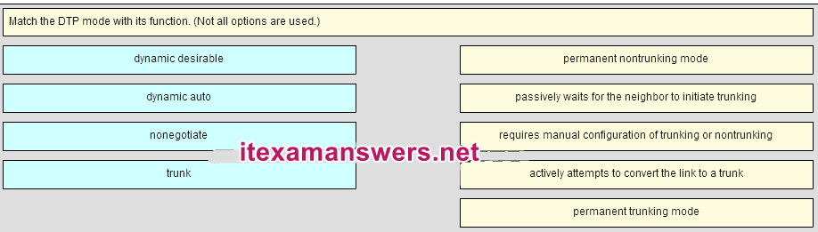
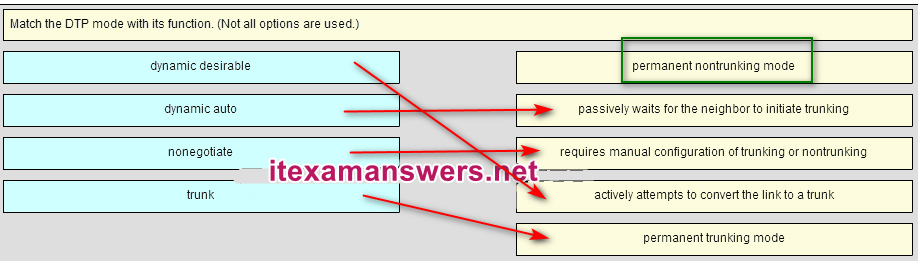

---

## Question 57

**Question:**
Port Fa0/11 on a switch is assigned to VLAN 30. If the command no switchport access vlan 30 is entered on the Fa0/11 interface, what will happen?

**Choices:**
- **A.** Port Fa0/11 will be returned to VLAN 1.
- **B.** VLAN 30 will be deleted.
- **C.** An error message would be displayed.
- **D.** Port Fa0/11 will be shutdown.

**Correct Answer:**
Port Fa0/11 will be returned to VLAN 1.

---

## Question 58

**Question:**
Which two Layer 2 security best practices would help prevent VLAN hopping attacks? (Choose two.)

**Choices:**
- **A.** Disable DTP autonegotiation on end-user ports.
- **B.** Change the management VLAN to a distinct VLAN that is not accessible by regular users.
- **C.** Statically configure all ports that connect to end-user host devices to be in trunk mode.
- **D.** Change the native VLAN number to one that is distinct from all user VLANs and is not VLAN 1.
- **E.** Use SSH for all remote management access.

**Correct Answer:**
Disable DTP autonegotiation on end-user ports.; Change the native VLAN number to one that is distinct from all user VLANs and is not VLAN 1.

---

## Question 59

**Question:**
In a basic VLAN hopping attack, which switch feature do attackers take advantage of?

**Choices:**
- **A.** automatic encapsulation negotiation
- **B.** the default automatic trunking configuration
- **C.** an open Telnet connection
- **D.** forwarding of broadcasts

**Correct Answer:**
the default automatic trunking configuration

---

## Question 60

**Question:**
Refer to the exhibit. PC-A and PC-B are both in VLAN 60. PC-A is unable to communicate with PC-B. What is the problem?

**Images:**
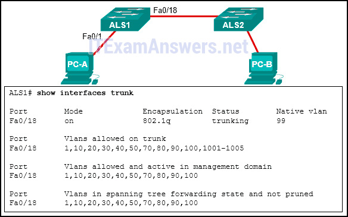

**Choices:**
- **A.** The native VLAN is being pruned from the link.
- **B.** The VLAN that is used by PC-A is not in the list of allowed VLANs on the trunk.
- **C.** The trunk has been configured with the switchport nonegotiate command.
- **D.** The native VLAN should be VLAN 60.

**Correct Answer:**
The VLAN that is used by PC-A is not in the list of allowed VLANs on the trunk.

---

## Question 61

**Question:**
Under which two occasions should an administrator disable DTP while managing a local area network? (Choose two.)

**Choices:**
- **A.** when a neighbor switch uses a DTP mode of dynamic desirable
- **B.** on links that should dynamically attempt trunking
- **C.** when connecting a Cisco switch to a non-Cisco switch
- **D.** when a neighbor switch uses a DTP mode of dynamic auto
- **E.** on links that should not be trunking

**Correct Answer:**
when connecting a Cisco switch to a non-Cisco switch; on links that should not be trunking

---

## Question 62

**Question:**
Open the PT Activity. Perform the tasks in the activity instructions and then answer the question. Which PCs will receive the broadcast sent by PC-C?

**Images:**
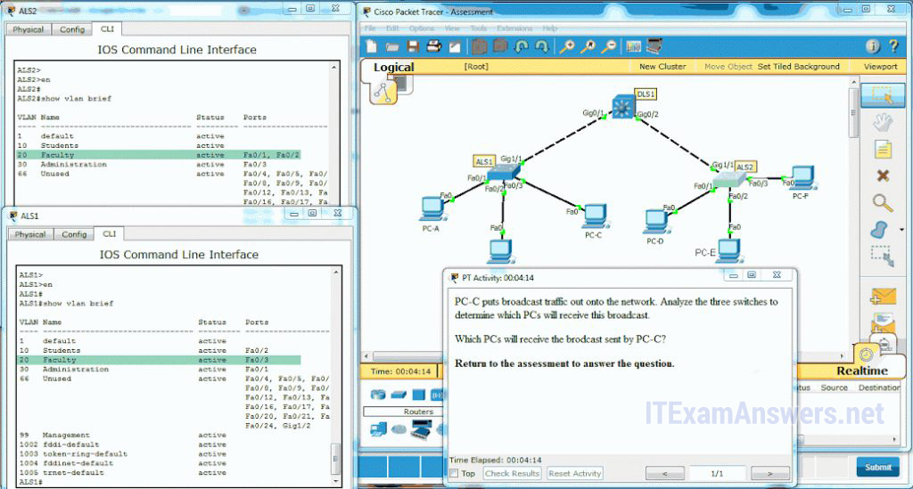

**Choices:**
- **A.** PC-D, PC-E
- **B.** PC-A, PC-B, PC-D, PC-E
- **C.** PC-A, PC-B
- **D.** PC-A, PC-B, PC-D, PC-E, PC-F
- **E.** PC-A, PC-B, PC-E

**Correct Answer:**
PC-D, PC-E

---

## Question 63

**Question:**
Which two statements are true about VLAN implementation? (Choose two.)

**Choices:**
- **A.** The network load increases significantly because of added trunking information.
- **B.** Devices in one VLAN do not hear the broadcasts from devices in another VLAN.
- **C.** The size of the collision domain is reduced.
- **D.** VLANs logically group hosts, regardless of physical location.
- **E.** The number of required switches in a network decreases.

**Correct Answer:**
Devices in one VLAN do not hear the broadcasts from devices in another VLAN.; VLANs logically group hosts, regardless of physical location.

---

## Question 64

**Question:**
Which switch feature ensures that no unicast, multicast, or broadcast traffic is passed between ports that are configured with this feature?

**Choices:**
- **A.** switch port security
- **B.** PVLAN protected port
- **C.** ACL
- **D.** VLAN

**Correct Answer:**
PVLAN protected port

---

## Question 65

**Question:**
Fill in the blank. Use the full command syntax. The ” show vlan brief ” command displays the VLAN assignment for all ports as well as the existing VLANs on the switch.

---

## Question 66

**Question:**
Which combination of DTP modes set on adjacent Cisco switches will cause the link to become an access link instead of a trunk link?

**Choices:**
- **A.** dynamic auto – dynamic auto
- **B.** dynamic desirable – dynamic desirable
- **C.** dynamic desirable – trunk
- **D.** dynamic desirable – dynamic auto

**Correct Answer:**
dynamic auto – dynamic auto

---

## Question 67

**Question:**
An administrator has determined that the traffic from a switch that corresponds to a VLAN is not being received on another switch over a trunk link. What could be the problem?

**Choices:**
- **A.** trunk mode mismatch
- **B.** allowed VLANS on trunks
- **C.** native VLANS mismatch
- **D.** dynamic desirable mode on one of the trunk links

**Correct Answer:**
allowed VLANS on trunks

**Explanation:**
The list of allowed VLANs on a trunk is configured by the administrator by issuing the switchport trunk allowed vlan command.

---

## Question 68

**Question:**
What is the default DTP mode on Cisco 2960 and 3560 switches?

**Choices:**
- **A.** trunk
- **B.** dynamic auto
- **C.** access
- **D.** dynamic desirable

**Correct Answer:**
dynamic auto

---

## Question 69

**Question:**
Refer to the exhibit. What can be determined from the output that is shown?

**Images:**
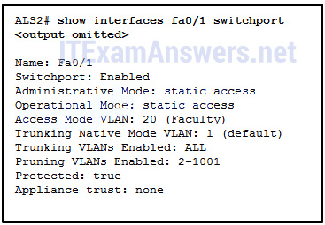

**Choices:**
- **A.** Interface FastEthernet 0/1 is configured with the switchport protected command.
- **B.** Interface FastEthernet 0/1 is configured with the nonegotiate keyword.
- **C.** Interface FastEthernet 0/1 is trunking and using Native VLAN 1.
- **D.** Interface FastEthernet 0/1 is configured as dynamic auto by the administrator.

**Correct Answer:**
Interface FastEthernet 0/1 is configured with the switchport protected command.

---

## Question 70

**Question:**
Match the IEEE 802.1Q standard VLAN tag field in the description. (not all options are used) Place the options in the following order: User Priority – value that supports level or service implementation Type – value for the tag protocol ID value Canonical Format Identifier – identifier that enables Token Ring frames to be carried across Ethernet Links – not scored – -value for the application protocol of the user data in a frame VLAN ID – VLAN number

**Images:**
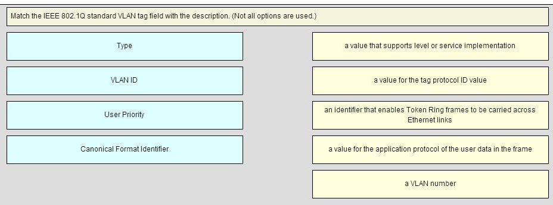
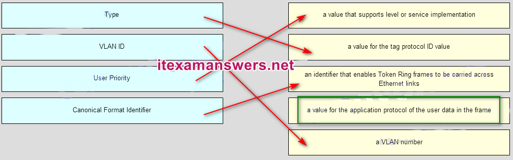

---

## Question 71

**Question:**
Which two modes does Cisco recommend when configuring a particular switch port? (Choose two.)

**Choices:**
- **A.** trunk
- **B.** IEEE 802.1Q
- **C.** access
- **D.** Gigabit Ethernet
- **E.** FastEthernet
- **F.** ISL

**Correct Answer:**
trunk; access

**Explanation:**
Some Cisco switches are automatically configured for auto negotiation of a trunk. A best practice for configuring a port is to manually configure the port for either access mode or trunking mode. Download PDF File below: ITexamanswers.net – CCNA 2 (v5.1 + v6.0) Chapter 3 Exam Answers Full.pdf 1.92 MB 10112 downloads

---
