# CCNA 2 v2 - CCNA 2 - Chapter 4

## Question 1

**Question:**
A network designer must provide a rationale to a customer for a design which will move an enterprise from a flat network topology to a hierarchical network topology. Which two features of the hierarchical design make it the better choice? (Choose two.)

**Choices:**
- **A.** lower bandwidth requirements
- **B.** reduced cost for equipment and user training
- **C.** easier to provide redundant links to ensure higher availability
- **D.** less required equipment to provide the same performance levels
- **E.** simpler deployment for additional switch equipment

**Correct Answer:**
easier to provide redundant links to ensure higher availability; simpler deployment for additional switch equipment

**Explanation:**
A hierarchical design for switches helps network administrators when planning and deploying a network expansion, performing fault isolation when a problem occurs, and providing resiliency when traffic levels are high. A good hierarchical design has redundancy when it can be afforded so that one switch does not cause all networks to be down.

---

## Question 2

**Question:**
What is a collapsed core in a network design?

**Choices:**
- **A.** a combination of the functionality of the access and distribution layers
- **B.** a combination of the functionality of the distribution and core layers
- **C.** a combination of the functionality of the access and core layers
- **D.** a combination of the functionality of the access, distribution, and core layers

**Correct Answer:**
a combination of the functionality of the distribution and core layers

**Explanation:**
A collapsed core design is appropriate for a small, single building business. This type of design uses two layers (the collapsed core and distribution layers consolidated into one layer and the access layer). Larger businesses use the traditional three-tier switch design model.

---

## Question 3

**Question:**
What is a definition of a two-tier LAN network design?

**Choices:**
- **A.** access and core layers collapsed into one tier, and the distribution layer on a separate tier
- **B.** access and distribution layers collapsed into one tier, and the core layer on a separate tier
- **C.** distribution and core layers collapsed into one tier, and the access layer on a separate tier
- **D.** access, distribution, and core layers collapsed into one tier, with a separate backbone layer

**Correct Answer:**
distribution and core layers collapsed into one tier, and the access layer on a separate tier

**Explanation:**
Maintaining three separate network tiers is not always required or cost-efficient. All network designs require an access layer, but a two-tier design can collapse the distribution and core layers into one layer to serve the needs of a small location with few users.

---

## Question 4

**Question:**
What is a basic function of the Cisco Borderless Architecture distribution layer?

**Choices:**
- **A.** acting as a backbone
- **B.** aggregating all the campus blocks
- **C.** aggregating Layer 3 routing boundaries
- **D.** providing access to end user devices

**Correct Answer:**
aggregating Layer 3 routing boundaries

**Explanation:**
One of the basic functions of the distribution layer of the Cisco Borderless Architecture is to perform routing between different VLANs. Acting as a backbone and aggregating campus blocks are functions of the core layer. Providing access to end user devices is a function of the access layer.

---

## Question 5

**Question:**
Which two previously independent technologies should a network administrator attempt to combine after choosing to upgrade to a converged network infrastructure? (Choose two.)

**Choices:**
- **A.** user data traffic
- **B.** VoIP phone traffic
- **C.** scanners and printers
- **D.** mobile cell phone traffic
- **E.** electrical system

**Correct Answer:**
user data traffic; VoIP phone traffic

**Explanation:**
A converged network provides a single infrastructure that combines voice, video, and data. Analog phones, user data, and point-to-point video traffic are all contained within the single network infrastructure of a converged network.

---

## Question 6

**Question:**
A local law firm is redesigning the company network so that all 20 employees can be connected to a LAN and to the Internet. The law firm would prefer a low cost and easy solution for the project. What type of switch should be selected?

**Choices:**
- **A.** fixed configuration
- **B.** modular configuration
- **C.** stackable configuration
- **D.** StackPower
- **E.** StackWise

**Correct Answer:**
fixed configuration

**Explanation:**
By looking at the graphic in 1.1.2.2 #2 and #3 and comparing those photos to the graphics used in the Cisco switch design model shown in 1.1.1.5 #2, you can see that the smaller rack unit fixed configuration switch is used as an access layer switch. The modular configuration switch would be used at the distribution and core layers.

---

## Question 7

**Question:**
What are two advantages of modular switches over fixed-configuration switches? (Choose two.)

**Choices:**
- **A.** lower cost per switch
- **B.** increased scalability
- **C.** lower forwarding rates
- **D.** need for fewer power outlets
- **E.** availability of multiple ports for bandwidth aggregation

**Correct Answer:**
increased scalability; need for fewer power outlets

**Explanation:**
Fixed-configuration switches, although lower in price, have a designated number of ports and no ability to add ports. They also typically provide fewer high-speed ports. In order to scale switching on a network that consists of fixed-configuration switches, more switches need to be purchased. This increases the number of power outlets that need to be used. Modular switches can be scaled simply by purchasing additional line cards. Bandwidth aggregation is also easier, because the backplane of the chassis can provide the bandwidth that is needed for the switch port line cards.

---

## Question 8

**Question:**
Which type of address does a switch use to build the MAC address table?

**Choices:**
- **A.** destination IP address
- **B.** source IP address
- **C.** destination MAC address
- **D.** source MAC address

**Correct Answer:**
source MAC address

**Explanation:**
When a switch receives a frame with a source MAC address that is not in the MAC address table, the switch will add that MAC address to the table and map that address to a specific port. Switches do not use IP addressing in the MAC address table.

---

## Question 9

**Question:**
Which network device can be used to eliminate collisions on an Ethernet network?

**Choices:**
- **A.** firewall
- **B.** hub
- **C.** router
- **D.** switch

**Correct Answer:**
switch

**Explanation:**
A switch provides microsegmentation so that no other device competes for the same Ethernet network bandwidth.

---

## Question 10

**Question:**
What two criteria are used by a Cisco LAN switch to decide how to forward Ethernet frames? (Choose two.)

**Choices:**
- **A.** path cost
- **B.** egress port
- **C.** ingress port
- **D.** destination IP address
- **E.** destination MAC address

**Correct Answer:**
ingress port; destination MAC address

**Explanation:**
Cisco LAN switches use the MAC address table to make decisions of traffic forwarding. The decisions are based on the ingress port and the destination MAC address of the frame. The ingress port information is important because it carries the VLAN to which the port belongs.

---

## Question 11

**Question:**
Refer to the exhibit. Consider that the main power has just been restored. PC3 issues a broadcast IPv4 DHCP request. To which port will SW1 forward this request?​

**Images:**
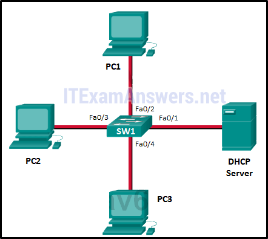

**Choices:**
- **A.** to Fa0/1 only​
- **B.** to Fa0/1 and Fa0/2 only
- **C.** to Fa0/1, Fa0/2, and Fa0/3 only
- **D.** to Fa0/1, Fa0/2, Fa0/3, and Fa0/4
- **E.** to Fa0/1, Fa0/2, and Fa0/4 only​

**Correct Answer:**
to Fa0/1, Fa0/2, and Fa0/3 only

**Explanation:**
When a switch receives a broadcast frame , such as a DHCP Discover request, it follows a specific forwarding rule: it floods the frame out of all available ports in the same VLAN except for the port where the frame entered the switch (the ingress port ). In this star topology, PC3 sends the request through port Fa0/4 ; therefore, SW1 will forward that broadcast to all other active ports, which are Fa0/1 (the DHCP Server), Fa0/2 (PC1), and Fa0/3 (PC2). Although the restoration of power means the switch is undergoing the STP convergence process, the logic for broadcast forwarding remains defined by the exclusion of the source port.

---

## Question 12

**Question:**
What is one function of a Layer 2 switch?

**Choices:**
- **A.** forwards data based on logical addressing
- **B.** duplicates the electrical signal of each frame to every port
- **C.** learns the port assigned to a host by examining the destination MAC address
- **D.** determines which interface is used to forward a frame based on the destination MAC address

**Correct Answer:**
determines which interface is used to forward a frame based on the destination MAC address

**Explanation:**
A switch builds a MAC address table of MAC addresses and associated port numbers by examining the source MAC address found in inbound frames. To forward a frame onward, the switch examines the destination MAC address, looks in the MAC address for a port number associated with that destination MAC address, and sends it to the specific port. If the destination MAC address is not in the table, the switch forwards the frame out all ports except the inbound port that originated the frame.

---

## Question 13

**Question:**
Refer to the exhibit. How is a frame sent from PCA forwarded to PCC if the MAC address table on switch SW1 is empty?

**Images:**
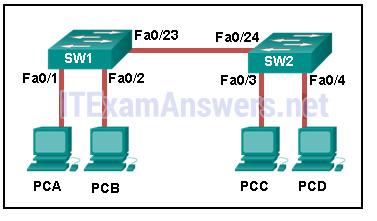

**Choices:**
- **A.** SW1 floods the frame on all ports on the switch, excluding the interconnected port to switch SW2 and the port through which the frame entered the switch.
- **B.** SW1 floods the frame on all ports on SW1, excluding the port through which the frame entered the switch.
- **C.** SW1 forwards the frame directly to SW2. SW2 floods the frame to all ports connected to SW2, excluding the port through which the frame entered the switch.
- **D.** SW1 drops the frame because it does not know the destination MAC address.

**Correct Answer:**
SW1 floods the frame on all ports on SW1, excluding the port through which the frame entered the switch.

**Explanation:**
When a switch powers on, the MAC address table is empty. The switch builds the MAC address table by examining the source MAC address of incoming frames. The switch forwards based on the destination MAC address found in the frame header. If a switch has no entries in the MAC address table or if the destination MAC address is not in the switch table, the switch will forward the frame out all ports except the port that brought the frame into the switch.

---

## Question 14

**Question:**
A small publishing company has a network design such that when a broadcast is sent on the LAN, 200 devices receive the transmitted broadcast. How can the network administrator reduce the number of devices that receive broadcast traffic?

**Choices:**
- **A.** Add more switches so that fewer devices are on a particular switch.
- **B.** Replace the switches with switches that have more ports per switch. This will allow more devices on a particular switch.
- **C.** Segment the LAN into smaller LANs and route between them.
- **D.** Replace at least half of the switches with hubs to reduce the size of the broadcast domain.

**Correct Answer:**
Segment the LAN into smaller LANs and route between them.

**Explanation:**
By dividing the one big network into two smaller network, the network administrator has created two smaller broadcast domains. When a broadcast is sent on the network now, the broadcast will only be sent to the devices on the same Ethernet LAN. The other LAN will not receive the broadcast.

---

## Question 15

**Question:**
Refer to the exhibit. How many broadcast domains are displayed?

**Images:**
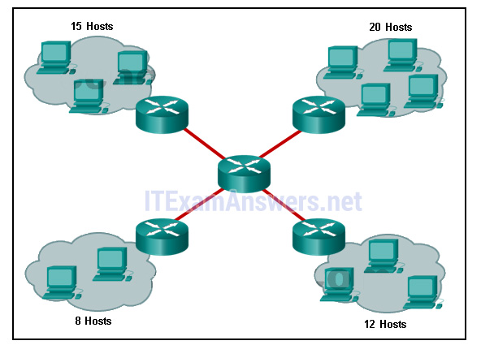

**Choices:**
- **A.** 1
- **B.** 4
- **C.** 8
- **D.** 16
- **E.** 55

**Correct Answer:**
8

**Explanation:**
A router defines a broadcast boundary, so every link between two routers is a broadcast domain. In the exhibit, 4 links between routers make 4 broadcast domains. Also, each LAN that is connected to a router is a broadcast domain. The 4 LANs in the exhibit result in 4 more broadcast domains, so there are 8 broadcast domains in all.

---

## Question 16

**Question:**
Which solution would help a college alleviate network congestion due to collisions?

**Choices:**
- **A.** a firewall that connects to two Internet providers
- **B.** a high port density switch
- **C.** a router with two Ethernet ports
- **D.** a router with three Ethernet ports

**Correct Answer:**
a high port density switch

**Explanation:**
Switches provide microsegmentation so that one device does not compete for the same Ethernet network bandwidth with another network device, thus practically eliminating collisions. A high port density switch provides very fast connectivity for many devices.

---

## Question 17

**Question:**
Which network device can serve as a boundary to divide a Layer 2 broadcast domain?

**Choices:**
- **A.** router
- **B.** Ethernet bridge
- **C.** Ethernet hub
- **D.** access point

**Correct Answer:**
router

**Explanation:**
Layer 1 and 2 devices (LAN switch and Ethernet hub) and access point devices do not filter MAC broadcast frames. Only a Layer 3 device, such as a router, can divide a Layer 2 broadcast domain.

---

## Question 18

**Question:**
What is the destination address in the header of a broadcast frame?

**Choices:**
- **A.** 0.0.0.0
- **B.** 255.255.255.255
- **C.** 11-11-11-11-11-11
- **D.** FF-FF-FF-FF-FF-FF

**Correct Answer:**
FF-FF-FF-FF-FF-FF

**Explanation:**
In a Layer 2 broadcast frame, the destination MAC address (contained in the frame header) is set to all binary ones, therefore, the format of FF-FF-FF-FF-FF-FF. The binary format of 11 in hexadecimal is 00010001. 255.255.255.255 and 0.0.0.0 are IP addresses.

---

## Question 19

**Question:**
Which statement describes a result after multiple Cisco LAN switches are interconnected?

**Choices:**
- **A.** The broadcast domain expands to all switches.
- **B.** One collision domain exists per switch.
- **C.** Frame collisions increase on the segments connecting the switches.
- **D.** There is one broadcast domain and one collision domain per switch.

**Correct Answer:**
The broadcast domain expands to all switches.

**Explanation:**
In Cisco LAN switches, the microsegmentation makes it possible for each port to represent a separate segment and thus each switch port represents a separate collision domain. This fact will not change when multiple switches are interconnected. However, LAN switches do not filter broadcast frames. A broadcast frame is flooded to all ports. Interconnected switches form one big broadcast domain.

---

## Question 20

**Question:**
What does the term “port density” represent for an Ethernet switch?

**Choices:**
- **A.** the memory space that is allocated to each switch port
- **B.** the number of available ports
- **C.** the numbers of hosts that are connected to each switch port
- **D.** the speed of each port

**Correct Answer:**
the number of available ports

**Explanation:**
The term port density represents the number of ports available in a switch. A one rack unit access switch can have up to 48 ports. Larger switches may support hundreds of ports.

---

## Question 21

**Question:**
What are two reasons a network administrator would segment a network with a Layer 2 switch? (Choose two.)

**Choices:**
- **A.** to create fewer collision domains
- **B.** to enhance user bandwidth
- **C.** to create more broadcast domains
- **D.** to eliminate virtual circuits
- **E.** to isolate traffic between segments
- **F.** to isolate ARP request messages from the rest of the network

**Correct Answer:**
to enhance user bandwidth; to isolate traffic between segments

**Explanation:**
A switch has the ability of creating temporary point-to-point connections between the directly-attached transmitting and receiving network devices. The two devices have full-bandwidth full-duplex connectivity during the transmission.

---

## Question 22

**Question:**
Fill in the blank. A converged network is one that uses the same infrastructure to carry voice, data, and video signals.

---

## Question 23

**Question:**
Match the borderless switched network guideline description to the principle. (Not all options are used.) Place the options in the following order: allows intelligent traffic load sharing by using all network resources -> flexibility facilitates understanding the role of each device at every tier, simplifies deployment, operation, management, and reduces fault domains at every tier -> hierarchical allows seamless network expansion and integrated service enablement on an on-demand basis -> modularity satisfies user expectations for keeping the network always on -> resiliency

**Images:**
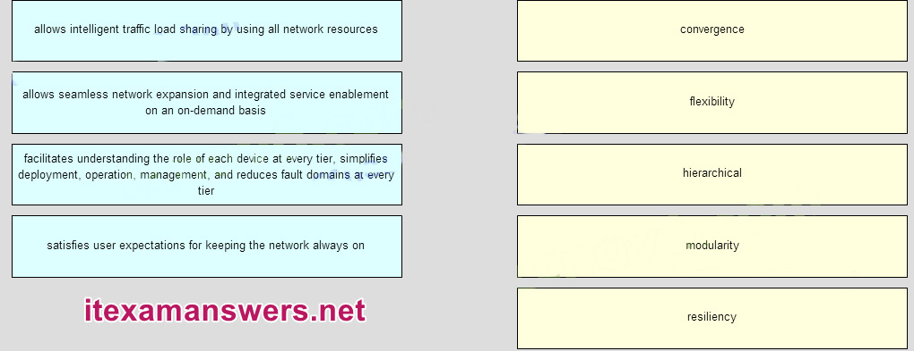
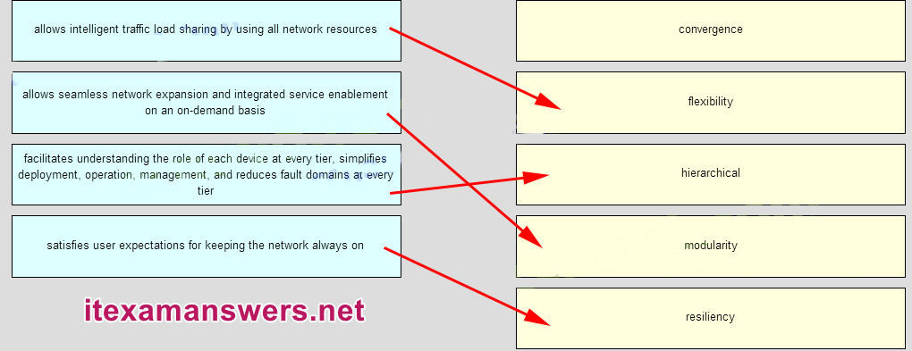

---

## Question 24

**Question:**
Match the functions to the corresponding layers. (Not all options are used.) Place the options in the following order: Access layer [+] represents the network edge [+] provides network access to the user Distribution layer [#] implements network access policy [#] establishes Layer 3 routing boundaries Core layer [*] provides high-speed backbone connectivity [*] functions as an aggregator for all the campus blocks

**Images:**
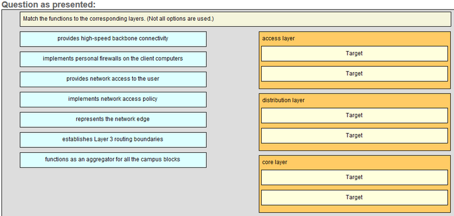
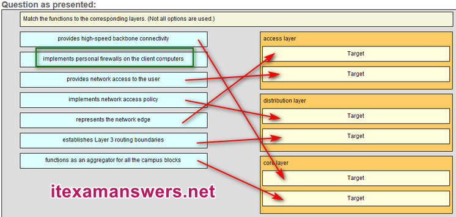

---

## Question 25

**Question:**
Match the forwarding characteristic to its type. (Not all options are used.) Place the options in the following order: cut-throught: +appropriate for high perfomance computing applications +forwarding process can be begin after receiving the destination address +may forward invalid frames store-and-forward: #error checking before forwarding #forwarding process only begins after receiving the entire frame #only forwards valid frames Older Version:

**Images:**
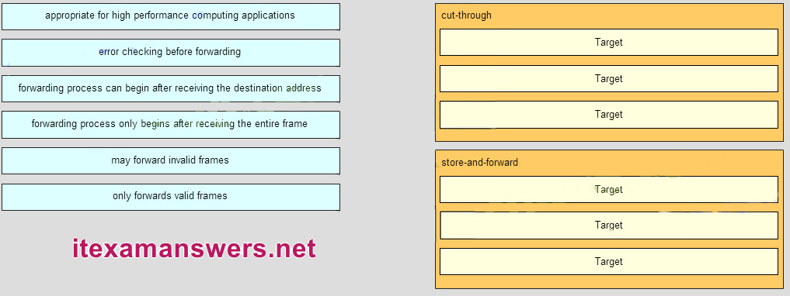
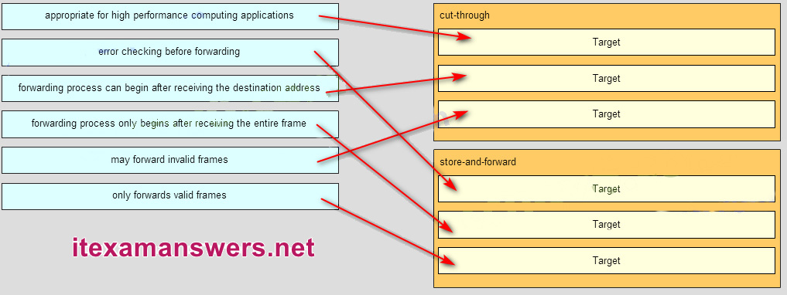

---

## Question 26

**Question:**
What are two functions of a router? (Choose two.)

**Choices:**
- **A.** It connects multiple IP networks.
- **B.** It controls the flow of data via the use of Layer 2 addresses.
- **C.** It determines the best path to send packets.
- **D.** It manages the VLAN database.
- **E.** It increases the size of the broadcast domain.

**Correct Answer:**
It connects multiple IP networks.; It determines the best path to send packets.

---

## Question 27

**Question:**
Which two statements correctly describe the concepts of administrative distance and metric? (Choose two.)

**Choices:**
- **A.** Administrative distance refers to the trustworthiness of a particular route.
- **B.** A router first installs routes with higher administrative distances.
- **C.** The value of the administrative distance can not be altered by the network administrator.
- **D.** Routes with the smallest metric to a destination indicate the best path.
- **E.** The metric is always determined based on hop count.
- **F.** The metric varies depending which Layer 3 protocol is being routed, such as IP.

**Correct Answer:**
Administrative distance refers to the trustworthiness of a particular route.; Routes with the smallest metric to a destination indicate the best path.

**Explanation:**
A metric is calculated by a routing protocol and is used to determine the best path (smallest metric value) to a remote network. Administrative distance (AD) is used when a router has two or more routes to a remote destination that were learned from different sources. The source with the lowest AD is installed in the routing table.

---

## Question 28

**Question:**
In order for packets to be sent to a remote destination, what three pieces of information must be configured on a host? (Choose three.)

**Choices:**
- **A.** hostname
- **B.** IP address
- **C.** subnet mask
- **D.** default gateway
- **E.** DNS server address
- **F.** DHCP server address

**Correct Answer:**
IP address; subnet mask; default gateway

---

## Question 29

**Question:**
Which software is used for a network administrator to make the initial router configuration securely?

**Choices:**
- **A.** SSH client software
- **B.** Telnet client software
- **C.** HTTPS client software
- **D.** terminal emulation client software

**Correct Answer:**
terminal emulation client software

---

## Question 30

**Question:**
Refer to the exhibit. PC A sends a request to Server B. What IPv4 address is used in the destination field in the packet as the packet leaves PC A?

**Images:**
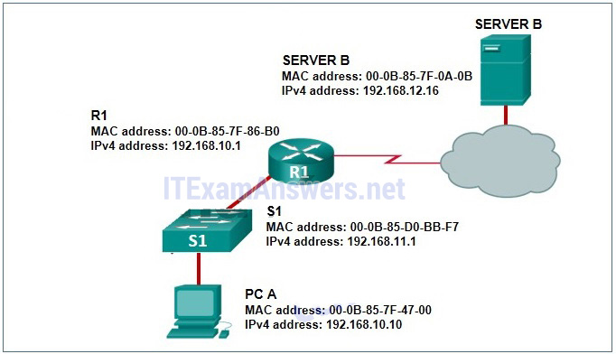

**Choices:**
- **A.** 192.168.10.10
- **B.** 192.168.11.1
- **C.** 192.168.10.1
- **D.** 192.168.12.16

**Correct Answer:**
192.168.12.16

---

## Question 31

**Question:**
Refer to the exhibit. A network administrator has configured R1 as shown. When the administrator checks the status of the serial interface, the interface is shown as being administratively down. What additional command must be entered on the serial interface of R1 to bring the interface up?

**Images:**
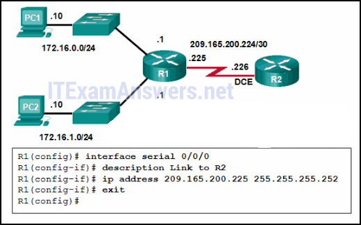

**Choices:**
- **A.** IPv6 enable
- **B.** clockrate 128000
- **C.** end
- **D.** no shutdown

**Correct Answer:**
no shutdown

---

## Question 32

**Question:**
What is a characteristic of an IPv4 loopback interface on a Cisco IOS router?​

**Choices:**
- **A.** The no shutdown command is required to place this interface in an UP state.​
- **B.** It is a logical interface internal to the router.
- **C.** Only one loopback interface can be enabled on a router.​
- **D.** It is assigned to a physical port and can be connected to other devices.

**Correct Answer:**
It is a logical interface internal to the router.

**Explanation:**
The loopback interface is a logical interface internal to the router and is automatically placed in an UP state, as long as the router is functioning. It is not assigned to a physical port and can therefore never be connected to any other device. Multiple loopback interfaces can be enabled on a router.

---

## Question 33

**Question:**
What two pieces of information are displayed in the output of the show ip interface brief command? (Choose two.)

**Choices:**
- **A.** IP addresses
- **B.** MAC addresses
- **C.** Layer 1 statuses
- **D.** next-hop addresses
- **E.** interface descriptions
- **F.** speed and duplex settings

**Correct Answer:**
IP addresses; Layer 1 statuses

---

## Question 34

**Question:**
What type of network uses one common infrastructure to carry voice, data, and video signals?

**Choices:**
- **A.** borderless
- **B.** converged
- **C.** managed
- **D.** switched

**Correct Answer:**
converged

**Explanation:**
A converged network has only one physical network to install and manage. This results in substantial savings over the installation and management of separate voice, video, and data networks.

---

## Question 35

**Question:**
A packet moves from a host on one network to a device on a remote network within the same company. If NAT is not performed on the packet, which two items remain unchanged during the transfer of the packet from source to destination? (Choose two.)

**Choices:**
- **A.** destination IP address
- **B.** source ARP table
- **C.** source IP address
- **D.** source MAC address
- **E.** destination MAC address
- **F.** Layer 2 header

**Correct Answer:**
destination IP address; source IP address

---

## Question 36

**Question:**
Which two items are used by a host device when performing an ANDing operation to determine if a destination address is on the same local network? (Choose two.)

**Choices:**
- **A.** destination IP address
- **B.** destination MAC address
- **C.** source MAC address
- **D.** subnet mask
- **E.** network number

**Correct Answer:**
destination IP address; subnet mask

---

## Question 37

**Question:**
Refer to the exhibit. If PC1 is sending a packet to PC2 and routing has been configured between the two routers, what will R1 do with the Ethernet frame header attached by PC1?

**Images:**
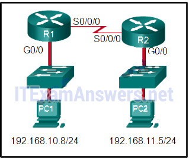

**Choices:**
- **A.** nothing, because the router has a route to the destination network
- **B.** remove the Ethernet header and configure a new Layer 2 header before sending it out S0/0/0
- **C.** open the header and replace the destination MAC address with a new one
- **D.** open the header and use it to determine whether the data is to be sent out S0/0/0

**Correct Answer:**
remove the Ethernet header and configure a new Layer 2 header before sending it out S0/0/0

---

## Question 38

**Question:**
Refer to the exhibit. What does R1 use as the MAC address of the destination when constructing the frame that will go from R1 to Server B?

**Images:**
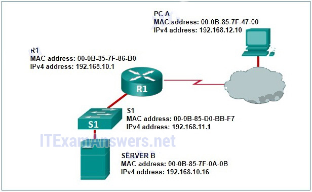

**Choices:**
- **A.** If the destination MAC address that corresponds to the IPv4 address is not in the ARP cache, R1 sends an ARP request.
- **B.** The packet is encapsulated into a PPP frame, and R1 adds the PPP destination address to the frame.
- **C.** R1 uses the destination MAC address of S1.
- **D.** R1 leaves the field blank and forwards the data to the PC.

**Correct Answer:**
If the destination MAC address that corresponds to the IPv4 address is not in the ARP cache, R1 sends an ARP request.

---

## Question 39

**Question:**
Refer to the exhibit. What will the router do with a packet that has a destination IP address of 192.168.12.227?

**Images:**
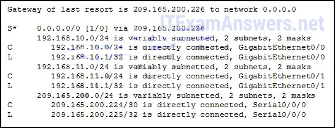

**Choices:**
- **A.** Drop the packet.
- **B.** Send the packet out the Serial0/0/0 interface.
- **C.** Send the packet out the GigabitEthernet0/0 interface.
- **D.** Send the packet out the GigabitEthernet0/1 interface.

**Correct Answer:**
Send the packet out the Serial0/0/0 interface.

---

## Question 40

**Question:**
Which two parameters are used by EIGRP as metrics to select the best path to reach a network? (Choose two.)​

**Choices:**
- **A.** hop count
- **B.** bandwidth
- **C.** jitter
- **D.** resiliency
- **E.** delay
- **F.** confidentiality

**Correct Answer:**
bandwidth; delay

---

## Question 41

**Question:**
What route would have the lowest administrative distance?

**Choices:**
- **A.** a directly connected network
- **B.** a static route
- **C.** a route received through the EIGRP routing protocol
- **D.** a route received through the OSPF routing protocol

**Correct Answer:**
a directly connected network

---

## Question 42

**Question:**
Consider the following routing table entry for R1: D 10.1.1.0/24 [90/2170112] via 209.165.200.226, 00:00:05, Serial0/0/0 What is the significance of the Serial0/0/0?

**Choices:**
- **A.** It is the interface on R1 used to send data that is destined for 10.1.1.0/24.
- **B.** It is the R1 interface through which the EIGRP update was learned.
- **C.** It is the interface on the final destination router that is directly connected to the 10.1.1.0/24 network.
- **D.** It is the interface on the next-hop router when the destination IP address is on the 10.1.1.0/24 network.

**Correct Answer:**
It is the interface on R1 used to send data that is destined for 10.1.1.0/24.

---

## Question 43

**Question:**
What are two common types of static routes in routing tables? (Choose two)

**Choices:**
- **A.** a default static route
- **B.** a built-in static route by IOS
- **C.** a static route to a specific network
- **D.** a static route shared between two neighboring routers
- **E.** a static route converted from a route that is learned through a dynamic routing protocol

**Correct Answer:**
a default static route; a static route to a specific network

---

## Question 44

**Question:**
What command will enable a router to begin sending messages that allow it to configure a link-local address without using an IPv6 DHCP server?

**Choices:**
- **A.** the ipv6 route ::/0 command
- **B.** a static route
- **C.** the ip routing command
- **D.** the ipv6 unicast-routing command

**Correct Answer:**
the ipv6 unicast-routing command

---

## Question 45

**Question:**
What is one feature that distinguishes routers from Layer 2 switches?

**Choices:**
- **A.** Routers can be configured with IP addresses. Switches cannot.
- **B.** Switches move packets from one physical interface to another. Routers do not.
- **C.** Switches use tables of information to determine how to process data traffic. Routers do not.
- **D.** Routers support a variety of interface types. Switches typically support Ethernet interfaces.

**Correct Answer:**
Routers support a variety of interface types. Switches typically support Ethernet interfaces.

---

## Question 46

**Question:**
What type of IPv6 address is required as a minimum on IPv6 enabled interfaces?

**Choices:**
- **A.** loopback
- **B.** unique local
- **C.** link-local
- **D.** static
- **E.** global unicast

**Correct Answer:**
link-local

---

## Question 47

**Question:**
When a computer is pinging another computer for the first time, what type of message does it place on the network to determine the MAC address of the other device?

**Choices:**
- **A.** an ICMP ping
- **B.** an ARP request
- **C.** an RFI (Request for Information) message
- **D.** a multicast to any Layer 3 devices that are connected to the local network

**Correct Answer:**
an ARP request

**Explanation:**
An ARP request is used to determine any unknown MAC address when the destination IP address is known. In an IPv4-based network, this request is sent as a Layer 2 broadcast.

---

## Question 48

**Question:**
What address changes as a packet travels across multiple Layer 3 Ethernet hops to its final destination?

**Choices:**
- **A.** source IP
- **B.** destination IP
- **C.** source Layer 2 address
- **D.** destination port

**Correct Answer:**
source Layer 2 address

---

## Question 49

**Question:**
Refer to the exhibit. A network administrator issues the show ipv6 route command on R1. What two conclusions can be drawn from the routing table? (Choose two.)

**Images:**
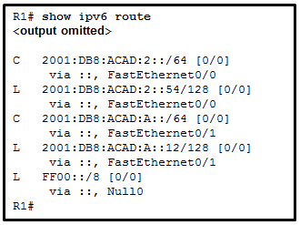

**Choices:**
- **A.** static route
- **B.** local host route
- **C.** directly connected network
- **D.** route that is learned through the OSPF routing protocol
- **E.** route that is learned through the EIGRP routing protocol

**Correct Answer:**
local host route; directly connected network

---

## Question 50

**Question:**
Refer to the exhibit. A network administrator issues the show ip route command on R2. What two types of routes are installed in the routing table? (Choose two.)

**Images:**
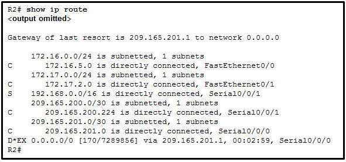

**Choices:**
- **A.** a configured default route
- **B.** directly connected networks
- **C.** routes that are learned through the OSPF routing protocol
- **D.** routes that are learned through the EIGRP routing protocol
- **E.** a configured static route to the network 209.165.200.224

**Correct Answer:**
directly connected networks; routes that are learned through the EIGRP routing protocol

---

## Question 51

**Question:**
What type of IPv6 address is required as a minimum on IPv6 enabled interfaces?

**Choices:**
- **A.** static
- **B.** global unicast
- **C.** link-local
- **D.** loopback
- **E.** unique local

**Correct Answer:**
link-local

---

## Question 52

**Question:**
Match the forwarding characteristic to its type. (Not all options are used.) 172.16.2.2 -> next hop 10.3.0.0 -> destination network 21024000 -> metric 1 -> administrative distance 00:22:15 -> route timestamp D -> route source protocol

**Images:**
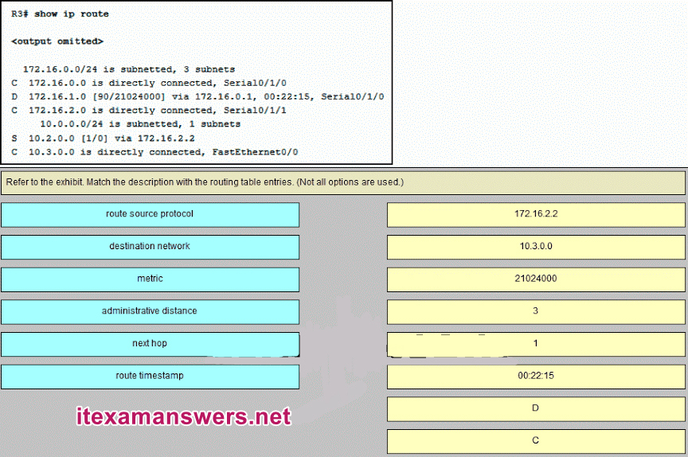
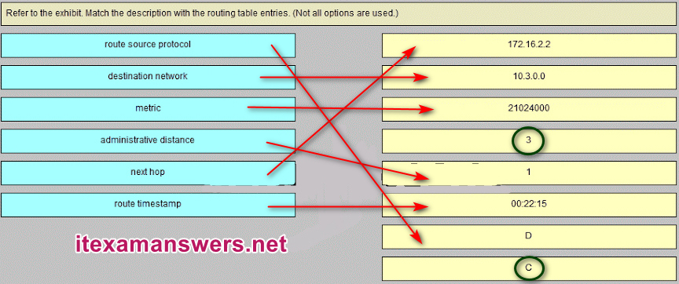

---

## Question 53

**Question:**
Refer to the exhibit. A network administrator issues the show ipv6 route command on R1. What two conclusions can be drawn from the routing table? (Choose two.)

**Images:**
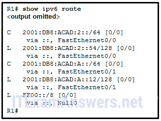

**Choices:**
- **A.** Packets that are destined for the network 2001:DB8:ACAD:2::/64 will be forwarded through Fa0/1.
- **B.** R1 does not know a route to any remote networks.
- **C.** The interface Fa0/1 is configured with IPv6 address 2001:DB8:ACAD:A::12.
- **D.** Packets that are destined for the network 2001:DB8:ACAD:2::54/128 will be forwarded through Fa0/0.
- **E.** The network FF00::/8 is installed through a static route command.

**Correct Answer:**
R1 does not know a route to any remote networks.; The interface Fa0/1 is configured with IPv6 address 2001:DB8:ACAD:A::12.

---

## Question 54

**Question:**
Refer to the exhibit. What is the purpose of the highlighted field in the line that is displayed from the show ip route command?

**Images:**
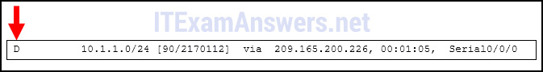

**Choices:**
- **A.** It indicates that this is a directly connected route.
- **B.** It indicates that this route has been deleted from the routing table.
- **C.** It indicates that this route was learned via EIGRP.
- **D.** It indicates that this is a default route.

**Correct Answer:**
It indicates that this route was learned via EIGRP.

---

## Question 55

**Question:**
Refer to the exhibit. PC1 attempts to connect to File_server1 and sends an ARP request to obtain a destination MAC address. Which MAC address will PC1 receive in the ARP reply?

**Images:**
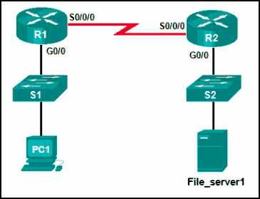

**Choices:**
- **A.** the MAC address of File_server1
- **B.** the MAC address of S2
- **C.** the MAC address of the G0/0 interface on R2
- **D.** the MAC address of S1
- **E.** the MAC address of the G0/0 interface on R1

**Correct Answer:**
the MAC address of the G0/0 interface on R1

**Explanation:**
PC1 must have a MAC address to use as a destination Layer 2 address. PC1 will send an ARP request as a broadcast and R1 will send back an ARP reply with its G0/0 interface MAC address. PC1 can then forward the packet to the MAC address of the default gateway, R1.

---

## Question 56

**Question:**
A network administrator configures the interface fa0/0 on the router R1 with the command ip address 172.16.1.254 255.255.255.0. However, when the administrator issues the command show ip route, the routing table does not show the directly connected network. What is the possible cause of the problem?

**Choices:**
- **A.** The interface fa0/0 has not been activated.
- **B.** No packets with a destination network of 172.16.1.0 have been sent to R1.
- **C.** The subnet mask is incorrect for the IPv4 address.
- **D.** The configuration needs to be saved first.

**Correct Answer:**
The interface fa0/0 has not been activated.

---

## Question 57

**Question:**
Which command is used to configure an IPv6 address on a router interface so that the router will combine a manually specified network prefix with an automatically generated interface identifier?

**Choices:**
- **A.** ipv6 enable
- **B.** ipv6 address ipv6-address/prefix-length eui-64
- **C.** ipv6 address ipv6-address/prefix-length link-local
- **D.** ipv6 address ipv6-address/prefix-length

**Correct Answer:**
ipv6 address ipv6-address/prefix-length eui-64

---

## Question 58

**Question:**
Fill in the blank. When a router receives a packet, it examines the destination address of the packet and looks in the ” routing ” table to determine the best path to use to forward the packet.

---

## Question 59

**Question:**
A network administrator configures a router by the command ip route 0.0.0.0 0.0.0.0 209.165.200.226. What is the purpose of this command?

**Choices:**
- **A.** to provide a route to forward packets for which there is no route in the routing table
- **B.** to forward packets destined for the network 0.0.0.0 to the device with IP address 209.165.200.226
- **C.** to add a dynamic route for the destination network 0.0.0.0 to the routing table
- **D.** to forward all packets to the device with IP address 209.165.200.226

**Correct Answer:**
to provide a route to forward packets for which there is no route in the routing table

---

## Question 60

**Question:**
Refer to the exhibit. A network administrator issues the show ipv6 route command on R1. Which two types of routes are displayed in the routing table? (Choose two.)

**Images:**
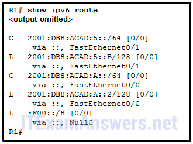

**Choices:**
- **A.** route that is learned through the EIGRP routing protocol
- **B.** directly connected network
- **C.** route that is learned through the OSPF routing protocol
- **D.** static route
- **E.** local host route

**Correct Answer:**
directly connected network; local host route

---

## Question 61

**Question:**
A network administrator is implementing dynamic routing protocols for a company. Which command can the administrator issue on a router to display the supported routing protocols?

**Choices:**
- **A.** Router(config)# router ?
- **B.** Router(config)# ip forward-protocol ?
- **C.** Router(config)# service ?
- **D.** Router(config)# ip route ?

**Correct Answer:**
Router(config)# router ?

---

## Question 62

**Question:**
Which statement describes a route that has been learned dynamically?

**Choices:**
- **A.** It is identified by the prefix C in the routing table.
- **B.** It is automatically updated and maintained by routing protocols.
- **C.** It is unaffected by changes in the topology of the network.
- **D.** It has an administrative distance of 1.

**Correct Answer:**
It is automatically updated and maintained by routing protocols.

**Explanation:**
Dynamically learned routes are constantly updated and maintained by routing protocols.

---

## Question 63

**Question:**
Which two network parameters are used by EIGRP as metrics to select the best path to reach a network? (Choose Two.)

**Choices:**
- **A.** jitter
- **B.** bandwidth
- **C.** resiliency
- **D.** hop count
- **E.** delay
- **F.** confidentiality

**Correct Answer:**
bandwidth; delay

---

## Question 64

**Question:**
What are two types of static routes in routing tables? (choose two)

**Choices:**
- **A.** default static route
- **B.** built in static route by IOS
- **C.** static route to specific network
- **D.** static route converted from a route that is learned through a dynamic routing protocol.
- **E.** static route shared btween two neighboring routers.

**Correct Answer:**
default static route; static route to specific network

---

## Question 65

**Question:**
What is a characteristic of an IPv4 interface on a Cisco IOS router?

**Choices:**
- **A.** it is assigned to a physical port and can be connected to other devices.
- **B.** only one loopback int can be enable on a router
- **C.** it is a logical int internal to the router
- **D.** the no shut command is required to place this in UP

**Correct Answer:**
it is a logical int internal to the router

**Explanation:**
Download PDF File below: ITexamanswers.net – CCNA 2 (v5.1 + v6.0) Chapter 4 Exam Answers Full.pdf 0.00 KB 25168 downloads

---
