# CCNA 2 v2 - CCNA 2 - Chapter 5

## Question 1

**Question:**
Which statement describes the port speed LED on the Cisco Catalyst 2960 switch?

**Choices:**
- **A.** If the LED is green, the port is operating at 100 Mb/s.
- **B.** If the LED is off, the port is not operating.
- **C.** If the LED is blinking green, the port is operating at 10 Mb/s.
- **D.** If the LED is amber, the port is operating at 1000 Mb/s.

**Correct Answer:**
If the LED is green, the port is operating at 100 Mb/s.

**Explanation:**
The port speed LED indicates that the port speed mode is selected. When selected, the port LEDs will display colors with different meanings. If the LED is off, the port is operating at 10 Mb/s. If the LED is green, the port is operating at 100 Mb/s. If the LED is blinking green, the port is operating at 1000 Mb/s.

---

## Question 2

**Question:**
Which command is used to set the BOOT environment variable that defines where to find the IOS image file on a switch?

**Choices:**
- **A.** config-register
- **B.** boot system
- **C.** boot loader
- **D.** confreg

**Correct Answer:**
boot system

**Explanation:**
The boot system command is used to set the BOOT environment variable. The config-register and confreg commands are used to set the configuration register. The boot loader command supports commands to format the flash file system, reinstall the operating system software, and recover from a lost or forgotten password.

---

## Question 3

**Question:**
What is a function of the switch boot loader?

**Choices:**
- **A.** to speed up the boot process
- **B.** to provide security for the vulnerable state when the switch is booting
- **C.** to control how much RAM is available to the switch during the boot process
- **D.** to provide an environment to operate in when the switch operating system cannot be found

**Correct Answer:**
to provide an environment to operate in when the switch operating system cannot be found

**Explanation:**
The switch boot loader environment is presented when the switch cannot locate a valid operating system. The boot loader environment provides a few basic commands that allows a network administrator to reload the operating system or provide an alternate location of the operating system.

---

## Question 4

**Question:**
Which interface is the default location that would contain the IP address used to manage a 24-port Ethernet switch?

**Choices:**
- **A.** VLAN 1
- **B.** Fa0/0
- **C.** Fa0/1
- **D.** interface connected to the default gateway
- **E.** VLAN 99

**Correct Answer:**
VLAN 1

**Explanation:**
Interface VLAN 1 is the default management SVI.

---

## Question 5

**Question:**
A production switch is reloaded and finishes with a Switch> prompt. What two facts can be determined? (Choose two.)

**Choices:**
- **A.** POST occurred normally.
- **B.** The boot process was interrupted.
- **C.** There is not enough RAM or flash on this router.
- **D.** A full version of the Cisco IOS was located and loaded.
- **E.** The switch did not locate the Cisco IOS in flash, so it defaulted to ROM.

**Correct Answer:**
POST occurred normally.; A full version of the Cisco IOS was located and loaded.

**Explanation:**
A switch booting to the Switch> prompt indicates that the switch booted normally. This means a the switch successfully completed POST full version of the Cisco IOS was loaded.

---

## Question 6

**Question:**
Which two statements are true about using full-duplex Fast Ethernet? (Choose two.)

**Choices:**
- **A.** Performance is improved with bidirectional data flow.
- **B.** Latency is reduced because the NIC processes frames faster.
- **C.** Nodes operate in full-duplex with unidirectional data flow.
- **D.** Performance is improved because the NIC is able to detect collisions.
- **E.** Full-duplex Fast Ethernet offers 100 percent efficiency in both directions.

**Correct Answer:**
Performance is improved with bidirectional data flow.; Full-duplex Fast Ethernet offers 100 percent efficiency in both directions.

**Explanation:**
In full-duplex operation, the NIC does not process frames any faster, the data flow is bidirectional, and there are no collisions.

---

## Question 7

**Question:**
In which situation would a technician use the show interfaces switch command?

**Choices:**
- **A.** to determine if remote access is enabled
- **B.** when packets are being dropped from a particular directly attached host
- **C.** when an end device can reach local devices, but not remote devices
- **D.** to determine the MAC address of a directly attached network device on a particular interface

**Correct Answer:**
when packets are being dropped from a particular directly attached host

**Explanation:**
The show interfaces command is useful to detect media errors, to see if packets are being sent and received, and to determine if any runts, giants, CRCs, interface resets, or other errors have occurred. Problems with reachability to a remote network would likely be caused by a misconfigured default gateway or other routing issue, not a switch issue. The show mac address-table command shows the MAC address of a directly attached device.

---

## Question 8

**Question:**
Refer to the exhibit. A network technician is troubleshooting connectivity issues in an Ethernet network with the command show interfaces fastEthernet 0/0. What conclusion can be drawn based on the partial output in the exhibit?

**Images:**
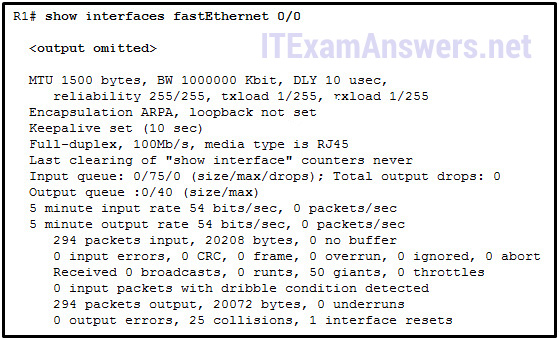

**Choices:**
- **A.** All hosts on this network communicate in full-duplex mode.
- **B.** Some workstations might use an incorrect cabling type to connect to the network.
- **C.** There are collisions in the network that cause frames to occur that are less than 64 bytes in length.
- **D.** A malfunctioning NIC can cause frames to be transmitted that are longer than the allowed maximum length.

**Correct Answer:**
A malfunctioning NIC can cause frames to be transmitted that are longer than the allowed maximum length.

**Explanation:**
The partial output shows that there are 50 giants (frames longer than the allowed maximum) that were injected into the network, possibly by a malfunctioning NIC. This conclusion can be drawn because there are only 25 collisions, so not all the 50 giants are the result of a collision. Also, because there 25 collisions, it is most likely that not all hosts are using full-duplex mode (otherwise there would not be any collisions). There should be no cabling issues since the CRC error value is 0. There are 0 runts, so the collisions have not caused malformed frames to occur that are shorter than 64 bytes in length .

---

## Question 9

**Question:**
Refer to the exhibit. What media issue might exist on the link connected to Fa0/1 based on the show interface command?

**Images:**
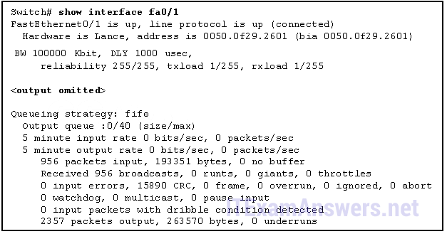

**Choices:**
- **A.** The bandwidth parameter on the interface might be too high.
- **B.** There could be an issue with a faulty NIC.
- **C.** There could be too much electrical interference and noise on the link.
- **D.** The cable attaching the host to port Fa0/1 might be too long.
- **E.** The interface might be configured as half-duplex.

**Correct Answer:**
There could be too much electrical interference and noise on the link.

**Explanation:**
Escalating CRC errors usually means that the data is being modified during transmission from the host to the switch. This is often caused by high levels of electromagnetic interference on the link.

---

## Question 10

**Question:**
If one end of an Ethernet connection is configured for full duplex and the other end of the connection is configured for half duplex, where would late collisions be observed?

**Choices:**
- **A.** on both ends of the connection
- **B.** on the full-duplex end of the connection
- **C.** only on serial interfaces
- **D.** on the half-duplex end of the connection

**Correct Answer:**
on the half-duplex end of the connection

**Explanation:**
Full-duplex communications do not produce collisions. However, collisions often occur in half-duplex operations. When a connection has two different duplex configurations, the half-duplex end will experience late collisions. Collisions are found on Ethernet networks. Serial interfaces use technologies other than Ethernet.

---

## Question 11

**Question:**
What is one difference between using Telnet or SSH to connect to a network device for management purposes?

**Choices:**
- **A.** Telnet uses UDP as the transport protocol whereas SSH uses TCP.
- **B.** Telnet does not provide authentication whereas SSH provides authentication.
- **C.** Telnet supports a host GUI whereas SSH only supports a host CLI.
- **D.** Telnet sends a username and password in plain text, whereas SSH encrypts the username and password.

**Correct Answer:**
Telnet sends a username and password in plain text, whereas SSH encrypts the username and password.

**Explanation:**
SSH provides security for remote management connections to a network device. SSH does so through encryption for session authentication (username and password) as well as for data transmission. Telnet sends a username and password in plain text, which can be targeted to obtain the username and password through data capture. Both Telnet and SSH use TCP, support authentication, and connect to hosts in CLI.

---

## Question 12

**Question:**
Refer to the exhibit. The network administrator wants to configure Switch1 to allow SSH connections and prohibit Telnet connections. How should the network administrator change the displayed configuration to satisfy the requirement?

**Images:**
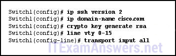

**Choices:**
- **A.** Use SSH version 1.
- **B.** Reconfigure the RSA key.
- **C.** Configure SSH on a different line.
- **D.** Modify the transport input command.

**Correct Answer:**
Modify the transport input command.

---

## Question 13

**Question:**
What is the effect of using the switchport port-security command?

**Choices:**
- **A.** enables port security on an interface
- **B.** enables port security globally on the switch
- **C.** automatically shuts an interface down if applied to a trunk port
- **D.** detects the first MAC address in a frame that comes into a port and places that MAC address in the MAC address table

**Correct Answer:**
enables port security on an interface

**Explanation:**
Port security cannot be enabled globally. All active switch ports should be manually secured using the switchport port-security command, which allows the administrator to control the number of valid MAC addresses allowed to access the port. This command does not specify what action will be taken if a violation occurs, nor does it change the process of populating the MAC address table.

---

## Question 14

**Question:**
Where are dynamically learned MAC addresses stored when sticky learning is enabled with the switchport port-security mac-address sticky command?

**Choices:**
- **A.** ROM
- **B.** RAM
- **C.** NVRAM
- **D.** flash

**Correct Answer:**
RAM

**Explanation:**
When MAC addresses are automatically learned by using the sticky command option, the learned MAC addresses are added to the running configuration, which is stored in RAM.

---

## Question 15

**Question:**
A network administrator configures the port security feature on a switch. The security policy specifies that each access port should allow up to two MAC addresses. When the maximum number of MAC addresses is reached, a frame with the unknown source MAC address is dropped and a notification is sent to the syslog server. Which security violation mode should be configured for each access port?

**Choices:**
- **A.** restrict
- **B.** protect
- **C.** warning
- **D.** shutdown

**Correct Answer:**
restrict

**Explanation:**
In port security implementation, an interface can be configured for one of three violation modes: Protect – a port security violation causes the interface to drop packets with unknown source addresses and no notification is sent that a security violation has occurred. Restrict – a port security violation causes the interface to drop packets with unknown source addresses and to send a notification that a security violation has occurred. Shutdown – a port security violation causes the interface to immediately become error-disabled and turns off the port LED. No notification is sent that a security violation has occurred.

---

## Question 16

**Question:**
Which two statements are true regarding switch port security? (Choose two.)

**Choices:**
- **A.** The three configurable violation modes all log violations via SNMP.
- **B.** Dynamically learned secure MAC addresses are lost when the switch reboots.
- **C.** The three configurable violation modes all require user intervention to re-enable ports.
- **D.** After entering the sticky parameter, only MAC addresses subsequently learned are converted to secure MAC addresses.
- **E.** If fewer than the maximum number of MAC addresses for a port are configured statically, dynamically learned addresses are added to CAM until the maximum number is reached.

**Correct Answer:**
Dynamically learned secure MAC addresses are lost when the switch reboots.; If fewer than the maximum number of MAC addresses for a port are configured statically, dynamically learned addresses are added to CAM until the maximum number is reached.

**Explanation:**
Dynamically learned secure MAC addresses are lost when the switch reboots. Sticky MAC addresses are learned and added to the running config. These addressess can be retained if the configuration is saved and then rebooted. MAC addresses may also be configured statically (that is, manually). If fewer than the maximum number of MAC addresses for a port are configured statically, dynamically learned addresses are added to CAM until the maximum number is reached.

---

## Question 17

**Question:**
Which action will bring an error-disabled switch port back to an operational state?

**Choices:**
- **A.** Remove and reconfigure port security on the interface.
- **B.** Issue the switchport mode access command on the interface.
- **C.** Clear the MAC address table on the switch.
- **D.** Issue the shutdown and then no shutdown interface commands.

**Correct Answer:**
Issue the shutdown and then no shutdown interface commands.

**Explanation:**
When a violation occurs on a switch port that is configured for port security with the shutdown violation action, it is put into the err-disabled state. It can be brought back up by shutting down the interface and then issuing the no shutdown command.

---

## Question 18

**Question:**
Refer to the exhibit. Port Fa0/2 has already been configured appropriately. The IP phone and PC work properly. Which switch configuration would be most appropriate for port Fa0/2 if the network administrator has the following goals? No one is allowed to disconnect the IP phone or the PC and connect some other wired device. If a different device is connected, port Fa0/2 is shut down. The switch should automatically detect the MAC address of the IP phone and the PC and add those addresses to the running configuration.

**Images:**
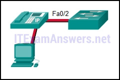

**Choices:**
- **A.** SWA(config-if)# switchport port-security SWA(config-if)# switchport port-security mac-address sticky
- **B.** SWA(config-if)# switchport port-security mac-address sticky SWA(config-if)# switchport port-security maximum 2
- **C.** SWA(config-if)# switchport port-security SWA(config-if)# switchport port-security maximum 2 SWA(config-if)# switchport port-security mac-address sticky
- **D.** SWA(config-if)# switchport port-security SWA(config-if)# switchport port-security maximum 2 SWA(config-if)# switchport port-security mac-address sticky SWA(config-if)# switchport port-security violation restrict

**Correct Answer:**
SWA(config-if)# switchport port-security SWA(config-if)# switchport port-security maximum 2 SWA(config-if)# switchport port-security mac-address sticky

**Explanation:**
The default mode for a port security violation is to shut down the port so the switchport port-security violation command is not necessary. The switchport port-security command must be entered with no additional options to enable port security for the port. Then, additional port security options can be added.

---

## Question 19

**Question:**
The following words are displayed: ATC_S2# show port-security interface fastethernet 0/3 Port Security : Enabled Port Status : Secure-up Violation Mode : Shutdown Aging Time : 0 mins Aging Type : Absolute SecureStatic Address Aging : Disabled Maximum MAC Addresses : 2 Total MAC Addresses : 1 Configured MAC Addresses : 0 Sticky MAC Addresses : 1 Last Source Address:Vlan : 00D0.D3B6.C26B:10 Security Violation Count : 0 Refer to the exhibit. What can be determined about port security from the information that is shown?

**Images:**
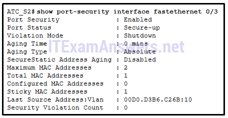

**Choices:**
- **A.** The port has been shut down.
- **B.** The port has two attached devices.
- **C.** The port violation mode is the default for any port that has port security enabled.
- **D.** The port has the maximum number of MAC addresses that is supported by a Layer 2 switch port which is configured for port security.

**Correct Answer:**
The port violation mode is the default for any port that has port security enabled.

**Explanation:**
The Port Security line simply shows a state of Enabled if the switchport port-security command (with no options) has been entered for a particular switch port. If a port security violation had occurred, a different error message appears such as Secure-shutdown. The maximum number of MAC addresses supported is 50. The Maximum MAC Addresses line is used to show how many MAC addresses can be learned (2 in this case). The Sticky MAC Addresses line shows that only one device has been attached and learned automatically by the switch. This configuration could be used when a port is shared by two cubicle-sharing personnel who bring in separate laptops.

---

## Question 20

**Question:**
Refer to the exhibit. Which event will take place if there is a port security violation on switch S1 interface Fa0/1?

**Images:**
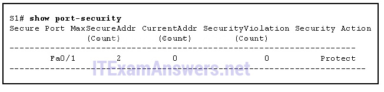

**Choices:**
- **A.** A notification is sent.
- **B.** A syslog message is logged.
- **C.** Packets with unknown source addresses will be dropped.
- **D.** The interface will go into error-disabled state.

**Correct Answer:**
Packets with unknown source addresses will be dropped.

**Explanation:**
Interface FastEthernet 0/1 is configured with the violation mode of protect. If there is a violation, interface FastEthernet 0/1 will drop packets with unknown MAC addresses.

---

## Question 21

**Question:**
Open the PT Activity. Perform the tasks in the activity instructions and then answer the question. Which event will take place if there is a port security violation on switch S1 interface Fa0/1?

**Images:**
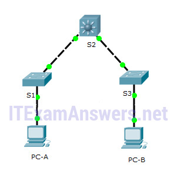

**Choices:**
- **A.** Packets with unknown source addresses will be dropped.
- **B.** A syslog message is logged.
- **C.** The interface will go into error-disabled state.
- **D.** A notification is sent.

**Correct Answer:**
Packets with unknown source addresses will be dropped.

**Explanation:**
The violation mode can be viewed by issuing the show port-security interface command. Interface FastEthernet 0/1 is configured with the violation mode of protect. If there is a violation, interface FastEthernet 0/1 will drop packets with unknown MAC addresses.

---

## Question 22

**Question:**
Fill in the blank. Do not use abbreviations.What is the missing command on S1? “ ip address 192.168.99.2 255.255.255.0 ”

---

## Question 23

**Question:**
Match the step to each switch boot sequence description. (Not all options are used.) Place the options in the following order: step 3 – not scored – step 1 step 4 step 2 step 5 step 6 The steps are: 1. execute POST 2. load the boot loader from ROM 3. CPU register initializations 4. flash file system initialization 5. load the IOS 6. transfer switch control to the IOS

**Images:**
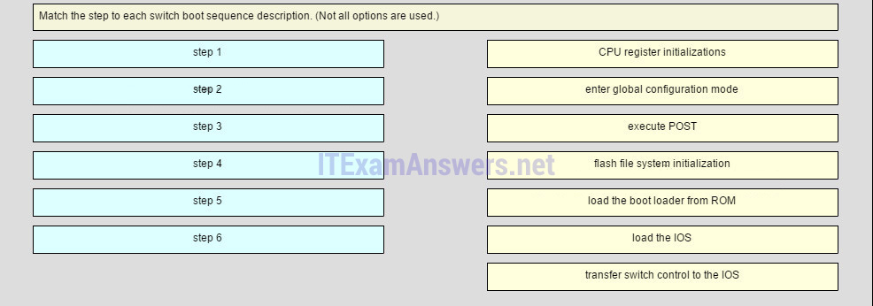
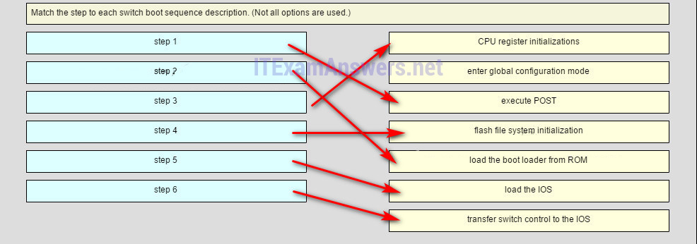

---

## Question 24

**Question:**
Identify the steps needed to configure a switch for SSH. The answer order does not matter. (Not all options are used.) Place the options in the following order: [+] Create a local user. [+] Generate RSA keys. [+] Configure a domain name. [+] Use the login local command. [+] Use the transport input ssh command. [+] Order does not matter within this group. The login and password cisco commands are used with Telnet switch configuration, not SSH configuration. Old Version:

**Images:**
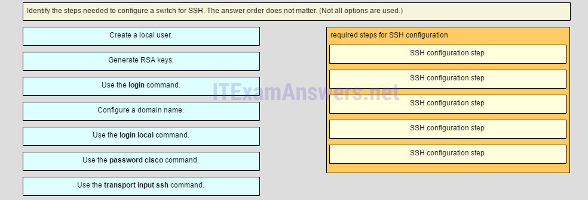
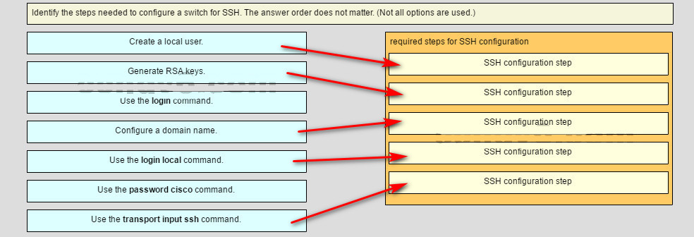

---

## Question 25

**Question:**
What is a disadvantage of using router-on-a-stick inter-VLAN routing?

**Choices:**
- **A.** does not support VLAN-tagged packets
- **B.** requires the use of more physical interfaces than legacy inter-VLAN routing
- **C.** does not scale well beyond 50 VLANs
- **D.** requires the use of multiple router interfaces configured to operate as access links

**Correct Answer:**
does not scale well beyond 50 VLANs

---

## Question 26

**Question:**
How is traffic routed between multiple VLANs on a multilayer switch?

**Choices:**
- **A.** Traffic is routed via physical interfaces.
- **B.** Traffic is routed via internal VLAN interfaces.
- **C.** Traffic is broadcast out all physical interfaces.
- **D.** Traffic is routed via subinterfaces.

**Correct Answer:**
Traffic is routed via internal VLAN interfaces.

---

## Question 27

**Question:**
Refer to the exhibit. In this network design, which connection or connections if any, add the VLAN ID number if host H1 sends information to host H2?

**Images:**
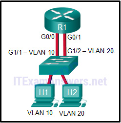

**Choices:**
- **A.** no link
- **B.** from H1 to the switch
- **C.** from the switch to G0/0 on the router
- **D.** from G0/1 on the router to G1/2 on the switch
- **E.** from the switch to H2

**Correct Answer:**
no link

---

## Question 28

**Question:**
What is a characteristic of legacy inter-VLAN routing?

**Choices:**
- **A.** Only one VLAN can be used in the topology.
- **B.** The router requires one Ethernet link for each VLAN.
- **C.** The user VLAN must be the same ID number as the management VLAN.
- **D.** Inter-VLAN routing must be performed on a switch instead of a router.

**Correct Answer:**
The router requires one Ethernet link for each VLAN.

---

## Question 29

**Question:**
Refer to the exhibit. A network administrator needs to configure router-on-a-stick for the networks that are shown. How many subinterfaces will have to be created on the router if each VLAN that is shown is to be routed and each VLAN has its own subinterface?

**Images:**
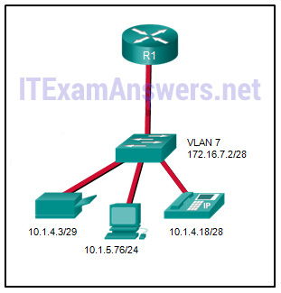

**Choices:**
- **A.** 1
- **B.** 2
- **C.** 3
- **D.** 4
- **E.** 5

**Correct Answer:**
4

**Explanation:**
Based on the IP addresses and masks given, the PC, printer, IP phone, and switch management VLAN are all on different VLANs. This situation will require four subinterfaces on the router.

---

## Question 30

**Question:**
Refer to the exhibit. In what switch mode should port G0/1 be assigned if Cisco best practices are being used?

**Images:**
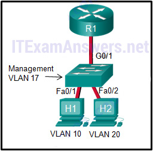

**Choices:**
- **A.** access
- **B.** trunk
- **C.** native
- **D.** auto

**Correct Answer:**
trunk

---

## Question 31

**Question:**
Refer to the exhibit. What is the problem with this configuration, based on the output of the router?

**Images:**
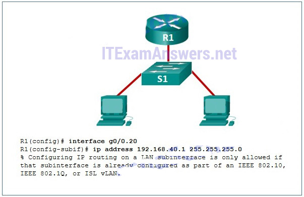

**Choices:**
- **A.** The subnet mask is wrong.
- **B.** There is no subinterface for the administrative VLAN.
- **C.** The subinterface number does not match the third octet in the IPv4 address.
- **D.** The encapsulation has not been configured on the subinterface.

**Correct Answer:**
The encapsulation has not been configured on the subinterface.

---

## Question 32

**Question:**
Refer to the exhibit. Communication between the VLANs is not occurring. What could be the issue?

**Images:**
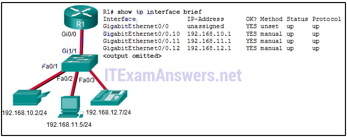

**Choices:**
- **A.** The wrong port on the router has been used.
- **B.** The Gi1/1 switch port is not in trunking mode.
- **C.** A duplex issue exists between the switch and the router.
- **D.** Default gateways have not been configured for each VLAN.

**Correct Answer:**
The Gi1/1 switch port is not in trunking mode.

---

## Question 33

**Question:**
Refer to the exhibit. A network administrator is verifying the configuration of inter-VLAN routing. Users complain that PCs on different VLANs cannot communicate. Based on the output, what are two configuration errors on switch interface Gi1/1? (Choose two.)

**Images:**
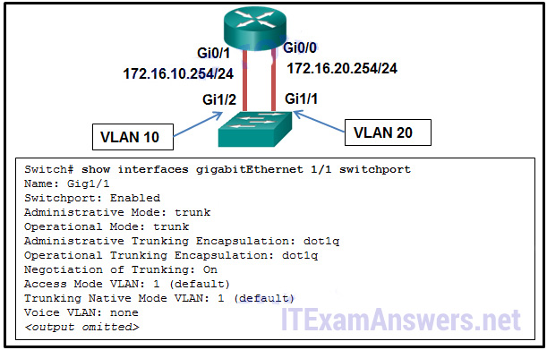

**Choices:**
- **A.** Gi1/1 is in the default VLAN.
- **B.** Voice VLAN is not assigned to Gi1/1.
- **C.** Gi1/1 is configured as trunk mode.
- **D.** Negotiation of trunking is turned on on Gi1/1.
- **E.** The trunking encapsulation protocol is configured wrong.

**Correct Answer:**
Gi1/1 is in the default VLAN.; Gi1/1 is configured as trunk mode.

**Explanation:**
With legacy inter-VLAN routing methods, the switch ports that connect to the router should be configured as access mode and be assigned appropriate VLANs. In this scenario, the Gi1/1 interface should be in access mode with VLAN 10 assigned. The other options are default settings on the switch and have no effect on legacy inter-VLAN routing.

---

## Question 34

**Question:**
Refer to the exhibit. A network administrator is verifying the configuration of inter-VLAN routing. Users complain that PC2 cannot communicate with PC1. Based on the output, what is the possible cause of the problem?

**Images:**
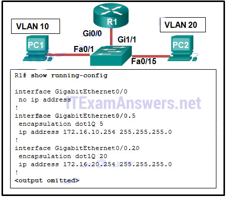

**Choices:**
- **A.** Gi0/0 is not configured as a trunk port.
- **B.** The command interface GigabitEthernet0/0.5 was entered incorrectly.
- **C.** There is no IP address configured on the interface Gi0/0.
- **D.** The no shutdown command is not entered on subinterfaces.
- **E.** The encapsulation dot1Q 5 command contains the wrong VLAN.

**Correct Answer:**
The encapsulation dot1Q 5 command contains the wrong VLAN.

---

## Question 35

**Question:**
Refer to the exhibit. A network administrator is verifying the configuration of inter-VLAN routing. Based on the partial output that is displayed by the use of the show vlan command, which conclusion can be drawn for the Gi1/1 interface?

**Images:**
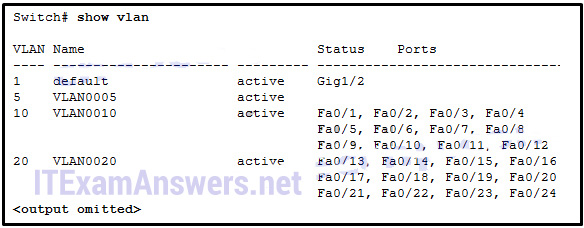

**Choices:**
- **A.** It is shut down.
- **B.** It belongs to the default VLAN.
- **C.** It is configured as trunk mode.
- **D.** It is not connected to any device.

**Correct Answer:**
It is configured as trunk mode.

---

## Question 36

**Question:**
Inter-VLAN communication is not occurring in a particular building of a school. Which two commands could the network administrator use to verify that inter-VLAN communication was working properly between a router and a Layer 2 switch when the router-on-a-stick design method is implemented? (Choose two.)

**Choices:**
- **A.** From the router, issue the show ip route command.
- **B.** From the router, issue the show interfaces trunk command.
- **C.** From the router, issue the show interfaces interface command.
- **D.** From the switch, issue the show interfaces trunk command.
- **E.** From the switch, issue the show interfaces interface command.

**Correct Answer:**
From the router, issue the show ip route command.; From the switch, issue the show interfaces trunk command.

---

## Question 37

**Question:**
How are IP addressing designs affected by VLAN implementations?

**Choices:**
- **A.** VLANs do not support VLSM.
- **B.** VLANs do not use a broadcast address.
- **C.** Each VLAN must have a different network number.
- **D.** Each VLAN must have a different subnet mask.

**Correct Answer:**
Each VLAN must have a different network number.

---

## Question 38

**Question:**
While configuring inter-VLAN routing on a multilayer switch, a network administrator issues the no switchport command on an interface that is connected to another switch. What is the purpose of this command?

**Choices:**
- **A.** to create a routed port for a single network
- **B.** to provide a static trunk link
- **C.** to create a switched virtual interface
- **D.** to provide an access link that tags VLAN traffic

**Correct Answer:**
to create a routed port for a single network

---

## Question 39

**Question:**
What is a disadvantage of using multilayer switches for inter-VLAN routing?

**Choices:**
- **A.** Multilayer switches have higher latency for Layer 3 routing.
- **B.** Multilayer switches are more expensive than router-on-a-stick implementations.
- **C.** Spanning tree must be disabled in order to implement routing on a multilayer switch.
- **D.** Multilayer switches are limited to using trunk links for Layer 3 routing.

**Correct Answer:**
Multilayer switches are more expensive than router-on-a-stick implementations.

---

## Question 40

**Question:**
What is a characteristic of a routed port on a Layer 3 switch?

**Choices:**
- **A.** It supports trunking.
- **B.** It is not assigned to a VLAN.
- **C.** It is commonly used as a WAN link.
- **D.** It cannot have an IP address assigned to it.

**Correct Answer:**
It is not assigned to a VLAN.

---

## Question 41

**Question:**
An administrator is attempting to configure a static route on a Cisco 2960 series switch. After the administrator types the command ip route 0.0.0.0 0.0.0.0 10.1.1.1, an error message appears stating that the command is not recognized. What must the administrator do so that this command is accepted?

**Choices:**
- **A.** Enter the command no switchport.
- **B.** Enter the command ipv6 unicast-routing.
- **C.** Enter the command ip route 0.0.0.0 0.0.0.0. vlan 10.
- **D.** Enter the command sdm prefer lanbase-routing and reload.

**Correct Answer:**
Enter the command sdm prefer lanbase-routing and reload.

---

## Question 42

**Question:**
Which statement describes a disadvantage of using router subinterfaces for inter-VLAN routing?

**Choices:**
- **A.** It is more expensive than using individual router interfaces.
- **B.** Routed traffic must contend for bandwidth on a single router interface.
- **C.** Trunking cannot be used to connect the router to the switch.
- **D.** All untagged traffic is dropped.

**Correct Answer:**
Routed traffic must contend for bandwidth on a single router interface.

---

## Question 43

**Question:**
Refer to the exhibit. Router RA receives a packet with a source address of 192.168.1.35 and a destination address of 192.168.1.85. What will the router do with this packet?

**Images:**
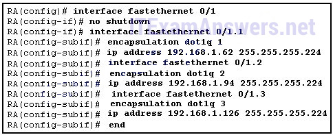

**Choices:**
- **A.** The router will drop the packet.
- **B.** The router will forward the packet out interface FastEthernet 0/1.1.
- **C.** The router will forward the packet out interface FastEthernet 0/1.2.
- **D.** The router will forward the packet out interface FastEthernet 0/1.3.
- **E.** The router will forward the packet out interface FastEthernet 0/1.2 and interface FastEthernet 0/1.3.

**Correct Answer:**
The router will forward the packet out interface FastEthernet 0/1.2.

---

## Question 44

**Question:**
Refer to the exhibit. After attempting to enter the configuration that is shown in router RTA, an administrator receives an error and users on VLAN 20 report that they are unable to reach users on VLAN 30. What is causing the problem?

**Images:**
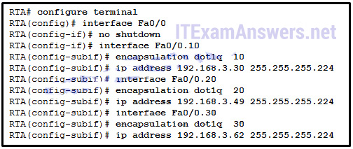

**Choices:**
- **A.** Dot1q does not support subinterfaces.
- **B.** There is no address on Fa0/0 to use as a default gateway.
- **C.** RTA is using the same subnet for VLAN 20 and VLAN 30.
- **D.** The no shutdown command should have been issued on Fa0/0.20 and Fa0/0.30.

**Correct Answer:**
RTA is using the same subnet for VLAN 20 and VLAN 30.

---

## Question 45

**Question:**
Refer to the exhibit. A network administrator is configuring RT1 for inter-VLAN routing. The switch is configured correctly and is functional. Host1, Host2, and Host3 cannot communicate with each other. Based on the router configuration, what is causing the problem?

**Images:**
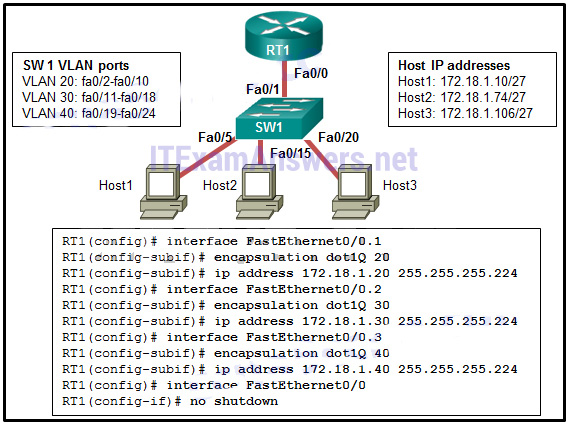

**Choices:**
- **A.** Interface Fa0/0 is missing IP address configuration information.
- **B.** IP addresses on the subinterfaces are incorrectly matched to the VLANs.
- **C.** Each subinterface of Fa0/0 needs separate no shutdown commands.
- **D.** Routers do not support 802.1Q encapsulation on subinterfaces.

**Correct Answer:**
IP addresses on the subinterfaces are incorrectly matched to the VLANs.

**Explanation:**
Since Host 1 (in VLAN 20) has the IP 172.18.1.10/27, the subinterface Fa0/0.1 should be configured with an IP address in the network 172.168.1.0/27. Similarly, Fa0/0.2 should be with an IP address in the network 172.168.1.64/27 and Fa0/0.3 should be with an IP address in the network 172.168.1.96/27.

---

## Question 46

**Question:**
What condition is required to enable Layer 3 switching?

**Choices:**
- **A.** The Layer 3 switch must have IP routing enabled.
- **B.** All participating switches must have unique VLAN numbers.
- **C.** All routed subnets must be on the same VLAN.
- **D.** Inter-VLAN portions of Layer 3 switching must use router-on-a-stick.

**Correct Answer:**
The Layer 3 switch must have IP routing enabled.

**Explanation:**
Some Layer 3 switches do not have an image loaded that supports Layer 3 switching; if it does, IP routing needs to be enabled by typing ip routing from global configuration mode. Layer 3 switches preclude the need for router-on-a-stick.

---

## Question 47

**Question:**
Refer to the exhibit. Which command can the administrator issue to change the VLAN10 status to up?​

**Images:**
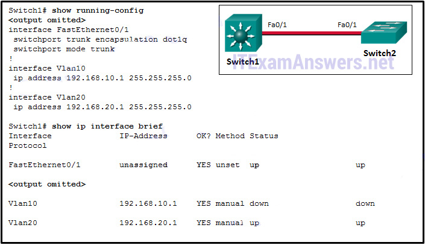

**Choices:**
- **A.** Switch1(config)# interface vlan 10 Switch1(config-if)# no shutdown​
- **B.** Switch1(config)# interface vlan 10 Switch1(config-if)# ip address 192.168.10.1 255.255.255.0​
- **C.** Switch1(config)# interface vlan 10 Switch1(config-if)# ip address 192.168.10.1 255.255.255.0 Switch1(config-if)# no shutdown​
- **D.** Switch1(config)# vlan 10 Switch1(config-vlan)# exit*

**Correct Answer:**
Switch1(config)# vlan 10 Switch1(config-vlan)# exit*

---

## Question 48

**Question:**
Fill in the blank. Do not use abbreviations. A network engineer is troubleshooting the configuration of new VLANs on a network. ​Which command is used to display the list of VLANs that exists on the switch? show vlan

---

## Question 49

**Question:**
Refer to the exhibit. The switch does the routing for the hosts that connect to VLAN 5. If the PC accesses a web server from the Internet, at what point will a VLAN number be added to the frame?

**Images:**
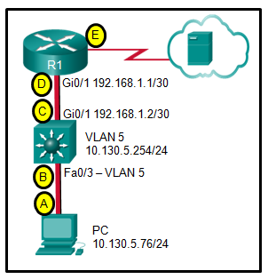

**Choices:**
- **A.** point A
- **B.** point B
- **C.** point C
- **D.** point D
- **E.** point E
- **F.** No VLAN number is added to the frame in this design.

**Correct Answer:**
No VLAN number is added to the frame in this design.

---

## Question 50

**Question:**
Which type of inter-VLAN communication design requires the configuration of multiple subinterfaces?

**Choices:**
- **A.** router on a stick
- **B.** routing via a multilayer switch
- **C.** routing for the management VLAN
- **D.** legacy inter-VLAN routing

**Correct Answer:**
router on a stick

**Explanation:**
The router-on-a-stick design always includes subinterfaces on a router. When a multilayer switch is used, multiple SVIs are created. When the number of VLANs equals the number of ports on a router, or when the management VLAN needs to be routed, any of the inter-VLAN design methods can be used.

---

## Question 51

**Question:**
A small college uses VLAN 10 for the classroom network and VLAN 20 for the office network. What is needed to enable communication between these two VLANs while using legacy inter-VLAN routing?

**Choices:**
- **A.** A router with at least two LAN interfaces should be used.
- **B.** Two groups of switches are needed, each with ports that are configured for one VLAN.
- **C.** A router with one VLAN interface is needed to connect to the SVI on a switch.
- **D.** A switch with a port that is configured as trunk is needed to connect to a router.

**Correct Answer:**
A router with at least two LAN interfaces should be used.

---

## Question 52

**Question:**
Refer to the exhibit. A network administrator has configured router CiscoVille with the above commands to provide inter-VLAN routing. What command will be required on a switch that is connected to the Gi0/0 interface on router CiscoVille to allow inter-VLAN routing??

**Images:**

**Choices:**
- **A.** switchport mode access
- **B.** no switchport
- **C.** switchport mode trunk
- **D.** switchport mode dynamic desirable

**Correct Answer:**
switchport mode trunk

---

## Question 53

**Question:**
Refer to the exhibit. A router-on-a-stick configuration was implemented for VLANs 15, 30, and 45, according to the show running-config command output. PCs on VLAN 45 that are using the 172.16.45.0 /24 network are having trouble connecting to PCs on VLAN 30 in the 172.16.30.0 /24 network. Which error is most likely causing this problem??

**Images:**
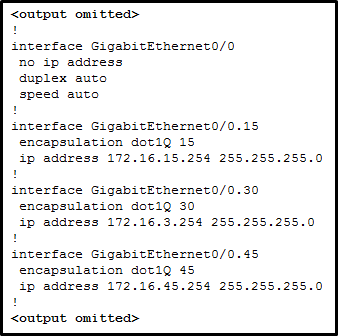

**Choices:**
- **A.** The wrong VLAN has been configured on GigabitEthernet 0/0.45.
- **B.** The command no shutdown is missing on GigabitEthernet 0/0.30.
- **C.** The GigabitEthernet 0/0 interface is missing an IP address.
- **D.** There is an incorrect IP address configured on GigabitEthernet 0/0.30.

**Correct Answer:**
There is an incorrect IP address configured on GigabitEthernet 0/0.30.

---

## Question 54

**Question:**
Match the link state to the interface and protocol status. (Not all options are used.) (Match in the following problems with interface statements:) Place the options in the following order: disable -> administratively down Layer 1 problem -> down/down – not scored – Layer 2 problem -> up/down operational -> up/up

**Images:**
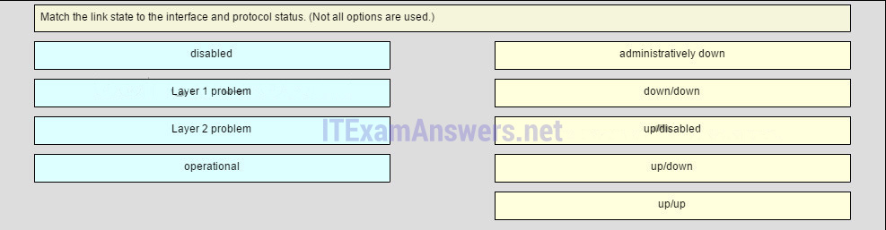
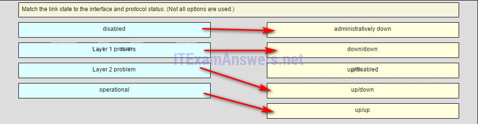

---

## Question 55

**Question:**
Match the inter-VLAN routing method to the corresponding characteristic (not all options are used). Place the options in the following order: router-on-a-stick -> creation of subinterfaces Layer 3 with SVIs -> routing at wire speeds – not scored – Layer 3 with routed ports -> need to issue the no switchport command

**Images:**
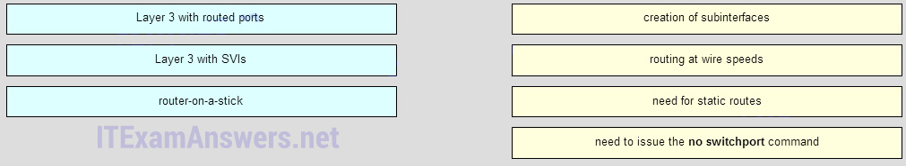
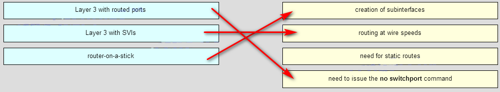

---

## Question 56

**Question:**
Open the PT Activity. Perform the tasks in the activity instructions and then answer the question. Fill in the blank. Do not use abbreviations.Which command is missing on the Layer 3 switch to restore the full connectivity between PC1 and the web server? (Note that typing no shutdown will not fix this problem.)

**Correct Answer:**
ip address 192.168.20.1 255.255.255.0

---

## Question 57

**Question:**
Packet Tracer activity What the missing command on layer 3 switch which allow communication between PC1 and Web Server? “ip address 192.168.20.1 255.255.255.0” on vlan20 Download PDF File below: ITexamanswers.net – CCNA 2 (v5.1 + v6.0) Chapter 5 Exam Answers Full.pdf 2.13 MB 9547 downloads

---
