# CCNA 2 v2 - CCNA 2 - Chapter 6

## Question 1

**Question:**
What are three primary benefits of using VLANs? (Choose three.)

**Choices:**
- **A.** security
- **B.** a reduction in the number of trunk links
- **C.** cost reduction
- **D.** end user satisfaction
- **E.** improved IT staff efficiency
- **F.** no required configuration

**Correct Answer:**
security; cost reduction; improved IT staff efficiency

**Explanation:**
Security, cost reduction, and improved IT staff efficiency are all benefits of using VLANs, along with higher performance, broadcast storm mitigation, and simpler project and application management. End users are not usually aware of VLANs, and VLANs do require configuration. Because VLANs are assigned to access ports, they do not reduce the number of trunk links.

---

## Question 2

**Question:**
Which type of VLAN is used to designate which traffic is untagged when crossing a trunk port?

**Choices:**
- **A.** data
- **B.** default
- **C.** native
- **D.** management

**Correct Answer:**
native

**Explanation:**
A native VLAN is the VLAN that does not receive a VLAN tag in the IEEE 802.1Q frame header. Cisco best practices recommend the use of an unused VLAN (not a data VLAN, the default VLAN of VLAN 1, or the management VLAN) as the native VLAN whenever possible.

---

## Question 3

**Question:**
A network administrator is determining the best placement of VLAN trunk links. Which two types of point-to-point connections utilize VLAN trunking?​ (Choose two.)

**Choices:**
- **A.** between two switches that utilize multiple VLANs
- **B.** between a switch and a client PC
- **C.** between a switch and a server that has an 802.1Q NIC
- **D.** between a switch and a network printer
- **E.** between two switches that share a common VLAN

**Correct Answer:**
between two switches that utilize multiple VLANs; between a switch and a server that has an 802.1Q NIC

**Explanation:**
VLAN trunk links are used to allow all VLAN traffic to propagate between devices such as the link between a switch and a server that has an 802.1Q-capable NIC. Switches can also utilize trunk links to routers, servers, and to other switches.

---

## Question 4

**Question:**
What must the network administrator do to remove Fast Ethernet port fa0/1 from VLAN 2 and assign it to VLAN 3?

**Choices:**
- **A.** Enter the no vlan 2 and the vlan 3 commands in global configuration mode.
- **B.** Enter the switchport access vlan 3 command in interface configuration mode.
- **C.** Enter the switchport trunk native vlan 3 command in interface configuration mode.
- **D.** Enter the no shutdown command in interface configuration mode to return it to the default configuration and then configure the port for VLAN 3.

**Correct Answer:**
Enter the switchport access vlan 3 command in interface configuration mode.

**Explanation:**
There is no need to enter the no shutdown command or remove VLAN 2 using the no vlan 2 command. The switchport trunk command is not used on an access port.

---

## Question 5

**Question:**
When a Cisco switch receives untagged frames on a 802.1Q trunk port, which VLAN ID is the traffic switched to by default?

**Choices:**
- **A.** unused VLAN ID
- **B.** native VLAN ID
- **C.** data VLAN ID
- **D.** management VLAN ID

**Correct Answer:**
native VLAN ID

**Explanation:**
A native VLAN is used to forward untagged frames that are received on a Cisco switch 802.1Q trunk port. Untagged frames that are received on a trunk port are not forwarded to any other VLAN except the native VLAN.

---

## Question 6

**Question:**
Port Fa0/11 on a switch is assigned to VLAN 30. If the command no switchport access vlan 30 is entered on the Fa0/11 interface, what will happen?

**Choices:**
- **A.** Port Fa0/11 will be shutdown.
- **B.** An error message would be displayed.
- **C.** Port Fa0/11 will be returned to VLAN 1.
- **D.** VLAN 30 will be deleted.

**Correct Answer:**
Port Fa0/11 will be returned to VLAN 1.

**Explanation:**
When the no switchport access vlan command is entered, the port is returned to the default VLAN 1. The port will remain active as a member of VLAN 1, and VLAN 30 will still be intact, even if no other ports are associated with it.

---

## Question 7

**Question:**
Which command is used to remove only VLAN 20 from a switch?

**Choices:**
- **A.** delete vlan.dat
- **B.** delete flash:vlan.dat
- **C.** no vlan 20
- **D.** no switchport access vlan 20

**Correct Answer:**
no vlan 20

**Explanation:**
The command no vlan vlan-id is used to remove a particular VLAN from a switch. The delete vlan.dat and delete flash:vlan.dat commands will remove all VLANs after reloading the switch.

---

## Question 8

**Question:**
What happens to a port that is associated with VLAN 10 when the administrator deletes VLAN 10 from the switch?

**Choices:**
- **A.** The port becomes inactive.
- **B.** The port goes back to the default VLAN.
- **C.** The port automatically associates itself with the native VLAN.
- **D.** The port creates the VLAN again.

**Correct Answer:**
The port becomes inactive.

**Explanation:**
If the VLAN that is associated with a port is deleted, the port becomes inactive and cannot communicate with the network any more. To verify that a port is in an inactive state, use the show interfaces switchport command.

---

## Question 9

**Question:**
Which two characteristics match extended range VLANs? (Choose two.)

**Choices:**
- **A.** CDP can be used to learn and store these VLANs.
- **B.** VLAN IDs exist between 1006 to 4094.
- **C.** They are saved in the running-config file by default.
- **D.** VLANs are initialized from flash memory.
- **E.** They are commonly used in small networks.

**Correct Answer:**
VLAN IDs exist between 1006 to 4094.; They are saved in the running-config file by default.

---

## Question 10

**Question:**
A Cisco switch currently allows traffic tagged with VLANs 10 and 20 across trunk port Fa0/5. What is the effect of issuing a switchport trunk allowed vlan 30 command on Fa0/5?

**Choices:**
- **A.** It allows VLANs 1 to 30 on Fa0/5.
- **B.** It allows VLANs 10, 20, and 30 on Fa0/5.
- **C.** It allows only VLAN 30 on Fa0/5.
- **D.** It allows a native VLAN of 30 to be implemented on Fa0/5.

**Correct Answer:**
It allows only VLAN 30 on Fa0/5.

**Explanation:**
The switchport trunk allowed vlan 30 command allows traffic that is tagged with VLAN 30 across the trunk port. Any VLAN that is not specified in this command will not be allowed on this trunk port.

---

## Question 11

**Question:**
Refer to the exhibit. PC-A and PC-B are both in VLAN 60. PC-A is unable to communicate with PC-B. What is the problem?

**Images:**

**Choices:**
- **A.** The native VLAN should be VLAN 60.
- **B.** The native VLAN is being pruned from the link.
- **C.** The trunk has been configured with the switchport nonegotiate command.
- **D.** The VLAN that is used by PC-A is not in the list of allowed VLANs on the trunk.

**Correct Answer:**
The VLAN that is used by PC-A is not in the list of allowed VLANs on the trunk.

**Explanation:**
Because PC-A and PC-B are connected to different switches, traffic between them must flow over the trunk link. Trunks can be configured so that they only allow traffic for particular VLANs to cross the link. In this scenario, VLAN 60, the VLAN that is associated with PC-A and PC-B, has not been allowed across the link, as shown by the output of show interfaces trunk.

---

## Question 12

**Question:**
Refer to the exhibit. DLS1 is connected to another switch, DLS2, via a trunk link. A host that is connected to DLS1 is not able to communicate to a host that is connected to DLS2, even though they are both in VLAN 99. Which command should be added to Fa0/1 on DLS1 to correct the problem?

**Images:**
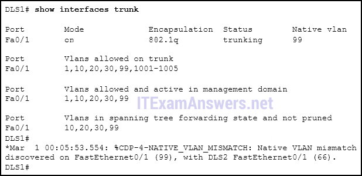

**Choices:**
- **A.** switchport nonegotiate
- **B.** switchport mode dynamic auto
- **C.** switchport trunk native vlan 66
- **D.** switchport trunk allowed vlan add 99

**Correct Answer:**
switchport trunk native vlan 66

**Explanation:**
When configuring 802.1Q trunk links, the native VLAN must match on both sides of the link, or else CDP error messages will be generated, and traffic that is coming from or going to the native VLAN will not be handled correctly.

---

## Question 13

**Question:**
What is a characteristic of legacy inter-VLAN routing?

**Choices:**
- **A.** Only one VLAN can be used in the topology.
- **B.** The router requires one Ethernet link for each VLAN.
- **C.** The user VLAN must be the same ID number as the management VLAN.
- **D.** Inter-VLAN routing must be performed on a switch instead of a router.

**Correct Answer:**
The router requires one Ethernet link for each VLAN.

**Explanation:**
Multiple VLANs are supported with legacy inter-VLAN routing, but each VLAN requires its own Ethernet router link. Ethernet ports are limited on a router. That is why the router-on-a-stick model evolved. The user VLAN should never be the same number as the management VLAN and using a Layer 3 switch as a router is a modern technique, not a legacy one.

---

## Question 14

**Question:**
Which four steps are needed to configure a voice VLAN on a switch port? (Choose four).

**Choices:**
- **A.** Configure the switch port in access mode.
- **B.** Assign a data VLAN to the switch port.
- **C.** Add a voice VLAN.
- **D.** Assign the voice VLAN to the switch port.
- **E.** Activate spanning-tree PortFast on the interface.
- **F.** Ensure that voice traffic is trusted and tagged with a CoS priority value.
- **G.** Configure the switch port interface with subinterfaces.
- **H.** Configure the interface as an IEEE 802.1Q trunk.

**Correct Answer:**
Configure the switch port in access mode.; Add a voice VLAN.; Assign the voice VLAN to the switch port.; Ensure that voice traffic is trusted and tagged with a CoS priority value.

**Explanation:**
To add an IP phone, the following commands should be added to the switch port: SW3(config-vlan)# vlan 150 SW3(config-vlan)# name voice SW3(config-vlan)# int fa0/20 SW3(config-if)# switchport mode access SW3(config-if)# mls qos trust cos SW3(config-if)# switchport access vlan 150

---

## Question 15

**Question:**
What is a disadvantage of using router-on-a-stick inter-VLAN routing?

**Choices:**
- **A.** does not support VLAN-tagged packets
- **B.** requires the use of more physical interfaces than legacy inter-VLAN routing
- **C.** does not scale well beyond 50 VLANs
- **D.** requires the use of multiple router interfaces configured to operate as access links

**Correct Answer:**
does not scale well beyond 50 VLANs

**Explanation:**
Router-on-a-stick inter-VLAN routing does not scale beyond 50 VLANs. The router can receive VLAN-tagged packets and send VLAN-tagged packets to a destination. Router-on-a-stick inter-VLAN routing can utilize a single router interface as a trunk link to receive and forward VLAN traffic and does not require multiple interfaces.

---

## Question 16

**Question:**
Refer to the exhibit. Router RA receives a packet with a source address of 192.168.1.35 and a destination address of 192.168.1.85. What will the router do with this packet?

**Images:**
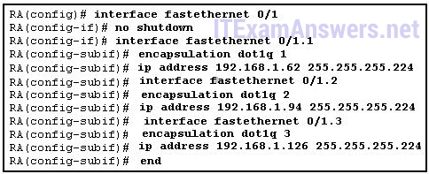

**Choices:**
- **A.** The router will drop the packet.
- **B.** The router will forward the packet out interface FastEthernet 0/1.1.
- **C.** The router will forward the packet out interface FastEthernet 0/1.2.
- **D.** The router will forward the packet out interface FastEthernet 0/1.3.
- **E.** The router will forward the packet out interface FastEthernet 0/1.2 and interface FastEthernet 0/1.3.

**Correct Answer:**
The router will forward the packet out interface FastEthernet 0/1.2.

**Explanation:**
The IP address 192.168.1.85 belongs to network 192.168.1.64/27. The valid host addresses in this network include 192.168.1.65 to 192.168.1.94. The IP address configured for the subinterface of Fa0/1.2 is in the same network, which serves as the default gateway for the VLAN 2.

---

## Question 17

**Question:**
Refer to the exhibit. In what switch mode should port G0/1 be assigned if Cisco best practices are being used?

**Images:**
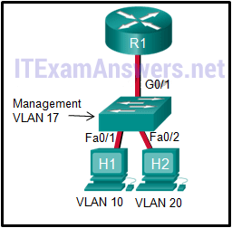

**Choices:**
- **A.** access
- **B.** trunk
- **C.** native
- **D.** auto

**Correct Answer:**
trunk

---

## Question 18

**Question:**
A small college uses VLAN 10 for the classroom network and VLAN 20 for the office network. What is needed to enable communication between these two VLANs while using legacy inter-VLAN routing?

**Choices:**
- **A.** A router with at least two LAN interfaces should be used.
- **B.** Two groups of switches are needed, each with ports that are configured for one VLAN.
- **C.** A router with one VLAN interface is needed to connect to the SVI on a switch.
- **D.** A switch with a port that is configured as trunk is needed to connect to a router.

**Correct Answer:**
A router with at least two LAN interfaces should be used.

**Explanation:**
With legacy inter-VLAN routing, different physical router interfaces are connected to different physical switch ports. The switch ports that connect to the router are in access mode, each belonging to a different VLAN. Switches can have ports that are assigned to different VLANs, but communication between VLANs requires routing function from the router.

---

## Question 19

**Question:**
Refer to the exhibit. A network administrator needs to configure router-on-a-stick for the networks that are shown. How many subinterfaces will have to be created on the router if each VLAN that is shown is to be routed and each VLAN has its own subinterface?

**Images:**
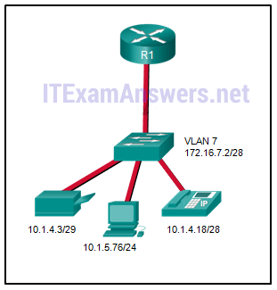

**Choices:**
- **A.** 1
- **B.** 2
- **C.** 3
- **D.** 4
- **E.** 5

**Correct Answer:**
4

**Explanation:**
Based on the IP addresses and masks given, the PC, printer, IP phone, and switch management VLAN are all on different VLANs. This situation will require four subinterfaces on the router.

---

## Question 20

**Question:**
When configuring a router as part of a router-on-a-stick inter-VLAN routing topology, where should the IP address be assigned?

**Choices:**
- **A.** to the interface
- **B.** to the subinterface
- **C.** to the SVI
- **D.** to the VLAN

**Correct Answer:**
to the subinterface

**Explanation:**
The IP address and the encapsulation type should be assigned to each router subinterface in a router-on-a-stick inter-VLAN topology.

---

## Question 21

**Question:**
A high school uses VLAN15 for the laboratory network and VLAN30 for the faculty network. What is required to enable communication between these two VLANs while using the router-on-a-stick approach?

**Choices:**
- **A.** A multilayer switch is needed.
- **B.** A router with at least two LAN interfaces is needed.
- **C.** Two groups of switches are needed, each with ports that are configured for one VLAN.
- **D.** A switch with a port that is configured as a trunk is needed when connecting to the router.

**Correct Answer:**
A switch with a port that is configured as a trunk is needed when connecting to the router.

**Explanation:**
With router-on-a-stick, inter-VLAN routing is performed by a router with a single router interface that is connected to a switch port configured with trunk mode. Multiple subinterfaces, each configured for a VLAN, can be configured under the single physical router interface. Switches can have ports that are assigned to different VLANs, but communication between those VLANs requires routing function from the router. A multilayer switch is not used in a router-on-a-stick approach to inter-VLAN routing.

---

## Question 22

**Question:**
Refer to the exhibit. A router-on-a-stick configuration was implemented for VLANs 15, 30, and 45, according to the show running-config command output. PCs on VLAN 45 that are using the 172.16.45.0 /24 network are having trouble connecting to PCs on VLAN 30 in the 172.16.30.0 /24 network. Which error is most likely causing this problem?​

**Images:**
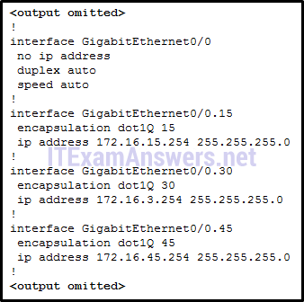

**Choices:**
- **A.** The wrong VLAN has been configured on GigabitEthernet 0/0.45.
- **B.** The command no shutdown is missing on GigabitEthernet 0/0.30.
- **C.** The GigabitEthernet 0/0 interface is missing an IP address.
- **D.** There is an incorrect IP address configured on GigabitEthernet 0/0.30.

**Correct Answer:**
There is an incorrect IP address configured on GigabitEthernet 0/0.30.

**Explanation:**
he subinterface GigabitEthernet 0/0.30 has an IP address that does not correspond to the VLAN addressing scheme. The physical interface GigabitEthernet 0/0 does not need an IP address for the subinterfaces to function. Subinterfaces do not require the no shutdown command.

---

## Question 23

**Question:**
Match the IEEE 802.1Q standard VLAN tag field with the descriptions. (Not all options are used.) Place the options in the following order: User Priority –> value that supports level or service implementation Type –> value for the tag protocol ID value Canonical Format Identifier –> an identifier that enables Token Ring frames to be carried across Ethernet Links – not scored – -value for the application protocol of the user data in a frame VLAN ID –> VLAN number The IEEE 802.1Q standard header includes a 4-byte VLAN tag: Type – A 2-byte value called the tag protocol ID (TPID) value. User priority – A 3-bit value that supports level or service implementation. Canonical Format Identifier (CFI) – A 1-bit identifier that enables Token Ring frames to be carried across Ethernet links. VLAN ID (VID) – A 12-bit VLAN identification number that supports up to 4096 VLAN IDs.

**Images:**
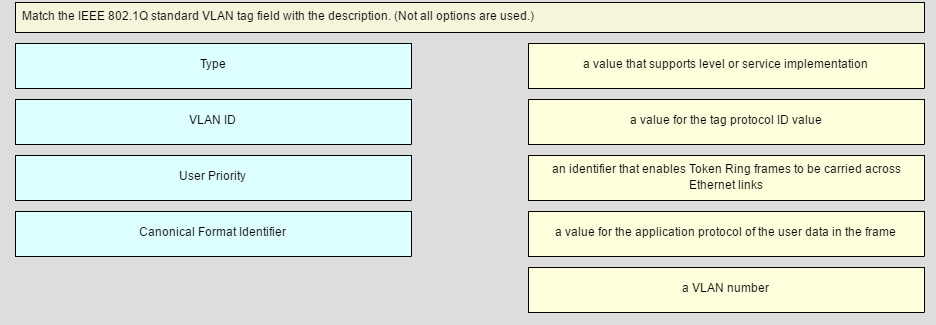
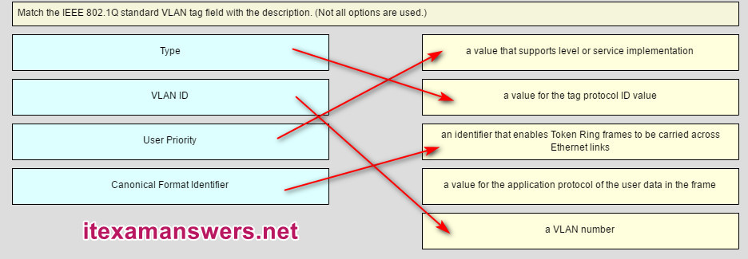

---

## Question 24

**Question:**
Fill in the blank. Use the full command syntax. The show vlan command displays the VLAN assignment for all ports as well as the existing VLANs on the switch.

---

## Question 25

**Question:**
Open the PT Activity. Perform the tasks in the activity instructions and then answer the question. Which PCs will receive the broadcast sent by PC-C?

**Images:**
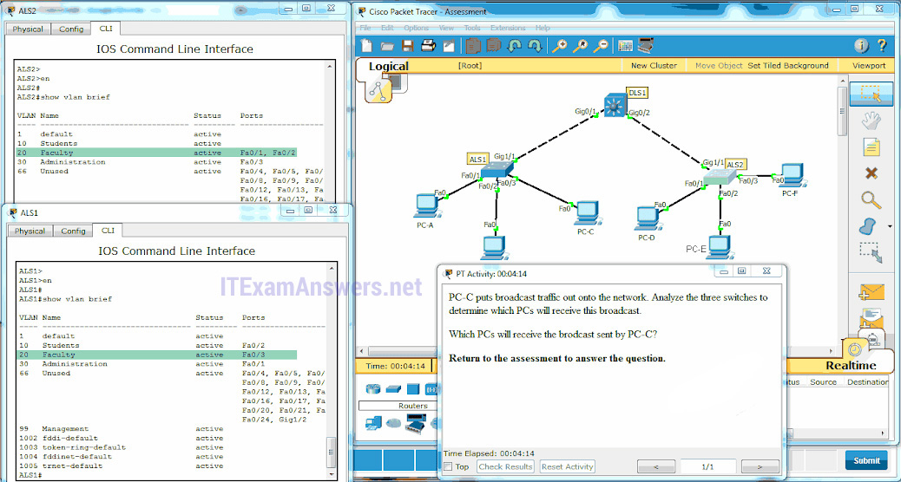

**Choices:**
- **A.** PC-A, PC-B
- **B.** PC-D, PC-E
- **C.** PC-A, PC-B, PC-E
- **D.** PC-A, PC-B, PC-D, PC-E
- **E.** PC-A, PC-B, PC-D, PC-E, PC-F

**Correct Answer:**
PC-D, PC-E

**Explanation:**
Only hosts in the same VLAN as PC-C (VLAN 20) will receive the broadcast. The trunk links will carry the broadcast to ALS2 where it will be send to PC-D and PC-E, which are also in VLAN 20. PC-A, PC-B, and PC-F are not in the same VLAN as PC-C. This information can be verified by issuing the show vlan and show interfaces trunk commands. Older Version:

---

## Question 26

**Question:**
Refer to the exhibit. What command would be used to configure a static route on R1 so that traffic from both LANs can reach the 2001:db8:1:4::/64 remote network?

**Images:**

**Choices:**
- **A.** ipv6 route ::/0 serial0/0/0
- **B.** ipv6 route 2001:db8:1:4::/64 2001:db8:1:3::1
- **C.** ipv6 route 2001:db8:1:4::/64 2001:db8:1:3::2
- **D.** ipv6 route 2001:db8:1::/65 2001:db8:1:3::1

**Correct Answer:**
ipv6 route 2001:db8:1:4::/64 2001:db8:1:3::2

---

## Question 27

**Question:**
Refer to the exhibit. The network engineer for the company that is shown wants to use the primary ISP connection for all external connectivity. The backup ISP connection is used only if the primary ISP connection fails. Which set of commands would accomplish this goal?

**Images:**
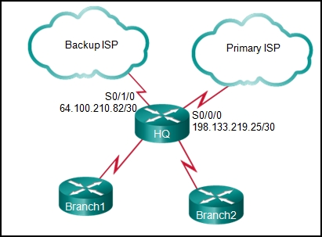

**Choices:**
- **A.** ip route 198.133.219.24 255.255.255.252 ip route 64.100.210.80 255.255.255.252
- **B.** ip route 198.133.219.24 255.255.255.252 ip route 64.100.210.80 255.255.255.252 10
- **C.** ip route 0.0.0.0 0.0.0.0 s0/0/0 ip route 0.0.0.0 0.0.0.0 s0/1/0
- **D.** ip route 0.0.0.0 0.0.0.0 s0/0/0 ip route 0.0.0.0 0.0.0.0 s0/1/0 10

**Correct Answer:**
ip route 0.0.0.0 0.0.0.0 s0/0/0 ip route 0.0.0.0 0.0.0.0 s0/1/0 10

---

## Question 28

**Question:**
Refer to the exhibit. What routing solution will allow both PC A and PC B to access the Internet with the minimum amount of router CPU and network bandwidth utilization?

**Images:**
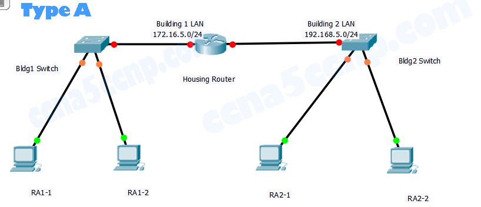

**Choices:**
- **A.** Configure a static route from R1 to Edge and a dynamic route from Edge to R1.
- **B.** Configure a static default route from R1 to Edge, a default route from Edge to the Internet, and a static route from Edge to R1.
- **C.** Configure a dynamic route from R1 to Edge and a static route from Edge to R1.
- **D.** Configure a dynamic routing protocol between R1 and Edge and advertise all routes.

**Correct Answer:**
Configure a static default route from R1 to Edge, a default route from Edge to the Internet, and a static route from Edge to R1.

---

## Question 29

**Question:**
What are two advantages of static routing over dynamic routing? (Choose two.)

**Choices:**
- **A.** Static routing is more secure because it does not advertise over the network.
- **B.** Static routing scales well with expanding networks.
- **C.** Static routing requires very little knowledge of the network for correct implementation.
- **D.** Static routing uses fewer router resources than dynamic routing.
- **E.** Static routing is relatively easy to configure for large networks.

**Correct Answer:**
Static routing is more secure because it does not advertise over the network.; Static routing uses fewer router resources than dynamic routing.

---

## Question 30

**Question:**
What type of route allows a router to forward packets even though its routing table contains no specific route to the destination network?

**Choices:**
- **A.** dynamic route
- **B.** default route
- **C.** destination route
- **D.** generic route

**Correct Answer:**
default route

**Explanation:**
A static default route is a catch-all route for all unmatched networks.

---

## Question 31

**Question:**
Why would a floating static route be configured with an administrative distance that is higher than the administrative distance of a dynamic routing protocol that is running on the same router?

**Choices:**
- **A.** to be used as a backup route
- **B.** to load-balance the traffic
- **C.** to act as a gateway of last resort
- **D.** to be the priority route in the routing table

**Correct Answer:**
to be used as a backup route

---

## Question 32

**Question:**
What is the correct syntax of a floating static route?

**Choices:**
- **A.** ip route 209.165.200.228 255.255.255.248 serial 0/0/0
- **B.** ip route 209.165.200.228 255.255.255.248 10.0.0.1 120
- **C.** ip route 0.0.0.0 0.0.0.0 serial 0/0/0
- **D.** ip route 172.16.0.0 255.248.0.0 10.0.0.1

**Correct Answer:**
ip route 209.165.200.228 255.255.255.248 10.0.0.1 120

---

## Question 33

**Question:**
Which type of static route that is configured on a router uses only the exit interface?

**Choices:**
- **A.** recursive static route
- **B.** directly connected static route
- **C.** fully specified static route
- **D.** default static route

**Correct Answer:**
directly connected static route

---

## Question 34

**Question:**
Refer to the graphic. Which command would be used on router A to configure a static route to direct traffic from LAN A that is destined for LAN C?

**Images:**

**Choices:**
- **A.** A(config)# ip route 192.168.4.0 255.255.255.0 192.168.5.2
- **B.** A(config)# ip route 192.168.4.0 255.255.255.0 192.168.3.2
- **C.** A(config)# ip route 192.168.5.0 255.255.255.0 192.168.3.2
- **D.** A(config)# ip route 192.168.3.0 255.255.255.0 192.168.3.1
- **E.** A(config)# ip route 192.168.3.2 255.255.255.0 192.168.4.0

**Correct Answer:**
A(config)# ip route 192.168.4.0 255.255.255.0 192.168.3.2

---

## Question 35

**Question:**
The network administrator configures the router with the ip route 172.16.1.0 255.255.255.0 172.16.2.2 command. How will this route appear in the routing table?

**Choices:**
- **A.** C 172.16.1.0 is directly connected, Serial0/0
- **B.** S 172.16.1.0 is directly connected, Serial0/0
- **C.** C 172.16.1.0 [1/0] via 172.16.2.2
- **D.** S 172.16.1.0 [1/0] via 172.16.2.2

**Correct Answer:**
S 172.16.1.0 [1/0] via 172.16.2.2

**Explanation:**
The route will appear in the routing with a code of S (Static).

---

## Question 36

**Question:**
Refer to the exhibit. R1 receives a packet destined for the IP address 192.168.2.10. Out which interface will R1 forward the packet?

**Images:**

**Choices:**
- **A.** FastEthernet0/0
- **B.** FastEthernet0/1
- **C.** Serial0/0/0
- **D.** Serial0/0/1

**Correct Answer:**
Serial0/0/1

---

## Question 37

**Question:**
Refer to the exhibit. The network administrator needs to configure a default route on the Border router. Which command would the administrator use to configure a default route that will require the least amount of router processing when forwarding packets?

**Images:**
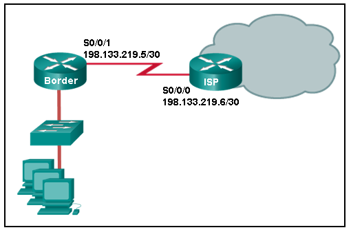

**Choices:**
- **A.** Border(config)# ip route 0.0.0.0 0.0.0.0 198.133.219.5
- **B.** Border(config)# ip route 0.0.0.0 0.0.0.0 198.133.219.6
- **C.** Border(config)# ip route 0.0.0.0 0.0.0.0 s0/0/1
- **D.** Border(config)# ip route 0.0.0.0 0.0.0.0 s0/0/0

**Correct Answer:**
Border(config)# ip route 0.0.0.0 0.0.0.0 s0/0/1

---

## Question 38

**Question:**
What two pieces of information are needed in a fully specified static route to eliminate recursive lookups? (Choose two.)

**Choices:**
- **A.** the interface ID exit interface
- **B.** the interface ID of the next-hop neighbor
- **C.** the IP address of the next-hop neighbor
- **D.** the administrative distance for the destination network
- **E.** the IP address of the exit interface

**Correct Answer:**
the interface ID exit interface; the IP address of the next-hop neighbor

---

## Question 39

**Question:**
A network administrator issues the show vlan brief command while troubleshooting a user support ticket. What output will be displayed?

**Choices:**
- **A.** the VLAN assignment and membership for all switch ports
- **B.** the VLAN assignment and trunking encapsulation
- **C.** the VLAN assignment and native VLAN
- **D.** the VLAN assignment and membership for device MAC addresses

**Correct Answer:**
the VLAN assignment and membership for all switch ports

---

## Question 40

**Question:**
Refer to the exhibit. Which default static route command would allow R1 to potentially reach all unknown networks on the Internet?

**Images:**
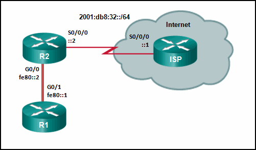

**Choices:**
- **A.** R1(config)# ipv6 route 2001:db8:32::/64 G0/0
- **B.** R1(config)# ipv6 route ::/0 G0/0 fe80::2
- **C.** R1(config)# ipv6 route ::/0 G0/1 fe80::2
- **D.** R1(config)# ipv6 route 2001:db8:32::/64 G0/1 fe80::2

**Correct Answer:**
R1(config)# ipv6 route ::/0 G0/1 fe80::2

---

## Question 41

**Question:**
Which two statements describe classful IP addresses? (Choose two.)

**Choices:**
- **A.** It is possible to determine which class an address belongs to by reading the first bit.
- **B.** The number of bits used to identify the hosts is fixed by the class of the network.
- **C.** Only Class A addresses can be represented by high-order bits 100.
- **D.** Up to 24 bits can make up the host portion of a Class C address.
- **E.** All subnets in a network are the same size.
- **F.** Three of the five classes of addresses are reserved for multicasts and experimental use.

**Correct Answer:**
The number of bits used to identify the hosts is fixed by the class of the network.; All subnets in a network are the same size.

---

## Question 42

**Question:**
What would be the first step in calculating a summarized route for 5 networks?

**Choices:**
- **A.** Starting from the far right, determine the octet in which all the numbers are the same.
- **B.** Determine the network with the lowest number.
- **C.** Write all network numbers in binary.
- **D.** Write all subnet masks in binary.

**Correct Answer:**
Write all network numbers in binary.

---

## Question 43

**Question:**
A company has several networks with the following IP address requirements: IP phones – 50 PCs – 70 IP cameras – 10 wireless access points – 10 network printers – 10 network scanners – 2> Which block of addresses would be the minimum to accommodate all of these devices if each type of device was on its own network?

**Choices:**
- **A.** 172.16.0.0/25
- **B.** 172.16.0.0/24
- **C.** 172.16.0.0/23
- **D.** 172.16.0.0/22

**Correct Answer:**
172.16.0.0/24

---

## Question 44

**Question:**
Consider the following command: ip route 192.168.10.0 255.255.255.0 10.10.10.2 5 How would an administrator test this configuration?

**Choices:**
- **A.** Delete the default gateway route on the router.
- **B.** Ping any valid address on the 192.168.10.0/24 network.
- **C.** Manually shut down the router interface used as a primary route.
- **D.** Ping from the 192.168.10.0 network to the 10.10.10.2 address.

**Correct Answer:**
Manually shut down the router interface used as a primary route.

---

## Question 45

**Question:**
What happens to a static route entry in a routing table when the outgoing interface associated with that route goes into the down state?

**Choices:**
- **A.** The static route is removed from the routing table.
- **B.** The router polls neighbors for a replacement route.
- **C.** The static route remains in the table because it was defined as static.
- **D.** The router automatically redirects the static route to use another interface.

**Correct Answer:**
The static route is removed from the routing table.

---

## Question 46

**Question:**
Refer to the exhibit. Which is the best way for PC A and PC B to successfully communicate with sites on the Internet?

**Images:**
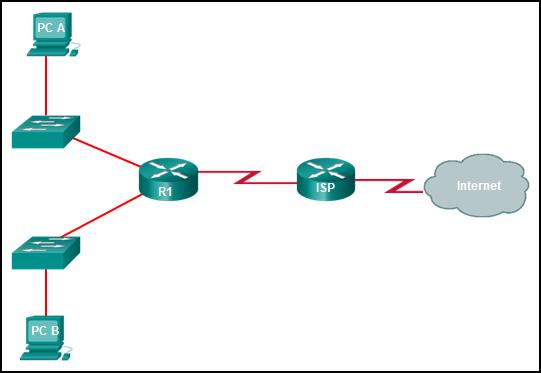

**Choices:**
- **A.** Configure a static route from R1 to ISP and a dynamic route from ISP to R1.
- **B.** Configure a default route from R1 to ISP and a static route from ISP to R1.
- **C.** Configure a dynamic route from R1 to ISP and a static route from ISP to R1.
- **D.** Configure a routing protocol between R1 and ISP and advertise all the routes.

**Correct Answer:**
Configure a default route from R1 to ISP and a static route from ISP to R1.

---

## Question 47

**Question:**
Refer to the exhibit. The small company shown uses static routing. Users on the R2 LAN have reported a problem with connectivity. What is the issue?

**Images:**
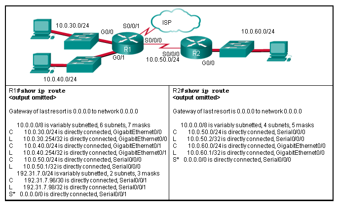

**Choices:**
- **A.** R2 needs a static route to the R1 LANs.
- **B.** R1 and R2 must use a dynamic routing protocol.
- **C.** R1 needs a default route to R2.
- **D.** R1 needs a static route to the R2 LAN.
- **E.** R2 needs a static route to the Internet.

**Correct Answer:**
R1 needs a static route to the R2 LAN.

---

## Question 48

**Question:**
What happens to a static route entry in a routing table when the outgoing interface is not available?

**Choices:**
- **A.** The route is removed from the table.
- **B.** The router polls neighbors for a replacement route.
- **C.** The route remains in the table because it was defined as static.
- **D.** The router redirects the static route to compensate for the loss of the next hop device.

**Correct Answer:**
The route is removed from the table.

---

## Question 49

**Question:**
A company has several networks with the following IP address requirements: IP phones – 50 PCs – 70 IP cameras – 10 wireless access points – 10 network printers – 10 network scanners – 2 What does VLSM allow a network administrator to do?

**Choices:**
- **A.** utilize one public IP address to translate multiple private addresses
- **B.** utilize multiple different subnet masks in the same IP address space
- **C.** utilize one dynamic routing protocol throughout the entire network
- **D.** utilize multiple routing protocols within an autonomous system
- **E.** utilize one subnet mask throughout a hierarchical network

**Correct Answer:**
utilize multiple different subnet masks in the same IP address space

---

## Question 50

**Question:**
What would be the best summary route for the following networks? 10.50.168.0/23 10.50.170.0/23 10.50.172.0/23 10.50.174.0/24

**Choices:**
- **A.** 10.50.160.0/22
- **B.** 10.50.164.0/23
- **C.** 10.50.168.0/16
- **D.** 10.50.168.0/21
- **E.** 10.50.168.0/22
- **F.** 10.50.168.0/23

**Correct Answer:**
10.50.168.0/21

---

## Question 51

**Question:**
What is a valid summary route for IPv6 networks 2001:0DB8:ACAD:4::/64, 2001:0DB8:ACAD:5::/64, 2001:0DB8:ACAD:6::/64, and 2001:0DB8:ACAD:7::/64?

**Choices:**
- **A.** 2001:0DB8:ACAD:0000::/63
- **B.** 2001:0DB8:ACAD:0000::/64
- **C.** 2001:0DB8:ACAD:0004::/62
- **D.** 2001:0DB8:ACAD:0004::/63

**Correct Answer:**
2001:0DB8:ACAD:0004::/62

---

## Question 52

**Question:**
Which three IOS troubleshooting commands can help to isolate problems with a static route? (Choose three.)

**Choices:**
- **A.** show ip route
- **B.** show ip interface brief
- **C.** ping
- **D.** tracert
- **E.** show arp
- **F.** show version

**Correct Answer:**
show ip route; show ip interface brief; ping

---

## Question 53

**Question:**
Refer to the exhibit. What two commands will change the next-hop address for the 10.0.0.0/8 network from 172.16.40.2 to 192.168.1.2? (Choose two.)

**Images:**
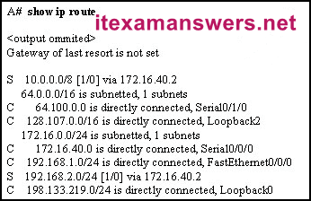

**Choices:**
- **A.** A(config)# ip route 10.0.0.0 255.0.0.0 192.168.1.2
- **B.** A(config)# ip route 10.0.0.0 255.0.0.0 s0/0/0
- **C.** A(config)# no ip address 10.0.0.1 255.0.0.0 172.16.40.2
- **D.** A(config)# no network 10.0.0.0 255.0.0.0 172.16.40.2
- **E.** A(config)# no ip route 10.0.0.0 255.0.0.0 172.16.40.2

**Correct Answer:**
A(config)# ip route 10.0.0.0 255.0.0.0 192.168.1.2; A(config)# no ip route 10.0.0.0 255.0.0.0 172.16.40.2

---

## Question 54

**Question:**
Launch PT. Hide and Save PT Open the PT activity. Perform the tasks in the activity instructions and then answer the question. What is the name of the web server that is displayed in the webpage?

**Images:**
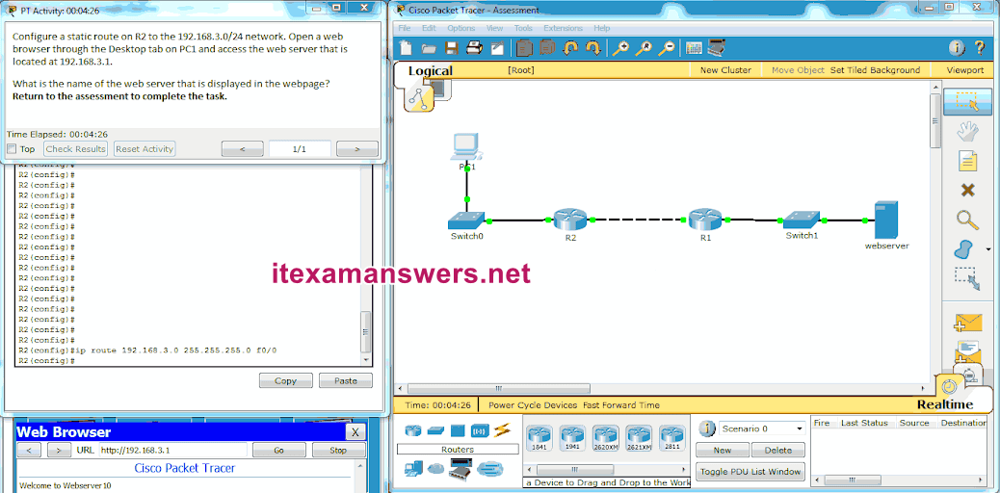

**Choices:**
- **A.** Webserver10
- **B.** Main-Webserver
- **C.** WWW-Server
- **D.** MNSRV

**Correct Answer:**
Webserver10

---

## Question 55

**Question:**
Launch PT. Hide and Save PT Open the PT Activity. Perform the tasks in the activity instructions and then answer the question. What IPv6 static route can be configured on router R1 to make a fully converged network?

**Images:**
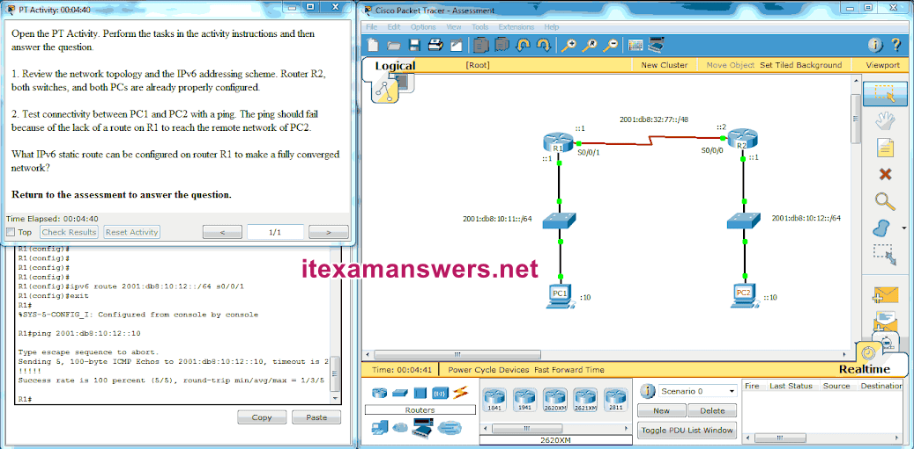

**Choices:**
- **A.** ipv6 route 2001:db8:10:12::/64 S0/0/1
- **B.** ipv6 route 2001:db8:10:12::/64 2001:db8:32:77::1
- **C.** ipv6 route 2001:db8:10:12::/64 S0/0/0
- **D.** ipv6 route 2001:db8:10:12::/64 2001:db8:10:12::1

**Correct Answer:**
ipv6 route 2001:db8:10:12::/64 S0/0/1

---

## Question 56

**Question:**
Consider the following command: ip route 192.168.10.0 255.255.255.0 10.10.10.2 5 How would an administrator test this configuration?

**Choices:**
- **A.** Ping from the 192.168.10.0 network to the 10.10.10.2 address.
- **B.** Ping any valid address on the 192.168.10.0/24 network.
- **C.** Delete the default gateway route on the router.
- **D.** Manually shut down the router interface used as a primary route.

**Correct Answer:**
Manually shut down the router interface used as a primary route.

**Explanation:**
Download PDF File below: ITexamanswers.net – CCNA 2 (v5.1 + v6.0) Chapter 6 Exam Answers Full.pdf 1.45 MB 9403 downloads ... Download

---
