# CCNA 2 v2 - CCNA 2 - Chapter 7

## Question 1

**Question:**
In which configuration would an outbound ACL placement be preferred over an inbound ACL placement?

**Choices:**
- **A.** when the ACL is applied to an outbound interface to filter packets coming from multiple inbound interfaces before the packets exit the interface
- **B.** when a router has more than one ACL
- **C.** when an outbound ACL is closer to the source of the traffic flow
- **D.** when an interface is filtered by an outbound ACL and the network attached to the interface is the source network being filtered within the ACL

**Correct Answer:**
when the ACL is applied to an outbound interface to filter packets coming from multiple inbound interfaces before the packets exit the interface

**Explanation:**
An outbound ACL should be utilized when the same ACL filtering rules will be applied to packets coming from more than one inbound interface before exiting a single outbound interface. The outbound ACL will be applied on the single outbound interface.

---

## Question 2

**Question:**
Which address is required in the command syntax of a standard ACL?

**Choices:**
- **A.** source MAC address
- **B.** destination MAC address
- **C.** source IP address
- **D.** destination IP address

**Correct Answer:**
source IP address

**Explanation:**
The only filter that can be applied with a standard ACL is the source IP address. An extended ACL can use multiple criteria to filter traffic, such as source IP address, destination IP address, type of traffic, and type of message.

---

## Question 3

**Question:**
Which statement describes a difference between the operation of inbound and outbound ACLs?

**Choices:**
- **A.** In contrast to outbound ALCs, inbound ACLs can be used to filter packets with multiple criteria.
- **B.** Inbound ACLs can be used in both routers and switches but outbound ACLs can be used only on routers.
- **C.** Inbound ACLs are processed before the packets are routed while outbound ACLs are processed after the routing is completed.
- **D.** On a network interface, more than one inbound ACL can be configured but only one outbound ACL can be configured.

**Correct Answer:**
Inbound ACLs are processed before the packets are routed while outbound ACLs are processed after the routing is completed.

---

## Question 4

**Question:**
Which three statements describe ACL processing of packets? (Choose three.)

**Choices:**
- **A.** An implicit deny any rejects any packet that does not match any ACE.
- **B.** A packet can either be rejected or forwarded as directed by the ACE that is matched.
- **C.** A packet that has been denied by one ACE can be permitted by a subsequent ACE.
- **D.** A packet that does not match the conditions of any ACE will be forwarded by default.
- **E.** Each statement is checked only until a match is detected or until the end of the ACE list.
- **F.** Each packet is compared to the conditions of every ACE in the ACL before a forwarding decision is made.

**Correct Answer:**
An implicit deny any rejects any packet that does not match any ACE.; A packet can either be rejected or forwarded as directed by the ACE that is matched.; Each statement is checked only until a match is detected or until the end of the ACE list.

**Explanation:**
When a packet comes into a router that has an ACL configured on the interface, the router compares the condition of each ACE to determine if the defined criteria has been met. If met, the router takes the action defined in the ACE (allows the packet through or discards it). If the defined criteria has not been met, the router proceeds to the next ACE. An implicit deny any statement is at the end of every standard ACL.

---

## Question 5

**Question:**
What single access list statement matches all of the following networks? 192.168.16.0 192.168.17.0 192.168.18.0 192.168.19.0

**Choices:**
- **A.** access-list 10 permit 192.168.16.0 0.0.3.255
- **B.** access-list 10 permit 192.168.16.0 0.0.0.255
- **C.** access-list 10 permit 192.168.16.0 0.0.15.255
- **D.** access-list 10 permit 192.168.0.0 0.0.15.255

**Correct Answer:**
access-list 10 permit 192.168.16.0 0.0.3.255

**Explanation:**
The ACL statement access-list 10 permit 192.168.16.0 0.0.3.255 will match all four network prefixes. All four prefixes have the same 22 high order bits. These 22 high order bits are matched by the network prefix and wildcard mask of 192.168.16.0 0.0.3.255.

---

## Question 6

**Question:**
A network administrator needs to configure a standard ACL so that only the workstation of the administrator with the IP address 192.168.15.23 can access the virtual terminal of the main router. Which two configuration commands can achieve the task? (Choose two.)

**Choices:**
- **A.** Router1(config)# access-list 10 permit host 192.168.15.23
- **B.** Router1(config)# access-list 10 permit 192.168.15.23 0.0.0.0
- **C.** Router1(config)# access-list 10 permit 192.168.15.23 0.0.0.255
- **D.** Router1(config)# access-list 10 permit 192.168.15.23 255.255.255.0
- **E.** Router1(config)# access-list 10 permit 192.168.15.23 255.255.255.255

**Correct Answer:**
Router1(config)# access-list 10 permit host 192.168.15.23; Router1(config)# access-list 10 permit 192.168.15.23 0.0.0.0

**Explanation:**
To permit or deny one specific IP address, either the wildcard mask 0.0.0.0 (used after the IP address) or the wildcard mask keyword host (used before the IP address) can be used.

---

## Question 7

**Question:**
If a router has two interfaces and is routing both IPv4 and IPv6 traffic, how many ACLs could be created and applied to it?

**Choices:**
- **A.** 4
- **B.** 6
- **C.** 8
- **D.** 12
- **E.** 16

**Correct Answer:**
8

**Explanation:**
In calculating how many ACLs can be configured, use the rule of “three Ps”: one ACL per protocol, per direction, per interface. In this case, 2 interfaces x 2 protocols x 2 directions yields 8 possible ACLs.

---

## Question 8

**Question:**
Which three statements are generally considered to be best practices in the placement of ACLs? (Choose three.)

**Choices:**
- **A.** Place standard ACLs close to the source IP address of the traffic.
- **B.** Place extended ACLs close to the destination IP address of the traffic.
- **C.** Filter unwanted traffic before it travels onto a low-bandwidth link.
- **D.** Place extended ACLs close to the source IP address of the traffic.
- **E.** Place standard ACLs close to the destination IP address of the traffic.
- **F.** For every inbound ACL placed on an interface, there should be a matching outbound ACL.

**Correct Answer:**
Filter unwanted traffic before it travels onto a low-bandwidth link.; Place extended ACLs close to the source IP address of the traffic.; Place standard ACLs close to the destination IP address of the traffic.

**Explanation:**
Extended ACLs should be placed as close as possible to the source IP address, so that traffic that needs to be filtered does not cross the network and use network resources. Because standard ACLs do not specify a destination address, they should be placed as close to the destination as possible. Placing a standard ACL close to the source may have the effect of filtering all traffic, and limiting services to other hosts. Filtering unwanted traffic before it enters low-bandwidth links preserves bandwidth and supports network functionality. Decisions on placing ACLs inbound or outbound are dependent on the requirements to be met.

---

## Question 9

**Question:**
Refer to the exhibit. Which command would be used in a standard ACL to allow only devices on the network attached to R2 G0/0 interface to access the networks attached to R1?

**Images:**
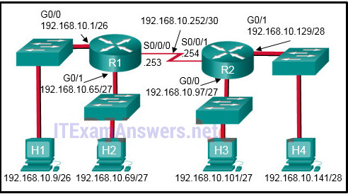

**Choices:**
- **A.** access-list 1 permit 192.168.10.0 0.0.0.63
- **B.** access-list 1 permit 192.168.10.96 0.0.0.31
- **C.** access-list 1 permit 192.168.10.0 0.0.0.255
- **D.** access-list 1 permit 192.168.10.128 0.0.0.63

**Correct Answer:**
access-list 1 permit 192.168.10.96 0.0.0.31

**Explanation:**
Standard access lists only filter on the source IP address. In the design, the packets would be coming from the 192.168.10.96/27 network (the R2 G0/0 network). The correct ACL is access-list 1 permit 192.168.10.96 0.0.0.31.

---

## Question 10

**Question:**
Refer to the exhibit. If the network administrator created a standard ACL that allows only devices that connect to the R2 G0/0 network access to the devices on the R1 G0/1 interface, how should the ACL be applied?

**Images:**
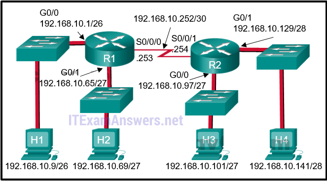

**Choices:**
- **A.** inbound on the R2 G0/0 interface
- **B.** outbound on the R1 G0/1 interface
- **C.** inbound on the R1 G0/1 interface
- **D.** outbound on the R2 S0/0/1 interface

**Correct Answer:**
outbound on the R1 G0/1 interface

**Explanation:**
Because standard access lists only filter on the source IP address, they are commonly placed closest to the destination network. In this example, the source packets will be coming from the R2 G0/0 network. The destination is the R1 G0/1 network. The proper ACL placement is outbound on the R1 G0/1 interface.

---

## Question 11

**Question:**
Refer to the following output. What is the significance of the 4 match(es) statement? R1# <output omitted> 10 permit 192.168.1.56 0.0.0.7 20 permit 192.168.1.64 0.0.0.63 (4 match(es)) 30 deny any (8 match(es))

**Choices:**
- **A.** Four packets have been denied that have been sourced from any IP address.
- **B.** Four packets have been denied that are destined for the 192.168.1.64 network.
- **C.** Four packets have been allowed through the router from PCs in the network of 192.168.1.64.
- **D.** Four packets have been allowed through the router to reach the destination network of 192.168.1.64/26.

**Correct Answer:**
Four packets have been allowed through the router from PCs in the network of 192.168.1.64.

**Explanation:**
The show access-lists command shows how many packets have met the criteria for each ACE in terms of a specific number of “matches.”

---

## Question 12

**Question:**
On which router should the show access-lists command be executed?

**Choices:**
- **A.** on the router that routes the packet referenced in the ACL to the final destination network
- **B.** on the router that routes the packet referenced in the ACL from the source network
- **C.** on any router through which the packet referenced in the ACL travels
- **D.** on the router that has the ACL configured

**Correct Answer:**
on the router that has the ACL configured

**Explanation:**
The show access-lists command is only relevant to traffic passing through the router on which the ACL is configured.

---

## Question 13

**Question:**
What is the quickest way to remove a single ACE from a named ACL?

**Choices:**
- **A.** Use the no keyword and the sequence number of the ACE to be removed.
- **B.** Use the no access-list command to remove the entire ACL, then recreate it without the ACE.
- **C.** Copy the ACL into a text editor, remove the ACE, then copy the ACL back into the router.
- **D.** Create a new ACL with a different number and apply the new ACL to the router interface.

**Correct Answer:**
Use the no keyword and the sequence number of the ACE to be removed.

**Explanation:**
Named ACL ACEs can be removed using the no command followed by the sequence number.

---

## Question 14

**Question:**
Which feature will require the use of a named standard ACL rather than a numbered standard ACL?

**Choices:**
- **A.** the ability to filter traffic based on a specific protocol
- **B.** the ability to filter traffic based on an entire protocol suite and destination
- **C.** the ability to specify source and destination addresses to use when identifying traffic
- **D.** the ability to add additional ACEs in the middle of the ACL without deleting and re-creating the list

**Correct Answer:**
the ability to add additional ACEs in the middle of the ACL without deleting and re-creating the list

**Explanation:**
Standard ACLs (whether numbered or named) only filter on the source IP address. Having a named ACL makes it easier at times to identify the purpose as well as modify the ACL.

---

## Question 15

**Question:**
An administrator has configured an access list on R1 to allow SSH administrative access from host 172.16.1.100. Which command correctly applies the ACL?

**Choices:**
- **A.** R1(config-if)# ip access-group 1 in
- **B.** R1(config-if)# ip access-group 1 out
- **C.** R1(config-line)# access-class 1 in
- **D.** R1(config-line)# access-class 1 out

**Correct Answer:**
R1(config-line)# access-class 1 in

**Explanation:**
Administrative access over SSH to the router is through the vty lines. Therefore, the ACL must be applied to those lines in the inbound direction. This is accomplished by entering line configuration mode and issuing the access-class command.

---

## Question 16

**Question:**
Which type of router connection can be secured by the access-class command?

**Choices:**
- **A.** vty
- **B.** console
- **C.** serial
- **D.** Ethernet

**Correct Answer:**
vty

**Explanation:**
Access to vty lines can be filtered with an ACL and applied using the access-class in command.

---

## Question 17

**Question:**
Consider the following output for an ACL that has been applied to a router via the access-class in command. What can a network administrator determine from the output that is shown?

**Choices:**
- **A.** Two devices connected to the router have IP addresses of 192.168.10.x.
- **B.** Traffic from one device was not allowed to come into one router port and be routed outbound a different router port.
- **C.** Two devices were able to use SSH or Telnet to gain access to the router.
- **D.** Traffic from two devices was allowed to enter one router port and be routed outbound to a different router port.

**Correct Answer:**
Two devices were able to use SSH or Telnet to gain access to the router.

**Explanation:**
The access-class command is used only on VTY ports. VTY ports support Telnet and/or SSH traffic. The match permit ACE is how many attempts were allowed using the VTY ports. The match deny ACE shows that a device from a network other than 192.168.10.0 was not allowed to access the router through the VTY ports.

---

## Question 18

**Question:**
Refer to the exhibit. A router has an existing ACL that permits all traffic from the 172.16.0.0 network. The administrator attempts to add a new ACE to the ACL that denies packets from host 172.16.0.1 and receives the error message that is shown in the exhibit. What action can the administrator take to block packets from host 172.16.0.1 while still permitting all other traffic from the 172.16.0.0 network?

**Images:**
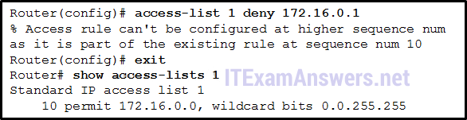

**Choices:**
- **A.** Manually add the new deny ACE with a sequence number of 5.
- **B.** Manually add the new deny ACE with a sequence number of 15.
- **C.** Create a second access list denying the host and apply it to the same interface.
- **D.** Add a deny any any ACE to access-list 1.

**Correct Answer:**
Manually add the new deny ACE with a sequence number of 5.

**Explanation:**
Because the new deny ACE is a host address that falls within the existing 172.16.0.0 network that is permitted, the router rejects the command and displays an error message. For the new deny ACE to take effect, it must be manually configured by the administrator with a sequence number that is less than 10.

---

## Question 19

**Question:**
A network administrator issues the show vlan brief command while troubleshooting a user support ticket. What output will be displayed?

**Choices:**
- **A.** the VLAN assignment and membership for all switch ports
- **B.** the VLAN assignment and trunking encapsulation
- **C.** the VLAN assignment and native VLAN
- **D.** the VLAN assignment and membership for device MAC addresses

**Correct Answer:**
the VLAN assignment and membership for all switch ports

---

## Question 20

**Question:**
Refer to the exhibit. An ACL was configured on R1 with the intention of denying traffic from subnet 172.16.4.0/24 into subnet 172.16.3.0/24. All other traffic into subnet 172.16.3.0/24 should be permitted. This standard ACL was then applied outbound on interface Fa0/0. Which conclusion can be drawn from this configuration?​

**Images:**
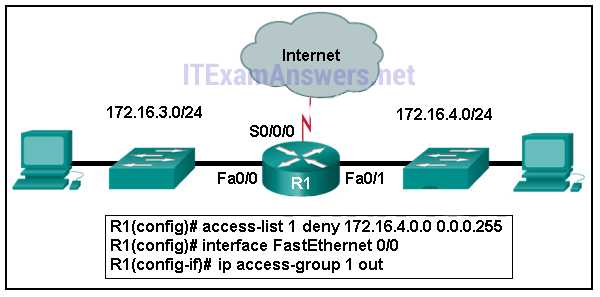

**Choices:**
- **A.** Only traffic from the 172.16.4.0/24 subnet is blocked, and all other traffic is allowed.​
- **B.** An extended ACL must be used in this situation.
- **C.** The ACL should be applied to the FastEthernet 0/0 interface of R1 inbound to accomplish the requirements.
- **D.** All traffic will be blocked, not just traffic from the 172.16.4.0/24 subnet.
- **E.** The ACL should be applied outbound on all interfaces of R1.

**Correct Answer:**
All traffic will be blocked, not just traffic from the 172.16.4.0/24 subnet.

**Explanation:**
Because of the implicit deny at the end of all ACLs, the access-list 1 permit any command must be included to ensure that only traffic from the 172.16.4.0/24 subnet is blocked and that all other traffic is allowed.​

---

## Question 21

**Question:**
Refer to the exhibit. What will happen to the access list 10 ACEs if the router is rebooted before any other commands are implemented?

**Images:**

**Choices:**
- **A.** The ACEs of access list 10 will be deleted.
- **B.** The ACEs of access list 10 will not be affected.
- **C.** The ACEs of access list 10 will be renumbered.
- **D.** The ACEs of access list 10 wildcard masks will be converted to subnet masks.

**Correct Answer:**
The ACEs of access list 10 will be renumbered.

**Explanation:**
After a reboot, access list entries will be renumbered to allow host statements to be listed first and thus more efficiently processed by the Cisco IOS.​

---

## Question 22

**Question:**
What is the effect of configuring an ACL with only ACEs that deny traffic?

**Choices:**
- **A.** The ACL will permit any traffic that is not specifically denied.
- **B.** The ACL will block all traffic.
- **C.** The ACL must be applied inbound only.
- **D.** The ACL must be applied outbound only.

**Correct Answer:**
The ACL will block all traffic.

**Explanation:**
Because there is a deny any ACE at the end of every standard ACL, the effect of having all deny statements is that all traffic will be denied regardless of the direction in which the ACL is applied.

---

## Question 23

**Question:**
Which type of ACL statements are commonly reordered by the Cisco IOS as the first ACEs?

**Choices:**
- **A.** host
- **B.** range
- **C.** permit any
- **D.** lowest sequence number

**Correct Answer:**
host

**Explanation:**
ACEs are commonly reordered from the way they were entered by the network administrator. The ACEs that have host criteria such as in the statement permit host 192.168.10.5, are reordered as the first statements because they are the most specific (have the most number of bits that must match).

---

## Question 24

**Question:**
A network administrator is configuring an ACL to restrict access to certain servers in the data center. The intent is to apply the ACL to the interface connected to the data center LAN. What happens if the ACL is incorrectly applied to an interface in the inbound direction instead of the outbound direction?

**Choices:**
- **A.** All traffic is denied.
- **B.** All traffic is permitted.
- **C.** The ACL does not perform as designed.
- **D.** The ACL will analyze traffic after it is routed to the outbound interface.

**Correct Answer:**
The ACL does not perform as designed.

**Explanation:**
Always test an ACL to ensure that it performs as it was designed. Applying an ACL that is applied using the ip access-group in command instead of using the ip access-group out command is not going to work as designed.

---

## Question 25

**Question:**
When would a network administrator use the clear access-list counters command?

**Choices:**
- **A.** when obtaining a baseline
- **B.** when buffer memory is low
- **C.** when an ACE is deleted from an ACL
- **D.** when troubleshooting an ACL and needing to know how many packets matched

**Correct Answer:**
when troubleshooting an ACL and needing to know how many packets matched

**Explanation:**
The clear access-list counters command is used to reset all numbers relating to ACE match conditions that have been made within a particular ACE. The command is useful when troubleshooting an ACL that has recently been deployed.

---

## Question 26

**Question:**
Match each statement with the example subnet and wildcard that it describes. (Not all options are used.) Place the options in the following order: 192.168.15.65 255.255.255.240 ==> the first valid host address in a subnet 192.168.15.144 0.0.0.15 ==> subnetwork address of a subnet with 14 valid host addreses host 192.168.15.2 ==> all IP address bits must match exactly 192.168.5.0 0.0.3.255 ==> hosts in a subnet with SM 255.255.252.0 192.168.3.64 0.0.0.7 ==> address with a subnet 255.255.255.248 Converting the wildcard mask 0.0.3.255 to binary and subtracting it from 255.255.255.255 yields a subnet mask of 255.255.252.0. Using the host parameter in a wildcard mask requires that all bits match the given address. 192.168.15.65 is the first valid host address in a subnetwork beginning with the subnetwork address 192.168.15.64. The subnet mask contains 4 host bits, yielding subnets with 16 addresses. 192.168.15.144 is a valid subnetwork address in a similar subnetwork. Change the wildcard mask 0.0.0.15 to binary and subtract it from 255.255.255.255, and the resulting subnet mask is 255.255.255.240. 192.168.3.64 is a subnetwork address in a subnet with 8 addresses. Convert 0.0.0.7 to binary and subtract it from 255.255.255.255, and the resulting subnet mask is 255.255.255.248. That mask contains 3 host bits, and yields 8 addresses. Older Version:

**Images:**
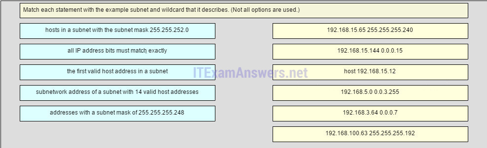
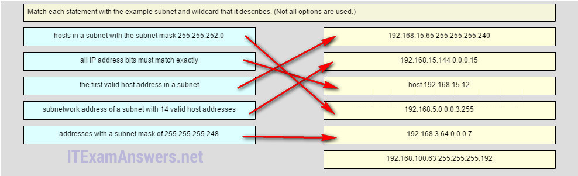

---

## Question 27

**Question:**
What two tasks do dynamic routing protocols perform? (Choose two.)

**Choices:**
- **A.** discover hosts
- **B.** update and maintain routing tables
- **C.** propagate host default gateways
- **D.** network discovery
- **E.** assign IP addressing

**Correct Answer:**
update and maintain routing tables; network discovery

**Explanation:**
Routing protocols are responsible for discovering local and remote networks and for maintaining and updating the routing table.

---

## Question 28

**Question:**
What is a disadvantage of using dynamic routing protocols?

**Choices:**
- **A.** They are only suitable for simple topologies.
- **B.** Their configuration complexity increases as the size of the network grows.
- **C.** They send messages about network status insecurely across networks by default.
- **D.** They require administrator intervention when the pathway of traffic changes.

**Correct Answer:**
They send messages about network status insecurely across networks by default.

---

## Question 29

**Question:**
Which two statements are true regarding classless routing protocols? (Choose two.)

**Choices:**
- **A.** sends subnet mask information in routing updates
- **B.** sends complete routing table update to all neighbors
- **C.** is supported by RIP version 1
- **D.** allows for use of both 192.168.1.0/30 and 192.168.1.16/28 subnets in the same topology
- **E.** reduces the amount of address space available in an organization

**Correct Answer:**
sends subnet mask information in routing updates; allows for use of both 192.168.1.0/30 and 192.168.1.16/28 subnets in the same topology

**Explanation:**
Classless routing updates include subnet mask information and support VLSM.

---

## Question 30

**Question:**
An OSPF enabled router is processing learned routes to select best paths to reach a destination network. What is the OSPF algorithm evaluating as the metric?

**Choices:**
- **A.** The amount of packet delivery time and slowest bandwidth.
- **B.** The number of hops along the routing path.
- **C.** The amount of traffic and probability of failure of links.
- **D.** The cumulative bandwidth that is used along the routing path.

**Correct Answer:**
The cumulative bandwidth that is used along the routing path.

---

## Question 31

**Question:**
After a network topology change occurs, which distance vector routing protocol can send an update message directly to a single neighboring router without unnecessarily notifying other routers?

**Choices:**
- **A.** IS-IS
- **B.** RIPv2
- **C.** EIGRP
- **D.** OSPF
- **E.** RIPv1

**Correct Answer:**
EIGRP

---

## Question 32

**Question:**
What is the purpose of the passive-interface command?

**Choices:**
- **A.** allows a routing protocol to forward updates out an interface that is missing its IP address
- **B.** allows a router to send routing updates on an interface but not receive updates via that interface
- **C.** allows an interface to remain up without receiving keepalives
- **D.** allows interfaces to share IP addresses
- **E.** allows a router to receive routing updates on an interface but not send updates via that interface

**Correct Answer:**
allows a router to receive routing updates on an interface but not send updates via that interface

**Explanation:**
A passive interface does not send routing updates or hello packets; however, it is still advertised to other routers connected to nonpassive interfaces.

---

## Question 33

**Question:**
Refer to the exhibit. Based on the partial output from the show ip route command, what two facts can be determined about the RIP routing protocol? (Choose two.)

**Images:**
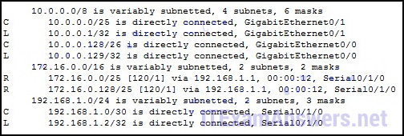

**Choices:**
- **A.** RIP version 2 is running on this router and its RIP neighbor.
- **B.** The metric to the network 172.16.0.0 is 120.
- **C.** RIP version 1 is running on this router and its RIP neighbor.
- **D.** The command no auto-summary has been used on the RIP neighbor router.
- **E.** RIP will advertise two networks to its neighbor.

**Correct Answer:**
RIP version 2 is running on this router and its RIP neighbor.; The command no auto-summary has been used on the RIP neighbor router.

---

## Question 34

**Question:**
While configuring RIPv2 on an enterprise network, an engineer enters the command network 192.168.10.0 into router configuration mode.

**Choices:**
- **A.** What is the result of entering this command?
- **B.** The interface of the 192.168.10.0 network is sending version 1 and version 2 updates.
- **C.** The interface of the 192.168.10.0 network is receiving version 1 and version 2 updates.
- **D.** The interface of the 192.168.10.0 network is sending only version 2 updates.
- **E.** The interface of the 192.168.10.0 network is sending RIP hello messages.

**Correct Answer:**
The interface of the 192.168.10.0 network is sending only version 2 updates.

---

## Question 35

**Question:**
Refer to the exhibit. A network administrator has issued the exhibited commands in an attempt to activate RIPng on interface gig0/0. What is causing the console message that is shown after RIP is enabled?

**Images:**
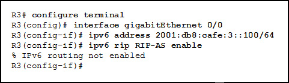

**Choices:**
- **A.** Interface gig0/0 is shutdown.
- **B.** Interface gig0/0 does not have a valid IPv6 address.
- **C.** IPv6 unicast routing has not been enabled on this router.
- **D.** IPv6 is not supported on this IOS.

**Correct Answer:**
IPv6 unicast routing has not been enabled on this router.

---

## Question 36

**Question:**
Refer to the exhibit. OSPF is used in the network. Which path will be chosen by OSPF to send data packets from Net A to Net B?

**Images:**
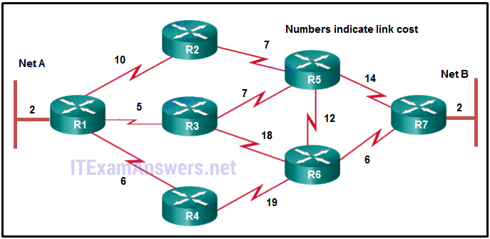

**Choices:**
- **A.** R1, R2, R5, R7
- **B.** R1, R3, R5, R7
- **C.** R1, R3, R6, R7
- **D.** R1, R4, R6, R7
- **E.** R1, R3, R5, R6, R7

**Correct Answer:**
R1, R3, R5, R7

---

## Question 37

**Question:**
Which two events will trigger the sending of a link-state packet by a link-state routing protocol? (Choose two.)

**Choices:**
- **A.** the router update timer expiring
- **B.** a link to a neighbor router has become congested
- **C.** a change in the topology
- **D.** the initial startup of the routing protocol process
- **E.** the requirement to periodically flood link-state packets to all neighbors

**Correct Answer:**
a change in the topology; the initial startup of the routing protocol process

---

## Question 38

**Question:**
Which two requirements are necessary before a router configured with a link-state routing protocol can build and send its link-state packets? (Choose two.)

**Choices:**
- **A.** The router has determined the costs associated with its active links.
- **B.** The router has built its link-state database.
- **C.** The routing table has been refreshed.
- **D.** The router has established its adjacencies.
- **E.** The router has constructed an SPF tree.

**Correct Answer:**
The router has determined the costs associated with its active links.; The router has established its adjacencies.

---

## Question 39

**Question:**
When does a link-state router send LSPs to its neighbors?

**Choices:**
- **A.** every 30 seconds
- **B.** immediately after receiving an LSP from neighbors with updates
- **C.** only when one of its interfaces goes up or down
- **D.** only when one of its neighbors requests an update

**Correct Answer:**
immediately after receiving an LSP from neighbors with updates

---

## Question 40

**Question:**
Which routing protocol uses link-state information to build a map of the topology for computing the best path to each destination network?

**Choices:**
- **A.** OSPF
- **B.** EIGRP
- **C.** RIP
- **D.** RIPng

**Correct Answer:**
OSPF

---

## Question 41

**Question:**
A destination route in the routing table is indicated with a code D. Which kind of route entry is this?

**Choices:**
- **A.** a static route
- **B.** a route used as the default gateway
- **C.** a network directly connected to a router interface
- **D.** a route dynamically learned through the EIGRP routing protocol

**Correct Answer:**
a route dynamically learned through the EIGRP routing protocol

---

## Question 42

**Question:**
Refer to the exhibit. Which interface will be the exit interface to forward a data packet with the destination IP address 172.16.0.66?

**Images:**
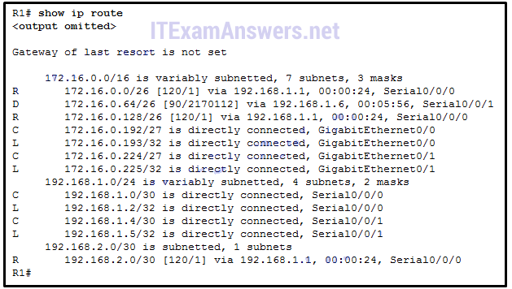

**Choices:**
- **A.** Serial0/0/0
- **B.** Serial0/0/1
- **C.** GigabitEthernet0/0
- **D.** GigabitEthernet0/1

**Correct Answer:**
Serial0/0/1

---

## Question 43

**Question:**
Which two requirements are used to determine if a route can be considered as an ultimate route in a router’s routing table? (Choose two.)

**Choices:**
- **A.** contain subnets
- **B.** be a default route
- **C.** contain an exit interface
- **D.** be a classful network entry
- **E.** contain a next-hop IP address

**Correct Answer:**
contain an exit interface; contain a next-hop IP address

---

## Question 44

**Question:**
Which route is the best match for a packet entering a router with a destination address of 10.16.0.2?

**Choices:**
- **A.** S 10.0.0.0/8 [1/0] via 192.168.0.2
- **B.** S 10.16.0.0/24 [1/0] via 192.168.0.9
- **C.** S 10.16.0.0/16 is directly connected, Ethernet 0/1
- **D.** S 10.0.0.0/16 is directly connected, Ethernet 0/0

**Correct Answer:**
S 10.16.0.0/24 [1/0] via 192.168.0.9

---

## Question 45

**Question:**
Which type of route will require a router to perform a recursive lookup?

**Choices:**
- **A.** an ultimate route that is using a next hop IP address on a router that is not using CEF
- **B.** a level 2 child route that is using an exit interface on a router that is not using CEF
- **C.** a level 1 network route that is using a next hop IP address on a router that is using CEF
- **D.** a parent route on a router that is using CEF

**Correct Answer:**
an ultimate route that is using a next hop IP address on a router that is not using CEF

---

## Question 46

**Question:**
A router is configured to participate in multiple routing protocol: RIP, EIGRP, and OSPF. The router must send a packet to network 192.168.14.0. Which route will be used to forward the traffic?

**Choices:**
- **A.** a 192.168.14.0 /26 route that is learned via RIP
- **B.** a 192.168.14.0 /24 route that is learned via EIGRP
- **C.** a 192.168.14.0 /25 route that is learned via OSPF
- **D.** a 192.168.14.0 /25 route that is learned via RIP

**Correct Answer:**
a 192.168.14.0 /26 route that is learned via RIP

---

## Question 47

**Question:**
Fill in the blank. Do not abbreviate. When configuring RIPng, the default-information originate command instructs the router to propagate a static default route.​

---

## Question 48

**Question:**
Match the features of link-state routing protocols to their advantages and disadvantages. (Not all options are used.) Question Answer

**Images:**
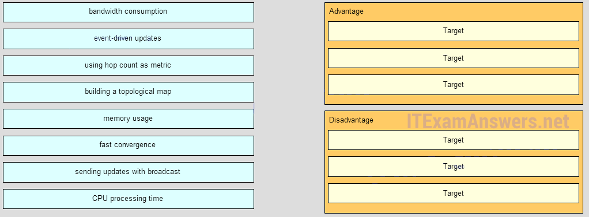
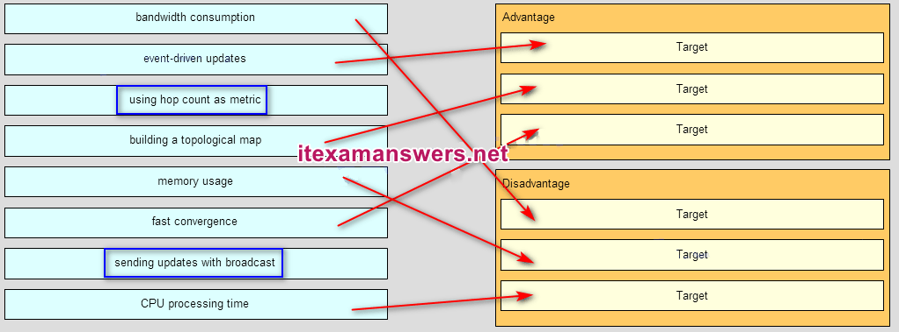

---

## Question 49

**Question:**
Match the characteristic to the corresponding type of routing. (Not all options are used.) Explanation: Both static and dynamic routing could be used when more than one router is involved. Dynamic routing is when a routing protocol is used. Static routing is when every remote route is entered manually by an administrator into every router in the network topology.

**Images:**
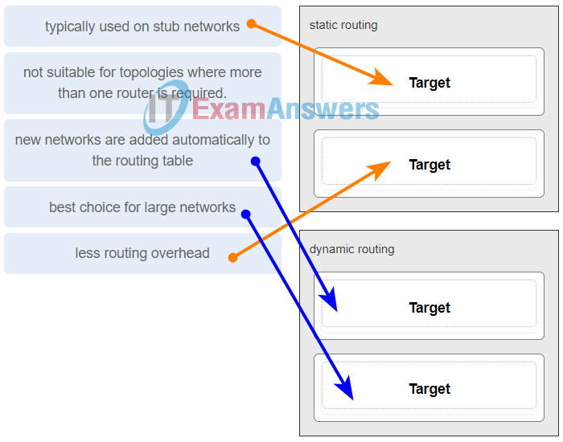

---

## Question 50

**Question:**
Which two statements describe the OSPF routing protocol? (Choose two.)

**Choices:**
- **A.** automatically summarizes networks at the classful boundaries
- **B.** has an administrative distance of 100
- **C.** calculates its metric using bandwidth
- **D.** uses Dijkstra’s algorithm to build the SPF tree
- **E.** used primarily as an EGP

**Correct Answer:**
calculates its metric using bandwidth; uses Dijkstra’s algorithm to build the SPF tree

**Explanation:**
The metric of OSPF is cost, which is based on the cumulative bandwidth of the links to the destination network.

---

## Question 51

**Question:**
What two actions result from entering the network 192.168.1.0 command in RIP configuration mode on a router? (Choose two .)

**Choices:**
- **A.** The network address 192.168.1.0 is advertised to the neighbor routers.
- **B.** Routing updates are sent through all the interfaces belonging to 192.168.1.0.
- **C.** The routing table is created in the RAM of the router.
- **D.** The RIP process is stopped and all existing RIP configurations are erased.
- **E.** The neighboring routers are sent a request for routing updates.

**Correct Answer:**
The network address 192.168.1.0 is advertised to the neighbor routers.; Routing updates are sent through all the interfaces belonging to 192.168.1.0.

---

## Question 52

**Question:**
Which dynamic routing protocol was developed as an exterior gateway protocol to interconnect different Internet provider s?

**Choices:**
- **A.** BGP
- **B.** EIGRP
- **C.** OSPF
- **D.** RIP

**Correct Answer:**
BGP

---

## Question 53

**Question:**
In the context of routing protocols, what is a definition for time to convergence?

**Choices:**
- **A.** the amount of time a network administrator needs to configure a routing protocol in a small- to medium-sized network
- **B.** the capability to transport data, video, and voice over the same media
- **C.** a measure of protocol configuration complexity
- **D.** the amount of time for the routing tables to achieve a consistent state after a topology change

**Correct Answer:**
the amount of time for the routing tables to achieve a consistent state after a topology change

---

## Question 54

**Question:**
A destination route in the routing table is indicated witha code D. Which kind of route entry is this?

**Choices:**
- **A.** a static route
- **B.** a route used as the default gateway
- **C.** a network directly connected to a router interface
- **D.** a route dynamically learned through the EIGRP routing protocol

**Correct Answer:**
a route dynamically learned through the EIGRP routing protocol

---

## Question 55

**Question:**
Match the router protocol to the corresponding category. (Not all options are used.) Distance vector RIOv2 EIGRP Link state OSPF IS-IS

**Images:**
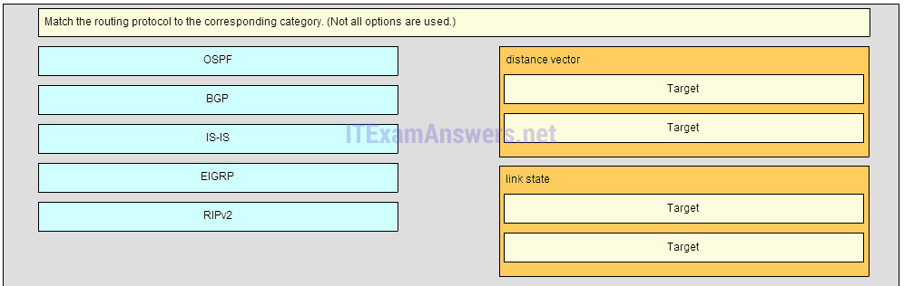
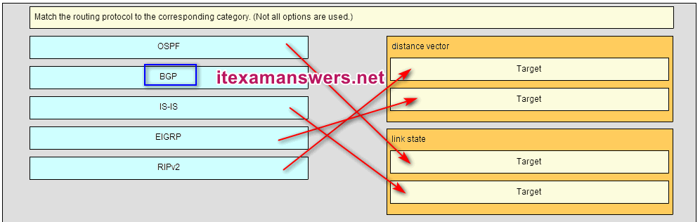

---

## Question 56

**Question:**
Which route is the best match for a packet entering a router with a destination address of 10.16.0.2?

**Choices:**
- **A.** S 10.16.0.0/16 is directly connected, Ethernet 0/1
- **B.** S 10.16.0.0/24 [1/0] via 192.168.0.9
- **C.** S 10.0.0.0/8 [1/0] via 192.168.0.2
- **D.** S 10.0.0.0/16 is directly connected, Ethernet 0/0

**Correct Answer:**
S 10.16.0.0/24 [1/0] via 192.168.0.9

---

## Question 57

**Question:**
What is different between IPv6 routing table entries compared to IPv4 routing table entries?

**Choices:**
- **A.** By design IPv6 is classless so all routes are effectively level 1 ultimate routes.
- **B.** IPv6 does not use static routes to populate the routing table as used in IPv4.
- **C.** IPv6 routing tables include local route entries which IPv4 routing tables do not.
- **D.** The selection of IPv6 routes is based on the shortest matching prefix, unlike IPv4 route selection which is based on the longest matching prefix.

**Correct Answer:**
By design IPv6 is classless so all routes are effectively level 1 ultimate routes.

---

## Question 58

**Question:**
Which route will a router use to forward an IPv4 packet after examining its routing table for the best match with the destination address?

**Choices:**
- **A.** a level 1 child route
- **B.** a level 1 parent route
- **C.** a level 2 supernet route
- **D.** a level 1 ultimate route

**Correct Answer:**
a level 1 ultimate route

**Explanation:**
Download PDF File below: ITexamanswers.net – CCNA 2 (v5.1 + v6.0) Chapter 7 Exam Answers Full.pdf 1.29 MB 8685 downloads

---
