# CCNA 2 v2 - CCNA 2 - Chapter 8

## Question 1

**Question:**
Which DHCPv4 message will a client send to accept an IPv4 address that is offered by a DHCP server?

**Choices:**
- **A.** unicast DHCPACK
- **B.** broadcast DHCPACK
- **C.** unicast DHCPREQUEST
- **D.** broadcast DHCPREQUEST

**Correct Answer:**
broadcast DHCPREQUEST

**Explanation:**
When a DHCP client receives DHCPOFFER messages, it will send a broadcast DHCPREQUEST message for two purposes. First, it indicates to the offering DHCP server that it would like to accept the offer and bind the IP address. Second, it notifies any other responding DHCP servers that their offers are declined.

---

## Question 2

**Question:**
A company uses DHCP servers to dynamically assign IPv4 addresses to employee workstations. The address lease duration is set as 5 days. An employee returns to the office after an absence of one week. When the employee boots the workstation, it sends a message to obtain an IP address. Which Layer 2 and Layer 3 destination addresses will the message contain?

**Choices:**
- **A.** FF-FF-FF-FF-FF-FF and 255.255.255.255
- **B.** both MAC and IPv4 addresses of the DHCP server
- **C.** MAC address of the DHCP server and 255.255.255.255
- **D.** FF-FF-FF-FF-FF-FF and IPv4 address of the DHCP server

**Correct Answer:**
FF-FF-FF-FF-FF-FF and 255.255.255.255

**Explanation:**
When the lease of a dynamically assigned IPv4 address has expired, a workstation will send a DHCPDISCOVER message to start the process of obtaining a valid IP address. Because the workstation does not know the addresses of DHCP servers, it sends the message via broadcast, with destination addresses of FF-FF-FF-FF-FF-FF and 255.255.255.255.

---

## Question 3

**Question:**
Which is a DHCPv4 address allocation method that assigns IPv4 addresses for a limited lease period?

**Choices:**
- **A.** manual allocation
- **B.** pre-allocation
- **C.** automatic allocation
- **D.** dynamic allocation

**Correct Answer:**
dynamic allocation

**Explanation:**
Dynamic allocation is the most commonly implemented allocation mechanism. It leases the IP parameters for a predefined period of time.

---

## Question 4

**Question:**
Which address does a DHCPv4 server target when sending a DHCPOFFER message to a client that makes an address request?

**Choices:**
- **A.** client IP address
- **B.** client hardware address
- **C.** gateway IP address
- **D.** broadcast MAC address

**Correct Answer:**
client hardware address

**Explanation:**
Which address does a DHCPv4 server target when sending a DHCPOFFER message to a client that makes an addres

---

## Question 5

**Question:**
As a DHCPv4 client lease is about to expire, what is the message that the client sends the DHCP server?

**Choices:**
- **A.** DHCPDISCOVER
- **B.** DHCPOFFER
- **C.** DHCPREQUEST
- **D.** DHCPACK

**Correct Answer:**
DHCPREQUEST

**Explanation:**
When a DHCP client lease is about to expire, the client sends a DHCPREQUEST message to the DHCPv4 server that originally provided the IPv4 address.​ This allows the client to request that the lease be extended.​

---

## Question 6

**Question:**
What is an advantage of configuring a Cisco router as a relay agent?

**Choices:**
- **A.** It will allow DHCPDISCOVER messages to pass without alteration.
- **B.** It can forward both broadcast and multicast messages on behalf of clients.
- **C.** It can provide relay services for multiple UDP services.
- **D.** It reduces the response time from a DHCP server.

**Correct Answer:**
It can provide relay services for multiple UDP services.

**Explanation:**
By default, the ip helper-address command forwards the following eight UDP services: Port 37: Time Port 49: TACACS Port 53: DNS Port 67: DHCP/BOOTP client Port 68: DHCP/BOOTP server Port 69: TFTP Port 137: NetBIOS name service Port 138: NetBIOS datagram service

---

## Question 7

**Question:**
An administrator issues the commands: Router(config)# interface g0/1 Router(config-if)# ip address dhcp What is the administrator trying to achieve?

**Choices:**
- **A.** configuring the router to act as a DHCPv4 server
- **B.** configuring the router to obtain IP parameters from a DHCPv4 server
- **C.** configuring the router to act as a relay agent
- **D.** configuring the router to resolve IP address conflicts

**Correct Answer:**
configuring the router to obtain IP parameters from a DHCPv4 server

**Explanation:**
The ip address dhcp command activates the DHCPv4 client on a given interface. By doing this, the router will obtain the IP parameters from a DHCPv4 server.

---

## Question 8

**Question:**
Under which two circumstances would a router usually be configured as a DHCPv4 client? (Choose two.)

**Choices:**
- **A.** The router is intended to be used as a SOHO gateway.
- **B.** The administrator needs the router to act as a relay agent.
- **C.** The router is meant to provide IP addresses to the hosts.
- **D.** This is an ISP requirement.
- **E.** The router has a fixed IP address.

**Correct Answer:**
The router is intended to be used as a SOHO gateway.; This is an ISP requirement.

**Explanation:**
SOHO routers are frequently required by the ISP to be configured as DHCPv4 clients in order to be connected to the provider.

---

## Question 9

**Question:**
A company uses the SLAAC method to configure IPv6 addresses for the employee workstations. Which address will a client use as its default gateway?​

**Choices:**
- **A.** the all-routers multicast address
- **B.** the link-local address of the router interface that is attached to the network
- **C.** the unique local address of the router interface that is attached to the network
- **D.** the global unicast address of the router interface that is attached to the network

**Correct Answer:**
the link-local address of the router interface that is attached to the network

**Explanation:**
When a PC is configured to use the SLAAC method for configuring IPv6 addresses, it will use the prefix and prefix-length information that is contained in the RA message, combined with a 64-bit interface ID (obtained by using the EUI-64 process or by using a random number that is generated by the client operating system), to form an IPv6 address. It uses the link-local address of the router interface that is attached to the LAN segment as its IPv6 default gateway address.

---

## Question 10

**Question:**
A network administrator configures a router to send RA messages with M flag as 0 and O flag as 1. Which statement describes the effect of this configuration when a PC tries to configure its IPv6 address?

**Choices:**
- **A.** It should contact a DHCPv6 server for all the information that it needs.
- **B.** It should use the information that is contained in the RA message exclusively.
- **C.** It should use the information that is contained in the RA message and contact a DHCPv6 server for additional information
- **D.** It should contact a DHCPv6 server for the prefix, the prefix-length information, and an interface ID that is both random and unique.

**Correct Answer:**
It should use the information that is contained in the RA message and contact a DHCPv6 server for additional information

**Explanation:**
ICMPv6 RA messages contain two flags to indicate whether a workstation should use SLAAC, a DHCPv6 server, or a combination to configure its IPv6 address. These two flags are M flag and O flag. When both flags are 0 (by default), a client must only use the information in the RA message. When M flag is 0 and O flag is 1, a client should use the information in the RA message and look for the other configuration parameters (such as DNS server addresses) on DHCPv6 servers.

---

## Question 11

**Question:**
A company implements the stateless DHCPv6 method for configuring IPv6 addresses on employee workstations. After a workstation receives messages from multiple DHCPv6 servers to indicate their availability for DHCPv6 service, which message does it send to a server for configuration information?

**Choices:**
- **A.** DHCPv6 SOLICIT
- **B.** DHCPv6 REQUEST
- **C.** DHCPv6 ADVERTISE
- **D.** DHCPv6 INFORMATION-REQUEST

**Correct Answer:**
DHCPv6 INFORMATION-REQUEST

**Explanation:**
In stateless DHCPv6 configuration, a client configures its IPv6 address by using the prefix and prefix length in the RA message, combined with a self-generated interface ID. It then contacts a DHCPv6 server for additional configuration information via an INFORMATION-REQUEST message. The DHCPv6 SOLICIT message is used by a client to locate a DHCPv6 server. The DHCPv6 ADVERTISE message is used by DHCPv6 servers to indicate their availability for DHCPv6 service. The DHCPv6 REQUEST message is used by a client, in the stateful DHCPv6 configuration, to request ALL configuration information from a DHCPv6 server.

---

## Question 12

**Question:**
An administrator wants to configure hosts to automatically assign IPv6 addresses to themselves by the use of Router Advertisement messages, but also to obtain the DNS server address from a DHCPv6 server. Which address assignment method should be configured?

**Choices:**
- **A.** SLAAC
- **B.** stateless DHCPv6
- **C.** stateful DHCPv6
- **D.** RA and EUI-64

**Correct Answer:**
stateless DHCPv6

**Explanation:**
Stateless DHCPv6 allows clients to use ICMPv6 Router Advertisement (RA) messages to automatically assign IPv6 addresses to themselves, but then allows these clients to contact a DHCPv6 server to obtain additional information such as the domain name and address of DNS servers. SLAAC does not allow the client to obtain additional information through DHCPv6, and stateful DHCPv6 requires that the client receive its interface address directly from a DHCPv6 server. RA messages, when combined with an EUI-64 interface identifier, are used to automatically create an interface IPv6 address, and are part of both SLAAC and stateless DHCPv6.

---

## Question 13

**Question:**
How does an IPv6 client ensure that it has a unique address after it configures its IPv6 address using the SLAAC allocation method?

**Choices:**
- **A.** It sends an ARP message with the IPv6 address as the destination IPv6 address.
- **B.** It checks with the IPv6 address database that is hosted by the SLAAC server.
- **C.** It contacts the DHCPv6 server via a special formed ICMPv6 message.
- **D.** It sends an ICMPv6 Neighbor Solicitation message with the IPv6 address as the target IPv6 address.

**Correct Answer:**
It sends an ICMPv6 Neighbor Solicitation message with the IPv6 address as the target IPv6 address.

**Explanation:**
SLAAC is a stateless allocation method and does not use a DHCP server to manage the IPv6 addresses. When a host generates an IPv6 address, it must verify that it is unique. The host will send an ICMPv6 Neighbor Solicitation message with its own IPv6 address as the target. As long as no other device responds with a Neighbor Advertisement message, then the address is unique.

---

## Question 14

**Question:**
What is used in the EUI-64 process to create an IPv6 interface ID on an IPv6 enabled interface?

**Choices:**
- **A.** the MAC address of the IPv6 enabled interface
- **B.** a randomly generated 64-bit hexadecimal address
- **C.** an IPv6 address that is provided by a DHCPv6 server
- **D.** an IPv4 address that is configured on the interface

**Correct Answer:**
the MAC address of the IPv6 enabled interface

**Explanation:**
The EUI-64 process uses the MAC address of an interface to construct an interface ID (IID). Because the MAC address is only 48 bits in length, 16 additional bits (FF:FE) must be added to the MAC address to create the full 64-bit interface ID.

---

## Question 15

**Question:**
What two methods can be used to generate an interface ID by an IPv6 host that is using SLAAC? (Choose two.)

**Choices:**
- **A.** EUI-64
- **B.** random generation
- **C.** stateful DHCPv6
- **D.** DAD
- **E.** ARP

**Correct Answer:**
EUI-64; random generation

**Explanation:**
A host that is using SLAAC has two means to configure an interface ID: EUI-64 and random generation by the host operating system.

---

## Question 16

**Question:**
Refer to the exhibit. Based on the output that is shown, what kind of IPv6 addressing is being configured?

**Images:**
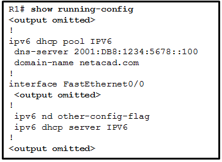

**Choices:**
- **A.** SLAAC
- **B.** stateful DHCPv6
- **C.** stateless DHCPv6
- **D.** static link-local

**Correct Answer:**
stateless DHCPv6

**Explanation:**
Stateful DHCPv6 pools are configured with address prefixes for hosts via the address command, whereas stateless DHCPv6 pools typically only contain information such as DNS server addresses and the domain name. RA messages that are sent from routers that are configured as stateful DHCPv6 servers have the M flag set to 1 with the command ipv6 nd managed-config-flag, whereas stateless DHCPv6 servers are indicated by setting the O flag to 1 with the ipv6 nd other-config-flag command.

---

## Question 17

**Question:**
What is the result of a network technician issuing the command ip dhcp excluded-address 10.0.15.1 10.0.15.15 on a Cisco router?

**Choices:**
- **A.** The Cisco router will exclude only the 10.0.15.1 and 10.0.15.15 IP addresses from being leased to DHCP clients.
- **B.** The Cisco router will automatically create a DHCP pool using a /28 mask.
- **C.** The Cisco router will allow only the specified IP addresses to be leased to clients.
- **D.** The Cisco router will exclude 15 IP addresses from being leased to DHCP clients.
- **E.** The ip dhcp excluded-address command is followed by the first and the last addresses to be excluded from being leased to DHCP clients.

**Correct Answer:**
The Cisco router will exclude 15 IP addresses from being leased to DHCP clients.

---

## Question 18

**Question:**
Refer to the exhibit. What should be done to allow PC-A to receive an IPv6 address from the DHCPv6 server?

**Images:**
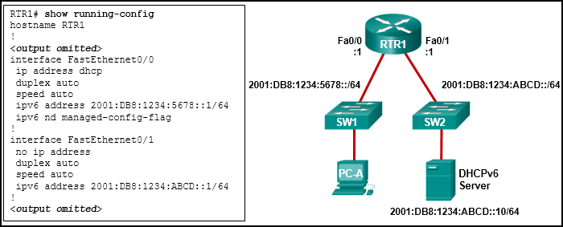

**Choices:**
- **A.** Add the ipv6 dhcp relay command to interface Fa0/0.
- **B.** Configure the ipv6 nd managed-config-flag command on interface Fa0/1.
- **C.** Change the ipv6 nd managed-config-flag command to ipv6 nd other-config-flag.
- **D.** Add the IPv6 address 2001:DB8:1234:5678::10/64 to the interface configuration of the DHCPv6 server.

**Correct Answer:**
Add the ipv6 dhcp relay command to interface Fa0/0.

**Explanation:**
Client DHCPv6 messages are sent to a multicast address with link-local scope, which means that the messages will not be forwarded by routers. Because the client and server are on different subnets on different interfaces, the message will not reach the server. The router can be configured to relay the DHCPv6 messages from the client to the server by configuring the ipv6 dhcp relay command on the interface that is connected to the client.

---

## Question 19

**Question:**
Refer to the exhibit. A network administrator is implementing stateful DHCPv6 operation for the company. However, the clients are not using the prefix and prefix-length information that is configured in the DHCP pool. The administrator issues a show ipv6 interface command. What could be the cause of the problem?

**Images:**
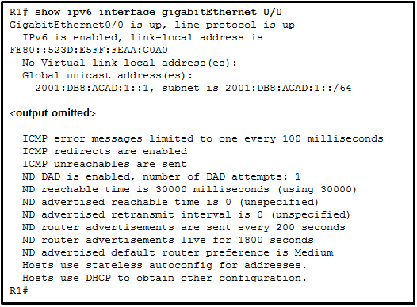

**Choices:**
- **A.** No virtual link-local address is configured
- **B.** The Duplicate Address Detection feature is disabled
- **C.** The router is configured for SLAAC DHCPv6 operation
- **D.** The router is configured for stateless DHCPv6 operation

**Correct Answer:**
The router is configured for stateless DHCPv6 operation

**Explanation:**
The router is configured for stateless DHCPv6 operation, which is shown by the last two lines of the show command output. Hosts will configure their IPv6 addresses by using the prefix information that is provided by RA messages. They will also obtain additional configuration information from a DHCPv6 server. The “No virtual link-local address” option and the “Duplicate Address Detection” option are irrelevant to DHCP configuration. Option “SLAAC configuration” is incorrect because by definition SLAAC will use only the information that is provided by RA messages to configure IPv6 settings.

---

## Question 20

**Question:**
Refer to the exhibit. A network administrator is implementing the stateless DHCPv6 operation for the company. Clients are configuring IPv6 addresses as expected. However, the clients are not getting the DNS server address and the domain name information configured in the DHCP pool. What could be the cause of the problem?

**Images:**
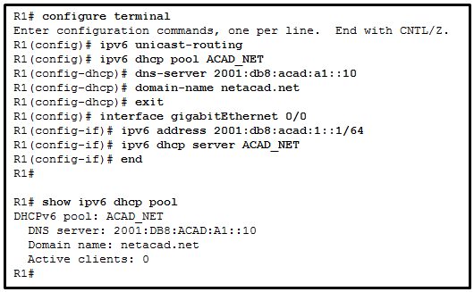

**Choices:**
- **A.** The GigabitEthernet interface is not activated
- **B.** The router is configured for SLAAC operation
- **C.** The DNS server address is not on the same network as the clients are on
- **D.** The clients cannot communicate with the DHCPv6 server, evidenced by the number of active clients being 0

**Correct Answer:**
The router is configured for SLAAC operation

**Explanation:**
The router is configured for SLAAC operation because there is no configuration command to change the RA M and O flag value. By default, both M and O flags are set to 0. In order to permint stateless DHCPv6 operation, the interface command ipv6 nd other-config-flag should be issued. The GigabitEthernet interface is in working condition because clients can get RA messages and configure their IPv6 addresses as expected. Also, the fact that R1 is the DHCPv6 server and clients are getting RA messages indicates that clients can communicate with the DHCP server. The number of active clients is 0 because the DHCPv6 server does not maintain the state of clients IPv6 addresses (it is not configured for stateful DHCPv6 operation). The DNS server address issue is not relevant to the problem.

---

## Question 21

**Question:**
Fill in the blank. Do not abbreviate Type a command to exclude the first fifteen useable IP addresses from a DHCPv4 address pool of the network 10.0.15.0/24. Router(config)# ip dhcp Correct Answer: excluded-address 10.0.15.1 10.0.15.15 The ip dhcp excluded-address command must be followed by the first and the last addresses to be excluded.

---

## Question 22

**Question:**
Order the steps of configuring a router as a DHCPv4 Server. (Not all options are used.)

**Images:**
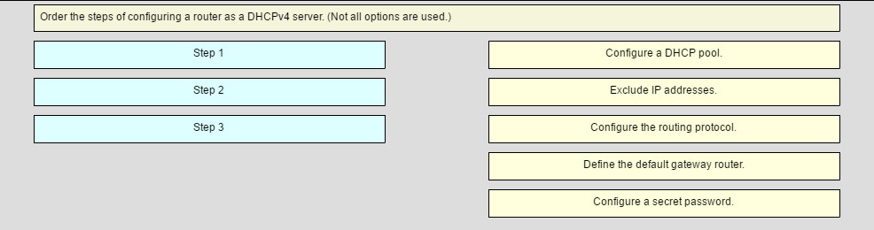
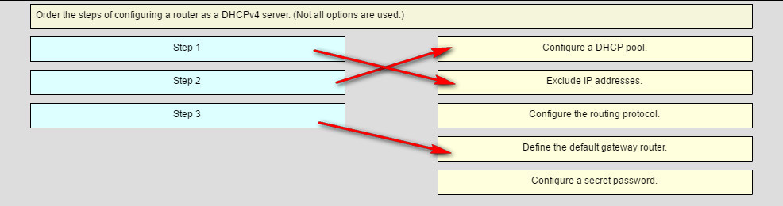

---

## Question 23

**Question:**
Match the descriptions to the corresponding DHCPv6 server type. (Not all options are used.) Place the options in the following order: [+] enabled in RA messages with the ipv6 nd other-config-flag command [+] clients send only DHCPv6 INFORMATION-REQUEST messages to the server [+] enabled on the client with the ipv6 address autoconfig command [#] the M flag is set to 1 in RA messages [#] uses the address command to create a pool of addresses for clients [#] enabled on the client with the ipv6 address dhcp command[+] Order does not matter within this group. [#] Order does not matter within this group. Older Version:

**Images:**
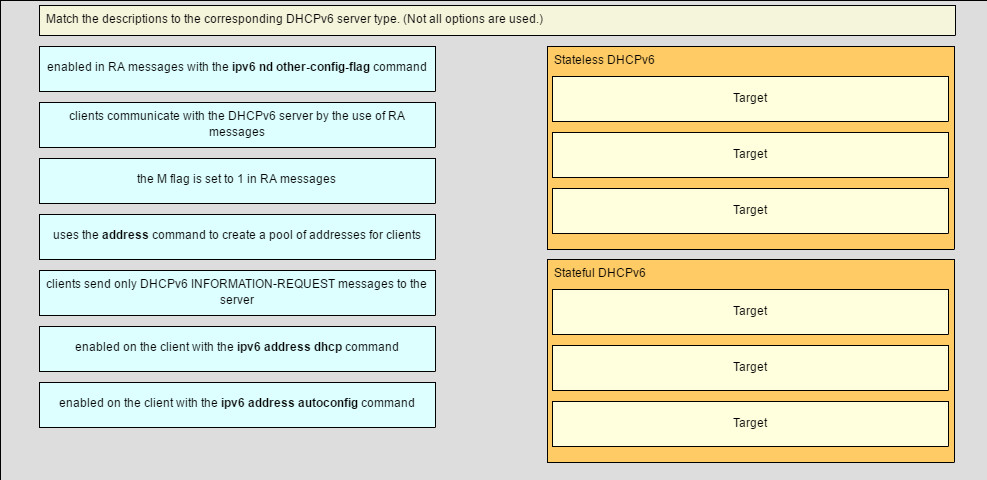
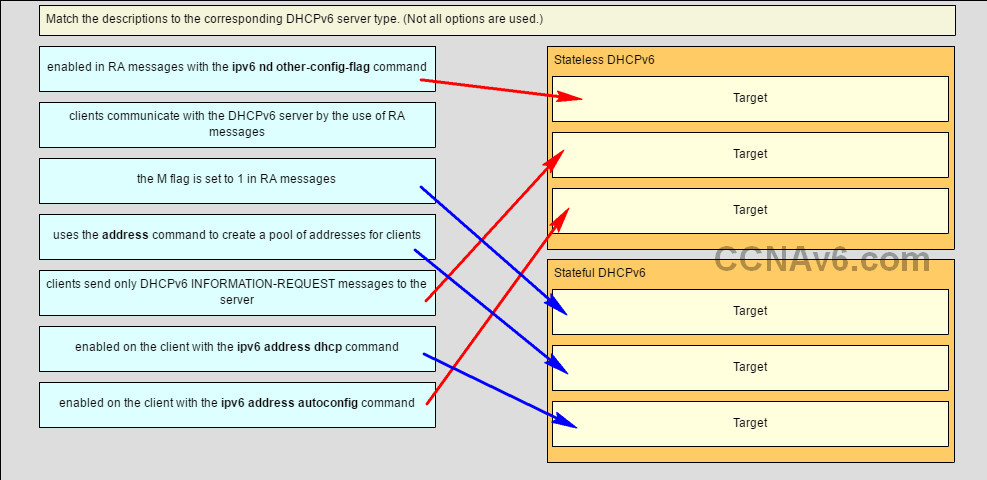

---

## Question 24

**Question:**
A router is participating in an OSPFv2 domain. What will always happen if the dead interval expires before the router receives a hello packet from an adjacent DROTHER OSPF router?

**Choices:**
- **A.** OSPF will run a new DR/BDR election.
- **B.** SPF will run and determine which neighbor router is “down”.
- **C.** A new dead interval timer of 4 times the hello interval will start.
- **D.** OSPF will remove that neighbor from the router link-state database.

**Correct Answer:**
OSPF will remove that neighbor from the router link-state database.

**Explanation:**
On Cisco routers the default dead interval is 4 times the hello interval, and this timer has expired in this case. SPF does not determine the state of neighbor routers; it determines which routes become routing table entries. A DR/DBR election will not always automatically run; this depends on the type of network and on whether or not the router no longer up was a DR or BDR.

---

## Question 25

**Question:**
Which three statements describe the similarities between OSPFv2 and OSPFv3? (Choose three.)

**Choices:**
- **A.** They both are link-state protocols.
- **B.** They both use the global address as the source address when sending OSPF messages.
- **C.** They both share the concept of multiple areas.
- **D.** They both support IPsec for authentication.
- **E.** They both use the same DR/BDR election process.
- **F.** They both have unicast routing enabled by default.

**Correct Answer:**
They both are link-state protocols.; They both share the concept of multiple areas.; They both use the same DR/BDR election process.

**Explanation:**
Only OSPFv2 messages are sourced from the IP address of the exit interface; OSPFv3 uses the link-local address of the exit interface. Only OSPFv3 uses IPsec; OSPFv2 uses plaintext or MD5 authentication. Unicast routing is enabled by default only with OSPFv2.

---

## Question 26

**Question:**
Which OSPF component is identical in all routers in an OSPF area after convergence?

**Choices:**
- **A.** adjacency database
- **B.** link-state database
- **C.** routing table
- **D.** SPF tree

**Correct Answer:**
link-state database

---

## Question 27

**Question:**
Which three statements describe features of the OSPF topology table? (Choose three.)

**Choices:**
- **A.** It is a link-state database that represents the network topology.
- **B.** Its contents are the result of running the SPF algorithm.
- **C.** When converged, all routers in an area have identical topology tables.
- **D.** The topology table contains feasible successor routes.
- **E.** The table can be viewed via the show ip ospf database command.
- **F.** After convergence, the table only contains the lowest cost route entries for all known networks.

**Correct Answer:**
It is a link-state database that represents the network topology.; When converged, all routers in an area have identical topology tables.; The table can be viewed via the show ip ospf database command.

**Explanation:**
The topology table on an OSPF router is a link-state database (LSDB) that lists information about all other routers in the network, and represents the network topology. All routers within an area have identical link-state databases, and the table can be viewed using the show ip ospf database command. The EIGRP topology table contains feasible successor routes. This concept is not used by OSPF. The SPF algorithm uses the LSDB to produce the unique routing table for each router which contains the lowest cost route entries for known networks.

---

## Question 28

**Question:**
What is used to create the OSPF neighbor table?

**Choices:**
- **A.** adjacency database
- **B.** link-state database
- **C.** forwarding database
- **D.** routing table

**Correct Answer:**
adjacency database

**Explanation:**
The adjacency database is used to create the OSPF neighbor table. The link-state database is used to create the topology table, and the forwarding database is used to create the routing table.

---

## Question 29

**Question:**
What is a function of OSPF hello packets?

**Choices:**
- **A.** to send specifically requested link-state records
- **B.** to discover neighbors and build adjacencies between them
- **C.** to ensure database synchronization between routers
- **D.** to request specific link-state records from neighbor routers

**Correct Answer:**
to discover neighbors and build adjacencies between them

---

## Question 30

**Question:**
Which OSPF packet contains the different types of link-state advertisements?

**Choices:**
- **A.** hello
- **B.** DBD
- **C.** LSR
- **D.** LSU
- **E.** LSAck

**Correct Answer:**
LSU

---

## Question 31

**Question:**
What are the two purposes of an OSPF router ID? (Choose two.)

**Choices:**
- **A.** to facilitate the establishment of network convergence
- **B.** to uniquely identify the router within the OSPF domain
- **C.** to facilitate the transition of the OSPF neighbor state to Full
- **D.** to facilitate router participation in the election of the designated router
- **E.** to enable the SPF algorithm to determine the lowest cost path to remote networks

**Correct Answer:**
to uniquely identify the router within the OSPF domain; to facilitate router participation in the election of the designated router

---

## Question 32

**Question:**
What is the first criterion used by OPSF routers to elect a DR?

**Choices:**
- **A.** highest priority
- **B.** highest IP address
- **C.** highest router ID
- **D.** highest MAC address

**Correct Answer:**
highest priority

**Explanation:**
When electing a DR, the router with the highest OSPF priority becomes the DR. If all routers have the same priority, then the router with the highest router ID is elected.

---

## Question 33

**Question:**
Which wildcard mask would be used to advertise the 192.168.5.96/27 network as part of an OSPF configuration?

**Choices:**
- **A.** 0.0.0.32
- **B.** 0.0.0.31
- **C.** 255.255.255.224
- **D.** 255.255.255.223

**Correct Answer:**
0.0.0.31

---

## Question 34

**Question:**
What are two reasons that will prevent two routers from forming an OSPFv2 adjacency? (Choose two.)

**Choices:**
- **A.** a mismatched Cisco IOS version that is used
- **B.** mismatched OSPF Hello or Dead timers
- **C.** mismatched subnet masks on the link interfaces
- **D.** use of private IP addresses on the link interfaces
- **E.** one router connecting to a FastEthernet port on the switch and the other connecting to a GigabitEthernet port

**Correct Answer:**
mismatched OSPF Hello or Dead timers; mismatched subnet masks on the link interfaces

---

## Question 35

**Question:**
Refer to the exhibit. A network administrator issued the command show ip ospf interface on the router R2. What conclusion can be drawn?

**Images:**
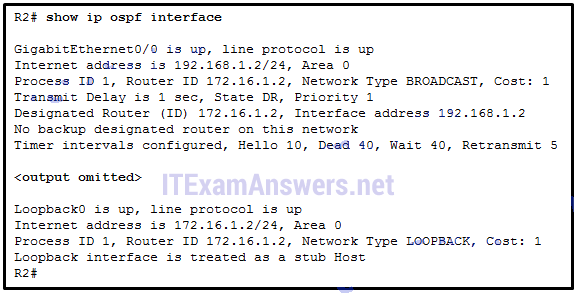

**Choices:**
- **A.** R2 is connecting to a point-to-point network.
- **B.** R2 has not formed an adjacency with any other router.
- **C.** R2 is configured with the OSPF router-id command.
- **D.** R2 is not configured with default Hello and Dead timer values.

**Correct Answer:**
R2 has not formed an adjacency with any other router.

**Explanation:**
From the result shown, R2 has not formed an adjacency with any other router on the network, because the network that R2 connects is BROADCAST, but no BDR is on the network. The Hello timer value 10 and Dead timer value 40 are default OSPF timers for a multiaccess network. The router ID for R2 is determined by the loopback 0 interface, not the router-id command.

---

## Question 36

**Question:**
What command would be used to determine if a routing protocol-initiated relationship had been made with an adjacent router?

**Choices:**
- **A.** ping
- **B.** show ip protocols
- **C.** show ip ospf neighbor
- **D.** show ip interface brief

**Correct Answer:**
show ip ospf neighbor

---

## Question 37

**Question:**
Which OSPFv3 function works differently from OSPFv2?

**Choices:**
- **A.** metric calculation
- **B.** hello mechanism
- **C.** OSPF packet types
- **D.** authentication
- **E.** election process

**Correct Answer:**
authentication

---

## Question 38

**Question:**
Which three addresses could be used as the destination address for OSPFv3 messages? (Choose three.)

**Choices:**
- **A.** FE80::1
- **B.** FF02::5
- **C.** FF02::6
- **D.** FF02::A
- **E.** FF02::1:2
- **F.** 2001:db8:cafe::1

**Correct Answer:**
FE80::1; FF02::5; FF02::6

---

## Question 39

**Question:**
What does a Cisco router use automatically to create link-local addresses on serial interfaces when OSPFv3 is implemented?

**Choices:**
- **A.** the highest MAC address available on the router, the FE80::/10 prefix, and the EUI-48 process
- **B.** the FE80::/10 prefix and the EUI-48 process
- **C.** the MAC address of the serial interface, the FE80::/10 prefix, and the EUI-64 process
- **D.** an Ethernet interface MAC address available on the router, the FE80::/10 prefix, and the EUI-64 process

**Correct Answer:**
an Ethernet interface MAC address available on the router, the FE80::/10 prefix, and the EUI-64 process

---

## Question 40

**Question:**
A network administrator enters the command ipv6 router ospf 64in global configuration mode. What is the result of this command?

**Choices:**
- **A.** The router will be assigned an autonomous system number of 64.
- **B.** The router will be assigned a router ID of 64.
- **C.** The reference bandwidth will be set to 64 Mb/s.
- **D.** The OSPFv3 process will be assigned an ID of 64.

**Correct Answer:**
The OSPFv3 process will be assigned an ID of 64.

---

## Question 41

**Question:**
Single area OSPFv3 has been enabled on a router via the ipv6 router ospf 20 command. Which command will enable this OSPFv3 process on an interface of that router?

**Choices:**
- **A.** ipv6 ospf 0 area 0
- **B.** ipv6 ospf 20 area 20
- **C.** ipv6 ospf 0 area 20
- **D.** ipv6 ospf 20 area 0

**Correct Answer:**
ipv6 ospf 20 area 0

---

## Question 42

**Question:**
Which command will verify that a router that is running OSPFv3 has formed an adjacency with other routers in its OSPF area?

**Choices:**
- **A.** show running-configuration
- **B.** show ipv6 ospf neighbor
- **C.** show ipv6 route ospf
- **D.** show ipv6 interface brief

**Correct Answer:**
show ipv6 ospf neighbor

---

## Question 43

**Question:**
Fill in the blank. Do not use abbreviations. To quickly verify OSPFv3 configuration information including the OSPF process ID, the router ID, and the interfaces enabled for OSPFv3, you need to issue the command show ipv6 protocols

---

## Question 44

**Question:**
Fill in the blank. The election of a DR and a BDR takes place on networks, such as Ethernet networks. multiaccess

---

## Question 45

**Question:**
Fill in the blank. OSPF uses cost as a metric.

---

## Question 46

**Question:**
Match the information to the command that is used to obtain the information. (Not all options are used.) Question Answer

**Images:**
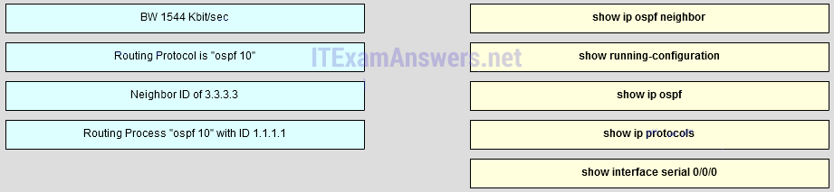
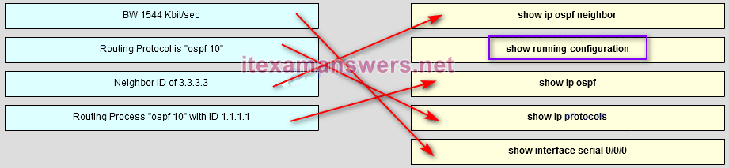

---

## Question 47

**Question:**
Open the PT Activity. Perform the tasks in the activity instructions and then complete the task. What message is displayed on www.ciscoville.com?

**Choices:**
- **A.** Finished!
- **B.** Completion!
- **C.** Success!
- **D.** Converged!

**Correct Answer:**
Completion!

---

## Question 48

**Question:**
Which criterion is preferred by the router to choose a router ID?

**Choices:**
- **A.** the IP address of the highest configured loopback interface on the router
- **B.** the IP address of the highest active interface on the router
- **C.** the router-id rid command
- **D.** the IP address of the highest active OSPF-enabled interface

**Correct Answer:**
the router-id rid command

---

## Question 49

**Question:**
Which command should be used to check the OSPF process ID, the router ID, networks the router is advertising, the neighbors the router is receiving updates from, and the default administrative distance?

**Choices:**
- **A.** show ip protocols
- **B.** show ip ospf neighbor
- **C.** show ip ospf
- **D.** show ip ospf interface

**Correct Answer:**
show ip protocols

---

## Question 50

**Question:**
A network administrator enters the command ipv6 router ospf 64 in global configuration mode. What is the result of this command?

**Choices:**
- **A.** The router will be assigned an autonomous system number of 64.
- **B.** The router will be assigned a router ID of 64.
- **C.** The reference bandwidth will be set to 64 Mb/s.
- **D.** The OSPFv3 process will be assigned an ID of 64.

**Correct Answer:**
The OSPFv3 process will be assigned an ID of 64.

---

## Question 51

**Question:**
When a network engineer is configuring OSPFv3 on a router, which command would the engineer issue immediately before configuring the router ID?

**Choices:**
- **A.** ipv6 ospf 10 area 0
- **B.** ipv6 router ospf 10
- **C.** interface serial 0/0/1
- **D.** clear ipv6 ospf process

**Correct Answer:**
ipv6 router ospf 10

---

## Question 52

**Question:**
Which command will provide information specific to OSPFv3 routes in the routing table?

**Choices:**
- **A.** show ip route ospf
- **B.** show ip route
- **C.** show ipv6 route
- **D.** show ipv6 route ospf

**Correct Answer:**
show ipv6 route ospf

---

## Question 53

**Question:**
Fill in the blank. The election of a DR and a BDR takes place on multiaccess networks, such as Ethernet networks.

---

## Question 54

**Question:**
Launch PT – Hide and Save PT. Open the PT Activity. Perform the tasks in the activity instructions and then complete the task. What message is displayed on www.ciscoville.com?

**Images:**
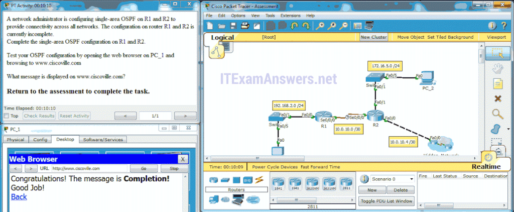

**Choices:**
- **A.** Completion!
- **B.** Converged!
- **C.** Success!
- **D.** Finished

**Correct Answer:**
Completion!

---

## Question 55

**Question:**
By order of precedence, match the selection of router ID for an OSFP-enabled router to the possible router ID options. (Not all options are used.) Place the options in the following order: Third precedence -> Loopback interface address 10.1.1.1 Fourth precedence -> Serial interface address 192.168.10.1 – not scored – First precedence -> Configured router ID 1.1.1.1 Second precedence -> loopback interface IP address 172.16.1.1

**Images:**
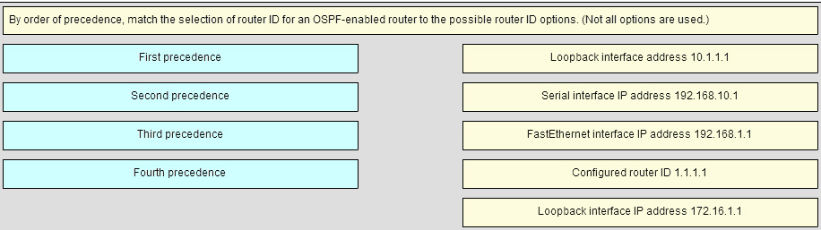
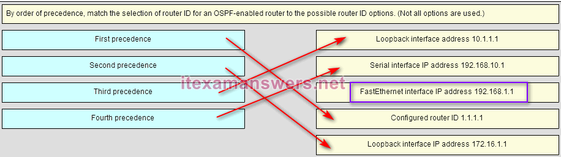

---

## Question 56

**Question:**
Match the description to the term. (Not all options are used.) Place the options in the following order: This is where the details of the neighboring routers can be found. -> adjacency database This is the algorithm used by OSPF. -> Shortest Path First All the routers are in the backbone area. -> Single-area OSPF – not scored – This is where you can find the topology table. -> link-state database – not scored –

**Images:**
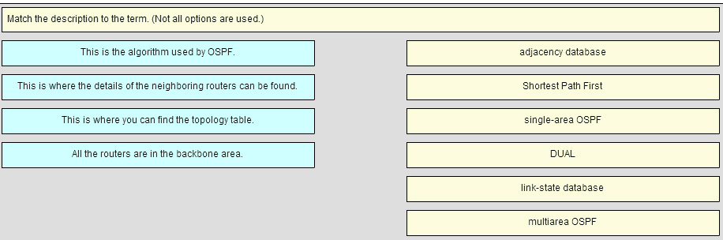
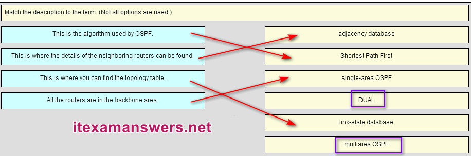

---

## Question 57

**Question:**
What is the first criterion used by OSPF routers to elect a DR?

**Choices:**
- **A.** Highest priority
- **B.** Highest IP address
- **C.** Highest MAC address
- **D.** Highest router ID

**Correct Answer:**
Highest priority

---

## Question 58

**Question:**
What are two reasons that will prevent routers from forming an OSPFv2 adjacency? (Choose two.)

**Choices:**
- **A.** mismatched subnet masks on the link interfaces
- **B.** use of private IP addresses on the link interfaces
- **C.** one router connecting to a FastEthernet port on the switch and the other connecting to a GigabitEthernet port
- **D.** a mismatched Cisco IOS version that is used
- **E.** mismatched OSPF Hello or Dead timers

**Correct Answer:**
mismatched subnet masks on the link interfaces; mismatched OSPF Hello or Dead timers

**Explanation:**
C and D. There may be several reasons why routers running OSPF will fail to form an OSPF adjacency, including subnet masks not matching, OSPF hello or dead timers not matching, OSPF network types not matching, or a missing or incorrect OSPF network command. Mismatched IOS versions, the use of private IP addresses, and different types of interface ports do not cause an OSPF adjacency to fail to form between two routers.

---

## Question 59

**Question:**
What command would be issued to determine if a routing protocol-initiated relationship has been made with an adjacent router?

**Choices:**
- **A.** show ip protocols
- **B.** ping
- **C.** show ip interface brief
- **D.** show ip ospf neighbor

**Correct Answer:**
show ip ospf neighbor

---

## Question 60

**Question:**
Match the OSPF state with the order in which it occurs. (Not all options are used.) Place the options in the following order: second state -> Init state – not scored – seventh state -> Full state fifth state -> Exchange state first state -> Down state fourth state -> Exstart state – not scored – third state -> Two-way state sixth state -> Loading state

**Images:**
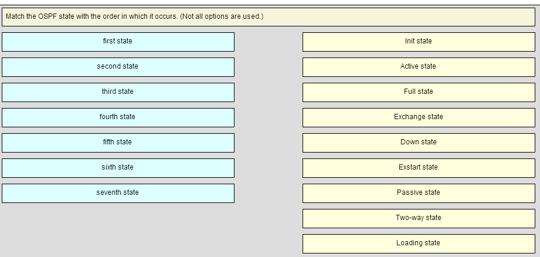
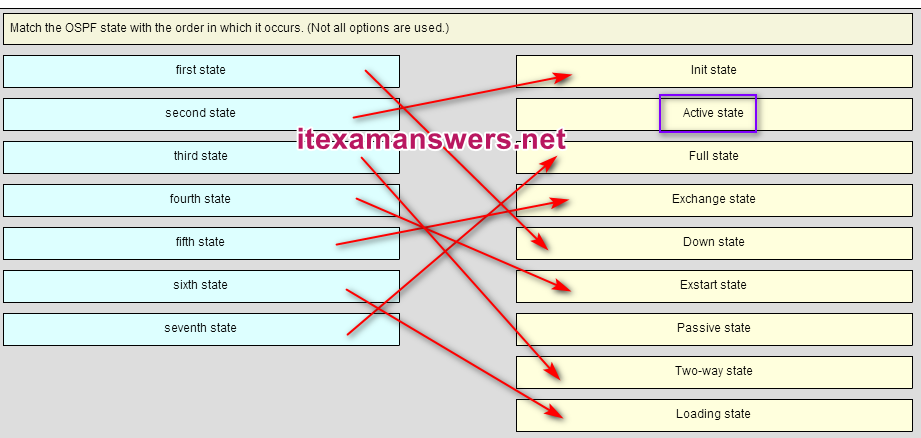

---

## Question 61

**Question:**
An administrator has configured a DHCPv4 relay router and issued these commands: The clients are not receiving IP parameters from the DHCPv4 server. What is a possible cause?

**Choices:**
- **A.** The IP address is incorrect for the subnet mask that is used.
- **B.** The pool cannot be named ‘RELAY’.
- **C.** The ip helper-address command is missing.
- **D.** The router is configured as a DHCPv4 client.

**Correct Answer:**
The ip helper-address command is missing.

**Explanation:**
This router should be configured with the ip helper-address command, followed with the IP address of the DHCPv4 server, because the router is meant to be used as a relay agent. The ip dhcp pool RELAY command just names the DHCPv4 pool, and it does not enable the relay function.

---
