# CCNA 2 v2 - CCNA 2 - Chapter 9

## Question 1

**Question:**
What is the primary purpose of NAT?

**Choices:**
- **A.** conserve IPv4 addresses
- **B.** allow peer-to-peer file sharing
- **C.** enhance network performance
- **D.** increase network security

**Correct Answer:**
conserve IPv4 addresses

**Explanation:**
NAT was developed to conserve IPv4 addresses. A side benefit is that NAT adds a small level of security by hiding the internal network addressing scheme. However, there are some drawbacks of using NAT. It does not allow true peer-to-peer communication and it adds latency to outbound connections.

---

## Question 2

**Question:**
Which method is used by a PAT-enabled router to send incoming packets to the correct inside hosts?​

**Choices:**
- **A.** It uses the destination TCP or UDP port number on the incoming packet.
- **B.** It uses the source TCP or UDP port number on the incoming packet.
- **C.** It uses the source IP address on the incoming packet.
- **D.** It uses a combination of the source TCP or UDP port number and the destination IP address on the incoming packet.

**Correct Answer:**
It uses the destination TCP or UDP port number on the incoming packet.

**Explanation:**
A PAT-enabled router maintains a table that consists of a mapping of inside local IP addresses and TCP/UDP port numbers to outside local addresses and TCP/UDP port numbers. When traffic returns to the router from the public network, the router would compare the destination port to the PAT mapping table to determine to which inside host the traffic should be sent.

---

## Question 3

**Question:**
What are two benefits of NAT? (Choose two.)

**Choices:**
- **A.** It makes troubleshooting routing issues easier.
- **B.** It makes tunneling with IPsec less complicated.
- **C.** It saves public IP addresses.
- **D.** It increases routing performance.
- **E.** It adds a degree of privacy and security to a network.

**Correct Answer:**
It saves public IP addresses.; It adds a degree of privacy and security to a network.

---

## Question 4

**Question:**
What is a disadvantage of NAT?

**Choices:**
- **A.** There is no end-to-end addressing.
- **B.** The router does not need to alter the checksum of the IPv4 packets.​
- **C.** The costs of readdressing hosts can be significant for a publicly addressed network.​
- **D.** The internal hosts have to use a single public IPv4 address for external communication.

**Correct Answer:**
There is no end-to-end addressing.

**Explanation:**
Many Internet protocols and applications depend on end-to-end addressing from the source to the destination. Because parts of the header of the IP packets are modified, the router needs to alter the checksum of the IPv4 packets. Using a single public IP address allows for the conservation of legally registered IP addressing schemes. If an addressing scheme needs to be modified, it is cheaper to use private IP addresses.

---

## Question 5

**Question:**
What is an advantage of deploying IPv4 NAT technology for internal hosts in an organization?

**Choices:**
- **A.** increases the performance of packet transmission to the Internet
- **B.** makes internal network access easy for outside hosts using UDP
- **C.** provides flexibility in designing the IPv4 addressing scheme
- **D.** enables the easy deployment of applications that require end-to-end traceability

**Correct Answer:**
provides flexibility in designing the IPv4 addressing scheme

**Explanation:**
IPv4 NAT provides some benefits: – NAT conserves the legally registered addressing scheme. – NAT increases the flexibility of connections to the public network. – NAT provides consistency for internal network addressing schemes. – NAT provides certain level of network security by hiding the internal network topology and hosts.IPv4 NAT also brings some disadvantages: – NAT may impact the network performance due to the translation process – End-to-end addressing is lost, especially when dynamic NAT is used. – End-to-end IPv4 traceability is also lost. – NAT complicates tunneling protocols, such as IPsec. – Services that require the initiation of TCP connections from the outside network, or stateless protocols, such as those using UDP, can be disrupted.

---

## Question 6

**Question:**
Refer to the exhibit. Which address or addresses represent the inside global address?

**Images:**
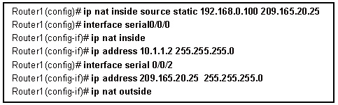

**Choices:**
- **A.** 192.168.0.100
- **B.** 10.1.1.2
- **C.** any address in the 10.1.1.0 network
- **D.** 209.165.20.25

**Correct Answer:**
209.165.20.25

**Explanation:**
In NAT terminology, an inside global address is the address of an internal host as seen from the outside network, typically a globally routable IPv4 address. According to the static NAT configuration syntax ip nat inside source static [inside local address] [inside global address], the address 209.165.20.25 is explicitly defined as the global representation for the internal host 192.168.0.100. Additionally, this address is assigned to the router’s outside interface (Serial 0/0/2), which is where translated traffic exits to reach external destinations.

---

## Question 7

**Question:**
Refer to the exhibit. A technician is configuring R2 for static NAT to allow the client to access the web server. What is a possible reason that the client PC cannot access the web server?

**Images:**
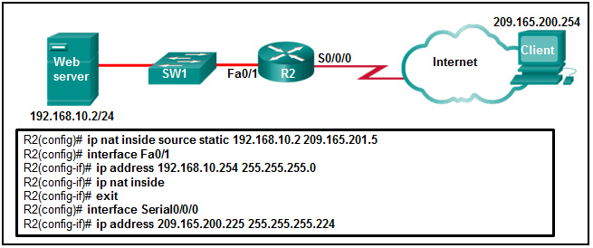

**Choices:**
- **A.** The IP NAT statement is incorrect.
- **B.** Interface Fa0/1 should be identified as the outside NAT interface.
- **C.** Interface S0/0/0 should be identified as the outside NAT interface.
- **D.** The configuration is missing a valid access control list.

**Correct Answer:**
Interface S0/0/0 should be identified as the outside NAT interface.

**Explanation:**
Interface S0/0/0 should be identified as the outside NAT interface. The command to do this would be R2(config-if)# ip nat outside.

---

## Question 8

**Question:**
A network administrator configures the border router with the command R1(config)# ip nat inside source list 4 pool corp. What is required to be configured in order for this particular command to be functional?

**Choices:**
- **A.** a NAT pool named corp that defines the starting and ending public IP addresses
- **B.** an access list numbered 4 that defines the starting and ending public IP addresses
- **C.** ip nat outside to be enabled on the interface that connects to the LAN affected by the NAT
- **D.** an access list named corp that defines the private addresses that are affected by NAT
- **E.** a VLAN named corp to be enabled and active and routed by R1

**Correct Answer:**
a NAT pool named corp that defines the starting and ending public IP addresses

**Explanation:**
In order for the ip nat inside source list 4 pool corp command to work, the following procedure needs to be used beforehand: Create an access list that defines the private IP addresses affected by NAT. Establish a NAT pool of starting and ending public IP addresses by using the ip nat pool command. Use the ip nat inside source list command to associate the access list with the NAT pool. Apply NAT to internal and external interfaces by using the ip nat inside and ip nat outside commands.

---

## Question 9

**Question:**
When dynamic NAT without overloading is being used, what happens if seven users attempt to access a public server on the Internet when only six addresses are available in the NAT pool?

**Choices:**
- **A.** No users can access the server.
- **B.** The request to the server for the seventh user fails.
- **C.** All users can access the server.
- **D.** The first user gets disconnected when the seventh user makes the request.

**Correct Answer:**
The request to the server for the seventh user fails.

**Explanation:**
If all the addresses in the NAT pool have been used, a device must wait for an available address before it can access the outside network.

---

## Question 10

**Question:**
What is defined by the ip nat pool command when configuring dynamic NAT?

**Choices:**
- **A.** the range of external IP addresses that internal hosts are permitted to access
- **B.** the pool of available NAT servers
- **C.** the range of internal IP addresses that are translated
- **D.** the pool of global address

**Correct Answer:**
the pool of global address

**Explanation:**
Dynamic NAT uses a pool of inside global addresses that are assigned to outgoing sessions. Creating the pool of inside global addresses is accomplished using the ip nat pool command.

---

## Question 11

**Question:**
Refer to the exhibit. What is the purpose of the command marked with an arrow shown in the partial configuration output of a Cisco broadband router?

**Images:**
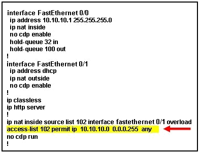

**Choices:**
- **A.** defines which addresses are allowed into the router
- **B.** defines which addresses can be translated
- **C.** defines which addresses are assigned to a NAT pool
- **D.** defines which addresses are allowed out of the router

**Correct Answer:**
defines which addresses can be translated

**Explanation:**
In the provided configuration, access-list 102 is used in conjunction with the ip nat inside source command to identify the “inside local” traffic that is eligible for translation. Specifically, the statement access-list 102 permit ip 10.10.10.0 0.0.0.255 any identifies the internal network range, and the NAT command instructs the router to translate any source addresses matching that list to the public IP address of the FastEthernet 0/1 interface before forwarding the traffic to the outside network.

---

## Question 12

**Question:**
A network engineer has configured a router with the command ip nat inside source list 4 pool corp overload. Why did the engineer use the overload option?

**Choices:**
- **A.** The company router must throttle or buffer traffic because the processing power of the router is not enough to handle the normal load of external-bound Internet traffic.
- **B.** The company has more private IP addresses than available public IP addresses.
- **C.** The company needs to have more public IP addresses available to be used on the Internet.
- **D.** The company has a small number of servers that should be accessible by clients from the Internet.

**Correct Answer:**
The company has more private IP addresses than available public IP addresses.

**Explanation:**
The overload option enables PAT for a pool of public IP addresses. The source list 4 part of the command refers to the access list that defines what private addresses get translated. The pool corp part of the command refers to the named NAT pool that is created using the separate ip nat pool corp command.

---

## Question 13

**Question:**
What are two of the required steps to configure PAT? (Choose two.)

**Choices:**
- **A.** Create a standard access list to define applications that should be translated.
- **B.** Define a pool of global addresses to be used for overload translation.
- **C.** Define the range of source ports to be used.
- **D.** Define the hello and interval timers to match the adjacent neighbor router.
- **E.** Identify the inside interface.

**Correct Answer:**
Define a pool of global addresses to be used for overload translation.; Identify the inside interface.

**Explanation:**
The steps that are required to configure PAT are to define a pool of global addresses to be used for overload translation, to configure source translation by using the keywords interface and overload, and to identify the interfaces that are involved in the PAT.

---

## Question 14

**Question:**
What is the major benefit of using NAT with Port Address Translation?

**Choices:**
- **A.** It allows external hosts access to internal servers.
- **B.** It allows many internal hosts to share the same public IPv4 address.
- **C.** It improves network performance for real-time protocols.
- **D.** It provides a pool of public addresses that can be assigned to internal hosts.

**Correct Answer:**
It allows many internal hosts to share the same public IPv4 address.

**Explanation:**
Port Address Translation (PAT) tracks IP flows of internal hosts using port numbers. By using port numbers to track flows, PAT allows many users to share a single public IPv4 address.

---

## Question 15

**Question:**
What is the purpose of port forwarding?

**Choices:**
- **A.** Port forwarding allows an internal user to reach a service on a public IPv4 address that is located outside a LAN.
- **B.** Port forwarding allows users to reach servers on the Internet that are not using standard port numbers.
- **C.** Port forwarding allows for translating inside local IP addresses to outside local addresses.
- **D.** Port forwarding allows an external user to reach a service on a private IPv4 address that is located inside a LAN.

**Correct Answer:**
Port forwarding allows an external user to reach a service on a private IPv4 address that is located inside a LAN.

**Explanation:**
Port forwarding allows a user or program from outside to reach services inside a private network. It is not a technique that allows for using services with nonstandard port numbers. NAT or PAT convert inside IP addresses to outside local addresses.

---

## Question 16

**Question:**
A network administrator is configuring a static NAT on the border router for a web server located in the DMZ network. The web server is configured to listen on TCP port 8080. The web server is paired with the internal IP address of 192.168.5.25 and the external IP address of 209.165.200.230. For easy access by hosts on the Internet, external users do not need to specify the port when visiting the web server. Which command will configure the static NAT?

**Choices:**
- **A.** R1(config)# ip nat inside source static tcp 209.165.200.230 80 192.168.5.25 8080
- **B.** R1(config)# ip nat inside source static tcp 192.168.5.25 8080 209.165.200.230 80
- **C.** R1(config)# ip nat inside source static tcp 209.165.200.230 8080 192.168.5.25 80
- **D.** R1(config)# ip nat inside source static tcp 192.168.5.25 80 209.165.200.230 8080

**Correct Answer:**
R1(config)# ip nat inside source static tcp 192.168.5.25 8080 209.165.200.230 80

**Explanation:**
The IOS command for port forwarding configuration in global configuration mode is as follows:ip nat inside source {static {tcp | udp local-ip local-port global-ip global-port}Where local-ip is the inside local address, local-port is the port on which the web server listens.

---

## Question 17

**Question:**
What is a characteristic of unique local addresses?

**Choices:**
- **A.** They are defined in RFC 3927.
- **B.** Their implementation depends on ISPs providing the service.
- **C.** They allow sites to be combined without creating any address conflicts.
- **D.** They are designed to improve the security of IPv6 networks.

**Correct Answer:**
They allow sites to be combined without creating any address conflicts.

**Explanation:**
Link-local addresses are defined in RFC 3927. Unique local addresses are independent of any ISP, and are not meant to improve the security of IPv6 networks.

---

## Question 18

**Question:**
Which statement describes IPv6 ULAs?

**Choices:**
- **A.** They begin with the fe80::/10 prefix.
- **B.** They conserve IPv6 address space.
- **C.** They are not routable across the Internet.
- **D.** They are assigned by an ISP.

**Correct Answer:**
They are not routable across the Internet.

**Explanation:**
IPv6 ULAs are unique local addresses. ULAs are similar to IPv4 private IP addresses and are not routable on the Internet. ULAs do not conserve IPv6 addresses. ULAs have a network prefix in the fc00::/7 range.

---

## Question 19

**Question:**
Refer to the exhibit. Based on the output that is shown, what type of NAT has been implemented?

**Images:**
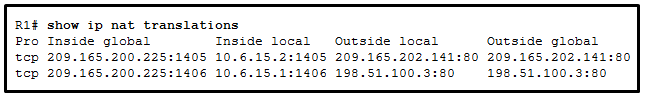

**Choices:**
- **A.** PAT using an external interface
- **B.** static NAT with one entry
- **C.** dynamic NAT with a pool of two public IP addresses
- **D.** static NAT with a NAT pool

**Correct Answer:**
PAT using an external interface

---

## Question 20

**Question:**
Match the steps with the actions that are involved when an internal host with IP address 192.168.10.10 attempts to send a packet to an external server at the IP address 209.165.200.254 across a router R1 that is running dynamic NAT. (Not all options are used.) Explanation: The translation of the IP addresses from 209.65.200.254 to 192.168.10.10 will take place when the reply comes back from the server.

**Images:**
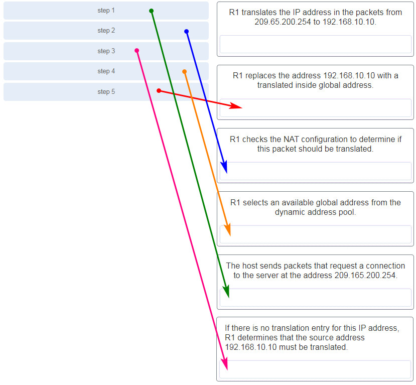

---

## Question 21

**Question:**
Fill in the blank. Do not use abbreviations. NAT overload is also known as ………. Correct Answer: Port Address Translation

---

## Question 22

**Question:**
A technician is required to configure an edge router to use a different TCP port number for each session with a server on the Internet. What type of Network Address Translation (NAT) should be implemented?

**Choices:**
- **A.** a many-to-one address mapping between local and global addresses
- **B.** a many-to-many address mapping between local and global addresses
- **C.** a one-to-many address mapping between local and global addresses
- **D.** a one-to-one address mapping between local and global addresses

**Correct Answer:**
a many-to-one address mapping between local and global addresses

**Explanation:**
Old version 5.0:

---

## Question 23

**Question:**
Which three statements describe ACL processing of packets? (Choose three.)

**Choices:**
- **A.** An implicit deny any rejects any packet that does not match any ACE.
- **B.** A packet can either be rejected or forwarded as directed by the ACE that is matched.
- **C.** A packet that has been denied by one ACE can be permitted by a subsequent ACE.
- **D.** A packet that does not match the conditions of any ACE will be forwarded by default.
- **E.** Each statement is checked only until a match is detected or until the end of the ACE list.
- **F.** Each packet is compared to the conditions of every ACE in the ACL before a forwarding decision is made.

**Correct Answer:**
An implicit deny any rejects any packet that does not match any ACE.; A packet can either be rejected or forwarded as directed by the ACE that is matched.; Each statement is checked only until a match is detected or until the end of the ACE list.

---

## Question 24

**Question:**
What two functions describe uses of an access control list? (Choose two.)

**Choices:**
- **A.** ACLs assist the router in determining the best path to a destination.
- **B.** Standard ACLs can restrict access to specific applications and ports.
- **C.** ACLs provide a basic level of security for network access.
- **D.** ACLs can permit or deny traffic based upon the MAC address originating on the router.
- **E.** ACLs can control which areas a host can access on a network.

**Correct Answer:**
ACLs provide a basic level of security for network access.; ACLs can control which areas a host can access on a network.

**Explanation:**
ACLs can be configured as a simple firewall that provides security using basic traffic filtering capabilities. ACLs are used to filter host traffic by allowing or blocking matching packets to networks.

---

## Question 25

**Question:**
In which configuration would an outbound ACL placement be preferred over an inbound ACL placement?

**Choices:**
- **A.** when the ACL is applied to an outbound interface to filter packets coming from multiple inbound interfaces before the packets exit the interface
- **B.** when a router has more than one ACL
- **C.** when an outbound ACL is closer to the source of the traffic flow
- **D.** when an interface is filtered by an outbound ACL and the network attached to the interface is the source network being filtered within the ACL

**Correct Answer:**
when the ACL is applied to an outbound interface to filter packets coming from multiple inbound interfaces before the packets exit the interface

---

## Question 26

**Question:**
Which two characteristics are shared by both standard and extended ACLs? (Choose two.)

**Choices:**
- **A.** Both kinds of ACLs can filter based on protocol type.
- **B.** Both can permit or deny specific services by port number.
- **C.** Both include an implicit deny as a final entry.
- **D.** Both filter packets for a specific destination host IP address.
- **E.** Both can be created by using either a descriptive name or number.

**Correct Answer:**
Both include an implicit deny as a final entry.; Both can be created by using either a descriptive name or number.

**Explanation:**
Standard ACLs filter traffic based solely on a specified source IP address. Extended ACLs can filter by source or destination, protocol, or port. Both standard and extended ACLs contain an implicit deny as a final statement. Standard and extended ACLs can be identified by either names or numbers.

---

## Question 27

**Question:**
A network administrator needs to configure a standard ACL so that only the workstation of the administrator with the IP address 192.168.15.23 can access the virtual terminal of the main router. Which two configuration commands can achieve the task? (Choose two.)

**Choices:**
- **A.** Router1(config)# access-list 10 permit host 192.168.15.23
- **B.** Router1(config)# access-list 10 permit 192.168.15.23 0.0.0.0
- **C.** Router1(config)# access-list 10 permit 192.168.15.23 0.0.0.255
- **D.** Router1(config)# access-list 10 permit 192.168.15.23 255.255.255.0
- **E.** Router1(config)# access-list 10 permit 192.168.15.23 255.255.255.255

**Correct Answer:**
Router1(config)# access-list 10 permit host 192.168.15.23; Router1(config)# access-list 10 permit 192.168.15.23 0.0.0.0

---

## Question 28

**Question:**
What single access list statement matches all of the following networks? 192.168.16.0 192.168.17.0 192.168.18.0 192.168.19.0

**Choices:**
- **A.** access-list 10 permit 192.168.16.0 0.0.3.255
- **B.** access-list 10 permit 192.168.16.0 0.0.0.255
- **C.** access-list 10 permit 192.168.16.0 0.0.15.255
- **D.** access-list 10 permit 192.168.0.0 0.0.15.255

**Correct Answer:**
access-list 10 permit 192.168.16.0 0.0.3.255

---

## Question 29

**Question:**
If a router has two interfaces and is routing both IPv4 and IPv6 traffic, how many ACLs could be created and applied to it?

**Choices:**
- **A.** 4
- **B.** 6
- **C.** 8
- **D.** 12
- **E.** 16

**Correct Answer:**
8

---

## Question 30

**Question:**
Which three statements are generally considered to be best practices in the placement of ACLs? (Choose three.)

**Choices:**
- **A.** Place standard ACLs close to the source IP address of the traffic.
- **B.** Place extended ACLs close to the destination IP address of the traffic.
- **C.** Filter unwanted traffic before it travels onto a low-bandwidth link.
- **D.** Place extended ACLs close to the source IP address of the traffic.
- **E.** Place standard ACLs close to the destination IP address of the traffic.
- **F.** For every inbound ACL placed on an interface, there should be a matching outbound ACL.

**Correct Answer:**
Filter unwanted traffic before it travels onto a low-bandwidth link.; Place extended ACLs close to the source IP address of the traffic.; Place standard ACLs close to the destination IP address of the traffic.

---

## Question 31

**Question:**
Refer to the exhibit. A router has an existing ACL that permits all traffic from the 172.16.0.0 network. The administrator attempts to add a new ACE to the ACL that denies packets from host 172.16.0.1 and receives the error message that is shown in the exhibit. What action can the administrator take to block packets from host 172.16.0.1 while still permitting all other traffic from the 172.16.0.0 network?

**Images:**
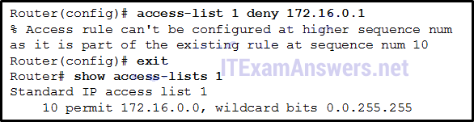

**Choices:**
- **A.** Manually add the new deny ACE with a sequence number of 5.
- **B.** Manually add the new deny ACE with a sequence number of 15.
- **C.** Create a second access list denying the host and apply it to the same interface.
- **D.** Add a deny any any ACE to access-list 1.

**Correct Answer:**
Manually add the new deny ACE with a sequence number of 5.

---

## Question 32

**Question:**
Refer to the exhibit. What will happen to the access list 10 ACEs if the router is rebooted before any other commands are implemented?

**Images:**
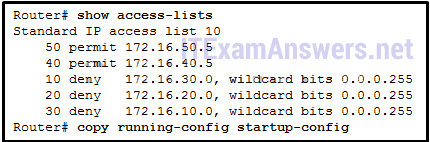

**Choices:**
- **A.** The ACEs of access list 10 will be deleted.
- **B.** The ACEs of access list 10 will not be affected.
- **C.** The ACEs of access list 10 will be renumbered.
- **D.** The ACEs of access list 10 wildcard masks will be converted to subnet masks.

**Correct Answer:**
The ACEs of access list 10 will be renumbered.

---

## Question 33

**Question:**
An administrator has configured an access list on R1 to allow SSH administrative access from host 172.16.1.100. Which command correctly applies the ACL?

**Choices:**
- **A.** R1(config-if)# ip access-group 1 in
- **B.** R1(config-if)# ip access-group 1 out
- **C.** R1(config-line)# access-class 1 in
- **D.** R1(config-line)# access-class 1 out

**Correct Answer:**
R1(config-line)# access-class 1 in

---

## Question 34

**Question:**
Consider the following access list that allows IP phone configuration file transfers from a particular host to a TFTP server: Which method would allow the network administrator to modify the ACL and include FTP transfers from any source IP address?

**Choices:**
- **A.** R1(config)# access-list 105 permit tcp any host 10.0.54.5 eq 20 R1(config)# access-list 105 permit tcp any host 10.0.54.5 eq 21
- **B.** R1(config)# interface gi0/0 R1(config-if)# no ip access-group 105 out R1(config)# access-list 105 permit tcp any host 10.0.54.5 eq 20 R1(config)# access-list 105 permit tcp any host 10.0.54.5 eq 21 R1(config)# interface gi0/0 R1(config-if)# ip access-group 105 out
- **C.** R1(config)# interface gi0/0 R1(config-if)# no ip access-group 105 out R1(config)# no access-list 105 R1(config)# access-list 105 permit udp host 10.0.70.23 host 10.0.54.5 range 1024 5000 R1(config)# access-list 105 permit tcp any host 10.0.54.5 eq 20 R1(config)# access-list 105 permit tcp any host 10.0.54.5 eq 21 R1(config)# access-list 105 deny ip any any R1(config)# interface gi0/0 R1(config-if)# ip access-group 105 out
- **D.** R1(config)# access-list 105 permit udp host 10.0.70.23 host 10.0.54.5 range 1024 5000 R1(config)# access-list 105 permit tcp any host 10.0.54.5 eq 20 R1(config)# access-list 105 permit tcp any host 10.0.54.5 eq 21 R1(config)# access-list 105 deny ip any any

**Correct Answer:**
R1(config)# interface gi0/0 R1(config-if)# no ip access-group 105 out R1(config)# no access-list 105 R1(config)# access-list 105 permit udp host 10.0.70.23 host 10.0.54.5 range 1024 5000 R1(config)# access-list 105 permit tcp any host 10.0.54.5 eq 20 R1(config)# access-list 105 permit tcp any host 10.0.54.5 eq 21 R1(config)# access-list 105 deny ip any any R1(config)# interface gi0/0 R1(config-if)# ip access-group 105 out

---

## Question 35

**Question:**
Refer to the exhibit. What is the result of adding the established argument to the end of the ACE?

**Images:**
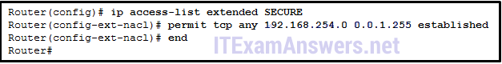

**Choices:**
- **A.** Any traffic is allowed to reach the 192.168.254.0 255.255.254.0 network.
- **B.** Any IP traffic is allowed to reach the 192.168.254.0 255.255.254.0 network as long as it is in response to an originated request.
- **C.** 192.168.254.0 /23 traffic is allowed to reach any network.
- **D.** Any TCP traffic is allowed to reach the 192.168.254.0 255.255.254.0 network if it is in response to an originated request.

**Correct Answer:**
Any TCP traffic is allowed to reach the 192.168.254.0 255.255.254.0 network if it is in response to an originated request.

**Explanation:**
The established argument allows TCP return traffic from established connections to be sent on an outgoing interface to a network.

---

## Question 36

**Question:**
What packets would match the access control list statement that is shown below? access-list 110 permit tcp 172.16.0.0 0.0.0.255 any eq 22

**Choices:**
- **A.** SSH traffic from the 172.16.0.0 network to any destination network
- **B.** SSH traffic from any source network to the 172.16.0.0 network
- **C.** any TCP traffic from any host to the 172.16.0.0 network
- **D.** any TCP traffic from the 172.16.0.0 network to any destination network

**Correct Answer:**
SSH traffic from the 172.16.0.0 network to any destination network

**Explanation:**
The access-list 110 permit tcp 172.16.0.0 0.0.0.255 any eq 22 ACE will match traffic on port 22, which is SSH, that is sourced from network 172.16.0.0/24 with any destination.

---

## Question 37

**Question:**
Which statement describes a difference between the operation of inbound and outbound ACLs?

**Choices:**
- **A.** In contrast to outbound ALCs, inbound ACLs can be used to filter packets with multiple criteria.
- **B.** Inbound ACLs can be used in both routers and switches but outbound ACLs can be used only on routers.
- **C.** Inbound ACLs are processed before the packets are routed while outbound ACLs are processed after the routing is completed.
- **D.** On a network interface, more than one inbound ACL can be configured but only one outbound ACL can be configured.

**Correct Answer:**
Inbound ACLs are processed before the packets are routed while outbound ACLs are processed after the routing is completed.

---

## Question 38

**Question:**
What is a limitation when utilizing both IPv4 and IPv6 ACLs on a router?

**Choices:**
- **A.** A device can run only IPv4 ACLs or IPv6 ACLs.
- **B.** Both IPv4 and IPv6 ACLs can be configured on a single device, but cannot share the same name.
- **C.** IPv4 ACLs can be numbered or named whereas IPv6 ACLs must be numbered.
- **D.** IPv6 ACLs perform the same functions as standard IPv4 ACLs.

**Correct Answer:**
Both IPv4 and IPv6 ACLs can be configured on a single device, but cannot share the same name.

**Explanation:**
IPv4 and IPv6 ACLs can be configured on the same device as long as they utilize different ACL names. IPv6 ACLs provide the same functionality as named IPv4 extended ACLs but cannot have the same name as any IPv4 ACLs.

---

## Question 39

**Question:**
What method is used to apply an IPv6 ACL to a router interface?

**Choices:**
- **A.** the use of the access-class command
- **B.** the use of the ip access-group command
- **C.** the use of the ipv6 traffic-filter command
- **D.** the use of the ipv6 access-list command

**Correct Answer:**
the use of the ipv6 traffic-filter command

**Explanation:**
A network administrator will use the ipv6 traffic-filter command within interface configuration mode to apply an IPv6 ACL.​

---

## Question 40

**Question:**
Which IPv6 ACL command entry will permit traffic from any host to an SMTP server on network 2001:DB8:10:10::/64?

**Choices:**
- **A.** permit tcp any host 2001:DB8:10:10::100 eq 25
- **B.** permit tcp host 2001:DB8:10:10::100 any eq 25
- **C.** permit tcp any host 2001:DB8:10:10::100 eq 23
- **D.** permit tcp host 2001:DB8:10:10::100 any eq 23

**Correct Answer:**
permit tcp any host 2001:DB8:10:10::100 eq 25

---

## Question 41

**Question:**
Refer to the exhibit. The IPv6 access list LIMITED_ACCESS is applied on the S0/0/0 interface of R1 in the inbound direction. Which IPv6 packets from the ISP will be dropped by the ACL on R1?

**Images:**
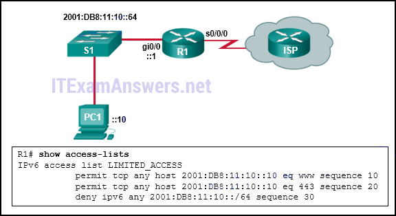

**Choices:**
- **A.** HTTPS packets to PC1
- **B.** ICMPv6 packets that are destined to PC1
- **C.** packets that are destined to PC1 on port 80
- **D.** neighbor advertisements that are received from the ISP router

**Correct Answer:**
ICMPv6 packets that are destined to PC1

---

## Question 42

**Question:**
Which feature is unique to IPv6 ACLs when compared to those of IPv4 ACLs?

**Choices:**
- **A.** the use of wildcard masks
- **B.** an implicit deny any any ACE
- **C.** the use of named ACL entries
- **D.** an implicit permit of neighbor discovery packets

**Correct Answer:**
an implicit permit of neighbor discovery packets

---

## Question 43

**Question:**
Which three implicit access control entries are automatically added to the end of an IPv6 ACL? (Choose three.)

**Choices:**
- **A.** deny ip any any
- **B.** deny ipv6 any any
- **C.** permit ipv6 any any
- **D.** deny icmp any any
- **E.** permit icmp any any nd-ns
- **F.** permit icmp any any nd-na

**Correct Answer:**
deny ipv6 any any; permit icmp any any nd-ns; permit icmp any any nd-na

**Explanation:**
All IPv6 ACLs automatically include two implicit permit statements; permit icmp any any nd-ns and permit icmp any any nd-na. These statements allow the router interface to perform neighbor discovery operations. An implicit deny ipv6 any any is also automatically included at the end of any IPv6 ACL that blocks all IPv6 packets not otherwise permitted.

---

## Question 44

**Question:**
What is the only type of ACL available for IPv6?

**Choices:**
- **A.** named standard
- **B.** named extended
- **C.** numbered standard
- **D.** numbered extended

**Correct Answer:**
named extended

**Explanation:**
Unlike IPv4, IPv6 has only one type of access list and that is the named extended access list.

---

## Question 45

**Question:**
Match each statement with the example subnet and wildcard that it describes. (Not all options are used.) Question Answer

**Images:**
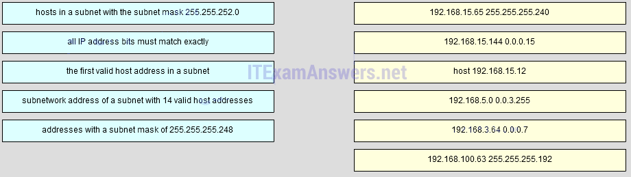
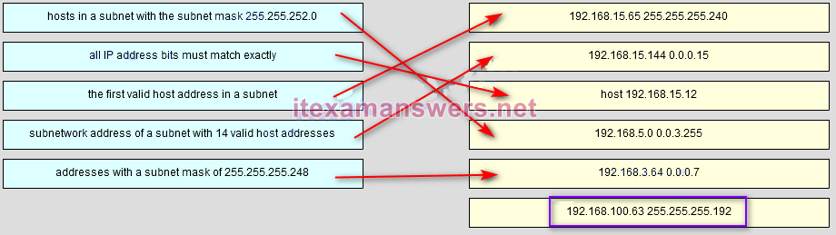

---

## Question 46

**Question:**
Which statement describes a characteristic of standard IPv4 ACLs?

**Choices:**
- **A.** They are configured in the interface configuration mode.
- **B.** They filter traffic based on source IP addresses only.
- **C.** They can be created with a number but not with a name.
- **D.** They can be configured to filter traffic based on both source IP addresses and source ports.

**Correct Answer:**
They filter traffic based on source IP addresses only.

---

## Question 47

**Question:**
Which IPv4 address range covers all IP addresses that match the ACL filter specified by 172.16.2.0 with wildcard mask 0.0.1.255?

**Choices:**
- **A.** 172.16.2.0 to 172.16.2.255
- **B.** 172.16.2.1 to 172.16.3.254
- **C.** 172.16.2.0 to 172.16.3.255
- **D.** 172.16.2.1 to 172.16.255.255

**Correct Answer:**
172.16.2.0 to 172.16.3.255

**Explanation:**
The wildcard mask 0.0.1.255 means the first 23 bits are matched and the last 9 bits are ignored. That is, a matching IP address should be from 172.16.2.0 to 172.16.3.255 (where last 9 bits are from all 0s to all 1s and any value between).

---

## Question 48

**Question:**
Refer to the exhibit. The network administrator that has the IP address of 10.0.70.23/25 needs to have access to the corporate FTP server (10.0.54.5/28). The FTP server is also a web server that is accessible to all internal employees on networks within the 10.x.x.x address. No other traffic should be allowed to this server. Which extended ACL would be used to filter this traffic, and how would this ACL be applied? (Choose two.)

**Images:**
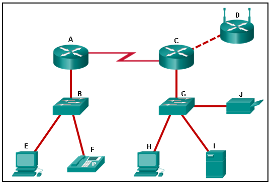

**Choices:**
- **A.** access-list 105 permit ip host 10.0.70.23 host 10.0.54.5 access-list 105 permit tcp any host 10.0.54.5 eq www access-list 105 permit ip any any
- **B.** access-list 105 permit tcp host 10.0.54.5 any eq www access-list 105 permit tcp host 10.0.70.23 host 10.0.54.5 eq 20 access-list 105 permit tcp host 10.0.70.23 host 10.0.54.5 eq 21
- **C.** access-list 105 permit tcp host 10.0.70.23 host 10.0.54.5 eq 20 access-list 105 permit tcp host 10.0.70.23 host 10.0.54.5 eq 21 access-list 105 permit tcp 10.0.0.0 0.255.255.255 host 10.0.54.5 eq www access-list 105 deny ip any host 10.0.54.5 access-list 105 permit ip any any
- **D.** R2(config)# interface gi0/0 R2(config-if)# ip access-group 105 in
- **E.** R1(config)# interface gi0/0 R1(config-if)# ip access-group 105 out
- **F.** R1(config)# interface s0/0/0 R1(config-if)# ip access-group 105 out

**Correct Answer:**
access-list 105 permit tcp host 10.0.70.23 host 10.0.54.5 eq 20 access-list 105 permit tcp host 10.0.70.23 host 10.0.54.5 eq 21 access-list 105 permit tcp 10.0.0.0 0.255.255.255 host 10.0.54.5 eq www access-list 105 deny ip any host 10.0.54.5 access-list 105 permit ip any any; R1(config)# interface gi0/0 R1(config-if)# ip access-group 105 out

---

## Question 49

**Question:**
Launch PT – Hide and Save PT Open the PT Activity. Perform the tasks in the activity instructions and then answer the question. Why is the ACL not working?

**Images:**
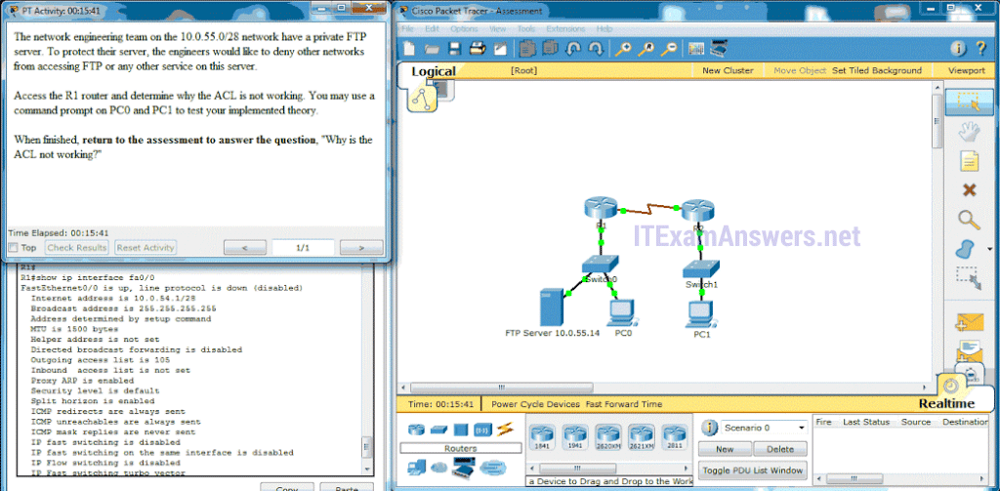

**Choices:**
- **A.** The ACL is missing a deny ip any any ACE.
- **B.** The ACL is applied in the wrong direction.
- **C.** The access-list 105 command or commands are incorrect.
- **D.** The ACL is applied to the wrong interface.*
- **E.** No ACL is needed for this scenario.

**Correct Answer:**
The ACL is applied to the wrong interface.*

---

## Question 50

**Question:**
What are two possible uses of access control lists in an enterprise network? (Choose two.)

**Choices:**
- **A.** limiting debug outputs
- **B.** reducing the processing load on routers
- **C.** controlling the physical status of router interfaces
- **D.** controlling virtual terminal access to routers
- **E.** allowing Layer 2 traffic to be filtered by a router

**Correct Answer:**
limiting debug outputs; controlling virtual terminal access to routers

---

## Question 51

**Question:**
A network administrator configures the border router with the command R1(config)# ip nat inside source list 4 pool corp . What is required to be configured in order for this particular command to be functional?

**Choices:**
- **A.** a VLAN named corp to be enabled and active and routed by R1 a NAT pool named corp that defines the starting and ending public IP addresses an access list numbered 4 that defines the starting and ending public IP addresses an access list named corp that defines the private addresses that are affected by NAT ip nat outside to be enabled on the interface that connects to the LAN affected by the NAT

**Correct Answer:**
a VLAN named corp to be enabled and active and routed by R1 a NAT pool named corp that defines the starting and ending public IP addresses an access list numbered 4 that defines the starting and ending public IP addresses an access list named corp that defines the private addresses that are affected by NAT ip nat outside to be enabled on the interface that connects to the LAN affected by the NAT

**Explanation:**
Download PDF File below: ITexamanswers.net – CCNA 2 (v5.1 + v6.0) Chapter 9 Exam Answers Full.pdf 1.12 MB 7657 downloads

---
