# CCNA 2 v2 - CCNA 2 - Chapter 10

## Question 1

**Question:**
Beginning with the Cisco IOS Software Release 15.0, which license is a prerequisite for installing additional technology pack licenses?

**Choices:**
- **A.** IPBase
- **B.** UC
- **C.** DATA
- **D.** SEC

**Correct Answer:**
IPBase

**Explanation:**
Cisco IOS Software release 15.0 incorporates four technology packs. They are IPBase, DATA, UC (unified Communications), and SEC (Security). Having the IPBase license installed is a prerequisite for installing the other technology packs.

---

## Question 2

**Question:**
What is the major release number in the IOS image name c1900-universalk9-mz.SPA.152-3.T.bin?

**Choices:**
- **A.** 15
- **B.** 52
- **C.** 2
- **D.** 1900
- **E.** 3

**Correct Answer:**
15

**Explanation:**
The part of the image name 152-3 indicates that the major release is 15, the minor release is 2, and the new feature release is 3.

---

## Question 3

**Question:**
Refer to the exhibit. What does the number 17:46:26.143 represent?

**Images:**
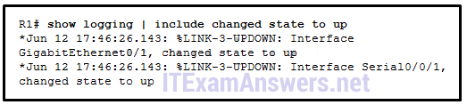

**Choices:**
- **A.** the time passed since the sysiog server has been started
- **B.** the time on the router when the show logging command was issued
- **C.** the time passed since the interfaces have been up
- **D.** the time when the syslog message was issued

**Correct Answer:**
the time when the syslog message was issued

**Explanation:**
The number following the date represents the time that the syslog message was issued.

---

## Question 4

**Question:**
What statement describes a Cisco IOS image with the “universalk9_npe” designation for Cisco ISR G2 routers?

**Choices:**
- **A.** It is an IOS version that provides only the IPBase feature set
- **B.** It is an IOS version that, at the request of some countries removes any strong cryptographic functionality
- **C.** It Is an IOS version that offers all of the Cisco IOS Software feature sets
- **D.** It is an IOS version that can only be used in the United States of Amenca

**Correct Answer:**
It is an IOS version that, at the request of some countries removes any strong cryptographic functionality

**Explanation:**
To support Cisco ISR G2 platforms, Cisco provides two types of universal images. The images with the “universalk9_npe” designation in the image name do not support any strong cryptography functionality such as payload cryptography to satisfy the import requirements of some countries. The “universalk9_npe” images include all other Cisco IOS software features.

---

## Question 5

**Question:**
Refer to the exhibit. Routers R1 and R2 are connected via a serial link. One router is configured as the NTP master, and the other is an NTP client. Which two pieces of information can be obtained from the partial output of the show ntp associations detail command on R2? (Choose two.)

**Images:**
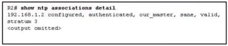

**Choices:**
- **A.** Both routers are configured to use NTPv2.
- **B.** Router R1 is the master, and R2 is the client
- **C.** The IP address of R2 is 192 168.1.2.
- **D.** Router R2 is the master, and R1 is the client
- **E.** The IP address of R1 is 192.168.1.2

**Correct Answer:**
Router R1 is the master, and R2 is the client; The IP address of R1 is 192.168.1.2

**Explanation:**
With the show NTP associations command, the IP address of the NTP master is given.

---

## Question 6

**Question:**
A network administrator configures a router with the command sequence: R1(config)# boot system tftp://c1900-universalk9-mz.SPA.152-4.M3.bin R1(config)# boot system rom What is the effect of the command sequence?

**Choices:**
- **A.** The router will copy the IOS image from the TFTP server and then reboot the system.
- **B.** The router will search and load a valid IOS image In the sequence of flash, TFTP, and ROM.
- **C.** On next reboot the router will load the IOS image from ROM.
- **D.** The router will load IOS from the TFTP server. If the image fails to load. It will load the IOS image from ROM.

**Correct Answer:**
The router will load IOS from the TFTP server. If the image fails to load. It will load the IOS image from ROM.

**Explanation:**
The boot system command is a global configuration command that allows the user to specify the source for the Cisco IOS Software image to load. In this case, the router is configured to boot from the IOS image that is stored on the TFTP server and will use the ROMmon imagethat is located in the ROM if it fails to locate the TFTP server or fails to load a valid image from the TFTP server.

---

## Question 7

**Question:**
What is used as the default event logging destination for Cisco routers and switches?

**Choices:**
- **A.** terminal line
- **B.** workstation
- **C.** syslog server
- **D.** console line

**Correct Answer:**
console line

**Explanation:**
By default, Cisco routers and switches send event messages to the console. Various IOS versions will also send their event messages to the buffer by default. Specific commands must be implemented to allow logging to other locations.

---

## Question 8

**Question:**
When a customer purchases a Cisco IOS 15.0 software package, what serves as the receipt for that customer and is used to obtain the license as well?

**Choices:**
- **A.** Software Claim Certificate
- **B.** End User License Agreement
- **C.** Product Activation Key
- **D.** Unique Device Identifier

**Correct Answer:**
Product Activation Key

**Explanation:**
A customer who purchases a software package will receive a Product Activation Key (PAK) that serves as a receipt and is used to obtain the license for the software package.

---

## Question 9

**Question:**
Refer to the exhibit. Which two conclusions can be drawn from the syslog message that was generated by the router? (Choose two.)

**Images:**
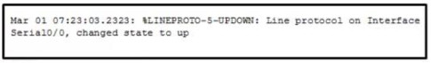

**Choices:**
- **A.** This message resulted from an unusual error requihng reconfiguration of the interface
- **B.** This message indicates that service timestamps have been configured
- **C.** This message indicates that the interface changed state five times
- **D.** This message is a level 5 notification message
- **E.** This message indicates that the interface should be replaced

**Correct Answer:**
This message indicates that service timestamps have been configured; This message is a level 5 notification message

**Explanation:**
The message is a level 5 notification message as shown in the %LINEPROTO-5 section of the output. Messages reporting the link status are common and do not require replacing the interface or reconfiguring the interface. The date and time displayed at the beginning of the message indicates that service timestamps have been configured on the router.

---

## Question 10

**Question:**
What code in the Cisco IOS 15 image filename c1900-universalk9-mz.SPA.153-3.M.bin indicates that the file is digitally signed by Cisco?

**Choices:**
- **A.** mz
- **B.** SPA
- **C.** universalk9
- **D.** M

**Correct Answer:**
SPA

**Explanation:**
The different parts of the Cisco IOS image file are as follows: c1900 – Identifies the platform as a Cisco 1900 router. universalk9 – specifies the image contains strong encryption. mz – Indicates the file runs from RAM and is compressed. SPA – designates that the file is digitally signed by Cisco. 152-4.M3 – specifies the filename format for the image 15.2(4)M3. This is the version of IOS, which includes the major release, minor release, maintenance release, and maintenance rebuild numbers. The M indicates this is an extended maintenance release. bin – This extension indicates that this file is a binary executable file.

---

## Question 11

**Question:**
In addition to IPBase, what are the three technology packs that are shipped within the universal Cisco IOS Software Release 15 image? (Choose three.)

**Choices:**
- **A.** SP Services
- **B.** Security
- **C.** Advanced IP Services
- **D.** DATA
- **E.** Unified Communications
- **F.** Advanced Enterprise Services

**Correct Answer:**
Security; DATA; Unified Communications

**Explanation:**
Advanced IP Services, Advanced Enterprise Services, and SP Services are IOS release 12.4 feature sets.

---

## Question 12

**Question:**
Which three software packages are available for Cisco IOS Release 15.0?

**Choices:**
- **A.** IPVbice
- **B.** Unified Communications
- **C.** DATA
- **D.** Enterprise Services
- **E.** Advanced IP Services
- **F.** Security

**Correct Answer:**
Unified Communications; DATA; Security

**Explanation:**
Cisco IOS Release 15.0 has four available technology software packages. IPBase DATA Unified Communications Security

---

## Question 13

**Question:**
A network engineer is upgrading the Cisco IOS image on a 2900 series ISR. What command could the engineer use to verify the total amount of flash memory as well as how much flash memory is currently available?

**Choices:**
- **A.** show flashO:
- **B.** show startup-config
- **C.** show version
- **D.** show interlaces

**Correct Answer:**
show flashO:

**Explanation:**
The show flash0: command displays the amount of flash available (free) and the amount of flash used. The command also displays the files stored in flash, including their size and when they were copied.

---

## Question 14

**Question:**
A ping fails when performed from router R1 to directly connected router R2. The network administrator then proceeds to issue the show cdp neighbors command. Why would the network administrator issue this command if the ping failed between the two routers?

**Choices:**
- **A.** The network administrator wants to venfy the IP address configured on router R2.
- **B.** The network administrator suspects a virus because the ping command did not work.
- **C.** The network administrator wants to verify Layer 2 connectivity.
- **D.** The network administrator wants to determine if connectivity can be established from a non-directly connected network.

**Correct Answer:**
The network administrator wants to verify Layer 2 connectivity.

**Explanation:**
The show cdp neighbors command can be used to prove that Layer 1 and Layer 2 connectivity exists between two Cisco devices. For example, if two devices have duplicate IP addresses, a ping between the devices will fail, but the output of show cdp neighbors will be successful. The show cdp neighbors detail could be used to verify the IP address of the directly connected device in case the same IP address is assigned to the two routers.

---

## Question 15

**Question:**
Refer to the exhibit. From what location have the syslog messages been retrieved?

**Images:**
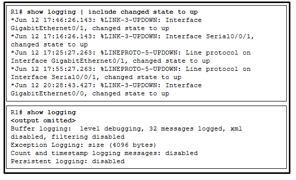

**Choices:**
- **A.** syslog server
- **B.** syslog client
- **C.** router RAM
- **D.** router NVRAM

**Correct Answer:**
router RAM

**Explanation:**
The output is captured from a virtual terminal connection on a router. The syslog messages are stored in the RAM of the monitored router.

---

## Question 16

**Question:**
Which command is used to configure a one-time acceptance of the EULA for all Cisco IOS software packages and features?

**Choices:**
- **A.** license save
- **B.** license accept end user agreement
- **C.** show license
- **D.** license boot module module-name
- **E.** Next

**Correct Answer:**
license accept end user agreement

**Explanation:**
The license save command is used to back up a copy of the licenses on a device. The show license command is used to display additional information about Cisco IOS software licenses. The license boot module module-name command activates an Evaluation Right-To-Use license. To configure a one-time acceptance of the End User License Agreement (EULA) covering all Cisco IOS packages and features, use the license accept end user agreement command.

---

## Question 17

**Question:**
Which command would a network engineer use to find the unique device identifier of a Cisco router?

**Choices:**
- **A.** show running-configuration
- **B.** license install stored-locabon-uri
- **C.** show license udi
- **D.** show version

**Correct Answer:**
show license udi

**Explanation:**
The license install stored-location-url command is used to install a license file. The show version and show running-configuration commands display router configuration and other details, but not the UDI.

---

## Question 18

**Question:**
Which syslog message type is accessible only to an administrator and only via the Cisco CLI?

**Choices:**
- **A.** errors
- **B.** alerts
- **C.** debugging
- **D.** emergency

**Correct Answer:**
debugging

**Explanation:**
Syslog messages can be sent to the logging buffer, the console line, the terminal line, or to a syslog server. However, debug-level messages are only forwarded to the internal buffer and only accessible through the Cisco CLI.

---

## Question 19

**Question:**
Refer to the exhibit. Match the components of the IOS image name to their description. (Not all options are used.)

**Images:**
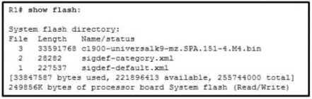
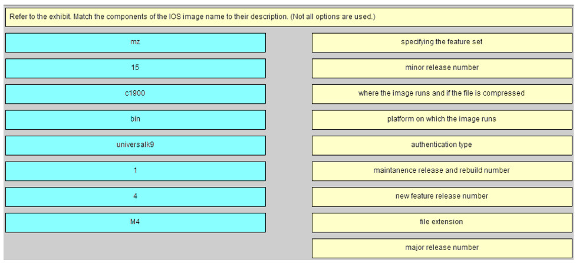
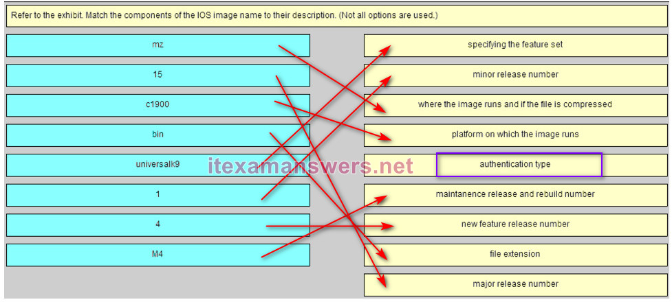

---

## Question 20

**Question:**
The command ntp server 10.1.1.1 is issued on a router. What impact does this command have?

**Choices:**
- **A.** determines which server to send system log files to
- **B.** synchronizes the system clock with the time source with IP address 10.1 1 1
- **C.** ensures that all logging will have a time stamp associated with it
- **D.** identifies the server on which to store backup configurations

**Correct Answer:**
synchronizes the system clock with the time source with IP address 10.1 1 1

**Explanation:**
The ntp server ip-address global configuration command configures the NTP server for IOS devices.

---

## Question 21

**Question:**
Which two statements are true about NTP servers in an enterprise network? (Choose two.)

**Choices:**
- **A.** NTP servers ensure an accurate time stamp on logging and debugging information
- **B.** NTP servers control the mean urne between failures (MTBF) for key network devices
- **C.** NTP servers at stratum 1 are directly connected to an authoritative time source
- **D.** All NTP servers synchronize directly to a stratum 1 time source
- **E.** There can only be one NTP server on an enterprise network

**Correct Answer:**
NTP servers ensure an accurate time stamp on logging and debugging information; NTP servers at stratum 1 are directly connected to an authoritative time source

**Explanation:**
Network Time Protocol (NTP) is used to synchronize the time across all devices on the network to make sure accurate timestamping on devices for managing, securing and troubleshooting. NTP networks use a hierarchical system of time sources. Each level in this hierarchical system is called a stratum. The stratum 1 devices are directly connected to the authoritative time sources.

---

## Question 22

**Question:**
A network administrator has issued the logging trap 4 global configuration mode command. What is the result of this command?

**Choices:**
- **A.** After four events the syslog client will send an event message to the syslog server.
- **B.** The syslog client will send to the syslog server any event message that has a seventy level of 4 and higher.
- **C.** The syslog client will send to the syslog server event messages with an identification trap level of only 4.
- **D.** The syslog client will send to the syslog server any event message that has a severity level of 4 and lower

**Correct Answer:**
The syslog client will send to the syslog server any event message that has a severity level of 4 and lower

**Explanation:**
The logging trap level allows a network administrator to limit event messages that are being sent to a syslog server based on severity.

---

## Question 23

**Question:**
Which statement is true about CDP on a Cisco device?​

**Choices:**
- **A.** The show cdp neighbor detail command will reveal the IP address of a neighbor only if there is Layer 3 connectivity
- **B.** To disable CDP globally, the no cdp enable command in interface configuration mode must be used
- **C.** CDP can be disabled globally or on a specific interface
- **D.** Because it runs at the data link layer, the CDP protocol can only be implemented in switches

**Correct Answer:**
CDP can be disabled globally or on a specific interface

**Explanation:**
CDP is a Cisco-proprietary protocol that can be disabled globally by using the no cdp run global configuration command, or disabled on a specific interface, by using the no cdp enable interface configuration command. Because CDP operates at the data link layer, two or more Cisco network devices, such as routers can learn about each other even if Layer 3 connectivity does not exist. The show cdp neighbors detail command reveals the IP address of a neighboring device regardless of whether you can ping the neighbor.

---

## Question 24

**Question:**
Why would a network administrator issue the show cdp neigbors command on a router?

**Choices:**
- **A.** to display router ID and other information about OSPF neighbors.
- **B.** to display routing table and other information about directly connected Cisco devices.
- **C.** to display line status and other information about directly connected Cisco devices.
- **D.** to display device ID and other information about directly connected Cisco devices.

**Correct Answer:**
to display device ID and other information about directly connected Cisco devices.

**Explanation:**
The show cdp neighbors command provides information on directly connected Cisco devices including Device ID, local interface, capability, platform, and port ID of the remote device.

---

## Question 25

**Question:**
Which protocol or service allows network administrators to receive system messages that are provided by network devices?

**Choices:**
- **A.** SNMP
- **B.** NetFlow
- **C.** NTP
- **D.** Next
- **E.** syslog

**Correct Answer:**
syslog

**Explanation:**
Cisco developed NetFlow for the purpose of gathering statistics on packets flowing through Cisco routers and multilayer switches. SNMP can be used to collect and store information about a device. Syslog is used to access and store system messages. NTP is used to allow network devices to synchronize time settings.

---

## Question 26

**Question:**
Which two conditions should the network administrator verify before attempting to upgrade a Cisco IOS image using a TFTP server? (Choose two.)

**Choices:**
- **A.** Verify that the TFTP server is running using the tftpdnld command
- **B.** Verify that there is enough flash memory for the new Cisco IOS image using the show flash command
- **C.** Verify the name of the TFTP server using the show hosts command
- **D.** Verify connectivity between the router and TFTP server using the ping command
- **E.** Verify that the checksum for the image is valid using the show version command

**Correct Answer:**
Verify that there is enough flash memory for the new Cisco IOS image using the show flash command; Verify connectivity between the router and TFTP server using the ping command

**Explanation:**
Older Version:

---

## Question 27

**Question:**
Refer to the exhibit. A network administrator is implementing the stateless DHCPv6 operation for the company. Clients are configuring IPv6 addresses as expected. However, the clients are not getting the DNS server address and the domain name information configured in the DHCP pool. What could be the cause of the problem?

**Images:**
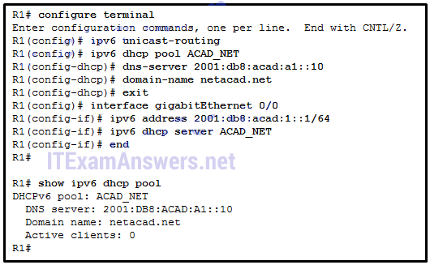

**Choices:**
- **A.** The GigabitEthernet interface is not activated.
- **B.** The router is configured for SLAAC operation.
- **C.** The DNS server address is not on the same network as the clients are on.
- **D.** The clients cannot communicate with the DHCPv6 server, evidenced by the number of active clients being 0.

**Correct Answer:**
The router is configured for SLAAC operation.

---

## Question 28

**Question:**
Which DHCPv4 message will a client send to accept an IPv4 address that is offered by a DHCP server?

**Choices:**
- **A.** unicast DHCPACK
- **B.** broadcast DHCPACK
- **C.** unicast DHCPREQUEST
- **D.** broadcast DHCPREQUEST

**Correct Answer:**
broadcast DHCPREQUEST

---

## Question 29

**Question:**
What is the reason why the DHCPREQUEST message is sent as a broadcast during the DHCPv4 process?

**Choices:**
- **A.** to notify other DHCP servers on the subnet that the IP address was leased
- **B.** to notify other hosts not to request the same IP address
- **C.** for hosts on other subnets to receive the information
- **D.** for routers to fill their routing tables with this new information

**Correct Answer:**
to notify other DHCP servers on the subnet that the IP address was leased

---

## Question 30

**Question:**
Which address does a DHCPv4 server target when sending a DHCPOFFER message to a client that makes an address request?

**Choices:**
- **A.** client IP address
- **B.** client hardware address
- **C.** gateway IP address
- **D.** broadcast MAC address

**Correct Answer:**
client hardware address

---

## Question 31

**Question:**
As a DHCPv4 client lease is about to expire, what is the message that the client sends the DHCP server?

**Choices:**
- **A.** DHCPDISCOVER
- **B.** DHCPOFFER
- **C.** DHCPREQUEST
- **D.** DHCPACK

**Correct Answer:**
DHCPREQUEST

---

## Question 32

**Question:**
Which set of commands will configure a router as a DHCP server that will assign IPv4 addresses to the 192.168.100.0/23 LAN while reserving the first 10 and the last addresses for static assignment?

**Choices:**
- **A.** ip dhcp excluded-address 192.168.100.1 192.168.100.10 ip dhcp excluded-address 192.168.100.254 ip dhcp pool LAN-POOL-100 network 192.168.100.0 255.255.255.0 ip default-gateway 192.168.100.1
- **B.** ip dhcp excluded-address 192.168.100.1 192.168.100.10 ip dhcp excluded-address 192.168.101.254 ip dhcp pool LAN-POOL-100 network 192.168.100.0 255.255.254.0 default-router 192.168.100.1
- **C.** dhcp pool LAN-POOL-100 ip dhcp excluded-address 192.168.100.1 192.168.100.9 ip dhcp excluded-address 192.168.100.254 network 192.168.100.0 255.255.254.0 default-router 192.168.101.1
- **D.** ip dhcp excluded-address 192.168.100.1 192.168.100.9 ip dhcp excluded-address 192.168.101.254 ip dhcp pool LAN-POOL-100 ip network 192.168.100.0 255.255.254.0 ip default-gateway 192.168.100.1

**Correct Answer:**
ip dhcp excluded-address 192.168.100.1 192.168.100.10 ip dhcp excluded-address 192.168.101.254 ip dhcp pool LAN-POOL-100 network 192.168.100.0 255.255.254.0 default-router 192.168.100.1

---

## Question 33

**Question:**
What is an advantage of configuring a Cisco router as a relay agent?

**Choices:**
- **A.** It will allow DHCPDISCOVER messages to pass without alteration.
- **B.** It can forward both broadcast and multicast messages on behalf of clients.
- **C.** It can provide relay services for multiple UDP services.
- **D.** It reduces the response time from a DHCP server.

**Correct Answer:**
It can provide relay services for multiple UDP services.

---

## Question 34

**Question:**
An administrator issues the commands: Router(config)# interface g0/1 Router(config-if)# ip address dhcp What is the administrator trying to achieve?

**Choices:**
- **A.** configuring the router to act as a DHCPv4 server
- **B.** configuring the router to obtain IP parameters from a DHCPv4 server
- **C.** configuring the router to act as a relay agent
- **D.** configuring the router to resolve IP address conflicts

**Correct Answer:**
configuring the router to obtain IP parameters from a DHCPv4 server

---

## Question 35

**Question:**
Under which two circumstances would a router usually be configured as a DHCPv4 client? (Choose two.)

**Choices:**
- **A.** The router is intended to be used as a SOHO gateway.
- **B.** The administrator needs the router to act as a relay agent.
- **C.** The router is meant to provide IP addresses to the hosts.
- **D.** This is an ISP requirement.
- **E.** The router has a fixed IP address.

**Correct Answer:**
The router is intended to be used as a SOHO gateway.; This is an ISP requirement.

---

## Question 36

**Question:**
A host on the 10.10.100.0/24 LAN is not being assigned an IPv4 address by an enterprise DHCP server with the address 10.10.200.10/24. What is the best way for the network engineer to resolve this problem?

**Choices:**
- **A.** Issue the command ip helper-address 10.10.200.10 on the router interface that is the 10.10.100.0/24 gateway.
- **B.** Issue the command default-router 10.10.200.10 at the DHCP configuration prompt on the 10.10.100.0/24 LAN gateway router.
- **C.** Issue the command ip helper-address 10.10.100.0 on the router interface that is the 10.10.200.0/24 gateway.
- **D.** Issue the command network 10.10.200.0 255.255.255.0 at the DHCP configuration prompt on the 10.10.100.0/24 LAN gateway router.

**Correct Answer:**
Issue the command ip helper-address 10.10.200.10 on the router interface that is the 10.10.100.0/24 gateway.

---

## Question 37

**Question:**
A company uses the SLAAC method to configure IPv6 addresses for the employee workstations. Which address will a client use as its default gateway?​

**Choices:**
- **A.** the all-routers multicast address
- **B.** the link-local address of the router interface that is attached to the network
- **C.** the unique local address of the router interface that is attached to the network
- **D.** the global unicast address of the router interface that is attached to the network

**Correct Answer:**
the link-local address of the router interface that is attached to the network

---

## Question 38

**Question:**
A network administrator configures a router to send RA messages with M flag as 0 and O flag as 1. Which statement describes the effect of this configuration when a PC tries to configure its IPv6 address?

**Choices:**
- **A.** It should contact a DHCPv6 server for all the information that it needs.
- **B.** It should use the information that is contained in the RA message exclusively.
- **C.** It should use the information that is contained in the RA message and contact a DHCPv6 server for additional information.
- **D.** It should contact a DHCPv6 server for the prefix, the prefix-length information, and an interface ID that is both random and unique.

**Correct Answer:**
It should use the information that is contained in the RA message and contact a DHCPv6 server for additional information.

---

## Question 39

**Question:**
A company implements the stateless DHCPv6 method for configuring IPv6 addresses on employee workstations. After a workstation receives messages from multiple DHCPv6 servers to indicate their availability for DHCPv6 service, which message does it send to a server for configuration information?

**Choices:**
- **A.** DHCPv6 SOLICIT
- **B.** DHCPv6 REQUEST
- **C.** DHCPv6 ADVERTISE
- **D.** DHCPv6 INFORMATION-REQUEST

**Correct Answer:**
DHCPv6 INFORMATION-REQUEST

---

## Question 40

**Question:**
An administrator wants to configure hosts to automatically assign IPv6 addresses to themselves by the use of Router Advertisement messages, but also to obtain the DNS server address from a DHCPv6 server. Which address assignment method should be configured?

**Choices:**
- **A.** SLAAC
- **B.** stateless DHCPv6
- **C.** stateful DHCPv6
- **D.** RA and EUI-64

**Correct Answer:**
stateless DHCPv6

---

## Question 41

**Question:**
How does an IPv6 client ensure that it has a unique address after it configures its IPv6 address using the SLAAC allocation method?

**Choices:**
- **A.** It sends an ARP message with the IPv6 address as the destination IPv6 address.
- **B.** It checks with the IPv6 address database that is hosted by the SLAAC server.
- **C.** It contacts the DHCPv6 server via a special formed ICMPv6 message.
- **D.** It sends an ICMPv6 Neighbor Solicitation message with the IPv6 address as the target IPv6 address.

**Correct Answer:**
It sends an ICMPv6 Neighbor Solicitation message with the IPv6 address as the target IPv6 address.

---

## Question 42

**Question:**
What is used in the EUI-64 process to create an IPv6 interface ID on an IPv6 enabled interface?

**Choices:**
- **A.** the MAC address of the IPv6 enabled interface
- **B.** a randomly generated 64-bit hexadecimal address
- **C.** an IPv6 address that is provided by a DHCPv6 server
- **D.** an IPv4 address that is configured on the interface

**Correct Answer:**
the MAC address of the IPv6 enabled interface

---

## Question 43

**Question:**
Refer to the exhibit. Based on the output that is shown, what kind of IPv6 addressing is being configured?

**Images:**
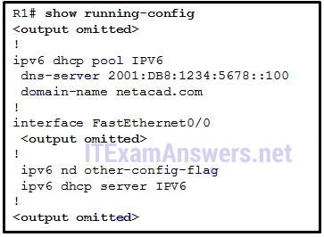

**Choices:**
- **A.** SLAAC
- **B.** stateful DHCPv6
- **C.** stateless DHCPv6
- **D.** static link-local

**Correct Answer:**
stateless DHCPv6

---

## Question 44

**Question:**
A network administrator is implementing DHCPv6 for the company. The administrator configures a router to send RA messages with M flag as 1 by using the interface command ipv6 nd managed-config-flag. What effect will this configuration have on the operation of the clients?

**Choices:**
- **A.** Clients must use the information that is contained in RA messages.
- **B.** Clients must use all configuration information that is provided by a DHCPv6 server.
- **C.** Clients must use the prefix and prefix length that are provided by a DHCPv6 server and generate a random interface ID.
- **D.** Clients must use the prefix and prefix length that are provided by RA messages and obtain additional information from a DHCPv6 server.

**Correct Answer:**
Clients must use all configuration information that is provided by a DHCPv6 server.

---

## Question 45

**Question:**
Refer to the exhibit. What should be done to allow PC-A to receive an IPv6 address from the DHCPv6 server?

**Images:**
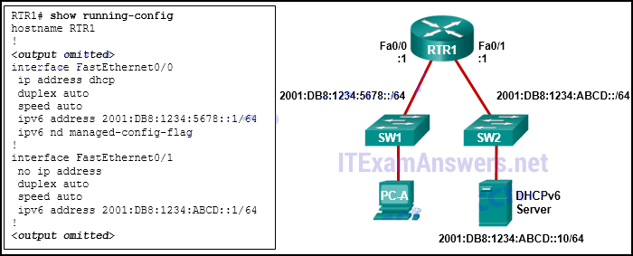

**Choices:**
- **A.** Add the ipv6 dhcp relay command to interface Fa0/0.
- **B.** Configure the ipv6 nd managed-config-flag command on interface Fa0/1.
- **C.** Change the ipv6 nd managed-config-flag command to ipv6 nd other-config-flag.
- **D.** Add the IPv6 address 2001:DB8:1234:5678::10/64 to the interface configuration of the DHCPv6 server.

**Correct Answer:**
Add the ipv6 dhcp relay command to interface Fa0/0.

---

## Question 46

**Question:**
Refer to the exhibit. A network administrator is implementing stateful DHCPv6 operation for the company. However, the clients are not using the prefix and prefix-length information that is configured in the DHCP pool. The administrator issues a show ipv6 interface command. What could be the cause of the problem?

**Images:**
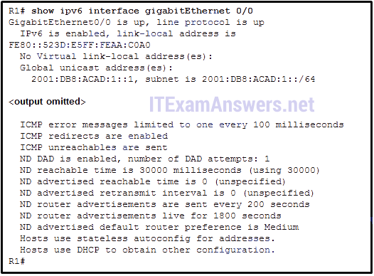

**Choices:**
- **A.** No virtual link-local address is configured.
- **B.** The Duplicate Address Detection feature is disabled.
- **C.** The router is configured for SLAAC DHCPv6 operation.
- **D.** The router is configured for stateless DHCPv6 operation.

**Correct Answer:**
The router is configured for stateless DHCPv6 operation.

---

## Question 47

**Question:**
Fill in the blank. Do not abbreviate. Type a command to exclude the first fifteen useable IP addresses from a DHCPv4 address pool of the network 10.0.15.0/24. Router(config)# ip dhcp excluded-address 10.0.15.1 10.0.15.15

---

## Question 48

**Question:**
A company uses DHCP servers to dynamically assign IPv4 addresses to employee workstations. The address lease duration is set as 5 days. An employee returns to the office after an absence of one week. When the employee boots the workstation, it sends a message to obtain an IP address. Which Layer 2 and Layer 3 destination addresses will the message contain?

**Choices:**
- **A.** FF-FF-FF-FF-FF-FF and 255.255.255.255
- **B.** both MAC and IPv4 addresses of the DHCP server
- **C.** MAC address of the DHCP server and 255.255.255.255
- **D.** FF-FF-FF-FF-FF-FF and IPv4 address of the DHCP server

**Correct Answer:**
FF-FF-FF-FF-FF-FF and 255.255.255.255

---

## Question 49

**Question:**
Which is a DHCPv4 address allocation method that assigns IPv4 addresses for a limited lease period?

**Choices:**
- **A.** manual allocation
- **B.** pre-allocation
- **C.** automatic allocation
- **D.** dynamic allocation

**Correct Answer:**
dynamic allocation

---

## Question 50

**Question:**
A network engineer is troubleshooting hosts on a LAN that are not being assigned an IPv4 address from a DHCP server after a new Ethernet switch has been installed on the LAN. The configuration of the DHCP server has been confirmed as correct and the clients have network connectivity to other networks if a static IP address is configured on each one. What step should the engineer take next to solve the issue?

**Choices:**
- **A.** Issue the ipconfig/release command on each client.
- **B.** Issue the show ip dhcp binding command on the switch.
- **C.** Confirm that ports on the Layer 2 LAN switch are configured as edge ports.
- **D.** Issue the show interface command on the router to confirm that the LAN gateway is operational.

**Correct Answer:**
Confirm that ports on the Layer 2 LAN switch are configured as edge ports.

---

## Question 51

**Question:**
A company uses the method SLAAC to configure IPv6 addresses for the workstations of the employees. A network administrator configured the IPv6 address on the LAN interface of the router. The interface status is UP. However, the workstations on the LAN segment did not obtain the correct prefix and prefix length. What else should be configured on the router that is attached to the LAN segment for the workstations to obtain the information?

**Choices:**
- **A.** R1(config-if)# ipv6 enable
- **B.** R1(config)# ipv6 unicast-routing
- **C.** R1(config-if)# ipv6 nd other-config-flag
- **D.** R1(config)# ipv6 dhcp pool <name of the pool>

**Correct Answer:**
R1(config)# ipv6 unicast-routing

---

## Question 52

**Question:**
Which protocol supports Stateless Address Autoconfiguration (SLAAC) for dynamic assignment of IPv6 addresses to a hos t?

**Choices:**
- **A.** ARPv6
- **B.** DHCPv6
- **C.** ICMPv6
- **D.** UDP

**Correct Answer:**
ICMPv6

---

## Question 53

**Question:**
Match the descriptions to the corresponding DHCPv6 server type. (Not all options are used.) Place the options in the following order: Stateless DHCPv6 [+] enabled in RA messages with the ipv6 nd other-config-flag command [+] clients send only DHCPv6 INFORMATION-REQUEST messages to the server [+] enabled on the client with the ipv6 address autoconfig command Stateful DHCPv6 [#] the M flag is set to 1 in RA messages [#] uses the address command to create a pool of addresses for clients [#] enabled on the client with the ipv6 address dhcp command [+] Order does not matter within this group. [#] Order does not matter within this group.

**Images:**
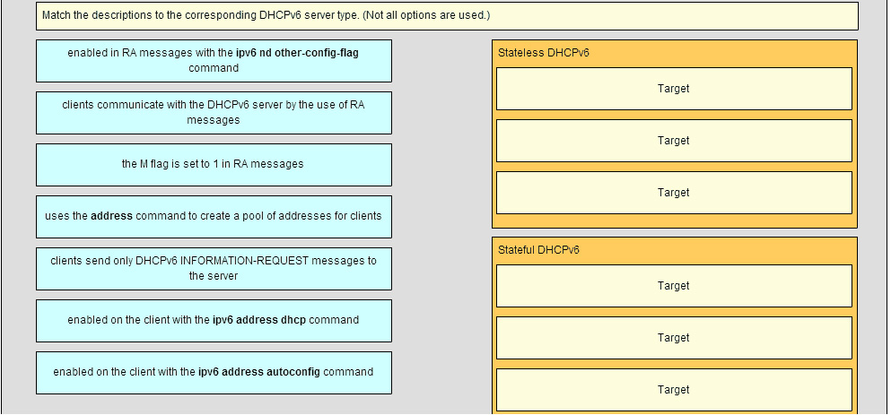
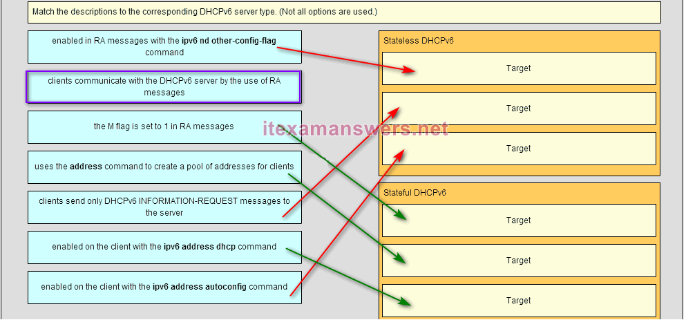

---

## Question 54

**Question:**
Launch PT Hide and Save PT Open the PT Activity. Perform the tasks in the activity instructions and then answer the question. How many IP addresses has the DHCP server leased and what is the number of DHCP pools configured? (Choose two.)

**Images:**
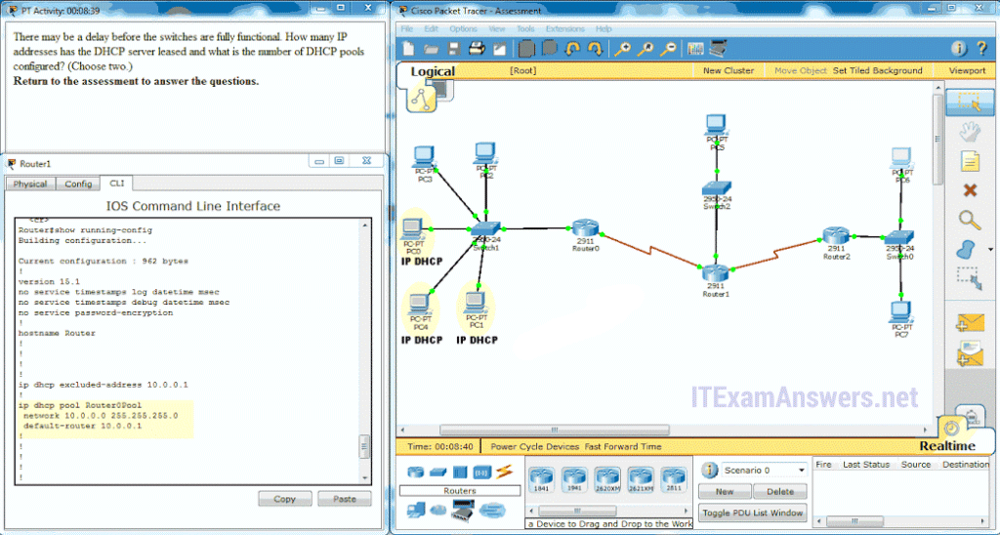

**Choices:**
- **A.** one pool
- **B.** three leases
- **C.** two pools
- **D.** six pools
- **E.** seven leases
- **F.** five leases

**Correct Answer:**
one pool; three leases

---

## Question 55

**Question:**
Order the steps of configuring a router as a DHCPv4 server. (Not all options are used.) Place the options in the following order: [+] Step 2 -> Configure a DHCP pool. [+] Step 1 -> Exclude IP addresses. – not scored – [+] Step 3 ->Define the default gateway router – not scored – Download PDF File below: ITexamanswers.net – CCNA 2 (v5.1 + v6.0) Chapter 10 Exam Answers Full.pdf 1.13 MB 8690 downloads

**Images:**
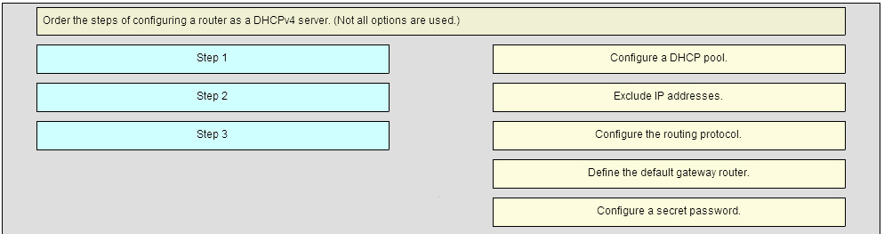
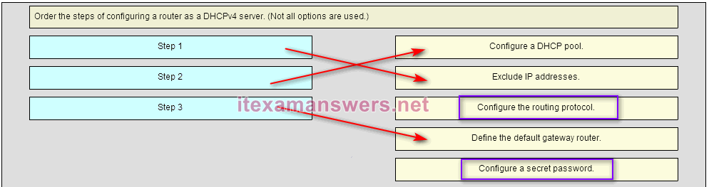

---
