# CCNA 2 v2 - CCNA 2 - Practice Final

## Question 1

**Question:**
The buffers for packet processing and the running configuration file are temporarily stored in which type of router memory?

**Choices:**
- **A.** flash
- **B.** NVRAM
- **C.** RAM
- **D.** ROM

**Correct Answer:**
RAM

**Explanation:**
RAM provides temporary storage for the running IOS, the running configuration file, the IP routing table, ARP table, and buffers for packet processing. In contrast, permanent storage of the IOS is provided by flash. NVRAM provides permanent storage of the startup configuration file, and ROM.provides permanent storage of the router bootup instructions and a limited IOS.

---

## Question 2

**Question:**
Refer to the exhibit. A company has an internal network of 192.168.10.0/24 for their employee workstations and a DMZ network of 192.168.3.0/24 to host servers. The company uses NAT when inside hosts connect to outside network. A network administrator issues the show ip nat translations command to check the NAT configurations. Which one of source IPv4 addresses is translated by R1 with PAT

**Images:**
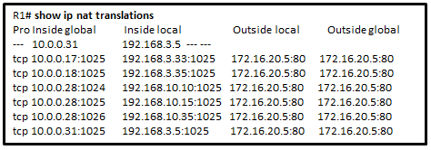

**Choices:**
- **A.** 10.0.0.31
- **B.** 192.168.3.5
- **C.** 192.168.3.33
- **D.** 192.168.10.35
- **E.** 172.16.20.5

**Correct Answer:**
192.168.10.35

**Explanation:**
From the output, three IPv4 addresses (172.16.25.10, 172.16.25.25, and 172.16.25.35) are translated into the same IPv4 address (10.0.0.28) with three different ports, thus these three IPv4 addresses are translated with PAT. The IPv4 addresses 172.16.12.33 and 172.16.12.35 are translated with dynamic NAT. The IPv4 address 172.16.12.5 is translated with static NAT.

---

## Question 3

**Question:**
Refer to the exhibit. This network has two connections to the ISP, one via router C and one via router B. The serial link between router A and router C supports EIGRP and is the primary link to the Internet. If the primary link fails, the administrator needs a floating static route that avoids recursive route lookups and any potential next-hop issues caused by the multiaccess nature of the Ethernet segment with router B. What should the administrator configure?

**Images:**
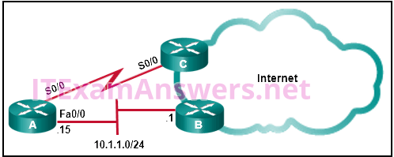

**Choices:**
- **A.** Create a static route pointing to Fa0/0 with an AD of 1.
- **B.** Create a static route pointing to 10.1.1.1 with an AD of 95.
- **C.** Create a static route pointing to 10.1.1.1 with an AD of 1.
- **D.** Create a fully specified static route pointing to Fa0/0 with an AD of 1.
- **E.** Create a fully specified static route pointing to Fa0/0 with an AD of 95.

**Correct Answer:**
Create a fully specified static route pointing to Fa0/0 with an AD of 95.

---

## Question 4

**Question:**
Which type of inter-VLAN communication design requires the configuration of multiple subinterfaces?

**Choices:**
- **A.** legacy inter-VLAN routing
- **B.** routing for the management VLAN
- **C.** router on a stick
- **D.** routing via a multilayer switch

**Correct Answer:**
router on a stick

**Explanation:**
The router-on-a-stick design always includes subinterfaces on a router. When a multilayer switch is used, multiple SVIs are created. When the number of VLANs equals the number of ports on a router, or when the management VLAN needs to be routed, any of the inter-VLAN design methods can be used.

---

## Question 5

**Question:**
After sticky learning of MAC addresses is enabled, what action is needed to prevent dynamically learned MAC addresses from being lost in the event that an associated interface goes down?

**Choices:**
- **A.** Reboot the switch.
- **B.** Copy the running configuration to the startup configuration.
- **C.** Shut down the interface then enable it again with the no shutdown command.
- **D.** Configure port security for violation protect mode.

**Correct Answer:**
Copy the running configuration to the startup configuration.

**Explanation:**
When sticky learning is enabled, dynamically learned MAC addresses are stored in the running configuration in RAM and will be lost if the switch is rebooted or an interface goes down. To prevent the loss of learned MAC addresses, an administrator can save the running configuration into the startup configuration in NVRAM.

---

## Question 6

**Question:**
A network technician is configuring port security on switches. The interfaces on the switches are configured in such a way that when a violation occurs, packets with unknown source addresses are dropped and no notification is sent. Which violation mode is configured on the interfaces?

**Choices:**
- **A.** off
- **B.** restrict
- **C.** protect
- **D.** shutdown

**Correct Answer:**
protect

---

## Question 7

**Question:**
A technician is configuring a switch to allow access both to IP phones and to PCs on interface Fa0/12. The technician enters the interface command mls qos trust cos. What is the reason for including that command?

**Choices:**
- **A.** It is used in conjuction with STP PortFast to ensure that interface Fa0/12, in case of a shutdown, regains an “up” state immediately.
- **B.** It is used to verify service levels and to ensure that congestion over serial interfaces is minimized for voice traffic.
- **C.** It is used to set the trusted state of an interface to allow classification of traffic for QoS based on the CoS value of the IP phone.
- **D.** It is used to provide higher categories of security for voice and video traffic.

**Correct Answer:**
It is used to set the trusted state of an interface to allow classification of traffic for QoS based on the CoS value of the IP phone.

**Explanation:**
The class of service (CoS) value is a number placed inside a field in the 802.1Q or ISL trunking header and used for prioritizing traffic and providing quality of service (QoS). The mls qos trust cos command is used when a VoIP phone attaches to a Cisco switch and QoS is implemented.

---

## Question 8

**Question:**
What is the minimum configuration for a router interface that is participating in IPv6 routing?

**Choices:**
- **A.** to have only a link-local IPv6 address
- **B.** to have both a link-local and a global unicast IPv6 address
- **C.** to have both an IPv4 and an IPv6 address
- **D.** to have a self-generated loopback address
- **E.** to have only an automatically generated multicast IPv6 address

**Correct Answer:**
to have only a link-local IPv6 address

**Explanation:**
With IPv6, a router interface typically has more than one IPv6 address. The router will at least have a link-local address that can be automatically generated, but the router commonly has an global unicast address also configured.

---

## Question 9

**Question:**
Refer to the exhibit. Assuming that the routing tables are up to date and no ARP messages are needed, after a packet leaves H1, how many times is the L2 header rewritten in the path to H2?

**Images:**
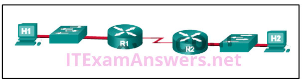

**Choices:**
- **A.** 1
- **B.** 2
- **C.** 3
- **D.** 4
- **E.** 5
- **F.** 6

**Correct Answer:**
2

**Explanation:**
H1 creates the first Layer 2 header. The R1 router has to examine the destination IP address to determine how the packet is to be routed. If the packet is to be routed out another interface, as is the case with R1, the router strips the current Layer 2 header and attaches a new Layer 2 header. When R2 determines that the packet is to be sent out the LAN interface, R2 removes the Layer 2 header received from the serial link and attaches a new Ethernet header before transmitting the packet.

---

## Question 10

**Question:**
What command will enable a router to begin sending messages that allow it to configure a link-local address without using an IPv6 DHCP server?

**Choices:**
- **A.** a static route
- **B.** the ipv6 route ::/0 command
- **C.** the ipv6 unicast-routing command
- **D.** the ip routing command

**Correct Answer:**
the ipv6 unicast-routing command

**Explanation:**
To enable IPv6 on a router you must use the ipv6 unicast-routing global configuration command or use the ipv6 enable interface configuration command. This is equivalent to entering ip routing to enable IPv4 routing on a router when it has been turned off. Keep in mind that IPv4 is enabled on a router by default. IPv6 is not enabled by default.

---

## Question 11

**Question:**
Which switching method provides error-free data transmission?

**Choices:**
- **A.** fragment-free
- **B.** fast-forward
- **C.** integrity-checking
- **D.** store-and-forward

**Correct Answer:**
store-and-forward

---

## Question 12

**Question:**
Which problem is evident if the show ip interface command shows that the interface is down and the line protocol is down?

**Choices:**
- **A.** A cable has not been attached to the port.
- **B.** There is an IP address conflict with the configured address on the interface.
- **C.** The no shutdown command has not been issued on the interface.
- **D.** An encapsulation mismatch has occurred.

**Correct Answer:**
A cable has not been attached to the port.

**Explanation:**
If an interface has not been brought up with the no shutdown command, the interface status shows administratively down. A duplicate IP address will not bring an interface down. An encapsulation error is normally found using the show interfaces command.

---

## Question 13

**Question:**
A company security policy requires that all MAC addressing be dynamically learned and added to both the MAC address table and the running configuration on each switch. Which port security configuration will accomplish this?

**Choices:**
- **A.** auto secure MAC addresses
- **B.** dynamic secure MAC addresses
- **C.** static secure MAC addresses
- **D.** sticky secure MAC addresses

**Correct Answer:**
sticky secure MAC addresses

**Explanation:**
With sticky secure MAC addressing, the MAC addresses can be either dynamically learned or manually configured and then stored in the address table and added to the running configuration file. In contrast, dynamic secure MAC addressing provides for dynamically learned MAC addressing that is stored only in the address table.

---

## Question 14

**Question:**
Refer to the exhibit. A small business uses VLANs 8, 20, 25, and 30 on two switches that have a trunk link between them. What native VLAN should be used on the trunk if Cisco best practices are being implemented?

**Images:**

**Choices:**
- **A.** 1
- **B.** 5
- **C.** 8
- **D.** 20
- **E.** 25
- **F.** 30

**Correct Answer:**
5

**Explanation:**
Cisco recommends using a VLAN that is not used for anything else for the native VLAN. The native VLAN should also not be left to the default of VLAN 1. VLAN 5 is the only VLAN that is not used and not VLAN 1.

---

## Question 15

**Question:**
A network administrator is configuring an ACL with the command access-list 10 permit 172.16.32.0 0.0.15.255. Which IPv4 address matches the ACE?

**Choices:**
- **A.** 172.16.20.2
- **B.** 172.16.26.254
- **C.** 172.16.45.2
- **D.** 172.16.48.5

**Correct Answer:**
172.16.45.2

**Explanation:**
With the wildcard mask of 0.0.15.255, the IPv4 addresses that match the ACE are in the range of 172.16.32.0 to 172.16.47.255.

---

## Question 16

**Question:**
The PT initialization was skipped. You will not be able to view the PT activity. Open the PT Activity. Perform the tasks in the activity instructions and then answer the question. Which code is displayed on the web browser?

**Choices:**
- **A.** Inter-VLANonfigured!
- **B.** It works!
- **C.** Welldone!
- **D.** Grea

**Correct Answer:**
It works!

---

## Question 17

**Question:**
Which command is issued in the VTY line configuration mode to apply a standard ACL that will control Telnet access to a router?

**Choices:**
- **A.** access-group 11 in
- **B.** access-class 11 in
- **C.** access-list 11 in
- **D.** access-list 110 in

**Correct Answer:**
access-class 11 in

**Explanation:**
The access-class 11 in command applies a standard ACL to the VTY lines of a router to control Telnet and SSH access. The access-group 11 in command would be issued on a router interface to apply an ACL, and because it applies a standard ACL, all IP traffic will be filtered, not just Telnet and SSH communications bound for the VTY lines. The access-list command creates the access control expressions of an ACL but do not apply the ACl to a router interface or line.

---

## Question 18

**Question:**
Which series of commands will cause access list 15 to restrict Telnet access on a router?

**Choices:**
- **A.** R1(config)# line vty 0 4 R1(config​-line)# ip access-group 15 in
- **B.** R1(config)# int gi0/0 R1(config​-if)# ip access-group 15 in
- **C.** R1(config)# line vty 0 4 R1(config​-line)# access-class 15 in
- **D.** R1(config)# int gi0/0 R1(config​-if)# access-class 15 in

**Correct Answer:**
R1(config)# line vty 0 4 R1(config​-line)# access-class 15 in

**Explanation:**
Once an access list to restrict Telnet or SSH access has been created, it is applied to the vty lines with the access-class command. This will restrict Telnet or SSH access.

---

## Question 19

**Question:**
Which three statements accurately describe VLAN types? (Choose three).

**Choices:**
- **A.** A management VLAN is any VLAN that is configured to access management features of the switch.
- **B.** A data VLAN is used to carry VLAN management data and user-generated traffic.
- **C.** Voice VLANs are used to support user phone and e-mail traffic on a network.
- **D.** VLAN 1 is always used as the management VLAN.
- **E.** After the initial boot of an unconfigured switch, all ports are members of the default VLAN.
- **F.** An 802.1Q trunk port, with a native VLAN assigned, supports both tagged and untagged traffic.

**Correct Answer:**
A management VLAN is any VLAN that is configured to access management features of the switch.; After the initial boot of an unconfigured switch, all ports are members of the default VLAN.; An 802.1Q trunk port, with a native VLAN assigned, supports both tagged and untagged traffic.

**Explanation:**
A management VLAN is a VLAN that is configured to manage features of the switch. By default, all ports are members of the default VLAN. An 802.1Q trunk port supports both tagged and untagged traffic.

---

## Question 20

**Question:**
A client is using SLAAC to obtain an IPv6 address for its interface. After an address has been generated and applied to the interface, what must the client do before it can begin to use this IPv6 address?

**Choices:**
- **A.** It must send a DHCPv6 INFORMATION-REQUEST message to request the address of the DNS server.
- **B.** It must send an ICMPv6 Router Solicitation message to determine what default gateway it should use.
- **C.** It must send a DHCPv6 REQUEST message to the DHCPv6 server to request permission to use this address.
- **D.** It must send an ICMPv6 Neighbor Solicitation message to ensure that the address is not already in use on the network.

**Correct Answer:**
It must send an ICMPv6 Neighbor Solicitation message to ensure that the address is not already in use on the network.

**Explanation:**
Stateless DHCPv6 or stateful DHCPv6 uses a DHCP server, but Stateless Address Autoconfiguration (SLAAC) does not. A SLAAC client can automatically generate an address that is based on information from local routers via Router Advertisement (RA) messages. Once an address has been assigned to an interface via SLAAC, the client must ensure via Duplicate Address Detection (DAD) that the address is not already in use. It does this by sending out an ICMPv6 Neighbor Solicitation message and listening for a response. If a response is received, then it means that another device is already using this address.

---

## Question 21

**Question:**
Which DHCP IPv4 message contains the following information? Destination address: 255.255.255.255 Client IPv4 address: 0.0.0.0 Default gateway address: 0.0.0.0 Subnet mask: 0.0.0.0

**Choices:**
- **A.** DHCPACK
- **B.** DHCPDISCOVER
- **C.** DHCPOFFER
- **D.** DHCPREQUEST

**Correct Answer:**
DHCPDISCOVER

**Explanation:**
A client will first send the DHCPDISCOVER broadcast message to find DHCPv4 servers on the network. This message will have the limited broadcast address, 255.255.255.255, as the destination address. The client IPv4 address, the default gateway address, and subnet fields will all be 0.0.0.0 because these have not yet been configured on the client. When the DHCPv4 server receives a DHCPDISCOVER message, it reserves an available IPv4 address to lease to the client and sends the unicast DHCPOFFER message to the requesting client. When the client receives the DHCPOFFER from the server, it sends back a DHCPREQUEST broadcast message. On receiving the DHCPREQUEST message, the server replies with a unicast DHCPACK message.

---

## Question 22

**Question:**
A network administrator is implementing DHCPv6 for the company. The administrator configures a router to send RA messages with M flag as 1 by using the interface command ipv6 nd managed-config-flag. What effect will this configuration have on the operation of the clients?

**Choices:**
- **A.** Clients must use the information that is contained in RA messages.
- **B.** Clients must use all configuration information that is provided by a DHCPv6 server.
- **C.** Clients must use the prefix and prefix length that are provided by RA messages and obtain additional information from a DHCPv6 server.
- **D.** Clients must use the prefix and prefix length that are provided by a DHCPv6 server and generate a random interface ID.

**Correct Answer:**
Clients must use all configuration information that is provided by a DHCPv6 server.

**Explanation:**
Under stateful DHCPv6 configuration, which is indicated by setting M flag as 1 (through the interface command ipv6 nd managed-config-flag), the dynamic IPv6 address assignments are managed by the DHCPv6 server. Clients must obtain all configuration information from a DHCPv6 server.

---

## Question 23

**Question:**
Refer to the exhibit. The users on the LAN network of R1 cannot receive an IPv6 address from the configured stateful DHCPv6 server. What is missing from the stateful DHCPv6 configuration on router R1?

**Images:**
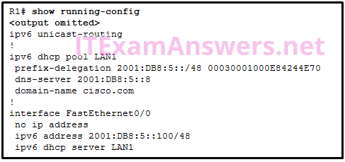

**Choices:**
- **A.** The FA0/0 interface is missing the command that informs the clients to use stateful DHCPv6.
- **B.** IPv6 has not been enabled globally on router R1.
- **C.** The DHCPv6 pool has not been bound to the LAN interface.
- **D.** The DHCPv6 pool does not match the IPv6 address configured on interface FA0/0.

**Correct Answer:**
The FA0/0 interface is missing the command that informs the clients to use stateful DHCPv6.

**Explanation:**
When configuring a router interface for stateful DHCPv6, the router must be able to inform the host PC’s to receive IPv6 addressing from a stateful DHCPv6 server. The interface command is ipv6 nd managed-config-flag

---

## Question 24

**Question:**
Refer to the exhibit. NAT is configured on R1 and R2. The PC is sending a request to the web server. What IPv4 address is the source IP address in the packet between R2 and the web server?

**Images:**
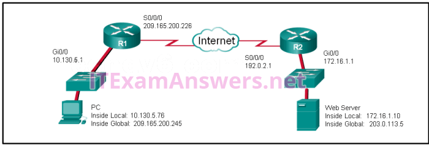

**Choices:**
- **A.** 10.130.5.76
- **B.** 209.165.200.245
- **C.** 172.16.1.10
- **D.** 203.0.113.5
- **E.** 192.0.2.1
- **F.** 172.16.1.1

**Correct Answer:**
209.165.200.245

**Explanation:**
Because the packet is between R2 and the web server, the source IP address is the inside global address of PC, 209.165.200.245.

---

## Question 25

**Question:**
Refer to the exhibit. R1 is configured for NAT as displayed. What is wrong with the configuration?

**Images:**
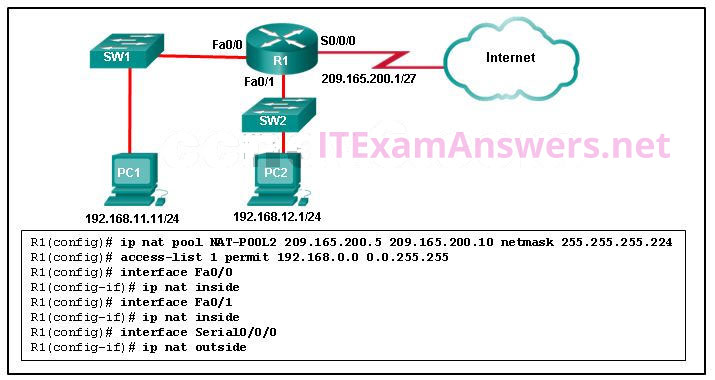

**Choices:**
- **A.** NAT-POOL2 is not bound to ACL 1.
- **B.** Interface Fa0/0 should be identified as an outside NAT interface.
- **C.** The NAT pool is incorrect.
- **D.** Access-list 1 is misconfigured.

**Correct Answer:**
NAT-POOL2 is not bound to ACL 1.

**Explanation:**
R1 has to have NAT-POOL2 bound to ACL 1. This is accomplished with the command R1(config)#ip nat inside source list 1 pool NAT-POOL2. This would enable the router to check for all interesting traffic and if it matches ACL 1 it would be translated by use of the addresses in NAT-POOL2.

---

## Question 26

**Question:**
A network engineer is configuring PAT on a router and has issued the command: Which additional command is required to specify addresses from the 192.168.128.0/18 network as the inside local addresses?

**Choices:**
- **A.** ip nat inside source list 1 pool INSIDE_NAT_POOL
- **B.** access-list 1 permit 192.168.128.0 0.0.127.255
- **C.** access-list 1 permit 192.168.128.0 255.255.192.0
- **D.** access-list 1 permit 192.168.128.0 0.0.63.255
- **E.** ip nat inside source static 192.168.128.0 209.165.200.254

**Correct Answer:**
access-list 1 permit 192.168.128.0 0.0.63.255

**Explanation:**
A standard access list with the appropriate wildcard mask specifies the inside local addresses to be translated. The ip nat inside source list 1 pool NAT_POOL command configures NAT to use a pool of outside global addresses, not a single outside interface address as required. The ip nat inside source static 192.168.128.0 209.165.200.254 command configures one-to-one static NAT, not PAT as the overload keyword specifies.

---

## Question 27

**Question:**
Refer to the exhibit. If the IP addresses of the default gateway router and the DNS server are correct, what is the configuration problem?

**Images:**
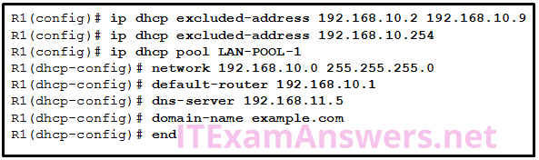

**Choices:**
- **A.** The DNS server and the default gateway router should be in the same subnet.
- **B.** The IP address of the default gateway router is not contained in the excluded address list.
- **C.** The default-router and dns-server commands need to be configured with subnet masks.
- **D.** The IP address of the DNS server is not contained in the excluded address list.

**Correct Answer:**
The IP address of the default gateway router is not contained in the excluded address list.

**Explanation:**
In this configuration, the excluded address list should include the address that is assigned to the default gateway router. So the command should be ip dhcp excluded-address 192.168.10.1 192.168.10.9.

---

## Question 28

**Question:**
Fill in the blank. In IPv6, all routes are level ___ ultimate routes. Correct Answer: 1* IPv6 is classless by design, making all routes level 1 ultimate routes by default.

---

## Question 29

**Question:**
Fill in the blank. The acronym ___ describes the type of traffic that requires a separate VLAN, strict QoS requirements, and a one-way overall delay less than 150 ms across the network. These restrictions help to ensure traffic quality. Correct Answer: voip* VoIP traffic tends to have a separate VLAN to ensure that voice quality is maintained. VoIP traffic requires: assured bandwidth to ensure voice quality transmission priority over other types of network traffic ability to be routed around congested areas on the network delay of less than 150 ms across the network

---

## Question 30

**Question:**
Refer to the exhibit. A network administrator has just configured address translation and is verifying the configuration. What three things can the administrator verify? (Choose three.)

**Images:**
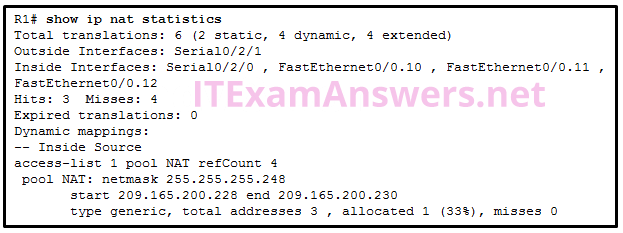

**Choices:**
- **A.** Address translation is working.
- **B.** Three addresses from the NAT pool are being used by hosts.
- **C.** The name of the NAT pool is refCount.
- **D.** A standard access list numbered 1 was used as part of the configuration process.
- **E.** Two types of NAT are enabled.
- **F.** One port on the router is not participating in the address translation.

**Correct Answer:**
Address translation is working.; A standard access list numbered 1 was used as part of the configuration process.; Two types of NAT are enabled.

**Explanation:**
The show ip nat statistics, show ip nat translations, and debug ip nat commands are useful in determining if NAT is working and and also useful in troubleshooting problems that are associated with NAT. NAT is working, as shown by the hits and misses count. Because there are four misses, a problem might be evident. The standard access list numbered 1 is being used and the translation pool is named NAT as evidenced by the last line of the output. Both static NAT and NAT overload are used as seen in the Total translations line.

---

## Question 31

**Question:**
Which destination do Cisco routers and switches use by default when sending syslog messages for all severity levels?

**Choices:**
- **A.** NVRAM
- **B.** nearest syslog server
- **C.** console
- **D.** RAM

**Correct Answer:**
console

**Explanation:**
Syslog messages for Cisco routers and switches can be sent to memory, the console, a tty line, or to a syslog server.

---

## Question 32

**Question:**
Which requirement should be checked before a network administrator performs an IOS image upgrade on a router?

**Choices:**
- **A.** The desired IOS image file has been downloaded to the router.
- **B.** There is sufficient space in flash memory.
- **C.** The old IOS image file has been deleted.
- **D.** The FTP server is operational.

**Correct Answer:**
There is sufficient space in flash memory.

**Explanation:**
Before an upgrade process starts, the user must make sure that there is sufficient space in the flash to host the new IOS image file. An old IOS file does not have to be deleted as long as there is sufficient space available for the new IOS file. FTP is not supported for the IOS upgrading process. Instead, a TFTP server is used. The new IOS image should be downloaded and loaded to the TFTP server.

---

## Question 33

**Question:**
A network administrator configures a router with the command sequence: What is the effect of the command sequence?

**Choices:**
- **A.** The router will load IOS from the TFTP server. If the image fails to load, it will load the IOS image from ROM.
- **B.** The router will search and load a valid IOS image in the sequence of flash, TFTP, and ROM.
- **C.** The router will copy the IOS image from the TFTP server and then reboot the system.
- **D.** On next reboot, the router will load the IOS image from ROM.

**Correct Answer:**
The router will load IOS from the TFTP server. If the image fails to load, it will load the IOS image from ROM.

**Explanation:**
The boot system command is a global configuration command that allows the user to specify the source for the Cisco IOS Software image to load. In this case, the router is configured to boot from the IOS image that is stored on the TFTP server and will use the ROMmon imagethat is located in the ROM if it fails to locate the TFTP server or fails to load a valid image from the TFTP server.

---

## Question 34

**Question:**
Which three software packages are available for Cisco IOS Release 15.0?

**Choices:**
- **A.** Unified Communications
- **B.** DATA
- **C.** Enterprise Services
- **D.** Advanced IP Services
- **E.** IPVoice
- **F.** Security

**Correct Answer:**
Unified Communications; DATA; Security

**Explanation:**
Cisco IOS Release 15.0 has four available technology software packages. IPBase DATA Unified Communications Security

---

## Question 35

**Question:**
What two license states would be expected on a new Cisco router once the license has been activated? (Choose two.)

**Choices:**
- **A.** License State: Active, In Use
- **B.** License State: Active, Registered
- **C.** License Type: ipbasek9
- **D.** License Type: Temporary
- **E.** License State: On
- **F.** License Type: Permanent

**Correct Answer:**
License State: Active, In Use; License Type: Permanent

**Explanation:**
When the show license command is issued, the following information is a sample of what would be found once the license has been activated: Index 1 Feature: ipbasek9 Period left: Life time License Type: Permanent License State: Active, In Use License Count: Non-Counted License Priority: Medium It is important for a technician to be able to verify an activated IOS 15 license.

---

## Question 36

**Question:**
Which type of static route typically uses the distance parameter in the ip route global configuration command?

**Choices:**
- **A.** summary static route
- **B.** default static route
- **C.** floating static route
- **D.** standard static route

**Correct Answer:**
floating static route

**Explanation:**
Because a floating static route is not designed to be used as a primary route, its configuration requires a higher administrative distance than the usual default value of 1. When set higher than the administrative distance for the current routing protocol, the distance parameter allows the route to be used only when the primary route fails. All other forms of static routes have specific uses as primary routes.

---

## Question 37

**Question:**
Refer to the exhibit. Which type of IPv6 static route is configured in the exhibit?

**Images:**
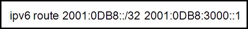

**Choices:**
- **A.** fully specified static route
- **B.** recursive static route
- **C.** directly attached static route
- **D.** floating static route

**Correct Answer:**
recursive static route

**Explanation:**
The route provided points to another address that must be looked up in the routing table. This makes the route a recursive static route.

---

## Question 38

**Question:**
Refer to the exhibit. Which route was configured as a static route to a specific network using the next-hop address?

**Images:**
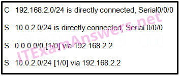

**Choices:**
- **A.** C 192.168.2.0/24 is directly connected, Serial0/0/0
- **B.** S 0.0.0.0/0 [1/0] via 192.168.2.2
- **C.** S 10.0.2.0/24 [1/0] via 192.168.2.2
- **D.** S 10.0.2.0/24 is directly connected, Serial 0/0/0

**Correct Answer:**
S 10.0.2.0/24 [1/0] via 192.168.2.2

**Explanation:**
The C in a routing table indicates an interface that is up and has an IP address assigned. The S in a routing table signifies that a route was installed using the ip route command. Two of the routing table entries shown are static routes to a specific destination (the 10.0.2.0 network). The entry that has the S denoting a static route and [1/0] was configured using the next-hop address. The other entry (S 10.0.2.0/24 is directly connected, Serial 0/0/0) is a static route configured using the exit interface. The entry with the 0.0.0.0 route is a default static route which is used to send packets to any destination network that is not specifically listed in the routing table.

---

## Question 39

**Question:**
A network administrator has entered the following command: When the network administrator enters the command show ip route, the route is not in the routing table. What should the administrator do next?

**Choices:**
- **A.** Re-enter the command using a network number rather than a usable IP address.
- **B.** Verify that the serial 0/0/1 interface is active and available.
- **C.** Re-enter the command using the correct mask.
- **D.** Verify that the 192.168.10.64 network is active within the network infrastructure.

**Correct Answer:**
Verify that the serial 0/0/1 interface is active and available.

**Explanation:**
The reason that a correctly typed static network would not go into the routing table is if the exit interface is not available. The 192.168.10.64 is a valid network number and that route does not have to be “up and up” in order for a static route to be configured on a remote router.

---

## Question 40

**Question:**
Refer to the exhibit. How did the router obtain the last route that is shown?

**Images:**
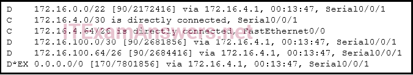

**Choices:**
- **A.** The ip route command was used.
- **B.** The ipv6 route command was used.
- **C.** Another router in the same organization provided the default route by using a dynamic routing protocol.
- **D.** The ip address interface configuration mode command was used in addition to the network routing protocol configuration mode command.

**Correct Answer:**
Another router in the same organization provided the default route by using a dynamic routing protocol.

**Explanation:**
A default route is presented in EIGRP with an asterisk (*) and the 0.0.0.0/0 entry. The route was learned through EIGRP and the Serial0/0/1 interface on the router.

---

## Question 41

**Question:**
To enable RIP routing for a specific subnet, the configuration command network 192.168.5.64 was entered by the network administrator. What address, if any, appears in the running configuration file to identify this network?

**Choices:**
- **A.** 192.168.5.64
- **B.** 192.168.5.0
- **C.** 192.168.0.0
- **D.** No address is displayed.

**Correct Answer:**
192.168.5.0

**Explanation:**
RIP is a classful routing protocol, meaning it will automatically convert the subnet ID that was entered into the classful address of 192.168.5.0 when it is displayed in the running configuration.

---

## Question 42

**Question:**
Refer to the exhibit. What is the administrative distance value that indicates the route for R2 to reach the 10.10.0.0/16 network?

**Images:**
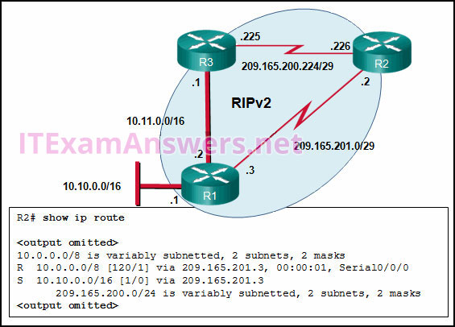

**Choices:**
- **A.** 1
- **B.** 120
- **C.** 0
- **D.** 2

**Correct Answer:**
1

**Explanation:**
In the R2 routing table, the route to reach network 10.10.0.0 is labeled with an administrative distance of 1, which indicates that this is a static route.

---

## Question 43

**Question:**
Refer to the exhibit. Which type of route is 172.16.0.0/16?

**Images:**
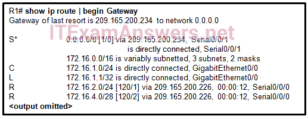

**Choices:**
- **A.** ultimate route
- **B.** level 1 parent route
- **C.** child route
- **D.** default route

**Correct Answer:**
level 1 parent route

**Explanation:**
A level 1 parent route displays the classful network address, the number of subnets, and the number of different subnet masks that the classful address has been subdivided into. It does not have an exit interface. A child route, ultimate route, and default route all have exit interfaces that are associated with them.

---

## Question 44

**Question:**
What is the name of the layer in the Cisco borderless switched network design that would have more switches deployed than other layers in the network design of a large organization?

**Choices:**
- **A.** data link
- **B.** core
- **C.** network access
- **D.** access
- **E.** network

**Correct Answer:**
access

**Explanation:**
Access layer switches provide user access to the network. End user devices, such as PCs, access points, printers, and copiers, would require a port on a switch in order to connect to the network. Thus, more switches are needed in the access layer than are needed in the core and distribution layers.

---

## Question 45

**Question:**
What is a function of the distribution layer?

**Choices:**
- **A.** high-speed backbone connectivity
- **B.** interconnection of large-scale networks in wiring closets
- **C.** network access to the user
- **D.** fault isolation

**Correct Answer:**
interconnection of large-scale networks in wiring closets

**Explanation:**
The distribution layer interacts between the access layer and the core by aggregating access layer connections in wiring closets, providing intelligent routing and switching, and applying access policies to access the rest of the network. Fault isolation and high-speed backbone connectivity are the primary functions of the core layer. The main function of the access layer is to provide network access to the user.

---

## Question 46

**Question:**
Which network design principle focuses on the capability of on-demand seamless network expansion in a switched network?

**Choices:**
- **A.** flexibility
- **B.** modularity
- **C.** resiliency
- **D.** hierarchical

**Correct Answer:**
modularity

**Explanation:**
There are several sound network design principles that should be used when building design guidelines for a borderless switched network: Hierarchical – Defines the role of each device at every tier, simplifies deployment, operation, and management, and reduces fault domains at every tier Modularity – Allows seamless network expansion and integrated service enablement on an on-demand basis Resiliency – Satisfies user expectations for keeping the network always on Flexibility – Allows intelligent traffic load sharing by using multiple network resources simultaneously

---

## Question 47

**Question:**
A lab in a network management software company is configuring a testing environment to verify the performance of new software with different network connectivity speeds, including FastEthernet, GigabitEthernet, and 10 GigabitEthernet, and with copper and fiber optic connections. Which type of switch should the software company purchase to perform the tests?

**Choices:**
- **A.** fixed configuration
- **B.** access layer
- **C.** modular configuration
- **D.** stackable

**Correct Answer:**
modular configuration

**Explanation:**
A modular configuration switch is used at the distribution and core layers. A modular configuration switch usually takes 3 rack units or more. Modular configuration switches offer more flexibility in the types and number of ports as well as the expansion cards that can be used. A fixed configuration switch tends to be an access layer switch. Stackable switches are usually access layer switches that have been cabled together.

---

## Question 48

**Question:**
What two license conditions would be expected on a new Cisco router once the license has been activated? (Choose two.)

**Choices:**
- **A.** License Type: Permanent
- **B.** License Type: ipbasek9
- **C.** License Type: Temporary
- **D.** License State: On
- **E.** License State: Active, In Use
- **F.** License State: Active, Registered

**Correct Answer:**
License Type: Permanent; License State: Active, In Use

**Explanation:**
When the show license command is issued, the following information is a sample of what would be found once the license has been activated: Index 1 Feature: ipbasek9 Period left: Life time License Type: Permanent License State: Active, In Use License Count: Non-Counted License Priority: Medium It is important for a technician to be able to verify an activated IOS 15 license.

---

## Question 49

**Question:**
In an IPv6 routing table, all routing table entries are classified as which type of routes?

**Choices:**
- **A.** level 2 child routes
- **B.** level 1 parent routes
- **C.** level 1 ultimate routes
- **D.** level 1 network routes

**Correct Answer:**
level 1 ultimate routes

**Explanation:**
IPv6 is classless by design, making all routes level 1 ultimate routes by default.

---

## Question 50

**Question:**
Which type of traffic requires a separate VLAN, strict QoS requirements, and a one-way overall delay of less than 150 ms across the network?

**Choices:**
- **A.** video
- **B.** POP/IMAP
- **C.** HTTP
- **D.** VoIP

**Correct Answer:**
VoIP

**Explanation:**
VoIP traffic tends to have a separate VLAN to ensure that voice quality is maintained. VoIP traffic requires the following: • Assured bandwidth to ensure voice quality • Transmission priority over other types of network traffic • Ability to be routed around congested areas on the network • Delay of less than 150 ms across the network

---

## Question 51

**Question:**
What information is added to the switch table from incoming frames?

**Choices:**
- **A.** destination MAC address and incoming port number
- **B.** destination IP address and incoming port number
- **C.** source MAC address and incoming port number
- **D.** source IP address and incoming port number

**Correct Answer:**
source MAC address and incoming port number

**Explanation:**
A switch “learns” or builds the MAC address table based on the source MAC address as a frame comes into the switch. A switch forwards the frame onward based on the destination MAC address.

---

## Question 52

**Question:**
Which statement correctly describes how a LAN switch forwards frames that it receives?

**Choices:**
- **A.** Cut-through frame forwarding ensures that invalid frames are always dropped.
- **B.** Only frames with a broadcast destination address are forwarded out all active switch ports.
- **C.** Frame forwarding decisions are based on MAC address and port mappings in the CAM table.
- **D.** Unicast frames are always forwarded regardless of the destination MAC address.

**Correct Answer:**
Frame forwarding decisions are based on MAC address and port mappings in the CAM table.

**Explanation:**
Cut-through frame forwarding reads up to only the first 22 bytes of a frame, which excludes the frame check sequence and thus invalid frames may be forwarded. In addition to broadcast frames, frames with a destination MAC address that is not in the CAM are also flooded out all active ports. Unicast frames are not always forwarded. Received frames with a destination MAC address that is associated with the switch port on which it is received are not forwarded because the destination exists on the network segment connected to that port.. Older Version

---

## Question 53

**Question:**
How will a router handle static routing differently if Cisco Express Forwarding is disabled?

**Choices:**
- **A.** It will not perform recursive lookups.
- **B.** Serial point-to-point interfaces will require fully specified static routes to avoid routing inconsistencies.
- **C.** Ethernet multiaccess interfaces will require fully specified static routes to avoid routing inconsistencies.
- **D.** Static routes that use an exit interface will be unnecessary.

**Correct Answer:**
Ethernet multiaccess interfaces will require fully specified static routes to avoid routing inconsistencies.

**Explanation:**
In most platforms running IOS 12.0 or later, Cisco Express Forwarding is enabled by default. Cisco Express Forwarding eliminates the need for the recursive lookup. If Cisco Express Forwarding is disabled, multiaccess network interfaces require fully specified static routes in order to avoid inconsistencies in their routing tables. Point-to-point interfaces do not have this problem, because multiple end points are not present. With or without Cisco Express Forwarding enabled, using an exit interface when configuring a static route is a viable option.

---

## Question 54

**Question:**
Refer to the exhibit. R1 was configured with the static route command ip route 209.165.200.224 255.255.255.224 S0/0/0 and consequently users on network 172.16.0.0/16 are unable to reach resources on the Internet. How should this static route be changed to allow user traffic from the LAN to reach the Internet?

**Images:**
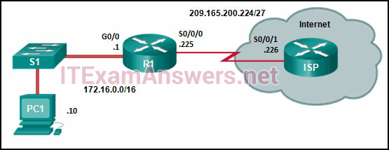

**Choices:**
- **A.** Add the next-hop neighbor address of 209.165.200.226.
- **B.** Change the exit interface to S0/0/1.
- **C.** Change the destination network and mask to 0.0.0.0 0.0.0.0.
- **D.** Add an administrative distance of 254

**Correct Answer:**
Change the destination network and mask to 0.0.0.0 0.0.0.0.

---

## Question 55

**Question:**
In a routing table which route can never be an ultimate route?

**Choices:**
- **A.** parent route
- **B.** child route
- **C.** level one route
- **D.** level two route

**Correct Answer:**
parent route

---

## Question 56

**Question:**
Refer to the exhibit. In the routing table entry, what is the administrative distance?

**Images:**
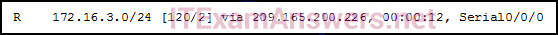

**Choices:**
- **A.** 24
- **B.** 120
- **C.** 2
- **D.** 12

**Correct Answer:**
120

---

## Question 57

**Question:**
How many classful networks are summarized by the static summary route ip route 192.168.32.0 255.255.248.0 S0/0/0?

**Choices:**
- **A.** 2
- **B.** 4
- **C.** 8
- **D.** 16

**Correct Answer:**
8

**Explanation:**
A summary route of 192.168.32.0 with a network prefix of /21 will summarize 8 routes. The network prefix has moved from the classful boundary of 24 to the left by 3 bits. These 3 bits identify that 8 networks are summarized. The networks that are summarized would be 192.168.32.0/24 through 192.168.39.0/24.

---

## Question 58

**Question:**
Refer to the exhibit. An administrator is trying to configure PAT on R1, but PC-A is unable to access the Internet. The administrator tries to ping a server on the Internet from PC-A and collects the debugs that are shown in the exhibit. Based on this output, what is most likely the cause of the problem?

**Images:**
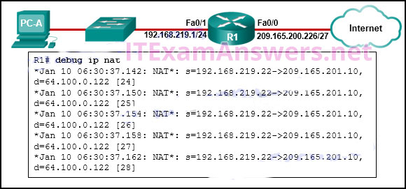

**Choices:**
- **A.** The address on Fa0/0 should be 64.100.0.1.
- **B.** The NAT source access list matches the wrong address range.
- **C.** The inside global address is not on the same subnet as the ISP.
- **D.** The inside and outside NAT interfaces have been configured backwards.

**Correct Answer:**
The inside global address is not on the same subnet as the ISP.

---

## Question 59

**Question:**
Refer to the exhibit. A PC at address 10.1.1.45 is unable to access the Internet. What is the most likely cause of the problem?

**Images:**
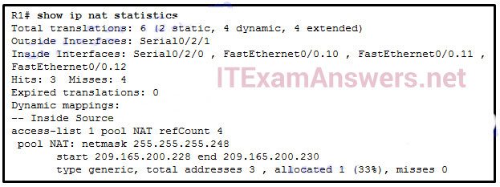

**Choices:**
- **A.** The NAT pool has been exhausted.
- **B.** The wrong netmask was used on the NAT pool.
- **C.** Access-list 1 has not been configured properly.
- **D.** The inside and outside interfaces have been configured backwards.

**Correct Answer:**
The NAT pool has been exhausted.

---

## Question 60

**Question:**
What is a disadvantage when both sides of a communication use PAT?

**Choices:**
- **A.** Host IPv4 addressing is complicated.
- **B.** End-to-end IPv4 traceability is lost.
- **C.** The flexibility of connections to the Internet is reduced.
- **D.** The security of the communication is negatively impacted.

**Correct Answer:**
End-to-end IPv4 traceability is lost.

**Explanation:**
With the use of NAT, especially PAT, end-to-end traceability is lost. This is because the host IP address in the packets during a communication is translated when it leaves and enters the network. With the use of NAT/PAT, both the flexibility of connections to the Internet and security are actually enhanced. Host IPv4 addressing is provided by DHCP and not related to NAT/PAT.

---

## Question 61

**Question:**
A small company has a web server in the office that is accessible from the Internet. The IP address 192.168.10.15 is assigned to the web server. The network administrator is configuring the router so that external clients can access the web server over the Internet. Which item is required in the NAT configuration?

**Choices:**
- **A.** an IPv4 address pool
- **B.** an ACL to identify the local IPv4 address of the web server
- **C.** the keyword overload for the ip nat inside source command
- **D.** the ip nat inside source command to link the inside local and inside global addresses

**Correct Answer:**
the ip nat inside source command to link the inside local and inside global addresses

---

## Question 62

**Question:**
A college student is studying for the Cisco CCENT certification and is visualizing extended access lists. Which three keywords could immediately follow the keywords permit or deny as part of an extended access list? (Choose three.)

**Choices:**
- **A.** www
- **B.** tcp
- **C.** udp
- **D.** icmp
- **E.** telnet
- **F.** ftp

**Correct Answer:**
tcp; udp; icmp

**Explanation:**
Four commonly used keywords that could follow the keywords permit or deny in an IPv4 extended access list are ip , tcp , udp , and icmp . If the keyword ip is used, then the entire TCP/IP suite is affected (all TCP/IP protocols).

---

## Question 63

**Question:**
What is meant by the term “best match” when applied to the routing table lookup process?

**Choices:**
- **A.** network match
- **B.** supernet match
- **C.** exact match
- **D.** longest match

**Correct Answer:**
longest match

---

## Question 64

**Question:**
Which three advantages are provided by static routing? (Choose three.)

**Choices:**
- **A.** Static routing does not advertise over the network, thus providing better security.
- **B.** Configuration of static routes is error-free.
- **C.** Static routes scale well as the network grows.
- **D.** Static routing typically uses less network bandwidth and fewer CPU operations than dynamic routing does.
- **E.** The path a static route uses to send data is known.
- **F.** No intervention is required to maintain changing route information.

**Correct Answer:**
Static routing does not advertise over the network, thus providing better security.; Static routing typically uses less network bandwidth and fewer CPU operations than dynamic routing does.; The path a static route uses to send data is known.

**Explanation:**
Static routes are prone to errors from incorrect configuration by the administrator. They do not scale well, because the routes must be manually reconfigured to accommodate a growing network. Intervention is required each time a route change is necessary. They do provide better security, use less bandwidth, and provide a known path to the destination.

---

## Question 65

**Question:**
A network administrator is implementing a distance vector routing protocol between neighbors on the network. In the context of distance vector protocols, what is a neighbor?

**Choices:**
- **A.** routers that are reachable over a TCP session
- **B.** routers that share a link and use the same routing protocol
- **C.** routers that reside in the same area
- **D.** routers that exchange LSAs

**Correct Answer:**
routers that share a link and use the same routing protocol

---

## Question 66

**Question:**
Refer to the exhibit. The student on the H1 computer continues to launch an extended ping with expanded packets at the student on the H2 computer. The school network administrator wants to stop this behavior, but still allow both students access to web-based computer assignments. What would be the best plan for the network administrator?

**Images:**
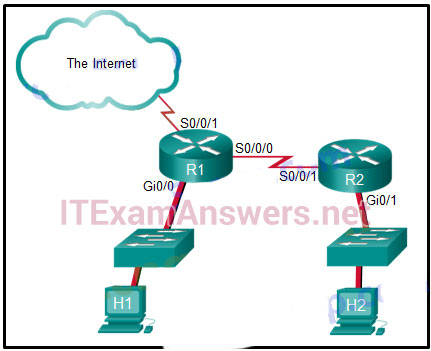

**Choices:**
- **A.** Apply an outbound extended ACL on R1 S0/0/1.
- **B.** Apply an outbound standard ACL on R2 S0/0/1.
- **C.** Apply an inbound standard ACL on R1 Gi0/0.
- **D.** Apply an inbound extended ACL on R2 Gi0/1.
- **E.** Apply an inbound extended ACL on R1 Gi0/0.

**Correct Answer:**
Apply an inbound extended ACL on R1 Gi0/0.

---

## Question 67

**Question:**
What is associated with link-state routing protocols?

**Choices:**
- **A.** low processor overhead
- **B.** poison reverse
- **C.** routing loops
- **D.** split horizon
- **E.** shortest-path first calculations

**Correct Answer:**
shortest-path first calculations

---

## Question 68

**Question:**
How is the router ID for an OSPFv3 router determined?

**Choices:**
- **A.** the highest IPv6 address on an active interface
- **B.** the lowest MAC address on an active interface
- **C.** the highest IPv4 address on an active interface
- **D.** the highest EUI-64 ID on an active interface

**Correct Answer:**
the highest IPv4 address on an active interface

---

## Question 69

**Question:**
An administrator attempts to change the router ID on a router that is running OSPFv3 by changing the IPv4 address on the router loopback interface. Once the IPv4 address is changed, the administrator notes that the router ID did not change. What two actions can the administrator take so that the router will use the new IPv4 address as the router ID? (Choose two.)

**Choices:**
- **A.** Shut down and re-enable the loopback interface.
- **B.** Reboot the router.
- **C.** Copy the running configuration to NVRAM.
- **D.** Clear the IPv6 OSPF process.
- **E.** Disable and re-enable IPv4 routing.

**Correct Answer:**
Reboot the router.; Clear the IPv6 OSPF process.

**Explanation:**
There are two methods that can be used to change the router ID of an OSPF router. The router can be rebooted or the OSPF process can be cleared.

---

## Question 70

**Question:**
Refer to the exhibit. Which would be chosen as the router ID of R2?

**Images:**
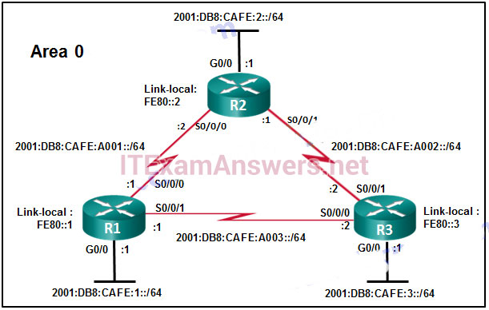

**Choices:**
- **A.** 2001:DB8:CAFE:2::/64
- **B.** LLA: FE80::2
- **C.** 2001:DB8:CAFE:A001::/64
- **D.** The router ID has to be manually configured.

**Correct Answer:**
LLA: FE80::2

---

## Question 71

**Question:**
Which two pieces of information are required when creating a standard access control list? (Choose two.)

**Choices:**
- **A.** destination address and wildcard mask
- **B.** source address and wildcard mask
- **C.** subnet mask and wildcard mask
- **D.** access list number between 100 and 199
- **E.** access list number between 1 and 99

**Correct Answer:**
source address and wildcard mask; access list number between 1 and 99

**Explanation:**
Standard ACLs can be numbered 1 to 99 and 1300 to 1999. Standard IP ACLs filter only on the source IP address.

---

## Question 72

**Question:**
Which two keywords can be used in an access control list to replace a wildcard mask or address and wildcard mask pair? (Choose two.)

**Choices:**
- **A.** most
- **B.** host
- **C.** all
- **D.** any
- **E.** some
- **F.** gt

**Correct Answer:**
host; any

---

## Question 73

**Question:**
What is the effect of the access control list wildcard mask 0.0.0.15? (Choose two.)

**Choices:**
- **A.** The first 28 bits of a supplied IP address will be ignored.
- **B.** The last four bits of a supplied IP address will be ignored.
- **C.** The first 32 bits of a supplied IP address will be matched.
- **D.** The first 28 bits of a supplied IP address will be matched.
- **E.** The last five bits of a supplied IP address will be ignored.
- **F.** The last four bits of a supplied IP address will be matched.

**Correct Answer:**
The last four bits of a supplied IP address will be ignored.; The first 28 bits of a supplied IP address will be matched.

**Explanation:**
A wildcard mask uses 0s to indicate that bits must match. 0s in the first three octets represent 24 bits and four more zeros in the last octet, represent a total of 28 bits that must match. The four 1s represented by the decimal value of 15 represents the four bits to ignore.

---

## Question 74

**Question:**
An administrator created and applied an outbound Telnet extended ACL on a router to prevent router-initiated Telnet sessions. What is a consequence of this configuration?

**Choices:**
- **A.** The ACL will not work as desired because an outbound ACL cannot block router-initiated traffic.
- **B.** The ACL will work as desired as long as it is applied to the correct interface.
- **C.** The ACL will not work because only standard ACLs can be applied to vty lines.
- **D.** The ACL will work as long as it will be applied to all vty lines.

**Correct Answer:**
The ACL will not work as desired because an outbound ACL cannot block router-initiated traffic.

---

## Question 75

**Question:**
A network administrator is testing IPv6 connectivity to a web server. The network administrator does not want any other host to connect to the web server except for the one test computer. Which type of IPv6 ACL could be used for this situation?

**Choices:**
- **A.** only a standard ACL
- **B.** a standard or extended ACL
- **C.** only an extended ACL
- **D.** an extended, named, or numbered ACL
- **E.** only a named ACL

**Correct Answer:**
only a named ACL

---

## Question 76

**Question:**
What does an OSPF area contain?

**Choices:**
- **A.** routers that share the same router ID
- **B.** routers whose SPF trees are identical
- **C.** routers that have the same link-state information in their LSDBs
- **D.** routers that share the same process ID
- **E.** The interface with the IPv4 address 192.168.10.1 will be a passive interface.
- **F.** OSPF advertisements will include the network on the interface with the IPv4 address 192.168.10.1.
- **G.** This command will have no effect because it uses a quad zero wildcard mask.
- **H.** OSPF advertisements will include the specific IPv4 address 192.168.10.1.

**Correct Answer:**
routers that have the same link-state information in their LSDBs; OSPF advertisements will include the network on the interface with the IPv4 address 192.168.10.1.

**Explanation:**
An OSPF area contains one set of link-state information, although each router within the area will process that information individually to form its own SPF tree. OSPF process IDs are locally significant and are created by the administrator. Router IDs uniquely identify each router. 77. What is the effect of entering the network 192.168.10.1 0.0.0.0 area 0 command in router configuration mode?

---

## Question 77

**Question:**
What is the order of packet types used by an OSPF router to establish convergence?

**Choices:**
- **A.** Hello, LSAck, LSU, LSR, DBD
- **B.** LSAck, Hello, DBD, LSU, LSR
- **C.** Hello, DBD, LSR, LSU, LSAck
- **D.** LSU, LSAck, Hello, DBD, LSR

**Correct Answer:**
Hello, DBD, LSR, LSU, LSAck

---

## Question 78

**Question:**
What best describes the operation of distance vector routing protocols?

**Choices:**
- **A.** They use hop count as their only metric.
- **B.** They only send out updates when a new network is added.
- **C.** They send their routing tables to directly connected neighbors.
- **D.** They flood the entire network with routing updates.

**Correct Answer:**
They send their routing tables to directly connected neighbors.

---

## Question 79

**Question:**
What is an advantage of using dynamic routing protocols instead of static routing?

**Choices:**
- **A.** easier to implement
- **B.** more secure in controlling routing updates
- **C.** fewer router resource overhead requirements
- **D.** ability to actively search for new routes if the current path becomes unavailable

**Correct Answer:**
ability to actively search for new routes if the current path becomes unavailable

**Explanation:**
Dynamic routing has the ability to search and find a new best path if the current path is no longer available. The other options are actually the advantages of static routing.

---

## Question 80

**Question:**
Refer to the exhibit. R1 and R2 are OSPFv3 neighbors. Which address would R1 use as the next hop for packets that are destined for the Internet?

**Images:**
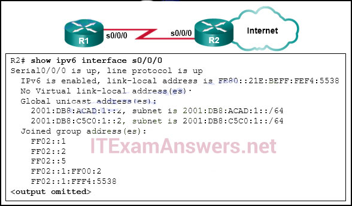

**Choices:**
- **A.** FF02::5
- **B.** 2001:DB8:ACAD:1::2
- **C.** 2001:DB8:C5C0:1::2
- **D.** FE80::21E:BEFF:FEF4:5538

**Correct Answer:**
FE80::21E:BEFF:FEF4:5538

---

## Question 81

**Question:**
Refer to the exhibit. What address will be used as the router ID for the OSPFv3 process?

**Images:**
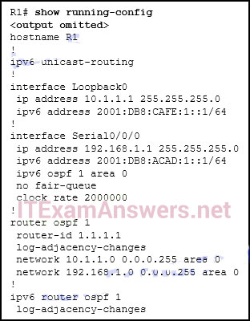

**Choices:**
- **A.** 1.1.1.1
- **B.** 10.1.1.1
- **C.** 192.168.1.1
- **D.** 2001:DB8:CAFE:1::1
- **E.** 2001:DB8:ACAD:1::1

**Correct Answer:**
10.1.1.1

---

## Question 82

**Question:**
Which network design may be recommended for a small campus site that consists of a single building with a few users?

**Choices:**
- **A.** a network design where the access and core layers are collapsed into a single layer
- **B.** a collapsed core network design
- **C.** a three-tier campus network design where the access, distribution, and core are all separate layers, each one with very specific functions
- **D.** a network design where the access and distribution layers are collapsed into a single layer

**Correct Answer:**
a collapsed core network design

**Explanation:**
In some cases, maintaining a separate distribution and core layer is not required. In smaller campus locations where there are fewer users who are accessing the network or in campus sites that consist of a single building, separate core and distribution layers may not be needed. In this scenario, the recommendation is the alternate two-tier campus network design, also known as the collapsed core network design.

---

## Question 83

**Question:**
When does a switch use frame filtering?

**Choices:**
- **A.** The destination MAC address is for a host on a different network segment from the source of the traffic.
- **B.** The destination MAC address is for a host on the same network segment as the source of the traffic.
- **C.** The destination MAC address is for a host with no entry in the MAC address table.
- **D.** The destination MAC address is for a host on a network supported by a different router.

**Correct Answer:**
The destination MAC address is for a host on the same network segment as the source of the traffic.

---

## Question 84

**Question:**
Which command will verify the status of both the physical and the virtual interfaces on a switch?

**Choices:**
- **A.** show running-config
- **B.** show ip interface brief
- **C.** show startup-config
- **D.** show vlan

**Correct Answer:**
show ip interface brief

---

## Question 85

**Question:**
Refer to the exhibit. A network administrator is investigating a lag in network performance and issues the show interfaces fastethernet 0/0 command. Based on the output that is displayed, what two items should the administrator check next? (Choose two.)

**Images:**
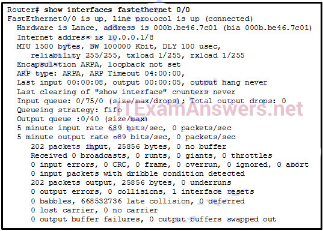

**Choices:**
- **A.** cable lengths
- **B.** damaged cable termination
- **C.** duplex settings
- **D.** electrical interference
- **E.** incorrect cable types

**Correct Answer:**
cable lengths; duplex settings

---

## Question 86

**Question:**
Which command would be best to use on an unused switch port if a company adheres to the best practices as recommended by Cisco?

**Choices:**
- **A.** shutdown
- **B.** ip dhcp snooping
- **C.** switchport port-security mac-address sticky
- **D.** switchport port-security violation shutdown
- **E.** switchport port-security mac-address sticky mac-address

**Correct Answer:**
shutdown

**Explanation:**
Unlike router Ethernet ports, switch ports are enabled by default. Cisco recommends disabling any port that is not used. The ip dhcp snooping command globally enables DHCP snooping on a switch. Further configuration allows defining ports that can respond to DHCP requests. The switchport port-security command is used to protect the network from unidentified or unauthorized attachment of network devices.

---

## Question 87

**Question:**
Which two commands should be implemented to return a Cisco 3560 trunk port to its default configuration? (Choose two.)

**Choices:**
- **A.** S1(config-if)# no switchport trunk allowed vlan
- **B.** S1(config-if)# no switchport trunk native vlan
- **C.** S1(config-if)# switchport mode dynamic desirable
- **D.** S1(config-if)# switchport mode access
- **E.** S1(config-if)# switchport access vlan 1

**Correct Answer:**
S1(config-if)# no switchport trunk allowed vlan; S1(config-if)# no switchport trunk native vlan

---

## Question 88

**Question:**
Which two methods can be used to provide secure management access to a Cisco switch? (Choose two.)

**Choices:**
- **A.** Configure all switch ports to a new VLAN that is not VLAN 1.
- **B.** Configure specific ports for management traffic on a specific VLAN.
- **C.** Configure SSH for remote management.
- **D.** Configure all unused ports to a “black hole.”
- **E.** Configure the native VLAN to match the default VLAN.

**Correct Answer:**
Configure specific ports for management traffic on a specific VLAN.; Configure SSH for remote management.

---

## Question 89

**Question:**
Refer to the exhibit. A network administrator is configuring inter-VLAN routing on a network. For now, only one VLAN is being used, but more will be added soon. What is the missing parameter that is shown as the highlighted question mark in the graphic?

**Images:**
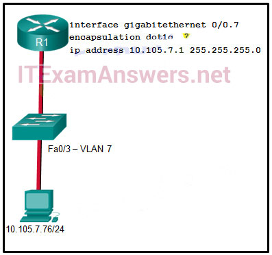

**Choices:**
- **A.** It identifies the subinterface.
- **B.** It identifies the VLAN number.
- **C.** It identifies the native VLAN number.
- **D.** It identifies the type of encapsulation that is used.
- **E.** It identifies the number of hosts that are allowed on the interface.

**Correct Answer:**
It identifies the VLAN number.

---

## Question 90

**Question:**
Refer to the exhibit. A Layer 3 switch routes for three VLANs and connects to a router for Internet connectivity. Which two configurations would be applied to the switch? (Choose two.)

**Images:**
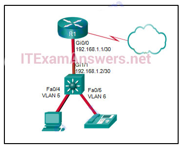

**Choices:**
- **A.** (config)# interface gigabitethernet 1/1 (config-if)# no switchport (config-if)# ip address 192.168.1.2 255.255.255.252
- **B.** (config)# interface vlan 1 (config-if)# ip address 192.168.1.2 255.255.255.0 (config-if)# no shutdown
- **C.** (config)# interface gigabitethernet1/1 (config-if)# switchport mode trunk
- **D.** (config)# interface fastethernet0/4 (config-if)# switchport mode trunk
- **E.** (config)# ip routing

**Correct Answer:**
(config)# ip routing

---

## Question 91

**Question:**
Fill in the blank. Using router-on-a-stick inter-VLAN routing, how many subinterfaces have to be configured to support 10 VLANs? 10

---

## Question 92

**Question:**
Refer to the exhibit. Inter-VLAN communication between VLAN 10, VLAN 20, and VLAN 30 is not successful. What is the problem?

**Images:**
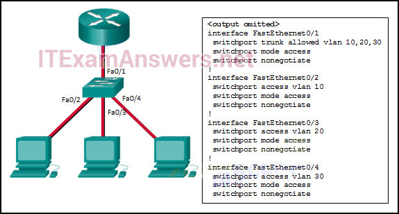

**Choices:**
- **A.** The access interfaces do not have IP addresses and each should be configured with an IP address.
- **B.** The switch interface FastEthernet0/1 is configured as an access interface and should be configured as a trunk interface.
- **C.** The switch interface FastEthernet0/1 is configured to not negotiate and should be configured to negotiate.
- **D.** The switch interfaces FastEthernet0/2, FastEthernet0/3, and FastEthernet0/4 are configured to not negotiate and should be configured to negotiate.

**Correct Answer:**
The switch interface FastEthernet0/1 is configured as an access interface and should be configured as a trunk interface.

---

## Question 93

**Question:**
When routing a large number of VLANs, what are two disadvantages of using the router-on-a-stick inter-VLAN routing method rather than the multilayer switch inter-VLAN routing method? (Choose two.)

**Choices:**
- **A.** Multiple SVIs are needed.
- **B.** A dedicated router is required.
- **C.** Router-on-a-stick requires subinterfaces to be configured on the same subnets.
- **D.** Router-on-a-stick requires multiple physical interfaces on a router.
- **E.** Multiple subinterfaces may impact the traffic flow speed.

**Correct Answer:**
A dedicated router is required.; Multiple subinterfaces may impact the traffic flow speed.

---

## Question 94

**Question:**
Which two statements are characteristics of routed ports on a multilayer switch? (Choose two.)

**Choices:**
- **A.** They are not associated with a particular VLAN.
- **B.** The interface vlan <vlan number> command has to be entered to create a VLAN on routed ports.
- **C.** They support subinterfaces, like interfaces on the Cisco IOS routers.
- **D.** They are used for point-to-multipoint links.
- **E.** In a switched network, they are mostly configured between switches at the core and distribution layers.

**Correct Answer:**
They are not associated with a particular VLAN.; In a switched network, they are mostly configured between switches at the core and distribution layers.

---

## Question 95

**Question:**
Match the borderless switched network guideline description to the principle. (Not all options are used.)

**Images:**
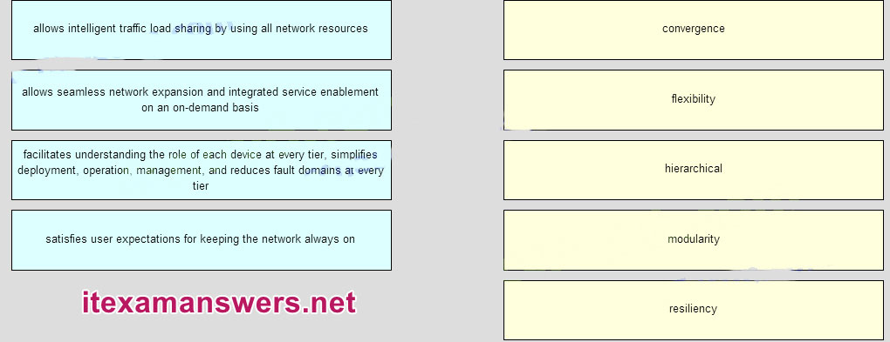
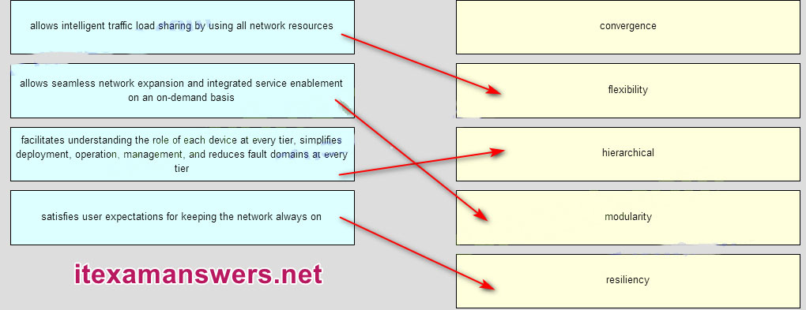

---

## Question 96

**Question:**
Fill in the blank. Do not use abbreviations. The duplex full command configures a switch port to operate in the full-duplex mode.

---

## Question 97

**Question:**
Launch PT. Hide and Save PT Open the PT activity. Perform the tasks in the activity instructions and then answer the question. To verify that the SVI is configured correctly, answer this question: Which ping command completed successfully?​

**Images:**
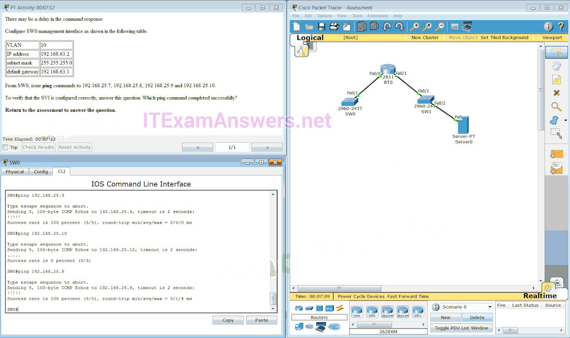

**Choices:**
- **A.** ping 192.168.25.9
- **B.** ping 192.168.25.10
- **C.** ping 192.168.25.7
- **D.** ping 192.168.25.8

**Correct Answer:**
ping 192.168.25.9

**Explanation:**
CONFIGURATION SW0(config)# interface vlan 10 SW0(config-if)# ip address 192.168.63.2 255.255.255.0 SW0(config-if)# exit SW0(config)# ip default-gateway 192.168.63.1 SW0(config)# end

---

## Question 98

**Question:**
Which command will create a static default route on R1 to send all traffic to the Internet and use serial 0/0 as the exit interface?

**Choices:**
- **A.** R1(config)# ip route 255.255.255.255 0.0.0.0 serial 0/0
- **B.** R1(config)# ip route 0.0.0.0 255.255.255.0 serial 0/0
- **C.** R1(config)# ip route 0.0.0.0 255.255.255.255 serial 0/0
- **D.** R1(config)# ip route 0.0.0.0 0.0.0.0 serial 0/0

**Correct Answer:**
R1(config)# ip route 0.0.0.0 0.0.0.0 serial 0/0

---

## Question 99

**Question:**
What is a result of connecting two or more switches together?

**Choices:**
- **A.** The number of collision domains is reduced.
- **B.** The size of the broadcast domain is increased.
- **C.** The number of broadcast domains is increased.
- **D.** The size of the collision domain is increased.

**Correct Answer:**
The size of the broadcast domain is increased.

---

## Question 100

**Question:**
What is meant by the term “best match” when applied to the routing table lookup process?

**Choices:**
- **A.** exact match
- **B.** longest match
- **C.** network match
- **D.** supernet match

**Correct Answer:**
longest match

---

## Question 101

**Question:**
A router with two LAN interfaces, two WAN interfaces, and one configured loopback interface is operating with OSPF as its routing protocol. What does the router OSPF process use to assign the router ID?

**Choices:**
- **A.** the highest IP address that is configured on the WAN interfaces
- **B.** the IP address of the interface that is configured with priority 0
- **C.** the highest IP address on the LAN interfaces
- **D.** the OSPF area ID that is configured on the interface with the highest IP address
- **E.** the loopback interface IP address

**Correct Answer:**
the loopback interface IP address

---

## Question 102

**Question:**
Order the DHCP process steps. (Not all options are used.) Place the options in the following order: Step 3 – target left blank – Step 4 * Step 2 * Step 1*

**Images:**
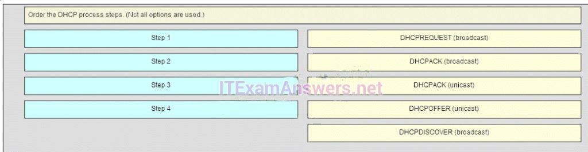
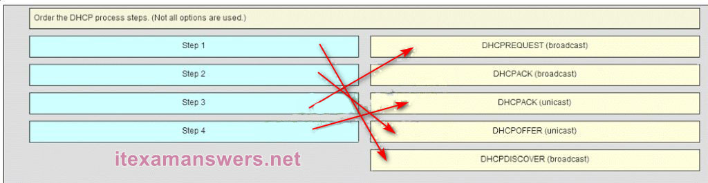

---

## Question 103

**Question:**
Refer to the exhibit. Host A has sent a packet to host B. What will be the source MAC and IP addresses on the packet when it arrives at host B?

**Images:**
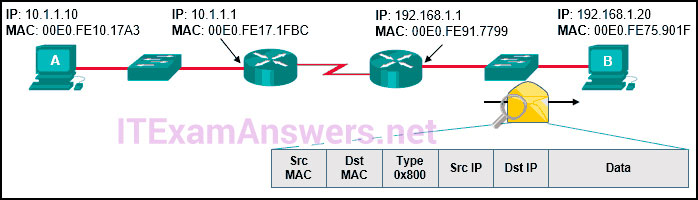

**Choices:**
- **A.** Source MAC: 00E0.FE10.17A3 Source IP: 10.1.1.10
- **B.** Source MAC: 00E0.FE91.7799 Source IP: 10.1.1.1
- **C.** Source MAC: 00E0.FE91.7799 Source IP: 192.168.1.1
- **D.** Source MAC: 00E0.FE91.7799 Source IP: 10.1.1.10
- **E.** Source MAC: 00E0.FE10.17A3 Source IP: 192.168.1.1

**Correct Answer:**
Source MAC: 00E0.FE91.7799 Source IP: 10.1.1.10

---

## Question 104

**Question:**
An administrator is trying to remove configurations from a switch. After using the command erase startup-config and reloading the switch, the administrator finds that VLANs 10 and 100 still exist on the switch. Why were these VLANs not removed?

**Choices:**
- **A.** These VLANs cannot be deleted unless the switch is in VTP client mode.
- **B.** These VLANs are default VLANs that cannot be removed.
- **C.** These VLANs can only be removed from the switch by using the no vlan 10 and no vlan 100 commands.
- **D.** Because these VLANs are stored in a file that is called vlan.dat that is located in flash memory, this file must be manually deleted.

**Correct Answer:**
Because these VLANs are stored in a file that is called vlan.dat that is located in flash memory, this file must be manually deleted.

---

## Question 105

**Question:**
In which type of attack does a malicious node request all available IP addresses in the address pool of a DHCP server in order to prevent legitimate hosts from obtaining network access?​

**Choices:**
- **A.** CAM table overflow
- **B.** DHCP snooping
- **C.** MAC address flooding
- **D.** DHCP starvation

**Correct Answer:**
DHCP starvation

---

## Question 106

**Question:**
Refer to the exhibit. A Layer 3 switch routes for three VLANs and connects to a router for Internet connectivity. Which two configurations would be applied to the switch? (Choose two.)

**Images:**
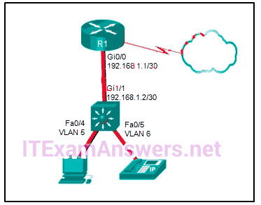

**Choices:**
- **A.** (config)# interface gigabitethernet1/1 (config-if)# switchport mode trunk (config)# interface fastethernet0/4 (config-if)# switchport mode trunk
- **B.** (config)# interface gigabitethernet 1/1 (config-if)# no switchport (config-if)# ip address 192.168.1.2 255.255.255.252
- **C.** (config)# interface vlan 1 (config-if)# ip address 192.168.1.2 255.255.255.0 (config-if)# no shutdown
- **D.** (config)# ip routing

**Correct Answer:**
(config)# interface gigabitethernet 1/1 (config-if)# no switchport (config-if)# ip address 192.168.1.2 255.255.255.252; (config)# ip routing

---

## Question 107

**Question:**
Which characteristic is unique to EIGRP?

**Choices:**
- **A.** EIGRP supports classless routing.
- **B.** EIGRP supports loop-free autosummarization.
- **C.** EIGRP supports both IPv4 and IPv6.
- **D.** EIGRP supports unequal-cost load balancing.

**Correct Answer:**
EIGRP supports unequal-cost load balancing.

---

## Question 108

**Question:**
Match the router memory type that provides the primary storage for the router feature. (Not all options are used.) Place the options in the following order. — not scored — full operating system -> flash limited operating system -> ROM routing table -> RAM startup configuration file -> NVRAM Download PDF File below:* ITexamanswers.net – CCNA 2 (v5.1 + v6.0) Practice Final Exam Answers Full.pdf 1.97 MB 8475 downloads

**Images:**
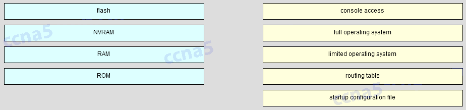

---
