# CCNA 2 v2 - CCENT ICND1 Practice Exam

## Question 1

**Question:**
How many /30 subnets can be created from one /27 subnet

**Choices:**
- **A.** 2
- **B.** 4
- **C.** 6
- **D.** 8

**Correct Answer:**
8

**Explanation:**
A /27 subnet contains 32 IP addresses, and a /30 subnet contains 4 IP addresses, so eight /30 subnets can be created from one /27 subnet.

---

## Question 2

**Question:**
What information can be verified through the show ip dhcp binding command?

**Choices:**
- **A.** that DHCPv4 discover messages are still being received by the DHCP server
- **B.** the number of IP addresses remaining in the DHCP pool
- **C.** the IPv4 addresses that are assigned to hosts by the DHCP server
- **D.** the IPv4 addresses that have been excluded from the DHCPv4 pool

**Correct Answer:**
the IPv4 addresses that are assigned to hosts by the DHCP server

**Explanation:**
This command displays a list of all IPv4 address to MAC address bindings that have been provided by the DHCPv4 service.

---

## Question 3

**Question:**
Refer to the exhibit. A network administrator is reviewing port and VLAN assignments on switch S2 and notices that interfaces Gi0/1 and Gi0/2 are not included in the output. Why would the interfaces be missing from the output

**Images:**
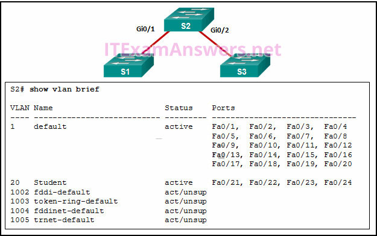

**Choices:**
- **A.** There is a native VLAN mismatch between the switches.
- **B.** There is no media connected to the interfaces.
- **C.** They are administratively shut down.
- **D.** They are configured as trunk interfaces

**Correct Answer:**
They are configured as trunk interfaces

**Explanation:**
6.2.2 VLAN Trunks Interfaces that are configured as trunks do not belong to a VLAN and therefore will not show in the output of the show vlan brief commands.

---

## Question 4

**Question:**
Refer to the exhibit. A switch with a default configuration connects four hosts. The ARP table for host A is shown. What happens when host A wants to send an IP packet to host D?

**Images:**
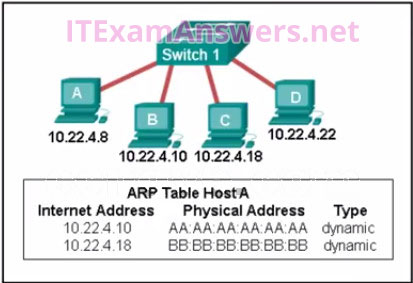

**Choices:**
- **A.** Host A sends an ARP request to the MAC address of host D. Host D responds with its IP address.
- **B.** Host D sends an ARP request to host A. Host A responds with its MAC address.
- **C.** Host A sends out the packet to the switch. The switch adds the MAC address for host D to the frame and forwards it to the network.
- **D.** Host A sends out a broadcast of FF:FF:FF:FF:FF:FF. Every other host connected to the switch receives the broadcast and host D responds with its MAC address.

**Correct Answer:**
Host A sends out a broadcast of FF:FF:FF:FF:FF:FF. Every other host connected to the switch receives the broadcast and host D responds with its MAC address.

---

## Question 5

**Question:**
Refer to the exhibit. A network administrator needs to add an ACE to the TRAFFIC-CONTROL ACL that will deny IP traffic from the subnet 172.23.16.0/20. Which ACE will meet this requirement?

**Images:**
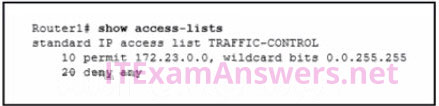

**Choices:**
- **A.** 5 deny 172.23.16.0 0.0.15.255
- **B.** 5 deny 172.23.16.0 0.0.255.255
- **C.** 15 deny 172.23.16.0 0.0.15.255
- **D.** 30 deny 172.23.16.0 0.0.15.255

**Correct Answer:**
5 deny 172.23.16.0 0.0.15.255

---

## Question 6

**Question:**
Which three layers of the OSI model map to the application layer of the TCP/IP model? (Choose three.)

**Choices:**
- **A.** Application
- **B.** Data Link
- **C.** Transport
- **D.** Session
- **E.** Presentation
- **F.** Network

**Correct Answer:**
Application; Session; Presentation

---

## Question 7

**Question:**
Refer to the exhibit. When a packet arrives on interface Serial0/0/0 on R1, with a destination IP address of PC1, which two events occur? (Choose two)

**Images:**
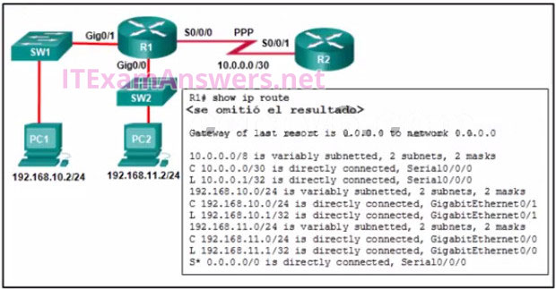

**Choices:**
- **A.** Router R1 will de-encapsulate the packet and encapsulate it in a PPP frame.
- **B.** Router R1 will forward the packet out Gig0/1.
- **C.** Router R1 will forward the packet out Gig0/0.
- **D.** Router R1 will de-encapsulate the packet and encapsulate it in an Ethernet frame.
- **E.** Router R1 will forward the packet out S0/0/0.

**Correct Answer:**
Router R1 will forward the packet out Gig0/1.; Router R1 will de-encapsulate the packet and encapsulate it in an Ethernet frame.

**Explanation:**
Routing and Switching Essentials 1.1.1 Router Functions 1.2.2 Path Determination A router will look in the routing table for a destination network and locate an exit interface to forward a packet to a destination. After the exit interface is determined, the router will encapsulate a packet into the correct frame type. (PPP) is a data link (layer 2) protocol used to establish a direct connection between two nodes. (from wikipedia)

---

## Question 8

**Question:**
What is the purpose of the overload keyword in the ip nat inside source list 1 pool NAT_POOL overload command?

**Choices:**
- **A.** It allows many inside hosts to share one or a few inside global addresses.
- **B.** It allows a pool of inside global addresses to be used by internal hosts.
- **C.** It allows external hosts to initiate sessions with internal hosts.
- **D.** It allows a list of internal hosts to communicate with a specific group of external hosts.

**Correct Answer:**
It allows many inside hosts to share one or a few inside global addresses.

**Explanation:**
The primary difference between this configuration and the configuration for dynamic, one-to-one NAT is that the overload keyword is used. The overload keyword enables PAT.

---

## Question 9

**Question:**
What type of installation is needed to view syslog messages?

**Choices:**
- **A.** A syslog client must be installed on a workstation.
- **B.** Because any network equipment can interpret syslog messages, nothing special is needed to view them.
- **C.** A syslog server must be installed on a router.
- **D.** A syslog server must be installed on a workstation.

**Correct Answer:**
A syslog server must be installed on a workstation.

**Explanation:**
The syslog protocol allows networking devices to send their system messages across the network to syslog servers.

---

## Question 10

**Question:**
Refer to the exhibit. A network administrator has added a new subnet to the network and needs hosts on that subnet to receive IPv4 addresses from the DHCPv4 server. What two commands will allow hosts on the new subnet to receive addresses from the DHCP4 server? (Choose two.)

**Images:**
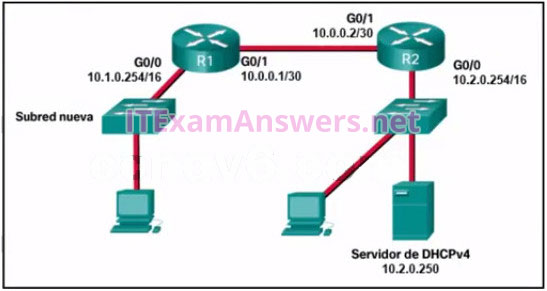

**Choices:**
- **A.** R1(config-if)# ip helper-address 10.2.0.250
- **B.** R1(config)# interface G0/1
- **C.** R1(config)# interface G0/0
- **D.** R2(config-if)# ip helper-address 10.2.0.250
- **E.** R2(config)# interface G0/0
- **F.** R1(config-if)# ip helper-address 10.1.0.254

**Correct Answer:**
R1(config-if)# ip helper-address 10.2.0.250; R1(config)# interface G0/0

**Explanation:**
You need the router interface that is connected to the new subnet and the dhcp server address.

---

## Question 11

**Question:**
Refer to the exhibit. Static NAT is being configured to allow PC 1 access to the web server on the internal network. What two addresses are needed in place of A and B to complete the static NAT configuration? (Choose two.)

**Images:**
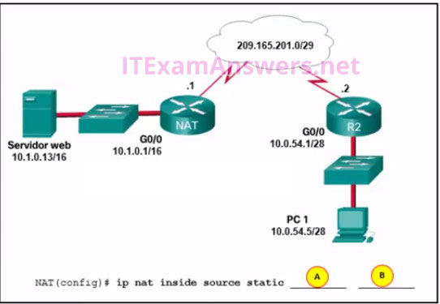

**Choices:**
- **A.** B = 209.165.201.7
- **B.** A = 10.1.0.13
- **C.** B = 10.0.254.5
- **D.** B = 209.165.201.1
- **E.** A = 209.165.201.2

**Correct Answer:**
A = 10.1.0.13; B = 209.165.201.1

---

## Question 12

**Question:**
When creating an IPv6 static route, when must a next-hop IPv6 address and an exit interface both be specified

**Choices:**
- **A.** when CEF is enabled
- **B.** when the static route is a default route
- **C.** when the next hop is a link-local address
- **D.** when the exit interface is a point-to-point interface

**Correct Answer:**
when the next hop is a link-local address

**Explanation:**
Routing and Switching Essentials 2.2.3 Configure IPv6 Static Routes Link-local addresses are only unique on a given link, and the same address could exist out multiple interfaces. For that reason, any time a static route specifies a link-local address as the next hop, it must also specify the exit interface. This is called a fully specified static route.

---

## Question 13

**Question:**
Which address prefix range is reserved for IPv4 multicast?

**Choices:**
- **A.** 224.0.0.0 – 239.255.255.255
- **B.** 240.0.0.0 – 254.255.255.255
- **C.** 169.254.0.0 – 169.25.255.255
- **D.** 127.0.0.0- 127.255.255.255

**Correct Answer:**
224.0.0.0 – 239.255.255.255

**Explanation:**
Multicast IPv4 addresses use the reserved class D address range of 224.0.0.0 to 239.255.255.255.

---

## Question 14

**Question:**
Refer to the exhibit. What would happen after the IT administrator enters the new static route?

**Images:**
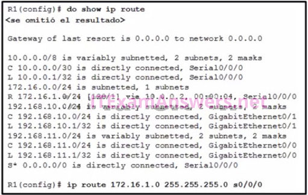

**Choices:**
- **A.** The 172.16.1.0 route learned from RIP would be replaced with the 172.16.1.0 static route.
- **B.** The 172.16.1.0 static route is added to the existing routes in the routing table.
- **C.** The 172.16.1.0 static route would be entered into the running-config but not shown in the routing table.
- **D.** The 0.0.0.0 default route would be replaced with the 172.16.1.0 static route.

**Correct Answer:**
The 172.16.1.0 route learned from RIP would be replaced with the 172.16.1.0 static route.

**Explanation:**
A route will be installed in a routing table if there is not another routing source with a lower administrative distance. If a route with a lower administrative distance to the same destination network as a current route is entered, the route with the lower administrative distance will replace the route with a higher administrative distance.

---

## Question 15

**Question:**
What effect does the default-information originate command have on a Cisco router that is configured for RIP?

**Choices:**
- **A.** Any dynamic route that is learned from a neighboring router will propagate to other adjacent routers.
- **B.** Any default static route that is configured on the router will propagate to other adjacent routers.
- **C.** Any static route that is learned from a neighboring router will propagate to other adjacent routers.
- **D.** Any routes that are learned from a neighboring router will propagate to other adjacent routers.

**Correct Answer:**
Any default static route that is configured on the router will propagate to other adjacent routers.

---

## Question 16

**Question:**
Which type of IPv6 address refers to any unicast address that is assigned to multiple hosts?

**Choices:**
- **A.** Single location
- **B.** Any cast
- **C.** Link-local
- **D.** Global unicast

**Correct Answer:**
Any cast

**Explanation:**
The anycast address is a unicast address that is assigned to multiple hosts. Anycast addresses are usually used to locate the nearest server of a specifc type–for example, the nearest DNS or network time server. Assigning the same unicast address to more than one interface makes it an anycast address. You can have link-local, unique local, or global unicast anycast addresses. When you assign an anycast address to an interface, you must explicitly identify the address as an anycast address.

---

## Question 17

**Question:**
An administrator wants to replace the configuration file on a Cisco router by loading a new configuration file from a TFTP server. What two things does the administrator need to know before performing this task? (Choose two.)

**Choices:**
- **A.** TFTP server IP address
- **B.** name of the configuration file that is currently stored on the router
- **C.** router IP address
- **D.** configuration register value
- **E.** name of the configuration file that is stored on the TFTP server
- **F.** The name of the configuration file that is currently stored on the TFTP server
- **G.** The name of the configuration file that is currently stored on the router

**Correct Answer:**
TFTP server IP address; name of the configuration file that is stored on the TFTP server

**Explanation:**
Routing and Switching Essentials 10.3.3 IOS Image Management In order to identify the exact location of the desired configuration file, the IP address of the TFTP server and the name of the configuration file are essential information. Because the file is a new configuration, the name of the current configuration file is not necessary.

---

## Question 18

**Question:**
Refer to the exhibit. Inter-VLAN communication between VLAN 10, VLAN 20, and VLAN 30 is not successful. What is the problem?

**Images:**
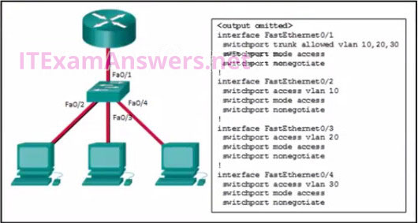

**Choices:**
- **A.** The switch interface FastEthernet0/1 is configured to not negotiate and should be configured to negotiate.​
- **B.** The access interfaces do not have IP addresses and each should be configured with an IP address.
- **C.** The switch interface FastEthernet0/1 is configured as an access interface and should be configured as a trunk interface.
- **D.** The switch interfaces FastEthernet0/2, FastEthernet0/3, and FastEthernet0/4 are configured to not negotiate and should be configured to negotiate.​

**Correct Answer:**
The switch interface FastEthernet0/1 is configured as an access interface and should be configured as a trunk interface.

**Explanation:**
6.3.3 Configure Router-on-a-Stick Inter-VLAN Routing To forward all VLANs to the router, the switch interface Fa0/1 must be configured as a trunk interface with the switchport mode trunk command.

---

## Question 19

**Question:**
Which statement describes the Cisco License Manager?

**Choices:**
- **A.** It is a free, standalone software application for deploying Cisco software licenses across the network.
- **B.** It is a web-based portal for getting and registering individual software licenses.
- **C.** It is a centralized TFTP server that enables control of the number and revision level of Cisco IOS images.
- **D.** It is an organized collection of processes and components used to activate Cisco IOS software feature sets by obtaining and validating Cisco software licenses.

**Correct Answer:**
It is a free, standalone software application for deploying Cisco software licenses across the network.

**Explanation:**
Routing and Switching Essentials 10.3.4 Software Licensing Cisco License Manager (CLM) is available as a free download from the Cisco website and is a standalone application that helps network administrators deploy licenses across entire networks.

---

## Question 20

**Question:**
A user sends an HTTP request to a web server on a remote network. During encapsulation for this request, what information is added to the address field of a frame to indicate the destination?

**Choices:**
- **A.** the MAC address of the default gateway
- **B.** the network domain of the destination host
- **C.** the IP address of the default gateway
- **D.** the MAC address of the destination host

**Correct Answer:**
the MAC address of the default gateway

**Explanation:**
A frame is encapsulated with source and destination MAC addresses. The source device will not know the MAC address of the remote host. An ARP request will be sent by the source and will be responded to by the router. The router will respond with the MAC address of its interface, the one which is connected to the same network as the source.

---

## Question 21

**Question:**
A network administrator is designing an IPv4 addressing scheme and requires these subnets. 1 subnet of 100 hosts 2 subnets of 80 hosts 2 subnets of 30 hosts 4 subnets of 20 hosts Which combination of subnets and masks will provide the best addressing plan for these requirements

**Choices:**
- **A.** 9 subnets of 126 hosts with a 255.255.255.128 mask
- **B.** 3 subnets of 126 hosts with a 255.255.255.128 mask 6 subnets of 30 hosts with a 255.255.255.224 mask
- **C.** 3 subnets of 126 hosts with a 255.255.255.192 mask 6 subnets of 30 hosts with a 255.255.255.240 mask
- **D.** 1 subnet of 126 hosts with a 255.255.255.192 mask 2 subnets of 80 hosts with a 255.255.255.224 mask 6 subnets of 30 hosts with a 255.255.255.240 mask

**Correct Answer:**
3 subnets of 126 hosts with a 255.255.255.128 mask 6 subnets of 30 hosts with a 255.255.255.224 mask

**Explanation:**
IPv4 subnets that require 100 and 80 hosts are provided by creating subnets of 126 usable addresses, each of which requires 7 host bits. The resulting mask is 255.255.255.128. Subnets that require 30 and 20 hosts are provided by creating subnets of 30 usable addresses, each of which requires 5 host bits. The resulting mask is 255.255.255.224. Creating nine subnets, each consisting of 126 usable addresses, would waste large numbers of addresses in the six smaller subnets.

---

## Question 22

**Question:**
Refer to the exhibit. How was the host route 2001:DB8:CAFE:4::1/128 installed in the routing table?

**Images:**
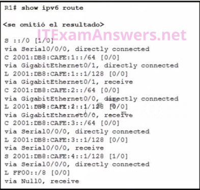

**Choices:**
- **A.** The route was automatically installed when an IP address was configured on an active interface.
- **B.** The route was dynamically created by router R1.
- **C.** The route was manually entered by an administrator.
- **D.** The route was dynamically learned from another router.

**Correct Answer:**
The route was manually entered by an administrator.

**Explanation:**
A host route is an IPv6 route with a 128-bit mask. A host route can be installed in a routing table automatically when an IP address is configured on a router interface or manually if a static route is created

---

## Question 23

**Question:**
What are three characteristics of the CSMA/CD process? (Choose three.)

**Choices:**
- **A.** The device with the electronic token is the only one that can transmit after a collision.
- **B.** After detecting a collision, hosts can attempt to resume transmission after a random time delay has expired.
- **C.** All of the devices on a segment see data that passes on the network medium.
- **D.** Devices can be configured with a higher transmission priority.
- **E.** A device listens and waits until the media is not busy before transmitting.
- **F.** A jam signal indicates that the collision has cleared and the media is not busy.

**Correct Answer:**
After detecting a collision, hosts can attempt to resume transmission after a random time delay has expired.; All of the devices on a segment see data that passes on the network medium.; A device listens and waits until the media is not busy before transmitting.

**Explanation:**
The Carrier Sense Multiple Access/Collision Detection (CSMA/CD) process is a contention-based media access control mechanism used on shared media access networks, such as Ethernet. When a device needs to transmit data, it listens and waits until the media is available (quiet), then it will send data. If two devices transmit at the same time, a collision will occur. Both devices will detect the collision on the network. When a device detects a collision, it will stop the data transmission process, wait for a random amount of time, then try again.

---

## Question 24

**Question:**
A network engineer is troubleshooting connectivity issues among interconnected Cisco routers and switches. Which command should the engineer use to find the IP address information, host name, and IOS version of neighboring network devices?

**Choices:**
- **A.** show ip route
- **B.** show interfaces
- **C.** show version
- **D.** show cdp neighbors detail

**Correct Answer:**
show cdp neighbors detail

**Explanation:**
The show cdp neighbors command provides helpful information about each CDP neighbor device, including the following: Device identifiers – The host name of the neighbor device (S1) Port identifier – The name of the local and remote port (Gig 0/1 and Fas 0/5, respectively) Capabilities list – Whether the device is a router or a switch (S for switch; I for IGMP is beyond scope for this course) Platform – The hardware platform of the device (WS-C2960 for Cisco 2960 switch) he show cdp neighbors detail command can also provide information, such as the neighbors’ IOS version and IPv4 address

---

## Question 25

**Question:**
Fill in the blank When port security is enabled, a switch port uses the default violation mode of ___ shutdown ___ until specifically configured to use a different violation mode.

**Explanation:**
If no violation mode is specified when port security is enabled on a switch port, then the security violation mode defaults to shutdown. Routing and Switching Essentials 5.2.2 Switch Port Security

---

## Question 26

**Question:**
Refer to the exhibit. Which source address is being used by router R1 for packets being forwarded to the Internet?

**Images:**
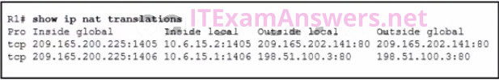

**Choices:**
- **A.** 198.51.100.3
- **B.** 10.6.15.2
- **C.** 209.165.200.225
- **D.** 209.165.202.141

**Correct Answer:**
209.165.200.225

**Explanation:**
The inside global address is used as the source address for packets leaving the network The source address for packets forwarded by the router to the Internet will be the inside global address of 209.165.200.225. This is the address that the internal addresses from the 10.6.15.0 network will be translated to by NAT.

---

## Question 27

**Question:**
Which feature on a Cisco router permits the forwarding of traffic for which there is no specific route

**Choices:**
- **A.** route source
- **B.** next-hop
- **C.** outgoing interface
- **D.** gateway of last resort

**Correct Answer:**
gateway of last resort

**Explanation:**
1.2.2 Path Determination A default static route is used as a gateway of last resort to forward unknown destination traffic to a next hop/exit interface. The next-hop or exit interface is the destination to send traffic to on a network after the traffic is matched in a router. The route source is the location a route was learned from.

---

## Question 28

**Question:**
Which three statements characterize UDP (Choose three.)

**Choices:**
- **A.** UDP provides sophisticated flow control mechanisms.
- **B.** UDP relies on IP for error detection and recovery.
- **C.** UDP is a low overhead protocol that does not provide sequencing or flow control mechanisms.
- **D.** UDP provides basic connectionless transport layer functions.
- **E.** UDP relies on application layer protocols for error detection.
- **F.** UDP provides connection-oriented, fast transport of data at Layer 3.

**Correct Answer:**
UDP is a low overhead protocol that does not provide sequencing or flow control mechanisms.; UDP provides basic connectionless transport layer functions.; UDP relies on application layer protocols for error detection.

**Explanation:**
UDP is a simple protocol that provides the basic transport layer functions. It has much lower overhead than TCP because it is not connection-oriented and does not offer the sophisticated retransmission, sequencing, and flow control mechanisms that provide reliability.

---

## Question 29

**Question:**
Refer to the exhibit. What will router R1 do with a packet that has a destination IPv6 address of 2001:db8:cafe:5::1?

**Images:**
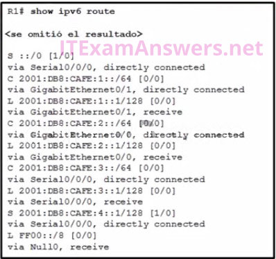

**Choices:**
- **A.** forward the packet out GigabitEthernet0/1
- **B.** drop the packet
- **C.** forward the packet out Serial0/0/0
- **D.** forward the packet out GigabitEthernet0/0

**Correct Answer:**
forward the packet out Serial0/0/0

**Explanation:**
Routing and Switching Essentials 2.2.4 Configure IPv6 Default Routes The route ::/0 is the compressed form of the 0000:0000:0000:0000:0000:0000:0000:0000/0 default route. The default route is used if a more specific route is not found in the routing table.

---

## Question 30

**Question:**
How will a router handle static routing differently if Cisco Express Forwarding is disabled

**Choices:**
- **A.** Static routes that use an exit interface will be unnecessary.
- **B.** Serial point-to-point interfaces will require fully specified static routes to avoid routing inconsistencies.
- **C.** It will not perform recursive lookups.
- **D.** Ethernet multiaccess interfaces will require fully specified static routes to avoid routing inconsistencies.

**Correct Answer:**
Ethernet multiaccess interfaces will require fully specified static routes to avoid routing inconsistencies.

**Explanation:**
Routing and Switching Essentials 2.2.1 Configure IPv4 Static Routes In most platforms running IOS 12.0 or later, Cisco Express Forwarding is enabled by default. Cisco Express Forwarding eliminates the need for the recursive lookup. If Cisco Express Forwarding is disabled, multiaccess network interfaces require fully specified static routes in order to avoid inconsistencies in their routing tables. Point-to-point interfaces do not have this problem, because multiple end points are not present. With or without Cisco Express Forwarding enabled, using an exit interface when configuring a static route is a viable option.

---

## Question 31

**Question:**
Refer to the exhibit. A network technician issues the command show vlan to verify the VLAN configuration. Based on the output, which port should be assigned with native VLAN?

**Images:**
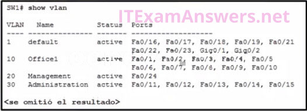

**Choices:**
- **A.** Fa0/12
- **B.** Gig0/1
- **C.** Fa0/24
- **D.** Fa0/20

**Correct Answer:**
Fa0/20

**Explanation:**
From the output, the port F0/20 is not shown, which means it is configured as a trunk port. A native VLAN can only be assigned to a trunk port.

---

## Question 32

**Question:**
Which two things should a network administrator modify on a router to perform password recovery? (Choose two.)

**Choices:**
- **A.** the configuration register value
- **B.** the NVRAM file system
- **C.** system ROM
- **D.** the system image file
- **E.** the startup configuration file

**Correct Answer:**
the configuration register value; the startup configuration file

**Explanation:**
To perform password recovery, the administrator must first change the configuration register value (typically to 0x2142) while in ROMMON mode. This setting instructs the router to ignore the startup configuration file during the boot process, allowing access to the device without a password. Once the router has loaded, the administrator copies the original configuration into RAM, sets a new password, and then modifies the startup configuration file by saving the new settings to ensure the recovery is permanent.

---

## Question 33

**Question:**
What are two reasons why an administrator might choose to use static routing rather than dynamic routing? (Choose two.)

**Choices:**
- **A.** Static routing is more scalable.
- **B.** Static routing is easier to maintain in large networks.
- **C.** Static routing uses less router processing and bandwidth.
- **D.** Static routing is more secure.
- **E.** Static routing does not require complete knowledge of the whole network.

**Correct Answer:**
Static routing uses less router processing and bandwidth.; Static routing is more secure.

**Explanation:**
Because static routes must be created and changed manually, they require a larger investment of administrative time and do not scale easily. Static routes do not require additional CPU cycles to calculate and advertise routes, and they provide more security because they are not advertised over the network. Proper implementation of static routes requires the administrator to have a complete understanding of the network topology.

---

## Question 34

**Question:**
An administrator who is troubleshooting connectivity issues on a switch notices that a switch port configured for port security is in the err-disabled state. After verifying the cause of the violation, how should the administrator re-enable the port without disrupting network operation?

**Choices:**
- **A.** Reboot the switch.
- **B.** Issue the no switchport port-security violation shutdown command on the interface.
- **C.** Issue the no switchport port-security command, then re-enable port security.
- **D.** Issue the shutdown command followed by the no shutdown command on the interface.

**Correct Answer:**
Issue the shutdown command followed by the no shutdown command on the interface.

**Explanation:**
To re-enable the port, use the shutdown interface configuration mode command (Figure 3). Then, use the no shutdown interface configuration command to make the port operational.

---

## Question 35

**Question:**
A network administrator has been allocated the IPv4 10.10.240.0/20 block of addresses for a LAN. Two devices on two different, but contiguous, subnets on the LAN have been assigned the addresses 10.10.247.1/21 and 10.10.248.10/24, respectively. The administrator has to create a third subnet from the remaining address range. To optimize the use of this address space, the new subnet will follow on directly from the existing subnets. What is the first available host address in the next available subnet

**Choices:**
- **A.** 10.10.250.1
- **B.** 10.10.249.1
- **C.** 10.10.248.17
- **D.** 10.10.255.17

**Correct Answer:**
10.10.249.1

**Explanation:**
The complete address range of the subnet with the host 10.10.247.1/21 is 10.10.240.0/21 to 10.10.247.255/21. The complete address range of the subnet that contains the host 10.10.248.10/24 is 10.10.248.0/24 to 10.10.248.255/24. This means that the next subnet will have a network address of 10.10.249.0 with a prefix length between 24 and 30. The first useable host address on this new subnet is therefore 10.10.249.1.

---

## Question 36

**Question:**
Refer to the exhibit. A ping to PC3 is issued from PC0, PC1, and PC2 in this exact order. Which MAC addresses will be contained in the S1 MAC address table that is associated with the Fa0/1 port?

**Images:**
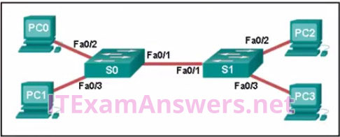

**Choices:**
- **A.** PC0, PC1, and PC2 MAC addresses
- **B.** just the PC1 MAC address
- **C.** just PC0 and PC1 MAC addresses
- **D.** just the PC2 MAC address​
- **E.** just the PC0 MAC address

**Correct Answer:**
just PC0 and PC1 MAC addresses

**Explanation:**
Switch S1 builds a MAC address table based on the source MAC address in the frame and the port upon which the frame enters the switch. The PC2 MAC address will be associated with port FA0/2. Because port FA0/1 of switch S1 connects with another switch, port FA0/1 will receive frames from multiple different devices. The MAC address table on switch S1 will therefore contain MAC addresses associated with each of the sending PCs.

---

## Question 37

**Question:**
Refer to the exhibit. A network administrator issues the show lldp neighbors command to display information about neighboring devices. What can be determined based on the information?

**Images:**
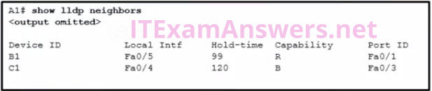

**Choices:**
- **A.** Device C1 is a switch.
- **B.** Device A1 is connected to the port Fa0/5 on device B1.
- **C.** Device B1 is a WLAN access point.
- **D.** Device C1 is connected to device B1 through the port Fa0/3.

**Correct Answer:**
Device C1 is a switch.

**Explanation:**
In the display of show lldp neighbors command, the letter B represents a bridge. It also means a switch. The letter R represents a router. If a neighboring device is a WLAN access point, the letter W is used. Device A1 is connected to the port Fa0/1 on device B1. Device A1 is connected to the port Fa0/3 on device C1, and for that reason device C1 cannot connect to device B1 through the same port, Fa0/3.

---

## Question 38

**Question:**
Which two devices allow hosts on different VLANs to communicate with each other (Choose two.)

**Choices:**
- **A.** Layer 3 switch
- **B.** repeater
- **C.** router
- **D.** hub
- **E.** Layer 2 switch

**Correct Answer:**
Layer 3 switch; router

**Explanation:**
Routing and Switching Essentials 6.3.1 Inter-VLAN Routing Operation Members of different VLANs are on separate networks. For devices on separate networks to be able to communicate, a Layer 3 device, such as a router or Layer 3 switch, is necessary.

---

## Question 39

**Question:**
Refer to the exhibit. Host A sends a data packet to host B. What will be the addressing information of the data packet when it reaches host B A. B. C. D.

**Images:**
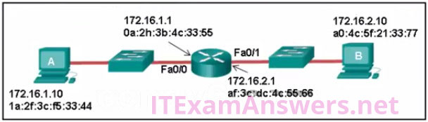
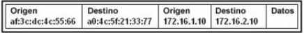
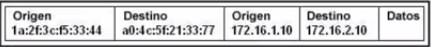
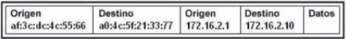

**Correct Answer:**
s: A

---

## Question 40

**Question:**
Data is being sent from a source PC to a destination server. Which three statements correctly describe the function of TCP or UDP in this situation (Choose three.)

**Choices:**
- **A.** TCP is the preferred protocol when a function requires lower network overhead.
- **B.** The source port field identifies the running application or service that will handle data returning to the PC.
- **C.** The UDP destination port number identifies the application or service on the server which will handle the data.
- **D.** The TCP process running on the PC randomly selects the destination port when establishing a session with the server.
- **E.** UDP segments are encapsulated within IP packets for transport across the network.
- **F.** The TCP source port number identifies the sending host on the network.

**Correct Answer:**
The source port field identifies the running application or service that will handle data returning to the PC.; The UDP destination port number identifies the application or service on the server which will handle the data.; UDP segments are encapsulated within IP packets for transport across the network.

**Explanation:**
Layer 4 port numbers identify the application or service which will handle the data. The source port number is added by the sending device and will be the destination port number when the requested information is returned. Layer 4 segments are encapsulated within IP packets. UDP, not TCP, is used when low overhead is needed. A source IP address, not a TCP source port number, identifies the sending host on the network. Destination port numbers are specific ports that a server application or service monitors for requests.

---

## Question 41

**Question:**
What is defined by the ip nat pool command when configuring dynamic NAT?

**Choices:**
- **A.** the pool of global address
- **B.** the range of external IP addresses that internal hosts are permitted to access
- **C.** the pool of available NAT servers
- **D.** the range of internal IP addresses that are translated

**Correct Answer:**
the pool of global address

**Explanation:**
Routing and Switching Essentials 9.2.2 Configure Dynamic NAT Dynamic NAT uses a pool of inside global addresses that are assigned to outgoing sessions. Creating the pool of inside global addresses is accomplished using the ip nat pool command.

---

## Question 42

**Question:**
Which address type is not supported by IPv6

**Choices:**
- **A.** multicast
- **B.** private
- **C.** unicast
- **D.** broadcast

**Correct Answer:**
broadcast

**Explanation:**
IPv6 supports unicast, private, and multicast addresses but does not support Layer 3 broadcasts.

---

## Question 43

**Question:**
What is the purpose of setting the native VLAN separate from data VLANs?

**Choices:**
- **A.** The native VLAN is for routers and switches to exchange their management information, so it should be different from data VLANs.
- **B.** A separate VLAN should be used to carry uncommon untagged frames to avoid bandwidth contention on data VLANs.
- **C.** The security of management frames that are carried in the native VLAN can be enhanced.
- **D.** The native VLAN is for carrying VLAN management traffic only.

**Correct Answer:**
A separate VLAN should be used to carry uncommon untagged frames to avoid bandwidth contention on data VLANs.

**Explanation:**
Routing and Switching Essentials 6.1.1 Overview of VLANs When a Cisco switch trunk port receives untagged frames (unusual in well-designed networks), it forwards these frames to the native VLAN. When the native VLAN is moved away from data VLANs, those untagged frames will not compete for bandwidth in the data VLANs. The native VLAN is not designed for carrying management traffic, but rather it is for backward compatibility with legacy LAN scenarios.

---

## Question 44

**Question:**
Which ACE would permit traffic from hosts only on the 192.168.8.0/22 subnet?

**Choices:**
- **A.** permit 192.168.8.0 0.0.3.255
- **B.** permit 192.168.0.0 0.0.15.255
- **C.** permit 192.168.8.0 255.255.248.0
- **D.** permit 192.168.8.0 0.0.7.255

**Correct Answer:**
permit 192.168.8.0 0.0.3.255

**Explanation:**
The only filtering criteria specified for a standard access list is the source IPv4 address. The wild card mask is written to identify what parts of the address to match, with a 0 bit, and what parts of the address should be ignored, which a 1 bit.

---

## Question 45

**Question:**
Which two issues might cause excessive runt and giant frames in an Ethernet network? (Choose two.)

**Choices:**
- **A.** damaged cable connector
- **B.** using the incorrect cable type
- **C.** native VLAN mismatch
- **D.** a malfunctioning NIC
- **E.** excessive collisions
- **F.** incorrectly configured auto-MDIX feature

**Correct Answer:**
a malfunctioning NIC; excessive collisions

**Explanation:**
Routing and Switching Essentials 5.1.2 Configure Switch Ports In an Ethernet network, a runt is a frame that is shorter than 64 bytes and a giant is a frame that is longer than the maximum allowed length. Both are often caused by NIC malfunctioning, but can also be caused by excessive collisions. CRC errors usually indicate a media or cable error caused by electrical interference, loose or damaged connections, or using the incorrect cabling type.

---

## Question 46

**Question:**
Refer to the exhibit. Which static route would an IT technician enter to create a backup route to the 172.16.1.0 network that is only used if the primary RIP learned route fails?

**Images:**
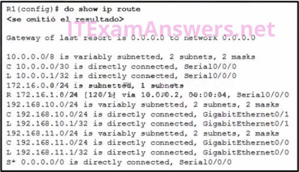

**Choices:**
- **A.** ip route 172.16.1.0 255.255.255.0 s0/0/0
- **B.** ip route 172.16.1.0 255.255.255.0 s0/0/0 111
- **C.** ip route 172.16.1.0 255.255.255.0 s0/0/0 91
- **D.** ip route 172.16.1.0 255.255.255.0 s0/0/0 121

**Correct Answer:**
ip route 172.16.1.0 255.255.255.0 s0/0/0 121

**Explanation:**
Routing and Switching Essentials 2.2.5 Configure Floating Static Routes A backup static route is called a floating static route. A floating static route has an administrative distance greater than the administrative distance of another static route or dynamic route.

---

## Question 47

**Question:**
Refer to the exhibit. Which three events will occur as a result of the configuration shown on R1? (Choose three.)

**Images:**
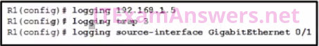

**Choices:**
- **A.** Only traffic that originates from the GigabitEthernet 0/1 interface will be monitored.
- **B.** The syslog messages will contain the IP address the GigabitEthernet 0/1 interface.
- **C.** Messages that are sent to the syslog server will be limited to levels 3 or lower.
- **D.** Messages that are sent to the syslog server will use 192.168.1.5 as the destination IP address.
- **E.** For multiple occurrences of the same error, only the first three messages will be sent to the server.
- **F.** Messages that are sent to the syslog server will be limited to levels 3 and higher.

**Correct Answer:**
The syslog messages will contain the IP address the GigabitEthernet 0/1 interface.; Messages that are sent to the syslog server will be limited to levels 3 or lower.; Messages that are sent to the syslog server will use 192.168.1.5 as the destination IP address.

---

## Question 48

**Question:**
Which IPv6 prefix is reserved for communication between devices on the same link?

**Choices:**
- **A.** 2001::/32
- **B.** FC00::/7
- **C.** FDFF::/7
- **D.** FE80::/10

**Correct Answer:**
FE80::/10

**Explanation:**
fe80::/10 — Addresses in the link-local prefix are only valid and unique on a single link. Within this prefix only one subnet is allocated (54 zero bits), yielding an effective format of fe80::/64. The least significant 64 bits are usually chosen as the interface hardware address constructed in modified EUI-64 format. A link-local address is required on every IPv6-enabled interface—in other words, applications may rely on the existence of a link-local address even when there is no IPv6 routing. These addresses are comparable to the auto-configuration addresses 169.254.0.0/16 of IPv4. fc00::/7 — Unique local addresses (ULAs) are intended for local communication. They are routable only within a set of cooperating sites.[24] The block is split into two halves, the upper half (fd00::/8) is used for “probabilistically unique” addresses in which a 40-bit pseudorandom number is used to obtain a /48 allocation. This means that there is only a small chance that two sites that wish to merge or communicate with each other will have conflicting addresses. No allocation method for the lower half of the block (fc00::/8) is currently defined. These addresses are comparable to IPv4 private addresses (10.0.0.0/8, 172.16.0.0/12 and 192.168.0.0/16)

---

## Question 49

**Question:**
Refer to the exhibit. Packets destined to which two networks will require the router to perform a recursive lookup? (Choose two.)

**Images:**
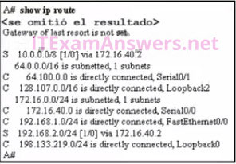

**Choices:**
- **A.** 128.107.0.0/16
- **B.** 192.168.1.0/24
- **C.** 64.100.0.0/16
- **D.** 192.168.2.0/24
- **E.** 172.16.40.0/24
- **F.** 10.0.0.0/8

**Correct Answer:**
192.168.2.0/24; 10.0.0.0/8

---

## Question 50

**Question:**
Refer to the exhibit. Routers R1 and R2 are connected via a serial link. One router is configured as the NTP master, and the other is an NTP client. Which two pieces of information can be obtained from the partial output of the show ntp associations detail command on R2 (Choose two.)

**Images:**
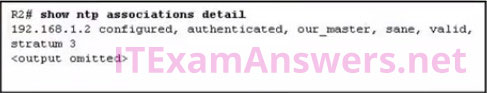

**Choices:**
- **A.** Router R1 is the master, and R2 is the client.
- **B.** The IP address of R2 is 192.168.1.2.
- **C.** The IP address of R1 is 192.168.1.2.
- **D.** Both routers are configured to use NTPv2.
- **E.** Router R2 is the master, and R1 is the client.

**Correct Answer:**
Router R1 is the master, and R2 is the client.; The IP address of R1 is 192.168.1.2.

**Explanation:**
Routing and Switching Essentials 10.2.1 NTP With the show NTP associations command, the IP address of the NTP master is given.

---

## Question 51

**Question:**
A network technician is configuring port security on a LAN switch interface. The security policy requires host MAC addresses to be learned dynamically, stored in the address table, and saved to the switch running configuration. Which command does the technician need to add to the following configuration to implement this policy?

**Choices:**
- **A.** Switch(config)# interface fa0/1 Switch(config-if)# switchport mode access Switch(config-if)# switchport portsecurity
- **B.** Switch(config-if)# switchport port-security maximum 40
- **C.** Switch(config-if)# switchport port-security macaddress
- **D.** Switch(config-if)# switchport port-security macaddress sticky
- **E.** Switch(config-if)# switchport port-security macaddress 000B.FCFF.E880

**Correct Answer:**
Switch(config-if)# switchport port-security macaddress sticky

---

## Question 52

**Question:**
After a license has been purchased and installed, what is the next step that is required before it is activated?

**Images:**

**Choices:**
- **A.** Copy the running configuration to flash.
- **B.** Reboot the router.
- **C.** Issue the license boot module technology-package command.
- **D.** Copy the running configuration to NVRAM.
- **E.** There is nothing wrong with the configuration.
- **F.** Interface Fa0/20 can only have one VLAN assigned.
- **G.** The mls qos trust cos command should reference VLAN 35.
- **H.** The command used to assign the voice VLAN to the switch port is incorrect.

**Correct Answer:**
Reboot the router.; The command used to assign the voice VLAN to the switch port is incorrect.

**Explanation:**
Routing and Switching Essentials 10.3.5 License Verification and Management After the license is installed, the device needs to be reloaded to activate the license. 53.Refer to the exhibit. A technician is programming switch SW3 to manage voice and data traffic through port Fa0/20. What, if anything, is wrong with the configuration?

---

## Question 53

**Question:**
A network administrator is using the router-on-a-stick model to configure a switch and a router for inter-VLAN routing. What configuration should be made on the switch port that connects to the router

**Choices:**
- **A.** CConfigure it as a trunk port and allow only untagged traffic.
- **B.** Configure the port as an access port and a member of VLAN1.
- **C.** Configure the port as an 802.1q trunk port.
- **D.** Configure the port as a trunk port and assign it to VLAN1.

**Correct Answer:**
Configure the port as an 802.1q trunk port.

**Explanation:**
Routing and Switching Essentials 6.3.3 Configure Router-on-a-Stick Inter-VLAN Routing The port on the switch that connects to the router interface should be configured as a trunk port. Once it becomes a trunk port, it does not belong to any particular VLAN and will forward traffic from various VLANs.

---

## Question 54

**Question:**
On which switch interface would an administrator configure an IP address so that the switch can be managed remotely?

**Images:**
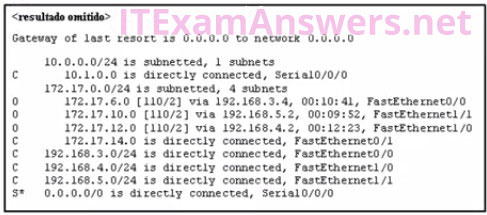
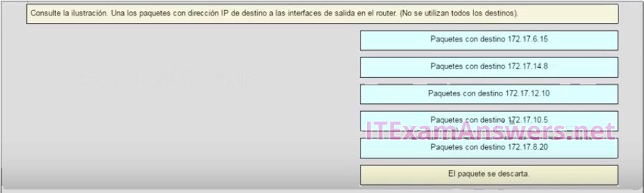

**Choices:**
- **A.** vty 0
- **B.** FastEthernet0/1
- **C.** VLAN 1
- **D.** console 0

**Correct Answer:**
VLAN 1

**Explanation:**
5.1.1 Configure a Switch with Initial Settings Interface VLAN 1 is a virtual interface on a switch, called SVI (switch virtual interface). Configuring an IP address on the default SVI, interface VLAN 1, will allow a switch to be accessed remotely. The VTY line must also be configured to allow remote access, but an IP address cannot be configured on this line 56.

---

## Question 55

**Question:**
The exhibit shows configuration commands from switch SW3 as follows: Refer to the exhibit. A technician is programming switch SW3 to manage voice and data traffic through port Fa0/20. What, if anything, is wrong with the configuration?

**Choices:**
- **A.** The mls qos trust cos command should reference VLAN 35.
- **B.** The command used to assign the voice VLAN to the switch port is incorrect.
- **C.** Interface Fa0/20 can only have one VLAN assigned.
- **D.** There is nothing wrong with the configuration.

**Correct Answer:**
The command used to assign the voice VLAN to the switch port is incorrect.

**Explanation:**
The voice VLAN should be configured with the switchport voice vlan 150 command. A switch interface can be configured to support one data VLAN and one voice VLAN. The mls qos trust cos associates with the interface. Voice traffic must be trusted so that fields within the voice packet can be used to classify it for QoS.

---

## Question 56

**Question:**
Which address type is not supported in IPv6?

**Choices:**
- **A.** unicast
- **B.** private
- **C.** multicast
- **D.** broadcast

**Correct Answer:**
broadcast

---

## Question 57

**Question:**
Refer to the exhibit. Match the packets with their destination IP address to the exiting interfaces on the router. (Not all targets are used.) Place the options in the following order:

**Images:**

**Explanation:**
Packets with a destination of 172.17.6.15 are forwarded through Fa0/0. Packets with a destination of 172.17.10.5 are forwarded through Fa1/1. Packets with a destination of 172.17.12.10 are forwarded through Fa1/0. Packets with a destination of 172.17.14.8 are forwarded through Fa0/1. Because network 172.17.8.0 has no entry in the routing table, it will take the gateway of last resort, which means that packets with a destination of 172.17.8.20 are forwarded through Serial0/0/0. Because a gateway of last resort exists, no packets will be dropped.

---
