# CCNA 2 v2 - CCNA 2 - Final Exam

## Question 1

**Question:**
Refer to the exhibit. Assuming that the routing tables are up to date and no ARP messages are needed, after a packet leaves H1, how many times is the L2 header rewritten in the path to H2?

**Images:**
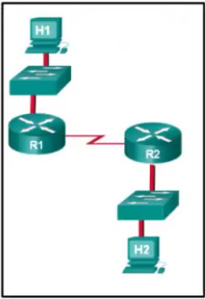
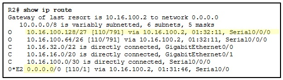

**Choices:**
- **A.** 1
- **B.** 2
- **C.** 3
- **D.** 4
- **E.** 5
- **F.** 6
- **G.** 0.0.0.0
- **H.** 10.16.100.128
- **I.** 10.16.100.2
- **J.** 110
- **K.** 791

**Correct Answer:**
2; 10.16.100.128

**Explanation:**
H1 creates the first Layer 2 header. The R1 router has to examine the destination IP address to determine how the packet is to be routed. If the packet is to be routed out another interface, as is the case with R1, the router strips the current Layer 2 header and attaches a new Layer 2 header. When R2 determines that the packet is to be sent out the LAN interface, R2 removes the Layer 2 header received from the serial link and attaches a new Ethernet header before transmitting the packet. 2. Refer to the exhibit. Which highlighted value represents a specific destination network in the routing table?

---

## Question 2

**Question:**
Which type of static route is configured with a greater administrative distance to provide a backup route to a route learned from a dynamic routing protocol?

**Images:**
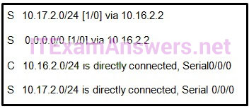

**Choices:**
- **A.** floating static route
- **B.** default static route
- **C.** summary static route
- **D.** standard static route
- **E.** S 10.17.2.0/24 [1/0] via 10.16.2.2
- **F.** S 0.0.0.0/0 [1/0] via 10.16.2.2
- **G.** C 10.16.2.0/24 is directly connected, Serial0/0/0
- **H.** S 10.17.2.0/24 is directly connected, Serial 0/0/0
- **I.** :/128
- **J.** FFFF:/128
- **K.** ::1/64
- **L.** ::/0
- **M.** ip route 172.16.0.0 255.255.240.0 S0/0/0 200
- **N.** ip route 172.16.32.0 255.255.224.0 S0/0/0 200
- **O.** ip route 172.16.0.0 255.255.224.0 S0/0/0 100
- **P.** ip route 172.16.32.0 255.255.0.0 S0/0/0 100
- **Q.** ip route 10.10.0.0 255.255.0.0 Serial 00/0 100
- **R.** ip route 10.10.0.0 255.255.0.0 209.165.200.226 100
- **S.** ip route 10.10.0.0 255.255.0.0 209.165.200.225 100
- **T.** ip route 10.10.0.0 255.255.0.0 209.165.200.225 50
- **U.** It is automatically updated and maintained by routing protocols.
- **V.** It is unaffected by changes in the topology of the network.
- **W.** It has an administrative distance of 1.
- **X.** It is identified by the prefix C in the routing table.

**Correct Answer:**
floating static route; S 10.17.2.0/24 [1/0] via 10.16.2.2; ::/0; ip route 172.16.32.0 255.255.224.0 S0/0/0 200; ip route 10.10.0.0 255.255.0.0 209.165.200.225 100; It is automatically updated and maintained by routing protocols.

**Explanation:**
There are four basic types of static routes. Floating static routes are backup routes that are placed into the routing table if a primary route is lost. A summary static route aggregates several routes into one, reducing the of the routing table. Standard static routes are manually entered routes into the routing table. Default static routes create a gateway of last resort. 4. Refer to the exhibit. Which route was configured as a static route to a specific network using the next-hop address? The C in a routing table indicates an interface that is up and has an IP address assigned. The S in a routing table signifies that a route was installed using the ip route command. Two of the routing table entries shown are static routes to a specific destination (the 192.168.2.0 network). The entry that has the S denoting a static route and [1/0] was configured using the next-hop address. The other entry (S 192.168.2.0/24 is directly connected, Serial 0/0/0) is a static route configured using the exit interface. The entry with the 0.0.0.0 route is a default static route which is used to send packets to any destination network that is not specifically listed in the routing table. 5. What network prefix and prefix-length combination is used to create a default static route that will match any IPv6 destination? A default static route configured for IPv6, is a network prefix of all zeros and a prefix mask of 0 which is expressed as ::/0. 6. A router has used the OSPF protocol to learn a route to the 172.16.32.0/19 network. Which command will implement a backup floating static route to this network? OSPF has an administrative distance of 110, so the floating static route must have an administrative distance higher than 110. Because the target network is 172.16.32.0/19, that static route must use the network 172.16.32.0 and a netmask of 255.255.224.0. 7. Refer to the exhibit. Currently router R1 uses an EIGRP route learned from Branch2 to reach the 10.10.0.0/16 network. Which floating static route would create a backup route to the 10.10.0.0/16 network in the event that the link between R1 and Branch2 goes down? CCNA 2 v6 RSE Final Exam Answers Form A 2019-2020 A floating static route needs to have an administrative distance that is greater than the administrative distance of the active route in the routing table. Router R1 is using an EIGRP route which has an administrative distance of 90 to reach the 10.10.0.0/16 network. To be a backup route the floating static route must have an administrative distance greater than 90 and have a next hop address corresponding to the serial interface IP address of Branch1. 8. Which statement describes a route that has been learned dynamically? Dynamically learned routes are constantly updated and maintained by routing protocols.

---

## Question 3

**Question:**
Compared with dynamic routes, what are two advantages of using static routes on a router? (Choose two.)

**Choices:**
- **A.** They automatically switch the path to the destination network when the topology changes
- **B.** They Improve network security
- **C.** They take less time to converge when the network topology changes
- **D.** They use fewer router resources
- **E.** They improve the efficiency of discovering neighboring networks.
- **F.** 172.16.64.32
- **G.** 172.16.64.0
- **H.** 172.16.0.0
- **I.** No address is displayed.
- **J.** The router will only forward packets that originate on directly connected networks.
- **K.** The router will propagate a static default route in its RIP updates, if one is present
- **L.** The router will be reset to the default factory information
- **M.** The router will not forward routing information that is learned from other routers

**Correct Answer:**
They Improve network security; They use fewer router resources; 172.16.0.0; The router will propagate a static default route in its RIP updates, if one is present

**Explanation:**
Static routes are manually configured on a router. Static routes are not automatically updated and must be manually reconfigured if the network topology changes. Thus static routing improves network security because it does not make route updates among neighboring routers. Static routes also improve resource efficiency by using less bandwidth, and no CPU cycles are used to calculate and communicate routes. 10. To enable RIPv1 routing for a specific subnet, the configuration command network 172.16.64.32 was entered by the network administrator. What address, if any, appears in the running configuration file to identify this network? RIPv1 is a classful routing protocol, meaning it will automatically convert the subnet ID that was entered into the classful address of 172.16.0.0 when it is displayed in the running configuration. 11. A network administrator adds the default-information originate command to the configuration of a router that uses RIP as the routing protocol. What will result from adding this command?

---

## Question 4

**Question:**
Refer to the exhibit. What is the administrative distance value that indicates the route for R2 to reach the 10.10.0.0/16 network?

**Images:**
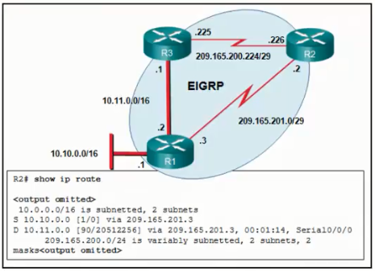
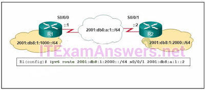

**Choices:**
- **A.** 1
- **B.** 0
- **C.** 90
- **D.** 20512256
- **E.** a level 1 child route
- **F.** a level 1 parent route
- **G.** a level 1 ultimate route
- **H.** a level 2 supernet route
- **I.** The network prefix is incorrect.
- **J.** The destination network is incorrect.
- **K.** The interface is incorrect
- **L.** The next hop address is incorrect.
- **M.** parent route
- **N.** default route
- **O.** level 2 child route
- **P.** ultimate route
- **Q.** supernet route
- **R.** scalability
- **S.** ISP selection
- **T.** speed of convergence
- **U.** the autonomous system that is used
- **V.** campus backbone architecture
- **W.** physical
- **X.** access
- **Y.** core
- **Z.** data link
- **[.** distribution

**Correct Answer:**
1; a level 1 ultimate route; The interface is incorrect; level 2 child route; ultimate route; scalability; speed of convergence; access

**Explanation:**
In the R2 routing table, the route to reach network 10.10.0.0 is labeled with an administrative distance of 1, which indicates that this is a static route. 13. Which route will a router use to forward an IPv4 packet after examining its routing table for the best match with the destination address? If the best match is a level 1 ultimate route then the router will forward the packet to that network. Level 1 parent route is a route that contains subnets and is not used to forward packets. Level 1 child routes and level 2 supernet routes are not valid routing table entries. 14. Refer to the exhibit. An administrator is attempting to install an IPv6 static route on router R1 to reach the network attached to router R2. After the static route command is entered, connectivity to the network is still failing. What error has been made in the static route configuration? In this example the interface in the static route is incorrect. The interface should be the exit interface on R1, which is s0/0/0. 15. A network administrator reviews the routing table on the router and sees a route to the destination network 172.16.64.0/18 with a next-hop IP address of 192.168.1.1. What are two descriptions of this route? (Choose two.) A level 2 child route is a subnet of a classful network and an ultimate route is any route that uses an exit interface or next hop address. 172.16.64.0/18 is a subnet of the classful 172.16.0.0/16 network. 16. Which two factors are important when deciding which interior gateway routing protocol to use? (Choose two.) There are several factors to consider when selecting a routing protocol to implement. Two of them are scalability and speed of convergence. The other options are irrelevant. 17. Employees of a company connect their wireless laptop computers to the enterprise LAN via wireless access points that are cabled to the Ethernet ports of switches. At which layer of the three-layer hierarchical network design model do these switches operate?

---

## Question 5

**Question:**
What is a basic function of the Cisco Borderless Architecture access layer?

**Images:**
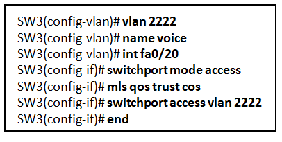

**Choices:**
- **A.** aggregates Layer 2 broadcast domains
- **B.** aggregates Layer 3 routing boundaries
- **C.** provides access to the user
- **D.** provides fault isolation
- **E.** provides access to the rest of the network through switching, routing, and network access policies
- **F.** distributes access to end users
- **G.** represents the network edge
- **H.** acts as the backbone for the network, aggregating and distributing network traffic throughout the campus
- **I.** the destination MAC address and the incoming port
- **J.** the destination MAC address and the outgoing port
- **K.** the source and destination MAC addresses and the incoming port
- **L.** the source and destination MAC addresses and the outgoing port
- **M.** the source MAC address and the incoming port
- **N.** the source MAC address and the outgoing port
- **O.** Unicast frames are always forwarded regardless of the destination MAC address
- **P.** Frame forwarding decisions are based on MAC address and port mappings in the CAM table
- **Q.** Cut-through frame forwarding ensures that invalid frames are always dropped
- **R.** Only frames with a broadcast destination address are forwarded out all active switch ports
- **S.** access
- **T.** core
- **U.** data link
- **V.** network
- **W.** network access
- **X.** borderless switching
- **Y.** cut-through switching
- **Z.** ingress port buffering
- **[.** store-and-forward switching
- **\.** when the Layer 2 switch is using a routed port
- **].** when the Layer 2 switch needs to be remotely managed
- **^.** when the Layer 2 switch is the default gateway of user traffic
- **_.** when the Layer 2 switch needs to forward user traffic to another device
- **`.** The voice VLAN should be 150.
- **a.** The configuration is correct.
- **b.** There must be a data VLAN added.
- **c.** The spanning-tree BPDU guard feature is missing.
- **d.** The switch port is not configured as a trunk.

**Correct Answer:**
provides access to the user; provides access to the rest of the network through switching, routing, and network access policies; the source MAC address and the incoming port; Frame forwarding decisions are based on MAC address and port mappings in the CAM table; access; store-and-forward switching; when the Layer 2 switch needs to be remotely managed; The configuration is correct.

**Explanation:**
A function of the Cisco Borderless Architecture access layer is providing network access to the users. Layer 2 broadcast domain aggregation, Layer 3 routing boundaries aggregation, and high availability are distribution layer functions. The core layer provides fault isolation and high-speed backbone connectivity. 19. What is a characteristic of the distribution layer in the three layer hierarchical model? One of the functions of the distribution layer is aggregating large-scale wiring closet networks. Providing access to end users is a function of the access layer, which is the network edge. Acting as a backbone is a function of the core layer. 20. Which information does a switch use to populate the MAC address table? To maintain the MAC address table, the switch uses the source MAC address of the incoming packets and the port that the packets enter. The destination address is used to select the outgoing port. 21. Which statement is correct about Ethernet switch frame forwarding decisions? Cut-through frame forwarding reads up to only the first 22 bytes of a frame, which excludes the frame check sequence and thus invalid frames may be forwarded. In addition to broadcast frames, frames with a destination MAC address that is not in the CAM are also flooded out all active ports. Unicast frames are not always forwarded. Received frames with a destination MAC address that is associated with the switch port on which it is received are not forwarded because the destination exists on the network segment connected to that port. 22. What is the name of the layer in the Cisco borderless switched network design that would have more switches deployed than other layers in the network design of a large organization? Access layer switches provide user access to the network. End user devices, such as PCs, access points, printers, and copiers, would require a port on a switch in order to connect to the network. Thus, more switches are needed in the access layer than are needed in the core and distribution layers. 23. Which switching method drops frames that fail the FCS check? The FCS check is used with store-and-forward switching to drop any frame with a FCS that does not match the FCS calculation that is made by a switch. Cut-through switching does not perform any error checking. Borderless switching is a network architecture, not a switching method. Ingress port buffering is used with store-and-forward switching to support different Ethernet speeds, but it is not a switching method 24. In what situation would a Layer 2 switch have an IP address configured? Layer 2 switches can be configured with an IP address so that they can be remotely managed by an administrator. Layer 3 switches can use an IP address on routed ports. Layer 2 switches do not need a configured IP address to forward user traffic or act as a default gateway. 25. Refer to the exhibit. A network engineer is examining a configuration implemented by a new intern who attached an IP phone to a switch port and configured the switch. Identify the issue, if any, with the configuration.

---

## Question 6

**Question:**
A network administrator is configuring a new Cisco switch for remote management access. Which three items must be configured on the switch for the task? (Choose three.)

**Images:**

**Choices:**
- **A.** vty lines
- **B.** VTP domain
- **C.** loopback address
- **D.** default VLAN
- **E.** default gateway
- **F.** IP address
- **G.** auto secure MAC addresses
- **H.** dynamic secure MAC addresses
- **I.** static secure MAC addresses
- **J.** sticky secure MAC addresses
- **K.** off
- **L.** restrict
- **M.** protect
- **N.** shutdown
- **O.** switchport mode access switchport port-security
- **P.** switchport mode access switchport port-security switchport port-security maximum 2 switchport port-security mac-address sticky switchport port-security violation restrict
- **Q.** switchport mode access switchport port-security maximum 2 switchport port-security mac-address sticky
- **R.** switchport mode access switchport port-security maximum 2 switchport port-security mac-address sticky switchport port-security violation protect
- **S.** RIP v2
- **T.** IEEE 802.1Q
- **U.** Spanning Tree
- **V.** ARP
- **W.** Rapid Spanning Tree

**Correct Answer:**
vty lines; default gateway; IP address; sticky secure MAC addresses; protect; switchport mode access switchport port-security switchport port-security maximum 2 switchport port-security mac-address sticky switchport port-security violation restrict; IEEE 802.1Q

**Explanation:**
To enable the remote management access, the Cisco switch must be configured with an IP address and a default gateway. In addition, vty lines must configured to enable either Telnet or SSH connections. A loopback address, default VLAN, and VTP domain configurations are not necessary for the purpose of remote switch management. 27. A network technician has been asked to secure all switches in the campus network. The security requirements are for each switch to automatically learn and add MAC addresses to both the address table and the running configuration. Which port security configuration will meet these requirements? With sticky secure MAC addressing, the MAC addresses can be either dynamically learned or manually configured and then stored in the address table and added to the running configuration file. In contrast, dynamic secure MAC addressing provides for dynamically learned MAC addressing that is stored only in the address table. 28. A network administrator is configuring port security on a Cisco switch. When a violation occurs, which violation mode that is configured on an interface will cause packets with an unknown source address to be dropped with no notification sent? On a Cisco switch, an interface can be configured for one of three violation modes, specifying the action to be taken if a violation occurs:Protect – Packets with unknown source addresses are dropped until a sufficient number of secure MAC addresses are removed, or the number of maximum allowable addresses is increased. There is no notification that a security violation has occurred. Restrict – Packets with unknown source addresses are dropped until a sufficient number of secure MAC addresses are removed, or the number of maximum allowable addresses is increased. In this mode, there is a notification that a security violation has occurred. Shutdown – The interface immediately becomes error-disabled and the port LED is turned off. 29. Two employees in the Sales department work different shifts with their laptop computers and share the same Ethernet port in the office. Which set of commands would allow only these two laptops to use the Ethernet port and create violation log entry without shutting down the port if a violation occurs? The switchport port-security command with no parameters must be entered before any other port security options. The parameter maximum 2 ensures that only the first two MAC addresses detected by the switch are allowed. The mac-address sticky option allows the switch to learn the first two MAC addresses that come into the specific port. The violation restrict option keeps track of the number of violations. 30. Refer to the exhibit. What protocol should be configured on SW-A Port 0/1 if it is to send traffic from multiple VLANs to switch SW-B?

---

## Question 7

**Question:**
A Cisco Catalyst switch has been added to support the use of multiple VLANs as part of an enterprise network. The network technician finds it necessary to clear all VLAN information from the switch in order to incorporate a new network design. What should the technician do to accomplish this task?

**Choices:**
- **A.** Erase the startup configuration and reboot the switch
- **B.** Erase the running configuration and reboot the switch
- **C.** Delete the startup configuration and the vlan.dat file in the flash memory of the switch and reboot the switch
- **D.** Delete the IP address that is assigned to the management VLAN and reboot the switch.

**Correct Answer:**
Delete the startup configuration and the vlan.dat file in the flash memory of the switch and reboot the switch

**Explanation:**
To restore a Catalyst switch to its factory default condition, unplug all cables except the console and power cable from the switch. Then enter the erase startup-config privileged EXEC mode command followed by the delete vlan.dat command and reboot the switch.

---

## Question 8

**Question:**
What will a Cisco LAN switch do if it receives an incoming frame and the destination MAC address is not listed in the MAC address table?

**Choices:**
- **A.** Drop the frame.
- **B.** Send the frame to the default gateway address.
- **C.** Use ARP to resolve the port that is related to the frame.
- **D.** Forward the frame out all ports except the port where the frame is received.
- **E.** The switches will negotiate via VTP which VLANs to allow across the trunk
- **F.** Only VLAN 1 will be allowed across the trunk.
- **G.** Only the native VLAN will be allowed across the trunk
- **H.** All VLANs will be allowed across the trunk

**Correct Answer:**
Forward the frame out all ports except the port where the frame is received.; All VLANs will be allowed across the trunk

**Explanation:**
A LAN switch populates the MAC address table based on source MAC addresses. When a switch receives an incoming frame with a destination MAC address that is not listed in the MAC address table, the switch forwards the frame out all ports except for the ingress port of the frame. When the destination device responds, the switch adds the source MAC address and the port on which it was received to the MAC address table. 33. What VLANs are allowed across a trunk when the range of allowed VLANs is set to the default value? By default, all VLANs, including the native VLAN and untagged traffic, are allowed across a trunk link.

---

## Question 9

**Question:**
Refer to the exhibit. A network administrator is configuring inter-VLAN routing on a network. For now, only one VLAN is being used, but more will be added soon. What is the missing parameter that is shown as the highlighted question mark in the graphic?

**Images:**
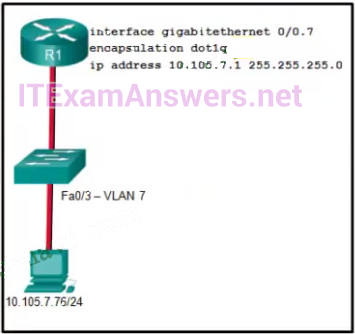

**Choices:**
- **A.** It identifies the type of encapsulation that is used
- **B.** It identifies the VLAN number
- **C.** It identifies the subinterface
- **D.** It identifies the number of hosts that are allowed on the interface
- **E.** It identifies the native VLAN number
- **F.** 0.0.0.127
- **G.** 0.0.0.255
- **H.** 0.0.1.255
- **I.** 0.0.255.255
- **J.** A single ACL command and wildcard mask should not be used to specify these particular networks or other traffic will be permitted or denied and present a security risk.
- **K.** access-class 5 in
- **L.** access-list 5 deny any
- **M.** access-list standard VTY
- **N.** permit 10.7.0.0 0.0.0.127
- **O.** access-list 5 permit 10.7.0.0 0.0.0.31
- **P.** ip access-group 5 out
- **Q.** ip access-group 5 in
- **R.** access-group 11 in
- **S.** access-class 11 in
- **T.** access-list 11 in
- **U.** access-list 110 in

**Correct Answer:**
It identifies the VLAN number; 0.0.1.255; access-class 5 in; access-list 5 permit 10.7.0.0 0.0.0.31; access-class 11 in

**Explanation:**
The completed command would be encapsulation dot1q 7. The encapsulation dot1q part of the command enables trunking and identifies the type of trunking to use. The 7 identifies the VLAN number. 35. A network administrator is designing an ACL. The networks 192.168.1.0/25, 192.168.0.0/25, 192.168.0.128/25, 192.168.1.128/26, and 192.168.1.192/26 are affected by the ACL. Which wildcard mask, if any, is the most efficient to use when specifying all of these networks in a single ACL permit entry? Write all of the network numbers in binary and determine the binary digits that are identical in consecutive bit positions from left to right. In this example, 23 bits match perfectly. The wildcard mask of 0.0.1.255 designates that 25 bits must match. 36. The computers used by the network administrators for a school are on the 10.7.0.0/27 network. Which two commands are needed at a minimum to apply an ACL that will ensure that only devices that are used by the network administrators will be allowed Telnet access to the routers? (Choose two.) Numbered and named access lists can be used on vty lines to control remote access. The first ACL command, access-list 5 permit 10.7.0.0 0.0.0.31, allows traffic that originates from any device on the 10.7.0.0/27 network. The second ACL command, access-class 5 in, applies the access list to a vty line. 37. A network engineer has created a standard ACL to control SSH access to a router. Which command will apply the ACL to the VTY lines?

---

## Question 10

**Question:**
What is the reason why the DHCPREQUEST message is sent as a broadcast during the DHCPv4 process?

**Images:**
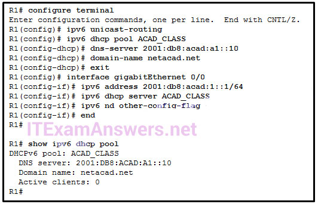
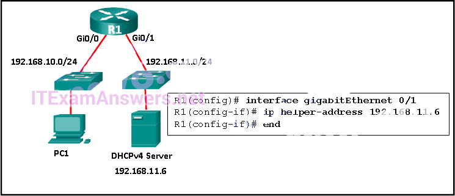
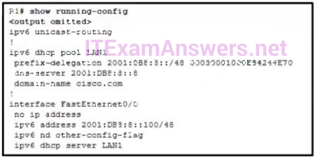
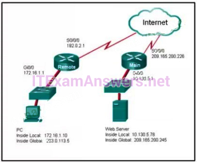
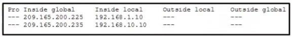
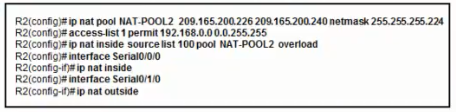
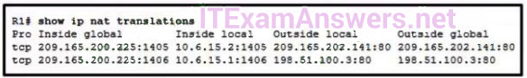
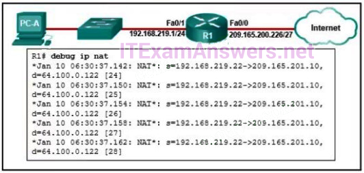

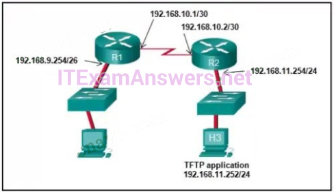

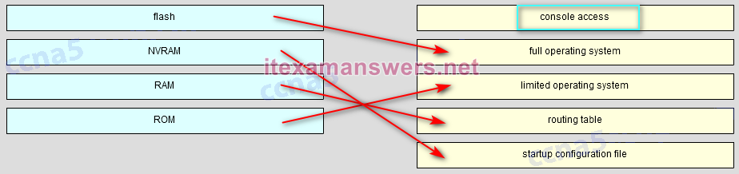

**Choices:**
- **A.** for hosts on other subnets to receive the information
- **B.** to notify other hosts not to request the same IP address
- **C.** for routers to fill their routing tables with this new information
- **D.** to notify other DHCP servers on the subnet that the IP address was leased
- **E.** ip dhcp excluded-address 192.168.100.1 192.168.100.10 ip dhcp excluded-address 192.168.100.254 ip dhcp pool LAN POOL-100 network 192.168.100.0 255.255.255.0 ip default gateway 192.168.100.1
- **F.** ip dhcp excluded-address 192.168.100.1 192.168.100.9 ip dhcp excluded-address 192.168.101.254 ip dhcp pool LAN POOL-100 ip network 192.168.100.0 255.255.254.0 ip default-gateway 192.168.100.1
- **G.** ip dhcp excluded-address 192.168.100.1 192.168.100.10 ip dhcp excluded-address 192.168.101.254 ip dhcp pool LAN POOL-100 network 192.168.100.0 255.255.254.0 default-router 192.168.100.1
- **H.** dhcp pool LAN-POOL 100 ip dhcp excluded-address 192.168.100.1 192.168.100.9 ip dhcp excluded-address 192.168.100.254 network 192.168.100.0 255.255.254.0 default-router 192.168.101.1
- **I.** ip dhcp pool
- **J.** ip address dhcp
- **K.** service dhcp
- **L.** ip helper-address
- **M.** The default gateway address is not provided in the pool.
- **N.** No clients have communicated with the DHCPv6 server yet.
- **O.** The IPv6 DHCP pool configuration has no IPv6 address range specified.
- **P.** The state is not maintained by the DHCPv6 server under stateless DHCPv6 operation.
- **Q.** A DHCP server must be installed on the same LAN as the host that is receiving the IP address.
- **R.** R1 is not configured as a DHCPv4 server.​
- **S.** The ip address dhcp command was not issued on the interface Gi0/1.
- **T.** The ip helper-address command was applied on the wrong interface.
- **U.** ipv6 unicast-routing
- **V.** ipv6 nd other-config-flag
- **W.** ipv6 dhcp server LAN1
- **X.** prefix-delegation 2001:DB8:8::/48 00030001000E84244E70
- **Y.** dns-server 2001:DB8:8::8
- **Z.** 10.130.5.76
- **[.** 209.165.200.245
- **\.** 203.0.113.5
- **].** 172.16.1.10
- **^.** 192.0.2.1
- **_.** 209.165.200.226
- **`.** Telnet
- **a.** IPsec
- **b.** HTTP
- **c.** ICMP
- **d.** DNS
- **e.** The host with the address 209.165.200.235 will respond to requests by using a source address of 209.165.200.235
- **f.** The output is the result of the show ip nat translations command
- **g.** Traffic with the destination address of a public web server will be sourced from the IP of 192.168.1.10.
- **h.** The host with the address 209.165.200.235 will respond to requests by using a source address of 192.168.10.10.
- **i.** The output is the result of the show ip nat statistics command
- **j.** NAT-POOL2 is bound to the wrong ACL
- **k.** The ACL does not define the list of addresses to be translated.
- **l.** The overload keyword should not have been applied.
- **m.** The static NAT entry is missing
- **n.** an IPv4 address pool
- **o.** an ACL to identify the local IPv4 address of the web server
- **p.** the keyword overload for the ip nat inside source command
- **q.** the ip nat inside source command to link the inside local and inside global addresses
- **r.** ip nat inside source static tcp 209.165.200.225 443 10.18.7.5 443 ip nat inside source static udp 209.165.200.225 4365 10.18.7.5 4365
- **s.** No additional configuration is necessary
- **t.** ip nat pool mktv 10.18.7.5 10.18.7.5
- **u.** ip nat inside source static tcp 10.18.7.5 443 209.165.200.225 443 ip nat inside source static udp 10.18.7.5 4365 209.165.200.225 4365
- **v.** ip nat outside source static 10.18.7.5 209.165.200.225
- **w.** static NAT with a NAT pool
- **x.** static NAT with one entry
- **y.** dynamic NAT with a pool of two public IP addresses
- **z.** PAT using an external interface
- **{.** The inside and outside NAT interlaces have been configured backwards
- **|.** The inside global address is not on the same subnet as the ISP
- **}.** The address on Fa0/0 should be 64.100.0.1.
- **~.** The NAT source access list matches the wrong address range.
- **.** show port-security
- **€.** show ip interface
- **.** show ip protocols
- **‚.** show mac-address-table
- **ƒ.** show cdp neighbors
- **„.** The NTP master will claim to be synchronized at the configured stratum number.
- **….** An NTP server with a higher stratum number will become the master.
- **†.** Other systems will be willing to synchronize to that master using NTP.
- **‡.** The NTP master will be the clock with 1 as its stratum number.
- **ˆ.** The NTP master will lower its stratum number.
- **‰.** to specify the destinations of captured messages
- **Š.** to periodically poll agents for data
- **‹.** to select the type of logging information that is captured
- **Œ.** to gather logging information for monitoring and troubleshooting
- **.** to provide traffic analysis
- **Ž.** to provide statistics on packets that are flowing through a Cisco device
- **.** host B
- **.** host C
- **‘.** host D
- **’.** host E
- **“.** host F
- **”.** host G
- **•.** This is an error message that indicates the system is unusable.
- **–.** This is an alert message for which immediate action is needed
- **—.** This is an error message for which warning conditions exist
- **˜.** This is a notification message for a normal but significant condition
- **™.** Software Claim Certificate
- **š.** Unique Device Identifier
- **›.** End User License Agreement
- **œ.** Product Activation Key
- **.** 192.168.10.2
- **ž.** 192.168.11.252
- **Ÿ.** 192.168.11.254
- ** .** 192.168.9.254
- **¡.** 192.168.10.1
- **¢.** access-list 1 permit 10.0.0.0 0.255.255.255 ip nat inside source list 1 interface serial 0/0/0 overload
- **£.** access-list 1 permit 10.0.0.0 0.255.255.255 ip nat pool comp 192.168.2.1 192.168.2.8 netmask 255.255.255.240 ip nat inside source list 1 pool comp
- **¤.** access-list 1 permit 10.0.0.0 0.255.255.255 ip nat pool comp 192.168.2.1 192.168.2.8 netmask 255.255.255.240 ip nat inside source list 1 pool comp overload
- **¥.** access-list 1 permit 10.0.0.0 0.255.255.255 ip nat pool comp 192.168.2.1 192.168.2.8 netmask 255.255.255.240 ip nat inside source list 1 pool comp overload ip nat inside source static 10.0.0.5 209.165.200.225

**Correct Answer:**
to notify other DHCP servers on the subnet that the IP address was leased; ip dhcp excluded-address 192.168.100.1 192.168.100.10 ip dhcp excluded-address 192.168.101.254 ip dhcp pool LAN POOL-100 network 192.168.100.0 255.255.254.0 default-router 192.168.100.1; ip address dhcp; The state is not maintained by the DHCPv6 server under stateless DHCPv6 operation.; The ip helper-address command was applied on the wrong interface.; ipv6 nd other-config-flag; 203.0.113.5; IPsec; The output is the result of the show ip nat translations command; The host with the address 209.165.200.235 will respond to requests by using a source address of 192.168.10.10.; NAT-POOL2 is bound to the wrong ACL; the ip nat inside source command to link the inside local and inside global addresses; ip nat inside source static tcp 10.18.7.5 443 209.165.200.225 443 ip nat inside source static udp 10.18.7.5 4365 209.165.200.225 4365; PAT using an external interface; The inside global address is not on the same subnet as the ISP; show cdp neighbors; The NTP master will claim to be synchronized at the configured stratum number.; Other systems will be willing to synchronize to that master using NTP.; to specify the destinations of captured messages; to select the type of logging information that is captured; to gather logging information for monitoring and troubleshooting; host C; host D; host F; This is a notification message for a normal but significant condition; Product Activation Key; 192.168.11.252; access-list 1 permit 10.0.0.0 0.255.255.255 ip nat inside source list 1 interface serial 0/0/0 overload

**Explanation:**
The DHCPREQUEST message is broadcast to inform other DHCP servers that an IP address has been leased. 39. Which set of commands will configure a router as a DHCP server that will assign IPv4 addresses to the 192.168.100.0/23 LAN while reserving the first 10 and the last addresses for static assignment? The /23 prefix is equivalent to a network mask of 255.255.254.0. The network usable IPv4 address range is 192.168.100.1 to 192.168.101.254 inclusive. The commands dhcp pool, ip default-gateway, and ip network are not valid DHCP configuration commands. 40. Which command, when issued in the interface configuration mode of a router, enables the interface to acquire an IPv4 address automatically from an ISP, when that link to the ISP is enabled? The ip address dhcp interface configuration command configures an Ethernet interface as a DHCP client. The service dhcp global configuration command enables the DHCPv4 server process on the router. The ip helper-address command is issued to enable DHCP relay on the router. The ip dhcp pool command creates the name of a pool of addresses that the server can assign to hosts. 41. Refer to the exhibit. A network administrator is configuring a router as a DHCPv6 server. The administrator issues a show ipv6 dhcp pool command to verify the configuration. Which statement explains the reason that the number of active clients is 0? Under the stateless DHCPv6 configuration, indicated by the command ipv6 nd other-config-flag, the DHCPv6 server does not maintain the state information, because client IPv6 addresses are not managed by the DHCP server. Because the clients will configure their IPv6 addresses by combining the prefix/prefix-length and a self-generated interface ID, the ipv6 dhcp pool configuration does not need to specify the valid IPv6 address range. And because clients will use the link-local address of the router interface as the default gateway address, the default gateway address is not necessary. 42. Refer to the exhibit. R1 has been configured as shown. However, PC1 is not able to receive an IPv4 address. What is the problem?​ The ip helper-address command has to be applied on interface Gi0/0. This command must be present on the interface of the LAN that contains the DHCPv4 client PC1 and must be directed to the correct DHCPv4 server. 43. Refer to the exhibit. Which statement shown in the output allows router R1 to respond to stateless DHCPv6 requests? The interface command ipv6 nd other-config-flag allows RA messages to be sent on this interface, indicating that additional information is available from a stateless DHCPv6 server. 44. Refer to the exhibit. NAT is configured on Remote and Main. The PC is sending a request to the web server. What IPv4 address is the source IP address in the packet between Main and the web server? Because the packet is between Main and the web server, the source IP address is the inside global address of PC, 203.0.113.5. 45. Which type of traffic would most likely have problems when passing through a NAT device? IPsec protocols often perform integrity checks on packets when they are received to ensure that they have not been changed in transit from the source to the destination. Because NAT changes values in the headers as packets pass from inside to outside, these integrity checks can fail, thus causing the packets to be dropped at the destination. 46. Refer to the exhibit. Which two statements are correct based on the output as shown in the exhibit? (Choose two.) The output displayed in the exhibit is the result of the show ip nat translations command. Static NAT entries are always present in the NAT table, while dynamic entries will eventually time out. 47. Refer to the exhibit. A network administrator has configured R2 for PAT. Why is the configuration incorrect? In the exhibit, NAT-POOL 2 is bound to ACL 100, but it should be bound to the configured ACL 1. This will cause PAT to fail. 100, but it should be bound to the configured ACL 1. This will cause PAT to fail. 48. A small company has a web server in the office that is accessible from the Internet. The IP address 192.168.10.15 is assigned to the web server. The network administrator is configuring the router so that external clients can access the web server over the Internet. Which item is required in the NAT configuration? A static NAT configuration is necessary for a web server that is accessible from the Internet. The configuration is achieved via an ip nat inside source static command under the global configuration mode. An IP address pool and an ACL are necessary when configuring dynamic NAT and PAT. The keyword overload is used to configure PAT. 49. A college marketing department has a networked storage device that uses the IP address 10.18.7.5, TCP port 443 for encryption, and UDP port 4365 for video streaming. The college already uses PAT on the router that connects to the Internet. The router interface has the public IP address of 209.165.200.225/30. The IP NAT pool currently uses the IP addresses ranging from 209.165.200.228-236. Which configuration would the network administrator add to allow this device to be accessed by the marketing personnel from home? This scenario requires port forwarding because the storage device has a private address and needs to be accessible from the external network. To configure port forwarding, the ip nat inside source static command is used. 50. Refer to the exhibit. Based on the output that is shown, what type of NAT has been implemented? The output shows that there are two inside global addresses that are the same but that have different port numbers. The only time port numbers are displayed is when PAT is being used. The same output would be indicative of PAT that uses an address pool. PAT with an address pool is appropriate when more than 4,000 simultaneous translations are needed by the company. 51. Refer to the exhibit. An administrator is trying to configure PAT on R1, but PC-A is unable to access the Internet. The administrator tries to ping a server on the Internet from PC-A and collects the debugs that are shown in the exhibit. Based on this output, what is most likely the cause of the problem? The output of debug ip nat shows each packet that is translated by the router. The “s” is the source IP address of the packet and the “d” is the destination. The address after the arrow (“->”) shows the translated address. In this case, the translated address is on the 209.165.201.0 subnet but the ISP facing interface is in the 209.165.200.224/27 subnet. The ISP may drop the incoming packets, or might be unable to route the return packets back to the host because the address is in an unknown subnet. 52. A network engineer is interested in obtaining specific information relevant to the operation of both distribution and access layer Cisco devices. Which command provides common information relevant to both types of devices? In this case the show cdp neigbors command is the only command that will provide information relevant to both distribution and access layer devices. The show mac-address-table and show port-security commands will display information that is more related to access layer operations. The show ip protocols and show ip interface commands will display information more related to routing and network layer functions performed by devices in the distribution layer. 53. Which two statements are correct if a configured NTP master on a network cannot reach any clock with a lower stratum number? (Choose two.) If the network NTP master cannot reach any clock with a lower stratum number, the system will claim to be synchronized at the configured stratum number, and other systems will be willing to synchronize to it using NTP. 54. What are three functions provided by the syslog service? (Choose three.) There are three primary functions provided by the syslog service: 1. gathering logging information 2. selection of the type of information to be logged selection of the destination of the logged information 55. Refer to the exhibit. Which three hosts will receive ARP requests from host A, assuming that port Fa0/4 on both switches is configured to carry traffic for multiple VLANs? (Choose three.) ARP requests are sent out as broadcasts. That means the ARP request is sent only throughout a specific VLAN. VLAN 1 hosts will only hear ARP requests from hosts on VLAN 1. VLAN 2 hosts will only hear ARP requests from hosts on VLAN 2. 56. Refer to the exhibit. An administrator is examining the message in a syslog server. What can be determined from the message? The number 5 in the message output %SYS-5-CONFIG_I, indicated this is a notification level message that is for normal but significant conditions. 57. When a customer purchases a Cisco IOS 15.0 software package, what serves as the receipt for that customer and is used to obtain the license as well? A customer who purchases a software package will receive a Product Activation Key (PAK) that serves as a receipt and is used to obtain the license for the software package. 58. Refer to the exhibit. The network administrator enters these commands into the R1 router: When the router prompts for an address or remote host name, what IP address should the administrator enter at the prompt? The requested address is the address of the TFTP server. A TFTP server is an application that can run on a multitude of network devices including a router, server, or even a networked PC. 59. Which configuration would be appropriate for a small business that has the public IP address of 209.165.200.225/30 assigned to the external interface on the router that connects to the Internet? With the command, ip nat inside source list 1 interface serial 0/0/0 overload, the router is configured to translate internal private IP addresses in the range of 10.0.0.0/8 to a single public IP address, 209.165.200.225/30. The other options will not work, because the IP addresses defined in the pool, 192.168.2.0/28, are not routable on the Internet. 60. Match the router memory type that provides the primary storage for the router feature. (Not all options are used.) Explain: Console access – Even though the commands a technician types while connected to the console port will be held in RAM, console access itself does not match a memory type. Flash – holds the full operating system. NVRAM – holds the startup configuration file. RAM – holds the running configuration (commands as they are being typed, ARP cache, and the routing table). ROM – holds a small, limited functionality operating system.

---

## Question 11

**Question:**
Match each borderless switched network principle to its description. (Not all options are used) resiliency -> This provides “always-on” dependability hierarchical -> Layers minimize the number of devices on any one tier that share a single point of failure modularity -> Each layer has specific roles and functions that can scale easily flexibility -> This shares the network traffic load across all network resources none -> This provides quality of service and additional security

**Images:**
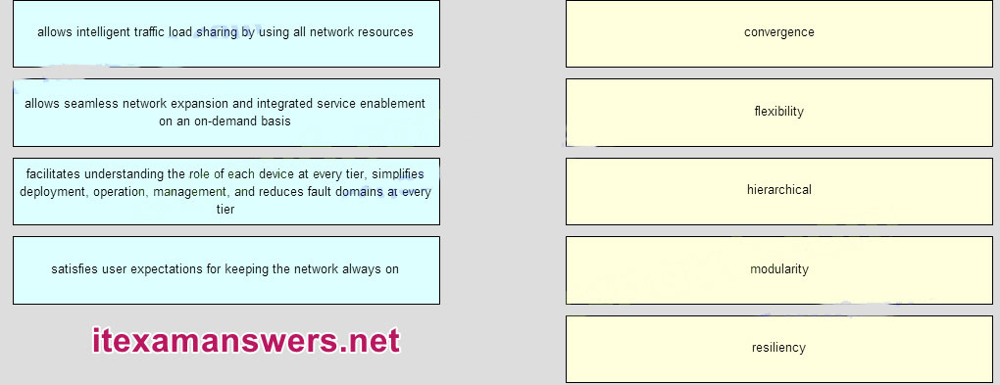
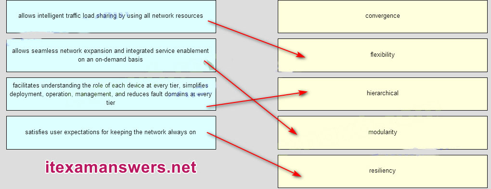

---

## Question 12

**Question:**
Match the description to the correct VLAN type. (Not all options are used ) Answers:

**Images:**
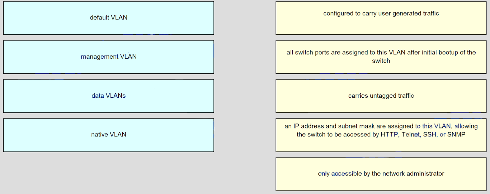
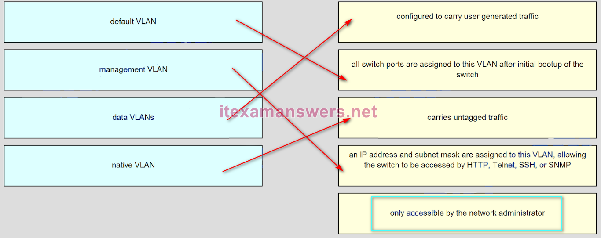
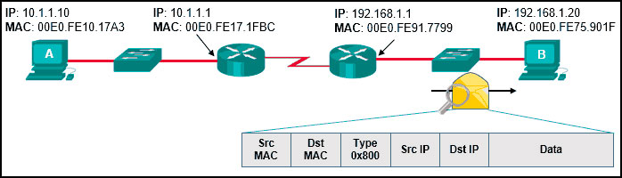

**Choices:**
- **A.** Source MAC: 00E0.FE91.7799 Source IP: 192.168.1.1
- **B.** Source MAC: 00E0.FE10.17A3 Source IP: 10.1.1.10
- **C.** Source MAC: 00E0.FE91.7799 Source IP: 10.1.1.10
- **D.** Source MAC: 00E0.FE10.17A3 Source IP: 192.168.1.1
- **E.** Source MAC: 00E0.FE91.7799 Source IP: 10.1.1.1
- **F.** It allows sites to use private IPv6 addresses and translates them to global IPv6 addresses.
- **G.** It allows sites to connect multiple IPv4 hosts to the Internet via the use of a single public IPv4 address.
- **H.** It allows sites to connect IPv6 hosts to an IPv4 network by translating the IPv6 addresses to IPv4 addresses.
- **I.** It allows sites to use private IPv4 addresses, and thus hides the internal addressing structure from hosts on public IPv4 networks.
- **J.** to assign the router to the all-nodes multicast group
- **K.** to enable the router as an IPv6 router
- **L.** to permit only unicast packets on the router
- **M.** to prevent the router from joining the all-routers multicast group
- **N.** It backs up a route already discovered by a dynamic routing protocol.
- **O.** It uses a single network address to send multiple static routes to one destination address.
- **P.** It identifies the gateway IP address to which the router sends all IP packets for which it does not have a learned or static route
- **Q.** It is configured with a higher administrative distance than the original dynamic routing protocol has.

**Correct Answer:**
Source MAC: 00E0.FE91.7799 Source IP: 10.1.1.10; It allows sites to connect IPv6 hosts to an IPv4 network by translating the IPv6 addresses to IPv4 addresses.; to enable the router as an IPv6 router; It identifies the gateway IP address to which the router sends all IP packets for which it does not have a learned or static route

**Explanation:**
A data VLAN is configured to carry user-generated traffic. A default VLAN is the VLAN where all switch ports belong after the initial boot up of a switch loading the default configuration. A native VLAN is assigned to an 802.1Q trunk port, and untagged traffic is placed on it. A management VLAN is any VLAN that is configured to access the management capabilities of a switch. An IP address and subnet mask are assigned to it, allowing the switch to be managed via HTTP, Telnet, SSH, or SNMP. 63. Refer to the exhibit. Host A has sent a packet to host B. What will be the source MAC and IP addresses on the packet when it arrives at host B? As a packet traverses the network, the Layer 2 addresses will change at every hop as the packet is de-encapsulated and re-encapsulated, but the Layer 3 addresses will remain the same. 64. What benefit does NAT64 provide? NAT64 is a temporary IPv6 transition strategy that allows sites to use IPv6 addresses and still be able to connect to IPv4 networks. This is accomplished by translating the IPv6 addresses into IPv4 addresses before sending the packets onto the IPv4 network. 65. What is the effect of configuring the ipv6 unicast-routing command on a router? When the ipv6 unicast-routing command is implemented on a router, it enables the router as an IPv6 router. Use of this command also assigns the router to the all-routers multicast group. 66. What is a characteristic of a static route that creates a gateway of last resort? A default static route is a route that matches all packets. It identifies the gateway IP address to which the router sends all IP packets for which it does not have a learned or static route. A default static route is simply a static route with 0.0.0.0/0 as the destination IPv4 address. Configuring a default static route creates a gateway of last resort.

---

## Question 13

**Question:**
Match each borderless switched network principle to its description. (Not all options are used.)

**Images:**
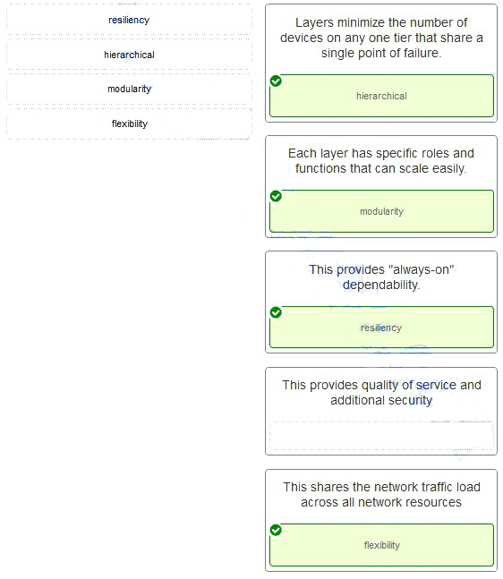
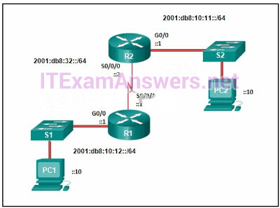
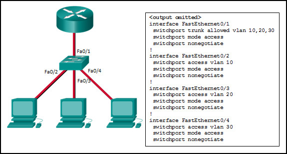
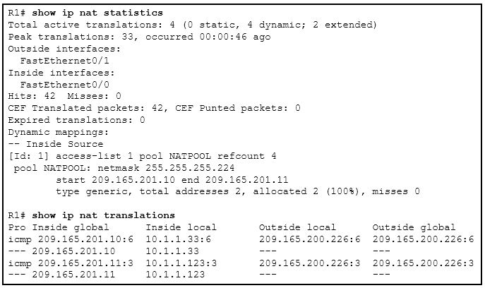
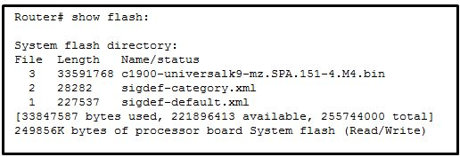
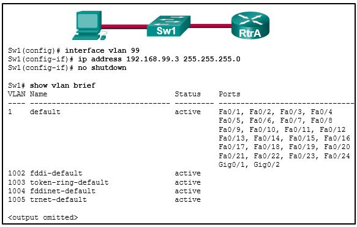
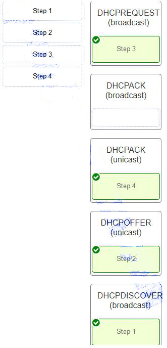

**Choices:**
- **A.** Layers minimize the number of devices on any one tier that share a single point of failure. –> hierarchical
- **B.** Each layer has specific roles and functions that can scale easily. –> modularity
- **C.** This provides “always-on” dependability –> resiliency
- **D.** This provides quality of service and additional security –> (empty)
- **E.** This shares the network traffic load across all network resources –> flexibility
- **F.** R2(config)# ipv6 route 2001:db8:10:12::/64 2001:db8:32::1
- **G.** R2(config)# ipv6 route 2001:db8:10:12::/64 S0/0/0
- **H.** R2(config)# ipv6 route ::/0 2001:db8:32::1
- **I.** R2(config)# ipv6 route 2001:db8:10:12::/64 S0/0/1
- **J.** a network design where the access and distribution layers are collapsed into a single layer
- **K.** a network design where the access and core layers are collapsed into a single layer
- **L.** a collapsed core network design
- **M.** a three-tier campus network design where the access, distribution, and core are all separate layers, each one with very specific functions
- **N.** the destination MAC address and the incoming port
- **O.** the destination MAC address and the outgoing port
- **P.** the source and destination MAC addresses and the incoming port
- **Q.** the source and destination MAC addresses and the outgoing port
- **R.** the source MAC address and the incoming port
- **S.** the source MAC address and the outgoing port
- **T.** collision detecting
- **U.** frame error checking
- **V.** faster frame forwarding
- **W.** frame forwarding using IPv4 Layer 3 and 4 information
- **X.** Frames are forwarded without any error checking.
- **Y.** Error-free fragments are forwarded, so switching accurs with lower latency.
- **Z.** Buffering is used to support different Ethernet speeds.
- **[.** Only outgoing frames are checked for errors.
- **\.** The number of broadcast domains is increased.
- **].** The size of the broadcast domain is increased.
- **^.** The number of collision domains is reduced.
- **_.** The size of the collision domain is increased.
- **`.** shutdown no shutdown
- **a.** shutdown no switchport port-security
- **b.** shutdown no switchport port-security violation shutdown
- **c.** shutdown no switchport port-security maximum
- **d.** Designed to carry traffic that is generated by users, this type of VLAN is also known as the default VLAN.
- **e.** The native VLAN traffic will be untagged across the trunk link.
- **f.** This VLAN is necessary for remote management of a switch.
- **g.** High priority traffic, such as voice traffic, uses the native VLAN.
- **h.** The native VLAN provides a common identifier to both ends of a trunk.
- **i.** management
- **j.** user-generated
- **k.** tagged
- **l.** untagged
- **m.** These VLANs are default VLANs that cannot be removed.
- **n.** These VLANs cannot be deleted unless the switch is in VTP client mode.
- **o.** These VLANs can only be removed from the switch by using the no vlan 10 and no vlan 100 commands.
- **p.** Because these VLANs are stored in a file that is called vlan.dat that is located in flash memory, this file must be manually deleted.
- **q.** The access interfaces do not have IP addresses and each should be configured with an IP address.
- **r.** The switch interface FastEthernet0/1 is configured as an access interface and should be configured as a trunk interface.
- **s.** The switch interface FastEthernet0/1 is configured to not negotiate and should be configured to negotiate.​
- **t.** The switch interfaces FastEthernet0/2, FastEthernet0/3, and FastEthernet0/4 are configured to not negotiate and should be configured to negotiate.
- **u.** 172.16.20.2
- **v.** 172.16.26.254
- **w.** 172.16.36.255
- **x.** 172.16.47.254
- **y.** 172.16.48.5
- **z.** The NAT pool has been exhausted.
- **{.** The wrong netmask was used on the NAT pool.
- **|.** Access-list 1 has not been configured properly.
- **}.** The inside and outside interfaces have been configured backwards.
- **~.** System messages will be forwarded to the number following the logging trap argument.
- **.** System messages that exist in levels 4-7 must be forwarded to a specific logging server.
- **€.** System messages that match logging levels 0-4 will be forwarded to a specified logging device.
- **.** System messages will be forwarded using a SNMP version that matches the argument that follows the logging trap command.
- **‚.** a maintenance deployment release
- **ƒ.** a minor release
- **„.** a mainline release
- **….** an extended maintenance release
- **†.** 25574400 bytes
- **‡.** 249856000 bytes
- **ˆ.** 221896413 bytes
- **‰.** 33591768 bytes
- **Š.** because there is a cabling problem on VLAN 99
- **‹.** because VLAN 99 is not a valid management VLAN
- **Œ.** because VLAN 1 is up and there can only be one management VLAN on the switch
- **.** because VLAN 99 needs to be entered as a VLAN under an interface before it can become an active interface
- **Ž.** because the VLAN 99 has not been manually entered into the VLAN database with the vlan 99 command
- **.** DHCPREQUEST (broadcast) –> Step 3
- **.** DHCPACK (broadcast) –> (empty)
- **‘.** DHCPACK (unicast) –> Step 4
- **’.** DHCPOFFER (unicast) –> Step 2
- **“.** DHCPDISCOVER (broadcast) –> Step 1

**Correct Answer:**
Layers minimize the number of devices on any one tier that share a single point of failure. –> hierarchical; Each layer has specific roles and functions that can scale easily. –> modularity; This provides “always-on” dependability –> resiliency; This shares the network traffic load across all network resources –> flexibility; R2(config)# ipv6 route 2001:db8:10:12::/64 S0/0/0; a collapsed core network design; the source MAC address and the incoming port; frame error checking; Frames are forwarded without any error checking.; The size of the broadcast domain is increased.; shutdown no shutdown; The native VLAN traffic will be untagged across the trunk link.; The native VLAN provides a common identifier to both ends of a trunk.; untagged; Because these VLANs are stored in a file that is called vlan.dat that is located in flash memory, this file must be manually deleted.; The switch interface FastEthernet0/1 is configured as an access interface and should be configured as a trunk interface.; 172.16.36.255; 172.16.47.254; The NAT pool has been exhausted.; System messages that match logging levels 0-4 will be forwarded to a specified logging device.; an extended maintenance release; 221896413 bytes; because VLAN 99 needs to be entered as a VLAN under an interface before it can become an active interface; because the VLAN 99 has not been manually entered into the VLAN database with the vlan 99 command

**Explanation:**
Borderless switched networks deploy devices hierarchically in specific layers or tiers, each with specific roles. Each layer can be viewed as a module whose services can be replicated or expanded as needed. This modularity allows the network to change and grow with user needs, provides a resilient structure to keep services “always on,” and has the flexibility to share the traffic load across all network resources. 68. Refer to the exhibit. Which command will properly configure an IPv6 static route on R2 that will allow traffic from PC2 to reach PC1 without any recursive lookups by router R2? A nonrecursive route must have an exit interface specified from which the destination network can be reached. In this example 2001:db8:10:12::/64 is the destination network and R2 will use exit interface S0/0/0 to reach that network. Therefore, the static route would be ipv6 route 2001:db8:10:12::/64 S0/0/0. 69. Which network design may be recommended for a small campus site that consists of a single building with a few users? In some cases, maintaining a separate distribution and core layer is not required. In smaller campus locations where there are fewer users who are accessing the network or in campus sites that consist of a single building, separate core and distribution layers may not be needed. In this scenario, the recommendation is the alternate two-tier campus network design, also known as the collapsed core network design. 70. Which information does a switch use to keep the MAC address table information current? To maintain the MAC address table, the switch uses the source MAC address of the incoming packets and the port that the packets enter. The destination address is used to select the outgoing port. 71. Which advantage does the store-and-forward switching method have compared with the cut-through switching method? A switch using the store-and-forward switching method performs an error check on an incoming frame by comparing the FCS value against its own FCS calculations after the entire frame is received. In comparison, a switch using the cut-through switching method makes quick forwarding decisions and starts the forwarding process without waiting for the entire frame to be received. Thus a switch using cut-through switching may send invalid frames to the network. The performance of store-and-forward switching is slower compared to cut-through switching performance. Collision detection is monitored by the sending device. Store-and-forward switching does not use IPv4 Layer 3 and 4 information for its forwarding decisions. 72. Which characteristic describes cut-through switching? Cut-through switching reduces latency by forwarding frames as soon as the destination MAC address and the corresponding switch port are read from the MAC address table. This switching method does not perform any error checking and does not use buffers to support different Ethernet speeds. Error checking and buffers are characteristics of store-and-forward switching. 73. What is a result of connecting two or more switches together? When two or more switches are connected together, the size of the broadcast domain is increased and so is the number of collision domains. The number of broadcast domains is increased only when routers are added. 74. Which commands are used to re-enable a port that has been disabled as a result of a port security violation? When a switch security violation occurs, by default the port enters in the error-disable state and the port does not become active again automatically if the condition that triggered the violation disappears. 75. Which two characteristics describe the native VLAN? (Choose two.) The native VLAN is assigned to 802.1Q trunks to provide a common identifier to both ends of the trunk link. Whatever VLAN native number is assigned to a port, or if the port is the default VLAN of 1, the port does not tag any frame in that VLAN as the traffic travels across the trunk. At the other end of the link, the receiving device that sees no tag knows the specific VLAN number because the receiving device must have the exact native VLAN number. The native VLAN should be an unused VLAN that is distinct from VLAN1, the default VLAN, as well as other VLANs. Data VLANs, also known as user VLANs, are configured to carry user-generated traffic, with the exception of high priority traffic, such as VoIP. Voice VLANs are configured for VoIP traffic. The management VLAN is configured to provide access to the management capabilities of a switch. 76. Which type of traffic is designed for a native VLAN? A native VLAN carries untagged traffic, which is traffic that does not come from a VLAN. A data VLAN carries user-generated traffic. A management VLAN carries management traffic. 77. An administrator is trying to remove configurations from a switch. After using the command erase startup-config and reloading the switch, the administrator finds that VLANs 10 and 100 still exist on the switch. Why were these VLANs not removed? Standard range VLANs (1-1005) are stored in a file that is called vlan.dat that is located in flash memory. Erasing the startup configuration and reloading a switch does not automatically remove these VLANs. The vlan.dat file must be manually deleted from flash memory and then the switch must be reloaded. 78. Refer to the exhibit. Inter-VLAN communication between VLAN 10, VLAN 20, and VLAN 30 is not successful. What is the problem? To forward all VLANs to the router, the switch interface Fa0/1 must be configured as a trunk interface with the switchport mode trunk command. 79. A network administrator is configuring an ACL with the command access-list 10 permit 172.16.32.0 0.0.15.255. Which IPv4 address matches the ACE? With the wildcard mask of 0.0.15.255, the IPv4 addresses that match the ACE are in the range of 172.16.32.0 to 172.16.47.255. 80. Refer to the exhibit. A PC at address 10.1.1.45 is unable to access the Internet. What is the most likely cause of the problem? The output of show ip nat statistics shows that there are 2 total addresses and that 2 addresses have been allocated (100%). This indicates that the NAT pool is out of global addresses to give new clients. Based on the show ip nat translations, PCs at 10.1.1.33 and 10.1.1.123 have used the two available addresses to send ICMP messages to a host on the outside network. 81. A network administrator is verifying a configuration that involves network monitoring. What is the purpose of the global configuration command logging trap 4? System messages that match logging levels 0-4 will be forwarded to a specified logging device via the command logging trap 4 and logging ip-address. 82. What is indicated by the M in the Cisco IOS image name c1900-universalk9-mz.SPA.153-3.M.bin? The file name c1900-universalk9-mz.SPA.153-3.M.bin indicates a version of Cisco IOS that includes the major release, minor release, maintenance release, and maintenance rebuild numbers. The M indicates this is an extended maintenance release. 83. Refer to the exhibit. A network engineer is preparing to upgrade the IOS system image on a Cisco 2901 router. Based on the output shown, how much space is available for the new image? There are 221896413 bytes of space available in flash for the new image according to the line “[33847587 bytes used, 221896413 available, 255744000 total]” from the output. 84. Refer to the exhibit. Based on the exhibited configuration and output, what are two reasons VLAN 99 missing? (Choose two.) VLAN 99 was not manually created on switch Sw1. When a VLAN interface is created, the VLAN is not automatically populated into the VLAN database 85. Order the DHCP process steps. (Not all options are used.)

---

## Question 14

**Question:**
Refer to the exhibit. Assuming that the routing tables are up to date and no ARP messages are needed, after a packet leaves H1, how many times is the L2 header rewritten in the path to H3?

**Images:**
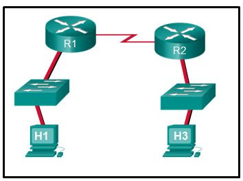
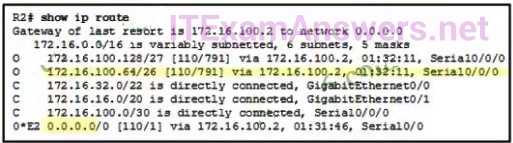

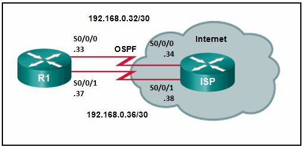
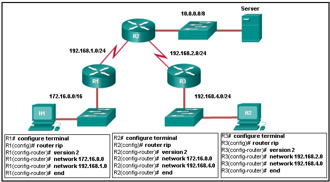

**Choices:**
- **A.** 1
- **B.** 2
- **C.** 3
- **D.** 4
- **E.** 5
- **F.** 6
- **G.** 0.0.0.0
- **H.** 172.16.100.64
- **I.** 172.16.100.2
- **J.** 110
- **K.** 791
- **L.** stub router connection to the rest of the corporate or campus network
- **M.** any router where a backup route to dynamic routing is needed for reliability
- **N.** edge router connection to the ISP
- **O.** any router running an IOS prior to 12.0
- **P.** the router that serves as the gateway of last resort
- **Q.** R2(config)# ip route 172.16.2.1 255.255.255.0 172.16.3.1
- **R.** R2(config)# ip route 172.16.2.0 255.255.255.0 172.16.2.254
- **S.** R2(config)# ip route 172.16.2.0 255.255.255.0 172.16.3.1
- **T.** R2(config)# ip route 172.16.3.0 255.255.255.0 172.16.2.254
- **U.** Add an administrative distance of 254.
- **V.** Change the destination network and mask to 0.0.0.0 0.0.0.0
- **W.** Change the exit interface to S0/0/1.
- **X.** Add the next-hop neighbor address of 209.165.200.226.
- **Y.** Add the next hop neighbor address of 192.168.0.36.
- **Z.** Change the administrative distance to 1.
- **[.** Change the destination network to 192.168.0.34.
- **\.** Change the administrative distance to 120.
- **].** RIPv2 does not support VLSM.
- **^.** RIPv2 is misconfigured on router R1.
- **_.** RIPv2 is misconfigured on router R2.
- **`.** RIPv2 is misconfigured on router R3.
- **a.** RIPv2 does not support discontiguous networks.
- **b.** Another switch was connected to this switch port with the wrong cable.
- **c.** An unauthorized user tried to telnet to the switch through switch port Fa0/8.
- **d.** NAT was enabled on a router, and a private IP address arrived on switch port Fa0/8.
- **e.** A host with an invalid IP address was connected to a switch port that was previously unused.
- **f.** Port security was enabled on the switch port, and an unauthorized connection was made on switch port Fa0/8.

**Correct Answer:**
2; 172.16.100.64; stub router connection to the rest of the corporate or campus network; edge router connection to the ISP; R2(config)# ip route 172.16.2.0 255.255.255.0 172.16.3.1; Change the destination network and mask to 0.0.0.0 0.0.0.0; Change the administrative distance to 120.; RIPv2 is misconfigured on router R2.; Port security was enabled on the switch port, and an unauthorized connection was made on switch port Fa0/8.

**Explanation:**
H1 creates the first Layer 2 header. The R1 router has to examine the destination IP address to determine how the packet is to be routed. If the packet is to be routed out another interface, as is the case with R1, the router strips the current Layer 2 header and attaches a new Layer 2 header. When R2 determines that the packet is to be sent out the LAN interface, R2 removes the Layer 2 header received from the serial link and attaches a new Ethernet header before transmitting the packet. 87. Refer to the exhibit. Which highlighted value represents a specific destination network in the routing table? 172.16.100.64 is a destination network. 110 is the administrative distance used by default for the OSPF routing protocol. 791 is the calculated OSPF metric. 172.16.100.2 represents the next-hop IP address used to reach the 172.16.100.64 network. 0.0.0.0 is the default route used to send packets when a destination network is not listed in the routing table. 88. On which two routers would a default static route be configured? (Choose two.) A stub router or an edge router connected to an ISP has only one other router as a connection. A default static route works in those situations because all traffic will be sent to one destination. The destination router is the gateway of last resort. The default route is not configured on the gateway, but on the router sending traffic to the gateway. The router IOS does not matter. 89. The exhibit shows two PCs called PC A and PC B, two routes called R1 and R2, and two switches. PC A has the address 172.16.1.1/24 and is connected to a switch and into an interface on R1 that has the IP address 172.16.1.254. PC B has the address 172.16.2.1/24 and is connected to a switch that is connected to another interface on R1 with the IP address 172.16.2.254. The serial interface on R1 has the address 172.16.3.1 and is connected to the serial interface on R2 that has the address 172.16.3.2/24. R2 is connected to the internet cloud. Which command will create a static route on R2 in order to reach PC B? The correct syntax is: router(config)# ip route destination-network destination-mask {next-hop-ip-address | exit-interface} If the local exit interface instead of the next-hop IP address is used then the route will be displayed as a directly connected route instead of a static route in the routing table. Because the network to be reached is 172.16.2.0 and the next-hop IP address is 172.16.3.1, the command is R2(config)# ip route 172.16.2.0 255.255.255.0 172.16.3.1 90. Refer to the exhibit. R1 was configured with the static route command ip route 209.165.200.224 255.255.255.224 S0/0/0 and consequently users on network 172.16.0.0/16 are unable to reach resources on the Internet. How should this static route be changed to allow user traffic from the LAN to reach the Internet? The static route on R1 has been incorrectly configured with the wrong destination network and mask. The correct destination network and mask is 0.0.0.0 0.0.0.0. 91. Refer to the exhibit. Router R1 has an OSPF neighbor relationship with the ISP router over the 192.168.0.32 network. The 192.168.0.36 network link should serve as a backup when the OSPF link goes down. The floating static route command ip route 0.0.0.0 0.0.0.0 S0/0/1 100 was issued on R1 and now traffic is using the backup link even when the OSPF link is up and functioning. Which change should be made to the static route command so that traffic will only use the OSPF link when it is up? ​ The problem with the current floating static route is that the administrative distance is set too low. The administrative distance will need to be higher than that of OSPF, which is 110, so that the router will only use the OSPF link when it is up. 92. Refer to the exhibit. All hosts and router interfaces are configured correctly. Pings to the server from both H1 and H2 and pings between H1 and H2 are not successful. What is causing this problem? RIP configuration on a router should contain network statements for connected networks only. Remote networks are learned from routing updates from other routers. 93. What caused the following error message to appear? 01:11:12: %PM-4-ERR_DISABLE: psecure-violation error detected on Fa0/8, putting Fa0/8 in err-disable state 01:11:12: %PORT_SECURITY-2-PSECURE_VIOLATION: Security violation occurred, caused by MAC address 0011.a0d4.12a0 on port FastEthernet0/8. 01:11:13: %LINEPROTO-5-UPDOWN: Line protocol on Interface FastEthernet0/8, changed state to down 01:11:14: %LINK-3-UPDOWN: Interface FastEthernet0/8, changed state to down

---

## Question 15

**Question:**
Refer to the exhibit. A small business uses VLANs 2, 3, 4, and 5 between two switches that have a trunk link between them. What native VLAN should be used on the trunk if Cisco best practices are being implemented?

**Images:**
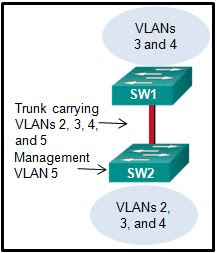

**Choices:**
- **A.** 1
- **B.** 2
- **C.** 3
- **D.** 4
- **E.** 5
- **F.** 6
- **G.** 11
- **H.** They are numbered VLANs 1002 to 1005.
- **I.** They cannot be used across multiple switches.
- **J.** They are reserved to support Token Ring VLANs.
- **K.** They are not stored in the vlan.dat file.
- **L.** Switch(config)# interface gigabitethernet 1/1 Switch(config-if)# spanning-tree vlan 1
- **M.** Switch(config)# interface gigabitethernet 1/1 Switch(config-if)# spanning-tree portfast
- **N.** Switch(config)# interface gigabitethernet 1/1 Switch(config-if)# switchport mode trunk
- **O.** Switch(config)# interface gigabitethernet 1/1 Switch(config-if)# switchport access vlan 1
- **P.** Traffic that is destined for 172.16.4.1 and 172.16.4.5 will be dropped by the router.
- **Q.** Traffic will not be routed from clients with addresses between 172.16.4.1 and 172.16.4.5.
- **R.** The DHCP server function of the router will not issue the addresses from 172.16.4.1through 172.16.4.5 inclusive.
- **S.** The router will ignore all traffic that comes from the DHCP servers with addresses 172.16.4.1 and 172.16.4.5.

**Correct Answer:**
6; They are not stored in the vlan.dat file.; Switch(config)# interface gigabitethernet 1/1 Switch(config-if)# switchport mode trunk; The DHCP server function of the router will not issue the addresses from 172.16.4.1through 172.16.4.5 inclusive.

**Explanation:**
Cisco recommends using a VLAN that is not used for anything else for the native VLAN. The native VLAN should also not be left to the default of VLAN 1. VLAN 6 is the only VLAN that is not used and not VLAN 1. 95. Which statement describes a characteristic of the extended range VLANs that are created on a Cisco 2960 switch? The extended range VLANs are identified by VLAN ID 1006 to 4096. By default, they are saved in the running-config file, not in the vlan.dat file. VLANs 1002 to 1005 are reserved to support Token Ring and FDDI VLANs. The extended range VLANs can be manually configured on multiple switches. 96. A network administrator is using the router-on-a-stick method to configure inter-VLAN routing. Switch port Gi1/1 is used to connect to the router. Which command should be entered to prepare this port for the task? With the router-on-a-stick method, the switch port that connects to the router must be configured as trunk mode. This can be done with the command Switch(config-if)# switchport mode trunk. The other options do not put the switch port into trunk mode. 97. What will be the result of adding the command ip dhcp excluded-address 172.16.4.1 172.16.4.5 to the configuration of a local router that has been configured as a DHCP server?

---

## Question 16

**Question:**
A host on the 10.10.100.0/24 LAN is not being assigned an IPv4 address by an enterprise DHCP server with the address 10.10.200.10/24. What is the best way for the network engineer to resolve this problem?

**Images:**
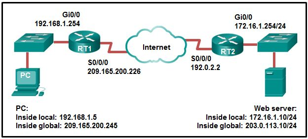
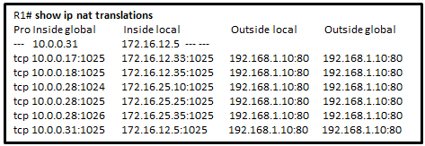

**Choices:**
- **A.** Issue the command ip helper-address 10.10.200.10 on the router interface that is the 10.10.100.0/24 gateway.
- **B.** Issue the command default-router 10.10.200.10 at the DHCP configuration prompt on the 10.10.100.0/24 LAN gateway router.
- **C.** Issue the command ip helper-address 10.10.100.0 on the router interface that is the 10.10.200.0/24 gateway.
- **D.** Issue the command network 10.10.200.0 255.255.255.0 at the DHCP configuration prompt on the 10.10.100.0/24 LAN gateway router.
- **E.** the MAC address of the IPv6 enabled interface
- **F.** a randomly generated 64-bit hexadecimal address
- **G.** an IPv6 address that is provided by a DHCPv6 server
- **H.** an IPv4 address that is configured on the interface
- **I.** 192.0.2.2
- **J.** 172.16.1.10
- **K.** 203.0.113.10
- **L.** 172.16.1.254
- **M.** 192.168.1.5
- **N.** 209.165.200.245
- **O.** 10.0.0.31
- **P.** 172.16.12.5
- **Q.** 172.16.12.33
- **R.** 192.168.1.10
- **S.** 172.16.25.35
- **T.** It is a key for enabling an IOS feature set.
- **U.** It is a proprietary encryption algorithm.
- **V.** It is a compression file type used when installing IOS 15 or an IOS upgrade.
- **W.** It is a way to compress an existing IOS so that a newer IOS version can be co-installed on a router.

**Correct Answer:**
Issue the command ip helper-address 10.10.200.10 on the router interface that is the 10.10.100.0/24 gateway.; the MAC address of the IPv6 enabled interface; 209.165.200.245; 172.16.25.35; It is a key for enabling an IOS feature set.

**Explanation:**
The DHCP server is not on the same network as the hosts, so DHCP relay agent is required. This is achieved by issuing the ip helper-address command on the interface of the router that contains the DHCPv4 clients, in order to direct DHCP messages to the DHCPv4 server IP address. 99. What is used in the EUI-64 process to create an IPv6 interface ID on an IPv6 enabled interface? The EUI-64 process uses the MAC address of an interface to construct an interface ID (IID). Because the MAC address is only 48 bits in length, 16 additional bits (FF:FE) must be added to the MAC address to create the full 64-bit interface ID. 100. Refer to the exhibit. NAT is configured on RT1 and RT2. The PC is sending a request to the web server. What IPv4 address is the source IP address in the packet between RT2 and the web server? Because the packet is between RT2 and the web server, the source IP address is the inside global address of PC, 209.165.200.245. 101. Refer to the exhibit. A company has an internal network of 172.16.25.0/24 for their employee workstations and a DMZ network of 172.16.12.0/24 to host servers. The company uses NAT when inside hosts connect to outside network. A network administrator issues the show ip nat translations command to check the NAT configurations. Which one of source IPv4 addresses is translated by R1 with PAT? From the output, three IPv4 addresses (172.16.25.10, 172.16.25.25, and 172.16.25.35) are translated into the same IPv4 address (10.0.0.28) with three different ports, thus these three IPv4 addresses are translated with PAT. The IPv4 addresses 172.16.12.33 and 172.16.12.35 are translated with dynamic NAT. The IPv4 address 172.16.12.5 is translated with static NAT. 102. What is the purpose of the Cisco PAK? PAK is a product activation key from Cisco. To activate a particular technology package for IOS 15, you must provide Cisco with the router product ID with associated serial number and a PAK that has been purchased.

---

## Question 17

**Question:**
As part of the new security policy, all switches on the network are configured to automatically learn MAC addresses for each port. All running configurations are saved at the start and close of every business day. A severe thunderstorm causes an extended power outage several hours after the close of business. When the switches are brought back online, the dynamically learned MAC addresses are retained. Which port security configuration enabled this?

**Choices:**
- **A.** auto secure MAC addresses
- **B.** dynamic secure MAC addresses
- **C.** static secure MAC addresses
- **D.** sticky secure MAC addresses
- **E.** off
- **F.** restrict
- **G.** protect
- **H.** shutdown

**Correct Answer:**
sticky secure MAC addresses; protect

**Explanation:**
With sticky secure MAC addressing, the MAC addresses can be either dynamically learned or manually configured and then stored in the address table and added to the running configuration file. In contrast, dynamic secure MAC addressing provides for dynamically learned MAC addressing that is stored only in the address table. 104. A network administrator is configuring port security on a Cisco switch. The company security policy specifies that when a violation occurs, packets with unknown source addresses should be dropped and no notification should be sent. Which violation mode should be configured on the interfaces? On a Cisco switch, an interface can be configured for one of three violation modes, specifying the action to be taken if a violation occurs: Protect – Packets with unknown source addresses are dropped until a sufficient number of secure MAC addresses are removed, or the number of maximum allowable addresses is increased. There is no notification that a security violation has occurred. Restrict – Packets with unknown source addresses are dropped until a sufficient number of secure MAC addresses are removed, or the number of maximum allowable addresses is increased. In this mode, there is a notification that a security violation has occurred. Shutdown – The interface immediately becomes error-disabled and the port LED is turned off. Version 5:

---

## Question 18

**Question:**
What is the major release number in the IOS image name c1900-universalk9-mz.SPA.152-3.T.bin?

**Choices:**
- **A.** 2
- **B.** 15
- **C.** 3
- **D.** 52
- **E.** 1900
- **F.** 17

**Correct Answer:**
15

**Explanation:**
The part of the image name 152-3 indicates that the major release is 15, the minor release is 2, and the new feature release is 3.

---

## Question 19

**Question:**
What is the reason that an ISP commonly assigns a DHCP address to a wireless router in a SOHO environment?

**Choices:**
- **A.** better connectivity
- **B.** easy IP address management
- **C.** better network performance
- **D.** easy configuration on ISP firewall

**Correct Answer:**
easy IP address management

**Explanation:**
In a SOHO environment, a wireless router connects to the ISP via a DSL or cable modem. The IP address between the wireless router and ISP site is typically assigned by the ISP through DHCP. This method facilitates the IP addressing management in that IP addresses for clients are dynamically assigned so that if a client is dropped, the assigned IP address can be easily reassigned to another client.

---

## Question 20

**Question:**
Refer to the exhibit. What does the number 17:46:26:143 represent?

**Images:**
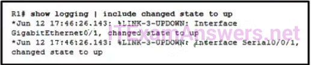

**Choices:**
- **A.** The time passed since the syslog server has been started
- **B.** the time when the syslog massage was issued
- **C.** the time on the router when the show logging command was issued
- **D.** the time pass since the interfaces have been up

**Correct Answer:**
the time when the syslog massage was issued

---

## Question 21

**Question:**
What statement describes a Cisco IOS image with the “universalk9_npe” designation for Cisco ISR G2 routers?

**Choices:**
- **A.** It is an IOS version that provides only the IPBase feature set.
- **B.** It is an IOS version that, at the request of some countries, removes any strong cryptographic functionality.​
- **C.** It is an IOS version that offers all of the Cisco IOS Software feature sets.
- **D.** It is an IOS version that can only be used in the United States of America.

**Correct Answer:**
It is an IOS version that, at the request of some countries, removes any strong cryptographic functionality.​

**Explanation:**
To support Cisco ISR G2 platforms, Cisco provides two types of universal images. The images with the “universalk9_npe” designation in the image name do not support any strong cryptography functionality such as payload cryptography to satisfy the import requirements of some countries. The “universalk9_npe” images include all other Cisco IOS software features.

---

## Question 22

**Question:**
Refer to the exhibit. Routers R1 and R2 are connected via a serial link. One router is configured as the NTP master, and the other is an NTP client. Which two pieces of information can be obtained from the partial output of the show ntp associations detail command on R2? (Choose two. )

**Images:**
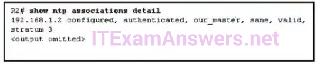

**Choices:**
- **A.** Both routers are configured to use NTPv2.
- **B.** Router R1 is the master, and R2 is the client.
- **C.** Router R2 is the master, and R1 is the client.
- **D.** The IP address of R1 is 192. 168. 1. 2.
- **E.** The IP address of R2 is 192. 168. 1. 2.

**Correct Answer:**
Router R1 is the master, and R2 is the client.; The IP address of R2 is 192. 168. 1. 2.

---

## Question 23

**Question:**
A network administrator configures a router with the command sequence: R1(config)# boot system tftp://c1900-universalk9-mz.SPA.152-4.M3.bin R1(config)# boot system rom What is the effect of the command sequence?

**Choices:**
- **A.** The router will copy the IOS image from the TFTP server and then reboot the system.
- **B.** The router will load IOS from the TFTP server. If the image fails to load, it will load the IOS image from ROM
- **C.** The router will search and load a valid IOS image in the sequence of flash, TFTP, and ROM.
- **D.** On next reboot, the router will load the IOS image from ROM.

**Correct Answer:**
The router will load IOS from the TFTP server. If the image fails to load, it will load the IOS image from ROM

---

## Question 24

**Question:**
What is used as the default event logging destination for Cisco routers and switches?

**Choices:**
- **A.** syslog server
- **B.** console line
- **C.** terminal line
- **D.** workstation

**Correct Answer:**
console line

**Explanation:**
By default, Cisco routers and switches send event messages to the console. Various IOS versions will also send their event messages to the buffer by default. Specific commands must be implemented to allow logging to other locations.

---

## Question 25

**Question:**
Refer to the exhibit. Which two ACLs would permit only the two LAN networks attached to R2 to access the network that connects to R1 G0/0 interface? (Choose two.)

**Images:**
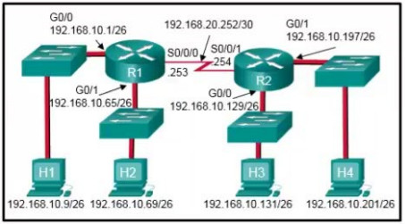

**Choices:**
- **A.** access-list 4 permit 192.168.10.0 0.0.0.255
- **B.** access-list 1 permit 192.168.10.128 0.0.0.127
- **C.** access-list 2 permit host 192.168.10.131 access-list 2 permit host 192.168.10.201
- **D.** access-list 5 permit 192.168.10.128 0.0.0.63 access-list 5 permit 192.168.10.192 0.0.0.63
- **E.** access-list 3 permit 192.168.10.128 0.0.0.63

**Correct Answer:**
access-list 2 permit host 192.168.10.131 access-list 2 permit host 192.168.10.201; access-list 5 permit 192.168.10.128 0.0.0.63 access-list 5 permit 192.168.10.192 0.0.0.63

---

## Question 26

**Question:**
A network administrator configures a router to provide stateful DHCPv6 operation. However, users report that workstations do not receive IPv6 addresses within the scope. Which configuration command should be checked to ensure that statefull DHCPv6 is implemented?

**Choices:**
- **A.** The dns-server line is included in the ipv6 dhcp pool section.
- **B.** The ipv6 nd managed-config-flag is entered for the interface facing the LAN segment.
- **C.** The ipv6 nd other-config-flag is entered for the interface facing the LAN segment.
- **D.** The domain-name line is included in the ipv6 dhcp pool section.

**Correct Answer:**
The dns-server line is included in the ipv6 dhcp pool section.

---

## Question 27

**Question:**
Which kind of message is sent by a DHCP client when its IP address lease has expired?​

**Choices:**
- **A.** a DHCPDISCOVER broadcast message
- **B.** a DHCPREQUEST broadcast message​
- **C.** a DHCPREQUEST unicast message​
- **D.** a DHCPDISCOVER unicast message​

**Correct Answer:**
a DHCPREQUEST unicast message​

**Explanation:**
When the IP address lease time of the DHCP client expires, it sends a DHCPREQUEST unicast message directly to the DHCPv4 server that originally offered the IPv4 address.

---

## Question 28

**Question:**
What is a disadvantage of NAT?

**Choices:**
- **A.** There is no end-to-end addressing.
- **B.** The router does not need to alter the checksum of the IPv4 packets.​
- **C.** The internal hosts have to use a single public IPv4 address for external communication.
- **D.** The costs of readdressing hosts can be significant for a publicly addressed network.​

**Correct Answer:**
There is no end-to-end addressing.

**Explanation:**
Many Internet protocols and applications depend on end-to-end addressing from the source to the destination. Because parts of the header of the IP packets are modified, the router needs to alter the checksum of the IPv4 packets. Using a single public IP address allows for the conservation of legally registered IP addressing schemes. If an addressing scheme needs to be modified, it is cheaper to use private IP addresses.

---

## Question 29

**Question:**
Refer to the exhibit. The Gigabit interfaces on both routers have been configured with subinterface numbers that match the VLAN numbers connected to them. PCs on VLAN 10 should be able to print to the P1 printer on VLAN 12. PCs on VLAN 20 should print to the printers on VLAN 22. What interface and in what direction should you place a standard ACL that allows printing to P1 from data VLAN 10, but stops the PCs on VLAN 20 from using the P1 printer? (Choose two.)

**Images:**
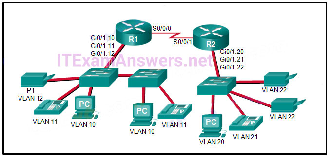

**Choices:**
- **A.** R1 Gi0/1.12
- **B.** R1 S0/0/0
- **C.** R2 S0/0/1
- **D.** R2 Gi0/1.20
- **E.** inbound
- **F.** outbound

**Correct Answer:**
R1 Gi0/1.12; outbound

**Explanation:**
A standard access list is commonly placed as close to the destination network as possible because access control expressions in a standard ACL do not include information about the destination network. The destination in this example is printer VLAN 12 which has router R1 Gigabit subinterface 0/1/.12 as its gateway. A sample standard ACL that only allows printing from data VLAN 10 (192.168.10.0/24), for example, and no other VLAN would be as follows: Copy R1(config)# access-list 1 permit 192.168.10.0 0.0.0.255 R1(config)# access-list 1 deny any R1(config)# interface gigabitethernet 0/1.12 R1(config-if)# ip access-group 1 out

---

## Question 30

**Question:**
Which two packet filters could a network administrator use on an IPv4 extended ACL? (Choose two.)

**Choices:**
- **A.** destination MAC address
- **B.** ICMP message type
- **C.** computer type
- **D.** source TCP hello address
- **E.** destination UDP port number

**Correct Answer:**
ICMP message type; destination UDP port number

**Explanation:**
Extended access lists commonly filter on source and destination IPv4 addresses and TCP or UDP port numbers. Additional filtering can be provided for protocol types.

---

## Question 31

**Question:**
A network administrator is explaining to a junior colleague the use of the lt and gt keywords when filtering packets using an extended ACL. Where would the lt or gt keywords be used?

**Choices:**
- **A.** in an IPv6 extended ACL that stops packets going to one specific destination VLAN
- **B.** in an IPv4 named standard ACL that has specific UDP protocols that are allowed to be used on a specific server
- **C.** in an IPv6 named ACL that permits FTP traffic from one particular LAN getting to another LAN
- **D.** in an IPv4 extended ACL that allows packets from a range of TCP ports destined for a specific network device

**Correct Answer:**
in an IPv4 extended ACL that allows packets from a range of TCP ports destined for a specific network device

**Explanation:**
The lt and gt keywords are used for defining a range of port numbers that are less than a particular port number or greater than a particular port number.

---

## Question 32

**Question:**
Which three values or sets of values are included when creating an extended access control list entry? (Choose three.)

**Choices:**
- **A.** access list number between 1 and 99
- **B.** access list number between 100 and 199
- **C.** default gateway address and wildcard mask
- **D.** destination address and wildcard mask
- **E.** source address and wildcard mask
- **F.** source subnet mask and wildcard mask
- **G.** destination subnet mask and wildcard mask

**Correct Answer:**
access list number between 100 and 199; destination address and wildcard mask; source address and wildcard mask

---

## Question 33

**Question:**
A network administrator is adding ACLs to a new IPv6 multirouter environment. Which IPv6 ACE is automatically added implicitly at the end of an ACL so that two adjacent routers can discover each other?

**Choices:**
- **A.** permit ip any any
- **B.** permit ip any host ip_address
- **C.** permit icmp any any nd-na
- **D.** deny ip any any

**Correct Answer:**
permit icmp any any nd-na

---

## Question 34

**Question:**
Refer to the exhibit. How did the router obtain the last route that is shown?

**Images:**
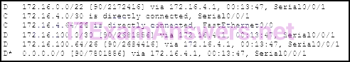

**Choices:**
- **A.** The ip route command was used.
- **B.** The ipv6 route command was used.
- **C.** Another router in the same organization provided the default route by using a dynamic routing protocol.
- **D.** The ip address interface configuration mode command was used in addition to the network routing protocol configuration mode command.

**Correct Answer:**
Another router in the same organization provided the default route by using a dynamic routing protocol.

**Explanation:**
A default route is presented in EIGRP with an asterisk (*) and the 0.0.0.0/0 entry. The route was learned through EIGRP and the Serial0/0/1 interface on the router.

---

## Question 35

**Question:**
Which statement is correct about IPv6 routing?

**Choices:**
- **A.** IPv6 routing is enabled by default on Cisco routers.
- **B.** IPv6 only supports the OSPF and EIGRP routing protocols.
- **C.** IPv6 routes appear in the same routing table as IPv4 routes.
- **D.** IPv6 uses the link-local address of neighbors as the next-hop address for dynamic routes.

**Correct Answer:**
IPv6 uses the link-local address of neighbors as the next-hop address for dynamic routes.

---

## Question 36

**Question:**
Refer to the exhibit. Which type of route is 172.16.0.0/16?

**Images:**
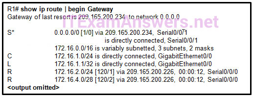

**Choices:**
- **A.** child route
- **B.** ultimate route
- **C.** default route
- **D.** level 1 parent route

**Correct Answer:**
level 1 parent route

**Explanation:**
A level 1 parent route displays the classful network address, the number of subnets, and the number of different subnet masks that the classful address has been subdivided into. It does not have an exit interface. A child route, ultimate route, and default route all have exit interfaces that are associated with them.

---

## Question 37

**Question:**
Refer to the exhibit. Which type of IPv6 static route is configured in the exhibit?

**Images:**
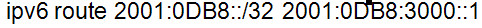

**Choices:**
- **A.** directly attached static route
- **B.** recursive static route
- **C.** fully specified static route
- **D.** floating static route

**Correct Answer:**
recursive static route

**Explanation:**
The route provided points to another address that must be looked up in the routing table. This makes the route a recursive static route.

---

## Question 38

**Question:**
Which summary IPv6 static route statement can be configured to summarize only the routes to networks 2001:db8:cafe::/58 through 2001:db8:cafe:c0::/58?

**Choices:**
- **A.** ipv6 route 2001:db8:cafe::/62 S0/0/0
- **B.** ipv6 route 2001:db8:cafe::/54 S0/0/0
- **C.** ipv6 route 2001:db8:cafe::/56 S0/0/0
- **D.** ipv6 route 2001:db8:cafe::/60 S0/0/0

**Correct Answer:**
ipv6 route 2001:db8:cafe::/56 S0/0/0

---

## Question 39

**Question:**
Refer to the exhibit. If RIPng is enabled, how many hops away does R1 consider the 2001:0DB8:ACAD:1::/64 network to be?

**Images:**
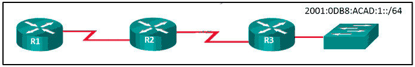

**Choices:**
- **A.** 1
- **B.** 2
- **C.** 3
- **D.** 4

**Correct Answer:**
3

---

## Question 40

**Question:**
Which statement is true about the difference between OSPFv2 and OSPFv3?

**Choices:**
- **A.** OSPFv3 routers use a different metric than OSPFv2 routers use.
- **B.** OSPFv3 routers use a 128 bit router ID instead of a 32 bit ID.
- **C.** OSPFv3 routers do not need to elect a DR on multiaccess segments.
- **D.** OSPFv3 routers do not need to have matching subnets to form neighbor adjacencies.

**Correct Answer:**
OSPFv3 routers do not need to have matching subnets to form neighbor adjacencies.

---

## Question 41

**Question:**
What happens immediately after two OSPF routers have exchanged hello packets and have formed a neighbor adjacency?

**Choices:**
- **A.** They exchange DBD packets in order to advertise parameters such as hello and dead intervals.
- **B.** They negotiate the election process if they are on a multiaccess network.
- **C.** They request more information about their databases.
- **D.** They exchange abbreviated lists of their LSDBs.

**Correct Answer:**
They exchange abbreviated lists of their LSDBs.

**Explanation:**
During the exchange of hello packets, OSPF routers negotiate the election process and set the OSPF parameters. DBD packets are exchanged after that step has been completed. DBD packets contain abbreviated lists of link-state information. After that information has been exchanged, OSPF routers exchange Type 3 LSR packets to request further information.

---

## Question 42

**Question:**
What does the cost of an OSPF link indicate?

**Choices:**
- **A.** A higher cost for an OSPF link indicates a faster path to the destination.
- **B.** Link cost indicates a proportion of the accumulated value of the route to the destination.
- **C.** Cost equals bandwidth.
- **D.** A lower cost indicates a better path to the destination than a higher cost does.

**Correct Answer:**
A lower cost indicates a better path to the destination than a higher cost does.

---

## Question 43

**Question:**
Which three pieces of information does a link-state routing protocol use initially as link-state information for locally connected links? (Choose three.)

**Choices:**
- **A.** the link router interface IP address and subnet mask
- **B.** the type of network link
- **C.** the link next-hop IP address
- **D.** the link bandwidth
- **E.** the cost of that link

**Correct Answer:**
the link router interface IP address and subnet mask; the type of network link; the cost of that link

---

## Question 44

**Question:**
Which three requirements are necessary for two OSPFv2 routers to form an adjacency? (Choose three.)

**Choices:**
- **A.** The OSPF hello or dead timers on each router must match.
- **B.** The link interface subnet masks must match.
- **C.** The OSPFv2 process ID must be the same on each router.
- **D.** The two routers must include the inter-router link network in an OSPFv2 network command.
- **E.** The OSPFv2 process is enabled on the interface by entering the ospf process area-id command.
- **F.** The link interface on each router must be configured with a link-local address.
- **G.** RouterA(config)# router ospf 0
- **H.** RouterA(config)# router ospf 1
- **I.** RouterA(config-router)# network 192.168.2.0 0.0.0.255 0
- **J.** RouterA(config-router)# network 192.168.2.0 0.0.0.255 area 0
- **K.** RouterA(config-router)# network 192.168.2.0 255.255.255.0 0

**Correct Answer:**
The OSPF hello or dead timers on each router must match.; The link interface subnet masks must match.; The two routers must include the inter-router link network in an OSPFv2 network command.; RouterA(config)# router ospf 1; RouterA(config-router)# network 192.168.2.0 0.0.0.255 area 0

**Explanation:**
The OSPFv2 process ID does not have to be the same on each router, and it is enabled globally, not separately on each interface. OSPFv3 (IPv6) uses link-local addresses to form an adjacency with a neighbor router, and requires the OSPF process to be enabled on the interface. 130. A router needs to be configured to route within OSPF area 0. Which two commands are required to accomplish this? (Choose two.)

---

## Question 45

**Question:**
What are two features of a link-state routing protocol? (Choose two.)

**Choices:**
- **A.** Routers send periodic updates only to neighboring routers.
- **B.** Routers send triggered updates in response to a change.
- **C.** Routers create a topology of the network by using information from other routers.
- **D.** The database information for each router is obtained from the same source.
- **E.** Paths are chosen based on the lowest number of hops to the designated router.

**Correct Answer:**
Routers send triggered updates in response to a change.; Routers create a topology of the network by using information from other routers.

---

## Question 46

**Question:**
Why would an administrator use a network security auditing tool to flood the switch MAC address table with fictitious MAC addresses?

**Choices:**
- **A.** to determine which ports are not correctly configured to prevent MAC address flooding
- **B.** to determine when the CAM table size needs to be increased in order to prevent overflows
- **C.** to determine if the switch is forwarding the broadcast traffic correctly
- **D.** to determine which ports are functioning

**Correct Answer:**
to determine which ports are not correctly configured to prevent MAC address flooding

---

## Question 47

**Question:**
Which problem is evident if the show ip interface command shows that the interface is down and the line protocol is down?

**Choices:**
- **A.** An encapsulation mismatch has occurred.
- **B.** A cable has not been attached to the port.
- **C.** The no shutdown command has not been issued on the interface.
- **D.** There is an IP address conflict with the configured address on the interface.

**Correct Answer:**
A cable has not been attached to the port.

**Explanation:**
If an interface has not been brought up with the no shutdown command, the interface status shows administratively down. A duplicate IP address will not bring an interface down. An encapsulation error is normally found using the show interfaces command.

---

## Question 48

**Question:**
While analyzing log files, a network administrator notices reoccurring native VLAN mismatches. What is the effect of these reoccurring errors?

**Choices:**
- **A.** All traffic on the error-occurring trunk port is being misdirected or dropped.
- **B.** The control and management traffic on the error-occurring trunk port is being misdirected or dropped.
- **C.** All traffic on the error-occurring trunk port is being switched correctly regardless of the error.
- **D.** Unexpected traffic on the error-occurring trunk port is being received.​

**Correct Answer:**
The control and management traffic on the error-occurring trunk port is being misdirected or dropped.

---

## Question 49

**Question:**
Which three pairs of trunking modes will establish a functional trunk link between two Cisco switches? (Choose three.)

**Choices:**
- **A.** dynamic desirable – dynamic desirable
- **B.** dynamic auto – dynamic auto
- **C.** dynamic desirable – dynamic auto
- **D.** dynamic desirable – trunk
- **E.** access – trunk
- **F.** access – dynamic auto

**Correct Answer:**
dynamic desirable – dynamic desirable; dynamic desirable – dynamic auto; dynamic desirable – trunk

**Explanation:**
Dynamic Trunking Protocol (DTP) manages trunk negotiation between Cisco switch ports on a point-to-point basis. Dynamic desirable is an active mode that initiates negotiation and will successfully establish a functional trunk when the neighbor is configured in trunk , dynamic desirable , or dynamic auto modes. In contrast, if both ends are in dynamic auto , they both wait passively for the other to initiate negotiation, resulting in a non-trunking access link instead.

---

## Question 50

**Question:**
What are two ways of turning off DTP on a trunk link between switches? (Choose two.)

**Choices:**
- **A.** Change the native VLAN on both ports.
- **B.** Configure attached switch ports with the dynamic desirable command option.
- **C.** Configure attached switch ports with the nonegotiate command option.
- **D.** Configure one port with the dynamic auto command option and the opposite attached switch port with the dynamic desirable command option.
- **E.** Place the two attached switch ports in access mode.

**Correct Answer:**
Configure attached switch ports with the nonegotiate command option.; Place the two attached switch ports in access mode.

---

## Question 51

**Question:**
On a switch that is configured with multiple VLANs, which command will remove only VLAN 100 from the switch?

**Choices:**
- **A.** Switch# delete flash:vlan.dat
- **B.** Switch(config-if)# no switchport access vlan 100
- **C.** Switch(config-if)# no switchport trunk allowed vlan 100
- **D.** Switch(config)# no vlan 100

**Correct Answer:**
Switch(config)# no vlan 100

**Explanation:**
To remove all VLANs from a switch, the delete flash:vlan.dat command would be used. To change the assigned VLAN for an interface, the no switchport access vlan 100 interface configuration command would be used. To remove VLAN 100 as an allowed VLAN on a trunk, the no switchport trunk allowed vlan 100 would be used, but this would not remove the VLAN from the switch. To delete a single VLAN, such as VLAN 100, the no vlan 100 global configuration command would be used.

---

## Question 52

**Question:**
What is the purpose of setting the native VLAN separate from data VLANs?

**Choices:**
- **A.** The native VLAN is for carrying VLAN management traffic only.
- **B.** The security of management frames that are carried in the native VLAN can be enhanced.
- **C.** A separate VLAN should be used to carry uncommon untagged frames to avoid bandwidth contention on data VLANs.
- **D.** The native VLAN is for routers and switches to exchange their management information, so it should be different from data VLANs.

**Correct Answer:**
A separate VLAN should be used to carry uncommon untagged frames to avoid bandwidth contention on data VLANs.

**Explanation:**
Routing and Switching Essentials 6.1.1 Overview of VLANs When a Cisco switch trunk port receives untagged frames (unusual in well-designed networks), it forwards these frames to the native VLAN. When the native VLAN is moved away from data VLANs, those untagged frames will not compete for bandwidth in the data VLANs. The native VLAN is not designed for carrying management traffic, but rather it is for backward compatibility with legacy LAN scenarios.

---

## Question 53

**Question:**
A network contains multiple VLANs spanning multiple switches. What happens when a device in VLAN 20 sends a broadcast Ethernet frame?

**Choices:**
- **A.** All devices in all VLANs see the frame.
- **B.** Devices in VLAN 20 and the management VLAN see the frame.
- **C.** Only devices in VLAN 20 see the frame.
- **D.** Only devices that are connected to the local switch see the frame.

**Correct Answer:**
Only devices in VLAN 20 see the frame.

**Explanation:**
VLANs create logical broadcast domains that can span multiple VLAN segments. Ethernet frames that are sent by a device on a specific VLAN can only be seen by other devices in the same VLAN.

---

## Question 54

**Question:**
Refer to the exhibit. The partial configuration that is shown was used to configure router on a stick for VLANS 10, 30, and 50. However, testing shows that there are some connectivity problems between the VLANs. Which configuration error is causing this problem?

**Images:**
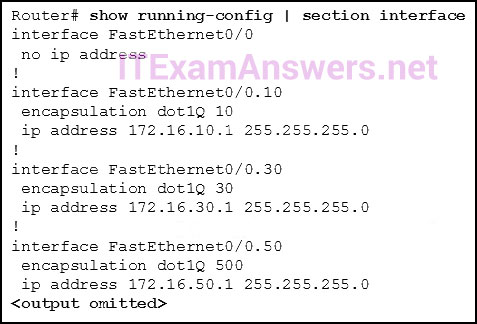

**Choices:**
- **A.** A configuration for the native VLAN is missing.
- **B.** There is no IP address configured for the FastEthernet 0/0 interface.
- **C.** The wrong VLAN has been configured on subinterface Fa0/0.50.​
- **D.** The VLAN IP addresses should belong to the same subnet.​

**Correct Answer:**
The wrong VLAN has been configured on subinterface Fa0/0.50.​

**Explanation:**
According to the configuration shown, the router was configured to use the wrong VLAN (500 instead of 50) on subinterface Fa0/0.50. This will prevent devices that are configured on VLAN 50 from communicating with subinterface Fa0/0.50. When configuring subinterfaces, the Fa0/0 interface has to be configured with no IP address, and each subinterface has to be assigned to a different subnet.

---

## Question 55

**Question:**
What is the purpose of an access list that is created as part of configuring IP address translation?

**Choices:**
- **A.** The access list defines the valid public addresses for the NAT or PAT pool.
- **B.** The access list defines the private IP addresses that are to be translated.
- **C.** The access list prevents external devices from being a part of the address translation.
- **D.** The access list permits or denies specific addresses from entering the device doing the translation.

**Correct Answer:**
The access list defines the private IP addresses that are to be translated.

---

## Question 56

**Question:**
Match the order in which the link-state routing process occurs on a router. (Not all options are used.) Question Answer Each router learns about its own directly connected networks. => Step 1 Each router is responsible for “saying hello” to its neighbors on directly connected networks. => Step 2 Each router builds a Link-State Packet (LSP) containing the state of each directly connected link => Step 3 Each router floods the LSP to all neighbors, who then store all LSPs received in a database => Step 4 Each router uses the database to construct a complete map of the topology and computes the best => Step 5

**Images:**
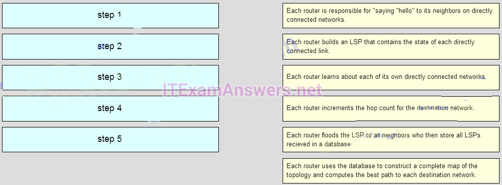
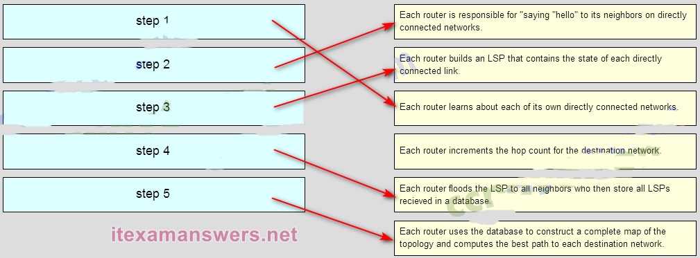

---

## Question 57

**Question:**
Beginning with the Cisco IOS Software Release 15.0, which license is a prerequisite for installing additional technology pack licenses?

**Choices:**
- **A.** UC
- **B.** IPBase
- **C.** SEC
- **D.** DATA

**Correct Answer:**
IPBase

**Explanation:**
Cisco IOS Software release 15.0 incorporates four technology packs. They are IPBase, DATA, UC (unified Communications), and SEC (Security). Having the IPBase license installed is a prerequisite for installing the other technology packs.

---

## Question 58

**Question:**
Refer to the exhibit. How many broadcast and collision domains exist in the topology?

**Images:**
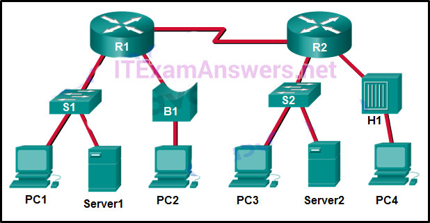

**Choices:**
- **A.** 10 broadcast domains and 5 collision domains
- **B.** 5 broadcast domains and 10 collision domains
- **C.** 5 broadcast domains and 11 collision domains
- **D.** 16 broadcast domains and 11 collision domains

**Correct Answer:**
5 broadcast domains and 10 collision domains

---

## Question 59

**Question:**
What is a function of the distribution layer?

**Choices:**
- **A.** fault isolation
- **B.** network access to the user
- **C.** high-speed backbone connectivity
- **D.** interconnection of large-scale networks in wiring closets

**Correct Answer:**
interconnection of large-scale networks in wiring closets

**Explanation:**
The distribution layer interacts between the access layer and the core by aggregating access layer connections in wiring closets, providing intelligent routing and switching, and applying access policies to access the rest of the network. Fault isolation and high-speed backbone connectivity are the primary functions of the core layer. The main function of the access layer is to provide network access to the user.

---

## Question 60

**Question:**
Fill in the blank. In IPv6, all routes are level __1__ ultimate routes.

**Explanation:**
IPv6 is classless by design, making all routes level 1 ultimate routes by default.

---

## Question 61

**Question:**
Fill in the blank. Static routes are configured by the use of the __ip route__ global configuration command.

---

## Question 62

**Question:**
Fill in the blank. The OSPF Type 1 packet is the __Hello__ packet.

---

## Question 63

**Question:**
Fill in the blank. The default administrative distance for a static route is __1__ .

---

## Question 64

**Question:**
When a Cisco switch receives untagged frames on a 802.1Q trunk port, which VLAN ID is the traffic switched to by default?

**Choices:**
- **A.** data VLAN ID
- **B.** native VLAN ID
- **C.** unused VLAN ID
- **D.** management VLAN ID

**Correct Answer:**
native VLAN ID

**Explanation:**
A native VLAN is used to forward untagged frames that are received on a Cisco switch 802.1Q trunk port. Untagged frames that are received on a trunk port are not forwarded to any other VLAN except the native VLAN.

---

## Question 65

**Question:**
Refer to the exhibit. A Layer 3 switch routes for three VLANs and connects to a router for Internet connectivity. Which two configurations would be applied to the switch? (Choose two.)

**Images:**
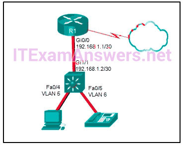

**Choices:**
- **A.** (config)# interface gigabitethernet 1/1 (config-if)# no switchport
- **B.** (config-if)# ip address 192.168.1.2 255.255.255.252 (config)# interface vlan 1 (config-if)# ip address 192.168.1.2 255.255.255.0 (config-if)# no shutdown
- **C.** (config)# interface gigabitethernet1/1 (config-if)# switchport mode trunk
- **D.** (config)# interface fastethernet0/4 (config-if)# switchport mode trunk
- **E.** (config)# ip routing

**Correct Answer:**
(config)# interface gigabitethernet 1/1 (config-if)# no switchport; (config)# ip routing

**Explanation:**
The no switchport command allows a switch port to be assigned an IP address. The port is a routed port at that point. The ip routing command enables routing for a switch. Use the interface vlan x command on the switch to configure routing for any VLAN that is attached to the switch, including the management VLAN. No management VLAN is shown in this scenario, but the commands interface vlan 5 and interface vlan 6, along with an appropriate IP address and subnet mask for each VLAN, would be used on the switch in the exhibit. There is no need to add an IP address or use the no shutdown command on VLAN 1 because VLAN 1 is not used in this design and because VLAN 1 is “up and up” by default.

---

## Question 66

**Question:**
How is the router ID for an OSPFv3 router determined?

**Choices:**
- **A.** the highest IPv6 address on an active interface
- **B.** the highest EUI-64 ID on an active interface
- **C.** the highest IPv4 address on an active interface
- **D.** the lowest MAC address on an active interface

**Correct Answer:**
the highest IPv4 address on an active interface

---

## Question 67

**Question:**
Which two statements are characteristics of routed ports on a multilayer switch? (Choose two.)

**Choices:**
- **A.** In a switched network, they are mostly configured between switches at the core and distribution layers.
- **B.** They support subinterfaces, like interfaces on the Cisco IOS routers.
- **C.** The interface vlan command has to be entered to create a VLAN on routed ports.
- **D.** They are used for point-to-multipoint links.
- **E.** They are not associated with a particular VLAN.

**Correct Answer:**
In a switched network, they are mostly configured between switches at the core and distribution layers.; They are not associated with a particular VLAN.

**Explanation:**
Routed ports are physical ports that act similarly to a router interface. They are not associated with a particular VLAN, they do not support subinterfaces, and they are used for point-to-point links. In a switched network, they are mostly configured between switches at the core and distribution layers. To configure routed ports, the no switchport interface command has to be used on the appropriate ports.

---

## Question 68

**Question:**
Match the switching characteristic to the correct term. (Not all options are used.) Answer

**Images:**
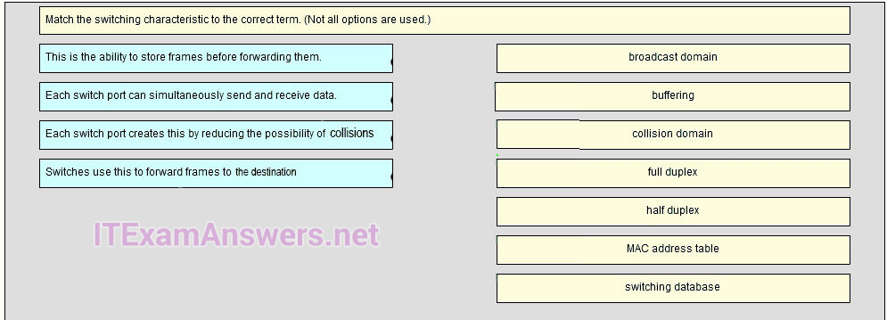

---

## Question 69

**Question:**
A small-sized company has 20 workstations and 2 servers. The company has been assigned a group of IPv4 addresses 209.165.200.224/29 from its ISP. What technology should the company implement in order to allow the workstations to access the services over the Internet?

**Choices:**
- **A.** static NAT
- **B.** dynamic NAT
- **C.** port address translation
- **D.** DHCP

**Correct Answer:**
dynamic NAT

---

## Question 70

**Question:**
What best describes the operation of distance vector routing protocols?

**Choices:**
- **A.** They use hop count as their only metric.
- **B.** They send their routing tables to directly connected neighbors.
- **C.** They flood the entire network with routing updates.
- **D.** They only send out updates when a new network is added.

**Correct Answer:**
They send their routing tables to directly connected neighbors.

---

## Question 71

**Question:**
Which three advantages are provided by static routing? (Choose three.)

**Choices:**
- **A.** The path a static route uses to send data is known.
- **B.** No intervention is required to maintain changing route information.
- **C.** Static routing does not advertise over the network, thus providing better security.
- **D.** Static routing typically uses less network bandwidth and fewer CPU operations than dynamic routing does.
- **E.** Configuration of static routes is error-free. Static routes scale well as the network grows.

**Correct Answer:**
The path a static route uses to send data is known.; Static routing does not advertise over the network, thus providing better security.; Static routing typically uses less network bandwidth and fewer CPU operations than dynamic routing does.

**Explanation:**
Static routes are prone to errors from incorrect configuration by the administrator. They do not scale well, because the routes must be manually reconfigured to accommodate a growing network. Intervention is required each time a route change is necessary. They do provide better security, use less bandwidth, and provide a known path to the destination.

---

## Question 72

**Question:**
When configuring a switch to use SSH for virtual terminal connections, what is the purpose of the crypto key generate rsa command?

**Choices:**
- **A.** show active SSH ports on the switch
- **B.** disconnect SSH connected hosts
- **C.** create a public and private key pair
- **D.** show SSH connected hosts
- **E.** access the SSH database configuration

**Correct Answer:**
create a public and private key pair

---

## Question 73

**Question:**
Open the PT Activity. Perform the tasks in the activity instructions and then answer the question. What is the problem preventing PC0 and PC1 from communicating with PC2 and PC3?

**Choices:**
- **A.** The routers are using different OSPF process IDs.
- **B.** The serial interfaces of the routers are in different subnets.
- **C.** No router ID has been configured on the routers.
- **D.** The gigabit interfaces are passive.

**Correct Answer:**
The serial interfaces of the routers are in different subnets.

---

## Question 74

**Question:**
Which two commands can be used to verify the content and placement of access control lists? (Choose two.)

**Choices:**
- **A.** show processes show cdp neighbor
- **B.** show access-lists
- **C.** show ip route
- **D.** show running-config

**Correct Answer:**
show access-lists; show running-config

**Explanation:**
If troubleshooting or verifying an ACL, an administrator needs to view the access list statements and verify what interface and direction is being used. Two commands that accomplish this task are show access-lists and show running-config .

---

## Question 75

**Question:**
Refer to the exhibit. What summary static address would be configured on R1 to advertise to R3?

**Images:**

**Choices:**
- **A.** 192.168.0.0/24
- **B.** 192.168.0.0/23
- **C.** 192.168.0.0/22
- **D.** 192.168.0.0/21

**Correct Answer:**
192.168.0.0/22

---

## Question 76

**Question:**
Which value represents the “trustworthiness” of a route and is used to determine which route to install into the routing table when there are multiple routes toward the same destination?

**Choices:**
- **A.** routing protocol
- **B.** outgoing interface
- **C.** metric
- **D.** administrative distance

**Correct Answer:**
administrative distance

**Explanation:**
The administrative distance represents the trustworthiness of a particular route. The lower an administrative distance, the more trustworthy the learned route is. When a router learns multiple routes toward the same destination, the router uses the administrative distance value to determine which route to place into the routing table. A metric is used by a routing protocol to compare routes received from the routing protocol. An exit interface is the interface used to send a packet in the direction of the destination network. A routing protocol is used to exchange routing updates between two or more adjacent routers.

---

## Question 77

**Question:**
Which type of router memory temporarily stores the running configuration file and ARP table?

**Choices:**
- **A.** flash
- **B.** NVRAM
- **C.** RAM
- **D.** ROM

**Correct Answer:**
RAM

---

## Question 78

**Question:**
Refer to the exhibit. If the switch reboots and all routers have to re-establish OSPF adjacencies, which routers will become the new DR and BDR?

**Images:**

**Choices:**
- **A.** Router R3 will become the DR and router R1 will become the BDR.
- **B.** Router R1 will become the DR and router R2 will become the BDR.
- **C.** Router R4 will become the DR and router R3 will become the BDR.

**Correct Answer:**
Router R4 will become the DR and router R3 will become the BDR.

---

## Question 79

**Question:**
Refer to the exhibit. The Branch Router has an OSPF neighbor relationship with the HQ router over the 198.51.0.4/30 network. The 198.51.0.8/30 network link should serve as a backup when the OSPF link goes down. The floating static route command ip route 0.0.0.0 0.0.0.0 S0/1/1 100 was issued on Branch and now traffic is using the backup link even when the OSPF link is up and functioning. Which change should be made to the static route command so that traffic will only use the OSPF link when it is up?

**Images:**

**Choices:**
- **A.** Add the next hop neighbor address of 198.51.0.8.
- **B.** Change the administrative distance to 1.
- **C.** Change the destination network to 198.51.0.5.
- **D.** Change the administrative distance to 120.

**Correct Answer:**
Change the administrative distance to 120.

**Explanation:**
The problem with the current floating static route is that the administrative distance is set too low. The administrative distance will need to be higher than that of OSPF, which is 110, so that the router will only use the OSPF link when it is up.

---

## Question 80

**Question:**
Refer to the exhibit. An attacker on PC X sends a frame with two 802.1Q tags on it, one for VLAN 40 and another for VLAN 12. What will happen to this frame?

**Choices:**
- **A.** SW-A will drop the frame because it is invalid.
- **B.** SW-A will leave both tags on the frame and send it to SW-B, which will forward it to hosts on VLAN 40.
- **C.** SW-A will remove both tags and forward the rest of the frame across the trunk link, where SW-B will forward the frame to hosts on VLAN 40.
- **D.** SW-A will remove the outer tag and send the rest of the frame across the trunk link, where SW-B will forward the frame to hosts on VLAN 12.

**Correct Answer:**
SW-A will remove both tags and forward the rest of the frame across the trunk link, where SW-B will forward the frame to hosts on VLAN 40.

---

## Question 81

**Question:**
A new network policy requires an ACL to deny HTTP access from all guests to a web server at the main office. All guests use addressing from the IPv6 subnet 2001:DB8:19:C::/64. The web server is configured with the address 2001:DB8:19:A::105/64. Implementing the NoWeb ACL on the interface for the guest LAN requires which three commands? (Choose three.)

**Choices:**
- **A.** permit tcp any host 2001:DB8:19:A::105 eq 80
- **B.** deny tcp host 2001:DB8:19:A::105 any eq 80
- **C.** deny tcp any host 2001:DB8:19:A::105 eq 80
- **D.** permit ipv6 any any
- **E.** deny ipv6 any any
- **F.** ipv6 traffic-filter NoWeb in
- **G.** ip access-group NoWeb in

**Correct Answer:**
deny tcp any host 2001:DB8:19:A::105 eq 80; permit ipv6 any any; ipv6 traffic-filter NoWeb in

---

## Question 82

**Question:**
An OSPF router has three directly connected networks; 172.16.0.0/16, 172.16.1.0/16, and 172.16.2.0/16. Which OSPF network command would advertise only the 172.16.1.0 network to neighbors?

**Choices:**
- **A.** router(config-router)# network 172.16.1.0 0.0.255.255 area 0
- **B.** router(config-router)# network 172.16.0.0 0.0.15.255 area 0
- **C.** router(config-router)# network 172.16.1.0 255.255.255.0 area 0
- **D.** router(config-router)# network 172.16.1.0 0.0.0.0 area 0

**Correct Answer:**
router(config-router)# network 172.16.1.0 0.0.0.0 area 0

**Explanation:**
To advertise only the 172.16.1.0/16 network the wildcard mask used in the network command must match the first 16-bits exactly. To match bits exactly, a wildcard mask uses a binary zero. This means that the first 16-bits of the wildcard mask must be zero. The low order 16-bits can all be set to 1.

---

## Question 83

**Question:**
Which subnet mask would be used as the classful mask for the IP address 192.135.250.27?

**Choices:**
- **A.** 255.0.0.0
- **B.** 255.255.0.0
- **C.** 255.255.255.0
- **D.** 255.255.255.224

**Correct Answer:**
255.255.255.0

---

## Question 84

**Question:**
Refer to the exhibit. A small business uses VLANs 8, 20, 25, and 30 on two switches that have a trunk link between them. What native VLAN should be used on the trunk if Cisco best practices are being implemented?

**Images:**

**Choices:**
- **A.** 5
- **B.** 8
- **C.** 20
- **D.** 25
- **E.** 30

**Correct Answer:**
5

**Explanation:**
Cisco recommends using a VLAN that is not used for anything else for the native VLAN. The native VLAN should also not be left to the default of VLAN 1. VLAN 5 is the only VLAN that is not used and not VLAN 1.

---

## Question 85

**Question:**
The buffers for packet processing and the running configuration file are temporarily stored in which type of router memory?

**Choices:**
- **A.** Flash
- **B.** NVRAM
- **C.** RAM
- **D.** ROM

**Correct Answer:**
RAM

**Explanation:**
RAM provides temporary storage for the running IOS, the running configuration file, the IP routing table, ARP table, and buffers for packet processing. In contrast, permanent storage of the IOS is provided by flash. NVRAM provides permanent storage of the startup configuration file, and ROM.provides permanent storage of the router bootup instructions and a limited IOS.

---

## Question 86

**Question:**
A standard ACL has been configured on a router to allow only clients from the 10.11.110.0/24 network to telnet or to ssh to the VTY lines of the router. Which command will correctly apply this ACL?

**Choices:**
- **A.** access-group 11 in
- **B.** access-class 11 in
- **C.** access-list 11 in
- **D.** access-list 110 in

**Correct Answer:**
access-class 11 in

---

## Question 87

**Question:**
Refer to the exhibit.What address will summarize the LANs attached to routers 2-A and 3-A and can be configured in a summary static route to advertise them to an upstream neighbor?

**Choices:**
- **A.** 10.0.0.0/24
- **B.** 10.0.0.0/23
- **C.** 10.0.0.0/22
- **D.** 10.0.0.0/21

**Correct Answer:**
10.0.0.0/21

---

## Question 88

**Question:**
A security specialist designs an ACL to deny access to a web server from all sales staff. The sales staff are assigned addressing from the IPv6 subnet 2001:db8:48:2c::/64. The web server is assigned the address 2001:db8:48:1c::50/64. Configuring the WebFilter ACL on the LAN interface for the sales staff will require which three commands? (Choose three.)

**Choices:**
- **A.** permit tcp any host 2001:db8:48:1c::50 eq 80
- **B.** deny tcp host 2001:db8:48:1c::50 any eq 80
- **C.** deny tcp any host 2001:db8:48:1c::50 eq 80
- **D.** permit ipv6 any any
- **E.** deny ipv6 any any
- **F.** ip access-group WebFilter in
- **G.** ipv6 traffic-filter WebFilter in

**Correct Answer:**
deny tcp any host 2001:db8:48:1c::50 eq 80; permit ipv6 any any; ipv6 traffic-filter WebFilter in

**Explanation:**
The ACL requires an ACE denying Telnet access from all users in the LAN to the file server at 2001:db8:48:1c::50/64. The IPv6 ACL also has an implicit deny, so a permit statement is required to allow all other traffic. With IPv6, the ipv6 traffic filter command is used to bind the ACL to the interface.

---

## Question 89

**Question:**
To enable RIP routing for a specific subnet, the configuration command network 192.168.5.64 was entered by the network administrator. What address, if any, appears in the running configuration file to identify this network?

**Choices:**
- **A.** 192.168.5.64
- **B.** 192.168.5.0
- **C.** 192.168.0.0
- **D.** No address is displayed.

**Correct Answer:**
192.168.5.0

**Explanation:**
RIP is a classful routing protocol, meaning it will automatically convert the subnet ID that was entered into the classful address of 192.168.5.0 when it is displayed in the running configuration.

---

## Question 90

**Question:**
Refer to the exhibit. An ACL preventing FTP and HTTP access to the interval web server from all teaching assistants has been implemented in the Board Office. The address of the web server is 172.20.1.100 and all teaching assistants are assigned addresses in the 172.21.1.0/24 network. After implement the ACL, access to all servers is denied. What is the problem?

**Choices:**
- **A.** inbound ACLs must be routed before they are processed
- **B.** the ACL is implicitly denying access to all the servers
- **C.** named ACLs requite the use of port numbers
- **D.** the ACL is applied to the interface using the wrong direction

**Correct Answer:**
named ACLs requite the use of port numbers

---

## Question 91

**Question:**
A router learns of multiple toward the same destination. Which value in a routing table represents the trustworthiness of learned routes and is used by the router to determine which route to install into the routing table for specific situation?

**Choices:**
- **A.** Metric
- **B.** Colour
- **C.** Meter
- **D.** Bread

**Correct Answer:**
Metric

---

## Question 92

**Question:**
What is the minimum configuration for a router interface that is participating in IPv6 routing?

**Choices:**
- **A.** Ipv6
- **B.** OSPF
- **C.** Link-access
- **D.** To have only a link-local IPv6 address
- **E.** Protocol

**Correct Answer:**
To have only a link-local IPv6 address

**Explanation:**
With IPv6, a router interface typically has more than one IPv6 address. The router will at least have a link-local address that can be automatically generated, but the router commonly has an global unicast address also configured.

---

## Question 93

**Question:**
Which two statements are true about half-duplex and full-duplex communications? (Choose two.)

**Choices:**
- **A.** Full duplex offers 100 percent potential use of the bandwidth.
- **B.** Half duplex has only one channel.
- **C.** All modern NICs support both half-duplex and full-duplex communication.
- **D.** Full duplex allows both ends to transmit and receive simultaneously.
- **E.** Full duplex increases the effective bandwidth.

**Correct Answer:**
Full duplex allows both ends to transmit and receive simultaneously.; Full duplex increases the effective bandwidth.

**Explanation:**
Full-duplex communication allows both ends to transmit and receive simultaneously, offering 100 percent efficiency in both directions for a 200 percent potential use of stated bandwidth. Half-duplex communication is unidirectional, or one direction at a time. Gigabit Ethernet and 10 Gb/s NICs require full duplex to operate, and do not support half-duplex operation.

---

## Question 94

**Question:**
Fill in the blank. The acronym describes the type of traffic that has strict QoS requirements and utilizes a one-way overall delay less than 150 ms across the network. __ VoIP __

---

## Question 95

**Question:**
Which two commands should be implemented to return a Cisco 3560 trunk port to its default configuration? (Choose two.)

**Choices:**
- **A.** S1(config-if)# no switchport trunk allowed vlan
- **B.** S1(config-if)# no switchport trunk native vlan
- **C.** S1(config-if)# switchport mode dynamic desirable
- **D.** S1(config-if)# switchport mode access
- **E.** S1(config-if)# switchport access vlan 1

**Correct Answer:**
S1(config-if)# no switchport trunk allowed vlan; S1(config-if)# no switchport trunk native vlan

---

## Question 96

**Question:**
Which command will enable auto-MDIX on a device?

**Choices:**
- **A.** S1(config-if)# mdix auto
- **B.** S1# auto-mdix S1(config-if)# auto-mdix
- **C.** S1# mdix auto S1(config)# mdix auto
- **D.** S1(config)# auto-mdix

**Correct Answer:**
S1(config-if)# mdix auto

---

## Question 97

**Question:**
What is the effect of issuing the passive-interface default command on a router that is configured for OSPF?

**Choices:**
- **A.** Routers that share a link and use the same routing protocol
- **B.** It prevents OSPF messages from being sent out any OSPF-enabled interface.
- **C.** All of above

**Correct Answer:**
It prevents OSPF messages from being sent out any OSPF-enabled interface.

**Explanation:**
New Questions (v6.0):

---

## Question 98

**Question:**
A network administrator is implementing a distance vector routing protocol between neighbors on the network. In the context of distance vector protocols, what is a neighbor?

**Choices:**
- **A.** routers that are reachable over a TCP session
- **B.** routers that share a link and use the same routing protocol
- **C.** routers that reside in the same area
- **D.** routers that exchange LSAs

**Correct Answer:**
routers that share a link and use the same routing protocol

---

## Question 99

**Question:**
Refer to the exhibit. A network administrator has just configured address translation and is verifying the configuration. What three things can the administrator verify? (Choose three.)

**Images:**

**Choices:**
- **A.** Address translation is working.
- **B.** Three addresses from the NAT pool are being used by hosts.
- **C.** The name of the NAT pool is refCount.
- **D.** A standard access list numbered 1 was used as part of the configuration process.
- **E.** Two types of NAT are enabled.
- **F.** One port on the router is not participating in the address translation.

**Correct Answer:**
Address translation is working.; A standard access list numbered 1 was used as part of the configuration process.; Two types of NAT are enabled.

**Explanation:**
The show ip nat statistics, show ip nat translations , and debug ip nat commands are useful in determining if NAT is working and and also useful in troubleshooting problems that are associated with NAT. NAT is working, as shown by the hits and misses count. Because there are four misses, a problem might be evident. The standard access list numbered 1 is being used and the translation pool is named NAT as evidenced by the last line of the output. Both static NAT and NAT overload are used as seen in the Total translations line.

---

## Question 100

**Question:**
Which two methods can be used to provide secure management access to a Cisco switch? (Choose two.)

**Choices:**
- **A.** Configure all switch ports to a new VLAN that is not VLAN 1.
- **B.** Configure specific ports for management traffic on a specific VLAN.
- **C.** Configure SSH for remote management.
- **D.** Configure all unused ports to a “black hole.”
- **E.** Configure the native VLAN to match the default VLAN.

**Correct Answer:**
Configure specific ports for management traffic on a specific VLAN.; Configure SSH for remote management.

---

## Question 101

**Question:**
A router learns of multiple routes toward the same destination. Which value in a routing table represents the trustworthiness of learned routes and is used by the router to determine which route to install into the routing table for this specific situation?

**Choices:**
- **A.** routing protocol
- **B.** outgoing interface
- **C.** metric
- **D.** administrative distance

**Correct Answer:**
administrative distance

---

## Question 102

**Question:**
Which value in a routing table represents trustworthiness and is used by the router to determine which route to install into the routing table when there are multiple routes toward the same destination?

**Choices:**
- **A.** administrative distance
- **B.** metric
- **C.** outgoing interface
- **D.** routing protocol

**Correct Answer:**
administrative distance

**Explanation:**
The administrative distance represents the trustworthiness of a particular route. The lower an administrative distance, the more trustworthy the learned route is. When a router learns multiple routes toward the same destination, the router uses the administrative distance value to determine which route to place into the routing table. A metric is used by a routing protocol to compare routes received from the routing protocol. An exit interface is the interface used to send a packet in the direction of the destination network. A routing protocol is used to exchange routing updates between two or more adjacent routers.

---

## Question 103

**Question:**
The network address 172.18.9.128 with netmask 255.255.255.128 is matched by which wildcard mask?

**Choices:**
- **A.** 0.0.0.31
- **B.** 0.0.0.255
- **C.** 0.0.0.127
- **D.** 0.0.0.63

**Correct Answer:**
0.0.0.127

---

## Question 104

**Question:**
Which three addresses could be used as the destination address for OSPFv3 messages? (Choose three.)

**Choices:**
- **A.** FF02::5
- **B.** FF02::6
- **C.** FF02::A
- **D.** 2001:db8:cafe::1
- **E.** FF02::1:2
- **F.** FE80::1

**Correct Answer:**
FF02::5; FF02::6; FE80::1

**Explanation:**
OSPFv6 messages can be sent to either the OSPF router multicast FF02::5, the OSPF DR/BDR multicast FF02::6, or the link-local address.

---

## Question 105

**Question:**
Refer to the exhibit. What is the OSPF cost to reach the West LAN 172.16.2.0/24 from East?​

**Images:**

**Choices:**
- **A.** 782
- **B.** 74
- **C.** 128
- **D.** 65

**Correct Answer:**
65

**Explanation:**
The OSPF cost for a route is the accumulated value of all outgoing interfaces from the source router to the destination network. To reach the West LAN (172.16.2.0/24) from the East router, the packet must exit two interfaces: The Serial interface on the East router connecting to West (1544 Kbps): By default, OSPF calculates the cost for a T1 link as 64 . The GigabitEthernet 0/0 interface on the West router leading to the LAN: The default OSPF cost for a Gigabit Ethernet interface is 1 . Adding these together (64+1), the total cumulative cost is 65 .

---

## Question 106

**Question:**
Refer to the exhibit. What is the OSPF cost to reach the R2 LAN 172.16.2.0/24 from R1?

**Choices:**
- **A.** 782
- **B.** 74
- **C.** 128
- **D.** 65

---

## Question 107

**Question:**
What are two reasons that will prevent two routers from forming an OSPFv2 adjacency? (Choose two.)

**Choices:**
- **A.** mismatched subnet masks on the link interfaces
- **B.** a mismatched Cisco IOS version that is
- **C.** used use of private IP addresses on the link interfaces
- **D.** one router connecting to a FastEthernet port on the switch and the other connecting to a GigabitEthernet port
- **E.** mismatched OSPF Hello or Dead timers

**Correct Answer:**
mismatched subnet masks on the link interfaces; mismatched OSPF Hello or Dead timers

**Explanation:**
There may be several reasons why two routers running OSPF will fail to form an OSPF adjacency, including these: The subnet masks do not match, causing the routers to be on separate networks. OSPF Hello or Dead Timers do not match. OSPF network types do not match. There is a missing or incorrect OSPF network command. Mismatched IOS versions, the use of private IP addresses, and different types of interface ports used on a switch are not causes for an OSPF adjacency failing to form between two routers.

---

## Question 108

**Question:**
Refer to the exhibit. The network administrator needs as many switch ports as possible for end devices and the business is using the most common type of inter-VLAN method. What type of inter-VLAN interconnectivity is best to use between the switch and the router if R1 routes for all VLANs?

**Choices:**
- **A.** one link between the switch and the router with the router using three router subinterfaces
- **B.** one link between the switch and the router with the one switch port being configured in access mode
- **C.** three links between the switch and the router with the three switch ports being configured in access mode
- **D.** two links between the switch and the router with the two switch ports being configured in access mode

**Correct Answer:**
one link between the switch and the router with the router using three router subinterfaces

---

## Question 109

**Question:**
Refer to the exhibit. An ACL preventing FTP and HTTP access to the internal web server from all teaching assistants has been implemented in the Board office. The address of the web server is 172.20.1.100 and all teaching assistants are assigned addresses in the 172.21.1.0/24 network. After implementing the ACL, access to all servers is denied. What is the problem?

**Choices:**
- **A.** Inbound ACLs must be routed before they are processed.
- **B.** The ACL is implicitly denying access to all the servers.
- **C.** Named ACLs require the use of port numbers.
- **D.** The ACL is applied to the interface using the wrong direction.

**Correct Answer:**
The ACL is implicitly denying access to all the servers.

---

## Question 110

**Question:**
Refer to the exhibit. A new network policy requires an ACL denying FTP and Telnet access to a Corp file server from all interns. The address of the file server is 172.16.1.15 and all interns are assigned addresses in the 172.18.200.0/24 network. After implementing the ACL, no one in the Corp network can access any of the servers. What is the problem?

**Images:**

**Choices:**
- **A.** Inbound ACLs must be routed before they are processed.
- **B.** The ACL is implicitly denying access to all the servers.
- **C.** Named ACLs require the use of port numbers.
- **D.** The ACL is applied to the interface using the wrong direction.

**Correct Answer:**
Inbound ACLs must be routed before they are processed.; The ACL is implicitly denying access to all the servers.

**Explanation:**
Both named and numbered ACLs have an implicit deny ACE at the end of the list. This implicit deny blocks all traffic.

---

## Question 111

**Question:**
Router R1 routes traffic to the 10.10.0.0/16 network using an EIGRP learned route from Branch2. The administrator would like to install a floating static route to create a backup route to the 10.10.0.0/16 network in the event that the link between R1 and Branch2 goes down. Which static route meets this goal? ip route 10.10.0.0 255.255.0.0 209.165.200.225 100

---

## Question 112

**Question:**
Refer to the exhibit. Based on the exhibited configuration and output, why is VLAN 99 missing?

**Images:**

**Choices:**
- **A.** because there is a cabling problem on VLAN 99
- **B.** because VLAN 99 is not a valid management VLAN
- **C.** because VLAN 1 is up and there can only be one management VLAN on the switch
- **D.** because VLAN 99 has not yet been created

**Correct Answer:**
because VLAN 99 has not yet been created

**Explanation:**
VLAN 99 is the management VLAN and must be added to the VLAN database before it will appear in the show vlan output. To do so, enter the following commands: Sw1(config)# vlan 99 Sw1(config-vlan)# name Management SW1(config-vlan)# exit

---
